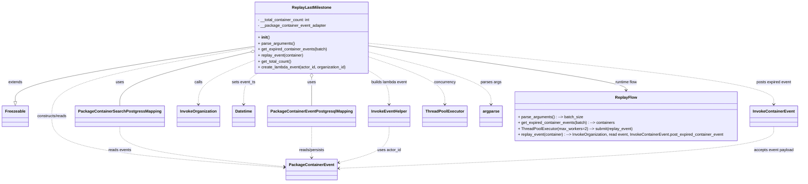

# Diagram: partview_core/partview_service/scripts/ReplayEvents.py

> Auto-generated by Obscura crawlers

## Mermaid

### SVG

<svg id="container" width="3151.3359375" xmlns="http://www.w3.org/2000/svg" class="classDiagram" height="734" viewBox="0 0 3151.3359375 734" role="graphics-document document" aria-roledescription="class"><g><defs><marker id="container_class-aggregationStart" class="marker aggregation class" refX="18" refY="7" markerWidth="190" markerHeight="240" orient="auto"><path d="M 18,7 L9,13 L1,7 L9,1 Z"></path></marker></defs><defs><marker id="container_class-aggregationEnd" class="marker aggregation class" refX="1" refY="7" markerWidth="20" markerHeight="28" orient="auto"><path d="M 18,7 L9,13 L1,7 L9,1 Z"></path></marker></defs><defs><marker id="container_class-extensionStart" class="marker extension class" refX="18" refY="7" markerWidth="190" markerHeight="240" orient="auto"><path d="M 1,7 L18,13 V 1 Z"></path></marker></defs><defs><marker id="container_class-extensionEnd" class="marker extension class" refX="1" refY="7" markerWidth="20" markerHeight="28" orient="auto"><path d="M 1,1 V 13 L18,7 Z"></path></marker></defs><defs><marker id="container_class-compositionStart" class="marker composition class" refX="18" refY="7" markerWidth="190" markerHeight="240" orient="auto"><path d="M 18,7 L9,13 L1,7 L9,1 Z"></path></marker></defs><defs><marker id="container_class-compositionEnd" class="marker composition class" refX="1" refY="7" markerWidth="20" markerHeight="28" orient="auto"><path d="M 18,7 L9,13 L1,7 L9,1 Z"></path></marker></defs><defs><marker id="container_class-dependencyStart" class="marker dependency class" refX="6" refY="7" markerWidth="190" markerHeight="240" orient="auto"><path d="M 5,7 L9,13 L1,7 L9,1 Z"></path></marker></defs><defs><marker id="container_class-dependencyEnd" class="marker dependency class" refX="13" refY="7" markerWidth="20" markerHeight="28" orient="auto"><path d="M 18,7 L9,13 L14,7 L9,1 Z"></path></marker></defs><defs><marker id="container_class-lollipopStart" class="marker lollipop class" refX="13" refY="7" markerWidth="190" markerHeight="240" orient="auto"><circle stroke="black" fill="transparent" cx="7" cy="7" r="6"></circle></marker></defs><defs><marker id="container_class-lollipopEnd" class="marker lollipop class" refX="1" refY="7" markerWidth="190" markerHeight="240" orient="auto"><circle stroke="black" fill="transparent" cx="7" cy="7" r="6"></circle></marker></defs><g class="root"><g class="clusters"></g><g class="edgePaths"><path d="M988.445,187.763L833.57,211.969C678.695,236.176,368.945,284.588,214.07,321.586C59.195,358.583,59.195,384.167,59.195,396.958L59.195,409.75" id="id_ReplayLastMilestone_Freezeable_1" class="edge-thickness-normal edge-pattern-solid relation" style=";;;" data-edge="true" data-et="edge" data-id="id_ReplayLastMilestone_Freezeable_1" data-points="W3sieCI6OTg4LjQ0NTMxMjUsInkiOjE4Ny43NjMzNTIyODk5NzU5fSx7IngiOjU5LjE5NTMxMjUsInkiOjMzM30seyJ4Ijo1OS4xOTUzMTI1LCJ5Ijo0Mjd9XQ==" marker-end="url(#container_class-extensionEnd)"></path><path d="M1217.266,313.25L1217.266,316.542C1217.266,319.833,1217.266,326.417,1217.266,345.375C1217.266,364.333,1217.266,395.667,1217.266,411.333L1217.266,427" id="id_ReplayLastMilestone_PackageContainerEventPostgresqlMapping_2" class="edge-thickness-normal edge-pattern-solid relation" style=";;;" data-edge="true" data-et="edge" data-id="id_ReplayLastMilestone_PackageContainerEventPostgresqlMapping_2" data-points="W3sieCI6MTIxNy4yNjU2MjUsInkiOjI5Nn0seyJ4IjoxMjE3LjI2NTYyNSwieSI6MzMzfSx7IngiOjEyMTcuMjY1NjI1LCJ5Ijo0Mjd9XQ==" marker-start="url(#container_class-aggregationStart)"></path><path d="M971.684,211.733L888.59,231.944C805.495,252.155,639.306,292.578,556.212,328.456C473.117,364.333,473.117,395.667,473.117,411.333L473.117,427" id="id_ReplayLastMilestone_PackageContainerSearchPostgressMapping_3" class="edge-thickness-normal edge-pattern-solid relation" style=";;;" data-edge="true" data-et="edge" data-id="id_ReplayLastMilestone_PackageContainerSearchPostgressMapping_3" data-points="W3sieCI6OTg4LjQ0NTMxMjUsInkiOjIwNy42NTYyMDMwODQ0ODIwNn0seyJ4Ijo0NzMuMTE3MTg3NSwieSI6MzMzfSx7IngiOjQ3My4xMTcxODc1LCJ5Ijo0Mjd9XQ==" marker-start="url(#container_class-aggregationStart)"></path><path d="M988.445,245.722L952.931,260.269C917.417,274.815,846.388,303.907,810.874,333.12C775.359,362.333,775.359,391.667,775.359,406.333L775.359,421" id="id_ReplayLastMilestone_InvokeOrganization_4" class="edge-thickness-normal edge-pattern-dashed relation" style=";;;" data-edge="true" data-et="edge" data-id="id_ReplayLastMilestone_InvokeOrganization_4" data-points="W3sieCI6OTg4LjQ0NTMxMjUsInkiOjI0NS43MjIzMTQ1NDYzNTQ1N30seyJ4Ijo3NzUuMzU5Mzc1LCJ5IjozMzN9LHsieCI6Nzc1LjM1OTM3NSwieSI6NDI3fV0=" marker-end="url(#container_class-dependencyEnd)"></path><path d="M988.445,193.002L858.23,216.335C728.016,239.668,467.586,286.334,337.371,332.334C207.156,378.333,207.156,423.667,207.156,469C207.156,514.333,207.156,559.667,358.235,594.149C509.313,628.632,811.471,652.263,962.549,664.079L1113.628,675.895" id="id_ReplayLastMilestone_PackageContainerEvent_5" class="edge-thickness-normal edge-pattern-dashed relation" style=";;;" data-edge="true" data-et="edge" data-id="id_ReplayLastMilestone_PackageContainerEvent_5" data-points="W3sieCI6OTg4LjQ0NTMxMjUsInkiOjE5My4wMDE5NzIyNDkyOTIzfSx7IngiOjIwNy4xNTYyNSwieSI6MzMzfSx7IngiOjIwNy4xNTYyNSwieSI6NDY5fSx7IngiOjIwNy4xNTYyNSwieSI6NjA1fSx7IngiOjExMTkuNjA5Mzc1LCJ5Ijo2NzYuMzYyMzY3OTM2NjQwNn1d" marker-end="url(#container_class-dependencyEnd)"></path><path d="M1007.661,296L998.685,302.167C989.709,308.333,971.757,320.667,962.781,341.5C953.805,362.333,953.805,391.667,953.805,406.333L953.805,421" id="id_ReplayLastMilestone_Datetime_6" class="edge-thickness-normal edge-pattern-dashed relation" style=";;;" data-edge="true" data-et="edge" data-id="id_ReplayLastMilestone_Datetime_6" data-points="W3sieCI6MTAwNy42NjEzNDMyMzIwNDQxLCJ5IjoyOTZ9LHsieCI6OTUzLjgwNDY4NzUsInkiOjMzM30seyJ4Ijo5NTMuODA0Njg3NSwieSI6NDI3fV0=" marker-end="url(#container_class-dependencyEnd)"></path><path d="M1446.086,290.448L1457.807,297.54C1469.529,304.632,1492.971,318.816,1504.693,340.575C1516.414,362.333,1516.414,391.667,1516.414,406.333L1516.414,421" id="id_ReplayLastMilestone_InvokeEventHelper_7" class="edge-thickness-normal edge-pattern-dashed relation" style=";;;" data-edge="true" data-et="edge" data-id="id_ReplayLastMilestone_InvokeEventHelper_7" data-points="W3sieCI6MTQ0Ni4wODU5Mzc1LCJ5IjoyOTAuNDQ3OTEyMDQxOTk0Mn0seyJ4IjoxNTE2LjQxNDA2MjUsInkiOjMzM30seyJ4IjoxNTE2LjQxNDA2MjUsInkiOjQyN31d" marker-end="url(#container_class-dependencyEnd)"></path><path d="M1446.086,174.584L1713.6,200.986C1981.115,227.389,2516.143,280.195,2783.658,321.264C3051.172,362.333,3051.172,391.667,3051.172,406.333L3051.172,421" id="id_ReplayLastMilestone_InvokeContainerEvent_8" class="edge-thickness-normal edge-pattern-dashed relation" style=";;;" data-edge="true" data-et="edge" data-id="id_ReplayLastMilestone_InvokeContainerEvent_8" data-points="W3sieCI6MTQ0Ni4wODU5Mzc1LCJ5IjoxNzQuNTgzNzQ3OTc2NDg0NjN9LHsieCI6MzA1MS4xNzE4NzUsInkiOjMzM30seyJ4IjozMDUxLjE3MTg3NSwieSI6NDI3fV0=" marker-end="url(#container_class-dependencyEnd)"></path><path d="M1446.086,232.309L1493.901,249.091C1541.716,265.873,1637.346,299.436,1685.161,330.885C1732.977,362.333,1732.977,391.667,1732.977,406.333L1732.977,421" id="id_ReplayLastMilestone_ThreadPoolExecutor_9" class="edge-thickness-normal edge-pattern-dashed relation" style=";;;" data-edge="true" data-et="edge" data-id="id_ReplayLastMilestone_ThreadPoolExecutor_9" data-points="W3sieCI6MTQ0Ni4wODU5Mzc1LCJ5IjoyMzIuMzA5NDc4NzIzMjQzMX0seyJ4IjoxNzMyLjk3NjU2MjUsInkiOjMzM30seyJ4IjoxNzMyLjk3NjU2MjUsInkiOjQyN31d" marker-end="url(#container_class-dependencyEnd)"></path><path d="M1446.086,211.543L1523.878,231.786C1601.669,252.029,1757.253,292.514,1835.044,327.424C1912.836,362.333,1912.836,391.667,1912.836,406.333L1912.836,421" id="id_ReplayLastMilestone_argparse_10" class="edge-thickness-normal edge-pattern-dashed relation" style=";;;" data-edge="true" data-et="edge" data-id="id_ReplayLastMilestone_argparse_10" data-points="W3sieCI6MTQ0Ni4wODU5Mzc1LCJ5IjoyMTEuNTQzMTkxODUwMjEyODV9LHsieCI6MTkxMi44MzU5Mzc1LCJ5IjozMzN9LHsieCI6MTkxMi44MzU5Mzc1LCJ5Ijo0Mjd9XQ==" marker-end="url(#container_class-dependencyEnd)"></path><path d="M473.117,511L473.117,526.667C473.117,542.333,473.117,573.667,579.871,600.667C686.626,627.666,900.134,650.333,1006.889,661.666L1113.643,672.999" id="id_PackageContainerSearchPostgressMapping_PackageContainerEvent_11" class="edge-thickness-normal edge-pattern-dashed relation" style=";;;" data-edge="true" data-et="edge" data-id="id_PackageContainerSearchPostgressMapping_PackageContainerEvent_11" data-points="W3sieCI6NDczLjExNzE4NzUsInkiOjUxMX0seyJ4Ijo0NzMuMTE3MTg3NSwieSI6NjA1fSx7IngiOjExMTkuNjA5Mzc1LCJ5Ijo2NzMuNjMyNjU0Nzc1Mjc4fV0=" marker-end="url(#container_class-dependencyEnd)"></path><path d="M1217.266,511L1217.266,526.667C1217.266,542.333,1217.266,573.667,1217.266,594.5C1217.266,615.333,1217.266,625.667,1217.266,630.833L1217.266,636" id="id_PackageContainerEventPostgresqlMapping_PackageContainerEvent_12" class="edge-thickness-normal edge-pattern-dashed relation" style=";;;" data-edge="true" data-et="edge" data-id="id_PackageContainerEventPostgresqlMapping_PackageContainerEvent_12" data-points="W3sieCI6MTIxNy4yNjU2MjUsInkiOjUxMX0seyJ4IjoxMjE3LjI2NTYyNSwieSI6NjA1fSx7IngiOjEyMTcuMjY1NjI1LCJ5Ijo2NDJ9XQ==" marker-end="url(#container_class-dependencyEnd)"></path><path d="M1516.414,511L1516.414,526.667C1516.414,542.333,1516.414,573.667,1483.799,597.946C1451.184,622.226,1385.953,639.452,1353.338,648.066L1320.723,656.679" id="id_InvokeEventHelper_PackageContainerEvent_13" class="edge-thickness-normal edge-pattern-dashed relation" style=";;;" data-edge="true" data-et="edge" data-id="id_InvokeEventHelper_PackageContainerEvent_13" data-points="W3sieCI6MTUxNi40MTQwNjI1LCJ5Ijo1MTF9LHsieCI6MTUxNi40MTQwNjI1LCJ5Ijo2MDV9LHsieCI6MTMxNC45MjE4NzUsInkiOjY1OC4yMTA2NTAwMjIxOTg1fV0=" marker-end="url(#container_class-dependencyEnd)"></path><path d="M3051.172,511L3051.172,526.667C3051.172,542.333,3051.172,573.667,2762.796,601.756C2474.42,629.845,1897.668,654.69,1609.292,667.112L1320.916,679.535" id="id_InvokeContainerEvent_PackageContainerEvent_14" class="edge-thickness-normal edge-pattern-dashed relation" style=";;;" data-edge="true" data-et="edge" data-id="id_InvokeContainerEvent_PackageContainerEvent_14" data-points="W3sieCI6MzA1MS4xNzE4NzUsInkiOjUxMX0seyJ4IjozMDUxLjE3MTg3NSwieSI6NjA1fSx7IngiOjEzMTQuOTIxODc1LCJ5Ijo2NzkuNzkzMjE4MDI4NDU3fV0=" marker-end="url(#container_class-dependencyEnd)"></path><path d="M1446.086,185.378L1614.757,209.981C1783.428,234.585,2120.771,283.793,2289.442,313.563C2458.113,343.333,2458.113,353.667,2458.113,358.833L2458.113,364" id="id_ReplayLastMilestone_ReplayFlow_15" class="edge-thickness-normal edge-pattern-solid relation" style=";;;" data-edge="true" data-et="edge" data-id="id_ReplayLastMilestone_ReplayFlow_15" data-points="W3sieCI6MTQ0Ni4wODU5Mzc1LCJ5IjoxODUuMzc3NTY3NjI3OTc2MDh9LHsieCI6MjQ1OC4xMTMyODEyNSwieSI6MzMzfSx7IngiOjI0NTguMTEzMjgxMjUsInkiOjM3MH1d" marker-end="url(#container_class-dependencyEnd)"></path></g><g class="edgeLabels"><g class="edgeLabel" transform="translate(59.1953125, 333)"><g class="label" data-id="id_ReplayLastMilestone_Freezeable_1" transform="translate(-28.5078125, -12)"><foreignObject width="57.015625" height="24">

extends

</foreignObject></g></g><g class="edgeLabel" transform="translate(1217.265625, 333)"><g class="label" data-id="id_ReplayLastMilestone_PackageContainerEventPostgresqlMapping_2" transform="translate(-16.4921875, -12)"><foreignObject width="32.984375" height="24">

uses

</foreignObject></g></g><g class="edgeLabel" transform="translate(473.1171875, 333)"><g class="label" data-id="id_ReplayLastMilestone_PackageContainerSearchPostgressMapping_3" transform="translate(-16.4921875, -12)"><foreignObject width="32.984375" height="24">

uses

</foreignObject></g></g><g class="edgeLabel" transform="translate(775.359375, 333)"><g class="label" data-id="id_ReplayLastMilestone_InvokeOrganization_4" transform="translate(-16.4453125, -12)"><foreignObject width="32.890625" height="24">

calls

</foreignObject></g></g><g class="edgeLabel" transform="translate(207.15625, 469)"><g class="label" data-id="id_ReplayLastMilestone_PackageContainerEvent_5" transform="translate(-61.765625, -12)"><foreignObject width="123.53125" height="24">

constructs/reads

</foreignObject></g></g><g class="edgeLabel" transform="translate(953.8046875, 333)"><g class="label" data-id="id_ReplayLastMilestone_Datetime_6" transform="translate(-47.6328125, -12)"><foreignObject width="95.265625" height="24">

sets event_ts

</foreignObject></g></g><g class="edgeLabel" transform="translate(1516.4140625, 333)"><g class="label" data-id="id_ReplayLastMilestone_InvokeEventHelper_7" transform="translate(-74.296875, -12)"><foreignObject width="148.59375" height="24">

builds lambda event

</foreignObject></g></g><g class="edgeLabel" transform="translate(3051.171875, 333)"><g class="label" data-id="id_ReplayLastMilestone_InvokeContainerEvent_8" transform="translate(-71.3671875, -12)"><foreignObject width="142.734375" height="24">

posts expired event

</foreignObject></g></g><g class="edgeLabel" transform="translate(1732.9765625, 333)"><g class="label" data-id="id_ReplayLastMilestone_ThreadPoolExecutor_9" transform="translate(-44.171875, -12)"><foreignObject width="88.34375" height="24">

concurrency

</foreignObject></g></g><g class="edgeLabel" transform="translate(1912.8359375, 333)"><g class="label" data-id="id_ReplayLastMilestone_argparse_10" transform="translate(-41.109375, -12)"><foreignObject width="82.21875" height="24">

parses args

</foreignObject></g></g><g class="edgeLabel" transform="translate(473.1171875, 605)"><g class="label" data-id="id_PackageContainerSearchPostgressMapping_PackageContainerEvent_11" transform="translate(-46.03125, -12)"><foreignObject width="92.0625" height="24">

reads events

</foreignObject></g></g><g class="edgeLabel" transform="translate(1217.265625, 605)"><g class="label" data-id="id_PackageContainerEventPostgresqlMapping_PackageContainerEvent_12" transform="translate(-52.359375, -12)"><foreignObject width="104.71875" height="24">

reads/persists

</foreignObject></g></g><g class="edgeLabel" transform="translate(1516.4140625, 605)"><g class="label" data-id="id_InvokeEventHelper_PackageContainerEvent_13" transform="translate(-47.875, -12)"><foreignObject width="95.75" height="24">

uses actor_id

</foreignObject></g></g><g class="edgeLabel" transform="translate(3051.171875, 605)"><g class="label" data-id="id_InvokeContainerEvent_PackageContainerEvent_14" transform="translate(-80.703125, -12)"><foreignObject width="161.40625" height="24">

accepts event payload

</foreignObject></g></g><g class="edgeLabel" transform="translate(2458.11328125, 333)"><g class="label" data-id="id_ReplayLastMilestone_ReplayFlow_15" transform="translate(-46.0234375, -12)"><foreignObject width="92.046875" height="24">

runtime flow

</foreignObject></g></g></g><g class="nodes"><g class="node default" id="classId-ReplayLastMilestone-0" transform="translate(1217.265625, 152)"><g class="basic label-container"><path d="M-228.8203125 -144 L228.8203125 -144 L228.8203125 144 L-228.8203125 144" stroke="none" stroke-width="0" fill="#ECECFF" style=""></path><path d="M-228.8203125 -144 C-119.29805960074901 -144, -9.775806701498027 -144, 228.8203125 -144 M-228.8203125 -144 C-118.49018146494178 -144, -8.160050429883569 -144, 228.8203125 -144 M228.8203125 -144 C228.8203125 -69.38128128306121, 228.8203125 5.237437433877574, 228.8203125 144 M228.8203125 -144 C228.8203125 -68.61341568891368, 228.8203125 6.773168622172648, 228.8203125 144 M228.8203125 144 C70.56718783271566 144, -87.68593683456868 144, -228.8203125 144 M228.8203125 144 C117.31350423227563 144, 5.806695964551267 144, -228.8203125 144 M-228.8203125 144 C-228.8203125 74.77506682205863, -228.8203125 5.550133644117267, -228.8203125 -144 M-228.8203125 144 C-228.8203125 80.5682885051974, -228.8203125 17.136577010394802, -228.8203125 -144" stroke="#9370DB" stroke-width="1.3" fill="none" stroke-dasharray="0 0" style=""></path></g><g class="annotation-group text" transform="translate(0, -120)"></g><g class="label-group text" transform="translate(-75.84375, -120)"><g class="label" style="font-weight: bolder" transform="translate(0,-12)"><foreignObject width="151.6875" height="24">

ReplayLastMilestone

</foreignObject></g></g><g class="members-group text" transform="translate(-216.8203125, -72)"><g class="label" style="" transform="translate(0,-12)"><foreignObject width="213.5" height="24">

- __total_container_count: int

</foreignObject></g><g class="label" style="" transform="translate(0,12)"><foreignObject width="275" height="24">

- __package_container_event_adapter

</foreignObject></g></g><g class="methods-group text" transform="translate(-216.8203125, 0)"><g class="label" style="" transform="translate(0,-12)"><foreignObject width="47.046875" height="24">

+ <strong>init</strong>()

</foreignObject></g><g class="label" style="" transform="translate(0,12)"><foreignObject width="147.625" height="24">

+ parse_arguments()

</foreignObject></g><g class="label" style="" transform="translate(0,36)"><foreignObject width="279.828125" height="24">

+ get_expired_container_events(batch)

</foreignObject></g><g class="label" style="" transform="translate(0,60)"><foreignObject width="184.515625" height="24">

+ replay_event(container)

</foreignObject></g><g class="label" style="" transform="translate(0,84)"><foreignObject width="136.078125" height="24">

+ get_total_count()

</foreignObject></g><g class="label" style="" transform="translate(0,108)"><foreignObject width="357.796875" height="24">

+ create_lambda_event(actor_id, organization_id)

</foreignObject></g></g><g class="divider" style=""><path d="M-228.8203125 -96 C-81.51563019087715 -96, 65.7890521182457 -96, 228.8203125 -96 M-228.8203125 -96 C-97.66429966527548 -96, 33.49171316944904 -96, 228.8203125 -96" stroke="#9370DB" stroke-width="1.3" fill="none" stroke-dasharray="0 0" style=""></path></g><g class="divider" style=""><path d="M-228.8203125 -24 C-110.78553265361192 -24, 7.249247192776153 -24, 228.8203125 -24 M-228.8203125 -24 C-57.1547419319603 -24, 114.5108286360794 -24, 228.8203125 -24" stroke="#9370DB" stroke-width="1.3" fill="none" stroke-dasharray="0 0" style=""></path></g></g><g class="node default" id="classId-Freezeable-1" transform="translate(59.1953125, 469)"><g class="basic label-container"><path d="M-51.1953125 -42 L51.1953125 -42 L51.1953125 42 L-51.1953125 42" stroke="none" stroke-width="0" fill="#ECECFF" style=""></path><path d="M-51.1953125 -42 C-27.887868665482124 -42, -4.5804248309642475 -42, 51.1953125 -42 M-51.1953125 -42 C-29.811600657742677 -42, -8.427888815485353 -42, 51.1953125 -42 M51.1953125 -42 C51.1953125 -24.226674916647145, 51.1953125 -6.45334983329429, 51.1953125 42 M51.1953125 -42 C51.1953125 -9.434665069246236, 51.1953125 23.130669861507528, 51.1953125 42 M51.1953125 42 C21.18588940638099 42, -8.823533687238019 42, -51.1953125 42 M51.1953125 42 C18.549738902942323 42, -14.095834694115354 42, -51.1953125 42 M-51.1953125 42 C-51.1953125 11.111891075429924, -51.1953125 -19.776217849140153, -51.1953125 -42 M-51.1953125 42 C-51.1953125 11.104010566537141, -51.1953125 -19.791978866925717, -51.1953125 -42" stroke="#9370DB" stroke-width="1.3" fill="none" stroke-dasharray="0 0" style=""></path></g><g class="annotation-group text" transform="translate(0, -18)"></g><g class="label-group text" transform="translate(-39.1953125, -18)"><g class="label" style="font-weight: bolder" transform="translate(0,-12)"><foreignObject width="78.390625" height="24">

Freezeable

</foreignObject></g></g><g class="members-group text" transform="translate(-39.1953125, 30)"></g><g class="methods-group text" transform="translate(-39.1953125, 60)"></g><g class="divider" style=""><path d="M-51.1953125 6 C-30.531487582075503 6, -9.867662664151005 6, 51.1953125 6 M-51.1953125 6 C-29.512127780294183 6, -7.828943060588365 6, 51.1953125 6" stroke="#9370DB" stroke-width="1.3" fill="none" stroke-dasharray="0 0" style=""></path></g><g class="divider" style=""><path d="M-51.1953125 24 C-22.656181860594163 24, 5.882948778811674 24, 51.1953125 24 M-51.1953125 24 C-21.290607341769164 24, 8.614097816461673 24, 51.1953125 24" stroke="#9370DB" stroke-width="1.3" fill="none" stroke-dasharray="0 0" style=""></path></g></g><g class="node default" id="classId-PackageContainerEventPostgresqlMapping-2" transform="translate(1217.265625, 469)"><g class="basic label-container"><path d="M-168.0625 -42 L168.0625 -42 L168.0625 42 L-168.0625 42" stroke="none" stroke-width="0" fill="#ECECFF" style=""></path><path d="M-168.0625 -42 C-56.627704307050635 -42, 54.80709138589873 -42, 168.0625 -42 M-168.0625 -42 C-66.05219617425729 -42, 35.95810765148542 -42, 168.0625 -42 M168.0625 -42 C168.0625 -16.877514334454414, 168.0625 8.244971331091172, 168.0625 42 M168.0625 -42 C168.0625 -12.166848803475688, 168.0625 17.666302393048625, 168.0625 42 M168.0625 42 C93.64303511010101 42, 19.22357022020202 42, -168.0625 42 M168.0625 42 C52.46249837158828 42, -63.137503256823436 42, -168.0625 42 M-168.0625 42 C-168.0625 15.748011325847731, -168.0625 -10.503977348304538, -168.0625 -42 M-168.0625 42 C-168.0625 16.957726487263415, -168.0625 -8.08454702547317, -168.0625 -42" stroke="#9370DB" stroke-width="1.3" fill="none" stroke-dasharray="0 0" style=""></path></g><g class="annotation-group text" transform="translate(0, -18)"></g><g class="label-group text" transform="translate(-156.0625, -18)"><g class="label" style="font-weight: bolder" transform="translate(0,-12)"><foreignObject width="312.125" height="24">

PackageContainerEventPostgresqlMapping

</foreignObject></g></g><g class="members-group text" transform="translate(-156.0625, 30)"></g><g class="methods-group text" transform="translate(-156.0625, 60)"></g><g class="divider" style=""><path d="M-168.0625 6 C-40.29609280825372 6, 87.47031438349256 6, 168.0625 6 M-168.0625 6 C-37.90869483235625 6, 92.2451103352875 6, 168.0625 6" stroke="#9370DB" stroke-width="1.3" fill="none" stroke-dasharray="0 0" style=""></path></g><g class="divider" style=""><path d="M-168.0625 24 C-85.95191249794657 24, -3.8413249958931317 24, 168.0625 24 M-168.0625 24 C-98.49052808454495 24, -28.918556169089896 24, 168.0625 24" stroke="#9370DB" stroke-width="1.3" fill="none" stroke-dasharray="0 0" style=""></path></g></g><g class="node default" id="classId-PackageContainerSearchPostgressMapping-3" transform="translate(473.1171875, 469)"><g class="basic label-container"><path d="M-169.1953125 -42 L169.1953125 -42 L169.1953125 42 L-169.1953125 42" stroke="none" stroke-width="0" fill="#ECECFF" style=""></path><path d="M-169.1953125 -42 C-61.172908064112576 -42, 46.84949637177485 -42, 169.1953125 -42 M-169.1953125 -42 C-86.99457662656702 -42, -4.793840753134049 -42, 169.1953125 -42 M169.1953125 -42 C169.1953125 -12.643149020898615, 169.1953125 16.71370195820277, 169.1953125 42 M169.1953125 -42 C169.1953125 -19.06999550051156, 169.1953125 3.8600089989768804, 169.1953125 42 M169.1953125 42 C51.47621137526012 42, -66.24288974947976 42, -169.1953125 42 M169.1953125 42 C53.38112048853485 42, -62.433071522930305 42, -169.1953125 42 M-169.1953125 42 C-169.1953125 20.84028586686471, -169.1953125 -0.3194282662705774, -169.1953125 -42 M-169.1953125 42 C-169.1953125 15.530184257608369, -169.1953125 -10.939631484783263, -169.1953125 -42" stroke="#9370DB" stroke-width="1.3" fill="none" stroke-dasharray="0 0" style=""></path></g><g class="annotation-group text" transform="translate(0, -18)"></g><g class="label-group text" transform="translate(-157.1953125, -18)"><g class="label" style="font-weight: bolder" transform="translate(0,-12)"><foreignObject width="314.390625" height="24">

PackageContainerSearchPostgressMapping

</foreignObject></g></g><g class="members-group text" transform="translate(-157.1953125, 30)"></g><g class="methods-group text" transform="translate(-157.1953125, 60)"></g><g class="divider" style=""><path d="M-169.1953125 6 C-65.3019906604125 6, 38.591331179175 6, 169.1953125 6 M-169.1953125 6 C-92.5140786500005 6, -15.832844800000998 6, 169.1953125 6" stroke="#9370DB" stroke-width="1.3" fill="none" stroke-dasharray="0 0" style=""></path></g><g class="divider" style=""><path d="M-169.1953125 24 C-72.12956046424101 24, 24.93619157151798 24, 169.1953125 24 M-169.1953125 24 C-89.54771594961487 24, -9.900119399229737 24, 169.1953125 24" stroke="#9370DB" stroke-width="1.3" fill="none" stroke-dasharray="0 0" style=""></path></g></g><g class="node default" id="classId-InvokeOrganization-4" transform="translate(775.359375, 469)"><g class="basic label-container"><path d="M-83.046875 -42 L83.046875 -42 L83.046875 42 L-83.046875 42" stroke="none" stroke-width="0" fill="#ECECFF" style=""></path><path d="M-83.046875 -42 C-47.60713346815482 -42, -12.167391936309642 -42, 83.046875 -42 M-83.046875 -42 C-20.17430388407513 -42, 42.69826723184974 -42, 83.046875 -42 M83.046875 -42 C83.046875 -10.565446472222572, 83.046875 20.869107055554856, 83.046875 42 M83.046875 -42 C83.046875 -22.850820185087073, 83.046875 -3.7016403701741467, 83.046875 42 M83.046875 42 C46.602078192116586 42, 10.157281384233173 42, -83.046875 42 M83.046875 42 C27.32590314868404 42, -28.395068702631917 42, -83.046875 42 M-83.046875 42 C-83.046875 22.82510888841586, -83.046875 3.6502177768317168, -83.046875 -42 M-83.046875 42 C-83.046875 14.013031622005585, -83.046875 -13.97393675598883, -83.046875 -42" stroke="#9370DB" stroke-width="1.3" fill="none" stroke-dasharray="0 0" style=""></path></g><g class="annotation-group text" transform="translate(0, -18)"></g><g class="label-group text" transform="translate(-71.046875, -18)"><g class="label" style="font-weight: bolder" transform="translate(0,-12)"><foreignObject width="142.09375" height="24">

InvokeOrganization

</foreignObject></g></g><g class="members-group text" transform="translate(-71.046875, 30)"></g><g class="methods-group text" transform="translate(-71.046875, 60)"></g><g class="divider" style=""><path d="M-83.046875 6 C-42.66563241423197 6, -2.2843898284639437 6, 83.046875 6 M-83.046875 6 C-38.125663995916874 6, 6.795547008166253 6, 83.046875 6" stroke="#9370DB" stroke-width="1.3" fill="none" stroke-dasharray="0 0" style=""></path></g><g class="divider" style=""><path d="M-83.046875 24 C-32.432801644580266 24, 18.181271710839468 24, 83.046875 24 M-83.046875 24 C-45.3265385682156 24, -7.606202136431193 24, 83.046875 24" stroke="#9370DB" stroke-width="1.3" fill="none" stroke-dasharray="0 0" style=""></path></g></g><g class="node default" id="classId-PackageContainerEvent-5" transform="translate(1217.265625, 684)"><g class="basic label-container"><path d="M-97.65625 -42 L97.65625 -42 L97.65625 42 L-97.65625 42" stroke="none" stroke-width="0" fill="#ECECFF" style=""></path><path d="M-97.65625 -42 C-26.19678321356689 -42, 45.26268357286622 -42, 97.65625 -42 M-97.65625 -42 C-48.77171387253713 -42, 0.11282225492574582 -42, 97.65625 -42 M97.65625 -42 C97.65625 -11.377982987600433, 97.65625 19.244034024799134, 97.65625 42 M97.65625 -42 C97.65625 -11.82273302516128, 97.65625 18.35453394967744, 97.65625 42 M97.65625 42 C41.96358000485063 42, -13.729089990298746 42, -97.65625 42 M97.65625 42 C24.020528177426186 42, -49.61519364514763 42, -97.65625 42 M-97.65625 42 C-97.65625 15.811936686238862, -97.65625 -10.376126627522275, -97.65625 -42 M-97.65625 42 C-97.65625 20.89770825069356, -97.65625 -0.20458349861287672, -97.65625 -42" stroke="#9370DB" stroke-width="1.3" fill="none" stroke-dasharray="0 0" style=""></path></g><g class="annotation-group text" transform="translate(0, -18)"></g><g class="label-group text" transform="translate(-85.65625, -18)"><g class="label" style="font-weight: bolder" transform="translate(0,-12)"><foreignObject width="171.3125" height="24">

PackageContainerEvent

</foreignObject></g></g><g class="members-group text" transform="translate(-85.65625, 30)"></g><g class="methods-group text" transform="translate(-85.65625, 60)"></g><g class="divider" style=""><path d="M-97.65625 6 C-45.361446389404165 6, 6.93335722119167 6, 97.65625 6 M-97.65625 6 C-48.25369399914533 6, 1.1488620017093467 6, 97.65625 6" stroke="#9370DB" stroke-width="1.3" fill="none" stroke-dasharray="0 0" style=""></path></g><g class="divider" style=""><path d="M-97.65625 24 C-55.06728533959176 24, -12.478320679183525 24, 97.65625 24 M-97.65625 24 C-50.754807957916434 24, -3.8533659158328675 24, 97.65625 24" stroke="#9370DB" stroke-width="1.3" fill="none" stroke-dasharray="0 0" style=""></path></g></g><g class="node default" id="classId-Datetime-6" transform="translate(953.8046875, 469)"><g class="basic label-container"><path d="M-45.3984375 -42 L45.3984375 -42 L45.3984375 42 L-45.3984375 42" stroke="none" stroke-width="0" fill="#ECECFF" style=""></path><path d="M-45.3984375 -42 C-23.64730655217231 -42, -1.89617560434462 -42, 45.3984375 -42 M-45.3984375 -42 C-15.672831159417267 -42, 14.052775181165465 -42, 45.3984375 -42 M45.3984375 -42 C45.3984375 -15.258656854037465, 45.3984375 11.48268629192507, 45.3984375 42 M45.3984375 -42 C45.3984375 -17.74787794763136, 45.3984375 6.504244104737282, 45.3984375 42 M45.3984375 42 C20.916278175966557 42, -3.565881148066886 42, -45.3984375 42 M45.3984375 42 C25.477232583083868 42, 5.556027666167736 42, -45.3984375 42 M-45.3984375 42 C-45.3984375 22.035471793929517, -45.3984375 2.070943587859034, -45.3984375 -42 M-45.3984375 42 C-45.3984375 13.663682592172616, -45.3984375 -14.672634815654767, -45.3984375 -42" stroke="#9370DB" stroke-width="1.3" fill="none" stroke-dasharray="0 0" style=""></path></g><g class="annotation-group text" transform="translate(0, -18)"></g><g class="label-group text" transform="translate(-33.3984375, -18)"><g class="label" style="font-weight: bolder" transform="translate(0,-12)"><foreignObject width="66.796875" height="24">

Datetime

</foreignObject></g></g><g class="members-group text" transform="translate(-33.3984375, 30)"></g><g class="methods-group text" transform="translate(-33.3984375, 60)"></g><g class="divider" style=""><path d="M-45.3984375 6 C-24.336440119992986 6, -3.2744427399859717 6, 45.3984375 6 M-45.3984375 6 C-26.751059090624736 6, -8.103680681249472 6, 45.3984375 6" stroke="#9370DB" stroke-width="1.3" fill="none" stroke-dasharray="0 0" style=""></path></g><g class="divider" style=""><path d="M-45.3984375 24 C-10.07987974809543 24, 25.23867800380914 24, 45.3984375 24 M-45.3984375 24 C-16.292277667454186 24, 12.813882165091627 24, 45.3984375 24" stroke="#9370DB" stroke-width="1.3" fill="none" stroke-dasharray="0 0" style=""></path></g></g><g class="node default" id="classId-InvokeEventHelper-7" transform="translate(1516.4140625, 469)"><g class="basic label-container"><path d="M-81.0859375 -42 L81.0859375 -42 L81.0859375 42 L-81.0859375 42" stroke="none" stroke-width="0" fill="#ECECFF" style=""></path><path d="M-81.0859375 -42 C-48.51124990970686 -42, -15.936562319413724 -42, 81.0859375 -42 M-81.0859375 -42 C-46.937739022289186 -42, -12.789540544578372 -42, 81.0859375 -42 M81.0859375 -42 C81.0859375 -24.635651370543005, 81.0859375 -7.271302741086011, 81.0859375 42 M81.0859375 -42 C81.0859375 -9.419001698303077, 81.0859375 23.161996603393845, 81.0859375 42 M81.0859375 42 C29.976045683464562 42, -21.133846133070875 42, -81.0859375 42 M81.0859375 42 C42.854103716672334 42, 4.622269933344668 42, -81.0859375 42 M-81.0859375 42 C-81.0859375 9.45211903995223, -81.0859375 -23.09576192009554, -81.0859375 -42 M-81.0859375 42 C-81.0859375 13.685298494722222, -81.0859375 -14.629403010555556, -81.0859375 -42" stroke="#9370DB" stroke-width="1.3" fill="none" stroke-dasharray="0 0" style=""></path></g><g class="annotation-group text" transform="translate(0, -18)"></g><g class="label-group text" transform="translate(-69.0859375, -18)"><g class="label" style="font-weight: bolder" transform="translate(0,-12)"><foreignObject width="138.171875" height="24">

InvokeEventHelper

</foreignObject></g></g><g class="members-group text" transform="translate(-69.0859375, 30)"></g><g class="methods-group text" transform="translate(-69.0859375, 60)"></g><g class="divider" style=""><path d="M-81.0859375 6 C-41.01299414718412 6, -0.940050794368247 6, 81.0859375 6 M-81.0859375 6 C-21.281227696852298 6, 38.523482106295404 6, 81.0859375 6" stroke="#9370DB" stroke-width="1.3" fill="none" stroke-dasharray="0 0" style=""></path></g><g class="divider" style=""><path d="M-81.0859375 24 C-32.79631519459595 24, 15.493307110808104 24, 81.0859375 24 M-81.0859375 24 C-37.60564554930517 24, 5.874646401389654 24, 81.0859375 24" stroke="#9370DB" stroke-width="1.3" fill="none" stroke-dasharray="0 0" style=""></path></g></g><g class="node default" id="classId-InvokeContainerEvent-8" transform="translate(3051.171875, 469)"><g class="basic label-container"><path d="M-92.1640625 -42 L92.1640625 -42 L92.1640625 42 L-92.1640625 42" stroke="none" stroke-width="0" fill="#ECECFF" style=""></path><path d="M-92.1640625 -42 C-30.785723936884658 -42, 30.592614626230684 -42, 92.1640625 -42 M-92.1640625 -42 C-45.182975163191855 -42, 1.798112173616289 -42, 92.1640625 -42 M92.1640625 -42 C92.1640625 -19.73298505076039, 92.1640625 2.5340298984792184, 92.1640625 42 M92.1640625 -42 C92.1640625 -19.75402388168322, 92.1640625 2.4919522366335585, 92.1640625 42 M92.1640625 42 C41.56181416060091 42, -9.04043417879818 42, -92.1640625 42 M92.1640625 42 C23.73858501705824 42, -44.68689246588352 42, -92.1640625 42 M-92.1640625 42 C-92.1640625 10.288094068839957, -92.1640625 -21.423811862320086, -92.1640625 -42 M-92.1640625 42 C-92.1640625 22.361587053319376, -92.1640625 2.7231741066387514, -92.1640625 -42" stroke="#9370DB" stroke-width="1.3" fill="none" stroke-dasharray="0 0" style=""></path></g><g class="annotation-group text" transform="translate(0, -18)"></g><g class="label-group text" transform="translate(-80.1640625, -18)"><g class="label" style="font-weight: bolder" transform="translate(0,-12)"><foreignObject width="160.328125" height="24">

InvokeContainerEvent

</foreignObject></g></g><g class="members-group text" transform="translate(-80.1640625, 30)"></g><g class="methods-group text" transform="translate(-80.1640625, 60)"></g><g class="divider" style=""><path d="M-92.1640625 6 C-55.184539544924306 6, -18.20501658984861 6, 92.1640625 6 M-92.1640625 6 C-42.060035207332184 6, 8.043992085335631 6, 92.1640625 6" stroke="#9370DB" stroke-width="1.3" fill="none" stroke-dasharray="0 0" style=""></path></g><g class="divider" style=""><path d="M-92.1640625 24 C-22.195518861388848 24, 47.773024777222304 24, 92.1640625 24 M-92.1640625 24 C-25.542857089161956 24, 41.07834832167609 24, 92.1640625 24" stroke="#9370DB" stroke-width="1.3" fill="none" stroke-dasharray="0 0" style=""></path></g></g><g class="node default" id="classId-ThreadPoolExecutor-9" transform="translate(1732.9765625, 469)"><g class="basic label-container"><path d="M-85.4765625 -42 L85.4765625 -42 L85.4765625 42 L-85.4765625 42" stroke="none" stroke-width="0" fill="#ECECFF" style=""></path><path d="M-85.4765625 -42 C-20.439178954860353 -42, 44.598204590279295 -42, 85.4765625 -42 M-85.4765625 -42 C-39.22235591308067 -42, 7.031850673838662 -42, 85.4765625 -42 M85.4765625 -42 C85.4765625 -13.225844611753963, 85.4765625 15.548310776492073, 85.4765625 42 M85.4765625 -42 C85.4765625 -14.828591224198963, 85.4765625 12.342817551602074, 85.4765625 42 M85.4765625 42 C36.59521667646959 42, -12.28612914706082 42, -85.4765625 42 M85.4765625 42 C27.052161038439777 42, -31.372240423120445 42, -85.4765625 42 M-85.4765625 42 C-85.4765625 23.81003690483686, -85.4765625 5.62007380967372, -85.4765625 -42 M-85.4765625 42 C-85.4765625 10.279308343207369, -85.4765625 -21.441383313585263, -85.4765625 -42" stroke="#9370DB" stroke-width="1.3" fill="none" stroke-dasharray="0 0" style=""></path></g><g class="annotation-group text" transform="translate(0, -18)"></g><g class="label-group text" transform="translate(-73.4765625, -18)"><g class="label" style="font-weight: bolder" transform="translate(0,-12)"><foreignObject width="146.953125" height="24">

ThreadPoolExecutor

</foreignObject></g></g><g class="members-group text" transform="translate(-73.4765625, 30)"></g><g class="methods-group text" transform="translate(-73.4765625, 60)"></g><g class="divider" style=""><path d="M-85.4765625 6 C-41.16410425737474 6, 3.148353985250523 6, 85.4765625 6 M-85.4765625 6 C-42.652229508343645 6, 0.17210348331271064 6, 85.4765625 6" stroke="#9370DB" stroke-width="1.3" fill="none" stroke-dasharray="0 0" style=""></path></g><g class="divider" style=""><path d="M-85.4765625 24 C-44.3570432986081 24, -3.2375240972161947 24, 85.4765625 24 M-85.4765625 24 C-35.659467200111486 24, 14.157628099777028 24, 85.4765625 24" stroke="#9370DB" stroke-width="1.3" fill="none" stroke-dasharray="0 0" style=""></path></g></g><g class="node default" id="classId-argparse-10" transform="translate(1912.8359375, 469)"><g class="basic label-container"><path d="M-44.3828125 -42 L44.3828125 -42 L44.3828125 42 L-44.3828125 42" stroke="none" stroke-width="0" fill="#ECECFF" style=""></path><path d="M-44.3828125 -42 C-14.657663319595109 -42, 15.067485860809782 -42, 44.3828125 -42 M-44.3828125 -42 C-17.54263608027361 -42, 9.29754033945278 -42, 44.3828125 -42 M44.3828125 -42 C44.3828125 -21.226399170708284, 44.3828125 -0.4527983414165675, 44.3828125 42 M44.3828125 -42 C44.3828125 -23.93249777411774, 44.3828125 -5.864995548235477, 44.3828125 42 M44.3828125 42 C18.80421236807897 42, -6.774387763842057 42, -44.3828125 42 M44.3828125 42 C11.497983384429965 42, -21.38684573114007 42, -44.3828125 42 M-44.3828125 42 C-44.3828125 14.573424082463845, -44.3828125 -12.85315183507231, -44.3828125 -42 M-44.3828125 42 C-44.3828125 22.806975451693276, -44.3828125 3.6139509033865522, -44.3828125 -42" stroke="#9370DB" stroke-width="1.3" fill="none" stroke-dasharray="0 0" style=""></path></g><g class="annotation-group text" transform="translate(0, -18)"></g><g class="label-group text" transform="translate(-32.3828125, -18)"><g class="label" style="font-weight: bolder" transform="translate(0,-12)"><foreignObject width="64.765625" height="24">

argparse

</foreignObject></g></g><g class="members-group text" transform="translate(-32.3828125, 30)"></g><g class="methods-group text" transform="translate(-32.3828125, 60)"></g><g class="divider" style=""><path d="M-44.3828125 6 C-16.700965286209133 6, 10.980881927581734 6, 44.3828125 6 M-44.3828125 6 C-12.891315465634513 6, 18.600181568730974 6, 44.3828125 6" stroke="#9370DB" stroke-width="1.3" fill="none" stroke-dasharray="0 0" style=""></path></g><g class="divider" style=""><path d="M-44.3828125 24 C-16.735236027056345 24, 10.91234044588731 24, 44.3828125 24 M-44.3828125 24 C-24.13491651396255 24, -3.8870205279251024 24, 44.3828125 24" stroke="#9370DB" stroke-width="1.3" fill="none" stroke-dasharray="0 0" style=""></path></g></g><g class="node default" id="classId-ReplayFlow-11" transform="translate(2458.11328125, 469)"><g class="basic label-container"><path d="M-450.89453125 -99 L450.89453125 -99 L450.89453125 99 L-450.89453125 99" stroke="none" stroke-width="0" fill="#ECECFF" style=""></path><path d="M-450.89453125 -99 C-135.98665771241218 -99, 178.92121582517564 -99, 450.89453125 -99 M-450.89453125 -99 C-168.10237359662608 -99, 114.68978405674784 -99, 450.89453125 -99 M450.89453125 -99 C450.89453125 -59.17933357159003, 450.89453125 -19.358667143180057, 450.89453125 99 M450.89453125 -99 C450.89453125 -57.75127443555029, 450.89453125 -16.502548871100586, 450.89453125 99 M450.89453125 99 C210.56095409988902 99, -29.772623050221966 99, -450.89453125 99 M450.89453125 99 C165.8904426502193 99, -119.11364594956137 99, -450.89453125 99 M-450.89453125 99 C-450.89453125 27.13604571336849, -450.89453125 -44.72790857326302, -450.89453125 -99 M-450.89453125 99 C-450.89453125 47.1314065799469, -450.89453125 -4.7371868401062045, -450.89453125 -99" stroke="#9370DB" stroke-width="1.3" fill="none" stroke-dasharray="0 0" style=""></path></g><g class="annotation-group text" transform="translate(0, -75)"></g><g class="label-group text" transform="translate(-41.5703125, -75)"><g class="label" style="font-weight: bolder" transform="translate(0,-12)"><foreignObject width="83.140625" height="24">

ReplayFlow

</foreignObject></g></g><g class="members-group text" transform="translate(-438.89453125, -27)"></g><g class="methods-group text" transform="translate(-438.89453125, 3)"><g class="label" style="" transform="translate(0,-12)"><foreignObject width="261.59375" height="24">

+ parse_arguments() : --&gt; batch_size

</foreignObject></g><g class="label" style="" transform="translate(0,12)"><foreignObject width="393.71875" height="24">

+ get_expired_container_events(batch) : --&gt; containers

</foreignObject></g><g class="label" style="" transform="translate(0,36)"><foreignObject width="461.734375" height="24">

+ ThreadPoolExecutor(max_workers=2) --&gt; submit(replay_event)

</foreignObject></g><g class="label" style="" transform="translate(0,60)"><foreignObject width="836.21875" height="24">

+ replay_event(container) : --&gt; InvokeOrganization, read event, InvokeContainerEvent.post_expired_container_event

</foreignObject></g></g><g class="divider" style=""><path d="M-450.89453125 -51 C-201.91629482067825 -51, 47.06194160864351 -51, 450.89453125 -51 M-450.89453125 -51 C-212.12575165584676 -51, 26.64302793830649 -51, 450.89453125 -51" stroke="#9370DB" stroke-width="1.3" fill="none" stroke-dasharray="0 0" style=""></path></g><g class="divider" style=""><path d="M-450.89453125 -27 C-264.33947347476067 -27, -77.78441569952133 -27, 450.89453125 -27 M-450.89453125 -27 C-177.2047005362292 -27, 96.48513017754158 -27, 450.89453125 -27" stroke="#9370DB" stroke-width="1.3" fill="none" stroke-dasharray="0 0" style=""></path></g></g></g></g></g></svg>
