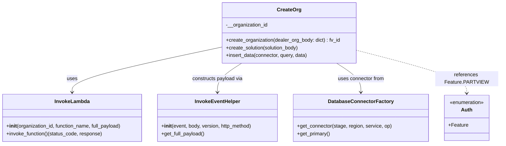

# Diagram: partview_core/partview_service/scripts/create_org.py

> Auto-generated by Obscura crawlers

## Diagram 1

### SVG

<svg id="container" width="1591.72265625" xmlns="http://www.w3.org/2000/svg" class="classDiagram" height="456" viewBox="0 0 1591.72265625 456" role="graphics-document document" aria-roledescription="class"><g><defs><marker id="container_class-aggregationStart" class="marker aggregation class" refX="18" refY="7" markerWidth="190" markerHeight="240" orient="auto"><path d="M 18,7 L9,13 L1,7 L9,1 Z"></path></marker></defs><defs><marker id="container_class-aggregationEnd" class="marker aggregation class" refX="1" refY="7" markerWidth="20" markerHeight="28" orient="auto"><path d="M 18,7 L9,13 L1,7 L9,1 Z"></path></marker></defs><defs><marker id="container_class-extensionStart" class="marker extension class" refX="18" refY="7" markerWidth="190" markerHeight="240" orient="auto"><path d="M 1,7 L18,13 V 1 Z"></path></marker></defs><defs><marker id="container_class-extensionEnd" class="marker extension class" refX="1" refY="7" markerWidth="20" markerHeight="28" orient="auto"><path d="M 1,1 V 13 L18,7 Z"></path></marker></defs><defs><marker id="container_class-compositionStart" class="marker composition class" refX="18" refY="7" markerWidth="190" markerHeight="240" orient="auto"><path d="M 18,7 L9,13 L1,7 L9,1 Z"></path></marker></defs><defs><marker id="container_class-compositionEnd" class="marker composition class" refX="1" refY="7" markerWidth="20" markerHeight="28" orient="auto"><path d="M 18,7 L9,13 L1,7 L9,1 Z"></path></marker></defs><defs><marker id="container_class-dependencyStart" class="marker dependency class" refX="6" refY="7" markerWidth="190" markerHeight="240" orient="auto"><path d="M 5,7 L9,13 L1,7 L9,1 Z"></path></marker></defs><defs><marker id="container_class-dependencyEnd" class="marker dependency class" refX="13" refY="7" markerWidth="20" markerHeight="28" orient="auto"><path d="M 18,7 L9,13 L14,7 L9,1 Z"></path></marker></defs><defs><marker id="container_class-lollipopStart" class="marker lollipop class" refX="13" refY="7" markerWidth="190" markerHeight="240" orient="auto"><circle stroke="black" fill="transparent" cx="7" cy="7" r="6"></circle></marker></defs><defs><marker id="container_class-lollipopEnd" class="marker lollipop class" refX="1" refY="7" markerWidth="190" markerHeight="240" orient="auto"><circle stroke="black" fill="transparent" cx="7" cy="7" r="6"></circle></marker></defs><g class="root"><g class="clusters"></g><g class="edgePaths"><path d="M712.307,148.58L632.313,165.317C552.319,182.053,392.331,215.527,312.338,239.43C232.344,263.333,232.344,277.667,232.344,284.833L232.344,292" id="id_CreateOrg_InvokeLambda_1" class="edge-thickness-normal edge-pattern-solid relation" style=";;;" data-edge="true" data-et="edge" data-id="id_CreateOrg_InvokeLambda_1" data-points="W3sieCI6NzEyLjMwNjY0MDYyNSwieSI6MTQ4LjU4MDI0MTUyMDcwNjh9LHsieCI6MjMyLjM0Mzc1LCJ5IjoyNDl9LHsieCI6MjMyLjM0Mzc1LCJ5IjoyOTh9XQ==" marker-end="url(#container_class-dependencyEnd)"></path><path d="M775.385,200L762.625,208.167C749.865,216.333,724.344,232.667,711.584,248C698.824,263.333,698.824,277.667,698.824,284.833L698.824,292" id="id_CreateOrg_InvokeEventHelper_2" class="edge-thickness-normal edge-pattern-solid relation" style=";;;" data-edge="true" data-et="edge" data-id="id_CreateOrg_InvokeEventHelper_2" data-points="W3sieCI6Nzc1LjM4NDczODY4NTM0NDgsInkiOjIwMH0seyJ4Ijo2OTguODI0MjE4NzUsInkiOjI0OX0seyJ4Ijo2OTguODI0MjE4NzUsInkiOjI5OH1d" marker-end="url(#container_class-dependencyEnd)"></path><path d="M1075.377,200L1088.137,208.167C1100.897,216.333,1126.417,232.667,1139.177,248C1151.938,263.333,1151.938,277.667,1151.938,284.833L1151.938,292" id="id_CreateOrg_DatabaseConnectorFactory_3" class="edge-thickness-normal edge-pattern-solid relation" style=";;;" data-edge="true" data-et="edge" data-id="id_CreateOrg_DatabaseConnectorFactory_3" data-points="W3sieCI6MTA3NS4zNzY5ODAwNjQ2NTUsInkiOjIwMH0seyJ4IjoxMTUxLjkzNzUsInkiOjI0OX0seyJ4IjoxMTUxLjkzNzUsInkiOjI5OH1d" marker-end="url(#container_class-dependencyEnd)"></path><path d="M1138.455,159.335L1196,174.279C1253.544,189.223,1368.633,219.112,1426.178,241.722C1483.723,264.333,1483.723,279.667,1483.723,287.333L1483.723,295" id="id_CreateOrg_Auth_4" class="edge-thickness-normal edge-pattern-dashed relation" style=";;;" data-edge="true" data-et="edge" data-id="id_CreateOrg_Auth_4" data-points="W3sieCI6MTEzOC40NTUwNzgxMjUsInkiOjE1OS4zMzQ4NTM4MzI2NzI3Nn0seyJ4IjoxNDgzLjcyMjY1NjI1LCJ5IjoyNDl9LHsieCI6MTQ4My43MjI2NTYyNSwieSI6MzAxfV0=" marker-end="url(#container_class-dependencyEnd)"></path></g><g class="edgeLabels"><g class="edgeLabel" transform="translate(232.34375, 249)"><g class="label" data-id="id_CreateOrg_InvokeLambda_1" transform="translate(-16.4921875, -12)"><foreignObject width="32.984375" height="24">

uses

</foreignObject></g></g><g class="edgeLabel" transform="translate(698.82421875, 249)"><g class="label" data-id="id_CreateOrg_InvokeEventHelper_2" transform="translate(-81.5, -12)"><foreignObject width="163" height="24">

constructs payload via

</foreignObject></g></g><g class="edgeLabel" transform="translate(1151.9375, 249)"><g class="label" data-id="id_CreateOrg_DatabaseConnectorFactory_3" transform="translate(-74.2109375, -12)"><foreignObject width="148.421875" height="24">

uses connector from

</foreignObject></g></g><g class="edgeLabel" transform="translate(1483.72265625, 249)"><g class="label" data-id="id_CreateOrg_Auth_4" transform="translate(-100, -24)"><foreignObject width="200" height="48">

references Feature.PARTVIEW

</foreignObject></g></g></g><g class="nodes"><g class="node default" id="classId-CreateOrg-0" transform="translate(925.380859375, 104)"><g class="basic label-container"><path d="M-213.07421875 -96 L213.07421875 -96 L213.07421875 96 L-213.07421875 96" stroke="none" stroke-width="0" fill="#ECECFF" style=""></path><path d="M-213.07421875 -96 C-107.77316492919627 -96, -2.4721111083925393 -96, 213.07421875 -96 M-213.07421875 -96 C-56.91759443950599 -96, 99.23902987098802 -96, 213.07421875 -96 M213.07421875 -96 C213.07421875 -51.2291327177496, 213.07421875 -6.4582654354992, 213.07421875 96 M213.07421875 -96 C213.07421875 -48.68099254367877, 213.07421875 -1.3619850873575388, 213.07421875 96 M213.07421875 96 C47.2545850229792 96, -118.5650487040416 96, -213.07421875 96 M213.07421875 96 C75.86454564731432 96, -61.34512745537137 96, -213.07421875 96 M-213.07421875 96 C-213.07421875 51.21738412550067, -213.07421875 6.434768251001344, -213.07421875 -96 M-213.07421875 96 C-213.07421875 38.62449844004104, -213.07421875 -18.751003119917925, -213.07421875 -96" stroke="#9370DB" stroke-width="1.3" fill="none" stroke-dasharray="0 0" style=""></path></g><g class="annotation-group text" transform="translate(0, -72)"></g><g class="label-group text" transform="translate(-36.6015625, -72)"><g class="label" style="font-weight: bolder" transform="translate(0,-12)"><foreignObject width="73.203125" height="24">

CreateOrg

</foreignObject></g></g><g class="members-group text" transform="translate(-201.07421875, -24)"><g class="label" style="" transform="translate(0,-12)"><foreignObject width="134.09375" height="24">

-__organization_id

</foreignObject></g></g><g class="methods-group text" transform="translate(-201.07421875, 24)"><g class="label" style="" transform="translate(0,-12)"><foreignObject width="365.546875" height="24">

+create_organization(dealer_org_body: dict) : fv_id

</foreignObject></g><g class="label" style="" transform="translate(0,12)"><foreignObject width="235.484375" height="24">

+create_solution(solution_body)

</foreignObject></g><g class="label" style="" transform="translate(0,36)"><foreignObject width="262.40625" height="24">

+insert_data(connector, query, data)

</foreignObject></g></g><g class="divider" style=""><path d="M-213.07421875 -48 C-85.97361954453737 -48, 41.12697966092526 -48, 213.07421875 -48 M-213.07421875 -48 C-82.84499704324332 -48, 47.38422466351335 -48, 213.07421875 -48" stroke="#9370DB" stroke-width="1.3" fill="none" stroke-dasharray="0 0" style=""></path></g><g class="divider" style=""><path d="M-213.07421875 0 C-107.37716556062439 0, -1.6801123712487822 0, 213.07421875 0 M-213.07421875 0 C-57.11645036110215 0, 98.8413180277957 0, 213.07421875 0" stroke="#9370DB" stroke-width="1.3" fill="none" stroke-dasharray="0 0" style=""></path></g></g><g class="node default" id="classId-InvokeLambda-1" transform="translate(232.34375, 373)"><g class="basic label-container"><path d="M-224.34375 -75 L224.34375 -75 L224.34375 75 L-224.34375 75" stroke="none" stroke-width="0" fill="#ECECFF" style=""></path><path d="M-224.34375 -75 C-121.55504213838584 -75, -18.766334276771687 -75, 224.34375 -75 M-224.34375 -75 C-59.240161419880934 -75, 105.86342716023813 -75, 224.34375 -75 M224.34375 -75 C224.34375 -32.33057549176111, 224.34375 10.33884901647778, 224.34375 75 M224.34375 -75 C224.34375 -21.06788412430476, 224.34375 32.86423175139048, 224.34375 75 M224.34375 75 C80.86961382628215 75, -62.604522347435704 75, -224.34375 75 M224.34375 75 C68.66081302886073 75, -87.02212394227854 75, -224.34375 75 M-224.34375 75 C-224.34375 25.85649743513101, -224.34375 -23.287005129737977, -224.34375 -75 M-224.34375 75 C-224.34375 24.11160102647119, -224.34375 -26.776797947057617, -224.34375 -75" stroke="#9370DB" stroke-width="1.3" fill="none" stroke-dasharray="0 0" style=""></path></g><g class="annotation-group text" transform="translate(0, -51)"></g><g class="label-group text" transform="translate(-53.484375, -51)"><g class="label" style="font-weight: bolder" transform="translate(0,-12)"><foreignObject width="106.96875" height="24">

InvokeLambda

</foreignObject></g></g><g class="members-group text" transform="translate(-212.34375, -3)"></g><g class="methods-group text" transform="translate(-212.34375, 27)"><g class="label" style="" transform="translate(0,-12)"><foreignObject width="371.203125" height="24">

+<strong>init</strong>(organization_id, function_name, full_payload)

</foreignObject></g><g class="label" style="" transform="translate(0,12)"><foreignObject width="306.078125" height="24">

+invoke_function()(status_code, response)

</foreignObject></g></g><g class="divider" style=""><path d="M-224.34375 -27 C-134.29957782026008 -27, -44.255405640520166 -27, 224.34375 -27 M-224.34375 -27 C-127.25239469418594 -27, -30.161039388371876 -27, 224.34375 -27" stroke="#9370DB" stroke-width="1.3" fill="none" stroke-dasharray="0 0" style=""></path></g><g class="divider" style=""><path d="M-224.34375 -3 C-83.61961049923286 -3, 57.104529001534274 -3, 224.34375 -3 M-224.34375 -3 C-121.60106924302808 -3, -18.858388486056157 -3, 224.34375 -3" stroke="#9370DB" stroke-width="1.3" fill="none" stroke-dasharray="0 0" style=""></path></g></g><g class="node default" id="classId-InvokeEventHelper-2" transform="translate(698.82421875, 373)"><g class="basic label-container"><path d="M-192.13671875 -75 L192.13671875 -75 L192.13671875 75 L-192.13671875 75" stroke="none" stroke-width="0" fill="#ECECFF" style=""></path><path d="M-192.13671875 -75 C-101.62830190611034 -75, -11.119885062220675 -75, 192.13671875 -75 M-192.13671875 -75 C-44.58888919195661 -75, 102.95894036608678 -75, 192.13671875 -75 M192.13671875 -75 C192.13671875 -28.845810057597014, 192.13671875 17.308379884805973, 192.13671875 75 M192.13671875 -75 C192.13671875 -36.02100103186817, 192.13671875 2.9579979362636664, 192.13671875 75 M192.13671875 75 C93.15535330186442 75, -5.826012146271154 75, -192.13671875 75 M192.13671875 75 C112.9377723446943 75, 33.73882593938859 75, -192.13671875 75 M-192.13671875 75 C-192.13671875 37.363388458129215, -192.13671875 -0.2732230837415699, -192.13671875 -75 M-192.13671875 75 C-192.13671875 43.78386570709878, -192.13671875 12.567731414197553, -192.13671875 -75" stroke="#9370DB" stroke-width="1.3" fill="none" stroke-dasharray="0 0" style=""></path></g><g class="annotation-group text" transform="translate(0, -51)"></g><g class="label-group text" transform="translate(-69.0859375, -51)"><g class="label" style="font-weight: bolder" transform="translate(0,-12)"><foreignObject width="138.171875" height="24">

InvokeEventHelper

</foreignObject></g></g><g class="members-group text" transform="translate(-180.13671875, -3)"></g><g class="methods-group text" transform="translate(-180.13671875, 27)"><g class="label" style="" transform="translate(0,-12)"><foreignObject width="291.1875" height="24">

+<strong>init</strong>(event, body, version, http_method)

</foreignObject></g><g class="label" style="" transform="translate(0,12)"><foreignObject width="139.03125" height="24">

+get_full_payload()

</foreignObject></g></g><g class="divider" style=""><path d="M-192.13671875 -27 C-82.0106661476956 -27, 28.115386454608796 -27, 192.13671875 -27 M-192.13671875 -27 C-63.88174652500831 -27, 64.37322569998338 -27, 192.13671875 -27" stroke="#9370DB" stroke-width="1.3" fill="none" stroke-dasharray="0 0" style=""></path></g><g class="divider" style=""><path d="M-192.13671875 -3 C-66.35558382987207 -3, 59.42555109025585 -3, 192.13671875 -3 M-192.13671875 -3 C-107.08130755026497 -3, -22.025896350529933 -3, 192.13671875 -3" stroke="#9370DB" stroke-width="1.3" fill="none" stroke-dasharray="0 0" style=""></path></g></g><g class="node default" id="classId-DatabaseConnectorFactory-3" transform="translate(1151.9375, 373)"><g class="basic label-container"><path d="M-210.9765625 -75 L210.9765625 -75 L210.9765625 75 L-210.9765625 75" stroke="none" stroke-width="0" fill="#ECECFF" style=""></path><path d="M-210.9765625 -75 C-84.71313089785677 -75, 41.55030070428646 -75, 210.9765625 -75 M-210.9765625 -75 C-106.37598390432191 -75, -1.7754053086438262 -75, 210.9765625 -75 M210.9765625 -75 C210.9765625 -41.64566859404698, 210.9765625 -8.291337188093962, 210.9765625 75 M210.9765625 -75 C210.9765625 -35.517061178846085, 210.9765625 3.965877642307831, 210.9765625 75 M210.9765625 75 C101.99995455908693 75, -6.976653381826139 75, -210.9765625 75 M210.9765625 75 C70.93367321494503 75, -69.10921607010994 75, -210.9765625 75 M-210.9765625 75 C-210.9765625 23.66817255390992, -210.9765625 -27.663654892180162, -210.9765625 -75 M-210.9765625 75 C-210.9765625 20.16150223582664, -210.9765625 -34.67699552834672, -210.9765625 -75" stroke="#9370DB" stroke-width="1.3" fill="none" stroke-dasharray="0 0" style=""></path></g><g class="annotation-group text" transform="translate(0, -51)"></g><g class="label-group text" transform="translate(-98.1875, -51)"><g class="label" style="font-weight: bolder" transform="translate(0,-12)"><foreignObject width="196.375" height="24">

DatabaseConnectorFactory

</foreignObject></g></g><g class="members-group text" transform="translate(-198.9765625, -3)"></g><g class="methods-group text" transform="translate(-198.9765625, 27)"><g class="label" style="" transform="translate(0,-12)"><foreignObject width="299.765625" height="24">

+get_connector(stage, region, service, op)

</foreignObject></g><g class="label" style="" transform="translate(0,12)"><foreignObject width="105.890625" height="24">

+get_primary()

</foreignObject></g></g><g class="divider" style=""><path d="M-210.9765625 -27 C-48.445636603592675 -27, 114.08528929281465 -27, 210.9765625 -27 M-210.9765625 -27 C-116.54330488390066 -27, -22.11004726780132 -27, 210.9765625 -27" stroke="#9370DB" stroke-width="1.3" fill="none" stroke-dasharray="0 0" style=""></path></g><g class="divider" style=""><path d="M-210.9765625 -3 C-60.773282205546224 -3, 89.42999808890755 -3, 210.9765625 -3 M-210.9765625 -3 C-125.68264955579413 -3, -40.38873661158826 -3, 210.9765625 -3" stroke="#9370DB" stroke-width="1.3" fill="none" stroke-dasharray="0 0" style=""></path></g></g><g class="node default" id="classId-Auth-4" transform="translate(1483.72265625, 373)"><g class="basic label-container"><path d="M-70.80859375 -72 L70.80859375 -72 L70.80859375 72 L-70.80859375 72" stroke="none" stroke-width="0" fill="#ECECFF" style=""></path><path d="M-70.80859375 -72 C-23.931573675415216 -72, 22.94544639916957 -72, 70.80859375 -72 M-70.80859375 -72 C-41.1174919647079 -72, -11.426390179415804 -72, 70.80859375 -72 M70.80859375 -72 C70.80859375 -32.51298578112674, 70.80859375 6.974028437746526, 70.80859375 72 M70.80859375 -72 C70.80859375 -16.920858173010288, 70.80859375 38.158283653979424, 70.80859375 72 M70.80859375 72 C16.635693337384517 72, -37.53720707523097 72, -70.80859375 72 M70.80859375 72 C34.894029132930285 72, -1.0205354841394296 72, -70.80859375 72 M-70.80859375 72 C-70.80859375 38.59374512970881, -70.80859375 5.187490259417615, -70.80859375 -72 M-70.80859375 72 C-70.80859375 25.778648374096726, -70.80859375 -20.44270325180655, -70.80859375 -72" stroke="#9370DB" stroke-width="1.3" fill="none" stroke-dasharray="0 0" style=""></path></g><g class="annotation-group text" transform="translate(-55.5546875, -48)"><g class="label" style="" transform="translate(0,-12)"><foreignObject width="111.109375" height="24">

«enumeration»

</foreignObject></g></g><g class="label-group text" transform="translate(-17.0078125, -24)"><g class="label" style="font-weight: bolder" transform="translate(0,-12)"><foreignObject width="34.015625" height="24">

Auth

</foreignObject></g></g><g class="members-group text" transform="translate(-58.80859375, 24)"><g class="label" style="" transform="translate(0,-12)"><foreignObject width="62.0625" height="24">

+Feature

</foreignObject></g></g><g class="methods-group text" transform="translate(-58.80859375, 72)"></g><g class="divider" style=""><path d="M-70.80859375 0 C-25.946175737486925 0, 18.91624227502615 0, 70.80859375 0 M-70.80859375 0 C-24.354393020012914 0, 22.099807709974172 0, 70.80859375 0" stroke="#9370DB" stroke-width="1.3" fill="none" stroke-dasharray="0 0" style=""></path></g><g class="divider" style=""><path d="M-70.80859375 48 C-15.432766176856873 48, 39.943061396286254 48, 70.80859375 48 M-70.80859375 48 C-16.541125287304823 48, 37.726343175390355 48, 70.80859375 48" stroke="#9370DB" stroke-width="1.3" fill="none" stroke-dasharray="0 0" style=""></path></g></g></g></g></g></svg>

## Diagram 2

```mermaid
flowchart LR
    Start([Start]) --> ParseArgs[/"parse_arguments()"/]
    ParseArgs --> ReadConfig[/"config.read(file_path)"/]
    ReadConfig --> GetConnector[/"DatabaseConnectorFactory.get_connector(...).get_primary()"/]
    GetConnector --> InstantiateCreateOrg[/"data = CreateOrg()"/]
    InstantiateCreateOrg --> CreateOrg_CreateOrg[/"data.create_organization(org_body)"/]
    CreateOrg_CreateOrg --> InvokeCreateOrg[/"InvokeLambda(function_name='create_organizations')"/]
    InvokeCreateOrg --> OrgResponse{"status OK/CREATED?"}
    OrgResponse --> ExtractFvId[/"fv_id = org.response.fv_id"/]
    ExtractFvId --> CreateSolutionCall[/"data.create_solution(create_solution_body)"/]
    CreateSolutionCall --> InvokeCreateSolution[/"InvokeLambda(function_name='create_solution')"/]
    InvokeCreateSolution --> SolutionResponse{"status OK/CREATED?"}
    SolutionResponse --> ExtractSolutionId[/"solution_id = solution.id"/]
    ExtractSolutionId --> ForEachSection{{"for each section in config.sections()"}}
    ForEachSection --> IsExceptionType{section starts with package_container_exception_type}
    IsExceptionType -- yes --> BuildExceptionsData[/"build exceptions_data with solution_id"/]
    BuildExceptionsData --> InsertExceptions[/"data.insert_data(connector, exceptions_query, exceptions_data)"/]
    IsExceptionType -- no --> IsEventCode{section starts with package_container_event_code_lookup}
    IsEventCode -- yes --> BuildEventCodeData[/"build event_code_data with solution_id"/]
    BuildEventCodeData --> InsertEventCode[/"data.insert_data(connector, event_code_query, event_code_data)"/]
    IsEventCode -- no --> IsFilter{section starts with filter_value_list}
    IsFilter -- yes --> BuildFilterData[/"build filter_value_data with solution_id"/]
    BuildFilterData --> InsertFilter[/"data.insert_data(connector, filter_value_query, filter_value_data)"/]
    IsFilter -- no --> SkipSection([skip])
    InsertExceptions --> ForEachSection
    InsertEventCode --> ForEachSection
    InsertFilter --> ForEachSection
    SkipSection --> ForEachSection
    ForEachSection --> End([End])
```

### SVG

<svg id="container" width="6400.4541015625" xmlns="http://www.w3.org/2000/svg" class="flowchart" height="1288.281005859375" viewBox="0.0000019073486328125 0 6400.4541015625 1288.281005859375" role="graphics-document document" aria-roledescription="flowchart-v2"><g><marker id="container_flowchart-v2-pointEnd" class="marker flowchart-v2" viewBox="0 0 10 10" refX="5" refY="5" markerUnits="userSpaceOnUse" markerWidth="8" markerHeight="8" orient="auto"><path d="M 0 0 L 10 5 L 0 10 z" class="arrowMarkerPath" style="stroke-width: 1; stroke-dasharray: 1, 0;"></path></marker><marker id="container_flowchart-v2-pointStart" class="marker flowchart-v2" viewBox="0 0 10 10" refX="4.5" refY="5" markerUnits="userSpaceOnUse" markerWidth="8" markerHeight="8" orient="auto"><path d="M 0 5 L 10 10 L 10 0 z" class="arrowMarkerPath" style="stroke-width: 1; stroke-dasharray: 1, 0;"></path></marker><marker id="container_flowchart-v2-circleEnd" class="marker flowchart-v2" viewBox="0 0 10 10" refX="11" refY="5" markerUnits="userSpaceOnUse" markerWidth="11" markerHeight="11" orient="auto"><circle cx="5" cy="5" r="5" class="arrowMarkerPath" style="stroke-width: 1; stroke-dasharray: 1, 0;"></circle></marker><marker id="container_flowchart-v2-circleStart" class="marker flowchart-v2" viewBox="0 0 10 10" refX="-1" refY="5" markerUnits="userSpaceOnUse" markerWidth="11" markerHeight="11" orient="auto"><circle cx="5" cy="5" r="5" class="arrowMarkerPath" style="stroke-width: 1; stroke-dasharray: 1, 0;"></circle></marker><marker id="container_flowchart-v2-crossEnd" class="marker cross flowchart-v2" viewBox="0 0 11 11" refX="12" refY="5.2" markerUnits="userSpaceOnUse" markerWidth="11" markerHeight="11" orient="auto"><path d="M 1,1 l 9,9 M 10,1 l -9,9" class="arrowMarkerPath" style="stroke-width: 2; stroke-dasharray: 1, 0;"></path></marker><marker id="container_flowchart-v2-crossStart" class="marker cross flowchart-v2" viewBox="0 0 11 11" refX="-1" refY="5.2" markerUnits="userSpaceOnUse" markerWidth="11" markerHeight="11" orient="auto"><path d="M 1,1 l 9,9 M 10,1 l -9,9" class="arrowMarkerPath" style="stroke-width: 2; stroke-dasharray: 1, 0;"></path></marker><g class="root"><g class="clusters"></g><g class="edgePaths"><path d="M68.277,679.578L72.36,679.495C76.444,679.411,84.61,679.245,93.902,679.235C103.194,679.226,113.61,679.374,118.819,679.448L124.027,679.521" id="L_Start_ParseArgs_0" class="edge-thickness-normal edge-pattern-solid edge-thickness-normal edge-pattern-solid flowchart-link" style=";" data-edge="true" data-et="edge" data-id="L_Start_ParseArgs_0" data-points="W3sieCI6NjguMjc2ODM3NDMxODI3NjIsInkiOjY3OS41NzgxMjV9LHsieCI6OTIuNzc2ODM2Mzk1MjYzNjcsInkiOjY3OS4wNzgxMjV9LHsieCI6MTI4LjAyNjgzNjM5NTI2MzY3LCJ5Ijo2NzkuNTc4MTI1fV0=" marker-end="url(#container_flowchart-v2-pointEnd)"></path><path d="M297.933,679.578L303.641,679.495C309.35,679.411,320.766,679.245,331.683,679.235C342.6,679.226,353.017,679.374,358.225,679.448L363.433,679.521" id="L_ParseArgs_ReadConfig_0" class="edge-thickness-normal edge-pattern-solid edge-thickness-normal edge-pattern-solid flowchart-link" style=";" data-edge="true" data-et="edge" data-id="L_ParseArgs_ReadConfig_0" data-points="W3sieCI6Mjk3LjkzMzA4NjM5NTI2MzcsInkiOjY3OS41NzgxMjV9LHsieCI6MzMyLjE4MzA4NjM5NTI2MzcsInkiOjY3OS4wNzgxMjV9LHsieCI6MzY3LjQzMzA4NjM5NTI2MzcsInkiOjY3OS41NzgxMjV9XQ==" marker-end="url(#container_flowchart-v2-pointEnd)"></path><path d="M555.98,679.578L561.688,679.495C567.397,679.411,578.813,679.245,589.73,679.235C600.647,679.226,611.064,679.374,616.272,679.448L621.48,679.521" id="L_ReadConfig_GetConnector_0" class="edge-thickness-normal edge-pattern-solid edge-thickness-normal edge-pattern-solid flowchart-link" style=";" data-edge="true" data-et="edge" data-id="L_ReadConfig_GetConnector_0" data-points="W3sieCI6NTU1Ljk3OTk2MTM5NTI2MzcsInkiOjY3OS41NzgxMjV9LHsieCI6NTkwLjIyOTk2MTM5NTI2MzcsInkiOjY3OS4wNzgxMjV9LHsieCI6NjI1LjQ3OTk2MTM5NTI2MzcsInkiOjY3OS41NzgxMjV9XQ==" marker-end="url(#container_flowchart-v2-pointEnd)"></path><path d="M1083.542,679.578L1089.251,679.495C1094.959,679.411,1106.376,679.245,1117.293,679.235C1128.209,679.226,1138.626,679.374,1143.834,679.448L1149.043,679.521" id="L_GetConnector_InstantiateCreateOrg_0" class="edge-thickness-normal edge-pattern-solid edge-thickness-normal edge-pattern-solid flowchart-link" style=";" data-edge="true" data-et="edge" data-id="L_GetConnector_InstantiateCreateOrg_0" data-points="W3sieCI6MTA4My41NDI0NjEzOTUyNjM3LCJ5Ijo2NzkuNTc4MTI1fSx7IngiOjExMTcuNzkyNDYxMzk1MjYzNywieSI6Njc5LjA3ODEyNX0seyJ4IjoxMTUzLjA0MjQ2MTM5NTI2MzcsInkiOjY3OS41NzgxMjV9XQ==" marker-end="url(#container_flowchart-v2-pointEnd)"></path><path d="M1318.308,679.578L1324.016,679.495C1329.725,679.411,1341.141,679.245,1352.058,679.235C1362.975,679.226,1373.392,679.374,1378.6,679.448L1383.808,679.521" id="L_InstantiateCreateOrg_CreateOrg_CreateOrg_0" class="edge-thickness-normal edge-pattern-solid edge-thickness-normal edge-pattern-solid flowchart-link" style=";" data-edge="true" data-et="edge" data-id="L_InstantiateCreateOrg_CreateOrg_CreateOrg_0" data-points="W3sieCI6MTMxOC4zMDgwODYzOTUyNjM3LCJ5Ijo2NzkuNTc4MTI1fSx7IngiOjEzNTIuNTU4MDg2Mzk1MjYzNywieSI6Njc5LjA3ODEyNX0seyJ4IjoxMzg3LjgwODA4NjM5NTI2MzcsInkiOjY3OS41NzgxMjV9XQ==" marker-end="url(#container_flowchart-v2-pointEnd)"></path><path d="M1680.167,679.578L1685.876,679.495C1691.584,679.411,1703.001,679.245,1713.918,679.235C1724.834,679.226,1735.251,679.374,1740.459,679.448L1745.668,679.521" id="L_CreateOrg_CreateOrg_InvokeCreateOrg_0" class="edge-thickness-normal edge-pattern-solid edge-thickness-normal edge-pattern-solid flowchart-link" style=";" data-edge="true" data-et="edge" data-id="L_CreateOrg_CreateOrg_InvokeCreateOrg_0" data-points="W3sieCI6MTY4MC4xNjc0NjEzOTUyNjM3LCJ5Ijo2NzkuNTc4MTI1fSx7IngiOjE3MTQuNDE3NDYxMzk1MjYzNywieSI6Njc5LjA3ODEyNX0seyJ4IjoxNzQ5LjY2NzQ2MTM5NTI2MzcsInkiOjY3OS41NzgxMjV9XQ==" marker-end="url(#container_flowchart-v2-pointEnd)"></path><path d="M2174.964,679.578L2180.673,679.495C2186.381,679.411,2197.798,679.245,2207.006,679.161C2216.214,679.078,2223.214,679.078,2226.714,679.078L2230.214,679.078" id="L_InvokeCreateOrg_OrgResponse_0" class="edge-thickness-normal edge-pattern-solid edge-thickness-normal edge-pattern-solid flowchart-link" style=";" data-edge="true" data-et="edge" data-id="L_InvokeCreateOrg_OrgResponse_0" data-points="W3sieCI6MjE3NC45NjQzMzYzOTUyNjM3LCJ5Ijo2NzkuNTc4MTI1fSx7IngiOjIyMDkuMjE0MzM2Mzk1MjYzNywieSI6Njc5LjA3ODEyNX0seyJ4IjoyMjM0LjIxNDMzNjM5NTI2MzcsInkiOjY3OS4wNzgxMjV9XQ==" marker-end="url(#container_flowchart-v2-pointEnd)"></path><path d="M2435.089,679.078L2439.256,679.078C2443.423,679.078,2451.756,679.078,2461.131,679.152C2470.506,679.226,2480.923,679.374,2486.131,679.448L2491.34,679.521" id="L_OrgResponse_ExtractFvId_0" class="edge-thickness-normal edge-pattern-solid edge-thickness-normal edge-pattern-solid flowchart-link" style=";" data-edge="true" data-et="edge" data-id="L_OrgResponse_ExtractFvId_0" data-points="W3sieCI6MjQzNS4wODkzMzYzOTUyNjM3LCJ5Ijo2NzkuMDc4MTI1fSx7IngiOjI0NjAuMDg5MzM2Mzk1MjYzNywieSI6Njc5LjA3ODEyNX0seyJ4IjoyNDk1LjMzOTMzNjM5NTI2MzcsInkiOjY3OS41NzgxMjV9XQ==" marker-end="url(#container_flowchart-v2-pointEnd)"></path><path d="M2713.839,679.578L2719.548,679.495C2725.256,679.411,2736.673,679.245,2747.589,679.235C2758.506,679.226,2768.923,679.374,2774.131,679.448L2779.34,679.521" id="L_ExtractFvId_CreateSolutionCall_0" class="edge-thickness-normal edge-pattern-solid edge-thickness-normal edge-pattern-solid flowchart-link" style=";" data-edge="true" data-et="edge" data-id="L_ExtractFvId_CreateSolutionCall_0" data-points="W3sieCI6MjcxMy44MzkzMzYzOTUyNjM3LCJ5Ijo2NzkuNTc4MTI1fSx7IngiOjI3NDguMDg5MzM2Mzk1MjYzNywieSI6Njc5LjA3ODEyNX0seyJ4IjoyNzgzLjMzOTMzNjM5NTI2MzcsInkiOjY3OS41NzgxMjV9XQ==" marker-end="url(#container_flowchart-v2-pointEnd)"></path><path d="M3134.527,679.578L3140.235,679.495C3145.944,679.411,3157.36,679.245,3168.277,679.235C3179.194,679.226,3189.61,679.374,3194.819,679.448L3200.027,679.521" id="L_CreateSolutionCall_InvokeCreateSolution_0" class="edge-thickness-normal edge-pattern-solid edge-thickness-normal edge-pattern-solid flowchart-link" style=";" data-edge="true" data-et="edge" data-id="L_CreateSolutionCall_InvokeCreateSolution_0" data-points="W3sieCI6MzEzNC41MjY4MzYzOTUyNjM3LCJ5Ijo2NzkuNTc4MTI1fSx7IngiOjMxNjguNzc2ODM2Mzk1MjYzNywieSI6Njc5LjA3ODEyNX0seyJ4IjozMjA0LjAyNjgzNjM5NTI2MzcsInkiOjY3OS41NzgxMjV9XQ==" marker-end="url(#container_flowchart-v2-pointEnd)"></path><path d="M3591.714,679.578L3597.423,679.495C3603.131,679.411,3614.548,679.245,3623.756,679.161C3632.964,679.078,3639.964,679.078,3643.464,679.078L3646.964,679.078" id="L_InvokeCreateSolution_SolutionResponse_0" class="edge-thickness-normal edge-pattern-solid edge-thickness-normal edge-pattern-solid flowchart-link" style=";" data-edge="true" data-et="edge" data-id="L_InvokeCreateSolution_SolutionResponse_0" data-points="W3sieCI6MzU5MS43MTQzMzYzOTUyNjM3LCJ5Ijo2NzkuNTc4MTI1fSx7IngiOjM2MjUuOTY0MzM2Mzk1MjYzNywieSI6Njc5LjA3ODEyNX0seyJ4IjozNjUwLjk2NDMzNjM5NTI2MzcsInkiOjY3OS4wNzgxMjV9XQ==" marker-end="url(#container_flowchart-v2-pointEnd)"></path><path d="M3851.839,679.078L3856.006,679.078C3860.173,679.078,3868.506,679.078,3877.881,679.152C3887.256,679.226,3897.673,679.374,3902.881,679.448L3908.09,679.521" id="L_SolutionResponse_ExtractSolutionId_0" class="edge-thickness-normal edge-pattern-solid edge-thickness-normal edge-pattern-solid flowchart-link" style=";" data-edge="true" data-et="edge" data-id="L_SolutionResponse_ExtractSolutionId_0" data-points="W3sieCI6Mzg1MS44MzkzMzYzOTUyNjM3LCJ5Ijo2NzkuMDc4MTI1fSx7IngiOjM4NzYuODM5MzM2Mzk1MjYzNywieSI6Njc5LjA3ODEyNX0seyJ4IjozOTEyLjA4OTMzNjM5NTI2MzcsInkiOjY3OS41NzgxMjV9XQ==" marker-end="url(#container_flowchart-v2-pointEnd)"></path><path d="M4123.042,679.578L4128.751,679.495C4134.459,679.411,4145.876,679.245,4155.168,679.232C4164.459,679.219,4171.626,679.359,4175.21,679.429L4178.793,679.5" id="L_ExtractSolutionId_ForEachSection_0" class="edge-thickness-normal edge-pattern-solid edge-thickness-normal edge-pattern-solid flowchart-link" style=";" data-edge="true" data-et="edge" data-id="L_ExtractSolutionId_ForEachSection_0" data-points="W3sieCI6NDEyMy4wNDI0NjEzOTUyNjQsInkiOjY3OS41NzgxMjV9LHsieCI6NDE1Ny4yOTI0NjEzOTUyNjQsInkiOjY3OS4wNzgxMjV9LHsieCI6NDE4Mi43OTI0NjEzOTUyNjQsInkiOjY3OS41NzgxMjV9XQ==" marker-end="url(#container_flowchart-v2-pointEnd)"></path><path d="M4331.525,648.078L4357,568.992C4382.475,489.906,4433.425,331.734,4462.401,252.648C4491.376,173.563,4498.376,173.563,4501.876,173.563L4505.376,173.563" id="L_ForEachSection_IsExceptionType_0" class="edge-thickness-normal edge-pattern-solid edge-thickness-normal edge-pattern-solid flowchart-link" style=";" data-edge="true" data-et="edge" data-id="L_ForEachSection_IsExceptionType_0" data-points="W3sieCI6NDMzMS41MjQ4NDIyMDkyOTYsInkiOjY0OC4wNzgxMjUwMDAwMDIzfSx7IngiOjQ0ODQuMzc1ODA0OTAxMTIzLCJ5IjoxNzMuNTYyNX0seyJ4Ijo0NTA5LjM3NTgwNDkwMTEyNCwieSI6MTczLjU2MjV9XQ==" marker-end="url(#container_flowchart-v2-pointEnd)"></path><path d="M4840.501,173.563L4846.669,173.563C4852.837,173.563,4865.173,173.563,4886.542,173.642C4907.912,173.722,4938.316,173.882,4953.518,173.962L4968.72,174.041" id="L_IsExceptionType_BuildExceptionsData_0" class="edge-thickness-normal edge-pattern-solid edge-thickness-normal edge-pattern-solid flowchart-link" style=";" data-edge="true" data-et="edge" data-id="L_IsExceptionType_BuildExceptionsData_0" data-points="W3sieCI6NDg0MC41MDA4MDQ5MDExMjMsInkiOjE3My41NjI1fSx7IngiOjQ4NzcuNTA4NjE3NDAxMTIzLCJ5IjoxNzMuNTYyNX0seyJ4Ijo0OTcyLjcxOTU1NDkwMTEyMywieSI6MTc0LjA2MjV9XQ==" marker-end="url(#container_flowchart-v2-pointEnd)"></path><path d="M5219.22,174.063L5234.921,173.979C5250.623,173.896,5282.027,173.729,5319.435,190.205C5356.844,206.681,5400.257,239.799,5421.963,256.358L5443.67,272.918" id="L_BuildExceptionsData_InsertExceptions_0" class="edge-thickness-normal edge-pattern-solid edge-thickness-normal edge-pattern-solid flowchart-link" style=";" data-edge="true" data-et="edge" data-id="L_BuildExceptionsData_InsertExceptions_0" data-points="W3sieCI6NTIxOS4yMTk1NTQ5MDExMjMsInkiOjE3NC4wNjI1fSx7IngiOjUzMTMuNDMwNDkyNDAxMTIzLCJ5IjoxNzMuNTYyNX0seyJ4Ijo1NDQ2Ljg0OTgzNjMwNjI2LCJ5IjoyNzUuMzQzNzV9XQ==" marker-end="url(#container_flowchart-v2-pointEnd)"></path><path d="M4722.303,291.761L4748.17,356.314C4774.038,420.866,4825.773,549.972,4857.142,614.525C4888.511,679.078,4899.514,679.078,4905.015,679.078L4910.516,679.078" id="L_IsExceptionType_IsEventCode_0" class="edge-thickness-normal edge-pattern-solid edge-thickness-normal edge-pattern-solid flowchart-link" style=";" data-edge="true" data-et="edge" data-id="L_IsExceptionType_IsEventCode_0" data-points="W3sieCI6NDcyMi4zMDI2NzkxNzcwNjUsInkiOjI5MS43NjA2MjU3MjQwNTgwNn0seyJ4Ijo0ODc3LjUwODYxNzQwMTEyMywieSI6Njc5LjA3ODEyNX0seyJ4Ijo0OTE0LjUxNjQyOTkwMTEyMywieSI6Njc5LjA3ODEyNX1d" marker-end="url(#container_flowchart-v2-pointEnd)"></path><path d="M5276.423,679.078L5282.591,679.078C5288.759,679.078,5301.095,679.078,5317.806,679.157C5334.516,679.235,5355.602,679.392,5366.145,679.47L5376.688,679.548" id="L_IsEventCode_BuildEventCodeData_0" class="edge-thickness-normal edge-pattern-solid edge-thickness-normal edge-pattern-solid flowchart-link" style=";" data-edge="true" data-et="edge" data-id="L_IsEventCode_BuildEventCodeData_0" data-points="W3sieCI6NTI3Ni40MjI2Nzk5MDExMjMsInkiOjY3OS4wNzgxMjV9LHsieCI6NTMxMy40MzA0OTI0MDExMjMsInkiOjY3OS4wNzgxMjV9LHsieCI6NTM4MC42ODgzMDQ5MDExMjMsInkiOjY3OS41NzgxMjV9XQ==" marker-end="url(#container_flowchart-v2-pointEnd)"></path><path d="M5627.188,679.578L5638.231,679.495C5649.274,679.411,5671.36,679.245,5700.817,689.661C5730.275,700.077,5767.103,721.075,5785.517,731.574L5803.932,742.073" id="L_BuildEventCodeData_InsertEventCode_0" class="edge-thickness-normal edge-pattern-solid edge-thickness-normal edge-pattern-solid flowchart-link" style=";" data-edge="true" data-et="edge" data-id="L_BuildEventCodeData_InsertEventCode_0" data-points="W3sieCI6NTYyNy4xODgzMDQ5MDExMjMsInkiOjY3OS41NzgxMjV9LHsieCI6NTY5My40NDYxMTc0MDExMjMsInkiOjY3OS4wNzgxMjV9LHsieCI6NTgwNy40MDYzOTM1NDM0MDcsInkiOjc0NC4wNTQ2ODc1fV0=" marker-end="url(#container_flowchart-v2-pointEnd)"></path><path d="M5160.348,795.152L5185.862,840.799C5211.376,886.445,5262.403,977.738,5295.751,1023.385C5329.1,1069.031,5344.769,1069.031,5352.604,1069.031L5360.438,1069.031" id="L_IsEventCode_IsFilter_0" class="edge-thickness-normal edge-pattern-solid edge-thickness-normal edge-pattern-solid flowchart-link" style=";" data-edge="true" data-et="edge" data-id="L_IsEventCode_IsFilter_0" data-points="W3sieCI6NTE2MC4zNDgzMTg1MzE1NTcsInkiOjc5NS4xNTI0ODYzNjk1NjU1fSx7IngiOjUzMTMuNDMwNDkyNDAxMTIzLCJ5IjoxMDY5LjAzMTI1fSx7IngiOjUzNjQuNDM4MzA0OTAxMTIzLCJ5IjoxMDY5LjAzMTI1fV0=" marker-end="url(#container_flowchart-v2-pointEnd)"></path><path d="M5626.562,1053.155L5637.71,1051.718C5648.857,1050.281,5671.152,1047.406,5692.842,1046.047C5714.532,1044.688,5735.618,1044.845,5746.161,1044.923L5756.704,1045.002" id="L_IsFilter_BuildFilterData_0" class="edge-thickness-normal edge-pattern-solid edge-thickness-normal edge-pattern-solid flowchart-link" style=";" data-edge="true" data-et="edge" data-id="L_IsFilter_BuildFilterData_0" data-points="W3sieCI6NTYyNi41NjI0MjYyNTQ1MTIsInkiOjEwNTMuMTU1MzcxMzUzMzg5fSx7IngiOjU2OTMuNDQ2MTE3NDAxMTIzLCJ5IjoxMDQ0LjUzMTI1fSx7IngiOjU3NjAuNzAzOTI5OTAxMTIzLCJ5IjoxMDQ1LjAzMTI1fV0=" marker-end="url(#container_flowchart-v2-pointEnd)"></path><path d="M6007.204,1045.031L6016.246,1044.948C6025.287,1044.865,6043.371,1044.698,6072.336,1060.163C6101.301,1075.628,6141.148,1106.724,6161.072,1122.272L6180.995,1137.82" id="L_BuildFilterData_InsertFilter_0" class="edge-thickness-normal edge-pattern-solid edge-thickness-normal edge-pattern-solid flowchart-link" style=";" data-edge="true" data-et="edge" data-id="L_BuildFilterData_InsertFilter_0" data-points="W3sieCI6NjAwNy4yMDM5Mjk5MDExMjMsInkiOjEwNDUuMDMxMjV9LHsieCI6NjA2MS40NTM5Mjk5MDExMjMsInkiOjEwNDQuNTMxMjV9LHsieCI6NjE4NC4xNDg1MjQ0OTU3MTc1LCJ5IjoxMTQwLjI4MTI1fV0=" marker-end="url(#container_flowchart-v2-pointEnd)"></path><path d="M5605.114,1106.355L5619.836,1111.76C5634.558,1117.164,5664.002,1127.973,5705.893,1145.861C5747.783,1163.749,5802.12,1188.717,5829.289,1201.201L5856.457,1213.685" id="L_IsFilter_SkipSection_0" class="edge-thickness-normal edge-pattern-solid edge-thickness-normal edge-pattern-solid flowchart-link" style=";" data-edge="true" data-et="edge" data-id="L_IsFilter_SkipSection_0" data-points="W3sieCI6NTYwNS4xMTQxMTQ2OTk5MTQsInkiOjExMDYuMzU1NDQwMjAxMjA5MX0seyJ4Ijo1NjkzLjQ0NjExNzQwMTEyMywieSI6MTEzOC43ODEyNX0seyJ4Ijo1ODYwLjA5MTg0NjUzODQ5MiwieSI6MTIxNS4zNTUzNzY4NzI4MTZ9XQ==" marker-end="url(#container_flowchart-v2-pointEnd)"></path><path d="M5446.85,362.344L5424.613,379.141C5402.377,395.938,5357.904,429.531,5299.34,446.328C5240.777,463.125,5168.123,463.125,5095.47,463.125C5022.816,463.125,4950.162,463.125,4880.074,463.125C4809.985,463.125,4742.462,463.125,4676.94,463.125C4611.417,463.125,4547.897,463.125,4493.339,493.418C4438.782,523.711,4393.188,584.296,4370.391,614.589L4347.594,644.882" id="L_InsertExceptions_ForEachSection_0" class="edge-thickness-normal edge-pattern-solid edge-thickness-normal edge-pattern-solid flowchart-link" style=";" data-edge="true" data-et="edge" data-id="L_InsertExceptions_ForEachSection_0" data-points="W3sieCI6NTQ0Ni44NDk4MzYzMDYyNiwieSI6MzYyLjM0Mzc1fSx7IngiOjUzMTMuNDMwNDkyNDAxMTIzLCJ5Ijo0NjMuMTI1fSx7IngiOjUwOTUuNDY5NTU0OTAxMTIzLCJ5Ijo0NjMuMTI1fSx7IngiOjQ4NzcuNTA4NjE3NDAxMTIzLCJ5Ijo0NjMuMTI1fSx7IngiOjQ2NzQuOTM4MzA0OTAxMTIzLCJ5Ijo0NjMuMTI1fSx7IngiOjQ0ODQuMzc1ODA0OTAxMTIzLCJ5Ijo0NjMuMTI1fSx7IngiOjQzNDUuMTg5MTM3MTQ2MDE0LCJ5Ijo2NDguMDc4MTI1MDAwMDAyMn1d" marker-end="url(#container_flowchart-v2-pointEnd)"></path><path d="M5807.406,831.055L5788.413,841.717C5769.42,852.38,5731.433,873.706,5680.772,884.368C5630.11,895.031,5566.774,895.031,5503.438,895.031C5440.102,895.031,5376.766,895.031,5308.772,895.031C5240.777,895.031,5168.123,895.031,5095.47,895.031C5022.816,895.031,4950.162,895.031,4880.074,895.031C4809.985,895.031,4742.462,895.031,4676.94,895.031C4611.417,895.031,4547.897,895.031,4493.341,864.904C4438.785,834.777,4393.194,774.522,4370.398,744.395L4347.603,714.268" id="L_InsertEventCode_ForEachSection_0" class="edge-thickness-normal edge-pattern-solid edge-thickness-normal edge-pattern-solid flowchart-link" style=";" data-edge="true" data-et="edge" data-id="L_InsertEventCode_ForEachSection_0" data-points="W3sieCI6NTgwNy40MDYzOTM1NDM0MDcsInkiOjgzMS4wNTQ2ODc1fSx7IngiOjU2OTMuNDQ2MTE3NDAxMTIzLCJ5Ijo4OTUuMDMxMjV9LHsieCI6NTUwMy40MzgzMDQ5MDExMjMsInkiOjg5NS4wMzEyNX0seyJ4Ijo1MzEzLjQzMDQ5MjQwMTEyMywieSI6ODk1LjAzMTI1fSx7IngiOjUwOTUuNDY5NTU0OTAxMTIzLCJ5Ijo4OTUuMDMxMjV9LHsieCI6NDg3Ny41MDg2MTc0MDExMjMsInkiOjg5NS4wMzEyNX0seyJ4Ijo0Njc0LjkzODMwNDkwMTEyMywieSI6ODk1LjAzMTI1fSx7IngiOjQ0ODQuMzc1ODA0OTAxMTIzLCJ5Ijo4OTUuMDMxMjV9LHsieCI6NDM0NS4xODkxMzcxNDYwMTcsInkiOjcxMS4wNzgxMjUwMDAwMDJ9XQ==" marker-end="url(#container_flowchart-v2-pointEnd)"></path><path d="M6160.129,1227.281L6143.683,1236.115C6127.237,1244.948,6094.346,1262.615,6048.233,1271.448C6002.121,1280.281,5942.787,1280.281,5881.453,1280.281C5820.118,1280.281,5756.782,1280.281,5693.446,1280.281C5630.11,1280.281,5566.774,1280.281,5503.438,1280.281C5440.102,1280.281,5376.766,1280.281,5308.772,1280.281C5240.777,1280.281,5168.123,1280.281,5095.47,1280.281C5022.816,1280.281,4950.162,1280.281,4880.074,1280.281C4809.985,1280.281,4742.462,1280.281,4676.94,1280.281C4611.417,1280.281,4547.897,1280.281,4490.565,1186.057C4433.234,1091.834,4382.092,903.386,4356.521,809.162L4330.951,714.938" id="L_InsertFilter_ForEachSection_0" class="edge-thickness-normal edge-pattern-solid edge-thickness-normal edge-pattern-solid flowchart-link" style=";" data-edge="true" data-et="edge" data-id="L_InsertFilter_ForEachSection_0" data-points="W3sieCI6NjE2MC4xMjkxODc2MzMwODE1LCJ5IjoxMjI3LjI4MTI1fSx7IngiOjYwNjEuNDUzOTI5OTAxMTIzLCJ5IjoxMjgwLjI4MTI1fSx7IngiOjU4ODMuNDUzOTI5OTAxMTIzLCJ5IjoxMjgwLjI4MTI1fSx7IngiOjU2OTMuNDQ2MTE3NDAxMTIzLCJ5IjoxMjgwLjI4MTI1fSx7IngiOjU1MDMuNDM4MzA0OTAxMTIzLCJ5IjoxMjgwLjI4MTI1fSx7IngiOjUzMTMuNDMwNDkyNDAxMTIzLCJ5IjoxMjgwLjI4MTI1fSx7IngiOjUwOTUuNDY5NTU0OTAxMTIzLCJ5IjoxMjgwLjI4MTI1fSx7IngiOjQ4NzcuNTA4NjE3NDAxMTIzLCJ5IjoxMjgwLjI4MTI1fSx7IngiOjQ2NzQuOTM4MzA0OTAxMTIzLCJ5IjoxMjgwLjI4MTI1fSx7IngiOjQ0ODQuMzc1ODA0OTAxMTIzLCJ5IjoxMjgwLjI4MTI1fSx7IngiOjQzMjkuOTAyODg4Nzc1MDM0LCJ5Ijo3MTEuMDc4MTI1MDAwMDAyfV0=" marker-end="url(#container_flowchart-v2-pointEnd)"></path><path d="M5856.901,1228.737L5829.658,1231.12C5802.416,1233.502,5747.931,1238.267,5689.021,1240.649C5630.11,1243.031,5566.774,1243.031,5503.438,1243.031C5440.102,1243.031,5376.766,1243.031,5308.772,1243.031C5240.777,1243.031,5168.123,1243.031,5095.47,1243.031C5022.816,1243.031,4950.162,1243.031,4880.074,1243.031C4809.985,1243.031,4742.462,1243.031,4676.94,1243.031C4611.417,1243.031,4547.897,1243.031,4490.67,1155.013C4433.444,1066.994,4382.512,890.957,4357.046,802.939L4331.581,714.921" id="L_SkipSection_ForEachSection_0" class="edge-thickness-normal edge-pattern-solid edge-thickness-normal edge-pattern-solid flowchart-link" style=";" data-edge="true" data-et="edge" data-id="L_SkipSection_ForEachSection_0" data-points="W3sieCI6NTg1Ni45MDA1MzYzMjgzNDIsInkiOjEyMjguNzM3MzEyMzc0NDM3Nn0seyJ4Ijo1NjkzLjQ0NjExNzQwMTEyMywieSI6MTI0My4wMzEyNX0seyJ4Ijo1NTAzLjQzODMwNDkwMTEyMywieSI6MTI0My4wMzEyNX0seyJ4Ijo1MzEzLjQzMDQ5MjQwMTEyMywieSI6MTI0My4wMzEyNX0seyJ4Ijo1MDk1LjQ2OTU1NDkwMTEyMywieSI6MTI0My4wMzEyNX0seyJ4Ijo0ODc3LjUwODYxNzQwMTEyMywieSI6MTI0My4wMzEyNX0seyJ4Ijo0Njc0LjkzODMwNDkwMTEyMywieSI6MTI0My4wMzEyNX0seyJ4Ijo0NDg0LjM3NTgwNDkwMTEyMywieSI6MTI0My4wMzEyNX0seyJ4Ijo0MzMwLjQ2ODg2ODY5OTUxNywieSI6NzExLjA3ODEyNTAwMDAwMTl9XQ==" marker-end="url(#container_flowchart-v2-pointEnd)"></path><path d="M4340.382,648.078L4364.381,608.169C4388.38,568.26,4436.378,488.443,4487.213,448.615C4538.048,408.788,4591.721,408.95,4618.557,409.032L4645.394,409.113" id="L_ForEachSection_End_0" class="edge-thickness-normal edge-pattern-solid edge-thickness-normal edge-pattern-solid flowchart-link" style=";" data-edge="true" data-et="edge" data-id="L_ForEachSection_End_0" data-points="W3sieCI6NDM0MC4zODIwMjc4OTk3MDMsInkiOjY0OC4wNzgxMjUwMDAwMDIzfSx7IngiOjQ0ODQuMzc1ODA0OTAxMTIzLCJ5Ijo0MDguNjI1fSx7IngiOjQ2NDkuMzkzNjM2NzAzMzA5LCJ5Ijo0MDkuMTI0OTk5OTk5OTk5OTR9XQ==" marker-end="url(#container_flowchart-v2-pointEnd)"></path></g><g class="edgeLabels"><g class="edgeLabel"><g class="label" data-id="L_Start_ParseArgs_0" transform="translate(0, 0)"><foreignObject width="0" height="0">

</foreignObject></g></g><g class="edgeLabel"><g class="label" data-id="L_ParseArgs_ReadConfig_0" transform="translate(0, 0)"><foreignObject width="0" height="0">

</foreignObject></g></g><g class="edgeLabel"><g class="label" data-id="L_ReadConfig_GetConnector_0" transform="translate(0, 0)"><foreignObject width="0" height="0">

</foreignObject></g></g><g class="edgeLabel"><g class="label" data-id="L_GetConnector_InstantiateCreateOrg_0" transform="translate(0, 0)"><foreignObject width="0" height="0">

</foreignObject></g></g><g class="edgeLabel"><g class="label" data-id="L_InstantiateCreateOrg_CreateOrg_CreateOrg_0" transform="translate(0, 0)"><foreignObject width="0" height="0">

</foreignObject></g></g><g class="edgeLabel"><g class="label" data-id="L_CreateOrg_CreateOrg_InvokeCreateOrg_0" transform="translate(0, 0)"><foreignObject width="0" height="0">

</foreignObject></g></g><g class="edgeLabel"><g class="label" data-id="L_InvokeCreateOrg_OrgResponse_0" transform="translate(0, 0)"><foreignObject width="0" height="0">

</foreignObject></g></g><g class="edgeLabel"><g class="label" data-id="L_OrgResponse_ExtractFvId_0" transform="translate(0, 0)"><foreignObject width="0" height="0">

</foreignObject></g></g><g class="edgeLabel"><g class="label" data-id="L_ExtractFvId_CreateSolutionCall_0" transform="translate(0, 0)"><foreignObject width="0" height="0">

</foreignObject></g></g><g class="edgeLabel"><g class="label" data-id="L_CreateSolutionCall_InvokeCreateSolution_0" transform="translate(0, 0)"><foreignObject width="0" height="0">

</foreignObject></g></g><g class="edgeLabel"><g class="label" data-id="L_InvokeCreateSolution_SolutionResponse_0" transform="translate(0, 0)"><foreignObject width="0" height="0">

</foreignObject></g></g><g class="edgeLabel"><g class="label" data-id="L_SolutionResponse_ExtractSolutionId_0" transform="translate(0, 0)"><foreignObject width="0" height="0">

</foreignObject></g></g><g class="edgeLabel"><g class="label" data-id="L_ExtractSolutionId_ForEachSection_0" transform="translate(0, 0)"><foreignObject width="0" height="0">

</foreignObject></g></g><g class="edgeLabel"><g class="label" data-id="L_ForEachSection_IsExceptionType_0" transform="translate(0, 0)"><foreignObject width="0" height="0">

</foreignObject></g></g><g class="edgeLabel" transform="translate(4877.508617401123, 173.5625)"><g class="label" data-id="L_IsExceptionType_BuildExceptionsData_0" transform="translate(-12.0078125, -12)"><foreignObject width="24.015625" height="24">

yes

</foreignObject></g></g><g class="edgeLabel"><g class="label" data-id="L_BuildExceptionsData_InsertExceptions_0" transform="translate(0, 0)"><foreignObject width="0" height="0">

</foreignObject></g></g><g class="edgeLabel" transform="translate(4877.508617401123, 679.078125)"><g class="label" data-id="L_IsExceptionType_IsEventCode_0" transform="translate(-9.3671875, -12)"><foreignObject width="18.734375" height="24">

no

</foreignObject></g></g><g class="edgeLabel" transform="translate(5313.430492401123, 679.078125)"><g class="label" data-id="L_IsEventCode_BuildEventCodeData_0" transform="translate(-12.0078125, -12)"><foreignObject width="24.015625" height="24">

yes

</foreignObject></g></g><g class="edgeLabel"><g class="label" data-id="L_BuildEventCodeData_InsertEventCode_0" transform="translate(0, 0)"><foreignObject width="0" height="0">

</foreignObject></g></g><g class="edgeLabel" transform="translate(5313.430492401123, 1069.03125)"><g class="label" data-id="L_IsEventCode_IsFilter_0" transform="translate(-9.3671875, -12)"><foreignObject width="18.734375" height="24">

no

</foreignObject></g></g><g class="edgeLabel" transform="translate(5693.446117401123, 1044.53125)"><g class="label" data-id="L_IsFilter_BuildFilterData_0" transform="translate(-12.0078125, -12)"><foreignObject width="24.015625" height="24">

yes

</foreignObject></g></g><g class="edgeLabel"><g class="label" data-id="L_BuildFilterData_InsertFilter_0" transform="translate(0, 0)"><foreignObject width="0" height="0">

</foreignObject></g></g><g class="edgeLabel" transform="translate(5734.01845, 1157.42434)"><g class="label" data-id="L_IsFilter_SkipSection_0" transform="translate(-9.3671875, -12)"><foreignObject width="18.734375" height="24">

no

</foreignObject></g></g><g class="edgeLabel"><g class="label" data-id="L_InsertExceptions_ForEachSection_0" transform="translate(0, 0)"><foreignObject width="0" height="0">

</foreignObject></g></g><g class="edgeLabel"><g class="label" data-id="L_InsertEventCode_ForEachSection_0" transform="translate(0, 0)"><foreignObject width="0" height="0">

</foreignObject></g></g><g class="edgeLabel"><g class="label" data-id="L_InsertFilter_ForEachSection_0" transform="translate(0, 0)"><foreignObject width="0" height="0">

</foreignObject></g></g><g class="edgeLabel"><g class="label" data-id="L_SkipSection_ForEachSection_0" transform="translate(0, 0)"><foreignObject width="0" height="0">

</foreignObject></g></g><g class="edgeLabel"><g class="label" data-id="L_ForEachSection_End_0" transform="translate(0, 0)"><foreignObject width="0" height="0">

</foreignObject></g></g></g><g class="nodes"><g class="node default" id="flowchart-Start-0" transform="translate(37.888418197631836, 679.078125)"><g class="basic label-container outer-path"><path d="M-10.3984375 -19.5 C-5.1447854131948745 -19.5, 0.10886667361025104 -19.5, 10.3984375 -19.5 C10.3984375 -19.5, 10.398437499999998 -19.5, 10.398437499999998 -19.5 C10.855734075089478 -19.485335388910666, 11.313030650178955 -19.470670777821333, 11.6478067896239 -19.45993515863156 C12.084389662699122 -19.417818533933715, 12.520972535774344 -19.375701909235875, 12.892042152847864 -19.3399052695533 C13.213703370517063 -19.287901578400543, 13.535364588186262 -19.235897887247784, 14.126030759676757 -19.140403561325776 C14.53509207906788 -19.047037984549327, 14.944153398459004 -18.953672407772878, 15.34470188623539 -18.862249829261074 C15.614550741615972 -18.782160105449666, 15.884399596996554 -18.702070381638254, 16.543047751460602 -18.50658706670804 C16.905214308968507 -18.373306425714173, 17.267380866476415 -18.240025784720302, 17.716144095147794 -18.074876768247425 C18.11924266375376 -17.89643698941975, 18.52234123235972 -17.717997210592078, 18.85917041279238 -17.568892924097174 C19.24363521379589 -17.3683178836751, 19.6281000147994 -17.167742843253027, 19.967429764076783 -16.990714730406097 C20.182860066199947 -16.860119615250053, 20.398290368323114 -16.729524500094012, 21.036368073605697 -16.342718045390892 C21.24181910856996 -16.199404297231784, 21.447270143534226 -16.05609054907267, 22.061592844578712 -15.627565626425154 C22.37932540583371 -15.374182364042843, 22.69705796708871 -15.120799101660532, 23.03889120850187 -14.848196188198123 C23.32492023114795 -14.588432197744185, 23.61094925379403 -14.328668207290244, 23.964247236767985 -14.007812326905688 C24.187102302485552 -13.777696174811132, 24.409957368203116 -13.547580022716575, 24.833858442968648 -13.10986736009568 C25.017309525803494 -12.894375279535545, 25.20076060863834 -12.67888319897541, 25.644151408126582 -12.158051136245305 C25.88372632306472 -11.837042575951946, 26.12330123800286 -11.516034015658587, 26.391796464640635 -11.156274872382312 C26.64730013092223 -10.763752628632755, 26.90280379720382 -10.3712303848832, 27.073721378604247 -10.108655082055241 C27.232512561297227 -9.826705257833023, 27.391303743990207 -9.544755433610804, 27.6871239742735 -9.019496659696287 C27.87802933340669 -8.623077596735891, 28.06893469253988 -8.226658533775495, 28.22948364880834 -7.893275190886684 C28.413872120363646 -7.4378321012365065, 28.598260591918947 -6.982389011586328, 28.698571729970325 -6.734618561215508 C28.788571365576406 -6.46355399826459, 28.878571001182483 -6.192489435313673, 29.09246063421488 -5.548287939305138 C29.21335749751191 -5.087255802521569, 29.334254360808938 -4.626223665738, 29.40953178754556 -4.339158212148133 C29.474745960376087 -4.0042972176836935, 29.539960133206613 -3.669436223219253, 29.648482276581777 -3.1121979531509023 C29.703221572670863 -2.687650782180619, 29.757960868759945 -2.2631036112103358, 29.808330202509367 -1.872449005199798 C29.838154739406647 -1.4079077690917476, 29.86797927630393 -0.9433665329836974, 29.888418715913414 -0.6250057626472757 C29.888418715913414 -0.33817203209964125, 29.888418715913414 -0.051338301552006804, 29.888418715913414 0.625005762647271 C29.866759608872737 0.9623638377223678, 29.845100501832057 1.2997219127974646, 29.808330202509367 1.8724490051997846 C29.768846255008373 2.178678705030148, 29.729362307507383 2.4849084048605117, 29.648482276581777 3.1121979531508885 C29.556223030766795 3.5859296814123196, 29.46396378495181 4.059661409673751, 29.40953178754556 4.339158212148129 C29.337168172122524 4.615112040345485, 29.264804556699485 4.891065868542841, 29.092460634214884 5.548287939305125 C28.951069753816338 5.974134743488059, 28.80967887341779 6.3999815476709925, 28.69857172997033 6.734618561215495 C28.525952155158205 7.160992248373885, 28.353332580346077 7.587365935532275, 28.229483648808344 7.893275190886679 C28.04765057389456 8.27085546154969, 27.86581749898078 8.648435732212702, 27.687123974273504 9.019496659696284 C27.46278251382027 9.417837639767221, 27.238441053367037 9.816178619838158, 27.07372137860425 10.108655082055236 C26.859579578536582 10.437634392083972, 26.64543777846891 10.766613702112707, 26.39179646464064 11.156274872382301 C26.142148454354814 11.4907804627637, 25.892500444068983 11.8252860531451, 25.644151408126582 12.158051136245302 C25.46605271809291 12.367255991661404, 25.287954028059236 12.576460847077506, 24.83385844296866 13.10986736009567 C24.57347532886692 13.378734303256955, 24.313092214765184 13.647601246418242, 23.96424723676799 14.007812326905684 C23.598857382651143 14.339649724728837, 23.233467528534298 14.67148712255199, 23.038891208501887 14.848196188198111 C22.78634388607209 15.049595957269378, 22.53379656364229 15.250995726340646, 22.061592844578715 15.627565626425152 C21.773219367684536 15.828722480419916, 21.484845890790353 16.02987933441468, 21.036368073605708 16.34271804539089 C20.753197330386513 16.514377814026364, 20.470026587167318 16.686037582661836, 19.967429764076787 16.990714730406093 C19.67643470073111 17.142526668562297, 19.38543963738544 17.2943386067185, 18.859170412792388 17.56889292409717 C18.57329838000768 17.695439992918406, 18.287426347222976 17.82198706173964, 17.716144095147804 18.07487676824742 C17.3166872466787 18.22188058102268, 16.917230398209597 18.368884393797938, 16.543047751460616 18.506587066708033 C16.151494997686257 18.622797868725918, 15.759942243911897 18.739008670743804, 15.344701886235413 18.86224982926107 C15.015196083506385 18.93745737850766, 14.68569028077736 19.012664927754248, 14.126030759676766 19.140403561325773 C13.772095016124958 19.197625147530545, 13.41815927257315 19.254846733735317, 12.892042152847878 19.3399052695533 C12.550543416494294 19.372849241937008, 12.20904468014071 19.40579321432072, 11.6478067896239 19.45993515863156 C11.341320002423954 19.46976359335672, 11.034833215224008 19.479592028081882, 10.398437500000004 19.5 C10.398437500000002 19.5, 10.3984375 19.5, 10.3984375 19.5 C3.190810501721434 19.5, -4.016816496557132 19.5, -10.398437499999996 19.5 C-10.766684542856014 19.488191034084995, -11.134931585712032 19.47638206816999, -11.647806789623893 19.45993515863156 C-12.095216183326727 19.416774112509568, -12.54262557702956 19.373613066387577, -12.892042152847871 19.3399052695533 C-13.352087693269718 19.265528674284344, -13.812133233691565 19.19115207901539, -14.126030759676759 19.140403561325773 C-14.395363925488855 19.07893002379232, -14.664697091300951 19.017456486258872, -15.344701886235388 18.862249829261074 C-15.793180286750404 18.729143794099382, -16.24165868726542 18.596037758937687, -16.54304775146059 18.506587066708043 C-16.915859363042905 18.369388947412993, -17.288670974625223 18.23219082811794, -17.716144095147797 18.074876768247425 C-17.998290923988208 17.94997873670808, -18.280437752828618 17.825080705168737, -18.85917041279238 17.568892924097174 C-19.28986551955247 17.344199562773817, -19.72056062631256 17.11950620145046, -19.96742976407678 16.990714730406097 C-20.298833664592507 16.78981573836797, -20.630237565108235 16.58891674632984, -21.036368073605686 16.3427180453909 C-21.3270522444479 16.13994935132632, -21.617736415290114 15.937180657261734, -22.061592844578712 15.627565626425156 C-22.279763653569862 15.453580212023768, -22.49793446256101 15.279594797622382, -23.03889120850187 14.848196188198125 C-23.235081376509623 14.670021468520877, -23.431271544517372 14.49184674884363, -23.964247236767974 14.007812326905697 C-24.262200545125886 13.7001510736046, -24.560153853483797 13.392489820303505, -24.833858442968655 13.109867360095677 C-25.102078124672516 12.794801259834074, -25.37029780637638 12.479735159572469, -25.64415140812658 12.158051136245307 C-25.92259790383062 11.7849581989995, -26.201044399534663 11.41186526175369, -26.391796464640635 11.156274872382316 C-26.557456326197155 10.901776839130056, -26.72311618775368 10.647278805877798, -27.073721378604244 10.108655082055249 C-27.21573608218446 9.856493595300465, -27.357750785764676 9.60433210854568, -27.6871239742735 9.019496659696289 C-27.885250648591256 8.608082381243754, -28.08337732290901 8.19666810279122, -28.22948364880834 7.893275190886686 C-28.39170647078689 7.492581684234775, -28.55392929276544 7.091888177582863, -28.698571729970325 6.73461856121551 C-28.794209045354915 6.446574205014005, -28.889846360739504 6.158529848812499, -29.09246063421488 5.5482879393051325 C-29.193669153022803 5.162335993041008, -29.294877671830722 4.776384046776883, -29.409531787545557 4.339158212148136 C-29.504664902087313 3.850669775367102, -29.59979801662907 3.362181338586068, -29.648482276581777 3.112197953150904 C-29.685471143974993 2.825319601927148, -29.72246001136821 2.538441250703392, -29.808330202509364 1.872449005199809 C-29.826524406994263 1.589059584249997, -29.84471861147916 1.305670163300185, -29.888418715913414 0.6250057626472781 C-29.888418715913414 0.13600018609935643, -29.888418715913414 -0.35300539044856527, -29.888418715913414 -0.6250057626472687 C-29.86286388742382 -1.0230428438589874, -29.837309058934228 -1.421079925070706, -29.808330202509367 -1.8724490051997822 C-29.744650629319537 -2.3663351999060533, -29.680971056129707 -2.8602213946123243, -29.648482276581777 -3.112197953150895 C-29.576031190194964 -3.4842189692046586, -29.503580103808147 -3.856239985258422, -29.40953178754556 -4.339158212148126 C-29.337151819335293 -4.615174400610536, -29.264771851125023 -4.891190589072948, -29.092460634214884 -5.548287939305123 C-28.9809561820289 -5.884121583467499, -28.869451729842915 -6.219955227629875, -28.698571729970332 -6.734618561215485 C-28.519831513570917 -7.176110351429032, -28.341091297171506 -7.61760214164258, -28.229483648808344 -7.893275190886676 C-28.0196003559833 -8.329102339220936, -27.809717063158256 -8.764929487555197, -27.687123974273504 -9.019496659696282 C-27.549724271241544 -9.26346374565816, -27.41232456820958 -9.50743083162004, -27.073721378604247 -10.108655082055243 C-26.82735792372601 -10.487135506598825, -26.58099446884777 -10.865615931142408, -26.39179646464064 -11.156274872382308 C-26.14128077548714 -11.491943073399218, -25.890765086333634 -11.82761127441613, -25.644151408126586 -12.158051136245302 C-25.40110078742352 -12.443552225295225, -25.158050166720457 -12.729053314345148, -24.833858442968662 -13.10986736009567 C-24.546441625252243 -13.40664882174746, -24.25902480753582 -13.703430283399248, -23.964247236767996 -14.007812326905677 C-23.694821116953356 -14.252498000296839, -23.425394997138714 -14.497183673688003, -23.038891208501887 -14.848196188198107 C-22.783153865082497 -15.052139914118554, -22.527416521663106 -15.256083640038998, -22.06159284457872 -15.627565626425149 C-21.844847969121943 -15.77875746880936, -21.628103093665167 -15.929949311193571, -21.03636807360571 -16.342718045390885 C-20.752448366320245 -16.514831840444735, -20.468528659034774 -16.68694563549859, -19.96742976407679 -16.99071473040609 C-19.571646906804528 -17.197194393534012, -19.17586404953226 -17.403674056661934, -18.859170412792388 -17.56889292409717 C-18.48219729356769 -17.735767741467676, -18.105224174342997 -17.902642558838185, -17.716144095147804 -18.07487676824742 C-17.430105120822407 -18.18014175491446, -17.144066146497014 -18.2854067415815, -16.54304775146062 -18.506587066708033 C-16.253553348746756 -18.59250748584638, -15.96405894603289 -18.678427904984726, -15.344701886235413 -18.862249829261067 C-14.990156582775647 -18.943172481151436, -14.635611279315881 -19.024095133041804, -14.126030759676768 -19.140403561325773 C-13.879009518304741 -19.180340039952466, -13.631988276932717 -19.220276518579155, -12.89204215284788 -19.3399052695533 C-12.46015018039388 -19.381569368709844, -12.028258207939881 -19.42323346786639, -11.647806789623903 -19.45993515863156 C-11.360054180089064 -19.469162824742863, -11.072301570554224 -19.47839049085417, -10.398437500000005 -19.5 C-10.398437500000004 -19.5, -10.398437500000004 -19.5, -10.3984375 -19.5" stroke="none" stroke-width="0" fill="#ECECFF" style=""></path><path d="M-10.3984375 -19.5 C-2.5494262818493114 -19.5, 5.299584936301377 -19.5, 10.3984375 -19.5 M-10.3984375 -19.5 C-4.523360002817997 -19.5, 1.3517174943640065 -19.5, 10.3984375 -19.5 M10.3984375 -19.5 C10.3984375 -19.5, 10.3984375 -19.5, 10.398437499999998 -19.5 M10.3984375 -19.5 C10.3984375 -19.5, 10.398437499999998 -19.5, 10.398437499999998 -19.5 M10.398437499999998 -19.5 C10.761931511763384 -19.48834345454092, 11.125425523526769 -19.47668690908184, 11.6478067896239 -19.45993515863156 M10.398437499999998 -19.5 C10.850880874757932 -19.485491021599117, 11.303324249515864 -19.470982043198237, 11.6478067896239 -19.45993515863156 M11.6478067896239 -19.45993515863156 C11.943213949964235 -19.431437585152615, 12.23862111030457 -19.402940011673675, 12.892042152847864 -19.3399052695533 M11.6478067896239 -19.45993515863156 C11.973204137070628 -19.42854446787094, 12.298601484517354 -19.39715377711032, 12.892042152847864 -19.3399052695533 M12.892042152847864 -19.3399052695533 C13.30846661479327 -19.2725809919659, 13.724891076738677 -19.205256714378503, 14.126030759676757 -19.140403561325776 M12.892042152847864 -19.3399052695533 C13.226919851931145 -19.285764840180857, 13.561797551014426 -19.231624410808415, 14.126030759676757 -19.140403561325776 M14.126030759676757 -19.140403561325776 C14.56033199098447 -19.041277139360183, 14.99463322229218 -18.94215071739459, 15.34470188623539 -18.862249829261074 M14.126030759676757 -19.140403561325776 C14.591056086798826 -19.034264564984017, 15.056081413920893 -18.928125568642262, 15.34470188623539 -18.862249829261074 M15.34470188623539 -18.862249829261074 C15.665804512529624 -18.766948255279026, 15.986907138823856 -18.671646681296977, 16.543047751460602 -18.50658706670804 M15.34470188623539 -18.862249829261074 C15.625697008713786 -18.778851951882984, 15.906692131192184 -18.69545407450489, 16.543047751460602 -18.50658706670804 M16.543047751460602 -18.50658706670804 C16.93387492653904 -18.36275905351237, 17.324702101617483 -18.2189310403167, 17.716144095147794 -18.074876768247425 M16.543047751460602 -18.50658706670804 C16.888785092421852 -18.379352529273355, 17.234522433383102 -18.25211799183867, 17.716144095147794 -18.074876768247425 M17.716144095147794 -18.074876768247425 C17.98346896806307 -17.956539976918435, 18.25079384097835 -17.838203185589446, 18.85917041279238 -17.568892924097174 M17.716144095147794 -18.074876768247425 C18.024991655241934 -17.938159115031105, 18.333839215336077 -17.801441461814786, 18.85917041279238 -17.568892924097174 M18.85917041279238 -17.568892924097174 C19.234188923367867 -17.373246007340764, 19.60920743394335 -17.177599090584355, 19.967429764076783 -16.990714730406097 M18.85917041279238 -17.568892924097174 C19.1853397700825 -17.39873057932036, 19.511509127372623 -17.228568234543552, 19.967429764076783 -16.990714730406097 M19.967429764076783 -16.990714730406097 C20.296203162625662 -16.791410364118818, 20.62497656117454 -16.59210599783154, 21.036368073605697 -16.342718045390892 M19.967429764076783 -16.990714730406097 C20.341529797578573 -16.763933091641487, 20.715629831080367 -16.537151452876877, 21.036368073605697 -16.342718045390892 M21.036368073605697 -16.342718045390892 C21.394989940288678 -16.092558955683245, 21.753611806971655 -15.842399865975597, 22.061592844578712 -15.627565626425154 M21.036368073605697 -16.342718045390892 C21.283993076359206 -16.169985562983648, 21.531618079112715 -15.9972530805764, 22.061592844578712 -15.627565626425154 M22.061592844578712 -15.627565626425154 C22.382645748253967 -15.371534479320712, 22.703698651929226 -15.115503332216267, 23.03889120850187 -14.848196188198123 M22.061592844578712 -15.627565626425154 C22.30273202212642 -15.435263549313866, 22.54387119967413 -15.24296147220258, 23.03889120850187 -14.848196188198123 M23.03889120850187 -14.848196188198123 C23.303378693011506 -14.607995652721835, 23.567866177521147 -14.367795117245546, 23.964247236767985 -14.007812326905688 M23.03889120850187 -14.848196188198123 C23.324780382518714 -14.588559204569062, 23.610669556535562 -14.328922220940003, 23.964247236767985 -14.007812326905688 M23.964247236767985 -14.007812326905688 C24.277753321890984 -13.684091554687917, 24.59125940701398 -13.360370782470147, 24.833858442968648 -13.10986736009568 M23.964247236767985 -14.007812326905688 C24.310533422152425 -13.650243409871695, 24.656819607536864 -13.292674492837703, 24.833858442968648 -13.10986736009568 M24.833858442968648 -13.10986736009568 C25.120281440154564 -12.773418609670864, 25.406704437340483 -12.436969859246048, 25.644151408126582 -12.158051136245305 M24.833858442968648 -13.10986736009568 C25.11160021750305 -12.783616067772899, 25.389341992037448 -12.457364775450117, 25.644151408126582 -12.158051136245305 M25.644151408126582 -12.158051136245305 C25.803743999864043 -11.944211602501316, 25.9633365916015 -11.730372068757326, 26.391796464640635 -11.156274872382312 M25.644151408126582 -12.158051136245305 C25.927236484777076 -11.778742923114665, 26.210321561427573 -11.399434709984025, 26.391796464640635 -11.156274872382312 M26.391796464640635 -11.156274872382312 C26.556841932060685 -10.902720713511602, 26.72188739948073 -10.649166554640892, 27.073721378604247 -10.108655082055241 M26.391796464640635 -11.156274872382312 C26.60714412570999 -10.825443036035969, 26.82249178677935 -10.494611199689626, 27.073721378604247 -10.108655082055241 M27.073721378604247 -10.108655082055241 C27.219011691418988 -9.850677419413156, 27.36430200423373 -9.592699756771072, 27.6871239742735 -9.019496659696287 M27.073721378604247 -10.108655082055241 C27.262237559094547 -9.77392551426146, 27.45075373958485 -9.43919594646768, 27.6871239742735 -9.019496659696287 M27.6871239742735 -9.019496659696287 C27.827043218026205 -8.728951356251578, 27.96696246177891 -8.438406052806869, 28.22948364880834 -7.893275190886684 M27.6871239742735 -9.019496659696287 C27.79639109335448 -8.79260114898282, 27.905658212435455 -8.565705638269353, 28.22948364880834 -7.893275190886684 M28.22948364880834 -7.893275190886684 C28.369753386824318 -7.546806226056328, 28.510023124840295 -7.200337261225971, 28.698571729970325 -6.734618561215508 M28.22948364880834 -7.893275190886684 C28.390404983250498 -7.4957963836122055, 28.551326317692656 -7.0983175763377275, 28.698571729970325 -6.734618561215508 M28.698571729970325 -6.734618561215508 C28.822092467079123 -6.362593781400622, 28.94561320418792 -5.990569001585736, 29.09246063421488 -5.548287939305138 M28.698571729970325 -6.734618561215508 C28.806973460566404 -6.408129820130378, 28.915375191162482 -6.081641079045247, 29.09246063421488 -5.548287939305138 M29.09246063421488 -5.548287939305138 C29.174401032507095 -5.235813687423654, 29.256341430799313 -4.923339435542171, 29.40953178754556 -4.339158212148133 M29.09246063421488 -5.548287939305138 C29.177715408146245 -5.22317453665209, 29.26297018207761 -4.898061133999042, 29.40953178754556 -4.339158212148133 M29.40953178754556 -4.339158212148133 C29.495471125717458 -3.897877873920997, 29.581410463889355 -3.4565975356938616, 29.648482276581777 -3.1121979531509023 M29.40953178754556 -4.339158212148133 C29.486677598036124 -3.943030780051906, 29.56382340852669 -3.5469033479556784, 29.648482276581777 -3.1121979531509023 M29.648482276581777 -3.1121979531509023 C29.711759879794776 -2.6214293582069788, 29.775037483007775 -2.1306607632630556, 29.808330202509367 -1.872449005199798 M29.648482276581777 -3.1121979531509023 C29.70056405570305 -2.7082619589968817, 29.75264583482432 -2.3043259648428616, 29.808330202509367 -1.872449005199798 M29.808330202509367 -1.872449005199798 C29.825364935331045 -1.607119291313306, 29.842399668152723 -1.3417895774268143, 29.888418715913414 -0.6250057626472757 M29.808330202509367 -1.872449005199798 C29.829241371667067 -1.546740666376686, 29.850152540824766 -1.2210323275535742, 29.888418715913414 -0.6250057626472757 M29.888418715913414 -0.6250057626472757 C29.888418715913414 -0.13983821818732473, 29.888418715913414 0.34532932627262625, 29.888418715913414 0.625005762647271 M29.888418715913414 -0.6250057626472757 C29.888418715913414 -0.3331618866343173, 29.888418715913414 -0.04131801062135887, 29.888418715913414 0.625005762647271 M29.888418715913414 0.625005762647271 C29.858296409538898 1.0941849987184367, 29.828174103164383 1.5633642347896022, 29.808330202509367 1.8724490051997846 M29.888418715913414 0.625005762647271 C29.859066720790693 1.08218677918765, 29.829714725667976 1.5393677957280292, 29.808330202509367 1.8724490051997846 M29.808330202509367 1.8724490051997846 C29.76878190628981 2.179177780984239, 29.729233610070253 2.485906556768694, 29.648482276581777 3.1121979531508885 M29.808330202509367 1.8724490051997846 C29.749767258727044 2.3266516326141935, 29.69120431494472 2.780854260028603, 29.648482276581777 3.1121979531508885 M29.648482276581777 3.1121979531508885 C29.56350045934395 3.5485616237537005, 29.478518642106124 3.984925294356513, 29.40953178754556 4.339158212148129 M29.648482276581777 3.1121979531508885 C29.56682601958943 3.531485574750562, 29.485169762597085 3.9507731963502346, 29.40953178754556 4.339158212148129 M29.40953178754556 4.339158212148129 C29.306431764827714 4.73232328260378, 29.203331742109867 5.125488353059432, 29.092460634214884 5.548287939305125 M29.40953178754556 4.339158212148129 C29.287905916022908 4.802970373250176, 29.16628004450025 5.266782534352222, 29.092460634214884 5.548287939305125 M29.092460634214884 5.548287939305125 C28.950177500715853 5.9768220676655, 28.807894367216818 6.405356196025876, 28.69857172997033 6.734618561215495 M29.092460634214884 5.548287939305125 C28.95182411246692 5.971862735423237, 28.811187590718955 6.395437531541349, 28.69857172997033 6.734618561215495 M28.69857172997033 6.734618561215495 C28.563616680599115 7.0679601423407705, 28.428661631227904 7.401301723466045, 28.229483648808344 7.893275190886679 M28.69857172997033 6.734618561215495 C28.56078256408263 7.074960464930412, 28.422993398194926 7.41530236864533, 28.229483648808344 7.893275190886679 M28.229483648808344 7.893275190886679 C28.114085743118515 8.132901411171245, 27.998687837428687 8.37252763145581, 27.687123974273504 9.019496659696284 M28.229483648808344 7.893275190886679 C28.01749547369108 8.333473172338, 27.80550729857382 8.77367115378932, 27.687123974273504 9.019496659696284 M27.687123974273504 9.019496659696284 C27.516406776411255 9.322622331491527, 27.345689578549006 9.625748003286768, 27.07372137860425 10.108655082055236 M27.687123974273504 9.019496659696284 C27.543776855662244 9.274023984260339, 27.400429737050985 9.528551308824392, 27.07372137860425 10.108655082055236 M27.07372137860425 10.108655082055236 C26.908411892605073 10.362614844362403, 26.743102406605896 10.61657460666957, 26.39179646464064 11.156274872382301 M27.07372137860425 10.108655082055236 C26.83037521762627 10.482500132911165, 26.587029056648287 10.856345183767091, 26.39179646464064 11.156274872382301 M26.39179646464064 11.156274872382301 C26.182410830962173 11.436832546087802, 25.973025197283707 11.717390219793302, 25.644151408126582 12.158051136245302 M26.39179646464064 11.156274872382301 C26.17362662893849 11.448602576542273, 25.955456793236337 11.740930280702244, 25.644151408126582 12.158051136245302 M25.644151408126582 12.158051136245302 C25.380721863561817 12.467490468856795, 25.117292318997052 12.77692980146829, 24.83385844296866 13.10986736009567 M25.644151408126582 12.158051136245302 C25.383208070898903 12.464570028249451, 25.122264733671223 12.771088920253602, 24.83385844296866 13.10986736009567 M24.83385844296866 13.10986736009567 C24.494369055223128 13.460418025540022, 24.1548796674776 13.810968690984376, 23.96424723676799 14.007812326905684 M24.83385844296866 13.10986736009567 C24.607506556025715 13.34359426719979, 24.381154669082772 13.577321174303911, 23.96424723676799 14.007812326905684 M23.96424723676799 14.007812326905684 C23.608287507956977 14.331085534433523, 23.252327779145965 14.65435874196136, 23.038891208501887 14.848196188198111 M23.96424723676799 14.007812326905684 C23.637898954450822 14.304193202203752, 23.311550672133656 14.600574077501822, 23.038891208501887 14.848196188198111 M23.038891208501887 14.848196188198111 C22.686094307038672 15.129542328795193, 22.333297405575458 15.410888469392273, 22.061592844578715 15.627565626425152 M23.038891208501887 14.848196188198111 C22.678778863785695 15.135376200117323, 22.318666519069502 15.422556212036534, 22.061592844578715 15.627565626425152 M22.061592844578715 15.627565626425152 C21.79889786186257 15.810810274485418, 21.536202879146423 15.994054922545683, 21.036368073605708 16.34271804539089 M22.061592844578715 15.627565626425152 C21.794712717611432 15.813729649943035, 21.527832590644152 15.999893673460917, 21.036368073605708 16.34271804539089 M21.036368073605708 16.34271804539089 C20.66184139529935 16.56975831874327, 20.287314716992995 16.796798592095644, 19.967429764076787 16.990714730406093 M21.036368073605708 16.34271804539089 C20.6403974719101 16.58275775112031, 20.24442687021449 16.822797456849738, 19.967429764076787 16.990714730406093 M19.967429764076787 16.990714730406093 C19.72112563451476 17.11921143703328, 19.474821504952736 17.24770814366046, 18.859170412792388 17.56889292409717 M19.967429764076787 16.990714730406093 C19.544154122222256 17.211537361640612, 19.120878480367725 17.432359992875135, 18.859170412792388 17.56889292409717 M18.859170412792388 17.56889292409717 C18.572848614485302 17.695639090773344, 18.286526816178213 17.822385257449515, 17.716144095147804 18.07487676824742 M18.859170412792388 17.56889292409717 C18.458182557702106 17.746398352663544, 18.057194702611824 17.923903781229914, 17.716144095147804 18.07487676824742 M17.716144095147804 18.07487676824742 C17.478213645216726 18.162437373227025, 17.24028319528565 18.249997978206633, 16.543047751460616 18.506587066708033 M17.716144095147804 18.07487676824742 C17.345287970290727 18.211355250351264, 16.974431845433646 18.347833732455108, 16.543047751460616 18.506587066708033 M16.543047751460616 18.506587066708033 C16.215980757604243 18.60365883367492, 15.888913763747873 18.70073060064181, 15.344701886235413 18.86224982926107 M16.543047751460616 18.506587066708033 C16.24499549366476 18.595047412313615, 15.946943235868906 18.6835077579192, 15.344701886235413 18.86224982926107 M15.344701886235413 18.86224982926107 C15.027682672631146 18.934607396022543, 14.710663459026879 19.00696496278401, 14.126030759676766 19.140403561325773 M15.344701886235413 18.86224982926107 C14.87343985575377 18.969812312446358, 14.402177825272128 19.077374795631645, 14.126030759676766 19.140403561325773 M14.126030759676766 19.140403561325773 C13.821865649069903 19.18957861757303, 13.517700538463037 19.238753673820284, 12.892042152847878 19.3399052695533 M14.126030759676766 19.140403561325773 C13.823713539444238 19.18927986498791, 13.52139631921171 19.238156168650047, 12.892042152847878 19.3399052695533 M12.892042152847878 19.3399052695533 C12.519333919975494 19.375859984531267, 12.14662568710311 19.411814699509236, 11.6478067896239 19.45993515863156 M12.892042152847878 19.3399052695533 C12.627006962430864 19.365472895621377, 12.361971772013849 19.391040521689455, 11.6478067896239 19.45993515863156 M11.6478067896239 19.45993515863156 C11.164807302094163 19.475424012095168, 10.681807814564424 19.490912865558776, 10.398437500000004 19.5 M11.6478067896239 19.45993515863156 C11.229240892211529 19.473357752272477, 10.81067499479916 19.4867803459134, 10.398437500000004 19.5 M10.398437500000004 19.5 C10.398437500000004 19.5, 10.398437500000002 19.5, 10.3984375 19.5 M10.398437500000004 19.5 C10.398437500000002 19.5, 10.398437500000002 19.5, 10.3984375 19.5 M10.3984375 19.5 C2.1586291264846373 19.5, -6.081179247030725 19.5, -10.398437499999996 19.5 M10.3984375 19.5 C3.088537647643653 19.5, -4.221362204712694 19.5, -10.398437499999996 19.5 M-10.398437499999996 19.5 C-10.661884047309824 19.49155178199537, -10.92533059461965 19.483103563990742, -11.647806789623893 19.45993515863156 M-10.398437499999996 19.5 C-10.875908960829918 19.484688419593002, -11.35338042165984 19.46937683918601, -11.647806789623893 19.45993515863156 M-11.647806789623893 19.45993515863156 C-12.135228111271836 19.412914209942087, -12.62264943291978 19.365893261252616, -12.892042152847871 19.3399052695533 M-11.647806789623893 19.45993515863156 C-12.04194627700796 19.421912996305704, -12.436085764392027 19.383890833979848, -12.892042152847871 19.3399052695533 M-12.892042152847871 19.3399052695533 C-13.258389270135382 19.28067710869458, -13.624736387422894 19.22144894783586, -14.126030759676759 19.140403561325773 M-12.892042152847871 19.3399052695533 C-13.184918920835283 19.292555224998353, -13.477795688822697 19.245205180443403, -14.126030759676759 19.140403561325773 M-14.126030759676759 19.140403561325773 C-14.562201380303753 19.04085046344696, -14.998372000930745 18.941297365568147, -15.344701886235388 18.862249829261074 M-14.126030759676759 19.140403561325773 C-14.568377240024533 19.03944086376694, -15.010723720372308 18.938478166208114, -15.344701886235388 18.862249829261074 M-15.344701886235388 18.862249829261074 C-15.805196056153472 18.72557757681261, -16.265690226071555 18.58890532436415, -16.54304775146059 18.506587066708043 M-15.344701886235388 18.862249829261074 C-15.751439887564654 18.741532125477885, -16.15817788889392 18.620814421694696, -16.54304775146059 18.506587066708043 M-16.54304775146059 18.506587066708043 C-16.77914839211568 18.419699848456574, -17.015249032770768 18.332812630205105, -17.716144095147797 18.074876768247425 M-16.54304775146059 18.506587066708043 C-16.95061287035917 18.356599335462708, -17.35817798925775 18.206611604217372, -17.716144095147797 18.074876768247425 M-17.716144095147797 18.074876768247425 C-18.02721324009132 17.937175685319257, -18.338282385034844 17.799474602391086, -18.85917041279238 17.568892924097174 M-17.716144095147797 18.074876768247425 C-18.109289775510987 17.900842837802887, -18.502435455874178 17.72680890735835, -18.85917041279238 17.568892924097174 M-18.85917041279238 17.568892924097174 C-19.183106153021402 17.399895855910437, -19.507041893250424 17.2308987877237, -19.96742976407678 16.990714730406097 M-18.85917041279238 17.568892924097174 C-19.166576176317612 17.40851953416885, -19.473981939842844 17.248146144240526, -19.96742976407678 16.990714730406097 M-19.96742976407678 16.990714730406097 C-20.32243088614417 16.775510963990687, -20.677432008211557 16.560307197575273, -21.036368073605686 16.3427180453909 M-19.96742976407678 16.990714730406097 C-20.329134534318115 16.77144717307263, -20.690839304559454 16.55217961573916, -21.036368073605686 16.3427180453909 M-21.036368073605686 16.3427180453909 C-21.389544960135854 16.096357138128464, -21.74272184666602 15.849996230866026, -22.061592844578712 15.627565626425156 M-21.036368073605686 16.3427180453909 C-21.361712621214608 16.11577177291739, -21.68705716882353 15.88882550044388, -22.061592844578712 15.627565626425156 M-22.061592844578712 15.627565626425156 C-22.315635144950868 15.42497365222789, -22.569677445323023 15.222381678030626, -23.03889120850187 14.848196188198125 M-22.061592844578712 15.627565626425156 C-22.44194270618763 15.324246733326937, -22.82229256779655 15.02092784022872, -23.03889120850187 14.848196188198125 M-23.03889120850187 14.848196188198125 C-23.248427512564895 14.65790086087489, -23.457963816627917 14.467605533551652, -23.964247236767974 14.007812326905697 M-23.03889120850187 14.848196188198125 C-23.341260762161895 14.573592159824077, -23.643630315821923 14.298988131450031, -23.964247236767974 14.007812326905697 M-23.964247236767974 14.007812326905697 C-24.18913001631937 13.775602393799312, -24.414012795870764 13.543392460692926, -24.833858442968655 13.109867360095677 M-23.964247236767974 14.007812326905697 C-24.235232854940666 13.727997427809381, -24.506218473113357 13.448182528713064, -24.833858442968655 13.109867360095677 M-24.833858442968655 13.109867360095677 C-25.119630229512136 12.7741835587464, -25.405402016055618 12.438499757397121, -25.64415140812658 12.158051136245307 M-24.833858442968655 13.109867360095677 C-25.11049215945275 12.78491765580907, -25.387125875936846 12.45996795152246, -25.64415140812658 12.158051136245307 M-25.64415140812658 12.158051136245307 C-25.871163007448786 11.8538762743357, -26.098174606770993 11.549701412426094, -26.391796464640635 11.156274872382316 M-25.64415140812658 12.158051136245307 C-25.81090605619713 11.93461509949173, -25.977660704267684 11.71117906273815, -26.391796464640635 11.156274872382316 M-26.391796464640635 11.156274872382316 C-26.550318856337007 10.912741909514262, -26.70884124803338 10.66920894664621, -27.073721378604244 10.108655082055249 M-26.391796464640635 11.156274872382316 C-26.565964875435302 10.888705422634882, -26.740133286229973 10.621135972887448, -27.073721378604244 10.108655082055249 M-27.073721378604244 10.108655082055249 C-27.225473528664036 9.839203773052603, -27.377225678723825 9.569752464049957, -27.6871239742735 9.019496659696289 M-27.073721378604244 10.108655082055249 C-27.261306658680038 9.775578422211312, -27.448891938755832 9.442501762367378, -27.6871239742735 9.019496659696289 M-27.6871239742735 9.019496659696289 C-27.82785141534517 8.727273117226098, -27.968578856416837 8.435049574755904, -28.22948364880834 7.893275190886686 M-27.6871239742735 9.019496659696289 C-27.801813324551517 8.781341769885007, -27.916502674829534 8.543186880073726, -28.22948364880834 7.893275190886686 M-28.22948364880834 7.893275190886686 C-28.347635446635557 7.601437965943848, -28.465787244462774 7.309600741001011, -28.698571729970325 6.73461856121551 M-28.22948364880834 7.893275190886686 C-28.380627588517083 7.519946737636815, -28.531771528225825 7.146618284386943, -28.698571729970325 6.73461856121551 M-28.698571729970325 6.73461856121551 C-28.854119407530217 6.266133739561912, -29.009667085090108 5.7976489179083135, -29.09246063421488 5.5482879393051325 M-28.698571729970325 6.73461856121551 C-28.812708796885435 6.3908559009392, -28.926845863800544 6.04709324066289, -29.09246063421488 5.5482879393051325 M-29.09246063421488 5.5482879393051325 C-29.165612583380646 5.269327852880743, -29.238764532546416 4.990367766456353, -29.409531787545557 4.339158212148136 M-29.09246063421488 5.5482879393051325 C-29.20281446332985 5.127460961237663, -29.313168292444825 4.706633983170194, -29.409531787545557 4.339158212148136 M-29.409531787545557 4.339158212148136 C-29.46702726998454 4.043931061498478, -29.524522752423522 3.7487039108488203, -29.648482276581777 3.112197953150904 M-29.409531787545557 4.339158212148136 C-29.471996252294733 4.0184163875304275, -29.534460717043906 3.6976745629127183, -29.648482276581777 3.112197953150904 M-29.648482276581777 3.112197953150904 C-29.69243967487315 2.7712730523731137, -29.736397073164525 2.430348151595323, -29.808330202509364 1.872449005199809 M-29.648482276581777 3.112197953150904 C-29.70664655247625 2.6610873151487673, -29.764810828370727 2.2099766771466305, -29.808330202509364 1.872449005199809 M-29.808330202509364 1.872449005199809 C-29.833079861404524 1.4869530903425743, -29.85782952029969 1.1014571754853395, -29.888418715913414 0.6250057626472781 M-29.808330202509364 1.872449005199809 C-29.835395612560383 1.4508833968493988, -29.862461022611402 1.0293177884989886, -29.888418715913414 0.6250057626472781 M-29.888418715913414 0.6250057626472781 C-29.888418715913414 0.339364348523606, -29.888418715913414 0.05372293439993381, -29.888418715913414 -0.6250057626472687 M-29.888418715913414 0.6250057626472781 C-29.888418715913414 0.22883731684654557, -29.888418715913414 -0.167331128954187, -29.888418715913414 -0.6250057626472687 M-29.888418715913414 -0.6250057626472687 C-29.87023468085827 -0.9082367865200359, -29.85205064580313 -1.1914678103928031, -29.808330202509367 -1.8724490051997822 M-29.888418715913414 -0.6250057626472687 C-29.871602511372345 -0.8869317221703971, -29.85478630683128 -1.1488576816935254, -29.808330202509367 -1.8724490051997822 M-29.808330202509367 -1.8724490051997822 C-29.767084360784267 -2.1923436087069548, -29.725838519059167 -2.512238212214127, -29.648482276581777 -3.112197953150895 M-29.808330202509367 -1.8724490051997822 C-29.761104261391235 -2.238724078695113, -29.713878320273103 -2.6049991521904445, -29.648482276581777 -3.112197953150895 M-29.648482276581777 -3.112197953150895 C-29.595830651297177 -3.3825529210623664, -29.54317902601258 -3.6529078889738376, -29.40953178754556 -4.339158212148126 M-29.648482276581777 -3.112197953150895 C-29.592756858121884 -3.3983361993710828, -29.53703143966199 -3.6844744455912704, -29.40953178754556 -4.339158212148126 M-29.40953178754556 -4.339158212148126 C-29.32406802283603 -4.66506858721549, -29.238604258126504 -4.990978962282854, -29.092460634214884 -5.548287939305123 M-29.40953178754556 -4.339158212148126 C-29.32927925056838 -4.645195917311665, -29.249026713591196 -4.951233622475205, -29.092460634214884 -5.548287939305123 M-29.092460634214884 -5.548287939305123 C-28.98696050369338 -5.866037523272826, -28.881460373171876 -6.18378710724053, -28.698571729970332 -6.734618561215485 M-29.092460634214884 -5.548287939305123 C-28.96233648763092 -5.9402011363487865, -28.832212341046958 -6.33211433339245, -28.698571729970332 -6.734618561215485 M-28.698571729970332 -6.734618561215485 C-28.53723657955199 -7.133119501951727, -28.37590142913365 -7.531620442687968, -28.229483648808344 -7.893275190886676 M-28.698571729970332 -6.734618561215485 C-28.544118362530845 -7.116121364943732, -28.38966499509136 -7.49762416867198, -28.229483648808344 -7.893275190886676 M-28.229483648808344 -7.893275190886676 C-28.090820803567212 -8.181211555939484, -27.952157958326083 -8.469147920992294, -27.687123974273504 -9.019496659696282 M-28.229483648808344 -7.893275190886676 C-28.052164224050117 -8.261482770425037, -27.87484479929189 -8.629690349963397, -27.687123974273504 -9.019496659696282 M-27.687123974273504 -9.019496659696282 C-27.494251034820106 -9.361962094198724, -27.301378095366708 -9.704427528701167, -27.073721378604247 -10.108655082055243 M-27.687123974273504 -9.019496659696282 C-27.490810338317008 -9.368071399248276, -27.294496702360515 -9.716646138800268, -27.073721378604247 -10.108655082055243 M-27.073721378604247 -10.108655082055243 C-26.931459870069986 -10.327206961727773, -26.789198361535725 -10.545758841400303, -26.39179646464064 -11.156274872382308 M-27.073721378604247 -10.108655082055243 C-26.936546024965253 -10.319393261984823, -26.79937067132626 -10.530131441914401, -26.39179646464064 -11.156274872382308 M-26.39179646464064 -11.156274872382308 C-26.104840099825196 -11.540770258972373, -25.81788373500975 -11.925265645562437, -25.644151408126586 -12.158051136245302 M-26.39179646464064 -11.156274872382308 C-26.217892302797434 -11.38929060625714, -26.04398814095423 -11.62230634013197, -25.644151408126586 -12.158051136245302 M-25.644151408126586 -12.158051136245302 C-25.348372327187185 -12.505490075023209, -25.052593246247785 -12.852929013801116, -24.833858442968662 -13.10986736009567 M-25.644151408126586 -12.158051136245302 C-25.366855033112127 -12.48377923694801, -25.089558658097673 -12.809507337650718, -24.833858442968662 -13.10986736009567 M-24.833858442968662 -13.10986736009567 C-24.56164456692691 -13.39095053628364, -24.28943069088516 -13.67203371247161, -23.964247236767996 -14.007812326905677 M-24.833858442968662 -13.10986736009567 C-24.597087350038876 -13.354352952813926, -24.360316257109087 -13.59883854553218, -23.964247236767996 -14.007812326905677 M-23.964247236767996 -14.007812326905677 C-23.72488071868024 -14.22519866534196, -23.485514200592487 -14.442585003778245, -23.038891208501887 -14.848196188198107 M-23.964247236767996 -14.007812326905677 C-23.714612054181 -14.234524394746197, -23.464976871594008 -14.461236462586715, -23.038891208501887 -14.848196188198107 M-23.038891208501887 -14.848196188198107 C-22.754011931825012 -15.075379830391984, -22.469132655148137 -15.302563472585861, -22.06159284457872 -15.627565626425149 M-23.038891208501887 -14.848196188198107 C-22.64828628589958 -15.15969321953992, -22.257681363297277 -15.47119025088173, -22.06159284457872 -15.627565626425149 M-22.06159284457872 -15.627565626425149 C-21.799918747126945 -15.8100981491184, -21.53824464967517 -15.992630671811648, -21.03636807360571 -16.342718045390885 M-22.06159284457872 -15.627565626425149 C-21.660200240327395 -15.907559731145087, -21.25880763607607 -16.187553835865025, -21.03636807360571 -16.342718045390885 M-21.03636807360571 -16.342718045390885 C-20.674762687496827 -16.561925355479215, -20.313157301387946 -16.78113266556754, -19.96742976407679 -16.99071473040609 M-21.03636807360571 -16.342718045390885 C-20.70753869318429 -16.542056348218285, -20.378709312762872 -16.74139465104568, -19.96742976407679 -16.99071473040609 M-19.96742976407679 -16.99071473040609 C-19.72231738634438 -17.11858970086712, -19.477205008611964 -17.246464671328148, -18.859170412792388 -17.56889292409717 M-19.96742976407679 -16.99071473040609 C-19.579696288274683 -17.192995036376907, -19.19196281247257 -17.395275342347723, -18.859170412792388 -17.56889292409717 M-18.859170412792388 -17.56889292409717 C-18.40608384715105 -17.769460906371158, -17.95299728150971 -17.970028888645146, -17.716144095147804 -18.07487676824742 M-18.859170412792388 -17.56889292409717 C-18.507854301702707 -17.72441014505441, -18.156538190613027 -17.87992736601165, -17.716144095147804 -18.07487676824742 M-17.716144095147804 -18.07487676824742 C-17.477849278478033 -18.162571463555036, -17.239554461808265 -18.250266158862647, -16.54304775146062 -18.506587066708033 M-17.716144095147804 -18.07487676824742 C-17.369998301487204 -18.20226162005116, -17.023852507826604 -18.329646471854904, -16.54304775146062 -18.506587066708033 M-16.54304775146062 -18.506587066708033 C-16.154223766659552 -18.621987984418244, -15.765399781858484 -18.73738890212846, -15.344701886235413 -18.862249829261067 M-16.54304775146062 -18.506587066708033 C-16.215522494480442 -18.603794843764593, -15.887997237500269 -18.701002620821153, -15.344701886235413 -18.862249829261067 M-15.344701886235413 -18.862249829261067 C-15.094991750049552 -18.919244538334567, -14.845281613863692 -18.976239247408063, -14.126030759676768 -19.140403561325773 M-15.344701886235413 -18.862249829261067 C-14.974810235244957 -18.946675184831037, -14.604918584254504 -19.03110054040101, -14.126030759676768 -19.140403561325773 M-14.126030759676768 -19.140403561325773 C-13.736597247926957 -19.203364151403495, -13.347163736177146 -19.266324741481213, -12.89204215284788 -19.3399052695533 M-14.126030759676768 -19.140403561325773 C-13.85305026559773 -19.184536930613124, -13.58006977151869 -19.22867029990047, -12.89204215284788 -19.3399052695533 M-12.89204215284788 -19.3399052695533 C-12.53896357887513 -19.373966334945337, -12.18588500490238 -19.408027400337378, -11.647806789623903 -19.45993515863156 M-12.89204215284788 -19.3399052695533 C-12.424634100768582 -19.384995562196963, -11.957226048689282 -19.430085854840627, -11.647806789623903 -19.45993515863156 M-11.647806789623903 -19.45993515863156 C-11.379560317879708 -19.468537300870313, -11.111313846135511 -19.477139443109067, -10.398437500000005 -19.5 M-11.647806789623903 -19.45993515863156 C-11.163720172528135 -19.47545887422438, -10.67963355543237 -19.490982589817204, -10.398437500000005 -19.5 M-10.398437500000005 -19.5 C-10.398437500000004 -19.5, -10.398437500000002 -19.5, -10.3984375 -19.5 M-10.398437500000005 -19.5 C-10.398437500000004 -19.5, -10.398437500000002 -19.5, -10.3984375 -19.5" stroke="#9370DB" stroke-width="1.3" fill="none" stroke-dasharray="0 0" style=""></path></g><g class="label" style="" transform="translate(-17.5234375, -12)"><rect></rect><foreignObject width="35.046875" height="24">

Start

</foreignObject></g></g><g class="node default" id="flowchart-ParseArgs-1" transform="translate(212.47996139526367, 679.078125)"><polygon points="-19.5,0 150.40625,0 169.90625,-39 0,-39" class="label-container" transform="translate(-75.203125,19.5)"></polygon><g class="label" style="" transform="translate(-67.703125, -12)"><rect></rect><foreignObject width="135.40625" height="24">

parse_arguments()

</foreignObject></g></g><g class="node default" id="flowchart-ReadConfig-3" transform="translate(461.2065238952637, 679.078125)"><polygon points="-19.5,0 169.046875,0 188.546875,-39 0,-39" class="label-container" transform="translate(-84.5234375,19.5)"></polygon><g class="label" style="" transform="translate(-77.0234375, -12)"><rect></rect><foreignObject width="154.046875" height="24">

config.read(file_path)

</foreignObject></g></g><g class="node default" id="flowchart-GetConnector-5" transform="translate(854.0112113952637, 679.078125)"><polygon points="-19.5,0 438.5625,0 458.0625,-39 0,-39" class="label-container" transform="translate(-219.28125,19.5)"></polygon><g class="label" style="" transform="translate(-211.78125, -12)"><rect></rect><foreignObject width="423.5625" height="24">

DatabaseConnectorFactory.get_connector(...).get_primary()

</foreignObject></g></g><g class="node default" id="flowchart-InstantiateCreateOrg-7" transform="translate(1235.1752738952637, 679.078125)"><polygon points="-19.5,0 145.765625,0 165.265625,-39 0,-39" class="label-container" transform="translate(-72.8828125,19.5)"></polygon><g class="label" style="" transform="translate(-65.3828125, -12)"><rect></rect><foreignObject width="130.765625" height="24">

data = CreateOrg()

</foreignObject></g></g><g class="node default" id="flowchart-CreateOrg_CreateOrg-9" transform="translate(1533.4877738952637, 679.078125)"><polygon points="-19.5,0 272.859375,0 292.359375,-39 0,-39" class="label-container" transform="translate(-136.4296875,19.5)"></polygon><g class="label" style="" transform="translate(-128.9296875, -12)"><rect></rect><foreignObject width="257.859375" height="24">

data.create_organization(org_body)

</foreignObject></g></g><g class="node default" id="flowchart-InvokeCreateOrg-11" transform="translate(1961.8158988952637, 679.078125)"><polygon points="-19.5,0 405.796875,0 425.296875,-39 0,-39" class="label-container" transform="translate(-202.8984375,19.5)"></polygon><g class="label" style="" transform="translate(-195.3984375, -12)"><rect></rect><foreignObject width="390.796875" height="24">

InvokeLambda(function_name='create_organizations')

</foreignObject></g></g><g class="node default" id="flowchart-OrgResponse-13" transform="translate(2334.6518363952637, 679.078125)"><polygon points="100.4375,0 200.875,-100.4375 100.4375,-200.875 0,-100.4375" class="label-container" transform="translate(-99.9375, 100.4375)"></polygon><g class="label" style="" transform="translate(-73.4375, -12)"><rect></rect><foreignObject width="146.875" height="24">

status OK/CREATED?

</foreignObject></g></g><g class="node default" id="flowchart-ExtractFvId-15" transform="translate(2604.0893363952637, 679.078125)"><polygon points="-19.5,0 199,0 218.5,-39 0,-39" class="label-container" transform="translate(-99.5,19.5)"></polygon><g class="label" style="" transform="translate(-92, -12)"><rect></rect><foreignObject width="184" height="24">

fv_id = org.response.fv_id

</foreignObject></g></g><g class="node default" id="flowchart-CreateSolutionCall-17" transform="translate(2958.4330863952637, 679.078125)"><polygon points="-19.5,0 331.6875,0 351.1875,-39 0,-39" class="label-container" transform="translate(-165.84375,19.5)"></polygon><g class="label" style="" transform="translate(-158.34375, -12)"><rect></rect><foreignObject width="316.6875" height="24">

data.create_solution(create_solution_body)

</foreignObject></g></g><g class="node default" id="flowchart-InvokeCreateSolution-19" transform="translate(3397.3705863952637, 679.078125)"><polygon points="-19.5,0 368.1875,0 387.6875,-39 0,-39" class="label-container" transform="translate(-184.09375,19.5)"></polygon><g class="label" style="" transform="translate(-176.59375, -12)"><rect></rect><foreignObject width="353.1875" height="24">

InvokeLambda(function_name='create_solution')

</foreignObject></g></g><g class="node default" id="flowchart-SolutionResponse-21" transform="translate(3751.4018363952637, 679.078125)"><polygon points="100.4375,0 200.875,-100.4375 100.4375,-200.875 0,-100.4375" class="label-container" transform="translate(-99.9375, 100.4375)"></polygon><g class="label" style="" transform="translate(-73.4375, -12)"><rect></rect><foreignObject width="146.875" height="24">

status OK/CREATED?

</foreignObject></g></g><g class="node default" id="flowchart-ExtractSolutionId-23" transform="translate(4017.0658988952637, 679.078125)"><polygon points="-19.5,0 191.453125,0 210.953125,-39 0,-39" class="label-container" transform="translate(-95.7265625,19.5)"></polygon><g class="label" style="" transform="translate(-88.2265625, -12)"><rect></rect><foreignObject width="176.453125" height="24">

solution_id = solution.id

</foreignObject></g></g><g class="node default" id="flowchart-ForEachSection-25" transform="translate(4320.834133148193, 679.078125)"><g class="basic label-container"><path d="M-122.79166666666666 -31.5 C-82.49472517055725 -31.5, -42.19778367444785 -31.5, 0 -31.5 C36.802107311497984 -31.5, 73.60421462299597 -31.5, 122.79166666666666 -31.5 C126.62525091718936 -23.832831498954594, 130.45883516771207 -16.165662997909187, 138.54166666666666 0 C133.54799558396672 9.987342165399877, 128.5543245012668 19.974684330799754, 122.79166666666666 31.5 C78.02041332052777 31.5, 33.249159974388874 31.5, 0 31.5 C-39.16957818975728 31.5, -78.33915637951456 31.5, -122.79166666666666 31.5 C-129.054639003855 18.97405532562331, -135.31761134104335 6.448110651246626, -138.54166666666666 0 C-133.29962244441026 -10.484088444512796, -128.05757822215386 -20.968176889025592, -122.79166666666666 -31.5" stroke="none" stroke-width="0" fill="#ECECFF" style=""></path><path d="M-122.79166666666666 -31.5 C-81.49234099544657 -31.5, -40.193015324226494 -31.5, 0 -31.5 M-122.79166666666666 -31.5 C-78.42778186501866 -31.5, -34.063897063370646 -31.5, 0 -31.5 M0 -31.5 C25.1641392070675 -31.5, 50.328278414135 -31.5, 122.79166666666666 -31.5 M0 -31.5 C42.15077262245357 -31.5, 84.30154524490715 -31.5, 122.79166666666666 -31.5 M122.79166666666666 -31.5 C128.35550788902083 -20.372317555291655, 133.919349111375 -9.24463511058331, 138.54166666666666 0 M122.79166666666666 -31.5 C126.03011509483575 -25.023103143661825, 129.26856352300484 -18.54620628732365, 138.54166666666666 0 M138.54166666666666 0 C135.0931444232148 6.897044486903719, 131.64462217976293 13.794088973807439, 122.79166666666666 31.5 M138.54166666666666 0 C133.63998632630427 9.80336068072478, 128.73830598594188 19.60672136144956, 122.79166666666666 31.5 M122.79166666666666 31.5 C97.22835257977225 31.5, 71.66503849287784 31.5, 0 31.5 M122.79166666666666 31.5 C80.13724720235521 31.5, 37.48282773804378 31.5, 0 31.5 M0 31.5 C-38.4492023324566 31.5, -76.8984046649132 31.5, -122.79166666666666 31.5 M0 31.5 C-28.17873644258626 31.5, -56.35747288517252 31.5, -122.79166666666666 31.5 M-122.79166666666666 31.5 C-126.06541850988434 24.952496313564644, -129.33917035310202 18.404992627129293, -138.54166666666666 0 M-122.79166666666666 31.5 C-126.142335583218 24.79866216689733, -129.49300449976934 18.09732433379466, -138.54166666666666 0 M-138.54166666666666 0 C-132.89647497579742 -11.290383381738486, -127.25128328492818 -22.580766763476973, -122.79166666666666 -31.5 M-138.54166666666666 0 C-134.08627596840293 -8.910781396527462, -129.6308852701392 -17.821562793054923, -122.79166666666666 -31.5" stroke="#9370DB" stroke-width="1.3" fill="none" stroke-dasharray="0 0" style=""></path></g><g class="label" style="" transform="translate(-100, -24)"><rect></rect><foreignObject width="200" height="48">

for each section in config.sections()

</foreignObject></g></g><g class="node default" id="flowchart-IsExceptionType-27" transform="translate(4674.938304901123, 173.5625)"><polygon points="165.5625,0 331.125,-165.5625 165.5625,-331.125 0,-165.5625" class="label-container" transform="translate(-165.0625, 165.5625)"></polygon><g class="label" style="" transform="translate(-126.5625, -24)"><rect></rect><foreignObject width="253.125" height="48">

section starts with package_container_exception_type

</foreignObject></g></g><g class="node default" id="flowchart-BuildExceptionsData-29" transform="translate(5095.469554901123, 173.5625)"><polygon points="-31.5,0 215,0 246.5,-63 0,-63" class="label-container" transform="translate(-107.5,31.5)"></polygon><g class="label" style="" transform="translate(-100, -24)"><rect></rect><foreignObject width="200" height="48">

build exceptions_data with solution_id

</foreignObject></g></g><g class="node default" id="flowchart-InsertExceptions-31" transform="translate(5503.438304901123, 318.34375)"><polygon points="-43.5,0 219,0 262.5,-87 0,-87" class="label-container" transform="translate(-109.5,43.5)"></polygon><g class="label" style="" transform="translate(-102, -36)"><rect></rect><foreignObject width="204" height="72">

data.insert_data(connector, exceptions_query, exceptions_data)

</foreignObject></g></g><g class="node default" id="flowchart-IsEventCode-33" transform="translate(5095.469554901123, 679.078125)"><polygon points="180.953125,0 361.90625,-180.953125 180.953125,-361.90625 0,-180.953125" class="label-container" transform="translate(-180.453125, 180.953125)"></polygon><g class="label" style="" transform="translate(-141.953125, -24)"><rect></rect><foreignObject width="283.90625" height="48">

section starts with package_container_event_code_lookup

</foreignObject></g></g><g class="node default" id="flowchart-BuildEventCodeData-35" transform="translate(5503.438304901123, 679.078125)"><polygon points="-31.5,0 215,0 246.5,-63 0,-63" class="label-container" transform="translate(-107.5,31.5)"></polygon><g class="label" style="" transform="translate(-100, -24)"><rect></rect><foreignObject width="200" height="48">

build event_code_data with solution_id

</foreignObject></g></g><g class="node default" id="flowchart-InsertEventCode-37" transform="translate(5883.453929901123, 787.0546875)"><polygon points="-43.5,0 219,0 262.5,-87 0,-87" class="label-container" transform="translate(-109.5,43.5)"></polygon><g class="label" style="" transform="translate(-102, -36)"><rect></rect><foreignObject width="204" height="72">

data.insert_data(connector, event_code_query, event_code_data)

</foreignObject></g></g><g class="node default" id="flowchart-IsFilter-39" transform="translate(5503.438304901123, 1069.03125)"><polygon points="139,0 278,-139 139,-278 0,-139" class="label-container" transform="translate(-138.5, 139)"></polygon><g class="label" style="" transform="translate(-100, -24)"><rect></rect><foreignObject width="200" height="48">

section starts with filter_value_list

</foreignObject></g></g><g class="node default" id="flowchart-BuildFilterData-41" transform="translate(5883.453929901123, 1044.53125)"><polygon points="-31.5,0 215,0 246.5,-63 0,-63" class="label-container" transform="translate(-107.5,31.5)"></polygon><g class="label" style="" transform="translate(-100, -24)"><rect></rect><foreignObject width="200" height="48">

build filter_value_data with solution_id

</foreignObject></g></g><g class="node default" id="flowchart-InsertFilter-43" transform="translate(6239.453929901123, 1183.28125)"><polygon points="-43.5,0 219,0 262.5,-87 0,-87" class="label-container" transform="translate(-109.5,43.5)"></polygon><g class="label" style="" transform="translate(-102, -36)"><rect></rect><foreignObject width="204" height="72">

data.insert_data(connector, filter_value_query, filter_value_data)

</foreignObject></g></g><g class="node default" id="flowchart-SkipSection-45" transform="translate(5883.453929901123, 1225.78125)"><g class="basic label-container outer-path"><path d="M-7.71875 -19.5 C-2.0127745719847683 -19.5, 3.6932008560304634 -19.5, 7.71875 -19.5 C7.71875 -19.5, 7.718749999999999 -19.5, 7.718749999999999 -19.5 C8.062750353625178 -19.48896857821531, 8.406750707250358 -19.47793715643062, 8.9681192896239 -19.45993515863156 C9.390317865446226 -19.419206169790055, 9.812516441268553 -19.37847718094855, 10.212354652847864 -19.3399052695533 C10.584299798754188 -19.279772062840852, 10.956244944660511 -19.219638856128405, 11.446343259676757 -19.140403561325776 C11.717745469351122 -19.078457778032536, 11.989147679025487 -19.016511994739293, 12.66501438623539 -18.862249829261074 C13.105183081583442 -18.731610070974405, 13.545351776931494 -18.600970312687732, 13.863360251460602 -18.50658706670804 C14.18560402683731 -18.387998378580605, 14.50784780221402 -18.26940969045317, 15.036456595147794 -18.074876768247425 C15.490500024107607 -17.87388521096669, 15.944543453067423 -17.672893653685957, 16.17948291279238 -17.568892924097174 C16.47284241268181 -17.415847460910587, 16.76620191257124 -17.262801997724, 17.287742264076783 -16.990714730406097 C17.565008076451676 -16.822634565549663, 17.84227388882657 -16.65455440069323, 18.356680573605697 -16.342718045390892 C18.622975536712648 -16.156962206850643, 18.8892704998196 -15.971206368310392, 19.381905344578712 -15.627565626425154 C19.702237377512684 -15.372109354553709, 20.022569410446653 -15.116653082682266, 20.35920370850187 -14.848196188198123 C20.574387361624183 -14.65277208787991, 20.789571014746496 -14.457347987561695, 21.284559736767985 -14.007812326905688 C21.56962016547958 -13.713464030364515, 21.854680594191176 -13.419115733823341, 22.154170942968648 -13.10986736009568 C22.41735912006253 -12.800711551449684, 22.680547297156416 -12.491555742803685, 22.964463908126582 -12.158051136245305 C23.166765187562625 -11.886985851826706, 23.369066466998664 -11.615920567408109, 23.712108964640635 -11.156274872382312 C23.974744410155868 -10.752796300579014, 24.2373798556711 -10.349317728775718, 24.394033878604247 -10.108655082055241 C24.60542319082989 -9.733311952709618, 24.816812503055534 -9.357968823363995, 25.0074364742735 -9.019496659696287 C25.11644009047146 -8.793148318357465, 25.22544370666942 -8.566799977018642, 25.54979614880834 -7.893275190886684 C25.6593975179633 -7.622557690075615, 25.76899888711826 -7.351840189264546, 26.018884229970325 -6.734618561215508 C26.1109049839718 -6.457466711679147, 26.20292573797327 -6.180314862142787, 26.41277313421488 -5.548287939305138 C26.48558876708443 -5.270610372678631, 26.55840439995398 -4.992932806052123, 26.72984428754556 -4.339158212148133 C26.806479861143945 -3.9456507386546367, 26.883115434742333 -3.55214326516114, 26.968794776581777 -3.1121979531509023 C27.006494299565098 -2.8198078975051333, 27.044193822548415 -2.5274178418593642, 27.128642702509367 -1.872449005199798 C27.151432988733127 -1.5174719012767777, 27.17422327495689 -1.1624947973537574, 27.208731215913414 -0.6250057626472757 C27.208731215913414 -0.2022211806083673, 27.208731215913414 0.2205634014305411, 27.208731215913414 0.625005762647271 C27.18695985511022 0.9641122806831223, 27.16518849430703 1.3032187987189734, 27.128642702509367 1.8724490051997846 C27.06974218862498 2.3292697596650696, 27.010841674740586 2.786090514130354, 26.968794776581777 3.1121979531508885 C26.899961478725153 3.465642389722007, 26.83112818086853 3.819086826293126, 26.72984428754556 4.339158212148129 C26.617488701269966 4.767618757836098, 26.50513311499437 5.196079303524066, 26.412773134214884 5.548287939305125 C26.270357195169268 5.977222056812114, 26.127941256123655 6.406156174319103, 26.01888422997033 6.734618561215495 C25.862652366509195 7.120514284502095, 25.706420503048058 7.506410007788694, 25.549796148808344 7.893275190886679 C25.401053544061313 8.20214239222579, 25.25231093931428 8.511009593564902, 25.007436474273504 9.019496659696284 C24.80769741062748 9.374153592973203, 24.607958346981455 9.728810526250122, 24.39403387860425 10.108655082055236 C24.245257828221355 10.337215047406694, 24.09648177783846 10.565775012758154, 23.71210896464064 11.156274872382301 C23.44466875821271 11.514620384691701, 23.17722855178478 11.872965897001103, 22.964463908126582 12.158051136245302 C22.77674122834638 12.378560877638204, 22.58901854856618 12.599070619031108, 22.15417094296866 13.10986736009567 C21.866931293458713 13.406465881028495, 21.579691643948767 13.703064401961319, 21.28455973676799 14.007812326905684 C20.92013700702014 14.338771407965622, 20.555714277272294 14.669730489025559, 20.359203708501887 14.848196188198111 C19.99651562855197 15.137430280423027, 19.633827548602046 15.426664372647942, 19.381905344578715 15.627565626425152 C19.098122750804915 15.825520079091268, 18.814340157031115 16.023474531757383, 18.356680573605708 16.34271804539089 C17.953126888773507 16.58735466068086, 17.549573203941307 16.831991275970825, 17.287742264076787 16.990714730406093 C16.864331195799195 17.211608013518777, 16.440920127521608 17.432501296631465, 16.179482912792388 17.56889292409717 C15.789119219507139 17.741695351387015, 15.39875552622189 17.914497778676864, 15.036456595147804 18.07487676824742 C14.760220401171543 18.17653424113007, 14.48398420719528 18.27819171401272, 13.863360251460616 18.506587066708033 C13.586169569678786 18.5888558060573, 13.308978887896954 18.67112454540657, 12.665014386235413 18.86224982926107 C12.20449842708676 18.967359591789272, 11.743982467938107 19.072469354317473, 11.446343259676766 19.140403561325773 C11.035535406825103 19.20681978911235, 10.624727553973438 19.273236016898927, 10.212354652847878 19.3399052695533 C9.873976932833193 19.372548161244367, 9.535599212818509 19.405191052935436, 8.9681192896239 19.45993515863156 C8.537432122329832 19.473746457804964, 8.106744955035763 19.48755775697837, 7.7187500000000036 19.5 C7.718750000000002 19.5, 7.718750000000001 19.5, 7.71875 19.5 C4.149659150186617 19.5, 0.5805683003732325 19.5, -7.7187499999999964 19.5 C-8.203232539038275 19.4844635879611, -8.687715078076552 19.468927175922193, -8.968119289623893 19.45993515863156 C-9.328182467108643 19.425200296938932, -9.688245644593392 19.390465435246306, -10.212354652847871 19.3399052695533 C-10.52446015282801 19.289446472730813, -10.836565652808146 19.238987675908323, -11.446343259676759 19.140403561325773 C-11.800251060433022 19.059626415267388, -12.154158861189284 18.978849269209, -12.665014386235388 18.862249829261074 C-12.952739677693119 18.776854473057295, -13.240464969150851 18.691459116853515, -13.863360251460593 18.506587066708043 C-14.177218367762466 18.391084378636332, -14.491076484064338 18.275581690564618, -15.036456595147797 18.074876768247425 C-15.359209949702821 17.93200343232401, -15.681963304257847 17.78913009640059, -16.17948291279238 17.568892924097174 C-16.41900180880069 17.443936069468812, -16.658520704809 17.318979214840454, -17.28774226407678 16.990714730406097 C-17.694327684249547 16.744240259336223, -18.10091310442231 16.497765788266346, -18.356680573605686 16.3427180453909 C-18.679270858452952 16.11769302738981, -19.00186114330022 15.892668009388714, -19.381905344578712 15.627565626425156 C-19.7197575223213 15.358137505299474, -20.057609700063885 15.088709384173793, -20.35920370850187 14.848196188198125 C-20.588123789680758 14.6402970273649, -20.817043870859646 14.432397866531673, -21.284559736767974 14.007812326905697 C-21.596234995506883 13.685982033243143, -21.90791025424579 13.364151739580587, -22.154170942968655 13.109867360095677 C-22.468751212578898 12.740343475287055, -22.783331482189144 12.370819590478433, -22.96446390812658 12.158051136245307 C-23.138652732226067 11.924653980880324, -23.312841556325555 11.69125682551534, -23.712108964640635 11.156274872382316 C-23.885491051818505 10.889913426867738, -24.05887313899638 10.62355198135316, -24.394033878604244 10.108655082055249 C-24.627505990799037 9.694101705238426, -24.86097810299383 9.279548328421603, -25.0074364742735 9.019496659696289 C-25.118626814137574 8.78860753987639, -25.229817154001648 8.557718420056489, -25.54979614880834 7.893275190886686 C-25.71194448874593 7.49276565631595, -25.874092828683523 7.092256121745214, -26.018884229970325 6.73461856121551 C-26.11529510812862 6.444244357190094, -26.211705986286916 6.153870153164678, -26.41277313421488 5.5482879393051325 C-26.51985382863998 5.139942842395694, -26.62693452306508 4.731597745486256, -26.729844287545557 4.339158212148136 C-26.817705171270873 3.888011143622994, -26.90556605499619 3.4368640750978523, -26.968794776581777 3.112197953150904 C-27.00778152912347 2.809824399242612, -27.046768281665162 2.5074508453343203, -27.128642702509364 1.872449005199809 C-27.155137757596403 1.4597671357956172, -27.181632812683446 1.0470852663914254, -27.208731215913414 0.6250057626472781 C-27.208731215913414 0.2243882087109904, -27.208731215913414 -0.17622934522529732, -27.208731215913414 -0.6250057626472687 C-27.1892915529635 -0.9277942045057176, -27.169851890013582 -1.2305826463641665, -27.128642702509367 -1.8724490051997822 C-27.087532637191654 -2.191290553703349, -27.04642257187394 -2.5101321022069154, -26.968794776581777 -3.112197953150895 C-26.90141581463125 -3.4581746822181954, -26.834036852680725 -3.804151411285495, -26.72984428754556 -4.339158212148126 C-26.655644880101537 -4.622112710958791, -26.581445472657517 -4.905067209769455, -26.412773134214884 -5.548287939305123 C-26.296789032706766 -5.897613573490573, -26.180804931198647 -6.246939207676023, -26.018884229970332 -6.734618561215485 C-25.886127957356027 -7.062529121240741, -25.753371684741722 -7.390439681265996, -25.549796148808344 -7.893275190886676 C-25.397542414172193 -8.209433328566691, -25.245288679536042 -8.525591466246706, -25.007436474273504 -9.019496659696282 C-24.768239029761787 -9.444215943794568, -24.52904158525007 -9.868935227892853, -24.394033878604247 -10.108655082055243 C-24.16259058190097 -10.464214137018633, -23.931147285197696 -10.819773191982021, -23.71210896464064 -11.156274872382308 C-23.526109008436443 -11.405497868751336, -23.34010905223224 -11.654720865120364, -22.964463908126586 -12.158051136245302 C-22.742474927962064 -12.418812023877356, -22.520485947797543 -12.679572911509412, -22.154170942968662 -13.10986736009567 C-21.83623528824961 -13.43816202659579, -21.51829963353056 -13.766456693095913, -21.284559736767996 -14.007812326905677 C-21.032469206490944 -14.236754276553368, -20.78037867621389 -14.465696226201057, -20.359203708501887 -14.848196188198107 C-19.997748508745904 -15.136447091276679, -19.63629330898992 -15.42469799435525, -19.38190534457872 -15.627565626425149 C-19.136661852023135 -15.79863687041224, -18.891418359467547 -15.96970811439933, -18.35668057360571 -16.342718045390885 C-17.996759630982428 -16.560904235939354, -17.63683868835914 -16.779090426487823, -17.28774226407679 -16.99071473040609 C-17.03912942551638 -17.120415889038934, -16.790516586955963 -17.25011704767178, -16.179482912792388 -17.56889292409717 C-15.74551769375839 -17.760996453442683, -15.311552474724394 -17.953099982788192, -15.036456595147806 -18.07487676824742 C-14.75902636176692 -18.17697365866855, -14.481596128386036 -18.27907054908968, -13.863360251460618 -18.506587066708033 C-13.549075743116735 -18.599865059071448, -13.234791234772851 -18.693143051434863, -12.665014386235413 -18.862249829261067 C-12.308181277532109 -18.943694657768948, -11.951348168828805 -19.025139486276828, -11.446343259676768 -19.140403561325773 C-11.140913204272435 -19.18978312403809, -10.835483148868102 -19.239162686750408, -10.21235465284788 -19.3399052695533 C-9.96341503258796 -19.363920175326076, -9.71447541232804 -19.387935081098856, -8.968119289623903 -19.45993515863156 C-8.555448989212495 -19.47316869195174, -8.142778688801089 -19.486402225271924, -7.718750000000006 -19.5 C-7.7187500000000036 -19.5, -7.718750000000001 -19.5, -7.71875 -19.5" stroke="none" stroke-width="0" fill="#ECECFF" style=""></path><path d="M-7.71875 -19.5 C-2.3095177095326793 -19.5, 3.0997145809346414 -19.5, 7.71875 -19.5 M-7.71875 -19.5 C-3.4137754892893453 -19.5, 0.8911990214213095 -19.5, 7.71875 -19.5 M7.71875 -19.5 C7.71875 -19.5, 7.718749999999999 -19.5, 7.718749999999999 -19.5 M7.71875 -19.5 C7.71875 -19.5, 7.718749999999999 -19.5, 7.718749999999999 -19.5 M7.718749999999999 -19.5 C8.1062930403307 -19.48757224900336, 8.4938360806614 -19.475144498006724, 8.9681192896239 -19.45993515863156 M7.718749999999999 -19.5 C8.03058197735429 -19.49000015543037, 8.342413954708581 -19.480000310860742, 8.9681192896239 -19.45993515863156 M8.9681192896239 -19.45993515863156 C9.3651298123621 -19.421636030978014, 9.7621403351003 -19.38333690332447, 10.212354652847864 -19.3399052695533 M8.9681192896239 -19.45993515863156 C9.30599285842031 -19.427340901802186, 9.643866427216722 -19.394746644972816, 10.212354652847864 -19.3399052695533 M10.212354652847864 -19.3399052695533 C10.4635917946283 -19.299287196843373, 10.714828936408736 -19.258669124133444, 11.446343259676757 -19.140403561325776 M10.212354652847864 -19.3399052695533 C10.698273985091816 -19.2613456002768, 11.184193317335767 -19.1827859310003, 11.446343259676757 -19.140403561325776 M11.446343259676757 -19.140403561325776 C11.823064978277463 -19.054419287394122, 12.19978669687817 -18.968435013462468, 12.66501438623539 -18.862249829261074 M11.446343259676757 -19.140403561325776 C11.833203460486878 -19.0521052449896, 12.220063661297 -18.96380692865343, 12.66501438623539 -18.862249829261074 M12.66501438623539 -18.862249829261074 C12.917022939481054 -18.78745501347765, 13.169031492726718 -18.712660197694227, 13.863360251460602 -18.50658706670804 M12.66501438623539 -18.862249829261074 C13.106009969927003 -18.73136465485446, 13.547005553618616 -18.600479480447845, 13.863360251460602 -18.50658706670804 M13.863360251460602 -18.50658706670804 C14.124492729672863 -18.410487900843762, 14.385625207885122 -18.31438873497948, 15.036456595147794 -18.074876768247425 M13.863360251460602 -18.50658706670804 C14.194475136228398 -18.38473372832105, 14.525590020996196 -18.262880389934057, 15.036456595147794 -18.074876768247425 M15.036456595147794 -18.074876768247425 C15.484204261143853 -17.87667215847357, 15.931951927139913 -17.67846754869972, 16.17948291279238 -17.568892924097174 M15.036456595147794 -18.074876768247425 C15.48825714200901 -17.874878068339008, 15.940057688870224 -17.674879368430588, 16.17948291279238 -17.568892924097174 M16.17948291279238 -17.568892924097174 C16.420877563914118 -17.442957489227616, 16.662272215035856 -17.31702205435806, 17.287742264076783 -16.990714730406097 M16.17948291279238 -17.568892924097174 C16.509386751324918 -17.396782302848244, 16.839290589857452 -17.224671681599315, 17.287742264076783 -16.990714730406097 M17.287742264076783 -16.990714730406097 C17.551189832231056 -16.83101126640122, 17.814637400385333 -16.67130780239634, 18.356680573605697 -16.342718045390892 M17.287742264076783 -16.990714730406097 C17.67272788044499 -16.75733418733708, 18.057713496813196 -16.523953644268065, 18.356680573605697 -16.342718045390892 M18.356680573605697 -16.342718045390892 C18.60557059726287 -16.169103139163123, 18.85446062092004 -15.995488232935354, 19.381905344578712 -15.627565626425154 M18.356680573605697 -16.342718045390892 C18.615167511372196 -16.16240874732417, 18.873654449138694 -15.982099449257452, 19.381905344578712 -15.627565626425154 M19.381905344578712 -15.627565626425154 C19.683502063201566 -15.387050269149174, 19.985098781824416 -15.146534911873196, 20.35920370850187 -14.848196188198123 M19.381905344578712 -15.627565626425154 C19.733140727809552 -15.347464755064646, 20.084376111040392 -15.067363883704136, 20.35920370850187 -14.848196188198123 M20.35920370850187 -14.848196188198123 C20.689527977276764 -14.548204427197984, 21.019852246051663 -14.248212666197844, 21.284559736767985 -14.007812326905688 M20.35920370850187 -14.848196188198123 C20.57413240720141 -14.653003630740947, 20.78906110590095 -14.457811073283771, 21.284559736767985 -14.007812326905688 M21.284559736767985 -14.007812326905688 C21.5923341787379 -13.69000994682013, 21.900108620707815 -13.372207566734572, 22.154170942968648 -13.10986736009568 M21.284559736767985 -14.007812326905688 C21.466057907573877 -13.820400564271655, 21.647556078379772 -13.63298880163762, 22.154170942968648 -13.10986736009568 M22.154170942968648 -13.10986736009568 C22.35675415735031 -12.871901589171532, 22.559337371731967 -12.633935818247382, 22.964463908126582 -12.158051136245305 M22.154170942968648 -13.10986736009568 C22.33117053199281 -12.90195357126597, 22.50817012101697 -12.694039782436262, 22.964463908126582 -12.158051136245305 M22.964463908126582 -12.158051136245305 C23.17603449658639 -11.874565822186284, 23.387605085046197 -11.591080508127265, 23.712108964640635 -11.156274872382312 M22.964463908126582 -12.158051136245305 C23.15167213913815 -11.907209161710503, 23.33888037014972 -11.656367187175698, 23.712108964640635 -11.156274872382312 M23.712108964640635 -11.156274872382312 C23.975332979999415 -10.751892099246193, 24.238556995358195 -10.347509326110075, 24.394033878604247 -10.108655082055241 M23.712108964640635 -11.156274872382312 C23.929827332312566 -10.821800994070555, 24.147545699984494 -10.4873271157588, 24.394033878604247 -10.108655082055241 M24.394033878604247 -10.108655082055241 C24.58538590216781 -9.768890187724633, 24.776737925731375 -9.429125293394023, 25.0074364742735 -9.019496659696287 M24.394033878604247 -10.108655082055241 C24.52950144764254 -9.868118695648905, 24.664969016680832 -9.627582309242568, 25.0074364742735 -9.019496659696287 M25.0074364742735 -9.019496659696287 C25.219747692434357 -8.57862787245293, 25.432058910595217 -8.137759085209572, 25.54979614880834 -7.893275190886684 M25.0074364742735 -9.019496659696287 C25.134517011747192 -8.755611204544257, 25.26159754922088 -8.491725749392225, 25.54979614880834 -7.893275190886684 M25.54979614880834 -7.893275190886684 C25.66285698019158 -7.614012751487607, 25.775917811574825 -7.334750312088529, 26.018884229970325 -6.734618561215508 M25.54979614880834 -7.893275190886684 C25.644956305055953 -7.65822776515862, 25.74011646130357 -7.423180339430556, 26.018884229970325 -6.734618561215508 M26.018884229970325 -6.734618561215508 C26.146693349171944 -6.349677857797948, 26.27450246837356 -5.964737154380388, 26.41277313421488 -5.548287939305138 M26.018884229970325 -6.734618561215508 C26.15095621931021 -6.336838772137611, 26.28302820865009 -5.939058983059714, 26.41277313421488 -5.548287939305138 M26.41277313421488 -5.548287939305138 C26.52168226427966 -5.132970224852581, 26.630591394344442 -4.717652510400024, 26.72984428754556 -4.339158212148133 M26.41277313421488 -5.548287939305138 C26.528335698364607 -5.1075977970701105, 26.64389826251433 -4.666907654835083, 26.72984428754556 -4.339158212148133 M26.72984428754556 -4.339158212148133 C26.789337336896928 -4.033673977589297, 26.848830386248295 -3.728189743030461, 26.968794776581777 -3.1121979531509023 M26.72984428754556 -4.339158212148133 C26.800835743459523 -3.974632090079462, 26.871827199373485 -3.61010596801079, 26.968794776581777 -3.1121979531509023 M26.968794776581777 -3.1121979531509023 C27.006651444484103 -2.8185891125451064, 27.044508112386424 -2.5249802719393104, 27.128642702509367 -1.872449005199798 M26.968794776581777 -3.1121979531509023 C27.019709589389368 -2.717312719282237, 27.07062440219696 -2.322427485413572, 27.128642702509367 -1.872449005199798 M27.128642702509367 -1.872449005199798 C27.149308815043646 -1.5505576210925878, 27.169974927577925 -1.2286662369853776, 27.208731215913414 -0.6250057626472757 M27.128642702509367 -1.872449005199798 C27.156788769552872 -1.4340512919008193, 27.184934836596373 -0.9956535786018408, 27.208731215913414 -0.6250057626472757 M27.208731215913414 -0.6250057626472757 C27.208731215913414 -0.1941728063919259, 27.208731215913414 0.23666014986342387, 27.208731215913414 0.625005762647271 M27.208731215913414 -0.6250057626472757 C27.208731215913414 -0.21671978171373812, 27.208731215913414 0.19156619921979945, 27.208731215913414 0.625005762647271 M27.208731215913414 0.625005762647271 C27.17882813091545 1.090770448826356, 27.148925045917483 1.5565351350054413, 27.128642702509367 1.8724490051997846 M27.208731215913414 0.625005762647271 C27.18147228674613 1.049585587439355, 27.154213357578843 1.4741654122314385, 27.128642702509367 1.8724490051997846 M27.128642702509367 1.8724490051997846 C27.06503313358896 2.365792260616325, 27.001423564668553 2.859135516032865, 26.968794776581777 3.1121979531508885 M27.128642702509367 1.8724490051997846 C27.073519648754488 2.2999725248444585, 27.018396594999608 2.7274960444891323, 26.968794776581777 3.1121979531508885 M26.968794776581777 3.1121979531508885 C26.875000908082132 3.593809644555446, 26.781207039582487 4.075421335960003, 26.72984428754556 4.339158212148129 M26.968794776581777 3.1121979531508885 C26.88205109370117 3.557608431458959, 26.795307410820556 4.00301890976703, 26.72984428754556 4.339158212148129 M26.72984428754556 4.339158212148129 C26.624212997744884 4.741976101048709, 26.518581707944204 5.1447939899492905, 26.412773134214884 5.548287939305125 M26.72984428754556 4.339158212148129 C26.660884879991894 4.602130320346551, 26.591925472438227 4.865102428544974, 26.412773134214884 5.548287939305125 M26.412773134214884 5.548287939305125 C26.291415898496314 5.9137965976397835, 26.17005866277774 6.279305255974442, 26.01888422997033 6.734618561215495 M26.412773134214884 5.548287939305125 C26.29909834444909 5.890658294461558, 26.185423554683293 6.233028649617992, 26.01888422997033 6.734618561215495 M26.01888422997033 6.734618561215495 C25.8823643852657 7.071825217067572, 25.745844540561066 7.40903187291965, 25.549796148808344 7.893275190886679 M26.01888422997033 6.734618561215495 C25.83187198947012 7.196542410886711, 25.644859748969914 7.658466260557929, 25.549796148808344 7.893275190886679 M25.549796148808344 7.893275190886679 C25.386625003056015 8.232103566344612, 25.223453857303685 8.570931941802547, 25.007436474273504 9.019496659696284 M25.549796148808344 7.893275190886679 C25.403274734288825 8.197530043192506, 25.256753319769306 8.501784895498332, 25.007436474273504 9.019496659696284 M25.007436474273504 9.019496659696284 C24.826423952565357 9.340902721494505, 24.64541143085721 9.662308783292728, 24.39403387860425 10.108655082055236 M25.007436474273504 9.019496659696284 C24.804813320203486 9.379274587566826, 24.602190166133468 9.73905251543737, 24.39403387860425 10.108655082055236 M24.39403387860425 10.108655082055236 C24.15494509434174 10.47595965901048, 23.91585631007923 10.843264235965723, 23.71210896464064 11.156274872382301 M24.39403387860425 10.108655082055236 C24.154969161685326 10.475922685107745, 23.9159044447664 10.843190288160256, 23.71210896464064 11.156274872382301 M23.71210896464064 11.156274872382301 C23.515141546600336 11.42019326845538, 23.318174128560035 11.684111664528459, 22.964463908126582 12.158051136245302 M23.71210896464064 11.156274872382301 C23.509728903666588 11.427445716884693, 23.30734884269253 11.698616561387084, 22.964463908126582 12.158051136245302 M22.964463908126582 12.158051136245302 C22.642268220977126 12.536520523825017, 22.32007253382767 12.91498991140473, 22.15417094296866 13.10986736009567 M22.964463908126582 12.158051136245302 C22.64548086326063 12.53274677139429, 22.326497818394675 12.907442406543277, 22.15417094296866 13.10986736009567 M22.15417094296866 13.10986736009567 C21.952597548159936 13.318008439719167, 21.751024153351217 13.526149519342665, 21.28455973676799 14.007812326905684 M22.15417094296866 13.10986736009567 C21.91915651516589 13.35253905184539, 21.68414208736312 13.59521074359511, 21.28455973676799 14.007812326905684 M21.28455973676799 14.007812326905684 C20.968573095009095 14.294783034402716, 20.6525864532502 14.581753741899748, 20.359203708501887 14.848196188198111 M21.28455973676799 14.007812326905684 C21.059181776301255 14.212494627427509, 20.833803815834525 14.417176927949335, 20.359203708501887 14.848196188198111 M20.359203708501887 14.848196188198111 C19.974226424817452 15.15520532726068, 19.58924914113302 15.462214466323248, 19.381905344578715 15.627565626425152 M20.359203708501887 14.848196188198111 C20.13029708750346 15.030743126983348, 19.90139046650503 15.213290065768584, 19.381905344578715 15.627565626425152 M19.381905344578715 15.627565626425152 C19.092836795830305 15.829207332456253, 18.803768247081894 16.030849038487354, 18.356680573605708 16.34271804539089 M19.381905344578715 15.627565626425152 C19.004723916424883 15.890671062784403, 18.627542488271047 16.153776499143653, 18.356680573605708 16.34271804539089 M18.356680573605708 16.34271804539089 C18.081491488693835 16.509539285855034, 17.806302403781963 16.67636052631918, 17.287742264076787 16.990714730406093 M18.356680573605708 16.34271804539089 C17.970230672919293 16.57698624621869, 17.583780772232874 16.811254447046494, 17.287742264076787 16.990714730406093 M17.287742264076787 16.990714730406093 C16.87742928317301 17.204774749725583, 16.467116302269236 17.418834769045077, 16.179482912792388 17.56889292409717 M17.287742264076787 16.990714730406093 C16.957080033943203 17.163221004067516, 16.62641780380962 17.335727277728942, 16.179482912792388 17.56889292409717 M16.179482912792388 17.56889292409717 C15.842330385680492 17.718140346575236, 15.505177858568597 17.867387769053302, 15.036456595147804 18.07487676824742 M16.179482912792388 17.56889292409717 C15.922811434950509 17.682513773448903, 15.66613995710863 17.796134622800633, 15.036456595147804 18.07487676824742 M15.036456595147804 18.07487676824742 C14.57063531159914 18.246303306598072, 14.104814028050475 18.41772984494872, 13.863360251460616 18.506587066708033 M15.036456595147804 18.07487676824742 C14.640676497147176 18.220527502862772, 14.244896399146548 18.366178237478124, 13.863360251460616 18.506587066708033 M13.863360251460616 18.506587066708033 C13.390233272557776 18.647008670552207, 12.917106293654935 18.78743027439638, 12.665014386235413 18.86224982926107 M13.863360251460616 18.506587066708033 C13.53700649311892 18.603447149118015, 13.210652734777225 18.700307231527997, 12.665014386235413 18.86224982926107 M12.665014386235413 18.86224982926107 C12.207688345420916 18.96663151374566, 11.750362304606421 19.071013198230254, 11.446343259676766 19.140403561325773 M12.665014386235413 18.86224982926107 C12.379073667338863 18.927513932411635, 12.093132948442314 18.9927780355622, 11.446343259676766 19.140403561325773 M11.446343259676766 19.140403561325773 C11.122664295906537 19.19273346602029, 10.798985332136308 19.245063370714806, 10.212354652847878 19.3399052695533 M11.446343259676766 19.140403561325773 C10.984826492318783 19.215018013156225, 10.5233097249608 19.28963246498668, 10.212354652847878 19.3399052695533 M10.212354652847878 19.3399052695533 C9.941177403419584 19.36606541266729, 9.670000153991289 19.392225555781277, 8.9681192896239 19.45993515863156 M10.212354652847878 19.3399052695533 C9.931495532566068 19.366999411104374, 9.650636412284259 19.39409355265545, 8.9681192896239 19.45993515863156 M8.9681192896239 19.45993515863156 C8.601016865857073 19.47170741884024, 8.233914442090244 19.483479679048923, 7.7187500000000036 19.5 M8.9681192896239 19.45993515863156 C8.521632745228173 19.474253113076994, 8.075146200832448 19.488571067522425, 7.7187500000000036 19.5 M7.7187500000000036 19.5 C7.718750000000003 19.5, 7.718750000000002 19.5, 7.71875 19.5 M7.7187500000000036 19.5 C7.718750000000003 19.5, 7.718750000000002 19.5, 7.71875 19.5 M7.71875 19.5 C4.31311352164014 19.5, 0.9074770432802817 19.5, -7.7187499999999964 19.5 M7.71875 19.5 C2.4908392037239437 19.5, -2.7370715925521125 19.5, -7.7187499999999964 19.5 M-7.7187499999999964 19.5 C-8.156948595970393 19.485947823929056, -8.595147191940788 19.47189564785811, -8.968119289623893 19.45993515863156 M-7.7187499999999964 19.5 C-8.013699174398418 19.490541554060783, -8.30864834879684 19.481083108121567, -8.968119289623893 19.45993515863156 M-8.968119289623893 19.45993515863156 C-9.443043900328048 19.41411975261734, -9.917968511032203 19.36830434660312, -10.212354652847871 19.3399052695533 M-8.968119289623893 19.45993515863156 C-9.451594850180353 19.41329485276911, -9.935070410736813 19.366654546906663, -10.212354652847871 19.3399052695533 M-10.212354652847871 19.3399052695533 C-10.530715905447167 19.288435091161432, -10.849077158046464 19.236964912769565, -11.446343259676759 19.140403561325773 M-10.212354652847871 19.3399052695533 C-10.635719449717874 19.271458932438392, -11.059084246587876 19.203012595323482, -11.446343259676759 19.140403561325773 M-11.446343259676759 19.140403561325773 C-11.772491486083593 19.06596235696449, -12.098639712490426 18.991521152603212, -12.665014386235388 18.862249829261074 M-11.446343259676759 19.140403561325773 C-11.924115208467535 19.031355231767613, -12.401887157258312 18.922306902209453, -12.665014386235388 18.862249829261074 M-12.665014386235388 18.862249829261074 C-12.954807178922877 18.776240849544838, -13.244599971610368 18.6902318698286, -13.863360251460593 18.506587066708043 M-12.665014386235388 18.862249829261074 C-12.98046559075212 18.76862556759767, -13.295916795268852 18.675001305934266, -13.863360251460593 18.506587066708043 M-13.863360251460593 18.506587066708043 C-14.207385920499728 18.379982440363218, -14.551411589538864 18.253377814018393, -15.036456595147797 18.074876768247425 M-13.863360251460593 18.506587066708043 C-14.115137678643169 18.413930646099832, -14.366915105825745 18.32127422549162, -15.036456595147797 18.074876768247425 M-15.036456595147797 18.074876768247425 C-15.316449888917138 17.950932042801693, -15.59644318268648 17.826987317355965, -16.17948291279238 17.568892924097174 M-15.036456595147797 18.074876768247425 C-15.341671912258361 17.939767001253273, -15.646887229368925 17.804657234259125, -16.17948291279238 17.568892924097174 M-16.17948291279238 17.568892924097174 C-16.457761194766675 17.42371532263693, -16.736039476740967 17.27853772117669, -17.28774226407678 16.990714730406097 M-16.17948291279238 17.568892924097174 C-16.487669934796727 17.408111952120716, -16.795856956801074 17.247330980144255, -17.28774226407678 16.990714730406097 M-17.28774226407678 16.990714730406097 C-17.69797660011379 16.742028265095907, -18.1082109361508 16.493341799785718, -18.356680573605686 16.3427180453909 M-17.28774226407678 16.990714730406097 C-17.634557632339266 16.780473216052044, -17.981373000601756 16.570231701697995, -18.356680573605686 16.3427180453909 M-18.356680573605686 16.3427180453909 C-18.713897756232004 16.093538802473386, -19.071114938858322 15.844359559555874, -19.381905344578712 15.627565626425156 M-18.356680573605686 16.3427180453909 C-18.662438166463712 16.12943478464601, -18.968195759321738 15.916151523901119, -19.381905344578712 15.627565626425156 M-19.381905344578712 15.627565626425156 C-19.623383757651943 15.4349930180097, -19.86486217072517 15.242420409594247, -20.35920370850187 14.848196188198125 M-19.381905344578712 15.627565626425156 C-19.72750457521486 15.351959436774596, -20.073103805851005 15.076353247124036, -20.35920370850187 14.848196188198125 M-20.35920370850187 14.848196188198125 C-20.628656592840738 14.603486207974209, -20.898109477179606 14.358776227750294, -21.284559736767974 14.007812326905697 M-20.35920370850187 14.848196188198125 C-20.54532681346329 14.679164108819661, -20.731449918424715 14.510132029441197, -21.284559736767974 14.007812326905697 M-21.284559736767974 14.007812326905697 C-21.54111507917273 13.742897872287449, -21.797670421577482 13.4779834176692, -22.154170942968655 13.109867360095677 M-21.284559736767974 14.007812326905697 C-21.609414334908188 13.672373283267406, -21.9342689330484 13.336934239629118, -22.154170942968655 13.109867360095677 M-22.154170942968655 13.109867360095677 C-22.327851801913933 12.905851940457715, -22.50153266085921 12.701836520819752, -22.96446390812658 12.158051136245307 M-22.154170942968655 13.109867360095677 C-22.444328503601586 12.769031778943313, -22.73448606423452 12.428196197790951, -22.96446390812658 12.158051136245307 M-22.96446390812658 12.158051136245307 C-23.25086638837356 11.774297904517063, -23.53726886862054 11.390544672788819, -23.712108964640635 11.156274872382316 M-22.96446390812658 12.158051136245307 C-23.209989671758027 11.829068980836386, -23.455515435389472 11.500086825427465, -23.712108964640635 11.156274872382316 M-23.712108964640635 11.156274872382316 C-23.898968127568292 10.869209019414505, -24.08582729049595 10.582143166446697, -24.394033878604244 10.108655082055249 M-23.712108964640635 11.156274872382316 C-23.973226875477966 10.75512764135939, -24.2343447863153 10.353980410336465, -24.394033878604244 10.108655082055249 M-24.394033878604244 10.108655082055249 C-24.589254603843813 9.76202091615037, -24.78447532908338 9.41538675024549, -25.0074364742735 9.019496659696289 M-24.394033878604244 10.108655082055249 C-24.62710603388747 9.694811869234947, -24.86017818917069 9.280968656414643, -25.0074364742735 9.019496659696289 M-25.0074364742735 9.019496659696289 C-25.125316009168518 8.774717283268792, -25.243195544063532 8.529937906841297, -25.54979614880834 7.893275190886686 M-25.0074364742735 9.019496659696289 C-25.121988654075196 8.78162660731407, -25.236540833876887 8.543756554931853, -25.54979614880834 7.893275190886686 M-25.54979614880834 7.893275190886686 C-25.70279458677694 7.51536609108068, -25.85579302474554 7.137456991274673, -26.018884229970325 6.73461856121551 M-25.54979614880834 7.893275190886686 C-25.71289223145254 7.490424713507276, -25.875988314096734 7.087574236127867, -26.018884229970325 6.73461856121551 M-26.018884229970325 6.73461856121551 C-26.12892142156265 6.403204072185006, -26.238958613154974 6.071789583154502, -26.41277313421488 5.5482879393051325 M-26.018884229970325 6.73461856121551 C-26.145521839469456 6.353206258367111, -26.27215944896859 5.971793955518711, -26.41277313421488 5.5482879393051325 M-26.41277313421488 5.5482879393051325 C-26.527793326270192 5.109666096931659, -26.642813518325504 4.671044254558186, -26.729844287545557 4.339158212148136 M-26.41277313421488 5.5482879393051325 C-26.486278205899254 5.267981243673026, -26.55978327758363 4.987674548040919, -26.729844287545557 4.339158212148136 M-26.729844287545557 4.339158212148136 C-26.805290213148318 3.9517593296799842, -26.88073613875108 3.564360447211833, -26.968794776581777 3.112197953150904 M-26.729844287545557 4.339158212148136 C-26.825326826519074 3.8488755547608857, -26.920809365492595 3.3585928973736356, -26.968794776581777 3.112197953150904 M-26.968794776581777 3.112197953150904 C-27.01933749623755 2.720198600289613, -27.069880215893328 2.328199247428322, -27.128642702509364 1.872449005199809 M-26.968794776581777 3.112197953150904 C-27.016485801755177 2.742315779564139, -27.064176826928577 2.372433605977374, -27.128642702509364 1.872449005199809 M-27.128642702509364 1.872449005199809 C-27.149639676641282 1.545404184642738, -27.170636650773197 1.218359364085667, -27.208731215913414 0.6250057626472781 M-27.128642702509364 1.872449005199809 C-27.156962174808392 1.4313503650758554, -27.18528164710742 0.9902517249519017, -27.208731215913414 0.6250057626472781 M-27.208731215913414 0.6250057626472781 C-27.208731215913414 0.20853149527046416, -27.208731215913414 -0.20794277210634982, -27.208731215913414 -0.6250057626472687 M-27.208731215913414 0.6250057626472781 C-27.208731215913414 0.12524521772014718, -27.208731215913414 -0.3745153272069838, -27.208731215913414 -0.6250057626472687 M-27.208731215913414 -0.6250057626472687 C-27.184035607795504 -1.0096597930198055, -27.159339999677595 -1.394313823392342, -27.128642702509367 -1.8724490051997822 M-27.208731215913414 -0.6250057626472687 C-27.18821806288138 -0.9445146790402978, -27.16770490984935 -1.264023595433327, -27.128642702509367 -1.8724490051997822 M-27.128642702509367 -1.8724490051997822 C-27.086904450857936 -2.1961626428582286, -27.04516619920651 -2.5198762805166752, -26.968794776581777 -3.112197953150895 M-27.128642702509367 -1.8724490051997822 C-27.085345505369553 -2.2082535162175536, -27.042048308229734 -2.544058027235325, -26.968794776581777 -3.112197953150895 M-26.968794776581777 -3.112197953150895 C-26.89471337067134 -3.4925903153902977, -26.820631964760906 -3.8729826776297003, -26.72984428754556 -4.339158212148126 M-26.968794776581777 -3.112197953150895 C-26.874557488269602 -3.596086511575977, -26.780320199957426 -4.079975070001058, -26.72984428754556 -4.339158212148126 M-26.72984428754556 -4.339158212148126 C-26.613115576621702 -4.784295377444133, -26.496386865697843 -5.229432542740141, -26.412773134214884 -5.548287939305123 M-26.72984428754556 -4.339158212148126 C-26.60413557625855 -4.818540010785604, -26.478426864971542 -5.297921809423082, -26.412773134214884 -5.548287939305123 M-26.412773134214884 -5.548287939305123 C-26.291538149065904 -5.913428398402153, -26.170303163916927 -6.278568857499183, -26.018884229970332 -6.734618561215485 M-26.412773134214884 -5.548287939305123 C-26.259360726241 -6.010341669174676, -26.105948318267114 -6.472395399044229, -26.018884229970332 -6.734618561215485 M-26.018884229970332 -6.734618561215485 C-25.888588864472872 -7.05645063308373, -25.758293498975412 -7.3782827049519755, -25.549796148808344 -7.893275190886676 M-26.018884229970332 -6.734618561215485 C-25.866720862875802 -7.110465019817543, -25.714557495781275 -7.4863114784196005, -25.549796148808344 -7.893275190886676 M-25.549796148808344 -7.893275190886676 C-25.38324534768659 -8.239121493032263, -25.216694546564838 -8.58496779517785, -25.007436474273504 -9.019496659696282 M-25.549796148808344 -7.893275190886676 C-25.377344585743778 -8.25137455146259, -25.204893022679215 -8.609473912038501, -25.007436474273504 -9.019496659696282 M-25.007436474273504 -9.019496659696282 C-24.81909052434877 -9.353923965883185, -24.630744574424035 -9.68835127207009, -24.394033878604247 -10.108655082055243 M-25.007436474273504 -9.019496659696282 C-24.80709247511019 -9.375227717240513, -24.606748475946876 -9.730958774784742, -24.394033878604247 -10.108655082055243 M-24.394033878604247 -10.108655082055243 C-24.153453010539423 -10.478251900411443, -23.9128721424746 -10.847848718767644, -23.71210896464064 -11.156274872382308 M-24.394033878604247 -10.108655082055243 C-24.224108726949645 -10.369705746288918, -24.05418357529504 -10.630756410522594, -23.71210896464064 -11.156274872382308 M-23.71210896464064 -11.156274872382308 C-23.52609157588085 -11.405521226787688, -23.34007418712106 -11.654767581193067, -22.964463908126586 -12.158051136245302 M-23.71210896464064 -11.156274872382308 C-23.55456161298455 -11.367373970742467, -23.39701426132846 -11.578473069102627, -22.964463908126586 -12.158051136245302 M-22.964463908126586 -12.158051136245302 C-22.712506504058922 -12.454014639845614, -22.460549099991262 -12.749978143445924, -22.154170942968662 -13.10986736009567 M-22.964463908126586 -12.158051136245302 C-22.684998451803562 -12.486327163277277, -22.405532995480534 -12.814603190309253, -22.154170942968662 -13.10986736009567 M-22.154170942968662 -13.10986736009567 C-21.81447627721568 -13.460629991936356, -21.474781611462696 -13.811392623777042, -21.284559736767996 -14.007812326905677 M-22.154170942968662 -13.10986736009567 C-21.91328095684641 -13.358606048202564, -21.672390970724162 -13.607344736309457, -21.284559736767996 -14.007812326905677 M-21.284559736767996 -14.007812326905677 C-20.95385007938184 -14.308154087645738, -20.62314042199569 -14.6084958483858, -20.359203708501887 -14.848196188198107 M-21.284559736767996 -14.007812326905677 C-21.033541992297568 -14.235780000868148, -20.782524247827137 -14.463747674830621, -20.359203708501887 -14.848196188198107 M-20.359203708501887 -14.848196188198107 C-20.086113714348972 -15.06597819130511, -19.813023720196057 -15.283760194412112, -19.38190534457872 -15.627565626425149 M-20.359203708501887 -14.848196188198107 C-20.059681769343165 -15.087056964063644, -19.760159830184442 -15.325917739929181, -19.38190534457872 -15.627565626425149 M-19.38190534457872 -15.627565626425149 C-19.16903887248288 -15.776052062518147, -18.956172400387036 -15.924538498611147, -18.35668057360571 -16.342718045390885 M-19.38190534457872 -15.627565626425149 C-19.024619985157784 -15.876792426523263, -18.66733462573685 -16.126019226621377, -18.35668057360571 -16.342718045390885 M-18.35668057360571 -16.342718045390885 C-18.02036812589607 -16.546592627583788, -17.68405567818643 -16.75046720977669, -17.28774226407679 -16.99071473040609 M-18.35668057360571 -16.342718045390885 C-17.93858433019743 -16.596170445151234, -17.520488086789147 -16.849622844911586, -17.28774226407679 -16.99071473040609 M-17.28774226407679 -16.99071473040609 C-16.935520356666935 -17.174468673892914, -16.58329844925708 -17.358222617379738, -16.179482912792388 -17.56889292409717 M-17.28774226407679 -16.99071473040609 C-16.854850005485943 -17.21655434443221, -16.421957746895096 -17.442393958458332, -16.179482912792388 -17.56889292409717 M-16.179482912792388 -17.56889292409717 C-15.8314626593736 -17.72295116663165, -15.48344240595481 -17.87700940916613, -15.036456595147806 -18.07487676824742 M-16.179482912792388 -17.56889292409717 C-15.790801294893786 -17.740950746510343, -15.402119676995184 -17.913008568923516, -15.036456595147806 -18.07487676824742 M-15.036456595147806 -18.07487676824742 C-14.693600052732794 -18.20105114518728, -14.350743510317784 -18.32722552212714, -13.863360251460618 -18.506587066708033 M-15.036456595147806 -18.07487676824742 C-14.595720675732 -18.237071660710615, -14.154984756316196 -18.39926655317381, -13.863360251460618 -18.506587066708033 M-13.863360251460618 -18.506587066708033 C-13.541721648851631 -18.602047715646904, -13.220083046242646 -18.697508364585772, -12.665014386235413 -18.862249829261067 M-13.863360251460618 -18.506587066708033 C-13.505123004638047 -18.61291000113929, -13.146885757815477 -18.71923293557055, -12.665014386235413 -18.862249829261067 M-12.665014386235413 -18.862249829261067 C-12.376192310385798 -18.928171583333558, -12.087370234536184 -18.99409333740605, -11.446343259676768 -19.140403561325773 M-12.665014386235413 -18.862249829261067 C-12.198114332122115 -18.968816719804835, -11.731214278008817 -19.075383610348606, -11.446343259676768 -19.140403561325773 M-11.446343259676768 -19.140403561325773 C-11.02451573768177 -19.208601363760632, -10.602688215686776 -19.276799166195495, -10.21235465284788 -19.3399052695533 M-11.446343259676768 -19.140403561325773 C-11.095153983131972 -19.19718112004402, -10.743964706587178 -19.253958678762267, -10.21235465284788 -19.3399052695533 M-10.21235465284788 -19.3399052695533 C-9.73950842183524 -19.385520176778293, -9.266662190822599 -19.43113508400329, -8.968119289623903 -19.45993515863156 M-10.21235465284788 -19.3399052695533 C-9.784332720469495 -19.381196030598154, -9.356310788091108 -19.42248679164301, -8.968119289623903 -19.45993515863156 M-8.968119289623903 -19.45993515863156 C-8.695632304222794 -19.46867328588963, -8.423145318821685 -19.477411413147703, -7.718750000000006 -19.5 M-8.968119289623903 -19.45993515863156 C-8.50296400008889 -19.474851783397103, -8.037808710553875 -19.489768408162643, -7.718750000000006 -19.5 M-7.718750000000006 -19.5 C-7.718750000000004 -19.5, -7.718750000000003 -19.5, -7.71875 -19.5 M-7.718750000000006 -19.5 C-7.7187500000000036 -19.5, -7.718750000000001 -19.5, -7.71875 -19.5" stroke="#9370DB" stroke-width="1.3" fill="none" stroke-dasharray="0 0" style=""></path></g><g class="label" style="" transform="translate(-14.84375, -12)"><rect></rect><foreignObject width="29.6875" height="24">

skip

</foreignObject></g></g><g class="node default" id="flowchart-End-55" transform="translate(4674.938304901123, 408.625)"><g class="basic label-container outer-path"><path d="M-6.5546875 -19.5 C-1.6401592499981117 -19.5, 3.2743690000037766 -19.5, 6.5546875 -19.5 C6.5546875 -19.5, 6.554687499999999 -19.5, 6.554687499999999 -19.5 C6.90954864591402 -19.488620293745857, 7.264409791828041 -19.477240587491714, 7.8040567896239 -19.45993515863156 C8.261548501768564 -19.415801483375247, 8.719040213913228 -19.371667808118932, 9.048292152847864 -19.3399052695533 C9.445531372811551 -19.27568271310573, 9.842770592775237 -19.211460156658163, 10.282280759676757 -19.140403561325776 C10.532662679446185 -19.083255522033127, 10.783044599215614 -19.026107482740475, 11.50095188623539 -18.862249829261074 C11.776474303928012 -18.78047622193659, 12.051996721620634 -18.6987026146121, 12.699297751460602 -18.50658706670804 C13.089093636240536 -18.363138577875365, 13.47888952102047 -18.21969008904269, 13.872394095147794 -18.074876768247425 C14.25251854068228 -17.90660695220035, 14.632642986216764 -17.738337136153273, 15.015420412792382 -17.568892924097174 C15.40242639334965 -17.366992151929608, 15.78943237390692 -17.165091379762043, 16.123679764076783 -16.990714730406097 C16.445084905684 -16.795877044777537, 16.76649004729121 -16.60103935914898, 17.192618073605697 -16.342718045390892 C17.59053485330573 -16.065148525411917, 17.988451633005763 -15.787579005432942, 18.217842844578712 -15.627565626425154 C18.490874963246778 -15.409829777477189, 18.763907081914844 -15.192093928529221, 19.19514120850187 -14.848196188198123 C19.52946334703513 -14.544573667661275, 19.86378548556839 -14.240951147124427, 20.120497236767985 -14.007812326905688 C20.444930351536307 -13.672808499453303, 20.769363466304625 -13.33780467200092, 20.990108442968648 -13.10986736009568 C21.174100118072808 -12.893740269095435, 21.35809179317697 -12.67761317809519, 21.800401408126582 -12.158051136245305 C21.97854471374244 -11.919355335909062, 22.1566880193583 -11.680659535572817, 22.548046464640635 -11.156274872382312 C22.700380252125548 -10.922249267455976, 22.85271403961046 -10.688223662529639, 23.229971378604247 -10.108655082055241 C23.43884093237829 -9.737786038993645, 23.647710486152334 -9.366916995932048, 23.8433739742735 -9.019496659696287 C23.99418810985705 -8.706327880251486, 24.1450022454406 -8.393159100806683, 24.38573364880834 -7.893275190886684 C24.526983686194942 -7.544384867658087, 24.668233723581544 -7.195494544429488, 24.854821729970325 -6.734618561215508 C24.97834132254383 -6.362597228558567, 25.101860915117335 -5.990575895901625, 25.24871063421488 -5.548287939305138 C25.343944421893376 -5.185120232302373, 25.439178209571867 -4.82195252529961, 25.56578178754556 -4.339158212148133 C25.639964859537283 -3.9582438160684497, 25.71414793152901 -3.5773294199887666, 25.804732276581777 -3.1121979531509023 C25.84230577010935 -2.8207853570765766, 25.879879263636923 -2.529372761002251, 25.964580202509367 -1.872449005199798 C25.995451087105106 -1.3916100590915927, 26.026321971700845 -0.9107711129833876, 26.044668715913414 -0.6250057626472757 C26.044668715913414 -0.25647154071140915, 26.044668715913414 0.1120626812244574, 26.044668715913414 0.625005762647271 C26.01500007282075 1.0871188269131618, 25.985331429728088 1.5492318911790524, 25.964580202509367 1.8724490051997846 C25.916075610858904 2.2486410397257823, 25.867571019208437 2.6248330742517796, 25.804732276581777 3.1121979531508885 C25.7120314457406 3.588197127192807, 25.61933061489942 4.064196301234726, 25.56578178754556 4.339158212148129 C25.47314892789422 4.692407453334026, 25.38051606824288 5.045656694519922, 25.248710634214884 5.548287939305125 C25.15683459284317 5.825003937457485, 25.064958551471452 6.101719935609845, 24.85482172997033 6.734618561215495 C24.73087318532033 7.040773862883075, 24.606924640670336 7.346929164550656, 24.385733648808344 7.893275190886679 C24.185580816237298 8.308896830305017, 23.985427983666252 8.724518469723353, 23.843373974273504 9.019496659696284 C23.601655592075044 9.448692123930005, 23.35993720987658 9.877887588163727, 23.22997137860425 10.108655082055236 C23.049040100767577 10.386614111663265, 22.868108822930903 10.664573141271294, 22.54804646464064 11.156274872382301 C22.279571038253952 11.516007485125963, 22.011095611867262 11.875740097869624, 21.800401408126582 12.158051136245302 C21.478463353027593 12.536217894558858, 21.156525297928603 12.914384652872416, 20.99010844296866 13.10986736009567 C20.769234598672554 13.337937738411261, 20.548360754376453 13.566008116726852, 20.12049723676799 14.007812326905684 C19.811282565027508 14.2886329104085, 19.502067893287027 14.569453493911316, 19.195141208501887 14.848196188198111 C18.91359601011427 15.072720991679853, 18.63205081172665 15.297245795161597, 18.217842844578715 15.627565626425152 C17.99706294041993 15.78157213015831, 17.77628303626114 15.935578633891467, 17.192618073605708 16.34271804539089 C16.864190588556955 16.541812716881577, 16.535763103508202 16.740907388372268, 16.123679764076787 16.990714730406093 C15.81615412891246 17.15115065729175, 15.508628493748134 17.31158658417741, 15.015420412792386 17.56889292409717 C14.702833547857992 17.707265856643733, 14.390246682923598 17.845638789190296, 13.872394095147804 18.07487676824742 C13.585518989768318 18.180449458871475, 13.298643884388829 18.28602214949553, 12.699297751460616 18.506587066708033 C12.429984149675853 18.58651793006181, 12.16067054789109 18.666448793415583, 11.500951886235413 18.86224982926107 C11.166298343198061 18.938632316640888, 10.83164480016071 19.01501480402071, 10.282280759676766 19.140403561325773 C10.012475623596305 19.184023563357183, 9.742670487515845 19.22764356538859, 9.048292152847878 19.3399052695533 C8.654037021260953 19.37793858793632, 8.259781889674029 19.415971906319346, 7.804056789623901 19.45993515863156 C7.408721102007272 19.47261280465919, 7.013385414390643 19.48529045068682, 6.5546875000000036 19.5 C6.554687500000003 19.5, 6.554687500000001 19.5, 6.5546875 19.5 C3.314819124970259 19.5, 0.07495074994051798 19.5, -6.5546874999999964 19.5 C-6.89457766322097 19.489100384021572, -7.234467826441942 19.478200768043145, -7.8040567896238935 19.45993515863156 C-8.07653056779527 19.433649940949028, -8.349004345966648 19.407364723266497, -9.048292152847871 19.3399052695533 C-9.311242019779435 19.297393574274476, -9.574191886711 19.254881878995654, -10.282280759676759 19.140403561325773 C-10.573247880038918 19.073992214841017, -10.864215000401078 19.00758086835626, -11.500951886235388 18.862249829261074 C-11.902535973264676 18.743061780188672, -12.304120060293963 18.62387373111627, -12.699297751460593 18.506587066708043 C-12.960123422309946 18.41060080878941, -13.2209490931593 18.314614550870775, -13.872394095147797 18.074876768247425 C-14.289555550741603 17.890211766510955, -14.706717006335408 17.705546764774486, -15.01542041279238 17.568892924097174 C-15.310730289674435 17.41482995048281, -15.606040166556488 17.260766976868446, -16.12367976407678 16.990714730406097 C-16.538746407219826 16.73909889213044, -16.95381305036287 16.487483053854785, -17.192618073605686 16.3427180453909 C-17.43191787609752 16.175792862294088, -17.67121767858935 16.008867679197277, -18.217842844578712 15.627565626425156 C-18.539708454405574 15.370886367791826, -18.861574064232435 15.114207109158498, -19.19514120850187 14.848196188198125 C-19.49653499829432 14.574478322751316, -19.797928788086764 14.300760457304506, -20.120497236767974 14.007812326905697 C-20.4512210494009 13.66631283743221, -20.781944862033825 13.324813347958722, -20.990108442968655 13.109867360095677 C-21.23142654529684 12.826401385711973, -21.472744647625028 12.54293541132827, -21.80040140812658 12.158051136245307 C-21.964901753972168 11.937635659102021, -22.129402099817757 11.717220181958735, -22.548046464640635 11.156274872382316 C-22.76091626048002 10.829249702429188, -22.9737860563194 10.502224532476061, -23.229971378604244 10.108655082055249 C-23.415290626508693 9.779601991792177, -23.60060987441314 9.450548901529105, -23.8433739742735 9.019496659696289 C-23.963847649801313 8.769330494739075, -24.084321325329125 8.519164329781859, -24.38573364880834 7.893275190886686 C-24.550203460070076 7.487031577262724, -24.714673271331808 7.080787963638761, -24.854821729970325 6.73461856121551 C-24.95702098359774 6.426810692529497, -25.05922023722515 6.119002823843485, -25.24871063421488 5.5482879393051325 C-25.364709387351375 5.105934419418051, -25.48070814048787 4.663580899530969, -25.565781787545557 4.339158212148136 C-25.61395663051079 4.091790575278343, -25.66213147347602 3.844422938408549, -25.804732276581777 3.112197953150904 C-25.838095126214444 2.853442279639777, -25.87145797584711 2.5946866061286498, -25.964580202509364 1.872449005199809 C-25.983820415284118 1.572767160812787, -26.003060628058872 1.2730853164257647, -26.044668715913414 0.6250057626472781 C-26.044668715913414 0.2978323801623982, -26.044668715913414 -0.029341002322481713, -26.044668715913414 -0.6250057626472687 C-26.02079856598562 -0.9968026154109315, -25.99692841605782 -1.3685994681745943, -25.964580202509367 -1.8724490051997822 C-25.93138347810923 -2.1299162442125614, -25.898186753709087 -2.387383483225341, -25.804732276581777 -3.112197953150895 C-25.716652927812444 -3.564466793504474, -25.62857357904311 -4.016735633858053, -25.56578178754556 -4.339158212148126 C-25.46391020541658 -4.727638706228914, -25.3620386232876 -5.116119200309703, -25.248710634214884 -5.548287939305123 C-25.142798538070792 -5.867278298090256, -25.036886441926697 -6.18626865687539, -24.854821729970332 -6.734618561215485 C-24.679942387438988 -7.166573918329981, -24.505063044907647 -7.598529275444476, -24.385733648808344 -7.893275190886676 C-24.23114230692866 -8.21428742002467, -24.076550965048977 -8.535299649162663, -23.843373974273504 -9.019496659696282 C-23.72008777829545 -9.238403784736388, -23.596801582317394 -9.457310909776494, -23.229971378604247 -10.108655082055243 C-23.02907539166014 -10.417285266127337, -22.828179404716035 -10.725915450199428, -22.54804646464064 -11.156274872382308 C-22.380427252339143 -11.380869346441935, -22.212808040037643 -11.605463820501562, -21.800401408126586 -12.158051136245302 C-21.533401925847095 -12.471683920831723, -21.266402443567603 -12.785316705418145, -20.990108442968662 -13.10986736009567 C-20.740851556707323 -13.367245559531447, -20.491594670445988 -13.624623758967225, -20.120497236767996 -14.007812326905677 C-19.766335327571234 -14.329452802227552, -19.412173418374472 -14.651093277549428, -19.195141208501887 -14.848196188198107 C-18.981127940049 -15.018866074657032, -18.767114671596115 -15.189535961115956, -18.21784284457872 -15.627565626425149 C-17.884401567747812 -15.860159826702159, -17.550960290916905 -16.09275402697917, -17.19261807360571 -16.342718045390885 C-16.8108180331301 -16.574167473633285, -16.42901799265449 -16.805616901875688, -16.12367976407679 -16.99071473040609 C-15.699438327097754 -17.212041216338445, -15.275196890118718 -17.4333677022708, -15.01542041279239 -17.56889292409717 C-14.728178439375657 -17.696046424998357, -14.440936465958924 -17.823199925899548, -13.872394095147806 -18.07487676824742 C-13.569673037143737 -18.186280915915702, -13.266951979139668 -18.297685063583984, -12.699297751460618 -18.506587066708033 C-12.305439035774432 -18.623482266117104, -11.911580320088248 -18.74037746552618, -11.500951886235413 -18.862249829261067 C-11.250556761033213 -18.919400882607576, -11.000161635831015 -18.97655193595408, -10.282280759676768 -19.140403561325773 C-9.867744138936327 -19.20742262738758, -9.453207518195885 -19.27444169344939, -9.04829215284788 -19.3399052695533 C-8.652796836655003 -19.378058227053717, -8.257301520462129 -19.416211184554136, -7.804056789623903 -19.45993515863156 C-7.536564963005523 -19.468513100869956, -7.269073136387142 -19.477091043108352, -6.554687500000006 -19.5 C-6.554687500000004 -19.5, -6.554687500000003 -19.5, -6.5546875 -19.5" stroke="none" stroke-width="0" fill="#ECECFF" style=""></path><path d="M-6.5546875 -19.5 C-2.733590753967083 -19.5, 1.087505992065834 -19.5, 6.5546875 -19.5 M-6.5546875 -19.5 C-3.2937746774852106 -19.5, -0.032861854970421156 -19.5, 6.5546875 -19.5 M6.5546875 -19.5 C6.5546875 -19.5, 6.554687499999999 -19.5, 6.554687499999999 -19.5 M6.5546875 -19.5 C6.5546875 -19.5, 6.554687499999999 -19.5, 6.554687499999999 -19.5 M6.554687499999999 -19.5 C6.988628437352693 -19.486084358753896, 7.422569374705387 -19.472168717507788, 7.8040567896239 -19.45993515863156 M6.554687499999999 -19.5 C6.979847609154656 -19.48636594282336, 7.405007718309313 -19.47273188564672, 7.8040567896239 -19.45993515863156 M7.8040567896239 -19.45993515863156 C8.079389578363324 -19.43337413563799, 8.354722367102747 -19.406813112644425, 9.048292152847864 -19.3399052695533 M7.8040567896239 -19.45993515863156 C8.142717035519915 -19.427265012008505, 8.48137728141593 -19.394594865385454, 9.048292152847864 -19.3399052695533 M9.048292152847864 -19.3399052695533 C9.505225408162776 -19.266031844404303, 9.962158663477688 -19.192158419255307, 10.282280759676757 -19.140403561325776 M9.048292152847864 -19.3399052695533 C9.339068361831213 -19.292894827088052, 9.629844570814562 -19.2458843846228, 10.282280759676757 -19.140403561325776 M10.282280759676757 -19.140403561325776 C10.537996791212809 -19.082038045830725, 10.793712822748862 -19.023672530335677, 11.50095188623539 -18.862249829261074 M10.282280759676757 -19.140403561325776 C10.593231595310288 -19.06943106223626, 10.904182430943818 -18.99845856314674, 11.50095188623539 -18.862249829261074 M11.50095188623539 -18.862249829261074 C11.768419090384349 -18.78286696703367, 12.035886294533308 -18.70348410480626, 12.699297751460602 -18.50658706670804 M11.50095188623539 -18.862249829261074 C11.742869688962589 -18.7904498952641, 11.984787491689787 -18.71864996126713, 12.699297751460602 -18.50658706670804 M12.699297751460602 -18.50658706670804 C13.135377920609272 -18.346105533380435, 13.571458089757941 -18.18562400005283, 13.872394095147794 -18.074876768247425 M12.699297751460602 -18.50658706670804 C13.151688590760338 -18.34010305599066, 13.604079430060075 -18.17361904527328, 13.872394095147794 -18.074876768247425 M13.872394095147794 -18.074876768247425 C14.276776329362319 -17.89586874873343, 14.681158563576844 -17.716860729219434, 15.015420412792382 -17.568892924097174 M13.872394095147794 -18.074876768247425 C14.131524422199897 -17.960167459289497, 14.390654749252 -17.84545815033157, 15.015420412792382 -17.568892924097174 M15.015420412792382 -17.568892924097174 C15.345170084334327 -17.396862731668488, 15.674919755876273 -17.2248325392398, 16.123679764076783 -16.990714730406097 M15.015420412792382 -17.568892924097174 C15.396889448226585 -17.36988077265373, 15.778358483660789 -17.170868621210285, 16.123679764076783 -16.990714730406097 M16.123679764076783 -16.990714730406097 C16.504524582381062 -16.759844363457464, 16.88536940068534 -16.52897399650883, 17.192618073605697 -16.342718045390892 M16.123679764076783 -16.990714730406097 C16.514797948849072 -16.753616588331553, 16.90591613362136 -16.516518446257013, 17.192618073605697 -16.342718045390892 M17.192618073605697 -16.342718045390892 C17.43626844404874 -16.172758094424367, 17.679918814491785 -16.00279814345784, 18.217842844578712 -15.627565626425154 M17.192618073605697 -16.342718045390892 C17.527216628569555 -16.1093165779861, 17.861815183533412 -15.875915110581307, 18.217842844578712 -15.627565626425154 M18.217842844578712 -15.627565626425154 C18.561871324297016 -15.353212068832136, 18.90589980401532 -15.078858511239117, 19.19514120850187 -14.848196188198123 M18.217842844578712 -15.627565626425154 C18.589411691302328 -15.331249359025344, 18.960980538025943 -15.034933091625536, 19.19514120850187 -14.848196188198123 M19.19514120850187 -14.848196188198123 C19.489537882674064 -14.580832918024095, 19.783934556846255 -14.313469647850068, 20.120497236767985 -14.007812326905688 M19.19514120850187 -14.848196188198123 C19.56061874532581 -14.516279159260343, 19.926096282149757 -14.184362130322562, 20.120497236767985 -14.007812326905688 M20.120497236767985 -14.007812326905688 C20.446908798966977 -13.67076559004758, 20.77332036116597 -13.333718853189474, 20.990108442968648 -13.10986736009568 M20.120497236767985 -14.007812326905688 C20.415860957982748 -13.702825034938948, 20.71122467919751 -13.397837742972209, 20.990108442968648 -13.10986736009568 M20.990108442968648 -13.10986736009568 C21.179436269669665 -12.887472121794142, 21.368764096370683 -12.6650768834926, 21.800401408126582 -12.158051136245305 M20.990108442968648 -13.10986736009568 C21.246949845264158 -12.808166834269569, 21.50379124755967 -12.506466308443457, 21.800401408126582 -12.158051136245305 M21.800401408126582 -12.158051136245305 C21.989311843015155 -11.904928363589281, 22.17822227790373 -11.651805590933256, 22.548046464640635 -11.156274872382312 M21.800401408126582 -12.158051136245305 C22.05551981146689 -11.816215717533963, 22.3106382148072 -11.47438029882262, 22.548046464640635 -11.156274872382312 M22.548046464640635 -11.156274872382312 C22.73347842224082 -10.87140159005579, 22.91891037984101 -10.586528307729266, 23.229971378604247 -10.108655082055241 M22.548046464640635 -11.156274872382312 C22.751806423661822 -10.84324485811564, 22.95556638268301 -10.530214843848968, 23.229971378604247 -10.108655082055241 M23.229971378604247 -10.108655082055241 C23.458352388522464 -9.703141472860487, 23.68673339844068 -9.297627863665735, 23.8433739742735 -9.019496659696287 M23.229971378604247 -10.108655082055241 C23.45993562832569 -9.70033027026944, 23.68989987804714 -9.292005458483636, 23.8433739742735 -9.019496659696287 M23.8433739742735 -9.019496659696287 C24.05636730078836 -8.577211459861063, 24.26936062730322 -8.13492626002584, 24.38573364880834 -7.893275190886684 M23.8433739742735 -9.019496659696287 C24.022295250946797 -8.647962800382148, 24.201216527620094 -8.276428941068009, 24.38573364880834 -7.893275190886684 M24.38573364880834 -7.893275190886684 C24.526644077286807 -7.5452237082270734, 24.66755450576527 -7.197172225567463, 24.854821729970325 -6.734618561215508 M24.38573364880834 -7.893275190886684 C24.553440251258895 -7.4790366404472355, 24.72114685370945 -7.064798090007786, 24.854821729970325 -6.734618561215508 M24.854821729970325 -6.734618561215508 C25.012173885411045 -6.260698939689371, 25.16952604085176 -5.786779318163235, 25.24871063421488 -5.548287939305138 M24.854821729970325 -6.734618561215508 C25.011016066760803 -6.2641861049905465, 25.16721040355128 -5.793753648765584, 25.24871063421488 -5.548287939305138 M25.24871063421488 -5.548287939305138 C25.3335717794725 -5.224675613384828, 25.41843292473012 -4.901063287464519, 25.56578178754556 -4.339158212148133 M25.24871063421488 -5.548287939305138 C25.32088348034599 -5.273061597097837, 25.3930563264771 -4.997835254890536, 25.56578178754556 -4.339158212148133 M25.56578178754556 -4.339158212148133 C25.650231021496197 -3.905529244163527, 25.734680255446836 -3.4719002761789217, 25.804732276581777 -3.1121979531509023 M25.56578178754556 -4.339158212148133 C25.635787986231424 -3.9796911777115547, 25.705794184917288 -3.6202241432749767, 25.804732276581777 -3.1121979531509023 M25.804732276581777 -3.1121979531509023 C25.852443105139166 -2.742162188428537, 25.900153933696558 -2.3721264237061717, 25.964580202509367 -1.872449005199798 M25.804732276581777 -3.1121979531509023 C25.843687018553098 -2.8100726669052185, 25.882641760524418 -2.5079473806595347, 25.964580202509367 -1.872449005199798 M25.964580202509367 -1.872449005199798 C25.993042861866837 -1.4291201110620857, 26.021505521224306 -0.9857912169243735, 26.044668715913414 -0.6250057626472757 M25.964580202509367 -1.872449005199798 C25.99574871581337 -1.3869742517188364, 26.026917229117373 -0.9014994982378746, 26.044668715913414 -0.6250057626472757 M26.044668715913414 -0.6250057626472757 C26.044668715913414 -0.18360839886008534, 26.044668715913414 0.257788964927105, 26.044668715913414 0.625005762647271 M26.044668715913414 -0.6250057626472757 C26.044668715913414 -0.25681017197420253, 26.044668715913414 0.11138541869887064, 26.044668715913414 0.625005762647271 M26.044668715913414 0.625005762647271 C26.01770768804525 1.0449455342439562, 25.99074666017708 1.4648853058406412, 25.964580202509367 1.8724490051997846 M26.044668715913414 0.625005762647271 C26.021492900229465 0.9859877991064789, 25.99831708454552 1.346969835565687, 25.964580202509367 1.8724490051997846 M25.964580202509367 1.8724490051997846 C25.917038090467823 2.241176237942099, 25.86949597842628 2.609903470684414, 25.804732276581777 3.1121979531508885 M25.964580202509367 1.8724490051997846 C25.924802956295046 2.1809534719323365, 25.885025710080726 2.4894579386648883, 25.804732276581777 3.1121979531508885 M25.804732276581777 3.1121979531508885 C25.75476285144567 3.3687803901830735, 25.704793426309557 3.6253628272152585, 25.56578178754556 4.339158212148129 M25.804732276581777 3.1121979531508885 C25.73370198129186 3.476923507206398, 25.66267168600194 3.841649061261908, 25.56578178754556 4.339158212148129 M25.56578178754556 4.339158212148129 C25.47095422057231 4.700776823544633, 25.376126653599062 5.062395434941137, 25.248710634214884 5.548287939305125 M25.56578178754556 4.339158212148129 C25.44405640181576 4.803349864051754, 25.322331016085958 5.267541515955378, 25.248710634214884 5.548287939305125 M25.248710634214884 5.548287939305125 C25.1290682791634 5.90863165029965, 25.009425924111913 6.268975361294175, 24.85482172997033 6.734618561215495 M25.248710634214884 5.548287939305125 C25.135580644450744 5.889017443658661, 25.022450654686608 6.229746948012196, 24.85482172997033 6.734618561215495 M24.85482172997033 6.734618561215495 C24.739056342677877 7.020561305999352, 24.62329095538543 7.306504050783209, 24.385733648808344 7.893275190886679 M24.85482172997033 6.734618561215495 C24.687725294723904 7.147349986863966, 24.52062885947748 7.560081412512437, 24.385733648808344 7.893275190886679 M24.385733648808344 7.893275190886679 C24.26198305457819 8.150245947644128, 24.138232460348043 8.407216704401577, 23.843373974273504 9.019496659696284 M24.385733648808344 7.893275190886679 C24.25949072985301 8.155421313263183, 24.13324781089767 8.417567435639686, 23.843373974273504 9.019496659696284 M23.843373974273504 9.019496659696284 C23.657789004031475 9.349021566877035, 23.472204033789442 9.678546474057788, 23.22997137860425 10.108655082055236 M23.843373974273504 9.019496659696284 C23.695696567565236 9.281712849265796, 23.548019160856963 9.54392903883531, 23.22997137860425 10.108655082055236 M23.22997137860425 10.108655082055236 C23.029492538473704 10.416644416602098, 22.829013698343154 10.724633751148959, 22.54804646464064 11.156274872382301 M23.22997137860425 10.108655082055236 C23.05478705196292 10.377785251354746, 22.879602725321586 10.646915420654258, 22.54804646464064 11.156274872382301 M22.54804646464064 11.156274872382301 C22.33264076423618 11.44489888706127, 22.117235063831725 11.733522901740239, 21.800401408126582 12.158051136245302 M22.54804646464064 11.156274872382301 C22.342730874889796 11.43137905801342, 22.137415285138946 11.70648324364454, 21.800401408126582 12.158051136245302 M21.800401408126582 12.158051136245302 C21.584760121277313 12.411355662115279, 21.369118834428043 12.664660187985255, 20.99010844296866 13.10986736009567 M21.800401408126582 12.158051136245302 C21.558512095316853 12.442188086963423, 21.31662278250712 12.726325037681546, 20.99010844296866 13.10986736009567 M20.99010844296866 13.10986736009567 C20.75256169121526 13.35515388423208, 20.51501493946186 13.600440408368488, 20.12049723676799 14.007812326905684 M20.99010844296866 13.10986736009567 C20.78398801902474 13.322703620619292, 20.577867595080825 13.535539881142915, 20.12049723676799 14.007812326905684 M20.12049723676799 14.007812326905684 C19.786612643372916 14.311037480524842, 19.452728049977846 14.614262634144, 19.195141208501887 14.848196188198111 M20.12049723676799 14.007812326905684 C19.87200362098832 14.233487653975994, 19.62351000520865 14.459162981046303, 19.195141208501887 14.848196188198111 M19.195141208501887 14.848196188198111 C18.85811678408665 15.116964198072672, 18.521092359671414 15.385732207947234, 18.217842844578715 15.627565626425152 M19.195141208501887 14.848196188198111 C18.864485332121276 15.111885450489236, 18.53382945574067 15.375574712780363, 18.217842844578715 15.627565626425152 M18.217842844578715 15.627565626425152 C17.93538763210578 15.824594155357195, 17.652932419632844 16.021622684289238, 17.192618073605708 16.34271804539089 M18.217842844578715 15.627565626425152 C17.914932637319865 15.838862674237395, 17.612022430061014 16.05015972204964, 17.192618073605708 16.34271804539089 M17.192618073605708 16.34271804539089 C16.89785417725087 16.52140565158612, 16.60309028089603 16.700093257781354, 16.123679764076787 16.990714730406093 M17.192618073605708 16.34271804539089 C16.87246211430858 16.53679846936206, 16.552306155011454 16.730878893333234, 16.123679764076787 16.990714730406093 M16.123679764076787 16.990714730406093 C15.780660442222336 17.1696676909032, 15.437641120367884 17.348620651400303, 15.015420412792386 17.56889292409717 M16.123679764076787 16.990714730406093 C15.851832479406838 17.13253728469191, 15.57998519473689 17.274359838977723, 15.015420412792386 17.56889292409717 M15.015420412792386 17.56889292409717 C14.76023475212415 17.68185604626133, 14.505049091455914 17.79481916842549, 13.872394095147804 18.07487676824742 M15.015420412792386 17.56889292409717 C14.640176507924044 17.735002269567442, 14.264932603055703 17.90111161503771, 13.872394095147804 18.07487676824742 M13.872394095147804 18.07487676824742 C13.581299725331178 18.182002187186797, 13.290205355514551 18.289127606126172, 12.699297751460616 18.506587066708033 M13.872394095147804 18.07487676824742 C13.44166898096785 18.233387591844952, 13.010943866787894 18.391898415442483, 12.699297751460616 18.506587066708033 M12.699297751460616 18.506587066708033 C12.411685206852688 18.591948960238614, 12.12407266224476 18.677310853769193, 11.500951886235413 18.86224982926107 M12.699297751460616 18.506587066708033 C12.334483323673957 18.614862073925107, 11.969668895887299 18.72313708114218, 11.500951886235413 18.86224982926107 M11.500951886235413 18.86224982926107 C11.114698013815676 18.9504097550988, 10.728444141395942 19.03856968093653, 10.282280759676766 19.140403561325773 M11.500951886235413 18.86224982926107 C11.08272139306683 18.957708210117772, 10.664490899898246 19.053166590974477, 10.282280759676766 19.140403561325773 M10.282280759676766 19.140403561325773 C9.985908734046271 19.188318692030325, 9.689536708415774 19.236233822734878, 9.048292152847878 19.3399052695533 M10.282280759676766 19.140403561325773 C10.028112047906637 19.18149558753697, 9.773943336136508 19.222587613748164, 9.048292152847878 19.3399052695533 M9.048292152847878 19.3399052695533 C8.635099985561943 19.37976542099509, 8.22190781827601 19.419625572436875, 7.804056789623901 19.45993515863156 M9.048292152847878 19.3399052695533 C8.734178599419185 19.370207426275748, 8.42006504599049 19.400509582998193, 7.804056789623901 19.45993515863156 M7.804056789623901 19.45993515863156 C7.370746277805703 19.473830583357824, 6.937435765987505 19.487726008084085, 6.5546875000000036 19.5 M7.804056789623901 19.45993515863156 C7.407580562235692 19.47264937954974, 7.0111043348474835 19.485363600467917, 6.5546875000000036 19.5 M6.5546875000000036 19.5 C6.554687500000003 19.5, 6.554687500000002 19.5, 6.5546875 19.5 M6.5546875000000036 19.5 C6.554687500000003 19.5, 6.554687500000002 19.5, 6.5546875 19.5 M6.5546875 19.5 C3.5205994634589257 19.5, 0.48651142691785143 19.5, -6.5546874999999964 19.5 M6.5546875 19.5 C2.7166825488485253 19.5, -1.1213224023029493 19.5, -6.5546874999999964 19.5 M-6.5546874999999964 19.5 C-6.853961460366857 19.49040286659246, -7.153235420733716 19.480805733184923, -7.8040567896238935 19.45993515863156 M-6.5546874999999964 19.5 C-6.826157396751694 19.491294488795273, -7.0976272935033915 19.482588977590545, -7.8040567896238935 19.45993515863156 M-7.8040567896238935 19.45993515863156 C-8.116999185586893 19.429745982061306, -8.429941581549892 19.39955680549105, -9.048292152847871 19.3399052695533 M-7.8040567896238935 19.45993515863156 C-8.245144882921759 19.41738392075716, -8.686232976219625 19.374832682882758, -9.048292152847871 19.3399052695533 M-9.048292152847871 19.3399052695533 C-9.331616253184025 19.294099626222163, -9.614940353520177 19.248293982891028, -10.282280759676759 19.140403561325773 M-9.048292152847871 19.3399052695533 C-9.482661935364028 19.26967973170406, -9.917031717880183 19.19945419385482, -10.282280759676759 19.140403561325773 M-10.282280759676759 19.140403561325773 C-10.668215826793489 19.052316400718055, -11.054150893910217 18.96422924011034, -11.500951886235388 18.862249829261074 M-10.282280759676759 19.140403561325773 C-10.75802367957459 19.03181834437178, -11.233766599472423 18.92323312741778, -11.500951886235388 18.862249829261074 M-11.500951886235388 18.862249829261074 C-11.977916535169514 18.72068922509596, -12.454881184103643 18.57912862093084, -12.699297751460593 18.506587066708043 M-11.500951886235388 18.862249829261074 C-11.910007628805007 18.74084423204382, -12.319063371374625 18.61943863482657, -12.699297751460593 18.506587066708043 M-12.699297751460593 18.506587066708043 C-12.950863518359133 18.414008539040925, -13.202429285257672 18.321430011373803, -13.872394095147797 18.074876768247425 M-12.699297751460593 18.506587066708043 C-13.000087562980188 18.395893635598295, -13.300877374499782 18.285200204488547, -13.872394095147797 18.074876768247425 M-13.872394095147797 18.074876768247425 C-14.320679415463056 17.87643415485541, -14.768964735778315 17.6779915414634, -15.01542041279238 17.568892924097174 M-13.872394095147797 18.074876768247425 C-14.171915536124423 17.942287511314934, -14.471436977101051 17.809698254382443, -15.01542041279238 17.568892924097174 M-15.01542041279238 17.568892924097174 C-15.365662268008858 17.386171972571354, -15.715904123225334 17.20345102104553, -16.12367976407678 16.990714730406097 M-15.01542041279238 17.568892924097174 C-15.316904664276802 17.41160878320763, -15.618388915761223 17.25432464231809, -16.12367976407678 16.990714730406097 M-16.12367976407678 16.990714730406097 C-16.493227943920374 16.76669245207875, -16.862776123763965 16.542670173751404, -17.192618073605686 16.3427180453909 M-16.12367976407678 16.990714730406097 C-16.34017114691092 16.859476381887458, -16.55666252974506 16.72823803336882, -17.192618073605686 16.3427180453909 M-17.192618073605686 16.3427180453909 C-17.579687773432813 16.072714978768744, -17.96675747325994 15.802711912146588, -18.217842844578712 15.627565626425156 M-17.192618073605686 16.3427180453909 C-17.58624131431259 16.068143512349224, -17.979864555019496 15.793568979307546, -18.217842844578712 15.627565626425156 M-18.217842844578712 15.627565626425156 C-18.57931898647543 15.339298022546645, -18.940795128372145 15.051030418668134, -19.19514120850187 14.848196188198125 M-18.217842844578712 15.627565626425156 C-18.54871433961842 15.363704413991252, -18.879585834658126 15.099843201557348, -19.19514120850187 14.848196188198125 M-19.19514120850187 14.848196188198125 C-19.489814147027527 14.580582022047835, -19.784487085553184 14.312967855897545, -20.120497236767974 14.007812326905697 M-19.19514120850187 14.848196188198125 C-19.490130290480895 14.580294908928181, -19.785119372459924 14.312393629658239, -20.120497236767974 14.007812326905697 M-20.120497236767974 14.007812326905697 C-20.31379597800896 13.808215506452576, -20.507094719249952 13.608618685999456, -20.990108442968655 13.109867360095677 M-20.120497236767974 14.007812326905697 C-20.447153832368166 13.670512572943235, -20.77381042796836 13.333212818980773, -20.990108442968655 13.109867360095677 M-20.990108442968655 13.109867360095677 C-21.154912585109493 12.916279037115704, -21.31971672725033 12.72269071413573, -21.80040140812658 12.158051136245307 M-20.990108442968655 13.109867360095677 C-21.218989915510203 12.841010158723643, -21.447871388051748 12.572152957351607, -21.80040140812658 12.158051136245307 M-21.80040140812658 12.158051136245307 C-21.96999613075192 11.930809658324424, -22.139590853377264 11.703568180403542, -22.548046464640635 11.156274872382316 M-21.80040140812658 12.158051136245307 C-22.0462611911661 11.828621425259364, -22.292120974205616 11.499191714273419, -22.548046464640635 11.156274872382316 M-22.548046464640635 11.156274872382316 C-22.751590993745083 10.843575816318786, -22.95513552284953 10.530876760255259, -23.229971378604244 10.108655082055249 M-22.548046464640635 11.156274872382316 C-22.748584426968996 10.848194710263076, -22.94912238929736 10.540114548143839, -23.229971378604244 10.108655082055249 M-23.229971378604244 10.108655082055249 C-23.366983480965224 9.865376220333518, -23.50399558332621 9.622097358611787, -23.8433739742735 9.019496659696289 M-23.229971378604244 10.108655082055249 C-23.42561744244258 9.761265684398055, -23.621263506280915 9.41387628674086, -23.8433739742735 9.019496659696289 M-23.8433739742735 9.019496659696289 C-24.039683208766878 8.611856333926058, -24.23599244326025 8.204216008155827, -24.38573364880834 7.893275190886686 M-23.8433739742735 9.019496659696289 C-24.021970116176753 8.64863794968892, -24.200566258080002 8.27777923968155, -24.38573364880834 7.893275190886686 M-24.38573364880834 7.893275190886686 C-24.55230815433987 7.481832941724837, -24.718882659871397 7.070390692562988, -24.854821729970325 6.73461856121551 M-24.38573364880834 7.893275190886686 C-24.495549870590512 7.62202699993251, -24.605366092372684 7.350778808978334, -24.854821729970325 6.73461856121551 M-24.854821729970325 6.73461856121551 C-24.972973879562712 6.378763111631793, -25.0911260291551 6.022907662048076, -25.24871063421488 5.5482879393051325 M-24.854821729970325 6.73461856121551 C-24.99875589871224 6.30111177776032, -25.14269006745415 5.86760499430513, -25.24871063421488 5.5482879393051325 M-25.24871063421488 5.5482879393051325 C-25.354057907910075 5.146553126908116, -25.45940518160527 4.7448183145111, -25.565781787545557 4.339158212148136 M-25.24871063421488 5.5482879393051325 C-25.31305380548868 5.30291954073131, -25.377396976762476 5.057551142157488, -25.565781787545557 4.339158212148136 M-25.565781787545557 4.339158212148136 C-25.646365356367443 3.925378617591054, -25.72694892518933 3.5115990230339724, -25.804732276581777 3.112197953150904 M-25.565781787545557 4.339158212148136 C-25.65467087882812 3.8827315151282806, -25.74355997011068 3.4263048181084255, -25.804732276581777 3.112197953150904 M-25.804732276581777 3.112197953150904 C-25.838620730567033 2.849365796073425, -25.872509184552285 2.586533638995946, -25.964580202509364 1.872449005199809 M-25.804732276581777 3.112197953150904 C-25.855055172598814 2.721903509022568, -25.905378068615853 2.3316090648942316, -25.964580202509364 1.872449005199809 M-25.964580202509364 1.872449005199809 C-25.98257952857635 1.5920949729120402, -26.00057885464333 1.3117409406242713, -26.044668715913414 0.6250057626472781 M-25.964580202509364 1.872449005199809 C-25.985371158908496 1.5486130771253663, -26.00616211530763 1.2247771490509236, -26.044668715913414 0.6250057626472781 M-26.044668715913414 0.6250057626472781 C-26.044668715913414 0.20163374159145675, -26.044668715913414 -0.22173827946436464, -26.044668715913414 -0.6250057626472687 M-26.044668715913414 0.6250057626472781 C-26.044668715913414 0.3293188468148206, -26.044668715913414 0.033631930982363056, -26.044668715913414 -0.6250057626472687 M-26.044668715913414 -0.6250057626472687 C-26.0203640381045 -1.00357073790395, -25.996059360295583 -1.3821357131606313, -25.964580202509367 -1.8724490051997822 M-26.044668715913414 -0.6250057626472687 C-26.015441910047965 -1.080236855454735, -25.986215104182513 -1.5354679482622013, -25.964580202509367 -1.8724490051997822 M-25.964580202509367 -1.8724490051997822 C-25.926669997498994 -2.1664730690435032, -25.888759792488624 -2.460497132887225, -25.804732276581777 -3.112197953150895 M-25.964580202509367 -1.8724490051997822 C-25.93183128215088 -2.1264431644944066, -25.899082361792395 -2.380437323789031, -25.804732276581777 -3.112197953150895 M-25.804732276581777 -3.112197953150895 C-25.71149655934468 -3.5909436557875765, -25.61826084210758 -4.069689358424258, -25.56578178754556 -4.339158212148126 M-25.804732276581777 -3.112197953150895 C-25.72189583980346 -3.5375455485204483, -25.63905940302514 -3.9628931438900015, -25.56578178754556 -4.339158212148126 M-25.56578178754556 -4.339158212148126 C-25.450332816816523 -4.779415173438366, -25.33488384608749 -5.219672134728606, -25.248710634214884 -5.548287939305123 M-25.56578178754556 -4.339158212148126 C-25.480226680696695 -4.665416914380715, -25.39467157384783 -4.9916756166133025, -25.248710634214884 -5.548287939305123 M-25.248710634214884 -5.548287939305123 C-25.16911244286023 -5.788025009415834, -25.089514251505577 -6.027762079526544, -24.854821729970332 -6.734618561215485 M-25.248710634214884 -5.548287939305123 C-25.140943452501368 -5.872865520257611, -25.033176270787852 -6.197443101210101, -24.854821729970332 -6.734618561215485 M-24.854821729970332 -6.734618561215485 C-24.752516096982365 -6.987315452640617, -24.6502104639944 -7.2400123440657485, -24.385733648808344 -7.893275190886676 M-24.854821729970332 -6.734618561215485 C-24.754635136551137 -6.982081383936912, -24.65444854313194 -7.229544206658337, -24.385733648808344 -7.893275190886676 M-24.385733648808344 -7.893275190886676 C-24.219953473340688 -8.237521272372781, -24.05417329787303 -8.581767353858886, -23.843373974273504 -9.019496659696282 M-24.385733648808344 -7.893275190886676 C-24.204361115463474 -8.26989913712783, -24.022988582118604 -8.646523083368983, -23.843373974273504 -9.019496659696282 M-23.843373974273504 -9.019496659696282 C-23.606505929495487 -9.44007985869008, -23.369637884717473 -9.860663057683878, -23.229971378604247 -10.108655082055243 M-23.843373974273504 -9.019496659696282 C-23.674614072413423 -9.319146954241964, -23.50585417055334 -9.618797248787647, -23.229971378604247 -10.108655082055243 M-23.229971378604247 -10.108655082055243 C-22.971276441444665 -10.506079974849612, -22.71258150428508 -10.903504867643983, -22.54804646464064 -11.156274872382308 M-23.229971378604247 -10.108655082055243 C-23.06280784430914 -10.365463160426636, -22.895644310014035 -10.622271238798026, -22.54804646464064 -11.156274872382308 M-22.54804646464064 -11.156274872382308 C-22.29273725312144 -11.498365956670384, -22.037428041602237 -11.84045704095846, -21.800401408126586 -12.158051136245302 M-22.54804646464064 -11.156274872382308 C-22.346118873228374 -11.42683944889273, -22.144191281816102 -11.697404025403152, -21.800401408126586 -12.158051136245302 M-21.800401408126586 -12.158051136245302 C-21.58231297998377 -12.414230213524963, -21.36422455184095 -12.670409290804624, -20.990108442968662 -13.10986736009567 M-21.800401408126586 -12.158051136245302 C-21.62483647741547 -12.364279693786136, -21.44927154670436 -12.570508251326968, -20.990108442968662 -13.10986736009567 M-20.990108442968662 -13.10986736009567 C-20.742000310489328 -13.36605937693709, -20.493892178009993 -13.622251393778509, -20.120497236767996 -14.007812326905677 M-20.990108442968662 -13.10986736009567 C-20.752910704844588 -13.354793499005249, -20.515712966720514 -13.599719637914825, -20.120497236767996 -14.007812326905677 M-20.120497236767996 -14.007812326905677 C-19.91237267401098 -14.196825548127423, -19.704248111253968 -14.385838769349169, -19.195141208501887 -14.848196188198107 M-20.120497236767996 -14.007812326905677 C-19.81435356732401 -14.285843907377085, -19.508209897880022 -14.563875487848494, -19.195141208501887 -14.848196188198107 M-19.195141208501887 -14.848196188198107 C-18.912541947880865 -15.073561578261218, -18.629942687259838 -15.298926968324329, -18.21784284457872 -15.627565626425149 M-19.195141208501887 -14.848196188198107 C-18.930065514324955 -15.059587000343743, -18.664989820148023 -15.270977812489377, -18.21784284457872 -15.627565626425149 M-18.21784284457872 -15.627565626425149 C-17.96392438987379 -15.804688148474563, -17.710005935168862 -15.981810670523975, -17.19261807360571 -16.342718045390885 M-18.21784284457872 -15.627565626425149 C-17.913952001064068 -15.839546723638378, -17.61006115754942 -16.051527820851607, -17.19261807360571 -16.342718045390885 M-17.19261807360571 -16.342718045390885 C-16.864508541054324 -16.541619972209176, -16.536399008502936 -16.740521899027463, -16.12367976407679 -16.99071473040609 M-17.19261807360571 -16.342718045390885 C-16.854786082496453 -16.547513783722465, -16.516954091387195 -16.752309522054045, -16.12367976407679 -16.99071473040609 M-16.12367976407679 -16.99071473040609 C-15.781052035375819 -17.169463397005853, -15.438424306674847 -17.348212063605615, -15.01542041279239 -17.56889292409717 M-16.12367976407679 -16.99071473040609 C-15.850084896877686 -17.133448997377986, -15.576490029678581 -17.276183264349886, -15.01542041279239 -17.56889292409717 M-15.01542041279239 -17.56889292409717 C-14.701515827607233 -17.707849172309963, -14.387611242422077 -17.846805420522756, -13.872394095147806 -18.07487676824742 M-15.01542041279239 -17.56889292409717 C-14.65251517727699 -17.729540306658514, -14.289609941761592 -17.890187689219857, -13.872394095147806 -18.07487676824742 M-13.872394095147806 -18.07487676824742 C-13.49248350473591 -18.214687377374, -13.112572914324014 -18.354497986500576, -12.699297751460618 -18.506587066708033 M-13.872394095147806 -18.07487676824742 C-13.573279376345589 -18.184953749752786, -13.274164657543373 -18.29503073125815, -12.699297751460618 -18.506587066708033 M-12.699297751460618 -18.506587066708033 C-12.323906364132174 -18.618001259997513, -11.94851497680373 -18.729415453286993, -11.500951886235413 -18.862249829261067 M-12.699297751460618 -18.506587066708033 C-12.414323549555672 -18.59116591397331, -12.129349347650725 -18.675744761238587, -11.500951886235413 -18.862249829261067 M-11.500951886235413 -18.862249829261067 C-11.104111771793377 -18.952825995758705, -10.70727165735134 -19.04340216225634, -10.282280759676768 -19.140403561325773 M-11.500951886235413 -18.862249829261067 C-11.032204985525256 -18.969238250488768, -10.563458084815098 -19.07622667171647, -10.282280759676768 -19.140403561325773 M-10.282280759676768 -19.140403561325773 C-9.944675378213233 -19.19498498123196, -9.607069996749699 -19.24956640113815, -9.04829215284788 -19.3399052695533 M-10.282280759676768 -19.140403561325773 C-9.873293248921797 -19.20652549031912, -9.464305738166829 -19.27264741931247, -9.04829215284788 -19.3399052695533 M-9.04829215284788 -19.3399052695533 C-8.638481624013496 -19.379439198400682, -8.228671095179111 -19.418973127248066, -7.804056789623903 -19.45993515863156 M-9.04829215284788 -19.3399052695533 C-8.674010286203393 -19.37601179108869, -8.299728419558903 -19.41211831262408, -7.804056789623903 -19.45993515863156 M-7.804056789623903 -19.45993515863156 C-7.484220071004041 -19.47019169967329, -7.16438335238418 -19.480448240715024, -6.554687500000006 -19.5 M-7.804056789623903 -19.45993515863156 C-7.470292812869479 -19.470638319733904, -7.136528836115056 -19.481341480836246, -6.554687500000006 -19.5 M-6.554687500000006 -19.5 C-6.554687500000004 -19.5, -6.554687500000003 -19.5, -6.5546875 -19.5 M-6.554687500000006 -19.5 C-6.554687500000004 -19.5, -6.554687500000003 -19.5, -6.5546875 -19.5" stroke="#9370DB" stroke-width="1.3" fill="none" stroke-dasharray="0 0" style=""></path></g><g class="label" style="" transform="translate(-13.6796875, -12)"><rect></rect><foreignObject width="27.359375" height="24">

End

</foreignObject></g></g></g></g></g></svg>
