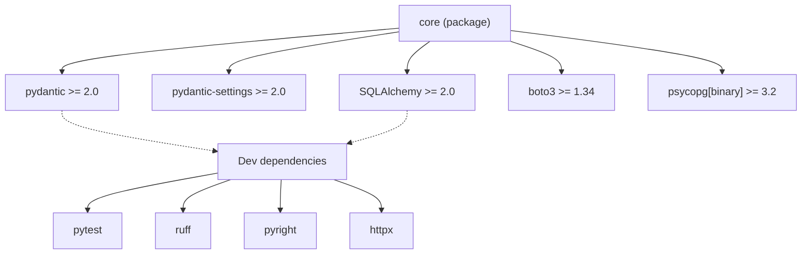
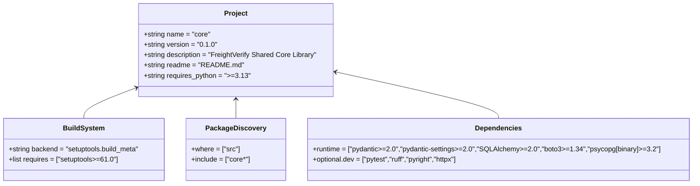
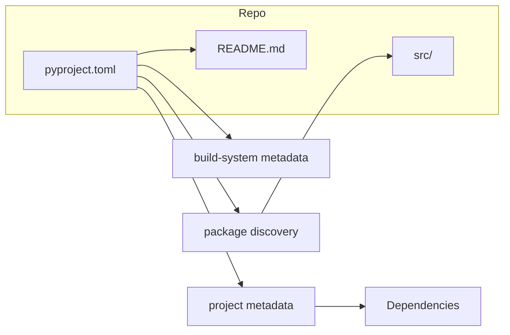
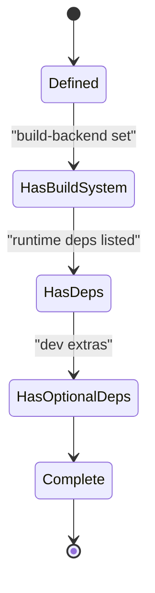

# Diagram: shared/core/pyproject.toml

> Auto-generated by Obscura crawlers

## Diagram 1

### SVG

<svg id="container" width="1181.3125" xmlns="http://www.w3.org/2000/svg" class="flowchart" height="382" viewBox="0 0 1181.3125 382" role="graphics-document document" aria-roledescription="flowchart-v2"><g><marker id="container_flowchart-v2-pointEnd" class="marker flowchart-v2" viewBox="0 0 10 10" refX="5" refY="5" markerUnits="userSpaceOnUse" markerWidth="8" markerHeight="8" orient="auto"><path d="M 0 0 L 10 5 L 0 10 z" class="arrowMarkerPath" style="stroke-width: 1; stroke-dasharray: 1, 0;"></path></marker><marker id="container_flowchart-v2-pointStart" class="marker flowchart-v2" viewBox="0 0 10 10" refX="4.5" refY="5" markerUnits="userSpaceOnUse" markerWidth="8" markerHeight="8" orient="auto"><path d="M 0 5 L 10 10 L 10 0 z" class="arrowMarkerPath" style="stroke-width: 1; stroke-dasharray: 1, 0;"></path></marker><marker id="container_flowchart-v2-circleEnd" class="marker flowchart-v2" viewBox="0 0 10 10" refX="11" refY="5" markerUnits="userSpaceOnUse" markerWidth="11" markerHeight="11" orient="auto"><circle cx="5" cy="5" r="5" class="arrowMarkerPath" style="stroke-width: 1; stroke-dasharray: 1, 0;"></circle></marker><marker id="container_flowchart-v2-circleStart" class="marker flowchart-v2" viewBox="0 0 10 10" refX="-1" refY="5" markerUnits="userSpaceOnUse" markerWidth="11" markerHeight="11" orient="auto"><circle cx="5" cy="5" r="5" class="arrowMarkerPath" style="stroke-width: 1; stroke-dasharray: 1, 0;"></circle></marker><marker id="container_flowchart-v2-crossEnd" class="marker cross flowchart-v2" viewBox="0 0 11 11" refX="12" refY="5.2" markerUnits="userSpaceOnUse" markerWidth="11" markerHeight="11" orient="auto"><path d="M 1,1 l 9,9 M 10,1 l -9,9" class="arrowMarkerPath" style="stroke-width: 2; stroke-dasharray: 1, 0;"></path></marker><marker id="container_flowchart-v2-crossStart" class="marker cross flowchart-v2" viewBox="0 0 11 11" refX="-1" refY="5.2" markerUnits="userSpaceOnUse" markerWidth="11" markerHeight="11" orient="auto"><path d="M 1,1 l 9,9 M 10,1 l -9,9" class="arrowMarkerPath" style="stroke-width: 2; stroke-dasharray: 1, 0;"></path></marker><g class="root"><g class="clusters"></g><g class="edgePaths"><path d="M593.98,42.327L510.301,49.772C426.622,57.218,259.264,72.109,175.585,83.054C91.906,94,91.906,101,91.906,104.5L91.906,108" id="L_Core_Pydantic_0" class="edge-thickness-normal edge-pattern-solid edge-thickness-normal edge-pattern-solid flowchart-link" style=";" data-edge="true" data-et="edge" data-id="L_Core_Pydantic_0" data-points="W3sieCI6NTkzLjk4MDQ2ODc1LCJ5Ijo0Mi4zMjY3MzM5OTY4MzE3ODR9LHsieCI6OTEuOTA2MjUsInkiOjg3fSx7IngiOjkxLjkwNjI1LCJ5IjoxMTJ9XQ==" marker-end="url(#container_flowchart-v2-pointEnd)"></path><path d="M593.98,47.779L551.86,54.316C509.74,60.853,425.499,73.926,383.378,83.963C341.258,94,341.258,101,341.258,104.5L341.258,108" id="L_Core_PydanticSettings_0" class="edge-thickness-normal edge-pattern-solid edge-thickness-normal edge-pattern-solid flowchart-link" style=";" data-edge="true" data-et="edge" data-id="L_Core_PydanticSettings_0" data-points="W3sieCI6NTkzLjk4MDQ2ODc1LCJ5Ijo0Ny43NzkxODMyMzA5MzYwM30seyJ4IjozNDEuMjU3ODEyNSwieSI6ODd9LHsieCI6MzQxLjI1NzgxMjUsInkiOjExMn1d" marker-end="url(#container_flowchart-v2-pointEnd)"></path><path d="M638.544,62L632.714,66.167C626.884,70.333,615.223,78.667,609.393,86.333C603.563,94,603.563,101,603.563,104.5L603.563,108" id="L_Core_SQLAlchemy_0" class="edge-thickness-normal edge-pattern-solid edge-thickness-normal edge-pattern-solid flowchart-link" style=";" data-edge="true" data-et="edge" data-id="L_Core_SQLAlchemy_0" data-points="W3sieCI6NjM4LjU0NDA5NTU1Mjg4NDYsInkiOjYyfSx7IngiOjYwMy41NjI1LCJ5Ijo4N30seyJ4Ijo2MDMuNTYyNSwieSI6MTEyfV0=" marker-end="url(#container_flowchart-v2-pointEnd)"></path><path d="M754.572,62L766.647,66.167C778.722,70.333,802.873,78.667,814.948,86.333C827.023,94,827.023,101,827.023,104.5L827.023,108" id="L_Core_Boto3_0" class="edge-thickness-normal edge-pattern-solid edge-thickness-normal edge-pattern-solid flowchart-link" style=";" data-edge="true" data-et="edge" data-id="L_Core_Boto3_0" data-points="W3sieCI6NzU0LjU3MTg5MDAyNDAzODUsInkiOjYyfSx7IngiOjgyNy4wMjM0Mzc1LCJ5Ijo4N30seyJ4Ijo4MjcuMDIzNDM3NSwieSI6MTEyfV0=" marker-end="url(#container_flowchart-v2-pointEnd)"></path><path d="M758.668,46.06L809.468,52.883C860.268,59.707,961.868,73.353,1012.669,83.677C1063.469,94,1063.469,101,1063.469,104.5L1063.469,108" id="L_Core_Psycopg_0" class="edge-thickness-normal edge-pattern-solid edge-thickness-normal edge-pattern-solid flowchart-link" style=";" data-edge="true" data-et="edge" data-id="L_Core_Psycopg_0" data-points="W3sieCI6NzU4LjY2Nzk2ODc1LCJ5Ijo0Ni4wNjAxNDU4OTk5Njg3MjR9LHsieCI6MTA2My40Njg3NSwieSI6ODd9LHsieCI6MTA2My40Njg3NSwieSI6MTEyfV0=" marker-end="url(#container_flowchart-v2-pointEnd)"></path><path d="M324.004,259.875L290.53,265.729C257.056,271.583,190.108,283.292,156.634,292.646C123.16,302,123.16,309,123.16,312.5L123.16,316" id="L_DevDeps_Pytest_0" class="edge-thickness-normal edge-pattern-solid edge-thickness-normal edge-pattern-solid flowchart-link" style=";" data-edge="true" data-et="edge" data-id="L_DevDeps_Pytest_0" data-points="W3sieCI6MzI0LjAwMzkwNjI1LCJ5IjoyNTkuODc1MTY3NTAzMDg3M30seyJ4IjoxMjMuMTYwMTU2MjUsInkiOjI5NX0seyJ4IjoxMjMuMTYwMTU2MjUsInkiOjMyMH1d" marker-end="url(#container_flowchart-v2-pointEnd)"></path><path d="M341.67,270L329.506,274.167C317.341,278.333,293.013,286.667,280.848,294.333C268.684,302,268.684,309,268.684,312.5L268.684,316" id="L_DevDeps_Ruff_0" class="edge-thickness-normal edge-pattern-solid edge-thickness-normal edge-pattern-solid flowchart-link" style=";" data-edge="true" data-et="edge" data-id="L_DevDeps_Ruff_0" data-points="W3sieCI6MzQxLjY3MDM3MjU5NjE1MzgsInkiOjI3MH0seyJ4IjoyNjguNjgzNTkzNzUsInkiOjI5NX0seyJ4IjoyNjguNjgzNTkzNzUsInkiOjMyMH1d" marker-end="url(#container_flowchart-v2-pointEnd)"></path><path d="M418.959,270L418.721,274.167C418.484,278.333,418.01,286.667,417.772,294.333C417.535,302,417.535,309,417.535,312.5L417.535,316" id="L_DevDeps_Pyright_0" class="edge-thickness-normal edge-pattern-solid edge-thickness-normal edge-pattern-solid flowchart-link" style=";" data-edge="true" data-et="edge" data-id="L_DevDeps_Pyright_0" data-points="W3sieCI6NDE4Ljk1ODY4Mzg5NDIzMDgsInkiOjI3MH0seyJ4Ijo0MTcuNTM1MTU2MjUsInkiOjI5NX0seyJ4Ijo0MTcuNTM1MTU2MjUsInkiOjMyMH1d" marker-end="url(#container_flowchart-v2-pointEnd)"></path><path d="M499.322,270L511.486,274.167C523.651,278.333,547.98,286.667,560.144,294.333C572.309,302,572.309,309,572.309,312.5L572.309,316" id="L_DevDeps_Httpx_0" class="edge-thickness-normal edge-pattern-solid edge-thickness-normal edge-pattern-solid flowchart-link" style=";" data-edge="true" data-et="edge" data-id="L_DevDeps_Httpx_0" data-points="W3sieCI6NDk5LjMyMTgxNDkwMzg0NjIsInkiOjI3MH0seyJ4Ijo1NzIuMzA4NTkzNzUsInkiOjI5NX0seyJ4Ijo1NzIuMzA4NTkzNzUsInkiOjMyMH1d" marker-end="url(#container_flowchart-v2-pointEnd)"></path><path d="M91.906,166L91.906,170.167C91.906,174.333,91.906,182.667,129.931,192.851C167.955,203.035,244.004,215.07,282.029,221.087L320.053,227.105" id="L_Pydantic_DevDeps_0" class="edge-thickness-normal edge-pattern-dotted edge-thickness-normal edge-pattern-solid flowchart-link" style=";" data-edge="true" data-et="edge" data-id="L_Pydantic_DevDeps_0" data-points="W3sieCI6OTEuOTA2MjUsInkiOjE2Nn0seyJ4Ijo5MS45MDYyNSwieSI6MTkxfSx7IngiOjMyNC4wMDM5MDYyNSwieSI6MjI3LjcyOTkxODMyOTk4NDl9XQ==" marker-end="url(#container_flowchart-v2-pointEnd)"></path><path d="M603.563,166L603.563,170.167C603.563,174.333,603.563,182.667,589.535,190.818C575.508,198.969,547.453,206.938,533.425,210.923L519.398,214.907" id="L_SQLAlchemy_DevDeps_0" class="edge-thickness-normal edge-pattern-dotted edge-thickness-normal edge-pattern-solid flowchart-link" style=";" data-edge="true" data-et="edge" data-id="L_SQLAlchemy_DevDeps_0" data-points="W3sieCI6NjAzLjU2MjUsInkiOjE2Nn0seyJ4Ijo2MDMuNTYyNSwieSI6MTkxfSx7IngiOjUxNS41NDk4MDQ2ODc1LCJ5IjoyMTZ9XQ==" marker-end="url(#container_flowchart-v2-pointEnd)"></path></g><g class="edgeLabels"><g class="edgeLabel"><g class="label" data-id="L_Core_Pydantic_0" transform="translate(0, 0)"><foreignObject width="0" height="0">

</foreignObject></g></g><g class="edgeLabel"><g class="label" data-id="L_Core_PydanticSettings_0" transform="translate(0, 0)"><foreignObject width="0" height="0">

</foreignObject></g></g><g class="edgeLabel"><g class="label" data-id="L_Core_SQLAlchemy_0" transform="translate(0, 0)"><foreignObject width="0" height="0">

</foreignObject></g></g><g class="edgeLabel"><g class="label" data-id="L_Core_Boto3_0" transform="translate(0, 0)"><foreignObject width="0" height="0">

</foreignObject></g></g><g class="edgeLabel"><g class="label" data-id="L_Core_Psycopg_0" transform="translate(0, 0)"><foreignObject width="0" height="0">

</foreignObject></g></g><g class="edgeLabel"><g class="label" data-id="L_DevDeps_Pytest_0" transform="translate(0, 0)"><foreignObject width="0" height="0">

</foreignObject></g></g><g class="edgeLabel"><g class="label" data-id="L_DevDeps_Ruff_0" transform="translate(0, 0)"><foreignObject width="0" height="0">

</foreignObject></g></g><g class="edgeLabel"><g class="label" data-id="L_DevDeps_Pyright_0" transform="translate(0, 0)"><foreignObject width="0" height="0">

</foreignObject></g></g><g class="edgeLabel"><g class="label" data-id="L_DevDeps_Httpx_0" transform="translate(0, 0)"><foreignObject width="0" height="0">

</foreignObject></g></g><g class="edgeLabel"><g class="label" data-id="L_Pydantic_DevDeps_0" transform="translate(0, 0)"><foreignObject width="0" height="0">

</foreignObject></g></g><g class="edgeLabel"><g class="label" data-id="L_SQLAlchemy_DevDeps_0" transform="translate(0, 0)"><foreignObject width="0" height="0">

</foreignObject></g></g></g><g class="nodes"><g class="node default" id="flowchart-Core-0" transform="translate(676.32421875, 35)"><rect class="basic label-container" style="" x="-82.34375" y="-27" width="164.6875" height="54"></rect><g class="label" style="" transform="translate(-52.34375, -12)"><rect></rect><foreignObject width="104.6875" height="24">

core (package)

</foreignObject></g></g><g class="node default" id="flowchart-Pydantic-1" transform="translate(91.90625, 139)"><rect class="basic label-container" style="" x="-83.90625" y="-27" width="167.8125" height="54"></rect><g class="label" style="" transform="translate(-53.90625, -12)"><rect></rect><foreignObject width="107.8125" height="24">

pydantic &gt;= 2.0

</foreignObject></g></g><g class="node default" id="flowchart-PydanticSettings-2" transform="translate(341.2578125, 139)"><rect class="basic label-container" style="" x="-115.4453125" y="-27" width="230.890625" height="54"></rect><g class="label" style="" transform="translate(-85.4453125, -12)"><rect></rect><foreignObject width="170.890625" height="24">

pydantic-settings &gt;= 2.0

</foreignObject></g></g><g class="node default" id="flowchart-SQLAlchemy-3" transform="translate(603.5625, 139)"><rect class="basic label-container" style="" x="-96.859375" y="-27" width="193.71875" height="54"></rect><g class="label" style="" transform="translate(-66.859375, -12)"><rect></rect><foreignObject width="133.71875" height="24">

SQLAlchemy &gt;= 2.0

</foreignObject></g></g><g class="node default" id="flowchart-Boto3-4" transform="translate(827.0234375, 139)"><rect class="basic label-container" style="" x="-76.6015625" y="-27" width="153.203125" height="54"></rect><g class="label" style="" transform="translate(-46.6015625, -12)"><rect></rect><foreignObject width="93.203125" height="24">

boto3 &gt;= 1.34

</foreignObject></g></g><g class="node default" id="flowchart-Psycopg-5" transform="translate(1063.46875, 139)"><rect class="basic label-container" style="" x="-109.84375" y="-27" width="219.6875" height="54"></rect><g class="label" style="" transform="translate(-79.84375, -12)"><rect></rect><foreignObject width="159.6875" height="24">

psycopg[binary] &gt;= 3.2

</foreignObject></g></g><g class="node default" id="flowchart-DevDeps-6" transform="translate(420.49609375, 243)"><rect class="basic label-container" style="" x="-96.4921875" y="-27" width="192.984375" height="54"></rect><g class="label" style="" transform="translate(-66.4921875, -12)"><rect></rect><foreignObject width="132.984375" height="24">

Dev dependencies

</foreignObject></g></g><g class="node default" id="flowchart-Pytest-7" transform="translate(123.16015625, 347)"><rect class="basic label-container" style="" x="-52.4140625" y="-27" width="104.828125" height="54"></rect><g class="label" style="" transform="translate(-22.4140625, -12)"><rect></rect><foreignObject width="44.828125" height="24">

pytest

</foreignObject></g></g><g class="node default" id="flowchart-Ruff-8" transform="translate(268.68359375, 347)"><rect class="basic label-container" style="" x="-43.109375" y="-27" width="86.21875" height="54"></rect><g class="label" style="" transform="translate(-13.109375, -12)"><rect></rect><foreignObject width="26.21875" height="24">

ruff

</foreignObject></g></g><g class="node default" id="flowchart-Pyright-9" transform="translate(417.53515625, 347)"><rect class="basic label-container" style="" x="-55.7421875" y="-27" width="111.484375" height="54"></rect><g class="label" style="" transform="translate(-25.7421875, -12)"><rect></rect><foreignObject width="51.484375" height="24">

pyright

</foreignObject></g></g><g class="node default" id="flowchart-Httpx-10" transform="translate(572.30859375, 347)"><rect class="basic label-container" style="" x="-49.03125" y="-27" width="98.0625" height="54"></rect><g class="label" style="" transform="translate(-19.03125, -12)"><rect></rect><foreignObject width="38.0625" height="24">

httpx

</foreignObject></g></g></g></g></g></svg>

## Diagram 2

### SVG

<svg id="container" width="1577.3125" xmlns="http://www.w3.org/2000/svg" class="classDiagram" height="426" viewBox="0 0 1577.3125 426" role="graphics-document document" aria-roledescription="class"><g><defs><marker id="container_class-aggregationStart" class="marker aggregation class" refX="18" refY="7" markerWidth="190" markerHeight="240" orient="auto"><path d="M 18,7 L9,13 L1,7 L9,1 Z"></path></marker></defs><defs><marker id="container_class-aggregationEnd" class="marker aggregation class" refX="1" refY="7" markerWidth="20" markerHeight="28" orient="auto"><path d="M 18,7 L9,13 L1,7 L9,1 Z"></path></marker></defs><defs><marker id="container_class-extensionStart" class="marker extension class" refX="18" refY="7" markerWidth="190" markerHeight="240" orient="auto"><path d="M 1,7 L18,13 V 1 Z"></path></marker></defs><defs><marker id="container_class-extensionEnd" class="marker extension class" refX="1" refY="7" markerWidth="20" markerHeight="28" orient="auto"><path d="M 1,1 V 13 L18,7 Z"></path></marker></defs><defs><marker id="container_class-compositionStart" class="marker composition class" refX="18" refY="7" markerWidth="190" markerHeight="240" orient="auto"><path d="M 18,7 L9,13 L1,7 L9,1 Z"></path></marker></defs><defs><marker id="container_class-compositionEnd" class="marker composition class" refX="1" refY="7" markerWidth="20" markerHeight="28" orient="auto"><path d="M 18,7 L9,13 L1,7 L9,1 Z"></path></marker></defs><defs><marker id="container_class-dependencyStart" class="marker dependency class" refX="6" refY="7" markerWidth="190" markerHeight="240" orient="auto"><path d="M 5,7 L9,13 L1,7 L9,1 Z"></path></marker></defs><defs><marker id="container_class-dependencyEnd" class="marker dependency class" refX="13" refY="7" markerWidth="20" markerHeight="28" orient="auto"><path d="M 18,7 L9,13 L14,7 L9,1 Z"></path></marker></defs><defs><marker id="container_class-lollipopStart" class="marker lollipop class" refX="13" refY="7" markerWidth="190" markerHeight="240" orient="auto"><circle stroke="black" fill="transparent" cx="7" cy="7" r="6"></circle></marker></defs><defs><marker id="container_class-lollipopEnd" class="marker lollipop class" refX="1" refY="7" markerWidth="190" markerHeight="240" orient="auto"><circle stroke="black" fill="transparent" cx="7" cy="7" r="6"></circle></marker></defs><g class="root"><g class="clusters"></g><g class="edgePaths"><path d="M317.787,203.37L297.597,210.975C277.406,218.58,237.026,233.79,216.835,245.562C196.645,257.333,196.645,265.667,196.645,269.833L196.645,274" id="id_Project_BuildSystem_1" class="edge-thickness-normal edge-pattern-solid relation" style=";;;" data-edge="true" data-et="edge" data-id="id_Project_BuildSystem_1" data-points="W3sieCI6MzIzLjQwMjM0Mzc1LCJ5IjoyMDEuMjU0NTk5MzYwNTY5OTZ9LHsieCI6MTk2LjY0NDUzMTI1LCJ5IjoyNDl9LHsieCI6MTk2LjY0NDUzMTI1LCJ5IjoyNzR9XQ==" marker-start="url(#container_class-dependencyStart)"></path><path d="M549.742,230L549.742,233.167C549.742,236.333,549.742,242.667,549.742,250C549.742,257.333,549.742,265.667,549.742,269.833L549.742,274" id="id_Project_PackageDiscovery_2" class="edge-thickness-normal edge-pattern-solid relation" style=";;;" data-edge="true" data-et="edge" data-id="id_Project_PackageDiscovery_2" data-points="W3sieCI6NTQ5Ljc0MjE4NzUsInkiOjIyNH0seyJ4Ijo1NDkuNzQyMTg3NSwieSI6MjQ5fSx7IngiOjU0OS43NDIxODc1LCJ5IjoyNzR9XQ==" marker-start="url(#container_class-dependencyStart)"></path><path d="M781.936,168.164L841.906,181.637C901.875,195.109,1021.815,222.055,1081.784,239.694C1141.754,257.333,1141.754,265.667,1141.754,269.833L1141.754,274" id="id_Project_Dependencies_3" class="edge-thickness-normal edge-pattern-solid relation" style=";;;" data-edge="true" data-et="edge" data-id="id_Project_Dependencies_3" data-points="W3sieCI6Nzc2LjA4MjAzMTI1LCJ5IjoxNjYuODQ4OTkyMTE1MDczNzR9LHsieCI6MTE0MS43NTM5MDYyNSwieSI6MjQ5fSx7IngiOjExNDEuNzUzOTA2MjUsInkiOjI3NH1d" marker-start="url(#container_class-dependencyStart)"></path></g><g class="edgeLabels"><g class="edgeLabel"><g class="label" data-id="id_Project_BuildSystem_1" transform="translate(0, 0)"><foreignObject width="0" height="0">

</foreignObject></g></g><g class="edgeLabel"><g class="label" data-id="id_Project_PackageDiscovery_2" transform="translate(0, 0)"><foreignObject width="0" height="0">

</foreignObject></g></g><g class="edgeLabel"><g class="label" data-id="id_Project_Dependencies_3" transform="translate(0, 0)"><foreignObject width="0" height="0">

</foreignObject></g></g></g><g class="nodes"><g class="node default" id="classId-Project-0" transform="translate(549.7421875, 116)"><g class="basic label-container"><path d="M-226.33984375 -108 L226.33984375 -108 L226.33984375 108 L-226.33984375 108" stroke="none" stroke-width="0" fill="#ECECFF" style=""></path><path d="M-226.33984375 -108 C-95.02626077217872 -108, 36.28732220564257 -108, 226.33984375 -108 M-226.33984375 -108 C-57.98085575790296 -108, 110.37813223419408 -108, 226.33984375 -108 M226.33984375 -108 C226.33984375 -37.30027701691891, 226.33984375 33.399445966162176, 226.33984375 108 M226.33984375 -108 C226.33984375 -28.71284447326667, 226.33984375 50.57431105346666, 226.33984375 108 M226.33984375 108 C45.34492172469794 108, -135.65000030060412 108, -226.33984375 108 M226.33984375 108 C67.77463907046669 108, -90.79056560906662 108, -226.33984375 108 M-226.33984375 108 C-226.33984375 46.92110927423534, -226.33984375 -14.157781451529317, -226.33984375 -108 M-226.33984375 108 C-226.33984375 64.67450818641694, -226.33984375 21.3490163728339, -226.33984375 -108" stroke="#9370DB" stroke-width="1.3" fill="none" stroke-dasharray="0 0" style=""></path></g><g class="annotation-group text" transform="translate(0, -84)"></g><g class="label-group text" transform="translate(-25.8671875, -84)"><g class="label" style="font-weight: bolder" transform="translate(0,-12)"><foreignObject width="51.734375" height="24">

Project

</foreignObject></g></g><g class="members-group text" transform="translate(-214.33984375, -36)"><g class="label" style="" transform="translate(0,-12)"><foreignObject width="154.390625" height="24">

+string name = "core"

</foreignObject></g><g class="label" style="" transform="translate(0,12)"><foreignObject width="166.4375" height="24">

+string version = "0.1.0"

</foreignObject></g><g class="label" style="" transform="translate(0,36)"><foreignObject width="402.8125" height="24">

+string description = "FreightVerify Shared Core Library"

</foreignObject></g><g class="label" style="" transform="translate(0,60)"><foreignObject width="223.796875" height="24">

+string readme = "README.md"

</foreignObject></g><g class="label" style="" transform="translate(0,84)"><foreignObject width="242.5625" height="24">

+string requires_python = "&gt;=3.13"

</foreignObject></g></g><g class="methods-group text" transform="translate(-214.33984375, 108)"></g><g class="divider" style=""><path d="M-226.33984375 -60 C-46.30844207402612 -60, 133.72295960194776 -60, 226.33984375 -60 M-226.33984375 -60 C-124.46499043681713 -60, -22.590137123634264 -60, 226.33984375 -60" stroke="#9370DB" stroke-width="1.3" fill="none" stroke-dasharray="0 0" style=""></path></g><g class="divider" style=""><path d="M-226.33984375 84 C-63.48122191676268 84, 99.37739991647464 84, 226.33984375 84 M-226.33984375 84 C-128.54742487579065 84, -30.755006001581307 84, 226.33984375 84" stroke="#9370DB" stroke-width="1.3" fill="none" stroke-dasharray="0 0" style=""></path></g></g><g class="node default" id="classId-BuildSystem-1" transform="translate(196.64453125, 346)"><g class="basic label-container"><path d="M-188.64453125 -72 L188.64453125 -72 L188.64453125 72 L-188.64453125 72" stroke="none" stroke-width="0" fill="#ECECFF" style=""></path><path d="M-188.64453125 -72 C-74.27829797278076 -72, 40.087935304438474 -72, 188.64453125 -72 M-188.64453125 -72 C-65.1814051451054 -72, 58.2817209597892 -72, 188.64453125 -72 M188.64453125 -72 C188.64453125 -24.77690081713648, 188.64453125 22.446198365727042, 188.64453125 72 M188.64453125 -72 C188.64453125 -20.649350421445547, 188.64453125 30.701299157108906, 188.64453125 72 M188.64453125 72 C54.988607507295626 72, -78.66731623540875 72, -188.64453125 72 M188.64453125 72 C65.49079439413774 72, -57.662942461724526 72, -188.64453125 72 M-188.64453125 72 C-188.64453125 42.543247714779355, -188.64453125 13.086495429558717, -188.64453125 -72 M-188.64453125 72 C-188.64453125 35.603184103264525, -188.64453125 -0.7936317934709507, -188.64453125 -72" stroke="#9370DB" stroke-width="1.3" fill="none" stroke-dasharray="0 0" style=""></path></g><g class="annotation-group text" transform="translate(0, -48)"></g><g class="label-group text" transform="translate(-45.4609375, -48)"><g class="label" style="font-weight: bolder" transform="translate(0,-12)"><foreignObject width="90.921875" height="24">

BuildSystem

</foreignObject></g></g><g class="members-group text" transform="translate(-176.64453125, 0)"><g class="label" style="" transform="translate(0,-12)"><foreignObject width="307.828125" height="24">

+string backend = "setuptools.build_meta"

</foreignObject></g><g class="label" style="" transform="translate(0,12)"><foreignObject width="254.34375" height="24">

+list requires = ["setuptools&gt;=61.0"]

</foreignObject></g></g><g class="methods-group text" transform="translate(-176.64453125, 72)"></g><g class="divider" style=""><path d="M-188.64453125 -24 C-71.40578082495705 -24, 45.8329696000859 -24, 188.64453125 -24 M-188.64453125 -24 C-74.24281902155919 -24, 40.15889320688163 -24, 188.64453125 -24" stroke="#9370DB" stroke-width="1.3" fill="none" stroke-dasharray="0 0" style=""></path></g><g class="divider" style=""><path d="M-188.64453125 48 C-73.54542260951202 48, 41.55368603097597 48, 188.64453125 48 M-188.64453125 48 C-72.96366973648563 48, 42.717191777028745 48, 188.64453125 48" stroke="#9370DB" stroke-width="1.3" fill="none" stroke-dasharray="0 0" style=""></path></g></g><g class="node default" id="classId-PackageDiscovery-2" transform="translate(549.7421875, 346)"><g class="basic label-container"><path d="M-114.453125 -72 L114.453125 -72 L114.453125 72 L-114.453125 72" stroke="none" stroke-width="0" fill="#ECECFF" style=""></path><path d="M-114.453125 -72 C-25.924682005456134 -72, 62.60376098908773 -72, 114.453125 -72 M-114.453125 -72 C-42.799788899138065 -72, 28.85354720172387 -72, 114.453125 -72 M114.453125 -72 C114.453125 -26.127498529474202, 114.453125 19.745002941051595, 114.453125 72 M114.453125 -72 C114.453125 -27.623409548069766, 114.453125 16.753180903860468, 114.453125 72 M114.453125 72 C25.85902519698388 72, -62.73507460603224 72, -114.453125 72 M114.453125 72 C53.545812978952135 72, -7.36149904209573 72, -114.453125 72 M-114.453125 72 C-114.453125 27.596087726346575, -114.453125 -16.80782454730685, -114.453125 -72 M-114.453125 72 C-114.453125 42.044055788008706, -114.453125 12.088111576017411, -114.453125 -72" stroke="#9370DB" stroke-width="1.3" fill="none" stroke-dasharray="0 0" style=""></path></g><g class="annotation-group text" transform="translate(0, -48)"></g><g class="label-group text" transform="translate(-65.265625, -48)"><g class="label" style="font-weight: bolder" transform="translate(0,-12)"><foreignObject width="130.53125" height="24">

PackageDiscovery

</foreignObject></g></g><g class="members-group text" transform="translate(-102.453125, 0)"><g class="label" style="" transform="translate(0,-12)"><foreignObject width="112.5" height="24">

+where = ["src"]

</foreignObject></g><g class="label" style="" transform="translate(0,12)"><foreignObject width="139.640625" height="24">

+include = ["core*"]

</foreignObject></g></g><g class="methods-group text" transform="translate(-102.453125, 72)"></g><g class="divider" style=""><path d="M-114.453125 -24 C-56.604529932831326 -24, 1.2440651343373474 -24, 114.453125 -24 M-114.453125 -24 C-42.28395903390508 -24, 29.885206932189845 -24, 114.453125 -24" stroke="#9370DB" stroke-width="1.3" fill="none" stroke-dasharray="0 0" style=""></path></g><g class="divider" style=""><path d="M-114.453125 48 C-23.631835487457423 48, 67.18945402508515 48, 114.453125 48 M-114.453125 48 C-29.296739191088122 48, 55.859646617823756 48, 114.453125 48" stroke="#9370DB" stroke-width="1.3" fill="none" stroke-dasharray="0 0" style=""></path></g></g><g class="node default" id="classId-Dependencies-3" transform="translate(1141.75390625, 346)"><g class="basic label-container"><path d="M-427.55859375 -72 L427.55859375 -72 L427.55859375 72 L-427.55859375 72" stroke="none" stroke-width="0" fill="#ECECFF" style=""></path><path d="M-427.55859375 -72 C-146.30286993413932 -72, 134.95285388172135 -72, 427.55859375 -72 M-427.55859375 -72 C-240.51865882248248 -72, -53.47872389496496 -72, 427.55859375 -72 M427.55859375 -72 C427.55859375 -27.575705477534406, 427.55859375 16.848589044931188, 427.55859375 72 M427.55859375 -72 C427.55859375 -23.57020834118046, 427.55859375 24.85958331763908, 427.55859375 72 M427.55859375 72 C207.05427014368618 72, -13.450053462627636 72, -427.55859375 72 M427.55859375 72 C136.18531594820092 72, -155.18796185359815 72, -427.55859375 72 M-427.55859375 72 C-427.55859375 37.449033199543756, -427.55859375 2.8980663990875115, -427.55859375 -72 M-427.55859375 72 C-427.55859375 36.154336627375, -427.55859375 0.30867325475000484, -427.55859375 -72" stroke="#9370DB" stroke-width="1.3" fill="none" stroke-dasharray="0 0" style=""></path></g><g class="annotation-group text" transform="translate(0, -48)"></g><g class="label-group text" transform="translate(-51.6328125, -48)"><g class="label" style="font-weight: bolder" transform="translate(0,-12)"><foreignObject width="103.265625" height="24">

Dependencies

</foreignObject></g></g><g class="members-group text" transform="translate(-415.55859375, 0)"><g class="label" style="" transform="translate(0,-12)"><foreignObject width="779.484375" height="24">

+runtime = ["pydantic&gt;=2.0","pydantic-settings&gt;=2.0","SQLAlchemy&gt;=2.0","boto3&gt;=1.34","psycopg[binary]&gt;=3.2"]

</foreignObject></g><g class="label" style="" transform="translate(0,12)"><foreignObject width="340.203125" height="24">

+optional.dev = ["pytest","ruff","pyright","httpx"]

</foreignObject></g></g><g class="methods-group text" transform="translate(-415.55859375, 72)"></g><g class="divider" style=""><path d="M-427.55859375 -24 C-99.84265377486554 -24, 227.87328620026892 -24, 427.55859375 -24 M-427.55859375 -24 C-147.78031350839439 -24, 131.99796673321123 -24, 427.55859375 -24" stroke="#9370DB" stroke-width="1.3" fill="none" stroke-dasharray="0 0" style=""></path></g><g class="divider" style=""><path d="M-427.55859375 48 C-212.63441188448923 48, 2.28976998102155 48, 427.55859375 48 M-427.55859375 48 C-253.47637696519217 48, -79.39416018038435 48, 427.55859375 48" stroke="#9370DB" stroke-width="1.3" fill="none" stroke-dasharray="0 0" style=""></path></g></g></g></g></g></svg>

## Diagram 3

### SVG

<svg id="container" width="721.875" xmlns="http://www.w3.org/2000/svg" class="flowchart" height="466" viewBox="0 0 721.875 466" role="graphics-document document" aria-roledescription="flowchart-v2"><g><marker id="container_flowchart-v2-pointEnd" class="marker flowchart-v2" viewBox="0 0 10 10" refX="5" refY="5" markerUnits="userSpaceOnUse" markerWidth="8" markerHeight="8" orient="auto"><path d="M 0 0 L 10 5 L 0 10 z" class="arrowMarkerPath" style="stroke-width: 1; stroke-dasharray: 1, 0;"></path></marker><marker id="container_flowchart-v2-pointStart" class="marker flowchart-v2" viewBox="0 0 10 10" refX="4.5" refY="5" markerUnits="userSpaceOnUse" markerWidth="8" markerHeight="8" orient="auto"><path d="M 0 5 L 10 10 L 10 0 z" class="arrowMarkerPath" style="stroke-width: 1; stroke-dasharray: 1, 0;"></path></marker><marker id="container_flowchart-v2-circleEnd" class="marker flowchart-v2" viewBox="0 0 10 10" refX="11" refY="5" markerUnits="userSpaceOnUse" markerWidth="11" markerHeight="11" orient="auto"><circle cx="5" cy="5" r="5" class="arrowMarkerPath" style="stroke-width: 1; stroke-dasharray: 1, 0;"></circle></marker><marker id="container_flowchart-v2-circleStart" class="marker flowchart-v2" viewBox="0 0 10 10" refX="-1" refY="5" markerUnits="userSpaceOnUse" markerWidth="11" markerHeight="11" orient="auto"><circle cx="5" cy="5" r="5" class="arrowMarkerPath" style="stroke-width: 1; stroke-dasharray: 1, 0;"></circle></marker><marker id="container_flowchart-v2-crossEnd" class="marker cross flowchart-v2" viewBox="0 0 11 11" refX="12" refY="5.2" markerUnits="userSpaceOnUse" markerWidth="11" markerHeight="11" orient="auto"><path d="M 1,1 l 9,9 M 10,1 l -9,9" class="arrowMarkerPath" style="stroke-width: 2; stroke-dasharray: 1, 0;"></path></marker><marker id="container_flowchart-v2-crossStart" class="marker cross flowchart-v2" viewBox="0 0 11 11" refX="-1" refY="5.2" markerUnits="userSpaceOnUse" markerWidth="11" markerHeight="11" orient="auto"><path d="M 1,1 l 9,9 M 10,1 l -9,9" class="arrowMarkerPath" style="stroke-width: 2; stroke-dasharray: 1, 0;"></path></marker><g class="root"><g class="clusters"><g class="cluster" id="Repo" data-look="classic"><rect style="" x="8" y="8" width="705.875" height="153"></rect><g class="cluster-label" transform="translate(342.4296875, 8)"><foreignObject width="37.015625" height="24">

Repo

</foreignObject></g></g></g><g class="edgePaths"><path d="M198.188,122.797L202.354,123.997C206.521,125.198,214.854,127.599,239.833,173.861C264.813,220.123,306.438,310.246,327.251,355.307L348.063,400.369" id="L_pyproject_ProjectMeta_0" class="edge-thickness-normal edge-pattern-solid edge-thickness-normal edge-pattern-solid flowchart-link" style=";" data-edge="true" data-et="edge" data-id="L_pyproject_ProjectMeta_0" data-points="W3sieCI6MTk4LjE4NzUsInkiOjEyMi43OTY5NzkzNzg0NDkwMn0seyJ4IjoyMjMuMTg3NSwieSI6MTMwfSx7IngiOjM0OS43NDAzOTY1OTQ2ODQ0LCJ5Ijo0MDR9XQ==" marker-end="url(#container_flowchart-v2-pointEnd)"></path><path d="M198.188,92.091L202.354,91.743C206.521,91.394,214.854,90.697,237.006,107.554C259.158,124.412,295.128,158.823,313.113,176.029L331.098,193.235" id="L_pyproject_BuildMeta_0" class="edge-thickness-normal edge-pattern-solid edge-thickness-normal edge-pattern-solid flowchart-link" style=";" data-edge="true" data-et="edge" data-id="L_pyproject_BuildMeta_0" data-points="W3sieCI6MTk4LjE4NzUsInkiOjkyLjA5MTE5OTUzNTI4OX0seyJ4IjoyMjMuMTg3NSwieSI6OTB9LHsieCI6MzMzLjk4ODEzNDM5ODQ5NjI0LCJ5IjoxOTZ9XQ==" marker-end="url(#container_flowchart-v2-pointEnd)"></path><path d="M198.188,107.444L202.354,107.87C206.521,108.296,214.854,109.148,238.949,140.679C263.043,172.211,302.899,234.421,322.827,265.527L342.755,296.632" id="L_pyproject_Packaging_0" class="edge-thickness-normal edge-pattern-solid edge-thickness-normal edge-pattern-solid flowchart-link" style=";" data-edge="true" data-et="edge" data-id="L_pyproject_Packaging_0" data-points="W3sieCI6MTk4LjE4NzUsInkiOjEwNy40NDQwODk0NTY4NjkwMX0seyJ4IjoyMjMuMTg3NSwieSI6MTEwfSx7IngiOjM0NC45MTMwOTA0Mzc3ODgsInkiOjMwMH1d" marker-end="url(#container_flowchart-v2-pointEnd)"></path><path d="M454.641,431L462.406,431C470.172,431,485.703,431,496.969,431C508.234,431,515.234,431,518.734,431L522.234,431" id="L_ProjectMeta_Dependencies_0" class="edge-thickness-normal edge-pattern-solid edge-thickness-normal edge-pattern-solid flowchart-link" style=";" data-edge="true" data-et="edge" data-id="L_ProjectMeta_Dependencies_0" data-points="W3sieCI6NDU0LjY0MDYyNSwieSI6NDMxfSx7IngiOjUwMS4yMzQzNzUsInkiOjQzMX0seyJ4Ijo1MjYuMjM0Mzc1LCJ5Ijo0MzF9XQ==" marker-end="url(#container_flowchart-v2-pointEnd)"></path><path d="M377.347,300L397.995,263.167C418.642,226.333,459.938,152.667,490.211,115.833C520.484,79,539.734,79,549.359,79L558.984,79" id="L_Packaging_src_0" class="edge-thickness-normal edge-pattern-solid edge-thickness-normal edge-pattern-solid flowchart-link" style=";" data-edge="true" data-et="edge" data-id="L_Packaging_src_0" data-points="W3sieCI6Mzc3LjM0NjU1MzY3OTQzNTUsInkiOjMwMH0seyJ4Ijo1MDEuMjM0Mzc1LCJ5Ijo3OX0seyJ4Ijo1NjIuOTg0Mzc1LCJ5Ijo3OX1d" marker-end="url(#container_flowchart-v2-pointEnd)"></path><path d="M198.188,76.738L202.354,75.615C206.521,74.492,214.854,72.246,229.38,71.123C243.906,70,264.625,70,274.984,70L285.344,70" id="L_pyproject_README_0" class="edge-thickness-normal edge-pattern-solid edge-thickness-normal edge-pattern-solid flowchart-link" style=";" data-edge="true" data-et="edge" data-id="L_pyproject_README_0" data-points="W3sieCI6MTk4LjE4NzUsInkiOjc2LjczODMwOTYxMzcwODk4fSx7IngiOjIyMy4xODc1LCJ5Ijo3MH0seyJ4IjoyODkuMzQzNzUsInkiOjcwfV0=" marker-end="url(#container_flowchart-v2-pointEnd)"></path></g><g class="edgeLabels"><g class="edgeLabel"><g class="label" data-id="L_pyproject_ProjectMeta_0" transform="translate(0, 0)"><foreignObject width="0" height="0">

</foreignObject></g></g><g class="edgeLabel"><g class="label" data-id="L_pyproject_BuildMeta_0" transform="translate(0, 0)"><foreignObject width="0" height="0">

</foreignObject></g></g><g class="edgeLabel"><g class="label" data-id="L_pyproject_Packaging_0" transform="translate(0, 0)"><foreignObject width="0" height="0">

</foreignObject></g></g><g class="edgeLabel"><g class="label" data-id="L_ProjectMeta_Dependencies_0" transform="translate(0, 0)"><foreignObject width="0" height="0">

</foreignObject></g></g><g class="edgeLabel"><g class="label" data-id="L_Packaging_src_0" transform="translate(0, 0)"><foreignObject width="0" height="0">

</foreignObject></g></g><g class="edgeLabel"><g class="label" data-id="L_pyproject_README_0" transform="translate(0, 0)"><foreignObject width="0" height="0">

</foreignObject></g></g></g><g class="nodes"><g class="node default" id="flowchart-pyproject-0" transform="translate(115.59375, 99)"><rect class="basic label-container" style="" x="-82.59375" y="-27" width="165.1875" height="54"></rect><g class="label" style="" transform="translate(-52.59375, -12)"><rect></rect><foreignObject width="105.1875" height="24">

pyproject.toml

</foreignObject></g></g><g class="node default" id="flowchart-src-1" transform="translate(607.5546875, 79)"><rect class="basic label-container" style="" x="-44.5703125" y="-27" width="89.140625" height="54"></rect><g class="label" style="" transform="translate(-14.5703125, -12)"><rect></rect><foreignObject width="29.140625" height="24">

src/

</foreignObject></g></g><g class="node default" id="flowchart-README-2" transform="translate(362.2109375, 70)"><rect class="basic label-container" style="" x="-72.8671875" y="-27" width="145.734375" height="54"></rect><g class="label" style="" transform="translate(-42.8671875, -12)"><rect></rect><foreignObject width="85.734375" height="24">

README.md

</foreignObject></g></g><g class="node default" id="flowchart-ProjectMeta-4" transform="translate(362.2109375, 431)"><rect class="basic label-container" style="" x="-92.4296875" y="-27" width="184.859375" height="54"></rect><g class="label" style="" transform="translate(-62.4296875, -12)"><rect></rect><foreignObject width="124.859375" height="24">

project metadata

</foreignObject></g></g><g class="node default" id="flowchart-BuildMeta-6" transform="translate(362.2109375, 223)"><rect class="basic label-container" style="" x="-114.0234375" y="-27" width="228.046875" height="54"></rect><g class="label" style="" transform="translate(-84.0234375, -12)"><rect></rect><foreignObject width="168.046875" height="24">

build-system metadata

</foreignObject></g></g><g class="node default" id="flowchart-Packaging-8" transform="translate(362.2109375, 327)"><rect class="basic label-container" style="" x="-95.9765625" y="-27" width="191.953125" height="54"></rect><g class="label" style="" transform="translate(-65.9765625, -12)"><rect></rect><foreignObject width="131.953125" height="24">

package discovery

</foreignObject></g></g><g class="node default" id="flowchart-Dependencies-10" transform="translate(607.5546875, 431)"><rect class="basic label-container" style="" x="-81.3203125" y="-27" width="162.640625" height="54"></rect><g class="label" style="" transform="translate(-51.3203125, -12)"><rect></rect><foreignObject width="102.640625" height="24">

Dependencies

</foreignObject></g></g></g></g></g></svg>

## Diagram 4

### SVG

<svg id="container" width="170.59375" xmlns="http://www.w3.org/2000/svg" class="statediagram" height="616" viewBox="0 0 170.59375 616" role="graphics-document document" aria-roledescription="stateDiagram"><g><defs><marker id="container_stateDiagram-barbEnd" refX="19" refY="7" markerWidth="20" markerHeight="14" markerUnits="userSpaceOnUse" orient="auto"><path d="M 19,7 L9,13 L14,7 L9,1 Z"></path></marker></defs><g class="root"><g class="clusters"></g><g class="edgePaths"><path d="M85.297,22L85.297,26.167C85.297,30.333,85.297,38.667,85.38,47.083C85.464,55.5,85.63,64,85.714,68.25L85.797,72.5" id="edge0" class="edge-thickness-normal edge-pattern-solid transition" style="fill:none;;;fill:none" data-edge="true" data-et="edge" data-id="edge0" data-points="W3sieCI6ODUuMjk2ODc1LCJ5IjoyMn0seyJ4Ijo4NS4yOTY4NzUsInkiOjQ3fSx7IngiOjg1Ljc5Njg3NSwieSI6NzIuNX1d" marker-end="url(#container_stateDiagram-barbEnd)"></path><path d="M85.797,112.5L85.714,118.583C85.63,124.667,85.464,136.833,85.464,149.167C85.464,161.5,85.63,174,85.714,180.25L85.797,186.5" id="edge1" class="edge-thickness-normal edge-pattern-solid transition" style="fill:none;;;fill:none" data-edge="true" data-et="edge" data-id="edge1" data-points="W3sieCI6ODUuNzk2ODc1LCJ5IjoxMTIuNX0seyJ4Ijo4NS4yOTY4NzUsInkiOjE0OX0seyJ4Ijo4NS43OTY4NzUsInkiOjE4Ni41fV0=" marker-end="url(#container_stateDiagram-barbEnd)"></path><path d="M85.797,226.5L85.714,232.583C85.63,238.667,85.464,250.833,85.464,263.167C85.464,275.5,85.63,288,85.714,294.25L85.797,300.5" id="edge2" class="edge-thickness-normal edge-pattern-solid transition" style="fill:none;;;fill:none" data-edge="true" data-et="edge" data-id="edge2" data-points="W3sieCI6ODUuNzk2ODc1LCJ5IjoyMjYuNX0seyJ4Ijo4NS4yOTY4NzUsInkiOjI2M30seyJ4Ijo4NS43OTY4NzUsInkiOjMwMC41fV0=" marker-end="url(#container_stateDiagram-barbEnd)"></path><path d="M85.797,340.5L85.714,346.583C85.63,352.667,85.464,364.833,85.464,377.167C85.464,389.5,85.63,402,85.714,408.25L85.797,414.5" id="edge3" class="edge-thickness-normal edge-pattern-solid transition" style="fill:none;;;fill:none" data-edge="true" data-et="edge" data-id="edge3" data-points="W3sieCI6ODUuNzk2ODc1LCJ5IjozNDAuNX0seyJ4Ijo4NS4yOTY4NzUsInkiOjM3N30seyJ4Ijo4NS43OTY4NzUsInkiOjQxNC41fV0=" marker-end="url(#container_stateDiagram-barbEnd)"></path><path d="M85.797,454.5L85.714,458.583C85.63,462.667,85.464,470.833,85.464,479.167C85.464,487.5,85.63,496,85.714,500.25L85.797,504.5" id="edge4" class="edge-thickness-normal edge-pattern-solid transition" style="fill:none;;;fill:none" data-edge="true" data-et="edge" data-id="edge4" data-points="W3sieCI6ODUuNzk2ODc1LCJ5Ijo0NTQuNX0seyJ4Ijo4NS4yOTY4NzUsInkiOjQ3OX0seyJ4Ijo4NS43OTY4NzUsInkiOjUwNC41fV0=" marker-end="url(#container_stateDiagram-barbEnd)"></path><path d="M85.797,544.5L85.714,548.583C85.63,552.667,85.464,560.833,85.38,569.083C85.297,577.333,85.297,585.667,85.297,589.833L85.297,594" id="edge5" class="edge-thickness-normal edge-pattern-solid transition" style="fill:none;;;fill:none" data-edge="true" data-et="edge" data-id="edge5" data-points="W3sieCI6ODUuNzk2ODc1LCJ5Ijo1NDQuNX0seyJ4Ijo4NS4yOTY4NzUsInkiOjU2OX0seyJ4Ijo4NS4yOTY4NzUsInkiOjU5NH1d" marker-end="url(#container_stateDiagram-barbEnd)"></path></g><g class="edgeLabels"><g class="edgeLabel"><g class="label" data-id="edge0" transform="translate(0, 0)"><foreignObject width="0" height="0">

</foreignObject></g></g><g class="edgeLabel" transform="translate(85.296875, 149)"><g class="label" data-id="edge1" transform="translate(-72.0546875, -12)"><foreignObject width="144.109375" height="24">

"build-backend set"

</foreignObject></g></g><g class="edgeLabel" transform="translate(85.296875, 263)"><g class="label" data-id="edge2" transform="translate(-77.296875, -12)"><foreignObject width="154.59375" height="24">

"runtime deps listed"

</foreignObject></g></g><g class="edgeLabel" transform="translate(85.296875, 377)"><g class="label" data-id="edge3" transform="translate(-43.2265625, -12)"><foreignObject width="86.453125" height="24">

"dev extras"

</foreignObject></g></g><g class="edgeLabel"><g class="label" data-id="edge4" transform="translate(0, 0)"><foreignObject width="0" height="0">

</foreignObject></g></g><g class="edgeLabel"><g class="label" data-id="edge5" transform="translate(0, 0)"><foreignObject width="0" height="0">

</foreignObject></g></g></g><g class="nodes"><g class="node default" id="state-root_start-0" transform="translate(85.296875, 15)"><circle class="state-start" r="7" width="14" height="14"></circle></g><g class="node  statediagram-state" id="state-Defined-1" transform="translate(85.296875, 92)"><g class="basic label-container outer-path"><path d="M-30.9453125 -20 C-9.42613044229672 -20, 12.093051615406559 -20, 30.9453125 -20 C30.9453125 -20, 30.9453125 -20, 30.9453125 -20 C31.072462793601122 -19.994741024955882, 31.19961308720225 -19.98948204991176, 31.358209227361662 -19.982922465033347 C31.442359634229177 -19.97243312775629, 31.526510041096692 -19.96194379047923, 31.76828545140367 -19.931806517013612 C31.890462767967378 -19.906188627685488, 32.012640084531085 -19.880570738357367, 32.172739935703994 -19.847001329696653 C32.30685417509575 -19.807073790695025, 32.44096841448751 -19.767146251693397, 32.56880984602342 -19.729086208503173 C32.655864207265466 -19.695117491337765, 32.74291856850751 -19.66114877417236, 32.953789623264846 -19.578866633275286 C33.04782059997036 -19.532897689855936, 33.14185157667587 -19.486928746436583, 33.325049465185366 -19.397368756032446 C33.44352118805179 -19.326774932016246, 33.56199291091822 -19.256181108000042, 33.680053290612136 -19.185832391312644 C33.812973228418244 -19.090929379825617, 33.94589316622435 -18.99602636833859, 34.01637606344834 -18.94570254698197 C34.12774007828521 -18.851382037730616, 34.239104093122066 -18.757061528479262, 34.331720358128706 -18.678619553365657 C34.39228466859066 -18.6180552429037, 34.45284897905262 -18.557490932441745, 34.62393205336566 -18.386407858128706 C34.70787961874731 -18.287291154975968, 34.79182718412898 -18.18817445182323, 34.89101504698197 -18.07106356344834 C34.94286418491036 -17.998444327443544, 34.994713322838756 -17.925825091438746, 35.131144891312644 -17.734740790612136 C35.20853474328014 -17.60486386125267, 35.285924595247636 -17.474986931893202, 35.34268125603245 -17.37973696518537 C35.41180966315936 -17.23833254827411, 35.48093807028628 -17.096928131362848, 35.52417913327529 -17.008477123264846 C35.55849792662088 -16.920525593663346, 35.59281671996647 -16.832574064061845, 35.674398708503176 -16.623497346023417 C35.70151023588055 -16.53243133083983, 35.72862176325793 -16.441365315656245, 35.79231382969665 -16.227427435703994 C35.810788995421355 -16.139315330042113, 35.82926416114606 -16.05120322438023, 35.87711901701361 -15.82297295140367 C35.887370137379236 -15.740733632862362, 35.897621257744866 -15.658494314321052, 35.92823496503335 -15.412896727361662 C35.93316512445542 -15.293696462527153, 35.938095283877495 -15.174496197692642, 35.9453125 -15 C35.9453125 -15, 35.9453125 -15, 35.9453125 -15 C35.9453125 -5.491960866854285, 35.9453125 4.01607826629143, 35.9453125 15 C35.9453125 15, 35.9453125 15, 35.9453125 15 C35.93850375037343 15.164620388347975, 35.931695000746856 15.329240776695949, 35.92823496503335 15.412896727361662 C35.90935641362581 15.564349363505604, 35.890477862218276 15.715801999649548, 35.87711901701361 15.822972951403669 C35.859072713325155 15.909039720227176, 35.84102640963669 15.995106489050682, 35.79231382969665 16.227427435703994 C35.76061981879686 16.333885741709935, 35.72892580789707 16.44034404771588, 35.674398708503176 16.623497346023417 C35.63365755463511 16.7279079750436, 35.59291640076704 16.832318604063783, 35.52417913327529 17.008477123264846 C35.460781608879984 17.138158832179055, 35.39738408448468 17.267840541093268, 35.34268125603245 17.379736965185366 C35.28326855775828 17.479444337930445, 35.22385585948411 17.57915171067552, 35.131144891312644 17.734740790612133 C35.07346506828681 17.815526409204537, 35.01578524526097 17.89631202779694, 34.89101504698197 18.07106356344834 C34.818865668566744 18.15625017357246, 34.746716290151525 18.241436783696578, 34.62393205336566 18.386407858128706 C34.542940393766585 18.467399517727774, 34.46194873416752 18.548391177326845, 34.331720358128706 18.678619553365657 C34.22889475901457 18.76570839338932, 34.12606915990044 18.85279723341299, 34.01637606344834 18.94570254698197 C33.90436591076931 19.02567625884052, 33.79235575809028 19.105649970699066, 33.680053290612136 19.185832391312644 C33.55653345128081 19.259434239832196, 33.433013611949484 19.333036088351747, 33.325049465185366 19.397368756032446 C33.18662125388676 19.465042184893623, 33.04819304258816 19.532715613754796, 32.953789623264846 19.578866633275286 C32.843038434308156 19.622081881307974, 32.73228724535147 19.66529712934066, 32.56880984602342 19.729086208503173 C32.47582754856067 19.75676823783311, 32.382845251097926 19.78445026716305, 32.172739935703994 19.847001329696653 C32.01188472856168 19.880729119848887, 31.851029521419374 19.914456910001125, 31.76828545140367 19.931806517013612 C31.671477100359485 19.943873665386846, 31.5746687493153 19.955940813760083, 31.358209227361662 19.982922465033347 C31.253970695761886 19.98723380259139, 31.149732164162113 19.991545140149434, 30.9453125 20 C30.9453125 20, 30.9453125 20, 30.9453125 20 C6.681695804026489 20, -17.58192089194702 20, -30.9453125 20 C-30.9453125 20, -30.9453125 20, -30.9453125 20 C-31.034618472880496 19.9963062776391, -31.123924445760988 19.992612555278203, -31.358209227361662 19.982922465033347 C-31.4969635590015 19.965626755631554, -31.635717890641338 19.94833104622976, -31.76828545140367 19.931806517013612 C-31.850023933798248 19.914667759552515, -31.93176241619283 19.897529002091417, -32.172739935703994 19.847001329696653 C-32.25280924918219 19.823163662263028, -32.33287856266038 19.799325994829402, -32.56880984602342 19.729086208503173 C-32.65274377150203 19.696335089151003, -32.736677696980635 19.663583969798832, -32.953789623264846 19.578866633275286 C-33.0743569481922 19.519924859702463, -33.19492427311955 19.460983086129637, -33.325049465185366 19.397368756032446 C-33.42549244157937 19.337517733124503, -33.52593541797337 19.27766671021656, -33.680053290612136 19.185832391312644 C-33.77046001051517 19.12128323398473, -33.860866730418216 19.05673407665682, -34.01637606344834 18.94570254698197 C-34.101708353859216 18.873429783657766, -34.18704064427009 18.80115702033356, -34.331720358128706 18.67861955336566 C-34.39453966521979 18.61580024627458, -34.457358972310864 18.5529809391835, -34.62393205336566 18.386407858128706 C-34.70212400905688 18.29408679049626, -34.78031596474811 18.201765722863808, -34.89101504698197 18.07106356344834 C-34.97511858536743 17.95326922882918, -35.059222123752896 17.835474894210016, -35.131144891312644 17.734740790612133 C-35.1847021235264 17.644860157840846, -35.238259355740155 17.55497952506956, -35.34268125603244 17.37973696518537 C-35.394577155209305 17.273582206697778, -35.44647305438616 17.167427448210187, -35.52417913327528 17.00847712326485 C-35.56916705804859 16.893182953170783, -35.6141549828219 16.777888783076712, -35.674398708503176 16.623497346023417 C-35.72066005597574 16.468108219003383, -35.766921403448315 16.312719091983354, -35.79231382969665 16.227427435703994 C-35.8200013111689 16.095379781607317, -35.84768879264115 15.963332127510638, -35.87711901701361 15.82297295140367 C-35.891440665117635 15.708077941058031, -35.90576231322165 15.593182930712391, -35.92823496503335 15.412896727361664 C-35.933921207248375 15.275416066004256, -35.939607449463395 15.13793540464685, -35.9453125 15 C-35.9453125 15, -35.9453125 15, -35.9453125 15 C-35.9453125 5.386345088478933, -35.9453125 -4.227309823042134, -35.9453125 -15 C-35.9453125 -15, -35.9453125 -15, -35.9453125 -15 C-35.940932201803534 -15.105905846114217, -35.93655190360707 -15.211811692228434, -35.92823496503335 -15.41289672736166 C-35.91676608174711 -15.504905513938054, -35.90529719846088 -15.596914300514449, -35.87711901701361 -15.822972951403669 C-35.85553598600695 -15.925907146252046, -35.83395295500029 -16.02884134110042, -35.79231382969665 -16.227427435703994 C-35.753167862725824 -16.358916420921275, -35.714021895754996 -16.49040540613856, -35.674398708503176 -16.623497346023417 C-35.626611586755914 -16.745965243149076, -35.57882446500866 -16.86843314027474, -35.52417913327529 -17.008477123264846 C-35.48442339243176 -17.089798790962664, -35.44466765158823 -17.171120458660482, -35.34268125603245 -17.379736965185366 C-35.290900215460596 -17.46663676377052, -35.23911917488874 -17.553536562355674, -35.131144891312644 -17.734740790612133 C-35.035912314301115 -17.868122313654933, -34.94067973728958 -18.001503836697736, -34.89101504698197 -18.07106356344834 C-34.837059388795666 -18.134768888689745, -34.78310373060936 -18.198474213931153, -34.62393205336566 -18.386407858128706 C-34.55316741574182 -18.457172495752545, -34.48240277811798 -18.527937133376383, -34.331720358128706 -18.678619553365657 C-34.23065205383342 -18.76422004059905, -34.12958374953813 -18.849820527832446, -34.01637606344834 -18.945702546981966 C-33.89167168427332 -19.034739762351368, -33.7669673050983 -19.123776977720773, -33.680053290612136 -19.185832391312644 C-33.565700383166266 -19.25397193405464, -33.4513474757204 -19.322111476796636, -33.325049465185366 -19.397368756032446 C-33.23091366027516 -19.443388946838343, -33.13677785536494 -19.48940913764424, -32.953789623264846 -19.578866633275286 C-32.85598952042475 -19.617028351823606, -32.75818941758466 -19.65519007037193, -32.56880984602342 -19.729086208503173 C-32.441217631006715 -19.767072056720995, -32.31362541599 -19.805057904938813, -32.172739935703994 -19.847001329696653 C-32.088295189542464 -19.86470753099777, -32.00385044338094 -19.88241373229889, -31.768285451403674 -19.931806517013612 C-31.656352334390515 -19.945758965498765, -31.544419217377357 -19.959711413983914, -31.358209227361662 -19.982922465033347 C-31.221914481857684 -19.98855965740585, -31.08561973635371 -19.994196849778355, -30.9453125 -20 C-30.9453125 -20, -30.9453125 -20, -30.9453125 -20" stroke="none" stroke-width="0" fill="#ECECFF" style=""></path><path d="M-30.9453125 -20 C-7.191733055601084 -20, 16.561846388797832 -20, 30.9453125 -20 M-30.9453125 -20 C-11.444903357278829 -20, 8.055505785442342 -20, 30.9453125 -20 M30.9453125 -20 C30.9453125 -20, 30.9453125 -20, 30.9453125 -20 M30.9453125 -20 C30.9453125 -20, 30.9453125 -20, 30.9453125 -20 M30.9453125 -20 C31.07087264591131 -19.994806793950826, 31.19643279182262 -19.989613587901655, 31.358209227361662 -19.982922465033347 M30.9453125 -20 C31.05492415600963 -19.99546642837249, 31.164535812019263 -19.990932856744987, 31.358209227361662 -19.982922465033347 M31.358209227361662 -19.982922465033347 C31.514956652699887 -19.96338391884103, 31.67170407803811 -19.943845372648713, 31.76828545140367 -19.931806517013612 M31.358209227361662 -19.982922465033347 C31.48205433999227 -19.967485187842957, 31.605899452622875 -19.95204791065257, 31.76828545140367 -19.931806517013612 M31.76828545140367 -19.931806517013612 C31.912831180006428 -19.9014984648944, 32.057376908609186 -19.87119041277519, 32.172739935703994 -19.847001329696653 M31.76828545140367 -19.931806517013612 C31.91110287625711 -19.901860852082304, 32.05392030111055 -19.871915187151, 32.172739935703994 -19.847001329696653 M32.172739935703994 -19.847001329696653 C32.30206445377114 -19.808499752515804, 32.43138897183828 -19.769998175334955, 32.56880984602342 -19.729086208503173 M32.172739935703994 -19.847001329696653 C32.32476941595416 -19.801740192403436, 32.47679889620432 -19.75647905511022, 32.56880984602342 -19.729086208503173 M32.56880984602342 -19.729086208503173 C32.69937608134599 -19.6781391053857, 32.829942316668564 -19.627192002268224, 32.953789623264846 -19.578866633275286 M32.56880984602342 -19.729086208503173 C32.68062353897908 -19.685456370123568, 32.79243723193473 -19.641826531743963, 32.953789623264846 -19.578866633275286 M32.953789623264846 -19.578866633275286 C33.058814651443 -19.527523025593137, 33.16383967962115 -19.476179417910988, 33.325049465185366 -19.397368756032446 M32.953789623264846 -19.578866633275286 C33.04180459659495 -19.535838734695243, 33.129819569925054 -19.492810836115197, 33.325049465185366 -19.397368756032446 M33.325049465185366 -19.397368756032446 C33.39843195803331 -19.353642281388208, 33.47181445088126 -19.309915806743966, 33.680053290612136 -19.185832391312644 M33.325049465185366 -19.397368756032446 C33.39846343818163 -19.35362352329137, 33.47187741117789 -19.309878290550287, 33.680053290612136 -19.185832391312644 M33.680053290612136 -19.185832391312644 C33.78771461827908 -19.108963680832286, 33.895375945946036 -19.032094970351924, 34.01637606344834 -18.94570254698197 M33.680053290612136 -19.185832391312644 C33.7856999644579 -19.110402116012818, 33.89134663830366 -19.03497184071299, 34.01637606344834 -18.94570254698197 M34.01637606344834 -18.94570254698197 C34.08837382445783 -18.884723553962363, 34.160371585467324 -18.823744560942757, 34.331720358128706 -18.678619553365657 M34.01637606344834 -18.94570254698197 C34.0867807592117 -18.886072811399842, 34.15718545497506 -18.82644307581771, 34.331720358128706 -18.678619553365657 M34.331720358128706 -18.678619553365657 C34.418585208638355 -18.591754702856008, 34.505450059148004 -18.50488985234636, 34.62393205336566 -18.386407858128706 M34.331720358128706 -18.678619553365657 C34.393691613696696 -18.616648297797664, 34.45566286926469 -18.554677042229674, 34.62393205336566 -18.386407858128706 M34.62393205336566 -18.386407858128706 C34.706398002829324 -18.28904049558474, 34.78886395229299 -18.191673133040773, 34.89101504698197 -18.07106356344834 M34.62393205336566 -18.386407858128706 C34.7129366355234 -18.28132034655103, 34.80194121768115 -18.176232834973355, 34.89101504698197 -18.07106356344834 M34.89101504698197 -18.07106356344834 C34.958632556921955 -17.97635934832388, 35.02625006686194 -17.88165513319942, 35.131144891312644 -17.734740790612136 M34.89101504698197 -18.07106356344834 C34.98357750408059 -17.941421776028236, 35.07613996117921 -17.81177998860813, 35.131144891312644 -17.734740790612136 M35.131144891312644 -17.734740790612136 C35.179477232606715 -17.653628656185727, 35.22780957390078 -17.572516521759322, 35.34268125603245 -17.37973696518537 M35.131144891312644 -17.734740790612136 C35.19586239861326 -17.626130799633824, 35.26057990591388 -17.517520808655508, 35.34268125603245 -17.37973696518537 M35.34268125603245 -17.37973696518537 C35.41175032149695 -17.238453933584722, 35.480819386961464 -17.097170901984075, 35.52417913327529 -17.008477123264846 M35.34268125603245 -17.37973696518537 C35.39925228320865 -17.264019079523177, 35.45582331038485 -17.148301193860984, 35.52417913327529 -17.008477123264846 M35.52417913327529 -17.008477123264846 C35.556873514057 -16.92468860628032, 35.589567894838716 -16.840900089295793, 35.674398708503176 -16.623497346023417 M35.52417913327529 -17.008477123264846 C35.56596417431186 -16.901391240710076, 35.60774921534842 -16.794305358155302, 35.674398708503176 -16.623497346023417 M35.674398708503176 -16.623497346023417 C35.70336768671146 -16.526192263478706, 35.73233666491975 -16.42888718093399, 35.79231382969665 -16.227427435703994 M35.674398708503176 -16.623497346023417 C35.698831272592614 -16.541429809902247, 35.72326383668205 -16.459362273781082, 35.79231382969665 -16.227427435703994 M35.79231382969665 -16.227427435703994 C35.822730358198626 -16.082364359509242, 35.85314688670059 -15.937301283314488, 35.87711901701361 -15.82297295140367 M35.79231382969665 -16.227427435703994 C35.82234634834447 -16.084195786482564, 35.852378866992275 -15.940964137261131, 35.87711901701361 -15.82297295140367 M35.87711901701361 -15.82297295140367 C35.89692597382107 -15.664072209618924, 35.916732930628534 -15.50517146783418, 35.92823496503335 -15.412896727361662 M35.87711901701361 -15.82297295140367 C35.89204225239964 -15.703251724376225, 35.906965487785676 -15.583530497348779, 35.92823496503335 -15.412896727361662 M35.92823496503335 -15.412896727361662 C35.9338051030797 -15.278223205990917, 35.93937524112605 -15.14354968462017, 35.9453125 -15 M35.92823496503335 -15.412896727361662 C35.93381897554234 -15.277887800767955, 35.93940298605132 -15.142878874174249, 35.9453125 -15 M35.9453125 -15 C35.9453125 -15, 35.9453125 -15, 35.9453125 -15 M35.9453125 -15 C35.9453125 -15, 35.9453125 -15, 35.9453125 -15 M35.9453125 -15 C35.9453125 -6.521099168423222, 35.9453125 1.9578016631535569, 35.9453125 15 M35.9453125 -15 C35.9453125 -4.483735339113869, 35.9453125 6.032529321772262, 35.9453125 15 M35.9453125 15 C35.9453125 15, 35.9453125 15, 35.9453125 15 M35.9453125 15 C35.9453125 15, 35.9453125 15, 35.9453125 15 M35.9453125 15 C35.941010367000644 15.10401598588893, 35.93670823400129 15.20803197177786, 35.92823496503335 15.412896727361662 M35.9453125 15 C35.940067401946884 15.126814778892438, 35.93482230389376 15.253629557784876, 35.92823496503335 15.412896727361662 M35.92823496503335 15.412896727361662 C35.90783051736712 15.576590822390491, 35.887426069700886 15.74028491741932, 35.87711901701361 15.822972951403669 M35.92823496503335 15.412896727361662 C35.915825826283786 15.51244868637196, 35.903416687534225 15.612000645382254, 35.87711901701361 15.822972951403669 M35.87711901701361 15.822972951403669 C35.84499636457001 15.976172905787097, 35.812873712126404 16.129372860170523, 35.79231382969665 16.227427435703994 M35.87711901701361 15.822972951403669 C35.8582152084665 15.913129348425235, 35.83931139991938 16.0032857454468, 35.79231382969665 16.227427435703994 M35.79231382969665 16.227427435703994 C35.76367764644395 16.323614679697734, 35.735041463191244 16.419801923691477, 35.674398708503176 16.623497346023417 M35.79231382969665 16.227427435703994 C35.76340133545576 16.324542791946662, 35.73448884121486 16.42165814818933, 35.674398708503176 16.623497346023417 M35.674398708503176 16.623497346023417 C35.6228875243048 16.755509197262164, 35.57137634010643 16.88752104850091, 35.52417913327529 17.008477123264846 M35.674398708503176 16.623497346023417 C35.64138210208709 16.708111656535536, 35.608365495671016 16.79272596704765, 35.52417913327529 17.008477123264846 M35.52417913327529 17.008477123264846 C35.462634898900745 17.134367866848812, 35.4010906645262 17.260258610432782, 35.34268125603245 17.379736965185366 M35.52417913327529 17.008477123264846 C35.45174064961985 17.1566524099372, 35.379302165964404 17.304827696609557, 35.34268125603245 17.379736965185366 M35.34268125603245 17.379736965185366 C35.261965818793804 17.51519494674172, 35.18125038155516 17.65065292829807, 35.131144891312644 17.734740790612133 M35.34268125603245 17.379736965185366 C35.28093107864271 17.483367134036833, 35.21918090125297 17.586997302888303, 35.131144891312644 17.734740790612133 M35.131144891312644 17.734740790612133 C35.049002375699715 17.849788541947188, 34.96685986008679 17.964836293282243, 34.89101504698197 18.07106356344834 M35.131144891312644 17.734740790612133 C35.07989869484188 17.80651555456285, 35.028652498371116 17.878290318513567, 34.89101504698197 18.07106356344834 M34.89101504698197 18.07106356344834 C34.79952144215791 18.179089858534933, 34.70802783733386 18.287116153621525, 34.62393205336566 18.386407858128706 M34.89101504698197 18.07106356344834 C34.79441703762686 18.185116617576433, 34.69781902827175 18.29916967170453, 34.62393205336566 18.386407858128706 M34.62393205336566 18.386407858128706 C34.546712595854174 18.46362731564019, 34.46949313834269 18.54084677315167, 34.331720358128706 18.678619553365657 M34.62393205336566 18.386407858128706 C34.531766607554765 18.478573303939598, 34.43960116174387 18.570738749750493, 34.331720358128706 18.678619553365657 M34.331720358128706 18.678619553365657 C34.26398711246152 18.735986686132325, 34.19625386679434 18.793353818898993, 34.01637606344834 18.94570254698197 M34.331720358128706 18.678619553365657 C34.25597925496229 18.742768995466683, 34.180238151795876 18.806918437567713, 34.01637606344834 18.94570254698197 M34.01637606344834 18.94570254698197 C33.889208292958315 19.03649858994431, 33.76204052246829 19.127294632906644, 33.680053290612136 19.185832391312644 M34.01637606344834 18.94570254698197 C33.943992153536264 18.997383665309627, 33.87160824362418 19.04906478363728, 33.680053290612136 19.185832391312644 M33.680053290612136 19.185832391312644 C33.59526878496129 19.236352990881915, 33.51048427931044 19.28687359045119, 33.325049465185366 19.397368756032446 M33.680053290612136 19.185832391312644 C33.604272205636725 19.23098811663743, 33.52849112066132 19.27614384196222, 33.325049465185366 19.397368756032446 M33.325049465185366 19.397368756032446 C33.24667847607056 19.435681998014605, 33.16830748695575 19.473995239996768, 32.953789623264846 19.578866633275286 M33.325049465185366 19.397368756032446 C33.228159445309224 19.444735400489783, 33.13126942543308 19.49210204494712, 32.953789623264846 19.578866633275286 M32.953789623264846 19.578866633275286 C32.8293084880537 19.62743932296121, 32.70482735284256 19.67601201264713, 32.56880984602342 19.729086208503173 M32.953789623264846 19.578866633275286 C32.87097002183225 19.611182942035434, 32.78815042039966 19.643499250795582, 32.56880984602342 19.729086208503173 M32.56880984602342 19.729086208503173 C32.43031781487462 19.77031707257985, 32.29182578372582 19.811547936656527, 32.172739935703994 19.847001329696653 M32.56880984602342 19.729086208503173 C32.4371382375003 19.768286544787802, 32.30546662897718 19.807486881072432, 32.172739935703994 19.847001329696653 M32.172739935703994 19.847001329696653 C32.056126504230164 19.871452595002612, 31.939513072756334 19.895903860308568, 31.76828545140367 19.931806517013612 M32.172739935703994 19.847001329696653 C32.071036397102525 19.86832631922376, 31.96933285850106 19.889651308750864, 31.76828545140367 19.931806517013612 M31.76828545140367 19.931806517013612 C31.68233219732085 19.9425205789617, 31.59637894323803 19.95323464090979, 31.358209227361662 19.982922465033347 M31.76828545140367 19.931806517013612 C31.675261655557698 19.943401921073356, 31.582237859711725 19.9549973251331, 31.358209227361662 19.982922465033347 M31.358209227361662 19.982922465033347 C31.25607385556153 19.98714681525863, 31.153938483761397 19.991371165483912, 30.9453125 20 M31.358209227361662 19.982922465033347 C31.239829555397968 19.98781868448323, 31.121449883434273 19.992714903933113, 30.9453125 20 M30.9453125 20 C30.9453125 20, 30.9453125 20, 30.9453125 20 M30.9453125 20 C30.9453125 20, 30.9453125 20, 30.9453125 20 M30.9453125 20 C11.576976713312472 20, -7.791359073375055 20, -30.9453125 20 M30.9453125 20 C10.183055070634776 20, -10.579202358730448 20, -30.9453125 20 M-30.9453125 20 C-30.9453125 20, -30.9453125 20, -30.9453125 20 M-30.9453125 20 C-30.9453125 20, -30.9453125 20, -30.9453125 20 M-30.9453125 20 C-31.03160758635023 19.996430808827153, -31.11790267270046 19.992861617654306, -31.358209227361662 19.982922465033347 M-30.9453125 20 C-31.073317821024254 19.994705660760072, -31.201323142048512 19.98941132152014, -31.358209227361662 19.982922465033347 M-31.358209227361662 19.982922465033347 C-31.499594078413388 19.96529886172881, -31.640978929465117 19.947675258424276, -31.76828545140367 19.931806517013612 M-31.358209227361662 19.982922465033347 C-31.484052059292875 19.96723617239183, -31.60989489122409 19.95154987975031, -31.76828545140367 19.931806517013612 M-31.76828545140367 19.931806517013612 C-31.864458183915254 19.911641215571752, -31.960630916426833 19.89147591412989, -32.172739935703994 19.847001329696653 M-31.76828545140367 19.931806517013612 C-31.923586591704563 19.899243292213328, -32.078887732005455 19.866680067413043, -32.172739935703994 19.847001329696653 M-32.172739935703994 19.847001329696653 C-32.287236660250905 19.812914177909946, -32.40173338479782 19.77882702612324, -32.56880984602342 19.729086208503173 M-32.172739935703994 19.847001329696653 C-32.25704643349326 19.821902197838337, -32.34135293128252 19.79680306598002, -32.56880984602342 19.729086208503173 M-32.56880984602342 19.729086208503173 C-32.668981233291895 19.689999211899657, -32.76915262056037 19.650912215296138, -32.953789623264846 19.578866633275286 M-32.56880984602342 19.729086208503173 C-32.69659057504413 19.679226013317486, -32.82437130406483 19.629365818131795, -32.953789623264846 19.578866633275286 M-32.953789623264846 19.578866633275286 C-33.05742973614723 19.52820006942595, -33.161069849029616 19.47753350557661, -33.325049465185366 19.397368756032446 M-32.953789623264846 19.578866633275286 C-33.0703949337273 19.521861770549766, -33.187000244189754 19.46485690782424, -33.325049465185366 19.397368756032446 M-33.325049465185366 19.397368756032446 C-33.436994081442116 19.330664243357297, -33.54893869769887 19.263959730682146, -33.680053290612136 19.185832391312644 M-33.325049465185366 19.397368756032446 C-33.4177289968343 19.342143742089622, -33.51040852848323 19.2869187281468, -33.680053290612136 19.185832391312644 M-33.680053290612136 19.185832391312644 C-33.807123853702564 19.095105753099606, -33.934194416793 19.004379114886568, -34.01637606344834 18.94570254698197 M-33.680053290612136 19.185832391312644 C-33.80785731377047 19.09458207267665, -33.935661336928796 19.003331754040662, -34.01637606344834 18.94570254698197 M-34.01637606344834 18.94570254698197 C-34.09042276680445 18.88298818831626, -34.16446947016056 18.820273829650557, -34.331720358128706 18.67861955336566 M-34.01637606344834 18.94570254698197 C-34.114158800241256 18.862884793475068, -34.211941537034164 18.780067039968166, -34.331720358128706 18.67861955336566 M-34.331720358128706 18.67861955336566 C-34.41413581653747 18.596204094956903, -34.49655127494622 18.513788636548142, -34.62393205336566 18.386407858128706 M-34.331720358128706 18.67861955336566 C-34.416470723233125 18.59386918826124, -34.50122108833754 18.509118823156825, -34.62393205336566 18.386407858128706 M-34.62393205336566 18.386407858128706 C-34.697001758396446 18.300134620422902, -34.77007146342724 18.2138613827171, -34.89101504698197 18.07106356344834 M-34.62393205336566 18.386407858128706 C-34.72360581435131 18.268723270912663, -34.82327957533697 18.151038683696623, -34.89101504698197 18.07106356344834 M-34.89101504698197 18.07106356344834 C-34.97733657593346 17.950162739757115, -35.063658104884944 17.82926191606589, -35.131144891312644 17.734740790612133 M-34.89101504698197 18.07106356344834 C-34.95664944687376 17.979136866762314, -35.02228384676555 17.88721017007629, -35.131144891312644 17.734740790612133 M-35.131144891312644 17.734740790612133 C-35.203582276414444 17.61317517304508, -35.27601966151625 17.491609555478025, -35.34268125603244 17.37973696518537 M-35.131144891312644 17.734740790612133 C-35.193961576775415 17.629320790275774, -35.256778262238186 17.523900789939415, -35.34268125603244 17.37973696518537 M-35.34268125603244 17.37973696518537 C-35.41239231851502 17.23714070769436, -35.48210338099759 17.094544450203347, -35.52417913327528 17.00847712326485 M-35.34268125603244 17.37973696518537 C-35.4102022968354 17.24162046864213, -35.477723337638366 17.10350397209889, -35.52417913327528 17.00847712326485 M-35.52417913327528 17.00847712326485 C-35.55644410975812 16.92578907518444, -35.58870908624096 16.84310102710403, -35.674398708503176 16.623497346023417 M-35.52417913327528 17.00847712326485 C-35.57354382315747 16.881966265504765, -35.622908513039654 16.75545540774468, -35.674398708503176 16.623497346023417 M-35.674398708503176 16.623497346023417 C-35.715842880537586 16.484288826074582, -35.757287052571996 16.34508030612575, -35.79231382969665 16.227427435703994 M-35.674398708503176 16.623497346023417 C-35.70010016412779 16.53716767836682, -35.72580161975241 16.450838010710225, -35.79231382969665 16.227427435703994 M-35.79231382969665 16.227427435703994 C-35.81380443544249 16.1249340371369, -35.835295041188324 16.022440638569805, -35.87711901701361 15.82297295140367 M-35.79231382969665 16.227427435703994 C-35.82458935321084 16.073498405753682, -35.85686487672503 15.919569375803368, -35.87711901701361 15.82297295140367 M-35.87711901701361 15.82297295140367 C-35.895854264767145 15.672669964705808, -35.91458951252067 15.522366978007945, -35.92823496503335 15.412896727361664 M-35.87711901701361 15.82297295140367 C-35.888582863440554 15.731004572886194, -35.9000467098675 15.639036194368716, -35.92823496503335 15.412896727361664 M-35.92823496503335 15.412896727361664 C-35.932907619629944 15.299922355194093, -35.93758027422655 15.186947983026522, -35.9453125 15 M-35.92823496503335 15.412896727361664 C-35.93471096903372 15.256321386520195, -35.9411869730341 15.099746045678726, -35.9453125 15 M-35.9453125 15 C-35.9453125 15, -35.9453125 15, -35.9453125 15 M-35.9453125 15 C-35.9453125 15, -35.9453125 15, -35.9453125 15 M-35.9453125 15 C-35.9453125 7.238902363278786, -35.9453125 -0.5221952734424278, -35.9453125 -15 M-35.9453125 15 C-35.9453125 3.104408633168539, -35.9453125 -8.791182733662922, -35.9453125 -15 M-35.9453125 -15 C-35.9453125 -15, -35.9453125 -15, -35.9453125 -15 M-35.9453125 -15 C-35.9453125 -15, -35.9453125 -15, -35.9453125 -15 M-35.9453125 -15 C-35.941524036008374 -15.09159661431965, -35.93773557201674 -15.1831932286393, -35.92823496503335 -15.41289672736166 M-35.9453125 -15 C-35.93890376117463 -15.154949018852989, -35.932495022349265 -15.309898037705977, -35.92823496503335 -15.41289672736166 M-35.92823496503335 -15.41289672736166 C-35.91483696661088 -15.520381784680488, -35.90143896818841 -15.627866841999316, -35.87711901701361 -15.822972951403669 M-35.92823496503335 -15.41289672736166 C-35.90998414846721 -15.559313378780054, -35.891733331901065 -15.705730030198447, -35.87711901701361 -15.822972951403669 M-35.87711901701361 -15.822972951403669 C-35.85458158333351 -15.930458901319318, -35.83204414965341 -16.03794485123497, -35.79231382969665 -16.227427435703994 M-35.87711901701361 -15.822972951403669 C-35.844058834297996 -15.980644192682155, -35.81099865158238 -16.13831543396064, -35.79231382969665 -16.227427435703994 M-35.79231382969665 -16.227427435703994 C-35.75442799540252 -16.354683709872877, -35.716542161108386 -16.481939984041755, -35.674398708503176 -16.623497346023417 M-35.79231382969665 -16.227427435703994 C-35.758805627594604 -16.339979502539837, -35.72529742549255 -16.452531569375676, -35.674398708503176 -16.623497346023417 M-35.674398708503176 -16.623497346023417 C-35.626959621165064 -16.745073307400343, -35.57952053382695 -16.866649268777273, -35.52417913327529 -17.008477123264846 M-35.674398708503176 -16.623497346023417 C-35.61744898938548 -16.769446967746365, -35.56049927026778 -16.915396589469314, -35.52417913327529 -17.008477123264846 M-35.52417913327529 -17.008477123264846 C-35.48363540462096 -17.091410645792685, -35.443091675966635 -17.174344168320523, -35.34268125603245 -17.379736965185366 M-35.52417913327529 -17.008477123264846 C-35.46480281221434 -17.12993332928657, -35.405426491153385 -17.251389535308288, -35.34268125603245 -17.379736965185366 M-35.34268125603245 -17.379736965185366 C-35.28274120966636 -17.480329342218994, -35.22280116330028 -17.580921719252622, -35.131144891312644 -17.734740790612133 M-35.34268125603245 -17.379736965185366 C-35.26819618095374 -17.50473904993409, -35.193711105875025 -17.62974113468282, -35.131144891312644 -17.734740790612133 M-35.131144891312644 -17.734740790612133 C-35.07300016147576 -17.816177551707202, -35.01485543163888 -17.89761431280227, -34.89101504698197 -18.07106356344834 M-35.131144891312644 -17.734740790612133 C-35.05444782332434 -17.84216171801136, -34.97775075533604 -17.949582645410587, -34.89101504698197 -18.07106356344834 M-34.89101504698197 -18.07106356344834 C-34.786432970924935 -18.194543387318344, -34.68185089486789 -18.318023211188343, -34.62393205336566 -18.386407858128706 M-34.89101504698197 -18.07106356344834 C-34.79803963070722 -18.180839430008724, -34.70506421443248 -18.29061529656911, -34.62393205336566 -18.386407858128706 M-34.62393205336566 -18.386407858128706 C-34.50737445960654 -18.502965451887828, -34.39081686584741 -18.61952304564695, -34.331720358128706 -18.678619553365657 M-34.62393205336566 -18.386407858128706 C-34.514623670417635 -18.495716241076725, -34.40531528746962 -18.605024624024743, -34.331720358128706 -18.678619553365657 M-34.331720358128706 -18.678619553365657 C-34.20808335869181 -18.783334750337318, -34.08444635925492 -18.88804994730898, -34.01637606344834 -18.945702546981966 M-34.331720358128706 -18.678619553365657 C-34.26043866148424 -18.738992070804578, -34.18915696483977 -18.799364588243495, -34.01637606344834 -18.945702546981966 M-34.01637606344834 -18.945702546981966 C-33.941343179349495 -18.99927499652618, -33.866310295250656 -19.05284744607039, -33.680053290612136 -19.185832391312644 M-34.01637606344834 -18.945702546981966 C-33.914346814969264 -19.01855003021317, -33.81231756649019 -19.09139751344437, -33.680053290612136 -19.185832391312644 M-33.680053290612136 -19.185832391312644 C-33.60261172899693 -19.231977545953193, -33.52517016738173 -19.27812270059374, -33.325049465185366 -19.397368756032446 M-33.680053290612136 -19.185832391312644 C-33.55052918407513 -19.2630120065111, -33.421005077538126 -19.34019162170956, -33.325049465185366 -19.397368756032446 M-33.325049465185366 -19.397368756032446 C-33.18144743377025 -19.46757151142548, -33.037845402355146 -19.537774266818513, -32.953789623264846 -19.578866633275286 M-33.325049465185366 -19.397368756032446 C-33.20515451443791 -19.455981825898096, -33.08525956369046 -19.51459489576375, -32.953789623264846 -19.578866633275286 M-32.953789623264846 -19.578866633275286 C-32.81498456695836 -19.633028534316566, -32.67617951065186 -19.687190435357845, -32.56880984602342 -19.729086208503173 M-32.953789623264846 -19.578866633275286 C-32.80180269275949 -19.638172117590084, -32.64981576225413 -19.69747760190488, -32.56880984602342 -19.729086208503173 M-32.56880984602342 -19.729086208503173 C-32.41304372089152 -19.77545979317653, -32.25727759575962 -19.821833377849888, -32.172739935703994 -19.847001329696653 M-32.56880984602342 -19.729086208503173 C-32.44696768335695 -19.76536019196661, -32.32512552069048 -19.801634175430053, -32.172739935703994 -19.847001329696653 M-32.172739935703994 -19.847001329696653 C-32.072123944711066 -19.868098284470186, -31.971507953718138 -19.88919523924372, -31.768285451403674 -19.931806517013612 M-32.172739935703994 -19.847001329696653 C-32.056468985174774 -19.87138078430008, -31.940198034645558 -19.895760238903502, -31.768285451403674 -19.931806517013612 M-31.768285451403674 -19.931806517013612 C-31.683564454264637 -19.942366978293844, -31.598843457125604 -19.952927439574076, -31.358209227361662 -19.982922465033347 M-31.768285451403674 -19.931806517013612 C-31.60959735932983 -19.95158696706225, -31.450909267255987 -19.97136741711089, -31.358209227361662 -19.982922465033347 M-31.358209227361662 -19.982922465033347 C-31.200576799124836 -19.989442190491804, -31.042944370888012 -19.995961915950257, -30.9453125 -20 M-31.358209227361662 -19.982922465033347 C-31.21645769010317 -19.988785351982287, -31.074706152844676 -19.994648238931227, -30.9453125 -20 M-30.9453125 -20 C-30.9453125 -20, -30.9453125 -20, -30.9453125 -20 M-30.9453125 -20 C-30.9453125 -20, -30.9453125 -20, -30.9453125 -20" stroke="#9370DB" stroke-width="1.3" fill="none" stroke-dasharray="0 0" style=""></path></g><g class="label" style="" transform="translate(-27.9453125, -12)"><rect></rect><foreignObject width="55.890625" height="24">

Defined

</foreignObject></g></g><g class="node  statediagram-state" id="state-HasBuildSystem-2" transform="translate(85.296875, 206)"><g class="basic label-container outer-path"><path d="M-61.1953125 -20 C-25.853970390326616 -20, 9.487371719346768 -20, 61.1953125 -20 C61.1953125 -20, 61.1953125 -20, 61.1953125 -20 C61.3016254463837 -19.99560286401184, 61.407938392767406 -19.99120572802368, 61.60820922736166 -19.982922465033347 C61.7277538987863 -19.968021237280254, 61.847298570210924 -19.953120009527165, 62.01828545140367 -19.931806517013612 C62.16106070250289 -19.901869694988655, 62.3038359536021 -19.871932872963697, 62.422739935703994 -19.847001329696653 C62.56812032324428 -19.803719713069572, 62.713500710784565 -19.760438096442492, 62.81880984602342 -19.729086208503173 C62.959002249060994 -19.67438296308757, 63.09919465209857 -19.61967971767197, 63.203789623264846 -19.578866633275286 C63.33169022669883 -19.51633983829185, 63.459590830132825 -19.453813043308415, 63.575049465185366 -19.397368756032446 C63.69506354119084 -19.325855889029153, 63.815077617196316 -19.254343022025864, 63.930053290612136 -19.185832391312644 C64.02679887598548 -19.116757371029387, 64.12354446135883 -19.04768235074613, 64.26637606344833 -18.94570254698197 C64.3482848318426 -18.876329358897685, 64.43019360023688 -18.8069561708134, 64.5817203581287 -18.678619553365657 C64.64848833987426 -18.611851571620104, 64.71525632161982 -18.54508358987455, 64.87393205336566 -18.386407858128706 C64.93060810569489 -18.319490569592162, 64.98728415802411 -18.252573281055614, 65.14101504698196 -18.07106356344834 C65.2279543612669 -17.949297477561412, 65.31489367555182 -17.82753139167448, 65.38114489131264 -17.734740790612136 C65.42982126180222 -17.653051300700653, 65.47849763229179 -17.571361810789174, 65.59268125603245 -17.37973696518537 C65.63937808340367 -17.284217078058347, 65.68607491077489 -17.188697190931325, 65.77417913327528 -17.008477123264846 C65.82555362676305 -16.876815580294764, 65.87692812025084 -16.74515403732468, 65.92439870850318 -16.623497346023417 C65.97150607299595 -16.4652664979253, 66.01861343748872 -16.307035649827178, 66.04231382969665 -16.227427435703994 C66.06740939069066 -16.107741217193304, 66.09250495168466 -15.988054998682616, 66.12711901701361 -15.82297295140367 C66.14456572568561 -15.683007232457992, 66.1620124343576 -15.543041513512312, 66.17823496503335 -15.412896727361662 C66.18478905289722 -15.254433492760368, 66.19134314076109 -15.095970258159072, 66.1953125 -15 C66.1953125 -15, 66.1953125 -15, 66.1953125 -15 C66.1953125 -8.351698861843467, 66.1953125 -1.7033977236869333, 66.1953125 15 C66.1953125 15, 66.1953125 15, 66.1953125 15 C66.18993853733586 15.129930437930337, 66.18456457467173 15.259860875860674, 66.17823496503335 15.412896727361662 C66.16162949071746 15.546113667860569, 66.14502401640155 15.679330608359475, 66.12711901701361 15.822972951403669 C66.09484432370112 15.976898021940492, 66.06256963038865 16.130823092477318, 66.04231382969665 16.227427435703994 C66.00156117340798 16.364313195207657, 65.96080851711929 16.501198954711317, 65.92439870850318 16.623497346023417 C65.8700510055857 16.76277857172928, 65.81570330266821 16.902059797435143, 65.77417913327528 17.008477123264846 C65.70161370571904 17.156912077836683, 65.6290482781628 17.30534703240852, 65.59268125603245 17.379736965185366 C65.5303359939498 17.484365815009316, 65.46799073186716 17.588994664833265, 65.38114489131264 17.734740790612133 C65.3113085630637 17.832552654134762, 65.24147223481476 17.930364517657395, 65.14101504698196 18.07106356344834 C65.06981233516883 18.155132446427462, 64.99860962335569 18.239201329406587, 64.87393205336566 18.386407858128706 C64.80156256964705 18.458777341847323, 64.72919308592843 18.531146825565937, 64.5817203581287 18.678619553365657 C64.50037706013879 18.74751381244775, 64.41903376214889 18.816408071529843, 64.26637606344833 18.94570254698197 C64.14686008199105 19.031035317583093, 64.02734410053377 19.116368088184217, 63.930053290612136 19.185832391312644 C63.80381285195908 19.26105536515299, 63.677572413306024 19.33627833899334, 63.575049465185366 19.397368756032446 C63.47138738631322 19.448046058399836, 63.36772530744106 19.498723360767222, 63.203789623264846 19.578866633275286 C63.06591578689228 19.63266517117079, 62.92804195051973 19.68646370906629, 62.81880984602342 19.729086208503173 C62.738597120807405 19.75296657146101, 62.65838439559139 19.776846934418845, 62.422739935703994 19.847001329696653 C62.33031139935681 19.866381555760693, 62.237882863009624 19.885761781824737, 62.01828545140367 19.931806517013612 C61.91677370570465 19.944459942919163, 61.81526196000563 19.957113368824714, 61.60820922736166 19.982922465033347 C61.49616163275258 19.987556787826588, 61.38411403814351 19.992191110619824, 61.1953125 20 C61.1953125 20, 61.1953125 20, 61.1953125 20 C13.135708947766197 20, -34.923894604467606 20, -61.1953125 20 C-61.1953125 20, -61.1953125 20, -61.1953125 20 C-61.34355001076833 19.993868851202354, -61.491787521536665 19.987737702404708, -61.60820922736166 19.982922465033347 C-61.76097303164578 19.96388047668758, -61.91373683592991 19.944838488341812, -62.01828545140367 19.931806517013612 C-62.12146046101015 19.910172992462034, -62.224635470616626 19.88853946791046, -62.422739935703994 19.847001329696653 C-62.51783980764419 19.818688871130263, -62.61293967958438 19.790376412563873, -62.81880984602342 19.729086208503173 C-62.96239012786456 19.673061008676246, -63.105970409705705 19.61703580884932, -63.203789623264846 19.578866633275286 C-63.30152195250281 19.531088208862535, -63.39925428174078 19.483309784449787, -63.575049465185366 19.397368756032446 C-63.71480282881664 19.31409382663025, -63.854556192447916 19.23081889722805, -63.930053290612136 19.185832391312644 C-64.03113549567463 19.113661084084274, -64.13221770073713 19.041489776855904, -64.26637606344833 18.94570254698197 C-64.34830103973788 18.876315631510632, -64.43022601602742 18.806928716039298, -64.5817203581287 18.67861955336566 C-64.65127566616977 18.609064245324596, -64.72083097421084 18.539508937283532, -64.87393205336566 18.386407858128706 C-64.94233416886573 18.30564563296809, -65.01073628436578 18.224883407807475, -65.14101504698196 18.07106356344834 C-65.22057007852662 17.95963980903436, -65.30012511007126 17.84821605462038, -65.38114489131264 17.734740790612133 C-65.424083795868 17.662680010911306, -65.46702270042336 17.590619231210482, -65.59268125603245 17.37973696518537 C-65.66015087191464 17.241725659998885, -65.72762048779683 17.1037143548124, -65.77417913327528 17.00847712326485 C-65.82377047620407 16.881385403528146, -65.87336181913287 16.754293683791442, -65.92439870850318 16.623497346023417 C-65.95779421043622 16.511323832382296, -65.99118971236925 16.39915031874117, -66.04231382969665 16.227427435703994 C-66.07553178623023 16.069003736584225, -66.1087497427638 15.910580037464458, -66.12711901701361 15.82297295140367 C-66.13886884553524 15.728710289750039, -66.15061867405686 15.634447628096407, -66.17823496503335 15.412896727361664 C-66.18201774764269 15.32143747620125, -66.18580053025202 15.229978225040838, -66.1953125 15 C-66.1953125 15, -66.1953125 15, -66.1953125 15 C-66.1953125 4.493537083247546, -66.1953125 -6.012925833504909, -66.1953125 -15 C-66.1953125 -15, -66.1953125 -15, -66.1953125 -15 C-66.18977073614859 -15.133987496587004, -66.18422897229718 -15.267974993174008, -66.17823496503335 -15.41289672736166 C-66.16677096076317 -15.504866372171945, -66.15530695649299 -15.596836016982229, -66.12711901701361 -15.822972951403669 C-66.09963533011594 -15.954048664606452, -66.07215164321829 -16.085124377809237, -66.04231382969665 -16.227427435703994 C-65.99786564210797 -16.376726266031483, -65.95341745451928 -16.52602509635897, -65.92439870850318 -16.623497346023417 C-65.87913510712144 -16.739498014715547, -65.83387150573972 -16.855498683407678, -65.77417913327528 -17.008477123264846 C-65.70645778155462 -17.14700336233936, -65.63873642983395 -17.28552960141387, -65.59268125603245 -17.379736965185366 C-65.52222526667933 -17.49797737164084, -65.45176927732622 -17.616217778096313, -65.38114489131264 -17.734740790612133 C-65.29768941723582 -17.851627454692192, -65.214233943159 -17.96851411877225, -65.14101504698196 -18.07106356344834 C-65.07510711140343 -18.148880915940325, -65.00919917582488 -18.22669826843231, -64.87393205336566 -18.386407858128706 C-64.78254158585129 -18.477798325643075, -64.69115111833692 -18.569188793157444, -64.5817203581287 -18.678619553365657 C-64.50280064725933 -18.745461138864105, -64.42388093638996 -18.81230272436255, -64.26637606344833 -18.945702546981966 C-64.19235232256548 -18.99855448211878, -64.11832858168265 -19.051406417255595, -63.930053290612136 -19.185832391312644 C-63.821549699654106 -19.250486497962658, -63.71304610869608 -19.315140604612672, -63.575049465185366 -19.397368756032446 C-63.42942382447106 -19.46856079373049, -63.28379818375675 -19.539752831428533, -63.203789623264846 -19.578866633275286 C-63.07063845372654 -19.630822380853676, -62.93748728418824 -19.682778128432066, -62.81880984602342 -19.729086208503173 C-62.712684551707945 -19.760681077527206, -62.606559257392476 -19.79227594655124, -62.422739935703994 -19.847001329696653 C-62.27089897193174 -19.87883903177423, -62.119058008159485 -19.910676733851805, -62.01828545140367 -19.931806517013612 C-61.920981602341364 -19.943935429150393, -61.82367775327906 -19.956064341287178, -61.60820922736166 -19.982922465033347 C-61.50349543672998 -19.987253459450354, -61.39878164609829 -19.991584453867357, -61.1953125 -20 C-61.1953125 -20, -61.1953125 -20, -61.1953125 -20" stroke="none" stroke-width="0" fill="#ECECFF" style=""></path><path d="M-61.1953125 -20 C-20.960447218661834 -20, 19.274418062676332 -20, 61.1953125 -20 M-61.1953125 -20 C-19.467760818472044 -20, 22.259790863055912 -20, 61.1953125 -20 M61.1953125 -20 C61.1953125 -20, 61.1953125 -20, 61.1953125 -20 M61.1953125 -20 C61.1953125 -20, 61.1953125 -20, 61.1953125 -20 M61.1953125 -20 C61.306802181557565 -19.99538875266126, 61.41829186311513 -19.990777505322523, 61.60820922736166 -19.982922465033347 M61.1953125 -20 C61.3514514834258 -19.993542043875838, 61.5075904668516 -19.987084087751676, 61.60820922736166 -19.982922465033347 M61.60820922736166 -19.982922465033347 C61.75303964286489 -19.964869372567833, 61.89787005836812 -19.94681628010232, 62.01828545140367 -19.931806517013612 M61.60820922736166 -19.982922465033347 C61.747540460852235 -19.965554844890853, 61.8868716943428 -19.94818722474836, 62.01828545140367 -19.931806517013612 M62.01828545140367 -19.931806517013612 C62.103415680054454 -19.91395658514908, 62.18854590870524 -19.896106653284548, 62.422739935703994 -19.847001329696653 M62.01828545140367 -19.931806517013612 C62.115969333919274 -19.911324360736092, 62.21365321643488 -19.89084220445857, 62.422739935703994 -19.847001329696653 M62.422739935703994 -19.847001329696653 C62.524953867229335 -19.81657092382777, 62.62716779875468 -19.786140517958884, 62.81880984602342 -19.729086208503173 M62.422739935703994 -19.847001329696653 C62.56820633318147 -19.80369410680183, 62.71367273065894 -19.76038688390701, 62.81880984602342 -19.729086208503173 M62.81880984602342 -19.729086208503173 C62.95648120678919 -19.675366676834603, 63.09415256755497 -19.621647145166033, 63.203789623264846 -19.578866633275286 M62.81880984602342 -19.729086208503173 C62.93237287471321 -19.684773777201944, 63.045935903403006 -19.640461345900718, 63.203789623264846 -19.578866633275286 M63.203789623264846 -19.578866633275286 C63.327169497003055 -19.518549888371947, 63.45054937074126 -19.458233143468608, 63.575049465185366 -19.397368756032446 M63.203789623264846 -19.578866633275286 C63.351589045307364 -19.506611898640728, 63.499388467349874 -19.43435716400617, 63.575049465185366 -19.397368756032446 M63.575049465185366 -19.397368756032446 C63.697989818082085 -19.32411220647871, 63.82093017097881 -19.250855656924973, 63.930053290612136 -19.185832391312644 M63.575049465185366 -19.397368756032446 C63.67423991659894 -19.338264076014646, 63.77343036801252 -19.279159395996846, 63.930053290612136 -19.185832391312644 M63.930053290612136 -19.185832391312644 C64.02143636367403 -19.12058613122815, 64.1128194367359 -19.055339871143655, 64.26637606344833 -18.94570254698197 M63.930053290612136 -19.185832391312644 C64.06043665184524 -19.092740460688415, 64.19082001307834 -18.99964853006419, 64.26637606344833 -18.94570254698197 M64.26637606344833 -18.94570254698197 C64.3460555830057 -18.87821743635119, 64.42573510256307 -18.81073232572041, 64.5817203581287 -18.678619553365657 M64.26637606344833 -18.94570254698197 C64.3516721535233 -18.873460443778296, 64.43696824359827 -18.80121834057462, 64.5817203581287 -18.678619553365657 M64.5817203581287 -18.678619553365657 C64.68406948840735 -18.576270423087017, 64.78641861868599 -18.473921292808377, 64.87393205336566 -18.386407858128706 M64.5817203581287 -18.678619553365657 C64.66423323735927 -18.596106674135097, 64.74674611658983 -18.513593794904537, 64.87393205336566 -18.386407858128706 M64.87393205336566 -18.386407858128706 C64.97448232850425 -18.267688372607868, 65.07503260364282 -18.14896888708703, 65.14101504698196 -18.07106356344834 M64.87393205336566 -18.386407858128706 C64.95019236251534 -18.296367481258212, 65.02645267166501 -18.206327104387714, 65.14101504698196 -18.07106356344834 M65.14101504698196 -18.07106356344834 C65.19941005892467 -17.98927626045351, 65.25780507086738 -17.907488957458682, 65.38114489131264 -17.734740790612136 M65.14101504698196 -18.07106356344834 C65.20778685199686 -17.977543831769502, 65.27455865701175 -17.884024100090663, 65.38114489131264 -17.734740790612136 M65.38114489131264 -17.734740790612136 C65.42800194174744 -17.65610451370249, 65.47485899218222 -17.57746823679285, 65.59268125603245 -17.37973696518537 M65.38114489131264 -17.734740790612136 C65.45203827190083 -17.615766346952874, 65.52293165248902 -17.496791903293612, 65.59268125603245 -17.37973696518537 M65.59268125603245 -17.37973696518537 C65.65516880254164 -17.25191664578866, 65.71765634905083 -17.12409632639195, 65.77417913327528 -17.008477123264846 M65.59268125603245 -17.37973696518537 C65.65365652389742 -17.25501006119892, 65.7146317917624 -17.13028315721247, 65.77417913327528 -17.008477123264846 M65.77417913327528 -17.008477123264846 C65.83142685980252 -16.861763774005286, 65.88867458632976 -16.715050424745726, 65.92439870850318 -16.623497346023417 M65.77417913327528 -17.008477123264846 C65.83198354508151 -16.860337111904965, 65.88978795688776 -16.712197100545087, 65.92439870850318 -16.623497346023417 M65.92439870850318 -16.623497346023417 C65.9507205830904 -16.535083727806484, 65.97704245767764 -16.44667010958955, 66.04231382969665 -16.227427435703994 M65.92439870850318 -16.623497346023417 C65.9643121058226 -16.489430607704833, 66.00422550314204 -16.35536386938625, 66.04231382969665 -16.227427435703994 M66.04231382969665 -16.227427435703994 C66.0645073230159 -16.12158181258531, 66.08670081633515 -16.01573618946662, 66.12711901701361 -15.82297295140367 M66.04231382969665 -16.227427435703994 C66.06766278713332 -16.106532714143203, 66.09301174456996 -15.98563799258241, 66.12711901701361 -15.82297295140367 M66.12711901701361 -15.82297295140367 C66.14467439302808 -15.682135451825797, 66.16222976904255 -15.541297952247923, 66.17823496503335 -15.412896727361662 M66.12711901701361 -15.82297295140367 C66.14651647243885 -15.667357422689829, 66.16591392786407 -15.511741893975989, 66.17823496503335 -15.412896727361662 M66.17823496503335 -15.412896727361662 C66.18489667417154 -15.251831450249782, 66.19155838330971 -15.090766173137903, 66.1953125 -15 M66.17823496503335 -15.412896727361662 C66.18423178037186 -15.267907100187893, 66.19022859571037 -15.122917473014121, 66.1953125 -15 M66.1953125 -15 C66.1953125 -15, 66.1953125 -15, 66.1953125 -15 M66.1953125 -15 C66.1953125 -15, 66.1953125 -15, 66.1953125 -15 M66.1953125 -15 C66.1953125 -8.257976805647884, 66.1953125 -1.5159536112957674, 66.1953125 15 M66.1953125 -15 C66.1953125 -8.120544113045385, 66.1953125 -1.2410882260907705, 66.1953125 15 M66.1953125 15 C66.1953125 15, 66.1953125 15, 66.1953125 15 M66.1953125 15 C66.1953125 15, 66.1953125 15, 66.1953125 15 M66.1953125 15 C66.18878156150625 15.157903534434917, 66.18225062301251 15.315807068869834, 66.17823496503335 15.412896727361662 M66.1953125 15 C66.19071326914765 15.111199149703229, 66.18611403829529 15.222398299406457, 66.17823496503335 15.412896727361662 M66.17823496503335 15.412896727361662 C66.16232424336957 15.540540034674487, 66.14641352170578 15.66818334198731, 66.12711901701361 15.822972951403669 M66.17823496503335 15.412896727361662 C66.1649695868651 15.519317842502268, 66.15170420869683 15.625738957642874, 66.12711901701361 15.822972951403669 M66.12711901701361 15.822972951403669 C66.10189856000984 15.943254826298357, 66.07667810300607 16.063536701193044, 66.04231382969665 16.227427435703994 M66.12711901701361 15.822972951403669 C66.09360463342142 15.982810375991379, 66.06009024982924 16.142647800579088, 66.04231382969665 16.227427435703994 M66.04231382969665 16.227427435703994 C66.01656620771514 16.313912173419865, 65.99081858573365 16.400396911135736, 65.92439870850318 16.623497346023417 M66.04231382969665 16.227427435703994 C65.99526848609025 16.385449959317036, 65.94822314248387 16.543472482930078, 65.92439870850318 16.623497346023417 M65.92439870850318 16.623497346023417 C65.87335187273248 16.754319174231007, 65.8223050369618 16.885141002438594, 65.77417913327528 17.008477123264846 M65.92439870850318 16.623497346023417 C65.86444145724103 16.777154612061423, 65.80448420597888 16.93081187809943, 65.77417913327528 17.008477123264846 M65.77417913327528 17.008477123264846 C65.73110341605256 17.09658991119196, 65.68802769882984 17.18470269911907, 65.59268125603245 17.379736965185366 M65.77417913327528 17.008477123264846 C65.71740623906813 17.124607934538847, 65.66063334486097 17.240738745812845, 65.59268125603245 17.379736965185366 M65.59268125603245 17.379736965185366 C65.54625379532283 17.45765229751414, 65.49982633461322 17.535567629842916, 65.38114489131264 17.734740790612133 M65.59268125603245 17.379736965185366 C65.52879419275087 17.486953291277985, 65.46490712946927 17.594169617370603, 65.38114489131264 17.734740790612133 M65.38114489131264 17.734740790612133 C65.32364230281571 17.815278176801893, 65.26613971431878 17.895815562991654, 65.14101504698196 18.07106356344834 M65.38114489131264 17.734740790612133 C65.30238845125206 17.845046048060315, 65.22363201119146 17.955351305508497, 65.14101504698196 18.07106356344834 M65.14101504698196 18.07106356344834 C65.0572533858016 18.169960769925375, 64.97349172462124 18.268857976402412, 64.87393205336566 18.386407858128706 M65.14101504698196 18.07106356344834 C65.04823984171762 18.180603041315447, 64.95546463645326 18.29014251918255, 64.87393205336566 18.386407858128706 M64.87393205336566 18.386407858128706 C64.78098749949716 18.47935241199721, 64.68804294562865 18.572296965865714, 64.5817203581287 18.678619553365657 M64.87393205336566 18.386407858128706 C64.79942125061162 18.460918660882758, 64.72491044785755 18.53542946363681, 64.5817203581287 18.678619553365657 M64.5817203581287 18.678619553365657 C64.48269911060706 18.7624862719518, 64.3836778630854 18.846352990537948, 64.26637606344833 18.94570254698197 M64.5817203581287 18.678619553365657 C64.49779157565344 18.749703606104863, 64.41386279317817 18.820787658844065, 64.26637606344833 18.94570254698197 M64.26637606344833 18.94570254698197 C64.18651030575086 19.0027256019524, 64.10664454805338 19.05974865692283, 63.930053290612136 19.185832391312644 M64.26637606344833 18.94570254698197 C64.18215261740602 19.005836931628544, 64.0979291713637 19.06597131627512, 63.930053290612136 19.185832391312644 M63.930053290612136 19.185832391312644 C63.81652770258983 19.25347895868145, 63.70300211456753 19.321125526050256, 63.575049465185366 19.397368756032446 M63.930053290612136 19.185832391312644 C63.81444225251304 19.254721617200744, 63.69883121441395 19.323610843088847, 63.575049465185366 19.397368756032446 M63.575049465185366 19.397368756032446 C63.43528704157455 19.46569444154817, 63.29552461796372 19.534020127063894, 63.203789623264846 19.578866633275286 M63.575049465185366 19.397368756032446 C63.45079532392663 19.458112904282988, 63.32654118266788 19.518857052533534, 63.203789623264846 19.578866633275286 M63.203789623264846 19.578866633275286 C63.063113851972915 19.63375848956902, 62.92243808068098 19.68865034586275, 62.81880984602342 19.729086208503173 M63.203789623264846 19.578866633275286 C63.072069444892925 19.630264006367856, 62.940349266521 19.681661379460426, 62.81880984602342 19.729086208503173 M62.81880984602342 19.729086208503173 C62.6731720976201 19.772444444778866, 62.527534349216786 19.81580268105456, 62.422739935703994 19.847001329696653 M62.81880984602342 19.729086208503173 C62.71892019841353 19.758824645069573, 62.619030550803636 19.788563081635974, 62.422739935703994 19.847001329696653 M62.422739935703994 19.847001329696653 C62.3054081539057 19.871603217226347, 62.18807637210741 19.89620510475604, 62.01828545140367 19.931806517013612 M62.422739935703994 19.847001329696653 C62.26576491948161 19.879915529369455, 62.10878990325923 19.91282972904226, 62.01828545140367 19.931806517013612 M62.01828545140367 19.931806517013612 C61.894858167844845 19.94719171186452, 61.77143088428601 19.962576906715423, 61.60820922736166 19.982922465033347 M62.01828545140367 19.931806517013612 C61.87518756190415 19.949643650337983, 61.732089672404626 19.967480783662353, 61.60820922736166 19.982922465033347 M61.60820922736166 19.982922465033347 C61.51567854594484 19.986749562325887, 61.42314786452802 19.990576659618426, 61.1953125 20 M61.60820922736166 19.982922465033347 C61.47278084635738 19.988523824305087, 61.3373524653531 19.994125183576823, 61.1953125 20 M61.1953125 20 C61.1953125 20, 61.1953125 20, 61.1953125 20 M61.1953125 20 C61.1953125 20, 61.1953125 20, 61.1953125 20 M61.1953125 20 C32.21616136007809 20, 3.2370102201561792 20, -61.1953125 20 M61.1953125 20 C35.57344624987838 20, 9.95157999975676 20, -61.1953125 20 M-61.1953125 20 C-61.1953125 20, -61.1953125 20, -61.1953125 20 M-61.1953125 20 C-61.1953125 20, -61.1953125 20, -61.1953125 20 M-61.1953125 20 C-61.28283694606148 19.996379962133382, -61.370361392122966 19.992759924266764, -61.60820922736166 19.982922465033347 M-61.1953125 20 C-61.34358133071838 19.993867555799635, -61.491850161436766 19.987735111599275, -61.60820922736166 19.982922465033347 M-61.60820922736166 19.982922465033347 C-61.74926855966921 19.965339437597958, -61.89032789197675 19.94775641016257, -62.01828545140367 19.931806517013612 M-61.60820922736166 19.982922465033347 C-61.735873364250075 19.96700914696567, -61.86353750113849 19.951095828897994, -62.01828545140367 19.931806517013612 M-62.01828545140367 19.931806517013612 C-62.11703675603549 19.911100545854502, -62.21578806066731 19.890394574695392, -62.422739935703994 19.847001329696653 M-62.01828545140367 19.931806517013612 C-62.105374859084066 19.913545788505594, -62.19246426676447 19.895285059997573, -62.422739935703994 19.847001329696653 M-62.422739935703994 19.847001329696653 C-62.55977023148171 19.80620564309482, -62.69680052725942 19.765409956492988, -62.81880984602342 19.729086208503173 M-62.422739935703994 19.847001329696653 C-62.56899690507888 19.803458743350415, -62.715253874453765 19.759916157004174, -62.81880984602342 19.729086208503173 M-62.81880984602342 19.729086208503173 C-62.961011699846175 19.673598872958074, -63.10321355366892 19.61811153741298, -63.203789623264846 19.578866633275286 M-62.81880984602342 19.729086208503173 C-62.90448949825833 19.6956539044569, -62.99016915049324 19.662221600410632, -63.203789623264846 19.578866633275286 M-63.203789623264846 19.578866633275286 C-63.35112434961776 19.506839074520535, -63.49845907597068 19.434811515765787, -63.575049465185366 19.397368756032446 M-63.203789623264846 19.578866633275286 C-63.33797028386809 19.513269705418637, -63.47215094447134 19.447672777561987, -63.575049465185366 19.397368756032446 M-63.575049465185366 19.397368756032446 C-63.68944445981829 19.32920413477041, -63.80383945445121 19.261039513508376, -63.930053290612136 19.185832391312644 M-63.575049465185366 19.397368756032446 C-63.67762030523662 19.336249801596914, -63.78019114528787 19.275130847161382, -63.930053290612136 19.185832391312644 M-63.930053290612136 19.185832391312644 C-64.06264893227855 19.091160922818926, -64.19524457394496 18.996489454325207, -64.26637606344833 18.94570254698197 M-63.930053290612136 19.185832391312644 C-64.02416097541195 19.11864079583806, -64.11826866021177 19.051449200363482, -64.26637606344833 18.94570254698197 M-64.26637606344833 18.94570254698197 C-64.37153327083097 18.85663893548853, -64.47669047821361 18.76757532399509, -64.5817203581287 18.67861955336566 M-64.26637606344833 18.94570254698197 C-64.37322471814743 18.855206352687937, -64.48007337284652 18.764710158393903, -64.5817203581287 18.67861955336566 M-64.5817203581287 18.67861955336566 C-64.66203662491812 18.59830328657625, -64.74235289170753 18.517987019786844, -64.87393205336566 18.386407858128706 M-64.5817203581287 18.67861955336566 C-64.69189958855657 18.568440322937796, -64.80207881898444 18.458261092509932, -64.87393205336566 18.386407858128706 M-64.87393205336566 18.386407858128706 C-64.93922670550104 18.30931460802978, -65.00452135763642 18.232221357930857, -65.14101504698196 18.07106356344834 M-64.87393205336566 18.386407858128706 C-64.96067079467804 18.28399561978189, -65.04740953599041 18.181583381435072, -65.14101504698196 18.07106356344834 M-65.14101504698196 18.07106356344834 C-65.20035777985035 17.987948894708996, -65.25970051271874 17.904834225969655, -65.38114489131264 17.734740790612133 M-65.14101504698196 18.07106356344834 C-65.20360012541019 17.983407707201806, -65.26618520383842 17.895751850955275, -65.38114489131264 17.734740790612133 M-65.38114489131264 17.734740790612133 C-65.43702957738795 17.640954186281558, -65.49291426346325 17.54716758195098, -65.59268125603245 17.37973696518537 M-65.38114489131264 17.734740790612133 C-65.46443074913626 17.594969086723335, -65.54771660695985 17.455197382834537, -65.59268125603245 17.37973696518537 M-65.59268125603245 17.37973696518537 C-65.66233288948744 17.237262271713277, -65.73198452294244 17.09478757824118, -65.77417913327528 17.00847712326485 M-65.59268125603245 17.37973696518537 C-65.66100231663611 17.23998400198337, -65.72932337723978 17.100231038781367, -65.77417913327528 17.00847712326485 M-65.77417913327528 17.00847712326485 C-65.80945260277319 16.918078968369024, -65.8447260722711 16.827680813473194, -65.92439870850318 16.623497346023417 M-65.77417913327528 17.00847712326485 C-65.80978101482383 16.91723732041532, -65.84538289637236 16.825997517565792, -65.92439870850318 16.623497346023417 M-65.92439870850318 16.623497346023417 C-65.96467153107987 16.488223319547295, -66.00494435365657 16.35294929307117, -66.04231382969665 16.227427435703994 M-65.92439870850318 16.623497346023417 C-65.9619666787741 16.497308758287694, -65.99953464904505 16.371120170551972, -66.04231382969665 16.227427435703994 M-66.04231382969665 16.227427435703994 C-66.06044828590792 16.140940248221213, -66.07858274211918 16.054453060738435, -66.12711901701361 15.82297295140367 M-66.04231382969665 16.227427435703994 C-66.06690637521368 16.110140208007135, -66.0914989207307 15.992852980310277, -66.12711901701361 15.82297295140367 M-66.12711901701361 15.82297295140367 C-66.1421061567528 15.70273905353953, -66.15709329649198 15.582505155675387, -66.17823496503335 15.412896727361664 M-66.12711901701361 15.82297295140367 C-66.14691774237801 15.664138246134376, -66.1667164677424 15.505303540865082, -66.17823496503335 15.412896727361664 M-66.17823496503335 15.412896727361664 C-66.18182359018458 15.326131770735115, -66.1854122153358 15.239366814108568, -66.1953125 15 M-66.17823496503335 15.412896727361664 C-66.18446871474274 15.26217855525877, -66.19070246445212 15.111460383155874, -66.1953125 15 M-66.1953125 15 C-66.1953125 15, -66.1953125 15, -66.1953125 15 M-66.1953125 15 C-66.1953125 15, -66.1953125 15, -66.1953125 15 M-66.1953125 15 C-66.1953125 5.451475576514483, -66.1953125 -4.097048846971035, -66.1953125 -15 M-66.1953125 15 C-66.1953125 4.806257537901528, -66.1953125 -5.387484924196944, -66.1953125 -15 M-66.1953125 -15 C-66.1953125 -15, -66.1953125 -15, -66.1953125 -15 M-66.1953125 -15 C-66.1953125 -15, -66.1953125 -15, -66.1953125 -15 M-66.1953125 -15 C-66.1890560469837 -15.151267087455661, -66.18279959396737 -15.302534174911322, -66.17823496503335 -15.41289672736166 M-66.1953125 -15 C-66.19135195717571 -15.095757096906512, -66.18739141435142 -15.191514193813026, -66.17823496503335 -15.41289672736166 M-66.17823496503335 -15.41289672736166 C-66.1590786583805 -15.566577646979187, -66.13992235172763 -15.720258566596712, -66.12711901701361 -15.822972951403669 M-66.17823496503335 -15.41289672736166 C-66.16649188963693 -15.507105212262438, -66.1547488142405 -15.601313697163214, -66.12711901701361 -15.822972951403669 M-66.12711901701361 -15.822972951403669 C-66.09635280531828 -15.969703743219544, -66.06558659362294 -16.11643453503542, -66.04231382969665 -16.227427435703994 M-66.12711901701361 -15.822972951403669 C-66.09667833159014 -15.96815123723994, -66.06623764616666 -16.113329523076214, -66.04231382969665 -16.227427435703994 M-66.04231382969665 -16.227427435703994 C-66.00922061535786 -16.338585583214527, -65.97612740101907 -16.449743730725064, -65.92439870850318 -16.623497346023417 M-66.04231382969665 -16.227427435703994 C-66.01288895756747 -16.326263838935485, -65.98346408543827 -16.425100242166977, -65.92439870850318 -16.623497346023417 M-65.92439870850318 -16.623497346023417 C-65.87754817633173 -16.743564969777804, -65.83069764416028 -16.86363259353219, -65.77417913327528 -17.008477123264846 M-65.92439870850318 -16.623497346023417 C-65.87020023130154 -16.762396138995335, -65.81600175409991 -16.901294931967254, -65.77417913327528 -17.008477123264846 M-65.77417913327528 -17.008477123264846 C-65.70983563490006 -17.14009385288334, -65.64549213652482 -17.271710582501832, -65.59268125603245 -17.379736965185366 M-65.77417913327528 -17.008477123264846 C-65.73613213061299 -17.086303511146266, -65.69808512795069 -17.16412989902768, -65.59268125603245 -17.379736965185366 M-65.59268125603245 -17.379736965185366 C-65.52180577108406 -17.498681376085973, -65.45093028613569 -17.617625786986576, -65.38114489131264 -17.734740790612133 M-65.59268125603245 -17.379736965185366 C-65.54340668900727 -17.46243035841521, -65.49413212198209 -17.54512375164506, -65.38114489131264 -17.734740790612133 M-65.38114489131264 -17.734740790612133 C-65.29367239989796 -17.85725363753242, -65.20619990848328 -17.979766484452707, -65.14101504698196 -18.07106356344834 M-65.38114489131264 -17.734740790612133 C-65.32726214326286 -17.810208274808648, -65.27337939521308 -17.88567575900516, -65.14101504698196 -18.07106356344834 M-65.14101504698196 -18.07106356344834 C-65.05233490979039 -18.175768003578327, -64.96365477259882 -18.280472443708312, -64.87393205336566 -18.386407858128706 M-65.14101504698196 -18.07106356344834 C-65.07074070321782 -18.15403632434327, -65.0004663594537 -18.2370090852382, -64.87393205336566 -18.386407858128706 M-64.87393205336566 -18.386407858128706 C-64.80284476998963 -18.45749514150473, -64.73175748661362 -18.528582424880753, -64.5817203581287 -18.678619553365657 M-64.87393205336566 -18.386407858128706 C-64.7921535269724 -18.46818638452197, -64.71037500057913 -18.549964910915232, -64.5817203581287 -18.678619553365657 M-64.5817203581287 -18.678619553365657 C-64.49236036510537 -18.75430360679176, -64.40300037208203 -18.82998766021786, -64.26637606344833 -18.945702546981966 M-64.5817203581287 -18.678619553365657 C-64.47743640403844 -18.76694355704806, -64.37315244994818 -18.85526756073046, -64.26637606344833 -18.945702546981966 M-64.26637606344833 -18.945702546981966 C-64.19020935339854 -19.000084532695272, -64.11404264334874 -19.054466518408574, -63.930053290612136 -19.185832391312644 M-64.26637606344833 -18.945702546981966 C-64.16948187597848 -19.014883667122813, -64.07258768850862 -19.084064787263664, -63.930053290612136 -19.185832391312644 M-63.930053290612136 -19.185832391312644 C-63.83231486518523 -19.2440718516435, -63.734576439758335 -19.302311311974353, -63.575049465185366 -19.397368756032446 M-63.930053290612136 -19.185832391312644 C-63.831321508501766 -19.24466376374878, -63.732589726391396 -19.303495136184917, -63.575049465185366 -19.397368756032446 M-63.575049465185366 -19.397368756032446 C-63.43612181092447 -19.465286347679964, -63.29719415666357 -19.533203939327482, -63.203789623264846 -19.578866633275286 M-63.575049465185366 -19.397368756032446 C-63.49138950458398 -19.438267618621044, -63.40772954398258 -19.479166481209642, -63.203789623264846 -19.578866633275286 M-63.203789623264846 -19.578866633275286 C-63.064201971326 -19.633333904079908, -62.92461431938715 -19.687801174884527, -62.81880984602342 -19.729086208503173 M-63.203789623264846 -19.578866633275286 C-63.07058415509284 -19.630843568246295, -62.93737868692082 -19.682820503217304, -62.81880984602342 -19.729086208503173 M-62.81880984602342 -19.729086208503173 C-62.71165111525897 -19.760988744888326, -62.60449238449451 -19.79289128127348, -62.422739935703994 -19.847001329696653 M-62.81880984602342 -19.729086208503173 C-62.724819819624436 -19.757068251736086, -62.63082979322546 -19.785050294969, -62.422739935703994 -19.847001329696653 M-62.422739935703994 -19.847001329696653 C-62.3341049197245 -19.86558613818502, -62.24546990374502 -19.884170946673386, -62.01828545140367 -19.931806517013612 M-62.422739935703994 -19.847001329696653 C-62.268128525342725 -19.879419933336838, -62.11351711498145 -19.91183853697702, -62.01828545140367 -19.931806517013612 M-62.01828545140367 -19.931806517013612 C-61.89756778178168 -19.946853958839522, -61.7768501121597 -19.961901400665433, -61.60820922736166 -19.982922465033347 M-62.01828545140367 -19.931806517013612 C-61.872454832092316 -19.94998428475379, -61.726624212780955 -19.96816205249397, -61.60820922736166 -19.982922465033347 M-61.60820922736166 -19.982922465033347 C-61.49556963595135 -19.987581272995403, -61.382930044541034 -19.99224008095746, -61.1953125 -20 M-61.60820922736166 -19.982922465033347 C-61.49252568691495 -19.987707171658823, -61.37684214646824 -19.9924918782843, -61.1953125 -20 M-61.1953125 -20 C-61.1953125 -20, -61.1953125 -20, -61.1953125 -20 M-61.1953125 -20 C-61.1953125 -20, -61.1953125 -20, -61.1953125 -20" stroke="#9370DB" stroke-width="1.3" fill="none" stroke-dasharray="0 0" style=""></path></g><g class="label" style="" transform="translate(-58.1953125, -12)"><rect></rect><foreignObject width="116.390625" height="24">

HasBuildSystem

</foreignObject></g></g><g class="node  statediagram-state" id="state-HasDeps-3" transform="translate(85.296875, 320)"><g class="basic label-container outer-path"><path d="M-34.453125 -20 C-13.082541454787933 -20, 8.288042090424135 -20, 34.453125 -20 C34.453125 -20, 34.453125 -20, 34.453125 -20 C34.54080948767095 -19.99637334276345, 34.6284939753419 -19.992746685526903, 34.86602172736166 -19.982922465033347 C34.995131558672334 -19.966828941343866, 35.12424138998301 -19.950735417654386, 35.27609795140367 -19.931806517013612 C35.4125344412222 -19.90319879346236, 35.548970931040735 -19.8745910699111, 35.680552435703994 -19.847001329696653 C35.81559937894663 -19.806796112727707, 35.95064632218926 -19.766590895758757, 36.07662234602342 -19.729086208503173 C36.162085881375425 -19.695738233526292, 36.24754941672743 -19.662390258549415, 36.461602123264846 -19.578866633275286 C36.553687874572624 -19.5338486526065, 36.6457736258804 -19.488830671937716, 36.832861965185366 -19.397368756032446 C36.9185032709205 -19.346337614429142, 37.00414457665564 -19.29530647282584, 37.187865790612136 -19.185832391312644 C37.27679960366602 -19.122334869261817, 37.365733416719905 -19.05883734721099, 37.52418856344834 -18.94570254698197 C37.62509469825083 -18.860239410302686, 37.72600083305332 -18.774776273623406, 37.839532858128706 -18.678619553365657 C37.94099171394848 -18.577160697545885, 38.04245056976825 -18.47570184172611, 38.13174455336566 -18.386407858128706 C38.23351526879121 -18.266247401483938, 38.33528598421677 -18.14608694483917, 38.39882754698197 -18.07106356344834 C38.48886319119033 -17.944960797677364, 38.578898835398704 -17.818858031906387, 38.638957391312644 -17.734740790612136 C38.705627491976074 -17.622853925162527, 38.7722975926395 -17.51096705971292, 38.85049375603245 -17.37973696518537 C38.911694932971216 -17.254547956802444, 38.97289610990999 -17.129358948419515, 39.03199163327529 -17.008477123264846 C39.09168982643472 -16.85548376624484, 39.15138801959415 -16.702490409224836, 39.182211208503176 -16.623497346023417 C39.22628067898342 -16.47547060403928, 39.27035014946367 -16.327443862055148, 39.30012632969665 -16.227427435703994 C39.33095852565067 -16.080381950528412, 39.361790721604685 -15.93333646535283, 39.38493151701361 -15.82297295140367 C39.40303923162006 -15.67770433134448, 39.421146946226514 -15.532435711285288, 39.43604746503335 -15.412896727361662 C39.440627129339475 -15.302170653129703, 39.44520679364561 -15.191444578897745, 39.453125 -15 C39.453125 -15, 39.453125 -15, 39.453125 -15 C39.453125 -3.953635749736053, 39.453125 7.092728500527894, 39.453125 15 C39.453125 15, 39.453125 15, 39.453125 15 C39.44725250045716 15.14198394835124, 39.44138000091432 15.283967896702483, 39.43604746503335 15.412896727361662 C39.418528872408345 15.553439133254575, 39.40101027978334 15.693981539147487, 39.38493151701361 15.822972951403669 C39.357835494042426 15.952199810563151, 39.33073947107123 16.081426669722635, 39.30012632969665 16.227427435703994 C39.26266914005072 16.353243917879674, 39.225211950404784 16.479060400055356, 39.182211208503176 16.623497346023417 C39.13757119022035 16.737899908196198, 39.092931171937515 16.85230247036898, 39.03199163327529 17.008477123264846 C38.96955656818861 17.136190090195942, 38.907121503101926 17.263903057127038, 38.85049375603245 17.379736965185366 C38.80666186707684 17.453296366073882, 38.762829978121225 17.5268557669624, 38.638957391312644 17.734740790612133 C38.55116074492891 17.857707644814713, 38.46336409854517 17.980674499017294, 38.39882754698197 18.07106356344834 C38.31820191567132 18.166258066454933, 38.23757628436066 18.26145256946153, 38.13174455336566 18.386407858128706 C38.022881006985365 18.495271404509, 37.914017460605066 18.604134950889293, 37.839532858128706 18.678619553365657 C37.73504387198468 18.767117210339492, 37.63055488584066 18.85561486731333, 37.52418856344834 18.94570254698197 C37.436206058773124 19.008520847905565, 37.348223554097906 19.07133914882916, 37.187865790612136 19.185832391312644 C37.101757149640314 19.23714200427314, 37.015648508668484 19.288451617233633, 36.832861965185366 19.397368756032446 C36.700091906749115 19.462276082510126, 36.567321848312865 19.52718340898781, 36.461602123264846 19.578866633275286 C36.358099272777004 19.619253570860863, 36.25459642228916 19.659640508446444, 36.07662234602342 19.729086208503173 C35.96631149328074 19.76192717226035, 35.85600064053806 19.794768136017527, 35.680552435703994 19.847001329696653 C35.58755081335663 19.866501719258643, 35.494549191009256 19.88600210882063, 35.27609795140367 19.931806517013612 C35.11262731929287 19.95218311005616, 34.94915668718207 19.97255970309871, 34.86602172736166 19.982922465033347 C34.70677197102757 19.989509083676715, 34.54752221469348 19.996095702320087, 34.453125 20 C34.453125 20, 34.453125 20, 34.453125 20 C9.354361332143203 20, -15.744402335713595 20, -34.453125 20 C-34.453125 20, -34.453125 20, -34.453125 20 C-34.601640287579684 19.99385736226845, -34.750155575159376 19.987714724536904, -34.86602172736166 19.982922465033347 C-34.97028748073473 19.969925752429226, -35.0745532341078 19.95692903982511, -35.27609795140367 19.931806517013612 C-35.41883116861383 19.901878508568362, -35.56156438582399 19.87195050012311, -35.680552435703994 19.847001329696653 C-35.79220152301105 19.81376195624782, -35.9038506103181 19.780522582798987, -36.07662234602342 19.729086208503173 C-36.179158600485195 19.68907643785736, -36.28169485494697 19.649066667211542, -36.461602123264846 19.578866633275286 C-36.580838952612474 19.520575299357212, -36.7000757819601 19.462283965439134, -36.832861965185366 19.397368756032446 C-36.97405716749944 19.313234677258816, -37.11525236981352 19.229100598485182, -37.187865790612136 19.185832391312644 C-37.26559869117237 19.130332167068264, -37.34333159173261 19.074831942823884, -37.52418856344834 18.94570254698197 C-37.6226315561517 18.862325585244285, -37.721074548855064 18.778948623506597, -37.839532858128706 18.67861955336566 C-37.94109385251313 18.57705855898124, -38.04265484689755 18.475497564596814, -38.13174455336566 18.386407858128706 C-38.19253777268772 18.314629439709428, -38.253330992009786 18.24285102129015, -38.39882754698197 18.07106356344834 C-38.45846485438603 17.987536317401414, -38.51810216179009 17.904009071354483, -38.638957391312644 17.734740790612133 C-38.70528573912809 17.62342746044354, -38.77161408694353 17.51211413027495, -38.85049375603244 17.37973696518537 C-38.91954768503335 17.238484895715892, -38.98860161403426 17.097232826246415, -39.03199163327528 17.00847712326485 C-39.062785613115246 16.92955891649198, -39.093579592955216 16.850640709719112, -39.182211208503176 16.623497346023417 C-39.226971381794385 16.473150574193852, -39.271731555085594 16.322803802364287, -39.30012632969665 16.227427435703994 C-39.33208706269309 16.074999710574144, -39.36404779568953 15.922571985444291, -39.38493151701361 15.82297295140367 C-39.40163918110855 15.688936196339117, -39.41834684520349 15.554899441274564, -39.43604746503335 15.412896727361664 C-39.43958824032476 15.327288673681682, -39.44312901561617 15.2416806200017, -39.453125 15 C-39.453125 15, -39.453125 15, -39.453125 15 C-39.453125 8.309054532418553, -39.453125 1.6181090648371086, -39.453125 -15 C-39.453125 -15, -39.453125 -15, -39.453125 -15 C-39.44706199550827 -15.146589933354042, -39.44099899101655 -15.293179866708083, -39.43604746503335 -15.41289672736166 C-39.42529277156174 -15.499175946674203, -39.414538078090146 -15.585455165986744, -39.38493151701361 -15.822972951403669 C-39.355561307994094 -15.963045901167753, -39.326191098974576 -16.103118850931835, -39.30012632969665 -16.227427435703994 C-39.27396513597642 -16.31530133640263, -39.247803942256176 -16.403175237101266, -39.182211208503176 -16.623497346023417 C-39.14354269338862 -16.72259625715051, -39.104874178274066 -16.821695168277607, -39.03199163327529 -17.008477123264846 C-38.965246299646 -17.14500688542282, -38.89850096601671 -17.281536647580793, -38.85049375603245 -17.379736965185366 C-38.797004271176945 -17.469503903219696, -38.74351478632144 -17.55927084125403, -38.638957391312644 -17.734740790612133 C-38.565135656149714 -17.838134563821715, -38.49131392098678 -17.941528337031297, -38.39882754698197 -18.07106356344834 C-38.324409985188055 -18.15892821262719, -38.24999242339415 -18.246792861806036, -38.13174455336566 -18.386407858128706 C-38.067555496770794 -18.450596914723572, -38.003366440175924 -18.514785971318435, -37.839532858128706 -18.678619553365657 C-37.76397248225373 -18.74261592725889, -37.68841210637875 -18.806612301152125, -37.52418856344834 -18.945702546981966 C-37.403586272128344 -19.03181092791726, -37.282983980808346 -19.117919308852553, -37.187865790612136 -19.185832391312644 C-37.10940207178824 -19.232586619446526, -37.03093835296435 -19.279340847580404, -36.832861965185366 -19.397368756032446 C-36.71774514415435 -19.453645940615598, -36.602628323123334 -19.509923125198753, -36.461602123264846 -19.578866633275286 C-36.371683003229535 -19.613953182790585, -36.28176388319422 -19.64903973230588, -36.07662234602342 -19.729086208503173 C-35.96058762746398 -19.763631240945937, -35.84455290890454 -19.798176273388705, -35.680552435703994 -19.847001329696653 C-35.56528621851548 -19.871170113872452, -35.45002000132697 -19.895338898048255, -35.27609795140367 -19.931806517013612 C-35.1884293516455 -19.94273439657715, -35.100760751887336 -19.953662276140687, -34.86602172736166 -19.982922465033347 C-34.773353893719985 -19.986755234983868, -34.68068606007831 -19.990588004934388, -34.453125 -20 C-34.453125 -20, -34.453125 -20, -34.453125 -20" stroke="none" stroke-width="0" fill="#ECECFF" style=""></path><path d="M-34.453125 -20 C-16.552961996693895 -20, 1.3472010066122095 -20, 34.453125 -20 M-34.453125 -20 C-8.622276000854054 -20, 17.208572998291892 -20, 34.453125 -20 M34.453125 -20 C34.453125 -20, 34.453125 -20, 34.453125 -20 M34.453125 -20 C34.453125 -20, 34.453125 -20, 34.453125 -20 M34.453125 -20 C34.57762125708735 -19.994850796718076, 34.7021175141747 -19.989701593436152, 34.86602172736166 -19.982922465033347 M34.453125 -20 C34.55159692598077 -19.995927171014614, 34.65006885196154 -19.991854342029225, 34.86602172736166 -19.982922465033347 M34.86602172736166 -19.982922465033347 C35.00746027314578 -19.965292168687398, 35.1488988189299 -19.947661872341452, 35.27609795140367 -19.931806517013612 M34.86602172736166 -19.982922465033347 C35.02448726805802 -19.963169755984982, 35.182952808754365 -19.943417046936617, 35.27609795140367 -19.931806517013612 M35.27609795140367 -19.931806517013612 C35.403412381415684 -19.90511148826644, 35.53072681142769 -19.878416459519265, 35.680552435703994 -19.847001329696653 M35.27609795140367 -19.931806517013612 C35.36092574505535 -19.914019999099835, 35.44575353870702 -19.896233481186062, 35.680552435703994 -19.847001329696653 M35.680552435703994 -19.847001329696653 C35.766915295068706 -19.821289992472394, 35.85327815443341 -19.795578655248132, 36.07662234602342 -19.729086208503173 M35.680552435703994 -19.847001329696653 C35.80623781714228 -19.809583170431306, 35.93192319858057 -19.772165011165956, 36.07662234602342 -19.729086208503173 M36.07662234602342 -19.729086208503173 C36.17136143288641 -19.692118902095515, 36.266100519749386 -19.655151595687858, 36.461602123264846 -19.578866633275286 M36.07662234602342 -19.729086208503173 C36.21251314796508 -19.67606145304374, 36.34840394990674 -19.623036697584308, 36.461602123264846 -19.578866633275286 M36.461602123264846 -19.578866633275286 C36.58352289750887 -19.519263198649487, 36.7054436717529 -19.459659764023687, 36.832861965185366 -19.397368756032446 M36.461602123264846 -19.578866633275286 C36.58552142121605 -19.51828617994314, 36.709440719167254 -19.45770572661099, 36.832861965185366 -19.397368756032446 M36.832861965185366 -19.397368756032446 C36.94268688766763 -19.331927306691433, 37.05251181014988 -19.266485857350425, 37.187865790612136 -19.185832391312644 M36.832861965185366 -19.397368756032446 C36.90840996706265 -19.352351918087802, 36.98395796893993 -19.307335080143158, 37.187865790612136 -19.185832391312644 M37.187865790612136 -19.185832391312644 C37.30365320727843 -19.103161764803897, 37.41944062394472 -19.02049113829515, 37.52418856344834 -18.94570254698197 M37.187865790612136 -19.185832391312644 C37.25896952288009 -19.135065302254567, 37.33007325514805 -19.08429821319649, 37.52418856344834 -18.94570254698197 M37.52418856344834 -18.94570254698197 C37.64037474093748 -18.847297874298455, 37.756560918426615 -18.74889320161494, 37.839532858128706 -18.678619553365657 M37.52418856344834 -18.94570254698197 C37.5883359359665 -18.89137249385025, 37.652483308484655 -18.837042440718523, 37.839532858128706 -18.678619553365657 M37.839532858128706 -18.678619553365657 C37.95065323488974 -18.56749917660462, 38.06177361165078 -18.45637879984358, 38.13174455336566 -18.386407858128706 M37.839532858128706 -18.678619553365657 C37.91182162175867 -18.606330789735694, 37.98411038538863 -18.534042026105734, 38.13174455336566 -18.386407858128706 M38.13174455336566 -18.386407858128706 C38.238318410616934 -18.260576342646484, 38.34489226786821 -18.13474482716426, 38.39882754698197 -18.07106356344834 M38.13174455336566 -18.386407858128706 C38.233105575193306 -18.26673112580093, 38.33446659702095 -18.147054393473155, 38.39882754698197 -18.07106356344834 M38.39882754698197 -18.07106356344834 C38.477804542392306 -17.96044939901279, 38.55678153780264 -17.84983523457724, 38.638957391312644 -17.734740790612136 M38.39882754698197 -18.07106356344834 C38.48354227565349 -17.952413203572053, 38.568257004325005 -17.833762843695762, 38.638957391312644 -17.734740790612136 M38.638957391312644 -17.734740790612136 C38.68166364660141 -17.66307044675781, 38.72436990189017 -17.591400102903485, 38.85049375603245 -17.37973696518537 M38.638957391312644 -17.734740790612136 C38.718191528687946 -17.601768750982536, 38.797425666063255 -17.468796711352937, 38.85049375603245 -17.37973696518537 M38.85049375603245 -17.37973696518537 C38.9158153387833 -17.24611953199837, 38.98113692153414 -17.112502098811373, 39.03199163327529 -17.008477123264846 M38.85049375603245 -17.37973696518537 C38.89933671562709 -17.279827094428168, 38.94817967522174 -17.17991722367097, 39.03199163327529 -17.008477123264846 M39.03199163327529 -17.008477123264846 C39.083497548807316 -16.876478774460747, 39.135003464339334 -16.744480425656647, 39.182211208503176 -16.623497346023417 M39.03199163327529 -17.008477123264846 C39.08255169239232 -16.87890279670547, 39.133111751509354 -16.749328470146096, 39.182211208503176 -16.623497346023417 M39.182211208503176 -16.623497346023417 C39.2116726092362 -16.52453824537449, 39.24113400996924 -16.425579144725564, 39.30012632969665 -16.227427435703994 M39.182211208503176 -16.623497346023417 C39.217425527227746 -16.50521453447192, 39.25263984595232 -16.386931722920423, 39.30012632969665 -16.227427435703994 M39.30012632969665 -16.227427435703994 C39.328246623677266 -16.09331560410347, 39.35636691765788 -15.959203772502947, 39.38493151701361 -15.82297295140367 M39.30012632969665 -16.227427435703994 C39.32395580569706 -16.113779453406984, 39.34778528169747 -16.000131471109977, 39.38493151701361 -15.82297295140367 M39.38493151701361 -15.82297295140367 C39.395704983601796 -15.736543125302846, 39.40647845018998 -15.650113299202024, 39.43604746503335 -15.412896727361662 M39.38493151701361 -15.82297295140367 C39.4024582190158 -15.68236548826533, 39.419984921017985 -15.54175802512699, 39.43604746503335 -15.412896727361662 M39.43604746503335 -15.412896727361662 C39.43976866202415 -15.322926479174786, 39.443489859014946 -15.23295623098791, 39.453125 -15 M39.43604746503335 -15.412896727361662 C39.44114625379479 -15.289619380998733, 39.446245042556235 -15.166342034635804, 39.453125 -15 M39.453125 -15 C39.453125 -15, 39.453125 -15, 39.453125 -15 M39.453125 -15 C39.453125 -15, 39.453125 -15, 39.453125 -15 M39.453125 -15 C39.453125 -3.568663197965204, 39.453125 7.862673604069592, 39.453125 15 M39.453125 -15 C39.453125 -4.519724084809708, 39.453125 5.9605518303805844, 39.453125 15 M39.453125 15 C39.453125 15, 39.453125 15, 39.453125 15 M39.453125 15 C39.453125 15, 39.453125 15, 39.453125 15 M39.453125 15 C39.44878060250707 15.105037847130303, 39.444436205014135 15.210075694260604, 39.43604746503335 15.412896727361662 M39.453125 15 C39.44648092741924 15.16063886446766, 39.439836854838475 15.321277728935321, 39.43604746503335 15.412896727361662 M39.43604746503335 15.412896727361662 C39.41780064570544 15.559281311051176, 39.39955382637754 15.705665894740688, 39.38493151701361 15.822972951403669 M39.43604746503335 15.412896727361662 C39.42134247948257 15.530867051357744, 39.40663749393179 15.648837375353825, 39.38493151701361 15.822972951403669 M39.38493151701361 15.822972951403669 C39.354591087024005 15.967673097151028, 39.3242506570344 16.11237324289839, 39.30012632969665 16.227427435703994 M39.38493151701361 15.822972951403669 C39.36289247050313 15.92808198391549, 39.34085342399264 16.033191016427313, 39.30012632969665 16.227427435703994 M39.30012632969665 16.227427435703994 C39.26089102500208 16.359216501045623, 39.22165572030752 16.49100556638725, 39.182211208503176 16.623497346023417 M39.30012632969665 16.227427435703994 C39.26653719648209 16.340251345354808, 39.232948063267536 16.453075255005622, 39.182211208503176 16.623497346023417 M39.182211208503176 16.623497346023417 C39.13826803470986 16.73611404882375, 39.09432486091655 16.848730751624082, 39.03199163327529 17.008477123264846 M39.182211208503176 16.623497346023417 C39.145807366082096 16.716792398447435, 39.109403523661015 16.810087450871453, 39.03199163327529 17.008477123264846 M39.03199163327529 17.008477123264846 C38.977000070292455 17.12096416327938, 38.92200850730963 17.233451203293914, 38.85049375603245 17.379736965185366 M39.03199163327529 17.008477123264846 C38.98200146551688 17.110733645828667, 38.932011297758464 17.212990168392487, 38.85049375603245 17.379736965185366 M38.85049375603245 17.379736965185366 C38.766095384951406 17.521375707220308, 38.68169701387036 17.663014449255254, 38.638957391312644 17.734740790612133 M38.85049375603245 17.379736965185366 C38.78530557506978 17.489136848486815, 38.72011739410711 17.598536731788265, 38.638957391312644 17.734740790612133 M38.638957391312644 17.734740790612133 C38.550753453032655 17.85827809260842, 38.462549514752666 17.981815394604705, 38.39882754698197 18.07106356344834 M38.638957391312644 17.734740790612133 C38.57308060040455 17.82700697703938, 38.50720380949646 17.91927316346663, 38.39882754698197 18.07106356344834 M38.39882754698197 18.07106356344834 C38.29356774755321 18.195343573791284, 38.18830794812445 18.319623584134224, 38.13174455336566 18.386407858128706 M38.39882754698197 18.07106356344834 C38.29539363296109 18.19318775496389, 38.191959718940204 18.31531194647944, 38.13174455336566 18.386407858128706 M38.13174455336566 18.386407858128706 C38.02541805705015 18.49273435444421, 37.91909156073465 18.599060850759717, 37.839532858128706 18.678619553365657 M38.13174455336566 18.386407858128706 C38.035038488856124 18.48311392263824, 37.93833242434659 18.579819987147772, 37.839532858128706 18.678619553365657 M37.839532858128706 18.678619553365657 C37.73463283810612 18.767465338276534, 37.62973281808353 18.856311123187407, 37.52418856344834 18.94570254698197 M37.839532858128706 18.678619553365657 C37.71764779161403 18.78185093884184, 37.59576272509935 18.88508232431802, 37.52418856344834 18.94570254698197 M37.52418856344834 18.94570254698197 C37.42513301606895 19.01642684843713, 37.32607746868955 19.087151149892296, 37.187865790612136 19.185832391312644 M37.52418856344834 18.94570254698197 C37.443374567632326 19.003402630956035, 37.36256057181631 19.0611027149301, 37.187865790612136 19.185832391312644 M37.187865790612136 19.185832391312644 C37.04720660397607 19.269647074069, 36.906547417340015 19.35346175682535, 36.832861965185366 19.397368756032446 M37.187865790612136 19.185832391312644 C37.11616162298485 19.228558801195415, 37.04445745535756 19.271285211078187, 36.832861965185366 19.397368756032446 M36.832861965185366 19.397368756032446 C36.75661645222965 19.434642916036307, 36.680370939273935 19.471917076040167, 36.461602123264846 19.578866633275286 M36.832861965185366 19.397368756032446 C36.710661168597774 19.457109085240422, 36.588460372010175 19.516849414448394, 36.461602123264846 19.578866633275286 M36.461602123264846 19.578866633275286 C36.36619142193506 19.616096004461102, 36.27078072060528 19.653325375646922, 36.07662234602342 19.729086208503173 M36.461602123264846 19.578866633275286 C36.37094963978312 19.61423934209536, 36.280297156301394 19.649612050915433, 36.07662234602342 19.729086208503173 M36.07662234602342 19.729086208503173 C35.93400048966177 19.77154657481618, 35.79137863330011 19.81400694112919, 35.680552435703994 19.847001329696653 M36.07662234602342 19.729086208503173 C35.98791258690515 19.75549624805664, 35.89920282778689 19.78190628761011, 35.680552435703994 19.847001329696653 M35.680552435703994 19.847001329696653 C35.56170436350368 19.871921149890124, 35.442856291303364 19.896840970083595, 35.27609795140367 19.931806517013612 M35.680552435703994 19.847001329696653 C35.582140799366954 19.867636079903882, 35.48372916302991 19.888270830111114, 35.27609795140367 19.931806517013612 M35.27609795140367 19.931806517013612 C35.14242693778808 19.948468591484477, 35.00875592417249 19.965130665955346, 34.86602172736166 19.982922465033347 M35.27609795140367 19.931806517013612 C35.18272359894209 19.943445617909923, 35.08934924648051 19.95508471880623, 34.86602172736166 19.982922465033347 M34.86602172736166 19.982922465033347 C34.72463163222526 19.988770402625537, 34.58324153708885 19.994618340217727, 34.453125 20 M34.86602172736166 19.982922465033347 C34.75536177117075 19.987499394677073, 34.64470181497983 19.9920763243208, 34.453125 20 M34.453125 20 C34.453125 20, 34.453125 20, 34.453125 20 M34.453125 20 C34.453125 20, 34.453125 20, 34.453125 20 M34.453125 20 C8.209739688574714 20, -18.03364562285057 20, -34.453125 20 M34.453125 20 C9.740637030763903 20, -14.971850938472194 20, -34.453125 20 M-34.453125 20 C-34.453125 20, -34.453125 20, -34.453125 20 M-34.453125 20 C-34.453125 20, -34.453125 20, -34.453125 20 M-34.453125 20 C-34.60035201292993 19.993910645702105, -34.747579025859864 19.98782129140421, -34.86602172736166 19.982922465033347 M-34.453125 20 C-34.55520522771335 19.995777930551018, -34.657285455426695 19.991555861102036, -34.86602172736166 19.982922465033347 M-34.86602172736166 19.982922465033347 C-34.98209336901896 19.968454149989284, -35.09816501067627 19.953985834945218, -35.27609795140367 19.931806517013612 M-34.86602172736166 19.982922465033347 C-35.00364568268365 19.965767656892634, -35.14126963800563 19.94861284875192, -35.27609795140367 19.931806517013612 M-35.27609795140367 19.931806517013612 C-35.377816190598665 19.910478445096185, -35.47953442979366 19.88915037317876, -35.680552435703994 19.847001329696653 M-35.27609795140367 19.931806517013612 C-35.36557048697883 19.913046099132966, -35.45504302255399 19.894285681252324, -35.680552435703994 19.847001329696653 M-35.680552435703994 19.847001329696653 C-35.770431272683176 19.820243240584098, -35.86031010966236 19.79348515147154, -36.07662234602342 19.729086208503173 M-35.680552435703994 19.847001329696653 C-35.81899995285432 19.805783718011504, -35.95744747000465 19.764566106326356, -36.07662234602342 19.729086208503173 M-36.07662234602342 19.729086208503173 C-36.21375481592329 19.67557695270299, -36.35088728582316 19.622067696902803, -36.461602123264846 19.578866633275286 M-36.07662234602342 19.729086208503173 C-36.2304555403428 19.669060309812618, -36.38428873466218 19.609034411122064, -36.461602123264846 19.578866633275286 M-36.461602123264846 19.578866633275286 C-36.59084787582395 19.515682234955275, -36.72009362838305 19.452497836635267, -36.832861965185366 19.397368756032446 M-36.461602123264846 19.578866633275286 C-36.60173393714287 19.510360363861707, -36.74186575102088 19.441854094448132, -36.832861965185366 19.397368756032446 M-36.832861965185366 19.397368756032446 C-36.95681052544173 19.323511445291174, -37.080759085698105 19.2496541345499, -37.187865790612136 19.185832391312644 M-36.832861965185366 19.397368756032446 C-36.95848939087008 19.322511058635794, -37.08411681655478 19.247653361239145, -37.187865790612136 19.185832391312644 M-37.187865790612136 19.185832391312644 C-37.30314778547249 19.10352262903726, -37.418429780332836 19.02121286676188, -37.52418856344834 18.94570254698197 M-37.187865790612136 19.185832391312644 C-37.32107738866087 19.090721138414935, -37.45428898670961 18.995609885517226, -37.52418856344834 18.94570254698197 M-37.52418856344834 18.94570254698197 C-37.62454949303523 18.860701175565527, -37.724910422622116 18.775699804149085, -37.839532858128706 18.67861955336566 M-37.52418856344834 18.94570254698197 C-37.590717745154194 18.88935520437077, -37.65724692686005 18.833007861759565, -37.839532858128706 18.67861955336566 M-37.839532858128706 18.67861955336566 C-37.92557958249517 18.592572828999195, -38.01162630686163 18.506526104632734, -38.13174455336566 18.386407858128706 M-37.839532858128706 18.67861955336566 C-37.899070450419806 18.619081961074556, -37.95860804271091 18.559544368783456, -38.13174455336566 18.386407858128706 M-38.13174455336566 18.386407858128706 C-38.223058536489496 18.278593641982813, -38.31437251961333 18.17077942583692, -38.39882754698197 18.07106356344834 M-38.13174455336566 18.386407858128706 C-38.23281609826108 18.26707291056896, -38.33388764315651 18.147737963009217, -38.39882754698197 18.07106356344834 M-38.39882754698197 18.07106356344834 C-38.47777658100623 17.960488561370646, -38.5567256150305 17.84991355929295, -38.638957391312644 17.734740790612133 M-38.39882754698197 18.07106356344834 C-38.449596207164255 17.999957630684012, -38.50036486734655 17.92885169791968, -38.638957391312644 17.734740790612133 M-38.638957391312644 17.734740790612133 C-38.723017077479064 17.593670435201698, -38.80707676364549 17.452600079791267, -38.85049375603244 17.37973696518537 M-38.638957391312644 17.734740790612133 C-38.697205017039124 17.63698866188326, -38.755452642765604 17.539236533154387, -38.85049375603244 17.37973696518537 M-38.85049375603244 17.37973696518537 C-38.90133414070267 17.27574129613083, -38.952174525372904 17.17174562707629, -39.03199163327528 17.00847712326485 M-38.85049375603244 17.37973696518537 C-38.90147125384529 17.275460826714735, -38.95244875165813 17.171184688244104, -39.03199163327528 17.00847712326485 M-39.03199163327528 17.00847712326485 C-39.071893879081415 16.906216431350536, -39.111796124887555 16.803955739436226, -39.182211208503176 16.623497346023417 M-39.03199163327528 17.00847712326485 C-39.06391404672485 16.926666988998548, -39.095836460174404 16.844856854732246, -39.182211208503176 16.623497346023417 M-39.182211208503176 16.623497346023417 C-39.223299606848755 16.48548384882995, -39.26438800519434 16.34747035163649, -39.30012632969665 16.227427435703994 M-39.182211208503176 16.623497346023417 C-39.22597935598669 16.47648273014393, -39.2697475034702 16.32946811426444, -39.30012632969665 16.227427435703994 M-39.30012632969665 16.227427435703994 C-39.318892373067435 16.137928070936148, -39.33765841643821 16.048428706168302, -39.38493151701361 15.82297295140367 M-39.30012632969665 16.227427435703994 C-39.32374460115864 16.114786734038894, -39.34736287262062 16.002146032373794, -39.38493151701361 15.82297295140367 M-39.38493151701361 15.82297295140367 C-39.39906732845936 15.709568810308529, -39.41320313990511 15.596164669213387, -39.43604746503335 15.412896727361664 M-39.38493151701361 15.82297295140367 C-39.40369257602046 15.672462894667813, -39.42245363502731 15.521952837931957, -39.43604746503335 15.412896727361664 M-39.43604746503335 15.412896727361664 C-39.4417037357368 15.276140710343446, -39.44736000644026 15.139384693325226, -39.453125 15 M-39.43604746503335 15.412896727361664 C-39.44073580683533 15.299543073536874, -39.44542414863731 15.186189419712083, -39.453125 15 M-39.453125 15 C-39.453125 15, -39.453125 15, -39.453125 15 M-39.453125 15 C-39.453125 15, -39.453125 15, -39.453125 15 M-39.453125 15 C-39.453125 5.935809347992938, -39.453125 -3.1283813040141233, -39.453125 -15 M-39.453125 15 C-39.453125 5.720464313434986, -39.453125 -3.5590713731300276, -39.453125 -15 M-39.453125 -15 C-39.453125 -15, -39.453125 -15, -39.453125 -15 M-39.453125 -15 C-39.453125 -15, -39.453125 -15, -39.453125 -15 M-39.453125 -15 C-39.44918263066293 -15.095317702496644, -39.44524026132586 -15.190635404993285, -39.43604746503335 -15.41289672736166 M-39.453125 -15 C-39.44916675962614 -15.095701428787505, -39.44520851925228 -15.191402857575008, -39.43604746503335 -15.41289672736166 M-39.43604746503335 -15.41289672736166 C-39.41740846730729 -15.562427550980134, -39.398769469581225 -15.711958374598607, -39.38493151701361 -15.822972951403669 M-39.43604746503335 -15.41289672736166 C-39.418193305326604 -15.556131210524482, -39.40033914561986 -15.699365693687303, -39.38493151701361 -15.822972951403669 M-39.38493151701361 -15.822972951403669 C-39.36525340839648 -15.916822154790275, -39.34557529977935 -16.01067135817688, -39.30012632969665 -16.227427435703994 M-39.38493151701361 -15.822972951403669 C-39.352201090696255 -15.97907151230465, -39.319470664378905 -16.135170073205632, -39.30012632969665 -16.227427435703994 M-39.30012632969665 -16.227427435703994 C-39.271926369341934 -16.32214943281223, -39.24372640898721 -16.416871429920462, -39.182211208503176 -16.623497346023417 M-39.30012632969665 -16.227427435703994 C-39.26127555633843 -16.35792488305498, -39.22242478298021 -16.488422330405967, -39.182211208503176 -16.623497346023417 M-39.182211208503176 -16.623497346023417 C-39.1224351191927 -16.776690333769515, -39.06265902988223 -16.929883321515614, -39.03199163327529 -17.008477123264846 M-39.182211208503176 -16.623497346023417 C-39.146598123446566 -16.714765861003414, -39.11098503838995 -16.80603437598341, -39.03199163327529 -17.008477123264846 M-39.03199163327529 -17.008477123264846 C-38.98553509057762 -17.103505500236075, -38.93907854787995 -17.198533877207304, -38.85049375603245 -17.379736965185366 M-39.03199163327529 -17.008477123264846 C-38.993188322776035 -17.087850563554024, -38.954385012276774 -17.1672240038432, -38.85049375603245 -17.379736965185366 M-38.85049375603245 -17.379736965185366 C-38.79035066024232 -17.480670103120243, -38.73020756445218 -17.581603241055117, -38.638957391312644 -17.734740790612133 M-38.85049375603245 -17.379736965185366 C-38.79604164431956 -17.47111939953062, -38.74158953260667 -17.562501833875874, -38.638957391312644 -17.734740790612133 M-38.638957391312644 -17.734740790612133 C-38.59081134090552 -17.8021735298419, -38.5426652904984 -17.86960626907167, -38.39882754698197 -18.07106356344834 M-38.638957391312644 -17.734740790612133 C-38.57620707674837 -17.822628074466532, -38.513456762184084 -17.910515358320932, -38.39882754698197 -18.07106356344834 M-38.39882754698197 -18.07106356344834 C-38.29533763752879 -18.193253868645876, -38.19184772807561 -18.31544417384341, -38.13174455336566 -18.386407858128706 M-38.39882754698197 -18.07106356344834 C-38.30428539936459 -18.182689266209483, -38.209743251747206 -18.294314968970625, -38.13174455336566 -18.386407858128706 M-38.13174455336566 -18.386407858128706 C-38.047038383073286 -18.471114028421074, -37.96233221278092 -18.555820198713445, -37.839532858128706 -18.678619553365657 M-38.13174455336566 -18.386407858128706 C-38.023700577762305 -18.494451833732054, -37.91565660215896 -18.602495809335405, -37.839532858128706 -18.678619553365657 M-37.839532858128706 -18.678619553365657 C-37.72025292415201 -18.77964450413302, -37.6009729901753 -18.880669454900385, -37.52418856344834 -18.945702546981966 M-37.839532858128706 -18.678619553365657 C-37.71381136575165 -18.785100225800235, -37.5880898733746 -18.891580898234817, -37.52418856344834 -18.945702546981966 M-37.52418856344834 -18.945702546981966 C-37.420009562097846 -19.020084924261557, -37.315830560747344 -19.094467301541147, -37.187865790612136 -19.185832391312644 M-37.52418856344834 -18.945702546981966 C-37.44604108030304 -19.001498777502626, -37.36789359715773 -19.057295008023285, -37.187865790612136 -19.185832391312644 M-37.187865790612136 -19.185832391312644 C-37.115255431363835 -19.229098774197166, -37.04264507211553 -19.272365157081687, -36.832861965185366 -19.397368756032446 M-37.187865790612136 -19.185832391312644 C-37.078759238327414 -19.25084578492798, -36.96965268604269 -19.315859178543317, -36.832861965185366 -19.397368756032446 M-36.832861965185366 -19.397368756032446 C-36.689966186421024 -19.467226245543102, -36.54707040765668 -19.53708373505376, -36.461602123264846 -19.578866633275286 M-36.832861965185366 -19.397368756032446 C-36.74611226912867 -19.439778098244904, -36.65936257307199 -19.482187440457363, -36.461602123264846 -19.578866633275286 M-36.461602123264846 -19.578866633275286 C-36.35501628863387 -19.620456555006513, -36.248430454002886 -19.662046476737736, -36.07662234602342 -19.729086208503173 M-36.461602123264846 -19.578866633275286 C-36.35236893411987 -19.62148955594339, -36.2431357449749 -19.664112478611493, -36.07662234602342 -19.729086208503173 M-36.07662234602342 -19.729086208503173 C-35.9493563807601 -19.766974927961126, -35.822090415496774 -19.804863647419083, -35.680552435703994 -19.847001329696653 M-36.07662234602342 -19.729086208503173 C-35.98596841444304 -19.75607505327642, -35.89531448286267 -19.78306389804967, -35.680552435703994 -19.847001329696653 M-35.680552435703994 -19.847001329696653 C-35.58582551532628 -19.866863476213556, -35.491098594948554 -19.886725622730456, -35.27609795140367 -19.931806517013612 M-35.680552435703994 -19.847001329696653 C-35.586540225442846 -19.866713617261148, -35.4925280151817 -19.886425904825646, -35.27609795140367 -19.931806517013612 M-35.27609795140367 -19.931806517013612 C-35.17678468588968 -19.944185902649888, -35.07747142037569 -19.95656528828616, -34.86602172736166 -19.982922465033347 M-35.27609795140367 -19.931806517013612 C-35.1849175695944 -19.94317213975331, -35.093737187785116 -19.954537762493015, -34.86602172736166 -19.982922465033347 M-34.86602172736166 -19.982922465033347 C-34.75827667566223 -19.98737883333551, -34.65053162396279 -19.99183520163767, -34.453125 -20 M-34.86602172736166 -19.982922465033347 C-34.705351825607785 -19.989567821325764, -34.544681923853915 -19.996213177618177, -34.453125 -20 M-34.453125 -20 C-34.453125 -20, -34.453125 -20, -34.453125 -20 M-34.453125 -20 C-34.453125 -20, -34.453125 -20, -34.453125 -20" stroke="#9370DB" stroke-width="1.3" fill="none" stroke-dasharray="0 0" style=""></path></g><g class="label" style="" transform="translate(-31.453125, -12)"><rect></rect><foreignObject width="62.90625" height="24">

HasDeps

</foreignObject></g></g><g class="node  statediagram-state" id="state-HasOptionalDeps-4" transform="translate(85.296875, 434)"><g class="basic label-container outer-path"><path d="M-65.859375 -20 C-14.40937779568715 -20, 37.0406194086257 -20, 65.859375 -20 C65.859375 -20, 65.859375 -20, 65.859375 -20 C65.98185446537732 -19.994934211840228, 66.10433393075463 -19.989868423680452, 66.27227172736166 -19.982922465033347 C66.41177555206026 -19.96553333141921, 66.55127937675886 -19.94814419780507, 66.68234795140367 -19.931806517013612 C66.83933204068587 -19.89889041492022, 66.9963161299681 -19.865974312826825, 67.086802435704 -19.847001329696653 C67.21757679605223 -19.80806811576726, 67.34835115640045 -19.76913490183787, 67.48287234602341 -19.729086208503173 C67.5864392444558 -19.688674279332083, 67.69000614288818 -19.648262350160998, 67.86785212326485 -19.578866633275286 C67.97348931205723 -19.52722375850452, 68.07912650084958 -19.475580883733755, 68.23911196518537 -19.397368756032446 C68.33872264153369 -19.338013676304293, 68.43833331788201 -19.278658596576143, 68.59411579061214 -19.185832391312644 C68.71605777428034 -19.09876748842579, 68.83799975794855 -19.011702585538938, 68.93043856344833 -18.94570254698197 C69.02309714786723 -18.867224729154533, 69.11575573228612 -18.788746911327095, 69.2457828581287 -18.678619553365657 C69.34861383307057 -18.575788578423793, 69.45144480801244 -18.472957603481927, 69.53799455336566 -18.386407858128706 C69.61821687154905 -18.29168954603165, 69.69843918973244 -18.196971233934597, 69.80507754698196 -18.07106356344834 C69.85414523303996 -18.002339993174594, 69.90321291909797 -17.93361642290085, 70.04520739131264 -17.734740790612136 C70.08814303146622 -17.662685489284378, 70.13107867161979 -17.59063018795662, 70.25674375603245 -17.37973696518537 C70.32589796761923 -17.23827976440779, 70.395052179206 -17.096822563630205, 70.43824163327528 -17.008477123264846 C70.49157286210502 -16.871800897388578, 70.54490409093476 -16.73512467151231, 70.58846120850318 -16.623497346023417 C70.62830544633115 -16.489662910341654, 70.66814968415915 -16.355828474659887, 70.70637632969665 -16.227427435703994 C70.72434647359242 -16.141723889587183, 70.74231661748819 -16.056020343470376, 70.79118151701361 -15.82297295140367 C70.80189635566182 -15.737013466266417, 70.81261119431004 -15.651053981129163, 70.84229746503335 -15.412896727361662 C70.84779422459471 -15.279997334187524, 70.85329098415606 -15.147097941013383, 70.859375 -15 C70.859375 -15, 70.859375 -15, 70.859375 -15 C70.859375 -8.51949029522449, 70.859375 -2.0389805904489773, 70.859375 15 C70.859375 15, 70.859375 15, 70.859375 15 C70.8536309101363 15.138879288552108, 70.8478868202726 15.277758577104215, 70.84229746503335 15.412896727361662 C70.8251165509349 15.550730116979377, 70.80793563683645 15.688563506597092, 70.79118151701361 15.822972951403669 C70.7659667884481 15.943227506123577, 70.74075205988258 16.063482060843487, 70.70637632969665 16.227427435703994 C70.68047505689908 16.314428277413345, 70.65457378410152 16.401429119122692, 70.58846120850318 16.623497346023417 C70.54897018795502 16.724704157922588, 70.50947916740688 16.82591096982176, 70.43824163327528 17.008477123264846 C70.37012630443 17.14780925542873, 70.30201097558472 17.28714138759261, 70.25674375603245 17.379736965185366 C70.1828128303334 17.50380906728123, 70.10888190463436 17.627881169377098, 70.04520739131264 17.734740790612133 C69.96452996660739 17.84773655445726, 69.88385254190213 17.960732318302387, 69.80507754698196 18.07106356344834 C69.7253212470366 18.16523164885148, 69.64556494709124 18.25939973425462, 69.53799455336566 18.386407858128706 C69.45104736483117 18.473355046663194, 69.36410017629669 18.560302235197682, 69.2457828581287 18.678619553365657 C69.12292020346008 18.782678913772997, 69.00005754879146 18.88673827418034, 68.93043856344833 18.94570254698197 C68.80625661468497 19.034366754206946, 68.6820746659216 19.123030961431922, 68.59411579061214 19.185832391312644 C68.48743122950677 19.249402591438876, 68.3807466684014 19.312972791565105, 68.23911196518537 19.397368756032446 C68.11488072754302 19.45810170738721, 67.99064948990068 19.518834658741977, 67.86785212326485 19.578866633275286 C67.74550856429101 19.626605238125155, 67.62316500531716 19.67434384297502, 67.48287234602341 19.729086208503173 C67.36480324696178 19.764236902262844, 67.24673414790014 19.799387596022513, 67.086802435704 19.847001329696653 C66.97693243911571 19.87003864539684, 66.86706244252743 19.89307596109703, 66.68234795140367 19.931806517013612 C66.51847774926121 19.952232916408665, 66.35460754711875 19.972659315803718, 66.27227172736166 19.982922465033347 C66.1869646396339 19.9864507922809, 66.10165755190613 19.989979119528446, 65.859375 20 C65.859375 20, 65.859375 20, 65.859375 20 C30.064165356725567 20, -5.731044286548865 20, -65.859375 20 C-65.859375 20, -65.859375 20, -65.859375 20 C-65.95446748634856 19.996066945671718, -66.04955997269711 19.992133891343435, -66.27227172736166 19.982922465033347 C-66.42972857603357 19.963295489314707, -66.58718542470548 19.943668513596062, -66.68234795140367 19.931806517013612 C-66.83982659934699 19.898786716873783, -66.99730524729031 19.865766916733953, -67.086802435704 19.847001329696653 C-67.1688925764579 19.82256203591647, -67.25098271721183 19.798122742136286, -67.48287234602341 19.729086208503173 C-67.5788746231569 19.691626003722448, -67.6748769002904 19.65416579894172, -67.86785212326485 19.578866633275286 C-67.96467052644799 19.531535000085768, -68.06148892963112 19.48420336689625, -68.23911196518537 19.397368756032446 C-68.36574933381453 19.321909263264185, -68.49238670244371 19.246449770495925, -68.59411579061214 19.185832391312644 C-68.71484496916877 19.09963341463171, -68.8355741477254 19.013434437950778, -68.93043856344833 18.94570254698197 C-69.00057807940217 18.886297407241802, -69.07071759535603 18.826892267501634, -69.2457828581287 18.67861955336566 C-69.36257870371904 18.561823707775336, -69.47937454930936 18.445027862185015, -69.53799455336566 18.386407858128706 C-69.60743043511276 18.30442506746662, -69.67686631685986 18.222442276804536, -69.80507754698196 18.07106356344834 C-69.8646637111911 17.987607947902717, -69.92424987540025 17.904152332357093, -70.04520739131264 17.734740790612133 C-70.10328776305795 17.637269350280334, -70.16136813480325 17.539797909948536, -70.25674375603245 17.37973696518537 C-70.30990916575878 17.270985381362546, -70.36307457548511 17.162233797539724, -70.43824163327528 17.00847712326485 C-70.49548753119548 16.86176846032348, -70.55273342911569 16.715059797382107, -70.58846120850318 16.623497346023417 C-70.62725559864167 16.493189286569034, -70.66604998878016 16.362881227114652, -70.70637632969665 16.227427435703994 C-70.72966733126853 16.11634755571521, -70.75295833284042 16.005267675726422, -70.79118151701361 15.82297295140367 C-70.80870249667156 15.682411395607637, -70.82622347632949 15.541849839811606, -70.84229746503335 15.412896727361664 C-70.84658556951665 15.309219919719713, -70.85087367399994 15.205543112077759, -70.859375 15 C-70.859375 15, -70.859375 15, -70.859375 15 C-70.859375 7.671682966312022, -70.859375 0.34336593262404413, -70.859375 -15 C-70.859375 -15, -70.859375 -15, -70.859375 -15 C-70.85581706865685 -15.086022848768074, -70.85225913731368 -15.172045697536147, -70.84229746503335 -15.41289672736166 C-70.82533752302734 -15.54895737471795, -70.80837758102133 -15.68501802207424, -70.79118151701361 -15.822972951403669 C-70.7719271968616 -15.914801014922153, -70.75267287670957 -16.00662907844064, -70.70637632969665 -16.227427435703994 C-70.66431203448498 -16.368718912687704, -70.62224773927329 -16.510010389671415, -70.58846120850318 -16.623497346023417 C-70.53297326835909 -16.765700749300603, -70.47748532821498 -16.907904152577792, -70.43824163327528 -17.008477123264846 C-70.36929842827524 -17.14950270317045, -70.30035522327522 -17.290528283076057, -70.25674375603245 -17.379736965185366 C-70.19693705349847 -17.48010556239486, -70.1371303509645 -17.580474159604357, -70.04520739131264 -17.734740790612133 C-69.98641079794022 -17.81709054339464, -69.92761420456782 -17.89944029617715, -69.80507754698196 -18.07106356344834 C-69.73347569153779 -18.15560371442211, -69.66187383609362 -18.24014386539588, -69.53799455336566 -18.386407858128706 C-69.4656641175027 -18.458738293991676, -69.39333368163972 -18.531068729854645, -69.2457828581287 -18.678619553365657 C-69.1346090082392 -18.772779001122387, -69.0234351583497 -18.866938448879115, -68.93043856344833 -18.945702546981966 C-68.8558700667631 -18.998943430285813, -68.78130157007786 -19.052184313589663, -68.59411579061214 -19.185832391312644 C-68.46037729117855 -19.265523239599286, -68.32663879174495 -19.34521408788593, -68.23911196518537 -19.397368756032446 C-68.16212182711143 -19.435006941074942, -68.0851316890375 -19.472645126117442, -67.86785212326485 -19.578866633275286 C-67.75219981282146 -19.623994304846555, -67.63654750237805 -19.66912197641782, -67.48287234602341 -19.729086208503173 C-67.40279606134025 -19.752925951354438, -67.3227197766571 -19.776765694205704, -67.086802435704 -19.847001329696653 C-66.9738469786869 -19.870685598415736, -66.8608915216698 -19.894369867134824, -66.68234795140367 -19.931806517013612 C-66.57654973508107 -19.94499425092518, -66.47075151875848 -19.95818198483675, -66.27227172736167 -19.982922465033347 C-66.172196744544 -19.987061596939952, -66.07212176172634 -19.99120072884656, -65.859375 -20 C-65.859375 -20, -65.859375 -20, -65.859375 -20" stroke="none" stroke-width="0" fill="#ECECFF" style=""></path><path d="M-65.859375 -20 C-38.02461757034757 -20, -10.189860140695139 -20, 65.859375 -20 M-65.859375 -20 C-26.2297712125468 -20, 13.399832574906398 -20, 65.859375 -20 M65.859375 -20 C65.859375 -20, 65.859375 -20, 65.859375 -20 M65.859375 -20 C65.859375 -20, 65.859375 -20, 65.859375 -20 M65.859375 -20 C65.97147671194092 -19.99536343889736, 66.08357842388183 -19.990726877794717, 66.27227172736166 -19.982922465033347 M65.859375 -20 C65.99872129422059 -19.994236594638977, 66.13806758844119 -19.98847318927795, 66.27227172736166 -19.982922465033347 M66.27227172736166 -19.982922465033347 C66.37245073609755 -19.970435164617005, 66.47262974483343 -19.957947864200662, 66.68234795140367 -19.931806517013612 M66.27227172736166 -19.982922465033347 C66.38706513390576 -19.96861348182998, 66.50185854044989 -19.954304498626612, 66.68234795140367 -19.931806517013612 M66.68234795140367 -19.931806517013612 C66.82593249278109 -19.9017000046618, 66.96951703415853 -19.871593492309994, 67.086802435704 -19.847001329696653 M66.68234795140367 -19.931806517013612 C66.76385202405328 -19.914716910107405, 66.84535609670289 -19.8976273032012, 67.086802435704 -19.847001329696653 M67.086802435704 -19.847001329696653 C67.20524719212038 -19.811738797896886, 67.32369194853676 -19.776476266097117, 67.48287234602341 -19.729086208503173 M67.086802435704 -19.847001329696653 C67.1707829919056 -19.821999234853294, 67.25476354810719 -19.796997140009935, 67.48287234602341 -19.729086208503173 M67.48287234602341 -19.729086208503173 C67.63439567128184 -19.669961623517086, 67.78591899654026 -19.610837038530995, 67.86785212326485 -19.578866633275286 M67.48287234602341 -19.729086208503173 C67.634186716825 -19.67004315779915, 67.78550108762659 -19.61100010709513, 67.86785212326485 -19.578866633275286 M67.86785212326485 -19.578866633275286 C67.97402483351854 -19.526961958014745, 68.08019754377224 -19.475057282754204, 68.23911196518537 -19.397368756032446 M67.86785212326485 -19.578866633275286 C68.01020380113653 -19.509275138482817, 68.15255547900819 -19.43968364369035, 68.23911196518537 -19.397368756032446 M68.23911196518537 -19.397368756032446 C68.3428469941698 -19.335556095565785, 68.44658202315425 -19.27374343509912, 68.59411579061214 -19.185832391312644 M68.23911196518537 -19.397368756032446 C68.36702414752858 -19.32114963917158, 68.49493632987178 -19.24493052231071, 68.59411579061214 -19.185832391312644 M68.59411579061214 -19.185832391312644 C68.70370759652546 -19.107585345856997, 68.81329940243877 -19.02933830040135, 68.93043856344833 -18.94570254698197 M68.59411579061214 -19.185832391312644 C68.70183113931374 -19.108925110554885, 68.80954648801534 -19.03201782979713, 68.93043856344833 -18.94570254698197 M68.93043856344833 -18.94570254698197 C69.01138936967817 -18.87714071146364, 69.09234017590802 -18.808578875945308, 69.2457828581287 -18.678619553365657 M68.93043856344833 -18.94570254698197 C69.0349651697612 -18.857173027350452, 69.13949177607405 -18.768643507718934, 69.2457828581287 -18.678619553365657 M69.2457828581287 -18.678619553365657 C69.31793865874836 -18.60646375274601, 69.390094459368 -18.534307952126362, 69.53799455336566 -18.386407858128706 M69.2457828581287 -18.678619553365657 C69.36063507187859 -18.563767339615776, 69.47548728562847 -18.4489151258659, 69.53799455336566 -18.386407858128706 M69.53799455336566 -18.386407858128706 C69.61695679589347 -18.293177314546863, 69.6959190384213 -18.19994677096502, 69.80507754698196 -18.07106356344834 M69.53799455336566 -18.386407858128706 C69.62197750801622 -18.287249370945144, 69.70596046266675 -18.188090883761582, 69.80507754698196 -18.07106356344834 M69.80507754698196 -18.07106356344834 C69.87078303018852 -17.979037308385507, 69.93648851339509 -17.887011053322674, 70.04520739131264 -17.734740790612136 M69.80507754698196 -18.07106356344834 C69.8630070452255 -17.98992825295587, 69.92093654346905 -17.9087929424634, 70.04520739131264 -17.734740790612136 M70.04520739131264 -17.734740790612136 C70.09616402091197 -17.649224532154275, 70.1471206505113 -17.563708273696413, 70.25674375603245 -17.37973696518537 M70.04520739131264 -17.734740790612136 C70.11563981146146 -17.616539938385078, 70.18607223161028 -17.498339086158015, 70.25674375603245 -17.37973696518537 M70.25674375603245 -17.37973696518537 C70.32354159768539 -17.243099796148265, 70.39033943933833 -17.106462627111163, 70.43824163327528 -17.008477123264846 M70.25674375603245 -17.37973696518537 C70.31742791467519 -17.255605534630707, 70.37811207331795 -17.131474104076045, 70.43824163327528 -17.008477123264846 M70.43824163327528 -17.008477123264846 C70.47453495651648 -16.91546530722454, 70.51082827975769 -16.822453491184238, 70.58846120850318 -16.623497346023417 M70.43824163327528 -17.008477123264846 C70.48640416113481 -16.885047142727235, 70.53456668899435 -16.76161716218962, 70.58846120850318 -16.623497346023417 M70.58846120850318 -16.623497346023417 C70.63206506263978 -16.47703458176834, 70.6756689167764 -16.330571817513263, 70.70637632969665 -16.227427435703994 M70.58846120850318 -16.623497346023417 C70.63310286906825 -16.473548651423787, 70.67774452963333 -16.323599956824157, 70.70637632969665 -16.227427435703994 M70.70637632969665 -16.227427435703994 C70.73768222867648 -16.078122757204564, 70.7689881276563 -15.928818078705136, 70.79118151701361 -15.82297295140367 M70.70637632969665 -16.227427435703994 C70.72891812557059 -16.11992068153198, 70.75145992144452 -16.01241392735997, 70.79118151701361 -15.82297295140367 M70.79118151701361 -15.82297295140367 C70.80287571723461 -15.72915656619323, 70.8145699174556 -15.63534018098279, 70.84229746503335 -15.412896727361662 M70.79118151701361 -15.82297295140367 C70.80554081479114 -15.707775897634273, 70.81990011256867 -15.592578843864873, 70.84229746503335 -15.412896727361662 M70.84229746503335 -15.412896727361662 C70.84644081650526 -15.312719724860921, 70.85058416797717 -15.212542722360178, 70.859375 -15 M70.84229746503335 -15.412896727361662 C70.84876755935117 -15.2564642694707, 70.85523765366901 -15.100031811579736, 70.859375 -15 M70.859375 -15 C70.859375 -15, 70.859375 -15, 70.859375 -15 M70.859375 -15 C70.859375 -15, 70.859375 -15, 70.859375 -15 M70.859375 -15 C70.859375 -7.4135263168077925, 70.859375 0.172947366384415, 70.859375 15 M70.859375 -15 C70.859375 -5.344552385341068, 70.859375 4.310895229317865, 70.859375 15 M70.859375 15 C70.859375 15, 70.859375 15, 70.859375 15 M70.859375 15 C70.859375 15, 70.859375 15, 70.859375 15 M70.859375 15 C70.85449037904941 15.118099246105444, 70.84960575809882 15.236198492210887, 70.84229746503335 15.412896727361662 M70.859375 15 C70.85534122168798 15.097527767747895, 70.85130744337597 15.195055535495792, 70.84229746503335 15.412896727361662 M70.84229746503335 15.412896727361662 C70.82576289527216 15.545544838108075, 70.80922832551096 15.67819294885449, 70.79118151701361 15.822972951403669 M70.84229746503335 15.412896727361662 C70.8297713994693 15.5133867283811, 70.81724533390523 15.613876729400538, 70.79118151701361 15.822972951403669 M70.79118151701361 15.822972951403669 C70.7702274210238 15.922907617615309, 70.749273325034 16.02284228382695, 70.70637632969665 16.227427435703994 M70.79118151701361 15.822972951403669 C70.76543602171215 15.945758848760313, 70.73969052641068 16.068544746116956, 70.70637632969665 16.227427435703994 M70.70637632969665 16.227427435703994 C70.6631196507374 16.372724059094633, 70.61986297177813 16.51802068248527, 70.58846120850318 16.623497346023417 M70.70637632969665 16.227427435703994 C70.66299094168916 16.37315638516679, 70.61960555368165 16.518885334629587, 70.58846120850318 16.623497346023417 M70.58846120850318 16.623497346023417 C70.54406281909414 16.73728066646376, 70.49966442968511 16.851063986904105, 70.43824163327528 17.008477123264846 M70.58846120850318 16.623497346023417 C70.53331788665545 16.764817568298604, 70.47817456480772 16.906137790573794, 70.43824163327528 17.008477123264846 M70.43824163327528 17.008477123264846 C70.39863487983804 17.089494032351993, 70.35902812640082 17.17051094143914, 70.25674375603245 17.379736965185366 M70.43824163327528 17.008477123264846 C70.38130775030477 17.124937242317763, 70.32437386733427 17.24139736137068, 70.25674375603245 17.379736965185366 M70.25674375603245 17.379736965185366 C70.21260563722426 17.453810286076564, 70.16846751841608 17.527883606967762, 70.04520739131264 17.734740790612133 M70.25674375603245 17.379736965185366 C70.17946302892562 17.50943075939907, 70.1021823018188 17.639124553612778, 70.04520739131264 17.734740790612133 M70.04520739131264 17.734740790612133 C69.95299493080769 17.86389237730273, 69.86078247030275 17.993043963993323, 69.80507754698196 18.07106356344834 M70.04520739131264 17.734740790612133 C69.98203162563102 17.82322395583184, 69.9188558599494 17.91170712105155, 69.80507754698196 18.07106356344834 M69.80507754698196 18.07106356344834 C69.73702698592356 18.15141070906404, 69.66897642486515 18.231757854679742, 69.53799455336566 18.386407858128706 M69.80507754698196 18.07106356344834 C69.75085356202595 18.135085701508075, 69.69662957706996 18.19910783956781, 69.53799455336566 18.386407858128706 M69.53799455336566 18.386407858128706 C69.42572373308694 18.498678678407423, 69.31345291280823 18.61094949868614, 69.2457828581287 18.678619553365657 M69.53799455336566 18.386407858128706 C69.46429552116767 18.460106890326703, 69.39059648896966 18.5338059225247, 69.2457828581287 18.678619553365657 M69.2457828581287 18.678619553365657 C69.14962302712081 18.760062775787866, 69.05346319611292 18.841505998210074, 68.93043856344833 18.94570254698197 M69.2457828581287 18.678619553365657 C69.1449420827423 18.76402733344327, 69.04410130735589 18.849435113520883, 68.93043856344833 18.94570254698197 M68.93043856344833 18.94570254698197 C68.81329996906081 19.029337895840992, 68.6961613746733 19.112973244700015, 68.59411579061214 19.185832391312644 M68.93043856344833 18.94570254698197 C68.79893412023236 19.039594914756965, 68.6674296770164 19.13348728253196, 68.59411579061214 19.185832391312644 M68.59411579061214 19.185832391312644 C68.46392363646096 19.26341007648568, 68.33373148230977 19.340987761658717, 68.23911196518537 19.397368756032446 M68.59411579061214 19.185832391312644 C68.46127239444662 19.264989873821747, 68.32842899828113 19.34414735633085, 68.23911196518537 19.397368756032446 M68.23911196518537 19.397368756032446 C68.09299547808452 19.468800753907033, 67.94687899098366 19.540232751781623, 67.86785212326485 19.578866633275286 M68.23911196518537 19.397368756032446 C68.13929915480392 19.446164265700727, 68.03948634442246 19.494959775369004, 67.86785212326485 19.578866633275286 M67.86785212326485 19.578866633275286 C67.77831807123594 19.61380292878823, 67.68878401920705 19.648739224301167, 67.48287234602341 19.729086208503173 M67.86785212326485 19.578866633275286 C67.78032978053203 19.613017957385043, 67.6928074377992 19.6471692814948, 67.48287234602341 19.729086208503173 M67.48287234602341 19.729086208503173 C67.38962890704522 19.756845983030715, 67.29638546806703 19.784605757558253, 67.086802435704 19.847001329696653 M67.48287234602341 19.729086208503173 C67.40066783574437 19.753559551566237, 67.31846332546533 19.778032894629302, 67.086802435704 19.847001329696653 M67.086802435704 19.847001329696653 C66.95847159099769 19.87390947819373, 66.83014074629138 19.90081762669081, 66.68234795140367 19.931806517013612 M67.086802435704 19.847001329696653 C66.97711349600101 19.870000681760217, 66.867424556298 19.893000033823785, 66.68234795140367 19.931806517013612 M66.68234795140367 19.931806517013612 C66.5183807088798 19.952245012479594, 66.35441346635594 19.972683507945575, 66.27227172736166 19.982922465033347 M66.68234795140367 19.931806517013612 C66.59022885492685 19.943289150414596, 66.49810975845003 19.95477178381558, 66.27227172736166 19.982922465033347 M66.27227172736166 19.982922465033347 C66.17391271465233 19.986990623891284, 66.07555370194302 19.991058782749217, 65.859375 20 M66.27227172736166 19.982922465033347 C66.14835194109268 19.988047825305856, 66.0244321548237 19.993173185578367, 65.859375 20 M65.859375 20 C65.859375 20, 65.859375 20, 65.859375 20 M65.859375 20 C65.859375 20, 65.859375 20, 65.859375 20 M65.859375 20 C15.34168719676773 20, -35.17600060646454 20, -65.859375 20 M65.859375 20 C37.59071982664457 20, 9.322064653289154 20, -65.859375 20 M-65.859375 20 C-65.859375 20, -65.859375 20, -65.859375 20 M-65.859375 20 C-65.859375 20, -65.859375 20, -65.859375 20 M-65.859375 20 C-66.00785334200869 19.993858890348573, -66.15633168401737 19.987717780697142, -66.27227172736166 19.982922465033347 M-65.859375 20 C-65.94662872083343 19.99639115941164, -66.03388244166685 19.99278231882328, -66.27227172736166 19.982922465033347 M-66.27227172736166 19.982922465033347 C-66.42012679230326 19.964492350408523, -66.56798185724487 19.946062235783696, -66.68234795140367 19.931806517013612 M-66.27227172736166 19.982922465033347 C-66.37544848794117 19.970061495239385, -66.47862524852069 19.95720052544542, -66.68234795140367 19.931806517013612 M-66.68234795140367 19.931806517013612 C-66.78646295374426 19.909975896712112, -66.89057795608485 19.888145276410615, -67.086802435704 19.847001329696653 M-66.68234795140367 19.931806517013612 C-66.80044744938183 19.9070436563288, -66.91854694736 19.882280795643986, -67.086802435704 19.847001329696653 M-67.086802435704 19.847001329696653 C-67.20412982973083 19.81207145109307, -67.32145722375765 19.77714157248949, -67.48287234602341 19.729086208503173 M-67.086802435704 19.847001329696653 C-67.17890755653987 19.819580447163208, -67.27101267737572 19.792159564629763, -67.48287234602341 19.729086208503173 M-67.48287234602341 19.729086208503173 C-67.63523257477583 19.669635062760374, -67.78759280352823 19.61018391701758, -67.86785212326485 19.578866633275286 M-67.48287234602341 19.729086208503173 C-67.60594874029398 19.68106165043318, -67.72902513456455 19.633037092363185, -67.86785212326485 19.578866633275286 M-67.86785212326485 19.578866633275286 C-67.98179209275736 19.52316477635204, -68.09573206224987 19.467462919428794, -68.23911196518537 19.397368756032446 M-67.86785212326485 19.578866633275286 C-67.96183177501605 19.532922781097177, -68.05581142676726 19.486978928919065, -68.23911196518537 19.397368756032446 M-68.23911196518537 19.397368756032446 C-68.38015519486821 19.313325233291305, -68.52119842455105 19.22928171055016, -68.59411579061214 19.185832391312644 M-68.23911196518537 19.397368756032446 C-68.33468893379461 19.340417244407938, -68.43026590240385 19.283465732783434, -68.59411579061214 19.185832391312644 M-68.59411579061214 19.185832391312644 C-68.6767779768568 19.12681272473589, -68.75944016310144 19.06779305815913, -68.93043856344833 18.94570254698197 M-68.59411579061214 19.185832391312644 C-68.70679291949729 19.105382467596073, -68.81947004838244 19.024932543879498, -68.93043856344833 18.94570254698197 M-68.93043856344833 18.94570254698197 C-68.99459830715062 18.89136201599176, -69.05875805085293 18.83702148500155, -69.2457828581287 18.67861955336566 M-68.93043856344833 18.94570254698197 C-69.0205267082133 18.869401780489422, -69.11061485297824 18.793101013996875, -69.2457828581287 18.67861955336566 M-69.2457828581287 18.67861955336566 C-69.31191113536492 18.61249127612945, -69.37803941260113 18.54636299889324, -69.53799455336566 18.386407858128706 M-69.2457828581287 18.67861955336566 C-69.36069534775557 18.563707063738807, -69.47560783738241 18.448794574111954, -69.53799455336566 18.386407858128706 M-69.53799455336566 18.386407858128706 C-69.63003201166488 18.277739436457363, -69.7220694699641 18.16907101478602, -69.80507754698196 18.07106356344834 M-69.53799455336566 18.386407858128706 C-69.63343744317979 18.273718651065494, -69.72888033299391 18.161029444002278, -69.80507754698196 18.07106356344834 M-69.80507754698196 18.07106356344834 C-69.87472087636563 17.97352201165521, -69.94436420574928 17.875980459862074, -70.04520739131264 17.734740790612133 M-69.80507754698196 18.07106356344834 C-69.85855561636302 17.99616286699264, -69.91203368574409 17.921262170536945, -70.04520739131264 17.734740790612133 M-70.04520739131264 17.734740790612133 C-70.0879782574691 17.66296201573117, -70.13074912362556 17.59118324085021, -70.25674375603245 17.37973696518537 M-70.04520739131264 17.734740790612133 C-70.10477440859016 17.634774437163692, -70.16434142586766 17.53480808371525, -70.25674375603245 17.37973696518537 M-70.25674375603245 17.37973696518537 C-70.32413214912098 17.241891803878865, -70.39152054220952 17.10404664257236, -70.43824163327528 17.00847712326485 M-70.25674375603245 17.37973696518537 C-70.30320106122004 17.284707028516085, -70.34965836640762 17.1896770918468, -70.43824163327528 17.00847712326485 M-70.43824163327528 17.00847712326485 C-70.48362633307065 16.892166105936518, -70.529011032866 16.775855088608182, -70.58846120850318 16.623497346023417 M-70.43824163327528 17.00847712326485 C-70.48031301094937 16.900657422798783, -70.52238438862346 16.792837722332717, -70.58846120850318 16.623497346023417 M-70.58846120850318 16.623497346023417 C-70.62052851640166 16.5157851575018, -70.65259582430016 16.408072968980186, -70.70637632969665 16.227427435703994 M-70.58846120850318 16.623497346023417 C-70.61309866842439 16.540741576935236, -70.6377361283456 16.457985807847052, -70.70637632969665 16.227427435703994 M-70.70637632969665 16.227427435703994 C-70.72893677256388 16.11983174994307, -70.75149721543112 16.01223606418215, -70.79118151701361 15.82297295140367 M-70.70637632969665 16.227427435703994 C-70.72978381157031 16.115792035683054, -70.75319129344396 16.004156635662117, -70.79118151701361 15.82297295140367 M-70.79118151701361 15.82297295140367 C-70.80604719064476 15.703713511900618, -70.82091286427591 15.584454072397566, -70.84229746503335 15.412896727361664 M-70.79118151701361 15.82297295140367 C-70.80641627369266 15.700752553755361, -70.82165103037171 15.578532156107052, -70.84229746503335 15.412896727361664 M-70.84229746503335 15.412896727361664 C-70.84862123267874 15.260002122228542, -70.85494500032411 15.10710751709542, -70.859375 15 M-70.84229746503335 15.412896727361664 C-70.84711138884431 15.296506780498907, -70.85192531265528 15.180116833636152, -70.859375 15 M-70.859375 15 C-70.859375 15, -70.859375 15, -70.859375 15 M-70.859375 15 C-70.859375 15, -70.859375 15, -70.859375 15 M-70.859375 15 C-70.859375 7.338688497298428, -70.859375 -0.3226230054031447, -70.859375 -15 M-70.859375 15 C-70.859375 8.213371158277072, -70.859375 1.4267423165541437, -70.859375 -15 M-70.859375 -15 C-70.859375 -15, -70.859375 -15, -70.859375 -15 M-70.859375 -15 C-70.859375 -15, -70.859375 -15, -70.859375 -15 M-70.859375 -15 C-70.85428541103052 -15.12305491590081, -70.84919582206105 -15.246109831801617, -70.84229746503335 -15.41289672736166 M-70.859375 -15 C-70.8539677256347 -15.130735840608063, -70.8485604512694 -15.261471681216126, -70.84229746503335 -15.41289672736166 M-70.84229746503335 -15.41289672736166 C-70.82781615128651 -15.529072650738431, -70.81333483753967 -15.645248574115202, -70.79118151701361 -15.822972951403669 M-70.84229746503335 -15.41289672736166 C-70.82598635144926 -15.543752167348849, -70.80967523786516 -15.67460760733604, -70.79118151701361 -15.822972951403669 M-70.79118151701361 -15.822972951403669 C-70.76577914701288 -15.944122409163274, -70.74037677701216 -16.065271866922878, -70.70637632969665 -16.227427435703994 M-70.79118151701361 -15.822972951403669 C-70.76830011439084 -15.932099364429266, -70.74541871176805 -16.041225777454862, -70.70637632969665 -16.227427435703994 M-70.70637632969665 -16.227427435703994 C-70.66929279641923 -16.351988828262083, -70.63220926314182 -16.47655022082017, -70.58846120850318 -16.623497346023417 M-70.70637632969665 -16.227427435703994 C-70.66692444575168 -16.35994397792408, -70.62747256180668 -16.492460520144164, -70.58846120850318 -16.623497346023417 M-70.58846120850318 -16.623497346023417 C-70.55109356443039 -16.71926241039238, -70.5137259203576 -16.815027474761344, -70.43824163327528 -17.008477123264846 M-70.58846120850318 -16.623497346023417 C-70.55781031999705 -16.702048841136094, -70.52715943149092 -16.780600336248774, -70.43824163327528 -17.008477123264846 M-70.43824163327528 -17.008477123264846 C-70.37428024515705 -17.139312233859656, -70.31031885703884 -17.27014734445446, -70.25674375603245 -17.379736965185366 M-70.43824163327528 -17.008477123264846 C-70.39391944309837 -17.09913961237285, -70.34959725292144 -17.189802101480854, -70.25674375603245 -17.379736965185366 M-70.25674375603245 -17.379736965185366 C-70.19387822093952 -17.48523894577886, -70.13101268584661 -17.59074092637236, -70.04520739131264 -17.734740790612133 M-70.25674375603245 -17.379736965185366 C-70.2026828949861 -17.470462796191956, -70.14862203393976 -17.561188627198547, -70.04520739131264 -17.734740790612133 M-70.04520739131264 -17.734740790612133 C-69.94976859530429 -17.86841114133071, -69.85432979929593 -18.002081492049292, -69.80507754698196 -18.07106356344834 M-70.04520739131264 -17.734740790612133 C-69.95672093162953 -17.858673788453505, -69.86823447194642 -17.982606786294873, -69.80507754698196 -18.07106356344834 M-69.80507754698196 -18.07106356344834 C-69.71549235954673 -18.17683659438178, -69.6259071721115 -18.282609625315217, -69.53799455336566 -18.386407858128706 M-69.80507754698196 -18.07106356344834 C-69.70726446075517 -18.186551256127913, -69.60945137452836 -18.30203894880749, -69.53799455336566 -18.386407858128706 M-69.53799455336566 -18.386407858128706 C-69.47497648325873 -18.449425928235637, -69.41195841315181 -18.512443998342565, -69.2457828581287 -18.678619553365657 M-69.53799455336566 -18.386407858128706 C-69.47620642396512 -18.44819598752924, -69.4144182945646 -18.50998411692977, -69.2457828581287 -18.678619553365657 M-69.2457828581287 -18.678619553365657 C-69.18032632318192 -18.73405841051403, -69.11486978823513 -18.789497267662405, -68.93043856344833 -18.945702546981966 M-69.2457828581287 -18.678619553365657 C-69.17057449668623 -18.742317786242822, -69.09536613524374 -18.806016019119983, -68.93043856344833 -18.945702546981966 M-68.93043856344833 -18.945702546981966 C-68.80041636520853 -19.038536612185343, -68.67039416696873 -19.13137067738872, -68.59411579061214 -19.185832391312644 M-68.93043856344833 -18.945702546981966 C-68.80270807010095 -19.03690036634202, -68.67497757675356 -19.128098185702076, -68.59411579061214 -19.185832391312644 M-68.59411579061214 -19.185832391312644 C-68.49793908629084 -19.243141267853343, -68.40176238196955 -19.30045014439404, -68.23911196518537 -19.397368756032446 M-68.59411579061214 -19.185832391312644 C-68.51681336727897 -19.231894637532864, -68.43951094394582 -19.277956883753088, -68.23911196518537 -19.397368756032446 M-68.23911196518537 -19.397368756032446 C-68.12620300721562 -19.452566582135056, -68.01329404924587 -19.507764408237662, -67.86785212326485 -19.578866633275286 M-68.23911196518537 -19.397368756032446 C-68.14458011799519 -19.4435825601113, -68.05004827080502 -19.489796364190155, -67.86785212326485 -19.578866633275286 M-67.86785212326485 -19.578866633275286 C-67.72301188606112 -19.635383469210296, -67.57817164885739 -19.691900305145303, -67.48287234602341 -19.729086208503173 M-67.86785212326485 -19.578866633275286 C-67.73483455651811 -19.630770248882637, -67.60181698977135 -19.682673864489992, -67.48287234602341 -19.729086208503173 M-67.48287234602341 -19.729086208503173 C-67.33510309515334 -19.773079020557393, -67.18733384428327 -19.817071832611614, -67.086802435704 -19.847001329696653 M-67.48287234602341 -19.729086208503173 C-67.36618430175191 -19.763825744437643, -67.24949625748042 -19.798565280372113, -67.086802435704 -19.847001329696653 M-67.086802435704 -19.847001329696653 C-66.92655102102393 -19.88060251788291, -66.76629960634385 -19.91420370606917, -66.68234795140367 -19.931806517013612 M-67.086802435704 -19.847001329696653 C-66.98374756889936 -19.86860966295178, -66.88069270209472 -19.890217996206903, -66.68234795140367 -19.931806517013612 M-66.68234795140367 -19.931806517013612 C-66.54823145504622 -19.948524120850344, -66.41411495868877 -19.965241724687072, -66.27227172736167 -19.982922465033347 M-66.68234795140367 -19.931806517013612 C-66.5714039198868 -19.945635676120226, -66.46045988836995 -19.959464835226836, -66.27227172736167 -19.982922465033347 M-66.27227172736167 -19.982922465033347 C-66.16680010452843 -19.987284803622064, -66.0613284816952 -19.991647142210777, -65.859375 -20 M-66.27227172736167 -19.982922465033347 C-66.18796837729711 -19.98640927738406, -66.10366502723255 -19.989896089734774, -65.859375 -20 M-65.859375 -20 C-65.859375 -20, -65.859375 -20, -65.859375 -20 M-65.859375 -20 C-65.859375 -20, -65.859375 -20, -65.859375 -20" stroke="#9370DB" stroke-width="1.3" fill="none" stroke-dasharray="0 0" style=""></path></g><g class="label" style="" transform="translate(-62.859375, -12)"><rect></rect><foreignObject width="125.71875" height="24">

HasOptionalDeps

</foreignObject></g></g><g class="node  statediagram-state" id="state-Complete-5" transform="translate(85.296875, 524)"><g class="basic label-container outer-path"><path d="M-37.3984375 -20 C-9.689570098489448 -20, 18.019297303021105 -20, 37.3984375 -20 C37.3984375 -20, 37.3984375 -20, 37.3984375 -20 C37.56215823229249 -19.993228460423126, 37.725878964584986 -19.98645692084625, 37.81133422736166 -19.982922465033347 C37.94376226641772 -19.96641532717975, 38.07619030547378 -19.94990818932615, 38.22141045140367 -19.931806517013612 C38.31883845082036 -19.911378013779824, 38.416266450237046 -19.89094951054604, 38.625864935703994 -19.847001329696653 C38.75494834233198 -19.80857153450133, 38.88403174895996 -19.770141739306002, 39.02193484602342 -19.729086208503173 C39.16005070952569 -19.675193231328603, 39.298166573027956 -19.62130025415403, 39.406914623264846 -19.578866633275286 C39.50638894640019 -19.530236599938423, 39.60586326953554 -19.48160656660156, 39.778174465185366 -19.397368756032446 C39.885443066536965 -19.333450543457644, 39.99271166788857 -19.269532330882846, 40.133178290612136 -19.185832391312644 C40.2298921390178 -19.116780030788778, 40.326605987423456 -19.047727670264912, 40.46950106344834 -18.94570254698197 C40.558628738729375 -18.870215256646656, 40.64775641401041 -18.794727966311342, 40.784845358128706 -18.678619553365657 C40.86733760502943 -18.59612730646494, 40.94982985193014 -18.513635059564223, 41.07705705336566 -18.386407858128706 C41.16183167212711 -18.286314654895666, 41.24660629088856 -18.18622145166263, 41.34414004698197 -18.07106356344834 C41.41010480089993 -17.978674177160325, 41.4760695548179 -17.886284790872313, 41.584269891312644 -17.734740790612136 C41.66799488031127 -17.59423212952355, 41.751719869309895 -17.453723468434966, 41.79580625603245 -17.37973696518537 C41.864663598433594 -17.23888702003305, 41.93352094083474 -17.098037074880732, 41.97730413327529 -17.008477123264846 C42.01241005502909 -16.91850835643714, 42.0475159767829 -16.828539589609434, 42.127523708503176 -16.623497346023417 C42.16101616697338 -16.51099816111475, 42.194508625443596 -16.398498976206078, 42.24543882969665 -16.227427435703994 C42.27408318631758 -16.09081623476492, 42.30272754293851 -15.954205033825842, 42.33024401701361 -15.82297295140367 C42.34441741112147 -15.709267304481784, 42.358590805229326 -15.595561657559896, 42.38135996503335 -15.412896727361662 C42.386851582369566 -15.280121661728579, 42.39234319970579 -15.147346596095495, 42.3984375 -15 C42.3984375 -15, 42.3984375 -15, 42.3984375 -15 C42.3984375 -3.3955384016728765, 42.3984375 8.208923196654247, 42.3984375 15 C42.3984375 15, 42.3984375 15, 42.3984375 15 C42.393292780520625 15.124387848736683, 42.38814806104125 15.248775697473368, 42.38135996503335 15.412896727361662 C42.367587891863984 15.523382788587464, 42.35381581869462 15.633868849813265, 42.33024401701361 15.822972951403669 C42.312392276145026 15.908111807590387, 42.29454053527645 15.993250663777106, 42.24543882969665 16.227427435703994 C42.20513998788442 16.362788859251687, 42.164841146072185 16.498150282799376, 42.127523708503176 16.623497346023417 C42.08620889795887 16.729378131107463, 42.044894087414555 16.835258916191506, 41.97730413327529 17.008477123264846 C41.91777202282128 17.13025200158355, 41.858239912367274 17.25202687990225, 41.79580625603245 17.379736965185366 C41.74977773415831 17.45698279176324, 41.703749212284166 17.534228618341118, 41.584269891312644 17.734740790612133 C41.5111000523605 17.837221526369735, 41.43793021340834 17.939702262127334, 41.34414004698197 18.07106356344834 C41.27713880581397 18.15017177941055, 41.21013756464597 18.229279995372757, 41.07705705336566 18.386407858128706 C40.973120077171274 18.49034483432309, 40.86918310097689 18.594281810517472, 40.784845358128706 18.678619553365657 C40.69004310673548 18.758912964506436, 40.595240855342254 18.839206375647212, 40.46950106344834 18.94570254698197 C40.36058158896188 19.023469557025475, 40.25166211447542 19.10123656706898, 40.133178290612136 19.185832391312644 C40.03146133778282 19.246442539403365, 39.92974438495351 19.30705268749408, 39.778174465185366 19.397368756032446 C39.66901664490643 19.450732762660785, 39.55985882462749 19.504096769289124, 39.406914623264846 19.578866633275286 C39.303327999639784 19.619286259240443, 39.19974137601472 19.6597058852056, 39.02193484602342 19.729086208503173 C38.935265833236706 19.754888691550224, 38.84859682044999 19.78069117459728, 38.625864935703994 19.847001329696653 C38.50378949247454 19.872597858432844, 38.38171404924509 19.898194387169035, 38.22141045140367 19.931806517013612 C38.135611588739515 19.942501334091435, 38.04981272607536 19.95319615116926, 37.81133422736166 19.982922465033347 C37.67395162193474 19.98860465162509, 37.53656901650781 19.99428683821683, 37.3984375 20 C37.3984375 20, 37.3984375 20, 37.3984375 20 C21.52818654588913 20, 5.657935591778262 20, -37.3984375 20 C-37.3984375 20, -37.3984375 20, -37.3984375 20 C-37.50563683240327 19.995566202814885, -37.612836164806545 19.991132405629774, -37.81133422736166 19.982922465033347 C-37.942551282232245 19.96656627620105, -38.07376833710282 19.95021008736875, -38.22141045140367 19.931806517013612 C-38.31917156934436 19.911308166170457, -38.416932687285055 19.8908098153273, -38.625864935703994 19.847001329696653 C-38.724283195081156 19.81770094438652, -38.82270145445831 19.788400559076386, -39.02193484602342 19.729086208503173 C-39.150506046299924 19.67891757047634, -39.27907724657642 19.628748932449508, -39.406914623264846 19.578866633275286 C-39.48682771902308 19.53979950129302, -39.56674081478132 19.500732369310757, -39.778174465185366 19.397368756032446 C-39.85251827351367 19.35306946169586, -39.92686208184197 19.308770167359274, -40.133178290612136 19.185832391312644 C-40.216390638435335 19.12641991691887, -40.29960298625853 19.067007442525096, -40.46950106344834 18.94570254698197 C-40.549932819045814 18.87758032492445, -40.63036457464329 18.809458102866927, -40.784845358128706 18.67861955336566 C-40.86159005407059 18.601874857423773, -40.93833475001247 18.52513016148189, -41.07705705336566 18.386407858128706 C-41.14260456076106 18.30901606238842, -41.20815206815645 18.231624266648137, -41.34414004698197 18.07106356344834 C-41.423490148286824 17.95992683169362, -41.50284024959167 17.848790099938896, -41.584269891312644 17.734740790612133 C-41.66820814463806 17.5938742258036, -41.75214639796347 17.453007660995066, -41.79580625603244 17.37973696518537 C-41.834035763617614 17.301537257517275, -41.872265271202785 17.22333754984918, -41.97730413327528 17.00847712326485 C-42.02191242098748 16.89415587957533, -42.06652070869968 16.779834635885813, -42.127523708503176 16.623497346023417 C-42.16796715167341 16.48765021507608, -42.208410594843635 16.35180308412874, -42.24543882969665 16.227427435703994 C-42.27418382718551 16.09033625645668, -42.302928824674375 15.953245077209369, -42.33024401701361 15.82297295140367 C-42.34639991676233 15.693362709950327, -42.36255581651104 15.563752468496983, -42.38135996503335 15.412896727361664 C-42.385659564363415 15.30894199994822, -42.38995916369348 15.204987272534774, -42.3984375 15 C-42.3984375 15, -42.3984375 15, -42.3984375 15 C-42.3984375 6.143195891117188, -42.3984375 -2.713608217765625, -42.3984375 -15 C-42.3984375 -15, -42.3984375 -15, -42.3984375 -15 C-42.394350952053095 -15.098803619888876, -42.39026440410619 -15.197607239777753, -42.38135996503335 -15.41289672736166 C-42.367111471825595 -15.527204854654283, -42.35286297861784 -15.641512981946903, -42.33024401701361 -15.822972951403669 C-42.309484219536444 -15.921980965517534, -42.28872442205928 -16.0209889796314, -42.24543882969665 -16.227427435703994 C-42.20785652182067 -16.35366418260613, -42.170274213944694 -16.479900929508272, -42.127523708503176 -16.623497346023417 C-42.081966619307444 -16.740250159521494, -42.036409530111705 -16.85700297301957, -41.97730413327529 -17.008477123264846 C-41.93161568601856 -17.101934335898978, -41.88592723876183 -17.195391548533113, -41.79580625603245 -17.379736965185366 C-41.71660619824277 -17.512651811890798, -41.63740614045309 -17.64556665859623, -41.584269891312644 -17.734740790612133 C-41.4988342528489 -17.854400847475326, -41.41339861438516 -17.97406090433852, -41.34414004698197 -18.07106356344834 C-41.2603884102536 -18.16994893407728, -41.176636773525225 -18.268834304706218, -41.07705705336566 -18.386407858128706 C-40.966898423680256 -18.496566487814107, -40.856739793994855 -18.606725117499504, -40.784845358128706 -18.678619553365657 C-40.716501480853886 -18.73650386472257, -40.648157603579065 -18.794388176079487, -40.46950106344834 -18.945702546981966 C-40.373870425001385 -19.013981510460585, -40.27823978655442 -19.082260473939208, -40.133178290612136 -19.185832391312644 C-40.05926136087517 -19.229877321220116, -39.9853444311382 -19.27392225112759, -39.778174465185366 -19.397368756032446 C-39.682579396588515 -19.444102337384685, -39.58698432799167 -19.49083591873692, -39.406914623264846 -19.578866633275286 C-39.261020060066684 -19.635794868489942, -39.11512549686852 -19.692723103704598, -39.02193484602342 -19.729086208503173 C-38.90103501769255 -19.765079646879766, -38.78013518936168 -19.801073085256363, -38.625864935703994 -19.847001329696653 C-38.53879104452319 -19.86525880473684, -38.45171715334238 -19.883516279777027, -38.22141045140367 -19.931806517013612 C-38.11450847700266 -19.945131834226174, -38.00760650260165 -19.958457151438736, -37.81133422736166 -19.982922465033347 C-37.716896319448345 -19.986828445797283, -37.62245841153503 -19.99073442656122, -37.3984375 -20 C-37.3984375 -20, -37.3984375 -20, -37.3984375 -20" stroke="none" stroke-width="0" fill="#ECECFF" style=""></path><path d="M-37.3984375 -20 C-13.640954614830061 -20, 10.116528270339877 -20, 37.3984375 -20 M-37.3984375 -20 C-10.093173034204266 -20, 17.212091431591467 -20, 37.3984375 -20 M37.3984375 -20 C37.3984375 -20, 37.3984375 -20, 37.3984375 -20 M37.3984375 -20 C37.3984375 -20, 37.3984375 -20, 37.3984375 -20 M37.3984375 -20 C37.540612261080994 -19.994119608384278, 37.68278702216199 -19.98823921676856, 37.81133422736166 -19.982922465033347 M37.3984375 -20 C37.5458741388781 -19.993901975508756, 37.693310777756196 -19.987803951017508, 37.81133422736166 -19.982922465033347 M37.81133422736166 -19.982922465033347 C37.96470875966042 -19.963804349519947, 38.118083291959174 -19.944686234006546, 38.22141045140367 -19.931806517013612 M37.81133422736166 -19.982922465033347 C37.9525637462547 -19.9653182238622, 38.093793265147724 -19.947713982691056, 38.22141045140367 -19.931806517013612 M38.22141045140367 -19.931806517013612 C38.31702956537589 -19.911757297172414, 38.4126486793481 -19.891708077331216, 38.625864935703994 -19.847001329696653 M38.22141045140367 -19.931806517013612 C38.36308256109636 -19.902100999417826, 38.504754670789055 -19.872395481822043, 38.625864935703994 -19.847001329696653 M38.625864935703994 -19.847001329696653 C38.78022291403295 -19.801046968490166, 38.93458089236191 -19.755092607283682, 39.02193484602342 -19.729086208503173 M38.625864935703994 -19.847001329696653 C38.711900612207636 -19.821387399030453, 38.79793628871127 -19.795773468364253, 39.02193484602342 -19.729086208503173 M39.02193484602342 -19.729086208503173 C39.15262205557826 -19.678091901093786, 39.28330926513311 -19.627097593684397, 39.406914623264846 -19.578866633275286 M39.02193484602342 -19.729086208503173 C39.12487409045995 -19.688919190681254, 39.227813334896474 -19.648752172859336, 39.406914623264846 -19.578866633275286 M39.406914623264846 -19.578866633275286 C39.52076861010489 -19.52320681070949, 39.63462259694493 -19.467546988143692, 39.778174465185366 -19.397368756032446 M39.406914623264846 -19.578866633275286 C39.50166694080505 -19.5325450478099, 39.596419258345264 -19.486223462344512, 39.778174465185366 -19.397368756032446 M39.778174465185366 -19.397368756032446 C39.868484010540676 -19.343555947393007, 39.95879355589598 -19.28974313875357, 40.133178290612136 -19.185832391312644 M39.778174465185366 -19.397368756032446 C39.909560286593894 -19.319079799559727, 40.040946108002416 -19.240790843087012, 40.133178290612136 -19.185832391312644 M40.133178290612136 -19.185832391312644 C40.20875249101302 -19.131873449357446, 40.28432669141391 -19.077914507402244, 40.46950106344834 -18.94570254698197 M40.133178290612136 -19.185832391312644 C40.24438844883373 -19.106429864518105, 40.35559860705532 -19.027027337723563, 40.46950106344834 -18.94570254698197 M40.46950106344834 -18.94570254698197 C40.58762986963502 -18.845652551719997, 40.705758675821706 -18.745602556458028, 40.784845358128706 -18.678619553365657 M40.46950106344834 -18.94570254698197 C40.57963517502751 -18.852423712653756, 40.689769286606676 -18.75914487832554, 40.784845358128706 -18.678619553365657 M40.784845358128706 -18.678619553365657 C40.89834914478894 -18.565115766705425, 41.01185293144917 -18.451611980045193, 41.07705705336566 -18.386407858128706 M40.784845358128706 -18.678619553365657 C40.84445360316897 -18.619011308325387, 40.904061848209246 -18.559403063285117, 41.07705705336566 -18.386407858128706 M41.07705705336566 -18.386407858128706 C41.14825050887756 -18.302349904043798, 41.21944396438947 -18.218291949958893, 41.34414004698197 -18.07106356344834 M41.07705705336566 -18.386407858128706 C41.18165860468607 -18.262905039858683, 41.28626015600649 -18.13940222158866, 41.34414004698197 -18.07106356344834 M41.34414004698197 -18.07106356344834 C41.39728478328496 -17.996629729016423, 41.450429519587956 -17.922195894584508, 41.584269891312644 -17.734740790612136 M41.34414004698197 -18.07106356344834 C41.40086411948649 -17.991616556748866, 41.457588191991015 -17.91216955004939, 41.584269891312644 -17.734740790612136 M41.584269891312644 -17.734740790612136 C41.63784394491974 -17.64483192790038, 41.69141799852683 -17.55492306518862, 41.79580625603245 -17.37973696518537 M41.584269891312644 -17.734740790612136 C41.64300508304129 -17.636170420555608, 41.70174027476994 -17.53760005049908, 41.79580625603245 -17.37973696518537 M41.79580625603245 -17.37973696518537 C41.84871761582943 -17.27150504879913, 41.90162897562641 -17.16327313241289, 41.97730413327529 -17.008477123264846 M41.79580625603245 -17.37973696518537 C41.83853550084021 -17.292332897910864, 41.881264745647975 -17.20492883063636, 41.97730413327529 -17.008477123264846 M41.97730413327529 -17.008477123264846 C42.01739343620068 -16.905737045038908, 42.057482739126065 -16.80299696681297, 42.127523708503176 -16.623497346023417 M41.97730413327529 -17.008477123264846 C42.0247198341369 -16.886961096290612, 42.072135534998516 -16.765445069316378, 42.127523708503176 -16.623497346023417 M42.127523708503176 -16.623497346023417 C42.16902026126438 -16.484112882314744, 42.21051681402559 -16.344728418606074, 42.24543882969665 -16.227427435703994 M42.127523708503176 -16.623497346023417 C42.15661593334616 -16.52577828533021, 42.185708158189136 -16.428059224637007, 42.24543882969665 -16.227427435703994 M42.24543882969665 -16.227427435703994 C42.27522879571266 -16.085352573027308, 42.30501876172866 -15.943277710350621, 42.33024401701361 -15.82297295140367 M42.24543882969665 -16.227427435703994 C42.27310375136676 -16.09548737423732, 42.30076867303687 -15.963547312770643, 42.33024401701361 -15.82297295140367 M42.33024401701361 -15.82297295140367 C42.34849571392923 -15.676549237406858, 42.36674741084486 -15.530125523410044, 42.38135996503335 -15.412896727361662 M42.33024401701361 -15.82297295140367 C42.350328608520954 -15.661844893217689, 42.37041320002829 -15.500716835031707, 42.38135996503335 -15.412896727361662 M42.38135996503335 -15.412896727361662 C42.38753850382216 -15.263513432245706, 42.393717042610966 -15.114130137129747, 42.3984375 -15 M42.38135996503335 -15.412896727361662 C42.38649755778579 -15.288681186995795, 42.39163515053823 -15.164465646629928, 42.3984375 -15 M42.3984375 -15 C42.3984375 -15, 42.3984375 -15, 42.3984375 -15 M42.3984375 -15 C42.3984375 -15, 42.3984375 -15, 42.3984375 -15 M42.3984375 -15 C42.3984375 -7.569075064889467, 42.3984375 -0.13815012977893382, 42.3984375 15 M42.3984375 -15 C42.3984375 -7.285951847198476, 42.3984375 0.4280963056030487, 42.3984375 15 M42.3984375 15 C42.3984375 15, 42.3984375 15, 42.3984375 15 M42.3984375 15 C42.3984375 15, 42.3984375 15, 42.3984375 15 M42.3984375 15 C42.392669474423 15.139458000743783, 42.386901448846004 15.278916001487564, 42.38135996503335 15.412896727361662 M42.3984375 15 C42.39458981793856 15.093028375242556, 42.390742135877126 15.186056750485113, 42.38135996503335 15.412896727361662 M42.38135996503335 15.412896727361662 C42.36172373599387 15.57042781053404, 42.3420875069544 15.727958893706418, 42.33024401701361 15.822972951403669 M42.38135996503335 15.412896727361662 C42.36816437627795 15.518757958943118, 42.35496878752256 15.624619190524573, 42.33024401701361 15.822972951403669 M42.33024401701361 15.822972951403669 C42.301290734643494 15.96105748679938, 42.27233745227337 16.099142022195092, 42.24543882969665 16.227427435703994 M42.33024401701361 15.822972951403669 C42.29989293134505 15.967723916414261, 42.269541845676486 16.112474881424856, 42.24543882969665 16.227427435703994 M42.24543882969665 16.227427435703994 C42.213204871211815 16.335699393677736, 42.180970912726984 16.44397135165148, 42.127523708503176 16.623497346023417 M42.24543882969665 16.227427435703994 C42.19884043294672 16.383948691289966, 42.15224203619679 16.540469946875938, 42.127523708503176 16.623497346023417 M42.127523708503176 16.623497346023417 C42.08644252705908 16.728779391037673, 42.04536134561497 16.83406143605193, 41.97730413327529 17.008477123264846 M42.127523708503176 16.623497346023417 C42.093742656277676 16.710070763243003, 42.059961604052184 16.796644180462586, 41.97730413327529 17.008477123264846 M41.97730413327529 17.008477123264846 C41.91132880370697 17.143431816941046, 41.845353474138655 17.278386510617246, 41.79580625603245 17.379736965185366 M41.97730413327529 17.008477123264846 C41.92392174737582 17.117672538943786, 41.870539361476354 17.226867954622723, 41.79580625603245 17.379736965185366 M41.79580625603245 17.379736965185366 C41.74499358471082 17.465011630480976, 41.69418091338919 17.550286295776584, 41.584269891312644 17.734740790612133 M41.79580625603245 17.379736965185366 C41.720330968515974 17.506400840822188, 41.64485568099949 17.633064716459007, 41.584269891312644 17.734740790612133 M41.584269891312644 17.734740790612133 C41.53525078679416 17.803396318206204, 41.48623168227567 17.87205184580028, 41.34414004698197 18.07106356344834 M41.584269891312644 17.734740790612133 C41.53196577651821 17.807997261366275, 41.47966166172378 17.88125373212042, 41.34414004698197 18.07106356344834 M41.34414004698197 18.07106356344834 C41.25428290363704 18.177157692117596, 41.16442576029211 18.28325182078685, 41.07705705336566 18.386407858128706 M41.34414004698197 18.07106356344834 C41.250234009331265 18.181938212591035, 41.15632797168056 18.292812861733726, 41.07705705336566 18.386407858128706 M41.07705705336566 18.386407858128706 C40.98007159833516 18.4833933131592, 40.883086143304666 18.580378768189696, 40.784845358128706 18.678619553365657 M41.07705705336566 18.386407858128706 C40.974012844625356 18.489452066869006, 40.870968635885056 18.59249627560931, 40.784845358128706 18.678619553365657 M40.784845358128706 18.678619553365657 C40.67532570756222 18.771377965762994, 40.56580605699574 18.86413637816033, 40.46950106344834 18.94570254698197 M40.784845358128706 18.678619553365657 C40.67871093788665 18.76851082193201, 40.5725765176446 18.858402090498362, 40.46950106344834 18.94570254698197 M40.46950106344834 18.94570254698197 C40.38418044593429 19.006620297002495, 40.29885982842024 19.06753804702302, 40.133178290612136 19.185832391312644 M40.46950106344834 18.94570254698197 C40.341088013080096 19.037387702687948, 40.21267496271185 19.129072858393926, 40.133178290612136 19.185832391312644 M40.133178290612136 19.185832391312644 C40.027957326720625 19.24853047679712, 39.92273636282911 19.311228562281595, 39.778174465185366 19.397368756032446 M40.133178290612136 19.185832391312644 C40.0362279415811 19.243602260039232, 39.93927759255006 19.30137212876582, 39.778174465185366 19.397368756032446 M39.778174465185366 19.397368756032446 C39.65443526428751 19.45786116528013, 39.53069606338965 19.518353574527815, 39.406914623264846 19.578866633275286 M39.778174465185366 19.397368756032446 C39.68565683402564 19.44259786989556, 39.59313920286592 19.48782698375868, 39.406914623264846 19.578866633275286 M39.406914623264846 19.578866633275286 C39.269435057477914 19.63251132631088, 39.13195549169098 19.686156019346473, 39.02193484602342 19.729086208503173 M39.406914623264846 19.578866633275286 C39.32976872695308 19.608969055427348, 39.2526228306413 19.639071477579414, 39.02193484602342 19.729086208503173 M39.02193484602342 19.729086208503173 C38.86769503686709 19.77500538922271, 38.71345522771076 19.820924569942242, 38.625864935703994 19.847001329696653 M39.02193484602342 19.729086208503173 C38.91507297466397 19.760900366014276, 38.80821110330452 19.792714523525383, 38.625864935703994 19.847001329696653 M38.625864935703994 19.847001329696653 C38.49171120524238 19.875130408944585, 38.35755747478077 19.90325948819252, 38.22141045140367 19.931806517013612 M38.625864935703994 19.847001329696653 C38.50508189249213 19.872326870646, 38.38429884928026 19.897652411595345, 38.22141045140367 19.931806517013612 M38.22141045140367 19.931806517013612 C38.127778192346554 19.94347776593353, 38.03414593328943 19.955149014853447, 37.81133422736166 19.982922465033347 M38.22141045140367 19.931806517013612 C38.075872554772374 19.949947796909772, 37.930334658141085 19.968089076805935, 37.81133422736166 19.982922465033347 M37.81133422736166 19.982922465033347 C37.716735704617925 19.98683508887581, 37.622137181874194 19.99074771271827, 37.3984375 20 M37.81133422736166 19.982922465033347 C37.693259108608935 19.98780608806925, 37.5751839898562 19.99268971110515, 37.3984375 20 M37.3984375 20 C37.3984375 20, 37.3984375 20, 37.3984375 20 M37.3984375 20 C37.3984375 20, 37.3984375 20, 37.3984375 20 M37.3984375 20 C9.11410256869662 20, -19.17023236260676 20, -37.3984375 20 M37.3984375 20 C22.110323888781856 20, 6.822210277563709 20, -37.3984375 20 M-37.3984375 20 C-37.3984375 20, -37.3984375 20, -37.3984375 20 M-37.3984375 20 C-37.3984375 20, -37.3984375 20, -37.3984375 20 M-37.3984375 20 C-37.48571678499693 19.996390102070016, -37.57299606999387 19.992780204140033, -37.81133422736166 19.982922465033347 M-37.3984375 20 C-37.510067550855986 19.995382946944133, -37.62169760171197 19.990765893888266, -37.81133422736166 19.982922465033347 M-37.81133422736166 19.982922465033347 C-37.93253683503068 19.967814575742914, -38.053739442699694 19.95270668645248, -38.22141045140367 19.931806517013612 M-37.81133422736166 19.982922465033347 C-37.94900523538784 19.965761791779173, -38.08667624341402 19.948601118524998, -38.22141045140367 19.931806517013612 M-38.22141045140367 19.931806517013612 C-38.3514722685591 19.904535421761125, -38.48153408571452 19.877264326508637, -38.625864935703994 19.847001329696653 M-38.22141045140367 19.931806517013612 C-38.378397683630915 19.898889755913945, -38.53538491585815 19.865972994814282, -38.625864935703994 19.847001329696653 M-38.625864935703994 19.847001329696653 C-38.759492519763945 19.807218674264654, -38.8931201038239 19.76743601883265, -39.02193484602342 19.729086208503173 M-38.625864935703994 19.847001329696653 C-38.72002692647734 19.818968090451328, -38.81418891725068 19.790934851206007, -39.02193484602342 19.729086208503173 M-39.02193484602342 19.729086208503173 C-39.172982133882215 19.67014737388682, -39.324029421741 19.61120853927047, -39.406914623264846 19.578866633275286 M-39.02193484602342 19.729086208503173 C-39.11210562382783 19.693901461821657, -39.20227640163223 19.65871671514014, -39.406914623264846 19.578866633275286 M-39.406914623264846 19.578866633275286 C-39.52443547627232 19.521414189072633, -39.6419563292798 19.463961744869977, -39.778174465185366 19.397368756032446 M-39.406914623264846 19.578866633275286 C-39.55282650782275 19.507534659489036, -39.69873839238065 19.43620268570279, -39.778174465185366 19.397368756032446 M-39.778174465185366 19.397368756032446 C-39.915680674908174 19.315432839718888, -40.053186884630975 19.23349692340533, -40.133178290612136 19.185832391312644 M-39.778174465185366 19.397368756032446 C-39.9027601990765 19.323131772215167, -40.02734593296764 19.248894788397884, -40.133178290612136 19.185832391312644 M-40.133178290612136 19.185832391312644 C-40.24610530812517 19.105204050545073, -40.3590323256382 19.0245757097775, -40.46950106344834 18.94570254698197 M-40.133178290612136 19.185832391312644 C-40.25617872113285 19.09801177189854, -40.37917915165355 19.010191152484442, -40.46950106344834 18.94570254698197 M-40.46950106344834 18.94570254698197 C-40.580948962834015 18.85131099114188, -40.692396862219695 18.75691943530179, -40.784845358128706 18.67861955336566 M-40.46950106344834 18.94570254698197 C-40.58611472646538 18.846935812525192, -40.70272838948243 18.74816907806841, -40.784845358128706 18.67861955336566 M-40.784845358128706 18.67861955336566 C-40.89209270725746 18.5713722042369, -40.99934005638622 18.464124855108142, -41.07705705336566 18.386407858128706 M-40.784845358128706 18.67861955336566 C-40.88106274290683 18.582402168587535, -40.977280127684956 18.486184783809406, -41.07705705336566 18.386407858128706 M-41.07705705336566 18.386407858128706 C-41.162154777059484 18.28593316562288, -41.24725250075331 18.18545847311705, -41.34414004698197 18.07106356344834 M-41.07705705336566 18.386407858128706 C-41.160631376409846 18.287731841371084, -41.244205699454035 18.18905582461346, -41.34414004698197 18.07106356344834 M-41.34414004698197 18.07106356344834 C-41.43862457035528 17.938729754714174, -41.5331090937286 17.806395945980007, -41.584269891312644 17.734740790612133 M-41.34414004698197 18.07106356344834 C-41.398003406982504 17.995623233904343, -41.45186676698304 17.920182904360345, -41.584269891312644 17.734740790612133 M-41.584269891312644 17.734740790612133 C-41.64845439661226 17.62702529240609, -41.71263890191187 17.519309794200048, -41.79580625603244 17.37973696518537 M-41.584269891312644 17.734740790612133 C-41.642474457412874 17.637060925260105, -41.70067902351311 17.539381059908074, -41.79580625603244 17.37973696518537 M-41.79580625603244 17.37973696518537 C-41.83219215905261 17.3053084109311, -41.86857806207278 17.230879856676836, -41.97730413327528 17.00847712326485 M-41.79580625603244 17.37973696518537 C-41.84676716622054 17.275494757243486, -41.89772807640863 17.171252549301606, -41.97730413327528 17.00847712326485 M-41.97730413327528 17.00847712326485 C-42.01912891628775 16.901289390754737, -42.060953699300214 16.794101658244625, -42.127523708503176 16.623497346023417 M-41.97730413327528 17.00847712326485 C-42.02099775931177 16.896499956554866, -42.064691385348254 16.784522789844885, -42.127523708503176 16.623497346023417 M-42.127523708503176 16.623497346023417 C-42.16821092998413 16.486831378164503, -42.208898151465085 16.35016541030559, -42.24543882969665 16.227427435703994 M-42.127523708503176 16.623497346023417 C-42.16081110468966 16.511686953184025, -42.194098500876144 16.39987656034463, -42.24543882969665 16.227427435703994 M-42.24543882969665 16.227427435703994 C-42.27721556631975 16.07587722951665, -42.30899230294285 15.924327023329305, -42.33024401701361 15.82297295140367 M-42.24543882969665 16.227427435703994 C-42.27460186748623 16.088342530841622, -42.30376490527581 15.949257625979252, -42.33024401701361 15.82297295140367 M-42.33024401701361 15.82297295140367 C-42.341800265041364 15.730263283699122, -42.353356513069116 15.637553615994573, -42.38135996503335 15.412896727361664 M-42.33024401701361 15.82297295140367 C-42.341685621389885 15.731183009098544, -42.35312722576615 15.639393066793415, -42.38135996503335 15.412896727361664 M-42.38135996503335 15.412896727361664 C-42.38620210820833 15.295824499181773, -42.391044251383306 15.17875227100188, -42.3984375 15 M-42.38135996503335 15.412896727361664 C-42.38665876279922 15.284783609118634, -42.3919575605651 15.156670490875603, -42.3984375 15 M-42.3984375 15 C-42.3984375 15, -42.3984375 15, -42.3984375 15 M-42.3984375 15 C-42.3984375 15, -42.3984375 15, -42.3984375 15 M-42.3984375 15 C-42.3984375 7.280471588821281, -42.3984375 -0.43905682235743804, -42.3984375 -15 M-42.3984375 15 C-42.3984375 8.549133619279594, -42.3984375 2.09826723855919, -42.3984375 -15 M-42.3984375 -15 C-42.3984375 -15, -42.3984375 -15, -42.3984375 -15 M-42.3984375 -15 C-42.3984375 -15, -42.3984375 -15, -42.3984375 -15 M-42.3984375 -15 C-42.391954410385765 -15.15674665518979, -42.38547132077153 -15.313493310379581, -42.38135996503335 -15.41289672736166 M-42.3984375 -15 C-42.39364160438443 -15.115954065285507, -42.38884570876885 -15.231908130571014, -42.38135996503335 -15.41289672736166 M-42.38135996503335 -15.41289672736166 C-42.361568360537206 -15.57167430567003, -42.341776756041064 -15.7304518839784, -42.33024401701361 -15.822972951403669 M-42.38135996503335 -15.41289672736166 C-42.365557157411516 -15.539674297374054, -42.34975434978969 -15.666451867386447, -42.33024401701361 -15.822972951403669 M-42.33024401701361 -15.822972951403669 C-42.310560109744145 -15.916849809831348, -42.290876202474685 -16.010726668259025, -42.24543882969665 -16.227427435703994 M-42.33024401701361 -15.822972951403669 C-42.30642321537665 -15.936579563764424, -42.28260241373968 -16.050186176125177, -42.24543882969665 -16.227427435703994 M-42.24543882969665 -16.227427435703994 C-42.20143592958313 -16.375230571767958, -42.1574330294696 -16.523033707831924, -42.127523708503176 -16.623497346023417 M-42.24543882969665 -16.227427435703994 C-42.203375441980555 -16.36871586446377, -42.161312054264464 -16.510004293223545, -42.127523708503176 -16.623497346023417 M-42.127523708503176 -16.623497346023417 C-42.08284525231606 -16.737998416102425, -42.03816679612895 -16.85249948618143, -41.97730413327529 -17.008477123264846 M-42.127523708503176 -16.623497346023417 C-42.078126970365986 -16.75009033642203, -42.0287302322288 -16.876683326820647, -41.97730413327529 -17.008477123264846 M-41.97730413327529 -17.008477123264846 C-41.92466576772133 -17.116150621001527, -41.87202740216736 -17.223824118738207, -41.79580625603245 -17.379736965185366 M-41.97730413327529 -17.008477123264846 C-41.90741032799601 -17.15144718712123, -41.83751652271674 -17.29441725097762, -41.79580625603245 -17.379736965185366 M-41.79580625603245 -17.379736965185366 C-41.75222388284622 -17.452877624583483, -41.70864150966 -17.526018283981596, -41.584269891312644 -17.734740790612133 M-41.79580625603245 -17.379736965185366 C-41.7280532899499 -17.49344111328858, -41.66030032386734 -17.607145261391796, -41.584269891312644 -17.734740790612133 M-41.584269891312644 -17.734740790612133 C-41.501472702013274 -17.85070546949587, -41.418675512713904 -17.96667014837961, -41.34414004698197 -18.07106356344834 M-41.584269891312644 -17.734740790612133 C-41.507945877358424 -17.84163922332725, -41.431621863404196 -17.94853765604236, -41.34414004698197 -18.07106356344834 M-41.34414004698197 -18.07106356344834 C-41.24836127883429 -18.18414934131061, -41.152582510686614 -18.29723511917288, -41.07705705336566 -18.386407858128706 M-41.34414004698197 -18.07106356344834 C-41.2765994247206 -18.150808625464087, -41.20905880245923 -18.230553687479837, -41.07705705336566 -18.386407858128706 M-41.07705705336566 -18.386407858128706 C-41.00072669550065 -18.462738215993713, -40.92439633763564 -18.539068573858717, -40.784845358128706 -18.678619553365657 M-41.07705705336566 -18.386407858128706 C-40.996533173026 -18.466931738468364, -40.91600929268634 -18.54745561880802, -40.784845358128706 -18.678619553365657 M-40.784845358128706 -18.678619553365657 C-40.703027594450724 -18.74791566438697, -40.621209830772735 -18.817211775408282, -40.46950106344834 -18.945702546981966 M-40.784845358128706 -18.678619553365657 C-40.68060355330814 -18.766907858437623, -40.57636174848757 -18.85519616350959, -40.46950106344834 -18.945702546981966 M-40.46950106344834 -18.945702546981966 C-40.37196584767229 -19.015341352536378, -40.274430631896244 -19.08498015809079, -40.133178290612136 -19.185832391312644 M-40.46950106344834 -18.945702546981966 C-40.37376274414681 -19.01405839311301, -40.27802442484527 -19.082414239244056, -40.133178290612136 -19.185832391312644 M-40.133178290612136 -19.185832391312644 C-40.004927554674424 -19.26225324232823, -39.87667681873671 -19.33867409334382, -39.778174465185366 -19.397368756032446 M-40.133178290612136 -19.185832391312644 C-40.0356169537359 -19.243966329771457, -39.938055616859664 -19.30210026823027, -39.778174465185366 -19.397368756032446 M-39.778174465185366 -19.397368756032446 C-39.64573961065515 -19.462112211305868, -39.513304756124924 -19.52685566657929, -39.406914623264846 -19.578866633275286 M-39.778174465185366 -19.397368756032446 C-39.66959898364645 -19.450448074598096, -39.56102350210754 -19.503527393163743, -39.406914623264846 -19.578866633275286 M-39.406914623264846 -19.578866633275286 C-39.27906309900284 -19.62875445284985, -39.151211574740834 -19.678642272424415, -39.02193484602342 -19.729086208503173 M-39.406914623264846 -19.578866633275286 C-39.29745432538218 -19.621578174047826, -39.18799402749953 -19.66428971482037, -39.02193484602342 -19.729086208503173 M-39.02193484602342 -19.729086208503173 C-38.942271101929066 -19.752803132699803, -38.86260735783471 -19.776520056896434, -38.625864935703994 -19.847001329696653 M-39.02193484602342 -19.729086208503173 C-38.86433356286481 -19.77600614339272, -38.70673227970619 -19.822926078282265, -38.625864935703994 -19.847001329696653 M-38.625864935703994 -19.847001329696653 C-38.50582232139272 -19.872171619031672, -38.38577970708145 -19.89734190836669, -38.22141045140367 -19.931806517013612 M-38.625864935703994 -19.847001329696653 C-38.52895882047388 -19.867320405323827, -38.43205270524377 -19.887639480951005, -38.22141045140367 -19.931806517013612 M-38.22141045140367 -19.931806517013612 C-38.10345093462819 -19.946510155445747, -37.98549141785271 -19.96121379387788, -37.81133422736166 -19.982922465033347 M-38.22141045140367 -19.931806517013612 C-38.101235185992 -19.946786348225213, -37.981059920580336 -19.961766179436818, -37.81133422736166 -19.982922465033347 M-37.81133422736166 -19.982922465033347 C-37.70739748795698 -19.98722132037387, -37.6034607485523 -19.991520175714395, -37.3984375 -20 M-37.81133422736166 -19.982922465033347 C-37.68995440836854 -19.987942771482242, -37.56857458937542 -19.992963077931137, -37.3984375 -20 M-37.3984375 -20 C-37.3984375 -20, -37.3984375 -20, -37.3984375 -20 M-37.3984375 -20 C-37.3984375 -20, -37.3984375 -20, -37.3984375 -20" stroke="#9370DB" stroke-width="1.3" fill="none" stroke-dasharray="0 0" style=""></path></g><g class="label" style="" transform="translate(-34.3984375, -12)"><rect></rect><foreignObject width="68.796875" height="24">

Complete

</foreignObject></g></g><g class="node default" id="state-root_end-5" transform="translate(85.296875, 601)"><g><path d="M7 0 C7 0.40517908122283747, 6.964012880168563 0.816513743121899, 6.893654271085456 1.2155372436685123 C6.823295662002349 1.6145607442151257, 6.716427752933756 2.013397210557766, 6.5778483455013586 2.394141003279681 C6.439268938068961 2.7748847960015954, 6.26476736710249 3.149104622578984, 6.062177826491071 3.4999999999999996 C5.859588285879653 3.8508953774210153, 5.622755194947063 4.189128084166967, 5.362311101832846 4.499513267805774 C5.10186700871863 4.809898451444582, 4.809898451444583 5.10186700871863, 4.499513267805775 5.362311101832846 C4.189128084166968 5.622755194947063, 3.8508953774210166 5.859588285879652, 3.500000000000001 6.06217782649107 C3.149104622578985 6.264767367102489, 2.7748847960015963 6.439268938068961, 2.3941410032796817 6.5778483455013586 C2.013397210557767 6.716427752933756, 1.6145607442151264 6.823295662002349, 1.2155372436685128 6.893654271085456 C0.8165137431218992 6.964012880168563, 0.4051790812228379 7, 4.286263797015736e-16 7 C-0.405179081222837 7, -0.8165137431218985 6.964012880168563, -1.2155372436685121 6.893654271085456 C-1.6145607442151257 6.823295662002349, -2.0133972105577667 6.716427752933756, -2.394141003279681 6.5778483455013586 C-2.774884796001595 6.439268938068961, -3.149104622578983 6.26476736710249, -3.4999999999999982 6.062177826491071 C-3.8508953774210135 5.859588285879653, -4.189128084166966 5.6227551949470636, -4.499513267805773 5.362311101832848 C-4.809898451444581 5.101867008718632, -5.101867008718628 4.809898451444586, -5.3623111018328435 4.499513267805779 C-5.622755194947059 4.189128084166971, -5.859588285879649 3.8508953774210206, -6.062177826491068 3.5000000000000053 C-6.264767367102486 3.14910462257899, -6.439268938068958 2.774884796001602, -6.577848345501356 2.394141003279688 C-6.716427752933754 2.0133972105577738, -6.823295662002347 1.614560744215134, -6.893654271085454 1.215537243668521 C-6.9640128801685615 0.816513743121908, -6.999999999999999 0.4051790812228472, -7 1.0183126166254463e-14 C-7.000000000000001 -0.40517908122282686, -6.964012880168565 -0.8165137431218878, -6.893654271085459 -1.215537243668501 C-6.823295662002352 -1.6145607442151142, -6.716427752933759 -2.0133972105577542, -6.577848345501363 -2.394141003279669 C-6.439268938068967 -2.7748847960015834, -6.264767367102496 -3.149104622578972, -6.062177826491078 -3.4999999999999876 C-5.859588285879661 -3.8508953774210033, -5.6227551949470715 -4.1891280841669545, -5.362311101832856 -4.499513267805763 C-5.10186700871864 -4.809898451444571, -4.809898451444594 -5.10186700871862, -4.499513267805787 -5.362311101832836 C-4.189128084166979 -5.622755194947053, -3.850895377421028 -5.859588285879643, -3.5000000000000133 -6.062177826491062 C-3.1491046225789985 -6.264767367102482, -2.774884796001611 -6.439268938068954, -2.3941410032796973 -6.577848345501353 C-2.0133972105577835 -6.716427752933752, -1.6145607442151435 -6.823295662002345, -1.2155372436685306 -6.893654271085453 C-0.8165137431219176 -6.9640128801685615, -0.40517908122285695 -6.999999999999999, -1.9937625952807352e-14 -7 C0.4051790812228171 -7.000000000000001, 0.8165137431218781 -6.964012880168565, 1.2155372436684913 -6.89365427108546 C1.6145607442151044 -6.823295662002354, 2.013397210557745 -6.716427752933763, 2.3941410032796595 -6.5778483455013665 C2.774884796001574 -6.43926893806897, 3.149104622578963 -6.2647673671025, 3.499999999999979 -6.062177826491083 C3.8508953774209953 -5.859588285879665, 4.189128084166947 -5.622755194947077, 4.499513267805756 -5.362311101832862 C4.809898451444564 -5.1018670087186475, 5.101867008718613 -4.809898451444602, 5.362311101832829 -4.499513267805796 C5.622755194947046 -4.189128084166989, 5.859588285879637 -3.8508953774210393, 6.062177826491056 -3.500000000000025 C6.2647673671024755 -3.1491046225790105, 6.439268938068949 -2.774884796001623, 6.577848345501348 -2.3941410032797092 C6.716427752933747 -2.0133972105577955, 6.823295662002342 -1.6145607442151562, 6.893654271085451 -1.2155372436685434 C6.96401288016856 -0.8165137431219307, 6.982275711847575 -0.2025895406114567, 7 -3.2800750208310675e-14 C7.017724288152425 0.2025895406113911, 7.017724288152424 -0.2025895406114242, 7 0" stroke="none" stroke-width="0" fill="#ECECFF" style=""></path><path d="M7 0 C7 0.40517908122283747, 6.964012880168563 0.816513743121899, 6.893654271085456 1.2155372436685123 C6.823295662002349 1.6145607442151257, 6.716427752933756 2.013397210557766, 6.5778483455013586 2.394141003279681 C6.439268938068961 2.7748847960015954, 6.26476736710249 3.149104622578984, 6.062177826491071 3.4999999999999996 C5.859588285879653 3.8508953774210153, 5.622755194947063 4.189128084166967, 5.362311101832846 4.499513267805774 C5.10186700871863 4.809898451444582, 4.809898451444583 5.10186700871863, 4.499513267805775 5.362311101832846 C4.189128084166968 5.622755194947063, 3.8508953774210166 5.859588285879652, 3.500000000000001 6.06217782649107 C3.149104622578985 6.264767367102489, 2.7748847960015963 6.439268938068961, 2.3941410032796817 6.5778483455013586 C2.013397210557767 6.716427752933756, 1.6145607442151264 6.823295662002349, 1.2155372436685128 6.893654271085456 C0.8165137431218992 6.964012880168563, 0.4051790812228379 7, 4.286263797015736e-16 7 C-0.405179081222837 7, -0.8165137431218985 6.964012880168563, -1.2155372436685121 6.893654271085456 C-1.6145607442151257 6.823295662002349, -2.0133972105577667 6.716427752933756, -2.394141003279681 6.5778483455013586 C-2.774884796001595 6.439268938068961, -3.149104622578983 6.26476736710249, -3.4999999999999982 6.062177826491071 C-3.8508953774210135 5.859588285879653, -4.189128084166966 5.6227551949470636, -4.499513267805773 5.362311101832848 C-4.809898451444581 5.101867008718632, -5.101867008718628 4.809898451444586, -5.3623111018328435 4.499513267805779 C-5.622755194947059 4.189128084166971, -5.859588285879649 3.8508953774210206, -6.062177826491068 3.5000000000000053 C-6.264767367102486 3.14910462257899, -6.439268938068958 2.774884796001602, -6.577848345501356 2.394141003279688 C-6.716427752933754 2.0133972105577738, -6.823295662002347 1.614560744215134, -6.893654271085454 1.215537243668521 C-6.9640128801685615 0.816513743121908, -6.999999999999999 0.4051790812228472, -7 1.0183126166254463e-14 C-7.000000000000001 -0.40517908122282686, -6.964012880168565 -0.8165137431218878, -6.893654271085459 -1.215537243668501 C-6.823295662002352 -1.6145607442151142, -6.716427752933759 -2.0133972105577542, -6.577848345501363 -2.394141003279669 C-6.439268938068967 -2.7748847960015834, -6.264767367102496 -3.149104622578972, -6.062177826491078 -3.4999999999999876 C-5.859588285879661 -3.8508953774210033, -5.6227551949470715 -4.1891280841669545, -5.362311101832856 -4.499513267805763 C-5.10186700871864 -4.809898451444571, -4.809898451444594 -5.10186700871862, -4.499513267805787 -5.362311101832836 C-4.189128084166979 -5.622755194947053, -3.850895377421028 -5.859588285879643, -3.5000000000000133 -6.062177826491062 C-3.1491046225789985 -6.264767367102482, -2.774884796001611 -6.439268938068954, -2.3941410032796973 -6.577848345501353 C-2.0133972105577835 -6.716427752933752, -1.6145607442151435 -6.823295662002345, -1.2155372436685306 -6.893654271085453 C-0.8165137431219176 -6.9640128801685615, -0.40517908122285695 -6.999999999999999, -1.9937625952807352e-14 -7 C0.4051790812228171 -7.000000000000001, 0.8165137431218781 -6.964012880168565, 1.2155372436684913 -6.89365427108546 C1.6145607442151044 -6.823295662002354, 2.013397210557745 -6.716427752933763, 2.3941410032796595 -6.5778483455013665 C2.774884796001574 -6.43926893806897, 3.149104622578963 -6.2647673671025, 3.499999999999979 -6.062177826491083 C3.8508953774209953 -5.859588285879665, 4.189128084166947 -5.622755194947077, 4.499513267805756 -5.362311101832862 C4.809898451444564 -5.1018670087186475, 5.101867008718613 -4.809898451444602, 5.362311101832829 -4.499513267805796 C5.622755194947046 -4.189128084166989, 5.859588285879637 -3.8508953774210393, 6.062177826491056 -3.500000000000025 C6.2647673671024755 -3.1491046225790105, 6.439268938068949 -2.774884796001623, 6.577848345501348 -2.3941410032797092 C6.716427752933747 -2.0133972105577955, 6.823295662002342 -1.6145607442151562, 6.893654271085451 -1.2155372436685434 C6.96401288016856 -0.8165137431219307, 6.982275711847575 -0.2025895406114567, 7 -3.2800750208310675e-14 C7.017724288152425 0.2025895406113911, 7.017724288152424 -0.2025895406114242, 7 0" stroke="#333333" stroke-width="2" fill="none" stroke-dasharray="0 0" style=""></path><g><path d="M2.5 0 C2.5 0.14470681472244193, 2.487147457203058 0.29161205111496386, 2.46201938253052 0.4341204441673258 C2.436891307857982 0.5766288372196877, 2.3987241974763416 0.7190704323420595, 2.3492315519647713 0.8550503583141718 C2.299738906453201 0.991030284286284, 2.2374169168223177 1.124680222349637, 2.165063509461097 1.2499999999999998 C2.092710102099876 1.3753197776503625, 2.0081268553382365 1.496117172916774, 1.915111107797445 1.6069690242163481 C1.8220953602566536 1.7178208755159223, 1.7178208755159226 1.8220953602566536, 1.6069690242163484 1.915111107797445 C1.4961171729167742 2.0081268553382365, 1.375319777650363 2.0927101020998755, 1.2500000000000002 2.1650635094610964 C1.1246802223496375 2.2374169168223172, 0.9910302842862845 2.2997389064532, 0.8550503583141721 2.349231551964771 C0.7190704323420597 2.3987241974763416, 0.576628837219688 2.436891307857982, 0.43412044416732604 2.46201938253052 C0.291612051114964 2.487147457203058, 0.14470681472244212 2.5, 1.5308084989341916e-16 2.5 C-0.1447068147224418 2.5, -0.2916120511149638 2.487147457203058, -0.43412044416732576 2.46201938253052 C-0.5766288372196877 2.436891307857982, -0.7190704323420595 2.3987241974763416, -0.8550503583141718 2.3492315519647713 C-0.991030284286284 2.299738906453201, -1.124680222349637 2.2374169168223177, -1.2499999999999996 2.165063509461097 C-1.375319777650362 2.092710102099876, -1.4961171729167733 2.008126855338237, -1.6069690242163475 1.9151111077974459 C-1.7178208755159217 1.8220953602566548, -1.822095360256653 1.7178208755159234, -1.9151111077974443 1.6069690242163495 C-2.0081268553382357 1.4961171729167755, -2.0927101020998746 1.3753197776503645, -2.1650635094610955 1.250000000000002 C-2.2374169168223164 1.1246802223496395, -2.2997389064531992 0.9910302842862865, -2.34923155196477 0.8550503583141743 C-2.3987241974763407 0.7190704323420621, -2.436891307857981 0.5766288372196907, -2.4620193825305194 0.434120444167329 C-2.487147457203058 0.29161205111496724, -2.5 0.14470681472244545, -2.5 3.636830773662308e-15 C-2.5 -0.14470681472243818, -2.4871474572030587 -0.2916120511149599, -2.4620193825305208 -0.4341204441673218 C-2.436891307857983 -0.5766288372196837, -2.398724197476343 -0.7190704323420553, -2.3492315519647726 -0.8550503583141675 C-2.2997389064532023 -0.9910302842862798, -2.23741691682232 -1.1246802223496328, -2.165063509461099 -1.2499999999999956 C-2.092710102099878 -1.3753197776503583, -2.00812685533824 -1.4961171729167695, -1.9151111077974488 -1.606969024216344 C-1.8220953602566576 -1.7178208755159183, -1.7178208755159263 -1.82209536025665, -1.6069690242163523 -1.9151111077974416 C-1.4961171729167784 -2.0081268553382334, -1.3753197776503672 -2.0927101020998724, -1.2500000000000047 -2.1650635094610937 C-1.1246802223496422 -2.237416916822315, -0.9910302842862897 -2.299738906453198, -0.8550503583141776 -2.3492315519647686 C-0.7190704323420656 -2.3987241974763394, -0.5766288372196942 -2.4368913078579806, -0.43412044416733236 -2.462019382530519 C-0.29161205111497057 -2.4871474572030574, -0.1447068147224489 -2.4999999999999996, -7.120580697431198e-15 -2.5 C0.14470681472243463 -2.5000000000000004, 0.29161205111495647 -2.487147457203059, 0.4341204441673183 -2.4620193825305217 C0.5766288372196802 -2.436891307857984, 0.7190704323420518 -2.3987241974763442, 0.8550503583141642 -2.349231551964774 C0.9910302842862766 -2.2997389064532037, 1.1246802223496295 -2.2374169168223212, 1.2499999999999925 -2.165063509461101 C1.3753197776503554 -2.0927101020998804, 1.4961171729167668 -2.008126855338242, 1.6069690242163412 -1.915111107797451 C1.7178208755159157 -1.82209536025666, 1.8220953602566472 -1.7178208755159294, 1.915111107797439 -1.6069690242163557 C2.0081268553382308 -1.496117172916782, 2.09271010209987 -1.3753197776503712, 2.1650635094610915 -1.2500000000000089 C2.237416916822313 -1.1246802223496466, 2.299738906453196 -0.9910302842862939, 2.3492315519647673 -0.855050358314182 C2.3987241974763385 -0.71907043234207, 2.4368913078579792 -0.5766288372196986, 2.462019382530518 -0.4341204441673369 C2.487147457203057 -0.29161205111497523, 2.4936698970884197 -0.07235340736123454, 2.5 -1.1714553645825241e-14 C2.5063301029115803 0.07235340736121111, 2.50633010291158 -0.07235340736122292, 2.5 0" stroke="none" stroke-width="0" fill="#9370DB" style=""></path><path d="M2.5 0 C2.5 0.14470681472244193, 2.487147457203058 0.29161205111496386, 2.46201938253052 0.4341204441673258 C2.436891307857982 0.5766288372196877, 2.3987241974763416 0.7190704323420595, 2.3492315519647713 0.8550503583141718 C2.299738906453201 0.991030284286284, 2.2374169168223177 1.124680222349637, 2.165063509461097 1.2499999999999998 C2.092710102099876 1.3753197776503625, 2.0081268553382365 1.496117172916774, 1.915111107797445 1.6069690242163481 C1.8220953602566536 1.7178208755159223, 1.7178208755159226 1.8220953602566536, 1.6069690242163484 1.915111107797445 C1.4961171729167742 2.0081268553382365, 1.375319777650363 2.0927101020998755, 1.2500000000000002 2.1650635094610964 C1.1246802223496375 2.2374169168223172, 0.9910302842862845 2.2997389064532, 0.8550503583141721 2.349231551964771 C0.7190704323420597 2.3987241974763416, 0.576628837219688 2.436891307857982, 0.43412044416732604 2.46201938253052 C0.291612051114964 2.487147457203058, 0.14470681472244212 2.5, 1.5308084989341916e-16 2.5 C-0.1447068147224418 2.5, -0.2916120511149638 2.487147457203058, -0.43412044416732576 2.46201938253052 C-0.5766288372196877 2.436891307857982, -0.7190704323420595 2.3987241974763416, -0.8550503583141718 2.3492315519647713 C-0.991030284286284 2.299738906453201, -1.124680222349637 2.2374169168223177, -1.2499999999999996 2.165063509461097 C-1.375319777650362 2.092710102099876, -1.4961171729167733 2.008126855338237, -1.6069690242163475 1.9151111077974459 C-1.7178208755159217 1.8220953602566548, -1.822095360256653 1.7178208755159234, -1.9151111077974443 1.6069690242163495 C-2.0081268553382357 1.4961171729167755, -2.0927101020998746 1.3753197776503645, -2.1650635094610955 1.250000000000002 C-2.2374169168223164 1.1246802223496395, -2.2997389064531992 0.9910302842862865, -2.34923155196477 0.8550503583141743 C-2.3987241974763407 0.7190704323420621, -2.436891307857981 0.5766288372196907, -2.4620193825305194 0.434120444167329 C-2.487147457203058 0.29161205111496724, -2.5 0.14470681472244545, -2.5 3.636830773662308e-15 C-2.5 -0.14470681472243818, -2.4871474572030587 -0.2916120511149599, -2.4620193825305208 -0.4341204441673218 C-2.436891307857983 -0.5766288372196837, -2.398724197476343 -0.7190704323420553, -2.3492315519647726 -0.8550503583141675 C-2.2997389064532023 -0.9910302842862798, -2.23741691682232 -1.1246802223496328, -2.165063509461099 -1.2499999999999956 C-2.092710102099878 -1.3753197776503583, -2.00812685533824 -1.4961171729167695, -1.9151111077974488 -1.606969024216344 C-1.8220953602566576 -1.7178208755159183, -1.7178208755159263 -1.82209536025665, -1.6069690242163523 -1.9151111077974416 C-1.4961171729167784 -2.0081268553382334, -1.3753197776503672 -2.0927101020998724, -1.2500000000000047 -2.1650635094610937 C-1.1246802223496422 -2.237416916822315, -0.9910302842862897 -2.299738906453198, -0.8550503583141776 -2.3492315519647686 C-0.7190704323420656 -2.3987241974763394, -0.5766288372196942 -2.4368913078579806, -0.43412044416733236 -2.462019382530519 C-0.29161205111497057 -2.4871474572030574, -0.1447068147224489 -2.4999999999999996, -7.120580697431198e-15 -2.5 C0.14470681472243463 -2.5000000000000004, 0.29161205111495647 -2.487147457203059, 0.4341204441673183 -2.4620193825305217 C0.5766288372196802 -2.436891307857984, 0.7190704323420518 -2.3987241974763442, 0.8550503583141642 -2.349231551964774 C0.9910302842862766 -2.2997389064532037, 1.1246802223496295 -2.2374169168223212, 1.2499999999999925 -2.165063509461101 C1.3753197776503554 -2.0927101020998804, 1.4961171729167668 -2.008126855338242, 1.6069690242163412 -1.915111107797451 C1.7178208755159157 -1.82209536025666, 1.8220953602566472 -1.7178208755159294, 1.915111107797439 -1.6069690242163557 C2.0081268553382308 -1.496117172916782, 2.09271010209987 -1.3753197776503712, 2.1650635094610915 -1.2500000000000089 C2.237416916822313 -1.1246802223496466, 2.299738906453196 -0.9910302842862939, 2.3492315519647673 -0.855050358314182 C2.3987241974763385 -0.71907043234207, 2.4368913078579792 -0.5766288372196986, 2.462019382530518 -0.4341204441673369 C2.487147457203057 -0.29161205111497523, 2.4936698970884197 -0.07235340736123454, 2.5 -1.1714553645825241e-14 C2.5063301029115803 0.07235340736121111, 2.50633010291158 -0.07235340736122292, 2.5 0" stroke="#9370DB" stroke-width="2" fill="none" stroke-dasharray="0 0" style=""></path></g></g></g></g></g></g></svg>
