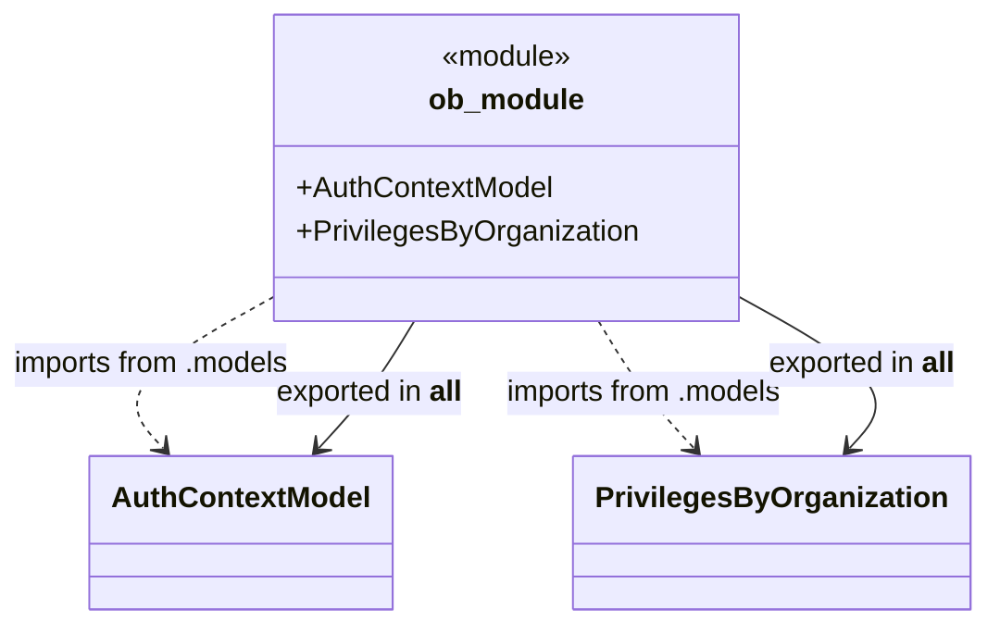

# Diagram: shared/core/src/core/auth/__init__.py

> Auto-generated by Obscura crawlers

## Mermaid

### SVG

<svg id="container" width="547.73388671875" xmlns="http://www.w3.org/2000/svg" class="classDiagram" height="342" viewBox="27.64112091064453 0 547.73388671875 342" role="graphics-document document" aria-roledescription="class"><g><defs><marker id="container_class-aggregationStart" class="marker aggregation class" refX="18" refY="7" markerWidth="190" markerHeight="240" orient="auto"><path d="M 18,7 L9,13 L1,7 L9,1 Z"></path></marker></defs><defs><marker id="container_class-aggregationEnd" class="marker aggregation class" refX="1" refY="7" markerWidth="20" markerHeight="28" orient="auto"><path d="M 18,7 L9,13 L1,7 L9,1 Z"></path></marker></defs><defs><marker id="container_class-extensionStart" class="marker extension class" refX="18" refY="7" markerWidth="190" markerHeight="240" orient="auto"><path d="M 1,7 L18,13 V 1 Z"></path></marker></defs><defs><marker id="container_class-extensionEnd" class="marker extension class" refX="1" refY="7" markerWidth="20" markerHeight="28" orient="auto"><path d="M 1,1 V 13 L18,7 Z"></path></marker></defs><defs><marker id="container_class-compositionStart" class="marker composition class" refX="18" refY="7" markerWidth="190" markerHeight="240" orient="auto"><path d="M 18,7 L9,13 L1,7 L9,1 Z"></path></marker></defs><defs><marker id="container_class-compositionEnd" class="marker composition class" refX="1" refY="7" markerWidth="20" markerHeight="28" orient="auto"><path d="M 18,7 L9,13 L1,7 L9,1 Z"></path></marker></defs><defs><marker id="container_class-dependencyStart" class="marker dependency class" refX="6" refY="7" markerWidth="190" markerHeight="240" orient="auto"><path d="M 5,7 L9,13 L1,7 L9,1 Z"></path></marker></defs><defs><marker id="container_class-dependencyEnd" class="marker dependency class" refX="13" refY="7" markerWidth="20" markerHeight="28" orient="auto"><path d="M 18,7 L9,13 L14,7 L9,1 Z"></path></marker></defs><defs><marker id="container_class-lollipopStart" class="marker lollipop class" refX="13" refY="7" markerWidth="190" markerHeight="240" orient="auto"><circle stroke="black" fill="transparent" cx="7" cy="7" r="6"></circle></marker></defs><defs><marker id="container_class-lollipopEnd" class="marker lollipop class" refX="1" refY="7" markerWidth="190" markerHeight="240" orient="auto"><circle stroke="black" fill="transparent" cx="7" cy="7" r="6"></circle></marker></defs><g class="root"><g class="clusters"></g><g class="edgePaths"><path d="M186.656,159.367L169.917,168.306C153.177,177.245,119.698,195.122,108.163,209.505C96.628,223.888,107.038,234.775,112.243,240.219L117.448,245.663" id="id_ob_module_AuthContextModel_1" class="edge-thickness-normal edge-pattern-dashed relation" style=";;;" data-edge="true" data-et="edge" data-id="id_ob_module_AuthContextModel_1" data-points="W3sieCI6MTg2LjY1NjI1LCJ5IjoxNTkuMzY2ODQ1OTUyMjgyNDZ9LHsieCI6ODYuMjE4NzUsInkiOjIxM30seyJ4IjoxMjEuNTk0MTQ1NTY5NjIwMjUsInkiOjI1MH1d" marker-end="url(#container_class-dependencyEnd)"></path><path d="M365.247,176L369.097,182.167C372.946,188.333,380.645,200.667,389.699,212.277C398.753,223.888,409.163,234.775,414.368,240.219L419.573,245.663" id="id_ob_module_PrivilegesByOrganization_2" class="edge-thickness-normal edge-pattern-dashed relation" style=";;;" data-edge="true" data-et="edge" data-id="id_ob_module_PrivilegesByOrganization_2" data-points="W3sieCI6MzY1LjI0NzQxNzM1NTM3MTksInkiOjE3Nn0seyJ4IjozODguMzQzNzUsInkiOjIxM30seyJ4Ijo0MjMuNzE5MTQ1NTY5NjIwMjUsInkiOjI1MH1d" marker-end="url(#container_class-dependencyEnd)"></path><path d="M260.378,176L256.528,182.167C252.679,188.333,244.98,200.667,235.926,212.277C226.872,223.888,216.462,234.775,211.257,240.219L206.052,245.663" id="id_ob_module_AuthContextModel_3" class="edge-thickness-normal edge-pattern-solid relation" style=";;;" data-edge="true" data-et="edge" data-id="id_ob_module_AuthContextModel_3" data-points="W3sieCI6MjYwLjM3NzU4MjY0NDYyODEsInkiOjE3Nn0seyJ4IjoyMzcuMjgxMjUsInkiOjIxM30seyJ4IjoyMDEuOTA1ODU0NDMwMzc5NzUsInkiOjI1MH1d" marker-end="url(#container_class-dependencyEnd)"></path><path d="M438.969,159.367L455.708,168.306C472.448,177.245,505.927,195.122,517.462,209.505C528.997,223.888,518.587,234.775,513.382,240.219L508.177,245.663" id="id_ob_module_PrivilegesByOrganization_4" class="edge-thickness-normal edge-pattern-solid relation" style=";;;" data-edge="true" data-et="edge" data-id="id_ob_module_PrivilegesByOrganization_4" data-points="W3sieCI6NDM4Ljk2ODc1LCJ5IjoxNTkuMzY2ODQ1OTUyMjgyNDZ9LHsieCI6NTM5LjQwNjI1LCJ5IjoyMTN9LHsieCI6NTA0LjAzMDg1NDQzMDM3OTc1LCJ5IjoyNTB9XQ==" marker-end="url(#container_class-dependencyEnd)"></path></g><g class="edgeLabels"><g class="edgeLabel" transform="translate(113.85987, 198.23977)"><g class="label" data-id="id_ob_module_AuthContextModel_1" transform="translate(-78.21875, -12)"><foreignObject width="156.4375" height="24">

imports from .models

</foreignObject></g></g><g class="edgeLabel" transform="translate(390.96047, 215.73689)"><g class="label" data-id="id_ob_module_PrivilegesByOrganization_2" transform="translate(-78.21875, -12)"><foreignObject width="156.4375" height="24">

imports from .models

</foreignObject></g></g><g class="edgeLabel" transform="translate(234.66453, 215.73689)"><g class="label" data-id="id_ob_module_AuthContextModel_3" transform="translate(-52.84375, -12)"><foreignObject width="105.6875" height="24">

exported in <strong>all</strong>

</foreignObject></g></g><g class="edgeLabel" transform="translate(511.76513, 198.23977)"><g class="label" data-id="id_ob_module_PrivilegesByOrganization_4" transform="translate(-52.84375, -12)"><foreignObject width="105.6875" height="24">

exported in <strong>all</strong>

</foreignObject></g></g></g><g class="nodes"><g class="node default" id="classId-ob_module-0" transform="translate(312.8125, 92)"><g class="basic label-container"><path d="M-126.15625 -84 L126.15625 -84 L126.15625 84 L-126.15625 84" stroke="none" stroke-width="0" fill="#ECECFF" style=""></path><path d="M-126.15625 -84 C-41.536942509227416 -84, 43.08236498154517 -84, 126.15625 -84 M-126.15625 -84 C-27.411945624992455 -84, 71.33235875001509 -84, 126.15625 -84 M126.15625 -84 C126.15625 -24.9505802516694, 126.15625 34.0988394966612, 126.15625 84 M126.15625 -84 C126.15625 -19.15173535526536, 126.15625 45.69652928946928, 126.15625 84 M126.15625 84 C26.441708511055282 84, -73.27283297788944 84, -126.15625 84 M126.15625 84 C57.827782624699296 84, -10.500684750601408 84, -126.15625 84 M-126.15625 84 C-126.15625 26.502504837839744, -126.15625 -30.99499032432051, -126.15625 -84 M-126.15625 84 C-126.15625 40.317360527320304, -126.15625 -3.3652789453593925, -126.15625 -84" stroke="#9370DB" stroke-width="1.3" fill="none" stroke-dasharray="0 0" style=""></path></g><g class="annotation-group text" transform="translate(-36.6015625, -60)"><g class="label" style="" transform="translate(0,-12)"><foreignObject width="73.203125" height="24">

«module»

</foreignObject></g></g><g class="label-group text" transform="translate(-41.015625, -36)"><g class="label" style="font-weight: bolder" transform="translate(0,-12)"><foreignObject width="82.03125" height="24">

ob_module

</foreignObject></g></g><g class="members-group text" transform="translate(-114.15625, 12)"><g class="label" style="" transform="translate(0,-12)"><foreignObject width="141.234375" height="24">

+AuthContextModel

</foreignObject></g><g class="label" style="" transform="translate(0,12)"><foreignObject width="187.296875" height="24">

+PrivilegesByOrganization

</foreignObject></g></g><g class="methods-group text" transform="translate(-114.15625, 84)"></g><g class="divider" style=""><path d="M-126.15625 -12 C-73.5870463920078 -12, -21.0178427840156 -12, 126.15625 -12 M-126.15625 -12 C-35.25119829566334 -12, 55.653853408673314 -12, 126.15625 -12" stroke="#9370DB" stroke-width="1.3" fill="none" stroke-dasharray="0 0" style=""></path></g><g class="divider" style=""><path d="M-126.15625 60 C-66.5530874513703 60, -6.949924902740605 60, 126.15625 60 M-126.15625 60 C-41.894763683142955 60, 42.36672263371409 60, 126.15625 60" stroke="#9370DB" stroke-width="1.3" fill="none" stroke-dasharray="0 0" style=""></path></g></g><g class="node default" id="classId-AuthContextModel-1" transform="translate(161.75, 292)"><g class="basic label-container"><path d="M-79.7265625 -42 L79.7265625 -42 L79.7265625 42 L-79.7265625 42" stroke="none" stroke-width="0" fill="#ECECFF" style=""></path><path d="M-79.7265625 -42 C-41.21567708185032 -42, -2.7047916637006466 -42, 79.7265625 -42 M-79.7265625 -42 C-47.68603247884292 -42, -15.645502457685836 -42, 79.7265625 -42 M79.7265625 -42 C79.7265625 -12.678109918237272, 79.7265625 16.643780163525456, 79.7265625 42 M79.7265625 -42 C79.7265625 -12.930691148914189, 79.7265625 16.138617702171622, 79.7265625 42 M79.7265625 42 C38.42867548661202 42, -2.869211526775956 42, -79.7265625 42 M79.7265625 42 C45.918348665895856 42, 12.110134831791711 42, -79.7265625 42 M-79.7265625 42 C-79.7265625 24.520984982722567, -79.7265625 7.0419699654451335, -79.7265625 -42 M-79.7265625 42 C-79.7265625 13.71148715830331, -79.7265625 -14.57702568339338, -79.7265625 -42" stroke="#9370DB" stroke-width="1.3" fill="none" stroke-dasharray="0 0" style=""></path></g><g class="annotation-group text" transform="translate(0, -18)"></g><g class="label-group text" transform="translate(-67.7265625, -18)"><g class="label" style="font-weight: bolder" transform="translate(0,-12)"><foreignObject width="135.453125" height="24">

AuthContextModel

</foreignObject></g></g><g class="members-group text" transform="translate(-67.7265625, 30)"></g><g class="methods-group text" transform="translate(-67.7265625, 60)"></g><g class="divider" style=""><path d="M-79.7265625 6 C-29.05088956564653 6, 21.624783368706943 6, 79.7265625 6 M-79.7265625 6 C-43.848677189349495 6, -7.970791878698989 6, 79.7265625 6" stroke="#9370DB" stroke-width="1.3" fill="none" stroke-dasharray="0 0" style=""></path></g><g class="divider" style=""><path d="M-79.7265625 24 C-44.92454120459563 24, -10.122519909191254 24, 79.7265625 24 M-79.7265625 24 C-45.53217063090101 24, -11.337778761802014 24, 79.7265625 24" stroke="#9370DB" stroke-width="1.3" fill="none" stroke-dasharray="0 0" style=""></path></g></g><g class="node default" id="classId-PrivilegesByOrganization-2" transform="translate(463.875, 292)"><g class="basic label-container"><path d="M-103.5 -42 L103.5 -42 L103.5 42 L-103.5 42" stroke="none" stroke-width="0" fill="#ECECFF" style=""></path><path d="M-103.5 -42 C-47.4113012179317 -42, 8.677397564136598 -42, 103.5 -42 M-103.5 -42 C-39.84148093024557 -42, 23.817038139508867 -42, 103.5 -42 M103.5 -42 C103.5 -18.715414556270723, 103.5 4.569170887458554, 103.5 42 M103.5 -42 C103.5 -14.795938829386465, 103.5 12.40812234122707, 103.5 42 M103.5 42 C38.87461581638368 42, -25.750768367232638 42, -103.5 42 M103.5 42 C49.864766786231996 42, -3.7704664275360074 42, -103.5 42 M-103.5 42 C-103.5 9.68144098800888, -103.5 -22.63711802398224, -103.5 -42 M-103.5 42 C-103.5 22.979251532941362, -103.5 3.9585030658827236, -103.5 -42" stroke="#9370DB" stroke-width="1.3" fill="none" stroke-dasharray="0 0" style=""></path></g><g class="annotation-group text" transform="translate(0, -18)"></g><g class="label-group text" transform="translate(-91.5, -18)"><g class="label" style="font-weight: bolder" transform="translate(0,-12)"><foreignObject width="183" height="24">

PrivilegesByOrganization

</foreignObject></g></g><g class="members-group text" transform="translate(-91.5, 30)"></g><g class="methods-group text" transform="translate(-91.5, 60)"></g><g class="divider" style=""><path d="M-103.5 6 C-52.45819689972185 6, -1.4163937994436964 6, 103.5 6 M-103.5 6 C-40.34938705963475 6, 22.8012258807305 6, 103.5 6" stroke="#9370DB" stroke-width="1.3" fill="none" stroke-dasharray="0 0" style=""></path></g><g class="divider" style=""><path d="M-103.5 24 C-21.969589392358245 24, 59.56082121528351 24, 103.5 24 M-103.5 24 C-54.88393518148428 24, -6.267870362968566 24, 103.5 24" stroke="#9370DB" stroke-width="1.3" fill="none" stroke-dasharray="0 0" style=""></path></g></g></g></g></g></svg>
