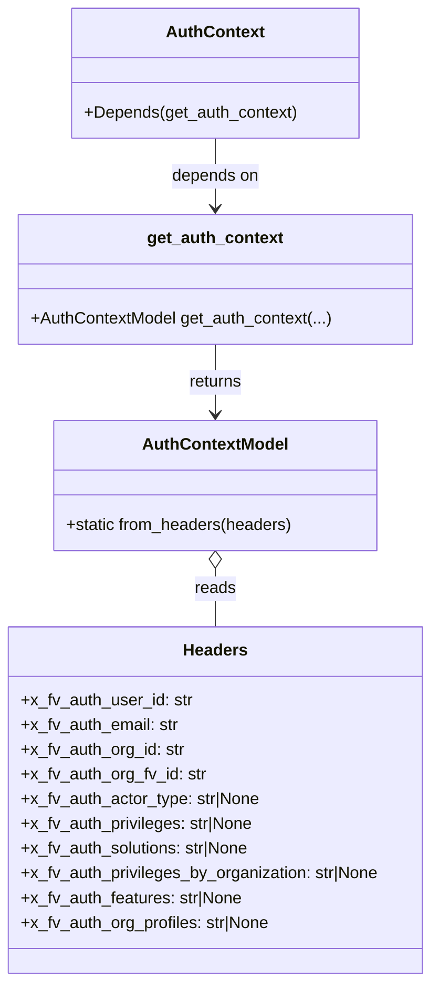

# Diagram: shared/core/src/core/auth/dependencies.py

> Auto-generated by Obscura crawlers

## Mermaid

### SVG

<svg id="container" width="421.3359375" xmlns="http://www.w3.org/2000/svg" class="classDiagram" height="952" viewBox="0 0 421.3359375 952" role="graphics-document document" aria-roledescription="class"><g><defs><marker id="container_class-aggregationStart" class="marker aggregation class" refX="18" refY="7" markerWidth="190" markerHeight="240" orient="auto"><path d="M 18,7 L9,13 L1,7 L9,1 Z"></path></marker></defs><defs><marker id="container_class-aggregationEnd" class="marker aggregation class" refX="1" refY="7" markerWidth="20" markerHeight="28" orient="auto"><path d="M 18,7 L9,13 L1,7 L9,1 Z"></path></marker></defs><defs><marker id="container_class-extensionStart" class="marker extension class" refX="18" refY="7" markerWidth="190" markerHeight="240" orient="auto"><path d="M 1,7 L18,13 V 1 Z"></path></marker></defs><defs><marker id="container_class-extensionEnd" class="marker extension class" refX="1" refY="7" markerWidth="20" markerHeight="28" orient="auto"><path d="M 1,1 V 13 L18,7 Z"></path></marker></defs><defs><marker id="container_class-compositionStart" class="marker composition class" refX="18" refY="7" markerWidth="190" markerHeight="240" orient="auto"><path d="M 18,7 L9,13 L1,7 L9,1 Z"></path></marker></defs><defs><marker id="container_class-compositionEnd" class="marker composition class" refX="1" refY="7" markerWidth="20" markerHeight="28" orient="auto"><path d="M 18,7 L9,13 L1,7 L9,1 Z"></path></marker></defs><defs><marker id="container_class-dependencyStart" class="marker dependency class" refX="6" refY="7" markerWidth="190" markerHeight="240" orient="auto"><path d="M 5,7 L9,13 L1,7 L9,1 Z"></path></marker></defs><defs><marker id="container_class-dependencyEnd" class="marker dependency class" refX="13" refY="7" markerWidth="20" markerHeight="28" orient="auto"><path d="M 18,7 L9,13 L14,7 L9,1 Z"></path></marker></defs><defs><marker id="container_class-lollipopStart" class="marker lollipop class" refX="13" refY="7" markerWidth="190" markerHeight="240" orient="auto"><circle stroke="black" fill="transparent" cx="7" cy="7" r="6"></circle></marker></defs><defs><marker id="container_class-lollipopEnd" class="marker lollipop class" refX="1" refY="7" markerWidth="190" markerHeight="240" orient="auto"><circle stroke="black" fill="transparent" cx="7" cy="7" r="6"></circle></marker></defs><g class="root"><g class="clusters"></g><g class="edgePaths"><path d="M210.668,334L210.668,340.167C210.668,346.333,210.668,358.667,210.668,370C210.668,381.333,210.668,391.667,210.668,396.833L210.668,402" id="id_get_auth_context_AuthContextModel_1" class="edge-thickness-normal edge-pattern-solid relation" style=";;;" data-edge="true" data-et="edge" data-id="id_get_auth_context_AuthContextModel_1" data-points="W3sieCI6MjEwLjY2Nzk2ODc1LCJ5IjozMzR9LHsieCI6MjEwLjY2Nzk2ODc1LCJ5IjozNzF9LHsieCI6MjEwLjY2Nzk2ODc1LCJ5Ijo0MDh9XQ==" marker-end="url(#container_class-dependencyEnd)"></path><path d="M210.668,551.25L210.668,554.542C210.668,557.833,210.668,564.417,210.668,573.875C210.668,583.333,210.668,595.667,210.668,601.833L210.668,608" id="id_AuthContextModel_Headers_2" class="edge-thickness-normal edge-pattern-solid relation" style=";;;" data-edge="true" data-et="edge" data-id="id_AuthContextModel_Headers_2" data-points="W3sieCI6MjEwLjY2Nzk2ODc1LCJ5Ijo1MzR9LHsieCI6MjEwLjY2Nzk2ODc1LCJ5Ijo1NzF9LHsieCI6MjEwLjY2Nzk2ODc1LCJ5Ijo2MDh9XQ==" marker-start="url(#container_class-aggregationStart)"></path><path d="M210.668,134L210.668,140.167C210.668,146.333,210.668,158.667,210.668,170C210.668,181.333,210.668,191.667,210.668,196.833L210.668,202" id="id_AuthContext_get_auth_context_3" class="edge-thickness-normal edge-pattern-solid relation" style=";;;" data-edge="true" data-et="edge" data-id="id_AuthContext_get_auth_context_3" data-points="W3sieCI6MjEwLjY2Nzk2ODc1LCJ5IjoxMzR9LHsieCI6MjEwLjY2Nzk2ODc1LCJ5IjoxNzF9LHsieCI6MjEwLjY2Nzk2ODc1LCJ5IjoyMDh9XQ==" marker-end="url(#container_class-dependencyEnd)"></path></g><g class="edgeLabels"><g class="edgeLabel" transform="translate(210.66796875, 371)"><g class="label" data-id="id_get_auth_context_AuthContextModel_1" transform="translate(-26.265625, -12)"><foreignObject width="52.53125" height="24">

returns

</foreignObject></g></g><g class="edgeLabel" transform="translate(210.66796875, 571)"><g class="label" data-id="id_AuthContextModel_Headers_2" transform="translate(-20.0078125, -12)"><foreignObject width="40.015625" height="24">

reads

</foreignObject></g></g><g class="edgeLabel" transform="translate(210.66796875, 171)"><g class="label" data-id="id_AuthContext_get_auth_context_3" transform="translate(-42.9453125, -12)"><foreignObject width="85.890625" height="24">

depends on

</foreignObject></g></g></g><g class="nodes"><g class="node default" id="classId-get_auth_context-0" transform="translate(210.66796875, 271)"><g class="basic label-container"><path d="M-190.30078125 -63 L190.30078125 -63 L190.30078125 63 L-190.30078125 63" stroke="none" stroke-width="0" fill="#ECECFF" style=""></path><path d="M-190.30078125 -63 C-82.97032392514069 -63, 24.36013339971862 -63, 190.30078125 -63 M-190.30078125 -63 C-73.8885664476471 -63, 42.52364835470581 -63, 190.30078125 -63 M190.30078125 -63 C190.30078125 -18.827695795735032, 190.30078125 25.344608408529936, 190.30078125 63 M190.30078125 -63 C190.30078125 -29.584524549616376, 190.30078125 3.830950900767249, 190.30078125 63 M190.30078125 63 C40.224544960714724 63, -109.85169132857055 63, -190.30078125 63 M190.30078125 63 C41.551835635264695 63, -107.19710997947061 63, -190.30078125 63 M-190.30078125 63 C-190.30078125 21.950253121308243, -190.30078125 -19.099493757383513, -190.30078125 -63 M-190.30078125 63 C-190.30078125 22.57330300775702, -190.30078125 -17.85339398448596, -190.30078125 -63" stroke="#9370DB" stroke-width="1.3" fill="none" stroke-dasharray="0 0" style=""></path></g><g class="annotation-group text" transform="translate(0, -39)"></g><g class="label-group text" transform="translate(-63.8046875, -39)"><g class="label" style="font-weight: bolder" transform="translate(0,-12)"><foreignObject width="127.609375" height="24">

get_auth_context

</foreignObject></g></g><g class="members-group text" transform="translate(-178.30078125, 9)"></g><g class="methods-group text" transform="translate(-178.30078125, 39)"><g class="label" style="" transform="translate(0,-12)"><foreignObject width="292.796875" height="24">

+AuthContextModel get_auth_context(...)

</foreignObject></g></g><g class="divider" style=""><path d="M-190.30078125 -15 C-107.51484113731063 -15, -24.72890102462125 -15, 190.30078125 -15 M-190.30078125 -15 C-90.285805450973 -15, 9.729170348053998 -15, 190.30078125 -15" stroke="#9370DB" stroke-width="1.3" fill="none" stroke-dasharray="0 0" style=""></path></g><g class="divider" style=""><path d="M-190.30078125 9 C-109.66914688948302 9, -29.037512528966033 9, 190.30078125 9 M-190.30078125 9 C-90.87482957592921 9, 8.551122098141576 9, 190.30078125 9" stroke="#9370DB" stroke-width="1.3" fill="none" stroke-dasharray="0 0" style=""></path></g></g><g class="node default" id="classId-AuthContextModel-1" transform="translate(210.66796875, 471)"><g class="basic label-container"><path d="M-156.60546875 -63 L156.60546875 -63 L156.60546875 63 L-156.60546875 63" stroke="none" stroke-width="0" fill="#ECECFF" style=""></path><path d="M-156.60546875 -63 C-86.5311134262977 -63, -16.456758102595387 -63, 156.60546875 -63 M-156.60546875 -63 C-89.35336126326095 -63, -22.1012537765219 -63, 156.60546875 -63 M156.60546875 -63 C156.60546875 -19.287704514440442, 156.60546875 24.424590971119116, 156.60546875 63 M156.60546875 -63 C156.60546875 -27.285052320682738, 156.60546875 8.429895358634525, 156.60546875 63 M156.60546875 63 C54.43291916962761 63, -47.73963041074478 63, -156.60546875 63 M156.60546875 63 C66.0984094490442 63, -24.408649851911605 63, -156.60546875 63 M-156.60546875 63 C-156.60546875 15.92525712680424, -156.60546875 -31.14948574639152, -156.60546875 -63 M-156.60546875 63 C-156.60546875 18.69787453631958, -156.60546875 -25.604250927360837, -156.60546875 -63" stroke="#9370DB" stroke-width="1.3" fill="none" stroke-dasharray="0 0" style=""></path></g><g class="annotation-group text" transform="translate(0, -39)"></g><g class="label-group text" transform="translate(-67.7265625, -39)"><g class="label" style="font-weight: bolder" transform="translate(0,-12)"><foreignObject width="135.453125" height="24">

AuthContextModel

</foreignObject></g></g><g class="members-group text" transform="translate(-144.60546875, 9)"></g><g class="methods-group text" transform="translate(-144.60546875, 39)"><g class="label" style="" transform="translate(0,-12)"><foreignObject width="221.484375" height="24">

+static from_headers(headers)

</foreignObject></g></g><g class="divider" style=""><path d="M-156.60546875 -15 C-86.60805534914456 -15, -16.61064194828913 -15, 156.60546875 -15 M-156.60546875 -15 C-59.32168146519568 -15, 37.96210581960864 -15, 156.60546875 -15" stroke="#9370DB" stroke-width="1.3" fill="none" stroke-dasharray="0 0" style=""></path></g><g class="divider" style=""><path d="M-156.60546875 9 C-78.74811632371296 9, -0.8907638974259271 9, 156.60546875 9 M-156.60546875 9 C-59.059691432538315 9, 38.48608588492337 9, 156.60546875 9" stroke="#9370DB" stroke-width="1.3" fill="none" stroke-dasharray="0 0" style=""></path></g></g><g class="node default" id="classId-Headers-2" transform="translate(210.66796875, 776)"><g class="basic label-container"><path d="M-202.66796875 -168 L202.66796875 -168 L202.66796875 168 L-202.66796875 168" stroke="none" stroke-width="0" fill="#ECECFF" style=""></path><path d="M-202.66796875 -168 C-93.0002490478762 -168, 16.66747065424761 -168, 202.66796875 -168 M-202.66796875 -168 C-86.85155330620242 -168, 28.964862137595162 -168, 202.66796875 -168 M202.66796875 -168 C202.66796875 -98.90933926136795, 202.66796875 -29.818678522735894, 202.66796875 168 M202.66796875 -168 C202.66796875 -66.19132212369249, 202.66796875 35.617355752615026, 202.66796875 168 M202.66796875 168 C89.5843171425535 168, -23.499334464892996 168, -202.66796875 168 M202.66796875 168 C48.25009040116282 168, -106.16778794767436 168, -202.66796875 168 M-202.66796875 168 C-202.66796875 79.10717100779377, -202.66796875 -9.785657984412467, -202.66796875 -168 M-202.66796875 168 C-202.66796875 72.3654577894011, -202.66796875 -23.26908442119779, -202.66796875 -168" stroke="#9370DB" stroke-width="1.3" fill="none" stroke-dasharray="0 0" style=""></path></g><g class="annotation-group text" transform="translate(0, -144)"></g><g class="label-group text" transform="translate(-30.2421875, -144)"><g class="label" style="font-weight: bolder" transform="translate(0,-12)"><foreignObject width="60.484375" height="24">

Headers

</foreignObject></g></g><g class="members-group text" transform="translate(-190.66796875, -96)"><g class="label" style="" transform="translate(0,-12)"><foreignObject width="165.421875" height="24">

+x_fv_auth_user_id: str

</foreignObject></g><g class="label" style="" transform="translate(0,12)"><foreignObject width="153.109375" height="24">

+x_fv_auth_email: str

</foreignObject></g><g class="label" style="" transform="translate(0,36)"><foreignObject width="158.6875" height="24">

+x_fv_auth_org_id: str

</foreignObject></g><g class="label" style="" transform="translate(0,60)"><foreignObject width="179.4375" height="24">

+x_fv_auth_org_fv_id: str

</foreignObject></g><g class="label" style="" transform="translate(0,84)"><foreignObject width="233.359375" height="24">

+x_fv_auth_actor_type: str|None

</foreignObject></g><g class="label" style="" transform="translate(0,108)"><foreignObject width="227.90625" height="24">

+x_fv_auth_privileges: str|None

</foreignObject></g><g class="label" style="" transform="translate(0,132)"><foreignObject width="225.046875" height="24">

+x_fv_auth_solutions: str|None

</foreignObject></g><g class="label" style="" transform="translate(0,156)"><foreignObject width="351.09375" height="24">

+x_fv_auth_privileges_by_organization: str|None

</foreignObject></g><g class="label" style="" transform="translate(0,180)"><foreignObject width="216.875" height="24">

+x_fv_auth_features: str|None

</foreignObject></g><g class="label" style="" transform="translate(0,204)"><foreignObject width="243.953125" height="24">

+x_fv_auth_org_profiles: str|None

</foreignObject></g></g><g class="methods-group text" transform="translate(-190.66796875, 168)"></g><g class="divider" style=""><path d="M-202.66796875 -120 C-67.13719257869212 -120, 68.39358359261576 -120, 202.66796875 -120 M-202.66796875 -120 C-63.520883963827714 -120, 75.62620082234457 -120, 202.66796875 -120" stroke="#9370DB" stroke-width="1.3" fill="none" stroke-dasharray="0 0" style=""></path></g><g class="divider" style=""><path d="M-202.66796875 144 C-64.77390897277886 144, 73.12015080444229 144, 202.66796875 144 M-202.66796875 144 C-83.3150386425753 144, 36.037891464849395 144, 202.66796875 144" stroke="#9370DB" stroke-width="1.3" fill="none" stroke-dasharray="0 0" style=""></path></g></g><g class="node default" id="classId-AuthContext-3" transform="translate(210.66796875, 71)"><g class="basic label-container"><path d="M-138.3125 -63 L138.3125 -63 L138.3125 63 L-138.3125 63" stroke="none" stroke-width="0" fill="#ECECFF" style=""></path><path d="M-138.3125 -63 C-70.48103775517407 -63, -2.649575510348143 -63, 138.3125 -63 M-138.3125 -63 C-43.04917733995808 -63, 52.214145320083844 -63, 138.3125 -63 M138.3125 -63 C138.3125 -14.109086142957047, 138.3125 34.78182771408591, 138.3125 63 M138.3125 -63 C138.3125 -32.59558514000036, 138.3125 -2.191170280000719, 138.3125 63 M138.3125 63 C73.18576452036899 63, 8.059029040737983 63, -138.3125 63 M138.3125 63 C57.47320483620723 63, -23.36609032758554 63, -138.3125 63 M-138.3125 63 C-138.3125 29.021061638879416, -138.3125 -4.957876722241167, -138.3125 -63 M-138.3125 63 C-138.3125 16.472185428156024, -138.3125 -30.055629143687952, -138.3125 -63" stroke="#9370DB" stroke-width="1.3" fill="none" stroke-dasharray="0 0" style=""></path></g><g class="annotation-group text" transform="translate(0, -39)"></g><g class="label-group text" transform="translate(-45.171875, -39)"><g class="label" style="font-weight: bolder" transform="translate(0,-12)"><foreignObject width="90.34375" height="24">

AuthContext

</foreignObject></g></g><g class="members-group text" transform="translate(-126.3125, 9)"></g><g class="methods-group text" transform="translate(-126.3125, 39)"><g class="label" style="" transform="translate(0,-12)"><foreignObject width="207.453125" height="24">

+Depends(get_auth_context)

</foreignObject></g></g><g class="divider" style=""><path d="M-138.3125 -15 C-62.369426074552166 -15, 13.573647850895668 -15, 138.3125 -15 M-138.3125 -15 C-65.91525108849571 -15, 6.481997823008584 -15, 138.3125 -15" stroke="#9370DB" stroke-width="1.3" fill="none" stroke-dasharray="0 0" style=""></path></g><g class="divider" style=""><path d="M-138.3125 9 C-35.60481007680268 9, 67.10287984639464 9, 138.3125 9 M-138.3125 9 C-77.35656227225556 9, -16.400624544511103 9, 138.3125 9" stroke="#9370DB" stroke-width="1.3" fill="none" stroke-dasharray="0 0" style=""></path></g></g></g></g></g></svg>
