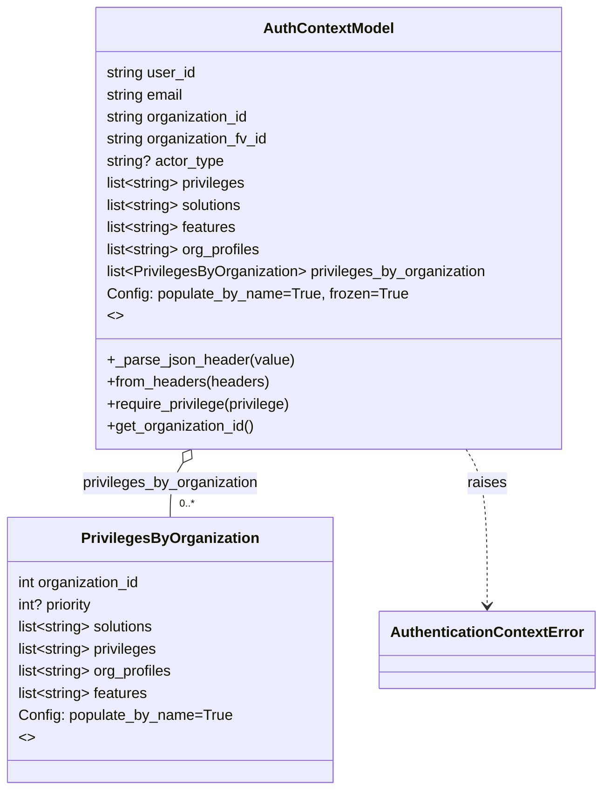

# Diagram: shared/core/src/core/auth/models.py

> Auto-generated by Obscura crawlers

## Mermaid

### SVG

<svg id="container" width="638.359375" xmlns="http://www.w3.org/2000/svg" class="classDiagram" height="858" viewBox="0 0 638.359375 858" role="graphics-document document" aria-roledescription="class"><g><defs><marker id="container_class-aggregationStart" class="marker aggregation class" refX="18" refY="7" markerWidth="190" markerHeight="240" orient="auto"><path d="M 18,7 L9,13 L1,7 L9,1 Z"></path></marker></defs><defs><marker id="container_class-aggregationEnd" class="marker aggregation class" refX="1" refY="7" markerWidth="20" markerHeight="28" orient="auto"><path d="M 18,7 L9,13 L1,7 L9,1 Z"></path></marker></defs><defs><marker id="container_class-extensionStart" class="marker extension class" refX="18" refY="7" markerWidth="190" markerHeight="240" orient="auto"><path d="M 1,7 L18,13 V 1 Z"></path></marker></defs><defs><marker id="container_class-extensionEnd" class="marker extension class" refX="1" refY="7" markerWidth="20" markerHeight="28" orient="auto"><path d="M 1,1 V 13 L18,7 Z"></path></marker></defs><defs><marker id="container_class-compositionStart" class="marker composition class" refX="18" refY="7" markerWidth="190" markerHeight="240" orient="auto"><path d="M 18,7 L9,13 L1,7 L9,1 Z"></path></marker></defs><defs><marker id="container_class-compositionEnd" class="marker composition class" refX="1" refY="7" markerWidth="20" markerHeight="28" orient="auto"><path d="M 18,7 L9,13 L1,7 L9,1 Z"></path></marker></defs><defs><marker id="container_class-dependencyStart" class="marker dependency class" refX="6" refY="7" markerWidth="190" markerHeight="240" orient="auto"><path d="M 5,7 L9,13 L1,7 L9,1 Z"></path></marker></defs><defs><marker id="container_class-dependencyEnd" class="marker dependency class" refX="13" refY="7" markerWidth="20" markerHeight="28" orient="auto"><path d="M 18,7 L9,13 L14,7 L9,1 Z"></path></marker></defs><defs><marker id="container_class-lollipopStart" class="marker lollipop class" refX="13" refY="7" markerWidth="190" markerHeight="240" orient="auto"><circle stroke="black" fill="transparent" cx="7" cy="7" r="6"></circle></marker></defs><defs><marker id="container_class-lollipopEnd" class="marker lollipop class" refX="1" refY="7" markerWidth="190" markerHeight="240" orient="auto"><circle stroke="black" fill="transparent" cx="7" cy="7" r="6"></circle></marker></defs><g class="root"><g class="clusters"></g><g class="edgePaths"><path d="M195.183,502.747L192.933,506.456C190.682,510.165,186.181,517.582,183.93,527.458C181.68,537.333,181.68,549.667,181.68,555.833L181.68,562" id="id_AuthContextModel_PrivilegesByOrganization_1" class="edge-thickness-normal edge-pattern-solid relation" style=";;;" data-edge="true" data-et="edge" data-id="id_AuthContextModel_PrivilegesByOrganization_1" data-points="W3sieCI6MjA0LjEzMjEyMTUwMjcwNzU4LCJ5Ijo0ODh9LHsieCI6MTgxLjY3OTY4NzUsInkiOjUyNX0seyJ4IjoxODEuNjc5Njg3NSwieSI6NTYyfV0=" marker-start="url(#container_class-aggregationStart)"></path><path d="M495.407,488L499.149,494.167C502.891,500.333,510.375,512.667,514.117,541C517.859,569.333,517.859,613.667,517.859,635.833L517.859,658" id="id_AuthContextModel_AuthenticationContextError_2" class="edge-thickness-normal edge-pattern-dashed relation" style=";;;" data-edge="true" data-et="edge" data-id="id_AuthContextModel_AuthenticationContextError_2" data-points="W3sieCI6NDk1LjQwNjk0MDk5NzI5MjQsInkiOjQ4OH0seyJ4Ijo1MTcuODU5Mzc1LCJ5Ijo1MjV9LHsieCI6NTE3Ljg1OTM3NSwieSI6NjY0fV0=" marker-end="url(#container_class-dependencyEnd)"></path></g><g class="edgeLabels"><g class="edgeLabel" transform="translate(181.6796875, 525)"><g class="label" data-id="id_AuthContextModel_PrivilegesByOrganization_1" transform="translate(-96.6796875, -12)"><foreignObject width="193.359375" height="24">

privileges_by_organization

</foreignObject></g></g><g class="edgeLabel" transform="translate(517.859375, 525)"><g class="label" data-id="id_AuthContextModel_AuthenticationContextError_2" transform="translate(-21.25, -12)"><foreignObject width="42.5" height="24">

raises

</foreignObject></g></g><g class="edgeTerminals" transform="translate(191.67968874999997, 539.5000010714285)"><g class="inner" transform="translate(0, 0)"></g><foreignObject style="width: 36px; height: 12px;">
0..*
</foreignObject></g></g><g class="nodes"><g class="node default" id="classId-PrivilegesByOrganization-0" transform="translate(181.6796875, 706)"><g class="basic label-container"><path d="M-173.6796875 -144 L173.6796875 -144 L173.6796875 144 L-173.6796875 144" stroke="none" stroke-width="0" fill="#ECECFF" style=""></path><path d="M-173.6796875 -144 C-43.99444337839816 -144, 85.69080074320368 -144, 173.6796875 -144 M-173.6796875 -144 C-89.32972665945928 -144, -4.979765818918565 -144, 173.6796875 -144 M173.6796875 -144 C173.6796875 -73.95579570515129, 173.6796875 -3.9115914103025773, 173.6796875 144 M173.6796875 -144 C173.6796875 -84.863725072987, 173.6796875 -25.727450145973975, 173.6796875 144 M173.6796875 144 C66.58688456294034 144, -40.50591837411932 144, -173.6796875 144 M173.6796875 144 C100.14610286172129 144, 26.612518223442578 144, -173.6796875 144 M-173.6796875 144 C-173.6796875 38.78674804183163, -173.6796875 -66.42650391633674, -173.6796875 -144 M-173.6796875 144 C-173.6796875 53.57708241123565, -173.6796875 -36.8458351775287, -173.6796875 -144" stroke="#9370DB" stroke-width="1.3" fill="none" stroke-dasharray="0 0" style=""></path></g><g class="annotation-group text" transform="translate(0, -120)"></g><g class="label-group text" transform="translate(-91.5, -120)"><g class="label" style="font-weight: bolder" transform="translate(0,-12)"><foreignObject width="183" height="24">

PrivilegesByOrganization

</foreignObject></g></g><g class="members-group text" transform="translate(-161.6796875, -72)"><g class="label" style="" transform="translate(0,-12)"><foreignObject width="136.671875" height="24">

int organization_id

</foreignObject></g><g class="label" style="" transform="translate(0,12)"><foreignObject width="84.5625" height="24">

int? priority

</foreignObject></g><g class="label" style="" transform="translate(0,36)"><foreignObject width="151.625" height="24">

list&lt;string&gt; solutions

</foreignObject></g><g class="label" style="" transform="translate(0,60)"><foreignObject width="154.484375" height="24">

list&lt;string&gt; privileges

</foreignObject></g><g class="label" style="" transform="translate(0,84)"><foreignObject width="170.859375" height="24">

list&lt;string&gt; org_profiles

</foreignObject></g><g class="label" style="" transform="translate(0,108)"><foreignObject width="143.765625" height="24">

list&lt;string&gt; features

</foreignObject></g><g class="label" style="" transform="translate(0,132)"><foreignObject width="231.859375" height="24">

Config: populate_by_name=True

</foreignObject></g><g class="label" style="" transform="translate(0,156)"><foreignObject width="16.015625" height="24">

&lt;&gt;

</foreignObject></g></g><g class="methods-group text" transform="translate(-161.6796875, 144)"></g><g class="divider" style=""><path d="M-173.6796875 -96 C-66.00140838384904 -96, 41.67687073230192 -96, 173.6796875 -96 M-173.6796875 -96 C-83.61840607832653 -96, 6.442875343346941 -96, 173.6796875 -96" stroke="#9370DB" stroke-width="1.3" fill="none" stroke-dasharray="0 0" style=""></path></g><g class="divider" style=""><path d="M-173.6796875 120 C-61.77591336503441 120, 50.127860769931175 120, 173.6796875 120 M-173.6796875 120 C-102.00726966196632 120, -30.334851823932638 120, 173.6796875 120" stroke="#9370DB" stroke-width="1.3" fill="none" stroke-dasharray="0 0" style=""></path></g></g><g class="node default" id="classId-AuthContextModel-1" transform="translate(349.76953125, 248)"><g class="basic label-container"><path d="M-253.54296875 -240 L253.54296875 -240 L253.54296875 240 L-253.54296875 240" stroke="none" stroke-width="0" fill="#ECECFF" style=""></path><path d="M-253.54296875 -240 C-142.3900082485934 -240, -31.23704774718678 -240, 253.54296875 -240 M-253.54296875 -240 C-94.36273217427748 -240, 64.81750440144504 -240, 253.54296875 -240 M253.54296875 -240 C253.54296875 -108.91119987651558, 253.54296875 22.177600246968836, 253.54296875 240 M253.54296875 -240 C253.54296875 -81.20021742345173, 253.54296875 77.59956515309653, 253.54296875 240 M253.54296875 240 C117.28688166513805 240, -18.96920541972389 240, -253.54296875 240 M253.54296875 240 C78.21856917714584 240, -97.10583039570832 240, -253.54296875 240 M-253.54296875 240 C-253.54296875 80.4522999565516, -253.54296875 -79.0954000868968, -253.54296875 -240 M-253.54296875 240 C-253.54296875 105.10716297650367, -253.54296875 -29.785674046992654, -253.54296875 -240" stroke="#9370DB" stroke-width="1.3" fill="none" stroke-dasharray="0 0" style=""></path></g><g class="annotation-group text" transform="translate(0, -216)"></g><g class="label-group text" transform="translate(-67.7265625, -216)"><g class="label" style="font-weight: bolder" transform="translate(0,-12)"><foreignObject width="135.453125" height="24">

AuthContextModel

</foreignObject></g></g><g class="members-group text" transform="translate(-241.54296875, -168)"><g class="label" style="" transform="translate(0,-12)"><foreignObject width="98.6875" height="24">

string user_id

</foreignObject></g><g class="label" style="" transform="translate(0,12)"><foreignObject width="86.21875" height="24">

string email

</foreignObject></g><g class="label" style="" transform="translate(0,36)"><foreignObject width="158.625" height="24">

string organization_id

</foreignObject></g><g class="label" style="" transform="translate(0,60)"><foreignObject width="179.390625" height="24">

string organization_fv_id

</foreignObject></g><g class="label" style="" transform="translate(0,84)"><foreignObject width="128.828125" height="24">

string? actor_type

</foreignObject></g><g class="label" style="" transform="translate(0,108)"><foreignObject width="154.484375" height="24">

list&lt;string&gt; privileges

</foreignObject></g><g class="label" style="" transform="translate(0,132)"><foreignObject width="151.625" height="24">

list&lt;string&gt; solutions

</foreignObject></g><g class="label" style="" transform="translate(0,156)"><foreignObject width="143.765625" height="24">

list&lt;string&gt; features

</foreignObject></g><g class="label" style="" transform="translate(0,180)"><foreignObject width="170.859375" height="24">

list&lt;string&gt; org_profiles

</foreignObject></g><g class="label" style="" transform="translate(0,204)"><foreignObject width="415.359375" height="24">

list&lt;PrivilegesByOrganization&gt; privileges_by_organization

</foreignObject></g><g class="label" style="" transform="translate(0,228)"><foreignObject width="325.046875" height="24">

Config: populate_by_name=True, frozen=True

</foreignObject></g><g class="label" style="" transform="translate(0,252)"><foreignObject width="16.015625" height="24">

&lt;&gt;

</foreignObject></g></g><g class="methods-group text" transform="translate(-241.54296875, 144)"><g class="label" style="" transform="translate(0,-12)"><foreignObject width="203.125" height="24">

+_parse_json_header(value)

</foreignObject></g><g class="label" style="" transform="translate(0,12)"><foreignObject width="177.21875" height="24">

+from_headers(headers)

</foreignObject></g><g class="label" style="" transform="translate(0,36)"><foreignObject width="203.953125" height="24">

+require_privilege(privilege)

</foreignObject></g><g class="label" style="" transform="translate(0,60)"><foreignObject width="161.671875" height="24">

+get_organization_id()

</foreignObject></g></g><g class="divider" style=""><path d="M-253.54296875 -192 C-98.56055467311162 -192, 56.42185940377675 -192, 253.54296875 -192 M-253.54296875 -192 C-141.0499512887244 -192, -28.556933827448802 -192, 253.54296875 -192" stroke="#9370DB" stroke-width="1.3" fill="none" stroke-dasharray="0 0" style=""></path></g><g class="divider" style=""><path d="M-253.54296875 120 C-70.33039860143089 120, 112.88217154713823 120, 253.54296875 120 M-253.54296875 120 C-126.53118302696225 120, 0.48060269607549344 120, 253.54296875 120" stroke="#9370DB" stroke-width="1.3" fill="none" stroke-dasharray="0 0" style=""></path></g></g><g class="node default" id="classId-AuthenticationContextError-2" transform="translate(517.859375, 706)"><g class="basic label-container"><path d="M-112.5 -42 L112.5 -42 L112.5 42 L-112.5 42" stroke="none" stroke-width="0" fill="#ECECFF" style=""></path><path d="M-112.5 -42 C-24.7330656080821 -42, 63.0338687838358 -42, 112.5 -42 M-112.5 -42 C-28.21581198078492 -42, 56.06837603843016 -42, 112.5 -42 M112.5 -42 C112.5 -14.907965502892889, 112.5 12.184068994214222, 112.5 42 M112.5 -42 C112.5 -19.744928225793053, 112.5 2.510143548413893, 112.5 42 M112.5 42 C27.32032004258376 42, -57.85935991483248 42, -112.5 42 M112.5 42 C64.83657910879403 42, 17.173158217588053 42, -112.5 42 M-112.5 42 C-112.5 14.292995229067778, -112.5 -13.414009541864445, -112.5 -42 M-112.5 42 C-112.5 24.178228376977756, -112.5 6.356456753955513, -112.5 -42" stroke="#9370DB" stroke-width="1.3" fill="none" stroke-dasharray="0 0" style=""></path></g><g class="annotation-group text" transform="translate(0, -18)"></g><g class="label-group text" transform="translate(-100.5, -18)"><g class="label" style="font-weight: bolder" transform="translate(0,-12)"><foreignObject width="201" height="24">

AuthenticationContextError

</foreignObject></g></g><g class="members-group text" transform="translate(-100.5, 30)"></g><g class="methods-group text" transform="translate(-100.5, 60)"></g><g class="divider" style=""><path d="M-112.5 6 C-24.224589622445464 6, 64.05082075510907 6, 112.5 6 M-112.5 6 C-53.581263577864185 6, 5.33747284427163 6, 112.5 6" stroke="#9370DB" stroke-width="1.3" fill="none" stroke-dasharray="0 0" style=""></path></g><g class="divider" style=""><path d="M-112.5 24 C-56.51747568809056 24, -0.5349513761811266 24, 112.5 24 M-112.5 24 C-47.237504985636704 24, 18.02499002872659 24, 112.5 24" stroke="#9370DB" stroke-width="1.3" fill="none" stroke-dasharray="0 0" style=""></path></g></g></g></g></g></svg>
