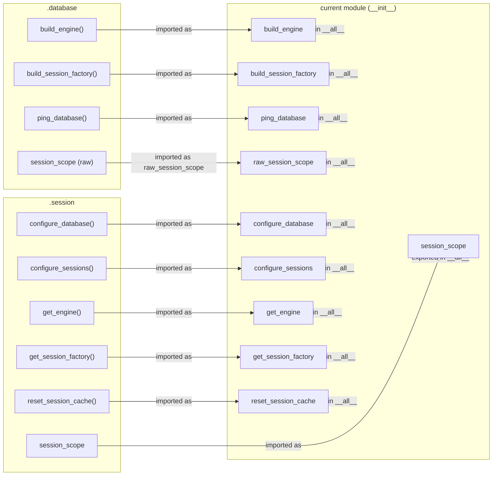

# Diagram: shared/core/src/core/db/__init__.py

> Auto-generated by Obscura crawlers

## Mermaid

### SVG

<svg id="container" width="1133.625" xmlns="http://www.w3.org/2000/svg" class="flowchart" height="1116" viewBox="0 0 1133.625 1116" role="graphics-document document" aria-roledescription="flowchart-v2"><g><marker id="container_flowchart-v2-pointEnd" class="marker flowchart-v2" viewBox="0 0 10 10" refX="5" refY="5" markerUnits="userSpaceOnUse" markerWidth="8" markerHeight="8" orient="auto"><path d="M 0 0 L 10 5 L 0 10 z" class="arrowMarkerPath" style="stroke-width: 1; stroke-dasharray: 1, 0;"></path></marker><marker id="container_flowchart-v2-pointStart" class="marker flowchart-v2" viewBox="0 0 10 10" refX="4.5" refY="5" markerUnits="userSpaceOnUse" markerWidth="8" markerHeight="8" orient="auto"><path d="M 0 5 L 10 10 L 10 0 z" class="arrowMarkerPath" style="stroke-width: 1; stroke-dasharray: 1, 0;"></path></marker><marker id="container_flowchart-v2-circleEnd" class="marker flowchart-v2" viewBox="0 0 10 10" refX="11" refY="5" markerUnits="userSpaceOnUse" markerWidth="11" markerHeight="11" orient="auto"><circle cx="5" cy="5" r="5" class="arrowMarkerPath" style="stroke-width: 1; stroke-dasharray: 1, 0;"></circle></marker><marker id="container_flowchart-v2-circleStart" class="marker flowchart-v2" viewBox="0 0 10 10" refX="-1" refY="5" markerUnits="userSpaceOnUse" markerWidth="11" markerHeight="11" orient="auto"><circle cx="5" cy="5" r="5" class="arrowMarkerPath" style="stroke-width: 1; stroke-dasharray: 1, 0;"></circle></marker><marker id="container_flowchart-v2-crossEnd" class="marker cross flowchart-v2" viewBox="0 0 11 11" refX="12" refY="5.2" markerUnits="userSpaceOnUse" markerWidth="11" markerHeight="11" orient="auto"><path d="M 1,1 l 9,9 M 10,1 l -9,9" class="arrowMarkerPath" style="stroke-width: 2; stroke-dasharray: 1, 0;"></path></marker><marker id="container_flowchart-v2-crossStart" class="marker cross flowchart-v2" viewBox="0 0 11 11" refX="-1" refY="5.2" markerUnits="userSpaceOnUse" markerWidth="11" markerHeight="11" orient="auto"><path d="M 1,1 l 9,9 M 10,1 l -9,9" class="arrowMarkerPath" style="stroke-width: 2; stroke-dasharray: 1, 0;"></path></marker><g class="root"><g class="clusters"><g class="cluster" id="package" data-look="classic"><rect style="" x="536.703125" y="8" width="588.921875" height="1070"></rect><g class="cluster-label" transform="translate(755.609375, 8)"><foreignObject width="151.109375" height="24">

current module (<strong>init</strong>)

</foreignObject></g></g><g class="cluster" id="session" data-look="classic"><rect style="" x="8" y="464" width="278.703125" height="644"></rect><g class="cluster-label" transform="translate(118.2890625, 464)"><foreignObject width="58.125" height="24">

.session

</foreignObject></g></g><g class="cluster" id="database" data-look="classic"><rect style="" x="8" y="8" width="278.703125" height="436"></rect><g class="cluster-label" transform="translate(112.1484375, 8)"><foreignObject width="70.40625" height="24">

.database

</foreignObject></g></g></g><g class="edgePaths"><path d="M229.805,70L239.288,70C248.771,70,267.737,70,298.053,70C328.37,70,370.036,70,411.703,70C453.37,70,495.036,70,524.686,70C554.336,70,571.969,70,580.785,70L589.602,70" id="L_DB_build_engine_P_export_build_engine_0" class="edge-thickness-normal edge-pattern-solid edge-thickness-normal edge-pattern-solid flowchart-link" style=";" data-edge="true" data-et="edge" data-id="L_DB_build_engine_P_export_build_engine_0" data-points="W3sieCI6MjI5LjgwNDY4NzUsInkiOjcwfSx7IngiOjI4Ni43MDMxMjUsInkiOjcwfSx7IngiOjQxMS43MDMxMjUsInkiOjcwfSx7IngiOjUzNi43MDMxMjUsInkiOjcwfSx7IngiOjU5My42MDE1NjI1LCJ5Ijo3MH1d" marker-end="url(#container_flowchart-v2-pointEnd)"></path><path d="M261.703,174L265.87,174C270.036,174,278.37,174,303.37,174C328.37,174,370.036,174,411.703,174C453.37,174,495.036,174,519.37,174C543.703,174,550.703,174,554.203,174L557.703,174" id="L_DB_build_session_factory_P_export_build_session_factory_0" class="edge-thickness-normal edge-pattern-solid edge-thickness-normal edge-pattern-solid flowchart-link" style=";" data-edge="true" data-et="edge" data-id="L_DB_build_session_factory_P_export_build_session_factory_0" data-points="W3sieCI6MjYxLjcwMzEyNSwieSI6MTc0fSx7IngiOjI4Ni43MDMxMjUsInkiOjE3NH0seyJ4Ijo0MTEuNzAzMTI1LCJ5IjoxNzR9LHsieCI6NTM2LjcwMzEyNSwieSI6MTc0fSx7IngiOjU2MS43MDMxMjUsInkiOjE3NH1d" marker-end="url(#container_flowchart-v2-pointEnd)"></path><path d="M235.789,278L244.275,278C252.76,278,269.732,278,299.051,278C328.37,278,370.036,278,411.703,278C453.37,278,495.036,278,523.689,278C552.341,278,567.979,278,575.798,278L583.617,278" id="L_DB_ping_database_P_export_ping_database_0" class="edge-thickness-normal edge-pattern-solid edge-thickness-normal edge-pattern-solid flowchart-link" style=";" data-edge="true" data-et="edge" data-id="L_DB_ping_database_P_export_ping_database_0" data-points="W3sieCI6MjM1Ljc4OTA2MjUsInkiOjI3OH0seyJ4IjoyODYuNzAzMTI1LCJ5IjoyNzh9LHsieCI6NDExLjcwMzEyNSwieSI6Mjc4fSx7IngiOjUzNi43MDMxMjUsInkiOjI3OH0seyJ4Ijo1ODcuNjE3MTg3NSwieSI6Mjc4fV0=" marker-end="url(#container_flowchart-v2-pointEnd)"></path><path d="M249.961,382L256.085,382C262.208,382,274.456,382,301.413,382C328.37,382,370.036,382,411.703,382C453.37,382,495.036,382,521.013,382C546.99,382,557.276,382,562.419,382L567.563,382" id="L_DB_raw_session_scope_P_export_raw_session_scope_0" class="edge-thickness-normal edge-pattern-solid edge-thickness-normal edge-pattern-solid flowchart-link" style=";" data-edge="true" data-et="edge" data-id="L_DB_raw_session_scope_P_export_raw_session_scope_0" data-points="W3sieCI6MjQ5Ljk2MDkzNzUsInkiOjM4Mn0seyJ4IjoyODYuNzAzMTI1LCJ5IjozODJ9LHsieCI6NDExLjcwMzEyNSwieSI6MzgyfSx7IngiOjUzNi43MDMxMjUsInkiOjM4Mn0seyJ4Ijo1NzEuNTYyNSwieSI6MzgyfV0=" marker-end="url(#container_flowchart-v2-pointEnd)"></path><path d="M253.305,526L258.871,526C264.438,526,275.57,526,301.97,526C328.37,526,370.036,526,411.703,526C453.37,526,495.036,526,520.768,526C546.5,526,556.297,526,561.195,526L566.094,526" id="L_S_configure_database_P_export_configure_database_0" class="edge-thickness-normal edge-pattern-solid edge-thickness-normal edge-pattern-solid flowchart-link" style=";" data-edge="true" data-et="edge" data-id="L_S_configure_database_P_export_configure_database_0" data-points="W3sieCI6MjUzLjMwNDY4NzUsInkiOjUyNn0seyJ4IjoyODYuNzAzMTI1LCJ5Ijo1MjZ9LHsieCI6NDExLjcwMzEyNSwieSI6NTI2fSx7IngiOjUzNi43MDMxMjUsInkiOjUyNn0seyJ4Ijo1NzAuMDkzNzUsInkiOjUyNn1d" marker-end="url(#container_flowchart-v2-pointEnd)"></path><path d="M250.945,630L256.905,630C262.865,630,274.784,630,301.577,630C328.37,630,370.036,630,411.703,630C453.37,630,495.036,630,521.161,630C547.286,630,557.87,630,563.161,630L568.453,630" id="L_S_configure_sessions_P_export_configure_sessions_0" class="edge-thickness-normal edge-pattern-solid edge-thickness-normal edge-pattern-solid flowchart-link" style=";" data-edge="true" data-et="edge" data-id="L_S_configure_sessions_P_export_configure_sessions_0" data-points="W3sieCI6MjUwLjk0NTMxMjUsInkiOjYzMH0seyJ4IjoyODYuNzAzMTI1LCJ5Ijo2MzB9LHsieCI6NDExLjcwMzEyNSwieSI6NjMwfSx7IngiOjUzNi43MDMxMjUsInkiOjYzMH0seyJ4Ijo1NzIuNDUzMTI1LCJ5Ijo2MzB9XQ==" marker-end="url(#container_flowchart-v2-pointEnd)"></path><path d="M222.328,734L233.057,734C243.786,734,265.245,734,296.807,734C328.37,734,370.036,734,411.703,734C453.37,734,495.036,734,525.931,734C556.826,734,576.948,734,587.009,734L597.07,734" id="L_S_get_engine_P_export_get_engine_0" class="edge-thickness-normal edge-pattern-solid edge-thickness-normal edge-pattern-solid flowchart-link" style=";" data-edge="true" data-et="edge" data-id="L_S_get_engine_P_export_get_engine_0" data-points="W3sieCI6MjIyLjMyODEyNSwieSI6NzM0fSx7IngiOjI4Ni43MDMxMjUsInkiOjczNH0seyJ4Ijo0MTEuNzAzMTI1LCJ5Ijo3MzR9LHsieCI6NTM2LjcwMzEyNSwieSI6NzM0fSx7IngiOjYwMS4wNzAzMTI1LCJ5Ijo3MzR9XQ==" marker-end="url(#container_flowchart-v2-pointEnd)"></path><path d="M254.227,838L259.639,838C265.052,838,275.878,838,302.124,838C328.37,838,370.036,838,411.703,838C453.37,838,495.036,838,520.615,838C546.193,838,555.682,838,560.427,838L565.172,838" id="L_S_get_session_factory_P_export_get_session_factory_0" class="edge-thickness-normal edge-pattern-solid edge-thickness-normal edge-pattern-solid flowchart-link" style=";" data-edge="true" data-et="edge" data-id="L_S_get_session_factory_P_export_get_session_factory_0" data-points="W3sieCI6MjU0LjIyNjU2MjUsInkiOjgzOH0seyJ4IjoyODYuNzAzMTI1LCJ5Ijo4Mzh9LHsieCI6NDExLjcwMzEyNSwieSI6ODM4fSx7IngiOjUzNi43MDMxMjUsInkiOjgzOH0seyJ4Ijo1NjkuMTcxODc1LCJ5Ijo4Mzh9XQ==" marker-end="url(#container_flowchart-v2-pointEnd)"></path><path d="M256.961,942L261.918,942C266.875,942,276.789,942,302.579,942C328.37,942,370.036,942,411.703,942C453.37,942,495.036,942,520.159,942C545.281,942,553.859,942,558.148,942L562.438,942" id="L_S_reset_session_cache_P_export_reset_session_cache_0" class="edge-thickness-normal edge-pattern-solid edge-thickness-normal edge-pattern-solid flowchart-link" style=";" data-edge="true" data-et="edge" data-id="L_S_reset_session_cache_P_export_reset_session_cache_0" data-points="W3sieCI6MjU2Ljk2MDkzNzUsInkiOjk0Mn0seyJ4IjoyODYuNzAzMTI1LCJ5Ijo5NDJ9LHsieCI6NDExLjcwMzEyNSwieSI6OTQyfSx7IngiOjUzNi43MDMxMjUsInkiOjk0Mn0seyJ4Ijo1NjYuNDM3NSwieSI6OTQyfV0=" marker-end="url(#container_flowchart-v2-pointEnd)"></path><path d="M229.805,1046L239.288,1046C248.771,1046,267.737,1046,298.053,1046C328.37,1046,370.036,1046,411.703,1046C453.37,1046,495.036,1046,538.23,1046C581.424,1046,626.146,1046,679.674,1046C733.203,1046,795.539,1046,851.666,973.131C907.793,900.261,957.71,754.523,982.669,681.653L1007.628,608.784" id="L_S_session_scope_P_export_session_scope_0" class="edge-thickness-normal edge-pattern-solid edge-thickness-normal edge-pattern-solid flowchart-link" style=";" data-edge="true" data-et="edge" data-id="L_S_session_scope_P_export_session_scope_0" data-points="W3sieCI6MjI5LjgwNDY4NzUsInkiOjEwNDZ9LHsieCI6Mjg2LjcwMzEyNSwieSI6MTA0Nn0seyJ4Ijo0MTEuNzAzMTI1LCJ5IjoxMDQ2fSx7IngiOjUzNi43MDMxMjUsInkiOjEwNDZ9LHsieCI6NjcwLjg2NzE4NzUsInkiOjEwNDZ9LHsieCI6ODU3Ljg3NSwieSI6MTA0Nn0seyJ4IjoxMDA4LjkyMzk3ODM2NTM4NDYsInkiOjYwNX1d" marker-end="url(#container_flowchart-v2-pointEnd)"></path><path d="M748.133,70Z" id="L_P_export_build_engine_package_0" class="edge-thickness-normal edge-pattern-solid edge-thickness-normal edge-pattern-solid flowchart-link" style=";" data-edge="true" data-et="edge" data-id="L_P_export_build_engine_package_0" data-points="W3sieCI6NzQ4LjEzMjgxMjUsInkiOjcwfSx7IngiOjg1Ny44NzUsInkiOjcwfSx7IngiOjEwMDkuNjUyMTU5MjAyNzU1OSwieSI6NTUxfV0="></path><path d="M780.031,174Z" id="L_P_export_build_session_factory_package_0" class="edge-thickness-normal edge-pattern-solid edge-thickness-normal edge-pattern-solid flowchart-link" style=";" data-edge="true" data-et="edge" data-id="L_P_export_build_session_factory_package_0" data-points="W3sieCI6NzgwLjAzMTI1LCJ5IjoxNzR9LHsieCI6ODU3Ljg3NSwieSI6MTc0fSx7IngiOjEwMDcuNDU4OTY1MDM3MTI4NywieSI6NTUxfV0="></path><path d="M754.117,278Z" id="L_P_export_ping_database_package_0" class="edge-thickness-normal edge-pattern-solid edge-thickness-normal edge-pattern-solid flowchart-link" style=";" data-edge="true" data-et="edge" data-id="L_P_export_ping_database_package_0" data-points="W3sieCI6NzU0LjExNzE4NzUsInkiOjI3OH0seyJ4Ijo4NTcuODc1LCJ5IjoyNzh9LHsieCI6MTAwMy43NDUxNTYyNSwieSI6NTUxfV0="></path><path d="M770.172,382Z" id="L_P_export_raw_session_scope_package_0" class="edge-thickness-normal edge-pattern-solid edge-thickness-normal edge-pattern-solid flowchart-link" style=";" data-edge="true" data-et="edge" data-id="L_P_export_raw_session_scope_package_0" data-points="W3sieCI6NzcwLjE3MTg3NSwieSI6MzgyfSx7IngiOjg1Ny44NzUsInkiOjM4Mn0seyJ4Ijo5OTYuMDkwMTYyNjI3NTUxLCJ5Ijo1NTF9XQ=="></path><path d="M771.641,526Z" id="L_P_export_configure_database_package_0" class="edge-thickness-normal edge-pattern-solid edge-thickness-normal edge-pattern-solid flowchart-link" style=";" data-edge="true" data-et="edge" data-id="L_P_export_configure_database_package_0" data-points="W3sieCI6NzcxLjY0MDYyNSwieSI6NTI2fSx7IngiOjg1Ny44NzUsInkiOjUyNn0seyJ4Ijo5MzUuNzE4NzUsInkiOjU1MS4yNTIzNjM3NzgxNDZ9XQ=="></path><path d="M769.281,630Z" id="L_P_export_configure_sessions_package_0" class="edge-thickness-normal edge-pattern-solid edge-thickness-normal edge-pattern-solid flowchart-link" style=";" data-edge="true" data-et="edge" data-id="L_P_export_configure_sessions_package_0" data-points="W3sieCI6NzY5LjI4MTI1LCJ5Ijo2MzB9LHsieCI6ODU3Ljg3NSwieSI6NjMwfSx7IngiOjkzNS43MTg3NSwieSI6NjA0Ljc0NzYzNjIyMTg1NH1d"></path><path d="M740.664,734Z" id="L_P_export_get_engine_package_0" class="edge-thickness-normal edge-pattern-solid edge-thickness-normal edge-pattern-solid flowchart-link" style=";" data-edge="true" data-et="edge" data-id="L_P_export_get_engine_package_0" data-points="W3sieCI6NzQwLjY2NDA2MjUsInkiOjczNH0seyJ4Ijo4NTcuODc1LCJ5Ijo3MzR9LHsieCI6OTkwLjQyODE4NTA5NjE1MzgsInkiOjYwNX1d"></path><path d="M772.563,838Z" id="L_P_export_get_session_factory_package_0" class="edge-thickness-normal edge-pattern-solid edge-thickness-normal edge-pattern-solid flowchart-link" style=";" data-edge="true" data-et="edge" data-id="L_P_export_get_session_factory_package_0" data-points="W3sieCI6NzcyLjU2MjUsInkiOjgzOH0seyJ4Ijo4NTcuODc1LCJ5Ijo4Mzh9LHsieCI6MTAwMS41MjU2NjEwNTc2OTIzLCJ5Ijo2MDV9XQ=="></path><path d="M775.297,942Z" id="L_P_export_reset_session_cache_package_0" class="edge-thickness-normal edge-pattern-solid edge-thickness-normal edge-pattern-solid flowchart-link" style=";" data-edge="true" data-et="edge" data-id="L_P_export_reset_session_cache_package_0" data-points="W3sieCI6Nzc1LjI5Njg3NSwieSI6OTQyfSx7IngiOjg1Ny44NzUsInkiOjk0Mn0seyJ4IjoxMDA2LjI4MTcyMjE4NDA2NiwieSI6NjA1fV0="></path><path d="M1011.237,605Z" id="L_P_export_session_scope_package_0" class="edge-thickness-normal edge-pattern-solid edge-thickness-normal edge-pattern-solid flowchart-link" style=";" data-edge="true" data-et="edge" data-id="L_P_export_session_scope_package_0" data-points="W3sieCI6MTAxMS4yMzY1NjU0MjA1NjA3LCJ5Ijo2MDV9LHsieCI6OTM1LjcxODc1LCJ5Ijo4OTl9LHsieCI6OTM1LjcxODc1LCJ5Ijo5NzIuNX0seyJ4IjoxMDE4LjE3MTg3NSwieSI6MTA0Nn0seyJ4IjoxMTAwLjYyNSwieSI6OTcyLjV9LHsieCI6MTEwMC42MjUsInkiOjg5OX0seyJ4IjoxMDI1LjEwNzE4NDU3OTQzOTMsInkiOjYwNX1d"></path></g><g class="edgeLabels"><g class="edgeLabel" transform="translate(411.703125, 70)"><g class="label" data-id="L_DB_build_engine_P_export_build_engine_0" transform="translate(-43.671875, -12)"><foreignObject width="87.34375" height="24">

imported as

</foreignObject></g></g><g class="edgeLabel" transform="translate(411.703125, 174)"><g class="label" data-id="L_DB_build_session_factory_P_export_build_session_factory_0" transform="translate(-43.671875, -12)"><foreignObject width="87.34375" height="24">

imported as

</foreignObject></g></g><g class="edgeLabel" transform="translate(411.703125, 278)"><g class="label" data-id="L_DB_ping_database_P_export_ping_database_0" transform="translate(-43.671875, -12)"><foreignObject width="87.34375" height="24">

imported as

</foreignObject></g></g><g class="edgeLabel" transform="translate(411.703125, 382)"><g class="label" data-id="L_DB_raw_session_scope_P_export_raw_session_scope_0" transform="translate(-100, -24)"><foreignObject width="200" height="48">

imported as raw_session_scope

</foreignObject></g></g><g class="edgeLabel" transform="translate(411.703125, 526)"><g class="label" data-id="L_S_configure_database_P_export_configure_database_0" transform="translate(-43.671875, -12)"><foreignObject width="87.34375" height="24">

imported as

</foreignObject></g></g><g class="edgeLabel" transform="translate(411.703125, 630)"><g class="label" data-id="L_S_configure_sessions_P_export_configure_sessions_0" transform="translate(-43.671875, -12)"><foreignObject width="87.34375" height="24">

imported as

</foreignObject></g></g><g class="edgeLabel" transform="translate(411.703125, 734)"><g class="label" data-id="L_S_get_engine_P_export_get_engine_0" transform="translate(-43.671875, -12)"><foreignObject width="87.34375" height="24">

imported as

</foreignObject></g></g><g class="edgeLabel" transform="translate(411.703125, 838)"><g class="label" data-id="L_S_get_session_factory_P_export_get_session_factory_0" transform="translate(-43.671875, -12)"><foreignObject width="87.34375" height="24">

imported as

</foreignObject></g></g><g class="edgeLabel" transform="translate(411.703125, 942)"><g class="label" data-id="L_S_reset_session_cache_P_export_reset_session_cache_0" transform="translate(-43.671875, -12)"><foreignObject width="87.34375" height="24">

imported as

</foreignObject></g></g><g class="edgeLabel" transform="translate(670.8671875, 1046)"><g class="label" data-id="L_S_session_scope_P_export_session_scope_0" transform="translate(-43.671875, -12)"><foreignObject width="87.34375" height="24">

imported as

</foreignObject></g></g><g class="edgeLabel" transform="translate(748.1328125, 70)"><g class="label" data-id="L_P_export_build_engine_package_0" transform="translate(-52.84375, -12)"><foreignObject width="105.6875" height="24">

exported in <strong>all</strong>

</foreignObject></g></g><g class="edgeLabel" transform="translate(780.03125, 174)"><g class="label" data-id="L_P_export_build_session_factory_package_0" transform="translate(-52.84375, -12)"><foreignObject width="105.6875" height="24">

exported in <strong>all</strong>

</foreignObject></g></g><g class="edgeLabel" transform="translate(754.1171875, 278)"><g class="label" data-id="L_P_export_ping_database_package_0" transform="translate(-52.84375, -12)"><foreignObject width="105.6875" height="24">

exported in <strong>all</strong>

</foreignObject></g></g><g class="edgeLabel" transform="translate(770.171875, 382)"><g class="label" data-id="L_P_export_raw_session_scope_package_0" transform="translate(-52.84375, -12)"><foreignObject width="105.6875" height="24">

exported in <strong>all</strong>

</foreignObject></g></g><g class="edgeLabel" transform="translate(771.640625, 526)"><g class="label" data-id="L_P_export_configure_database_package_0" transform="translate(-52.84375, -12)"><foreignObject width="105.6875" height="24">

exported in <strong>all</strong>

</foreignObject></g></g><g class="edgeLabel" transform="translate(769.28125, 630)"><g class="label" data-id="L_P_export_configure_sessions_package_0" transform="translate(-52.84375, -12)"><foreignObject width="105.6875" height="24">

exported in <strong>all</strong>

</foreignObject></g></g><g class="edgeLabel" transform="translate(740.6640625, 734)"><g class="label" data-id="L_P_export_get_engine_package_0" transform="translate(-52.84375, -12)"><foreignObject width="105.6875" height="24">

exported in <strong>all</strong>

</foreignObject></g></g><g class="edgeLabel" transform="translate(772.5625, 838)"><g class="label" data-id="L_P_export_get_session_factory_package_0" transform="translate(-52.84375, -12)"><foreignObject width="105.6875" height="24">

exported in <strong>all</strong>

</foreignObject></g></g><g class="edgeLabel" transform="translate(775.296875, 942)"><g class="label" data-id="L_P_export_reset_session_cache_package_0" transform="translate(-52.84375, -12)"><foreignObject width="105.6875" height="24">

exported in <strong>all</strong>

</foreignObject></g></g><g class="edgeLabel" transform="translate(1011.2365654205607, 605)"><g class="label" data-id="L_P_export_session_scope_package_0" transform="translate(-52.84375, -12)"><foreignObject width="105.6875" height="24">

exported in <strong>all</strong>

</foreignObject></g></g></g><g class="nodes"><g class="node default" id="flowchart-DB_build_engine-0" transform="translate(147.3515625, 70)"><rect class="basic label-container" style="" x="-82.453125" y="-27" width="164.90625" height="54"></rect><g class="label" style="" transform="translate(-52.453125, -12)"><rect></rect><foreignObject width="104.90625" height="24">

build_engine()

</foreignObject></g></g><g class="node default" id="flowchart-DB_build_session_factory-1" transform="translate(147.3515625, 174)"><rect class="basic label-container" style="" x="-114.3515625" y="-27" width="228.703125" height="54"></rect><g class="label" style="" transform="translate(-84.3515625, -12)"><rect></rect><foreignObject width="168.703125" height="24">

build_session_factory()

</foreignObject></g></g><g class="node default" id="flowchart-DB_ping_database-2" transform="translate(147.3515625, 278)"><rect class="basic label-container" style="" x="-88.4375" y="-27" width="176.875" height="54"></rect><g class="label" style="" transform="translate(-58.4375, -12)"><rect></rect><foreignObject width="116.875" height="24">

ping_database()

</foreignObject></g></g><g class="node default" id="flowchart-DB_raw_session_scope-3" transform="translate(147.3515625, 382)"><rect class="basic label-container" style="" x="-102.609375" y="-27" width="205.21875" height="54"></rect><g class="label" style="" transform="translate(-72.609375, -12)"><rect></rect><foreignObject width="145.21875" height="24">

session_scope (raw)

</foreignObject></g></g><g class="node default" id="flowchart-S_configure_database-4" transform="translate(147.3515625, 526)"><rect class="basic label-container" style="" x="-105.953125" y="-27" width="211.90625" height="54"></rect><g class="label" style="" transform="translate(-75.953125, -12)"><rect></rect><foreignObject width="151.90625" height="24">

configure_database()

</foreignObject></g></g><g class="node default" id="flowchart-S_configure_sessions-5" transform="translate(147.3515625, 630)"><rect class="basic label-container" style="" x="-103.59375" y="-27" width="207.1875" height="54"></rect><g class="label" style="" transform="translate(-73.59375, -12)"><rect></rect><foreignObject width="147.1875" height="24">

configure_sessions()

</foreignObject></g></g><g class="node default" id="flowchart-S_get_engine-6" transform="translate(147.3515625, 734)"><rect class="basic label-container" style="" x="-74.9765625" y="-27" width="149.953125" height="54"></rect><g class="label" style="" transform="translate(-44.9765625, -12)"><rect></rect><foreignObject width="89.953125" height="24">

get_engine()

</foreignObject></g></g><g class="node default" id="flowchart-S_get_session_factory-7" transform="translate(147.3515625, 838)"><rect class="basic label-container" style="" x="-106.875" y="-27" width="213.75" height="54"></rect><g class="label" style="" transform="translate(-76.875, -12)"><rect></rect><foreignObject width="153.75" height="24">

get_session_factory()

</foreignObject></g></g><g class="node default" id="flowchart-S_reset_session_cache-8" transform="translate(147.3515625, 942)"><rect class="basic label-container" style="" x="-109.609375" y="-27" width="219.21875" height="54"></rect><g class="label" style="" transform="translate(-79.609375, -12)"><rect></rect><foreignObject width="159.21875" height="24">

reset_session_cache()

</foreignObject></g></g><g class="node default" id="flowchart-S_session_scope-9" transform="translate(147.3515625, 1046)"><rect class="basic label-container" style="" x="-82.453125" y="-27" width="164.90625" height="54"></rect><g class="label" style="" transform="translate(-52.453125, -12)"><rect></rect><foreignObject width="104.90625" height="24">

session_scope

</foreignObject></g></g><g class="node default" id="flowchart-P_export_build_engine-10" transform="translate(670.8671875, 70)"><rect class="basic label-container" style="" x="-77.265625" y="-27" width="154.53125" height="54"></rect><g class="label" style="" transform="translate(-47.265625, -12)"><rect></rect><foreignObject width="94.53125" height="24">

build_engine

</foreignObject></g></g><g class="node default" id="flowchart-P_export_build_session_factory-11" transform="translate(670.8671875, 174)"><rect class="basic label-container" style="" x="-109.1640625" y="-27" width="218.328125" height="54"></rect><g class="label" style="" transform="translate(-79.1640625, -12)"><rect></rect><foreignObject width="158.328125" height="24">

build_session_factory

</foreignObject></g></g><g class="node default" id="flowchart-P_export_ping_database-12" transform="translate(670.8671875, 278)"><rect class="basic label-container" style="" x="-83.25" y="-27" width="166.5" height="54"></rect><g class="label" style="" transform="translate(-53.25, -12)"><rect></rect><foreignObject width="106.5" height="24">

ping_database

</foreignObject></g></g><g class="node default" id="flowchart-P_export_raw_session_scope-13" transform="translate(670.8671875, 382)"><rect class="basic label-container" style="" x="-99.3046875" y="-27" width="198.609375" height="54"></rect><g class="label" style="" transform="translate(-69.3046875, -12)"><rect></rect><foreignObject width="138.609375" height="24">

raw_session_scope

</foreignObject></g></g><g class="node default" id="flowchart-P_export_configure_database-14" transform="translate(670.8671875, 526)"><rect class="basic label-container" style="" x="-100.7734375" y="-27" width="201.546875" height="54"></rect><g class="label" style="" transform="translate(-70.7734375, -12)"><rect></rect><foreignObject width="141.546875" height="24">

configure_database

</foreignObject></g></g><g class="node default" id="flowchart-P_export_configure_sessions-15" transform="translate(670.8671875, 630)"><rect class="basic label-container" style="" x="-98.4140625" y="-27" width="196.828125" height="54"></rect><g class="label" style="" transform="translate(-68.4140625, -12)"><rect></rect><foreignObject width="136.828125" height="24">

configure_sessions

</foreignObject></g></g><g class="node default" id="flowchart-P_export_get_engine-16" transform="translate(670.8671875, 734)"><rect class="basic label-container" style="" x="-69.796875" y="-27" width="139.59375" height="54"></rect><g class="label" style="" transform="translate(-39.796875, -12)"><rect></rect><foreignObject width="79.59375" height="24">

get_engine

</foreignObject></g></g><g class="node default" id="flowchart-P_export_get_session_factory-17" transform="translate(670.8671875, 838)"><rect class="basic label-container" style="" x="-101.6953125" y="-27" width="203.390625" height="54"></rect><g class="label" style="" transform="translate(-71.6953125, -12)"><rect></rect><foreignObject width="143.390625" height="24">

get_session_factory

</foreignObject></g></g><g class="node default" id="flowchart-P_export_reset_session_cache-18" transform="translate(670.8671875, 942)"><rect class="basic label-container" style="" x="-104.4296875" y="-27" width="208.859375" height="54"></rect><g class="label" style="" transform="translate(-74.4296875, -12)"><rect></rect><foreignObject width="148.859375" height="24">

reset_session_cache

</foreignObject></g></g><g class="node default" id="flowchart-P_export_session_scope-19" transform="translate(1018.171875, 578)"><rect class="basic label-container" style="" x="-82.453125" y="-27" width="164.90625" height="54"></rect><g class="label" style="" transform="translate(-52.453125, -12)"><rect></rect><foreignObject width="104.90625" height="24">

session_scope

</foreignObject></g></g></g></g></g></svg>
