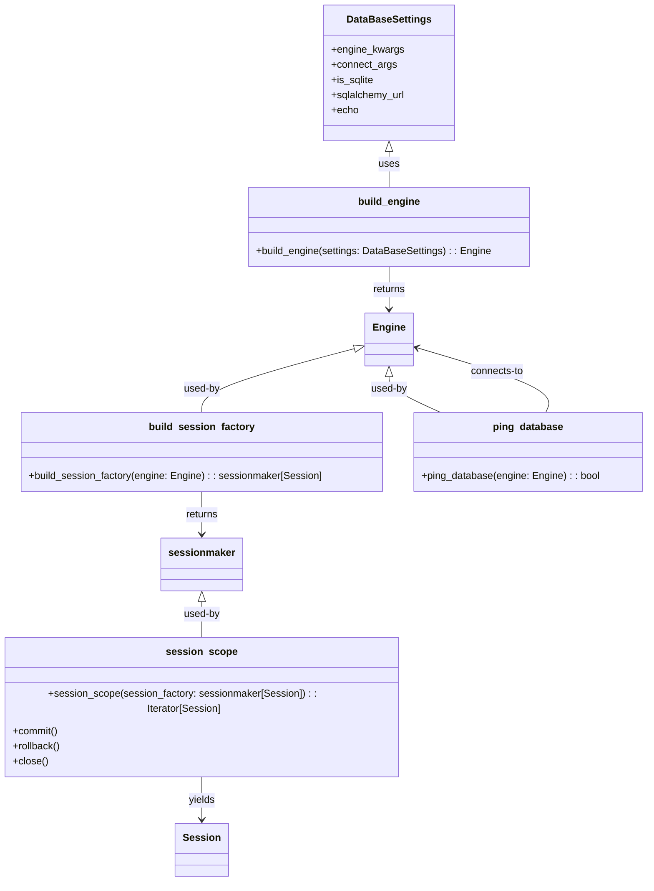

# Diagram: shared/core/src/core/db/database.py


> Auto-generated by Obscura crawlers

## Diagram 1



### SVG

<svg id="container" width="1027.52734375" xmlns="http://www.w3.org/2000/svg" class="classDiagram" height="1378" viewBox="0 0 1027.52734375 1378" role="graphics-document document" aria-roledescription="class"><style>#container{font-family:"trebuchet ms",verdana,arial,sans-serif;font-size:16px;fill:#333;}@keyframes edge-animation-frame{from{stroke-dashoffset:0;}}@keyframes dash{to{stroke-dashoffset:0;}}#container .edge-animation-slow{stroke-dasharray:9,5!important;stroke-dashoffset:900;animation:dash 50s linear infinite;stroke-linecap:round;}#container .edge-animation-fast{stroke-dasharray:9,5!important;stroke-dashoffset:900;animation:dash 20s linear infinite;stroke-linecap:round;}#container .error-icon{fill:#552222;}#container .error-text{fill:#552222;stroke:#552222;}#container .edge-thickness-normal{stroke-width:1px;}#container .edge-thickness-thick{stroke-width:3.5px;}#container .edge-pattern-solid{stroke-dasharray:0;}#container .edge-thickness-invisible{stroke-width:0;fill:none;}#container .edge-pattern-dashed{stroke-dasharray:3;}#container .edge-pattern-dotted{stroke-dasharray:2;}#container .marker{fill:#333333;stroke:#333333;}#container .marker.cross{stroke:#333333;}#container svg{font-family:"trebuchet ms",verdana,arial,sans-serif;font-size:16px;}#container p{margin:0;}#container g.classGroup text{fill:#9370DB;stroke:none;font-family:"trebuchet ms",verdana,arial,sans-serif;font-size:10px;}#container g.classGroup text .title{font-weight:bolder;}#container .nodeLabel,#container .edgeLabel{color:#131300;}#container .edgeLabel .label rect{fill:#ECECFF;}#container .label text{fill:#131300;}#container .labelBkg{background:#ECECFF;}#container .edgeLabel .label span{background:#ECECFF;}#container .classTitle{font-weight:bolder;}#container .node rect,#container .node circle,#container .node ellipse,#container .node polygon,#container .node path{fill:#ECECFF;stroke:#9370DB;stroke-width:1px;}#container .divider{stroke:#9370DB;stroke-width:1;}#container g.clickable{cursor:pointer;}#container g.classGroup rect{fill:#ECECFF;stroke:#9370DB;}#container g.classGroup line{stroke:#9370DB;stroke-width:1;}#container .classLabel .box{stroke:none;stroke-width:0;fill:#ECECFF;opacity:0.5;}#container .classLabel .label{fill:#9370DB;font-size:10px;}#container .relation{stroke:#333333;stroke-width:1;fill:none;}#container .dashed-line{stroke-dasharray:3;}#container .dotted-line{stroke-dasharray:1 2;}#container #compositionStart,#container .composition{fill:#333333!important;stroke:#333333!important;stroke-width:1;}#container #compositionEnd,#container .composition{fill:#333333!important;stroke:#333333!important;stroke-width:1;}#container #dependencyStart,#container .dependency{fill:#333333!important;stroke:#333333!important;stroke-width:1;}#container #dependencyStart,#container .dependency{fill:#333333!important;stroke:#333333!important;stroke-width:1;}#container #extensionStart,#container .extension{fill:transparent!important;stroke:#333333!important;stroke-width:1;}#container #extensionEnd,#container .extension{fill:transparent!important;stroke:#333333!important;stroke-width:1;}#container #aggregationStart,#container .aggregation{fill:transparent!important;stroke:#333333!important;stroke-width:1;}#container #aggregationEnd,#container .aggregation{fill:transparent!important;stroke:#333333!important;stroke-width:1;}#container #lollipopStart,#container .lollipop{fill:#ECECFF!important;stroke:#333333!important;stroke-width:1;}#container #lollipopEnd,#container .lollipop{fill:#ECECFF!important;stroke:#333333!important;stroke-width:1;}#container .edgeTerminals{font-size:11px;line-height:initial;}#container .classTitleText{text-anchor:middle;font-size:18px;fill:#333;}#container .label-icon{display:inline-block;height:1em;overflow:visible;vertical-align:-0.125em;}#container .node .label-icon path{fill:currentColor;stroke:revert;stroke-width:revert;}#container :root{--mermaid-font-family:"trebuchet ms",verdana,arial,sans-serif;}</style><g><defs><marker id="container_class-aggregationStart" class="marker aggregation class" refX="18" refY="7" markerWidth="190" markerHeight="240" orient="auto"><path d="M 18,7 L9,13 L1,7 L9,1 Z"></path></marker></defs><defs><marker id="container_class-aggregationEnd" class="marker aggregation class" refX="1" refY="7" markerWidth="20" markerHeight="28" orient="auto"><path d="M 18,7 L9,13 L1,7 L9,1 Z"></path></marker></defs><defs><marker id="container_class-extensionStart" class="marker extension class" refX="18" refY="7" markerWidth="190" markerHeight="240" orient="auto"><path d="M 1,7 L18,13 V 1 Z"></path></marker></defs><defs><marker id="container_class-extensionEnd" class="marker extension class" refX="1" refY="7" markerWidth="20" markerHeight="28" orient="auto"><path d="M 1,1 V 13 L18,7 Z"></path></marker></defs><defs><marker id="container_class-compositionStart" class="marker composition class" refX="18" refY="7" markerWidth="190" markerHeight="240" orient="auto"><path d="M 18,7 L9,13 L1,7 L9,1 Z"></path></marker></defs><defs><marker id="container_class-compositionEnd" class="marker composition class" refX="1" refY="7" markerWidth="20" markerHeight="28" orient="auto"><path d="M 18,7 L9,13 L1,7 L9,1 Z"></path></marker></defs><defs><marker id="container_class-dependencyStart" class="marker dependency class" refX="6" refY="7" markerWidth="190" markerHeight="240" orient="auto"><path d="M 5,7 L9,13 L1,7 L9,1 Z"></path></marker></defs><defs><marker id="container_class-dependencyEnd" class="marker dependency class" refX="13" refY="7" markerWidth="20" markerHeight="28" orient="auto"><path d="M 18,7 L9,13 L14,7 L9,1 Z"></path></marker></defs><defs><marker id="container_class-lollipopStart" class="marker lollipop class" refX="13" refY="7" markerWidth="190" markerHeight="240" orient="auto"><circle stroke="black" fill="transparent" cx="7" cy="7" r="6"></circle></marker></defs><defs><marker id="container_class-lollipopEnd" class="marker lollipop class" refX="1" refY="7" markerWidth="190" markerHeight="240" orient="auto"><circle stroke="black" fill="transparent" cx="7" cy="7" r="6"></circle></marker></defs><g class="root"><g class="clusters"></g><g class="edgePaths"><path d="M619.41,241.25L619.41,244.542C619.41,247.833,619.41,254.417,619.41,263.875C619.41,273.333,619.41,285.667,619.41,291.833L619.41,298" id="id_DataBaseSettings_build_engine_1" class="edge-thickness-normal edge-pattern-solid relation" style=";;;" data-edge="true" data-et="edge" data-id="id_DataBaseSettings_build_engine_1" data-points="W3sieCI6NjE5LjQxMDE1NjI1LCJ5IjoyMjR9LHsieCI6NjE5LjQxMDE1NjI1LCJ5IjoyNjF9LHsieCI6NjE5LjQxMDE1NjI1LCJ5IjoyOTh9XQ==" marker-start="url(#container_class-extensionStart)"></path><path d="M619.41,424L619.41,430.167C619.41,436.333,619.41,448.667,619.41,460C619.41,471.333,619.41,481.667,619.41,486.833L619.41,492" id="id_build_engine_Engine_2" class="edge-thickness-normal edge-pattern-solid relation" style=";;;" data-edge="true" data-et="edge" data-id="id_build_engine_Engine_2" data-points="W3sieCI6NjE5LjQxMDE1NjI1LCJ5Ijo0MjR9LHsieCI6NjE5LjQxMDE1NjI1LCJ5Ijo0NjF9LHsieCI6NjE5LjQxMDE1NjI1LCJ5Ijo0OTh9XQ==" marker-end="url(#container_class-dependencyEnd)"></path><path d="M566.291,554.081L525.475,564.901C484.66,575.721,403.029,597.36,362.214,614.347C321.398,631.333,321.398,643.667,321.398,649.833L321.398,656" id="id_Engine_build_session_factory_3" class="edge-thickness-normal edge-pattern-solid relation" style=";;;" data-edge="true" data-et="edge" data-id="id_Engine_build_session_factory_3" data-points="W3sieCI6NTgyLjk2NDg0Mzc1LCJ5Ijo1NDkuNjYxMjk2ODc2NDMzN30seyJ4IjozMjEuMzk4NDM3NSwieSI6NjE5fSx7IngiOjMyMS4zOTg0Mzc1LCJ5Ijo2NTZ9XQ==" marker-start="url(#container_class-extensionStart)"></path><path d="M321.398,782L321.398,788.167C321.398,794.333,321.398,806.667,321.398,818C321.398,829.333,321.398,839.667,321.398,844.833L321.398,850" id="id_build_session_factory_sessionmaker_4" class="edge-thickness-normal edge-pattern-solid relation" style=";;;" data-edge="true" data-et="edge" data-id="id_build_session_factory_sessionmaker_4" data-points="W3sieCI6MzIxLjM5ODQzNzUsInkiOjc4Mn0seyJ4IjozMjEuMzk4NDM3NSwieSI6ODE5fSx7IngiOjMyMS4zOTg0Mzc1LCJ5Ijo4NTZ9XQ==" marker-end="url(#container_class-dependencyEnd)"></path><path d="M321.398,957.25L321.398,960.542C321.398,963.833,321.398,970.417,321.398,979.875C321.398,989.333,321.398,1001.667,321.398,1007.833L321.398,1014" id="id_sessionmaker_session_scope_5" class="edge-thickness-normal edge-pattern-solid relation" style=";;;" data-edge="true" data-et="edge" data-id="id_sessionmaker_session_scope_5" data-points="W3sieCI6MzIxLjM5ODQzNzUsInkiOjk0MH0seyJ4IjozMjEuMzk4NDM3NSwieSI6OTc3fSx7IngiOjMyMS4zOTg0Mzc1LCJ5IjoxMDE0fV0=" marker-start="url(#container_class-extensionStart)"></path><path d="M321.398,1212L321.398,1218.167C321.398,1224.333,321.398,1236.667,321.398,1248C321.398,1259.333,321.398,1269.667,321.398,1274.833L321.398,1280" id="id_session_scope_Session_6" class="edge-thickness-normal edge-pattern-solid relation" style=";;;" data-edge="true" data-et="edge" data-id="id_session_scope_Session_6" data-points="W3sieCI6MzIxLjM5ODQzNzUsInkiOjEyMTJ9LHsieCI6MzIxLjM5ODQzNzUsInkiOjEyNDl9LHsieCI6MzIxLjM5ODQzNzUsInkiOjEyODZ9XQ==" marker-end="url(#container_class-dependencyEnd)"></path><path d="M619.41,599.25L619.41,602.542C619.41,605.833,619.41,612.417,632.926,621.875C646.441,631.333,673.472,643.667,686.987,649.833L700.502,656" id="id_Engine_ping_database_7" class="edge-thickness-normal edge-pattern-solid relation" style=";;;" data-edge="true" data-et="edge" data-id="id_Engine_ping_database_7" data-points="W3sieCI6NjE5LjQxMDE1NjI1LCJ5Ijo1ODJ9LHsieCI6NjE5LjQxMDE1NjI1LCJ5Ijo2MTl9LHsieCI6NzAwLjUwMjMwNDY4NzUsInkiOjY1Nn1d" marker-start="url(#container_class-extensionStart)"></path><path d="M867.713,656L870.565,649.833C873.417,643.667,879.121,631.333,844.769,614.093C810.418,596.853,736.012,574.706,698.809,563.633L661.606,552.56" id="id_ping_database_Engine_8" class="edge-thickness-normal edge-pattern-solid relation" style=";;;" data-edge="true" data-et="edge" data-id="id_ping_database_Engine_8" data-points="W3sieCI6ODY3LjcxMzE2NDA2MjUsInkiOjY1Nn0seyJ4Ijo4ODQuODI0MjE4NzUsInkiOjYxOX0seyJ4Ijo2NTUuODU1NDY4NzUsInkiOjU1MC44NDc4NzkxOTgxODY4fV0=" marker-end="url(#container_class-dependencyEnd)"></path></g><g class="edgeLabels"><g class="edgeLabel" transform="translate(619.41015625, 261)"><g class="label" data-id="id_DataBaseSettings_build_engine_1" transform="translate(-16.4921875, -12)"><foreignObject width="32.984375" height="24"><div xmlns="http://www.w3.org/1999/xhtml" class="labelBkg" style="display: table-cell; white-space: nowrap; line-height: 1.5; max-width: 200px; text-align: center;"><span class="edgeLabel"><p>uses</p></span></div></foreignObject></g></g><g class="edgeLabel" transform="translate(619.41015625, 461)"><g class="label" data-id="id_build_engine_Engine_2" transform="translate(-26.265625, -12)"><foreignObject width="52.53125" height="24"><div xmlns="http://www.w3.org/1999/xhtml" class="labelBkg" style="display: table-cell; white-space: nowrap; line-height: 1.5; max-width: 200px; text-align: center;"><span class="edgeLabel"><p>returns</p></span></div></foreignObject></g></g><g class="edgeLabel" transform="translate(321.3984375, 619)"><g class="label" data-id="id_Engine_build_session_factory_3" transform="translate(-29.421875, -12)"><foreignObject width="58.84375" height="24"><div xmlns="http://www.w3.org/1999/xhtml" class="labelBkg" style="display: table-cell; white-space: nowrap; line-height: 1.5; max-width: 200px; text-align: center;"><span class="edgeLabel"><p>used-by</p></span></div></foreignObject></g></g><g class="edgeLabel" transform="translate(321.3984375, 819)"><g class="label" data-id="id_build_session_factory_sessionmaker_4" transform="translate(-26.265625, -12)"><foreignObject width="52.53125" height="24"><div xmlns="http://www.w3.org/1999/xhtml" class="labelBkg" style="display: table-cell; white-space: nowrap; line-height: 1.5; max-width: 200px; text-align: center;"><span class="edgeLabel"><p>returns</p></span></div></foreignObject></g></g><g class="edgeLabel" transform="translate(321.3984375, 977)"><g class="label" data-id="id_sessionmaker_session_scope_5" transform="translate(-29.421875, -12)"><foreignObject width="58.84375" height="24"><div xmlns="http://www.w3.org/1999/xhtml" class="labelBkg" style="display: table-cell; white-space: nowrap; line-height: 1.5; max-width: 200px; text-align: center;"><span class="edgeLabel"><p>used-by</p></span></div></foreignObject></g></g><g class="edgeLabel" transform="translate(321.3984375, 1249)"><g class="label" data-id="id_session_scope_Session_6" transform="translate(-21.3828125, -12)"><foreignObject width="42.765625" height="24"><div xmlns="http://www.w3.org/1999/xhtml" class="labelBkg" style="display: table-cell; white-space: nowrap; line-height: 1.5; max-width: 200px; text-align: center;"><span class="edgeLabel"><p>yields</p></span></div></foreignObject></g></g><g class="edgeLabel" transform="translate(619.41015625, 619)"><g class="label" data-id="id_Engine_ping_database_7" transform="translate(-29.421875, -12)"><foreignObject width="58.84375" height="24"><div xmlns="http://www.w3.org/1999/xhtml" class="labelBkg" style="display: table-cell; white-space: nowrap; line-height: 1.5; max-width: 200px; text-align: center;"><span class="edgeLabel"><p>used-by</p></span></div></foreignObject></g></g><g class="edgeLabel" transform="translate(789.87536, 590.73865)"><g class="label" data-id="id_ping_database_Engine_8" transform="translate(-43.0703125, -12)"><foreignObject width="86.140625" height="24"><div xmlns="http://www.w3.org/1999/xhtml" class="labelBkg" style="display: table-cell; white-space: nowrap; line-height: 1.5; max-width: 200px; text-align: center;"><span class="edgeLabel"><p>connects-to</p></span></div></foreignObject></g></g></g><g class="nodes"><g class="node default" id="classId-DataBaseSettings-0" transform="translate(619.41015625, 116)"><g class="basic label-container"><path d="M-103.17578125 -108 L103.17578125 -108 L103.17578125 108 L-103.17578125 108" stroke="none" stroke-width="0" fill="#ECECFF" style=""></path><path d="M-103.17578125 -108 C-27.58512895777315 -108, 48.0055233344537 -108, 103.17578125 -108 M-103.17578125 -108 C-33.39033347603649 -108, 36.39511429792702 -108, 103.17578125 -108 M103.17578125 -108 C103.17578125 -30.7989767183426, 103.17578125 46.4020465633148, 103.17578125 108 M103.17578125 -108 C103.17578125 -30.03082610828389, 103.17578125 47.93834778343222, 103.17578125 108 M103.17578125 108 C35.63759328161511 108, -31.90059468676978 108, -103.17578125 108 M103.17578125 108 C34.965058430118646 108, -33.24566438976271 108, -103.17578125 108 M-103.17578125 108 C-103.17578125 51.02847354504001, -103.17578125 -5.9430529099199845, -103.17578125 -108 M-103.17578125 108 C-103.17578125 62.50954094228446, -103.17578125 17.01908188456892, -103.17578125 -108" stroke="#9370DB" stroke-width="1.3" fill="none" stroke-dasharray="0 0" style=""></path></g><g class="annotation-group text" transform="translate(0, -84)"></g><g class="label-group text" transform="translate(-64.6484375, -84)"><g class="label" style="font-weight: bolder" transform="translate(0,-12)"><foreignObject width="129.296875" height="24"><div xmlns="http://www.w3.org/1999/xhtml" style="display: table-cell; white-space: nowrap; line-height: 1.5; max-width: 176px; text-align: center;"><span class="nodeLabel markdown-node-label" style=""><p>DataBaseSettings</p></span></div></foreignObject></g></g><g class="members-group text" transform="translate(-91.17578125, -36)"><g class="label" style="" transform="translate(0,-12)"><foreignObject width="114.8125" height="24"><div xmlns="http://www.w3.org/1999/xhtml" style="display: table-cell; white-space: nowrap; line-height: 1.5; max-width: 172px; text-align: center;"><span class="nodeLabel markdown-node-label" style=""><p>+engine_kwargs</p></span></div></foreignObject></g><g class="label" style="" transform="translate(0,12)"><foreignObject width="103.875" height="24"><div xmlns="http://www.w3.org/1999/xhtml" style="display: table-cell; white-space: nowrap; line-height: 1.5; max-width: 161px; text-align: center;"><span class="nodeLabel markdown-node-label" style=""><p>+connect_args</p></span></div></foreignObject></g><g class="label" style="" transform="translate(0,36)"><foreignObject width="68.46875" height="24"><div xmlns="http://www.w3.org/1999/xhtml" style="display: table-cell; white-space: nowrap; line-height: 1.5; max-width: 126px; text-align: center;"><span class="nodeLabel markdown-node-label" style=""><p>+is_sqlite</p></span></div></foreignObject></g><g class="label" style="" transform="translate(0,60)"><foreignObject width="117.703125" height="24"><div xmlns="http://www.w3.org/1999/xhtml" style="display: table-cell; white-space: nowrap; line-height: 1.5; max-width: 175px; text-align: center;"><span class="nodeLabel markdown-node-label" style=""><p>+sqlalchemy_url</p></span></div></foreignObject></g><g class="label" style="" transform="translate(0,84)"><foreignObject width="43.078125" height="24"><div xmlns="http://www.w3.org/1999/xhtml" style="display: table-cell; white-space: nowrap; line-height: 1.5; max-width: 100px; text-align: center;"><span class="nodeLabel markdown-node-label" style=""><p>+echo</p></span></div></foreignObject></g></g><g class="methods-group text" transform="translate(-91.17578125, 108)"></g><g class="divider" style=""><path d="M-103.17578125 -60 C-37.09103818993735 -60, 28.9937048701253 -60, 103.17578125 -60 M-103.17578125 -60 C-44.68486045205817 -60, 13.806060345883665 -60, 103.17578125 -60" stroke="#9370DB" stroke-width="1.3" fill="none" stroke-dasharray="0 0" style=""></path></g><g class="divider" style=""><path d="M-103.17578125 84 C-41.94398031345073 84, 19.28782062309854 84, 103.17578125 84 M-103.17578125 84 C-40.662053359024064 84, 21.851674531951872 84, 103.17578125 84" stroke="#9370DB" stroke-width="1.3" fill="none" stroke-dasharray="0 0" style=""></path></g></g><g class="node default" id="classId-Engine-1" transform="translate(619.41015625, 540)"><g class="basic label-container"><path d="M-36.4453125 -42 L36.4453125 -42 L36.4453125 42 L-36.4453125 42" stroke="none" stroke-width="0" fill="#ECECFF" style=""></path><path d="M-36.4453125 -42 C-18.138751890132443 -42, 0.16780871973511324 -42, 36.4453125 -42 M-36.4453125 -42 C-18.0050312993672 -42, 0.4352499012655997 -42, 36.4453125 -42 M36.4453125 -42 C36.4453125 -23.69227055741143, 36.4453125 -5.384541114822859, 36.4453125 42 M36.4453125 -42 C36.4453125 -15.78095566901786, 36.4453125 10.43808866196428, 36.4453125 42 M36.4453125 42 C12.738594057072405 42, -10.968124385855191 42, -36.4453125 42 M36.4453125 42 C16.699990783118494 42, -3.0453309337630117 42, -36.4453125 42 M-36.4453125 42 C-36.4453125 14.80751630987573, -36.4453125 -12.38496738024854, -36.4453125 -42 M-36.4453125 42 C-36.4453125 10.320541907979454, -36.4453125 -21.358916184041092, -36.4453125 -42" stroke="#9370DB" stroke-width="1.3" fill="none" stroke-dasharray="0 0" style=""></path></g><g class="annotation-group text" transform="translate(0, -18)"></g><g class="label-group text" transform="translate(-24.4453125, -18)"><g class="label" style="font-weight: bolder" transform="translate(0,-12)"><foreignObject width="48.890625" height="24"><div xmlns="http://www.w3.org/1999/xhtml" style="display: table-cell; white-space: nowrap; line-height: 1.5; max-width: 99px; text-align: center;"><span class="nodeLabel markdown-node-label" style=""><p>Engine</p></span></div></foreignObject></g></g><g class="members-group text" transform="translate(-24.4453125, 30)"></g><g class="methods-group text" transform="translate(-24.4453125, 60)"></g><g class="divider" style=""><path d="M-36.4453125 6 C-15.3637903228739 6, 5.7177318542522 6, 36.4453125 6 M-36.4453125 6 C-21.755820072400905 6, -7.0663276448018095 6, 36.4453125 6" stroke="#9370DB" stroke-width="1.3" fill="none" stroke-dasharray="0 0" style=""></path></g><g class="divider" style=""><path d="M-36.4453125 24 C-11.057255134731463 24, 14.330802230537074 24, 36.4453125 24 M-36.4453125 24 C-11.631059058216934 24, 13.183194383566132 24, 36.4453125 24" stroke="#9370DB" stroke-width="1.3" fill="none" stroke-dasharray="0 0" style=""></path></g></g><g class="node default" id="classId-Session-2" transform="translate(321.3984375, 1328)"><g class="basic label-container"><path d="M-40.2109375 -42 L40.2109375 -42 L40.2109375 42 L-40.2109375 42" stroke="none" stroke-width="0" fill="#ECECFF" style=""></path><path d="M-40.2109375 -42 C-15.410105515474463 -42, 9.390726469051074 -42, 40.2109375 -42 M-40.2109375 -42 C-23.77624885125528 -42, -7.341560202510557 -42, 40.2109375 -42 M40.2109375 -42 C40.2109375 -12.168999817190457, 40.2109375 17.662000365619086, 40.2109375 42 M40.2109375 -42 C40.2109375 -17.069417000828743, 40.2109375 7.861165998342514, 40.2109375 42 M40.2109375 42 C19.379868518538807 42, -1.4512004629223867 42, -40.2109375 42 M40.2109375 42 C21.051362667384364 42, 1.8917878347687278 42, -40.2109375 42 M-40.2109375 42 C-40.2109375 20.553524797762833, -40.2109375 -0.8929504044743339, -40.2109375 -42 M-40.2109375 42 C-40.2109375 20.104542411174318, -40.2109375 -1.7909151776513639, -40.2109375 -42" stroke="#9370DB" stroke-width="1.3" fill="none" stroke-dasharray="0 0" style=""></path></g><g class="annotation-group text" transform="translate(0, -18)"></g><g class="label-group text" transform="translate(-28.2109375, -18)"><g class="label" style="font-weight: bolder" transform="translate(0,-12)"><foreignObject width="56.421875" height="24"><div xmlns="http://www.w3.org/1999/xhtml" style="display: table-cell; white-space: nowrap; line-height: 1.5; max-width: 105px; text-align: center;"><span class="nodeLabel markdown-node-label" style=""><p>Session</p></span></div></foreignObject></g></g><g class="members-group text" transform="translate(-28.2109375, 30)"></g><g class="methods-group text" transform="translate(-28.2109375, 60)"></g><g class="divider" style=""><path d="M-40.2109375 6 C-13.538567487153962 6, 13.133802525692076 6, 40.2109375 6 M-40.2109375 6 C-23.81557533483524 6, -7.4202131696704825 6, 40.2109375 6" stroke="#9370DB" stroke-width="1.3" fill="none" stroke-dasharray="0 0" style=""></path></g><g class="divider" style=""><path d="M-40.2109375 24 C-21.870296913472203 24, -3.529656326944405 24, 40.2109375 24 M-40.2109375 24 C-8.48744969797108 24, 23.23603810405784 24, 40.2109375 24" stroke="#9370DB" stroke-width="1.3" fill="none" stroke-dasharray="0 0" style=""></path></g></g><g class="node default" id="classId-sessionmaker-3" transform="translate(321.3984375, 898)"><g class="basic label-container"><path d="M-62.578125 -42 L62.578125 -42 L62.578125 42 L-62.578125 42" stroke="none" stroke-width="0" fill="#ECECFF" style=""></path><path d="M-62.578125 -42 C-37.46817331947672 -42, -12.358221638953438 -42, 62.578125 -42 M-62.578125 -42 C-19.462121970158762 -42, 23.653881059682476 -42, 62.578125 -42 M62.578125 -42 C62.578125 -9.1976659870489, 62.578125 23.6046680259022, 62.578125 42 M62.578125 -42 C62.578125 -9.723940128150502, 62.578125 22.552119743698995, 62.578125 42 M62.578125 42 C25.896182382080397 42, -10.785760235839206 42, -62.578125 42 M62.578125 42 C35.00950202400033 42, 7.440879048000646 42, -62.578125 42 M-62.578125 42 C-62.578125 15.100583813781803, -62.578125 -11.798832372436394, -62.578125 -42 M-62.578125 42 C-62.578125 19.591608570627805, -62.578125 -2.8167828587443893, -62.578125 -42" stroke="#9370DB" stroke-width="1.3" fill="none" stroke-dasharray="0 0" style=""></path></g><g class="annotation-group text" transform="translate(0, -18)"></g><g class="label-group text" transform="translate(-50.578125, -18)"><g class="label" style="font-weight: bolder" transform="translate(0,-12)"><foreignObject width="101.15625" height="24"><div xmlns="http://www.w3.org/1999/xhtml" style="display: table-cell; white-space: nowrap; line-height: 1.5; max-width: 150px; text-align: center;"><span class="nodeLabel markdown-node-label" style=""><p>sessionmaker</p></span></div></foreignObject></g></g><g class="members-group text" transform="translate(-50.578125, 30)"></g><g class="methods-group text" transform="translate(-50.578125, 60)"></g><g class="divider" style=""><path d="M-62.578125 6 C-34.046898378410845 6, -5.515671756821689 6, 62.578125 6 M-62.578125 6 C-29.50970135766675 6, 3.5587222846665014 6, 62.578125 6" stroke="#9370DB" stroke-width="1.3" fill="none" stroke-dasharray="0 0" style=""></path></g><g class="divider" style=""><path d="M-62.578125 24 C-37.33013894163853 24, -12.082152883277061 24, 62.578125 24 M-62.578125 24 C-25.9430499139347 24, 10.692025172130599 24, 62.578125 24" stroke="#9370DB" stroke-width="1.3" fill="none" stroke-dasharray="0 0" style=""></path></g></g><g class="node default" id="classId-build_engine-4" transform="translate(619.41015625, 361)"><g class="basic label-container"><path d="M-222.55078125 -63 L222.55078125 -63 L222.55078125 63 L-222.55078125 63" stroke="none" stroke-width="0" fill="#ECECFF" style=""></path><path d="M-222.55078125 -63 C-73.65104766451023 -63, 75.24868592097954 -63, 222.55078125 -63 M-222.55078125 -63 C-64.9264670609501 -63, 92.6978471280998 -63, 222.55078125 -63 M222.55078125 -63 C222.55078125 -34.37468243099191, 222.55078125 -5.749364861983821, 222.55078125 63 M222.55078125 -63 C222.55078125 -26.55028812594243, 222.55078125 9.89942374811514, 222.55078125 63 M222.55078125 63 C88.45747064274565 63, -45.635839964508705 63, -222.55078125 63 M222.55078125 63 C115.72752031858228 63, 8.904259387164558 63, -222.55078125 63 M-222.55078125 63 C-222.55078125 34.608007100788996, -222.55078125 6.216014201577998, -222.55078125 -63 M-222.55078125 63 C-222.55078125 18.50171804563098, -222.55078125 -25.99656390873804, -222.55078125 -63" stroke="#9370DB" stroke-width="1.3" fill="none" stroke-dasharray="0 0" style=""></path></g><g class="annotation-group text" transform="translate(0, -39)"></g><g class="label-group text" transform="translate(-47.4765625, -39)"><g class="label" style="font-weight: bolder" transform="translate(0,-12)"><foreignObject width="94.953125" height="24"><div xmlns="http://www.w3.org/1999/xhtml" style="display: table-cell; white-space: nowrap; line-height: 1.5; max-width: 145px; text-align: center;"><span class="nodeLabel markdown-node-label" style=""><p>build_engine</p></span></div></foreignObject></g></g><g class="members-group text" transform="translate(-210.55078125, 9)"></g><g class="methods-group text" transform="translate(-210.55078125, 39)"><g class="label" style="" transform="translate(0,-12)"><foreignObject width="373.625" height="24"><div xmlns="http://www.w3.org/1999/xhtml" style="display: table-cell; white-space: nowrap; line-height: 1.5; max-width: 431px; text-align: center;"><span class="nodeLabel markdown-node-label" style=""><p>+build_engine(settings: DataBaseSettings) : : Engine</p></span></div></foreignObject></g></g><g class="divider" style=""><path d="M-222.55078125 -15 C-129.67390192059713 -15, -36.797022591194235 -15, 222.55078125 -15 M-222.55078125 -15 C-89.16645597527489 -15, 44.21786929945023 -15, 222.55078125 -15" stroke="#9370DB" stroke-width="1.3" fill="none" stroke-dasharray="0 0" style=""></path></g><g class="divider" style=""><path d="M-222.55078125 9 C-53.03792856576021 9, 116.47492411847958 9, 222.55078125 9 M-222.55078125 9 C-108.43296164588537 9, 5.684857958229259 9, 222.55078125 9" stroke="#9370DB" stroke-width="1.3" fill="none" stroke-dasharray="0 0" style=""></path></g></g><g class="node default" id="classId-build_session_factory-5" transform="translate(321.3984375, 719)"><g class="basic label-container"><path d="M-286.23046875 -63 L286.23046875 -63 L286.23046875 63 L-286.23046875 63" stroke="none" stroke-width="0" fill="#ECECFF" style=""></path><path d="M-286.23046875 -63 C-157.72371495175565 -63, -29.216961153511306 -63, 286.23046875 -63 M-286.23046875 -63 C-71.56527283957311 -63, 143.09992307085378 -63, 286.23046875 -63 M286.23046875 -63 C286.23046875 -28.698119882618172, 286.23046875 5.603760234763655, 286.23046875 63 M286.23046875 -63 C286.23046875 -36.92435470134261, 286.23046875 -10.84870940268521, 286.23046875 63 M286.23046875 63 C113.61551249778975 63, -58.9994437544205 63, -286.23046875 63 M286.23046875 63 C81.85449690125208 63, -122.52147494749585 63, -286.23046875 63 M-286.23046875 63 C-286.23046875 34.336989315197144, -286.23046875 5.673978630394281, -286.23046875 -63 M-286.23046875 63 C-286.23046875 35.07571414285674, -286.23046875 7.151428285713479, -286.23046875 -63" stroke="#9370DB" stroke-width="1.3" fill="none" stroke-dasharray="0 0" style=""></path></g><g class="annotation-group text" transform="translate(0, -39)"></g><g class="label-group text" transform="translate(-80.2421875, -39)"><g class="label" style="font-weight: bolder" transform="translate(0,-12)"><foreignObject width="160.484375" height="24"><div xmlns="http://www.w3.org/1999/xhtml" style="display: table-cell; white-space: nowrap; line-height: 1.5; max-width: 208px; text-align: center;"><span class="nodeLabel markdown-node-label" style=""><p>build_session_factory</p></span></div></foreignObject></g></g><g class="members-group text" transform="translate(-274.23046875, 9)"></g><g class="methods-group text" transform="translate(-274.23046875, 39)"><g class="label" style="" transform="translate(0,-12)"><foreignObject width="468.21875" height="24"><div xmlns="http://www.w3.org/1999/xhtml" style="display: table-cell; white-space: nowrap; line-height: 1.5; max-width: 526px; text-align: center;"><span class="nodeLabel markdown-node-label" style=""><p>+build_session_factory(engine: Engine) : : sessionmaker[Session]</p></span></div></foreignObject></g></g><g class="divider" style=""><path d="M-286.23046875 -15 C-126.08976214291181 -15, 34.05094446417638 -15, 286.23046875 -15 M-286.23046875 -15 C-164.37245517869624 -15, -42.514441607392484 -15, 286.23046875 -15" stroke="#9370DB" stroke-width="1.3" fill="none" stroke-dasharray="0 0" style=""></path></g><g class="divider" style=""><path d="M-286.23046875 9 C-156.203098505743 9, -26.175728261485972 9, 286.23046875 9 M-286.23046875 9 C-102.01549822430593 9, 82.19947230138814 9, 286.23046875 9" stroke="#9370DB" stroke-width="1.3" fill="none" stroke-dasharray="0 0" style=""></path></g></g><g class="node default" id="classId-session_scope-6" transform="translate(321.3984375, 1113)"><g class="basic label-container"><path d="M-313.3984375 -99 L313.3984375 -99 L313.3984375 99 L-313.3984375 99" stroke="none" stroke-width="0" fill="#ECECFF" style=""></path><path d="M-313.3984375 -99 C-118.85826869554899 -99, 75.68190010890203 -99, 313.3984375 -99 M-313.3984375 -99 C-74.32258170058009 -99, 164.75327409883982 -99, 313.3984375 -99 M313.3984375 -99 C313.3984375 -36.755707104052995, 313.3984375 25.48858579189401, 313.3984375 99 M313.3984375 -99 C313.3984375 -45.30486836068715, 313.3984375 8.390263278625696, 313.3984375 99 M313.3984375 99 C85.06430580728627 99, -143.26982588542745 99, -313.3984375 99 M313.3984375 99 C100.22884726427992 99, -112.94074297144016 99, -313.3984375 99 M-313.3984375 99 C-313.3984375 29.73159605148959, -313.3984375 -39.53680789702082, -313.3984375 -99 M-313.3984375 99 C-313.3984375 36.976592782791975, -313.3984375 -25.04681443441605, -313.3984375 -99" stroke="#9370DB" stroke-width="1.3" fill="none" stroke-dasharray="0 0" style=""></path></g><g class="annotation-group text" transform="translate(0, -75)"></g><g class="label-group text" transform="translate(-53.0625, -75)"><g class="label" style="font-weight: bolder" transform="translate(0,-12)"><foreignObject width="106.125" height="24"><div xmlns="http://www.w3.org/1999/xhtml" style="display: table-cell; white-space: nowrap; line-height: 1.5; max-width: 155px; text-align: center;"><span class="nodeLabel markdown-node-label" style=""><p>session_scope</p></span></div></foreignObject></g></g><g class="members-group text" transform="translate(-301.3984375, -27)"></g><g class="methods-group text" transform="translate(-301.3984375, 3)"><g class="label" style="" transform="translate(0,-12)"><foreignObject width="549.734375" height="24"><div xmlns="http://www.w3.org/1999/xhtml" style="display: table-cell; white-space: nowrap; line-height: 1.5; max-width: 607px; text-align: center;"><span class="nodeLabel markdown-node-label" style=""><p>+session_scope(session_factory: sessionmaker[Session]) : : Iterator[Session]</p></span></div></foreignObject></g><g class="label" style="" transform="translate(0,12)"><foreignObject width="72.75" height="24"><div xmlns="http://www.w3.org/1999/xhtml" style="display: table-cell; white-space: nowrap; line-height: 1.5; max-width: 130px; text-align: center;"><span class="nodeLabel markdown-node-label" style=""><p>+commit()</p></span></div></foreignObject></g><g class="label" style="" transform="translate(0,36)"><foreignObject width="76.65625" height="24"><div xmlns="http://www.w3.org/1999/xhtml" style="display: table-cell; white-space: nowrap; line-height: 1.5; max-width: 134px; text-align: center;"><span class="nodeLabel markdown-node-label" style=""><p>+rollback()</p></span></div></foreignObject></g><g class="label" style="" transform="translate(0,60)"><foreignObject width="56.15625" height="24"><div xmlns="http://www.w3.org/1999/xhtml" style="display: table-cell; white-space: nowrap; line-height: 1.5; max-width: 114px; text-align: center;"><span class="nodeLabel markdown-node-label" style=""><p>+close()</p></span></div></foreignObject></g></g><g class="divider" style=""><path d="M-313.3984375 -51 C-136.02186733845753 -51, 41.35470282308495 -51, 313.3984375 -51 M-313.3984375 -51 C-109.74521718827424 -51, 93.90800312345152 -51, 313.3984375 -51" stroke="#9370DB" stroke-width="1.3" fill="none" stroke-dasharray="0 0" style=""></path></g><g class="divider" style=""><path d="M-313.3984375 -27 C-180.27024136124555 -27, -47.142045222491106 -27, 313.3984375 -27 M-313.3984375 -27 C-69.01981548539396 -27, 175.35880652921207 -27, 313.3984375 -27" stroke="#9370DB" stroke-width="1.3" fill="none" stroke-dasharray="0 0" style=""></path></g></g><g class="node default" id="classId-ping_database-7" transform="translate(838.578125, 719)"><g class="basic label-container"><path d="M-180.94921875 -63 L180.94921875 -63 L180.94921875 63 L-180.94921875 63" stroke="none" stroke-width="0" fill="#ECECFF" style=""></path><path d="M-180.94921875 -63 C-75.29965563843342 -63, 30.349907473133158 -63, 180.94921875 -63 M-180.94921875 -63 C-82.32293189504946 -63, 16.30335495990107 -63, 180.94921875 -63 M180.94921875 -63 C180.94921875 -15.553540324113875, 180.94921875 31.89291935177225, 180.94921875 63 M180.94921875 -63 C180.94921875 -18.422972193437396, 180.94921875 26.15405561312521, 180.94921875 63 M180.94921875 63 C51.4684595946097 63, -78.0122995607806 63, -180.94921875 63 M180.94921875 63 C100.21563366665492 63, 19.482048583309847 63, -180.94921875 63 M-180.94921875 63 C-180.94921875 24.73340609743999, -180.94921875 -13.533187805120022, -180.94921875 -63 M-180.94921875 63 C-180.94921875 20.02394856499658, -180.94921875 -22.95210287000684, -180.94921875 -63" stroke="#9370DB" stroke-width="1.3" fill="none" stroke-dasharray="0 0" style=""></path></g><g class="annotation-group text" transform="translate(0, -39)"></g><g class="label-group text" transform="translate(-53.9609375, -39)"><g class="label" style="font-weight: bolder" transform="translate(0,-12)"><foreignObject width="107.921875" height="24"><div xmlns="http://www.w3.org/1999/xhtml" style="display: table-cell; white-space: nowrap; line-height: 1.5; max-width: 157px; text-align: center;"><span class="nodeLabel markdown-node-label" style=""><p>ping_database</p></span></div></foreignObject></g></g><g class="members-group text" transform="translate(-168.94921875, 9)"></g><g class="methods-group text" transform="translate(-168.94921875, 39)"><g class="label" style="" transform="translate(0,-12)"><foreignObject width="283.9375" height="24"><div xmlns="http://www.w3.org/1999/xhtml" style="display: table-cell; white-space: nowrap; line-height: 1.5; max-width: 342px; text-align: center;"><span class="nodeLabel markdown-node-label" style=""><p>+ping_database(engine: Engine) : : bool</p></span></div></foreignObject></g></g><g class="divider" style=""><path d="M-180.94921875 -15 C-54.16243356291878 -15, 72.62435162416244 -15, 180.94921875 -15 M-180.94921875 -15 C-54.481110554668476 -15, 71.98699764066305 -15, 180.94921875 -15" stroke="#9370DB" stroke-width="1.3" fill="none" stroke-dasharray="0 0" style=""></path></g><g class="divider" style=""><path d="M-180.94921875 9 C-89.9139861269326 9, 1.1212464961348019 9, 180.94921875 9 M-180.94921875 9 C-56.707573838382814 9, 67.53407107323437 9, 180.94921875 9" stroke="#9370DB" stroke-width="1.3" fill="none" stroke-dasharray="0 0" style=""></path></g></g></g></g></g></svg>

## Diagram 2

```mermaid
flowchart TD
    A[Call build_engine(settings)] --> B{settings.is_sqlite and ":memory:" in url?}
    B -- yes --> C[Set poolclass = StaticPool in engine_kwargs]
    B -- no --> D[Keep engine_kwargs]
    C --> E[create_engine(sqlalchemy_url, echo, future=True, connect_args, **engine_kwargs)]
    D --> E
    E --> F[Engine returned]
    F --> G[Call build_session_factory(engine)]
    G --> H[sessionmaker configured (bind=engine, autoflush=False, autocommit=False, expire_on_commit=False, class_=Session)]
    H --> I[session_factory returned]
    I --> J[Use session_scope(session_factory)]
    J --> K[session = session_factory()]
    K --> L[try: yield session]
    L --> M[on success -> session.commit()]
    L --> N[on exception -> session.rollback() -> raise]
    M --> O[finally -> session.close()]
    N --> O
    O --> P[End]
```

> SVG rendering failed for this diagram.
