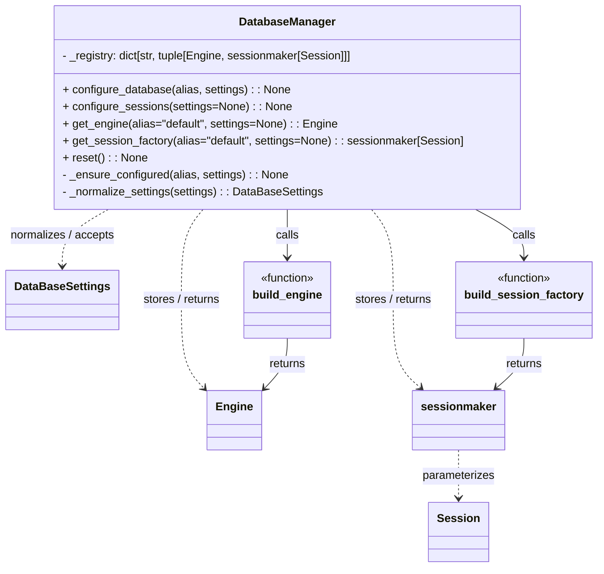

# Diagram: shared/core/src/core/db/manager.py

> Auto-generated by Obscura crawlers

## Mermaid

```mermaid
classDiagram
class DatabaseManager {
  - _registry: dict[str, tuple[Engine, sessionmaker[Session]]]
  + configure_database(alias, settings): None
  + configure_sessions(settings=None): None
  + get_engine(alias="default", settings=None): Engine
  + get_session_factory(alias="default", settings=None): sessionmaker[Session]
  + reset(): None
  - _ensure_configured(alias, settings): None
  - _normalize_settings(settings): DataBaseSettings
}
class DataBaseSettings
class Engine
class Session
class sessionmaker
class build_engine <<function>>
class build_session_factory <<function>>

DatabaseManager ..> DataBaseSettings : normalizes / accepts
DatabaseManager ..> Engine : stores / returns
DatabaseManager ..> sessionmaker : stores / returns
DatabaseManager --> build_engine : calls
DatabaseManager --> build_session_factory : calls
build_engine --> Engine : returns
build_session_factory --> sessionmaker : returns
sessionmaker ..> Session : parameterizes
```

> SVG rendering failed for this diagram.
