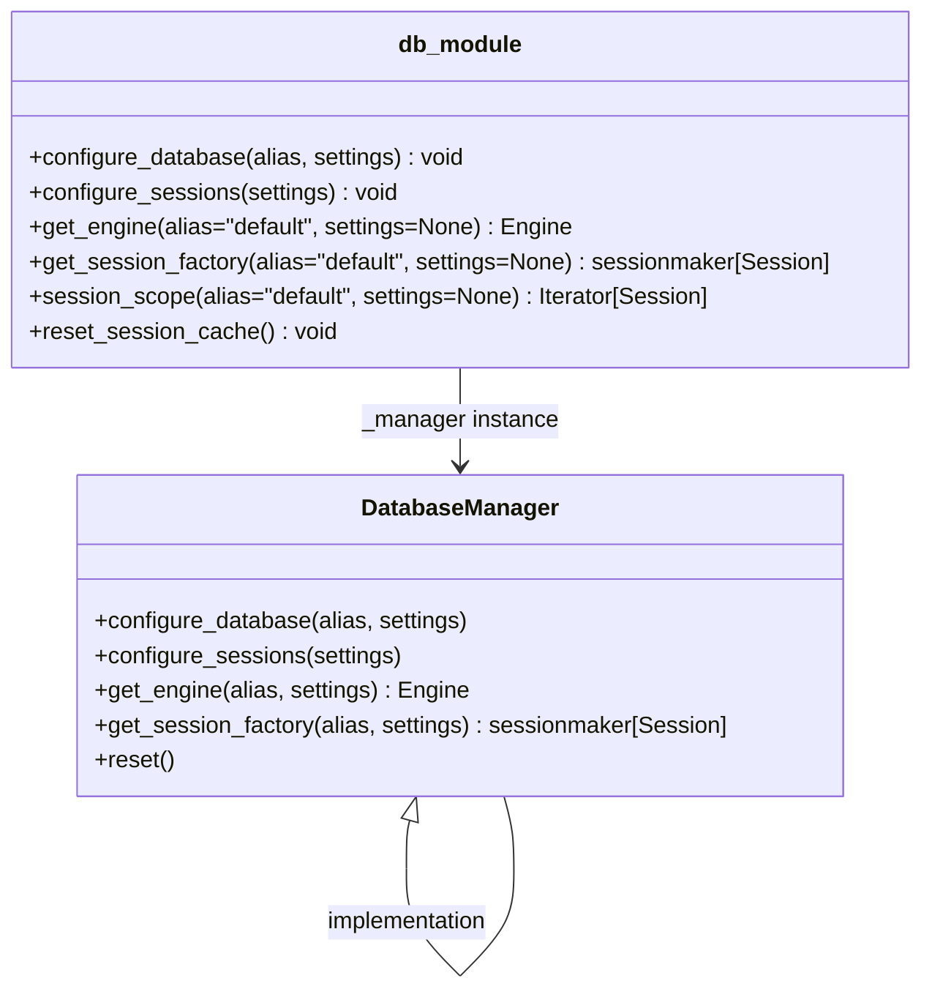

# Diagram: shared/core/src/core/db/session.py


> Auto-generated by Obscura crawlers

## Diagram 1



### SVG

<svg id="container" width="636.59375" xmlns="http://www.w3.org/2000/svg" class="classDiagram" height="682.25" viewBox="0 0 636.59375 682.25" role="graphics-document document" aria-roledescription="class"><style>#container{font-family:"trebuchet ms",verdana,arial,sans-serif;font-size:16px;fill:#333;}@keyframes edge-animation-frame{from{stroke-dashoffset:0;}}@keyframes dash{to{stroke-dashoffset:0;}}#container .edge-animation-slow{stroke-dasharray:9,5!important;stroke-dashoffset:900;animation:dash 50s linear infinite;stroke-linecap:round;}#container .edge-animation-fast{stroke-dasharray:9,5!important;stroke-dashoffset:900;animation:dash 20s linear infinite;stroke-linecap:round;}#container .error-icon{fill:#552222;}#container .error-text{fill:#552222;stroke:#552222;}#container .edge-thickness-normal{stroke-width:1px;}#container .edge-thickness-thick{stroke-width:3.5px;}#container .edge-pattern-solid{stroke-dasharray:0;}#container .edge-thickness-invisible{stroke-width:0;fill:none;}#container .edge-pattern-dashed{stroke-dasharray:3;}#container .edge-pattern-dotted{stroke-dasharray:2;}#container .marker{fill:#333333;stroke:#333333;}#container .marker.cross{stroke:#333333;}#container svg{font-family:"trebuchet ms",verdana,arial,sans-serif;font-size:16px;}#container p{margin:0;}#container g.classGroup text{fill:#9370DB;stroke:none;font-family:"trebuchet ms",verdana,arial,sans-serif;font-size:10px;}#container g.classGroup text .title{font-weight:bolder;}#container .nodeLabel,#container .edgeLabel{color:#131300;}#container .edgeLabel .label rect{fill:#ECECFF;}#container .label text{fill:#131300;}#container .labelBkg{background:#ECECFF;}#container .edgeLabel .label span{background:#ECECFF;}#container .classTitle{font-weight:bolder;}#container .node rect,#container .node circle,#container .node ellipse,#container .node polygon,#container .node path{fill:#ECECFF;stroke:#9370DB;stroke-width:1px;}#container .divider{stroke:#9370DB;stroke-width:1;}#container g.clickable{cursor:pointer;}#container g.classGroup rect{fill:#ECECFF;stroke:#9370DB;}#container g.classGroup line{stroke:#9370DB;stroke-width:1;}#container .classLabel .box{stroke:none;stroke-width:0;fill:#ECECFF;opacity:0.5;}#container .classLabel .label{fill:#9370DB;font-size:10px;}#container .relation{stroke:#333333;stroke-width:1;fill:none;}#container .dashed-line{stroke-dasharray:3;}#container .dotted-line{stroke-dasharray:1 2;}#container #compositionStart,#container .composition{fill:#333333!important;stroke:#333333!important;stroke-width:1;}#container #compositionEnd,#container .composition{fill:#333333!important;stroke:#333333!important;stroke-width:1;}#container #dependencyStart,#container .dependency{fill:#333333!important;stroke:#333333!important;stroke-width:1;}#container #dependencyStart,#container .dependency{fill:#333333!important;stroke:#333333!important;stroke-width:1;}#container #extensionStart,#container .extension{fill:transparent!important;stroke:#333333!important;stroke-width:1;}#container #extensionEnd,#container .extension{fill:transparent!important;stroke:#333333!important;stroke-width:1;}#container #aggregationStart,#container .aggregation{fill:transparent!important;stroke:#333333!important;stroke-width:1;}#container #aggregationEnd,#container .aggregation{fill:transparent!important;stroke:#333333!important;stroke-width:1;}#container #lollipopStart,#container .lollipop{fill:#ECECFF!important;stroke:#333333!important;stroke-width:1;}#container #lollipopEnd,#container .lollipop{fill:#ECECFF!important;stroke:#333333!important;stroke-width:1;}#container .edgeTerminals{font-size:11px;line-height:initial;}#container .classTitleText{text-anchor:middle;font-size:18px;fill:#333;}#container .label-icon{display:inline-block;height:1em;overflow:visible;vertical-align:-0.125em;}#container .node .label-icon path{fill:currentColor;stroke:revert;stroke-width:revert;}#container :root{--mermaid-font-family:"trebuchet ms",verdana,arial,sans-serif;}</style><g><defs><marker id="container_class-aggregationStart" class="marker aggregation class" refX="18" refY="7" markerWidth="190" markerHeight="240" orient="auto"><path d="M 18,7 L9,13 L1,7 L9,1 Z"></path></marker></defs><defs><marker id="container_class-aggregationEnd" class="marker aggregation class" refX="1" refY="7" markerWidth="20" markerHeight="28" orient="auto"><path d="M 18,7 L9,13 L1,7 L9,1 Z"></path></marker></defs><defs><marker id="container_class-extensionStart" class="marker extension class" refX="18" refY="7" markerWidth="190" markerHeight="240" orient="auto"><path d="M 1,7 L18,13 V 1 Z"></path></marker></defs><defs><marker id="container_class-extensionEnd" class="marker extension class" refX="1" refY="7" markerWidth="20" markerHeight="28" orient="auto"><path d="M 1,1 V 13 L18,7 Z"></path></marker></defs><defs><marker id="container_class-compositionStart" class="marker composition class" refX="18" refY="7" markerWidth="190" markerHeight="240" orient="auto"><path d="M 18,7 L9,13 L1,7 L9,1 Z"></path></marker></defs><defs><marker id="container_class-compositionEnd" class="marker composition class" refX="1" refY="7" markerWidth="20" markerHeight="28" orient="auto"><path d="M 18,7 L9,13 L1,7 L9,1 Z"></path></marker></defs><defs><marker id="container_class-dependencyStart" class="marker dependency class" refX="6" refY="7" markerWidth="190" markerHeight="240" orient="auto"><path d="M 5,7 L9,13 L1,7 L9,1 Z"></path></marker></defs><defs><marker id="container_class-dependencyEnd" class="marker dependency class" refX="13" refY="7" markerWidth="20" markerHeight="28" orient="auto"><path d="M 18,7 L9,13 L14,7 L9,1 Z"></path></marker></defs><defs><marker id="container_class-lollipopStart" class="marker lollipop class" refX="13" refY="7" markerWidth="190" markerHeight="240" orient="auto"><circle stroke="black" fill="transparent" cx="7" cy="7" r="6"></circle></marker></defs><defs><marker id="container_class-lollipopEnd" class="marker lollipop class" refX="1" refY="7" markerWidth="190" markerHeight="240" orient="auto"><circle stroke="black" fill="transparent" cx="7" cy="7" r="6"></circle></marker></defs><g class="root"><g class="clusters"></g><g class="edgePaths"><path d="M318.297,254L318.297,260.167C318.297,266.333,318.297,278.667,318.297,290C318.297,301.333,318.297,311.667,318.297,316.833L318.297,322" id="id_db_module_DatabaseManager_1" class="edge-thickness-normal edge-pattern-solid relation" style=";;;" data-edge="true" data-et="edge" data-id="id_db_module_DatabaseManager_1" data-points="W3sieCI6MzE4LjI5Njg3NSwieSI6MjU0fSx7IngiOjMxOC4yOTY4NzUsInkiOjI5MX0seyJ4IjozMTguMjk2ODc1LCJ5IjozMjh9XQ==" marker-end="url(#container_class-dependencyEnd)"></path><path d="M281.653,566.58L281.25,567.983C280.847,569.386,280.041,572.193,279.637,577.763C279.234,583.333,279.234,591.667,279.234,595.833L279.234,600" id="DatabaseManager-cyclic-special-1" class="edge-thickness-normal edge-pattern-solid relation" style=";;;" data-edge="true" data-et="edge" data-id="DatabaseManager-cyclic-special-1" data-points="W3sieCI6Mjg2LjQxNDk4MTYxNzY0NzEsInkiOjU1MH0seyJ4IjoyNzkuMjM0Mzc1LCJ5Ijo1NzV9LHsieCI6Mjc5LjIzNDM3NSwieSI6NjAwfV0=" marker-start="url(#container_class-extensionStart)"></path><path d="M279.234,600.1L279.234,606.267C279.234,612.433,279.234,624.767,285.736,637.1C292.239,649.434,305.243,661.768,311.745,667.935L318.247,674.103" id="DatabaseManager-cyclic-special-mid" class="edge-thickness-normal edge-pattern-solid relation" style=";;;" data-edge="true" data-et="edge" data-id="DatabaseManager-cyclic-special-mid" data-points="W3sieCI6Mjc5LjIzNDM3NSwieSI6NjAwLjEwMDAwMDAwMTQ5MDF9LHsieCI6Mjc5LjIzNDM3NSwieSI6NjM3LjEwMDAwMDAwMTQ5MDF9LHsieCI6MzE4LjI0Njg3NDk5OTI1NDk0LCJ5Ijo2NzQuMTAyNTc2MDAxNTI3NX1d"></path><path d="M318.347,674.103L324.849,667.935C331.351,661.768,344.355,649.434,350.857,637.092C357.359,624.75,357.359,612.4,357.359,602.05C357.359,591.7,357.359,583.35,356.163,575.008C354.966,566.667,352.572,558.333,351.376,554.167L350.179,550" id="DatabaseManager-cyclic-special-2" class="edge-thickness-normal edge-pattern-solid relation" style=";;;" data-edge="true" data-et="edge" data-id="DatabaseManager-cyclic-special-2" data-points="W3sieCI6MzE4LjM0Njg3NTAwMDc0NTA2LCJ5Ijo2NzQuMTAyNTc2MDAxNTI3NX0seyJ4IjozNTcuMzU5Mzc1LCJ5Ijo2MzcuMTAwMDAwMDAxNDkwMX0seyJ4IjozNTcuMzU5Mzc1LCJ5Ijo2MDAuMDUwMDAwMDAwNzQ1MX0seyJ4IjozNTcuMzU5Mzc1LCJ5Ijo1NzV9LHsieCI6MzUwLjE3ODc2ODM4MjM1MjksInkiOjU1MH1d"></path></g><g class="edgeLabels"><g class="edgeLabel" transform="translate(318.296875, 291)"><g class="label" data-id="id_db_module_DatabaseManager_1" transform="translate(-68.5078125, -12)"><foreignObject width="137.015625" height="24"><div xmlns="http://www.w3.org/1999/xhtml" class="labelBkg" style="display: table-cell; white-space: nowrap; line-height: 1.5; max-width: 200px; text-align: center;"><span class="edgeLabel"><p>_manager instance</p></span></div></foreignObject></g></g><g class="edgeLabel"><g class="label" data-id="DatabaseManager-cyclic-special-1" transform="translate(0, 0)"><foreignObject width="0" height="0"><div xmlns="http://www.w3.org/1999/xhtml" class="labelBkg" style="display: table-cell; white-space: nowrap; line-height: 1.5; max-width: 200px; text-align: center;"><span class="edgeLabel"></span></div></foreignObject></g></g><g class="edgeLabel" transform="translate(279.234375, 637.1000000014901)"><g class="label" data-id="DatabaseManager-cyclic-special-mid" transform="translate(-58.125, -12)"><foreignObject width="116.25" height="24"><div xmlns="http://www.w3.org/1999/xhtml" class="labelBkg" style="display: table-cell; white-space: nowrap; line-height: 1.5; max-width: 200px; text-align: center;"><span class="edgeLabel"><p>implementation</p></span></div></foreignObject></g></g><g class="edgeLabel"><g class="label" data-id="DatabaseManager-cyclic-special-2" transform="translate(0, 0)"><foreignObject width="0" height="0"><div xmlns="http://www.w3.org/1999/xhtml" class="labelBkg" style="display: table-cell; white-space: nowrap; line-height: 1.5; max-width: 200px; text-align: center;"><span class="edgeLabel"></span></div></foreignObject></g></g></g><g class="nodes"><g class="node default" id="classId-DatabaseManager-0" transform="translate(318.296875, 439)"><g class="basic label-container"><path d="M-264.07421875 -111 L264.07421875 -111 L264.07421875 111 L-264.07421875 111" stroke="none" stroke-width="0" fill="#ECECFF" style=""></path><path d="M-264.07421875 -111 C-67.06507881189009 -111, 129.94406112621982 -111, 264.07421875 -111 M-264.07421875 -111 C-147.12582425220026 -111, -30.17742975440052 -111, 264.07421875 -111 M264.07421875 -111 C264.07421875 -23.921968558646952, 264.07421875 63.156062882706095, 264.07421875 111 M264.07421875 -111 C264.07421875 -57.788669484241694, 264.07421875 -4.577338968483389, 264.07421875 111 M264.07421875 111 C145.02107984061092 111, 25.967940931221847 111, -264.07421875 111 M264.07421875 111 C89.74882929882108 111, -84.57656015235784 111, -264.07421875 111 M-264.07421875 111 C-264.07421875 37.68743452623782, -264.07421875 -35.625130947524354, -264.07421875 -111 M-264.07421875 111 C-264.07421875 43.73385949931793, -264.07421875 -23.53228100136414, -264.07421875 -111" stroke="#9370DB" stroke-width="1.3" fill="none" stroke-dasharray="0 0" style=""></path></g><g class="annotation-group text" transform="translate(0, -87)"></g><g class="label-group text" transform="translate(-65.6171875, -87)"><g class="label" style="font-weight: bolder" transform="translate(0,-12)"><foreignObject width="131.234375" height="24"><div xmlns="http://www.w3.org/1999/xhtml" style="display: table-cell; white-space: nowrap; line-height: 1.5; max-width: 180px; text-align: center;"><span class="nodeLabel markdown-node-label" style=""><p>DatabaseManager</p></span></div></foreignObject></g></g><g class="members-group text" transform="translate(-252.07421875, -39)"></g><g class="methods-group text" transform="translate(-252.07421875, -9)"><g class="label" style="" transform="translate(0,-12)"><foreignObject width="259.046875" height="24"><div xmlns="http://www.w3.org/1999/xhtml" style="display: table-cell; white-space: nowrap; line-height: 1.5; max-width: 316px; text-align: center;"><span class="nodeLabel markdown-node-label" style=""><p>+configure_database(alias, settings)</p></span></div></foreignObject></g><g class="label" style="" transform="translate(0,12)"><foreignObject width="212.484375" height="24"><div xmlns="http://www.w3.org/1999/xhtml" style="display: table-cell; white-space: nowrap; line-height: 1.5; max-width: 270px; text-align: center;"><span class="nodeLabel markdown-node-label" style=""><p>+configure_sessions(settings)</p></span></div></foreignObject></g><g class="label" style="" transform="translate(0,36)"><foreignObject width="258.125" height="24"><div xmlns="http://www.w3.org/1999/xhtml" style="display: table-cell; white-space: nowrap; line-height: 1.5; max-width: 315px; text-align: center;"><span class="nodeLabel markdown-node-label" style=""><p>+get_engine(alias, settings) : Engine</p></span></div></foreignObject></g><g class="label" style="" transform="translate(0,60)"><foreignObject width="438.53125" height="24"><div xmlns="http://www.w3.org/1999/xhtml" style="display: table-cell; white-space: nowrap; line-height: 1.5; max-width: 496px; text-align: center;"><span class="nodeLabel markdown-node-label" style=""><p>+get_session_factory(alias, settings) : sessionmaker[Session]</p></span></div></foreignObject></g><g class="label" style="" transform="translate(0,84)"><foreignObject width="54.75" height="24"><div xmlns="http://www.w3.org/1999/xhtml" style="display: table-cell; white-space: nowrap; line-height: 1.5; max-width: 112px; text-align: center;"><span class="nodeLabel markdown-node-label" style=""><p>+reset()</p></span></div></foreignObject></g></g><g class="divider" style=""><path d="M-264.07421875 -63 C-105.80757377348272 -63, 52.45907120303457 -63, 264.07421875 -63 M-264.07421875 -63 C-146.75949447644876 -63, -29.44477020289753 -63, 264.07421875 -63" stroke="#9370DB" stroke-width="1.3" fill="none" stroke-dasharray="0 0" style=""></path></g><g class="divider" style=""><path d="M-264.07421875 -39 C-124.89450667039907 -39, 14.285205409201865 -39, 264.07421875 -39 M-264.07421875 -39 C-156.06437816039988 -39, -48.05453757079974 -39, 264.07421875 -39" stroke="#9370DB" stroke-width="1.3" fill="none" stroke-dasharray="0 0" style=""></path></g></g><g class="node default" id="classId-db_module-1" transform="translate(318.296875, 131)"><g class="basic label-container"><path d="M-310.296875 -123 L310.296875 -123 L310.296875 123 L-310.296875 123" stroke="none" stroke-width="0" fill="#ECECFF" style=""></path><path d="M-310.296875 -123 C-64.78853455965432 -123, 180.71980588069135 -123, 310.296875 -123 M-310.296875 -123 C-68.25967900396756 -123, 173.77751699206488 -123, 310.296875 -123 M310.296875 -123 C310.296875 -25.940140864378975, 310.296875 71.11971827124205, 310.296875 123 M310.296875 -123 C310.296875 -60.63820147569793, 310.296875 1.7235970486041339, 310.296875 123 M310.296875 123 C135.19199193208823 123, -39.91289113582354 123, -310.296875 123 M310.296875 123 C103.26885913855017 123, -103.75915672289966 123, -310.296875 123 M-310.296875 123 C-310.296875 45.869912290821276, -310.296875 -31.26017541835745, -310.296875 -123 M-310.296875 123 C-310.296875 58.62808029339098, -310.296875 -5.743839413218041, -310.296875 -123" stroke="#9370DB" stroke-width="1.3" fill="none" stroke-dasharray="0 0" style=""></path></g><g class="annotation-group text" transform="translate(0, -99)"></g><g class="label-group text" transform="translate(-41.140625, -99)"><g class="label" style="font-weight: bolder" transform="translate(0,-12)"><foreignObject width="82.28125" height="24"><div xmlns="http://www.w3.org/1999/xhtml" style="display: table-cell; white-space: nowrap; line-height: 1.5; max-width: 132px; text-align: center;"><span class="nodeLabel markdown-node-label" style=""><p>db_module</p></span></div></foreignObject></g></g><g class="members-group text" transform="translate(-298.296875, -51)"></g><g class="methods-group text" transform="translate(-298.296875, -21)"><g class="label" style="" transform="translate(0,-12)"><foreignObject width="302.59375" height="24"><div xmlns="http://www.w3.org/1999/xhtml" style="display: table-cell; white-space: nowrap; line-height: 1.5; max-width: 360px; text-align: center;"><span class="nodeLabel markdown-node-label" style=""><p>+configure_database(alias, settings) : void</p></span></div></foreignObject></g><g class="label" style="" transform="translate(0,12)"><foreignObject width="256.046875" height="24"><div xmlns="http://www.w3.org/1999/xhtml" style="display: table-cell; white-space: nowrap; line-height: 1.5; max-width: 313px; text-align: center;"><span class="nodeLabel markdown-node-label" style=""><p>+configure_sessions(settings) : void</p></span></div></foreignObject></g><g class="label" style="" transform="translate(0,36)"><foreignObject width="375.03125" height="24"><div xmlns="http://www.w3.org/1999/xhtml" style="display: table-cell; white-space: nowrap; line-height: 1.5; max-width: 432px; text-align: center;"><span class="nodeLabel markdown-node-label" style=""><p>+get_engine(alias="default", settings=None) : Engine</p></span></div></foreignObject></g><g class="label" style="" transform="translate(0,60)"><foreignObject width="555.453125" height="24"><div xmlns="http://www.w3.org/1999/xhtml" style="display: table-cell; white-space: nowrap; line-height: 1.5; max-width: 613px; text-align: center;"><span class="nodeLabel markdown-node-label" style=""><p>+get_session_factory(alias="default", settings=None) : sessionmaker[Session]</p></span></div></foreignObject></g><g class="label" style="" transform="translate(0,84)"><foreignObject width="471.75" height="24"><div xmlns="http://www.w3.org/1999/xhtml" style="display: table-cell; white-space: nowrap; line-height: 1.5; max-width: 529px; text-align: center;"><span class="nodeLabel markdown-node-label" style=""><p>+session_scope(alias="default", settings=None) : Iterator[Session]</p></span></div></foreignObject></g><g class="label" style="" transform="translate(0,108)"><foreignObject width="210.765625" height="24"><div xmlns="http://www.w3.org/1999/xhtml" style="display: table-cell; white-space: nowrap; line-height: 1.5; max-width: 268px; text-align: center;"><span class="nodeLabel markdown-node-label" style=""><p>+reset_session_cache() : void</p></span></div></foreignObject></g></g><g class="divider" style=""><path d="M-310.296875 -75 C-147.31452459917483 -75, 15.667825801650338 -75, 310.296875 -75 M-310.296875 -75 C-103.74932775820687 -75, 102.79821948358625 -75, 310.296875 -75" stroke="#9370DB" stroke-width="1.3" fill="none" stroke-dasharray="0 0" style=""></path></g><g class="divider" style=""><path d="M-310.296875 -51 C-138.00984248965423 -51, 34.277190020691535 -51, 310.296875 -51 M-310.296875 -51 C-155.17563380877334 -51, -0.05439261754668223 -51, 310.296875 -51" stroke="#9370DB" stroke-width="1.3" fill="none" stroke-dasharray="0 0" style=""></path></g></g><g class="label edgeLabel" id="DatabaseManager---DatabaseManager---1" transform="translate(279.234375, 600.0500000007451)"><rect width="0.1" height="0.1"></rect><g class="label" style="" transform="translate(0, 0)"><rect></rect><foreignObject width="0" height="0"><div xmlns="http://www.w3.org/1999/xhtml" style="display: table-cell; white-space: nowrap; line-height: 1.5; max-width: 10px; text-align: center;"><span class="nodeLabel"></span></div></foreignObject></g></g><g class="label edgeLabel" id="DatabaseManager---DatabaseManager---2" transform="translate(318.296875, 674.1500000022352)"><rect width="0.1" height="0.1"></rect><g class="label" style="" transform="translate(0, 0)"><rect></rect><foreignObject width="0" height="0"><div xmlns="http://www.w3.org/1999/xhtml" style="display: table-cell; white-space: nowrap; line-height: 1.5; max-width: 10px; text-align: center;"><span class="nodeLabel"></span></div></foreignObject></g></g></g></g></g></svg>

## Diagram 2

```mermaid
flowchart LR
    A[get_session_factory(alias, settings)] --> B[factory = _manager.get_session_factory(alias, settings)]
    B --> C[session = factory()]
    C --> D{try block}
    D --> E[yield session]
    E --> F[session.commit()]
    D -->|Exception| G[session.rollback()]
    G --> H[raise exception]
    D --> I[finally]
    I --> J[session.close()]
```

> SVG rendering failed for this diagram.
