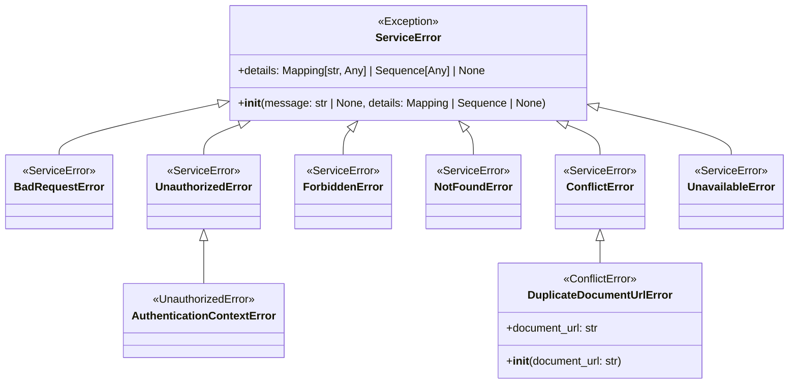

# Diagram: shared/core/src/core/exception/errors.py

> Auto-generated by Obscura crawlers

## Mermaid

### SVG

<svg id="container" width="1115.703125" xmlns="http://www.w3.org/2000/svg" class="classDiagram" height="560" viewBox="0 0 1115.703125 560" role="graphics-document document" aria-roledescription="class"><g><defs><marker id="container_class-aggregationStart" class="marker aggregation class" refX="18" refY="7" markerWidth="190" markerHeight="240" orient="auto"><path d="M 18,7 L9,13 L1,7 L9,1 Z"></path></marker></defs><defs><marker id="container_class-aggregationEnd" class="marker aggregation class" refX="1" refY="7" markerWidth="20" markerHeight="28" orient="auto"><path d="M 18,7 L9,13 L1,7 L9,1 Z"></path></marker></defs><defs><marker id="container_class-extensionStart" class="marker extension class" refX="18" refY="7" markerWidth="190" markerHeight="240" orient="auto"><path d="M 1,7 L18,13 V 1 Z"></path></marker></defs><defs><marker id="container_class-extensionEnd" class="marker extension class" refX="1" refY="7" markerWidth="20" markerHeight="28" orient="auto"><path d="M 1,1 V 13 L18,7 Z"></path></marker></defs><defs><marker id="container_class-compositionStart" class="marker composition class" refX="18" refY="7" markerWidth="190" markerHeight="240" orient="auto"><path d="M 18,7 L9,13 L1,7 L9,1 Z"></path></marker></defs><defs><marker id="container_class-compositionEnd" class="marker composition class" refX="1" refY="7" markerWidth="20" markerHeight="28" orient="auto"><path d="M 18,7 L9,13 L1,7 L9,1 Z"></path></marker></defs><defs><marker id="container_class-dependencyStart" class="marker dependency class" refX="6" refY="7" markerWidth="190" markerHeight="240" orient="auto"><path d="M 5,7 L9,13 L1,7 L9,1 Z"></path></marker></defs><defs><marker id="container_class-dependencyEnd" class="marker dependency class" refX="13" refY="7" markerWidth="20" markerHeight="28" orient="auto"><path d="M 18,7 L9,13 L14,7 L9,1 Z"></path></marker></defs><defs><marker id="container_class-lollipopStart" class="marker lollipop class" refX="13" refY="7" markerWidth="190" markerHeight="240" orient="auto"><circle stroke="black" fill="transparent" cx="7" cy="7" r="6"></circle></marker></defs><defs><marker id="container_class-lollipopEnd" class="marker lollipop class" refX="1" refY="7" markerWidth="190" markerHeight="240" orient="auto"><circle stroke="black" fill="transparent" cx="7" cy="7" r="6"></circle></marker></defs><g class="root"><g class="clusters"></g><g class="edgePaths"><path d="M297.166,153.425L261.352,161.354C225.538,169.283,153.909,185.142,118.095,197.237C82.281,209.333,82.281,217.667,82.281,221.833L82.281,226" id="id_ServiceError_BadRequestError_1" class="edge-thickness-normal edge-pattern-solid relation" style=";;;" data-edge="true" data-et="edge" data-id="id_ServiceError_BadRequestError_1" data-points="W3sieCI6MzE0LjAwNzgxMjUsInkiOjE0OS42OTYwMTMwMTIyNTg1fSx7IngiOjgyLjI4MTI1LCJ5IjoyMDF9LHsieCI6ODIuMjgxMjUsInkiOjIyNn1d" marker-start="url(#container_class-extensionStart)"></path><path d="M336.202,182.098L327.866,185.249C319.531,188.399,302.859,194.699,294.523,202.016C286.188,209.333,286.188,217.667,286.188,221.833L286.188,226" id="id_ServiceError_UnauthorizedError_2" class="edge-thickness-normal edge-pattern-solid relation" style=";;;" data-edge="true" data-et="edge" data-id="id_ServiceError_UnauthorizedError_2" data-points="W3sieCI6MzUyLjMzODQxMDI2Mzc2MTUsInkiOjE3Nn0seyJ4IjoyODYuMTg3NSwieSI6MjAxfSx7IngiOjI4Ni4xODc1LCJ5IjoyMjZ9XQ==" marker-start="url(#container_class-extensionStart)"></path><path d="M493.05,189.215L491.403,191.18C489.755,193.144,486.459,197.072,484.812,203.203C483.164,209.333,483.164,217.667,483.164,221.833L483.164,226" id="id_ServiceError_ForbiddenError_3" class="edge-thickness-normal edge-pattern-solid relation" style=";;;" data-edge="true" data-et="edge" data-id="id_ServiceError_ForbiddenError_3" data-points="W3sieCI6NTA0LjEzNjg2MjA5ODYyMzg1LCJ5IjoxNzZ9LHsieCI6NDgzLjE2NDA2MjUsInkiOjIwMX0seyJ4Ijo0ODMuMTY0MDYyNSwieSI6MjI2fV0=" marker-start="url(#container_class-extensionStart)"></path><path d="M656.161,189.215L657.808,191.18C659.456,193.144,662.751,197.072,664.399,203.203C666.047,209.333,666.047,217.667,666.047,221.833L666.047,226" id="id_ServiceError_NotFoundError_4" class="edge-thickness-normal edge-pattern-solid relation" style=";;;" data-edge="true" data-et="edge" data-id="id_ServiceError_NotFoundError_4" data-points="W3sieCI6NjQ1LjA3NDA3NTQwMTM3NjEsInkiOjE3Nn0seyJ4Ijo2NjYuMDQ2ODc1LCJ5IjoyMDF9LHsieCI6NjY2LjA0Njg3NSwieSI6MjI2fV0=" marker-start="url(#container_class-extensionStart)"></path><path d="M800.187,182.418L807.913,185.515C815.64,188.612,831.093,194.806,838.82,202.07C846.547,209.333,846.547,217.667,846.547,221.833L846.547,226" id="id_ServiceError_ConflictError_5" class="edge-thickness-normal edge-pattern-solid relation" style=";;;" data-edge="true" data-et="edge" data-id="id_ServiceError_ConflictError_5" data-points="W3sieCI6Nzg0LjE3NDk5MjgzMjU2ODgsInkiOjE3Nn0seyJ4Ijo4NDYuNTQ2ODc1LCJ5IjoyMDF9LHsieCI6ODQ2LjU0Njg3NSwieSI6MjI2fV0=" marker-start="url(#container_class-extensionStart)"></path><path d="M851.988,157.727L882.425,164.939C912.862,172.151,973.736,186.576,1004.173,197.955C1034.609,209.333,1034.609,217.667,1034.609,221.833L1034.609,226" id="id_ServiceError_UnavailableError_6" class="edge-thickness-normal edge-pattern-solid relation" style=";;;" data-edge="true" data-et="edge" data-id="id_ServiceError_UnavailableError_6" data-points="W3sieCI6ODM1LjIwMzEyNSwieSI6MTUzLjc0OTc4OTgyODU1MTA2fSx7IngiOjEwMzQuNjA5Mzc1LCJ5IjoyMDF9LHsieCI6MTAzNC42MDkzNzUsInkiOjIyNn1d" marker-start="url(#container_class-extensionStart)"></path><path d="M286.188,351.25L286.188,352.542C286.188,353.833,286.188,356.417,286.188,366.875C286.188,377.333,286.188,395.667,286.188,404.833L286.188,414" id="id_UnauthorizedError_AuthenticationContextError_7" class="edge-thickness-normal edge-pattern-solid relation" style=";;;" data-edge="true" data-et="edge" data-id="id_UnauthorizedError_AuthenticationContextError_7" data-points="W3sieCI6Mjg2LjE4NzUsInkiOjMzNH0seyJ4IjoyODYuMTg3NSwieSI6MzU5fSx7IngiOjI4Ni4xODc1LCJ5Ijo0MTR9XQ==" marker-start="url(#container_class-extensionStart)"></path><path d="M846.547,351.25L846.547,352.542C846.547,353.833,846.547,356.417,846.547,361.875C846.547,367.333,846.547,375.667,846.547,379.833L846.547,384" id="id_ConflictError_DuplicateDocumentUrlError_8" class="edge-thickness-normal edge-pattern-solid relation" style=";;;" data-edge="true" data-et="edge" data-id="id_ConflictError_DuplicateDocumentUrlError_8" data-points="W3sieCI6ODQ2LjU0Njg3NSwieSI6MzM0fSx7IngiOjg0Ni41NDY4NzUsInkiOjM1OX0seyJ4Ijo4NDYuNTQ2ODc1LCJ5IjozODR9XQ==" marker-start="url(#container_class-extensionStart)"></path></g><g class="edgeLabels"><g class="edgeLabel"><g class="label" data-id="id_ServiceError_BadRequestError_1" transform="translate(0, 0)"><foreignObject width="0" height="0">

</foreignObject></g></g><g class="edgeLabel"><g class="label" data-id="id_ServiceError_UnauthorizedError_2" transform="translate(0, 0)"><foreignObject width="0" height="0">

</foreignObject></g></g><g class="edgeLabel"><g class="label" data-id="id_ServiceError_ForbiddenError_3" transform="translate(0, 0)"><foreignObject width="0" height="0">

</foreignObject></g></g><g class="edgeLabel"><g class="label" data-id="id_ServiceError_NotFoundError_4" transform="translate(0, 0)"><foreignObject width="0" height="0">

</foreignObject></g></g><g class="edgeLabel"><g class="label" data-id="id_ServiceError_ConflictError_5" transform="translate(0, 0)"><foreignObject width="0" height="0">

</foreignObject></g></g><g class="edgeLabel"><g class="label" data-id="id_ServiceError_UnavailableError_6" transform="translate(0, 0)"><foreignObject width="0" height="0">

</foreignObject></g></g><g class="edgeLabel"><g class="label" data-id="id_UnauthorizedError_AuthenticationContextError_7" transform="translate(0, 0)"><foreignObject width="0" height="0">

</foreignObject></g></g><g class="edgeLabel"><g class="label" data-id="id_ConflictError_DuplicateDocumentUrlError_8" transform="translate(0, 0)"><foreignObject width="0" height="0">

</foreignObject></g></g></g><g class="nodes"><g class="node default" id="classId-ServiceError-0" transform="translate(574.60546875, 92)"><g class="basic label-container"><path d="M-260.59765625 -84 L260.59765625 -84 L260.59765625 84 L-260.59765625 84" stroke="none" stroke-width="0" fill="#ECECFF" style=""></path><path d="M-260.59765625 -84 C-57.266961722763824 -84, 146.06373280447235 -84, 260.59765625 -84 M-260.59765625 -84 C-66.0940137131125 -84, 128.409628823775 -84, 260.59765625 -84 M260.59765625 -84 C260.59765625 -38.013061035327866, 260.59765625 7.973877929344269, 260.59765625 84 M260.59765625 -84 C260.59765625 -29.00535164627577, 260.59765625 25.98929670744846, 260.59765625 84 M260.59765625 84 C118.44803021497268 84, -23.70159582005465 84, -260.59765625 84 M260.59765625 84 C61.578369305018185 84, -137.44091763996363 84, -260.59765625 84 M-260.59765625 84 C-260.59765625 44.07207305307335, -260.59765625 4.144146106146707, -260.59765625 -84 M-260.59765625 84 C-260.59765625 20.445691178952465, -260.59765625 -43.10861764209507, -260.59765625 -84" stroke="#9370DB" stroke-width="1.3" fill="none" stroke-dasharray="0 0" style=""></path></g><g class="annotation-group text" transform="translate(-44.5, -60)"><g class="label" style="" transform="translate(0,-12)"><foreignObject width="89" height="24">

«Exception»

</foreignObject></g></g><g class="label-group text" transform="translate(-44.8359375, -36)"><g class="label" style="font-weight: bolder" transform="translate(0,-12)"><foreignObject width="89.671875" height="24">

ServiceError

</foreignObject></g></g><g class="members-group text" transform="translate(-248.59765625, 12)"><g class="label" style="" transform="translate(0,-12)"><foreignObject width="366.046875" height="24">

+details: Mapping[str, Any] | Sequence[Any] | None

</foreignObject></g></g><g class="methods-group text" transform="translate(-248.59765625, 60)"><g class="label" style="" transform="translate(0,-12)"><foreignObject width="452.359375" height="24">

+<strong>init</strong>(message: str | None, details: Mapping | Sequence | None)

</foreignObject></g></g><g class="divider" style=""><path d="M-260.59765625 -12 C-104.30574585874552 -12, 51.98616453250895 -12, 260.59765625 -12 M-260.59765625 -12 C-52.52111996847927 -12, 155.55541631304146 -12, 260.59765625 -12" stroke="#9370DB" stroke-width="1.3" fill="none" stroke-dasharray="0 0" style=""></path></g><g class="divider" style=""><path d="M-260.59765625 36 C-112.4363966479849 36, 35.724862954030186 36, 260.59765625 36 M-260.59765625 36 C-130.85641034827688 36, -1.115164446553763 36, 260.59765625 36" stroke="#9370DB" stroke-width="1.3" fill="none" stroke-dasharray="0 0" style=""></path></g></g><g class="node default" id="classId-BadRequestError-1" transform="translate(82.28125, 280)"><g class="basic label-container"><path d="M-74.28125 -54 L74.28125 -54 L74.28125 54 L-74.28125 54" stroke="none" stroke-width="0" fill="#ECECFF" style=""></path><path d="M-74.28125 -54 C-15.044835475036216 -54, 44.19157904992757 -54, 74.28125 -54 M-74.28125 -54 C-29.169616863664068 -54, 15.942016272671864 -54, 74.28125 -54 M74.28125 -54 C74.28125 -22.510226832269616, 74.28125 8.979546335460768, 74.28125 54 M74.28125 -54 C74.28125 -13.02640475797702, 74.28125 27.94719048404596, 74.28125 54 M74.28125 54 C43.77407674064115 54, 13.266903481282291 54, -74.28125 54 M74.28125 54 C35.323786938243025 54, -3.6336761235139505 54, -74.28125 54 M-74.28125 54 C-74.28125 23.39356990535377, -74.28125 -7.2128601892924635, -74.28125 -54 M-74.28125 54 C-74.28125 29.15660100408608, -74.28125 4.313202008172162, -74.28125 -54" stroke="#9370DB" stroke-width="1.3" fill="none" stroke-dasharray="0 0" style=""></path></g><g class="annotation-group text" transform="translate(-52.96875, -30)"><g class="label" style="" transform="translate(0,-12)"><foreignObject width="105.9375" height="24">

«ServiceError»

</foreignObject></g></g><g class="label-group text" transform="translate(-62.28125, -6)"><g class="label" style="font-weight: bolder" transform="translate(0,-12)"><foreignObject width="124.5625" height="24">

BadRequestError

</foreignObject></g></g><g class="members-group text" transform="translate(-62.28125, 42)"></g><g class="methods-group text" transform="translate(-62.28125, 72)"></g><g class="divider" style=""><path d="M-74.28125 18 C-19.557772403093466 18, 35.16570519381307 18, 74.28125 18 M-74.28125 18 C-28.8170909303156 18, 16.6470681393688 18, 74.28125 18" stroke="#9370DB" stroke-width="1.3" fill="none" stroke-dasharray="0 0" style=""></path></g><g class="divider" style=""><path d="M-74.28125 36 C-35.92930842667923 36, 2.4226331466415445 36, 74.28125 36 M-74.28125 36 C-18.534780232850387 36, 37.211689534299225 36, 74.28125 36" stroke="#9370DB" stroke-width="1.3" fill="none" stroke-dasharray="0 0" style=""></path></g></g><g class="node default" id="classId-UnauthorizedError-2" transform="translate(286.1875, 280)"><g class="basic label-container"><path d="M-79.625 -54 L79.625 -54 L79.625 54 L-79.625 54" stroke="none" stroke-width="0" fill="#ECECFF" style=""></path><path d="M-79.625 -54 C-21.082786742088864 -54, 37.45942651582227 -54, 79.625 -54 M-79.625 -54 C-31.615208062546877 -54, 16.394583874906246 -54, 79.625 -54 M79.625 -54 C79.625 -14.210905775597233, 79.625 25.578188448805534, 79.625 54 M79.625 -54 C79.625 -28.507263516835383, 79.625 -3.014527033670767, 79.625 54 M79.625 54 C29.684217833108107 54, -20.256564333783786 54, -79.625 54 M79.625 54 C29.01907569091363 54, -21.586848618172738 54, -79.625 54 M-79.625 54 C-79.625 27.87590612685877, -79.625 1.7518122537175387, -79.625 -54 M-79.625 54 C-79.625 15.66912489921011, -79.625 -22.66175020157978, -79.625 -54" stroke="#9370DB" stroke-width="1.3" fill="none" stroke-dasharray="0 0" style=""></path></g><g class="annotation-group text" transform="translate(-52.96875, -30)"><g class="label" style="" transform="translate(0,-12)"><foreignObject width="105.9375" height="24">

«ServiceError»

</foreignObject></g></g><g class="label-group text" transform="translate(-67.625, -6)"><g class="label" style="font-weight: bolder" transform="translate(0,-12)"><foreignObject width="135.25" height="24">

UnauthorizedError

</foreignObject></g></g><g class="members-group text" transform="translate(-67.625, 42)"></g><g class="methods-group text" transform="translate(-67.625, 72)"></g><g class="divider" style=""><path d="M-79.625 18 C-42.30025091710153 18, -4.975501834203058 18, 79.625 18 M-79.625 18 C-34.653124938948245 18, 10.31875012210351 18, 79.625 18" stroke="#9370DB" stroke-width="1.3" fill="none" stroke-dasharray="0 0" style=""></path></g><g class="divider" style=""><path d="M-79.625 36 C-40.40185561737091 36, -1.1787112347418258 36, 79.625 36 M-79.625 36 C-24.360449037025745 36, 30.90410192594851 36, 79.625 36" stroke="#9370DB" stroke-width="1.3" fill="none" stroke-dasharray="0 0" style=""></path></g></g><g class="node default" id="classId-ForbiddenError-3" transform="translate(483.1640625, 280)"><g class="basic label-container"><path d="M-67.3515625 -54 L67.3515625 -54 L67.3515625 54 L-67.3515625 54" stroke="none" stroke-width="0" fill="#ECECFF" style=""></path><path d="M-67.3515625 -54 C-19.550952788871463 -54, 28.249656922257074 -54, 67.3515625 -54 M-67.3515625 -54 C-40.39381433654374 -54, -13.436066173087475 -54, 67.3515625 -54 M67.3515625 -54 C67.3515625 -26.293045136553456, 67.3515625 1.4139097268930882, 67.3515625 54 M67.3515625 -54 C67.3515625 -21.109939964454746, 67.3515625 11.780120071090508, 67.3515625 54 M67.3515625 54 C21.205106260779097 54, -24.941349978441806 54, -67.3515625 54 M67.3515625 54 C17.374402568017977 54, -32.602757363964045 54, -67.3515625 54 M-67.3515625 54 C-67.3515625 26.021090157006036, -67.3515625 -1.9578196859879284, -67.3515625 -54 M-67.3515625 54 C-67.3515625 27.726492556294733, -67.3515625 1.4529851125894666, -67.3515625 -54" stroke="#9370DB" stroke-width="1.3" fill="none" stroke-dasharray="0 0" style=""></path></g><g class="annotation-group text" transform="translate(-52.96875, -30)"><g class="label" style="" transform="translate(0,-12)"><foreignObject width="105.9375" height="24">

«ServiceError»

</foreignObject></g></g><g class="label-group text" transform="translate(-55.3515625, -6)"><g class="label" style="font-weight: bolder" transform="translate(0,-12)"><foreignObject width="110.703125" height="24">

ForbiddenError

</foreignObject></g></g><g class="members-group text" transform="translate(-55.3515625, 42)"></g><g class="methods-group text" transform="translate(-55.3515625, 72)"></g><g class="divider" style=""><path d="M-67.3515625 18 C-27.705278140210666 18, 11.941006219578668 18, 67.3515625 18 M-67.3515625 18 C-21.66055750255726 18, 24.03044749488548 18, 67.3515625 18" stroke="#9370DB" stroke-width="1.3" fill="none" stroke-dasharray="0 0" style=""></path></g><g class="divider" style=""><path d="M-67.3515625 36 C-30.641906100502524 36, 6.067750298994952 36, 67.3515625 36 M-67.3515625 36 C-37.743480090216465 36, -8.13539768043293 36, 67.3515625 36" stroke="#9370DB" stroke-width="1.3" fill="none" stroke-dasharray="0 0" style=""></path></g></g><g class="node default" id="classId-NotFoundError-4" transform="translate(666.046875, 280)"><g class="basic label-container"><path d="M-65.53125 -54 L65.53125 -54 L65.53125 54 L-65.53125 54" stroke="none" stroke-width="0" fill="#ECECFF" style=""></path><path d="M-65.53125 -54 C-21.713951848105047 -54, 22.103346303789905 -54, 65.53125 -54 M-65.53125 -54 C-21.390311559139676 -54, 22.75062688172065 -54, 65.53125 -54 M65.53125 -54 C65.53125 -21.850119082124124, 65.53125 10.299761835751752, 65.53125 54 M65.53125 -54 C65.53125 -19.64124315219251, 65.53125 14.717513695614983, 65.53125 54 M65.53125 54 C31.57695659925517 54, -2.377336801489662 54, -65.53125 54 M65.53125 54 C17.576865845503313 54, -30.377518308993373 54, -65.53125 54 M-65.53125 54 C-65.53125 28.930592122248555, -65.53125 3.8611842444971103, -65.53125 -54 M-65.53125 54 C-65.53125 23.461476536367286, -65.53125 -7.077046927265428, -65.53125 -54" stroke="#9370DB" stroke-width="1.3" fill="none" stroke-dasharray="0 0" style=""></path></g><g class="annotation-group text" transform="translate(-52.96875, -30)"><g class="label" style="" transform="translate(0,-12)"><foreignObject width="105.9375" height="24">

«ServiceError»

</foreignObject></g></g><g class="label-group text" transform="translate(-53.53125, -6)"><g class="label" style="font-weight: bolder" transform="translate(0,-12)"><foreignObject width="107.0625" height="24">

NotFoundError

</foreignObject></g></g><g class="members-group text" transform="translate(-53.53125, 42)"></g><g class="methods-group text" transform="translate(-53.53125, 72)"></g><g class="divider" style=""><path d="M-65.53125 18 C-24.171314204823275 18, 17.18862159035345 18, 65.53125 18 M-65.53125 18 C-20.2343233597133 18, 25.0626032805734 18, 65.53125 18" stroke="#9370DB" stroke-width="1.3" fill="none" stroke-dasharray="0 0" style=""></path></g><g class="divider" style=""><path d="M-65.53125 36 C-16.65679770723954 36, 32.21765458552092 36, 65.53125 36 M-65.53125 36 C-20.638754514431987 36, 24.253740971136025 36, 65.53125 36" stroke="#9370DB" stroke-width="1.3" fill="none" stroke-dasharray="0 0" style=""></path></g></g><g class="node default" id="classId-ConflictError-5" transform="translate(846.546875, 280)"><g class="basic label-container"><path d="M-64.96875 -54 L64.96875 -54 L64.96875 54 L-64.96875 54" stroke="none" stroke-width="0" fill="#ECECFF" style=""></path><path d="M-64.96875 -54 C-20.892414168780775 -54, 23.18392166243845 -54, 64.96875 -54 M-64.96875 -54 C-17.112515307401708 -54, 30.743719385196584 -54, 64.96875 -54 M64.96875 -54 C64.96875 -20.25640839869608, 64.96875 13.487183202607838, 64.96875 54 M64.96875 -54 C64.96875 -24.222161041697483, 64.96875 5.555677916605035, 64.96875 54 M64.96875 54 C16.460271613669875 54, -32.04820677266025 54, -64.96875 54 M64.96875 54 C25.993347332772395 54, -12.982055334455211 54, -64.96875 54 M-64.96875 54 C-64.96875 19.90297322699262, -64.96875 -14.194053546014757, -64.96875 -54 M-64.96875 54 C-64.96875 23.429816224784343, -64.96875 -7.140367550431314, -64.96875 -54" stroke="#9370DB" stroke-width="1.3" fill="none" stroke-dasharray="0 0" style=""></path></g><g class="annotation-group text" transform="translate(-52.96875, -30)"><g class="label" style="" transform="translate(0,-12)"><foreignObject width="105.9375" height="24">

«ServiceError»

</foreignObject></g></g><g class="label-group text" transform="translate(-46.140625, -6)"><g class="label" style="font-weight: bolder" transform="translate(0,-12)"><foreignObject width="92.28125" height="24">

ConflictError

</foreignObject></g></g><g class="members-group text" transform="translate(-52.96875, 42)"></g><g class="methods-group text" transform="translate(-52.96875, 72)"></g><g class="divider" style=""><path d="M-64.96875 18 C-37.365188947184755 18, -9.76162789436951 18, 64.96875 18 M-64.96875 18 C-38.60306178940193 18, -12.237373578803854 18, 64.96875 18" stroke="#9370DB" stroke-width="1.3" fill="none" stroke-dasharray="0 0" style=""></path></g><g class="divider" style=""><path d="M-64.96875 36 C-15.963222655752482 36, 33.04230468849504 36, 64.96875 36 M-64.96875 36 C-21.82696572935653 36, 21.31481854128694 36, 64.96875 36" stroke="#9370DB" stroke-width="1.3" fill="none" stroke-dasharray="0 0" style=""></path></g></g><g class="node default" id="classId-AuthenticationContextError-6" transform="translate(286.1875, 468)"><g class="basic label-container"><path d="M-112.5 -54 L112.5 -54 L112.5 54 L-112.5 54" stroke="none" stroke-width="0" fill="#ECECFF" style=""></path><path d="M-112.5 -54 C-39.12006652212017 -54, 34.25986695575966 -54, 112.5 -54 M-112.5 -54 C-38.36214714481069 -54, 35.77570571037862 -54, 112.5 -54 M112.5 -54 C112.5 -23.781368761974797, 112.5 6.437262476050407, 112.5 54 M112.5 -54 C112.5 -13.206948748097936, 112.5 27.586102503804128, 112.5 54 M112.5 54 C24.521268637583162 54, -63.457462724833675 54, -112.5 54 M112.5 54 C36.22360186243111 54, -40.05279627513778 54, -112.5 54 M-112.5 54 C-112.5 16.493499488194182, -112.5 -21.013001023611636, -112.5 -54 M-112.5 54 C-112.5 30.746872651586344, -112.5 7.4937453031726875, -112.5 -54" stroke="#9370DB" stroke-width="1.3" fill="none" stroke-dasharray="0 0" style=""></path></g><g class="annotation-group text" transform="translate(-76.1171875, -30)"><g class="label" style="" transform="translate(0,-12)"><foreignObject width="152.234375" height="24">

«UnauthorizedError»

</foreignObject></g></g><g class="label-group text" transform="translate(-100.5, -6)"><g class="label" style="font-weight: bolder" transform="translate(0,-12)"><foreignObject width="201" height="24">

AuthenticationContextError

</foreignObject></g></g><g class="members-group text" transform="translate(-100.5, 42)"></g><g class="methods-group text" transform="translate(-100.5, 72)"></g><g class="divider" style=""><path d="M-112.5 18 C-55.54141039381326 18, 1.4171792123734832 18, 112.5 18 M-112.5 18 C-26.947530161477687 18, 58.60493967704463 18, 112.5 18" stroke="#9370DB" stroke-width="1.3" fill="none" stroke-dasharray="0 0" style=""></path></g><g class="divider" style=""><path d="M-112.5 36 C-53.925413715480964 36, 4.649172569038072 36, 112.5 36 M-112.5 36 C-48.571819317532096 36, 15.356361364935808 36, 112.5 36" stroke="#9370DB" stroke-width="1.3" fill="none" stroke-dasharray="0 0" style=""></path></g></g><g class="node default" id="classId-DuplicateDocumentUrlError-7" transform="translate(846.546875, 468)"><g class="basic label-container"><path d="M-148.34765625 -84 L148.34765625 -84 L148.34765625 84 L-148.34765625 84" stroke="none" stroke-width="0" fill="#ECECFF" style=""></path><path d="M-148.34765625 -84 C-63.88596789687381 -84, 20.575720456252384 -84, 148.34765625 -84 M-148.34765625 -84 C-87.03415180944141 -84, -25.720647368882823 -84, 148.34765625 -84 M148.34765625 -84 C148.34765625 -47.75804820720962, 148.34765625 -11.516096414419238, 148.34765625 84 M148.34765625 -84 C148.34765625 -48.083902679587474, 148.34765625 -12.167805359174949, 148.34765625 84 M148.34765625 84 C66.32497757513735 84, -15.697701099725293 84, -148.34765625 84 M148.34765625 84 C30.79487014280062 84, -86.75791596439876 84, -148.34765625 84 M-148.34765625 84 C-148.34765625 39.584578893224005, -148.34765625 -4.830842213551989, -148.34765625 -84 M-148.34765625 84 C-148.34765625 37.74435719220912, -148.34765625 -8.511285615581755, -148.34765625 -84" stroke="#9370DB" stroke-width="1.3" fill="none" stroke-dasharray="0 0" style=""></path></g><g class="annotation-group text" transform="translate(-54.328125, -60)"><g class="label" style="" transform="translate(0,-12)"><foreignObject width="108.65625" height="24">

«ConflictError»

</foreignObject></g></g><g class="label-group text" transform="translate(-100.7578125, -36)"><g class="label" style="font-weight: bolder" transform="translate(0,-12)"><foreignObject width="201.515625" height="24">

DuplicateDocumentUrlError

</foreignObject></g></g><g class="members-group text" transform="translate(-136.34765625, 12)"><g class="label" style="" transform="translate(0,-12)"><foreignObject width="137.125" height="24">

+document_url: str

</foreignObject></g></g><g class="methods-group text" transform="translate(-136.34765625, 60)"><g class="label" style="" transform="translate(0,-12)"><foreignObject width="171.9375" height="24">

+<strong>init</strong>(document_url: str)

</foreignObject></g></g><g class="divider" style=""><path d="M-148.34765625 -12 C-70.70691042201574 -12, 6.933835405968523 -12, 148.34765625 -12 M-148.34765625 -12 C-83.62579337197467 -12, -18.903930493949332 -12, 148.34765625 -12" stroke="#9370DB" stroke-width="1.3" fill="none" stroke-dasharray="0 0" style=""></path></g><g class="divider" style=""><path d="M-148.34765625 36 C-86.44856747467327 36, -24.54947869934655 36, 148.34765625 36 M-148.34765625 36 C-87.53280869579649 36, -26.71796114159298 36, 148.34765625 36" stroke="#9370DB" stroke-width="1.3" fill="none" stroke-dasharray="0 0" style=""></path></g></g><g class="node default" id="classId-UnavailableError-8" transform="translate(1034.609375, 280)"><g class="basic label-container"><path d="M-73.09375 -54 L73.09375 -54 L73.09375 54 L-73.09375 54" stroke="none" stroke-width="0" fill="#ECECFF" style=""></path><path d="M-73.09375 -54 C-36.685987256290666 -54, -0.27822451258133185 -54, 73.09375 -54 M-73.09375 -54 C-19.10011241368526 -54, 34.89352517262948 -54, 73.09375 -54 M73.09375 -54 C73.09375 -13.966397761261156, 73.09375 26.067204477477688, 73.09375 54 M73.09375 -54 C73.09375 -25.694747973318705, 73.09375 2.6105040533625896, 73.09375 54 M73.09375 54 C37.169990408252595 54, 1.2462308165051894 54, -73.09375 54 M73.09375 54 C28.15990070094623 54, -16.773948598107538 54, -73.09375 54 M-73.09375 54 C-73.09375 29.053223670300326, -73.09375 4.106447340600653, -73.09375 -54 M-73.09375 54 C-73.09375 11.365029734596433, -73.09375 -31.269940530807133, -73.09375 -54" stroke="#9370DB" stroke-width="1.3" fill="none" stroke-dasharray="0 0" style=""></path></g><g class="annotation-group text" transform="translate(-52.96875, -30)"><g class="label" style="" transform="translate(0,-12)"><foreignObject width="105.9375" height="24">

«ServiceError»

</foreignObject></g></g><g class="label-group text" transform="translate(-61.09375, -6)"><g class="label" style="font-weight: bolder" transform="translate(0,-12)"><foreignObject width="122.1875" height="24">

UnavailableError

</foreignObject></g></g><g class="members-group text" transform="translate(-61.09375, 42)"></g><g class="methods-group text" transform="translate(-61.09375, 72)"></g><g class="divider" style=""><path d="M-73.09375 18 C-25.702416742061175 18, 21.68891651587765 18, 73.09375 18 M-73.09375 18 C-31.605166489843427 18, 9.883417020313146 18, 73.09375 18" stroke="#9370DB" stroke-width="1.3" fill="none" stroke-dasharray="0 0" style=""></path></g><g class="divider" style=""><path d="M-73.09375 36 C-23.83212820860406 36, 25.429493582791878 36, 73.09375 36 M-73.09375 36 C-42.70990839096703 36, -12.32606678193406 36, 73.09375 36" stroke="#9370DB" stroke-width="1.3" fill="none" stroke-dasharray="0 0" style=""></path></g></g></g></g></g></svg>
