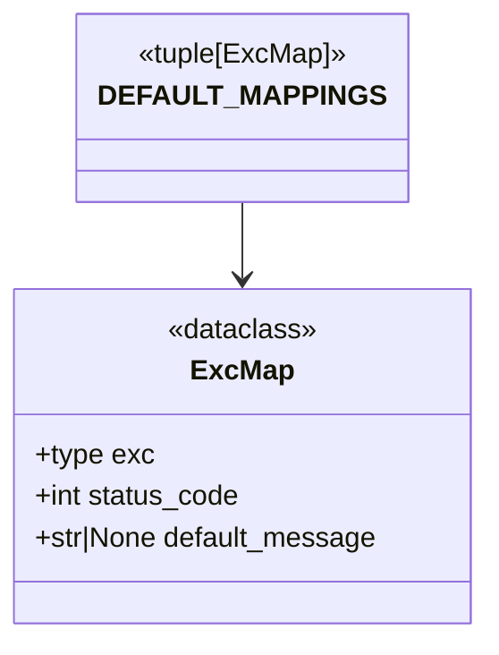

# Diagram: shared/core/src/core/exception/exceptions.py


> Auto-generated by Obscura crawlers

## Diagram 1



### SVG

<svg id="container" width="282.0390625" xmlns="http://www.w3.org/2000/svg" class="classDiagram" height="366" viewBox="0 0 282.0390625 366" role="graphics-document document" aria-roledescription="class"><style>#container{font-family:"trebuchet ms",verdana,arial,sans-serif;font-size:16px;fill:#333;}@keyframes edge-animation-frame{from{stroke-dashoffset:0;}}@keyframes dash{to{stroke-dashoffset:0;}}#container .edge-animation-slow{stroke-dasharray:9,5!important;stroke-dashoffset:900;animation:dash 50s linear infinite;stroke-linecap:round;}#container .edge-animation-fast{stroke-dasharray:9,5!important;stroke-dashoffset:900;animation:dash 20s linear infinite;stroke-linecap:round;}#container .error-icon{fill:#552222;}#container .error-text{fill:#552222;stroke:#552222;}#container .edge-thickness-normal{stroke-width:1px;}#container .edge-thickness-thick{stroke-width:3.5px;}#container .edge-pattern-solid{stroke-dasharray:0;}#container .edge-thickness-invisible{stroke-width:0;fill:none;}#container .edge-pattern-dashed{stroke-dasharray:3;}#container .edge-pattern-dotted{stroke-dasharray:2;}#container .marker{fill:#333333;stroke:#333333;}#container .marker.cross{stroke:#333333;}#container svg{font-family:"trebuchet ms",verdana,arial,sans-serif;font-size:16px;}#container p{margin:0;}#container g.classGroup text{fill:#9370DB;stroke:none;font-family:"trebuchet ms",verdana,arial,sans-serif;font-size:10px;}#container g.classGroup text .title{font-weight:bolder;}#container .nodeLabel,#container .edgeLabel{color:#131300;}#container .edgeLabel .label rect{fill:#ECECFF;}#container .label text{fill:#131300;}#container .labelBkg{background:#ECECFF;}#container .edgeLabel .label span{background:#ECECFF;}#container .classTitle{font-weight:bolder;}#container .node rect,#container .node circle,#container .node ellipse,#container .node polygon,#container .node path{fill:#ECECFF;stroke:#9370DB;stroke-width:1px;}#container .divider{stroke:#9370DB;stroke-width:1;}#container g.clickable{cursor:pointer;}#container g.classGroup rect{fill:#ECECFF;stroke:#9370DB;}#container g.classGroup line{stroke:#9370DB;stroke-width:1;}#container .classLabel .box{stroke:none;stroke-width:0;fill:#ECECFF;opacity:0.5;}#container .classLabel .label{fill:#9370DB;font-size:10px;}#container .relation{stroke:#333333;stroke-width:1;fill:none;}#container .dashed-line{stroke-dasharray:3;}#container .dotted-line{stroke-dasharray:1 2;}#container #compositionStart,#container .composition{fill:#333333!important;stroke:#333333!important;stroke-width:1;}#container #compositionEnd,#container .composition{fill:#333333!important;stroke:#333333!important;stroke-width:1;}#container #dependencyStart,#container .dependency{fill:#333333!important;stroke:#333333!important;stroke-width:1;}#container #dependencyStart,#container .dependency{fill:#333333!important;stroke:#333333!important;stroke-width:1;}#container #extensionStart,#container .extension{fill:transparent!important;stroke:#333333!important;stroke-width:1;}#container #extensionEnd,#container .extension{fill:transparent!important;stroke:#333333!important;stroke-width:1;}#container #aggregationStart,#container .aggregation{fill:transparent!important;stroke:#333333!important;stroke-width:1;}#container #aggregationEnd,#container .aggregation{fill:transparent!important;stroke:#333333!important;stroke-width:1;}#container #lollipopStart,#container .lollipop{fill:#ECECFF!important;stroke:#333333!important;stroke-width:1;}#container #lollipopEnd,#container .lollipop{fill:#ECECFF!important;stroke:#333333!important;stroke-width:1;}#container .edgeTerminals{font-size:11px;line-height:initial;}#container .classTitleText{text-anchor:middle;font-size:18px;fill:#333;}#container .label-icon{display:inline-block;height:1em;overflow:visible;vertical-align:-0.125em;}#container .node .label-icon path{fill:currentColor;stroke:revert;stroke-width:revert;}#container :root{--mermaid-font-family:"trebuchet ms",verdana,arial,sans-serif;}</style><g><defs><marker id="container_class-aggregationStart" class="marker aggregation class" refX="18" refY="7" markerWidth="190" markerHeight="240" orient="auto"><path d="M 18,7 L9,13 L1,7 L9,1 Z"></path></marker></defs><defs><marker id="container_class-aggregationEnd" class="marker aggregation class" refX="1" refY="7" markerWidth="20" markerHeight="28" orient="auto"><path d="M 18,7 L9,13 L1,7 L9,1 Z"></path></marker></defs><defs><marker id="container_class-extensionStart" class="marker extension class" refX="18" refY="7" markerWidth="190" markerHeight="240" orient="auto"><path d="M 1,7 L18,13 V 1 Z"></path></marker></defs><defs><marker id="container_class-extensionEnd" class="marker extension class" refX="1" refY="7" markerWidth="20" markerHeight="28" orient="auto"><path d="M 1,1 V 13 L18,7 Z"></path></marker></defs><defs><marker id="container_class-compositionStart" class="marker composition class" refX="18" refY="7" markerWidth="190" markerHeight="240" orient="auto"><path d="M 18,7 L9,13 L1,7 L9,1 Z"></path></marker></defs><defs><marker id="container_class-compositionEnd" class="marker composition class" refX="1" refY="7" markerWidth="20" markerHeight="28" orient="auto"><path d="M 18,7 L9,13 L1,7 L9,1 Z"></path></marker></defs><defs><marker id="container_class-dependencyStart" class="marker dependency class" refX="6" refY="7" markerWidth="190" markerHeight="240" orient="auto"><path d="M 5,7 L9,13 L1,7 L9,1 Z"></path></marker></defs><defs><marker id="container_class-dependencyEnd" class="marker dependency class" refX="13" refY="7" markerWidth="20" markerHeight="28" orient="auto"><path d="M 18,7 L9,13 L14,7 L9,1 Z"></path></marker></defs><defs><marker id="container_class-lollipopStart" class="marker lollipop class" refX="13" refY="7" markerWidth="190" markerHeight="240" orient="auto"><circle stroke="black" fill="transparent" cx="7" cy="7" r="6"></circle></marker></defs><defs><marker id="container_class-lollipopEnd" class="marker lollipop class" refX="1" refY="7" markerWidth="190" markerHeight="240" orient="auto"><circle stroke="black" fill="transparent" cx="7" cy="7" r="6"></circle></marker></defs><g class="root"><g class="clusters"></g><g class="edgePaths"><path d="M141.02,116L141.02,120.167C141.02,124.333,141.02,132.667,141.02,140C141.02,147.333,141.02,153.667,141.02,156.833L141.02,160" id="id_DEFAULT_MAPPINGS_ExcMap_1" class="edge-thickness-normal edge-pattern-solid relation" style=";;;" data-edge="true" data-et="edge" data-id="id_DEFAULT_MAPPINGS_ExcMap_1" data-points="W3sieCI6MTQxLjAxOTUzMTI1LCJ5IjoxMTZ9LHsieCI6MTQxLjAxOTUzMTI1LCJ5IjoxNDF9LHsieCI6MTQxLjAxOTUzMTI1LCJ5IjoxNjZ9XQ==" marker-end="url(#container_class-dependencyEnd)"></path></g><g class="edgeLabels"><g class="edgeLabel"><g class="label" data-id="id_DEFAULT_MAPPINGS_ExcMap_1" transform="translate(0, 0)"><foreignObject width="0" height="0"><div xmlns="http://www.w3.org/1999/xhtml" class="labelBkg" style="display: table-cell; white-space: nowrap; line-height: 1.5; max-width: 200px; text-align: center;"><span class="edgeLabel"></span></div></foreignObject></g></g></g><g class="nodes"><g class="node default" id="classId-ExcMap-0" transform="translate(141.01953125, 262)"><g class="basic label-container"><path d="M-133.01953125 -96 L133.01953125 -96 L133.01953125 96 L-133.01953125 96" stroke="none" stroke-width="0" fill="#ECECFF" style=""></path><path d="M-133.01953125 -96 C-50.42470028452665 -96, 32.1701306809467 -96, 133.01953125 -96 M-133.01953125 -96 C-54.07690688103574 -96, 24.86571748792852 -96, 133.01953125 -96 M133.01953125 -96 C133.01953125 -56.1705856864341, 133.01953125 -16.341171372868203, 133.01953125 96 M133.01953125 -96 C133.01953125 -44.7127027606001, 133.01953125 6.574594478799796, 133.01953125 96 M133.01953125 96 C50.19877337939192 96, -32.62198449121615 96, -133.01953125 96 M133.01953125 96 C56.00742097980715 96, -21.0046892903857 96, -133.01953125 96 M-133.01953125 96 C-133.01953125 45.41478409200077, -133.01953125 -5.170431815998455, -133.01953125 -96 M-133.01953125 96 C-133.01953125 46.62361738098993, -133.01953125 -2.752765238020146, -133.01953125 -96" stroke="#9370DB" stroke-width="1.3" fill="none" stroke-dasharray="0 0" style=""></path></g><g class="annotation-group text" transform="translate(-43.0859375, -72)"><g class="label" style="" transform="translate(0,-12)"><foreignObject width="86.171875" height="24"><div xmlns="http://www.w3.org/1999/xhtml" style="display: table-cell; white-space: nowrap; line-height: 1.5; max-width: 136px; text-align: center;"><span class="nodeLabel markdown-node-label" style=""><p>«dataclass»</p></span></div></foreignObject></g></g><g class="label-group text" transform="translate(-27.484375, -48)"><g class="label" style="font-weight: bolder" transform="translate(0,-12)"><foreignObject width="54.96875" height="24"><div xmlns="http://www.w3.org/1999/xhtml" style="display: table-cell; white-space: nowrap; line-height: 1.5; max-width: 104px; text-align: center;"><span class="nodeLabel markdown-node-label" style=""><p>ExcMap</p></span></div></foreignObject></g></g><g class="members-group text" transform="translate(-121.01953125, 0)"><g class="label" style="" transform="translate(0,-12)"><foreignObject width="67.78125" height="24"><div xmlns="http://www.w3.org/1999/xhtml" style="display: table-cell; white-space: nowrap; line-height: 1.5; max-width: 125px; text-align: center;"><span class="nodeLabel markdown-node-label" style=""><p>+type exc</p></span></div></foreignObject></g><g class="label" style="" transform="translate(0,12)"><foreignObject width="118.9375" height="24"><div xmlns="http://www.w3.org/1999/xhtml" style="display: table-cell; white-space: nowrap; line-height: 1.5; max-width: 176px; text-align: center;"><span class="nodeLabel markdown-node-label" style=""><p>+int status_code</p></span></div></foreignObject></g><g class="label" style="" transform="translate(0,36)"><foreignObject width="198.953125" height="24"><div xmlns="http://www.w3.org/1999/xhtml" style="display: table-cell; white-space: nowrap; line-height: 1.5; max-width: 256px; text-align: center;"><span class="nodeLabel markdown-node-label" style=""><p>+str|None default_message</p></span></div></foreignObject></g></g><g class="methods-group text" transform="translate(-121.01953125, 96)"></g><g class="divider" style=""><path d="M-133.01953125 -24 C-61.31510536892657 -24, 10.389320512146867 -24, 133.01953125 -24 M-133.01953125 -24 C-34.81608260317725 -24, 63.3873660436455 -24, 133.01953125 -24" stroke="#9370DB" stroke-width="1.3" fill="none" stroke-dasharray="0 0" style=""></path></g><g class="divider" style=""><path d="M-133.01953125 72 C-36.02279843686327 72, 60.97393437627346 72, 133.01953125 72 M-133.01953125 72 C-71.72068260376798 72, -10.42183395753598 72, 133.01953125 72" stroke="#9370DB" stroke-width="1.3" fill="none" stroke-dasharray="0 0" style=""></path></g></g><g class="node default" id="classId-DEFAULT_MAPPINGS-1" transform="translate(141.01953125, 62)"><g class="basic label-container"><path d="M-84.1875 -54 L84.1875 -54 L84.1875 54 L-84.1875 54" stroke="none" stroke-width="0" fill="#ECECFF" style=""></path><path d="M-84.1875 -54 C-29.039833823127083 -54, 26.107832353745835 -54, 84.1875 -54 M-84.1875 -54 C-30.688491357395073 -54, 22.810517285209855 -54, 84.1875 -54 M84.1875 -54 C84.1875 -27.431943691719518, 84.1875 -0.8638873834390353, 84.1875 54 M84.1875 -54 C84.1875 -27.295256716905463, 84.1875 -0.5905134338109264, 84.1875 54 M84.1875 54 C22.85928861713844 54, -38.46892276572312 54, -84.1875 54 M84.1875 54 C32.62050526185894 54, -18.946489476282125 54, -84.1875 54 M-84.1875 54 C-84.1875 23.465024662275898, -84.1875 -7.069950675448204, -84.1875 -54 M-84.1875 54 C-84.1875 17.860102102268065, -84.1875 -18.27979579546387, -84.1875 -54" stroke="#9370DB" stroke-width="1.3" fill="none" stroke-dasharray="0 0" style=""></path></g><g class="annotation-group text" transform="translate(-60.484375, -30)"><g class="label" style="" transform="translate(0,-12)"><foreignObject width="120.96875" height="24"><div xmlns="http://www.w3.org/1999/xhtml" style="display: table-cell; white-space: nowrap; line-height: 1.5; max-width: 171px; text-align: center;"><span class="nodeLabel markdown-node-label" style=""><p>«tuple[ExcMap]»</p></span></div></foreignObject></g></g><g class="label-group text" transform="translate(-72.1875, -6)"><g class="label" style="font-weight: bolder" transform="translate(0,-12)"><foreignObject width="144.375" height="24"><div xmlns="http://www.w3.org/1999/xhtml" style="display: table-cell; white-space: nowrap; line-height: 1.5; max-width: 193px; text-align: center;"><span class="nodeLabel markdown-node-label" style=""><p>DEFAULT_MAPPINGS</p></span></div></foreignObject></g></g><g class="members-group text" transform="translate(-72.1875, 42)"></g><g class="methods-group text" transform="translate(-72.1875, 72)"></g><g class="divider" style=""><path d="M-84.1875 18 C-17.148605478092705 18, 49.89028904381459 18, 84.1875 18 M-84.1875 18 C-30.57469714108275 18, 23.038105717834497 18, 84.1875 18" stroke="#9370DB" stroke-width="1.3" fill="none" stroke-dasharray="0 0" style=""></path></g><g class="divider" style=""><path d="M-84.1875 36 C-42.51748122107031 36, -0.8474624421406247 36, 84.1875 36 M-84.1875 36 C-38.558567123345036 36, 7.070365753309929 36, 84.1875 36" stroke="#9370DB" stroke-width="1.3" fill="none" stroke-dasharray="0 0" style=""></path></g></g></g></g></g></svg>

## Diagram 2

```mermaid
flowchart LR
    BadRequestError[BadRequestError] -->|400| HTTP_400[HTTP 400]
    UnauthorizedError[UnauthorizedError] -->|401| HTTP_401[HTTP 401]
    ForbiddenError[ForbiddenError] -->|403| HTTP_403[HTTP 403]
    NotFoundError[NotFoundError] -->|404| HTTP_404[HTTP 404]
    ConflictError[ConflictError] -->|409| HTTP_409[HTTP 409]
    UnavailableError[UnavailableError] -->|503| HTTP_503[HTTP 503]
    PydanticValidationError[PydanticValidationError] -->|400| HTTP_400
    IntegrityError[IntegrityError] -->|409\n"Integrity constraint violation"| HTTP_409
    OperationalError[OperationalError] -->|503\n"Database unavailable"| HTTP_503
```

> SVG rendering failed for this diagram.
