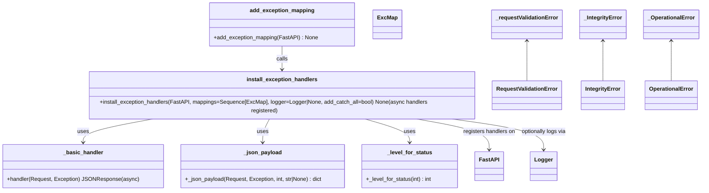

# Diagram: shared/core/src/core/exception/handlers.py


> Auto-generated by Obscura crawlers

## Diagram 1



### SVG

<svg id="container" width="2025.177734375" xmlns="http://www.w3.org/2000/svg" class="classDiagram" height="542" viewBox="0 0 2025.177734375 542" role="graphics-document document" aria-roledescription="class"><style>#container{font-family:"trebuchet ms",verdana,arial,sans-serif;font-size:16px;fill:#333;}@keyframes edge-animation-frame{from{stroke-dashoffset:0;}}@keyframes dash{to{stroke-dashoffset:0;}}#container .edge-animation-slow{stroke-dasharray:9,5!important;stroke-dashoffset:900;animation:dash 50s linear infinite;stroke-linecap:round;}#container .edge-animation-fast{stroke-dasharray:9,5!important;stroke-dashoffset:900;animation:dash 20s linear infinite;stroke-linecap:round;}#container .error-icon{fill:#552222;}#container .error-text{fill:#552222;stroke:#552222;}#container .edge-thickness-normal{stroke-width:1px;}#container .edge-thickness-thick{stroke-width:3.5px;}#container .edge-pattern-solid{stroke-dasharray:0;}#container .edge-thickness-invisible{stroke-width:0;fill:none;}#container .edge-pattern-dashed{stroke-dasharray:3;}#container .edge-pattern-dotted{stroke-dasharray:2;}#container .marker{fill:#333333;stroke:#333333;}#container .marker.cross{stroke:#333333;}#container svg{font-family:"trebuchet ms",verdana,arial,sans-serif;font-size:16px;}#container p{margin:0;}#container g.classGroup text{fill:#9370DB;stroke:none;font-family:"trebuchet ms",verdana,arial,sans-serif;font-size:10px;}#container g.classGroup text .title{font-weight:bolder;}#container .nodeLabel,#container .edgeLabel{color:#131300;}#container .edgeLabel .label rect{fill:#ECECFF;}#container .label text{fill:#131300;}#container .labelBkg{background:#ECECFF;}#container .edgeLabel .label span{background:#ECECFF;}#container .classTitle{font-weight:bolder;}#container .node rect,#container .node circle,#container .node ellipse,#container .node polygon,#container .node path{fill:#ECECFF;stroke:#9370DB;stroke-width:1px;}#container .divider{stroke:#9370DB;stroke-width:1;}#container g.clickable{cursor:pointer;}#container g.classGroup rect{fill:#ECECFF;stroke:#9370DB;}#container g.classGroup line{stroke:#9370DB;stroke-width:1;}#container .classLabel .box{stroke:none;stroke-width:0;fill:#ECECFF;opacity:0.5;}#container .classLabel .label{fill:#9370DB;font-size:10px;}#container .relation{stroke:#333333;stroke-width:1;fill:none;}#container .dashed-line{stroke-dasharray:3;}#container .dotted-line{stroke-dasharray:1 2;}#container #compositionStart,#container .composition{fill:#333333!important;stroke:#333333!important;stroke-width:1;}#container #compositionEnd,#container .composition{fill:#333333!important;stroke:#333333!important;stroke-width:1;}#container #dependencyStart,#container .dependency{fill:#333333!important;stroke:#333333!important;stroke-width:1;}#container #dependencyStart,#container .dependency{fill:#333333!important;stroke:#333333!important;stroke-width:1;}#container #extensionStart,#container .extension{fill:transparent!important;stroke:#333333!important;stroke-width:1;}#container #extensionEnd,#container .extension{fill:transparent!important;stroke:#333333!important;stroke-width:1;}#container #aggregationStart,#container .aggregation{fill:transparent!important;stroke:#333333!important;stroke-width:1;}#container #aggregationEnd,#container .aggregation{fill:transparent!important;stroke:#333333!important;stroke-width:1;}#container #lollipopStart,#container .lollipop{fill:#ECECFF!important;stroke:#333333!important;stroke-width:1;}#container #lollipopEnd,#container .lollipop{fill:#ECECFF!important;stroke:#333333!important;stroke-width:1;}#container .edgeTerminals{font-size:11px;line-height:initial;}#container .classTitleText{text-anchor:middle;font-size:18px;fill:#333;}#container .label-icon{display:inline-block;height:1em;overflow:visible;vertical-align:-0.125em;}#container .node .label-icon path{fill:currentColor;stroke:revert;stroke-width:revert;}#container :root{--mermaid-font-family:"trebuchet ms",verdana,arial,sans-serif;}</style><g><defs><marker id="container_class-aggregationStart" class="marker aggregation class" refX="18" refY="7" markerWidth="190" markerHeight="240" orient="auto"><path d="M 18,7 L9,13 L1,7 L9,1 Z"></path></marker></defs><defs><marker id="container_class-aggregationEnd" class="marker aggregation class" refX="1" refY="7" markerWidth="20" markerHeight="28" orient="auto"><path d="M 18,7 L9,13 L1,7 L9,1 Z"></path></marker></defs><defs><marker id="container_class-extensionStart" class="marker extension class" refX="18" refY="7" markerWidth="190" markerHeight="240" orient="auto"><path d="M 1,7 L18,13 V 1 Z"></path></marker></defs><defs><marker id="container_class-extensionEnd" class="marker extension class" refX="1" refY="7" markerWidth="20" markerHeight="28" orient="auto"><path d="M 1,1 V 13 L18,7 Z"></path></marker></defs><defs><marker id="container_class-compositionStart" class="marker composition class" refX="18" refY="7" markerWidth="190" markerHeight="240" orient="auto"><path d="M 18,7 L9,13 L1,7 L9,1 Z"></path></marker></defs><defs><marker id="container_class-compositionEnd" class="marker composition class" refX="1" refY="7" markerWidth="20" markerHeight="28" orient="auto"><path d="M 18,7 L9,13 L1,7 L9,1 Z"></path></marker></defs><defs><marker id="container_class-dependencyStart" class="marker dependency class" refX="6" refY="7" markerWidth="190" markerHeight="240" orient="auto"><path d="M 5,7 L9,13 L1,7 L9,1 Z"></path></marker></defs><defs><marker id="container_class-dependencyEnd" class="marker dependency class" refX="13" refY="7" markerWidth="20" markerHeight="28" orient="auto"><path d="M 18,7 L9,13 L14,7 L9,1 Z"></path></marker></defs><defs><marker id="container_class-lollipopStart" class="marker lollipop class" refX="13" refY="7" markerWidth="190" markerHeight="240" orient="auto"><circle stroke="black" fill="transparent" cx="7" cy="7" r="6"></circle></marker></defs><defs><marker id="container_class-lollipopEnd" class="marker lollipop class" refX="1" refY="7" markerWidth="190" markerHeight="240" orient="auto"><circle stroke="black" fill="transparent" cx="7" cy="7" r="6"></circle></marker></defs><g class="root"><g class="clusters"></g><g class="edgePaths"><path d="M446.61,334L411.285,340.167C375.96,346.333,305.31,358.667,269.985,370C234.66,381.333,234.66,391.667,234.66,396.833L234.66,402" id="id_install_exception_handlers__basic_handler_1" class="edge-thickness-normal edge-pattern-solid relation" style=";;;" data-edge="true" data-et="edge" data-id="id_install_exception_handlers__basic_handler_1" data-points="W3sieCI6NDQ2LjYxMDE3NTc4MTI1LCJ5IjozMzR9LHsieCI6MjM0LjY2MDE1NjI1LCJ5IjozNzF9LHsieCI6MjM0LjY2MDE1NjI1LCJ5Ijo0MDh9XQ==" marker-end="url(#container_class-dependencyEnd)"></path><path d="M771.474,334L767.947,340.167C764.421,346.333,757.369,358.667,753.843,370C750.316,381.333,750.316,391.667,750.316,396.833L750.316,402" id="id_install_exception_handlers__json_payload_2" class="edge-thickness-normal edge-pattern-solid relation" style=";;;" data-edge="true" data-et="edge" data-id="id_install_exception_handlers__json_payload_2" data-points="W3sieCI6NzcxLjQ3MzYxMzI4MTI1LCJ5IjozMzR9LHsieCI6NzUwLjMxNjQwNjI1LCJ5IjozNzF9LHsieCI6NzUwLjMxNjQwNjI1LCJ5Ijo0MDh9XQ==" marker-end="url(#container_class-dependencyEnd)"></path><path d="M1041.133,334L1064.002,340.167C1086.871,346.333,1132.61,358.667,1155.479,370C1178.348,381.333,1178.348,391.667,1178.348,396.833L1178.348,402" id="id_install_exception_handlers__level_for_status_3" class="edge-thickness-normal edge-pattern-solid relation" style=";;;" data-edge="true" data-et="edge" data-id="id_install_exception_handlers__level_for_status_3" data-points="W3sieCI6MTA0MS4xMzMzMDA3ODEyNSwieSI6MzM0fSx7IngiOjExNzguMzQ3NjU2MjUsInkiOjM3MX0seyJ4IjoxMTc4LjM0NzY1NjI1LCJ5Ijo0MDh9XQ==" marker-end="url(#container_class-dependencyEnd)"></path><path d="M1184.505,334L1221.408,340.167C1258.311,346.333,1332.116,358.667,1369.019,373.5C1405.922,388.333,1405.922,405.667,1405.922,414.333L1405.922,423" id="id_install_exception_handlers_FastAPI_4" class="edge-thickness-normal edge-pattern-solid relation" style=";;;" data-edge="true" data-et="edge" data-id="id_install_exception_handlers_FastAPI_4" data-points="W3sieCI6MTE4NC41MDUwNTg1OTM3NSwieSI6MzM0fSx7IngiOjE0MDUuOTIxODc1LCJ5IjozNzF9LHsieCI6MTQwNS45MjE4NzUsInkiOjQyOX1d" marker-end="url(#container_class-dependencyEnd)"></path><path d="M1287.215,334L1334.171,340.167C1381.128,346.333,1475.04,358.667,1521.997,373.5C1568.953,388.333,1568.953,405.667,1568.953,414.333L1568.953,423" id="id_install_exception_handlers_Logger_5" class="edge-thickness-normal edge-pattern-solid relation" style=";;;" data-edge="true" data-et="edge" data-id="id_install_exception_handlers_Logger_5" data-points="W3sieCI6MTI4Ny4yMTQ3NDYwOTM3NSwieSI6MzM0fSx7IngiOjE1NjguOTUzMTI1LCJ5IjozNzF9LHsieCI6MTU2OC45NTMxMjUsInkiOjQyOX1d" marker-end="url(#container_class-dependencyEnd)"></path><path d="M807.498,134L807.498,140.167C807.498,146.333,807.498,158.667,807.498,170C807.498,181.333,807.498,191.667,807.498,196.833L807.498,202" id="id_add_exception_mapping_install_exception_handlers_6" class="edge-thickness-normal edge-pattern-solid relation" style=";;;" data-edge="true" data-et="edge" data-id="id_add_exception_mapping_install_exception_handlers_6" data-points="W3sieCI6ODA3LjQ5ODA0Njg3NSwieSI6MTM0fSx7IngiOjgwNy40OTgwNDY4NzUsInkiOjE3MX0seyJ4Ijo4MDcuNDk4MDQ2ODc1LCJ5IjoyMDh9XQ==" marker-end="url(#container_class-dependencyEnd)"></path><path d="M1531.49,119L1531.49,127.667C1531.49,136.333,1531.49,153.667,1531.49,172C1531.49,190.333,1531.49,209.667,1531.49,219.333L1531.49,229" id="id__requestValidationError_RequestValidationError_7" class="edge-thickness-normal edge-pattern-solid relation" style=";;;" data-edge="true" data-et="edge" data-id="id__requestValidationError_RequestValidationError_7" data-points="W3sieCI6MTUzMS40OTAyMzQzNzUsInkiOjExM30seyJ4IjoxNTMxLjQ5MDIzNDM3NSwieSI6MTcxfSx7IngiOjE1MzEuNDkwMjM0Mzc1LCJ5IjoyMjl9XQ==" marker-start="url(#container_class-dependencyStart)"></path><path d="M1746.693,119L1746.693,127.667C1746.693,136.333,1746.693,153.667,1746.693,172C1746.693,190.333,1746.693,209.667,1746.693,219.333L1746.693,229" id="id__IntegrityError_IntegrityError_8" class="edge-thickness-normal edge-pattern-solid relation" style=";;;" data-edge="true" data-et="edge" data-id="id__IntegrityError_IntegrityError_8" data-points="W3sieCI6MTc0Ni42OTMzNTkzNzUsInkiOjExM30seyJ4IjoxNzQ2LjY5MzM1OTM3NSwieSI6MTcxfSx7IngiOjE3NDYuNjkzMzU5Mzc1LCJ5IjoyMjl9XQ==" marker-start="url(#container_class-dependencyStart)"></path><path d="M1939.803,119L1939.803,127.667C1939.803,136.333,1939.803,153.667,1939.803,172C1939.803,190.333,1939.803,209.667,1939.803,219.333L1939.803,229" id="id__OperationalError_OperationalError_9" class="edge-thickness-normal edge-pattern-solid relation" style=";;;" data-edge="true" data-et="edge" data-id="id__OperationalError_OperationalError_9" data-points="W3sieCI6MTkzOS44MDI3MzQzNzUsInkiOjExM30seyJ4IjoxOTM5LjgwMjczNDM3NSwieSI6MTcxfSx7IngiOjE5MzkuODAyNzM0Mzc1LCJ5IjoyMjl9XQ==" marker-start="url(#container_class-dependencyStart)"></path></g><g class="edgeLabels"><g class="edgeLabel" transform="translate(234.66015625, 371)"><g class="label" data-id="id_install_exception_handlers__basic_handler_1" transform="translate(-16.4921875, -12)"><foreignObject width="32.984375" height="24"><div xmlns="http://www.w3.org/1999/xhtml" class="labelBkg" style="display: table-cell; white-space: nowrap; line-height: 1.5; max-width: 200px; text-align: center;"><span class="edgeLabel"><p>uses</p></span></div></foreignObject></g></g><g class="edgeLabel" transform="translate(750.31640625, 371)"><g class="label" data-id="id_install_exception_handlers__json_payload_2" transform="translate(-16.4921875, -12)"><foreignObject width="32.984375" height="24"><div xmlns="http://www.w3.org/1999/xhtml" class="labelBkg" style="display: table-cell; white-space: nowrap; line-height: 1.5; max-width: 200px; text-align: center;"><span class="edgeLabel"><p>uses</p></span></div></foreignObject></g></g><g class="edgeLabel" transform="translate(1178.34765625, 371)"><g class="label" data-id="id_install_exception_handlers__level_for_status_3" transform="translate(-16.4921875, -12)"><foreignObject width="32.984375" height="24"><div xmlns="http://www.w3.org/1999/xhtml" class="labelBkg" style="display: table-cell; white-space: nowrap; line-height: 1.5; max-width: 200px; text-align: center;"><span class="edgeLabel"><p>uses</p></span></div></foreignObject></g></g><g class="edgeLabel" transform="translate(1405.921875, 371)"><g class="label" data-id="id_install_exception_handlers_FastAPI_4" transform="translate(-76.6796875, -12)"><foreignObject width="153.359375" height="24"><div xmlns="http://www.w3.org/1999/xhtml" class="labelBkg" style="display: table-cell; white-space: nowrap; line-height: 1.5; max-width: 200px; text-align: center;"><span class="edgeLabel"><p>registers handlers on</p></span></div></foreignObject></g></g><g class="edgeLabel" transform="translate(1568.953125, 371)"><g class="label" data-id="id_install_exception_handlers_Logger_5" transform="translate(-66.3515625, -12)"><foreignObject width="132.703125" height="24"><div xmlns="http://www.w3.org/1999/xhtml" class="labelBkg" style="display: table-cell; white-space: nowrap; line-height: 1.5; max-width: 200px; text-align: center;"><span class="edgeLabel"><p>optionally logs via</p></span></div></foreignObject></g></g><g class="edgeLabel" transform="translate(807.498046875, 171)"><g class="label" data-id="id_add_exception_mapping_install_exception_handlers_6" transform="translate(-16.4453125, -12)"><foreignObject width="32.890625" height="24"><div xmlns="http://www.w3.org/1999/xhtml" class="labelBkg" style="display: table-cell; white-space: nowrap; line-height: 1.5; max-width: 200px; text-align: center;"><span class="edgeLabel"><p>calls</p></span></div></foreignObject></g></g><g class="edgeLabel"><g class="label" data-id="id__requestValidationError_RequestValidationError_7" transform="translate(0, 0)"><foreignObject width="0" height="0"><div xmlns="http://www.w3.org/1999/xhtml" class="labelBkg" style="display: table-cell; white-space: nowrap; line-height: 1.5; max-width: 200px; text-align: center;"><span class="edgeLabel"></span></div></foreignObject></g></g><g class="edgeLabel"><g class="label" data-id="id__IntegrityError_IntegrityError_8" transform="translate(0, 0)"><foreignObject width="0" height="0"><div xmlns="http://www.w3.org/1999/xhtml" class="labelBkg" style="display: table-cell; white-space: nowrap; line-height: 1.5; max-width: 200px; text-align: center;"><span class="edgeLabel"></span></div></foreignObject></g></g><g class="edgeLabel"><g class="label" data-id="id__OperationalError_OperationalError_9" transform="translate(0, 0)"><foreignObject width="0" height="0"><div xmlns="http://www.w3.org/1999/xhtml" class="labelBkg" style="display: table-cell; white-space: nowrap; line-height: 1.5; max-width: 200px; text-align: center;"><span class="edgeLabel"></span></div></foreignObject></g></g></g><g class="nodes"><g class="node default" id="classId-_basic_handler-0" transform="translate(234.66015625, 471)"><g class="basic label-container"><path d="M-226.66015625 -63 L226.66015625 -63 L226.66015625 63 L-226.66015625 63" stroke="none" stroke-width="0" fill="#ECECFF" style=""></path><path d="M-226.66015625 -63 C-59.08788340749862 -63, 108.48438943500275 -63, 226.66015625 -63 M-226.66015625 -63 C-117.97850002837347 -63, -9.29684380674695 -63, 226.66015625 -63 M226.66015625 -63 C226.66015625 -17.706555769193415, 226.66015625 27.58688846161317, 226.66015625 63 M226.66015625 -63 C226.66015625 -19.814896748082596, 226.66015625 23.370206503834808, 226.66015625 63 M226.66015625 63 C82.34970407502118 63, -61.96074809995764 63, -226.66015625 63 M226.66015625 63 C82.1826116614692 63, -62.29493292706161 63, -226.66015625 63 M-226.66015625 63 C-226.66015625 32.939378617342385, -226.66015625 2.8787572346847625, -226.66015625 -63 M-226.66015625 63 C-226.66015625 28.49900734487334, -226.66015625 -6.001985310253318, -226.66015625 -63" stroke="#9370DB" stroke-width="1.3" fill="none" stroke-dasharray="0 0" style=""></path></g><g class="annotation-group text" transform="translate(0, -39)"></g><g class="label-group text" transform="translate(-55.6484375, -39)"><g class="label" style="font-weight: bolder" transform="translate(0,-12)"><foreignObject width="111.296875" height="24"><div xmlns="http://www.w3.org/1999/xhtml" style="display: table-cell; white-space: nowrap; line-height: 1.5; max-width: 162px; text-align: center;"><span class="nodeLabel markdown-node-label" style=""><p>_basic_handler</p></span></div></foreignObject></g></g><g class="members-group text" transform="translate(-214.66015625, 9)"></g><g class="methods-group text" transform="translate(-214.66015625, 39)"><g class="label" style="" transform="translate(0,-12)"><foreignObject width="373.671875" height="24"><div xmlns="http://www.w3.org/1999/xhtml" style="display: table-cell; white-space: nowrap; line-height: 1.5; max-width: 431px; text-align: center;"><span class="nodeLabel markdown-node-label" style=""><p>+handler(Request, Exception) JSONResponse(async)</p></span></div></foreignObject></g></g><g class="divider" style=""><path d="M-226.66015625 -15 C-126.647601182913 -15, -26.635046115825986 -15, 226.66015625 -15 M-226.66015625 -15 C-99.47605841842729 -15, 27.70803941314543 -15, 226.66015625 -15" stroke="#9370DB" stroke-width="1.3" fill="none" stroke-dasharray="0 0" style=""></path></g><g class="divider" style=""><path d="M-226.66015625 9 C-113.75320151897495 9, -0.8462467879498945 9, 226.66015625 9 M-226.66015625 9 C-130.35970070113143 9, -34.05924515226283 9, 226.66015625 9" stroke="#9370DB" stroke-width="1.3" fill="none" stroke-dasharray="0 0" style=""></path></g></g><g class="node default" id="classId-_json_payload-1" transform="translate(750.31640625, 471)"><g class="basic label-container"><path d="M-238.99609375 -63 L238.99609375 -63 L238.99609375 63 L-238.99609375 63" stroke="none" stroke-width="0" fill="#ECECFF" style=""></path><path d="M-238.99609375 -63 C-49.417333931893495 -63, 140.161425886213 -63, 238.99609375 -63 M-238.99609375 -63 C-74.392484499998 -63, 90.21112475000399 -63, 238.99609375 -63 M238.99609375 -63 C238.99609375 -18.13690444912166, 238.99609375 26.726191101756683, 238.99609375 63 M238.99609375 -63 C238.99609375 -18.897381915223534, 238.99609375 25.205236169552933, 238.99609375 63 M238.99609375 63 C81.71724425476316 63, -75.56160524047368 63, -238.99609375 63 M238.99609375 63 C64.6061467997817 63, -109.7838001504366 63, -238.99609375 63 M-238.99609375 63 C-238.99609375 20.70198562794579, -238.99609375 -21.596028744108423, -238.99609375 -63 M-238.99609375 63 C-238.99609375 32.145935696792264, -238.99609375 1.291871393584529, -238.99609375 -63" stroke="#9370DB" stroke-width="1.3" fill="none" stroke-dasharray="0 0" style=""></path></g><g class="annotation-group text" transform="translate(0, -39)"></g><g class="label-group text" transform="translate(-53.4453125, -39)"><g class="label" style="font-weight: bolder" transform="translate(0,-12)"><foreignObject width="106.890625" height="24"><div xmlns="http://www.w3.org/1999/xhtml" style="display: table-cell; white-space: nowrap; line-height: 1.5; max-width: 156px; text-align: center;"><span class="nodeLabel markdown-node-label" style=""><p>_json_payload</p></span></div></foreignObject></g></g><g class="members-group text" transform="translate(-226.99609375, 9)"></g><g class="methods-group text" transform="translate(-226.99609375, 39)"><g class="label" style="" transform="translate(0,-12)"><foreignObject width="400.546875" height="24"><div xmlns="http://www.w3.org/1999/xhtml" style="display: table-cell; white-space: nowrap; line-height: 1.5; max-width: 458px; text-align: center;"><span class="nodeLabel markdown-node-label" style=""><p>+_json_payload(Request, Exception, int, str|None) : dict</p></span></div></foreignObject></g></g><g class="divider" style=""><path d="M-238.99609375 -15 C-79.5117019750646 -15, 79.9726897998708 -15, 238.99609375 -15 M-238.99609375 -15 C-133.17005161553084 -15, -27.344009481061647 -15, 238.99609375 -15" stroke="#9370DB" stroke-width="1.3" fill="none" stroke-dasharray="0 0" style=""></path></g><g class="divider" style=""><path d="M-238.99609375 9 C-82.2910262543241 9, 74.41404124135181 9, 238.99609375 9 M-238.99609375 9 C-51.726591693535596 9, 135.5429103629288 9, 238.99609375 9" stroke="#9370DB" stroke-width="1.3" fill="none" stroke-dasharray="0 0" style=""></path></g></g><g class="node default" id="classId-_level_for_status-2" transform="translate(1178.34765625, 471)"><g class="basic label-container"><path d="M-139.03515625 -63 L139.03515625 -63 L139.03515625 63 L-139.03515625 63" stroke="none" stroke-width="0" fill="#ECECFF" style=""></path><path d="M-139.03515625 -63 C-62.20001697665147 -63, 14.635122296697062 -63, 139.03515625 -63 M-139.03515625 -63 C-34.06036247080378 -63, 70.91443130839244 -63, 139.03515625 -63 M139.03515625 -63 C139.03515625 -18.037872296607866, 139.03515625 26.92425540678427, 139.03515625 63 M139.03515625 -63 C139.03515625 -17.683185082591564, 139.03515625 27.633629834816873, 139.03515625 63 M139.03515625 63 C28.80433615737303 63, -81.42648393525394 63, -139.03515625 63 M139.03515625 63 C76.14659493107997 63, 13.258033612159949 63, -139.03515625 63 M-139.03515625 63 C-139.03515625 13.619443145302846, -139.03515625 -35.76111370939431, -139.03515625 -63 M-139.03515625 63 C-139.03515625 22.537801297618223, -139.03515625 -17.924397404763553, -139.03515625 -63" stroke="#9370DB" stroke-width="1.3" fill="none" stroke-dasharray="0 0" style=""></path></g><g class="annotation-group text" transform="translate(0, -39)"></g><g class="label-group text" transform="translate(-62.5390625, -39)"><g class="label" style="font-weight: bolder" transform="translate(0,-12)"><foreignObject width="125.078125" height="24"><div xmlns="http://www.w3.org/1999/xhtml" style="display: table-cell; white-space: nowrap; line-height: 1.5; max-width: 173px; text-align: center;"><span class="nodeLabel markdown-node-label" style=""><p>_level_for_status</p></span></div></foreignObject></g></g><g class="members-group text" transform="translate(-127.03515625, 9)"></g><g class="methods-group text" transform="translate(-127.03515625, 39)"><g class="label" style="" transform="translate(0,-12)"><foreignObject width="191.53125" height="24"><div xmlns="http://www.w3.org/1999/xhtml" style="display: table-cell; white-space: nowrap; line-height: 1.5; max-width: 249px; text-align: center;"><span class="nodeLabel markdown-node-label" style=""><p>+_level_for_status(int) : int</p></span></div></foreignObject></g></g><g class="divider" style=""><path d="M-139.03515625 -15 C-68.8149812810637 -15, 1.405193687872611 -15, 139.03515625 -15 M-139.03515625 -15 C-81.6623340447402 -15, -24.28951183948041 -15, 139.03515625 -15" stroke="#9370DB" stroke-width="1.3" fill="none" stroke-dasharray="0 0" style=""></path></g><g class="divider" style=""><path d="M-139.03515625 9 C-60.105480323216256 9, 18.82419560356749 9, 139.03515625 9 M-139.03515625 9 C-64.03521925485913 9, 10.964717740281742 9, 139.03515625 9" stroke="#9370DB" stroke-width="1.3" fill="none" stroke-dasharray="0 0" style=""></path></g></g><g class="node default" id="classId-install_exception_handlers-3" transform="translate(807.498046875, 271)"><g class="basic label-container"><path d="M-576.8359375 -63 L576.8359375 -63 L576.8359375 63 L-576.8359375 63" stroke="none" stroke-width="0" fill="#ECECFF" style=""></path><path d="M-576.8359375 -63 C-241.88074929373596 -63, 93.07443891252808 -63, 576.8359375 -63 M-576.8359375 -63 C-199.65403273351882 -63, 177.52787203296236 -63, 576.8359375 -63 M576.8359375 -63 C576.8359375 -33.14710155612238, 576.8359375 -3.2942031122447517, 576.8359375 63 M576.8359375 -63 C576.8359375 -31.843853508145525, 576.8359375 -0.6877070162910499, 576.8359375 63 M576.8359375 63 C133.1885068322983 63, -310.4589238354034 63, -576.8359375 63 M576.8359375 63 C186.53822965301026 63, -203.75947819397948 63, -576.8359375 63 M-576.8359375 63 C-576.8359375 13.295350687036319, -576.8359375 -36.40929862592736, -576.8359375 -63 M-576.8359375 63 C-576.8359375 22.067389775281242, -576.8359375 -18.865220449437516, -576.8359375 -63" stroke="#9370DB" stroke-width="1.3" fill="none" stroke-dasharray="0 0" style=""></path></g><g class="annotation-group text" transform="translate(0, -39)"></g><g class="label-group text" transform="translate(-98.890625, -39)"><g class="label" style="font-weight: bolder" transform="translate(0,-12)"><foreignObject width="197.78125" height="24"><div xmlns="http://www.w3.org/1999/xhtml" style="display: table-cell; white-space: nowrap; line-height: 1.5; max-width: 246px; text-align: center;"><span class="nodeLabel markdown-node-label" style=""><p>install_exception_handlers</p></span></div></foreignObject></g></g><g class="members-group text" transform="translate(-564.8359375, 9)"></g><g class="methods-group text" transform="translate(-564.8359375, 39)"><g class="label" style="" transform="translate(0,-12)"><foreignObject width="1030.78125" height="24"><div xmlns="http://www.w3.org/1999/xhtml" style="display: table-cell; white-space: nowrap; line-height: 1.5; max-width: 1088px; text-align: center;"><span class="nodeLabel markdown-node-label" style=""><p>+install_exception_handlers(FastAPI, mappings=Sequence[ExcMap], logger=Logger|None, add_catch_all=bool) None(async handlers registered)</p></span></div></foreignObject></g></g><g class="divider" style=""><path d="M-576.8359375 -15 C-326.18970984620256 -15, -75.54348219240512 -15, 576.8359375 -15 M-576.8359375 -15 C-336.27546701190363 -15, -95.71499652380732 -15, 576.8359375 -15" stroke="#9370DB" stroke-width="1.3" fill="none" stroke-dasharray="0 0" style=""></path></g><g class="divider" style=""><path d="M-576.8359375 9 C-281.2181032326678 9, 14.399731034664455 9, 576.8359375 9 M-576.8359375 9 C-115.40259988207157 9, 346.03073773585686 9, 576.8359375 9" stroke="#9370DB" stroke-width="1.3" fill="none" stroke-dasharray="0 0" style=""></path></g></g><g class="node default" id="classId-add_exception_mapping-4" transform="translate(807.498046875, 71)"><g class="basic label-container"><path d="M-206.5703125 -63 L206.5703125 -63 L206.5703125 63 L-206.5703125 63" stroke="none" stroke-width="0" fill="#ECECFF" style=""></path><path d="M-206.5703125 -63 C-114.10222056250193 -63, -21.634128625003854 -63, 206.5703125 -63 M-206.5703125 -63 C-110.74155342395875 -63, -14.912794347917497 -63, 206.5703125 -63 M206.5703125 -63 C206.5703125 -14.98441439059954, 206.5703125 33.03117121880092, 206.5703125 63 M206.5703125 -63 C206.5703125 -16.827135265628968, 206.5703125 29.345729468742064, 206.5703125 63 M206.5703125 63 C123.18900710107978 63, 39.80770170215956 63, -206.5703125 63 M206.5703125 63 C73.3477684292314 63, -59.87477564153721 63, -206.5703125 63 M-206.5703125 63 C-206.5703125 33.1440645871896, -206.5703125 3.2881291743791934, -206.5703125 -63 M-206.5703125 63 C-206.5703125 27.240456040129203, -206.5703125 -8.519087919741594, -206.5703125 -63" stroke="#9370DB" stroke-width="1.3" fill="none" stroke-dasharray="0 0" style=""></path></g><g class="annotation-group text" transform="translate(0, -39)"></g><g class="label-group text" transform="translate(-89.921875, -39)"><g class="label" style="font-weight: bolder" transform="translate(0,-12)"><foreignObject width="179.84375" height="24"><div xmlns="http://www.w3.org/1999/xhtml" style="display: table-cell; white-space: nowrap; line-height: 1.5; max-width: 229px; text-align: center;"><span class="nodeLabel markdown-node-label" style=""><p>add_exception_mapping</p></span></div></foreignObject></g></g><g class="members-group text" transform="translate(-194.5703125, 9)"></g><g class="methods-group text" transform="translate(-194.5703125, 39)"><g class="label" style="" transform="translate(0,-12)"><foreignObject width="299.21875" height="24"><div xmlns="http://www.w3.org/1999/xhtml" style="display: table-cell; white-space: nowrap; line-height: 1.5; max-width: 357px; text-align: center;"><span class="nodeLabel markdown-node-label" style=""><p>+add_exception_mapping(FastAPI) : None</p></span></div></foreignObject></g></g><g class="divider" style=""><path d="M-206.5703125 -15 C-76.50359785750004 -15, 53.56311678499992 -15, 206.5703125 -15 M-206.5703125 -15 C-107.46432136723529 -15, -8.358330234470571 -15, 206.5703125 -15" stroke="#9370DB" stroke-width="1.3" fill="none" stroke-dasharray="0 0" style=""></path></g><g class="divider" style=""><path d="M-206.5703125 9 C-48.40348795192281 9, 109.76333659615437 9, 206.5703125 9 M-206.5703125 9 C-48.69442868150955 9, 109.1814551369809 9, 206.5703125 9" stroke="#9370DB" stroke-width="1.3" fill="none" stroke-dasharray="0 0" style=""></path></g></g><g class="node default" id="classId-RequestValidationError-5" transform="translate(1531.490234375, 271)"><g class="basic label-container"><path d="M-97.15625 -42 L97.15625 -42 L97.15625 42 L-97.15625 42" stroke="none" stroke-width="0" fill="#ECECFF" style=""></path><path d="M-97.15625 -42 C-51.76673741738945 -42, -6.3772248347789 -42, 97.15625 -42 M-97.15625 -42 C-31.40559189639714 -42, 34.34506620720572 -42, 97.15625 -42 M97.15625 -42 C97.15625 -12.274190994296099, 97.15625 17.451618011407803, 97.15625 42 M97.15625 -42 C97.15625 -21.20287543497104, 97.15625 -0.4057508699420822, 97.15625 42 M97.15625 42 C34.67186567920542 42, -27.812518641589165 42, -97.15625 42 M97.15625 42 C52.97708031925728 42, 8.797910638514566 42, -97.15625 42 M-97.15625 42 C-97.15625 17.712900795907032, -97.15625 -6.574198408185936, -97.15625 -42 M-97.15625 42 C-97.15625 11.248150173486273, -97.15625 -19.503699653027454, -97.15625 -42" stroke="#9370DB" stroke-width="1.3" fill="none" stroke-dasharray="0 0" style=""></path></g><g class="annotation-group text" transform="translate(0, -18)"></g><g class="label-group text" transform="translate(-85.15625, -18)"><g class="label" style="font-weight: bolder" transform="translate(0,-12)"><foreignObject width="170.3125" height="24"><div xmlns="http://www.w3.org/1999/xhtml" style="display: table-cell; white-space: nowrap; line-height: 1.5; max-width: 219px; text-align: center;"><span class="nodeLabel markdown-node-label" style=""><p>RequestValidationError</p></span></div></foreignObject></g></g><g class="members-group text" transform="translate(-85.15625, 30)"></g><g class="methods-group text" transform="translate(-85.15625, 60)"></g><g class="divider" style=""><path d="M-97.15625 6 C-41.029645764956875 6, 15.09695847008625 6, 97.15625 6 M-97.15625 6 C-30.28278461766942 6, 36.59068076466116 6, 97.15625 6" stroke="#9370DB" stroke-width="1.3" fill="none" stroke-dasharray="0 0" style=""></path></g><g class="divider" style=""><path d="M-97.15625 24 C-30.392662058163467 24, 36.37092588367307 24, 97.15625 24 M-97.15625 24 C-43.15194477490032 24, 10.852360450199356 24, 97.15625 24" stroke="#9370DB" stroke-width="1.3" fill="none" stroke-dasharray="0 0" style=""></path></g></g><g class="node default" id="classId-ExcMap-6" transform="translate(1122.05078125, 71)"><g class="basic label-container"><path d="M-39.484375 -42 L39.484375 -42 L39.484375 42 L-39.484375 42" stroke="none" stroke-width="0" fill="#ECECFF" style=""></path><path d="M-39.484375 -42 C-21.478442607472612 -42, -3.472510214945224 -42, 39.484375 -42 M-39.484375 -42 C-8.074040651820752 -42, 23.336293696358496 -42, 39.484375 -42 M39.484375 -42 C39.484375 -22.09871857867542, 39.484375 -2.1974371573508407, 39.484375 42 M39.484375 -42 C39.484375 -24.388389320797142, 39.484375 -6.776778641594284, 39.484375 42 M39.484375 42 C13.25463310939108 42, -12.975108781217841 42, -39.484375 42 M39.484375 42 C9.90251264828187 42, -19.67934970343626 42, -39.484375 42 M-39.484375 42 C-39.484375 17.491645038245867, -39.484375 -7.016709923508266, -39.484375 -42 M-39.484375 42 C-39.484375 24.572805187390905, -39.484375 7.1456103747818105, -39.484375 -42" stroke="#9370DB" stroke-width="1.3" fill="none" stroke-dasharray="0 0" style=""></path></g><g class="annotation-group text" transform="translate(0, -18)"></g><g class="label-group text" transform="translate(-27.484375, -18)"><g class="label" style="font-weight: bolder" transform="translate(0,-12)"><foreignObject width="54.96875" height="24"><div xmlns="http://www.w3.org/1999/xhtml" style="display: table-cell; white-space: nowrap; line-height: 1.5; max-width: 104px; text-align: center;"><span class="nodeLabel markdown-node-label" style=""><p>ExcMap</p></span></div></foreignObject></g></g><g class="members-group text" transform="translate(-27.484375, 30)"></g><g class="methods-group text" transform="translate(-27.484375, 60)"></g><g class="divider" style=""><path d="M-39.484375 6 C-23.04361849280038 6, -6.602861985600761 6, 39.484375 6 M-39.484375 6 C-13.224608524335057 6, 13.035157951329886 6, 39.484375 6" stroke="#9370DB" stroke-width="1.3" fill="none" stroke-dasharray="0 0" style=""></path></g><g class="divider" style=""><path d="M-39.484375 24 C-18.563955153156535 24, 2.356464693686931 24, 39.484375 24 M-39.484375 24 C-17.68011567332058 24, 4.124143653358843 24, 39.484375 24" stroke="#9370DB" stroke-width="1.3" fill="none" stroke-dasharray="0 0" style=""></path></g></g><g class="node default" id="classId-IntegrityError-7" transform="translate(1746.693359375, 271)"><g class="basic label-container"><path d="M-61.5703125 -42 L61.5703125 -42 L61.5703125 42 L-61.5703125 42" stroke="none" stroke-width="0" fill="#ECECFF" style=""></path><path d="M-61.5703125 -42 C-22.4943317200501 -42, 16.581649059899803 -42, 61.5703125 -42 M-61.5703125 -42 C-21.65419762447543 -42, 18.26191725104914 -42, 61.5703125 -42 M61.5703125 -42 C61.5703125 -23.239595273228954, 61.5703125 -4.479190546457907, 61.5703125 42 M61.5703125 -42 C61.5703125 -14.409563788524505, 61.5703125 13.18087242295099, 61.5703125 42 M61.5703125 42 C34.00764441633875 42, 6.444976332677491 42, -61.5703125 42 M61.5703125 42 C24.17284317385694 42, -13.22462615228612 42, -61.5703125 42 M-61.5703125 42 C-61.5703125 8.562492844563643, -61.5703125 -24.875014310872714, -61.5703125 -42 M-61.5703125 42 C-61.5703125 14.015924933670654, -61.5703125 -13.968150132658693, -61.5703125 -42" stroke="#9370DB" stroke-width="1.3" fill="none" stroke-dasharray="0 0" style=""></path></g><g class="annotation-group text" transform="translate(0, -18)"></g><g class="label-group text" transform="translate(-49.5703125, -18)"><g class="label" style="font-weight: bolder" transform="translate(0,-12)"><foreignObject width="99.140625" height="24"><div xmlns="http://www.w3.org/1999/xhtml" style="display: table-cell; white-space: nowrap; line-height: 1.5; max-width: 148px; text-align: center;"><span class="nodeLabel markdown-node-label" style=""><p>IntegrityError</p></span></div></foreignObject></g></g><g class="members-group text" transform="translate(-49.5703125, 30)"></g><g class="methods-group text" transform="translate(-49.5703125, 60)"></g><g class="divider" style=""><path d="M-61.5703125 6 C-35.094952843586285 6, -8.619593187172562 6, 61.5703125 6 M-61.5703125 6 C-22.805724786580072 6, 15.958862926839856 6, 61.5703125 6" stroke="#9370DB" stroke-width="1.3" fill="none" stroke-dasharray="0 0" style=""></path></g><g class="divider" style=""><path d="M-61.5703125 24 C-32.80143062449303 24, -4.032548748986059 24, 61.5703125 24 M-61.5703125 24 C-17.367405840900524 24, 26.835500818198952 24, 61.5703125 24" stroke="#9370DB" stroke-width="1.3" fill="none" stroke-dasharray="0 0" style=""></path></g></g><g class="node default" id="classId-OperationalError-8" transform="translate(1939.802734375, 271)"><g class="basic label-container"><path d="M-73.53125 -42 L73.53125 -42 L73.53125 42 L-73.53125 42" stroke="none" stroke-width="0" fill="#ECECFF" style=""></path><path d="M-73.53125 -42 C-24.18118154286372 -42, 25.168886914272562 -42, 73.53125 -42 M-73.53125 -42 C-28.41979017096694 -42, 16.691669658066118 -42, 73.53125 -42 M73.53125 -42 C73.53125 -24.50341122063466, 73.53125 -7.006822441269321, 73.53125 42 M73.53125 -42 C73.53125 -18.310906065782305, 73.53125 5.37818786843539, 73.53125 42 M73.53125 42 C17.859112348622766 42, -37.81302530275447 42, -73.53125 42 M73.53125 42 C33.18151649997638 42, -7.168217000047235 42, -73.53125 42 M-73.53125 42 C-73.53125 19.95948838655879, -73.53125 -2.0810232268824223, -73.53125 -42 M-73.53125 42 C-73.53125 22.835567360989092, -73.53125 3.6711347219781842, -73.53125 -42" stroke="#9370DB" stroke-width="1.3" fill="none" stroke-dasharray="0 0" style=""></path></g><g class="annotation-group text" transform="translate(0, -18)"></g><g class="label-group text" transform="translate(-61.53125, -18)"><g class="label" style="font-weight: bolder" transform="translate(0,-12)"><foreignObject width="123.0625" height="24"><div xmlns="http://www.w3.org/1999/xhtml" style="display: table-cell; white-space: nowrap; line-height: 1.5; max-width: 172px; text-align: center;"><span class="nodeLabel markdown-node-label" style=""><p>OperationalError</p></span></div></foreignObject></g></g><g class="members-group text" transform="translate(-61.53125, 30)"></g><g class="methods-group text" transform="translate(-61.53125, 60)"></g><g class="divider" style=""><path d="M-73.53125 6 C-27.136382086807217 6, 19.258485826385566 6, 73.53125 6 M-73.53125 6 C-33.310429916039155 6, 6.91039016792169 6, 73.53125 6" stroke="#9370DB" stroke-width="1.3" fill="none" stroke-dasharray="0 0" style=""></path></g><g class="divider" style=""><path d="M-73.53125 24 C-34.461711341698816 24, 4.607827316602368 24, 73.53125 24 M-73.53125 24 C-23.82540092750822 24, 25.88044814498356 24, 73.53125 24" stroke="#9370DB" stroke-width="1.3" fill="none" stroke-dasharray="0 0" style=""></path></g></g><g class="node default" id="classId-FastAPI-9" transform="translate(1405.921875, 471)"><g class="basic label-container"><path d="M-38.5390625 -42 L38.5390625 -42 L38.5390625 42 L-38.5390625 42" stroke="none" stroke-width="0" fill="#ECECFF" style=""></path><path d="M-38.5390625 -42 C-13.550920189588297 -42, 11.437222120823407 -42, 38.5390625 -42 M-38.5390625 -42 C-9.062300244157122 -42, 20.414462011685757 -42, 38.5390625 -42 M38.5390625 -42 C38.5390625 -8.763411664780683, 38.5390625 24.473176670438633, 38.5390625 42 M38.5390625 -42 C38.5390625 -19.719485537824074, 38.5390625 2.5610289243518523, 38.5390625 42 M38.5390625 42 C18.988485231809474 42, -0.5620920363810527 42, -38.5390625 42 M38.5390625 42 C10.944645247399219 42, -16.649772005201562 42, -38.5390625 42 M-38.5390625 42 C-38.5390625 13.19546285269696, -38.5390625 -15.609074294606081, -38.5390625 -42 M-38.5390625 42 C-38.5390625 8.53199429437602, -38.5390625 -24.93601141124796, -38.5390625 -42" stroke="#9370DB" stroke-width="1.3" fill="none" stroke-dasharray="0 0" style=""></path></g><g class="annotation-group text" transform="translate(0, -18)"></g><g class="label-group text" transform="translate(-26.5390625, -18)"><g class="label" style="font-weight: bolder" transform="translate(0,-12)"><foreignObject width="53.078125" height="24"><div xmlns="http://www.w3.org/1999/xhtml" style="display: table-cell; white-space: nowrap; line-height: 1.5; max-width: 102px; text-align: center;"><span class="nodeLabel markdown-node-label" style=""><p>FastAPI</p></span></div></foreignObject></g></g><g class="members-group text" transform="translate(-26.5390625, 30)"></g><g class="methods-group text" transform="translate(-26.5390625, 60)"></g><g class="divider" style=""><path d="M-38.5390625 6 C-13.021934320947292 6, 12.495193858105416 6, 38.5390625 6 M-38.5390625 6 C-14.787660090658381 6, 8.963742318683238 6, 38.5390625 6" stroke="#9370DB" stroke-width="1.3" fill="none" stroke-dasharray="0 0" style=""></path></g><g class="divider" style=""><path d="M-38.5390625 24 C-16.625264549844633 24, 5.288533400310733 24, 38.5390625 24 M-38.5390625 24 C-13.794545882017847 24, 10.949970735964307 24, 38.5390625 24" stroke="#9370DB" stroke-width="1.3" fill="none" stroke-dasharray="0 0" style=""></path></g></g><g class="node default" id="classId-Logger-10" transform="translate(1568.953125, 471)"><g class="basic label-container"><path d="M-36.84375 -42 L36.84375 -42 L36.84375 42 L-36.84375 42" stroke="none" stroke-width="0" fill="#ECECFF" style=""></path><path d="M-36.84375 -42 C-7.37941580102849 -42, 22.08491839794302 -42, 36.84375 -42 M-36.84375 -42 C-14.335529156802 -42, 8.172691686396 -42, 36.84375 -42 M36.84375 -42 C36.84375 -12.826260940506206, 36.84375 16.34747811898759, 36.84375 42 M36.84375 -42 C36.84375 -10.341262671825323, 36.84375 21.317474656349354, 36.84375 42 M36.84375 42 C13.885525895969046 42, -9.072698208061908 42, -36.84375 42 M36.84375 42 C9.148966789422495 42, -18.54581642115501 42, -36.84375 42 M-36.84375 42 C-36.84375 24.77287994966176, -36.84375 7.545759899323521, -36.84375 -42 M-36.84375 42 C-36.84375 22.26795405305118, -36.84375 2.5359081061023616, -36.84375 -42" stroke="#9370DB" stroke-width="1.3" fill="none" stroke-dasharray="0 0" style=""></path></g><g class="annotation-group text" transform="translate(0, -18)"></g><g class="label-group text" transform="translate(-24.84375, -18)"><g class="label" style="font-weight: bolder" transform="translate(0,-12)"><foreignObject width="49.6875" height="24"><div xmlns="http://www.w3.org/1999/xhtml" style="display: table-cell; white-space: nowrap; line-height: 1.5; max-width: 99px; text-align: center;"><span class="nodeLabel markdown-node-label" style=""><p>Logger</p></span></div></foreignObject></g></g><g class="members-group text" transform="translate(-24.84375, 30)"></g><g class="methods-group text" transform="translate(-24.84375, 60)"></g><g class="divider" style=""><path d="M-36.84375 6 C-8.18778876713196 6, 20.46817246573608 6, 36.84375 6 M-36.84375 6 C-21.97845030925124 6, -7.11315061850248 6, 36.84375 6" stroke="#9370DB" stroke-width="1.3" fill="none" stroke-dasharray="0 0" style=""></path></g><g class="divider" style=""><path d="M-36.84375 24 C-7.88455225456552 24, 21.07464549086896 24, 36.84375 24 M-36.84375 24 C-12.179661511744449 24, 12.484426976511102 24, 36.84375 24" stroke="#9370DB" stroke-width="1.3" fill="none" stroke-dasharray="0 0" style=""></path></g></g><g class="node default" id="classId-_requestValidationError-11" transform="translate(1531.490234375, 71)"><g class="basic label-container"><path d="M-99.46875 -42 L99.46875 -42 L99.46875 42 L-99.46875 42" stroke="none" stroke-width="0" fill="#ECECFF" style=""></path><path d="M-99.46875 -42 C-41.91374033518363 -42, 15.641269329632735 -42, 99.46875 -42 M-99.46875 -42 C-45.20330952725789 -42, 9.062130945484213 -42, 99.46875 -42 M99.46875 -42 C99.46875 -13.001358900393665, 99.46875 15.99728219921267, 99.46875 42 M99.46875 -42 C99.46875 -15.431893757942593, 99.46875 11.136212484114814, 99.46875 42 M99.46875 42 C51.29800932209314 42, 3.127268644186273 42, -99.46875 42 M99.46875 42 C54.941100501112246 42, 10.413451002224491 42, -99.46875 42 M-99.46875 42 C-99.46875 11.358644521410653, -99.46875 -19.282710957178693, -99.46875 -42 M-99.46875 42 C-99.46875 19.261368781644684, -99.46875 -3.4772624367106317, -99.46875 -42" stroke="#9370DB" stroke-width="1.3" fill="none" stroke-dasharray="0 0" style=""></path></g><g class="annotation-group text" transform="translate(0, -18)"></g><g class="label-group text" transform="translate(-87.46875, -18)"><g class="label" style="font-weight: bolder" transform="translate(0,-12)"><foreignObject width="174.9375" height="24"><div xmlns="http://www.w3.org/1999/xhtml" style="display: table-cell; white-space: nowrap; line-height: 1.5; max-width: 223px; text-align: center;"><span class="nodeLabel markdown-node-label" style=""><p>_requestValidationError</p></span></div></foreignObject></g></g><g class="members-group text" transform="translate(-87.46875, 30)"></g><g class="methods-group text" transform="translate(-87.46875, 60)"></g><g class="divider" style=""><path d="M-99.46875 6 C-33.72594123845815 6, 32.016867523083704 6, 99.46875 6 M-99.46875 6 C-32.81396197254057 6, 33.840826054918864 6, 99.46875 6" stroke="#9370DB" stroke-width="1.3" fill="none" stroke-dasharray="0 0" style=""></path></g><g class="divider" style=""><path d="M-99.46875 24 C-40.90982154396403 24, 17.649106912071943 24, 99.46875 24 M-99.46875 24 C-21.79244304899366 24, 55.88386390201268 24, 99.46875 24" stroke="#9370DB" stroke-width="1.3" fill="none" stroke-dasharray="0 0" style=""></path></g></g><g class="node default" id="classId-_IntegrityError-12" transform="translate(1746.693359375, 71)"><g class="basic label-container"><path d="M-65.734375 -42 L65.734375 -42 L65.734375 42 L-65.734375 42" stroke="none" stroke-width="0" fill="#ECECFF" style=""></path><path d="M-65.734375 -42 C-36.612596450971445 -42, -7.49081790194289 -42, 65.734375 -42 M-65.734375 -42 C-30.442261600231944 -42, 4.849851799536111 -42, 65.734375 -42 M65.734375 -42 C65.734375 -17.319967038442403, 65.734375 7.360065923115194, 65.734375 42 M65.734375 -42 C65.734375 -19.708862170080526, 65.734375 2.582275659838949, 65.734375 42 M65.734375 42 C26.427749664274344 42, -12.878875671451311 42, -65.734375 42 M65.734375 42 C31.25617494103168 42, -3.2220251179366386 42, -65.734375 42 M-65.734375 42 C-65.734375 14.179795380250876, -65.734375 -13.640409239498247, -65.734375 -42 M-65.734375 42 C-65.734375 17.173398246707084, -65.734375 -7.653203506585832, -65.734375 -42" stroke="#9370DB" stroke-width="1.3" fill="none" stroke-dasharray="0 0" style=""></path></g><g class="annotation-group text" transform="translate(0, -18)"></g><g class="label-group text" transform="translate(-53.734375, -18)"><g class="label" style="font-weight: bolder" transform="translate(0,-12)"><foreignObject width="107.46875" height="24"><div xmlns="http://www.w3.org/1999/xhtml" style="display: table-cell; white-space: nowrap; line-height: 1.5; max-width: 156px; text-align: center;"><span class="nodeLabel markdown-node-label" style=""><p>_IntegrityError</p></span></div></foreignObject></g></g><g class="members-group text" transform="translate(-53.734375, 30)"></g><g class="methods-group text" transform="translate(-53.734375, 60)"></g><g class="divider" style=""><path d="M-65.734375 6 C-16.849005283770893 6, 32.036364432458214 6, 65.734375 6 M-65.734375 6 C-18.96395842054097 6, 27.806458158918062 6, 65.734375 6" stroke="#9370DB" stroke-width="1.3" fill="none" stroke-dasharray="0 0" style=""></path></g><g class="divider" style=""><path d="M-65.734375 24 C-35.73155840406527 24, -5.728741808130543 24, 65.734375 24 M-65.734375 24 C-22.480586426977908 24, 20.773202146044184 24, 65.734375 24" stroke="#9370DB" stroke-width="1.3" fill="none" stroke-dasharray="0 0" style=""></path></g></g><g class="node default" id="classId-_OperationalError-13" transform="translate(1939.802734375, 71)"><g class="basic label-container"><path d="M-77.375 -42 L77.375 -42 L77.375 42 L-77.375 42" stroke="none" stroke-width="0" fill="#ECECFF" style=""></path><path d="M-77.375 -42 C-42.65000936226171 -42, -7.925018724523426 -42, 77.375 -42 M-77.375 -42 C-22.983633123298574 -42, 31.40773375340285 -42, 77.375 -42 M77.375 -42 C77.375 -10.086162052214824, 77.375 21.82767589557035, 77.375 42 M77.375 -42 C77.375 -22.65224683984384, 77.375 -3.304493679687681, 77.375 42 M77.375 42 C21.224424625833166 42, -34.92615074833367 42, -77.375 42 M77.375 42 C43.40931404462577 42, 9.443628089251547 42, -77.375 42 M-77.375 42 C-77.375 19.955608427254827, -77.375 -2.0887831454903463, -77.375 -42 M-77.375 42 C-77.375 16.20737458006651, -77.375 -9.58525083986698, -77.375 -42" stroke="#9370DB" stroke-width="1.3" fill="none" stroke-dasharray="0 0" style=""></path></g><g class="annotation-group text" transform="translate(0, -18)"></g><g class="label-group text" transform="translate(-65.375, -18)"><g class="label" style="font-weight: bolder" transform="translate(0,-12)"><foreignObject width="130.75" height="24"><div xmlns="http://www.w3.org/1999/xhtml" style="display: table-cell; white-space: nowrap; line-height: 1.5; max-width: 180px; text-align: center;"><span class="nodeLabel markdown-node-label" style=""><p>_OperationalError</p></span></div></foreignObject></g></g><g class="members-group text" transform="translate(-65.375, 30)"></g><g class="methods-group text" transform="translate(-65.375, 60)"></g><g class="divider" style=""><path d="M-77.375 6 C-23.463279178177842 6, 30.448441643644315 6, 77.375 6 M-77.375 6 C-21.34440482538733 6, 34.68619034922534 6, 77.375 6" stroke="#9370DB" stroke-width="1.3" fill="none" stroke-dasharray="0 0" style=""></path></g><g class="divider" style=""><path d="M-77.375 24 C-16.83869790403032 24, 43.69760419193936 24, 77.375 24 M-77.375 24 C-45.10974576359046 24, -12.84449152718092 24, 77.375 24" stroke="#9370DB" stroke-width="1.3" fill="none" stroke-dasharray="0 0" style=""></path></g></g></g></g></g></svg>

## Diagram 2

```mermaid
flowchart TD
    A[install_exception_handlers(app, mappings, logger, add_catch_all)] --> B{register validation handler}
    B --> C[add_exception_handler(RequestValidationError, validation_handler)]
    A --> D[for each mapping m in mappings]
    D --> E[_basic_handler(m.status_code, m.default_message) => base]
    E --> F{logger present?}
    F -- no --> G[app.add_exception_handler(m.exc, base)]
    F -- yes --> H[create wrapped handler logging payload via _json_payload]
    H --> I[logger.log(level, json.dumps(payload))]
    H --> J[app.add_exception_handler(m.exc, wrapped)]
    A --> K{add_catch_all?}
    K -- yes --> L[create catch_all handler]
    L --> M[if logger: logger.error(json.dumps(_json_payload(...)))]
    L --> N[app.add_exception_handler(Exception, catch_all)]
    C --> O[validation_handler: if logger -> logger.warning(json.dumps(_json_payload(...)))]
    O --> P[return JSONResponse(status=400, content={"detail": exc.errors()})]
```

> SVG rendering failed for this diagram.
