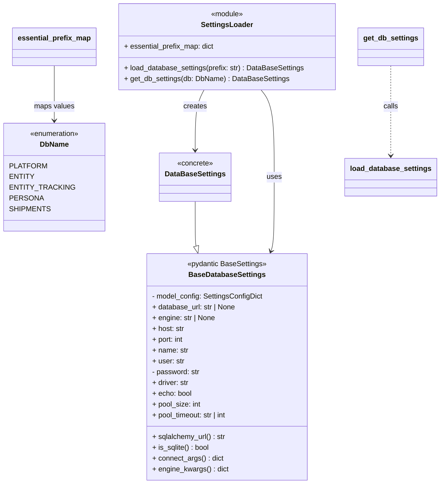

# Diagram: shared/core/src/core/settings/db_settings.py

> Auto-generated by Obscura crawlers

## Mermaid

### SVG

<svg id="container" width="961.23828125" xmlns="http://www.w3.org/2000/svg" class="classDiagram" height="1076" viewBox="0 0 961.23828125 1076" role="graphics-document document" aria-roledescription="class"><g><defs><marker id="container_class-aggregationStart" class="marker aggregation class" refX="18" refY="7" markerWidth="190" markerHeight="240" orient="auto"><path d="M 18,7 L9,13 L1,7 L9,1 Z"></path></marker></defs><defs><marker id="container_class-aggregationEnd" class="marker aggregation class" refX="1" refY="7" markerWidth="20" markerHeight="28" orient="auto"><path d="M 18,7 L9,13 L1,7 L9,1 Z"></path></marker></defs><defs><marker id="container_class-extensionStart" class="marker extension class" refX="18" refY="7" markerWidth="190" markerHeight="240" orient="auto"><path d="M 1,7 L18,13 V 1 Z"></path></marker></defs><defs><marker id="container_class-extensionEnd" class="marker extension class" refX="1" refY="7" markerWidth="20" markerHeight="28" orient="auto"><path d="M 1,1 V 13 L18,7 Z"></path></marker></defs><defs><marker id="container_class-compositionStart" class="marker composition class" refX="18" refY="7" markerWidth="190" markerHeight="240" orient="auto"><path d="M 18,7 L9,13 L1,7 L9,1 Z"></path></marker></defs><defs><marker id="container_class-compositionEnd" class="marker composition class" refX="1" refY="7" markerWidth="20" markerHeight="28" orient="auto"><path d="M 18,7 L9,13 L1,7 L9,1 Z"></path></marker></defs><defs><marker id="container_class-dependencyStart" class="marker dependency class" refX="6" refY="7" markerWidth="190" markerHeight="240" orient="auto"><path d="M 5,7 L9,13 L1,7 L9,1 Z"></path></marker></defs><defs><marker id="container_class-dependencyEnd" class="marker dependency class" refX="13" refY="7" markerWidth="20" markerHeight="28" orient="auto"><path d="M 18,7 L9,13 L14,7 L9,1 Z"></path></marker></defs><defs><marker id="container_class-lollipopStart" class="marker lollipop class" refX="13" refY="7" markerWidth="190" markerHeight="240" orient="auto"><circle stroke="black" fill="transparent" cx="7" cy="7" r="6"></circle></marker></defs><defs><marker id="container_class-lollipopEnd" class="marker lollipop class" refX="1" refY="7" markerWidth="190" markerHeight="240" orient="auto"><circle stroke="black" fill="transparent" cx="7" cy="7" r="6"></circle></marker></defs><g class="root"><g class="clusters"></g><g class="edgePaths"><path d="M416.689,448L416.689,463.167C416.689,478.333,416.689,508.667,417.07,525.226C417.45,541.786,418.21,544.572,418.59,545.965L418.971,547.359" id="id_DataBaseSettings_BaseDatabaseSettings_1" class="edge-thickness-normal edge-pattern-solid relation" style=";;;" data-edge="true" data-et="edge" data-id="id_DataBaseSettings_BaseDatabaseSettings_1" data-points="W3sieCI6NDE2LjY4OTQ1MzEyNSwieSI6NDQ4fSx7IngiOjQxNi42ODk0NTMxMjUsInkiOjUzOX0seyJ4Ijo0MjMuNTEyMTcwMDEzNTM3OSwieSI6NTY0fV0=" marker-end="url(#container_class-extensionEnd)"></path><path d="M437.72,200L434.215,206.167C430.71,212.333,423.7,224.667,420.195,247C416.689,269.333,416.689,301.667,416.689,317.833L416.689,334" id="id_SettingsLoader_DataBaseSettings_2" class="edge-thickness-normal edge-pattern-solid relation" style=";;;" data-edge="true" data-et="edge" data-id="id_SettingsLoader_DataBaseSettings_2" data-points="W3sieCI6NDM3LjcxOTgzNjcwMTEyNzgsInkiOjIwMH0seyJ4Ijo0MTYuNjg5NDUzMTI1LCJ5IjoyMzd9LHsieCI6NDE2LjY4OTQ1MzEyNSwieSI6MzQwfV0=" marker-end="url(#container_class-dependencyEnd)"></path><path d="M568.252,200L573.132,206.167C578.012,212.333,587.772,224.667,592.651,257C597.531,289.333,597.531,341.667,597.531,392C597.531,442.333,597.531,490.667,596.303,518.065C595.075,545.464,592.619,551.927,591.392,555.159L590.164,558.391" id="id_SettingsLoader_BaseDatabaseSettings_3" class="edge-thickness-normal edge-pattern-solid relation" style=";;;" data-edge="true" data-et="edge" data-id="id_SettingsLoader_BaseDatabaseSettings_3" data-points="W3sieCI6NTY4LjI1MjI2MTUxMzE1NzksInkiOjIwMH0seyJ4Ijo1OTcuNTMxMjUsInkiOjIzN30seyJ4Ijo1OTcuNTMxMjUsInkiOjM5NH0seyJ4Ijo1OTcuNTMxMjUsInkiOjUzOX0seyJ4Ijo1ODguMDMyNTA1MDc2NzE0OCwieSI6NTY0fV0=" marker-end="url(#container_class-dependencyEnd)"></path><path d="M853.754,146L853.754,161.167C853.754,176.333,853.754,206.667,853.754,240C853.754,273.333,853.754,309.667,853.754,327.833L853.754,346" id="id_get_db_settings_load_database_settings_4" class="edge-thickness-normal edge-pattern-dashed relation" style=";;;" data-edge="true" data-et="edge" data-id="id_get_db_settings_load_database_settings_4" data-points="W3sieCI6ODUzLjc1MzkwNjI1LCJ5IjoxNDZ9LHsieCI6ODUzLjc1MzkwNjI1LCJ5IjoyMzd9LHsieCI6ODUzLjc1MzkwNjI1LCJ5IjozNTJ9XQ==" marker-end="url(#container_class-dependencyEnd)"></path><path d="M111.223,146L111.223,161.167C111.223,176.333,111.223,206.667,111.223,227C111.223,247.333,111.223,257.667,111.223,262.833L111.223,268" id="id_essential_prefix_map_DbName_5" class="edge-thickness-normal edge-pattern-solid relation" style=";;;" data-edge="true" data-et="edge" data-id="id_essential_prefix_map_DbName_5" data-points="W3sieCI6MTExLjIyMjY1NjI1LCJ5IjoxNDZ9LHsieCI6MTExLjIyMjY1NjI1LCJ5IjoyMzd9LHsieCI6MTExLjIyMjY1NjI1LCJ5IjoyNzR9XQ==" marker-end="url(#container_class-dependencyEnd)"></path></g><g class="edgeLabels"><g class="edgeLabel"><g class="label" data-id="id_DataBaseSettings_BaseDatabaseSettings_1" transform="translate(0, 0)"><foreignObject width="0" height="0">

</foreignObject></g></g><g class="edgeLabel" transform="translate(416.689453125, 237)"><g class="label" data-id="id_SettingsLoader_DataBaseSettings_2" transform="translate(-26.171875, -12)"><foreignObject width="52.34375" height="24">

creates

</foreignObject></g></g><g class="edgeLabel" transform="translate(597.53125, 394)"><g class="label" data-id="id_SettingsLoader_BaseDatabaseSettings_3" transform="translate(-16.4921875, -12)"><foreignObject width="32.984375" height="24">

uses

</foreignObject></g></g><g class="edgeLabel" transform="translate(853.75390625, 237)"><g class="label" data-id="id_get_db_settings_load_database_settings_4" transform="translate(-16.4453125, -12)"><foreignObject width="32.890625" height="24">

calls

</foreignObject></g></g><g class="edgeLabel" transform="translate(111.22265625, 237)"><g class="label" data-id="id_essential_prefix_map_DbName_5" transform="translate(-44.9921875, -12)"><foreignObject width="89.984375" height="24">

maps values

</foreignObject></g></g></g><g class="nodes"><g class="node default" id="classId-BaseDatabaseSettings-0" transform="translate(492.28515625, 816)"><g class="basic label-container"><path d="M-180.62109375 -252 L180.62109375 -252 L180.62109375 252 L-180.62109375 252" stroke="none" stroke-width="0" fill="#ECECFF" style=""></path><path d="M-180.62109375 -252 C-57.56344545928438 -252, 65.49420283143124 -252, 180.62109375 -252 M-180.62109375 -252 C-101.83944723722293 -252, -23.057800724445855 -252, 180.62109375 -252 M180.62109375 -252 C180.62109375 -109.631752188425, 180.62109375 32.736495623150006, 180.62109375 252 M180.62109375 -252 C180.62109375 -144.5894515138259, 180.62109375 -37.17890302765181, 180.62109375 252 M180.62109375 252 C69.05963103484778 252, -42.501831680304434 252, -180.62109375 252 M180.62109375 252 C88.94767512729713 252, -2.7257434954057373 252, -180.62109375 252 M-180.62109375 252 C-180.62109375 135.50992943424944, -180.62109375 19.019858868498858, -180.62109375 -252 M-180.62109375 252 C-180.62109375 128.2674702366837, -180.62109375 4.534940473367385, -180.62109375 -252" stroke="#9370DB" stroke-width="1.3" fill="none" stroke-dasharray="0 0" style=""></path></g><g class="annotation-group text" transform="translate(-89.1796875, -228)"><g class="label" style="" transform="translate(0,-12)"><foreignObject width="178.359375" height="24">

«pydantic BaseSettings»

</foreignObject></g></g><g class="label-group text" transform="translate(-81.9296875, -204)"><g class="label" style="font-weight: bolder" transform="translate(0,-12)"><foreignObject width="163.859375" height="24">

BaseDatabaseSettings

</foreignObject></g></g><g class="members-group text" transform="translate(-168.62109375, -156)"><g class="label" style="" transform="translate(0,-12)"><foreignObject width="248.0625" height="24">

- model_config: SettingsConfigDict

</foreignObject></g><g class="label" style="" transform="translate(0,12)"><foreignObject width="187.765625" height="24">

+ database_url: str | None

</foreignObject></g><g class="label" style="" transform="translate(0,36)"><foreignObject width="142.0625" height="24">

+ engine: str | None

</foreignObject></g><g class="label" style="" transform="translate(0,60)"><foreignObject width="71.765625" height="24">

+ host: str

</foreignObject></g><g class="label" style="" transform="translate(0,84)"><foreignObject width="70.84375" height="24">

+ port: int

</foreignObject></g><g class="label" style="" transform="translate(0,108)"><foreignObject width="80.25" height="24">

+ name: str

</foreignObject></g><g class="label" style="" transform="translate(0,132)"><foreignObject width="71.578125" height="24">

+ user: str

</foreignObject></g><g class="label" style="" transform="translate(0,156)"><foreignObject width="106.84375" height="24">

- password: str

</foreignObject></g><g class="label" style="" transform="translate(0,180)"><foreignObject width="82.859375" height="24">

+ driver: str

</foreignObject></g><g class="label" style="" transform="translate(0,204)"><foreignObject width="88.28125" height="24">

+ echo: bool

</foreignObject></g><g class="label" style="" transform="translate(0,228)"><foreignObject width="108.765625" height="24">

+ pool_size: int

</foreignObject></g><g class="label" style="" transform="translate(0,252)"><foreignObject width="172.421875" height="24">

+ pool_timeout: str | int

</foreignObject></g></g><g class="methods-group text" transform="translate(-168.62109375, 156)"><g class="label" style="" transform="translate(0,-12)"><foreignObject width="164.0625" height="24">

+ sqlalchemy_url() : str

</foreignObject></g><g class="label" style="" transform="translate(0,12)"><foreignObject width="128.28125" height="24">

+ is_sqlite() : bool

</foreignObject></g><g class="label" style="" transform="translate(0,36)"><foreignObject width="158.3125" height="24">

+ connect_args() : dict

</foreignObject></g><g class="label" style="" transform="translate(0,60)"><foreignObject width="169.234375" height="24">

+ engine_kwargs() : dict

</foreignObject></g></g><g class="divider" style=""><path d="M-180.62109375 -180 C-39.43558960207858 -180, 101.74991454584284 -180, 180.62109375 -180 M-180.62109375 -180 C-47.5587307561091 -180, 85.5036322377818 -180, 180.62109375 -180" stroke="#9370DB" stroke-width="1.3" fill="none" stroke-dasharray="0 0" style=""></path></g><g class="divider" style=""><path d="M-180.62109375 132 C-36.249774387017595 132, 108.12154497596481 132, 180.62109375 132 M-180.62109375 132 C-61.51058848746385 132, 57.5999167750723 132, 180.62109375 132" stroke="#9370DB" stroke-width="1.3" fill="none" stroke-dasharray="0 0" style=""></path></g></g><g class="node default" id="classId-DataBaseSettings-1" transform="translate(416.689453125, 394)"><g class="basic label-container"><path d="M-76.6484375 -54 L76.6484375 -54 L76.6484375 54 L-76.6484375 54" stroke="none" stroke-width="0" fill="#ECECFF" style=""></path><path d="M-76.6484375 -54 C-16.077697319899812 -54, 44.493042860200376 -54, 76.6484375 -54 M-76.6484375 -54 C-22.625857825300514 -54, 31.396721849398972 -54, 76.6484375 -54 M76.6484375 -54 C76.6484375 -15.393801434194152, 76.6484375 23.212397131611695, 76.6484375 54 M76.6484375 -54 C76.6484375 -19.371203162574318, 76.6484375 15.257593674851364, 76.6484375 54 M76.6484375 54 C23.978636880222453 54, -28.691163739555094 54, -76.6484375 54 M76.6484375 54 C32.356788148625796 54, -11.934861202748408 54, -76.6484375 54 M-76.6484375 54 C-76.6484375 20.031907947078913, -76.6484375 -13.936184105842173, -76.6484375 -54 M-76.6484375 54 C-76.6484375 31.92345174019399, -76.6484375 9.84690348038798, -76.6484375 -54" stroke="#9370DB" stroke-width="1.3" fill="none" stroke-dasharray="0 0" style=""></path></g><g class="annotation-group text" transform="translate(-39.9921875, -30)"><g class="label" style="" transform="translate(0,-12)"><foreignObject width="79.984375" height="24">

«concrete»

</foreignObject></g></g><g class="label-group text" transform="translate(-64.6484375, -6)"><g class="label" style="font-weight: bolder" transform="translate(0,-12)"><foreignObject width="129.296875" height="24">

DataBaseSettings

</foreignObject></g></g><g class="members-group text" transform="translate(-64.6484375, 42)"></g><g class="methods-group text" transform="translate(-64.6484375, 72)"></g><g class="divider" style=""><path d="M-76.6484375 18 C-22.723830521728246 18, 31.200776456543508 18, 76.6484375 18 M-76.6484375 18 C-21.158948288561355 18, 34.33054092287729 18, 76.6484375 18" stroke="#9370DB" stroke-width="1.3" fill="none" stroke-dasharray="0 0" style=""></path></g><g class="divider" style=""><path d="M-76.6484375 36 C-45.77606124591034 36, -14.903684991820683 36, 76.6484375 36 M-76.6484375 36 C-40.00252812046472 36, -3.3566187409294344 36, 76.6484375 36" stroke="#9370DB" stroke-width="1.3" fill="none" stroke-dasharray="0 0" style=""></path></g></g><g class="node default" id="classId-DbName-2" transform="translate(111.22265625, 394)"><g class="basic label-container"><path d="M-103.22265625 -120 L103.22265625 -120 L103.22265625 120 L-103.22265625 120" stroke="none" stroke-width="0" fill="#ECECFF" style=""></path><path d="M-103.22265625 -120 C-57.884325520533096 -120, -12.545994791066192 -120, 103.22265625 -120 M-103.22265625 -120 C-36.11543059145568 -120, 30.991795067088646 -120, 103.22265625 -120 M103.22265625 -120 C103.22265625 -56.19722206409618, 103.22265625 7.605555871807638, 103.22265625 120 M103.22265625 -120 C103.22265625 -60.51263454187634, 103.22265625 -1.0252690837526757, 103.22265625 120 M103.22265625 120 C44.845388920317085 120, -13.53187840936583 120, -103.22265625 120 M103.22265625 120 C20.936808051370235 120, -61.34904014725953 120, -103.22265625 120 M-103.22265625 120 C-103.22265625 39.406874919001666, -103.22265625 -41.18625016199667, -103.22265625 -120 M-103.22265625 120 C-103.22265625 58.003495229767154, -103.22265625 -3.9930095404656925, -103.22265625 -120" stroke="#9370DB" stroke-width="1.3" fill="none" stroke-dasharray="0 0" style=""></path></g><g class="annotation-group text" transform="translate(-55.5546875, -96)"><g class="label" style="" transform="translate(0,-12)"><foreignObject width="111.109375" height="24">

«enumeration»

</foreignObject></g></g><g class="label-group text" transform="translate(-30.8515625, -72)"><g class="label" style="font-weight: bolder" transform="translate(0,-12)"><foreignObject width="61.703125" height="24">

DbName

</foreignObject></g></g><g class="members-group text" transform="translate(-91.22265625, -24)"><g class="label" style="" transform="translate(0,-12)"><foreignObject width="74.703125" height="24">

PLATFORM

</foreignObject></g><g class="label" style="" transform="translate(0,12)"><foreignObject width="49.5625" height="24">

ENTITY

</foreignObject></g><g class="label" style="" transform="translate(0,36)"><foreignObject width="126.890625" height="24">

ENTITY_TRACKING

</foreignObject></g><g class="label" style="" transform="translate(0,60)"><foreignObject width="67.3125" height="24">

PERSONA

</foreignObject></g><g class="label" style="" transform="translate(0,84)"><foreignObject width="81.75" height="24">

SHIPMENTS

</foreignObject></g></g><g class="methods-group text" transform="translate(-91.22265625, 120)"></g><g class="divider" style=""><path d="M-103.22265625 -48 C-49.51756374892566 -48, 4.18752875214868 -48, 103.22265625 -48 M-103.22265625 -48 C-42.12450450607789 -48, 18.97364723784422 -48, 103.22265625 -48" stroke="#9370DB" stroke-width="1.3" fill="none" stroke-dasharray="0 0" style=""></path></g><g class="divider" style=""><path d="M-103.22265625 96 C-26.98421111151343 96, 49.25423402697314 96, 103.22265625 96 M-103.22265625 96 C-32.591114887796465 96, 38.04042647440707 96, 103.22265625 96" stroke="#9370DB" stroke-width="1.3" fill="none" stroke-dasharray="0 0" style=""></path></g></g><g class="node default" id="classId-SettingsLoader-3" transform="translate(492.28515625, 104)"><g class="basic label-container"><path d="M-240.625 -96 L240.625 -96 L240.625 96 L-240.625 96" stroke="none" stroke-width="0" fill="#ECECFF" style=""></path><path d="M-240.625 -96 C-124.67689853497956 -96, -8.728797069959114 -96, 240.625 -96 M-240.625 -96 C-103.46324755677182 -96, 33.69850488645636 -96, 240.625 -96 M240.625 -96 C240.625 -40.488593084052724, 240.625 15.022813831894553, 240.625 96 M240.625 -96 C240.625 -21.476671305459433, 240.625 53.04665738908113, 240.625 96 M240.625 96 C59.6044934566402 96, -121.4160130867196 96, -240.625 96 M240.625 96 C113.01439300116557 96, -14.596213997668855 96, -240.625 96 M-240.625 96 C-240.625 43.183280167114546, -240.625 -9.633439665770908, -240.625 -96 M-240.625 96 C-240.625 38.04370297461398, -240.625 -19.912594050772043, -240.625 -96" stroke="#9370DB" stroke-width="1.3" fill="none" stroke-dasharray="0 0" style=""></path></g><g class="annotation-group text" transform="translate(-36.6015625, -72)"><g class="label" style="" transform="translate(0,-12)"><foreignObject width="73.203125" height="24">

«module»

</foreignObject></g></g><g class="label-group text" transform="translate(-55.546875, -48)"><g class="label" style="font-weight: bolder" transform="translate(0,-12)"><foreignObject width="111.09375" height="24">

SettingsLoader

</foreignObject></g></g><g class="members-group text" transform="translate(-228.625, 0)"><g class="label" style="" transform="translate(0,-12)"><foreignObject width="202.375" height="24">

+ essential_prefix_map: dict

</foreignObject></g></g><g class="methods-group text" transform="translate(-228.625, 48)"><g class="label" style="" transform="translate(0,-12)"><foreignObject width="401.703125" height="24">

+ load_database_settings(prefix: str) : DataBaseSettings

</foreignObject></g><g class="label" style="" transform="translate(0,12)"><foreignObject width="365.125" height="24">

+ get_db_settings(db: DbName) : DataBaseSettings

</foreignObject></g></g><g class="divider" style=""><path d="M-240.625 -24 C-109.36764927734555 -24, 21.8897014453089 -24, 240.625 -24 M-240.625 -24 C-51.020927243069224 -24, 138.58314551386155 -24, 240.625 -24" stroke="#9370DB" stroke-width="1.3" fill="none" stroke-dasharray="0 0" style=""></path></g><g class="divider" style=""><path d="M-240.625 24 C-117.32141334880295 24, 5.982173302394102 24, 240.625 24 M-240.625 24 C-102.51113081284001 24, 35.60273837431998 24, 240.625 24" stroke="#9370DB" stroke-width="1.3" fill="none" stroke-dasharray="0 0" style=""></path></g></g><g class="node default" id="classId-get_db_settings-4" transform="translate(853.75390625, 104)"><g class="basic label-container"><path d="M-70.84375 -42 L70.84375 -42 L70.84375 42 L-70.84375 42" stroke="none" stroke-width="0" fill="#ECECFF" style=""></path><path d="M-70.84375 -42 C-22.48480636912877 -42, 25.87413726174246 -42, 70.84375 -42 M-70.84375 -42 C-26.708551188367935 -42, 17.42664762326413 -42, 70.84375 -42 M70.84375 -42 C70.84375 -23.674255532520856, 70.84375 -5.348511065041713, 70.84375 42 M70.84375 -42 C70.84375 -9.573118022347948, 70.84375 22.853763955304103, 70.84375 42 M70.84375 42 C30.082478169434992 42, -10.678793661130015 42, -70.84375 42 M70.84375 42 C23.91861571686514 42, -23.00651856626972 42, -70.84375 42 M-70.84375 42 C-70.84375 15.862173176237729, -70.84375 -10.275653647524543, -70.84375 -42 M-70.84375 42 C-70.84375 14.77987382383256, -70.84375 -12.44025235233488, -70.84375 -42" stroke="#9370DB" stroke-width="1.3" fill="none" stroke-dasharray="0 0" style=""></path></g><g class="annotation-group text" transform="translate(0, -18)"></g><g class="label-group text" transform="translate(-58.84375, -18)"><g class="label" style="font-weight: bolder" transform="translate(0,-12)"><foreignObject width="117.6875" height="24">

get_db_settings

</foreignObject></g></g><g class="members-group text" transform="translate(-58.84375, 30)"></g><g class="methods-group text" transform="translate(-58.84375, 60)"></g><g class="divider" style=""><path d="M-70.84375 6 C-15.726540189684144 6, 39.39066962063171 6, 70.84375 6 M-70.84375 6 C-17.87560301589184 6, 35.09254396821632 6, 70.84375 6" stroke="#9370DB" stroke-width="1.3" fill="none" stroke-dasharray="0 0" style=""></path></g><g class="divider" style=""><path d="M-70.84375 24 C-22.95950907527513 24, 24.924731849449742 24, 70.84375 24 M-70.84375 24 C-38.505298924036005 24, -6.16684784807201 24, 70.84375 24" stroke="#9370DB" stroke-width="1.3" fill="none" stroke-dasharray="0 0" style=""></path></g></g><g class="node default" id="classId-load_database_settings-5" transform="translate(853.75390625, 394)"><g class="basic label-container"><path d="M-99.484375 -42 L99.484375 -42 L99.484375 42 L-99.484375 42" stroke="none" stroke-width="0" fill="#ECECFF" style=""></path><path d="M-99.484375 -42 C-41.11555140049123 -42, 17.253272199017545 -42, 99.484375 -42 M-99.484375 -42 C-31.313484339139663 -42, 36.857406321720674 -42, 99.484375 -42 M99.484375 -42 C99.484375 -16.94982023994233, 99.484375 8.10035952011534, 99.484375 42 M99.484375 -42 C99.484375 -23.102928696916088, 99.484375 -4.205857393832176, 99.484375 42 M99.484375 42 C37.139860445211085 42, -25.20465410957783 42, -99.484375 42 M99.484375 42 C44.29861838423168 42, -10.887138231536639 42, -99.484375 42 M-99.484375 42 C-99.484375 13.292003060578121, -99.484375 -15.415993878843757, -99.484375 -42 M-99.484375 42 C-99.484375 16.10930319324331, -99.484375 -9.78139361351338, -99.484375 -42" stroke="#9370DB" stroke-width="1.3" fill="none" stroke-dasharray="0 0" style=""></path></g><g class="annotation-group text" transform="translate(0, -18)"></g><g class="label-group text" transform="translate(-87.484375, -18)"><g class="label" style="font-weight: bolder" transform="translate(0,-12)"><foreignObject width="174.96875" height="24">

load_database_settings

</foreignObject></g></g><g class="members-group text" transform="translate(-87.484375, 30)"></g><g class="methods-group text" transform="translate(-87.484375, 60)"></g><g class="divider" style=""><path d="M-99.484375 6 C-33.098182081571096 6, 33.28801083685781 6, 99.484375 6 M-99.484375 6 C-34.49478789113567 6, 30.494799217728655 6, 99.484375 6" stroke="#9370DB" stroke-width="1.3" fill="none" stroke-dasharray="0 0" style=""></path></g><g class="divider" style=""><path d="M-99.484375 24 C-35.95399960667203 24, 27.576375786655944 24, 99.484375 24 M-99.484375 24 C-42.73786544456217 24, 14.008644110875665 24, 99.484375 24" stroke="#9370DB" stroke-width="1.3" fill="none" stroke-dasharray="0 0" style=""></path></g></g><g class="node default" id="classId-essential_prefix_map-6" transform="translate(111.22265625, 104)"><g class="basic label-container"><path d="M-90.4375 -42 L90.4375 -42 L90.4375 42 L-90.4375 42" stroke="none" stroke-width="0" fill="#ECECFF" style=""></path><path d="M-90.4375 -42 C-53.980766010765755 -42, -17.52403202153151 -42, 90.4375 -42 M-90.4375 -42 C-38.81758028752128 -42, 12.802339424957438 -42, 90.4375 -42 M90.4375 -42 C90.4375 -8.67530988748176, 90.4375 24.64938022503648, 90.4375 42 M90.4375 -42 C90.4375 -23.10822423162521, 90.4375 -4.216448463250423, 90.4375 42 M90.4375 42 C18.14022187038215 42, -54.1570562592357 42, -90.4375 42 M90.4375 42 C53.51678244594053 42, 16.596064891881056 42, -90.4375 42 M-90.4375 42 C-90.4375 16.38363212126899, -90.4375 -9.232735757462017, -90.4375 -42 M-90.4375 42 C-90.4375 16.62727217194321, -90.4375 -8.745455656113577, -90.4375 -42" stroke="#9370DB" stroke-width="1.3" fill="none" stroke-dasharray="0 0" style=""></path></g><g class="annotation-group text" transform="translate(0, -18)"></g><g class="label-group text" transform="translate(-78.4375, -18)"><g class="label" style="font-weight: bolder" transform="translate(0,-12)"><foreignObject width="156.875" height="24">

essential_prefix_map

</foreignObject></g></g><g class="members-group text" transform="translate(-78.4375, 30)"></g><g class="methods-group text" transform="translate(-78.4375, 60)"></g><g class="divider" style=""><path d="M-90.4375 6 C-19.08725874920188 6, 52.26298250159624 6, 90.4375 6 M-90.4375 6 C-44.23720683570027 6, 1.9630863285994593 6, 90.4375 6" stroke="#9370DB" stroke-width="1.3" fill="none" stroke-dasharray="0 0" style=""></path></g><g class="divider" style=""><path d="M-90.4375 24 C-51.89240751661979 24, -13.347315033239582 24, 90.4375 24 M-90.4375 24 C-38.537040771726936 24, 13.363418456546128 24, 90.4375 24" stroke="#9370DB" stroke-width="1.3" fill="none" stroke-dasharray="0 0" style=""></path></g></g></g></g></g></svg>
