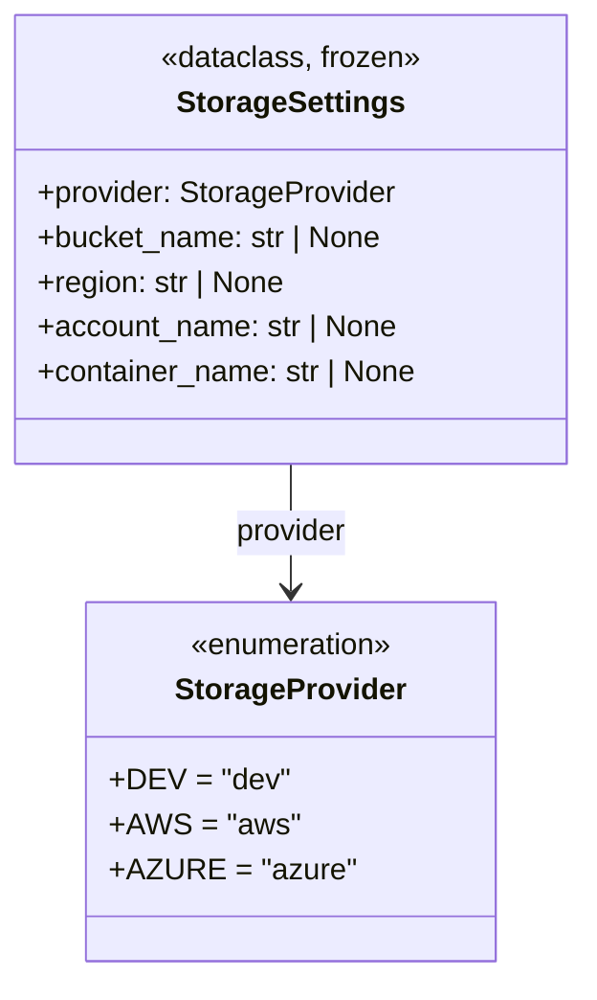

# Diagram: shared/core/src/core/settings/storage_settings.py


> Auto-generated by Obscura crawlers

## Diagram 1



### SVG

<svg id="container" width="315.3046875" xmlns="http://www.w3.org/2000/svg" class="classDiagram" height="522" viewBox="0 0 315.3046875 522" role="graphics-document document" aria-roledescription="class"><style>#container{font-family:"trebuchet ms",verdana,arial,sans-serif;font-size:16px;fill:#333;}@keyframes edge-animation-frame{from{stroke-dashoffset:0;}}@keyframes dash{to{stroke-dashoffset:0;}}#container .edge-animation-slow{stroke-dasharray:9,5!important;stroke-dashoffset:900;animation:dash 50s linear infinite;stroke-linecap:round;}#container .edge-animation-fast{stroke-dasharray:9,5!important;stroke-dashoffset:900;animation:dash 20s linear infinite;stroke-linecap:round;}#container .error-icon{fill:#552222;}#container .error-text{fill:#552222;stroke:#552222;}#container .edge-thickness-normal{stroke-width:1px;}#container .edge-thickness-thick{stroke-width:3.5px;}#container .edge-pattern-solid{stroke-dasharray:0;}#container .edge-thickness-invisible{stroke-width:0;fill:none;}#container .edge-pattern-dashed{stroke-dasharray:3;}#container .edge-pattern-dotted{stroke-dasharray:2;}#container .marker{fill:#333333;stroke:#333333;}#container .marker.cross{stroke:#333333;}#container svg{font-family:"trebuchet ms",verdana,arial,sans-serif;font-size:16px;}#container p{margin:0;}#container g.classGroup text{fill:#9370DB;stroke:none;font-family:"trebuchet ms",verdana,arial,sans-serif;font-size:10px;}#container g.classGroup text .title{font-weight:bolder;}#container .nodeLabel,#container .edgeLabel{color:#131300;}#container .edgeLabel .label rect{fill:#ECECFF;}#container .label text{fill:#131300;}#container .labelBkg{background:#ECECFF;}#container .edgeLabel .label span{background:#ECECFF;}#container .classTitle{font-weight:bolder;}#container .node rect,#container .node circle,#container .node ellipse,#container .node polygon,#container .node path{fill:#ECECFF;stroke:#9370DB;stroke-width:1px;}#container .divider{stroke:#9370DB;stroke-width:1;}#container g.clickable{cursor:pointer;}#container g.classGroup rect{fill:#ECECFF;stroke:#9370DB;}#container g.classGroup line{stroke:#9370DB;stroke-width:1;}#container .classLabel .box{stroke:none;stroke-width:0;fill:#ECECFF;opacity:0.5;}#container .classLabel .label{fill:#9370DB;font-size:10px;}#container .relation{stroke:#333333;stroke-width:1;fill:none;}#container .dashed-line{stroke-dasharray:3;}#container .dotted-line{stroke-dasharray:1 2;}#container #compositionStart,#container .composition{fill:#333333!important;stroke:#333333!important;stroke-width:1;}#container #compositionEnd,#container .composition{fill:#333333!important;stroke:#333333!important;stroke-width:1;}#container #dependencyStart,#container .dependency{fill:#333333!important;stroke:#333333!important;stroke-width:1;}#container #dependencyStart,#container .dependency{fill:#333333!important;stroke:#333333!important;stroke-width:1;}#container #extensionStart,#container .extension{fill:transparent!important;stroke:#333333!important;stroke-width:1;}#container #extensionEnd,#container .extension{fill:transparent!important;stroke:#333333!important;stroke-width:1;}#container #aggregationStart,#container .aggregation{fill:transparent!important;stroke:#333333!important;stroke-width:1;}#container #aggregationEnd,#container .aggregation{fill:transparent!important;stroke:#333333!important;stroke-width:1;}#container #lollipopStart,#container .lollipop{fill:#ECECFF!important;stroke:#333333!important;stroke-width:1;}#container #lollipopEnd,#container .lollipop{fill:#ECECFF!important;stroke:#333333!important;stroke-width:1;}#container .edgeTerminals{font-size:11px;line-height:initial;}#container .classTitleText{text-anchor:middle;font-size:18px;fill:#333;}#container .label-icon{display:inline-block;height:1em;overflow:visible;vertical-align:-0.125em;}#container .node .label-icon path{fill:currentColor;stroke:revert;stroke-width:revert;}#container :root{--mermaid-font-family:"trebuchet ms",verdana,arial,sans-serif;}</style><g><defs><marker id="container_class-aggregationStart" class="marker aggregation class" refX="18" refY="7" markerWidth="190" markerHeight="240" orient="auto"><path d="M 18,7 L9,13 L1,7 L9,1 Z"></path></marker></defs><defs><marker id="container_class-aggregationEnd" class="marker aggregation class" refX="1" refY="7" markerWidth="20" markerHeight="28" orient="auto"><path d="M 18,7 L9,13 L1,7 L9,1 Z"></path></marker></defs><defs><marker id="container_class-extensionStart" class="marker extension class" refX="18" refY="7" markerWidth="190" markerHeight="240" orient="auto"><path d="M 1,7 L18,13 V 1 Z"></path></marker></defs><defs><marker id="container_class-extensionEnd" class="marker extension class" refX="1" refY="7" markerWidth="20" markerHeight="28" orient="auto"><path d="M 1,1 V 13 L18,7 Z"></path></marker></defs><defs><marker id="container_class-compositionStart" class="marker composition class" refX="18" refY="7" markerWidth="190" markerHeight="240" orient="auto"><path d="M 18,7 L9,13 L1,7 L9,1 Z"></path></marker></defs><defs><marker id="container_class-compositionEnd" class="marker composition class" refX="1" refY="7" markerWidth="20" markerHeight="28" orient="auto"><path d="M 18,7 L9,13 L1,7 L9,1 Z"></path></marker></defs><defs><marker id="container_class-dependencyStart" class="marker dependency class" refX="6" refY="7" markerWidth="190" markerHeight="240" orient="auto"><path d="M 5,7 L9,13 L1,7 L9,1 Z"></path></marker></defs><defs><marker id="container_class-dependencyEnd" class="marker dependency class" refX="13" refY="7" markerWidth="20" markerHeight="28" orient="auto"><path d="M 18,7 L9,13 L14,7 L9,1 Z"></path></marker></defs><defs><marker id="container_class-lollipopStart" class="marker lollipop class" refX="13" refY="7" markerWidth="190" markerHeight="240" orient="auto"><circle stroke="black" fill="transparent" cx="7" cy="7" r="6"></circle></marker></defs><defs><marker id="container_class-lollipopEnd" class="marker lollipop class" refX="1" refY="7" markerWidth="190" markerHeight="240" orient="auto"><circle stroke="black" fill="transparent" cx="7" cy="7" r="6"></circle></marker></defs><g class="root"><g class="clusters"></g><g class="edgePaths"><path d="M157.652,248L157.652,254.167C157.652,260.333,157.652,272.667,157.652,284C157.652,295.333,157.652,305.667,157.652,310.833L157.652,316" id="id_StorageSettings_StorageProvider_1" class="edge-thickness-normal edge-pattern-solid relation" style=";;;" data-edge="true" data-et="edge" data-id="id_StorageSettings_StorageProvider_1" data-points="W3sieCI6MTU3LjY1MjM0Mzc1LCJ5IjoyNDh9LHsieCI6MTU3LjY1MjM0Mzc1LCJ5IjoyODV9LHsieCI6MTU3LjY1MjM0Mzc1LCJ5IjozMjJ9XQ==" marker-end="url(#container_class-dependencyEnd)"></path></g><g class="edgeLabels"><g class="edgeLabel" transform="translate(157.65234375, 285)"><g class="label" data-id="id_StorageSettings_StorageProvider_1" transform="translate(-30.6640625, -12)"><foreignObject width="61.328125" height="24"><div xmlns="http://www.w3.org/1999/xhtml" class="labelBkg" style="display: table-cell; white-space: nowrap; line-height: 1.5; max-width: 200px; text-align: center;"><span class="edgeLabel"><p>provider</p></span></div></foreignObject></g></g></g><g class="nodes"><g class="node default" id="classId-StorageProvider-0" transform="translate(157.65234375, 418)"><g class="basic label-container"><path d="M-102.609375 -96 L102.609375 -96 L102.609375 96 L-102.609375 96" stroke="none" stroke-width="0" fill="#ECECFF" style=""></path><path d="M-102.609375 -96 C-48.39208562131803 -96, 5.825203757363937 -96, 102.609375 -96 M-102.609375 -96 C-37.174830352502724 -96, 28.259714294994552 -96, 102.609375 -96 M102.609375 -96 C102.609375 -44.80561313478726, 102.609375 6.388773730425484, 102.609375 96 M102.609375 -96 C102.609375 -32.42263413186049, 102.609375 31.154731736279018, 102.609375 96 M102.609375 96 C24.072952986855412 96, -54.463469026289175 96, -102.609375 96 M102.609375 96 C59.82451387299543 96, 17.039652745990864 96, -102.609375 96 M-102.609375 96 C-102.609375 39.89338626041075, -102.609375 -16.2132274791785, -102.609375 -96 M-102.609375 96 C-102.609375 35.908665689876244, -102.609375 -24.18266862024751, -102.609375 -96" stroke="#9370DB" stroke-width="1.3" fill="none" stroke-dasharray="0 0" style=""></path></g><g class="annotation-group text" transform="translate(-55.5546875, -72)"><g class="label" style="" transform="translate(0,-12)"><foreignObject width="111.109375" height="24"><div xmlns="http://www.w3.org/1999/xhtml" style="display: table-cell; white-space: nowrap; line-height: 1.5; max-width: 161px; text-align: center;"><span class="nodeLabel markdown-node-label" style=""><p>«enumeration»</p></span></div></foreignObject></g></g><g class="label-group text" transform="translate(-59.078125, -48)"><g class="label" style="font-weight: bolder" transform="translate(0,-12)"><foreignObject width="118.15625" height="24"><div xmlns="http://www.w3.org/1999/xhtml" style="display: table-cell; white-space: nowrap; line-height: 1.5; max-width: 166px; text-align: center;"><span class="nodeLabel markdown-node-label" style=""><p>StorageProvider</p></span></div></foreignObject></g></g><g class="members-group text" transform="translate(-90.609375, 0)"><g class="label" style="" transform="translate(0,-12)"><foreignObject width="90.9375" height="24"><div xmlns="http://www.w3.org/1999/xhtml" style="display: table-cell; white-space: nowrap; line-height: 1.5; max-width: 148px; text-align: center;"><span class="nodeLabel markdown-node-label" style=""><p>+DEV = "dev"</p></span></div></foreignObject></g><g class="label" style="" transform="translate(0,12)"><foreignObject width="95.109375" height="24"><div xmlns="http://www.w3.org/1999/xhtml" style="display: table-cell; white-space: nowrap; line-height: 1.5; max-width: 152px; text-align: center;"><span class="nodeLabel markdown-node-label" style=""><p>+AWS = "aws"</p></span></div></foreignObject></g><g class="label" style="" transform="translate(0,36)"><foreignObject width="122.140625" height="24"><div xmlns="http://www.w3.org/1999/xhtml" style="display: table-cell; white-space: nowrap; line-height: 1.5; max-width: 180px; text-align: center;"><span class="nodeLabel markdown-node-label" style=""><p>+AZURE = "azure"</p></span></div></foreignObject></g></g><g class="methods-group text" transform="translate(-90.609375, 96)"></g><g class="divider" style=""><path d="M-102.609375 -24 C-21.809431579021975 -24, 58.99051184195605 -24, 102.609375 -24 M-102.609375 -24 C-51.620938994465696 -24, -0.6325029889313925 -24, 102.609375 -24" stroke="#9370DB" stroke-width="1.3" fill="none" stroke-dasharray="0 0" style=""></path></g><g class="divider" style=""><path d="M-102.609375 72 C-22.752352196175153 72, 57.104670607649695 72, 102.609375 72 M-102.609375 72 C-34.16276168897046 72, 34.283851622059075 72, 102.609375 72" stroke="#9370DB" stroke-width="1.3" fill="none" stroke-dasharray="0 0" style=""></path></g></g><g class="node default" id="classId-StorageSettings-1" transform="translate(157.65234375, 128)"><g class="basic label-container"><path d="M-149.65234375 -120 L149.65234375 -120 L149.65234375 120 L-149.65234375 120" stroke="none" stroke-width="0" fill="#ECECFF" style=""></path><path d="M-149.65234375 -120 C-88.43903921636347 -120, -27.225734682726937 -120, 149.65234375 -120 M-149.65234375 -120 C-81.49625335479429 -120, -13.340162959588582 -120, 149.65234375 -120 M149.65234375 -120 C149.65234375 -53.88947553535999, 149.65234375 12.221048929280016, 149.65234375 120 M149.65234375 -120 C149.65234375 -26.22212812742785, 149.65234375 67.5557437451443, 149.65234375 120 M149.65234375 120 C60.697027200018255 120, -28.25828934996349 120, -149.65234375 120 M149.65234375 120 C35.079429456102844 120, -79.49348483779431 120, -149.65234375 120 M-149.65234375 120 C-149.65234375 55.42409215664877, -149.65234375 -9.151815686702463, -149.65234375 -120 M-149.65234375 120 C-149.65234375 31.099387685970456, -149.65234375 -57.80122462805909, -149.65234375 -120" stroke="#9370DB" stroke-width="1.3" fill="none" stroke-dasharray="0 0" style=""></path></g><g class="annotation-group text" transform="translate(-69.7578125, -96)"><g class="label" style="" transform="translate(0,-12)"><foreignObject width="139.515625" height="24"><div xmlns="http://www.w3.org/1999/xhtml" style="display: table-cell; white-space: nowrap; line-height: 1.5; max-width: 190px; text-align: center;"><span class="nodeLabel markdown-node-label" style=""><p>«dataclass, frozen»</p></span></div></foreignObject></g></g><g class="label-group text" transform="translate(-58.3125, -72)"><g class="label" style="font-weight: bolder" transform="translate(0,-12)"><foreignObject width="116.625" height="24"><div xmlns="http://www.w3.org/1999/xhtml" style="display: table-cell; white-space: nowrap; line-height: 1.5; max-width: 163px; text-align: center;"><span class="nodeLabel markdown-node-label" style=""><p>StorageSettings</p></span></div></foreignObject></g></g><g class="members-group text" transform="translate(-137.65234375, -24)"><g class="label" style="" transform="translate(0,-12)"><foreignObject width="192.90625" height="24"><div xmlns="http://www.w3.org/1999/xhtml" style="display: table-cell; white-space: nowrap; line-height: 1.5; max-width: 251px; text-align: center;"><span class="nodeLabel markdown-node-label" style=""><p>+provider: StorageProvider</p></span></div></foreignObject></g><g class="label" style="" transform="translate(0,12)"><foreignObject width="186.625" height="24"><div xmlns="http://www.w3.org/1999/xhtml" style="display: table-cell; white-space: nowrap; line-height: 1.5; max-width: 244px; text-align: center;"><span class="nodeLabel markdown-node-label" style=""><p>+bucket_name: str | None</p></span></div></foreignObject></g><g class="label" style="" transform="translate(0,36)"><foreignObject width="134.765625" height="24"><div xmlns="http://www.w3.org/1999/xhtml" style="display: table-cell; white-space: nowrap; line-height: 1.5; max-width: 192px; text-align: center;"><span class="nodeLabel markdown-node-label" style=""><p>+region: str | None</p></span></div></foreignObject></g><g class="label" style="" transform="translate(0,60)"><foreignObject width="194.546875" height="24"><div xmlns="http://www.w3.org/1999/xhtml" style="display: table-cell; white-space: nowrap; line-height: 1.5; max-width: 252px; text-align: center;"><span class="nodeLabel markdown-node-label" style=""><p>+account_name: str | None</p></span></div></foreignObject></g><g class="label" style="" transform="translate(0,84)"><foreignObject width="205.546875" height="24"><div xmlns="http://www.w3.org/1999/xhtml" style="display: table-cell; white-space: nowrap; line-height: 1.5; max-width: 263px; text-align: center;"><span class="nodeLabel markdown-node-label" style=""><p>+container_name: str | None</p></span></div></foreignObject></g></g><g class="methods-group text" transform="translate(-137.65234375, 120)"></g><g class="divider" style=""><path d="M-149.65234375 -48 C-47.221651958256814 -48, 55.20903983348637 -48, 149.65234375 -48 M-149.65234375 -48 C-57.042727943210664 -48, 35.56688786357867 -48, 149.65234375 -48" stroke="#9370DB" stroke-width="1.3" fill="none" stroke-dasharray="0 0" style=""></path></g><g class="divider" style=""><path d="M-149.65234375 96 C-42.06599629556109 96, 65.52035115887782 96, 149.65234375 96 M-149.65234375 96 C-47.45642205990944 96, 54.739499630181115 96, 149.65234375 96" stroke="#9370DB" stroke-width="1.3" fill="none" stroke-dasharray="0 0" style=""></path></g></g></g></g></g></svg>

## Diagram 2

```mermaid
flowchart TD
    A[Start: get_storage_settings(prefix)] --> B[Compute p = prefix.upper() + "_" if prefix else ""]
    B --> C{_get_first_env for provider}
    C -->|found| D[Normalize provider -> StorageProvider(...)]
    C -->|not found| D
    D --> E[_get_first_env for container_name]
    E --> F[_get_first_env for bucket_name OR use container_name]
    F --> G[_get_first_env for region (AWS_REGION / AWS_DEFAULT_REGION)]
    G --> H[_get_first_env for account_name (AZURE_STORAGE_ACCOUNT)]
    H --> I[Return StorageSettings(provider, bucket_name, region, account_name, container_name)]
    I --> J[End]
```

> SVG rendering failed for this diagram.
