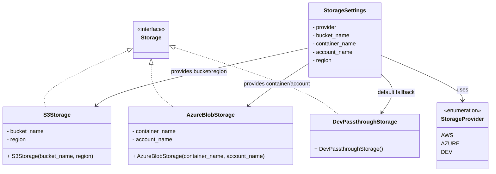
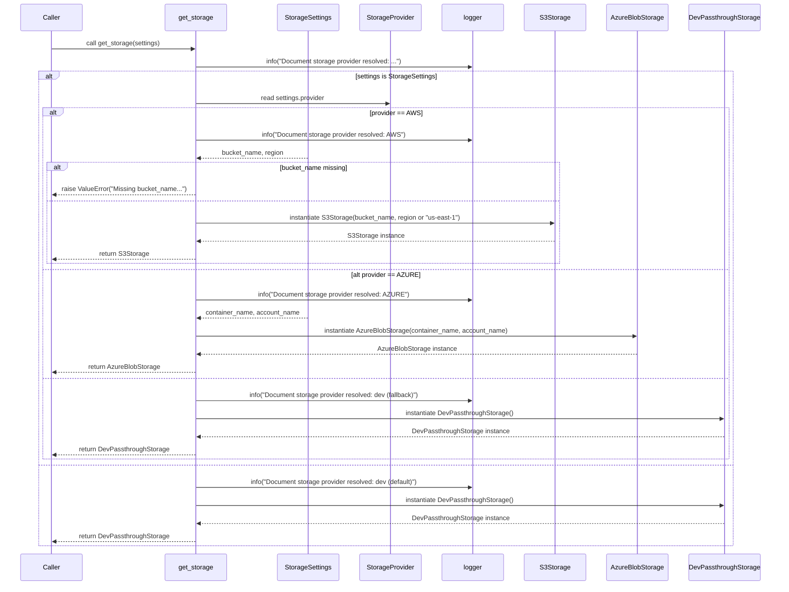

# Diagram: shared/core/src/core/storage/factory.py

> Auto-generated by Obscura crawlers

## Diagram 1

### SVG

<svg id="container" width="1388.3203125" xmlns="http://www.w3.org/2000/svg" class="classDiagram" height="498" viewBox="0 0 1388.3203125 498" role="graphics-document document" aria-roledescription="class"><g><defs><marker id="container_class-aggregationStart" class="marker aggregation class" refX="18" refY="7" markerWidth="190" markerHeight="240" orient="auto"><path d="M 18,7 L9,13 L1,7 L9,1 Z"></path></marker></defs><defs><marker id="container_class-aggregationEnd" class="marker aggregation class" refX="1" refY="7" markerWidth="20" markerHeight="28" orient="auto"><path d="M 18,7 L9,13 L1,7 L9,1 Z"></path></marker></defs><defs><marker id="container_class-extensionStart" class="marker extension class" refX="18" refY="7" markerWidth="190" markerHeight="240" orient="auto"><path d="M 1,7 L18,13 V 1 Z"></path></marker></defs><defs><marker id="container_class-extensionEnd" class="marker extension class" refX="1" refY="7" markerWidth="20" markerHeight="28" orient="auto"><path d="M 1,1 V 13 L18,7 Z"></path></marker></defs><defs><marker id="container_class-compositionStart" class="marker composition class" refX="18" refY="7" markerWidth="190" markerHeight="240" orient="auto"><path d="M 18,7 L9,13 L1,7 L9,1 Z"></path></marker></defs><defs><marker id="container_class-compositionEnd" class="marker composition class" refX="1" refY="7" markerWidth="20" markerHeight="28" orient="auto"><path d="M 18,7 L9,13 L1,7 L9,1 Z"></path></marker></defs><defs><marker id="container_class-dependencyStart" class="marker dependency class" refX="6" refY="7" markerWidth="190" markerHeight="240" orient="auto"><path d="M 5,7 L9,13 L1,7 L9,1 Z"></path></marker></defs><defs><marker id="container_class-dependencyEnd" class="marker dependency class" refX="13" refY="7" markerWidth="20" markerHeight="28" orient="auto"><path d="M 18,7 L9,13 L14,7 L9,1 Z"></path></marker></defs><defs><marker id="container_class-lollipopStart" class="marker lollipop class" refX="13" refY="7" markerWidth="190" markerHeight="240" orient="auto"><circle stroke="black" fill="transparent" cx="7" cy="7" r="6"></circle></marker></defs><defs><marker id="container_class-lollipopEnd" class="marker lollipop class" refX="1" refY="7" markerWidth="190" markerHeight="240" orient="auto"><circle stroke="black" fill="transparent" cx="7" cy="7" r="6"></circle></marker></defs><g class="root"><g class="clusters"></g><g class="edgePaths"><path d="M363.906,146.782L321.384,165.819C278.862,184.855,193.818,222.927,154.514,250.13C115.211,277.333,121.649,293.667,124.868,301.833L128.087,310" id="id_Storage_S3Storage_1" class="edge-thickness-normal edge-pattern-dashed relation" style=";;;" data-edge="true" data-et="edge" data-id="id_Storage_S3Storage_1" data-points="W3sieCI6Mzc5LjY1MDM5MDYyNSwieSI6MTM5LjczMzk5NzQ1NTI3MTI2fSx7IngiOjEwOC43NzM0Mzc1LCJ5IjoyNjF9LHsieCI6MTI4LjA4Njc1OTg2ODQyMTA0LCJ5IjozMTB9XQ==" marker-start="url(#container_class-extensionStart)"></path><path d="M432.666,187.25L432.666,199.542C432.666,211.833,432.666,236.417,442.897,256.875C453.129,277.333,473.592,293.667,483.823,301.833L494.055,310" id="id_Storage_AzureBlobStorage_2" class="edge-thickness-normal edge-pattern-dashed relation" style=";;;" data-edge="true" data-et="edge" data-id="id_Storage_AzureBlobStorage_2" data-points="W3sieCI6NDMyLjY2NjAxNTYyNSwieSI6MTcwfSx7IngiOjQzMi42NjYwMTU2MjUsInkiOjI2MX0seyJ4Ijo0OTQuMDU0ODkzMDkyMTA1MjYsInkiOjMxMH1d" marker-start="url(#container_class-extensionStart)"></path><path d="M502.083,138.618L564.683,159.015C627.284,179.412,752.485,220.206,828.988,252.27C905.492,284.333,933.298,307.667,947.201,319.333L961.104,331" id="id_Storage_DevPassthroughStorage_3" class="edge-thickness-normal edge-pattern-dashed relation" style=";;;" data-edge="true" data-et="edge" data-id="id_Storage_DevPassthroughStorage_3" data-points="W3sieCI6NDg1LjY4MTY0MDYyNSwieSI6MTMzLjI3Mzk5NjA1MDAzMjl9LHsieCI6ODc3LjY4NTU0Njg3NSwieSI6MjYxfSx7IngiOjk2MS4xMDM1MTU2MjUsInkiOjMzMX1d" marker-start="url(#container_class-extensionStart)"></path><path d="M1081.113,161.668L1119.135,178.223C1157.156,194.779,1233.199,227.889,1271.221,249.611C1309.242,271.333,1309.242,281.667,1309.242,286.833L1309.242,292" id="id_StorageSettings_StorageProvider_4" class="edge-thickness-normal edge-pattern-solid relation" style=";;;" data-edge="true" data-et="edge" data-id="id_StorageSettings_StorageProvider_4" data-points="W3sieCI6MTA4MS4xMTMyODEyNSwieSI6MTYxLjY2ODA4NjAwNDg1NjI2fSx7IngiOjEzMDkuMjQyMTg3NSwieSI6MjYxfSx7IngiOjEzMDkuMjQyMTg3NSwieSI6Mjk4fV0=" marker-end="url(#container_class-dependencyEnd)"></path><path d="M871.348,139.454L780.76,159.712C690.173,179.97,508.997,220.485,408.96,248.285C308.922,276.086,290.023,291.171,280.573,298.714L271.123,306.257" id="id_StorageSettings_S3Storage_5" class="edge-thickness-normal edge-pattern-solid relation" style=";;;" data-edge="true" data-et="edge" data-id="id_StorageSettings_S3Storage_5" data-points="W3sieCI6ODcxLjM0NzY1NjI1LCJ5IjoxMzkuNDU0MzcyOTM4NTM2Mzh9LHsieCI6MzI3LjgyMjI2NTYyNSwieSI6MjYxfSx7IngiOjI2Ni40MzMzODgxNTc4OTQ3NCwieSI6MzEwfV0=" marker-end="url(#container_class-dependencyEnd)"></path><path d="M871.348,185.62L852.421,198.183C833.494,210.747,795.641,235.873,767.748,255.961C739.855,276.048,721.923,291.095,712.957,298.619L703.991,306.143" id="id_StorageSettings_AzureBlobStorage_6" class="edge-thickness-normal edge-pattern-solid relation" style=";;;" data-edge="true" data-et="edge" data-id="id_StorageSettings_AzureBlobStorage_6" data-points="W3sieCI6ODcxLjM0NzY1NjI1LCJ5IjoxODUuNjE5OTEzNjI4OTI2Mjd9LHsieCI6NzU3Ljc4NzEwOTM3NSwieSI6MjYxfSx7IngiOjY5OS4zOTQ1MzEyNSwieSI6MzEwfV0=" marker-end="url(#container_class-dependencyEnd)"></path><path d="M1081.113,217.371L1088.637,224.642C1096.16,231.914,1111.207,246.457,1111.39,264.567C1111.573,282.677,1096.892,304.355,1089.551,315.193L1082.211,326.032" id="id_StorageSettings_DevPassthroughStorage_7" class="edge-thickness-normal edge-pattern-solid relation" style=";;;" data-edge="true" data-et="edge" data-id="id_StorageSettings_DevPassthroughStorage_7" data-points="W3sieCI6MTA4MS4xMTMyODEyNSwieSI6MjE3LjM3MDg3OTU1MDA3MDN9LHsieCI6MTEyNi4yNTM5MDYyNSwieSI6MjYxfSx7IngiOjEwNzguODQ2NDIyNjk3MzY4MywieSI6MzMxfV0=" marker-end="url(#container_class-dependencyEnd)"></path></g><g class="edgeLabels"><g class="edgeLabel"><g class="label" data-id="id_Storage_S3Storage_1" transform="translate(0, 0)"><foreignObject width="0" height="0">

</foreignObject></g></g><g class="edgeLabel"><g class="label" data-id="id_Storage_AzureBlobStorage_2" transform="translate(0, 0)"><foreignObject width="0" height="0">

</foreignObject></g></g><g class="edgeLabel"><g class="label" data-id="id_Storage_DevPassthroughStorage_3" transform="translate(0, 0)"><foreignObject width="0" height="0">

</foreignObject></g></g><g class="edgeLabel" transform="translate(1309.2421875, 261)"><g class="label" data-id="id_StorageSettings_StorageProvider_4" transform="translate(-16.4921875, -12)"><foreignObject width="32.984375" height="24">

uses

</foreignObject></g></g><g class="edgeLabel" transform="translate(561.25821, 208.79799)"><g class="label" data-id="id_StorageSettings_S3Storage_5" transform="translate(-84.84375, -12)"><foreignObject width="169.6875" height="24">

provides bucket/region

</foreignObject></g></g><g class="edgeLabel" transform="translate(782.81253, 244.38844)"><g class="label" data-id="id_StorageSettings_AzureBlobStorage_6" transform="translate(-99.8984375, -12)"><foreignObject width="199.796875" height="24">

provides container/account

</foreignObject></g></g><g class="edgeLabel" transform="translate(1120.15183, 270.01009)"><g class="label" data-id="id_StorageSettings_DevPassthroughStorage_7" transform="translate(-56.421875, -12)"><foreignObject width="112.84375" height="24">

default fallback

</foreignObject></g></g></g><g class="nodes"><g class="node default" id="classId-Storage-0" transform="translate(432.666015625, 116)"><g class="basic label-container"><path d="M-53.015625 -54 L53.015625 -54 L53.015625 54 L-53.015625 54" stroke="none" stroke-width="0" fill="#ECECFF" style=""></path><path d="M-53.015625 -54 C-25.187433639782586 -54, 2.640757720434827 -54, 53.015625 -54 M-53.015625 -54 C-18.22293618298051 -54, 16.569752634038977 -54, 53.015625 -54 M53.015625 -54 C53.015625 -15.798451223653771, 53.015625 22.403097552692458, 53.015625 54 M53.015625 -54 C53.015625 -18.159338645321228, 53.015625 17.681322709357545, 53.015625 54 M53.015625 54 C15.094529564590509 54, -22.826565870818982 54, -53.015625 54 M53.015625 54 C12.821975858789727 54, -27.371673282420545 54, -53.015625 54 M-53.015625 54 C-53.015625 28.698382697558472, -53.015625 3.396765395116944, -53.015625 -54 M-53.015625 54 C-53.015625 25.052114517328548, -53.015625 -3.895770965342905, -53.015625 -54" stroke="#9370DB" stroke-width="1.3" fill="none" stroke-dasharray="0 0" style=""></path></g><g class="annotation-group text" transform="translate(-41.015625, -30)"><g class="label" style="" transform="translate(0,-12)"><foreignObject width="82.03125" height="24">

«interface»

</foreignObject></g></g><g class="label-group text" transform="translate(-28.078125, -6)"><g class="label" style="font-weight: bolder" transform="translate(0,-12)"><foreignObject width="56.15625" height="24">

Storage

</foreignObject></g></g><g class="members-group text" transform="translate(-41.015625, 42)"></g><g class="methods-group text" transform="translate(-41.015625, 72)"></g><g class="divider" style=""><path d="M-53.015625 18 C-11.501650072856215 18, 30.01232485428757 18, 53.015625 18 M-53.015625 18 C-19.936005946277163 18, 13.143613107445674 18, 53.015625 18" stroke="#9370DB" stroke-width="1.3" fill="none" stroke-dasharray="0 0" style=""></path></g><g class="divider" style=""><path d="M-53.015625 36 C-18.639018018858934 36, 15.737588962282132 36, 53.015625 36 M-53.015625 36 C-27.374490373508348 36, -1.7333557470166951 36, 53.015625 36" stroke="#9370DB" stroke-width="1.3" fill="none" stroke-dasharray="0 0" style=""></path></g></g><g class="node default" id="classId-S3Storage-1" transform="translate(161.1953125, 394)"><g class="basic label-container"><path d="M-153.1953125 -84 L153.1953125 -84 L153.1953125 84 L-153.1953125 84" stroke="none" stroke-width="0" fill="#ECECFF" style=""></path><path d="M-153.1953125 -84 C-89.32972019048677 -84, -25.46412788097352 -84, 153.1953125 -84 M-153.1953125 -84 C-88.84633030963916 -84, -24.497348119278314 -84, 153.1953125 -84 M153.1953125 -84 C153.1953125 -33.42847529638029, 153.1953125 17.143049407239417, 153.1953125 84 M153.1953125 -84 C153.1953125 -23.12012721521876, 153.1953125 37.75974556956248, 153.1953125 84 M153.1953125 84 C45.99670792710971 84, -61.20189664578058 84, -153.1953125 84 M153.1953125 84 C90.14790605222076 84, 27.100499604441524 84, -153.1953125 84 M-153.1953125 84 C-153.1953125 38.800166834468456, -153.1953125 -6.399666331063088, -153.1953125 -84 M-153.1953125 84 C-153.1953125 49.488157533164404, -153.1953125 14.976315066328809, -153.1953125 -84" stroke="#9370DB" stroke-width="1.3" fill="none" stroke-dasharray="0 0" style=""></path></g><g class="annotation-group text" transform="translate(0, -60)"></g><g class="label-group text" transform="translate(-36.8125, -60)"><g class="label" style="font-weight: bolder" transform="translate(0,-12)"><foreignObject width="73.625" height="24">

S3Storage

</foreignObject></g></g><g class="members-group text" transform="translate(-141.1953125, -12)"><g class="label" style="" transform="translate(0,-12)"><foreignObject width="108.53125" height="24">

- bucket_name

</foreignObject></g><g class="label" style="" transform="translate(0,12)"><foreignObject width="56.65625" height="24">

- region

</foreignObject></g></g><g class="methods-group text" transform="translate(-141.1953125, 60)"><g class="label" style="" transform="translate(0,-12)"><foreignObject width="245.578125" height="24">

+ S3Storage(bucket_name, region)

</foreignObject></g></g><g class="divider" style=""><path d="M-153.1953125 -36 C-40.67551970633403 -36, 71.84427308733194 -36, 153.1953125 -36 M-153.1953125 -36 C-31.35056583308956 -36, 90.49418083382088 -36, 153.1953125 -36" stroke="#9370DB" stroke-width="1.3" fill="none" stroke-dasharray="0 0" style=""></path></g><g class="divider" style=""><path d="M-153.1953125 36 C-56.982855895752564 36, 39.22960070849487 36, 153.1953125 36 M-153.1953125 36 C-40.474785936155314 36, 72.24574062768937 36, 153.1953125 36" stroke="#9370DB" stroke-width="1.3" fill="none" stroke-dasharray="0 0" style=""></path></g></g><g class="node default" id="classId-AzureBlobStorage-2" transform="translate(599.29296875, 394)"><g class="basic label-container"><path d="M-234.90234375 -84 L234.90234375 -84 L234.90234375 84 L-234.90234375 84" stroke="none" stroke-width="0" fill="#ECECFF" style=""></path><path d="M-234.90234375 -84 C-77.71200761679935 -84, 79.47832851640129 -84, 234.90234375 -84 M-234.90234375 -84 C-99.32817041391115 -84, 36.246002922177695 -84, 234.90234375 -84 M234.90234375 -84 C234.90234375 -44.36687786650555, 234.90234375 -4.733755733011094, 234.90234375 84 M234.90234375 -84 C234.90234375 -41.61364150915868, 234.90234375 0.7727169816826347, 234.90234375 84 M234.90234375 84 C79.70100328248938 84, -75.50033718502124 84, -234.90234375 84 M234.90234375 84 C104.46773735904839 84, -25.96686903190323 84, -234.90234375 84 M-234.90234375 84 C-234.90234375 33.88133318858639, -234.90234375 -16.237333622827222, -234.90234375 -84 M-234.90234375 84 C-234.90234375 22.117803480734068, -234.90234375 -39.764393038531864, -234.90234375 -84" stroke="#9370DB" stroke-width="1.3" fill="none" stroke-dasharray="0 0" style=""></path></g><g class="annotation-group text" transform="translate(0, -60)"></g><g class="label-group text" transform="translate(-65.0703125, -60)"><g class="label" style="font-weight: bolder" transform="translate(0,-12)"><foreignObject width="130.140625" height="24">

AzureBlobStorage

</foreignObject></g></g><g class="members-group text" transform="translate(-222.90234375, -12)"><g class="label" style="" transform="translate(0,-12)"><foreignObject width="127.453125" height="24">

- container_name

</foreignObject></g><g class="label" style="" transform="translate(0,12)"><foreignObject width="116.703125" height="24">

- account_name

</foreignObject></g></g><g class="methods-group text" transform="translate(-222.90234375, 60)"><g class="label" style="" transform="translate(0,-12)"><foreignObject width="380.734375" height="24">

+ AzureBlobStorage(container_name, account_name)

</foreignObject></g></g><g class="divider" style=""><path d="M-234.90234375 -36 C-134.9110336646499 -36, -34.919723579299784 -36, 234.90234375 -36 M-234.90234375 -36 C-101.94208765595994 -36, 31.018168438080124 -36, 234.90234375 -36" stroke="#9370DB" stroke-width="1.3" fill="none" stroke-dasharray="0 0" style=""></path></g><g class="divider" style=""><path d="M-234.90234375 36 C-126.1655213898864 36, -17.428699029772787 36, 234.90234375 36 M-234.90234375 36 C-79.88129555237992 36, 75.13975264524015 36, 234.90234375 36" stroke="#9370DB" stroke-width="1.3" fill="none" stroke-dasharray="0 0" style=""></path></g></g><g class="node default" id="classId-DevPassthroughStorage-3" transform="translate(1036.1796875, 394)"><g class="basic label-container"><path d="M-151.984375 -63 L151.984375 -63 L151.984375 63 L-151.984375 63" stroke="none" stroke-width="0" fill="#ECECFF" style=""></path><path d="M-151.984375 -63 C-85.0411915812793 -63, -18.098008162558614 -63, 151.984375 -63 M-151.984375 -63 C-54.20649145568413 -63, 43.57139208863174 -63, 151.984375 -63 M151.984375 -63 C151.984375 -36.80047659494507, 151.984375 -10.600953189890127, 151.984375 63 M151.984375 -63 C151.984375 -32.06225398976069, 151.984375 -1.1245079795213755, 151.984375 63 M151.984375 63 C62.05791967925022 63, -27.868535641499562 63, -151.984375 63 M151.984375 63 C39.14965645392576 63, -73.68506209214848 63, -151.984375 63 M-151.984375 63 C-151.984375 13.932772226487721, -151.984375 -35.13445554702456, -151.984375 -63 M-151.984375 63 C-151.984375 31.67014015212493, -151.984375 0.340280304249859, -151.984375 -63" stroke="#9370DB" stroke-width="1.3" fill="none" stroke-dasharray="0 0" style=""></path></g><g class="annotation-group text" transform="translate(0, -39)"></g><g class="label-group text" transform="translate(-87.046875, -39)"><g class="label" style="font-weight: bolder" transform="translate(0,-12)"><foreignObject width="174.09375" height="24">

DevPassthroughStorage

</foreignObject></g></g><g class="members-group text" transform="translate(-139.984375, 9)"></g><g class="methods-group text" transform="translate(-139.984375, 39)"><g class="label" style="" transform="translate(0,-12)"><foreignObject width="192.921875" height="24">

+ DevPassthroughStorage()

</foreignObject></g></g><g class="divider" style=""><path d="M-151.984375 -15 C-62.40875339197008 -15, 27.16686821605984 -15, 151.984375 -15 M-151.984375 -15 C-54.827193820628565 -15, 42.32998735874287 -15, 151.984375 -15" stroke="#9370DB" stroke-width="1.3" fill="none" stroke-dasharray="0 0" style=""></path></g><g class="divider" style=""><path d="M-151.984375 9 C-64.67227799646317 9, 22.63981900707367 9, 151.984375 9 M-151.984375 9 C-39.66394881106693 9, 72.65647737786614 9, 151.984375 9" stroke="#9370DB" stroke-width="1.3" fill="none" stroke-dasharray="0 0" style=""></path></g></g><g class="node default" id="classId-StorageSettings-4" transform="translate(976.23046875, 116)"><g class="basic label-container"><path d="M-104.8828125 -108 L104.8828125 -108 L104.8828125 108 L-104.8828125 108" stroke="none" stroke-width="0" fill="#ECECFF" style=""></path><path d="M-104.8828125 -108 C-58.91324907885356 -108, -12.943685657707121 -108, 104.8828125 -108 M-104.8828125 -108 C-35.47836887109003 -108, 33.92607475781995 -108, 104.8828125 -108 M104.8828125 -108 C104.8828125 -43.66953791160955, 104.8828125 20.660924176780895, 104.8828125 108 M104.8828125 -108 C104.8828125 -32.06666026926678, 104.8828125 43.86667946146645, 104.8828125 108 M104.8828125 108 C40.443161312142635 108, -23.99648987571473 108, -104.8828125 108 M104.8828125 108 C57.23382337132516 108, 9.584834242650317 108, -104.8828125 108 M-104.8828125 108 C-104.8828125 27.279274597072316, -104.8828125 -53.44145080585537, -104.8828125 -108 M-104.8828125 108 C-104.8828125 59.74864134470398, -104.8828125 11.497282689407953, -104.8828125 -108" stroke="#9370DB" stroke-width="1.3" fill="none" stroke-dasharray="0 0" style=""></path></g><g class="annotation-group text" transform="translate(0, -84)"></g><g class="label-group text" transform="translate(-58.3125, -84)"><g class="label" style="font-weight: bolder" transform="translate(0,-12)"><foreignObject width="116.625" height="24">

StorageSettings

</foreignObject></g></g><g class="members-group text" transform="translate(-92.8828125, -36)"><g class="label" style="" transform="translate(0,-12)"><foreignObject width="72.03125" height="24">

- provider

</foreignObject></g><g class="label" style="" transform="translate(0,12)"><foreignObject width="108.53125" height="24">

- bucket_name

</foreignObject></g><g class="label" style="" transform="translate(0,36)"><foreignObject width="127.453125" height="24">

- container_name

</foreignObject></g><g class="label" style="" transform="translate(0,60)"><foreignObject width="116.703125" height="24">

- account_name

</foreignObject></g><g class="label" style="" transform="translate(0,84)"><foreignObject width="56.65625" height="24">

- region

</foreignObject></g></g><g class="methods-group text" transform="translate(-92.8828125, 108)"></g><g class="divider" style=""><path d="M-104.8828125 -60 C-38.78810456288559 -60, 27.306603374228814 -60, 104.8828125 -60 M-104.8828125 -60 C-36.89489447891643 -60, 31.093023542167145 -60, 104.8828125 -60" stroke="#9370DB" stroke-width="1.3" fill="none" stroke-dasharray="0 0" style=""></path></g><g class="divider" style=""><path d="M-104.8828125 84 C-62.08996399662638 84, -19.29711549325276 84, 104.8828125 84 M-104.8828125 84 C-24.57786166641725 84, 55.7270891671655 84, 104.8828125 84" stroke="#9370DB" stroke-width="1.3" fill="none" stroke-dasharray="0 0" style=""></path></g></g><g class="node default" id="classId-StorageProvider-5" transform="translate(1309.2421875, 394)"><g class="basic label-container"><path d="M-71.078125 -96 L71.078125 -96 L71.078125 96 L-71.078125 96" stroke="none" stroke-width="0" fill="#ECECFF" style=""></path><path d="M-71.078125 -96 C-23.994943150133174 -96, 23.08823869973365 -96, 71.078125 -96 M-71.078125 -96 C-33.11931124294628 -96, 4.839502514107437 -96, 71.078125 -96 M71.078125 -96 C71.078125 -46.45049146497753, 71.078125 3.099017070044937, 71.078125 96 M71.078125 -96 C71.078125 -36.22878244302459, 71.078125 23.542435113950816, 71.078125 96 M71.078125 96 C37.81546956221242 96, 4.552814124424842 96, -71.078125 96 M71.078125 96 C28.266310274041295 96, -14.54550445191741 96, -71.078125 96 M-71.078125 96 C-71.078125 49.758553867048164, -71.078125 3.517107734096328, -71.078125 -96 M-71.078125 96 C-71.078125 42.894378299747956, -71.078125 -10.211243400504088, -71.078125 -96" stroke="#9370DB" stroke-width="1.3" fill="none" stroke-dasharray="0 0" style=""></path></g><g class="annotation-group text" transform="translate(-55.5546875, -72)"><g class="label" style="" transform="translate(0,-12)"><foreignObject width="111.109375" height="24">

«enumeration»

</foreignObject></g></g><g class="label-group text" transform="translate(-59.078125, -48)"><g class="label" style="font-weight: bolder" transform="translate(0,-12)"><foreignObject width="118.15625" height="24">

StorageProvider

</foreignObject></g></g><g class="members-group text" transform="translate(-59.078125, 0)"><g class="label" style="" transform="translate(0,-12)"><foreignObject width="30.953125" height="24">

AWS

</foreignObject></g><g class="label" style="" transform="translate(0,12)"><foreignObject width="46.203125" height="24">

AZURE

</foreignObject></g><g class="label" style="" transform="translate(0,36)"><foreignObject width="27.765625" height="24">

DEV

</foreignObject></g></g><g class="methods-group text" transform="translate(-59.078125, 96)"></g><g class="divider" style=""><path d="M-71.078125 -24 C-25.960138946842314 -24, 19.157847106315373 -24, 71.078125 -24 M-71.078125 -24 C-26.293645486426634 -24, 18.490834027146732 -24, 71.078125 -24" stroke="#9370DB" stroke-width="1.3" fill="none" stroke-dasharray="0 0" style=""></path></g><g class="divider" style=""><path d="M-71.078125 72 C-41.45191660357874 72, -11.825708207157469 72, 71.078125 72 M-71.078125 72 C-19.080641424680657 72, 32.916842150638686 72, 71.078125 72" stroke="#9370DB" stroke-width="1.3" fill="none" stroke-dasharray="0 0" style=""></path></g></g></g></g></g></svg>

## Diagram 2

### SVG

<svg id="container" width="1965" xmlns="http://www.w3.org/2000/svg" height="1512" viewBox="-50 -10 1965 1512" role="graphics-document document" aria-roledescription="sequence"><g><rect x="1675" y="1426" fill="#eaeaea" stroke="#666" width="190" height="65" name="Dev" rx="3" ry="3" class="actor actor-bottom"></rect><text x="1770" y="1458.5" dominant-baseline="central" alignment-baseline="central" class="actor actor-box" style="text-anchor: middle; font-size: 16px; font-weight: 400;"><tspan x="1770" dy="0">DevPassthroughStorage</tspan></text></g><g><rect x="1475" y="1426" fill="#eaeaea" stroke="#666" width="150" height="65" name="Azure" rx="3" ry="3" class="actor actor-bottom"></rect><text x="1550" y="1458.5" dominant-baseline="central" alignment-baseline="central" class="actor actor-box" style="text-anchor: middle; font-size: 16px; font-weight: 400;"><tspan x="1550" dy="0">AzureBlobStorage</tspan></text></g><g><rect x="1275" y="1426" fill="#eaeaea" stroke="#666" width="150" height="65" name="S3" rx="3" ry="3" class="actor actor-bottom"></rect><text x="1350" y="1458.5" dominant-baseline="central" alignment-baseline="central" class="actor actor-box" style="text-anchor: middle; font-size: 16px; font-weight: 400;"><tspan x="1350" dy="0">S3Storage</tspan></text></g><g><rect x="1075" y="1426" fill="#eaeaea" stroke="#666" width="150" height="65" name="Logger" rx="3" ry="3" class="actor actor-bottom"></rect><text x="1150" y="1458.5" dominant-baseline="central" alignment-baseline="central" class="actor actor-box" style="text-anchor: middle; font-size: 16px; font-weight: 400;"><tspan x="1150" dy="0">logger</tspan></text></g><g><rect x="875" y="1426" fill="#eaeaea" stroke="#666" width="150" height="65" name="Provider" rx="3" ry="3" class="actor actor-bottom"></rect><text x="950" y="1458.5" dominant-baseline="central" alignment-baseline="central" class="actor actor-box" style="text-anchor: middle; font-size: 16px; font-weight: 400;"><tspan x="950" dy="0">StorageProvider</tspan></text></g><g><rect x="675" y="1426" fill="#eaeaea" stroke="#666" width="150" height="65" name="Settings" rx="3" ry="3" class="actor actor-bottom"></rect><text x="750" y="1458.5" dominant-baseline="central" alignment-baseline="central" class="actor actor-box" style="text-anchor: middle; font-size: 16px; font-weight: 400;"><tspan x="750" dy="0">StorageSettings</tspan></text></g><g><rect x="374" y="1426" fill="#eaeaea" stroke="#666" width="150" height="65" name="get_storage" rx="3" ry="3" class="actor actor-bottom"></rect><text x="449" y="1458.5" dominant-baseline="central" alignment-baseline="central" class="actor actor-box" style="text-anchor: middle; font-size: 16px; font-weight: 400;"><tspan x="449" dy="0">get_storage</tspan></text></g><g><rect x="0" y="1426" fill="#eaeaea" stroke="#666" width="150" height="65" name="Caller" rx="3" ry="3" class="actor actor-bottom"></rect><text x="75" y="1458.5" dominant-baseline="central" alignment-baseline="central" class="actor actor-box" style="text-anchor: middle; font-size: 16px; font-weight: 400;"><tspan x="75" dy="0">Caller</tspan></text></g><g><line id="actor7" x1="1770" y1="65" x2="1770" y2="1426" class="actor-line 200" stroke-width="0.5px" stroke="#999" name="Dev"></line><g id="root-7"><rect x="1675" y="0" fill="#eaeaea" stroke="#666" width="190" height="65" name="Dev" rx="3" ry="3" class="actor actor-top"></rect><text x="1770" y="32.5" dominant-baseline="central" alignment-baseline="central" class="actor actor-box" style="text-anchor: middle; font-size: 16px; font-weight: 400;"><tspan x="1770" dy="0">DevPassthroughStorage</tspan></text></g></g><g><line id="actor6" x1="1550" y1="65" x2="1550" y2="1426" class="actor-line 200" stroke-width="0.5px" stroke="#999" name="Azure"></line><g id="root-6"><rect x="1475" y="0" fill="#eaeaea" stroke="#666" width="150" height="65" name="Azure" rx="3" ry="3" class="actor actor-top"></rect><text x="1550" y="32.5" dominant-baseline="central" alignment-baseline="central" class="actor actor-box" style="text-anchor: middle; font-size: 16px; font-weight: 400;"><tspan x="1550" dy="0">AzureBlobStorage</tspan></text></g></g><g><line id="actor5" x1="1350" y1="65" x2="1350" y2="1426" class="actor-line 200" stroke-width="0.5px" stroke="#999" name="S3"></line><g id="root-5"><rect x="1275" y="0" fill="#eaeaea" stroke="#666" width="150" height="65" name="S3" rx="3" ry="3" class="actor actor-top"></rect><text x="1350" y="32.5" dominant-baseline="central" alignment-baseline="central" class="actor actor-box" style="text-anchor: middle; font-size: 16px; font-weight: 400;"><tspan x="1350" dy="0">S3Storage</tspan></text></g></g><g><line id="actor4" x1="1150" y1="65" x2="1150" y2="1426" class="actor-line 200" stroke-width="0.5px" stroke="#999" name="Logger"></line><g id="root-4"><rect x="1075" y="0" fill="#eaeaea" stroke="#666" width="150" height="65" name="Logger" rx="3" ry="3" class="actor actor-top"></rect><text x="1150" y="32.5" dominant-baseline="central" alignment-baseline="central" class="actor actor-box" style="text-anchor: middle; font-size: 16px; font-weight: 400;"><tspan x="1150" dy="0">logger</tspan></text></g></g><g><line id="actor3" x1="950" y1="65" x2="950" y2="1426" class="actor-line 200" stroke-width="0.5px" stroke="#999" name="Provider"></line><g id="root-3"><rect x="875" y="0" fill="#eaeaea" stroke="#666" width="150" height="65" name="Provider" rx="3" ry="3" class="actor actor-top"></rect><text x="950" y="32.5" dominant-baseline="central" alignment-baseline="central" class="actor actor-box" style="text-anchor: middle; font-size: 16px; font-weight: 400;"><tspan x="950" dy="0">StorageProvider</tspan></text></g></g><g><line id="actor2" x1="750" y1="65" x2="750" y2="1426" class="actor-line 200" stroke-width="0.5px" stroke="#999" name="Settings"></line><g id="root-2"><rect x="675" y="0" fill="#eaeaea" stroke="#666" width="150" height="65" name="Settings" rx="3" ry="3" class="actor actor-top"></rect><text x="750" y="32.5" dominant-baseline="central" alignment-baseline="central" class="actor actor-box" style="text-anchor: middle; font-size: 16px; font-weight: 400;"><tspan x="750" dy="0">StorageSettings</tspan></text></g></g><g><line id="actor1" x1="449" y1="65" x2="449" y2="1426" class="actor-line 200" stroke-width="0.5px" stroke="#999" name="get_storage"></line><g id="root-1"><rect x="374" y="0" fill="#eaeaea" stroke="#666" width="150" height="65" name="get_storage" rx="3" ry="3" class="actor actor-top"></rect><text x="449" y="32.5" dominant-baseline="central" alignment-baseline="central" class="actor actor-box" style="text-anchor: middle; font-size: 16px; font-weight: 400;"><tspan x="449" dy="0">get_storage</tspan></text></g></g><g><line id="actor0" x1="75" y1="65" x2="75" y2="1426" class="actor-line 200" stroke-width="0.5px" stroke="#999" name="Caller"></line><g id="root-0"><rect x="0" y="0" fill="#eaeaea" stroke="#666" width="150" height="65" name="Caller" rx="3" ry="3" class="actor actor-top"></rect><text x="75" y="32.5" dominant-baseline="central" alignment-baseline="central" class="actor actor-box" style="text-anchor: middle; font-size: 16px; font-weight: 400;"><tspan x="75" dy="0">Caller</tspan></text></g></g><g></g><defs><symbol id="computer" width="24" height="24"><path transform="scale(.5)" d="M2 2v13h20v-13h-20zm18 11h-16v-9h16v9zm-10.228 6l.466-1h3.524l.467 1h-4.457zm14.228 3h-24l2-6h2.104l-1.33 4h18.45l-1.297-4h2.073l2 6zm-5-10h-14v-7h14v7z"></path></symbol></defs><defs><symbol id="database" fill-rule="evenodd" clip-rule="evenodd"><path transform="scale(.5)" d="M12.258.001l.256.004.255.005.253.008.251.01.249.012.247.015.246.016.242.019.241.02.239.023.236.024.233.027.231.028.229.031.225.032.223.034.22.036.217.038.214.04.211.041.208.043.205.045.201.046.198.048.194.05.191.051.187.053.183.054.18.056.175.057.172.059.168.06.163.061.16.063.155.064.15.066.074.033.073.033.071.034.07.034.069.035.068.035.067.035.066.035.064.036.064.036.062.036.06.036.06.037.058.037.058.037.055.038.055.038.053.038.052.038.051.039.05.039.048.039.047.039.045.04.044.04.043.04.041.04.04.041.039.041.037.041.036.041.034.041.033.042.032.042.03.042.029.042.027.042.026.043.024.043.023.043.021.043.02.043.018.044.017.043.015.044.013.044.012.044.011.045.009.044.007.045.006.045.004.045.002.045.001.045v17l-.001.045-.002.045-.004.045-.006.045-.007.045-.009.044-.011.045-.012.044-.013.044-.015.044-.017.043-.018.044-.02.043-.021.043-.023.043-.024.043-.026.043-.027.042-.029.042-.03.042-.032.042-.033.042-.034.041-.036.041-.037.041-.039.041-.04.041-.041.04-.043.04-.044.04-.045.04-.047.039-.048.039-.05.039-.051.039-.052.038-.053.038-.055.038-.055.038-.058.037-.058.037-.06.037-.06.036-.062.036-.064.036-.064.036-.066.035-.067.035-.068.035-.069.035-.07.034-.071.034-.073.033-.074.033-.15.066-.155.064-.16.063-.163.061-.168.06-.172.059-.175.057-.18.056-.183.054-.187.053-.191.051-.194.05-.198.048-.201.046-.205.045-.208.043-.211.041-.214.04-.217.038-.22.036-.223.034-.225.032-.229.031-.231.028-.233.027-.236.024-.239.023-.241.02-.242.019-.246.016-.247.015-.249.012-.251.01-.253.008-.255.005-.256.004-.258.001-.258-.001-.256-.004-.255-.005-.253-.008-.251-.01-.249-.012-.247-.015-.245-.016-.243-.019-.241-.02-.238-.023-.236-.024-.234-.027-.231-.028-.228-.031-.226-.032-.223-.034-.22-.036-.217-.038-.214-.04-.211-.041-.208-.043-.204-.045-.201-.046-.198-.048-.195-.05-.19-.051-.187-.053-.184-.054-.179-.056-.176-.057-.172-.059-.167-.06-.164-.061-.159-.063-.155-.064-.151-.066-.074-.033-.072-.033-.072-.034-.07-.034-.069-.035-.068-.035-.067-.035-.066-.035-.064-.036-.063-.036-.062-.036-.061-.036-.06-.037-.058-.037-.057-.037-.056-.038-.055-.038-.053-.038-.052-.038-.051-.039-.049-.039-.049-.039-.046-.039-.046-.04-.044-.04-.043-.04-.041-.04-.04-.041-.039-.041-.037-.041-.036-.041-.034-.041-.033-.042-.032-.042-.03-.042-.029-.042-.027-.042-.026-.043-.024-.043-.023-.043-.021-.043-.02-.043-.018-.044-.017-.043-.015-.044-.013-.044-.012-.044-.011-.045-.009-.044-.007-.045-.006-.045-.004-.045-.002-.045-.001-.045v-17l.001-.045.002-.045.004-.045.006-.045.007-.045.009-.044.011-.045.012-.044.013-.044.015-.044.017-.043.018-.044.02-.043.021-.043.023-.043.024-.043.026-.043.027-.042.029-.042.03-.042.032-.042.033-.042.034-.041.036-.041.037-.041.039-.041.04-.041.041-.04.043-.04.044-.04.046-.04.046-.039.049-.039.049-.039.051-.039.052-.038.053-.038.055-.038.056-.038.057-.037.058-.037.06-.037.061-.036.062-.036.063-.036.064-.036.066-.035.067-.035.068-.035.069-.035.07-.034.072-.034.072-.033.074-.033.151-.066.155-.064.159-.063.164-.061.167-.06.172-.059.176-.057.179-.056.184-.054.187-.053.19-.051.195-.05.198-.048.201-.046.204-.045.208-.043.211-.041.214-.04.217-.038.22-.036.223-.034.226-.032.228-.031.231-.028.234-.027.236-.024.238-.023.241-.02.243-.019.245-.016.247-.015.249-.012.251-.01.253-.008.255-.005.256-.004.258-.001.258.001zm-9.258 20.499v.01l.001.021.003.021.004.022.005.021.006.022.007.022.009.023.01.022.011.023.012.023.013.023.015.023.016.024.017.023.018.024.019.024.021.024.022.025.023.024.024.025.052.049.056.05.061.051.066.051.07.051.075.051.079.052.084.052.088.052.092.052.097.052.102.051.105.052.11.052.114.051.119.051.123.051.127.05.131.05.135.05.139.048.144.049.147.047.152.047.155.047.16.045.163.045.167.043.171.043.176.041.178.041.183.039.187.039.19.037.194.035.197.035.202.033.204.031.209.03.212.029.216.027.219.025.222.024.226.021.23.02.233.018.236.016.24.015.243.012.246.01.249.008.253.005.256.004.259.001.26-.001.257-.004.254-.005.25-.008.247-.011.244-.012.241-.014.237-.016.233-.018.231-.021.226-.021.224-.024.22-.026.216-.027.212-.028.21-.031.205-.031.202-.034.198-.034.194-.036.191-.037.187-.039.183-.04.179-.04.175-.042.172-.043.168-.044.163-.045.16-.046.155-.046.152-.047.148-.048.143-.049.139-.049.136-.05.131-.05.126-.05.123-.051.118-.052.114-.051.11-.052.106-.052.101-.052.096-.052.092-.052.088-.053.083-.051.079-.052.074-.052.07-.051.065-.051.06-.051.056-.05.051-.05.023-.024.023-.025.021-.024.02-.024.019-.024.018-.024.017-.024.015-.023.014-.024.013-.023.012-.023.01-.023.01-.022.008-.022.006-.022.006-.022.004-.022.004-.021.001-.021.001-.021v-4.127l-.077.055-.08.053-.083.054-.085.053-.087.052-.09.052-.093.051-.095.05-.097.05-.1.049-.102.049-.105.048-.106.047-.109.047-.111.046-.114.045-.115.045-.118.044-.12.043-.122.042-.124.042-.126.041-.128.04-.13.04-.132.038-.134.038-.135.037-.138.037-.139.035-.142.035-.143.034-.144.033-.147.032-.148.031-.15.03-.151.03-.153.029-.154.027-.156.027-.158.026-.159.025-.161.024-.162.023-.163.022-.165.021-.166.02-.167.019-.169.018-.169.017-.171.016-.173.015-.173.014-.175.013-.175.012-.177.011-.178.01-.179.008-.179.008-.181.006-.182.005-.182.004-.184.003-.184.002h-.37l-.184-.002-.184-.003-.182-.004-.182-.005-.181-.006-.179-.008-.179-.008-.178-.01-.176-.011-.176-.012-.175-.013-.173-.014-.172-.015-.171-.016-.17-.017-.169-.018-.167-.019-.166-.02-.165-.021-.163-.022-.162-.023-.161-.024-.159-.025-.157-.026-.156-.027-.155-.027-.153-.029-.151-.03-.15-.03-.148-.031-.146-.032-.145-.033-.143-.034-.141-.035-.14-.035-.137-.037-.136-.037-.134-.038-.132-.038-.13-.04-.128-.04-.126-.041-.124-.042-.122-.042-.12-.044-.117-.043-.116-.045-.113-.045-.112-.046-.109-.047-.106-.047-.105-.048-.102-.049-.1-.049-.097-.05-.095-.05-.093-.052-.09-.051-.087-.052-.085-.053-.083-.054-.08-.054-.077-.054v4.127zm0-5.654v.011l.001.021.003.021.004.021.005.022.006.022.007.022.009.022.01.022.011.023.012.023.013.023.015.024.016.023.017.024.018.024.019.024.021.024.022.024.023.025.024.024.052.05.056.05.061.05.066.051.07.051.075.052.079.051.084.052.088.052.092.052.097.052.102.052.105.052.11.051.114.051.119.052.123.05.127.051.131.05.135.049.139.049.144.048.147.048.152.047.155.046.16.045.163.045.167.044.171.042.176.042.178.04.183.04.187.038.19.037.194.036.197.034.202.033.204.032.209.03.212.028.216.027.219.025.222.024.226.022.23.02.233.018.236.016.24.014.243.012.246.01.249.008.253.006.256.003.259.001.26-.001.257-.003.254-.006.25-.008.247-.01.244-.012.241-.015.237-.016.233-.018.231-.02.226-.022.224-.024.22-.025.216-.027.212-.029.21-.03.205-.032.202-.033.198-.035.194-.036.191-.037.187-.039.183-.039.179-.041.175-.042.172-.043.168-.044.163-.045.16-.045.155-.047.152-.047.148-.048.143-.048.139-.05.136-.049.131-.05.126-.051.123-.051.118-.051.114-.052.11-.052.106-.052.101-.052.096-.052.092-.052.088-.052.083-.052.079-.052.074-.051.07-.052.065-.051.06-.05.056-.051.051-.049.023-.025.023-.024.021-.025.02-.024.019-.024.018-.024.017-.024.015-.023.014-.023.013-.024.012-.022.01-.023.01-.023.008-.022.006-.022.006-.022.004-.021.004-.022.001-.021.001-.021v-4.139l-.077.054-.08.054-.083.054-.085.052-.087.053-.09.051-.093.051-.095.051-.097.05-.1.049-.102.049-.105.048-.106.047-.109.047-.111.046-.114.045-.115.044-.118.044-.12.044-.122.042-.124.042-.126.041-.128.04-.13.039-.132.039-.134.038-.135.037-.138.036-.139.036-.142.035-.143.033-.144.033-.147.033-.148.031-.15.03-.151.03-.153.028-.154.028-.156.027-.158.026-.159.025-.161.024-.162.023-.163.022-.165.021-.166.02-.167.019-.169.018-.169.017-.171.016-.173.015-.173.014-.175.013-.175.012-.177.011-.178.009-.179.009-.179.007-.181.007-.182.005-.182.004-.184.003-.184.002h-.37l-.184-.002-.184-.003-.182-.004-.182-.005-.181-.007-.179-.007-.179-.009-.178-.009-.176-.011-.176-.012-.175-.013-.173-.014-.172-.015-.171-.016-.17-.017-.169-.018-.167-.019-.166-.02-.165-.021-.163-.022-.162-.023-.161-.024-.159-.025-.157-.026-.156-.027-.155-.028-.153-.028-.151-.03-.15-.03-.148-.031-.146-.033-.145-.033-.143-.033-.141-.035-.14-.036-.137-.036-.136-.037-.134-.038-.132-.039-.13-.039-.128-.04-.126-.041-.124-.042-.122-.043-.12-.043-.117-.044-.116-.044-.113-.046-.112-.046-.109-.046-.106-.047-.105-.048-.102-.049-.1-.049-.097-.05-.095-.051-.093-.051-.09-.051-.087-.053-.085-.052-.083-.054-.08-.054-.077-.054v4.139zm0-5.666v.011l.001.02.003.022.004.021.005.022.006.021.007.022.009.023.01.022.011.023.012.023.013.023.015.023.016.024.017.024.018.023.019.024.021.025.022.024.023.024.024.025.052.05.056.05.061.05.066.051.07.051.075.052.079.051.084.052.088.052.092.052.097.052.102.052.105.051.11.052.114.051.119.051.123.051.127.05.131.05.135.05.139.049.144.048.147.048.152.047.155.046.16.045.163.045.167.043.171.043.176.042.178.04.183.04.187.038.19.037.194.036.197.034.202.033.204.032.209.03.212.028.216.027.219.025.222.024.226.021.23.02.233.018.236.017.24.014.243.012.246.01.249.008.253.006.256.003.259.001.26-.001.257-.003.254-.006.25-.008.247-.01.244-.013.241-.014.237-.016.233-.018.231-.02.226-.022.224-.024.22-.025.216-.027.212-.029.21-.03.205-.032.202-.033.198-.035.194-.036.191-.037.187-.039.183-.039.179-.041.175-.042.172-.043.168-.044.163-.045.16-.045.155-.047.152-.047.148-.048.143-.049.139-.049.136-.049.131-.051.126-.05.123-.051.118-.052.114-.051.11-.052.106-.052.101-.052.096-.052.092-.052.088-.052.083-.052.079-.052.074-.052.07-.051.065-.051.06-.051.056-.05.051-.049.023-.025.023-.025.021-.024.02-.024.019-.024.018-.024.017-.024.015-.023.014-.024.013-.023.012-.023.01-.022.01-.023.008-.022.006-.022.006-.022.004-.022.004-.021.001-.021.001-.021v-4.153l-.077.054-.08.054-.083.053-.085.053-.087.053-.09.051-.093.051-.095.051-.097.05-.1.049-.102.048-.105.048-.106.048-.109.046-.111.046-.114.046-.115.044-.118.044-.12.043-.122.043-.124.042-.126.041-.128.04-.13.039-.132.039-.134.038-.135.037-.138.036-.139.036-.142.034-.143.034-.144.033-.147.032-.148.032-.15.03-.151.03-.153.028-.154.028-.156.027-.158.026-.159.024-.161.024-.162.023-.163.023-.165.021-.166.02-.167.019-.169.018-.169.017-.171.016-.173.015-.173.014-.175.013-.175.012-.177.01-.178.01-.179.009-.179.007-.181.006-.182.006-.182.004-.184.003-.184.001-.185.001-.185-.001-.184-.001-.184-.003-.182-.004-.182-.006-.181-.006-.179-.007-.179-.009-.178-.01-.176-.01-.176-.012-.175-.013-.173-.014-.172-.015-.171-.016-.17-.017-.169-.018-.167-.019-.166-.02-.165-.021-.163-.023-.162-.023-.161-.024-.159-.024-.157-.026-.156-.027-.155-.028-.153-.028-.151-.03-.15-.03-.148-.032-.146-.032-.145-.033-.143-.034-.141-.034-.14-.036-.137-.036-.136-.037-.134-.038-.132-.039-.13-.039-.128-.041-.126-.041-.124-.041-.122-.043-.12-.043-.117-.044-.116-.044-.113-.046-.112-.046-.109-.046-.106-.048-.105-.048-.102-.048-.1-.05-.097-.049-.095-.051-.093-.051-.09-.052-.087-.052-.085-.053-.083-.053-.08-.054-.077-.054v4.153zm8.74-8.179l-.257.004-.254.005-.25.008-.247.011-.244.012-.241.014-.237.016-.233.018-.231.021-.226.022-.224.023-.22.026-.216.027-.212.028-.21.031-.205.032-.202.033-.198.034-.194.036-.191.038-.187.038-.183.04-.179.041-.175.042-.172.043-.168.043-.163.045-.16.046-.155.046-.152.048-.148.048-.143.048-.139.049-.136.05-.131.05-.126.051-.123.051-.118.051-.114.052-.11.052-.106.052-.101.052-.096.052-.092.052-.088.052-.083.052-.079.052-.074.051-.07.052-.065.051-.06.05-.056.05-.051.05-.023.025-.023.024-.021.024-.02.025-.019.024-.018.024-.017.023-.015.024-.014.023-.013.023-.012.023-.01.023-.01.022-.008.022-.006.023-.006.021-.004.022-.004.021-.001.021-.001.021.001.021.001.021.004.021.004.022.006.021.006.023.008.022.01.022.01.023.012.023.013.023.014.023.015.024.017.023.018.024.019.024.02.025.021.024.023.024.023.025.051.05.056.05.06.05.065.051.07.052.074.051.079.052.083.052.088.052.092.052.096.052.101.052.106.052.11.052.114.052.118.051.123.051.126.051.131.05.136.05.139.049.143.048.148.048.152.048.155.046.16.046.163.045.168.043.172.043.175.042.179.041.183.04.187.038.191.038.194.036.198.034.202.033.205.032.21.031.212.028.216.027.22.026.224.023.226.022.231.021.233.018.237.016.241.014.244.012.247.011.25.008.254.005.257.004.26.001.26-.001.257-.004.254-.005.25-.008.247-.011.244-.012.241-.014.237-.016.233-.018.231-.021.226-.022.224-.023.22-.026.216-.027.212-.028.21-.031.205-.032.202-.033.198-.034.194-.036.191-.038.187-.038.183-.04.179-.041.175-.042.172-.043.168-.043.163-.045.16-.046.155-.046.152-.048.148-.048.143-.048.139-.049.136-.05.131-.05.126-.051.123-.051.118-.051.114-.052.11-.052.106-.052.101-.052.096-.052.092-.052.088-.052.083-.052.079-.052.074-.051.07-.052.065-.051.06-.05.056-.05.051-.05.023-.025.023-.024.021-.024.02-.025.019-.024.018-.024.017-.023.015-.024.014-.023.013-.023.012-.023.01-.023.01-.022.008-.022.006-.023.006-.021.004-.022.004-.021.001-.021.001-.021-.001-.021-.001-.021-.004-.021-.004-.022-.006-.021-.006-.023-.008-.022-.01-.022-.01-.023-.012-.023-.013-.023-.014-.023-.015-.024-.017-.023-.018-.024-.019-.024-.02-.025-.021-.024-.023-.024-.023-.025-.051-.05-.056-.05-.06-.05-.065-.051-.07-.052-.074-.051-.079-.052-.083-.052-.088-.052-.092-.052-.096-.052-.101-.052-.106-.052-.11-.052-.114-.052-.118-.051-.123-.051-.126-.051-.131-.05-.136-.05-.139-.049-.143-.048-.148-.048-.152-.048-.155-.046-.16-.046-.163-.045-.168-.043-.172-.043-.175-.042-.179-.041-.183-.04-.187-.038-.191-.038-.194-.036-.198-.034-.202-.033-.205-.032-.21-.031-.212-.028-.216-.027-.22-.026-.224-.023-.226-.022-.231-.021-.233-.018-.237-.016-.241-.014-.244-.012-.247-.011-.25-.008-.254-.005-.257-.004-.26-.001-.26.001z"></path></symbol></defs><defs><symbol id="clock" width="24" height="24"><path transform="scale(.5)" d="M12 2c5.514 0 10 4.486 10 10s-4.486 10-10 10-10-4.486-10-10 4.486-10 10-10zm0-2c-6.627 0-12 5.373-12 12s5.373 12 12 12 12-5.373 12-12-5.373-12-12-12zm5.848 12.459c.202.038.202.333.001.372-1.907.361-6.045 1.111-6.547 1.111-.719 0-1.301-.582-1.301-1.301 0-.512.77-5.447 1.125-7.445.034-.192.312-.181.343.014l.985 6.238 5.394 1.011z"></path></symbol></defs><defs><marker id="arrowhead" refX="7.9" refY="5" markerUnits="userSpaceOnUse" markerWidth="12" markerHeight="12" orient="auto-start-reverse"><path d="M -1 0 L 10 5 L 0 10 z"></path></marker></defs><defs><marker id="crosshead" markerWidth="15" markerHeight="8" orient="auto" refX="4" refY="4.5"><path fill="none" stroke="#000000" stroke-width="1pt" d="M 1,2 L 6,7 M 6,2 L 1,7" style="stroke-dasharray: 0, 0;"></path></marker></defs><defs><marker id="filled-head" refX="15.5" refY="7" markerWidth="20" markerHeight="28" orient="auto"><path d="M 18,7 L9,13 L14,7 L9,1 Z"></path></marker></defs><defs><marker id="sequencenumber" refX="15" refY="15" markerWidth="60" markerHeight="40" orient="auto"><circle cx="15" cy="15" r="6"></circle></marker></defs><g><line x1="64" y1="405" x2="1361" y2="405" class="loopLine"></line><line x1="1361" y1="405" x2="1361" y2="667" class="loopLine"></line><line x1="64" y1="667" x2="1361" y2="667" class="loopLine"></line><line x1="64" y1="405" x2="64" y2="667" class="loopLine"></line><line x1="64" y1="503" x2="1361" y2="503" class="loopLine" style="stroke-dasharray: 3, 3;"></line><polygon points="64,405 114,405 114,418 105.6,425 64,425" class="labelBox"></polygon><text x="89" y="418" text-anchor="middle" dominant-baseline="middle" alignment-baseline="middle" class="labelText" style="font-size: 16px; font-weight: 400;">alt</text><text x="737.5" y="423" text-anchor="middle" class="loopText" style="font-size: 16px; font-weight: 400;"><tspan x="737.5">[bucket_name missing]</tspan></text></g><g><line x1="54" y1="264" x2="1781" y2="264" class="loopLine"></line><line x1="1781" y1="264" x2="1781" y2="1179" class="loopLine"></line><line x1="54" y1="1179" x2="1781" y2="1179" class="loopLine"></line><line x1="54" y1="264" x2="54" y2="1179" class="loopLine"></line><line x1="54" y1="682" x2="1781" y2="682" class="loopLine" style="stroke-dasharray: 3, 3;"></line><line x1="54" y1="967" x2="1781" y2="967" class="loopLine" style="stroke-dasharray: 3, 3;"></line><polygon points="54,264 104,264 104,277 95.6,284 54,284" class="labelBox"></polygon><text x="79" y="277" text-anchor="middle" dominant-baseline="middle" alignment-baseline="middle" class="labelText" style="font-size: 16px; font-weight: 400;">alt</text><text x="942.5" y="282" text-anchor="middle" class="loopText" style="font-size: 16px; font-weight: 400;"><tspan x="942.5">[provider == AWS]</tspan></text><text x="917.5" y="700" text-anchor="middle" class="loopText" style="font-size: 16px; font-weight: 400;">[alt provider == AZURE]</text></g><g><line x1="44" y1="171" x2="1791" y2="171" class="loopLine"></line><line x1="1791" y1="171" x2="1791" y2="1406" class="loopLine"></line><line x1="44" y1="1406" x2="1791" y2="1406" class="loopLine"></line><line x1="44" y1="171" x2="44" y2="1406" class="loopLine"></line><line x1="44" y1="1194" x2="1791" y2="1194" class="loopLine" style="stroke-dasharray: 3, 3;"></line><polygon points="44,171 94,171 94,184 85.6,191 44,191" class="labelBox"></polygon><text x="69" y="184" text-anchor="middle" dominant-baseline="middle" alignment-baseline="middle" class="labelText" style="font-size: 16px; font-weight: 400;">alt</text><text x="942.5" y="189" text-anchor="middle" class="loopText" style="font-size: 16px; font-weight: 400;"><tspan x="942.5">[settings is StorageSettings]</tspan></text></g><text x="261" y="80" text-anchor="middle" dominant-baseline="middle" alignment-baseline="middle" class="messageText" dy="1em" style="font-size: 16px; font-weight: 400;">call get_storage(settings)</text><line x1="76" y1="113" x2="445" y2="113" class="messageLine0" stroke-width="2" stroke="none" marker-end="url(#arrowhead)" style="fill: none;"></line><text x="798" y="128" text-anchor="middle" dominant-baseline="middle" alignment-baseline="middle" class="messageText" dy="1em" style="font-size: 16px; font-weight: 400;">info("Document storage provider resolved: ...")</text><line x1="450" y1="161" x2="1146" y2="161" class="messageLine0" stroke-width="2" stroke="none" marker-end="url(#arrowhead)" style="fill: none;"></line><text x="698" y="221" text-anchor="middle" dominant-baseline="middle" alignment-baseline="middle" class="messageText" dy="1em" style="font-size: 16px; font-weight: 400;">read settings.provider</text><line x1="450" y1="254" x2="946" y2="254" class="messageLine0" stroke-width="2" stroke="none" marker-end="url(#arrowhead)" style="fill: none;"></line><text x="798" y="314" text-anchor="middle" dominant-baseline="middle" alignment-baseline="middle" class="messageText" dy="1em" style="font-size: 16px; font-weight: 400;">info("Document storage provider resolved: AWS")</text><line x1="450" y1="347" x2="1146" y2="347" class="messageLine0" stroke-width="2" stroke="none" marker-end="url(#arrowhead)" style="fill: none;"></line><text x="601" y="362" text-anchor="middle" dominant-baseline="middle" alignment-baseline="middle" class="messageText" dy="1em" style="font-size: 16px; font-weight: 400;">bucket_name, region</text><line x1="749" y1="395" x2="453" y2="395" class="messageLine1" stroke-width="2" stroke="none" marker-end="url(#arrowhead)" style="stroke-dasharray: 3, 3; fill: none;"></line><text x="264" y="455" text-anchor="middle" dominant-baseline="middle" alignment-baseline="middle" class="messageText" dy="1em" style="font-size: 16px; font-weight: 400;">raise ValueError("Missing bucket_name...")</text><line x1="448" y1="488" x2="79" y2="488" class="messageLine1" stroke-width="2" stroke="none" marker-end="url(#arrowhead)" style="stroke-dasharray: 3, 3; fill: none;"></line><text x="898" y="528" text-anchor="middle" dominant-baseline="middle" alignment-baseline="middle" class="messageText" dy="1em" style="font-size: 16px; font-weight: 400;">instantiate S3Storage(bucket_name, region or "us-east-1")</text><line x1="450" y1="561" x2="1346" y2="561" class="messageLine0" stroke-width="2" stroke="none" marker-end="url(#arrowhead)" style="fill: none;"></line><text x="901" y="576" text-anchor="middle" dominant-baseline="middle" alignment-baseline="middle" class="messageText" dy="1em" style="font-size: 16px; font-weight: 400;">S3Storage instance</text><line x1="1349" y1="609" x2="453" y2="609" class="messageLine1" stroke-width="2" stroke="none" marker-end="url(#arrowhead)" style="stroke-dasharray: 3, 3; fill: none;"></line><text x="264" y="624" text-anchor="middle" dominant-baseline="middle" alignment-baseline="middle" class="messageText" dy="1em" style="font-size: 16px; font-weight: 400;">return S3Storage</text><line x1="448" y1="657" x2="79" y2="657" class="messageLine1" stroke-width="2" stroke="none" marker-end="url(#arrowhead)" style="stroke-dasharray: 3, 3; fill: none;"></line><text x="798" y="727" text-anchor="middle" dominant-baseline="middle" alignment-baseline="middle" class="messageText" dy="1em" style="font-size: 16px; font-weight: 400;">info("Document storage provider resolved: AZURE")</text><line x1="450" y1="760" x2="1146" y2="760" class="messageLine0" stroke-width="2" stroke="none" marker-end="url(#arrowhead)" style="fill: none;"></line><text x="601" y="775" text-anchor="middle" dominant-baseline="middle" alignment-baseline="middle" class="messageText" dy="1em" style="font-size: 16px; font-weight: 400;">container_name, account_name</text><line x1="749" y1="808" x2="453" y2="808" class="messageLine1" stroke-width="2" stroke="none" marker-end="url(#arrowhead)" style="stroke-dasharray: 3, 3; fill: none;"></line><text x="998" y="823" text-anchor="middle" dominant-baseline="middle" alignment-baseline="middle" class="messageText" dy="1em" style="font-size: 16px; font-weight: 400;">instantiate AzureBlobStorage(container_name, account_name)</text><line x1="450" y1="856" x2="1546" y2="856" class="messageLine0" stroke-width="2" stroke="none" marker-end="url(#arrowhead)" style="fill: none;"></line><text x="1001" y="871" text-anchor="middle" dominant-baseline="middle" alignment-baseline="middle" class="messageText" dy="1em" style="font-size: 16px; font-weight: 400;">AzureBlobStorage instance</text><line x1="1549" y1="904" x2="453" y2="904" class="messageLine1" stroke-width="2" stroke="none" marker-end="url(#arrowhead)" style="stroke-dasharray: 3, 3; fill: none;"></line><text x="264" y="919" text-anchor="middle" dominant-baseline="middle" alignment-baseline="middle" class="messageText" dy="1em" style="font-size: 16px; font-weight: 400;">return AzureBlobStorage</text><line x1="448" y1="952" x2="79" y2="952" class="messageLine1" stroke-width="2" stroke="none" marker-end="url(#arrowhead)" style="stroke-dasharray: 3, 3; fill: none;"></line><text x="798" y="992" text-anchor="middle" dominant-baseline="middle" alignment-baseline="middle" class="messageText" dy="1em" style="font-size: 16px; font-weight: 400;">info("Document storage provider resolved: dev (fallback)")</text><line x1="450" y1="1025" x2="1146" y2="1025" class="messageLine0" stroke-width="2" stroke="none" marker-end="url(#arrowhead)" style="fill: none;"></line><text x="1108" y="1040" text-anchor="middle" dominant-baseline="middle" alignment-baseline="middle" class="messageText" dy="1em" style="font-size: 16px; font-weight: 400;">instantiate DevPassthroughStorage()</text><line x1="450" y1="1073" x2="1766" y2="1073" class="messageLine0" stroke-width="2" stroke="none" marker-end="url(#arrowhead)" style="fill: none;"></line><text x="1111" y="1088" text-anchor="middle" dominant-baseline="middle" alignment-baseline="middle" class="messageText" dy="1em" style="font-size: 16px; font-weight: 400;">DevPassthroughStorage instance</text><line x1="1769" y1="1121" x2="453" y2="1121" class="messageLine1" stroke-width="2" stroke="none" marker-end="url(#arrowhead)" style="stroke-dasharray: 3, 3; fill: none;"></line><text x="264" y="1136" text-anchor="middle" dominant-baseline="middle" alignment-baseline="middle" class="messageText" dy="1em" style="font-size: 16px; font-weight: 400;">return DevPassthroughStorage</text><line x1="448" y1="1169" x2="79" y2="1169" class="messageLine1" stroke-width="2" stroke="none" marker-end="url(#arrowhead)" style="stroke-dasharray: 3, 3; fill: none;"></line><text x="798" y="1219" text-anchor="middle" dominant-baseline="middle" alignment-baseline="middle" class="messageText" dy="1em" style="font-size: 16px; font-weight: 400;">info("Document storage provider resolved: dev (default)")</text><line x1="450" y1="1252" x2="1146" y2="1252" class="messageLine0" stroke-width="2" stroke="none" marker-end="url(#arrowhead)" style="fill: none;"></line><text x="1108" y="1267" text-anchor="middle" dominant-baseline="middle" alignment-baseline="middle" class="messageText" dy="1em" style="font-size: 16px; font-weight: 400;">instantiate DevPassthroughStorage()</text><line x1="450" y1="1300" x2="1766" y2="1300" class="messageLine0" stroke-width="2" stroke="none" marker-end="url(#arrowhead)" style="fill: none;"></line><text x="1111" y="1315" text-anchor="middle" dominant-baseline="middle" alignment-baseline="middle" class="messageText" dy="1em" style="font-size: 16px; font-weight: 400;">DevPassthroughStorage instance</text><line x1="1769" y1="1348" x2="453" y2="1348" class="messageLine1" stroke-width="2" stroke="none" marker-end="url(#arrowhead)" style="stroke-dasharray: 3, 3; fill: none;"></line><text x="264" y="1363" text-anchor="middle" dominant-baseline="middle" alignment-baseline="middle" class="messageText" dy="1em" style="font-size: 16px; font-weight: 400;">return DevPassthroughStorage</text><line x1="448" y1="1396" x2="79" y2="1396" class="messageLine1" stroke-width="2" stroke="none" marker-end="url(#arrowhead)" style="stroke-dasharray: 3, 3; fill: none;"></line></svg>
