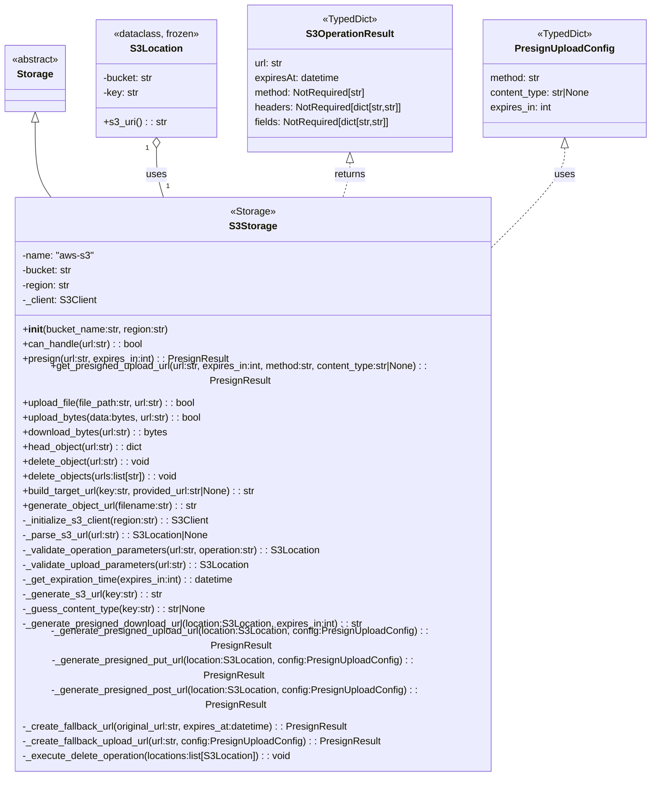

# Diagram: shared/core/src/core/storage/providers/aws/s3.py

> Auto-generated by Obscura crawlers

## Mermaid

### SVG

<svg id="container" width="1070.1953125" xmlns="http://www.w3.org/2000/svg" class="classDiagram" height="1170" viewBox="0 0 1070.1953125 1170" role="graphics-document document" aria-roledescription="class"><g><defs><marker id="container_class-aggregationStart" class="marker aggregation class" refX="18" refY="7" markerWidth="190" markerHeight="240" orient="auto"><path d="M 18,7 L9,13 L1,7 L9,1 Z"></path></marker></defs><defs><marker id="container_class-aggregationEnd" class="marker aggregation class" refX="1" refY="7" markerWidth="20" markerHeight="28" orient="auto"><path d="M 18,7 L9,13 L1,7 L9,1 Z"></path></marker></defs><defs><marker id="container_class-extensionStart" class="marker extension class" refX="18" refY="7" markerWidth="190" markerHeight="240" orient="auto"><path d="M 1,7 L18,13 V 1 Z"></path></marker></defs><defs><marker id="container_class-extensionEnd" class="marker extension class" refX="1" refY="7" markerWidth="20" markerHeight="28" orient="auto"><path d="M 1,1 V 13 L18,7 Z"></path></marker></defs><defs><marker id="container_class-compositionStart" class="marker composition class" refX="18" refY="7" markerWidth="190" markerHeight="240" orient="auto"><path d="M 18,7 L9,13 L1,7 L9,1 Z"></path></marker></defs><defs><marker id="container_class-compositionEnd" class="marker composition class" refX="1" refY="7" markerWidth="20" markerHeight="28" orient="auto"><path d="M 18,7 L9,13 L1,7 L9,1 Z"></path></marker></defs><defs><marker id="container_class-dependencyStart" class="marker dependency class" refX="6" refY="7" markerWidth="190" markerHeight="240" orient="auto"><path d="M 5,7 L9,13 L1,7 L9,1 Z"></path></marker></defs><defs><marker id="container_class-dependencyEnd" class="marker dependency class" refX="13" refY="7" markerWidth="20" markerHeight="28" orient="auto"><path d="M 18,7 L9,13 L14,7 L9,1 Z"></path></marker></defs><defs><marker id="container_class-lollipopStart" class="marker lollipop class" refX="13" refY="7" markerWidth="190" markerHeight="240" orient="auto"><circle stroke="black" fill="transparent" cx="7" cy="7" r="6"></circle></marker></defs><defs><marker id="container_class-lollipopEnd" class="marker lollipop class" refX="1" refY="7" markerWidth="190" markerHeight="240" orient="auto"><circle stroke="black" fill="transparent" cx="7" cy="7" r="6"></circle></marker></defs><g class="root"><g class="clusters"></g><g class="edgePaths"><path d="M58.609,199.25L58.609,213.542C58.609,227.833,58.609,256.417,63.426,276.875C68.242,297.333,77.876,309.667,82.692,315.833L87.509,322" id="id_Storage_S3Storage_1" class="edge-thickness-normal edge-pattern-solid relation" style=";;;" data-edge="true" data-et="edge" data-id="id_Storage_S3Storage_1" data-points="W3sieCI6NTguNjA5Mzc1LCJ5IjoxODJ9LHsieCI6NTguNjA5Mzc1LCJ5IjoyODV9LHsieCI6ODcuNTA4NjY3MjU5Mjk5NzgsInkiOjMyMn1d" marker-start="url(#container_class-extensionStart)"></path><path d="M256.754,241.25L256.754,248.542C256.754,255.833,256.754,270.417,258.897,283.875C261.04,297.333,265.325,309.667,267.468,315.833L269.611,322" id="id_S3Location_S3Storage_2" class="edge-thickness-normal edge-pattern-solid relation" style=";;;" data-edge="true" data-et="edge" data-id="id_S3Location_S3Storage_2" data-points="W3sieCI6MjU2Ljc1MzkwNjI1LCJ5IjoyMjR9LHsieCI6MjU2Ljc1MzkwNjI1LCJ5IjoyODV9LHsieCI6MjY5LjYxMDg2MjI4MTE4MTY1LCJ5IjozMjJ9XQ==" marker-start="url(#container_class-aggregationStart)"></path><path d="M574.355,265.25L574.355,268.542C574.355,271.833,574.355,278.417,572.213,287.875C570.07,297.333,565.784,309.667,563.641,315.833L561.499,322" id="id_S3OperationResult_S3Storage_3" class="edge-thickness-normal edge-pattern-dashed relation" style=";;;" data-edge="true" data-et="edge" data-id="id_S3OperationResult_S3Storage_3" data-points="W3sieCI6NTc0LjM1NTQ2ODc1LCJ5IjoyNDh9LHsieCI6NTc0LjM1NTQ2ODc1LCJ5IjoyODV9LHsieCI6NTYxLjQ5ODUxMjcxODgxODMsInkiOjMyMn1d" marker-start="url(#container_class-extensionStart)"></path><path d="M928.309,241.25L928.309,248.542C928.309,255.833,928.309,270.417,909.051,294.872C889.794,319.326,851.28,353.653,832.023,370.816L812.766,387.979" id="id_PresignUploadConfig_S3Storage_4" class="edge-thickness-normal edge-pattern-dashed relation" style=";;;" data-edge="true" data-et="edge" data-id="id_PresignUploadConfig_S3Storage_4" data-points="W3sieCI6OTI4LjMwODU5Mzc1LCJ5IjoyMjR9LHsieCI6OTI4LjMwODU5Mzc1LCJ5IjoyODV9LHsieCI6ODEyLjc2NTYyNSwieSI6Mzg3Ljk3OTQ5MTg2NzU5NjF9XQ==" marker-start="url(#container_class-extensionStart)"></path></g><g class="edgeLabels"><g class="edgeLabel"><g class="label" data-id="id_Storage_S3Storage_1" transform="translate(0, 0)"><foreignObject width="0" height="0">

</foreignObject></g></g><g class="edgeLabel" transform="translate(256.75390625, 285)"><g class="label" data-id="id_S3Location_S3Storage_2" transform="translate(-16.4921875, -12)"><foreignObject width="32.984375" height="24">

uses

</foreignObject></g></g><g class="edgeLabel" transform="translate(574.35546875, 285)"><g class="label" data-id="id_S3OperationResult_S3Storage_3" transform="translate(-26.265625, -12)"><foreignObject width="52.53125" height="24">

returns

</foreignObject></g></g><g class="edgeLabel" transform="translate(928.30859375, 285)"><g class="label" data-id="id_PresignUploadConfig_S3Storage_4" transform="translate(-16.4921875, -12)"><foreignObject width="32.984375" height="24">

uses

</foreignObject></g></g><g class="edgeTerminals" transform="translate(241.7539081250001, 241.50000160714288)"><g class="inner" transform="translate(0, 0)"><foreignObject style="width: 9px; height: 12px;">
1
</foreignObject></g></g><g class="edgeTerminals" transform="translate(273.03572535548335, 295.54605737018494)"><g class="inner" transform="translate(0, 0)"></g><foreignObject style="width: 9px; height: 12px;">
1
</foreignObject></g></g><g class="nodes"><g class="node default" id="classId-S3OperationResult-0" transform="translate(574.35546875, 128)"><g class="basic label-container"><path d="M-170.06640625 -120 L170.06640625 -120 L170.06640625 120 L-170.06640625 120" stroke="none" stroke-width="0" fill="#ECECFF" style=""></path><path d="M-170.06640625 -120 C-42.79048683653981 -120, 84.48543257692037 -120, 170.06640625 -120 M-170.06640625 -120 C-99.0952797782917 -120, -28.124153306583395 -120, 170.06640625 -120 M170.06640625 -120 C170.06640625 -36.60382037302476, 170.06640625 46.79235925395048, 170.06640625 120 M170.06640625 -120 C170.06640625 -54.940105843311585, 170.06640625 10.11978831337683, 170.06640625 120 M170.06640625 120 C56.693312446824635 120, -56.67978135635073 120, -170.06640625 120 M170.06640625 120 C39.938222548370106 120, -90.18996115325979 120, -170.06640625 120 M-170.06640625 120 C-170.06640625 25.315296142921994, -170.06640625 -69.36940771415601, -170.06640625 -120 M-170.06640625 120 C-170.06640625 58.40617688319444, -170.06640625 -3.187646233611119, -170.06640625 -120" stroke="#9370DB" stroke-width="1.3" fill="none" stroke-dasharray="0 0" style=""></path></g><g class="annotation-group text" transform="translate(-44.7421875, -96)"><g class="label" style="" transform="translate(0,-12)"><foreignObject width="89.484375" height="24">

«TypedDict»

</foreignObject></g></g><g class="label-group text" transform="translate(-68.5390625, -72)"><g class="label" style="font-weight: bolder" transform="translate(0,-12)"><foreignObject width="137.078125" height="24">

S3OperationResult

</foreignObject></g></g><g class="members-group text" transform="translate(-158.06640625, -24)"><g class="label" style="" transform="translate(0,-12)"><foreignObject width="47.84375" height="24">

url: str

</foreignObject></g><g class="label" style="" transform="translate(0,12)"><foreignObject width="140.578125" height="24">

expiresAt: datetime

</foreignObject></g><g class="label" style="" transform="translate(0,36)"><foreignObject width="185.890625" height="24">

method: NotRequired[str]

</foreignObject></g><g class="label" style="" transform="translate(0,60)"><foreignObject width="247.59375" height="24">

headers: NotRequired[dict[str,str]]

</foreignObject></g><g class="label" style="" transform="translate(0,84)"><foreignObject width="228.828125" height="24">

fields: NotRequired[dict[str,str]]

</foreignObject></g></g><g class="methods-group text" transform="translate(-158.06640625, 120)"></g><g class="divider" style=""><path d="M-170.06640625 -48 C-100.05761703430514 -48, -30.048827818610278 -48, 170.06640625 -48 M-170.06640625 -48 C-50.831527578169016 -48, 68.40335109366197 -48, 170.06640625 -48" stroke="#9370DB" stroke-width="1.3" fill="none" stroke-dasharray="0 0" style=""></path></g><g class="divider" style=""><path d="M-170.06640625 96 C-101.49246725867663 96, -32.91852826735325 96, 170.06640625 96 M-170.06640625 96 C-74.91586489954865 96, 20.234676450902697 96, 170.06640625 96" stroke="#9370DB" stroke-width="1.3" fill="none" stroke-dasharray="0 0" style=""></path></g></g><g class="node default" id="classId-PresignUploadConfig-1" transform="translate(928.30859375, 128)"><g class="basic label-container"><path d="M-133.88671875 -96 L133.88671875 -96 L133.88671875 96 L-133.88671875 96" stroke="none" stroke-width="0" fill="#ECECFF" style=""></path><path d="M-133.88671875 -96 C-64.21277281865042 -96, 5.461173112699157 -96, 133.88671875 -96 M-133.88671875 -96 C-74.87546902783095 -96, -15.86421930566189 -96, 133.88671875 -96 M133.88671875 -96 C133.88671875 -50.70306851309136, 133.88671875 -5.406137026182719, 133.88671875 96 M133.88671875 -96 C133.88671875 -24.92357791384508, 133.88671875 46.15284417230984, 133.88671875 96 M133.88671875 96 C31.455644465961214 96, -70.97542981807757 96, -133.88671875 96 M133.88671875 96 C79.50441171084671 96, 25.122104671693407 96, -133.88671875 96 M-133.88671875 96 C-133.88671875 37.47001504536513, -133.88671875 -21.05996990926974, -133.88671875 -96 M-133.88671875 96 C-133.88671875 30.72664268692924, -133.88671875 -34.54671462614152, -133.88671875 -96" stroke="#9370DB" stroke-width="1.3" fill="none" stroke-dasharray="0 0" style=""></path></g><g class="annotation-group text" transform="translate(-44.7421875, -72)"><g class="label" style="" transform="translate(0,-12)"><foreignObject width="89.484375" height="24">

«TypedDict»

</foreignObject></g></g><g class="label-group text" transform="translate(-76.1953125, -48)"><g class="label" style="font-weight: bolder" transform="translate(0,-12)"><foreignObject width="152.390625" height="24">

PresignUploadConfig

</foreignObject></g></g><g class="members-group text" transform="translate(-121.88671875, 0)"><g class="label" style="" transform="translate(0,-12)"><foreignObject width="84.015625" height="24">

method: str

</foreignObject></g><g class="label" style="" transform="translate(0,12)"><foreignObject width="167.578125" height="24">

content_type: str|None

</foreignObject></g><g class="label" style="" transform="translate(0,36)"><foreignObject width="101.875" height="24">

expires_in: int

</foreignObject></g></g><g class="methods-group text" transform="translate(-121.88671875, 96)"></g><g class="divider" style=""><path d="M-133.88671875 -24 C-72.42843708739146 -24, -10.970155424782916 -24, 133.88671875 -24 M-133.88671875 -24 C-74.00325380378654 -24, -14.11978885757307 -24, 133.88671875 -24" stroke="#9370DB" stroke-width="1.3" fill="none" stroke-dasharray="0 0" style=""></path></g><g class="divider" style=""><path d="M-133.88671875 72 C-36.38583759623323 72, 61.11504355753354 72, 133.88671875 72 M-133.88671875 72 C-44.18768303538597 72, 45.511352679228054 72, 133.88671875 72" stroke="#9370DB" stroke-width="1.3" fill="none" stroke-dasharray="0 0" style=""></path></g></g><g class="node default" id="classId-S3Location-2" transform="translate(256.75390625, 128)"><g class="basic label-container"><path d="M-97.53515625 -96 L97.53515625 -96 L97.53515625 96 L-97.53515625 96" stroke="none" stroke-width="0" fill="#ECECFF" style=""></path><path d="M-97.53515625 -96 C-28.268630177686987 -96, 40.997895894626026 -96, 97.53515625 -96 M-97.53515625 -96 C-37.10801175216809 -96, 23.319132745663822 -96, 97.53515625 -96 M97.53515625 -96 C97.53515625 -55.0474890186318, 97.53515625 -14.094978037263601, 97.53515625 96 M97.53515625 -96 C97.53515625 -49.30773057096978, 97.53515625 -2.615461141939562, 97.53515625 96 M97.53515625 96 C26.338673442985254 96, -44.85780936402949 96, -97.53515625 96 M97.53515625 96 C30.762779055720216 96, -36.00959813855957 96, -97.53515625 96 M-97.53515625 96 C-97.53515625 32.85005789486883, -97.53515625 -30.299884210262334, -97.53515625 -96 M-97.53515625 96 C-97.53515625 55.34714103040986, -97.53515625 14.694282060819717, -97.53515625 -96" stroke="#9370DB" stroke-width="1.3" fill="none" stroke-dasharray="0 0" style=""></path></g><g class="annotation-group text" transform="translate(-69.7578125, -72)"><g class="label" style="" transform="translate(0,-12)"><foreignObject width="139.515625" height="24">

«dataclass, frozen»

</foreignObject></g></g><g class="label-group text" transform="translate(-40.0859375, -48)"><g class="label" style="font-weight: bolder" transform="translate(0,-12)"><foreignObject width="80.171875" height="24">

S3Location

</foreignObject></g></g><g class="members-group text" transform="translate(-85.53515625, 0)"><g class="label" style="" transform="translate(0,-12)"><foreignObject width="83.03125" height="24">

-bucket: str

</foreignObject></g><g class="label" style="" transform="translate(0,12)"><foreignObject width="58.59375" height="24">

-key: str

</foreignObject></g></g><g class="methods-group text" transform="translate(-85.53515625, 72)"><g class="label" style="" transform="translate(0,-12)"><foreignObject width="101.3125" height="24">

+s3_uri() : : str

</foreignObject></g></g><g class="divider" style=""><path d="M-97.53515625 -24 C-37.33147803896175 -24, 22.872200172076504 -24, 97.53515625 -24 M-97.53515625 -24 C-50.61520874795726 -24, -3.695261245914523 -24, 97.53515625 -24" stroke="#9370DB" stroke-width="1.3" fill="none" stroke-dasharray="0 0" style=""></path></g><g class="divider" style=""><path d="M-97.53515625 48 C-31.89632888214183 48, 33.74249848571634 48, 97.53515625 48 M-97.53515625 48 C-20.772261463418758 48, 55.990633323162484 48, 97.53515625 48" stroke="#9370DB" stroke-width="1.3" fill="none" stroke-dasharray="0 0" style=""></path></g></g><g class="node default" id="classId-Storage-3" transform="translate(58.609375, 128)"><g class="basic label-container"><path d="M-50.609375 -54 L50.609375 -54 L50.609375 54 L-50.609375 54" stroke="none" stroke-width="0" fill="#ECECFF" style=""></path><path d="M-50.609375 -54 C-21.606190383479614 -54, 7.396994233040772 -54, 50.609375 -54 M-50.609375 -54 C-19.2533056371682 -54, 12.1027637256636 -54, 50.609375 -54 M50.609375 -54 C50.609375 -16.106134689670434, 50.609375 21.787730620659133, 50.609375 54 M50.609375 -54 C50.609375 -19.309445180821875, 50.609375 15.38110963835625, 50.609375 54 M50.609375 54 C22.335477793857063 54, -5.938419412285874 54, -50.609375 54 M50.609375 54 C27.74473564913062 54, 4.880096298261243 54, -50.609375 54 M-50.609375 54 C-50.609375 21.420950028721798, -50.609375 -11.158099942556404, -50.609375 -54 M-50.609375 54 C-50.609375 11.968833244757285, -50.609375 -30.06233351048543, -50.609375 -54" stroke="#9370DB" stroke-width="1.3" fill="none" stroke-dasharray="0 0" style=""></path></g><g class="annotation-group text" transform="translate(-38.609375, -30)"><g class="label" style="" transform="translate(0,-12)"><foreignObject width="77.21875" height="24">

«abstract»

</foreignObject></g></g><g class="label-group text" transform="translate(-28.078125, -6)"><g class="label" style="font-weight: bolder" transform="translate(0,-12)"><foreignObject width="56.15625" height="24">

Storage

</foreignObject></g></g><g class="members-group text" transform="translate(-38.609375, 42)"></g><g class="methods-group text" transform="translate(-38.609375, 72)"></g><g class="divider" style=""><path d="M-50.609375 18 C-30.291619275775865 18, -9.97386355155173 18, 50.609375 18 M-50.609375 18 C-21.66768637261603 18, 7.274002254767943 18, 50.609375 18" stroke="#9370DB" stroke-width="1.3" fill="none" stroke-dasharray="0 0" style=""></path></g><g class="divider" style=""><path d="M-50.609375 36 C-20.693223852187863 36, 9.222927295624274 36, 50.609375 36 M-50.609375 36 C-12.599662674704064 36, 25.410049650591873 36, 50.609375 36" stroke="#9370DB" stroke-width="1.3" fill="none" stroke-dasharray="0 0" style=""></path></g></g><g class="node default" id="classId-S3Storage-4" transform="translate(415.5546875, 742)"><g class="basic label-container"><path d="M-397.2109375 -420 L397.2109375 -420 L397.2109375 420 L-397.2109375 420" stroke="none" stroke-width="0" fill="#ECECFF" style=""></path><path d="M-397.2109375 -420 C-175.9824793163528 -420, 45.24597886729441 -420, 397.2109375 -420 M-397.2109375 -420 C-148.86663782107712 -420, 99.47766185784576 -420, 397.2109375 -420 M397.2109375 -420 C397.2109375 -235.23429324947196, 397.2109375 -50.46858649894392, 397.2109375 420 M397.2109375 -420 C397.2109375 -126.17901322549551, 397.2109375 167.64197354900898, 397.2109375 420 M397.2109375 420 C229.2839866376492 420, 61.357035775298414 420, -397.2109375 420 M397.2109375 420 C212.62178899628898 420, 28.03264049257797 420, -397.2109375 420 M-397.2109375 420 C-397.2109375 204.89884733078316, -397.2109375 -10.202305338433689, -397.2109375 -420 M-397.2109375 420 C-397.2109375 92.3328844090197, -397.2109375 -235.3342311819606, -397.2109375 -420" stroke="#9370DB" stroke-width="1.3" fill="none" stroke-dasharray="0 0" style=""></path></g><g class="annotation-group text" transform="translate(-36.2421875, -396)"><g class="label" style="" transform="translate(0,-12)"><foreignObject width="72.484375" height="24">

«Storage»

</foreignObject></g></g><g class="label-group text" transform="translate(-36.8125, -372)"><g class="label" style="font-weight: bolder" transform="translate(0,-12)"><foreignObject width="73.625" height="24">

S3Storage

</foreignObject></g></g><g class="members-group text" transform="translate(-385.2109375, -324)"><g class="label" style="" transform="translate(0,-12)"><foreignObject width="116.890625" height="24">

-name: "aws-s3"

</foreignObject></g><g class="label" style="" transform="translate(0,12)"><foreignObject width="83.03125" height="24">

-bucket: str

</foreignObject></g><g class="label" style="" transform="translate(0,36)"><foreignObject width="79.921875" height="24">

-region: str

</foreignObject></g><g class="label" style="" transform="translate(0,60)"><foreignObject width="120.609375" height="24">

-_client: S3Client

</foreignObject></g></g><g class="methods-group text" transform="translate(-385.2109375, -204)"><g class="label" style="" transform="translate(0,-12)"><foreignObject width="240.25" height="24">

+<strong>init</strong>(bucket_name:str, region:str)

</foreignObject></g><g class="label" style="" transform="translate(0,12)"><foreignObject width="199.640625" height="24">

+can_handle(url:str) : : bool

</foreignObject></g><g class="label" style="" transform="translate(0,36)"><foreignObject width="339.03125" height="24">

+presign(url:str, expires_in:int) : : PresignResult

</foreignObject></g><g class="label" style="" transform="translate(0,60)"><foreignObject width="733.609375" height="24">

+get_presigned_upload_url(url:str, expires_in:int, method:str, content_type:str|None) : : PresignResult

</foreignObject></g><g class="label" style="" transform="translate(0,84)"><foreignObject width="290.765625" height="24">

+upload_file(file_path:str, url:str) : : bool

</foreignObject></g><g class="label" style="" transform="translate(0,108)"><foreignObject width="297.234375" height="24">

+upload_bytes(data:bytes, url:str) : : bool

</foreignObject></g><g class="label" style="" transform="translate(0,132)"><foreignObject width="240.75" height="24">

+download_bytes(url:str) : : bytes

</foreignObject></g><g class="label" style="" transform="translate(0,156)"><foreignObject width="199.703125" height="24">

+head_object(url:str) : : dict

</foreignObject></g><g class="label" style="" transform="translate(0,180)"><foreignObject width="212.78125" height="24">

+delete_object(url:str) : : void

</foreignObject></g><g class="label" style="" transform="translate(0,204)"><foreignObject width="260.15625" height="24">

+delete_objects(urls:list[str]) : : void

</foreignObject></g><g class="label" style="" transform="translate(0,228)"><foreignObject width="390.890625" height="24">

+build_target_url(key:str, provided_url:str|None) : : str

</foreignObject></g><g class="label" style="" transform="translate(0,252)"><foreignObject width="289.4375" height="24">

+generate_object_url(filename:str) : : str

</foreignObject></g><g class="label" style="" transform="translate(0,276)"><foreignObject width="306.125" height="24">

-_initialize_s3_client(region:str) : : S3Client

</foreignObject></g><g class="label" style="" transform="translate(0,300)"><foreignObject width="303.140625" height="24">

-_parse_s3_url(url:str) : : S3Location|None

</foreignObject></g><g class="label" style="" transform="translate(0,324)"><foreignObject width="494.734375" height="24">

-_validate_operation_parameters(url:str, operation:str) : : S3Location

</foreignObject></g><g class="label" style="" transform="translate(0,348)"><foreignObject width="373.59375" height="24">

-_validate_upload_parameters(url:str) : : S3Location

</foreignObject></g><g class="label" style="" transform="translate(0,372)"><foreignObject width="352.25" height="24">

-_get_expiration_time(expires_in:int) : : datetime

</foreignObject></g><g class="label" style="" transform="translate(0,396)"><foreignObject width="226.671875" height="24">

-_generate_s3_url(key:str) : : str

</foreignObject></g><g class="label" style="" transform="translate(0,420)"><foreignObject width="300.609375" height="24">

-_guess_content_type(key:str) : : str|None

</foreignObject></g><g class="label" style="" transform="translate(0,444)"><foreignObject width="562.703125" height="24">

-_generate_presigned_download_url(location:S3Location, expires_in:int) : : str

</foreignObject></g><g class="label" style="" transform="translate(0,468)"><foreignObject width="720.703125" height="24">

-_generate_presigned_upload_url(location:S3Location, config:PresignUploadConfig) : : PresignResult

</foreignObject></g><g class="label" style="" transform="translate(0,492)"><foreignObject width="694.734375" height="24">

-_generate_presigned_put_url(location:S3Location, config:PresignUploadConfig) : : PresignResult

</foreignObject></g><g class="label" style="" transform="translate(0,516)"><foreignObject width="702.234375" height="24">

-_generate_presigned_post_url(location:S3Location, config:PresignUploadConfig) : : PresignResult

</foreignObject></g><g class="label" style="" transform="translate(0,540)"><foreignObject width="537.546875" height="24">

-_create_fallback_url(original_url:str, expires_at:datetime) : : PresignResult

</foreignObject></g><g class="label" style="" transform="translate(0,564)"><foreignObject width="586.921875" height="24">

-_create_fallback_upload_url(url:str, config:PresignUploadConfig) : : PresignResult

</foreignObject></g><g class="label" style="" transform="translate(0,588)"><foreignObject width="445.3125" height="24">

-_execute_delete_operation(locations:list[S3Location]) : : void

</foreignObject></g></g><g class="divider" style=""><path d="M-397.2109375 -348 C-109.85214397057678 -348, 177.50664955884645 -348, 397.2109375 -348 M-397.2109375 -348 C-121.3529066524485 -348, 154.505124195103 -348, 397.2109375 -348" stroke="#9370DB" stroke-width="1.3" fill="none" stroke-dasharray="0 0" style=""></path></g><g class="divider" style=""><path d="M-397.2109375 -228 C-193.42109923802562 -228, 10.368739023948763 -228, 397.2109375 -228 M-397.2109375 -228 C-99.49292958681798 -228, 198.22507832636404 -228, 397.2109375 -228" stroke="#9370DB" stroke-width="1.3" fill="none" stroke-dasharray="0 0" style=""></path></g></g></g></g></g></svg>
