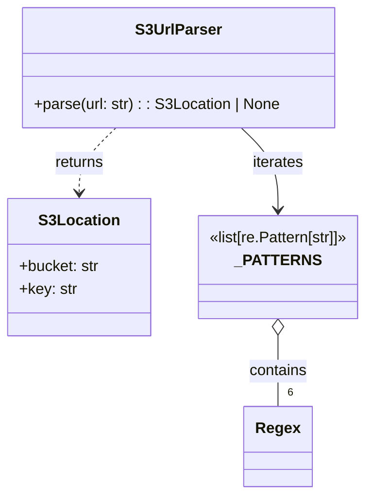

# Diagram: shared/core/src/core/storage/providers/aws/s3_url_parser.py


> Auto-generated by Obscura crawlers

## Diagram 1



### SVG

<svg id="container" width="390.1953125" xmlns="http://www.w3.org/2000/svg" class="classDiagram" height="518" viewBox="0 0 390.1953125 518" role="graphics-document document" aria-roledescription="class"><style>#container{font-family:"trebuchet ms",verdana,arial,sans-serif;font-size:16px;fill:#333;}@keyframes edge-animation-frame{from{stroke-dashoffset:0;}}@keyframes dash{to{stroke-dashoffset:0;}}#container .edge-animation-slow{stroke-dasharray:9,5!important;stroke-dashoffset:900;animation:dash 50s linear infinite;stroke-linecap:round;}#container .edge-animation-fast{stroke-dasharray:9,5!important;stroke-dashoffset:900;animation:dash 20s linear infinite;stroke-linecap:round;}#container .error-icon{fill:#552222;}#container .error-text{fill:#552222;stroke:#552222;}#container .edge-thickness-normal{stroke-width:1px;}#container .edge-thickness-thick{stroke-width:3.5px;}#container .edge-pattern-solid{stroke-dasharray:0;}#container .edge-thickness-invisible{stroke-width:0;fill:none;}#container .edge-pattern-dashed{stroke-dasharray:3;}#container .edge-pattern-dotted{stroke-dasharray:2;}#container .marker{fill:#333333;stroke:#333333;}#container .marker.cross{stroke:#333333;}#container svg{font-family:"trebuchet ms",verdana,arial,sans-serif;font-size:16px;}#container p{margin:0;}#container g.classGroup text{fill:#9370DB;stroke:none;font-family:"trebuchet ms",verdana,arial,sans-serif;font-size:10px;}#container g.classGroup text .title{font-weight:bolder;}#container .nodeLabel,#container .edgeLabel{color:#131300;}#container .edgeLabel .label rect{fill:#ECECFF;}#container .label text{fill:#131300;}#container .labelBkg{background:#ECECFF;}#container .edgeLabel .label span{background:#ECECFF;}#container .classTitle{font-weight:bolder;}#container .node rect,#container .node circle,#container .node ellipse,#container .node polygon,#container .node path{fill:#ECECFF;stroke:#9370DB;stroke-width:1px;}#container .divider{stroke:#9370DB;stroke-width:1;}#container g.clickable{cursor:pointer;}#container g.classGroup rect{fill:#ECECFF;stroke:#9370DB;}#container g.classGroup line{stroke:#9370DB;stroke-width:1;}#container .classLabel .box{stroke:none;stroke-width:0;fill:#ECECFF;opacity:0.5;}#container .classLabel .label{fill:#9370DB;font-size:10px;}#container .relation{stroke:#333333;stroke-width:1;fill:none;}#container .dashed-line{stroke-dasharray:3;}#container .dotted-line{stroke-dasharray:1 2;}#container #compositionStart,#container .composition{fill:#333333!important;stroke:#333333!important;stroke-width:1;}#container #compositionEnd,#container .composition{fill:#333333!important;stroke:#333333!important;stroke-width:1;}#container #dependencyStart,#container .dependency{fill:#333333!important;stroke:#333333!important;stroke-width:1;}#container #dependencyStart,#container .dependency{fill:#333333!important;stroke:#333333!important;stroke-width:1;}#container #extensionStart,#container .extension{fill:transparent!important;stroke:#333333!important;stroke-width:1;}#container #extensionEnd,#container .extension{fill:transparent!important;stroke:#333333!important;stroke-width:1;}#container #aggregationStart,#container .aggregation{fill:transparent!important;stroke:#333333!important;stroke-width:1;}#container #aggregationEnd,#container .aggregation{fill:transparent!important;stroke:#333333!important;stroke-width:1;}#container #lollipopStart,#container .lollipop{fill:#ECECFF!important;stroke:#333333!important;stroke-width:1;}#container #lollipopEnd,#container .lollipop{fill:#ECECFF!important;stroke:#333333!important;stroke-width:1;}#container .edgeTerminals{font-size:11px;line-height:initial;}#container .classTitleText{text-anchor:middle;font-size:18px;fill:#333;}#container .label-icon{display:inline-block;height:1em;overflow:visible;vertical-align:-0.125em;}#container .node .label-icon path{fill:currentColor;stroke:revert;stroke-width:revert;}#container :root{--mermaid-font-family:"trebuchet ms",verdana,arial,sans-serif;}</style><g><defs><marker id="container_class-aggregationStart" class="marker aggregation class" refX="18" refY="7" markerWidth="190" markerHeight="240" orient="auto"><path d="M 18,7 L9,13 L1,7 L9,1 Z"></path></marker></defs><defs><marker id="container_class-aggregationEnd" class="marker aggregation class" refX="1" refY="7" markerWidth="20" markerHeight="28" orient="auto"><path d="M 18,7 L9,13 L1,7 L9,1 Z"></path></marker></defs><defs><marker id="container_class-extensionStart" class="marker extension class" refX="18" refY="7" markerWidth="190" markerHeight="240" orient="auto"><path d="M 1,7 L18,13 V 1 Z"></path></marker></defs><defs><marker id="container_class-extensionEnd" class="marker extension class" refX="1" refY="7" markerWidth="20" markerHeight="28" orient="auto"><path d="M 1,1 V 13 L18,7 Z"></path></marker></defs><defs><marker id="container_class-compositionStart" class="marker composition class" refX="18" refY="7" markerWidth="190" markerHeight="240" orient="auto"><path d="M 18,7 L9,13 L1,7 L9,1 Z"></path></marker></defs><defs><marker id="container_class-compositionEnd" class="marker composition class" refX="1" refY="7" markerWidth="20" markerHeight="28" orient="auto"><path d="M 18,7 L9,13 L1,7 L9,1 Z"></path></marker></defs><defs><marker id="container_class-dependencyStart" class="marker dependency class" refX="6" refY="7" markerWidth="190" markerHeight="240" orient="auto"><path d="M 5,7 L9,13 L1,7 L9,1 Z"></path></marker></defs><defs><marker id="container_class-dependencyEnd" class="marker dependency class" refX="13" refY="7" markerWidth="20" markerHeight="28" orient="auto"><path d="M 18,7 L9,13 L14,7 L9,1 Z"></path></marker></defs><defs><marker id="container_class-lollipopStart" class="marker lollipop class" refX="13" refY="7" markerWidth="190" markerHeight="240" orient="auto"><circle stroke="black" fill="transparent" cx="7" cy="7" r="6"></circle></marker></defs><defs><marker id="container_class-lollipopEnd" class="marker lollipop class" refX="1" refY="7" markerWidth="190" markerHeight="240" orient="auto"><circle stroke="black" fill="transparent" cx="7" cy="7" r="6"></circle></marker></defs><g class="root"><g class="clusters"></g><g class="edgePaths"><path d="M255.184,134L261.723,140.167C268.263,146.333,281.343,158.667,287.882,173C294.422,187.333,294.422,203.667,294.422,211.833L294.422,220" id="id_S3UrlParser__PATTERNS_1" class="edge-thickness-normal edge-pattern-solid relation" style=";;;" data-edge="true" data-et="edge" data-id="id_S3UrlParser__PATTERNS_1" data-points="W3sieCI6MjU1LjE4MzgwODU5Mzc1LCJ5IjoxMzR9LHsieCI6Mjk0LjQyMTg3NSwieSI6MTcxfSx7IngiOjI5NC40MjE4NzUsInkiOjIyNn1d" marker-end="url(#container_class-dependencyEnd)"></path><path d="M121.562,134L115.023,140.167C108.483,146.333,95.404,158.667,88.864,170C82.324,181.333,82.324,191.667,82.324,196.833L82.324,202" id="id_S3UrlParser_S3Location_2" class="edge-thickness-normal edge-pattern-dashed relation" style=";;;" data-edge="true" data-et="edge" data-id="id_S3UrlParser_S3Location_2" data-points="W3sieCI6MTIxLjU2MjI4NTE1NjI1LCJ5IjoxMzR9LHsieCI6ODIuMzI0MjE4NzUsInkiOjE3MX0seyJ4Ijo4Mi4zMjQyMTg3NSwieSI6MjA4fV0=" marker-end="url(#container_class-dependencyEnd)"></path><path d="M294.422,351.25L294.422,357.542C294.422,363.833,294.422,376.417,294.422,388.875C294.422,401.333,294.422,413.667,294.422,419.833L294.422,426" id="id__PATTERNS_Regex_3" class="edge-thickness-normal edge-pattern-solid relation" style=";;;" data-edge="true" data-et="edge" data-id="id__PATTERNS_Regex_3" data-points="W3sieCI6Mjk0LjQyMTg3NSwieSI6MzM0fSx7IngiOjI5NC40MjE4NzUsInkiOjM4OX0seyJ4IjoyOTQuNDIxODc1LCJ5Ijo0MjZ9XQ==" marker-start="url(#container_class-aggregationStart)"></path></g><g class="edgeLabels"><g class="edgeLabel" transform="translate(294.421875, 171)"><g class="label" data-id="id_S3UrlParser__PATTERNS_1" transform="translate(-27.4140625, -12)"><foreignObject width="54.828125" height="24"><div xmlns="http://www.w3.org/1999/xhtml" class="labelBkg" style="display: table-cell; white-space: nowrap; line-height: 1.5; max-width: 200px; text-align: center;"><span class="edgeLabel"><p>iterates</p></span></div></foreignObject></g></g><g class="edgeLabel" transform="translate(82.32421875, 171)"><g class="label" data-id="id_S3UrlParser_S3Location_2" transform="translate(-26.265625, -12)"><foreignObject width="52.53125" height="24"><div xmlns="http://www.w3.org/1999/xhtml" class="labelBkg" style="display: table-cell; white-space: nowrap; line-height: 1.5; max-width: 200px; text-align: center;"><span class="edgeLabel"><p>returns</p></span></div></foreignObject></g></g><g class="edgeLabel" transform="translate(294.421875, 389)"><g class="label" data-id="id__PATTERNS_Regex_3" transform="translate(-30.890625, -12)"><foreignObject width="61.78125" height="24"><div xmlns="http://www.w3.org/1999/xhtml" class="labelBkg" style="display: table-cell; white-space: nowrap; line-height: 1.5; max-width: 200px; text-align: center;"><span class="edgeLabel"><p>contains</p></span></div></foreignObject></g></g><g class="edgeTerminals" transform="translate(304.4218774999998, 403.5000021428571)"><g class="inner" transform="translate(0, 0)"></g><foreignObject style="width: 9px; height: 12px;"><div xmlns="http://www.w3.org/1999/xhtml" style="display: inline-block; padding-right: 1px; white-space: nowrap;"><span class="edgeLabel">6</span></div></foreignObject></g></g><g class="nodes"><g class="node default" id="classId-S3Location-0" transform="translate(82.32421875, 280)"><g class="basic label-container"><path d="M-74.32421875 -72 L74.32421875 -72 L74.32421875 72 L-74.32421875 72" stroke="none" stroke-width="0" fill="#ECECFF" style=""></path><path d="M-74.32421875 -72 C-32.204618623786416 -72, 9.914981502427167 -72, 74.32421875 -72 M-74.32421875 -72 C-25.49905359939116 -72, 23.32611155121768 -72, 74.32421875 -72 M74.32421875 -72 C74.32421875 -38.93471218241153, 74.32421875 -5.869424364823061, 74.32421875 72 M74.32421875 -72 C74.32421875 -16.199257213379894, 74.32421875 39.60148557324021, 74.32421875 72 M74.32421875 72 C18.027817932610652 72, -38.268582884778695 72, -74.32421875 72 M74.32421875 72 C24.86035587092107 72, -24.603507008157862 72, -74.32421875 72 M-74.32421875 72 C-74.32421875 41.38190647388667, -74.32421875 10.763812947773339, -74.32421875 -72 M-74.32421875 72 C-74.32421875 34.94778511184012, -74.32421875 -2.104429776319762, -74.32421875 -72" stroke="#9370DB" stroke-width="1.3" fill="none" stroke-dasharray="0 0" style=""></path></g><g class="annotation-group text" transform="translate(0, -48)"></g><g class="label-group text" transform="translate(-40.0859375, -48)"><g class="label" style="font-weight: bolder" transform="translate(0,-12)"><foreignObject width="80.171875" height="24"><div xmlns="http://www.w3.org/1999/xhtml" style="display: table-cell; white-space: nowrap; line-height: 1.5; max-width: 129px; text-align: center;"><span class="nodeLabel markdown-node-label" style=""><p>S3Location</p></span></div></foreignObject></g></g><g class="members-group text" transform="translate(-62.32421875, 0)"><g class="label" style="" transform="translate(0,-12)"><foreignObject width="84.5625" height="24"><div xmlns="http://www.w3.org/1999/xhtml" style="display: table-cell; white-space: nowrap; line-height: 1.5; max-width: 143px; text-align: center;"><span class="nodeLabel markdown-node-label" style=""><p>+bucket: str</p></span></div></foreignObject></g><g class="label" style="" transform="translate(0,12)"><foreignObject width="60.140625" height="24"><div xmlns="http://www.w3.org/1999/xhtml" style="display: table-cell; white-space: nowrap; line-height: 1.5; max-width: 118px; text-align: center;"><span class="nodeLabel markdown-node-label" style=""><p>+key: str</p></span></div></foreignObject></g></g><g class="methods-group text" transform="translate(-62.32421875, 72)"></g><g class="divider" style=""><path d="M-74.32421875 -24 C-20.708268734336286 -24, 32.90768128132743 -24, 74.32421875 -24 M-74.32421875 -24 C-32.12456784927806 -24, 10.075083051443883 -24, 74.32421875 -24" stroke="#9370DB" stroke-width="1.3" fill="none" stroke-dasharray="0 0" style=""></path></g><g class="divider" style=""><path d="M-74.32421875 48 C-33.84604559381197 48, 6.632127562376056 48, 74.32421875 48 M-74.32421875 48 C-35.753710146270535 48, 2.8167984574589298 48, 74.32421875 48" stroke="#9370DB" stroke-width="1.3" fill="none" stroke-dasharray="0 0" style=""></path></g></g><g class="node default" id="classId-S3UrlParser-1" transform="translate(188.373046875, 71)"><g class="basic label-container"><path d="M-162.89453125 -63 L162.89453125 -63 L162.89453125 63 L-162.89453125 63" stroke="none" stroke-width="0" fill="#ECECFF" style=""></path><path d="M-162.89453125 -63 C-71.18367874573288 -63, 20.527173758534246 -63, 162.89453125 -63 M-162.89453125 -63 C-56.18706261192335 -63, 50.520406026153296 -63, 162.89453125 -63 M162.89453125 -63 C162.89453125 -24.48562788831058, 162.89453125 14.028744223378837, 162.89453125 63 M162.89453125 -63 C162.89453125 -13.407228512317104, 162.89453125 36.18554297536579, 162.89453125 63 M162.89453125 63 C76.5512045743901 63, -9.792122101219803 63, -162.89453125 63 M162.89453125 63 C42.82551244288928 63, -77.24350636422145 63, -162.89453125 63 M-162.89453125 63 C-162.89453125 17.740870143616796, -162.89453125 -27.518259712766408, -162.89453125 -63 M-162.89453125 63 C-162.89453125 20.334836804230008, -162.89453125 -22.330326391539984, -162.89453125 -63" stroke="#9370DB" stroke-width="1.3" fill="none" stroke-dasharray="0 0" style=""></path></g><g class="annotation-group text" transform="translate(0, -39)"></g><g class="label-group text" transform="translate(-42.8984375, -39)"><g class="label" style="font-weight: bolder" transform="translate(0,-12)"><foreignObject width="85.796875" height="24"><div xmlns="http://www.w3.org/1999/xhtml" style="display: table-cell; white-space: nowrap; line-height: 1.5; max-width: 134px; text-align: center;"><span class="nodeLabel markdown-node-label" style=""><p>S3UrlParser</p></span></div></foreignObject></g></g><g class="members-group text" transform="translate(-150.89453125, 9)"></g><g class="methods-group text" transform="translate(-150.89453125, 39)"><g class="label" style="" transform="translate(0,-12)"><foreignObject width="258.890625" height="24"><div xmlns="http://www.w3.org/1999/xhtml" style="display: table-cell; white-space: nowrap; line-height: 1.5; max-width: 316px; text-align: center;"><span class="nodeLabel markdown-node-label" style=""><p>+parse(url: str) : : S3Location | None</p></span></div></foreignObject></g></g><g class="divider" style=""><path d="M-162.89453125 -15 C-42.31649313236778 -15, 78.26154498526444 -15, 162.89453125 -15 M-162.89453125 -15 C-56.35954802264638 -15, 50.17543520470724 -15, 162.89453125 -15" stroke="#9370DB" stroke-width="1.3" fill="none" stroke-dasharray="0 0" style=""></path></g><g class="divider" style=""><path d="M-162.89453125 9 C-86.2418353392249 9, -9.589139428449812 9, 162.89453125 9 M-162.89453125 9 C-43.85532204975637 9, 75.18388715048727 9, 162.89453125 9" stroke="#9370DB" stroke-width="1.3" fill="none" stroke-dasharray="0 0" style=""></path></g></g><g class="node default" id="classId-_PATTERNS-2" transform="translate(294.421875, 280)"><g class="basic label-container"><path d="M-87.7734375 -54 L87.7734375 -54 L87.7734375 54 L-87.7734375 54" stroke="none" stroke-width="0" fill="#ECECFF" style=""></path><path d="M-87.7734375 -54 C-30.972363564497357 -54, 25.828710371005286 -54, 87.7734375 -54 M-87.7734375 -54 C-49.184918791146245 -54, -10.59640008229249 -54, 87.7734375 -54 M87.7734375 -54 C87.7734375 -20.89887552634493, 87.7734375 12.202248947310139, 87.7734375 54 M87.7734375 -54 C87.7734375 -12.527817907202909, 87.7734375 28.944364185594182, 87.7734375 54 M87.7734375 54 C37.638805900846904 54, -12.495825698306191 54, -87.7734375 54 M87.7734375 54 C19.01830501831151 54, -49.73682746337698 54, -87.7734375 54 M-87.7734375 54 C-87.7734375 14.147220395740987, -87.7734375 -25.705559208518025, -87.7734375 -54 M-87.7734375 54 C-87.7734375 25.070090784488897, -87.7734375 -3.8598184310222052, -87.7734375 -54" stroke="#9370DB" stroke-width="1.3" fill="none" stroke-dasharray="0 0" style=""></path></g><g class="annotation-group text" transform="translate(-75.7734375, -30)"><g class="label" style="" transform="translate(0,-12)"><foreignObject width="151.546875" height="24"><div xmlns="http://www.w3.org/1999/xhtml" style="display: table-cell; white-space: nowrap; line-height: 1.5; max-width: 202px; text-align: center;"><span class="nodeLabel markdown-node-label" style=""><p>«list[re.Pattern[str]]»</p></span></div></foreignObject></g></g><g class="label-group text" transform="translate(-40.46875, -6)"><g class="label" style="font-weight: bolder" transform="translate(0,-12)"><foreignObject width="80.9375" height="24"><div xmlns="http://www.w3.org/1999/xhtml" style="display: table-cell; white-space: nowrap; line-height: 1.5; max-width: 130px; text-align: center;"><span class="nodeLabel markdown-node-label" style=""><p>_PATTERNS</p></span></div></foreignObject></g></g><g class="members-group text" transform="translate(-75.7734375, 42)"></g><g class="methods-group text" transform="translate(-75.7734375, 72)"></g><g class="divider" style=""><path d="M-87.7734375 18 C-29.31266746919468 18, 29.148102561610642 18, 87.7734375 18 M-87.7734375 18 C-24.32786126639423 18, 39.11771496721154 18, 87.7734375 18" stroke="#9370DB" stroke-width="1.3" fill="none" stroke-dasharray="0 0" style=""></path></g><g class="divider" style=""><path d="M-87.7734375 36 C-50.092651217742585 36, -12.41186493548517 36, 87.7734375 36 M-87.7734375 36 C-40.076662815068744 36, 7.620111869862512 36, 87.7734375 36" stroke="#9370DB" stroke-width="1.3" fill="none" stroke-dasharray="0 0" style=""></path></g></g><g class="node default" id="classId-Regex-3" transform="translate(294.421875, 468)"><g class="basic label-container"><path d="M-33.875 -42 L33.875 -42 L33.875 42 L-33.875 42" stroke="none" stroke-width="0" fill="#ECECFF" style=""></path><path d="M-33.875 -42 C-16.15047484984934 -42, 1.574050300301323 -42, 33.875 -42 M-33.875 -42 C-19.33468232032036 -42, -4.7943646406407225 -42, 33.875 -42 M33.875 -42 C33.875 -12.939541334356527, 33.875 16.120917331286947, 33.875 42 M33.875 -42 C33.875 -8.561313111880118, 33.875 24.877373776239764, 33.875 42 M33.875 42 C8.971940557179199 42, -15.931118885641602 42, -33.875 42 M33.875 42 C12.89639637509815 42, -8.082207249803702 42, -33.875 42 M-33.875 42 C-33.875 23.414096626544374, -33.875 4.828193253088749, -33.875 -42 M-33.875 42 C-33.875 9.71070433550603, -33.875 -22.57859132898794, -33.875 -42" stroke="#9370DB" stroke-width="1.3" fill="none" stroke-dasharray="0 0" style=""></path></g><g class="annotation-group text" transform="translate(0, -18)"></g><g class="label-group text" transform="translate(-21.875, -18)"><g class="label" style="font-weight: bolder" transform="translate(0,-12)"><foreignObject width="43.75" height="24"><div xmlns="http://www.w3.org/1999/xhtml" style="display: table-cell; white-space: nowrap; line-height: 1.5; max-width: 93px; text-align: center;"><span class="nodeLabel markdown-node-label" style=""><p>Regex</p></span></div></foreignObject></g></g><g class="members-group text" transform="translate(-21.875, 30)"></g><g class="methods-group text" transform="translate(-21.875, 60)"></g><g class="divider" style=""><path d="M-33.875 6 C-9.142417727018547 6, 15.590164545962907 6, 33.875 6 M-33.875 6 C-7.285116612965044 6, 19.30476677406991 6, 33.875 6" stroke="#9370DB" stroke-width="1.3" fill="none" stroke-dasharray="0 0" style=""></path></g><g class="divider" style=""><path d="M-33.875 24 C-10.527366105839398 24, 12.820267788321203 24, 33.875 24 M-33.875 24 C-9.788196932105073 24, 14.298606135789854 24, 33.875 24" stroke="#9370DB" stroke-width="1.3" fill="none" stroke-dasharray="0 0" style=""></path></g></g></g></g></g></svg>

## Diagram 2

```mermaid
flowchart TD
    Start([Start]) --> ForEach{For each pattern in _PATTERNS}
    ForEach --> Match[Apply pattern.match(url)]
    Match -->|matched| Extract[Extract bucket and key from match groups]
    Extract --> HasGroups{bucket and key present?}
    HasGroups -->|yes| ReturnLoc[Return S3Location(bucket, key)]
    HasGroups -->|no| Continue[Continue to next pattern]
    Match -->|no match| Continue
    Continue --> ForEach
    ForEach -->|no patterns left| ReturnNone[Return None]
    ReturnLoc --> End([End])
    ReturnNone --> End
```

> SVG rendering failed for this diagram.
