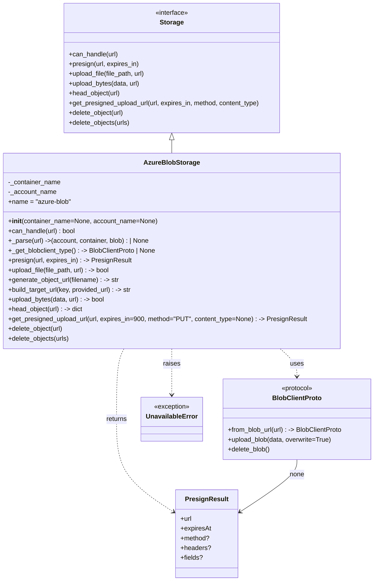

# Diagram: shared/core/src/core/storage/providers/azure/azure.py

> Auto-generated by Obscura crawlers

## Mermaid

### SVG

<svg id="container" width="919.91015625" xmlns="http://www.w3.org/2000/svg" class="classDiagram" height="1426" viewBox="0 0 919.91015625 1426" role="graphics-document document" aria-roledescription="class"><g><defs><marker id="container_class-aggregationStart" class="marker aggregation class" refX="18" refY="7" markerWidth="190" markerHeight="240" orient="auto"><path d="M 18,7 L9,13 L1,7 L9,1 Z"></path></marker></defs><defs><marker id="container_class-aggregationEnd" class="marker aggregation class" refX="1" refY="7" markerWidth="20" markerHeight="28" orient="auto"><path d="M 18,7 L9,13 L1,7 L9,1 Z"></path></marker></defs><defs><marker id="container_class-extensionStart" class="marker extension class" refX="18" refY="7" markerWidth="190" markerHeight="240" orient="auto"><path d="M 1,7 L18,13 V 1 Z"></path></marker></defs><defs><marker id="container_class-extensionEnd" class="marker extension class" refX="1" refY="7" markerWidth="20" markerHeight="28" orient="auto"><path d="M 1,1 V 13 L18,7 Z"></path></marker></defs><defs><marker id="container_class-compositionStart" class="marker composition class" refX="18" refY="7" markerWidth="190" markerHeight="240" orient="auto"><path d="M 18,7 L9,13 L1,7 L9,1 Z"></path></marker></defs><defs><marker id="container_class-compositionEnd" class="marker composition class" refX="1" refY="7" markerWidth="20" markerHeight="28" orient="auto"><path d="M 18,7 L9,13 L1,7 L9,1 Z"></path></marker></defs><defs><marker id="container_class-dependencyStart" class="marker dependency class" refX="6" refY="7" markerWidth="190" markerHeight="240" orient="auto"><path d="M 5,7 L9,13 L1,7 L9,1 Z"></path></marker></defs><defs><marker id="container_class-dependencyEnd" class="marker dependency class" refX="13" refY="7" markerWidth="20" markerHeight="28" orient="auto"><path d="M 18,7 L9,13 L14,7 L9,1 Z"></path></marker></defs><defs><marker id="container_class-lollipopStart" class="marker lollipop class" refX="13" refY="7" markerWidth="190" markerHeight="240" orient="auto"><circle stroke="black" fill="transparent" cx="7" cy="7" r="6"></circle></marker></defs><defs><marker id="container_class-lollipopEnd" class="marker lollipop class" refX="1" refY="7" markerWidth="190" markerHeight="240" orient="auto"><circle stroke="black" fill="transparent" cx="7" cy="7" r="6"></circle></marker></defs><g class="root"><g class="clusters"></g><g class="edgePaths"><path d="M420.426,343.25L420.426,344.542C420.426,345.833,420.426,348.417,420.426,353.875C420.426,359.333,420.426,367.667,420.426,371.833L420.426,376" id="id_Storage_AzureBlobStorage_1" class="edge-thickness-normal edge-pattern-solid relation" style=";;;" data-edge="true" data-et="edge" data-id="id_Storage_AzureBlobStorage_1" data-points="W3sieCI6NDIwLjQyNTc4MTI1LCJ5IjozMjZ9LHsieCI6NDIwLjQyNTc4MTI1LCJ5IjozNTF9LHsieCI6NDIwLjQyNTc4MTI1LCJ5IjozNzZ9XQ==" marker-start="url(#container_class-extensionStart)"></path><path d="M686.669,856L693.51,862.167C700.351,868.333,714.033,880.667,720.874,892C727.715,903.333,727.715,913.667,727.715,918.833L727.715,924" id="id_AzureBlobStorage_BlobClientProto_2" class="edge-thickness-normal edge-pattern-dashed relation" style=";;;" data-edge="true" data-et="edge" data-id="id_AzureBlobStorage_BlobClientProto_2" data-points="W3sieCI6Njg2LjY2OTAxMjI5NjkzMTQsInkiOjg1Nn0seyJ4Ijo3MjcuNzE0ODQzNzUsInkiOjg5M30seyJ4Ijo3MjcuNzE0ODQzNzUsInkiOjkzMH1d" marker-end="url(#container_class-dependencyEnd)"></path><path d="M304.013,856L301.022,862.167C298.031,868.333,292.049,880.667,289.058,909.5C286.066,938.333,286.066,983.667,286.066,1029C286.066,1074.333,286.066,1119.667,309.578,1157.772C333.09,1195.877,380.113,1226.754,403.625,1242.193L427.137,1257.631" id="id_AzureBlobStorage_PresignResult_3" class="edge-thickness-normal edge-pattern-dashed relation" style=";;;" data-edge="true" data-et="edge" data-id="id_AzureBlobStorage_PresignResult_3" data-points="W3sieCI6MzA0LjAxMzMyNjM3NjM1MzgsInkiOjg1Nn0seyJ4IjoyODYuMDY2NDA2MjUsInkiOjg5M30seyJ4IjoyODYuMDY2NDA2MjUsInkiOjEwMjl9LHsieCI6Mjg2LjA2NjQwNjI1LCJ5IjoxMTY1fSx7IngiOjQzMi4xNTIzNDM3NSwieSI6MTI2MC45MjQ1MzY5Nzk3MTAyfV0=" marker-end="url(#container_class-dependencyEnd)"></path><path d="M420.426,856L420.426,862.167C420.426,868.333,420.426,880.667,420.426,899.5C420.426,918.333,420.426,943.667,420.426,956.333L420.426,969" id="id_AzureBlobStorage_UnavailableError_4" class="edge-thickness-normal edge-pattern-dashed relation" style=";;;" data-edge="true" data-et="edge" data-id="id_AzureBlobStorage_UnavailableError_4" data-points="W3sieCI6NDIwLjQyNTc4MTI1LCJ5Ijo4NTZ9LHsieCI6NDIwLjQyNTc4MTI1LCJ5Ijo4OTN9LHsieCI6NDIwLjQyNTc4MTI1LCJ5Ijo5NzV9XQ==" marker-end="url(#container_class-dependencyEnd)"></path><path d="M727.715,1128L727.715,1134.167C727.715,1140.333,727.715,1152.667,704.203,1174.272C680.691,1195.877,633.668,1226.754,610.156,1242.193L586.644,1257.631" id="id_BlobClientProto_PresignResult_5" class="edge-thickness-normal edge-pattern-solid relation" style=";;;" data-edge="true" data-et="edge" data-id="id_BlobClientProto_PresignResult_5" data-points="W3sieCI6NzI3LjcxNDg0Mzc1LCJ5IjoxMTI4fSx7IngiOjcyNy43MTQ4NDM3NSwieSI6MTE2NX0seyJ4Ijo1ODEuNjI4OTA2MjUsInkiOjEyNjAuOTI0NTM2OTc5NzEwMn1d" marker-end="url(#container_class-dependencyEnd)"></path></g><g class="edgeLabels"><g class="edgeLabel"><g class="label" data-id="id_Storage_AzureBlobStorage_1" transform="translate(0, 0)"><foreignObject width="0" height="0">

</foreignObject></g></g><g class="edgeLabel" transform="translate(727.71484375, 893)"><g class="label" data-id="id_AzureBlobStorage_BlobClientProto_2" transform="translate(-16.4921875, -12)"><foreignObject width="32.984375" height="24">

uses

</foreignObject></g></g><g class="edgeLabel" transform="translate(286.06640625, 1029)"><g class="label" data-id="id_AzureBlobStorage_PresignResult_3" transform="translate(-26.265625, -12)"><foreignObject width="52.53125" height="24">

returns

</foreignObject></g></g><g class="edgeLabel" transform="translate(420.42578125, 893)"><g class="label" data-id="id_AzureBlobStorage_UnavailableError_4" transform="translate(-21.25, -12)"><foreignObject width="42.5" height="24">

raises

</foreignObject></g></g><g class="edgeLabel" transform="translate(727.71484375, 1165)"><g class="label" data-id="id_BlobClientProto_PresignResult_5" transform="translate(-18.4140625, -12)"><foreignObject width="36.828125" height="24">

none

</foreignObject></g></g></g><g class="nodes"><g class="node default" id="classId-Storage-0" transform="translate(420.42578125, 167)"><g class="basic label-container"><path d="M-271.7734375 -159 L271.7734375 -159 L271.7734375 159 L-271.7734375 159" stroke="none" stroke-width="0" fill="#ECECFF" style=""></path><path d="M-271.7734375 -159 C-122.52709953996589 -159, 26.719238420068223 -159, 271.7734375 -159 M-271.7734375 -159 C-161.79800633719503 -159, -51.82257517439007 -159, 271.7734375 -159 M271.7734375 -159 C271.7734375 -93.71777236581455, 271.7734375 -28.435544731629108, 271.7734375 159 M271.7734375 -159 C271.7734375 -61.193382307445944, 271.7734375 36.61323538510811, 271.7734375 159 M271.7734375 159 C70.11208353655914 159, -131.54927042688172 159, -271.7734375 159 M271.7734375 159 C72.80563841579504 159, -126.16216066840991 159, -271.7734375 159 M-271.7734375 159 C-271.7734375 62.099041991035165, -271.7734375 -34.80191601792967, -271.7734375 -159 M-271.7734375 159 C-271.7734375 37.125666191392824, -271.7734375 -84.74866761721435, -271.7734375 -159" stroke="#9370DB" stroke-width="1.3" fill="none" stroke-dasharray="0 0" style=""></path></g><g class="annotation-group text" transform="translate(-41.015625, -135)"><g class="label" style="" transform="translate(0,-12)"><foreignObject width="82.03125" height="24">

«interface»

</foreignObject></g></g><g class="label-group text" transform="translate(-28.078125, -111)"><g class="label" style="font-weight: bolder" transform="translate(0,-12)"><foreignObject width="56.15625" height="24">

Storage

</foreignObject></g></g><g class="members-group text" transform="translate(-259.7734375, -63)"></g><g class="methods-group text" transform="translate(-259.7734375, -33)"><g class="label" style="" transform="translate(0,-12)"><foreignObject width="122.78125" height="24">

+can_handle(url)

</foreignObject></g><g class="label" style="" transform="translate(0,12)"><foreignObject width="174.40625" height="24">

+presign(url, expires_in)

</foreignObject></g><g class="label" style="" transform="translate(0,36)"><foreignObject width="191.75" height="24">

+upload_file(file_path, url)

</foreignObject></g><g class="label" style="" transform="translate(0,60)"><foreignObject width="177.5" height="24">

+upload_bytes(data, url)

</foreignObject></g><g class="label" style="" transform="translate(0,84)"><foreignObject width="128.21875" height="24">

+head_object(url)

</foreignObject></g><g class="label" style="" transform="translate(0,108)"><foreignObject width="478.53125" height="24">

+get_presigned_upload_url(url, expires_in, method, content_type)

</foreignObject></g><g class="label" style="" transform="translate(0,132)"><foreignObject width="137.5625" height="24">

+delete_object(url)

</foreignObject></g><g class="label" style="" transform="translate(0,156)"><foreignObject width="152.5" height="24">

+delete_objects(urls)

</foreignObject></g></g><g class="divider" style=""><path d="M-271.7734375 -87 C-146.19730299970433 -87, -20.621168499408697 -87, 271.7734375 -87 M-271.7734375 -87 C-67.68788226479614 -87, 136.3976729704077 -87, 271.7734375 -87" stroke="#9370DB" stroke-width="1.3" fill="none" stroke-dasharray="0 0" style=""></path></g><g class="divider" style=""><path d="M-271.7734375 -63 C-129.82086482555115 -63, 12.13170784889769 -63, 271.7734375 -63 M-271.7734375 -63 C-140.12018331249487 -63, -8.466929124989747 -63, 271.7734375 -63" stroke="#9370DB" stroke-width="1.3" fill="none" stroke-dasharray="0 0" style=""></path></g></g><g class="node default" id="classId-AzureBlobStorage-1" transform="translate(420.42578125, 616)"><g class="basic label-container"><path d="M-412.42578125 -240 L412.42578125 -240 L412.42578125 240 L-412.42578125 240" stroke="none" stroke-width="0" fill="#ECECFF" style=""></path><path d="M-412.42578125 -240 C-110.72201617461508 -240, 190.98174890076984 -240, 412.42578125 -240 M-412.42578125 -240 C-96.63678300465511 -240, 219.15221524068977 -240, 412.42578125 -240 M412.42578125 -240 C412.42578125 -52.33817222359406, 412.42578125 135.32365555281189, 412.42578125 240 M412.42578125 -240 C412.42578125 -56.8633160238698, 412.42578125 126.2733679522604, 412.42578125 240 M412.42578125 240 C138.26592502585066 240, -135.89393119829867 240, -412.42578125 240 M412.42578125 240 C111.89766576600283 240, -188.63044971799434 240, -412.42578125 240 M-412.42578125 240 C-412.42578125 115.12330613848506, -412.42578125 -9.753387723029874, -412.42578125 -240 M-412.42578125 240 C-412.42578125 54.877787411604174, -412.42578125 -130.24442517679165, -412.42578125 -240" stroke="#9370DB" stroke-width="1.3" fill="none" stroke-dasharray="0 0" style=""></path></g><g class="annotation-group text" transform="translate(0, -216)"></g><g class="label-group text" transform="translate(-65.0703125, -216)"><g class="label" style="font-weight: bolder" transform="translate(0,-12)"><foreignObject width="130.140625" height="24">

AzureBlobStorage

</foreignObject></g></g><g class="members-group text" transform="translate(-400.42578125, -168)"><g class="label" style="" transform="translate(0,-12)"><foreignObject width="129.921875" height="24">

-_container_name

</foreignObject></g><g class="label" style="" transform="translate(0,12)"><foreignObject width="119.171875" height="24">

-_account_name

</foreignObject></g><g class="label" style="" transform="translate(0,36)"><foreignObject width="156.03125" height="24">

+name = "azure-blob"

</foreignObject></g></g><g class="methods-group text" transform="translate(-400.42578125, -72)"><g class="label" style="" transform="translate(0,-12)"><foreignObject width="366.203125" height="24">

+<strong>init</strong>(container_name=None, account_name=None)

</foreignObject></g><g class="label" style="" transform="translate(0,12)"><foreignObject width="167.96875" height="24">

+can_handle(url) : bool

</foreignObject></g><g class="label" style="" transform="translate(0,36)"><foreignObject width="350.453125" height="24">

+_parse(url) -&gt;(account, container, blob) : | None

</foreignObject></g><g class="label" style="" transform="translate(0,60)"><foreignObject width="368.15625" height="24">

+_get_blobclient_type() : -&gt; BlobClientProto | None

</foreignObject></g><g class="label" style="" transform="translate(0,84)"><foreignObject width="303.890625" height="24">

+presign(url, expires_in) : -&gt; PresignResult

</foreignObject></g><g class="label" style="" transform="translate(0,108)"><foreignObject width="255.640625" height="24">

+upload_file(file_path, url) : -&gt; bool

</foreignObject></g><g class="label" style="" transform="translate(0,132)"><foreignObject width="276.609375" height="24">

+generate_object_url(filename) : -&gt; str

</foreignObject></g><g class="label" style="" transform="translate(0,156)"><foreignObject width="310.25" height="24">

+build_target_url(key, provided_url) : -&gt; str

</foreignObject></g><g class="label" style="" transform="translate(0,180)"><foreignObject width="241.390625" height="24">

+upload_bytes(data, url) : -&gt; bool

</foreignObject></g><g class="label" style="" transform="translate(0,204)"><foreignObject width="186.734375" height="24">

+head_object(url) : -&gt; dict

</foreignObject></g><g class="label" style="" transform="translate(0,228)"><foreignObject width="735.78125" height="24">

+get_presigned_upload_url(url, expires_in=900, method="PUT", content_type=None) : -&gt; PresignResult

</foreignObject></g><g class="label" style="" transform="translate(0,252)"><foreignObject width="137.5625" height="24">

+delete_object(url)

</foreignObject></g><g class="label" style="" transform="translate(0,276)"><foreignObject width="152.5" height="24">

+delete_objects(urls)

</foreignObject></g></g><g class="divider" style=""><path d="M-412.42578125 -192 C-99.43440695081676 -192, 213.55696734836647 -192, 412.42578125 -192 M-412.42578125 -192 C-173.5214831946375 -192, 65.38281486072498 -192, 412.42578125 -192" stroke="#9370DB" stroke-width="1.3" fill="none" stroke-dasharray="0 0" style=""></path></g><g class="divider" style=""><path d="M-412.42578125 -96 C-111.0651144688818 -96, 190.2955523122364 -96, 412.42578125 -96 M-412.42578125 -96 C-187.75758373954713 -96, 36.91061377090574 -96, 412.42578125 -96" stroke="#9370DB" stroke-width="1.3" fill="none" stroke-dasharray="0 0" style=""></path></g></g><g class="node default" id="classId-BlobClientProto-2" transform="translate(727.71484375, 1029)"><g class="basic label-container"><path d="M-184.1953125 -99 L184.1953125 -99 L184.1953125 99 L-184.1953125 99" stroke="none" stroke-width="0" fill="#ECECFF" style=""></path><path d="M-184.1953125 -99 C-72.32041767180301 -99, 39.55447715639397 -99, 184.1953125 -99 M-184.1953125 -99 C-45.909497957336356 -99, 92.37631658532729 -99, 184.1953125 -99 M184.1953125 -99 C184.1953125 -52.367776430820086, 184.1953125 -5.735552861640173, 184.1953125 99 M184.1953125 -99 C184.1953125 -29.22340954067245, 184.1953125 40.5531809186551, 184.1953125 99 M184.1953125 99 C52.480450748302076 99, -79.23441100339585 99, -184.1953125 99 M184.1953125 99 C81.2043712519482 99, -21.786569996103594 99, -184.1953125 99 M-184.1953125 99 C-184.1953125 34.57511789632477, -184.1953125 -29.84976420735046, -184.1953125 -99 M-184.1953125 99 C-184.1953125 54.998639445302054, -184.1953125 10.997278890604107, -184.1953125 -99" stroke="#9370DB" stroke-width="1.3" fill="none" stroke-dasharray="0 0" style=""></path></g><g class="annotation-group text" transform="translate(-39.5234375, -75)"><g class="label" style="" transform="translate(0,-12)"><foreignObject width="79.046875" height="24">

«protocol»

</foreignObject></g></g><g class="label-group text" transform="translate(-57.890625, -51)"><g class="label" style="font-weight: bolder" transform="translate(0,-12)"><foreignObject width="115.78125" height="24">

BlobClientProto

</foreignObject></g></g><g class="members-group text" transform="translate(-172.1953125, -3)"></g><g class="methods-group text" transform="translate(-172.1953125, 27)"><g class="label" style="" transform="translate(0,-12)"><foreignObject width="286.5" height="24">

+from_blob_url(url) : -&gt; BlobClientProto

</foreignObject></g><g class="label" style="" transform="translate(0,12)"><foreignObject width="259.640625" height="24">

+upload_blob(data, overwrite=True)

</foreignObject></g><g class="label" style="" transform="translate(0,36)"><foreignObject width="105.1875" height="24">

+delete_blob()

</foreignObject></g></g><g class="divider" style=""><path d="M-184.1953125 -27 C-42.68574071831779 -27, 98.82383106336442 -27, 184.1953125 -27 M-184.1953125 -27 C-106.13323168964526 -27, -28.071150879290514 -27, 184.1953125 -27" stroke="#9370DB" stroke-width="1.3" fill="none" stroke-dasharray="0 0" style=""></path></g><g class="divider" style=""><path d="M-184.1953125 -3 C-65.41285303259059 -3, 53.36960643481882 -3, 184.1953125 -3 M-184.1953125 -3 C-78.89010763863875 -3, 26.415097222722494 -3, 184.1953125 -3" stroke="#9370DB" stroke-width="1.3" fill="none" stroke-dasharray="0 0" style=""></path></g></g><g class="node default" id="classId-PresignResult-3" transform="translate(506.890625, 1310)"><g class="basic label-container"><path d="M-74.73828125 -108 L74.73828125 -108 L74.73828125 108 L-74.73828125 108" stroke="none" stroke-width="0" fill="#ECECFF" style=""></path><path d="M-74.73828125 -108 C-21.626210005421314 -108, 31.485861239157373 -108, 74.73828125 -108 M-74.73828125 -108 C-27.499222828210044 -108, 19.73983559357991 -108, 74.73828125 -108 M74.73828125 -108 C74.73828125 -62.048137199302765, 74.73828125 -16.09627439860553, 74.73828125 108 M74.73828125 -108 C74.73828125 -47.33896869433792, 74.73828125 13.322062611324156, 74.73828125 108 M74.73828125 108 C23.110977374566495 108, -28.51632650086701 108, -74.73828125 108 M74.73828125 108 C32.94897488434221 108, -8.840331481315573 108, -74.73828125 108 M-74.73828125 108 C-74.73828125 43.932095995361436, -74.73828125 -20.135808009277127, -74.73828125 -108 M-74.73828125 108 C-74.73828125 31.712223913555462, -74.73828125 -44.575552172889076, -74.73828125 -108" stroke="#9370DB" stroke-width="1.3" fill="none" stroke-dasharray="0 0" style=""></path></g><g class="annotation-group text" transform="translate(0, -84)"></g><g class="label-group text" transform="translate(-50.3046875, -84)"><g class="label" style="font-weight: bolder" transform="translate(0,-12)"><foreignObject width="100.609375" height="24">

PresignResult

</foreignObject></g></g><g class="members-group text" transform="translate(-62.73828125, -36)"><g class="label" style="" transform="translate(0,-12)"><foreignObject width="28.171875" height="24">

+url

</foreignObject></g><g class="label" style="" transform="translate(0,12)"><foreignObject width="75.171875" height="24">

+expiresAt

</foreignObject></g><g class="label" style="" transform="translate(0,36)"><foreignObject width="71.828125" height="24">

+method?

</foreignObject></g><g class="label" style="" transform="translate(0,60)"><foreignObject width="73.1875" height="24">

+headers?

</foreignObject></g><g class="label" style="" transform="translate(0,84)"><foreignObject width="54.1875" height="24">

+fields?

</foreignObject></g></g><g class="methods-group text" transform="translate(-62.73828125, 108)"></g><g class="divider" style=""><path d="M-74.73828125 -60 C-40.721514316850616 -60, -6.704747383701232 -60, 74.73828125 -60 M-74.73828125 -60 C-19.3582227740075 -60, 36.021835701985 -60, 74.73828125 -60" stroke="#9370DB" stroke-width="1.3" fill="none" stroke-dasharray="0 0" style=""></path></g><g class="divider" style=""><path d="M-74.73828125 84 C-18.777141944014247 84, 37.18399736197151 84, 74.73828125 84 M-74.73828125 84 C-29.922787655774627 84, 14.892705938450746 84, 74.73828125 84" stroke="#9370DB" stroke-width="1.3" fill="none" stroke-dasharray="0 0" style=""></path></g></g><g class="node default" id="classId-UnavailableError-4" transform="translate(420.42578125, 1029)"><g class="basic label-container"><path d="M-73.09375 -54 L73.09375 -54 L73.09375 54 L-73.09375 54" stroke="none" stroke-width="0" fill="#ECECFF" style=""></path><path d="M-73.09375 -54 C-29.768721187914096 -54, 13.556307624171808 -54, 73.09375 -54 M-73.09375 -54 C-23.50281497583942 -54, 26.08812004832116 -54, 73.09375 -54 M73.09375 -54 C73.09375 -15.854592836335733, 73.09375 22.290814327328533, 73.09375 54 M73.09375 -54 C73.09375 -24.442314166902868, 73.09375 5.115371666194264, 73.09375 54 M73.09375 54 C27.416456861629598 54, -18.260836276740804 54, -73.09375 54 M73.09375 54 C20.45474567057176 54, -32.18425865885648 54, -73.09375 54 M-73.09375 54 C-73.09375 17.501943705885978, -73.09375 -18.996112588228044, -73.09375 -54 M-73.09375 54 C-73.09375 15.751280654347575, -73.09375 -22.49743869130485, -73.09375 -54" stroke="#9370DB" stroke-width="1.3" fill="none" stroke-dasharray="0 0" style=""></path></g><g class="annotation-group text" transform="translate(-44.3515625, -30)"><g class="label" style="" transform="translate(0,-12)"><foreignObject width="88.703125" height="24">

«exception»

</foreignObject></g></g><g class="label-group text" transform="translate(-61.09375, -6)"><g class="label" style="font-weight: bolder" transform="translate(0,-12)"><foreignObject width="122.1875" height="24">

UnavailableError

</foreignObject></g></g><g class="members-group text" transform="translate(-61.09375, 42)"></g><g class="methods-group text" transform="translate(-61.09375, 72)"></g><g class="divider" style=""><path d="M-73.09375 18 C-42.62830355843778 18, -12.16285711687555 18, 73.09375 18 M-73.09375 18 C-20.59792051617042 18, 31.897908967659163 18, 73.09375 18" stroke="#9370DB" stroke-width="1.3" fill="none" stroke-dasharray="0 0" style=""></path></g><g class="divider" style=""><path d="M-73.09375 36 C-37.83049002324035 36, -2.5672300464807023 36, 73.09375 36 M-73.09375 36 C-33.33848076816953 36, 6.416788463660936 36, 73.09375 36" stroke="#9370DB" stroke-width="1.3" fill="none" stroke-dasharray="0 0" style=""></path></g></g></g></g></g></svg>
