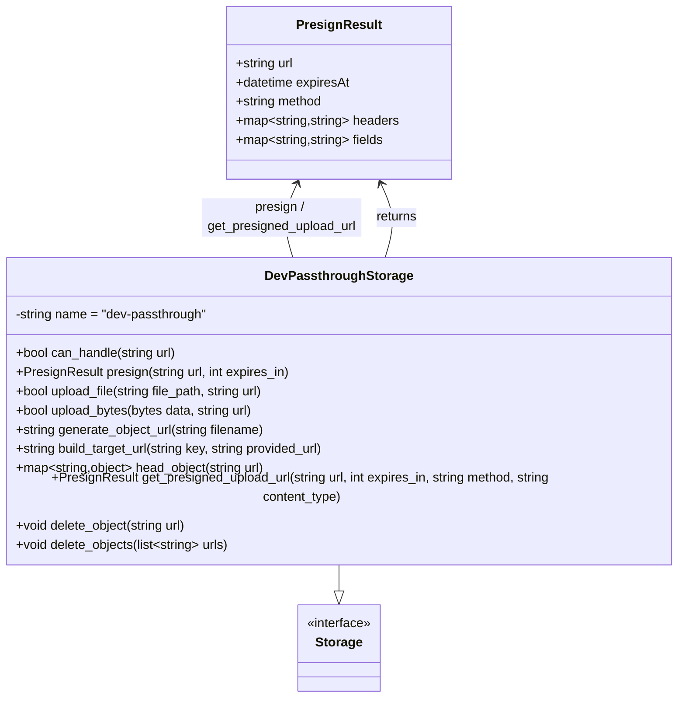

# Diagram: shared/core/src/core/storage/providers/dummy/dev.py

> Auto-generated by Obscura crawlers

## Mermaid

### SVG

<svg id="container" width="869.828125" xmlns="http://www.w3.org/2000/svg" class="classDiagram" height="848" viewBox="0 0 869.828125 848" role="graphics-document document" aria-roledescription="class"><g><defs><marker id="container_class-aggregationStart" class="marker aggregation class" refX="18" refY="7" markerWidth="190" markerHeight="240" orient="auto"><path d="M 18,7 L9,13 L1,7 L9,1 Z"></path></marker></defs><defs><marker id="container_class-aggregationEnd" class="marker aggregation class" refX="1" refY="7" markerWidth="20" markerHeight="28" orient="auto"><path d="M 18,7 L9,13 L1,7 L9,1 Z"></path></marker></defs><defs><marker id="container_class-extensionStart" class="marker extension class" refX="18" refY="7" markerWidth="190" markerHeight="240" orient="auto"><path d="M 1,7 L18,13 V 1 Z"></path></marker></defs><defs><marker id="container_class-extensionEnd" class="marker extension class" refX="1" refY="7" markerWidth="20" markerHeight="28" orient="auto"><path d="M 1,1 V 13 L18,7 Z"></path></marker></defs><defs><marker id="container_class-compositionStart" class="marker composition class" refX="18" refY="7" markerWidth="190" markerHeight="240" orient="auto"><path d="M 18,7 L9,13 L1,7 L9,1 Z"></path></marker></defs><defs><marker id="container_class-compositionEnd" class="marker composition class" refX="1" refY="7" markerWidth="20" markerHeight="28" orient="auto"><path d="M 18,7 L9,13 L1,7 L9,1 Z"></path></marker></defs><defs><marker id="container_class-dependencyStart" class="marker dependency class" refX="6" refY="7" markerWidth="190" markerHeight="240" orient="auto"><path d="M 5,7 L9,13 L1,7 L9,1 Z"></path></marker></defs><defs><marker id="container_class-dependencyEnd" class="marker dependency class" refX="13" refY="7" markerWidth="20" markerHeight="28" orient="auto"><path d="M 18,7 L9,13 L14,7 L9,1 Z"></path></marker></defs><defs><marker id="container_class-lollipopStart" class="marker lollipop class" refX="13" refY="7" markerWidth="190" markerHeight="240" orient="auto"><circle stroke="black" fill="transparent" cx="7" cy="7" r="6"></circle></marker></defs><defs><marker id="container_class-lollipopEnd" class="marker lollipop class" refX="1" refY="7" markerWidth="190" markerHeight="240" orient="auto"><circle stroke="black" fill="transparent" cx="7" cy="7" r="6"></circle></marker></defs><g class="root"><g class="clusters"></g><g class="edgePaths"><path d="M434.914,682L434.914,686.167C434.914,690.333,434.914,698.667,434.914,704.125C434.914,709.583,434.914,712.167,434.914,713.458L434.914,714.75" id="id_DevPassthroughStorage_Storage_1" class="edge-thickness-normal edge-pattern-solid relation" style=";;;" data-edge="true" data-et="edge" data-id="id_DevPassthroughStorage_Storage_1" data-points="W3sieCI6NDM0LjkxNDA2MjUsInkiOjY4Mn0seyJ4Ijo0MzQuOTE0MDYyNSwieSI6NzA3fSx7IngiOjQzNC45MTQwNjI1LCJ5Ijo3MzJ9XQ==" marker-end="url(#container_class-extensionEnd)"></path><path d="M492.398,322L495.006,313.833C497.615,305.667,502.831,289.333,502.057,273.906C501.283,258.48,494.519,243.959,491.137,236.699L487.755,229.439" id="id_DevPassthroughStorage_PresignResult_2" class="edge-thickness-normal edge-pattern-solid relation" style=";;;" data-edge="true" data-et="edge" data-id="id_DevPassthroughStorage_PresignResult_2" data-points="W3sieCI6NDkyLjM5ODM2OTI2ODU1ODk1LCJ5IjozMjJ9LHsieCI6NTA4LjA0Njg3NSwieSI6MjczfSx7IngiOjQ4NS4yMjE5ODQ0NzQ1MjIzLCJ5IjoyMjR9XQ==" marker-end="url(#container_class-dependencyEnd)"></path><path d="M382.073,229.439L378.691,236.699C375.309,243.959,368.545,258.48,367.771,273.906C366.997,289.333,372.214,305.667,374.822,313.833L377.43,322" id="id_PresignResult_DevPassthroughStorage_3" class="edge-thickness-normal edge-pattern-solid relation" style=";;;" data-edge="true" data-et="edge" data-id="id_PresignResult_DevPassthroughStorage_3" data-points="W3sieCI6Mzg0LjYwNjE0MDUyNTQ3NzcsInkiOjIyNH0seyJ4IjozNjEuNzgxMjUsInkiOjI3M30seyJ4IjozNzcuNDI5NzU1NzMxNDQxMDUsInkiOjMyMn1d" marker-start="url(#container_class-dependencyStart)"></path></g><g class="edgeLabels"><g class="edgeLabel"><g class="label" data-id="id_DevPassthroughStorage_Storage_1" transform="translate(0, 0)"><foreignObject width="0" height="0">

</foreignObject></g></g><g class="edgeLabel" transform="translate(507.49431, 271.81377)"><g class="label" data-id="id_DevPassthroughStorage_PresignResult_2" transform="translate(-26.265625, -12)"><foreignObject width="52.53125" height="24">

returns

</foreignObject></g></g><g class="edgeLabel" transform="translate(362.33381, 271.81377)"><g class="label" data-id="id_PresignResult_DevPassthroughStorage_3" transform="translate(-100, -24)"><foreignObject width="200" height="48">

presign / get_presigned_upload_url

</foreignObject></g></g></g><g class="nodes"><g class="node default" id="classId-Storage-0" transform="translate(434.9140625, 786)"><g class="basic label-container"><path d="M-53.015625 -54 L53.015625 -54 L53.015625 54 L-53.015625 54" stroke="none" stroke-width="0" fill="#ECECFF" style=""></path><path d="M-53.015625 -54 C-29.51029873868148 -54, -6.004972477362962 -54, 53.015625 -54 M-53.015625 -54 C-20.49068771178211 -54, 12.034249576435784 -54, 53.015625 -54 M53.015625 -54 C53.015625 -20.076112185496186, 53.015625 13.847775629007629, 53.015625 54 M53.015625 -54 C53.015625 -21.19264705793676, 53.015625 11.61470588412648, 53.015625 54 M53.015625 54 C12.788635360046904 54, -27.438354279906193 54, -53.015625 54 M53.015625 54 C15.98431949945762 54, -21.04698600108476 54, -53.015625 54 M-53.015625 54 C-53.015625 13.10465929422896, -53.015625 -27.79068141154208, -53.015625 -54 M-53.015625 54 C-53.015625 17.872602858101125, -53.015625 -18.25479428379775, -53.015625 -54" stroke="#9370DB" stroke-width="1.3" fill="none" stroke-dasharray="0 0" style=""></path></g><g class="annotation-group text" transform="translate(-41.015625, -30)"><g class="label" style="" transform="translate(0,-12)"><foreignObject width="82.03125" height="24">

«interface»

</foreignObject></g></g><g class="label-group text" transform="translate(-28.078125, -6)"><g class="label" style="font-weight: bolder" transform="translate(0,-12)"><foreignObject width="56.15625" height="24">

Storage

</foreignObject></g></g><g class="members-group text" transform="translate(-41.015625, 42)"></g><g class="methods-group text" transform="translate(-41.015625, 72)"></g><g class="divider" style=""><path d="M-53.015625 18 C-23.222443201542593 18, 6.570738596914815 18, 53.015625 18 M-53.015625 18 C-14.605439099012052 18, 23.804746801975895 18, 53.015625 18" stroke="#9370DB" stroke-width="1.3" fill="none" stroke-dasharray="0 0" style=""></path></g><g class="divider" style=""><path d="M-53.015625 36 C-23.52798052385534 36, 5.9596639522893184 36, 53.015625 36 M-53.015625 36 C-21.911536263507433 36, 9.192552472985135 36, 53.015625 36" stroke="#9370DB" stroke-width="1.3" fill="none" stroke-dasharray="0 0" style=""></path></g></g><g class="node default" id="classId-PresignResult-1" transform="translate(434.9140625, 116)"><g class="basic label-container"><path d="M-139.98046875 -108 L139.98046875 -108 L139.98046875 108 L-139.98046875 108" stroke="none" stroke-width="0" fill="#ECECFF" style=""></path><path d="M-139.98046875 -108 C-31.249275223101932 -108, 77.48191830379614 -108, 139.98046875 -108 M-139.98046875 -108 C-80.40448001780206 -108, -20.828491285604102 -108, 139.98046875 -108 M139.98046875 -108 C139.98046875 -62.63966883060505, 139.98046875 -17.279337661210107, 139.98046875 108 M139.98046875 -108 C139.98046875 -59.806404424121006, 139.98046875 -11.612808848242011, 139.98046875 108 M139.98046875 108 C43.12856153571211 108, -53.72334567857578 108, -139.98046875 108 M139.98046875 108 C42.32735526987571 108, -55.32575821024858 108, -139.98046875 108 M-139.98046875 108 C-139.98046875 46.85341242198341, -139.98046875 -14.293175156033186, -139.98046875 -108 M-139.98046875 108 C-139.98046875 47.20850658260449, -139.98046875 -13.582986834791015, -139.98046875 -108" stroke="#9370DB" stroke-width="1.3" fill="none" stroke-dasharray="0 0" style=""></path></g><g class="annotation-group text" transform="translate(0, -84)"></g><g class="label-group text" transform="translate(-50.3046875, -84)"><g class="label" style="font-weight: bolder" transform="translate(0,-12)"><foreignObject width="100.609375" height="24">

PresignResult

</foreignObject></g></g><g class="members-group text" transform="translate(-127.98046875, -36)"><g class="label" style="" transform="translate(0,-12)"><foreignObject width="74.046875" height="24">

+string url

</foreignObject></g><g class="label" style="" transform="translate(0,12)"><foreignObject width="144.671875" height="24">

+datetime expiresAt

</foreignObject></g><g class="label" style="" transform="translate(0,36)"><foreignObject width="110.359375" height="24">

+string method

</foreignObject></g><g class="label" style="" transform="translate(0,60)"><foreignObject width="205.65625" height="24">

+map&lt;string,string&gt; headers

</foreignObject></g><g class="label" style="" transform="translate(0,84)"><foreignObject width="186.890625" height="24">

+map&lt;string,string&gt; fields

</foreignObject></g></g><g class="methods-group text" transform="translate(-127.98046875, 108)"></g><g class="divider" style=""><path d="M-139.98046875 -60 C-61.39973820029947 -60, 17.180992349401066 -60, 139.98046875 -60 M-139.98046875 -60 C-58.48481561124501 -60, 23.010837527509977 -60, 139.98046875 -60" stroke="#9370DB" stroke-width="1.3" fill="none" stroke-dasharray="0 0" style=""></path></g><g class="divider" style=""><path d="M-139.98046875 84 C-70.64111416653448 84, -1.3017595830689572 84, 139.98046875 84 M-139.98046875 84 C-45.488947098358295 84, 49.00257455328341 84, 139.98046875 84" stroke="#9370DB" stroke-width="1.3" fill="none" stroke-dasharray="0 0" style=""></path></g></g><g class="node default" id="classId-DevPassthroughStorage-2" transform="translate(434.9140625, 502)"><g class="basic label-container"><path d="M-426.9140625 -180 L426.9140625 -180 L426.9140625 180 L-426.9140625 180" stroke="none" stroke-width="0" fill="#ECECFF" style=""></path><path d="M-426.9140625 -180 C-118.0438095975673 -180, 190.8264433048654 -180, 426.9140625 -180 M-426.9140625 -180 C-104.53199337984393 -180, 217.85007574031215 -180, 426.9140625 -180 M426.9140625 -180 C426.9140625 -83.32012641784213, 426.9140625 13.359747164315735, 426.9140625 180 M426.9140625 -180 C426.9140625 -73.95955316828572, 426.9140625 32.080893663428554, 426.9140625 180 M426.9140625 180 C104.59663207342072 180, -217.72079835315856 180, -426.9140625 180 M426.9140625 180 C127.37374798223556 180, -172.1665665355289 180, -426.9140625 180 M-426.9140625 180 C-426.9140625 53.17346917226858, -426.9140625 -73.65306165546284, -426.9140625 -180 M-426.9140625 180 C-426.9140625 40.806075613082044, -426.9140625 -98.38784877383591, -426.9140625 -180" stroke="#9370DB" stroke-width="1.3" fill="none" stroke-dasharray="0 0" style=""></path></g><g class="annotation-group text" transform="translate(0, -156)"></g><g class="label-group text" transform="translate(-87.046875, -156)"><g class="label" style="font-weight: bolder" transform="translate(0,-12)"><foreignObject width="174.09375" height="24">

DevPassthroughStorage

</foreignObject></g></g><g class="members-group text" transform="translate(-414.9140625, -108)"><g class="label" style="" transform="translate(0,-12)"><foreignObject width="244.03125" height="24">

-string name = "dev-passthrough"

</foreignObject></g></g><g class="methods-group text" transform="translate(-414.9140625, -60)"><g class="label" style="" transform="translate(0,-12)"><foreignObject width="205.765625" height="24">

+bool can_handle(string url)

</foreignObject></g><g class="label" style="" transform="translate(0,12)"><foreignObject width="346.90625" height="24">

+PresignResult presign(string url, int expires_in)

</foreignObject></g><g class="label" style="" transform="translate(0,36)"><foreignObject width="320.609375" height="24">

+bool upload_file(string file_path, string url)

</foreignObject></g><g class="label" style="" transform="translate(0,60)"><foreignObject width="303.765625" height="24">

+bool upload_bytes(bytes data, string url)

</foreignObject></g><g class="label" style="" transform="translate(0,84)"><foreignObject width="317.921875" height="24">

+string generate_object_url(string filename)

</foreignObject></g><g class="label" style="" transform="translate(0,108)"><foreignObject width="397.4375" height="24">

+string build_target_url(string key, string provided_url)

</foreignObject></g><g class="label" style="" transform="translate(0,132)"><foreignObject width="317.03125" height="24">

+map&lt;string,object&gt; head_object(string url)

</foreignObject></g><g class="label" style="" transform="translate(0,156)"><foreignObject width="742.78125" height="24">

+PresignResult get_presigned_upload_url(string url, int expires_in, string method, string content_type)

</foreignObject></g><g class="label" style="" transform="translate(0,180)"><foreignObject width="218.75" height="24">

+void delete_object(string url)

</foreignObject></g><g class="label" style="" transform="translate(0,204)"><foreignObject width="272.140625" height="24">

+void delete_objects(list&lt;string&gt; urls)

</foreignObject></g></g><g class="divider" style=""><path d="M-426.9140625 -132 C-97.36284052806354 -132, 232.1883814438729 -132, 426.9140625 -132 M-426.9140625 -132 C-168.64551652497056 -132, 89.62302945005888 -132, 426.9140625 -132" stroke="#9370DB" stroke-width="1.3" fill="none" stroke-dasharray="0 0" style=""></path></g><g class="divider" style=""><path d="M-426.9140625 -84 C-221.90711277773948 -84, -16.90016305547897 -84, 426.9140625 -84 M-426.9140625 -84 C-162.11464817903237 -84, 102.68476614193526 -84, 426.9140625 -84" stroke="#9370DB" stroke-width="1.3" fill="none" stroke-dasharray="0 0" style=""></path></g></g></g></g></g></svg>
