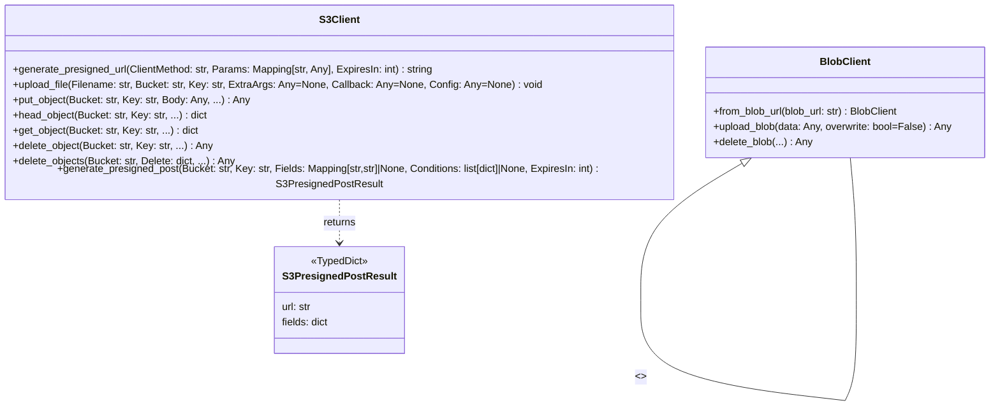

# Diagram: shared/core/src/core/storage/types.py

> Auto-generated by Obscura crawlers

## Mermaid

```mermaid
classDiagram
    class S3Client {
        +generate_presigned_url(ClientMethod: str, Params: Mapping[str, Any], ExpiresIn: int) string
        +upload_file(Filename: str, Bucket: str, Key: str, ExtraArgs: Any=None, Callback: Any=None, Config: Any=None) void
        +put_object(Bucket: str, Key: str, Body: Any, ...) Any
        +head_object(Bucket: str, Key: str, ...) dict
        +get_object(Bucket: str, Key: str, ...) dict
        +delete_object(Bucket: str, Key: str, ...) Any
        +delete_objects(Bucket: str, Delete: dict, ...) Any
        +generate_presigned_post(Bucket: str, Key: str, Fields: Mapping[str,str]|None, Conditions: list[dict]|None, ExpiresIn: int) S3PresignedPostResult
    }
    class S3PresignedPostResult <<TypedDict>> {
        url: str
        fields: dict<string,string>
    }
    class BlobClient {
        +from_blob_url(blob_url: str) BlobClient
        +upload_blob(data: Any, overwrite: bool=False) Any
        +delete_blob(...) Any
    }
    S3Client ..> S3PresignedPostResult : returns
    BlobClient <|-- BlobClient : <<Protocol>>
```

> SVG rendering failed for this diagram.
