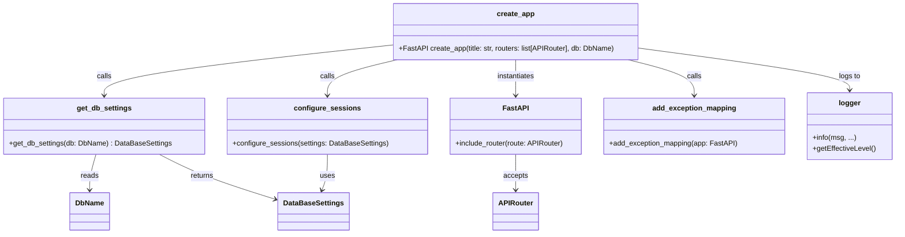

# Diagram: shared/core/src/core/web/app.py


> Auto-generated by Obscura crawlers

## Diagram 1

```mermaid
flowchart LR
    Start([start]) --> GetDB[get_db_settings(db) : DataBaseSettings]
    GetDB --> Configure[configure_sessions(settings)]
    Configure --> CreateFastAPI[Create FastAPI app(title)]
    CreateFastAPI --> RoutersLoop{for route in routers}
    RoutersLoop --> Include[app.include_router(route)]
    Include --> ExceptionMap[add_exception_mapping(app)]
    ExceptionMap --> Log[logger.info(...)]
    Log --> ReturnApp[/return app/]
    style Start fill:#f9f,stroke:#333,stroke-width:1px
    style ReturnApp fill:#bbf,stroke:#333,stroke-width:1px
```

> SVG rendering failed for this diagram.

## Diagram 2



### SVG

<svg id="container" width="1979.734375" xmlns="http://www.w3.org/2000/svg" class="classDiagram" height="524" viewBox="0 0 1979.734375 524" role="graphics-document document" aria-roledescription="class"><style>#container{font-family:"trebuchet ms",verdana,arial,sans-serif;font-size:16px;fill:#333;}@keyframes edge-animation-frame{from{stroke-dashoffset:0;}}@keyframes dash{to{stroke-dashoffset:0;}}#container .edge-animation-slow{stroke-dasharray:9,5!important;stroke-dashoffset:900;animation:dash 50s linear infinite;stroke-linecap:round;}#container .edge-animation-fast{stroke-dasharray:9,5!important;stroke-dashoffset:900;animation:dash 20s linear infinite;stroke-linecap:round;}#container .error-icon{fill:#552222;}#container .error-text{fill:#552222;stroke:#552222;}#container .edge-thickness-normal{stroke-width:1px;}#container .edge-thickness-thick{stroke-width:3.5px;}#container .edge-pattern-solid{stroke-dasharray:0;}#container .edge-thickness-invisible{stroke-width:0;fill:none;}#container .edge-pattern-dashed{stroke-dasharray:3;}#container .edge-pattern-dotted{stroke-dasharray:2;}#container .marker{fill:#333333;stroke:#333333;}#container .marker.cross{stroke:#333333;}#container svg{font-family:"trebuchet ms",verdana,arial,sans-serif;font-size:16px;}#container p{margin:0;}#container g.classGroup text{fill:#9370DB;stroke:none;font-family:"trebuchet ms",verdana,arial,sans-serif;font-size:10px;}#container g.classGroup text .title{font-weight:bolder;}#container .nodeLabel,#container .edgeLabel{color:#131300;}#container .edgeLabel .label rect{fill:#ECECFF;}#container .label text{fill:#131300;}#container .labelBkg{background:#ECECFF;}#container .edgeLabel .label span{background:#ECECFF;}#container .classTitle{font-weight:bolder;}#container .node rect,#container .node circle,#container .node ellipse,#container .node polygon,#container .node path{fill:#ECECFF;stroke:#9370DB;stroke-width:1px;}#container .divider{stroke:#9370DB;stroke-width:1;}#container g.clickable{cursor:pointer;}#container g.classGroup rect{fill:#ECECFF;stroke:#9370DB;}#container g.classGroup line{stroke:#9370DB;stroke-width:1;}#container .classLabel .box{stroke:none;stroke-width:0;fill:#ECECFF;opacity:0.5;}#container .classLabel .label{fill:#9370DB;font-size:10px;}#container .relation{stroke:#333333;stroke-width:1;fill:none;}#container .dashed-line{stroke-dasharray:3;}#container .dotted-line{stroke-dasharray:1 2;}#container #compositionStart,#container .composition{fill:#333333!important;stroke:#333333!important;stroke-width:1;}#container #compositionEnd,#container .composition{fill:#333333!important;stroke:#333333!important;stroke-width:1;}#container #dependencyStart,#container .dependency{fill:#333333!important;stroke:#333333!important;stroke-width:1;}#container #dependencyStart,#container .dependency{fill:#333333!important;stroke:#333333!important;stroke-width:1;}#container #extensionStart,#container .extension{fill:transparent!important;stroke:#333333!important;stroke-width:1;}#container #extensionEnd,#container .extension{fill:transparent!important;stroke:#333333!important;stroke-width:1;}#container #aggregationStart,#container .aggregation{fill:transparent!important;stroke:#333333!important;stroke-width:1;}#container #aggregationEnd,#container .aggregation{fill:transparent!important;stroke:#333333!important;stroke-width:1;}#container #lollipopStart,#container .lollipop{fill:#ECECFF!important;stroke:#333333!important;stroke-width:1;}#container #lollipopEnd,#container .lollipop{fill:#ECECFF!important;stroke:#333333!important;stroke-width:1;}#container .edgeTerminals{font-size:11px;line-height:initial;}#container .classTitleText{text-anchor:middle;font-size:18px;fill:#333;}#container .label-icon{display:inline-block;height:1em;overflow:visible;vertical-align:-0.125em;}#container .node .label-icon path{fill:currentColor;stroke:revert;stroke-width:revert;}#container :root{--mermaid-font-family:"trebuchet ms",verdana,arial,sans-serif;}</style><g><defs><marker id="container_class-aggregationStart" class="marker aggregation class" refX="18" refY="7" markerWidth="190" markerHeight="240" orient="auto"><path d="M 18,7 L9,13 L1,7 L9,1 Z"></path></marker></defs><defs><marker id="container_class-aggregationEnd" class="marker aggregation class" refX="1" refY="7" markerWidth="20" markerHeight="28" orient="auto"><path d="M 18,7 L9,13 L1,7 L9,1 Z"></path></marker></defs><defs><marker id="container_class-extensionStart" class="marker extension class" refX="18" refY="7" markerWidth="190" markerHeight="240" orient="auto"><path d="M 1,7 L18,13 V 1 Z"></path></marker></defs><defs><marker id="container_class-extensionEnd" class="marker extension class" refX="1" refY="7" markerWidth="20" markerHeight="28" orient="auto"><path d="M 1,1 V 13 L18,7 Z"></path></marker></defs><defs><marker id="container_class-compositionStart" class="marker composition class" refX="18" refY="7" markerWidth="190" markerHeight="240" orient="auto"><path d="M 18,7 L9,13 L1,7 L9,1 Z"></path></marker></defs><defs><marker id="container_class-compositionEnd" class="marker composition class" refX="1" refY="7" markerWidth="20" markerHeight="28" orient="auto"><path d="M 18,7 L9,13 L1,7 L9,1 Z"></path></marker></defs><defs><marker id="container_class-dependencyStart" class="marker dependency class" refX="6" refY="7" markerWidth="190" markerHeight="240" orient="auto"><path d="M 5,7 L9,13 L1,7 L9,1 Z"></path></marker></defs><defs><marker id="container_class-dependencyEnd" class="marker dependency class" refX="13" refY="7" markerWidth="20" markerHeight="28" orient="auto"><path d="M 18,7 L9,13 L14,7 L9,1 Z"></path></marker></defs><defs><marker id="container_class-lollipopStart" class="marker lollipop class" refX="13" refY="7" markerWidth="190" markerHeight="240" orient="auto"><circle stroke="black" fill="transparent" cx="7" cy="7" r="6"></circle></marker></defs><defs><marker id="container_class-lollipopEnd" class="marker lollipop class" refX="1" refY="7" markerWidth="190" markerHeight="240" orient="auto"><circle stroke="black" fill="transparent" cx="7" cy="7" r="6"></circle></marker></defs><g class="root"><g class="clusters"></g><g class="edgePaths"><path d="M866.543,100.962L760.43,112.635C654.318,124.308,442.092,147.654,335.98,166.494C229.867,185.333,229.867,199.667,229.867,206.833L229.867,214" id="id_create_app_get_db_settings_1" class="edge-thickness-normal edge-pattern-solid relation" style=";;;" data-edge="true" data-et="edge" data-id="id_create_app_get_db_settings_1" data-points="W3sieCI6ODY2LjU0Mjk2ODc1LCJ5IjoxMDAuOTYxOTcwNjUwNzk2MDN9LHsieCI6MjI5Ljg2NzE4NzUsInkiOjE3MX0seyJ4IjoyMjkuODY3MTg3NSwieSI6MjIwfV0=" marker-end="url(#container_class-dependencyEnd)"></path><path d="M876.158,134L850.439,140.167C824.72,146.333,773.282,158.667,747.563,172C721.844,185.333,721.844,199.667,721.844,206.833L721.844,214" id="id_create_app_configure_sessions_2" class="edge-thickness-normal edge-pattern-solid relation" style=";;;" data-edge="true" data-et="edge" data-id="id_create_app_configure_sessions_2" data-points="W3sieCI6ODc2LjE1ODMyMDMxMjUsInkiOjEzNH0seyJ4Ijo3MjEuODQzNzUsInkiOjE3MX0seyJ4Ijo3MjEuODQzNzUsInkiOjIyMH1d" marker-end="url(#container_class-dependencyEnd)"></path><path d="M1138.91,134L1138.91,140.167C1138.91,146.333,1138.91,158.667,1138.91,172C1138.91,185.333,1138.91,199.667,1138.91,206.833L1138.91,214" id="id_create_app_FastAPI_3" class="edge-thickness-normal edge-pattern-solid relation" style=";;;" data-edge="true" data-et="edge" data-id="id_create_app_FastAPI_3" data-points="W3sieCI6MTEzOC45MTAxNTYyNSwieSI6MTM0fSx7IngiOjExMzguOTEwMTU2MjUsInkiOjE3MX0seyJ4IjoxMTM4LjkxMDE1NjI1LCJ5IjoyMjB9XQ==" marker-end="url(#container_class-dependencyEnd)"></path><path d="M1388.442,134L1412.867,140.167C1437.292,146.333,1486.142,158.667,1510.567,172C1534.992,185.333,1534.992,199.667,1534.992,206.833L1534.992,214" id="id_create_app_add_exception_mapping_4" class="edge-thickness-normal edge-pattern-solid relation" style=";;;" data-edge="true" data-et="edge" data-id="id_create_app_add_exception_mapping_4" data-points="W3sieCI6MTM4OC40NDE4MzU5Mzc1LCJ5IjoxMzR9LHsieCI6MTUzNC45OTIxODc1LCJ5IjoxNzF9LHsieCI6MTUzNC45OTIxODc1LCJ5IjoyMjB9XQ==" marker-end="url(#container_class-dependencyEnd)"></path><path d="M1411.277,107.855L1489.052,118.38C1566.827,128.904,1722.376,149.952,1800.151,165.643C1877.926,181.333,1877.926,191.667,1877.926,196.833L1877.926,202" id="id_create_app_logger_5" class="edge-thickness-normal edge-pattern-solid relation" style=";;;" data-edge="true" data-et="edge" data-id="id_create_app_logger_5" data-points="W3sieCI6MTQxMS4yNzczNDM3NSwieSI6MTA3Ljg1NTQwMzA5MTEwNTE1fSx7IngiOjE4NzcuOTI1NzgxMjUsInkiOjE3MX0seyJ4IjoxODc3LjkyNTc4MTI1LCJ5IjoyMDh9XQ==" marker-end="url(#container_class-dependencyEnd)"></path><path d="M1138.91,346L1138.91,354.167C1138.91,362.333,1138.91,378.667,1138.91,392C1138.91,405.333,1138.91,415.667,1138.91,420.833L1138.91,426" id="id_FastAPI_APIRouter_6" class="edge-thickness-normal edge-pattern-solid relation" style=";;;" data-edge="true" data-et="edge" data-id="id_FastAPI_APIRouter_6" data-points="W3sieCI6MTEzOC45MTAxNTYyNSwieSI6MzQ2fSx7IngiOjExMzguOTEwMTU2MjUsInkiOjM5NX0seyJ4IjoxMTM4LjkxMDE1NjI1LCJ5Ijo0MzJ9XQ==" marker-end="url(#container_class-dependencyEnd)"></path><path d="M211.228,346L208.812,354.167C206.395,362.333,201.563,378.667,199.147,392C196.73,405.333,196.73,415.667,196.73,420.833L196.73,426" id="id_get_db_settings_DbName_7" class="edge-thickness-normal edge-pattern-solid relation" style=";;;" data-edge="true" data-et="edge" data-id="id_get_db_settings_DbName_7" data-points="W3sieCI6MjExLjIyNzc4MzIwMzEyNSwieSI6MzQ2fSx7IngiOjE5Ni43MzA0Njg3NSwieSI6Mzk1fSx7IngiOjE5Ni43MzA0Njg3NSwieSI6NDMyfV0=" marker-end="url(#container_class-dependencyEnd)"></path><path d="M350.585,346L366.234,354.167C381.882,362.333,413.179,378.667,456.099,395.592C499.019,412.516,553.561,430.033,580.833,438.791L608.104,447.549" id="id_get_db_settings_DataBaseSettings_8" class="edge-thickness-normal edge-pattern-solid relation" style=";;;" data-edge="true" data-et="edge" data-id="id_get_db_settings_DataBaseSettings_8" data-points="W3sieCI6MzUwLjU4NDk2MDkzNzUsInkiOjM0Nn0seyJ4Ijo0NDQuNDc2NTYyNSwieSI6Mzk1fSx7IngiOjYxMy44MTY0MDYyNSwieSI6NDQ5LjM4NDA4NTI0Mjg4MTl9XQ==" marker-end="url(#container_class-dependencyEnd)"></path><path d="M721.844,346L721.844,354.167C721.844,362.333,721.844,378.667,719.763,392.071C717.683,405.475,713.523,415.949,711.442,421.186L709.362,426.424" id="id_configure_sessions_DataBaseSettings_9" class="edge-thickness-normal edge-pattern-solid relation" style=";;;" data-edge="true" data-et="edge" data-id="id_configure_sessions_DataBaseSettings_9" data-points="W3sieCI6NzIxLjg0Mzc1LCJ5IjozNDZ9LHsieCI6NzIxLjg0Mzc1LCJ5IjozOTV9LHsieCI6NzA3LjE0NzMwMDIzNzM0MTgsInkiOjQzMn1d" marker-end="url(#container_class-dependencyEnd)"></path></g><g class="edgeLabels"><g class="edgeLabel" transform="translate(229.8671875, 171)"><g class="label" data-id="id_create_app_get_db_settings_1" transform="translate(-16.4453125, -12)"><foreignObject width="32.890625" height="24"><div xmlns="http://www.w3.org/1999/xhtml" class="labelBkg" style="display: table-cell; white-space: nowrap; line-height: 1.5; max-width: 200px; text-align: center;"><span class="edgeLabel"><p>calls</p></span></div></foreignObject></g></g><g class="edgeLabel" transform="translate(721.84375, 171)"><g class="label" data-id="id_create_app_configure_sessions_2" transform="translate(-16.4453125, -12)"><foreignObject width="32.890625" height="24"><div xmlns="http://www.w3.org/1999/xhtml" class="labelBkg" style="display: table-cell; white-space: nowrap; line-height: 1.5; max-width: 200px; text-align: center;"><span class="edgeLabel"><p>calls</p></span></div></foreignObject></g></g><g class="edgeLabel" transform="translate(1138.91015625, 171)"><g class="label" data-id="id_create_app_FastAPI_3" transform="translate(-42.9140625, -12)"><foreignObject width="85.828125" height="24"><div xmlns="http://www.w3.org/1999/xhtml" class="labelBkg" style="display: table-cell; white-space: nowrap; line-height: 1.5; max-width: 200px; text-align: center;"><span class="edgeLabel"><p>instantiates</p></span></div></foreignObject></g></g><g class="edgeLabel" transform="translate(1534.9921875, 171)"><g class="label" data-id="id_create_app_add_exception_mapping_4" transform="translate(-16.4453125, -12)"><foreignObject width="32.890625" height="24"><div xmlns="http://www.w3.org/1999/xhtml" class="labelBkg" style="display: table-cell; white-space: nowrap; line-height: 1.5; max-width: 200px; text-align: center;"><span class="edgeLabel"><p>calls</p></span></div></foreignObject></g></g><g class="edgeLabel" transform="translate(1877.92578125, 171)"><g class="label" data-id="id_create_app_logger_5" transform="translate(-24.3828125, -12)"><foreignObject width="48.765625" height="24"><div xmlns="http://www.w3.org/1999/xhtml" class="labelBkg" style="display: table-cell; white-space: nowrap; line-height: 1.5; max-width: 200px; text-align: center;"><span class="edgeLabel"><p>logs to</p></span></div></foreignObject></g></g><g class="edgeLabel" transform="translate(1138.91015625, 395)"><g class="label" data-id="id_FastAPI_APIRouter_6" transform="translate(-27.421875, -12)"><foreignObject width="54.84375" height="24"><div xmlns="http://www.w3.org/1999/xhtml" class="labelBkg" style="display: table-cell; white-space: nowrap; line-height: 1.5; max-width: 200px; text-align: center;"><span class="edgeLabel"><p>accepts</p></span></div></foreignObject></g></g><g class="edgeLabel" transform="translate(196.73046875, 395)"><g class="label" data-id="id_get_db_settings_DbName_7" transform="translate(-20.0078125, -12)"><foreignObject width="40.015625" height="24"><div xmlns="http://www.w3.org/1999/xhtml" class="labelBkg" style="display: table-cell; white-space: nowrap; line-height: 1.5; max-width: 200px; text-align: center;"><span class="edgeLabel"><p>reads</p></span></div></foreignObject></g></g><g class="edgeLabel" transform="translate(478.72844, 406.00011)"><g class="label" data-id="id_get_db_settings_DataBaseSettings_8" transform="translate(-26.265625, -12)"><foreignObject width="52.53125" height="24"><div xmlns="http://www.w3.org/1999/xhtml" class="labelBkg" style="display: table-cell; white-space: nowrap; line-height: 1.5; max-width: 200px; text-align: center;"><span class="edgeLabel"><p>returns</p></span></div></foreignObject></g></g><g class="edgeLabel" transform="translate(721.84375, 395)"><g class="label" data-id="id_configure_sessions_DataBaseSettings_9" transform="translate(-16.4921875, -12)"><foreignObject width="32.984375" height="24"><div xmlns="http://www.w3.org/1999/xhtml" class="labelBkg" style="display: table-cell; white-space: nowrap; line-height: 1.5; max-width: 200px; text-align: center;"><span class="edgeLabel"><p>uses</p></span></div></foreignObject></g></g></g><g class="nodes"><g class="node default" id="classId-create_app-0" transform="translate(1138.91015625, 71)"><g class="basic label-container"><path d="M-272.3671875 -63 L272.3671875 -63 L272.3671875 63 L-272.3671875 63" stroke="none" stroke-width="0" fill="#ECECFF" style=""></path><path d="M-272.3671875 -63 C-67.26709711821425 -63, 137.8329932635715 -63, 272.3671875 -63 M-272.3671875 -63 C-125.58709567857275 -63, 21.192996142854497 -63, 272.3671875 -63 M272.3671875 -63 C272.3671875 -31.545858832250875, 272.3671875 -0.09171766450175056, 272.3671875 63 M272.3671875 -63 C272.3671875 -31.077650509724137, 272.3671875 0.8446989805517262, 272.3671875 63 M272.3671875 63 C116.65962817280476 63, -39.04793115439048 63, -272.3671875 63 M272.3671875 63 C56.96841203708604 63, -158.43036342582792 63, -272.3671875 63 M-272.3671875 63 C-272.3671875 19.201642195908335, -272.3671875 -24.59671560818333, -272.3671875 -63 M-272.3671875 63 C-272.3671875 18.394768496239386, -272.3671875 -26.210463007521227, -272.3671875 -63" stroke="#9370DB" stroke-width="1.3" fill="none" stroke-dasharray="0 0" style=""></path></g><g class="annotation-group text" transform="translate(0, -39)"></g><g class="label-group text" transform="translate(-40.65625, -39)"><g class="label" style="font-weight: bolder" transform="translate(0,-12)"><foreignObject width="81.3125" height="24"><div xmlns="http://www.w3.org/1999/xhtml" style="display: table-cell; white-space: nowrap; line-height: 1.5; max-width: 130px; text-align: center;"><span class="nodeLabel markdown-node-label" style=""><p>create_app</p></span></div></foreignObject></g></g><g class="members-group text" transform="translate(-260.3671875, 9)"></g><g class="methods-group text" transform="translate(-260.3671875, 39)"><g class="label" style="" transform="translate(0,-12)"><foreignObject width="480.078125" height="24"><div xmlns="http://www.w3.org/1999/xhtml" style="display: table-cell; white-space: nowrap; line-height: 1.5; max-width: 537px; text-align: center;"><span class="nodeLabel markdown-node-label" style=""><p>+FastAPI create_app(title: str, routers: list[APIRouter], db: DbName)</p></span></div></foreignObject></g></g><g class="divider" style=""><path d="M-272.3671875 -15 C-85.3058986575933 -15, 101.7553901848134 -15, 272.3671875 -15 M-272.3671875 -15 C-154.74143493856852 -15, -37.115682377137034 -15, 272.3671875 -15" stroke="#9370DB" stroke-width="1.3" fill="none" stroke-dasharray="0 0" style=""></path></g><g class="divider" style=""><path d="M-272.3671875 9 C-76.061592310549 9, 120.244002878902 9, 272.3671875 9 M-272.3671875 9 C-117.87093277963032 9, 36.625321940739354 9, 272.3671875 9" stroke="#9370DB" stroke-width="1.3" fill="none" stroke-dasharray="0 0" style=""></path></g></g><g class="node default" id="classId-FastAPI-1" transform="translate(1138.91015625, 283)"><g class="basic label-container"><path d="M-146.95703125 -63 L146.95703125 -63 L146.95703125 63 L-146.95703125 63" stroke="none" stroke-width="0" fill="#ECECFF" style=""></path><path d="M-146.95703125 -63 C-78.67882666572518 -63, -10.400622081450365 -63, 146.95703125 -63 M-146.95703125 -63 C-80.05437765426458 -63, -13.151724058529169 -63, 146.95703125 -63 M146.95703125 -63 C146.95703125 -20.057449040965132, 146.95703125 22.885101918069736, 146.95703125 63 M146.95703125 -63 C146.95703125 -28.065129514532984, 146.95703125 6.869740970934032, 146.95703125 63 M146.95703125 63 C41.985560881725334 63, -62.98590948654933 63, -146.95703125 63 M146.95703125 63 C32.99204892665824 63, -80.97293339668352 63, -146.95703125 63 M-146.95703125 63 C-146.95703125 15.583142442263629, -146.95703125 -31.833715115472742, -146.95703125 -63 M-146.95703125 63 C-146.95703125 26.024907880396263, -146.95703125 -10.950184239207474, -146.95703125 -63" stroke="#9370DB" stroke-width="1.3" fill="none" stroke-dasharray="0 0" style=""></path></g><g class="annotation-group text" transform="translate(0, -39)"></g><g class="label-group text" transform="translate(-26.5390625, -39)"><g class="label" style="font-weight: bolder" transform="translate(0,-12)"><foreignObject width="53.078125" height="24"><div xmlns="http://www.w3.org/1999/xhtml" style="display: table-cell; white-space: nowrap; line-height: 1.5; max-width: 102px; text-align: center;"><span class="nodeLabel markdown-node-label" style=""><p>FastAPI</p></span></div></foreignObject></g></g><g class="members-group text" transform="translate(-134.95703125, 9)"></g><g class="methods-group text" transform="translate(-134.95703125, 39)"><g class="label" style="" transform="translate(0,-12)"><foreignObject width="243.375" height="24"><div xmlns="http://www.w3.org/1999/xhtml" style="display: table-cell; white-space: nowrap; line-height: 1.5; max-width: 301px; text-align: center;"><span class="nodeLabel markdown-node-label" style=""><p>+include_router(route: APIRouter)</p></span></div></foreignObject></g></g><g class="divider" style=""><path d="M-146.95703125 -15 C-46.31993661967515 -15, 54.317158010649706 -15, 146.95703125 -15 M-146.95703125 -15 C-79.74297236979764 -15, -12.528913489595283 -15, 146.95703125 -15" stroke="#9370DB" stroke-width="1.3" fill="none" stroke-dasharray="0 0" style=""></path></g><g class="divider" style=""><path d="M-146.95703125 9 C-33.168247646758545 9, 80.62053595648291 9, 146.95703125 9 M-146.95703125 9 C-50.819693640235414 9, 45.31764396952917 9, 146.95703125 9" stroke="#9370DB" stroke-width="1.3" fill="none" stroke-dasharray="0 0" style=""></path></g></g><g class="node default" id="classId-APIRouter-2" transform="translate(1138.91015625, 474)"><g class="basic label-container"><path d="M-48.5 -42 L48.5 -42 L48.5 42 L-48.5 42" stroke="none" stroke-width="0" fill="#ECECFF" style=""></path><path d="M-48.5 -42 C-23.47251536093954 -42, 1.5549692781209217 -42, 48.5 -42 M-48.5 -42 C-22.938838206341533 -42, 2.6223235873169344 -42, 48.5 -42 M48.5 -42 C48.5 -21.265282761169285, 48.5 -0.5305655223385699, 48.5 42 M48.5 -42 C48.5 -9.737688325446776, 48.5 22.52462334910645, 48.5 42 M48.5 42 C11.812260057810263 42, -24.875479884379473 42, -48.5 42 M48.5 42 C15.739390819874806 42, -17.021218360250387 42, -48.5 42 M-48.5 42 C-48.5 21.91930375154074, -48.5 1.8386075030814766, -48.5 -42 M-48.5 42 C-48.5 18.04206563625699, -48.5 -5.915868727486021, -48.5 -42" stroke="#9370DB" stroke-width="1.3" fill="none" stroke-dasharray="0 0" style=""></path></g><g class="annotation-group text" transform="translate(0, -18)"></g><g class="label-group text" transform="translate(-36.5, -18)"><g class="label" style="font-weight: bolder" transform="translate(0,-12)"><foreignObject width="73" height="24"><div xmlns="http://www.w3.org/1999/xhtml" style="display: table-cell; white-space: nowrap; line-height: 1.5; max-width: 123px; text-align: center;"><span class="nodeLabel markdown-node-label" style=""><p>APIRouter</p></span></div></foreignObject></g></g><g class="members-group text" transform="translate(-36.5, 30)"></g><g class="methods-group text" transform="translate(-36.5, 60)"></g><g class="divider" style=""><path d="M-48.5 6 C-22.900795223529183 6, 2.6984095529416336 6, 48.5 6 M-48.5 6 C-12.848445766352413 6, 22.803108467295175 6, 48.5 6" stroke="#9370DB" stroke-width="1.3" fill="none" stroke-dasharray="0 0" style=""></path></g><g class="divider" style=""><path d="M-48.5 24 C-26.96612962649855 24, -5.432259252997099 24, 48.5 24 M-48.5 24 C-14.149041017923452 24, 20.201917964153097 24, 48.5 24" stroke="#9370DB" stroke-width="1.3" fill="none" stroke-dasharray="0 0" style=""></path></g></g><g class="node default" id="classId-DbName-3" transform="translate(196.73046875, 474)"><g class="basic label-container"><path d="M-42.8515625 -42 L42.8515625 -42 L42.8515625 42 L-42.8515625 42" stroke="none" stroke-width="0" fill="#ECECFF" style=""></path><path d="M-42.8515625 -42 C-16.12127747202942 -42, 10.609007555941162 -42, 42.8515625 -42 M-42.8515625 -42 C-13.126565170256551 -42, 16.598432159486897 -42, 42.8515625 -42 M42.8515625 -42 C42.8515625 -20.705947695635007, 42.8515625 0.588104608729985, 42.8515625 42 M42.8515625 -42 C42.8515625 -10.292723327207113, 42.8515625 21.414553345585773, 42.8515625 42 M42.8515625 42 C13.043208416287442 42, -16.765145667425116 42, -42.8515625 42 M42.8515625 42 C11.926820129738548 42, -18.997922240522904 42, -42.8515625 42 M-42.8515625 42 C-42.8515625 12.55855969313512, -42.8515625 -16.88288061372976, -42.8515625 -42 M-42.8515625 42 C-42.8515625 12.292941660992543, -42.8515625 -17.414116678014913, -42.8515625 -42" stroke="#9370DB" stroke-width="1.3" fill="none" stroke-dasharray="0 0" style=""></path></g><g class="annotation-group text" transform="translate(0, -18)"></g><g class="label-group text" transform="translate(-30.8515625, -18)"><g class="label" style="font-weight: bolder" transform="translate(0,-12)"><foreignObject width="61.703125" height="24"><div xmlns="http://www.w3.org/1999/xhtml" style="display: table-cell; white-space: nowrap; line-height: 1.5; max-width: 112px; text-align: center;"><span class="nodeLabel markdown-node-label" style=""><p>DbName</p></span></div></foreignObject></g></g><g class="members-group text" transform="translate(-30.8515625, 30)"></g><g class="methods-group text" transform="translate(-30.8515625, 60)"></g><g class="divider" style=""><path d="M-42.8515625 6 C-24.934775636943773 6, -7.017988773887545 6, 42.8515625 6 M-42.8515625 6 C-12.831571234828914 6, 17.188420030342172 6, 42.8515625 6" stroke="#9370DB" stroke-width="1.3" fill="none" stroke-dasharray="0 0" style=""></path></g><g class="divider" style=""><path d="M-42.8515625 24 C-19.06859846253181 24, 4.71436557493638 24, 42.8515625 24 M-42.8515625 24 C-23.889746396603428 24, -4.927930293206856 24, 42.8515625 24" stroke="#9370DB" stroke-width="1.3" fill="none" stroke-dasharray="0 0" style=""></path></g></g><g class="node default" id="classId-DataBaseSettings-4" transform="translate(690.46484375, 474)"><g class="basic label-container"><path d="M-76.6484375 -42 L76.6484375 -42 L76.6484375 42 L-76.6484375 42" stroke="none" stroke-width="0" fill="#ECECFF" style=""></path><path d="M-76.6484375 -42 C-44.35644481145321 -42, -12.064452122906417 -42, 76.6484375 -42 M-76.6484375 -42 C-19.045104216486685 -42, 38.55822906702663 -42, 76.6484375 -42 M76.6484375 -42 C76.6484375 -11.021785478925274, 76.6484375 19.956429042149452, 76.6484375 42 M76.6484375 -42 C76.6484375 -12.76736667976628, 76.6484375 16.46526664046744, 76.6484375 42 M76.6484375 42 C35.3190845512684 42, -6.010268397463193 42, -76.6484375 42 M76.6484375 42 C42.345857186669555 42, 8.04327687333911 42, -76.6484375 42 M-76.6484375 42 C-76.6484375 12.20061741194403, -76.6484375 -17.59876517611194, -76.6484375 -42 M-76.6484375 42 C-76.6484375 12.400320802456097, -76.6484375 -17.199358395087806, -76.6484375 -42" stroke="#9370DB" stroke-width="1.3" fill="none" stroke-dasharray="0 0" style=""></path></g><g class="annotation-group text" transform="translate(0, -18)"></g><g class="label-group text" transform="translate(-64.6484375, -18)"><g class="label" style="font-weight: bolder" transform="translate(0,-12)"><foreignObject width="129.296875" height="24"><div xmlns="http://www.w3.org/1999/xhtml" style="display: table-cell; white-space: nowrap; line-height: 1.5; max-width: 176px; text-align: center;"><span class="nodeLabel markdown-node-label" style=""><p>DataBaseSettings</p></span></div></foreignObject></g></g><g class="members-group text" transform="translate(-64.6484375, 30)"></g><g class="methods-group text" transform="translate(-64.6484375, 60)"></g><g class="divider" style=""><path d="M-76.6484375 6 C-20.649087463173004 6, 35.35026257365399 6, 76.6484375 6 M-76.6484375 6 C-20.00603961768089 6, 36.63635826463822 6, 76.6484375 6" stroke="#9370DB" stroke-width="1.3" fill="none" stroke-dasharray="0 0" style=""></path></g><g class="divider" style=""><path d="M-76.6484375 24 C-21.88516411428086 24, 32.87810927143828 24, 76.6484375 24 M-76.6484375 24 C-28.966616013929105 24, 18.71520547214179 24, 76.6484375 24" stroke="#9370DB" stroke-width="1.3" fill="none" stroke-dasharray="0 0" style=""></path></g></g><g class="node default" id="classId-get_db_settings-5" transform="translate(229.8671875, 283)"><g class="basic label-container"><path d="M-221.8671875 -63 L221.8671875 -63 L221.8671875 63 L-221.8671875 63" stroke="none" stroke-width="0" fill="#ECECFF" style=""></path><path d="M-221.8671875 -63 C-90.95895842098909 -63, 39.94927065802182 -63, 221.8671875 -63 M-221.8671875 -63 C-108.96232246985504 -63, 3.9425425602899224 -63, 221.8671875 -63 M221.8671875 -63 C221.8671875 -17.110041128622292, 221.8671875 28.779917742755416, 221.8671875 63 M221.8671875 -63 C221.8671875 -22.407327331132272, 221.8671875 18.185345337735455, 221.8671875 63 M221.8671875 63 C130.07070625181387 63, 38.27422500362775 63, -221.8671875 63 M221.8671875 63 C86.87045673650672 63, -48.12627402698655 63, -221.8671875 63 M-221.8671875 63 C-221.8671875 32.82891632132737, -221.8671875 2.6578326426547463, -221.8671875 -63 M-221.8671875 63 C-221.8671875 30.77020929306878, -221.8671875 -1.4595814138624377, -221.8671875 -63" stroke="#9370DB" stroke-width="1.3" fill="none" stroke-dasharray="0 0" style=""></path></g><g class="annotation-group text" transform="translate(0, -39)"></g><g class="label-group text" transform="translate(-58.84375, -39)"><g class="label" style="font-weight: bolder" transform="translate(0,-12)"><foreignObject width="117.6875" height="24"><div xmlns="http://www.w3.org/1999/xhtml" style="display: table-cell; white-space: nowrap; line-height: 1.5; max-width: 165px; text-align: center;"><span class="nodeLabel markdown-node-label" style=""><p>get_db_settings</p></span></div></foreignObject></g></g><g class="members-group text" transform="translate(-209.8671875, 9)"></g><g class="methods-group text" transform="translate(-209.8671875, 39)"><g class="label" style="" transform="translate(0,-12)"><foreignObject width="360.890625" height="24"><div xmlns="http://www.w3.org/1999/xhtml" style="display: table-cell; white-space: nowrap; line-height: 1.5; max-width: 418px; text-align: center;"><span class="nodeLabel markdown-node-label" style=""><p>+get_db_settings(db: DbName) : DataBaseSettings</p></span></div></foreignObject></g></g><g class="divider" style=""><path d="M-221.8671875 -15 C-119.86437061232417 -15, -17.86155372464833 -15, 221.8671875 -15 M-221.8671875 -15 C-62.381327619177455 -15, 97.10453226164509 -15, 221.8671875 -15" stroke="#9370DB" stroke-width="1.3" fill="none" stroke-dasharray="0 0" style=""></path></g><g class="divider" style=""><path d="M-221.8671875 9 C-115.26556508524743 9, -8.663942670494862 9, 221.8671875 9 M-221.8671875 9 C-131.77276410309008 9, -41.678340706180165 9, 221.8671875 9" stroke="#9370DB" stroke-width="1.3" fill="none" stroke-dasharray="0 0" style=""></path></g></g><g class="node default" id="classId-configure_sessions-6" transform="translate(721.84375, 283)"><g class="basic label-container"><path d="M-220.109375 -63 L220.109375 -63 L220.109375 63 L-220.109375 63" stroke="none" stroke-width="0" fill="#ECECFF" style=""></path><path d="M-220.109375 -63 C-66.49478116468092 -63, 87.11981267063817 -63, 220.109375 -63 M-220.109375 -63 C-131.9421297572889 -63, -43.77488451457779 -63, 220.109375 -63 M220.109375 -63 C220.109375 -14.422762275104432, 220.109375 34.154475449791136, 220.109375 63 M220.109375 -63 C220.109375 -36.584364334179895, 220.109375 -10.168728668359797, 220.109375 63 M220.109375 63 C117.96268427443268 63, 15.81599354886535 63, -220.109375 63 M220.109375 63 C121.29003184461405 63, 22.470688689228098 63, -220.109375 63 M-220.109375 63 C-220.109375 22.766293900971625, -220.109375 -17.46741219805675, -220.109375 -63 M-220.109375 63 C-220.109375 36.77919140775033, -220.109375 10.558382815500664, -220.109375 -63" stroke="#9370DB" stroke-width="1.3" fill="none" stroke-dasharray="0 0" style=""></path></g><g class="annotation-group text" transform="translate(0, -39)"></g><g class="label-group text" transform="translate(-69.40625, -39)"><g class="label" style="font-weight: bolder" transform="translate(0,-12)"><foreignObject width="138.8125" height="24"><div xmlns="http://www.w3.org/1999/xhtml" style="display: table-cell; white-space: nowrap; line-height: 1.5; max-width: 187px; text-align: center;"><span class="nodeLabel markdown-node-label" style=""><p>configure_sessions</p></span></div></foreignObject></g></g><g class="members-group text" transform="translate(-208.109375, 9)"></g><g class="methods-group text" transform="translate(-208.109375, 39)"><g class="label" style="" transform="translate(0,-12)"><foreignObject width="346.8125" height="24"><div xmlns="http://www.w3.org/1999/xhtml" style="display: table-cell; white-space: nowrap; line-height: 1.5; max-width: 404px; text-align: center;"><span class="nodeLabel markdown-node-label" style=""><p>+configure_sessions(settings: DataBaseSettings)</p></span></div></foreignObject></g></g><g class="divider" style=""><path d="M-220.109375 -15 C-70.15475330698959 -15, 79.79986838602082 -15, 220.109375 -15 M-220.109375 -15 C-102.60797988548605 -15, 14.893415229027909 -15, 220.109375 -15" stroke="#9370DB" stroke-width="1.3" fill="none" stroke-dasharray="0 0" style=""></path></g><g class="divider" style=""><path d="M-220.109375 9 C-114.46579509037761 9, -8.822215180755222 9, 220.109375 9 M-220.109375 9 C-49.477317726289016 9, 121.15473954742197 9, 220.109375 9" stroke="#9370DB" stroke-width="1.3" fill="none" stroke-dasharray="0 0" style=""></path></g></g><g class="node default" id="classId-add_exception_mapping-7" transform="translate(1534.9921875, 283)"><g class="basic label-container"><path d="M-199.125 -63 L199.125 -63 L199.125 63 L-199.125 63" stroke="none" stroke-width="0" fill="#ECECFF" style=""></path><path d="M-199.125 -63 C-59.43733144299779 -63, 80.25033711400442 -63, 199.125 -63 M-199.125 -63 C-41.819015871067734 -63, 115.48696825786453 -63, 199.125 -63 M199.125 -63 C199.125 -19.443999070467164, 199.125 24.11200185906567, 199.125 63 M199.125 -63 C199.125 -20.226258000731143, 199.125 22.547483998537714, 199.125 63 M199.125 63 C93.11062603315216 63, -12.903747933695684 63, -199.125 63 M199.125 63 C100.46603700001286 63, 1.8070740000257217 63, -199.125 63 M-199.125 63 C-199.125 16.08107267916437, -199.125 -30.837854641671257, -199.125 -63 M-199.125 63 C-199.125 18.925546696104718, -199.125 -25.148906607790565, -199.125 -63" stroke="#9370DB" stroke-width="1.3" fill="none" stroke-dasharray="0 0" style=""></path></g><g class="annotation-group text" transform="translate(0, -39)"></g><g class="label-group text" transform="translate(-89.921875, -39)"><g class="label" style="font-weight: bolder" transform="translate(0,-12)"><foreignObject width="179.84375" height="24"><div xmlns="http://www.w3.org/1999/xhtml" style="display: table-cell; white-space: nowrap; line-height: 1.5; max-width: 229px; text-align: center;"><span class="nodeLabel markdown-node-label" style=""><p>add_exception_mapping</p></span></div></foreignObject></g></g><g class="members-group text" transform="translate(-187.125, 9)"></g><g class="methods-group text" transform="translate(-187.125, 39)"><g class="label" style="" transform="translate(0,-12)"><foreignObject width="284.328125" height="24"><div xmlns="http://www.w3.org/1999/xhtml" style="display: table-cell; white-space: nowrap; line-height: 1.5; max-width: 342px; text-align: center;"><span class="nodeLabel markdown-node-label" style=""><p>+add_exception_mapping(app: FastAPI)</p></span></div></foreignObject></g></g><g class="divider" style=""><path d="M-199.125 -15 C-107.673097018156 -15, -16.221194036312 -15, 199.125 -15 M-199.125 -15 C-109.61829656212932 -15, -20.111593124258633 -15, 199.125 -15" stroke="#9370DB" stroke-width="1.3" fill="none" stroke-dasharray="0 0" style=""></path></g><g class="divider" style=""><path d="M-199.125 9 C-112.62886526267495 9, -26.1327305253499 9, 199.125 9 M-199.125 9 C-49.26694032736884 9, 100.59111934526231 9, 199.125 9" stroke="#9370DB" stroke-width="1.3" fill="none" stroke-dasharray="0 0" style=""></path></g></g><g class="node default" id="classId-logger-8" transform="translate(1877.92578125, 283)"><g class="basic label-container"><path d="M-93.80859375 -75 L93.80859375 -75 L93.80859375 75 L-93.80859375 75" stroke="none" stroke-width="0" fill="#ECECFF" style=""></path><path d="M-93.80859375 -75 C-41.47122447400985 -75, 10.866144801980298 -75, 93.80859375 -75 M-93.80859375 -75 C-22.38294879446744 -75, 49.04269616106512 -75, 93.80859375 -75 M93.80859375 -75 C93.80859375 -43.12967151152211, 93.80859375 -11.259343023044224, 93.80859375 75 M93.80859375 -75 C93.80859375 -27.685090795800996, 93.80859375 19.62981840839801, 93.80859375 75 M93.80859375 75 C37.45888983449976 75, -18.890814081000485 75, -93.80859375 75 M93.80859375 75 C39.47434938338967 75, -14.859894983220656 75, -93.80859375 75 M-93.80859375 75 C-93.80859375 28.109454780136502, -93.80859375 -18.781090439726995, -93.80859375 -75 M-93.80859375 75 C-93.80859375 43.781748471999244, -93.80859375 12.563496943998487, -93.80859375 -75" stroke="#9370DB" stroke-width="1.3" fill="none" stroke-dasharray="0 0" style=""></path></g><g class="annotation-group text" transform="translate(0, -51)"></g><g class="label-group text" transform="translate(-23.2734375, -51)"><g class="label" style="font-weight: bolder" transform="translate(0,-12)"><foreignObject width="46.546875" height="24"><div xmlns="http://www.w3.org/1999/xhtml" style="display: table-cell; white-space: nowrap; line-height: 1.5; max-width: 96px; text-align: center;"><span class="nodeLabel markdown-node-label" style=""><p>logger</p></span></div></foreignObject></g></g><g class="members-group text" transform="translate(-81.80859375, -3)"></g><g class="methods-group text" transform="translate(-81.80859375, 27)"><g class="label" style="" transform="translate(0,-12)"><foreignObject width="95.890625" height="24"><div xmlns="http://www.w3.org/1999/xhtml" style="display: table-cell; white-space: nowrap; line-height: 1.5; max-width: 153px; text-align: center;"><span class="nodeLabel markdown-node-label" style=""><p>+info(msg, ...)</p></span></div></foreignObject></g><g class="label" style="" transform="translate(0,12)"><foreignObject width="140.34375" height="24"><div xmlns="http://www.w3.org/1999/xhtml" style="display: table-cell; white-space: nowrap; line-height: 1.5; max-width: 198px; text-align: center;"><span class="nodeLabel markdown-node-label" style=""><p>+getEffectiveLevel()</p></span></div></foreignObject></g></g><g class="divider" style=""><path d="M-93.80859375 -27 C-25.98375935483682 -27, 41.84107504032636 -27, 93.80859375 -27 M-93.80859375 -27 C-42.49442248724521 -27, 8.81974877550958 -27, 93.80859375 -27" stroke="#9370DB" stroke-width="1.3" fill="none" stroke-dasharray="0 0" style=""></path></g><g class="divider" style=""><path d="M-93.80859375 -3 C-30.61959874955553 -3, 32.56939625088894 -3, 93.80859375 -3 M-93.80859375 -3 C-32.01706584196527 -3, 29.77446206606946 -3, 93.80859375 -3" stroke="#9370DB" stroke-width="1.3" fill="none" stroke-dasharray="0 0" style=""></path></g></g></g></g></g></svg>
