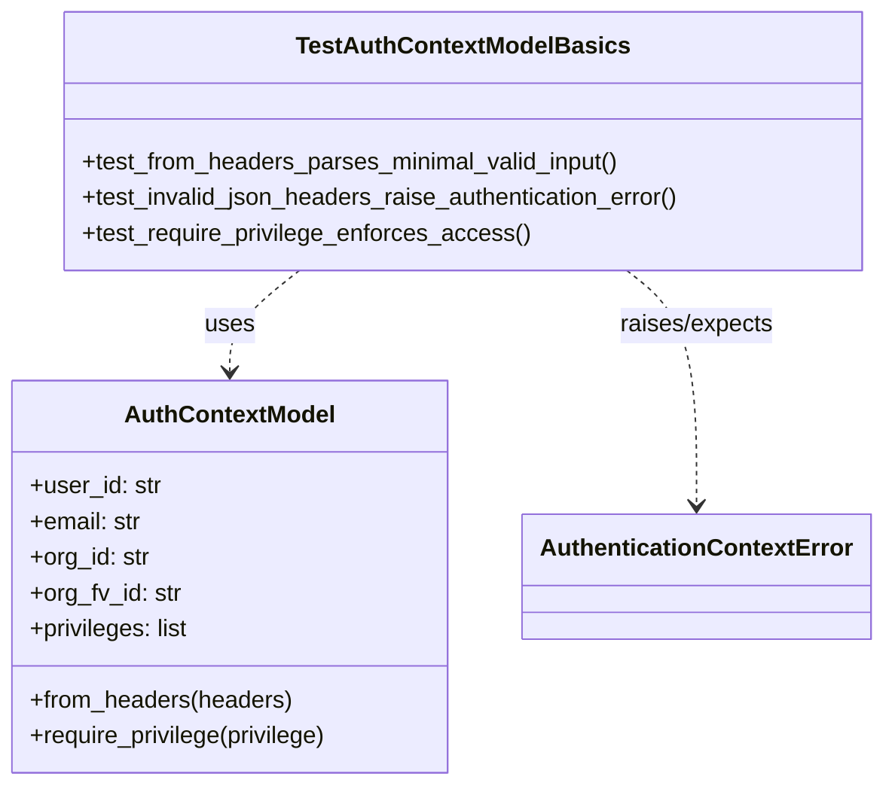

# Diagram: shared/core/tests/unit/test_auth_model.py

> Auto-generated by Obscura crawlers

## Mermaid

### SVG

<svg id="container" width="589.322265625" xmlns="http://www.w3.org/2000/svg" class="classDiagram" height="528" viewBox="0 0 589.322265625 528" role="graphics-document document" aria-roledescription="class"><g><defs><marker id="container_class-aggregationStart" class="marker aggregation class" refX="18" refY="7" markerWidth="190" markerHeight="240" orient="auto"><path d="M 18,7 L9,13 L1,7 L9,1 Z"></path></marker></defs><defs><marker id="container_class-aggregationEnd" class="marker aggregation class" refX="1" refY="7" markerWidth="20" markerHeight="28" orient="auto"><path d="M 18,7 L9,13 L1,7 L9,1 Z"></path></marker></defs><defs><marker id="container_class-extensionStart" class="marker extension class" refX="18" refY="7" markerWidth="190" markerHeight="240" orient="auto"><path d="M 1,7 L18,13 V 1 Z"></path></marker></defs><defs><marker id="container_class-extensionEnd" class="marker extension class" refX="1" refY="7" markerWidth="20" markerHeight="28" orient="auto"><path d="M 1,1 V 13 L18,7 Z"></path></marker></defs><defs><marker id="container_class-compositionStart" class="marker composition class" refX="18" refY="7" markerWidth="190" markerHeight="240" orient="auto"><path d="M 18,7 L9,13 L1,7 L9,1 Z"></path></marker></defs><defs><marker id="container_class-compositionEnd" class="marker composition class" refX="1" refY="7" markerWidth="20" markerHeight="28" orient="auto"><path d="M 18,7 L9,13 L1,7 L9,1 Z"></path></marker></defs><defs><marker id="container_class-dependencyStart" class="marker dependency class" refX="6" refY="7" markerWidth="190" markerHeight="240" orient="auto"><path d="M 5,7 L9,13 L1,7 L9,1 Z"></path></marker></defs><defs><marker id="container_class-dependencyEnd" class="marker dependency class" refX="13" refY="7" markerWidth="20" markerHeight="28" orient="auto"><path d="M 18,7 L9,13 L14,7 L9,1 Z"></path></marker></defs><defs><marker id="container_class-lollipopStart" class="marker lollipop class" refX="13" refY="7" markerWidth="190" markerHeight="240" orient="auto"><circle stroke="black" fill="transparent" cx="7" cy="7" r="6"></circle></marker></defs><defs><marker id="container_class-lollipopEnd" class="marker lollipop class" refX="1" refY="7" markerWidth="190" markerHeight="240" orient="auto"><circle stroke="black" fill="transparent" cx="7" cy="7" r="6"></circle></marker></defs><g class="root"><g class="clusters"></g><g class="edgePaths"><path d="M202.141,182L194.424,188.167C186.707,194.333,171.273,206.667,163.557,218C155.84,229.333,155.84,239.667,155.84,244.833L155.84,250" id="id_TestAuthContextModelBasics_AuthContextModel_1" class="edge-thickness-normal edge-pattern-dashed relation" style=";;;" data-edge="true" data-et="edge" data-id="id_TestAuthContextModelBasics_AuthContextModel_1" data-points="W3sieCI6MjAyLjE0MDU0NjI0NDk1OTcsInkiOjE4Mn0seyJ4IjoxNTUuODM5ODQzNzUsInkiOjIxOX0seyJ4IjoxNTUuODM5ODQzNzUsInkiOjI1Nn1d" marker-end="url(#container_class-dependencyEnd)"></path><path d="M419.879,182L427.596,188.167C435.313,194.333,450.746,206.667,458.463,233C466.18,259.333,466.18,299.667,466.18,319.833L466.18,340" id="id_TestAuthContextModelBasics_AuthenticationContextError_2" class="edge-thickness-normal edge-pattern-dashed relation" style=";;;" data-edge="true" data-et="edge" data-id="id_TestAuthContextModelBasics_AuthenticationContextError_2" data-points="W3sieCI6NDE5Ljg3ODk4NTAwNTA0MDMsInkiOjE4Mn0seyJ4Ijo0NjYuMTc5Njg3NSwieSI6MjE5fSx7IngiOjQ2Ni4xNzk2ODc1LCJ5IjozNDZ9XQ==" marker-end="url(#container_class-dependencyEnd)"></path></g><g class="edgeLabels"><g class="edgeLabel" transform="translate(155.83984375, 219)"><g class="label" data-id="id_TestAuthContextModelBasics_AuthContextModel_1" transform="translate(-16.4921875, -12)"><foreignObject width="32.984375" height="24">

uses

</foreignObject></g></g><g class="edgeLabel" transform="translate(466.1796875, 219)"><g class="label" data-id="id_TestAuthContextModelBasics_AuthenticationContextError_2" transform="translate(-52.7421875, -12)"><foreignObject width="105.484375" height="24">

raises/expects

</foreignObject></g></g></g><g class="nodes"><g class="node default" id="classId-AuthContextModel-0" transform="translate(155.83984375, 388)"><g class="basic label-container"><path d="M-147.83984375 -132 L147.83984375 -132 L147.83984375 132 L-147.83984375 132" stroke="none" stroke-width="0" fill="#ECECFF" style=""></path><path d="M-147.83984375 -132 C-42.50546941826448 -132, 62.828904913471035 -132, 147.83984375 -132 M-147.83984375 -132 C-77.58329150646175 -132, -7.326739262923496 -132, 147.83984375 -132 M147.83984375 -132 C147.83984375 -32.43077184318389, 147.83984375 67.13845631363222, 147.83984375 132 M147.83984375 -132 C147.83984375 -71.44803684626332, 147.83984375 -10.896073692526642, 147.83984375 132 M147.83984375 132 C82.27425120423806 132, 16.70865865847611 132, -147.83984375 132 M147.83984375 132 C43.042166997374636 132, -61.75550975525073 132, -147.83984375 132 M-147.83984375 132 C-147.83984375 41.84881389979181, -147.83984375 -48.302372200416386, -147.83984375 -132 M-147.83984375 132 C-147.83984375 70.47626979882371, -147.83984375 8.952539597647416, -147.83984375 -132" stroke="#9370DB" stroke-width="1.3" fill="none" stroke-dasharray="0 0" style=""></path></g><g class="annotation-group text" transform="translate(0, -108)"></g><g class="label-group text" transform="translate(-67.7265625, -108)"><g class="label" style="font-weight: bolder" transform="translate(0,-12)"><foreignObject width="135.453125" height="24">

AuthContextModel

</foreignObject></g></g><g class="members-group text" transform="translate(-135.83984375, -60)"><g class="label" style="" transform="translate(0,-12)"><foreignObject width="88.296875" height="24">

+user_id: str

</foreignObject></g><g class="label" style="" transform="translate(0,12)"><foreignObject width="75.984375" height="24">

+email: str

</foreignObject></g><g class="label" style="" transform="translate(0,36)"><foreignObject width="81.5625" height="24">

+org_id: str

</foreignObject></g><g class="label" style="" transform="translate(0,60)"><foreignObject width="102.3125" height="24">

+org_fv_id: str

</foreignObject></g><g class="label" style="" transform="translate(0,84)"><foreignObject width="108.6875" height="24">

+privileges: list

</foreignObject></g></g><g class="methods-group text" transform="translate(-135.83984375, 84)"><g class="label" style="" transform="translate(0,-12)"><foreignObject width="177.21875" height="24">

+from_headers(headers)

</foreignObject></g><g class="label" style="" transform="translate(0,12)"><foreignObject width="203.953125" height="24">

+require_privilege(privilege)

</foreignObject></g></g><g class="divider" style=""><path d="M-147.83984375 -84 C-66.89774238242755 -84, 14.044358985144896 -84, 147.83984375 -84 M-147.83984375 -84 C-82.54297986066227 -84, -17.246115971324542 -84, 147.83984375 -84" stroke="#9370DB" stroke-width="1.3" fill="none" stroke-dasharray="0 0" style=""></path></g><g class="divider" style=""><path d="M-147.83984375 60 C-43.98855942519094 60, 59.862724899618115 60, 147.83984375 60 M-147.83984375 60 C-53.662704523676894 60, 40.51443470264621 60, 147.83984375 60" stroke="#9370DB" stroke-width="1.3" fill="none" stroke-dasharray="0 0" style=""></path></g></g><g class="node default" id="classId-AuthenticationContextError-1" transform="translate(466.1796875, 388)"><g class="basic label-container"><path d="M-112.5 -42 L112.5 -42 L112.5 42 L-112.5 42" stroke="none" stroke-width="0" fill="#ECECFF" style=""></path><path d="M-112.5 -42 C-37.33477329929268 -42, 37.830453401414644 -42, 112.5 -42 M-112.5 -42 C-46.13222389492074 -42, 20.235552210158517 -42, 112.5 -42 M112.5 -42 C112.5 -13.357667388352446, 112.5 15.284665223295107, 112.5 42 M112.5 -42 C112.5 -18.18126486846369, 112.5 5.637470263072622, 112.5 42 M112.5 42 C65.88664731881912 42, 19.273294637638216 42, -112.5 42 M112.5 42 C38.1828859368528 42, -36.1342281262944 42, -112.5 42 M-112.5 42 C-112.5 17.67787209598068, -112.5 -6.644255808038643, -112.5 -42 M-112.5 42 C-112.5 24.723717992111343, -112.5 7.447435984222686, -112.5 -42" stroke="#9370DB" stroke-width="1.3" fill="none" stroke-dasharray="0 0" style=""></path></g><g class="annotation-group text" transform="translate(0, -18)"></g><g class="label-group text" transform="translate(-100.5, -18)"><g class="label" style="font-weight: bolder" transform="translate(0,-12)"><foreignObject width="201" height="24">

AuthenticationContextError

</foreignObject></g></g><g class="members-group text" transform="translate(-100.5, 30)"></g><g class="methods-group text" transform="translate(-100.5, 60)"></g><g class="divider" style=""><path d="M-112.5 6 C-31.29451201710397 6, 49.91097596579206 6, 112.5 6 M-112.5 6 C-26.268629563491757 6, 59.962740873016486 6, 112.5 6" stroke="#9370DB" stroke-width="1.3" fill="none" stroke-dasharray="0 0" style=""></path></g><g class="divider" style=""><path d="M-112.5 24 C-51.44454246080736 24, 9.610915078385275 24, 112.5 24 M-112.5 24 C-60.93613543219415 24, -9.372270864388298 24, 112.5 24" stroke="#9370DB" stroke-width="1.3" fill="none" stroke-dasharray="0 0" style=""></path></g></g><g class="node default" id="classId-TestAuthContextModelBasics-2" transform="translate(311.009765625, 95)"><g class="basic label-container"><path d="M-270.3125 -87 L270.3125 -87 L270.3125 87 L-270.3125 87" stroke="none" stroke-width="0" fill="#ECECFF" style=""></path><path d="M-270.3125 -87 C-58.36186700996254 -87, 153.58876598007492 -87, 270.3125 -87 M-270.3125 -87 C-156.64673475982457 -87, -42.980969519649136 -87, 270.3125 -87 M270.3125 -87 C270.3125 -42.83391650062329, 270.3125 1.3321669987534221, 270.3125 87 M270.3125 -87 C270.3125 -30.491374632124433, 270.3125 26.017250735751134, 270.3125 87 M270.3125 87 C66.44348218012439 87, -137.42553563975122 87, -270.3125 87 M270.3125 87 C142.19750641027423 87, 14.082512820548459 87, -270.3125 87 M-270.3125 87 C-270.3125 30.594958723582153, -270.3125 -25.810082552835695, -270.3125 -87 M-270.3125 87 C-270.3125 36.327971747258054, -270.3125 -14.344056505483891, -270.3125 -87" stroke="#9370DB" stroke-width="1.3" fill="none" stroke-dasharray="0 0" style=""></path></g><g class="annotation-group text" transform="translate(0, -63)"></g><g class="label-group text" transform="translate(-106.03125, -63)"><g class="label" style="font-weight: bolder" transform="translate(0,-12)"><foreignObject width="212.0625" height="24">

TestAuthContextModelBasics

</foreignObject></g></g><g class="members-group text" transform="translate(-258.3125, -15)"></g><g class="methods-group text" transform="translate(-258.3125, 15)"><g class="label" style="" transform="translate(0,-12)"><foreignObject width="366.828125" height="24">

+test_from_headers_parses_minimal_valid_input()

</foreignObject></g><g class="label" style="" transform="translate(0,12)"><foreignObject width="410.59375" height="24">

+test_invalid_json_headers_raise_authentication_error()

</foreignObject></g><g class="label" style="" transform="translate(0,36)"><foreignObject width="301.09375" height="24">

+test_require_privilege_enforces_access()

</foreignObject></g></g><g class="divider" style=""><path d="M-270.3125 -39 C-138.49686095342014 -39, -6.681221906840278 -39, 270.3125 -39 M-270.3125 -39 C-85.24559381644002 -39, 99.82131236711996 -39, 270.3125 -39" stroke="#9370DB" stroke-width="1.3" fill="none" stroke-dasharray="0 0" style=""></path></g><g class="divider" style=""><path d="M-270.3125 -15 C-144.46385161208022 -15, -18.61520322416044 -15, 270.3125 -15 M-270.3125 -15 C-60.020998914282586 -15, 150.27050217143483 -15, 270.3125 -15" stroke="#9370DB" stroke-width="1.3" fill="none" stroke-dasharray="0 0" style=""></path></g></g></g></g></g></svg>
