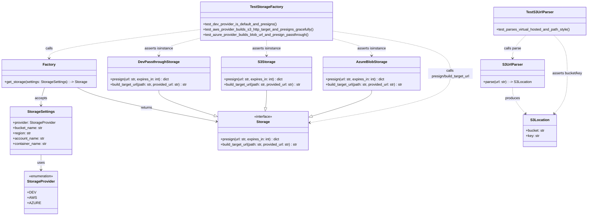

# Diagram: shared/core/tests/unit/test_storage_factory_and_providers.py

> Auto-generated by Obscura crawlers

## Mermaid

### SVG

<svg id="container" width="2650.744140625" xmlns="http://www.w3.org/2000/svg" class="classDiagram" height="970" viewBox="0 0 2650.744140625 970" role="graphics-document document" aria-roledescription="class"><g><defs><marker id="container_class-aggregationStart" class="marker aggregation class" refX="18" refY="7" markerWidth="190" markerHeight="240" orient="auto"><path d="M 18,7 L9,13 L1,7 L9,1 Z"></path></marker></defs><defs><marker id="container_class-aggregationEnd" class="marker aggregation class" refX="1" refY="7" markerWidth="20" markerHeight="28" orient="auto"><path d="M 18,7 L9,13 L1,7 L9,1 Z"></path></marker></defs><defs><marker id="container_class-extensionStart" class="marker extension class" refX="18" refY="7" markerWidth="190" markerHeight="240" orient="auto"><path d="M 1,7 L18,13 V 1 Z"></path></marker></defs><defs><marker id="container_class-extensionEnd" class="marker extension class" refX="1" refY="7" markerWidth="20" markerHeight="28" orient="auto"><path d="M 1,1 V 13 L18,7 Z"></path></marker></defs><defs><marker id="container_class-compositionStart" class="marker composition class" refX="18" refY="7" markerWidth="190" markerHeight="240" orient="auto"><path d="M 18,7 L9,13 L1,7 L9,1 Z"></path></marker></defs><defs><marker id="container_class-compositionEnd" class="marker composition class" refX="1" refY="7" markerWidth="20" markerHeight="28" orient="auto"><path d="M 18,7 L9,13 L1,7 L9,1 Z"></path></marker></defs><defs><marker id="container_class-dependencyStart" class="marker dependency class" refX="6" refY="7" markerWidth="190" markerHeight="240" orient="auto"><path d="M 5,7 L9,13 L1,7 L9,1 Z"></path></marker></defs><defs><marker id="container_class-dependencyEnd" class="marker dependency class" refX="13" refY="7" markerWidth="20" markerHeight="28" orient="auto"><path d="M 18,7 L9,13 L14,7 L9,1 Z"></path></marker></defs><defs><marker id="container_class-lollipopStart" class="marker lollipop class" refX="13" refY="7" markerWidth="190" markerHeight="240" orient="auto"><circle stroke="black" fill="transparent" cx="7" cy="7" r="6"></circle></marker></defs><defs><marker id="container_class-lollipopEnd" class="marker lollipop class" refX="1" refY="7" markerWidth="190" markerHeight="240" orient="auto"><circle stroke="black" fill="transparent" cx="7" cy="7" r="6"></circle></marker></defs><g class="root"><g class="clusters"></g><g class="edgePaths"><path d="M179.746,696L179.746,702.167C179.746,708.333,179.746,720.667,179.746,732C179.746,743.333,179.746,753.667,179.746,758.833L179.746,764" id="id_StorageSettings_StorageProvider_1" class="edge-thickness-normal edge-pattern-solid relation" style=";;;" data-edge="true" data-et="edge" data-id="id_StorageSettings_StorageProvider_1" data-points="W3sieCI6MTc5Ljc0NjA5Mzc1LCJ5Ijo2OTZ9LHsieCI6MTc5Ljc0NjA5Mzc1LCJ5Ijo3MzN9LHsieCI6MTc5Ljc0NjA5Mzc1LCJ5Ijo3NzB9XQ==" marker-end="url(#container_class-dependencyEnd)"></path><path d="M195.865,394L193.179,402.167C190.492,410.333,185.119,426.667,182.433,440C179.746,453.333,179.746,463.667,179.746,468.833L179.746,474" id="id_Factory_StorageSettings_2" class="edge-thickness-normal edge-pattern-solid relation" style=";;;" data-edge="true" data-et="edge" data-id="id_Factory_StorageSettings_2" data-points="W3sieCI6MTk1Ljg2NTIzNDM3NSwieSI6Mzk0fSx7IngiOjE3OS43NDYwOTM3NSwieSI6NDQzfSx7IngiOjE3OS43NDYwOTM3NSwieSI6NDgwfV0=" marker-end="url(#container_class-dependencyEnd)"></path><path d="M341.804,394L358.036,402.167C374.267,410.333,406.73,426.667,510.866,451.984C615.001,477.301,790.809,511.603,878.713,528.754L966.617,545.904" id="id_Factory_Storage_3" class="edge-thickness-normal edge-pattern-solid relation" style=";;;" data-edge="true" data-et="edge" data-id="id_Factory_Storage_3" data-points="W3sieCI6MzQxLjgwNDMyMTI4OTA2MjUsInkiOjM5NH0seyJ4Ijo0MzkuMTkzMzU5Mzc1LCJ5Ijo0NDN9LHsieCI6OTcyLjUwNTg1OTM3NSwieSI6NTQ3LjA1MzMxODE5NTY3NTN9XQ==" marker-end="url(#container_class-dependencyEnd)"></path><path d="M708.063,406L708.063,412.167C708.063,418.333,708.063,430.667,749.387,449.467C790.711,468.266,873.36,493.533,914.685,506.166L956.009,518.799" id="id_DevPassthroughStorage_Storage_4" class="edge-thickness-normal edge-pattern-solid relation" style=";;;" data-edge="true" data-et="edge" data-id="id_DevPassthroughStorage_Storage_4" data-points="W3sieCI6NzA4LjA2MjUsInkiOjQwNn0seyJ4Ijo3MDguMDYyNSwieSI6NDQzfSx7IngiOjk3Mi41MDU4NTkzNzUsInkiOjUyMy44NDIxNTU3NjA2MjN9XQ==" marker-end="url(#container_class-extensionEnd)"></path><path d="M1198.711,406L1198.711,412.167C1198.711,418.333,1198.711,430.667,1197.944,443.643C1197.176,456.619,1195.642,470.239,1194.874,477.049L1194.107,483.858" id="id_S3Storage_Storage_5" class="edge-thickness-normal edge-pattern-solid relation" style=";;;" data-edge="true" data-et="edge" data-id="id_S3Storage_Storage_5" data-points="W3sieCI6MTE5OC43MTA5Mzc1LCJ5Ijo0MDZ9LHsieCI6MTE5OC43MTA5Mzc1LCJ5Ijo0NDN9LHsieCI6MTE5Mi4xNzU3ODEyNSwieSI6NTAxfV0=" marker-end="url(#container_class-extensionEnd)"></path><path d="M1678.371,406L1678.371,412.167C1678.371,418.333,1678.371,430.667,1633.442,449.968C1588.513,469.269,1498.655,495.538,1453.726,508.673L1408.797,521.807" id="id_AzureBlobStorage_Storage_6" class="edge-thickness-normal edge-pattern-solid relation" style=";;;" data-edge="true" data-et="edge" data-id="id_AzureBlobStorage_Storage_6" data-points="W3sieCI6MTY3OC4zNzEwOTM3NSwieSI6NDA2fSx7IngiOjE2NzguMzcxMDkzNzUsInkiOjQ0M30seyJ4IjoxMzkyLjI0MDIzNDM3NSwieSI6NTI2LjY0NzQ1NTYxMTUxNTZ9XQ==" marker-end="url(#container_class-extensionEnd)"></path><path d="M2311.816,394L2311.816,402.167C2311.816,410.333,2311.816,426.667,2321.464,446.237C2331.113,465.807,2350.409,488.613,2360.057,500.016L2369.705,511.42" id="id_S3UrlParser_S3Location_7" class="edge-thickness-normal edge-pattern-dashed relation" style=";;;" data-edge="true" data-et="edge" data-id="id_S3UrlParser_S3Location_7" data-points="W3sieCI6MjMxMS44MTY0MDYyNSwieSI6Mzk0fSx7IngiOjIzMTEuODE2NDA2MjUsInkiOjQ0M30seyJ4IjoyMzczLjU4MDI2NjcwMjU4NjQsInkiOjUxNn1d" marker-end="url(#container_class-dependencyEnd)"></path><path d="M902.367,132.416L788.071,146.846C673.775,161.277,445.182,190.139,330.886,211.736C216.59,233.333,216.59,247.667,216.59,254.833L216.59,262" id="id_TestStorageFactory_Factory_8" class="edge-thickness-normal edge-pattern-dashed relation" style=";;;" data-edge="true" data-et="edge" data-id="id_TestStorageFactory_Factory_8" data-points="W3sieCI6OTAyLjM2NzE4NzUsInkiOjEzMi40MTU1NzQ1NDk2NjMzMn0seyJ4IjoyMTYuNTg5ODQzNzUsInkiOjIxOX0seyJ4IjoyMTYuNTg5ODQzNzUsInkiOjI2OH1d" marker-end="url(#container_class-dependencyEnd)"></path><path d="M902.367,169.894L869.983,178.078C837.599,186.263,772.831,202.631,740.447,215.982C708.063,229.333,708.063,239.667,708.063,244.833L708.063,250" id="id_TestStorageFactory_DevPassthroughStorage_9" class="edge-thickness-normal edge-pattern-dashed relation" style=";;;" data-edge="true" data-et="edge" data-id="id_TestStorageFactory_DevPassthroughStorage_9" data-points="W3sieCI6OTAyLjM2NzE4NzUsInkiOjE2OS44OTQwMDE4Nzg4OTExMn0seyJ4Ijo3MDguMDYyNSwieSI6MjE5fSx7IngiOjcwOC4wNjI1LCJ5IjoyNTZ9XQ==" marker-end="url(#container_class-dependencyEnd)"></path><path d="M1198.711,182L1198.711,188.167C1198.711,194.333,1198.711,206.667,1198.711,218C1198.711,229.333,1198.711,239.667,1198.711,244.833L1198.711,250" id="id_TestStorageFactory_S3Storage_10" class="edge-thickness-normal edge-pattern-dashed relation" style=";;;" data-edge="true" data-et="edge" data-id="id_TestStorageFactory_S3Storage_10" data-points="W3sieCI6MTE5OC43MTA5Mzc1LCJ5IjoxODJ9LHsieCI6MTE5OC43MTA5Mzc1LCJ5IjoyMTl9LHsieCI6MTE5OC43MTA5Mzc1LCJ5IjoyNTZ9XQ==" marker-end="url(#container_class-dependencyEnd)"></path><path d="M1495.055,171.61L1525.607,179.508C1556.16,187.406,1617.266,203.203,1647.818,216.268C1678.371,229.333,1678.371,239.667,1678.371,244.833L1678.371,250" id="id_TestStorageFactory_AzureBlobStorage_11" class="edge-thickness-normal edge-pattern-dashed relation" style=";;;" data-edge="true" data-et="edge" data-id="id_TestStorageFactory_AzureBlobStorage_11" data-points="W3sieCI6MTQ5NS4wNTQ2ODc1LCJ5IjoxNzEuNjA5NzA5MDIyNTAxMjh9LHsieCI6MTY3OC4zNzEwOTM3NSwieSI6MjE5fSx7IngiOjE2NzguMzcxMDkzNzUsInkiOjI1Nn1d" marker-end="url(#container_class-dependencyEnd)"></path><path d="M1495.055,138.926L1585.09,152.272C1675.125,165.617,1855.195,192.309,1945.23,224.321C2035.266,256.333,2035.266,293.667,2035.266,331C2035.266,368.333,2035.266,405.667,1929.081,442.386C1822.896,479.105,1610.525,515.21,1504.34,533.262L1398.155,551.315" id="id_TestStorageFactory_Storage_12" class="edge-thickness-normal edge-pattern-dashed relation" style=";;;" data-edge="true" data-et="edge" data-id="id_TestStorageFactory_Storage_12" data-points="W3sieCI6MTQ5NS4wNTQ2ODc1LCJ5IjoxMzguOTI2MTQ3OTg0MTk4NTZ9LHsieCI6MjAzNS4yNjU2MjUsInkiOjIxOX0seyJ4IjoyMDM1LjI2NTYyNSwieSI6MzMxfSx7IngiOjIwMzUuMjY1NjI1LCJ5Ijo0NDN9LHsieCI6MTM5Mi4yNDAyMzQzNzUsInkiOjU1Mi4zMjA1NDUyMDM0NzgxfV0=" marker-end="url(#container_class-dependencyEnd)"></path><path d="M2372.168,158L2362.109,168.167C2352.051,178.333,2331.934,198.667,2321.875,216C2311.816,233.333,2311.816,247.667,2311.816,254.833L2311.816,262" id="id_TestS3UrlParser_S3UrlParser_13" class="edge-thickness-normal edge-pattern-dashed relation" style=";;;" data-edge="true" data-et="edge" data-id="id_TestS3UrlParser_S3UrlParser_13" data-points="W3sieCI6MjM3Mi4xNjc4NTg0OTI5NDM3LCJ5IjoxNTh9LHsieCI6MjMxMS44MTY0MDYyNSwieSI6MjE5fSx7IngiOjIzMTEuODE2NDA2MjUsInkiOjI2OH1d" marker-end="url(#container_class-dependencyEnd)"></path><path d="M2496.828,158L2506.887,168.167C2516.945,178.333,2537.063,198.667,2547.121,227.5C2557.18,256.333,2557.18,293.667,2557.18,331C2557.18,368.333,2557.18,405.667,2547.532,435.737C2537.884,465.807,2518.587,488.613,2508.939,500.016L2499.291,511.42" id="id_TestS3UrlParser_S3Location_14" class="edge-thickness-normal edge-pattern-dashed relation" style=";;;" data-edge="true" data-et="edge" data-id="id_TestS3UrlParser_S3Location_14" data-points="W3sieCI6MjQ5Ni44MjgyMzUyNTcwNTYzLCJ5IjoxNTh9LHsieCI6MjU1Ny4xNzk2ODc1LCJ5IjoyMTl9LHsieCI6MjU1Ny4xNzk2ODc1LCJ5IjozMzF9LHsieCI6MjU1Ny4xNzk2ODc1LCJ5Ijo0NDN9LHsieCI6MjQ5NS40MTU4MjcwNDc0MTM2LCJ5Ijo1MTZ9XQ==" marker-end="url(#container_class-dependencyEnd)"></path></g><g class="edgeLabels"><g class="edgeLabel" transform="translate(179.74609375, 733)"><g class="label" data-id="id_StorageSettings_StorageProvider_1" transform="translate(-16.4921875, -12)"><foreignObject width="32.984375" height="24">

uses

</foreignObject></g></g><g class="edgeLabel" transform="translate(179.74609375, 443)"><g class="label" data-id="id_Factory_StorageSettings_2" transform="translate(-27.421875, -12)"><foreignObject width="54.84375" height="24">

accepts

</foreignObject></g></g><g class="edgeLabel" transform="translate(652.34782, 484.58805)"><g class="label" data-id="id_Factory_Storage_3" transform="translate(-26.265625, -12)"><foreignObject width="52.53125" height="24">

returns

</foreignObject></g></g><g class="edgeLabel"><g class="label" data-id="id_DevPassthroughStorage_Storage_4" transform="translate(0, 0)"><foreignObject width="0" height="0">

</foreignObject></g></g><g class="edgeLabel"><g class="label" data-id="id_S3Storage_Storage_5" transform="translate(0, 0)"><foreignObject width="0" height="0">

</foreignObject></g></g><g class="edgeLabel"><g class="label" data-id="id_AzureBlobStorage_Storage_6" transform="translate(0, 0)"><foreignObject width="0" height="0">

</foreignObject></g></g><g class="edgeLabel" transform="translate(2311.81640625, 443)"><g class="label" data-id="id_S3UrlParser_S3Location_7" transform="translate(-33.4765625, -12)"><foreignObject width="66.953125" height="24">

produces

</foreignObject></g></g><g class="edgeLabel" transform="translate(216.58984375, 219)"><g class="label" data-id="id_TestStorageFactory_Factory_8" transform="translate(-16.4453125, -12)"><foreignObject width="32.890625" height="24">

calls

</foreignObject></g></g><g class="edgeLabel" transform="translate(708.0625, 219)"><g class="label" data-id="id_TestStorageFactory_DevPassthroughStorage_9" transform="translate(-64.4296875, -12)"><foreignObject width="128.859375" height="24">

asserts isinstance

</foreignObject></g></g><g class="edgeLabel" transform="translate(1198.7109375, 219)"><g class="label" data-id="id_TestStorageFactory_S3Storage_10" transform="translate(-64.4296875, -12)"><foreignObject width="128.859375" height="24">

asserts isinstance

</foreignObject></g></g><g class="edgeLabel" transform="translate(1678.37109375, 219)"><g class="label" data-id="id_TestStorageFactory_AzureBlobStorage_11" transform="translate(-64.4296875, -12)"><foreignObject width="128.859375" height="24">

asserts isinstance

</foreignObject></g></g><g class="edgeLabel" transform="translate(2035.265625, 331)"><g class="label" data-id="id_TestStorageFactory_Storage_12" transform="translate(-100, -24)"><foreignObject width="200" height="48">

calls presign/build_target_url

</foreignObject></g></g><g class="edgeLabel" transform="translate(2311.81640625, 219)"><g class="label" data-id="id_TestS3UrlParser_S3UrlParser_13" transform="translate(-38.6484375, -12)"><foreignObject width="77.296875" height="24">

calls parse

</foreignObject></g></g><g class="edgeLabel" transform="translate(2557.1796875, 331)"><g class="label" data-id="id_TestS3UrlParser_S3Location_14" transform="translate(-68.8125, -12)"><foreignObject width="137.625" height="24">

asserts bucket/key

</foreignObject></g></g></g><g class="nodes"><g class="node default" id="classId-StorageSettings-0" transform="translate(179.74609375, 588)"><g class="basic label-container"><path d="M-137.609375 -108 L137.609375 -108 L137.609375 108 L-137.609375 108" stroke="none" stroke-width="0" fill="#ECECFF" style=""></path><path d="M-137.609375 -108 C-82.4126141287322 -108, -27.215853257464417 -108, 137.609375 -108 M-137.609375 -108 C-78.1563495513227 -108, -18.70332410264541 -108, 137.609375 -108 M137.609375 -108 C137.609375 -27.837543885973417, 137.609375 52.324912228053165, 137.609375 108 M137.609375 -108 C137.609375 -40.00421105922064, 137.609375 27.991577881558726, 137.609375 108 M137.609375 108 C56.813762885855425 108, -23.98184922828915 108, -137.609375 108 M137.609375 108 C30.5664321232709 108, -76.4765107534582 108, -137.609375 108 M-137.609375 108 C-137.609375 28.375410297809893, -137.609375 -51.249179404380214, -137.609375 -108 M-137.609375 108 C-137.609375 49.26003478302686, -137.609375 -9.47993043394628, -137.609375 -108" stroke="#9370DB" stroke-width="1.3" fill="none" stroke-dasharray="0 0" style=""></path></g><g class="annotation-group text" transform="translate(0, -84)"></g><g class="label-group text" transform="translate(-58.3125, -84)"><g class="label" style="font-weight: bolder" transform="translate(0,-12)"><foreignObject width="116.625" height="24">

StorageSettings

</foreignObject></g></g><g class="members-group text" transform="translate(-125.609375, -36)"><g class="label" style="" transform="translate(0,-12)"><foreignObject width="192.90625" height="24">

+provider: StorageProvider

</foreignObject></g><g class="label" style="" transform="translate(0,12)"><foreignObject width="133.34375" height="24">

+bucket_name: str

</foreignObject></g><g class="label" style="" transform="translate(0,36)"><foreignObject width="81.46875" height="24">

+region: str

</foreignObject></g><g class="label" style="" transform="translate(0,60)"><foreignObject width="141.25" height="24">

+account_name: str

</foreignObject></g><g class="label" style="" transform="translate(0,84)"><foreignObject width="152.25" height="24">

+container_name: str

</foreignObject></g></g><g class="methods-group text" transform="translate(-125.609375, 108)"></g><g class="divider" style=""><path d="M-137.609375 -60 C-77.93431338503558 -60, -18.25925177007116 -60, 137.609375 -60 M-137.609375 -60 C-70.4214438424785 -60, -3.2335126849569917 -60, 137.609375 -60" stroke="#9370DB" stroke-width="1.3" fill="none" stroke-dasharray="0 0" style=""></path></g><g class="divider" style=""><path d="M-137.609375 84 C-81.3743454959761 84, -25.139315991952202 84, 137.609375 84 M-137.609375 84 C-48.79568636674445 84, 40.018002266511104 84, 137.609375 84" stroke="#9370DB" stroke-width="1.3" fill="none" stroke-dasharray="0 0" style=""></path></g></g><g class="node default" id="classId-StorageProvider-1" transform="translate(179.74609375, 866)"><g class="basic label-container"><path d="M-71.078125 -96 L71.078125 -96 L71.078125 96 L-71.078125 96" stroke="none" stroke-width="0" fill="#ECECFF" style=""></path><path d="M-71.078125 -96 C-31.77815055643363 -96, 7.52182388713274 -96, 71.078125 -96 M-71.078125 -96 C-29.745655688086686 -96, 11.586813623826629 -96, 71.078125 -96 M71.078125 -96 C71.078125 -30.751000398061564, 71.078125 34.49799920387687, 71.078125 96 M71.078125 -96 C71.078125 -30.557476361749337, 71.078125 34.885047276501325, 71.078125 96 M71.078125 96 C26.417809774472786 96, -18.242505451054427 96, -71.078125 96 M71.078125 96 C25.75155339969197 96, -19.575018200616057 96, -71.078125 96 M-71.078125 96 C-71.078125 30.243172566762922, -71.078125 -35.513654866474155, -71.078125 -96 M-71.078125 96 C-71.078125 43.0875795698525, -71.078125 -9.824840860294998, -71.078125 -96" stroke="#9370DB" stroke-width="1.3" fill="none" stroke-dasharray="0 0" style=""></path></g><g class="annotation-group text" transform="translate(-55.5546875, -72)"><g class="label" style="" transform="translate(0,-12)"><foreignObject width="111.109375" height="24">

«enumeration»

</foreignObject></g></g><g class="label-group text" transform="translate(-59.078125, -48)"><g class="label" style="font-weight: bolder" transform="translate(0,-12)"><foreignObject width="118.15625" height="24">

StorageProvider

</foreignObject></g></g><g class="members-group text" transform="translate(-59.078125, 0)"><g class="label" style="" transform="translate(0,-12)"><foreignObject width="35.75" height="24">

+DEV

</foreignObject></g><g class="label" style="" transform="translate(0,12)"><foreignObject width="38.78125" height="24">

+AWS

</foreignObject></g><g class="label" style="" transform="translate(0,36)"><foreignObject width="54.03125" height="24">

+AZURE

</foreignObject></g></g><g class="methods-group text" transform="translate(-59.078125, 96)"></g><g class="divider" style=""><path d="M-71.078125 -24 C-20.171658906586863 -24, 30.734807186826274 -24, 71.078125 -24 M-71.078125 -24 C-18.67184812928741 -24, 33.73442874142518 -24, 71.078125 -24" stroke="#9370DB" stroke-width="1.3" fill="none" stroke-dasharray="0 0" style=""></path></g><g class="divider" style=""><path d="M-71.078125 72 C-38.56046828411623 72, -6.042811568232466 72, 71.078125 72 M-71.078125 72 C-16.676827232180038 72, 37.724470535639924 72, 71.078125 72" stroke="#9370DB" stroke-width="1.3" fill="none" stroke-dasharray="0 0" style=""></path></g></g><g class="node default" id="classId-Storage-2" transform="translate(1182.373046875, 588)"><g class="basic label-container"><path d="M-209.8671875 -87 L209.8671875 -87 L209.8671875 87 L-209.8671875 87" stroke="none" stroke-width="0" fill="#ECECFF" style=""></path><path d="M-209.8671875 -87 C-116.50633283878058 -87, -23.14547817756116 -87, 209.8671875 -87 M-209.8671875 -87 C-102.6859257456792 -87, 4.495336008641601 -87, 209.8671875 -87 M209.8671875 -87 C209.8671875 -19.519336944382943, 209.8671875 47.961326111234115, 209.8671875 87 M209.8671875 -87 C209.8671875 -25.985690753232504, 209.8671875 35.02861849353499, 209.8671875 87 M209.8671875 87 C62.51761899369805 87, -84.8319495126039 87, -209.8671875 87 M209.8671875 87 C63.08916934263081 87, -83.68884881473838 87, -209.8671875 87 M-209.8671875 87 C-209.8671875 35.22703346339266, -209.8671875 -16.545933073214684, -209.8671875 -87 M-209.8671875 87 C-209.8671875 29.992498005368844, -209.8671875 -27.01500398926231, -209.8671875 -87" stroke="#9370DB" stroke-width="1.3" fill="none" stroke-dasharray="0 0" style=""></path></g><g class="annotation-group text" transform="translate(-41.015625, -63)"><g class="label" style="" transform="translate(0,-12)"><foreignObject width="82.03125" height="24">

«interface»

</foreignObject></g></g><g class="label-group text" transform="translate(-28.078125, -39)"><g class="label" style="font-weight: bolder" transform="translate(0,-12)"><foreignObject width="56.15625" height="24">

Storage

</foreignObject></g></g><g class="members-group text" transform="translate(-197.8671875, 9)"></g><g class="methods-group text" transform="translate(-197.8671875, 39)"><g class="label" style="" transform="translate(0,-12)"><foreignObject width="268.296875" height="24">

+presign(url: str, expires_in: int) : dict

</foreignObject></g><g class="label" style="" transform="translate(0,12)"><foreignObject width="354.71875" height="24">

+build_target_url(path: str, provided_url: str) : str

</foreignObject></g></g><g class="divider" style=""><path d="M-209.8671875 -15 C-65.98032753689617 -15, 77.90653242620766 -15, 209.8671875 -15 M-209.8671875 -15 C-123.79487952186594 -15, -37.722571543731874 -15, 209.8671875 -15" stroke="#9370DB" stroke-width="1.3" fill="none" stroke-dasharray="0 0" style=""></path></g><g class="divider" style=""><path d="M-209.8671875 9 C-125.05908403817674 9, -40.25098057635347 9, 209.8671875 9 M-209.8671875 9 C-52.82072629977702 9, 104.22573490044596 9, 209.8671875 9" stroke="#9370DB" stroke-width="1.3" fill="none" stroke-dasharray="0 0" style=""></path></g></g><g class="node default" id="classId-DevPassthroughStorage-3" transform="translate(708.0625, 331)"><g class="basic label-container"><path d="M-232.8828125 -75 L232.8828125 -75 L232.8828125 75 L-232.8828125 75" stroke="none" stroke-width="0" fill="#ECECFF" style=""></path><path d="M-232.8828125 -75 C-79.5006488950163 -75, 73.8815147099674 -75, 232.8828125 -75 M-232.8828125 -75 C-126.46468813333578 -75, -20.046563766671568 -75, 232.8828125 -75 M232.8828125 -75 C232.8828125 -44.03443242258148, 232.8828125 -13.068864845162963, 232.8828125 75 M232.8828125 -75 C232.8828125 -40.48255932018962, 232.8828125 -5.965118640379245, 232.8828125 75 M232.8828125 75 C104.46097023125336 75, -23.96087203749329 75, -232.8828125 75 M232.8828125 75 C80.30685508546063 75, -72.26910232907875 75, -232.8828125 75 M-232.8828125 75 C-232.8828125 37.34667906390283, -232.8828125 -0.3066418721943336, -232.8828125 -75 M-232.8828125 75 C-232.8828125 19.045846108950137, -232.8828125 -36.908307782099726, -232.8828125 -75" stroke="#9370DB" stroke-width="1.3" fill="none" stroke-dasharray="0 0" style=""></path></g><g class="annotation-group text" transform="translate(0, -51)"></g><g class="label-group text" transform="translate(-87.046875, -51)"><g class="label" style="font-weight: bolder" transform="translate(0,-12)"><foreignObject width="174.09375" height="24">

DevPassthroughStorage

</foreignObject></g></g><g class="members-group text" transform="translate(-220.8828125, -3)"></g><g class="methods-group text" transform="translate(-220.8828125, 27)"><g class="label" style="" transform="translate(0,-12)"><foreignObject width="268.296875" height="24">

+presign(url: str, expires_in: int) : dict

</foreignObject></g><g class="label" style="" transform="translate(0,12)"><foreignObject width="354.71875" height="24">

+build_target_url(path: str, provided_url: str) : str

</foreignObject></g></g><g class="divider" style=""><path d="M-232.8828125 -27 C-106.9166368072202 -27, 19.0495388855596 -27, 232.8828125 -27 M-232.8828125 -27 C-121.88261039164021 -27, -10.882408283280427 -27, 232.8828125 -27" stroke="#9370DB" stroke-width="1.3" fill="none" stroke-dasharray="0 0" style=""></path></g><g class="divider" style=""><path d="M-232.8828125 -3 C-133.49805377231814 -3, -34.11329504463629 -3, 232.8828125 -3 M-232.8828125 -3 C-77.65577285202684 -3, 77.57126679594631 -3, 232.8828125 -3" stroke="#9370DB" stroke-width="1.3" fill="none" stroke-dasharray="0 0" style=""></path></g></g><g class="node default" id="classId-S3Storage-4" transform="translate(1198.7109375, 331)"><g class="basic label-container"><path d="M-207.765625 -75 L207.765625 -75 L207.765625 75 L-207.765625 75" stroke="none" stroke-width="0" fill="#ECECFF" style=""></path><path d="M-207.765625 -75 C-108.89789723608067 -75, -10.030169472161333 -75, 207.765625 -75 M-207.765625 -75 C-111.39489286834824 -75, -15.024160736696473 -75, 207.765625 -75 M207.765625 -75 C207.765625 -19.611742952504457, 207.765625 35.776514094991086, 207.765625 75 M207.765625 -75 C207.765625 -28.19235247305886, 207.765625 18.615295053882278, 207.765625 75 M207.765625 75 C90.99568691602029 75, -25.77425116795942 75, -207.765625 75 M207.765625 75 C121.97230348640377 75, 36.17898197280755 75, -207.765625 75 M-207.765625 75 C-207.765625 18.572348407785007, -207.765625 -37.855303184429985, -207.765625 -75 M-207.765625 75 C-207.765625 30.097676481494453, -207.765625 -14.804647037011094, -207.765625 -75" stroke="#9370DB" stroke-width="1.3" fill="none" stroke-dasharray="0 0" style=""></path></g><g class="annotation-group text" transform="translate(0, -51)"></g><g class="label-group text" transform="translate(-36.8125, -51)"><g class="label" style="font-weight: bolder" transform="translate(0,-12)"><foreignObject width="73.625" height="24">

S3Storage

</foreignObject></g></g><g class="members-group text" transform="translate(-195.765625, -3)"></g><g class="methods-group text" transform="translate(-195.765625, 27)"><g class="label" style="" transform="translate(0,-12)"><foreignObject width="268.296875" height="24">

+presign(url: str, expires_in: int) : dict

</foreignObject></g><g class="label" style="" transform="translate(0,12)"><foreignObject width="354.71875" height="24">

+build_target_url(path: str, provided_url: str) : str

</foreignObject></g></g><g class="divider" style=""><path d="M-207.765625 -27 C-70.90015624468555 -27, 65.9653125106289 -27, 207.765625 -27 M-207.765625 -27 C-57.70616762101872 -27, 92.35328975796256 -27, 207.765625 -27" stroke="#9370DB" stroke-width="1.3" fill="none" stroke-dasharray="0 0" style=""></path></g><g class="divider" style=""><path d="M-207.765625 -3 C-45.92589948573129 -3, 115.91382602853741 -3, 207.765625 -3 M-207.765625 -3 C-102.91102531010193 -3, 1.9435743797961322 -3, 207.765625 -3" stroke="#9370DB" stroke-width="1.3" fill="none" stroke-dasharray="0 0" style=""></path></g></g><g class="node default" id="classId-AzureBlobStorage-5" transform="translate(1678.37109375, 331)"><g class="basic label-container"><path d="M-221.89453125 -75 L221.89453125 -75 L221.89453125 75 L-221.89453125 75" stroke="none" stroke-width="0" fill="#ECECFF" style=""></path><path d="M-221.89453125 -75 C-105.45169772632995 -75, 10.991135797340092 -75, 221.89453125 -75 M-221.89453125 -75 C-117.47609303804758 -75, -13.05765482609516 -75, 221.89453125 -75 M221.89453125 -75 C221.89453125 -33.58613824921154, 221.89453125 7.827723501576926, 221.89453125 75 M221.89453125 -75 C221.89453125 -33.20662643617606, 221.89453125 8.586747127647882, 221.89453125 75 M221.89453125 75 C91.9697027738836 75, -37.955125702232806 75, -221.89453125 75 M221.89453125 75 C86.7759952351054 75, -48.3425407797892 75, -221.89453125 75 M-221.89453125 75 C-221.89453125 32.56438647745108, -221.89453125 -9.87122704509784, -221.89453125 -75 M-221.89453125 75 C-221.89453125 18.689989696675646, -221.89453125 -37.62002060664871, -221.89453125 -75" stroke="#9370DB" stroke-width="1.3" fill="none" stroke-dasharray="0 0" style=""></path></g><g class="annotation-group text" transform="translate(0, -51)"></g><g class="label-group text" transform="translate(-65.0703125, -51)"><g class="label" style="font-weight: bolder" transform="translate(0,-12)"><foreignObject width="130.140625" height="24">

AzureBlobStorage

</foreignObject></g></g><g class="members-group text" transform="translate(-209.89453125, -3)"></g><g class="methods-group text" transform="translate(-209.89453125, 27)"><g class="label" style="" transform="translate(0,-12)"><foreignObject width="268.296875" height="24">

+presign(url: str, expires_in: int) : dict

</foreignObject></g><g class="label" style="" transform="translate(0,12)"><foreignObject width="354.71875" height="24">

+build_target_url(path: str, provided_url: str) : str

</foreignObject></g></g><g class="divider" style=""><path d="M-221.89453125 -27 C-118.46028292574526 -27, -15.026034601490522 -27, 221.89453125 -27 M-221.89453125 -27 C-84.21401870048064 -27, 53.46649384903873 -27, 221.89453125 -27" stroke="#9370DB" stroke-width="1.3" fill="none" stroke-dasharray="0 0" style=""></path></g><g class="divider" style=""><path d="M-221.89453125 -3 C-66.44459310675265 -3, 89.0053450364947 -3, 221.89453125 -3 M-221.89453125 -3 C-88.76904787227326 -3, 44.356435505453476 -3, 221.89453125 -3" stroke="#9370DB" stroke-width="1.3" fill="none" stroke-dasharray="0 0" style=""></path></g></g><g class="node default" id="classId-S3UrlParser-6" transform="translate(2311.81640625, 331)"><g class="basic label-container"><path d="M-141.55078125 -63 L141.55078125 -63 L141.55078125 63 L-141.55078125 63" stroke="none" stroke-width="0" fill="#ECECFF" style=""></path><path d="M-141.55078125 -63 C-46.45447957775198 -63, 48.641822094496035 -63, 141.55078125 -63 M-141.55078125 -63 C-58.30101390833316 -63, 24.94875343333368 -63, 141.55078125 -63 M141.55078125 -63 C141.55078125 -17.07491909900434, 141.55078125 28.85016180199132, 141.55078125 63 M141.55078125 -63 C141.55078125 -37.40323907074722, 141.55078125 -11.806478141494438, 141.55078125 63 M141.55078125 63 C44.01358247712872 63, -53.523616295742556 63, -141.55078125 63 M141.55078125 63 C48.93907430733027 63, -43.672632635339454 63, -141.55078125 63 M-141.55078125 63 C-141.55078125 26.90281552382006, -141.55078125 -9.19436895235988, -141.55078125 -63 M-141.55078125 63 C-141.55078125 32.44022532220825, -141.55078125 1.8804506444164986, -141.55078125 -63" stroke="#9370DB" stroke-width="1.3" fill="none" stroke-dasharray="0 0" style=""></path></g><g class="annotation-group text" transform="translate(0, -39)"></g><g class="label-group text" transform="translate(-42.8984375, -39)"><g class="label" style="font-weight: bolder" transform="translate(0,-12)"><foreignObject width="85.796875" height="24">

S3UrlParser

</foreignObject></g></g><g class="members-group text" transform="translate(-129.55078125, 9)"></g><g class="methods-group text" transform="translate(-129.55078125, 39)"><g class="label" style="" transform="translate(0,-12)"><foreignObject width="216.203125" height="24">

+parse(url: str) : -&gt; S3Location

</foreignObject></g></g><g class="divider" style=""><path d="M-141.55078125 -15 C-77.53043479350755 -15, -13.510088337015105 -15, 141.55078125 -15 M-141.55078125 -15 C-55.875595197647996 -15, 29.799590854704007 -15, 141.55078125 -15" stroke="#9370DB" stroke-width="1.3" fill="none" stroke-dasharray="0 0" style=""></path></g><g class="divider" style=""><path d="M-141.55078125 9 C-80.79625961723687 9, -20.041737984473727 9, 141.55078125 9 M-141.55078125 9 C-51.02401036970477 9, 39.50276051059046 9, 141.55078125 9" stroke="#9370DB" stroke-width="1.3" fill="none" stroke-dasharray="0 0" style=""></path></g></g><g class="node default" id="classId-S3Location-7" transform="translate(2434.498046875, 588)"><g class="basic label-container"><path d="M-74.32421875 -72 L74.32421875 -72 L74.32421875 72 L-74.32421875 72" stroke="none" stroke-width="0" fill="#ECECFF" style=""></path><path d="M-74.32421875 -72 C-24.43426899209266 -72, 25.455680765814677 -72, 74.32421875 -72 M-74.32421875 -72 C-17.18617266461004 -72, 39.95187342077992 -72, 74.32421875 -72 M74.32421875 -72 C74.32421875 -14.456386200672966, 74.32421875 43.08722759865407, 74.32421875 72 M74.32421875 -72 C74.32421875 -16.608436227980626, 74.32421875 38.78312754403875, 74.32421875 72 M74.32421875 72 C17.39923550917038 72, -39.52574773165924 72, -74.32421875 72 M74.32421875 72 C29.439825915843926 72, -15.444566918312148 72, -74.32421875 72 M-74.32421875 72 C-74.32421875 17.877335898540622, -74.32421875 -36.245328202918756, -74.32421875 -72 M-74.32421875 72 C-74.32421875 21.050350755832326, -74.32421875 -29.899298488335347, -74.32421875 -72" stroke="#9370DB" stroke-width="1.3" fill="none" stroke-dasharray="0 0" style=""></path></g><g class="annotation-group text" transform="translate(0, -48)"></g><g class="label-group text" transform="translate(-40.0859375, -48)"><g class="label" style="font-weight: bolder" transform="translate(0,-12)"><foreignObject width="80.171875" height="24">

S3Location

</foreignObject></g></g><g class="members-group text" transform="translate(-62.32421875, 0)"><g class="label" style="" transform="translate(0,-12)"><foreignObject width="84.5625" height="24">

+bucket: str

</foreignObject></g><g class="label" style="" transform="translate(0,12)"><foreignObject width="60.140625" height="24">

+key: str

</foreignObject></g></g><g class="methods-group text" transform="translate(-62.32421875, 72)"></g><g class="divider" style=""><path d="M-74.32421875 -24 C-36.34060412910617 -24, 1.6430104917876633 -24, 74.32421875 -24 M-74.32421875 -24 C-26.270490180525847 -24, 21.783238388948305 -24, 74.32421875 -24" stroke="#9370DB" stroke-width="1.3" fill="none" stroke-dasharray="0 0" style=""></path></g><g class="divider" style=""><path d="M-74.32421875 48 C-19.130854414704586 48, 36.06250992059083 48, 74.32421875 48 M-74.32421875 48 C-43.08867414370154 48, -11.853129537403085 48, 74.32421875 48" stroke="#9370DB" stroke-width="1.3" fill="none" stroke-dasharray="0 0" style=""></path></g></g><g class="node default" id="classId-Factory-8" transform="translate(216.58984375, 331)"><g class="basic label-container"><path d="M-208.58984375 -63 L208.58984375 -63 L208.58984375 63 L-208.58984375 63" stroke="none" stroke-width="0" fill="#ECECFF" style=""></path><path d="M-208.58984375 -63 C-54.29698780060798 -63, 99.99586814878404 -63, 208.58984375 -63 M-208.58984375 -63 C-59.72927894691813 -63, 89.13128585616374 -63, 208.58984375 -63 M208.58984375 -63 C208.58984375 -13.118615303513941, 208.58984375 36.76276939297212, 208.58984375 63 M208.58984375 -63 C208.58984375 -29.728415165445107, 208.58984375 3.543169669109787, 208.58984375 63 M208.58984375 63 C57.79213717573529 63, -93.00556939852942 63, -208.58984375 63 M208.58984375 63 C57.567893106484746 63, -93.45405753703051 63, -208.58984375 63 M-208.58984375 63 C-208.58984375 16.926823870786833, -208.58984375 -29.146352258426333, -208.58984375 -63 M-208.58984375 63 C-208.58984375 28.538316546313325, -208.58984375 -5.9233669073733495, -208.58984375 -63" stroke="#9370DB" stroke-width="1.3" fill="none" stroke-dasharray="0 0" style=""></path></g><g class="annotation-group text" transform="translate(0, -39)"></g><g class="label-group text" transform="translate(-26.6015625, -39)"><g class="label" style="font-weight: bolder" transform="translate(0,-12)"><foreignObject width="53.203125" height="24">

Factory

</foreignObject></g></g><g class="members-group text" transform="translate(-196.58984375, 9)"></g><g class="methods-group text" transform="translate(-196.58984375, 39)"><g class="label" style="" transform="translate(0,-12)"><foreignObject width="366.578125" height="24">

+get_storage(settings: StorageSettings) : -&gt; Storage

</foreignObject></g></g><g class="divider" style=""><path d="M-208.58984375 -15 C-99.30231347181439 -15, 9.985216806371227 -15, 208.58984375 -15 M-208.58984375 -15 C-59.11414462151632 -15, 90.36155450696737 -15, 208.58984375 -15" stroke="#9370DB" stroke-width="1.3" fill="none" stroke-dasharray="0 0" style=""></path></g><g class="divider" style=""><path d="M-208.58984375 9 C-121.48180444761114 9, -34.37376514522228 9, 208.58984375 9 M-208.58984375 9 C-82.8786620768753 9, 42.8325195962494 9, 208.58984375 9" stroke="#9370DB" stroke-width="1.3" fill="none" stroke-dasharray="0 0" style=""></path></g></g><g class="node default" id="classId-TestStorageFactory-9" transform="translate(1198.7109375, 95)"><g class="basic label-container"><path d="M-296.34375 -87 L296.34375 -87 L296.34375 87 L-296.34375 87" stroke="none" stroke-width="0" fill="#ECECFF" style=""></path><path d="M-296.34375 -87 C-159.18682038896304 -87, -22.029890777926084 -87, 296.34375 -87 M-296.34375 -87 C-149.98957646984724 -87, -3.6354029396944725 -87, 296.34375 -87 M296.34375 -87 C296.34375 -48.877550061199564, 296.34375 -10.755100122399128, 296.34375 87 M296.34375 -87 C296.34375 -21.66008206471446, 296.34375 43.67983587057108, 296.34375 87 M296.34375 87 C80.40057957046011 87, -135.54259085907978 87, -296.34375 87 M296.34375 87 C135.49630936076676 87, -25.351131278466482 87, -296.34375 87 M-296.34375 87 C-296.34375 35.621382293260616, -296.34375 -15.757235413478767, -296.34375 -87 M-296.34375 87 C-296.34375 49.76991182076755, -296.34375 12.539823641535094, -296.34375 -87" stroke="#9370DB" stroke-width="1.3" fill="none" stroke-dasharray="0 0" style=""></path></g><g class="annotation-group text" transform="translate(0, -63)"></g><g class="label-group text" transform="translate(-69.921875, -63)"><g class="label" style="font-weight: bolder" transform="translate(0,-12)"><foreignObject width="139.84375" height="24">

TestStorageFactory

</foreignObject></g></g><g class="members-group text" transform="translate(-284.34375, -15)"></g><g class="methods-group text" transform="translate(-284.34375, 15)"><g class="label" style="" transform="translate(0,-12)"><foreignObject width="332.5625" height="24">

+test_dev_provider_is_default_and_presigns()

</foreignObject></g><g class="label" style="" transform="translate(0,12)"><foreignObject width="498.765625" height="24">

+test_aws_provider_builds_s3_http_target_and_presigns_gracefully()

</foreignObject></g><g class="label" style="" transform="translate(0,36)"><foreignObject width="478.96875" height="24">

+test_azure_provider_builds_blob_url_and_presign_passthrough()

</foreignObject></g></g><g class="divider" style=""><path d="M-296.34375 -39 C-103.29474233253137 -39, 89.75426533493726 -39, 296.34375 -39 M-296.34375 -39 C-101.67938561827404 -39, 92.98497876345192 -39, 296.34375 -39" stroke="#9370DB" stroke-width="1.3" fill="none" stroke-dasharray="0 0" style=""></path></g><g class="divider" style=""><path d="M-296.34375 -15 C-158.5704084953282 -15, -20.79706699065639 -15, 296.34375 -15 M-296.34375 -15 C-111.73881399968158 -15, 72.86612200063684 -15, 296.34375 -15" stroke="#9370DB" stroke-width="1.3" fill="none" stroke-dasharray="0 0" style=""></path></g></g><g class="node default" id="classId-TestS3UrlParser-10" transform="translate(2434.498046875, 95)"><g class="basic label-container"><path d="M-208.24609375 -63 L208.24609375 -63 L208.24609375 63 L-208.24609375 63" stroke="none" stroke-width="0" fill="#ECECFF" style=""></path><path d="M-208.24609375 -63 C-86.84245886446007 -63, 34.56117602107986 -63, 208.24609375 -63 M-208.24609375 -63 C-123.57029753725388 -63, -38.89450132450776 -63, 208.24609375 -63 M208.24609375 -63 C208.24609375 -19.82871743694608, 208.24609375 23.342565126107843, 208.24609375 63 M208.24609375 -63 C208.24609375 -31.46474988373254, 208.24609375 0.07050023253491844, 208.24609375 63 M208.24609375 63 C102.2097100495265 63, -3.8266736509469865 63, -208.24609375 63 M208.24609375 63 C107.90546355643507 63, 7.564833362870132 63, -208.24609375 63 M-208.24609375 63 C-208.24609375 13.174850159851147, -208.24609375 -36.65029968029771, -208.24609375 -63 M-208.24609375 63 C-208.24609375 31.686114625885285, -208.24609375 0.37222925177056965, -208.24609375 -63" stroke="#9370DB" stroke-width="1.3" fill="none" stroke-dasharray="0 0" style=""></path></g><g class="annotation-group text" transform="translate(0, -39)"></g><g class="label-group text" transform="translate(-58.1484375, -39)"><g class="label" style="font-weight: bolder" transform="translate(0,-12)"><foreignObject width="116.296875" height="24">

TestS3UrlParser

</foreignObject></g></g><g class="members-group text" transform="translate(-196.24609375, 9)"></g><g class="methods-group text" transform="translate(-196.24609375, 39)"><g class="label" style="" transform="translate(0,-12)"><foreignObject width="334.34375" height="24">

+test_parses_virtual_hosted_and_path_style()

</foreignObject></g></g><g class="divider" style=""><path d="M-208.24609375 -15 C-124.50963209938944 -15, -40.77317044877887 -15, 208.24609375 -15 M-208.24609375 -15 C-43.02049153868538 -15, 122.20511067262925 -15, 208.24609375 -15" stroke="#9370DB" stroke-width="1.3" fill="none" stroke-dasharray="0 0" style=""></path></g><g class="divider" style=""><path d="M-208.24609375 9 C-103.1038363302451 9, 2.0384210895097965 9, 208.24609375 9 M-208.24609375 9 C-110.43143547299798 9, -12.616777195995951 9, 208.24609375 9" stroke="#9370DB" stroke-width="1.3" fill="none" stroke-dasharray="0 0" style=""></path></g></g></g></g></g></svg>
