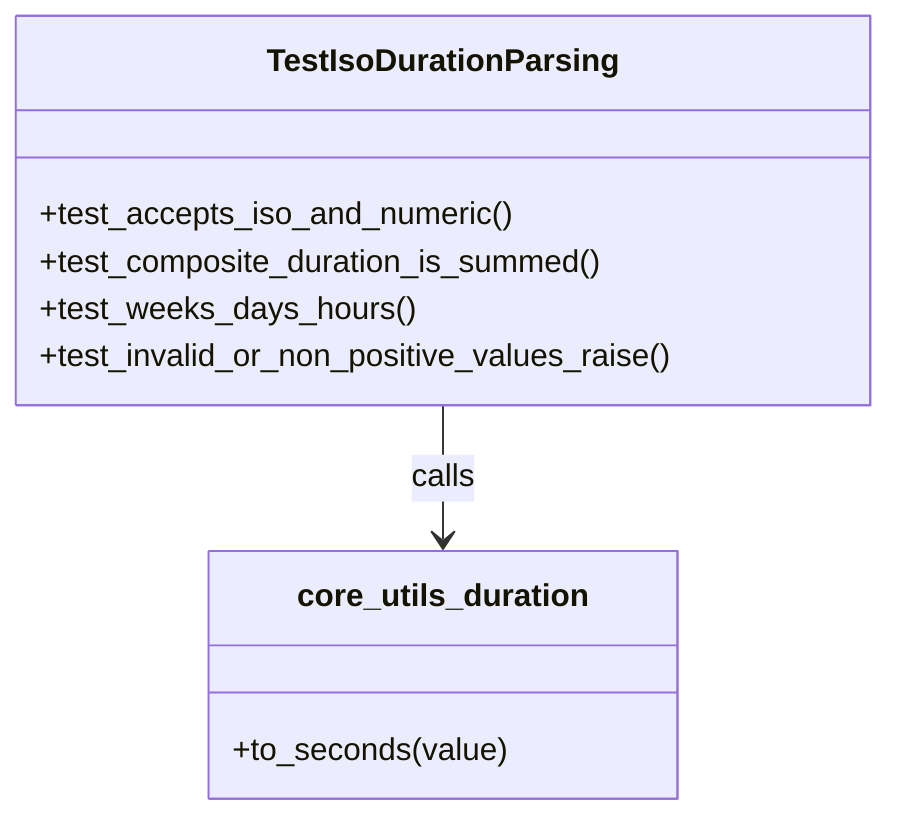

# Diagram: shared/core/tests/unit/test_utils_duration.py


> Auto-generated by Obscura crawlers

## Diagram 1



### SVG

<svg id="container" width="449.2109375" xmlns="http://www.w3.org/2000/svg" class="classDiagram" height="414" viewBox="0 0 449.2109375 414" role="graphics-document document" aria-roledescription="class"><style>#container{font-family:"trebuchet ms",verdana,arial,sans-serif;font-size:16px;fill:#333;}@keyframes edge-animation-frame{from{stroke-dashoffset:0;}}@keyframes dash{to{stroke-dashoffset:0;}}#container .edge-animation-slow{stroke-dasharray:9,5!important;stroke-dashoffset:900;animation:dash 50s linear infinite;stroke-linecap:round;}#container .edge-animation-fast{stroke-dasharray:9,5!important;stroke-dashoffset:900;animation:dash 20s linear infinite;stroke-linecap:round;}#container .error-icon{fill:#552222;}#container .error-text{fill:#552222;stroke:#552222;}#container .edge-thickness-normal{stroke-width:1px;}#container .edge-thickness-thick{stroke-width:3.5px;}#container .edge-pattern-solid{stroke-dasharray:0;}#container .edge-thickness-invisible{stroke-width:0;fill:none;}#container .edge-pattern-dashed{stroke-dasharray:3;}#container .edge-pattern-dotted{stroke-dasharray:2;}#container .marker{fill:#333333;stroke:#333333;}#container .marker.cross{stroke:#333333;}#container svg{font-family:"trebuchet ms",verdana,arial,sans-serif;font-size:16px;}#container p{margin:0;}#container g.classGroup text{fill:#9370DB;stroke:none;font-family:"trebuchet ms",verdana,arial,sans-serif;font-size:10px;}#container g.classGroup text .title{font-weight:bolder;}#container .nodeLabel,#container .edgeLabel{color:#131300;}#container .edgeLabel .label rect{fill:#ECECFF;}#container .label text{fill:#131300;}#container .labelBkg{background:#ECECFF;}#container .edgeLabel .label span{background:#ECECFF;}#container .classTitle{font-weight:bolder;}#container .node rect,#container .node circle,#container .node ellipse,#container .node polygon,#container .node path{fill:#ECECFF;stroke:#9370DB;stroke-width:1px;}#container .divider{stroke:#9370DB;stroke-width:1;}#container g.clickable{cursor:pointer;}#container g.classGroup rect{fill:#ECECFF;stroke:#9370DB;}#container g.classGroup line{stroke:#9370DB;stroke-width:1;}#container .classLabel .box{stroke:none;stroke-width:0;fill:#ECECFF;opacity:0.5;}#container .classLabel .label{fill:#9370DB;font-size:10px;}#container .relation{stroke:#333333;stroke-width:1;fill:none;}#container .dashed-line{stroke-dasharray:3;}#container .dotted-line{stroke-dasharray:1 2;}#container #compositionStart,#container .composition{fill:#333333!important;stroke:#333333!important;stroke-width:1;}#container #compositionEnd,#container .composition{fill:#333333!important;stroke:#333333!important;stroke-width:1;}#container #dependencyStart,#container .dependency{fill:#333333!important;stroke:#333333!important;stroke-width:1;}#container #dependencyStart,#container .dependency{fill:#333333!important;stroke:#333333!important;stroke-width:1;}#container #extensionStart,#container .extension{fill:transparent!important;stroke:#333333!important;stroke-width:1;}#container #extensionEnd,#container .extension{fill:transparent!important;stroke:#333333!important;stroke-width:1;}#container #aggregationStart,#container .aggregation{fill:transparent!important;stroke:#333333!important;stroke-width:1;}#container #aggregationEnd,#container .aggregation{fill:transparent!important;stroke:#333333!important;stroke-width:1;}#container #lollipopStart,#container .lollipop{fill:#ECECFF!important;stroke:#333333!important;stroke-width:1;}#container #lollipopEnd,#container .lollipop{fill:#ECECFF!important;stroke:#333333!important;stroke-width:1;}#container .edgeTerminals{font-size:11px;line-height:initial;}#container .classTitleText{text-anchor:middle;font-size:18px;fill:#333;}#container .label-icon{display:inline-block;height:1em;overflow:visible;vertical-align:-0.125em;}#container .node .label-icon path{fill:currentColor;stroke:revert;stroke-width:revert;}#container :root{--mermaid-font-family:"trebuchet ms",verdana,arial,sans-serif;}</style><g><defs><marker id="container_class-aggregationStart" class="marker aggregation class" refX="18" refY="7" markerWidth="190" markerHeight="240" orient="auto"><path d="M 18,7 L9,13 L1,7 L9,1 Z"></path></marker></defs><defs><marker id="container_class-aggregationEnd" class="marker aggregation class" refX="1" refY="7" markerWidth="20" markerHeight="28" orient="auto"><path d="M 18,7 L9,13 L1,7 L9,1 Z"></path></marker></defs><defs><marker id="container_class-extensionStart" class="marker extension class" refX="18" refY="7" markerWidth="190" markerHeight="240" orient="auto"><path d="M 1,7 L18,13 V 1 Z"></path></marker></defs><defs><marker id="container_class-extensionEnd" class="marker extension class" refX="1" refY="7" markerWidth="20" markerHeight="28" orient="auto"><path d="M 1,1 V 13 L18,7 Z"></path></marker></defs><defs><marker id="container_class-compositionStart" class="marker composition class" refX="18" refY="7" markerWidth="190" markerHeight="240" orient="auto"><path d="M 18,7 L9,13 L1,7 L9,1 Z"></path></marker></defs><defs><marker id="container_class-compositionEnd" class="marker composition class" refX="1" refY="7" markerWidth="20" markerHeight="28" orient="auto"><path d="M 18,7 L9,13 L1,7 L9,1 Z"></path></marker></defs><defs><marker id="container_class-dependencyStart" class="marker dependency class" refX="6" refY="7" markerWidth="190" markerHeight="240" orient="auto"><path d="M 5,7 L9,13 L1,7 L9,1 Z"></path></marker></defs><defs><marker id="container_class-dependencyEnd" class="marker dependency class" refX="13" refY="7" markerWidth="20" markerHeight="28" orient="auto"><path d="M 18,7 L9,13 L14,7 L9,1 Z"></path></marker></defs><defs><marker id="container_class-lollipopStart" class="marker lollipop class" refX="13" refY="7" markerWidth="190" markerHeight="240" orient="auto"><circle stroke="black" fill="transparent" cx="7" cy="7" r="6"></circle></marker></defs><defs><marker id="container_class-lollipopEnd" class="marker lollipop class" refX="1" refY="7" markerWidth="190" markerHeight="240" orient="auto"><circle stroke="black" fill="transparent" cx="7" cy="7" r="6"></circle></marker></defs><g class="root"><g class="clusters"></g><g class="edgePaths"><path d="M224.605,206L224.605,212.167C224.605,218.333,224.605,230.667,224.605,242C224.605,253.333,224.605,263.667,224.605,268.833L224.605,274" id="id_TestIsoDurationParsing_core_utils_duration_1" class="edge-thickness-normal edge-pattern-solid relation" style=";;;" data-edge="true" data-et="edge" data-id="id_TestIsoDurationParsing_core_utils_duration_1" data-points="W3sieCI6MjI0LjYwNTQ2ODc1LCJ5IjoyMDZ9LHsieCI6MjI0LjYwNTQ2ODc1LCJ5IjoyNDN9LHsieCI6MjI0LjYwNTQ2ODc1LCJ5IjoyODB9XQ==" marker-end="url(#container_class-dependencyEnd)"></path></g><g class="edgeLabels"><g class="edgeLabel" transform="translate(224.60546875, 243)"><g class="label" data-id="id_TestIsoDurationParsing_core_utils_duration_1" transform="translate(-16.4453125, -12)"><foreignObject width="32.890625" height="24"><div xmlns="http://www.w3.org/1999/xhtml" class="labelBkg" style="display: table-cell; white-space: nowrap; line-height: 1.5; max-width: 200px; text-align: center;"><span class="edgeLabel"><p>calls</p></span></div></foreignObject></g></g></g><g class="nodes"><g class="node default" id="classId-TestIsoDurationParsing-0" transform="translate(224.60546875, 107)"><g class="basic label-container"><path d="M-216.60546875 -99 L216.60546875 -99 L216.60546875 99 L-216.60546875 99" stroke="none" stroke-width="0" fill="#ECECFF" style=""></path><path d="M-216.60546875 -99 C-81.35076935054835 -99, 53.903930048903305 -99, 216.60546875 -99 M-216.60546875 -99 C-44.80360140487855 -99, 126.9982659402429 -99, 216.60546875 -99 M216.60546875 -99 C216.60546875 -29.5130285623175, 216.60546875 39.973942875365, 216.60546875 99 M216.60546875 -99 C216.60546875 -42.243039453070125, 216.60546875 14.51392109385975, 216.60546875 99 M216.60546875 99 C66.50639210441696 99, -83.59268454116608 99, -216.60546875 99 M216.60546875 99 C98.3517672091307 99, -19.9019343317386 99, -216.60546875 99 M-216.60546875 99 C-216.60546875 21.990047369269064, -216.60546875 -55.01990526146187, -216.60546875 -99 M-216.60546875 99 C-216.60546875 59.26686284081201, -216.60546875 19.53372568162402, -216.60546875 -99" stroke="#9370DB" stroke-width="1.3" fill="none" stroke-dasharray="0 0" style=""></path></g><g class="annotation-group text" transform="translate(0, -75)"></g><g class="label-group text" transform="translate(-84.8828125, -75)"><g class="label" style="font-weight: bolder" transform="translate(0,-12)"><foreignObject width="169.765625" height="24"><div xmlns="http://www.w3.org/1999/xhtml" style="display: table-cell; white-space: nowrap; line-height: 1.5; max-width: 217px; text-align: center;"><span class="nodeLabel markdown-node-label" style=""><p>TestIsoDurationParsing</p></span></div></foreignObject></g></g><g class="members-group text" transform="translate(-204.60546875, -27)"></g><g class="methods-group text" transform="translate(-204.60546875, 3)"><g class="label" style="" transform="translate(0,-12)"><foreignObject width="241.046875" height="24"><div xmlns="http://www.w3.org/1999/xhtml" style="display: table-cell; white-space: nowrap; line-height: 1.5; max-width: 298px; text-align: center;"><span class="nodeLabel markdown-node-label" style=""><p>+test_accepts_iso_and_numeric()</p></span></div></foreignObject></g><g class="label" style="" transform="translate(0,12)"><foreignObject width="289.9375" height="24"><div xmlns="http://www.w3.org/1999/xhtml" style="display: table-cell; white-space: nowrap; line-height: 1.5; max-width: 347px; text-align: center;"><span class="nodeLabel markdown-node-label" style=""><p>+test_composite_duration_is_summed()</p></span></div></foreignObject></g><g class="label" style="" transform="translate(0,36)"><foreignObject width="188.671875" height="24"><div xmlns="http://www.w3.org/1999/xhtml" style="display: table-cell; white-space: nowrap; line-height: 1.5; max-width: 246px; text-align: center;"><span class="nodeLabel markdown-node-label" style=""><p>+test_weeks_days_hours()</p></span></div></foreignObject></g><g class="label" style="" transform="translate(0,60)"><foreignObject width="324.328125" height="24"><div xmlns="http://www.w3.org/1999/xhtml" style="display: table-cell; white-space: nowrap; line-height: 1.5; max-width: 382px; text-align: center;"><span class="nodeLabel markdown-node-label" style=""><p>+test_invalid_or_non_positive_values_raise()</p></span></div></foreignObject></g></g><g class="divider" style=""><path d="M-216.60546875 -51 C-89.0736526657994 -51, 38.4581634184012 -51, 216.60546875 -51 M-216.60546875 -51 C-119.30239359791547 -51, -21.999318445830937 -51, 216.60546875 -51" stroke="#9370DB" stroke-width="1.3" fill="none" stroke-dasharray="0 0" style=""></path></g><g class="divider" style=""><path d="M-216.60546875 -27 C-126.07049592715451 -27, -35.53552310430902 -27, 216.60546875 -27 M-216.60546875 -27 C-64.86844007688646 -27, 86.86858859622708 -27, 216.60546875 -27" stroke="#9370DB" stroke-width="1.3" fill="none" stroke-dasharray="0 0" style=""></path></g></g><g class="node default" id="classId-core_utils_duration-1" transform="translate(224.60546875, 343)"><g class="basic label-container"><path d="M-117.1015625 -63 L117.1015625 -63 L117.1015625 63 L-117.1015625 63" stroke="none" stroke-width="0" fill="#ECECFF" style=""></path><path d="M-117.1015625 -63 C-50.66363533613985 -63, 15.774291827720305 -63, 117.1015625 -63 M-117.1015625 -63 C-51.90263331731043 -63, 13.296295865379136 -63, 117.1015625 -63 M117.1015625 -63 C117.1015625 -28.33989209812553, 117.1015625 6.320215803748937, 117.1015625 63 M117.1015625 -63 C117.1015625 -36.95983964519982, 117.1015625 -10.919679290399642, 117.1015625 63 M117.1015625 63 C24.11658045004576 63, -68.86840159990848 63, -117.1015625 63 M117.1015625 63 C40.14974962973572 63, -36.802063240528554 63, -117.1015625 63 M-117.1015625 63 C-117.1015625 13.244338630299552, -117.1015625 -36.511322739400896, -117.1015625 -63 M-117.1015625 63 C-117.1015625 36.311911822474165, -117.1015625 9.623823644948331, -117.1015625 -63" stroke="#9370DB" stroke-width="1.3" fill="none" stroke-dasharray="0 0" style=""></path></g><g class="annotation-group text" transform="translate(0, -39)"></g><g class="label-group text" transform="translate(-70.890625, -39)"><g class="label" style="font-weight: bolder" transform="translate(0,-12)"><foreignObject width="141.78125" height="24"><div xmlns="http://www.w3.org/1999/xhtml" style="display: table-cell; white-space: nowrap; line-height: 1.5; max-width: 190px; text-align: center;"><span class="nodeLabel markdown-node-label" style=""><p>core_utils_duration</p></span></div></foreignObject></g></g><g class="members-group text" transform="translate(-105.1015625, 9)"></g><g class="methods-group text" transform="translate(-105.1015625, 39)"><g class="label" style="" transform="translate(0,-12)"><foreignObject width="139.3125" height="24"><div xmlns="http://www.w3.org/1999/xhtml" style="display: table-cell; white-space: nowrap; line-height: 1.5; max-width: 197px; text-align: center;"><span class="nodeLabel markdown-node-label" style=""><p>+to_seconds(value)</p></span></div></foreignObject></g></g><g class="divider" style=""><path d="M-117.1015625 -15 C-32.56939524012098 -15, 51.962772019758035 -15, 117.1015625 -15 M-117.1015625 -15 C-39.97824577130305 -15, 37.1450709573939 -15, 117.1015625 -15" stroke="#9370DB" stroke-width="1.3" fill="none" stroke-dasharray="0 0" style=""></path></g><g class="divider" style=""><path d="M-117.1015625 9 C-34.73440586621322 9, 47.632750767573555 9, 117.1015625 9 M-117.1015625 9 C-38.78954272744615 9, 39.522477045107706 9, 117.1015625 9" stroke="#9370DB" stroke-width="1.3" fill="none" stroke-dasharray="0 0" style=""></path></g></g></g></g></g></svg>

## Diagram 2

```mermaid
flowchart TD
    A[TestIsoDurationParsing.test_accepts_iso_and_numeric] -->|PT15M -> 900| B[to_seconds("PT15M")]
    A -->|\"120\" -> 120| C[to_seconds("120")]
    A -->|90 -> 90| D[to_seconds(90)]
    E[TestIsoDurationParsing.test_composite_duration_is_summed] --> F[to_seconds("P1Y2M3DT4H5M6S")]
    F -->|expected seconds| G[compare result == expected]
    H[TestIsoDurationParsing.test_weeks_days_hours] --> I[to_seconds("P1W")]
    H --> J[to_seconds("P1D")]
    H --> K[to_seconds("PT1H")]
    L[TestIsoDurationParsing.test_invalid_or_non_positive_values_raise] --> M[to_seconds("PT0S")]
    L --> N[to_seconds("INVALID")]
    L --> O[to_seconds(0)]
    M -->|raises ValueError| P[positive error]
    N -->|raises ValueError| Q[Invalid ISO-8601 error]
    O -->|raises ValueError| P
```

> SVG rendering failed for this diagram.
