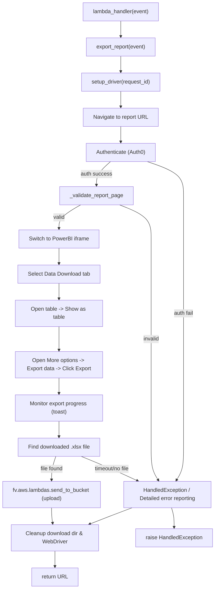

# Diagram: shipment_core/chromium_export/chromium_export/export_report.py

> Auto-generated by Obscura crawlers

## Mermaid

### SVG

<svg id="container" width="646.98046875" xmlns="http://www.w3.org/2000/svg" class="flowchart" height="1742" viewBox="0 0 646.98046875 1742" role="graphics-document document" aria-roledescription="flowchart-v2"><g><marker id="container_flowchart-v2-pointEnd" class="marker flowchart-v2" viewBox="0 0 10 10" refX="5" refY="5" markerUnits="userSpaceOnUse" markerWidth="8" markerHeight="8" orient="auto"><path d="M 0 0 L 10 5 L 0 10 z" class="arrowMarkerPath" style="stroke-width: 1; stroke-dasharray: 1, 0;"></path></marker><marker id="container_flowchart-v2-pointStart" class="marker flowchart-v2" viewBox="0 0 10 10" refX="4.5" refY="5" markerUnits="userSpaceOnUse" markerWidth="8" markerHeight="8" orient="auto"><path d="M 0 5 L 10 10 L 10 0 z" class="arrowMarkerPath" style="stroke-width: 1; stroke-dasharray: 1, 0;"></path></marker><marker id="container_flowchart-v2-circleEnd" class="marker flowchart-v2" viewBox="0 0 10 10" refX="11" refY="5" markerUnits="userSpaceOnUse" markerWidth="11" markerHeight="11" orient="auto"><circle cx="5" cy="5" r="5" class="arrowMarkerPath" style="stroke-width: 1; stroke-dasharray: 1, 0;"></circle></marker><marker id="container_flowchart-v2-circleStart" class="marker flowchart-v2" viewBox="0 0 10 10" refX="-1" refY="5" markerUnits="userSpaceOnUse" markerWidth="11" markerHeight="11" orient="auto"><circle cx="5" cy="5" r="5" class="arrowMarkerPath" style="stroke-width: 1; stroke-dasharray: 1, 0;"></circle></marker><marker id="container_flowchart-v2-crossEnd" class="marker cross flowchart-v2" viewBox="0 0 11 11" refX="12" refY="5.2" markerUnits="userSpaceOnUse" markerWidth="11" markerHeight="11" orient="auto"><path d="M 1,1 l 9,9 M 10,1 l -9,9" class="arrowMarkerPath" style="stroke-width: 2; stroke-dasharray: 1, 0;"></path></marker><marker id="container_flowchart-v2-crossStart" class="marker cross flowchart-v2" viewBox="0 0 11 11" refX="-1" refY="5.2" markerUnits="userSpaceOnUse" markerWidth="11" markerHeight="11" orient="auto"><path d="M 1,1 l 9,9 M 10,1 l -9,9" class="arrowMarkerPath" style="stroke-width: 2; stroke-dasharray: 1, 0;"></path></marker><g class="root"><g class="clusters"></g><g class="edgePaths"><path d="M365.063,62L365.063,66.167C365.063,70.333,365.063,78.667,365.063,86.333C365.063,94,365.063,101,365.063,104.5L365.063,108" id="L_Lambda_Export_0" class="edge-thickness-normal edge-pattern-solid edge-thickness-normal edge-pattern-solid flowchart-link" style=";" data-edge="true" data-et="edge" data-id="L_Lambda_Export_0" data-points="W3sieCI6MzY1LjA2MjUsInkiOjYyfSx7IngiOjM2NS4wNjI1LCJ5Ijo4N30seyJ4IjozNjUuMDYyNSwieSI6MTEyfV0=" marker-end="url(#container_flowchart-v2-pointEnd)"></path><path d="M365.063,166L365.063,170.167C365.063,174.333,365.063,182.667,365.063,190.333C365.063,198,365.063,205,365.063,208.5L365.063,212" id="L_Export_Setup_0" class="edge-thickness-normal edge-pattern-solid edge-thickness-normal edge-pattern-solid flowchart-link" style=";" data-edge="true" data-et="edge" data-id="L_Export_Setup_0" data-points="W3sieCI6MzY1LjA2MjUsInkiOjE2Nn0seyJ4IjozNjUuMDYyNSwieSI6MTkxfSx7IngiOjM2NS4wNjI1LCJ5IjoyMTZ9XQ==" marker-end="url(#container_flowchart-v2-pointEnd)"></path><path d="M365.063,270L365.063,274.167C365.063,278.333,365.063,286.667,365.063,294.333C365.063,302,365.063,309,365.063,312.5L365.063,316" id="L_Setup_Navigate_0" class="edge-thickness-normal edge-pattern-solid edge-thickness-normal edge-pattern-solid flowchart-link" style=";" data-edge="true" data-et="edge" data-id="L_Setup_Navigate_0" data-points="W3sieCI6MzY1LjA2MjUsInkiOjI3MH0seyJ4IjozNjUuMDYyNSwieSI6Mjk1fSx7IngiOjM2NS4wNjI1LCJ5IjozMjB9XQ==" marker-end="url(#container_flowchart-v2-pointEnd)"></path><path d="M365.063,374L365.063,378.167C365.063,382.333,365.063,390.667,365.063,398.333C365.063,406,365.063,413,365.063,416.5L365.063,420" id="L_Navigate_Auth_0" class="edge-thickness-normal edge-pattern-solid edge-thickness-normal edge-pattern-solid flowchart-link" style=";" data-edge="true" data-et="edge" data-id="L_Navigate_Auth_0" data-points="W3sieCI6MzY1LjA2MjUsInkiOjM3NH0seyJ4IjozNjUuMDYyNSwieSI6Mzk5fSx7IngiOjM2NS4wNjI1LCJ5Ijo0MjR9XQ==" marker-end="url(#container_flowchart-v2-pointEnd)"></path><path d="M334.272,478L327.24,484.167C320.208,490.333,306.143,502.667,299.11,514.333C292.078,526,292.078,537,292.078,542.5L292.078,548" id="L_Auth_Validate_0" class="edge-thickness-normal edge-pattern-solid edge-thickness-normal edge-pattern-solid flowchart-link" style=";" data-edge="true" data-et="edge" data-id="L_Auth_Validate_0" data-points="W3sieCI6MzM0LjI3MjIxNjc5Njg3NSwieSI6NDc4fSx7IngiOjI5Mi4wNzgxMjUsInkiOjUxNX0seyJ4IjoyOTIuMDc4MTI1LCJ5Ijo1NTJ9XQ==" marker-end="url(#container_flowchart-v2-pointEnd)"></path><path d="M444.528,478L462.678,484.167C480.827,490.333,517.127,502.667,535.276,519.5C553.426,536.333,553.426,557.667,553.426,579C553.426,600.333,553.426,621.667,553.426,643C553.426,664.333,553.426,685.667,553.426,705C553.426,724.333,553.426,741.667,553.426,759C553.426,776.333,553.426,793.667,553.426,811C553.426,828.333,553.426,845.667,553.426,865C553.426,884.333,553.426,905.667,553.426,929C553.426,952.333,553.426,977.667,553.426,1003C553.426,1028.333,553.426,1053.667,553.426,1077C553.426,1100.333,553.426,1121.667,553.426,1143C553.426,1164.333,553.426,1185.667,553.426,1207C553.426,1228.333,553.426,1249.667,553.426,1269C553.426,1288.333,553.426,1305.667,553.426,1325C553.426,1344.333,553.426,1365.667,549.723,1381.944C546.02,1398.221,538.613,1409.441,534.91,1415.051L531.207,1420.662" id="L_Auth_Error_0" class="edge-thickness-normal edge-pattern-solid edge-thickness-normal edge-pattern-solid flowchart-link" style=";" data-edge="true" data-et="edge" data-id="L_Auth_Error_0" data-points="W3sieCI6NDQ0LjUyODI1OTI3NzM0Mzc1LCJ5Ijo0Nzh9LHsieCI6NTUzLjQyNTc4MTI1LCJ5Ijo1MTV9LHsieCI6NTUzLjQyNTc4MTI1LCJ5Ijo1Nzl9LHsieCI6NTUzLjQyNTc4MTI1LCJ5Ijo2NDN9LHsieCI6NTUzLjQyNTc4MTI1LCJ5Ijo3MDd9LHsieCI6NTUzLjQyNTc4MTI1LCJ5Ijo3NTl9LHsieCI6NTUzLjQyNTc4MTI1LCJ5Ijo4MTF9LHsieCI6NTUzLjQyNTc4MTI1LCJ5Ijo4NjN9LHsieCI6NTUzLjQyNTc4MTI1LCJ5Ijo5Mjd9LHsieCI6NTUzLjQyNTc4MTI1LCJ5IjoxMDAzfSx7IngiOjU1My40MjU3ODEyNSwieSI6MTA3OX0seyJ4Ijo1NTMuNDI1NzgxMjUsInkiOjExNDN9LHsieCI6NTUzLjQyNTc4MTI1LCJ5IjoxMjA3fSx7IngiOjU1My40MjU3ODEyNSwieSI6MTI3MX0seyJ4Ijo1NTMuNDI1NzgxMjUsInkiOjEzMjN9LHsieCI6NTUzLjQyNTc4MTI1LCJ5IjoxMzg3fSx7IngiOjUyOS4wMDM4MDM0NTM5NDc0LCJ5IjoxNDI0fV0=" marker-end="url(#container_flowchart-v2-pointEnd)"></path><path d="M246.404,606L235.972,612.167C225.54,618.333,204.676,630.667,194.244,642.333C183.813,654,183.813,665,183.813,670.5L183.813,676" id="L_Validate_Iframe_0" class="edge-thickness-normal edge-pattern-solid edge-thickness-normal edge-pattern-solid flowchart-link" style=";" data-edge="true" data-et="edge" data-id="L_Validate_Iframe_0" data-points="W3sieCI6MjQ2LjQwMzU2NDQ1MzEyNSwieSI6NjA2fSx7IngiOjE4My44MTI1LCJ5Ijo2NDN9LHsieCI6MTgzLjgxMjUsInkiOjY4MH1d" marker-end="url(#container_flowchart-v2-pointEnd)"></path><path d="M360.962,606L376.695,612.167C392.428,618.333,423.894,630.667,439.627,647.5C455.359,664.333,455.359,685.667,455.359,705C455.359,724.333,455.359,741.667,455.359,759C455.359,776.333,455.359,793.667,455.359,811C455.359,828.333,455.359,845.667,455.359,865C455.359,884.333,455.359,905.667,455.359,929C455.359,952.333,455.359,977.667,455.359,1003C455.359,1028.333,455.359,1053.667,455.359,1077C455.359,1100.333,455.359,1121.667,455.359,1143C455.359,1164.333,455.359,1185.667,455.359,1207C455.359,1228.333,455.359,1249.667,455.359,1269C455.359,1288.333,455.359,1305.667,455.359,1325C455.359,1344.333,455.359,1365.667,458.891,1381.936C462.422,1398.205,469.485,1409.411,473.016,1415.013L476.547,1420.616" id="L_Validate_Error_0" class="edge-thickness-normal edge-pattern-solid edge-thickness-normal edge-pattern-solid flowchart-link" style=";" data-edge="true" data-et="edge" data-id="L_Validate_Error_0" data-points="W3sieCI6MzYwLjk2MjQwMjM0Mzc1LCJ5Ijo2MDZ9LHsieCI6NDU1LjM1OTM3NSwieSI6NjQzfSx7IngiOjQ1NS4zNTkzNzUsInkiOjcwN30seyJ4Ijo0NTUuMzU5Mzc1LCJ5Ijo3NTl9LHsieCI6NDU1LjM1OTM3NSwieSI6ODExfSx7IngiOjQ1NS4zNTkzNzUsInkiOjg2M30seyJ4Ijo0NTUuMzU5Mzc1LCJ5Ijo5Mjd9LHsieCI6NDU1LjM1OTM3NSwieSI6MTAwM30seyJ4Ijo0NTUuMzU5Mzc1LCJ5IjoxMDc5fSx7IngiOjQ1NS4zNTkzNzUsInkiOjExNDN9LHsieCI6NDU1LjM1OTM3NSwieSI6MTIwN30seyJ4Ijo0NTUuMzU5Mzc1LCJ5IjoxMjcxfSx7IngiOjQ1NS4zNTkzNzUsInkiOjEzMjN9LHsieCI6NDU1LjM1OTM3NSwieSI6MTM4N30seyJ4Ijo0NzguNjgwMjUyODc4Mjg5NSwieSI6MTQyNH1d" marker-end="url(#container_flowchart-v2-pointEnd)"></path><path d="M183.813,734L183.813,738.167C183.813,742.333,183.813,750.667,183.813,758.333C183.813,766,183.813,773,183.813,776.5L183.813,780" id="L_Iframe_Tabs_0" class="edge-thickness-normal edge-pattern-solid edge-thickness-normal edge-pattern-solid flowchart-link" style=";" data-edge="true" data-et="edge" data-id="L_Iframe_Tabs_0" data-points="W3sieCI6MTgzLjgxMjUsInkiOjczNH0seyJ4IjoxODMuODEyNSwieSI6NzU5fSx7IngiOjE4My44MTI1LCJ5Ijo3ODR9XQ==" marker-end="url(#container_flowchart-v2-pointEnd)"></path><path d="M183.813,838L183.813,842.167C183.813,846.333,183.813,854.667,183.813,862.333C183.813,870,183.813,877,183.813,880.5L183.813,884" id="L_Tabs_Table_0" class="edge-thickness-normal edge-pattern-solid edge-thickness-normal edge-pattern-solid flowchart-link" style=";" data-edge="true" data-et="edge" data-id="L_Tabs_Table_0" data-points="W3sieCI6MTgzLjgxMjUsInkiOjgzOH0seyJ4IjoxODMuODEyNSwieSI6ODYzfSx7IngiOjE4My44MTI1LCJ5Ijo4ODh9XQ==" marker-end="url(#container_flowchart-v2-pointEnd)"></path><path d="M183.813,966L183.813,972.167C183.813,978.333,183.813,990.667,183.813,1002.333C183.813,1014,183.813,1025,183.813,1030.5L183.813,1036" id="L_Table_ExportUI_0" class="edge-thickness-normal edge-pattern-solid edge-thickness-normal edge-pattern-solid flowchart-link" style=";" data-edge="true" data-et="edge" data-id="L_Table_ExportUI_0" data-points="W3sieCI6MTgzLjgxMjUsInkiOjk2Nn0seyJ4IjoxODMuODEyNSwieSI6MTAwM30seyJ4IjoxODMuODEyNSwieSI6MTA0MH1d" marker-end="url(#container_flowchart-v2-pointEnd)"></path><path d="M183.813,1118L183.813,1122.167C183.813,1126.333,183.813,1134.667,183.813,1142.333C183.813,1150,183.813,1157,183.813,1160.5L183.813,1164" id="L_ExportUI_Monitor_0" class="edge-thickness-normal edge-pattern-solid edge-thickness-normal edge-pattern-solid flowchart-link" style=";" data-edge="true" data-et="edge" data-id="L_ExportUI_Monitor_0" data-points="W3sieCI6MTgzLjgxMjUsInkiOjExMTh9LHsieCI6MTgzLjgxMjUsInkiOjExNDN9LHsieCI6MTgzLjgxMjUsInkiOjExNjh9XQ==" marker-end="url(#container_flowchart-v2-pointEnd)"></path><path d="M183.813,1246L183.813,1250.167C183.813,1254.333,183.813,1262.667,183.813,1270.333C183.813,1278,183.813,1285,183.813,1288.5L183.813,1292" id="L_Monitor_FindFile_0" class="edge-thickness-normal edge-pattern-solid edge-thickness-normal edge-pattern-solid flowchart-link" style=";" data-edge="true" data-et="edge" data-id="L_Monitor_FindFile_0" data-points="W3sieCI6MTgzLjgxMjUsInkiOjEyNDZ9LHsieCI6MTgzLjgxMjUsInkiOjEyNzF9LHsieCI6MTgzLjgxMjUsInkiOjEyOTZ9XQ==" marker-end="url(#container_flowchart-v2-pointEnd)"></path><path d="M171.473,1350L168.654,1356.167C165.836,1362.333,160.199,1374.667,157.381,1386.333C154.563,1398,154.563,1409,154.563,1414.5L154.563,1420" id="L_FindFile_Upload_0" class="edge-thickness-normal edge-pattern-solid edge-thickness-normal edge-pattern-solid flowchart-link" style=";" data-edge="true" data-et="edge" data-id="L_FindFile_Upload_0" data-points="W3sieCI6MTcxLjQ3MjY1NjI1LCJ5IjoxMzUwfSx7IngiOjE1NC41NjI1LCJ5IjoxMzg3fSx7IngiOjE1NC41NjI1LCJ5IjoxNDI0fV0=" marker-end="url(#container_flowchart-v2-pointEnd)"></path><path d="M247.695,1350L262.286,1356.167C276.876,1362.333,306.057,1374.667,333.674,1386.725C361.29,1398.784,387.343,1410.568,400.369,1416.46L413.395,1422.352" id="L_FindFile_Error_0" class="edge-thickness-normal edge-pattern-solid edge-thickness-normal edge-pattern-solid flowchart-link" style=";" data-edge="true" data-et="edge" data-id="L_FindFile_Error_0" data-points="W3sieCI6MjQ3LjY5NTI1MTQ2NDg0Mzc1LCJ5IjoxMzUwfSx7IngiOjMzNS4yMzgyODEyNSwieSI6MTM4N30seyJ4Ijo0MTcuMDM5MTY1Mjk2MDUyNiwieSI6MTQyNH1d" marker-end="url(#container_flowchart-v2-pointEnd)"></path><path d="M154.563,1502L154.563,1506.167C154.563,1510.333,154.563,1518.667,155.111,1526.341C155.659,1534.016,156.755,1541.032,157.303,1544.54L157.851,1548.048" id="L_Upload_Cleanup_0" class="edge-thickness-normal edge-pattern-solid edge-thickness-normal edge-pattern-solid flowchart-link" style=";" data-edge="true" data-et="edge" data-id="L_Upload_Cleanup_0" data-points="W3sieCI6MTU0LjU2MjUsInkiOjE1MDJ9LHsieCI6MTU0LjU2MjUsInkiOjE1Mjd9LHsieCI6MTU4LjQ2ODc1LCJ5IjoxNTUyfV0=" marker-end="url(#container_flowchart-v2-pointEnd)"></path><path d="M164.563,1630L164.563,1634.167C164.563,1638.333,164.563,1646.667,164.563,1654.333C164.563,1662,164.563,1669,164.563,1672.5L164.563,1676" id="L_Cleanup_LambdaReturn_0" class="edge-thickness-normal edge-pattern-solid edge-thickness-normal edge-pattern-solid flowchart-link" style=";" data-edge="true" data-et="edge" data-id="L_Cleanup_LambdaReturn_0" data-points="W3sieCI6MTY0LjU2MjUsInkiOjE2MzB9LHsieCI6MTY0LjU2MjUsInkiOjE2NTV9LHsieCI6MTY0LjU2MjUsInkiOjE2ODB9XQ==" marker-end="url(#container_flowchart-v2-pointEnd)"></path><path d="M396.366,1502L384.946,1506.167C373.526,1510.333,350.685,1518.667,329.255,1526.757C307.825,1534.847,287.805,1542.694,277.796,1546.617L267.786,1550.54" id="L_Error_Cleanup_0" class="edge-thickness-normal edge-pattern-solid edge-thickness-normal edge-pattern-solid flowchart-link" style=";" data-edge="true" data-et="edge" data-id="L_Error_Cleanup_0" data-points="W3sieCI6Mzk2LjM2NjM5NDA0Mjk2ODc1LCJ5IjoxNTAyfSx7IngiOjMyNy44NDM3NSwieSI6MTUyN30seyJ4IjoyNjQuMDYyMDExNzE4NzUsInkiOjE1NTJ9XQ==" marker-end="url(#container_flowchart-v2-pointEnd)"></path><path d="M515.449,1502L516.751,1506.167C518.053,1510.333,520.658,1518.667,521.96,1528.333C523.262,1538,523.262,1549,523.262,1554.5L523.262,1560" id="L_Error_LambdaError_0" class="edge-thickness-normal edge-pattern-solid edge-thickness-normal edge-pattern-solid flowchart-link" style=";" data-edge="true" data-et="edge" data-id="L_Error_LambdaError_0" data-points="W3sieCI6NTE1LjQ0OTIxODc1LCJ5IjoxNTAyfSx7IngiOjUyMy4yNjE3MTg3NSwieSI6MTUyN30seyJ4Ijo1MjMuMjYxNzE4NzUsInkiOjE1NjR9XQ==" marker-end="url(#container_flowchart-v2-pointEnd)"></path></g><g class="edgeLabels"><g class="edgeLabel"><g class="label" data-id="L_Lambda_Export_0" transform="translate(0, 0)"><foreignObject width="0" height="0">

</foreignObject></g></g><g class="edgeLabel"><g class="label" data-id="L_Export_Setup_0" transform="translate(0, 0)"><foreignObject width="0" height="0">

</foreignObject></g></g><g class="edgeLabel"><g class="label" data-id="L_Setup_Navigate_0" transform="translate(0, 0)"><foreignObject width="0" height="0">

</foreignObject></g></g><g class="edgeLabel"><g class="label" data-id="L_Navigate_Auth_0" transform="translate(0, 0)"><foreignObject width="0" height="0">

</foreignObject></g></g><g class="edgeLabel" transform="translate(292.078125, 515)"><g class="label" data-id="L_Auth_Validate_0" transform="translate(-46.1796875, -12)"><foreignObject width="92.359375" height="24">

auth success

</foreignObject></g></g><g class="edgeLabel" transform="translate(553.42578125, 927)"><g class="label" data-id="L_Auth_Error_0" transform="translate(-30.1640625, -12)"><foreignObject width="60.328125" height="24">

auth fail

</foreignObject></g></g><g class="edgeLabel" transform="translate(183.8125, 643)"><g class="label" data-id="L_Validate_Iframe_0" transform="translate(-17.46875, -12)"><foreignObject width="34.9375" height="24">

valid

</foreignObject></g></g><g class="edgeLabel" transform="translate(455.359375, 1003)"><g class="label" data-id="L_Validate_Error_0" transform="translate(-24.359375, -12)"><foreignObject width="48.71875" height="24">

invalid

</foreignObject></g></g><g class="edgeLabel"><g class="label" data-id="L_Iframe_Tabs_0" transform="translate(0, 0)"><foreignObject width="0" height="0">

</foreignObject></g></g><g class="edgeLabel"><g class="label" data-id="L_Tabs_Table_0" transform="translate(0, 0)"><foreignObject width="0" height="0">

</foreignObject></g></g><g class="edgeLabel"><g class="label" data-id="L_Table_ExportUI_0" transform="translate(0, 0)"><foreignObject width="0" height="0">

</foreignObject></g></g><g class="edgeLabel"><g class="label" data-id="L_ExportUI_Monitor_0" transform="translate(0, 0)"><foreignObject width="0" height="0">

</foreignObject></g></g><g class="edgeLabel"><g class="label" data-id="L_Monitor_FindFile_0" transform="translate(0, 0)"><foreignObject width="0" height="0">

</foreignObject></g></g><g class="edgeLabel" transform="translate(154.5625, 1387)"><g class="label" data-id="L_FindFile_Upload_0" transform="translate(-34.7890625, -12)"><foreignObject width="69.578125" height="24">

file found

</foreignObject></g></g><g class="edgeLabel" transform="translate(335.23828125, 1387)"><g class="label" data-id="L_FindFile_Error_0" transform="translate(-55.2421875, -12)"><foreignObject width="110.484375" height="24">

timeout/no file

</foreignObject></g></g><g class="edgeLabel"><g class="label" data-id="L_Upload_Cleanup_0" transform="translate(0, 0)"><foreignObject width="0" height="0">

</foreignObject></g></g><g class="edgeLabel"><g class="label" data-id="L_Cleanup_LambdaReturn_0" transform="translate(0, 0)"><foreignObject width="0" height="0">

</foreignObject></g></g><g class="edgeLabel"><g class="label" data-id="L_Error_Cleanup_0" transform="translate(0, 0)"><foreignObject width="0" height="0">

</foreignObject></g></g><g class="edgeLabel"><g class="label" data-id="L_Error_LambdaError_0" transform="translate(0, 0)"><foreignObject width="0" height="0">

</foreignObject></g></g></g><g class="nodes"><g class="node default" id="flowchart-Lambda-0" transform="translate(365.0625, 35)"><rect class="basic label-container" style="" x="-115.1796875" y="-27" width="230.359375" height="54"></rect><g class="label" style="" transform="translate(-85.1796875, -12)"><rect></rect><foreignObject width="170.359375" height="24">

lambda_handler(event)

</foreignObject></g></g><g class="node default" id="flowchart-Export-1" transform="translate(365.0625, 139)"><rect class="basic label-container" style="" x="-105.6953125" y="-27" width="211.390625" height="54"></rect><g class="label" style="" transform="translate(-75.6953125, -12)"><rect></rect><foreignObject width="151.390625" height="24">

export_report(event)

</foreignObject></g></g><g class="node default" id="flowchart-Setup-2" transform="translate(365.0625, 243)"><rect class="basic label-container" style="" x="-119.734375" y="-27" width="239.46875" height="54"></rect><g class="label" style="" transform="translate(-89.734375, -12)"><rect></rect><foreignObject width="179.46875" height="24">

setup_driver(request_id)

</foreignObject></g></g><g class="node default" id="flowchart-Navigate-3" transform="translate(365.0625, 347)"><rect class="basic label-container" style="" x="-111.90625" y="-27" width="223.8125" height="54"></rect><g class="label" style="" transform="translate(-81.90625, -12)"><rect></rect><foreignObject width="163.8125" height="24">

Navigate to report URL

</foreignObject></g></g><g class="node default" id="flowchart-Auth-4" transform="translate(365.0625, 451)"><rect class="basic label-container" style="" x="-104.8203125" y="-27" width="209.640625" height="54"></rect><g class="label" style="" transform="translate(-74.8203125, -12)"><rect></rect><foreignObject width="149.640625" height="24">

Authenticate (Auth0)

</foreignObject></g></g><g class="node default" id="flowchart-Validate-5" transform="translate(292.078125, 579)"><rect class="basic label-container" style="" x="-110.96875" y="-27" width="221.9375" height="54"></rect><g class="label" style="" transform="translate(-80.96875, -12)"><rect></rect><foreignObject width="161.9375" height="24">

_validate_report_page

</foreignObject></g></g><g class="node default" id="flowchart-Iframe-6" transform="translate(183.8125, 707)"><rect class="basic label-container" style="" x="-120.234375" y="-27" width="240.46875" height="54"></rect><g class="label" style="" transform="translate(-90.234375, -12)"><rect></rect><foreignObject width="180.46875" height="24">

Switch to PowerBI iframe

</foreignObject></g></g><g class="node default" id="flowchart-Tabs-7" transform="translate(183.8125, 811)"><rect class="basic label-container" style="" x="-123.28125" y="-27" width="246.5625" height="54"></rect><g class="label" style="" transform="translate(-93.28125, -12)"><rect></rect><foreignObject width="186.5625" height="24">

Select Data Download tab

</foreignObject></g></g><g class="node default" id="flowchart-Table-8" transform="translate(183.8125, 927)"><rect class="basic label-container" style="" x="-130" y="-39" width="260" height="78"></rect><g class="label" style="" transform="translate(-100, -24)"><rect></rect><foreignObject width="200" height="48">

Open table -&gt; Show as table

</foreignObject></g></g><g class="node default" id="flowchart-ExportUI-9" transform="translate(183.8125, 1079)"><rect class="basic label-container" style="" x="-130" y="-39" width="260" height="78"></rect><g class="label" style="" transform="translate(-100, -24)"><rect></rect><foreignObject width="200" height="48">

Open More options -&gt; Export data -&gt; Click Export

</foreignObject></g></g><g class="node default" id="flowchart-Monitor-10" transform="translate(183.8125, 1207)"><rect class="basic label-container" style="" x="-130" y="-39" width="260" height="78"></rect><g class="label" style="" transform="translate(-100, -24)"><rect></rect><foreignObject width="200" height="48">

Monitor export progress (toast)

</foreignObject></g></g><g class="node default" id="flowchart-FindFile-11" transform="translate(183.8125, 1323)"><rect class="basic label-container" style="" x="-123.7734375" y="-27" width="247.546875" height="54"></rect><g class="label" style="" transform="translate(-93.7734375, -12)"><rect></rect><foreignObject width="187.546875" height="24">

Find downloaded .xlsx file

</foreignObject></g></g><g class="node default" id="flowchart-Upload-12" transform="translate(154.5625, 1463)"><rect class="basic label-container" style="" x="-146.5625" y="-39" width="293.125" height="78"></rect><g class="label" style="" transform="translate(-116.5625, -24)"><rect></rect><foreignObject width="233.125" height="48">

fv.aws.lambdas.send_to_bucket (upload)

</foreignObject></g></g><g class="node default" id="flowchart-Cleanup-13" transform="translate(164.5625, 1591)"><rect class="basic label-container" style="" x="-130" y="-39" width="260" height="78"></rect><g class="label" style="" transform="translate(-100, -24)"><rect></rect><foreignObject width="200" height="48">

Cleanup download dir &amp; WebDriver

</foreignObject></g></g><g class="node default" id="flowchart-Error-14" transform="translate(503.26171875, 1463)"><rect class="basic label-container" style="" x="-130" y="-39" width="260" height="78"></rect><g class="label" style="" transform="translate(-100, -24)"><rect></rect><foreignObject width="200" height="48">

HandledException / Detailed error reporting

</foreignObject></g></g><g class="node default" id="flowchart-LambdaReturn-48" transform="translate(164.5625, 1707)"><rect class="basic label-container" style="" x="-68.7734375" y="-27" width="137.546875" height="54"></rect><g class="label" style="" transform="translate(-38.7734375, -12)"><rect></rect><foreignObject width="77.546875" height="24">

return URL

</foreignObject></g></g><g class="node default" id="flowchart-LambdaError-52" transform="translate(523.26171875, 1591)"><rect class="basic label-container" style="" x="-115.71875" y="-27" width="231.4375" height="54"></rect><g class="label" style="" transform="translate(-85.71875, -12)"><rect></rect><foreignObject width="171.4375" height="24">

raise HandledException

</foreignObject></g></g></g></g></g></svg>
