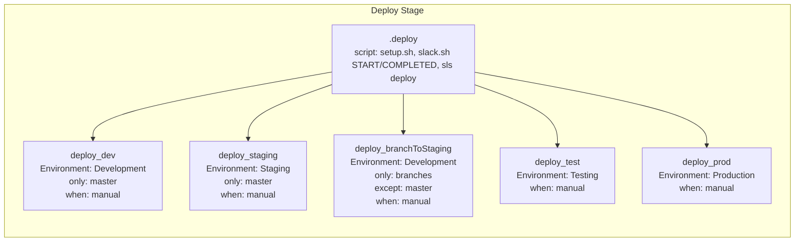

# Diagram: shipment_core/chromium_export/fv/.gitlab-ci.yml

> Auto-generated by Obscura crawlers

## Mermaid

### SVG

<svg id="container" width="1464.640625" xmlns="http://www.w3.org/2000/svg" class="flowchart" height="442" viewBox="0 0 1464.640625 442" role="graphics-document document" aria-roledescription="flowchart-v2"><g><marker id="container_flowchart-v2-pointEnd" class="marker flowchart-v2" viewBox="0 0 10 10" refX="5" refY="5" markerUnits="userSpaceOnUse" markerWidth="8" markerHeight="8" orient="auto"><path d="M 0 0 L 10 5 L 0 10 z" class="arrowMarkerPath" style="stroke-width: 1; stroke-dasharray: 1, 0;"></path></marker><marker id="container_flowchart-v2-pointStart" class="marker flowchart-v2" viewBox="0 0 10 10" refX="4.5" refY="5" markerUnits="userSpaceOnUse" markerWidth="8" markerHeight="8" orient="auto"><path d="M 0 5 L 10 10 L 10 0 z" class="arrowMarkerPath" style="stroke-width: 1; stroke-dasharray: 1, 0;"></path></marker><marker id="container_flowchart-v2-circleEnd" class="marker flowchart-v2" viewBox="0 0 10 10" refX="11" refY="5" markerUnits="userSpaceOnUse" markerWidth="11" markerHeight="11" orient="auto"><circle cx="5" cy="5" r="5" class="arrowMarkerPath" style="stroke-width: 1; stroke-dasharray: 1, 0;"></circle></marker><marker id="container_flowchart-v2-circleStart" class="marker flowchart-v2" viewBox="0 0 10 10" refX="-1" refY="5" markerUnits="userSpaceOnUse" markerWidth="11" markerHeight="11" orient="auto"><circle cx="5" cy="5" r="5" class="arrowMarkerPath" style="stroke-width: 1; stroke-dasharray: 1, 0;"></circle></marker><marker id="container_flowchart-v2-crossEnd" class="marker cross flowchart-v2" viewBox="0 0 11 11" refX="12" refY="5.2" markerUnits="userSpaceOnUse" markerWidth="11" markerHeight="11" orient="auto"><path d="M 1,1 l 9,9 M 10,1 l -9,9" class="arrowMarkerPath" style="stroke-width: 2; stroke-dasharray: 1, 0;"></path></marker><marker id="container_flowchart-v2-crossStart" class="marker cross flowchart-v2" viewBox="0 0 11 11" refX="-1" refY="5.2" markerUnits="userSpaceOnUse" markerWidth="11" markerHeight="11" orient="auto"><path d="M 1,1 l 9,9 M 10,1 l -9,9" class="arrowMarkerPath" style="stroke-width: 2; stroke-dasharray: 1, 0;"></path></marker><g class="root"><g class="clusters"></g><g class="edgePaths"></g><g class="edgeLabels"></g><g class="nodes"><g class="root" transform="translate(0, 0)"><g class="clusters"><g class="cluster" id="subGraph0" data-look="classic"><rect style="" x="8" y="8" width="1448.640625" height="426"></rect><g class="cluster-label" transform="translate(685.1953125, 8)"><foreignObject width="94.25" height="24">

Deploy Stage

</foreignObject></g></g></g><g class="edgePaths"><path d="M611.758,131.405L538.359,144.338C464.961,157.27,318.164,183.135,244.766,203.651C171.367,224.167,171.367,239.333,171.367,246.917L171.367,254.5" id="L_template_dev_0" class="edge-thickness-normal edge-pattern-solid edge-thickness-normal edge-pattern-solid flowchart-link" style=";" data-edge="true" data-et="edge" data-id="L_template_dev_0" data-points="W3sieCI6NjExLjc1NzgxMjUsInkiOjEzMS40MDUzNTU0MzA3NjI5fSx7IngiOjE3MS4zNjcxODc1LCJ5IjoyMDl9LHsieCI6MTcxLjM2NzE4NzUsInkiOjI1OC41fV0=" marker-end="url(#container_flowchart-v2-pointEnd)"></path><path d="M611.758,154.311L585.892,163.426C560.026,172.54,508.294,190.77,482.428,207.468C456.563,224.167,456.563,239.333,456.563,246.917L456.563,254.5" id="L_template_staging_0" class="edge-thickness-normal edge-pattern-solid edge-thickness-normal edge-pattern-solid flowchart-link" style=";" data-edge="true" data-et="edge" data-id="L_template_staging_0" data-points="W3sieCI6NjExLjc1NzgxMjUsInkiOjE1NC4zMTA3MTA4NjE1MjU4Mn0seyJ4Ijo0NTYuNTYyNSwieSI6MjA5fSx7IngiOjQ1Ni41NjI1LCJ5IjoyNTguNX1d" marker-end="url(#container_flowchart-v2-pointEnd)"></path><path d="M741.758,171.5L741.758,177.75C741.758,184,741.758,196.5,741.758,208.333C741.758,220.167,741.758,231.333,741.758,236.917L741.758,242.5" id="L_template_branch_0" class="edge-thickness-normal edge-pattern-solid edge-thickness-normal edge-pattern-solid flowchart-link" style=";" data-edge="true" data-et="edge" data-id="L_template_branch_0" data-points="W3sieCI6NzQxLjc1NzgxMjUsInkiOjE3MS41fSx7IngiOjc0MS43NTc4MTI1LCJ5IjoyMDl9LHsieCI6NzQxLjc1NzgxMjUsInkiOjI0Ni41fV0=" marker-end="url(#container_flowchart-v2-pointEnd)"></path><path d="M871.758,154.463L897.466,163.553C923.174,172.642,974.591,190.821,1000.299,209.494C1026.008,228.167,1026.008,247.333,1026.008,256.917L1026.008,266.5" id="L_template_test_0" class="edge-thickness-normal edge-pattern-solid edge-thickness-normal edge-pattern-solid flowchart-link" style=";" data-edge="true" data-et="edge" data-id="L_template_test_0" data-points="W3sieCI6ODcxLjc1NzgxMjUsInkiOjE1NC40NjMwNjA2ODYwMTU4NH0seyJ4IjoxMDI2LjAwNzgxMjUsInkiOjIwOX0seyJ4IjoxMDI2LjAwNzgxMjUsInkiOjI3MC41fV0=" marker-end="url(#container_flowchart-v2-pointEnd)"></path><path d="M871.758,131.83L943.426,144.692C1015.094,157.553,1158.43,183.277,1230.098,205.722C1301.766,228.167,1301.766,247.333,1301.766,256.917L1301.766,266.5" id="L_template_prod_0" class="edge-thickness-normal edge-pattern-solid edge-thickness-normal edge-pattern-solid flowchart-link" style=";" data-edge="true" data-et="edge" data-id="L_template_prod_0" data-points="W3sieCI6ODcxLjc1NzgxMjUsInkiOjEzMS44MzAwMzE2NjgwODQ5OH0seyJ4IjoxMzAxLjc2NTYyNSwieSI6MjA5fSx7IngiOjEzMDEuNzY1NjI1LCJ5IjoyNzAuNX1d" marker-end="url(#container_flowchart-v2-pointEnd)"></path></g><g class="edgeLabels"><g class="edgeLabel"><g class="label" data-id="L_template_dev_0" transform="translate(0, 0)"><foreignObject width="0" height="0">

</foreignObject></g></g><g class="edgeLabel"><g class="label" data-id="L_template_staging_0" transform="translate(0, 0)"><foreignObject width="0" height="0">

</foreignObject></g></g><g class="edgeLabel"><g class="label" data-id="L_template_branch_0" transform="translate(0, 0)"><foreignObject width="0" height="0">

</foreignObject></g></g><g class="edgeLabel"><g class="label" data-id="L_template_test_0" transform="translate(0, 0)"><foreignObject width="0" height="0">

</foreignObject></g></g><g class="edgeLabel"><g class="label" data-id="L_template_prod_0" transform="translate(0, 0)"><foreignObject width="0" height="0">

</foreignObject></g></g></g><g class="nodes"><g class="node default" id="flowchart-template-0" transform="translate(741.7578125, 108.5)"><rect class="basic label-container" style="" x="-130" y="-63" width="260" height="126"></rect><g class="label" style="" transform="translate(-100, -48)"><rect></rect><foreignObject width="200" height="96">

.deploy script: setup.sh, slack.sh START/COMPLETED, sls deploy

</foreignObject></g></g><g class="node default" id="flowchart-dev-1" transform="translate(171.3671875, 321.5)"><rect class="basic label-container" style="" x="-128.3671875" y="-63" width="256.734375" height="126"></rect><g class="label" style="" transform="translate(-98.3671875, -48)"><rect></rect><foreignObject width="196.734375" height="96">

deploy_dev Environment: Development only: master when: manual

</foreignObject></g></g><g class="node default" id="flowchart-staging-2" transform="translate(456.5625, 321.5)"><rect class="basic label-container" style="" x="-106.828125" y="-63" width="213.65625" height="126"></rect><g class="label" style="" transform="translate(-76.828125, -48)"><rect></rect><foreignObject width="153.65625" height="96">

deploy_staging Environment: Staging only: master when: manual

</foreignObject></g></g><g class="node default" id="flowchart-branch-3" transform="translate(741.7578125, 321.5)"><rect class="basic label-container" style="" x="-128.3671875" y="-75" width="256.734375" height="150"></rect><g class="label" style="" transform="translate(-98.3671875, -60)"><rect></rect><foreignObject width="196.734375" height="120">

deploy_branchToStaging Environment: Development only: branches except: master when: manual

</foreignObject></g></g><g class="node default" id="flowchart-test-4" transform="translate(1026.0078125, 321.5)"><rect class="basic label-container" style="" x="-105.8828125" y="-51" width="211.765625" height="102"></rect><g class="label" style="" transform="translate(-75.8828125, -36)"><rect></rect><foreignObject width="151.765625" height="72">

deploy_test Environment: Testing when: manual

</foreignObject></g></g><g class="node default" id="flowchart-prod-5" transform="translate(1301.765625, 321.5)"><rect class="basic label-container" style="" x="-119.875" y="-51" width="239.75" height="102"></rect><g class="label" style="" transform="translate(-89.875, -36)"><rect></rect><foreignObject width="179.75" height="72">

deploy_prod Environment: Production when: manual

</foreignObject></g></g></g></g></g></g></g></svg>
