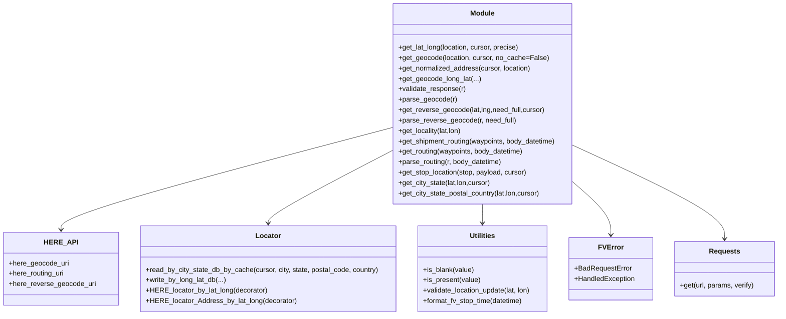

# Diagram: shipment_core/chromium_export/fv/python/fv/HERE/HERE.py


> Auto-generated by Obscura crawlers

## Diagram 1

```mermaid
flowchart TD
    subgraph External
        REQ[requests]:::ext
        LOCATOR[locator module]:::ext
        UTIL[utilities module]:::ext
        FVERR[fv.error]:::ext
        SECRETS[Secrets]:::ext
    end

    Start([module init]) -->|uses| SECRETS
    Start -->|sets| app_id
    Start -->|sets| api_key

    get_lat_long["get_lat_long(location, cursor, precise)"] -->|calls| validate_addr["validate address fields"]
    validate_addr -->|if ok| get_geocode_gc[get_geocode(location, cursor)]
    get_geocode_gc -->|may return| internal_lookup{internal_lookup?}
    internal_lookup -- True --> r_get_longlat["r.get_long_lat() -> return"]
    internal_lookup -- False --> parse_geocode_pg[parse_geocode(r)]
    parse_geocode_pg -->|returns| latlon[(latitude, longitude)]
    get_lat_long -->|raises| FVERR

    get_geocode["get_geocode(location, cursor, no_cache=False)"] -->|checks| api_key_check{api_key present?}
    api_key_check -- False --> FVERR
    api_key_check -- True --> build_locstr["build loc_str from address/name/city/state/postal_code"]
    build_locstr --> db_cache{if not no_cache -> locator.read_by_city_state_db_by_cache}
    db_cache -- found --> db_result["return (db_result, loc_str, True)"]
    db_cache -- not found --> REQ --> api_call["requests.get(here_geocode_uri, params)"]
    api_call --> r_raise["r.raise_for_status()"]
    api_call --> return_r["return (r, loc_str, False)"]

    get_normalized_address["get_normalized_address(cursor, location)"] --> get_geocode_gc
    get_normalized_address --> validate_response_vr[validate_response(r)] --> items_addr["return items['address']"]

    get_geocode_long_lat["get_geocode_long_lat(...)"] -->|may use cache| locator
    get_geocode_long_lat --> REQ
    get_geocode_long_lat --> parse_geocode_pg

    get_reverse_geocode["get_reverse_geocode(lat,lng,need_full, cursor)"] --> api_key_check_rg{api_key present?}
    api_key_check_rg -- True --> build_circle["build circle:lat,lng;r=250"]
    build_circle --> REQ --> r_raise_rg["r.raise_for_status()"]
    r_raise_rg --> parse_reverse_geocode_pr

    parse_reverse_geocode_pr["parse_reverse_geocode(r, need_full)"] --> validate_structure["validate 'items' and 'address' present"]
    validate_structure --> check_fields["ensure city,state,postalCode present if need_full"]
    check_fields -- ok --> transform_addr["capitalize keys; map Countrycode->Country, Postalcode->PostalCode, State->StateName/State"]
    transform_addr --> return_addr["return address dict"]

    get_locality --> get_reverse_geocode
    get_city_state --> get_reverse_geocode
    get_city_state_postal_country --> get_reverse_geocode

    get_stop_location["get_stop_location(stop, payload, cursor)"] --> check_latlon_present{lat/lon present and valid?}
    check_latlon_present -- True --> return_latlon
    check_latlon_present -- False --> address_fields_present{address fields present and name present?}
    address_fields_present -- True --> get_geocode_gc
    get_geocode_gc --> parse_geocode_pg
    get_stop_location --> FVERR

    get_shipment_routing["get_shipment_routing(waypoints, body_datetime)"] --> get_routing["get_routing(waypoints, body_datetime)"]
    get_routing --> validate_waypoints["validate waypoints iterable, length>=2, floats"]
    validate_waypoints --> build_payload["build routing payload and origin/destination/via"]
    build_payload --> REQ --> r_raise_routing["r.raise_for_status()"] --> return_routing_r["return r"]
    get_shipment_routing --> parse_routing["parse_routing(r, body_datetime)"] --> compute_eta["compute total_distance, early_eta, late_eta"] --> return_trip[(total_distance, early_eta, late_eta)]

    classDef ext fill:#f9f,stroke:#333,stroke-width:1px
```

> SVG rendering failed for this diagram.

## Diagram 2



### SVG

<svg id="container" width="1786.640625" xmlns="http://www.w3.org/2000/svg" class="classDiagram" height="726" viewBox="0 0 1786.640625 726" role="graphics-document document" aria-roledescription="class"><style>#container{font-family:"trebuchet ms",verdana,arial,sans-serif;font-size:16px;fill:#333;}@keyframes edge-animation-frame{from{stroke-dashoffset:0;}}@keyframes dash{to{stroke-dashoffset:0;}}#container .edge-animation-slow{stroke-dasharray:9,5!important;stroke-dashoffset:900;animation:dash 50s linear infinite;stroke-linecap:round;}#container .edge-animation-fast{stroke-dasharray:9,5!important;stroke-dashoffset:900;animation:dash 20s linear infinite;stroke-linecap:round;}#container .error-icon{fill:#552222;}#container .error-text{fill:#552222;stroke:#552222;}#container .edge-thickness-normal{stroke-width:1px;}#container .edge-thickness-thick{stroke-width:3.5px;}#container .edge-pattern-solid{stroke-dasharray:0;}#container .edge-thickness-invisible{stroke-width:0;fill:none;}#container .edge-pattern-dashed{stroke-dasharray:3;}#container .edge-pattern-dotted{stroke-dasharray:2;}#container .marker{fill:#333333;stroke:#333333;}#container .marker.cross{stroke:#333333;}#container svg{font-family:"trebuchet ms",verdana,arial,sans-serif;font-size:16px;}#container p{margin:0;}#container g.classGroup text{fill:#9370DB;stroke:none;font-family:"trebuchet ms",verdana,arial,sans-serif;font-size:10px;}#container g.classGroup text .title{font-weight:bolder;}#container .nodeLabel,#container .edgeLabel{color:#131300;}#container .edgeLabel .label rect{fill:#ECECFF;}#container .label text{fill:#131300;}#container .labelBkg{background:#ECECFF;}#container .edgeLabel .label span{background:#ECECFF;}#container .classTitle{font-weight:bolder;}#container .node rect,#container .node circle,#container .node ellipse,#container .node polygon,#container .node path{fill:#ECECFF;stroke:#9370DB;stroke-width:1px;}#container .divider{stroke:#9370DB;stroke-width:1;}#container g.clickable{cursor:pointer;}#container g.classGroup rect{fill:#ECECFF;stroke:#9370DB;}#container g.classGroup line{stroke:#9370DB;stroke-width:1;}#container .classLabel .box{stroke:none;stroke-width:0;fill:#ECECFF;opacity:0.5;}#container .classLabel .label{fill:#9370DB;font-size:10px;}#container .relation{stroke:#333333;stroke-width:1;fill:none;}#container .dashed-line{stroke-dasharray:3;}#container .dotted-line{stroke-dasharray:1 2;}#container #compositionStart,#container .composition{fill:#333333!important;stroke:#333333!important;stroke-width:1;}#container #compositionEnd,#container .composition{fill:#333333!important;stroke:#333333!important;stroke-width:1;}#container #dependencyStart,#container .dependency{fill:#333333!important;stroke:#333333!important;stroke-width:1;}#container #dependencyStart,#container .dependency{fill:#333333!important;stroke:#333333!important;stroke-width:1;}#container #extensionStart,#container .extension{fill:transparent!important;stroke:#333333!important;stroke-width:1;}#container #extensionEnd,#container .extension{fill:transparent!important;stroke:#333333!important;stroke-width:1;}#container #aggregationStart,#container .aggregation{fill:transparent!important;stroke:#333333!important;stroke-width:1;}#container #aggregationEnd,#container .aggregation{fill:transparent!important;stroke:#333333!important;stroke-width:1;}#container #lollipopStart,#container .lollipop{fill:#ECECFF!important;stroke:#333333!important;stroke-width:1;}#container #lollipopEnd,#container .lollipop{fill:#ECECFF!important;stroke:#333333!important;stroke-width:1;}#container .edgeTerminals{font-size:11px;line-height:initial;}#container .classTitleText{text-anchor:middle;font-size:18px;fill:#333;}#container .label-icon{display:inline-block;height:1em;overflow:visible;vertical-align:-0.125em;}#container .node .label-icon path{fill:currentColor;stroke:revert;stroke-width:revert;}#container :root{--mermaid-font-family:"trebuchet ms",verdana,arial,sans-serif;}</style><g><defs><marker id="container_class-aggregationStart" class="marker aggregation class" refX="18" refY="7" markerWidth="190" markerHeight="240" orient="auto"><path d="M 18,7 L9,13 L1,7 L9,1 Z"></path></marker></defs><defs><marker id="container_class-aggregationEnd" class="marker aggregation class" refX="1" refY="7" markerWidth="20" markerHeight="28" orient="auto"><path d="M 18,7 L9,13 L1,7 L9,1 Z"></path></marker></defs><defs><marker id="container_class-extensionStart" class="marker extension class" refX="18" refY="7" markerWidth="190" markerHeight="240" orient="auto"><path d="M 1,7 L18,13 V 1 Z"></path></marker></defs><defs><marker id="container_class-extensionEnd" class="marker extension class" refX="1" refY="7" markerWidth="20" markerHeight="28" orient="auto"><path d="M 1,1 V 13 L18,7 Z"></path></marker></defs><defs><marker id="container_class-compositionStart" class="marker composition class" refX="18" refY="7" markerWidth="190" markerHeight="240" orient="auto"><path d="M 18,7 L9,13 L1,7 L9,1 Z"></path></marker></defs><defs><marker id="container_class-compositionEnd" class="marker composition class" refX="1" refY="7" markerWidth="20" markerHeight="28" orient="auto"><path d="M 18,7 L9,13 L1,7 L9,1 Z"></path></marker></defs><defs><marker id="container_class-dependencyStart" class="marker dependency class" refX="6" refY="7" markerWidth="190" markerHeight="240" orient="auto"><path d="M 5,7 L9,13 L1,7 L9,1 Z"></path></marker></defs><defs><marker id="container_class-dependencyEnd" class="marker dependency class" refX="13" refY="7" markerWidth="20" markerHeight="28" orient="auto"><path d="M 18,7 L9,13 L14,7 L9,1 Z"></path></marker></defs><defs><marker id="container_class-lollipopStart" class="marker lollipop class" refX="13" refY="7" markerWidth="190" markerHeight="240" orient="auto"><circle stroke="black" fill="transparent" cx="7" cy="7" r="6"></circle></marker></defs><defs><marker id="container_class-lollipopEnd" class="marker lollipop class" refX="1" refY="7" markerWidth="190" markerHeight="240" orient="auto"><circle stroke="black" fill="transparent" cx="7" cy="7" r="6"></circle></marker></defs><g class="root"><g class="clusters"></g><g class="edgePaths"><path d="M895.703,294.49L769.18,327.908C642.658,361.327,389.612,428.163,263.089,467.248C136.566,506.333,136.566,517.667,136.566,523.333L136.566,529" id="id_Module_HERE_API_1" class="edge-thickness-normal edge-pattern-solid relation" style=";;;" data-edge="true" data-et="edge" data-id="id_Module_HERE_API_1" data-points="W3sieCI6ODk1LjcwMzEyNSwieSI6Mjk0LjQ4OTgyOTU1ODk2NTJ9LHsieCI6MTM2LjU2NjQwNjI1LCJ5Ijo0OTV9LHsieCI6MTM2LjU2NjQwNjI1LCJ5Ijo1MzV9XQ==" marker-end="url(#container_class-dependencyEnd)"></path><path d="M895.703,347.262L847.921,371.885C800.139,396.508,704.576,445.754,656.794,473.544C609.012,501.333,609.012,507.667,609.012,510.833L609.012,514" id="id_Module_Locator_2" class="edge-thickness-normal edge-pattern-solid relation" style=";;;" data-edge="true" data-et="edge" data-id="id_Module_Locator_2" data-points="W3sieCI6ODk1LjcwMzEyNSwieSI6MzQ3LjI2MTc4MTAxMDQxODd9LHsieCI6NjA5LjAxMTcxODc1LCJ5Ijo0OTV9LHsieCI6NjA5LjAxMTcxODc1LCJ5Ijo1MjB9XQ==" marker-end="url(#container_class-dependencyEnd)"></path><path d="M1105.789,470L1105.789,474.167C1105.789,478.333,1105.789,486.667,1105.789,494C1105.789,501.333,1105.789,507.667,1105.789,510.833L1105.789,514" id="id_Module_Utilities_3" class="edge-thickness-normal edge-pattern-solid relation" style=";;;" data-edge="true" data-et="edge" data-id="id_Module_Utilities_3" data-points="W3sieCI6MTEwNS43ODkwNjI1LCJ5Ijo0NzB9LHsieCI6MTEwNS43ODkwNjI1LCJ5Ijo0OTV9LHsieCI6MTEwNS43ODkwNjI1LCJ5Ijo1MjB9XQ==" marker-end="url(#container_class-dependencyEnd)"></path><path d="M1315.875,419.297L1330.577,431.914C1345.279,444.531,1374.682,469.766,1389.384,490.049C1404.086,510.333,1404.086,525.667,1404.086,533.333L1404.086,541" id="id_Module_FVError_4" class="edge-thickness-normal edge-pattern-solid relation" style=";;;" data-edge="true" data-et="edge" data-id="id_Module_FVError_4" data-points="W3sieCI6MTMxNS44NzUsInkiOjQxOS4yOTY4OTM4MjQzMTUxM30seyJ4IjoxNDA0LjA4NTkzNzUsInkiOjQ5NX0seyJ4IjoxNDA0LjA4NTkzNzUsInkiOjU0N31d" marker-end="url(#container_class-dependencyEnd)"></path><path d="M1315.875,335.336L1373.906,361.947C1431.938,388.558,1548,441.779,1606.031,477.556C1664.063,513.333,1664.063,531.667,1664.063,540.833L1664.063,550" id="id_Module_Requests_5" class="edge-thickness-normal edge-pattern-solid relation" style=";;;" data-edge="true" data-et="edge" data-id="id_Module_Requests_5" data-points="W3sieCI6MTMxNS44NzUsInkiOjMzNS4zMzYzMDQ3MzQxODMzfSx7IngiOjE2NjQuMDYyNSwieSI6NDk1fSx7IngiOjE2NjQuMDYyNSwieSI6NTU2fV0=" marker-end="url(#container_class-dependencyEnd)"></path></g><g class="edgeLabels"><g class="edgeLabel"><g class="label" data-id="id_Module_HERE_API_1" transform="translate(0, 0)"><foreignObject width="0" height="0"><div xmlns="http://www.w3.org/1999/xhtml" class="labelBkg" style="display: table-cell; white-space: nowrap; line-height: 1.5; max-width: 200px; text-align: center;"><span class="edgeLabel"></span></div></foreignObject></g></g><g class="edgeLabel"><g class="label" data-id="id_Module_Locator_2" transform="translate(0, 0)"><foreignObject width="0" height="0"><div xmlns="http://www.w3.org/1999/xhtml" class="labelBkg" style="display: table-cell; white-space: nowrap; line-height: 1.5; max-width: 200px; text-align: center;"><span class="edgeLabel"></span></div></foreignObject></g></g><g class="edgeLabel"><g class="label" data-id="id_Module_Utilities_3" transform="translate(0, 0)"><foreignObject width="0" height="0"><div xmlns="http://www.w3.org/1999/xhtml" class="labelBkg" style="display: table-cell; white-space: nowrap; line-height: 1.5; max-width: 200px; text-align: center;"><span class="edgeLabel"></span></div></foreignObject></g></g><g class="edgeLabel"><g class="label" data-id="id_Module_FVError_4" transform="translate(0, 0)"><foreignObject width="0" height="0"><div xmlns="http://www.w3.org/1999/xhtml" class="labelBkg" style="display: table-cell; white-space: nowrap; line-height: 1.5; max-width: 200px; text-align: center;"><span class="edgeLabel"></span></div></foreignObject></g></g><g class="edgeLabel"><g class="label" data-id="id_Module_Requests_5" transform="translate(0, 0)"><foreignObject width="0" height="0"><div xmlns="http://www.w3.org/1999/xhtml" class="labelBkg" style="display: table-cell; white-space: nowrap; line-height: 1.5; max-width: 200px; text-align: center;"><span class="edgeLabel"></span></div></foreignObject></g></g></g><g class="nodes"><g class="node default" id="classId-HERE_API-0" transform="translate(136.56640625, 619)"><g class="basic label-container"><path d="M-128.56640625 -84 L128.56640625 -84 L128.56640625 84 L-128.56640625 84" stroke="none" stroke-width="0" fill="#ECECFF" style=""></path><path d="M-128.56640625 -84 C-55.85864194480692 -84, 16.84912236038616 -84, 128.56640625 -84 M-128.56640625 -84 C-76.20905230071413 -84, -23.85169835142827 -84, 128.56640625 -84 M128.56640625 -84 C128.56640625 -39.22108029227606, 128.56640625 5.557839415447873, 128.56640625 84 M128.56640625 -84 C128.56640625 -25.94002080118171, 128.56640625 32.11995839763658, 128.56640625 84 M128.56640625 84 C26.64739563742178 84, -75.27161497515644 84, -128.56640625 84 M128.56640625 84 C65.61337240084023 84, 2.6603385516804536 84, -128.56640625 84 M-128.56640625 84 C-128.56640625 22.650830842043476, -128.56640625 -38.69833831591305, -128.56640625 -84 M-128.56640625 84 C-128.56640625 24.662900599251913, -128.56640625 -34.674198801496175, -128.56640625 -84" stroke="#9370DB" stroke-width="1.3" fill="none" stroke-dasharray="0 0" style=""></path></g><g class="annotation-group text" transform="translate(0, -60)"></g><g class="label-group text" transform="translate(-34.7109375, -60)"><g class="label" style="font-weight: bolder" transform="translate(0,-12)"><foreignObject width="69.421875" height="24"><div xmlns="http://www.w3.org/1999/xhtml" style="display: table-cell; white-space: nowrap; line-height: 1.5; max-width: 119px; text-align: center;"><span class="nodeLabel markdown-node-label" style=""><p>HERE_API</p></span></div></foreignObject></g></g><g class="members-group text" transform="translate(-116.56640625, -12)"><g class="label" style="" transform="translate(0,-12)"><foreignObject width="137.421875" height="24"><div xmlns="http://www.w3.org/1999/xhtml" style="display: table-cell; white-space: nowrap; line-height: 1.5; max-width: 195px; text-align: center;"><span class="nodeLabel markdown-node-label" style=""><p>+here_geocode_uri</p></span></div></foreignObject></g><g class="label" style="" transform="translate(0,12)"><foreignObject width="128.90625" height="24"><div xmlns="http://www.w3.org/1999/xhtml" style="display: table-cell; white-space: nowrap; line-height: 1.5; max-width: 186px; text-align: center;"><span class="nodeLabel markdown-node-label" style=""><p>+here_routing_uri</p></span></div></foreignObject></g><g class="label" style="" transform="translate(0,36)"><foreignObject width="198.421875" height="24"><div xmlns="http://www.w3.org/1999/xhtml" style="display: table-cell; white-space: nowrap; line-height: 1.5; max-width: 256px; text-align: center;"><span class="nodeLabel markdown-node-label" style=""><p>+here_reverse_geocode_uri</p></span></div></foreignObject></g></g><g class="methods-group text" transform="translate(-116.56640625, 84)"></g><g class="divider" style=""><path d="M-128.56640625 -36 C-61.402427519771464 -36, 5.761551210457071 -36, 128.56640625 -36 M-128.56640625 -36 C-32.3328319522206 -36, 63.9007423455588 -36, 128.56640625 -36" stroke="#9370DB" stroke-width="1.3" fill="none" stroke-dasharray="0 0" style=""></path></g><g class="divider" style=""><path d="M-128.56640625 60 C-45.95857559046992 60, 36.64925506906016 60, 128.56640625 60 M-128.56640625 60 C-27.132921011134627 60, 74.30056422773075 60, 128.56640625 60" stroke="#9370DB" stroke-width="1.3" fill="none" stroke-dasharray="0 0" style=""></path></g></g><g class="node default" id="classId-Locator-1" transform="translate(609.01171875, 619)"><g class="basic label-container"><path d="M-293.87890625 -99 L293.87890625 -99 L293.87890625 99 L-293.87890625 99" stroke="none" stroke-width="0" fill="#ECECFF" style=""></path><path d="M-293.87890625 -99 C-84.97932250440024 -99, 123.92026124119951 -99, 293.87890625 -99 M-293.87890625 -99 C-129.64953030737541 -99, 34.57984563524917 -99, 293.87890625 -99 M293.87890625 -99 C293.87890625 -42.217991365014186, 293.87890625 14.564017269971629, 293.87890625 99 M293.87890625 -99 C293.87890625 -40.6798507866617, 293.87890625 17.640298426676594, 293.87890625 99 M293.87890625 99 C69.92288030745303 99, -154.03314563509394 99, -293.87890625 99 M293.87890625 99 C148.6752453152494 99, 3.4715843804988253 99, -293.87890625 99 M-293.87890625 99 C-293.87890625 54.80726761005137, -293.87890625 10.614535220102738, -293.87890625 -99 M-293.87890625 99 C-293.87890625 31.62799803543932, -293.87890625 -35.74400392912136, -293.87890625 -99" stroke="#9370DB" stroke-width="1.3" fill="none" stroke-dasharray="0 0" style=""></path></g><g class="annotation-group text" transform="translate(0, -75)"></g><g class="label-group text" transform="translate(-27.5390625, -75)"><g class="label" style="font-weight: bolder" transform="translate(0,-12)"><foreignObject width="55.078125" height="24"><div xmlns="http://www.w3.org/1999/xhtml" style="display: table-cell; white-space: nowrap; line-height: 1.5; max-width: 105px; text-align: center;"><span class="nodeLabel markdown-node-label" style=""><p>Locator</p></span></div></foreignObject></g></g><g class="members-group text" transform="translate(-281.87890625, -27)"></g><g class="methods-group text" transform="translate(-281.87890625, 3)"><g class="label" style="" transform="translate(0,-12)"><foreignObject width="536.21875" height="24"><div xmlns="http://www.w3.org/1999/xhtml" style="display: table-cell; white-space: nowrap; line-height: 1.5; max-width: 594px; text-align: center;"><span class="nodeLabel markdown-node-label" style=""><p>+read_by_city_state_db_by_cache(cursor, city, state, postal_code, country)</p></span></div></foreignObject></g><g class="label" style="" transform="translate(0,12)"><foreignObject width="185.3125" height="24"><div xmlns="http://www.w3.org/1999/xhtml" style="display: table-cell; white-space: nowrap; line-height: 1.5; max-width: 243px; text-align: center;"><span class="nodeLabel markdown-node-label" style=""><p>+write_by_long_lat_db(...)</p></span></div></foreignObject></g><g class="label" style="" transform="translate(0,36)"><foreignObject width="276.671875" height="24"><div xmlns="http://www.w3.org/1999/xhtml" style="display: table-cell; white-space: nowrap; line-height: 1.5; max-width: 334px; text-align: center;"><span class="nodeLabel markdown-node-label" style=""><p>+HERE_locator_by_lat_long(decorator)</p></span></div></foreignObject></g><g class="label" style="" transform="translate(0,60)"><foreignObject width="342.171875" height="24"><div xmlns="http://www.w3.org/1999/xhtml" style="display: table-cell; white-space: nowrap; line-height: 1.5; max-width: 400px; text-align: center;"><span class="nodeLabel markdown-node-label" style=""><p>+HERE_locator_Address_by_lat_long(decorator)</p></span></div></foreignObject></g></g><g class="divider" style=""><path d="M-293.87890625 -51 C-75.71693797305443 -51, 142.44503030389114 -51, 293.87890625 -51 M-293.87890625 -51 C-136.53605107823833 -51, 20.80680409352334 -51, 293.87890625 -51" stroke="#9370DB" stroke-width="1.3" fill="none" stroke-dasharray="0 0" style=""></path></g><g class="divider" style=""><path d="M-293.87890625 -27 C-144.2094645972235 -27, 5.459977055552997 -27, 293.87890625 -27 M-293.87890625 -27 C-100.87900798765867 -27, 92.12089027468267 -27, 293.87890625 -27" stroke="#9370DB" stroke-width="1.3" fill="none" stroke-dasharray="0 0" style=""></path></g></g><g class="node default" id="classId-Utilities-2" transform="translate(1105.7890625, 619)"><g class="basic label-container"><path d="M-152.8984375 -99 L152.8984375 -99 L152.8984375 99 L-152.8984375 99" stroke="none" stroke-width="0" fill="#ECECFF" style=""></path><path d="M-152.8984375 -99 C-43.023766087279014 -99, 66.85090532544197 -99, 152.8984375 -99 M-152.8984375 -99 C-36.84390180865498 -99, 79.21063388269005 -99, 152.8984375 -99 M152.8984375 -99 C152.8984375 -30.97815024952918, 152.8984375 37.04369950094164, 152.8984375 99 M152.8984375 -99 C152.8984375 -20.117549550131656, 152.8984375 58.76490089973669, 152.8984375 99 M152.8984375 99 C60.44409372901309 99, -32.01025004197382 99, -152.8984375 99 M152.8984375 99 C49.64239998765271 99, -53.61363752469458 99, -152.8984375 99 M-152.8984375 99 C-152.8984375 56.486942298791774, -152.8984375 13.973884597583549, -152.8984375 -99 M-152.8984375 99 C-152.8984375 38.674647168423554, -152.8984375 -21.65070566315289, -152.8984375 -99" stroke="#9370DB" stroke-width="1.3" fill="none" stroke-dasharray="0 0" style=""></path></g><g class="annotation-group text" transform="translate(0, -75)"></g><g class="label-group text" transform="translate(-28.8125, -75)"><g class="label" style="font-weight: bolder" transform="translate(0,-12)"><foreignObject width="57.625" height="24"><div xmlns="http://www.w3.org/1999/xhtml" style="display: table-cell; white-space: nowrap; line-height: 1.5; max-width: 107px; text-align: center;"><span class="nodeLabel markdown-node-label" style=""><p>Utilities</p></span></div></foreignObject></g></g><g class="members-group text" transform="translate(-140.8984375, -27)"></g><g class="methods-group text" transform="translate(-140.8984375, 3)"><g class="label" style="" transform="translate(0,-12)"><foreignObject width="117.609375" height="24"><div xmlns="http://www.w3.org/1999/xhtml" style="display: table-cell; white-space: nowrap; line-height: 1.5; max-width: 175px; text-align: center;"><span class="nodeLabel markdown-node-label" style=""><p>+is_blank(value)</p></span></div></foreignObject></g><g class="label" style="" transform="translate(0,12)"><foreignObject width="132.484375" height="24"><div xmlns="http://www.w3.org/1999/xhtml" style="display: table-cell; white-space: nowrap; line-height: 1.5; max-width: 190px; text-align: center;"><span class="nodeLabel markdown-node-label" style=""><p>+is_present(value)</p></span></div></foreignObject></g><g class="label" style="" transform="translate(0,36)"><foreignObject width="252.984375" height="24"><div xmlns="http://www.w3.org/1999/xhtml" style="display: table-cell; white-space: nowrap; line-height: 1.5; max-width: 310px; text-align: center;"><span class="nodeLabel markdown-node-label" style=""><p>+validate_location_update(lat, lon)</p></span></div></foreignObject></g><g class="label" style="" transform="translate(0,60)"><foreignObject width="233.609375" height="24"><div xmlns="http://www.w3.org/1999/xhtml" style="display: table-cell; white-space: nowrap; line-height: 1.5; max-width: 291px; text-align: center;"><span class="nodeLabel markdown-node-label" style=""><p>+format_fv_stop_time(datetime)</p></span></div></foreignObject></g></g><g class="divider" style=""><path d="M-152.8984375 -51 C-69.17880960151926 -51, 14.540818296961476 -51, 152.8984375 -51 M-152.8984375 -51 C-33.95799579093328 -51, 84.98244591813344 -51, 152.8984375 -51" stroke="#9370DB" stroke-width="1.3" fill="none" stroke-dasharray="0 0" style=""></path></g><g class="divider" style=""><path d="M-152.8984375 -27 C-84.96180272242222 -27, -17.02516794484444 -27, 152.8984375 -27 M-152.8984375 -27 C-34.221378565179506 -27, 84.45568036964099 -27, 152.8984375 -27" stroke="#9370DB" stroke-width="1.3" fill="none" stroke-dasharray="0 0" style=""></path></g></g><g class="node default" id="classId-FVError-3" transform="translate(1404.0859375, 619)"><g class="basic label-container"><path d="M-95.3984375 -72 L95.3984375 -72 L95.3984375 72 L-95.3984375 72" stroke="none" stroke-width="0" fill="#ECECFF" style=""></path><path d="M-95.3984375 -72 C-37.953110549249516 -72, 19.49221640150097 -72, 95.3984375 -72 M-95.3984375 -72 C-19.367091416268323 -72, 56.664254667463354 -72, 95.3984375 -72 M95.3984375 -72 C95.3984375 -27.605335377275487, 95.3984375 16.789329245449025, 95.3984375 72 M95.3984375 -72 C95.3984375 -38.65462216668148, 95.3984375 -5.309244333362955, 95.3984375 72 M95.3984375 72 C52.83963072617485 72, 10.280823952349706 72, -95.3984375 72 M95.3984375 72 C57.18704729613423 72, 18.975657092268463 72, -95.3984375 72 M-95.3984375 72 C-95.3984375 29.656149914618346, -95.3984375 -12.687700170763307, -95.3984375 -72 M-95.3984375 72 C-95.3984375 36.84581395338647, -95.3984375 1.6916279067729363, -95.3984375 -72" stroke="#9370DB" stroke-width="1.3" fill="none" stroke-dasharray="0 0" style=""></path></g><g class="annotation-group text" transform="translate(0, -48)"></g><g class="label-group text" transform="translate(-26.640625, -48)"><g class="label" style="font-weight: bolder" transform="translate(0,-12)"><foreignObject width="53.28125" height="24"><div xmlns="http://www.w3.org/1999/xhtml" style="display: table-cell; white-space: nowrap; line-height: 1.5; max-width: 103px; text-align: center;"><span class="nodeLabel markdown-node-label" style=""><p>FVError</p></span></div></foreignObject></g></g><g class="members-group text" transform="translate(-83.3984375, 0)"><g class="label" style="" transform="translate(0,-12)"><foreignObject width="130.796875" height="24"><div xmlns="http://www.w3.org/1999/xhtml" style="display: table-cell; white-space: nowrap; line-height: 1.5; max-width: 189px; text-align: center;"><span class="nodeLabel markdown-node-label" style=""><p>+BadRequestError</p></span></div></foreignObject></g><g class="label" style="" transform="translate(0,12)"><foreignObject width="140.15625" height="24"><div xmlns="http://www.w3.org/1999/xhtml" style="display: table-cell; white-space: nowrap; line-height: 1.5; max-width: 198px; text-align: center;"><span class="nodeLabel markdown-node-label" style=""><p>+HandledException</p></span></div></foreignObject></g></g><g class="methods-group text" transform="translate(-83.3984375, 72)"></g><g class="divider" style=""><path d="M-95.3984375 -24 C-36.47212743792075 -24, 22.454182624158506 -24, 95.3984375 -24 M-95.3984375 -24 C-53.32813954380242 -24, -11.257841587604844 -24, 95.3984375 -24" stroke="#9370DB" stroke-width="1.3" fill="none" stroke-dasharray="0 0" style=""></path></g><g class="divider" style=""><path d="M-95.3984375 48 C-46.93517921150475 48, 1.528079076990494 48, 95.3984375 48 M-95.3984375 48 C-42.30125884545322 48, 10.795919809093562 48, 95.3984375 48" stroke="#9370DB" stroke-width="1.3" fill="none" stroke-dasharray="0 0" style=""></path></g></g><g class="node default" id="classId-Requests-4" transform="translate(1664.0625, 619)"><g class="basic label-container"><path d="M-114.578125 -63 L114.578125 -63 L114.578125 63 L-114.578125 63" stroke="none" stroke-width="0" fill="#ECECFF" style=""></path><path d="M-114.578125 -63 C-55.16079053600516 -63, 4.256543927989682 -63, 114.578125 -63 M-114.578125 -63 C-39.927385180202606 -63, 34.72335463959479 -63, 114.578125 -63 M114.578125 -63 C114.578125 -31.69630526846329, 114.578125 -0.39261053692658265, 114.578125 63 M114.578125 -63 C114.578125 -37.08973811819994, 114.578125 -11.179476236399879, 114.578125 63 M114.578125 63 C66.654390144442 63, 18.730655288883995 63, -114.578125 63 M114.578125 63 C38.89724393377966 63, -36.783637132440674 63, -114.578125 63 M-114.578125 63 C-114.578125 20.053723942426792, -114.578125 -22.892552115146415, -114.578125 -63 M-114.578125 63 C-114.578125 17.22789403678979, -114.578125 -28.544211926420417, -114.578125 -63" stroke="#9370DB" stroke-width="1.3" fill="none" stroke-dasharray="0 0" style=""></path></g><g class="annotation-group text" transform="translate(0, -39)"></g><g class="label-group text" transform="translate(-33.84375, -39)"><g class="label" style="font-weight: bolder" transform="translate(0,-12)"><foreignObject width="67.6875" height="24"><div xmlns="http://www.w3.org/1999/xhtml" style="display: table-cell; white-space: nowrap; line-height: 1.5; max-width: 116px; text-align: center;"><span class="nodeLabel markdown-node-label" style=""><p>Requests</p></span></div></foreignObject></g></g><g class="members-group text" transform="translate(-102.578125, 9)"></g><g class="methods-group text" transform="translate(-102.578125, 39)"><g class="label" style="" transform="translate(0,-12)"><foreignObject width="171.3125" height="24"><div xmlns="http://www.w3.org/1999/xhtml" style="display: table-cell; white-space: nowrap; line-height: 1.5; max-width: 229px; text-align: center;"><span class="nodeLabel markdown-node-label" style=""><p>+get(url, params, verify)</p></span></div></foreignObject></g></g><g class="divider" style=""><path d="M-114.578125 -15 C-46.12774323597506 -15, 22.32263852804988 -15, 114.578125 -15 M-114.578125 -15 C-31.745217842425177 -15, 51.087689315149646 -15, 114.578125 -15" stroke="#9370DB" stroke-width="1.3" fill="none" stroke-dasharray="0 0" style=""></path></g><g class="divider" style=""><path d="M-114.578125 9 C-36.092997557026194 9, 42.39212988594761 9, 114.578125 9 M-114.578125 9 C-46.65648162294231 9, 21.265161754115383 9, 114.578125 9" stroke="#9370DB" stroke-width="1.3" fill="none" stroke-dasharray="0 0" style=""></path></g></g><g class="node default" id="classId-Module-5" transform="translate(1105.7890625, 239)"><g class="basic label-container"><path d="M-210.0859375 -231 L210.0859375 -231 L210.0859375 231 L-210.0859375 231" stroke="none" stroke-width="0" fill="#ECECFF" style=""></path><path d="M-210.0859375 -231 C-84.03701858343324 -231, 42.011900333133525 -231, 210.0859375 -231 M-210.0859375 -231 C-48.903596697361024 -231, 112.27874410527795 -231, 210.0859375 -231 M210.0859375 -231 C210.0859375 -47.62885898857505, 210.0859375 135.7422820228499, 210.0859375 231 M210.0859375 -231 C210.0859375 -115.08666697256784, 210.0859375 0.8266660548643188, 210.0859375 231 M210.0859375 231 C70.65540394077328 231, -68.77512961845343 231, -210.0859375 231 M210.0859375 231 C74.891757405911 231, -60.30242268817801 231, -210.0859375 231 M-210.0859375 231 C-210.0859375 71.43281565086701, -210.0859375 -88.13436869826597, -210.0859375 -231 M-210.0859375 231 C-210.0859375 108.17373174507179, -210.0859375 -14.652536509856418, -210.0859375 -231" stroke="#9370DB" stroke-width="1.3" fill="none" stroke-dasharray="0 0" style=""></path></g><g class="annotation-group text" transform="translate(0, -207)"></g><g class="label-group text" transform="translate(-27.09375, -207)"><g class="label" style="font-weight: bolder" transform="translate(0,-12)"><foreignObject width="54.1875" height="24"><div xmlns="http://www.w3.org/1999/xhtml" style="display: table-cell; white-space: nowrap; line-height: 1.5; max-width: 104px; text-align: center;"><span class="nodeLabel markdown-node-label" style=""><p>Module</p></span></div></foreignObject></g></g><g class="members-group text" transform="translate(-198.0859375, -159)"></g><g class="methods-group text" transform="translate(-198.0859375, -129)"><g class="label" style="" transform="translate(0,-12)"><foreignObject width="280.015625" height="24"><div xmlns="http://www.w3.org/1999/xhtml" style="display: table-cell; white-space: nowrap; line-height: 1.5; max-width: 337px; text-align: center;"><span class="nodeLabel markdown-node-label" style=""><p>+get_lat_long(location, cursor, precise)</p></span></div></foreignObject></g><g class="label" style="" transform="translate(0,12)"><foreignObject width="342.890625" height="24"><div xmlns="http://www.w3.org/1999/xhtml" style="display: table-cell; white-space: nowrap; line-height: 1.5; max-width: 400px; text-align: center;"><span class="nodeLabel markdown-node-label" style=""><p>+get_geocode(location, cursor, no_cache=False)</p></span></div></foreignObject></g><g class="label" style="" transform="translate(0,36)"><foreignObject width="307.484375" height="24"><div xmlns="http://www.w3.org/1999/xhtml" style="display: table-cell; white-space: nowrap; line-height: 1.5; max-width: 365px; text-align: center;"><span class="nodeLabel markdown-node-label" style=""><p>+get_normalized_address(cursor, location)</p></span></div></foreignObject></g><g class="label" style="" transform="translate(0,60)"><foreignObject width="188.796875" height="24"><div xmlns="http://www.w3.org/1999/xhtml" style="display: table-cell; white-space: nowrap; line-height: 1.5; max-width: 246px; text-align: center;"><span class="nodeLabel markdown-node-label" style=""><p>+get_geocode_long_lat(...)</p></span></div></foreignObject></g><g class="label" style="" transform="translate(0,84)"><foreignObject width="156.5625" height="24"><div xmlns="http://www.w3.org/1999/xhtml" style="display: table-cell; white-space: nowrap; line-height: 1.5; max-width: 214px; text-align: center;"><span class="nodeLabel markdown-node-label" style=""><p>+validate_response(r)</p></span></div></foreignObject></g><g class="label" style="" transform="translate(0,108)"><foreignObject width="133.9375" height="24"><div xmlns="http://www.w3.org/1999/xhtml" style="display: table-cell; white-space: nowrap; line-height: 1.5; max-width: 191px; text-align: center;"><span class="nodeLabel markdown-node-label" style=""><p>+parse_geocode(r)</p></span></div></foreignObject></g><g class="label" style="" transform="translate(0,132)"><foreignObject width="338.59375" height="24"><div xmlns="http://www.w3.org/1999/xhtml" style="display: table-cell; white-space: nowrap; line-height: 1.5; max-width: 396px; text-align: center;"><span class="nodeLabel markdown-node-label" style=""><p>+get_reverse_geocode(lat,lng,need_full,cursor)</p></span></div></foreignObject></g><g class="label" style="" transform="translate(0,156)"><foreignObject width="270.1875" height="24"><div xmlns="http://www.w3.org/1999/xhtml" style="display: table-cell; white-space: nowrap; line-height: 1.5; max-width: 328px; text-align: center;"><span class="nodeLabel markdown-node-label" style=""><p>+parse_reverse_geocode(r, need_full)</p></span></div></foreignObject></g><g class="label" style="" transform="translate(0,180)"><foreignObject width="148.15625" height="24"><div xmlns="http://www.w3.org/1999/xhtml" style="display: table-cell; white-space: nowrap; line-height: 1.5; max-width: 206px; text-align: center;"><span class="nodeLabel markdown-node-label" style=""><p>+get_locality(lat,lon)</p></span></div></foreignObject></g><g class="label" style="" transform="translate(0,204)"><foreignObject width="369.078125" height="24"><div xmlns="http://www.w3.org/1999/xhtml" style="display: table-cell; white-space: nowrap; line-height: 1.5; max-width: 426px; text-align: center;"><span class="nodeLabel markdown-node-label" style=""><p>+get_shipment_routing(waypoints, body_datetime)</p></span></div></foreignObject></g><g class="label" style="" transform="translate(0,228)"><foreignObject width="292.3125" height="24"><div xmlns="http://www.w3.org/1999/xhtml" style="display: table-cell; white-space: nowrap; line-height: 1.5; max-width: 350px; text-align: center;"><span class="nodeLabel markdown-node-label" style=""><p>+get_routing(waypoints, body_datetime)</p></span></div></foreignObject></g><g class="label" style="" transform="translate(0,252)"><foreignObject width="240.90625" height="24"><div xmlns="http://www.w3.org/1999/xhtml" style="display: table-cell; white-space: nowrap; line-height: 1.5; max-width: 298px; text-align: center;"><span class="nodeLabel markdown-node-label" style=""><p>+parse_routing(r, body_datetime)</p></span></div></foreignObject></g><g class="label" style="" transform="translate(0,276)"><foreignObject width="299.421875" height="24"><div xmlns="http://www.w3.org/1999/xhtml" style="display: table-cell; white-space: nowrap; line-height: 1.5; max-width: 357px; text-align: center;"><span class="nodeLabel markdown-node-label" style=""><p>+get_stop_location(stop, payload, cursor)</p></span></div></foreignObject></g><g class="label" style="" transform="translate(0,300)"><foreignObject width="214.3125" height="24"><div xmlns="http://www.w3.org/1999/xhtml" style="display: table-cell; white-space: nowrap; line-height: 1.5; max-width: 272px; text-align: center;"><span class="nodeLabel markdown-node-label" style=""><p>+get_city_state(lat,lon,cursor)</p></span></div></foreignObject></g><g class="label" style="" transform="translate(0,324)"><foreignObject width="330.71875" height="24"><div xmlns="http://www.w3.org/1999/xhtml" style="display: table-cell; white-space: nowrap; line-height: 1.5; max-width: 388px; text-align: center;"><span class="nodeLabel markdown-node-label" style=""><p>+get_city_state_postal_country(lat,lon,cursor)</p></span></div></foreignObject></g></g><g class="divider" style=""><path d="M-210.0859375 -183 C-55.54533116948326 -183, 98.99527516103348 -183, 210.0859375 -183 M-210.0859375 -183 C-78.52341155975728 -183, 53.039114380485444 -183, 210.0859375 -183" stroke="#9370DB" stroke-width="1.3" fill="none" stroke-dasharray="0 0" style=""></path></g><g class="divider" style=""><path d="M-210.0859375 -159 C-87.58850842450317 -159, 34.90892065099365 -159, 210.0859375 -159 M-210.0859375 -159 C-63.23084861731465 -159, 83.6242402653707 -159, 210.0859375 -159" stroke="#9370DB" stroke-width="1.3" fill="none" stroke-dasharray="0 0" style=""></path></g></g></g></g></g></svg>
