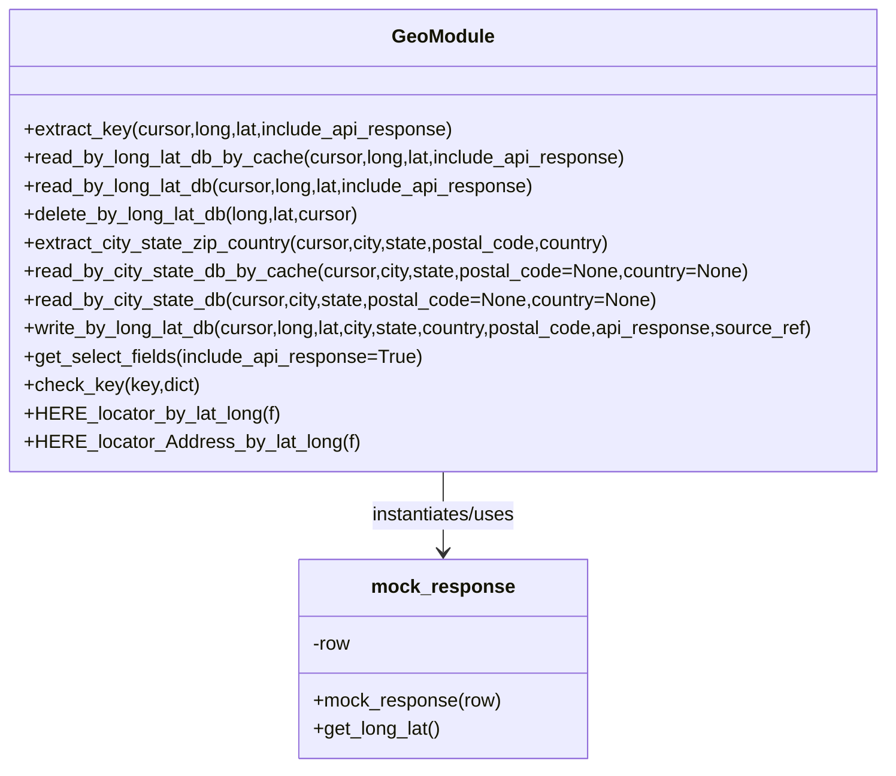

# Diagram: shipment_core/chromium_export/fv/python/fv/HERE/HERE_locator.py


> Auto-generated by Obscura crawlers

## Diagram 1



### SVG

<svg id="container" width="758.609375" xmlns="http://www.w3.org/2000/svg" class="classDiagram" height="648" viewBox="0 0 758.609375 648" role="graphics-document document" aria-roledescription="class"><style>#container{font-family:"trebuchet ms",verdana,arial,sans-serif;font-size:16px;fill:#333;}@keyframes edge-animation-frame{from{stroke-dashoffset:0;}}@keyframes dash{to{stroke-dashoffset:0;}}#container .edge-animation-slow{stroke-dasharray:9,5!important;stroke-dashoffset:900;animation:dash 50s linear infinite;stroke-linecap:round;}#container .edge-animation-fast{stroke-dasharray:9,5!important;stroke-dashoffset:900;animation:dash 20s linear infinite;stroke-linecap:round;}#container .error-icon{fill:#552222;}#container .error-text{fill:#552222;stroke:#552222;}#container .edge-thickness-normal{stroke-width:1px;}#container .edge-thickness-thick{stroke-width:3.5px;}#container .edge-pattern-solid{stroke-dasharray:0;}#container .edge-thickness-invisible{stroke-width:0;fill:none;}#container .edge-pattern-dashed{stroke-dasharray:3;}#container .edge-pattern-dotted{stroke-dasharray:2;}#container .marker{fill:#333333;stroke:#333333;}#container .marker.cross{stroke:#333333;}#container svg{font-family:"trebuchet ms",verdana,arial,sans-serif;font-size:16px;}#container p{margin:0;}#container g.classGroup text{fill:#9370DB;stroke:none;font-family:"trebuchet ms",verdana,arial,sans-serif;font-size:10px;}#container g.classGroup text .title{font-weight:bolder;}#container .nodeLabel,#container .edgeLabel{color:#131300;}#container .edgeLabel .label rect{fill:#ECECFF;}#container .label text{fill:#131300;}#container .labelBkg{background:#ECECFF;}#container .edgeLabel .label span{background:#ECECFF;}#container .classTitle{font-weight:bolder;}#container .node rect,#container .node circle,#container .node ellipse,#container .node polygon,#container .node path{fill:#ECECFF;stroke:#9370DB;stroke-width:1px;}#container .divider{stroke:#9370DB;stroke-width:1;}#container g.clickable{cursor:pointer;}#container g.classGroup rect{fill:#ECECFF;stroke:#9370DB;}#container g.classGroup line{stroke:#9370DB;stroke-width:1;}#container .classLabel .box{stroke:none;stroke-width:0;fill:#ECECFF;opacity:0.5;}#container .classLabel .label{fill:#9370DB;font-size:10px;}#container .relation{stroke:#333333;stroke-width:1;fill:none;}#container .dashed-line{stroke-dasharray:3;}#container .dotted-line{stroke-dasharray:1 2;}#container #compositionStart,#container .composition{fill:#333333!important;stroke:#333333!important;stroke-width:1;}#container #compositionEnd,#container .composition{fill:#333333!important;stroke:#333333!important;stroke-width:1;}#container #dependencyStart,#container .dependency{fill:#333333!important;stroke:#333333!important;stroke-width:1;}#container #dependencyStart,#container .dependency{fill:#333333!important;stroke:#333333!important;stroke-width:1;}#container #extensionStart,#container .extension{fill:transparent!important;stroke:#333333!important;stroke-width:1;}#container #extensionEnd,#container .extension{fill:transparent!important;stroke:#333333!important;stroke-width:1;}#container #aggregationStart,#container .aggregation{fill:transparent!important;stroke:#333333!important;stroke-width:1;}#container #aggregationEnd,#container .aggregation{fill:transparent!important;stroke:#333333!important;stroke-width:1;}#container #lollipopStart,#container .lollipop{fill:#ECECFF!important;stroke:#333333!important;stroke-width:1;}#container #lollipopEnd,#container .lollipop{fill:#ECECFF!important;stroke:#333333!important;stroke-width:1;}#container .edgeTerminals{font-size:11px;line-height:initial;}#container .classTitleText{text-anchor:middle;font-size:18px;fill:#333;}#container .label-icon{display:inline-block;height:1em;overflow:visible;vertical-align:-0.125em;}#container .node .label-icon path{fill:currentColor;stroke:revert;stroke-width:revert;}#container :root{--mermaid-font-family:"trebuchet ms",verdana,arial,sans-serif;}</style><g><defs><marker id="container_class-aggregationStart" class="marker aggregation class" refX="18" refY="7" markerWidth="190" markerHeight="240" orient="auto"><path d="M 18,7 L9,13 L1,7 L9,1 Z"></path></marker></defs><defs><marker id="container_class-aggregationEnd" class="marker aggregation class" refX="1" refY="7" markerWidth="20" markerHeight="28" orient="auto"><path d="M 18,7 L9,13 L1,7 L9,1 Z"></path></marker></defs><defs><marker id="container_class-extensionStart" class="marker extension class" refX="18" refY="7" markerWidth="190" markerHeight="240" orient="auto"><path d="M 1,7 L18,13 V 1 Z"></path></marker></defs><defs><marker id="container_class-extensionEnd" class="marker extension class" refX="1" refY="7" markerWidth="20" markerHeight="28" orient="auto"><path d="M 1,1 V 13 L18,7 Z"></path></marker></defs><defs><marker id="container_class-compositionStart" class="marker composition class" refX="18" refY="7" markerWidth="190" markerHeight="240" orient="auto"><path d="M 18,7 L9,13 L1,7 L9,1 Z"></path></marker></defs><defs><marker id="container_class-compositionEnd" class="marker composition class" refX="1" refY="7" markerWidth="20" markerHeight="28" orient="auto"><path d="M 18,7 L9,13 L1,7 L9,1 Z"></path></marker></defs><defs><marker id="container_class-dependencyStart" class="marker dependency class" refX="6" refY="7" markerWidth="190" markerHeight="240" orient="auto"><path d="M 5,7 L9,13 L1,7 L9,1 Z"></path></marker></defs><defs><marker id="container_class-dependencyEnd" class="marker dependency class" refX="13" refY="7" markerWidth="20" markerHeight="28" orient="auto"><path d="M 18,7 L9,13 L14,7 L9,1 Z"></path></marker></defs><defs><marker id="container_class-lollipopStart" class="marker lollipop class" refX="13" refY="7" markerWidth="190" markerHeight="240" orient="auto"><circle stroke="black" fill="transparent" cx="7" cy="7" r="6"></circle></marker></defs><defs><marker id="container_class-lollipopEnd" class="marker lollipop class" refX="1" refY="7" markerWidth="190" markerHeight="240" orient="auto"><circle stroke="black" fill="transparent" cx="7" cy="7" r="6"></circle></marker></defs><g class="root"><g class="clusters"></g><g class="edgePaths"><path d="M379.305,398L379.305,404.167C379.305,410.333,379.305,422.667,379.305,434C379.305,445.333,379.305,455.667,379.305,460.833L379.305,466" id="id_GeoModule_mock_response_1" class="edge-thickness-normal edge-pattern-solid relation" style=";;;" data-edge="true" data-et="edge" data-id="id_GeoModule_mock_response_1" data-points="W3sieCI6Mzc5LjMwNDY4NzUsInkiOjM5OH0seyJ4IjozNzkuMzA0Njg3NSwieSI6NDM1fSx7IngiOjM3OS4zMDQ2ODc1LCJ5Ijo0NzJ9XQ==" marker-end="url(#container_class-dependencyEnd)"></path></g><g class="edgeLabels"><g class="edgeLabel" transform="translate(379.3046875, 435)"><g class="label" data-id="id_GeoModule_mock_response_1" transform="translate(-63.3203125, -12)"><foreignObject width="126.640625" height="24"><div xmlns="http://www.w3.org/1999/xhtml" class="labelBkg" style="display: table-cell; white-space: nowrap; line-height: 1.5; max-width: 200px; text-align: center;"><span class="edgeLabel"><p>instantiates/uses</p></span></div></foreignObject></g></g></g><g class="nodes"><g class="node default" id="classId-GeoModule-0" transform="translate(379.3046875, 203)"><g class="basic label-container"><path d="M-371.3046875 -195 L371.3046875 -195 L371.3046875 195 L-371.3046875 195" stroke="none" stroke-width="0" fill="#ECECFF" style=""></path><path d="M-371.3046875 -195 C-103.42002663980651 -195, 164.46463422038698 -195, 371.3046875 -195 M-371.3046875 -195 C-184.3742473154904 -195, 2.556192869019185 -195, 371.3046875 -195 M371.3046875 -195 C371.3046875 -64.18196452208807, 371.3046875 66.63607095582387, 371.3046875 195 M371.3046875 -195 C371.3046875 -106.52663375793223, 371.3046875 -18.053267515864462, 371.3046875 195 M371.3046875 195 C209.90365035587666 195, 48.50261321175333 195, -371.3046875 195 M371.3046875 195 C76.25992803279672 195, -218.78483143440656 195, -371.3046875 195 M-371.3046875 195 C-371.3046875 106.95068437281697, -371.3046875 18.90136874563393, -371.3046875 -195 M-371.3046875 195 C-371.3046875 82.41504978735016, -371.3046875 -30.169900425299687, -371.3046875 -195" stroke="#9370DB" stroke-width="1.3" fill="none" stroke-dasharray="0 0" style=""></path></g><g class="annotation-group text" transform="translate(0, -171)"></g><g class="label-group text" transform="translate(-41.34375, -171)"><g class="label" style="font-weight: bolder" transform="translate(0,-12)"><foreignObject width="82.6875" height="24"><div xmlns="http://www.w3.org/1999/xhtml" style="display: table-cell; white-space: nowrap; line-height: 1.5; max-width: 132px; text-align: center;"><span class="nodeLabel markdown-node-label" style=""><p>GeoModule</p></span></div></foreignObject></g></g><g class="members-group text" transform="translate(-359.3046875, -123)"></g><g class="methods-group text" transform="translate(-359.3046875, -93)"><g class="label" style="" transform="translate(0,-12)"><foreignObject width="366.734375" height="24"><div xmlns="http://www.w3.org/1999/xhtml" style="display: table-cell; white-space: nowrap; line-height: 1.5; max-width: 424px; text-align: center;"><span class="nodeLabel markdown-node-label" style=""><p>+extract_key(cursor,long,lat,include_api_response)</p></span></div></foreignObject></g><g class="label" style="" transform="translate(0,12)"><foreignObject width="510.609375" height="24"><div xmlns="http://www.w3.org/1999/xhtml" style="display: table-cell; white-space: nowrap; line-height: 1.5; max-width: 568px; text-align: center;"><span class="nodeLabel markdown-node-label" style=""><p>+read_by_long_lat_db_by_cache(cursor,long,lat,include_api_response)</p></span></div></foreignObject></g><g class="label" style="" transform="translate(0,36)"><foreignObject width="435.84375" height="24"><div xmlns="http://www.w3.org/1999/xhtml" style="display: table-cell; white-space: nowrap; line-height: 1.5; max-width: 493px; text-align: center;"><span class="nodeLabel markdown-node-label" style=""><p>+read_by_long_lat_db(cursor,long,lat,include_api_response)</p></span></div></foreignObject></g><g class="label" style="" transform="translate(0,60)"><foreignObject width="287.296875" height="24"><div xmlns="http://www.w3.org/1999/xhtml" style="display: table-cell; white-space: nowrap; line-height: 1.5; max-width: 345px; text-align: center;"><span class="nodeLabel markdown-node-label" style=""><p>+delete_by_long_lat_db(long,lat,cursor)</p></span></div></foreignObject></g><g class="label" style="" transform="translate(0,84)"><foreignObject width="501.53125" height="24"><div xmlns="http://www.w3.org/1999/xhtml" style="display: table-cell; white-space: nowrap; line-height: 1.5; max-width: 559px; text-align: center;"><span class="nodeLabel markdown-node-label" style=""><p>+extract_city_state_zip_country(cursor,city,state,postal_code,country)</p></span></div></foreignObject></g><g class="label" style="" transform="translate(0,108)"><foreignObject width="611.734375" height="24"><div xmlns="http://www.w3.org/1999/xhtml" style="display: table-cell; white-space: nowrap; line-height: 1.5; max-width: 669px; text-align: center;"><span class="nodeLabel markdown-node-label" style=""><p>+read_by_city_state_db_by_cache(cursor,city,state,postal_code=None,country=None)</p></span></div></foreignObject></g><g class="label" style="" transform="translate(0,132)"><foreignObject width="536.96875" height="24"><div xmlns="http://www.w3.org/1999/xhtml" style="display: table-cell; white-space: nowrap; line-height: 1.5; max-width: 594px; text-align: center;"><span class="nodeLabel markdown-node-label" style=""><p>+read_by_city_state_db(cursor,city,state,postal_code=None,country=None)</p></span></div></foreignObject></g><g class="label" style="" transform="translate(0,156)"><foreignObject width="677.265625" height="24"><div xmlns="http://www.w3.org/1999/xhtml" style="display: table-cell; white-space: nowrap; line-height: 1.5; max-width: 735px; text-align: center;"><span class="nodeLabel markdown-node-label" style=""><p>+write_by_long_lat_db(cursor,long,lat,city,state,country,postal_code,api_response,source_ref)</p></span></div></foreignObject></g><g class="label" style="" transform="translate(0,180)"><foreignObject width="338.59375" height="24"><div xmlns="http://www.w3.org/1999/xhtml" style="display: table-cell; white-space: nowrap; line-height: 1.5; max-width: 396px; text-align: center;"><span class="nodeLabel markdown-node-label" style=""><p>+get_select_fields(include_api_response=True)</p></span></div></foreignObject></g><g class="label" style="" transform="translate(0,204)"><foreignObject width="147.953125" height="24"><div xmlns="http://www.w3.org/1999/xhtml" style="display: table-cell; white-space: nowrap; line-height: 1.5; max-width: 205px; text-align: center;"><span class="nodeLabel markdown-node-label" style=""><p>+check_key(key,dict)</p></span></div></foreignObject></g><g class="label" style="" transform="translate(0,228)"><foreignObject width="212.96875" height="24"><div xmlns="http://www.w3.org/1999/xhtml" style="display: table-cell; white-space: nowrap; line-height: 1.5; max-width: 270px; text-align: center;"><span class="nodeLabel markdown-node-label" style=""><p>+HERE_locator_by_lat_long(f)</p></span></div></foreignObject></g><g class="label" style="" transform="translate(0,252)"><foreignObject width="278.46875" height="24"><div xmlns="http://www.w3.org/1999/xhtml" style="display: table-cell; white-space: nowrap; line-height: 1.5; max-width: 336px; text-align: center;"><span class="nodeLabel markdown-node-label" style=""><p>+HERE_locator_Address_by_lat_long(f)</p></span></div></foreignObject></g></g><g class="divider" style=""><path d="M-371.3046875 -147 C-121.4408480117504 -147, 128.4229914764992 -147, 371.3046875 -147 M-371.3046875 -147 C-209.7828044574097 -147, -48.26092141481939 -147, 371.3046875 -147" stroke="#9370DB" stroke-width="1.3" fill="none" stroke-dasharray="0 0" style=""></path></g><g class="divider" style=""><path d="M-371.3046875 -123 C-222.54633138616757 -123, -73.78797527233513 -123, 371.3046875 -123 M-371.3046875 -123 C-214.34292800907062 -123, -57.38116851814124 -123, 371.3046875 -123" stroke="#9370DB" stroke-width="1.3" fill="none" stroke-dasharray="0 0" style=""></path></g></g><g class="node default" id="classId-mock_response-1" transform="translate(379.3046875, 556)"><g class="basic label-container"><path d="M-119.9140625 -84 L119.9140625 -84 L119.9140625 84 L-119.9140625 84" stroke="none" stroke-width="0" fill="#ECECFF" style=""></path><path d="M-119.9140625 -84 C-41.951602940299736 -84, 36.01085661940053 -84, 119.9140625 -84 M-119.9140625 -84 C-61.13894128305022 -84, -2.3638200661004447 -84, 119.9140625 -84 M119.9140625 -84 C119.9140625 -34.21647304114091, 119.9140625 15.567053917718184, 119.9140625 84 M119.9140625 -84 C119.9140625 -42.20622200828835, 119.9140625 -0.4124440165766998, 119.9140625 84 M119.9140625 84 C34.94372131522914 84, -50.02661986954172 84, -119.9140625 84 M119.9140625 84 C35.07233394426021 84, -49.76939461147958 84, -119.9140625 84 M-119.9140625 84 C-119.9140625 28.135685936478183, -119.9140625 -27.728628127043635, -119.9140625 -84 M-119.9140625 84 C-119.9140625 21.10996993455438, -119.9140625 -41.78006013089124, -119.9140625 -84" stroke="#9370DB" stroke-width="1.3" fill="none" stroke-dasharray="0 0" style=""></path></g><g class="annotation-group text" transform="translate(0, -60)"></g><g class="label-group text" transform="translate(-57.4375, -60)"><g class="label" style="font-weight: bolder" transform="translate(0,-12)"><foreignObject width="114.875" height="24"><div xmlns="http://www.w3.org/1999/xhtml" style="display: table-cell; white-space: nowrap; line-height: 1.5; max-width: 164px; text-align: center;"><span class="nodeLabel markdown-node-label" style=""><p>mock_response</p></span></div></foreignObject></g></g><g class="members-group text" transform="translate(-107.9140625, -12)"><g class="label" style="" transform="translate(0,-12)"><foreignObject width="32.96875" height="24"><div xmlns="http://www.w3.org/1999/xhtml" style="display: table-cell; white-space: nowrap; line-height: 1.5; max-width: 91px; text-align: center;"><span class="nodeLabel markdown-node-label" style=""><p>-row</p></span></div></foreignObject></g></g><g class="methods-group text" transform="translate(-107.9140625, 36)"><g class="label" style="" transform="translate(0,-12)"><foreignObject width="158.390625" height="24"><div xmlns="http://www.w3.org/1999/xhtml" style="display: table-cell; white-space: nowrap; line-height: 1.5; max-width: 216px; text-align: center;"><span class="nodeLabel markdown-node-label" style=""><p>+mock_response(row)</p></span></div></foreignObject></g><g class="label" style="" transform="translate(0,12)"><foreignObject width="108.046875" height="24"><div xmlns="http://www.w3.org/1999/xhtml" style="display: table-cell; white-space: nowrap; line-height: 1.5; max-width: 165px; text-align: center;"><span class="nodeLabel markdown-node-label" style=""><p>+get_long_lat()</p></span></div></foreignObject></g></g><g class="divider" style=""><path d="M-119.9140625 -36 C-60.73978630066608 -36, -1.5655101013321655 -36, 119.9140625 -36 M-119.9140625 -36 C-31.22633142422552 -36, 57.46139965154896 -36, 119.9140625 -36" stroke="#9370DB" stroke-width="1.3" fill="none" stroke-dasharray="0 0" style=""></path></g><g class="divider" style=""><path d="M-119.9140625 12 C-36.7082241392615 12, 46.497614221476994 12, 119.9140625 12 M-119.9140625 12 C-70.65757718315871 12, -21.4010918663174 12, 119.9140625 12" stroke="#9370DB" stroke-width="1.3" fill="none" stroke-dasharray="0 0" style=""></path></g></g></g></g></g></svg>

## Diagram 2

```mermaid
flowchart LR
Start((Start)) --> ValidateLatLong{is_valid_lat_long(lng,lat)?}
ValidateLatLong -- No --> CallOriginal[call original function f(*args,**kwargs)]
ValidateLatLong -- Yes --> FormatCoords[format lng/lat to 2 decimal places]
FormatCoords --> CheckCursor{cursor is None?}
CheckCursor -- Yes --> CallOriginal
CheckCursor -- No --> CacheLookup[read_by_long_lat_db_by_cache(long,lat,cursor)]
CacheLookup -- Hit --> ReturnCached[return cached result]
CacheLookup -- Miss --> LogNotInDB[log "Not in db" and call original f]
LogNotInDB --> CallOriginalLookup[call original function f to obtain result]
CallOriginalLookup --> WriteDB[write_by_long_lat_db(long,lat,city,state,country,postal_code,api_response,source_ref,cursor)]
WriteDB --> ReturnAPI[return API result]
ReturnCached --> ReturnCachedResult[return cached result]
```

> SVG rendering failed for this diagram.
