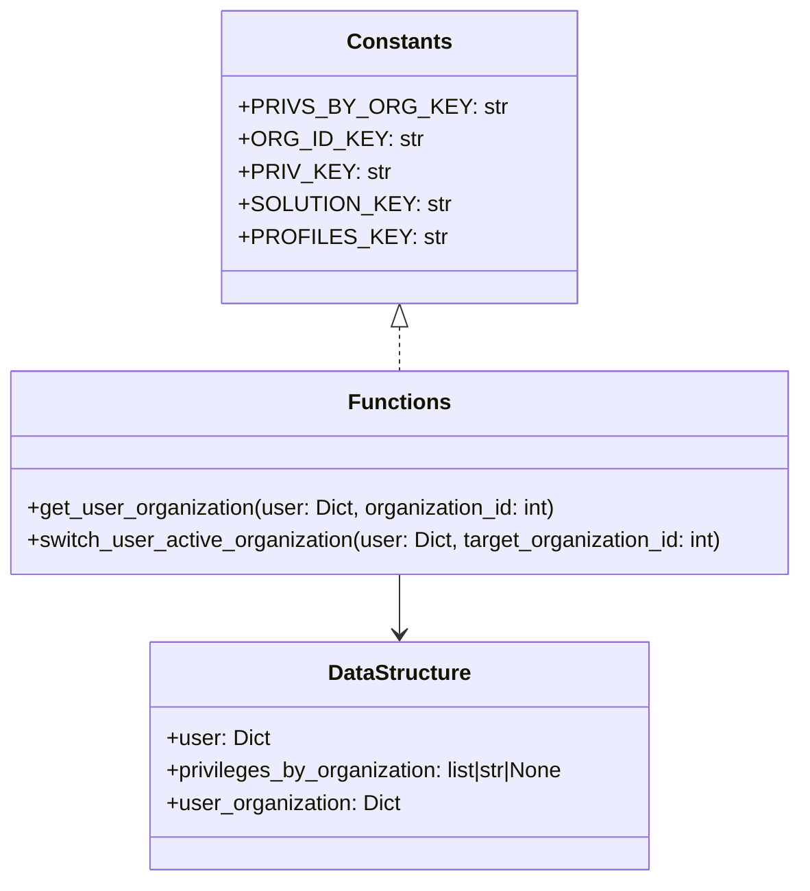

# Diagram: shipment_core/chromium_export/fv/python/fv/authorization/__init__.py


> Auto-generated by Obscura crawlers

## Diagram 1

```mermaid
flowchart TD
  A[Start: switch_user_active_organization(user, target_organization_id)] --> B{user contains "organization_id"}
  B -->|yes| C[default_organization_id = int(user["organization_id"])]
  C --> D[Call get_user_organization(user, target_organization_id)]
  D --> E{new_organization is not None}
  E -->|yes| F[Set user["organization_id"] = str(target_organization_id)]
  F --> G[Set user["privileges"] = json.dumps(new_organization["privileges"])]
  G --> H[Set user["solutions"] = json.dumps(new_organization["solutions"])]
  H --> I[Set user["org_profiles"] = json.dumps(new_organization["org_profiles"])]
  I --> J[Return modified user]
  E -->|no| K[Return original user]
  B -->|no| K
```

> SVG rendering failed for this diagram.

## Diagram 2

```mermaid
flowchart TD
  subgraph get_user_organization_flow
    GA[Start: get_user_organization(user, organization_id)] --> GB{user is not None}
    GB -->|no| GC[Return None]
    GB -->|yes| GD[temp = user.get("privileges_by_organization")]
    GD --> GE[privileges_by_organization = temp or json.loads(temp) if str]
    GE --> GF{privileges_by_organization is not None}
    GF -->|no| GC
    GF -->|yes| GH[For each user_organization in privileges_by_organization]
    GH --> GI[sub_organization_id = user_organization.get("organization_id")]
    GI --> GJ{int(sub_organization_id) == organization_id}
    GJ -->|yes| GK[Return user_organization]
    GJ -->|no| GH
    GH --> GL[End loop]
    GL --> GC
  end
```

> SVG rendering failed for this diagram.

## Diagram 3



### SVG

<svg id="container" width="594.6640625" xmlns="http://www.w3.org/2000/svg" class="classDiagram" height="650" viewBox="0 0 594.6640625 650" role="graphics-document document" aria-roledescription="class"><style>#container{font-family:"trebuchet ms",verdana,arial,sans-serif;font-size:16px;fill:#333;}@keyframes edge-animation-frame{from{stroke-dashoffset:0;}}@keyframes dash{to{stroke-dashoffset:0;}}#container .edge-animation-slow{stroke-dasharray:9,5!important;stroke-dashoffset:900;animation:dash 50s linear infinite;stroke-linecap:round;}#container .edge-animation-fast{stroke-dasharray:9,5!important;stroke-dashoffset:900;animation:dash 20s linear infinite;stroke-linecap:round;}#container .error-icon{fill:#552222;}#container .error-text{fill:#552222;stroke:#552222;}#container .edge-thickness-normal{stroke-width:1px;}#container .edge-thickness-thick{stroke-width:3.5px;}#container .edge-pattern-solid{stroke-dasharray:0;}#container .edge-thickness-invisible{stroke-width:0;fill:none;}#container .edge-pattern-dashed{stroke-dasharray:3;}#container .edge-pattern-dotted{stroke-dasharray:2;}#container .marker{fill:#333333;stroke:#333333;}#container .marker.cross{stroke:#333333;}#container svg{font-family:"trebuchet ms",verdana,arial,sans-serif;font-size:16px;}#container p{margin:0;}#container g.classGroup text{fill:#9370DB;stroke:none;font-family:"trebuchet ms",verdana,arial,sans-serif;font-size:10px;}#container g.classGroup text .title{font-weight:bolder;}#container .nodeLabel,#container .edgeLabel{color:#131300;}#container .edgeLabel .label rect{fill:#ECECFF;}#container .label text{fill:#131300;}#container .labelBkg{background:#ECECFF;}#container .edgeLabel .label span{background:#ECECFF;}#container .classTitle{font-weight:bolder;}#container .node rect,#container .node circle,#container .node ellipse,#container .node polygon,#container .node path{fill:#ECECFF;stroke:#9370DB;stroke-width:1px;}#container .divider{stroke:#9370DB;stroke-width:1;}#container g.clickable{cursor:pointer;}#container g.classGroup rect{fill:#ECECFF;stroke:#9370DB;}#container g.classGroup line{stroke:#9370DB;stroke-width:1;}#container .classLabel .box{stroke:none;stroke-width:0;fill:#ECECFF;opacity:0.5;}#container .classLabel .label{fill:#9370DB;font-size:10px;}#container .relation{stroke:#333333;stroke-width:1;fill:none;}#container .dashed-line{stroke-dasharray:3;}#container .dotted-line{stroke-dasharray:1 2;}#container #compositionStart,#container .composition{fill:#333333!important;stroke:#333333!important;stroke-width:1;}#container #compositionEnd,#container .composition{fill:#333333!important;stroke:#333333!important;stroke-width:1;}#container #dependencyStart,#container .dependency{fill:#333333!important;stroke:#333333!important;stroke-width:1;}#container #dependencyStart,#container .dependency{fill:#333333!important;stroke:#333333!important;stroke-width:1;}#container #extensionStart,#container .extension{fill:transparent!important;stroke:#333333!important;stroke-width:1;}#container #extensionEnd,#container .extension{fill:transparent!important;stroke:#333333!important;stroke-width:1;}#container #aggregationStart,#container .aggregation{fill:transparent!important;stroke:#333333!important;stroke-width:1;}#container #aggregationEnd,#container .aggregation{fill:transparent!important;stroke:#333333!important;stroke-width:1;}#container #lollipopStart,#container .lollipop{fill:#ECECFF!important;stroke:#333333!important;stroke-width:1;}#container #lollipopEnd,#container .lollipop{fill:#ECECFF!important;stroke:#333333!important;stroke-width:1;}#container .edgeTerminals{font-size:11px;line-height:initial;}#container .classTitleText{text-anchor:middle;font-size:18px;fill:#333;}#container .label-icon{display:inline-block;height:1em;overflow:visible;vertical-align:-0.125em;}#container .node .label-icon path{fill:currentColor;stroke:revert;stroke-width:revert;}#container :root{--mermaid-font-family:"trebuchet ms",verdana,arial,sans-serif;}</style><g><defs><marker id="container_class-aggregationStart" class="marker aggregation class" refX="18" refY="7" markerWidth="190" markerHeight="240" orient="auto"><path d="M 18,7 L9,13 L1,7 L9,1 Z"></path></marker></defs><defs><marker id="container_class-aggregationEnd" class="marker aggregation class" refX="1" refY="7" markerWidth="20" markerHeight="28" orient="auto"><path d="M 18,7 L9,13 L1,7 L9,1 Z"></path></marker></defs><defs><marker id="container_class-extensionStart" class="marker extension class" refX="18" refY="7" markerWidth="190" markerHeight="240" orient="auto"><path d="M 1,7 L18,13 V 1 Z"></path></marker></defs><defs><marker id="container_class-extensionEnd" class="marker extension class" refX="1" refY="7" markerWidth="20" markerHeight="28" orient="auto"><path d="M 1,1 V 13 L18,7 Z"></path></marker></defs><defs><marker id="container_class-compositionStart" class="marker composition class" refX="18" refY="7" markerWidth="190" markerHeight="240" orient="auto"><path d="M 18,7 L9,13 L1,7 L9,1 Z"></path></marker></defs><defs><marker id="container_class-compositionEnd" class="marker composition class" refX="1" refY="7" markerWidth="20" markerHeight="28" orient="auto"><path d="M 18,7 L9,13 L1,7 L9,1 Z"></path></marker></defs><defs><marker id="container_class-dependencyStart" class="marker dependency class" refX="6" refY="7" markerWidth="190" markerHeight="240" orient="auto"><path d="M 5,7 L9,13 L1,7 L9,1 Z"></path></marker></defs><defs><marker id="container_class-dependencyEnd" class="marker dependency class" refX="13" refY="7" markerWidth="20" markerHeight="28" orient="auto"><path d="M 18,7 L9,13 L14,7 L9,1 Z"></path></marker></defs><defs><marker id="container_class-lollipopStart" class="marker lollipop class" refX="13" refY="7" markerWidth="190" markerHeight="240" orient="auto"><circle stroke="black" fill="transparent" cx="7" cy="7" r="6"></circle></marker></defs><defs><marker id="container_class-lollipopEnd" class="marker lollipop class" refX="1" refY="7" markerWidth="190" markerHeight="240" orient="auto"><circle stroke="black" fill="transparent" cx="7" cy="7" r="6"></circle></marker></defs><g class="root"><g class="clusters"></g><g class="edgePaths"><path d="M297.332,241.25L297.332,242.542C297.332,243.833,297.332,246.417,297.332,251.875C297.332,257.333,297.332,265.667,297.332,269.833L297.332,274" id="id_Constants_Functions_1" class="edge-thickness-normal edge-pattern-dashed relation" style=";;;" data-edge="true" data-et="edge" data-id="id_Constants_Functions_1" data-points="W3sieCI6Mjk3LjMzMjAzMTI1LCJ5IjoyMjR9LHsieCI6Mjk3LjMzMjAzMTI1LCJ5IjoyNDl9LHsieCI6Mjk3LjMzMjAzMTI1LCJ5IjoyNzR9XQ==" marker-start="url(#container_class-extensionStart)"></path><path d="M297.332,424L297.332,428.167C297.332,432.333,297.332,440.667,297.332,448C297.332,455.333,297.332,461.667,297.332,464.833L297.332,468" id="id_Functions_DataStructure_2" class="edge-thickness-normal edge-pattern-solid relation" style=";;;" data-edge="true" data-et="edge" data-id="id_Functions_DataStructure_2" data-points="W3sieCI6Mjk3LjMzMjAzMTI1LCJ5Ijo0MjR9LHsieCI6Mjk3LjMzMjAzMTI1LCJ5Ijo0NDl9LHsieCI6Mjk3LjMzMjAzMTI1LCJ5Ijo0NzR9XQ==" marker-end="url(#container_class-dependencyEnd)"></path></g><g class="edgeLabels"><g class="edgeLabel"><g class="label" data-id="id_Constants_Functions_1" transform="translate(0, 0)"><foreignObject width="0" height="0"><div xmlns="http://www.w3.org/1999/xhtml" class="labelBkg" style="display: table-cell; white-space: nowrap; line-height: 1.5; max-width: 200px; text-align: center;"><span class="edgeLabel"></span></div></foreignObject></g></g><g class="edgeLabel"><g class="label" data-id="id_Functions_DataStructure_2" transform="translate(0, 0)"><foreignObject width="0" height="0"><div xmlns="http://www.w3.org/1999/xhtml" class="labelBkg" style="display: table-cell; white-space: nowrap; line-height: 1.5; max-width: 200px; text-align: center;"><span class="edgeLabel"></span></div></foreignObject></g></g></g><g class="nodes"><g class="node default" id="classId-Constants-0" transform="translate(297.33203125, 116)"><g class="basic label-container"><path d="M-117.17578125 -108 L117.17578125 -108 L117.17578125 108 L-117.17578125 108" stroke="none" stroke-width="0" fill="#ECECFF" style=""></path><path d="M-117.17578125 -108 C-52.637263338325994 -108, 11.901254573348012 -108, 117.17578125 -108 M-117.17578125 -108 C-40.04753756746254 -108, 37.08070611507492 -108, 117.17578125 -108 M117.17578125 -108 C117.17578125 -25.223510325640547, 117.17578125 57.55297934871891, 117.17578125 108 M117.17578125 -108 C117.17578125 -44.59330951916609, 117.17578125 18.813380961667818, 117.17578125 108 M117.17578125 108 C27.207037063969963 108, -62.76170712206007 108, -117.17578125 108 M117.17578125 108 C69.45306458458495 108, 21.730347919169887 108, -117.17578125 108 M-117.17578125 108 C-117.17578125 21.862595781033335, -117.17578125 -64.27480843793333, -117.17578125 -108 M-117.17578125 108 C-117.17578125 49.393770433207884, -117.17578125 -9.212459133584233, -117.17578125 -108" stroke="#9370DB" stroke-width="1.3" fill="none" stroke-dasharray="0 0" style=""></path></g><g class="annotation-group text" transform="translate(0, -84)"></g><g class="label-group text" transform="translate(-36.5390625, -84)"><g class="label" style="font-weight: bolder" transform="translate(0,-12)"><foreignObject width="73.078125" height="24"><div xmlns="http://www.w3.org/1999/xhtml" style="display: table-cell; white-space: nowrap; line-height: 1.5; max-width: 122px; text-align: center;"><span class="nodeLabel markdown-node-label" style=""><p>Constants</p></span></div></foreignObject></g></g><g class="members-group text" transform="translate(-105.17578125, -36)"><g class="label" style="" transform="translate(0,-12)"><foreignObject width="173.8125" height="24"><div xmlns="http://www.w3.org/1999/xhtml" style="display: table-cell; white-space: nowrap; line-height: 1.5; max-width: 232px; text-align: center;"><span class="nodeLabel markdown-node-label" style=""><p>+PRIVS_BY_ORG_KEY: str</p></span></div></foreignObject></g><g class="label" style="" transform="translate(0,12)"><foreignObject width="123.0625" height="24"><div xmlns="http://www.w3.org/1999/xhtml" style="display: table-cell; white-space: nowrap; line-height: 1.5; max-width: 181px; text-align: center;"><span class="nodeLabel markdown-node-label" style=""><p>+ORG_ID_KEY: str</p></span></div></foreignObject></g><g class="label" style="" transform="translate(0,36)"><foreignObject width="101.453125" height="24"><div xmlns="http://www.w3.org/1999/xhtml" style="display: table-cell; white-space: nowrap; line-height: 1.5; max-width: 160px; text-align: center;"><span class="nodeLabel markdown-node-label" style=""><p>+PRIV_KEY: str</p></span></div></foreignObject></g><g class="label" style="" transform="translate(0,60)"><foreignObject width="141.953125" height="24"><div xmlns="http://www.w3.org/1999/xhtml" style="display: table-cell; white-space: nowrap; line-height: 1.5; max-width: 200px; text-align: center;"><span class="nodeLabel markdown-node-label" style=""><p>+SOLUTION_KEY: str</p></span></div></foreignObject></g><g class="label" style="" transform="translate(0,84)"><foreignObject width="136.75" height="24"><div xmlns="http://www.w3.org/1999/xhtml" style="display: table-cell; white-space: nowrap; line-height: 1.5; max-width: 195px; text-align: center;"><span class="nodeLabel markdown-node-label" style=""><p>+PROFILES_KEY: str</p></span></div></foreignObject></g></g><g class="methods-group text" transform="translate(-105.17578125, 108)"></g><g class="divider" style=""><path d="M-117.17578125 -60 C-55.70753198075797 -60, 5.760717288484059 -60, 117.17578125 -60 M-117.17578125 -60 C-40.64791003232112 -60, 35.87996118535776 -60, 117.17578125 -60" stroke="#9370DB" stroke-width="1.3" fill="none" stroke-dasharray="0 0" style=""></path></g><g class="divider" style=""><path d="M-117.17578125 84 C-30.55095510446131 84, 56.07387104107738 84, 117.17578125 84 M-117.17578125 84 C-62.04392133684998 84, -6.912061423699953 84, 117.17578125 84" stroke="#9370DB" stroke-width="1.3" fill="none" stroke-dasharray="0 0" style=""></path></g></g><g class="node default" id="classId-Functions-1" transform="translate(297.33203125, 349)"><g class="basic label-container"><path d="M-289.33203125 -75 L289.33203125 -75 L289.33203125 75 L-289.33203125 75" stroke="none" stroke-width="0" fill="#ECECFF" style=""></path><path d="M-289.33203125 -75 C-128.0831127610935 -75, 33.165805727812995 -75, 289.33203125 -75 M-289.33203125 -75 C-168.00732995614658 -75, -46.68262866229318 -75, 289.33203125 -75 M289.33203125 -75 C289.33203125 -32.924890823754254, 289.33203125 9.150218352491493, 289.33203125 75 M289.33203125 -75 C289.33203125 -42.72095737725905, 289.33203125 -10.441914754518095, 289.33203125 75 M289.33203125 75 C115.62392885863053 75, -58.08417353273893 75, -289.33203125 75 M289.33203125 75 C123.9202501832454 75, -41.4915308835092 75, -289.33203125 75 M-289.33203125 75 C-289.33203125 35.033186127095306, -289.33203125 -4.933627745809389, -289.33203125 -75 M-289.33203125 75 C-289.33203125 17.483251496108515, -289.33203125 -40.03349700778297, -289.33203125 -75" stroke="#9370DB" stroke-width="1.3" fill="none" stroke-dasharray="0 0" style=""></path></g><g class="annotation-group text" transform="translate(0, -51)"></g><g class="label-group text" transform="translate(-35.1328125, -51)"><g class="label" style="font-weight: bolder" transform="translate(0,-12)"><foreignObject width="70.265625" height="24"><div xmlns="http://www.w3.org/1999/xhtml" style="display: table-cell; white-space: nowrap; line-height: 1.5; max-width: 120px; text-align: center;"><span class="nodeLabel markdown-node-label" style=""><p>Functions</p></span></div></foreignObject></g></g><g class="members-group text" transform="translate(-277.33203125, -3)"></g><g class="methods-group text" transform="translate(-277.33203125, 27)"><g class="label" style="" transform="translate(0,-12)"><foreignObject width="394.46875" height="24"><div xmlns="http://www.w3.org/1999/xhtml" style="display: table-cell; white-space: nowrap; line-height: 1.5; max-width: 452px; text-align: center;"><span class="nodeLabel markdown-node-label" style=""><p>+get_user_organization(user: Dict, organization_id: int)</p></span></div></foreignObject></g><g class="label" style="" transform="translate(0,12)"><foreignObject width="519.53125" height="24"><div xmlns="http://www.w3.org/1999/xhtml" style="display: table-cell; white-space: nowrap; line-height: 1.5; max-width: 577px; text-align: center;"><span class="nodeLabel markdown-node-label" style=""><p>+switch_user_active_organization(user: Dict, target_organization_id: int)</p></span></div></foreignObject></g></g><g class="divider" style=""><path d="M-289.33203125 -27 C-71.03716061740772 -27, 147.25771001518456 -27, 289.33203125 -27 M-289.33203125 -27 C-83.35082907366012 -27, 122.63037310267975 -27, 289.33203125 -27" stroke="#9370DB" stroke-width="1.3" fill="none" stroke-dasharray="0 0" style=""></path></g><g class="divider" style=""><path d="M-289.33203125 -3 C-159.86047892963109 -3, -30.38892660926217 -3, 289.33203125 -3 M-289.33203125 -3 C-131.06875064459348 -3, 27.194529960813043 -3, 289.33203125 -3" stroke="#9370DB" stroke-width="1.3" fill="none" stroke-dasharray="0 0" style=""></path></g></g><g class="node default" id="classId-DataStructure-2" transform="translate(297.33203125, 558)"><g class="basic label-container"><path d="M-188.8828125 -84 L188.8828125 -84 L188.8828125 84 L-188.8828125 84" stroke="none" stroke-width="0" fill="#ECECFF" style=""></path><path d="M-188.8828125 -84 C-45.533410791234616 -84, 97.81599091753077 -84, 188.8828125 -84 M-188.8828125 -84 C-56.890666641709856 -84, 75.10147921658029 -84, 188.8828125 -84 M188.8828125 -84 C188.8828125 -43.37008418289312, 188.8828125 -2.7401683657862463, 188.8828125 84 M188.8828125 -84 C188.8828125 -47.346448286908085, 188.8828125 -10.69289657381617, 188.8828125 84 M188.8828125 84 C43.28424866260332 84, -102.31431517479336 84, -188.8828125 84 M188.8828125 84 C100.57659074331856 84, 12.270368986637123 84, -188.8828125 84 M-188.8828125 84 C-188.8828125 48.642514276750916, -188.8828125 13.285028553501832, -188.8828125 -84 M-188.8828125 84 C-188.8828125 30.312860007533438, -188.8828125 -23.374279984933125, -188.8828125 -84" stroke="#9370DB" stroke-width="1.3" fill="none" stroke-dasharray="0 0" style=""></path></g><g class="annotation-group text" transform="translate(0, -60)"></g><g class="label-group text" transform="translate(-51.21875, -60)"><g class="label" style="font-weight: bolder" transform="translate(0,-12)"><foreignObject width="102.4375" height="24"><div xmlns="http://www.w3.org/1999/xhtml" style="display: table-cell; white-space: nowrap; line-height: 1.5; max-width: 150px; text-align: center;"><span class="nodeLabel markdown-node-label" style=""><p>DataStructure</p></span></div></foreignObject></g></g><g class="members-group text" transform="translate(-176.8828125, -12)"><g class="label" style="" transform="translate(0,-12)"><foreignObject width="76.15625" height="24"><div xmlns="http://www.w3.org/1999/xhtml" style="display: table-cell; white-space: nowrap; line-height: 1.5; max-width: 134px; text-align: center;"><span class="nodeLabel markdown-node-label" style=""><p>+user: Dict</p></span></div></foreignObject></g><g class="label" style="" transform="translate(0,12)"><foreignObject width="302.546875" height="24"><div xmlns="http://www.w3.org/1999/xhtml" style="display: table-cell; white-space: nowrap; line-height: 1.5; max-width: 360px; text-align: center;"><span class="nodeLabel markdown-node-label" style=""><p>+privileges_by_organization: list|str|None</p></span></div></foreignObject></g><g class="label" style="" transform="translate(0,36)"><foreignObject width="173.0625" height="24"><div xmlns="http://www.w3.org/1999/xhtml" style="display: table-cell; white-space: nowrap; line-height: 1.5; max-width: 231px; text-align: center;"><span class="nodeLabel markdown-node-label" style=""><p>+user_organization: Dict</p></span></div></foreignObject></g></g><g class="methods-group text" transform="translate(-176.8828125, 84)"></g><g class="divider" style=""><path d="M-188.8828125 -36 C-62.372676603872094 -36, 64.13745929225581 -36, 188.8828125 -36 M-188.8828125 -36 C-49.19373310752678 -36, 90.49534628494644 -36, 188.8828125 -36" stroke="#9370DB" stroke-width="1.3" fill="none" stroke-dasharray="0 0" style=""></path></g><g class="divider" style=""><path d="M-188.8828125 60 C-106.03675380541206 60, -23.190695110824123 60, 188.8828125 60 M-188.8828125 60 C-43.81950187248481 60, 101.24380875503039 60, 188.8828125 60" stroke="#9370DB" stroke-width="1.3" fill="none" stroke-dasharray="0 0" style=""></path></g></g></g></g></g></svg>
