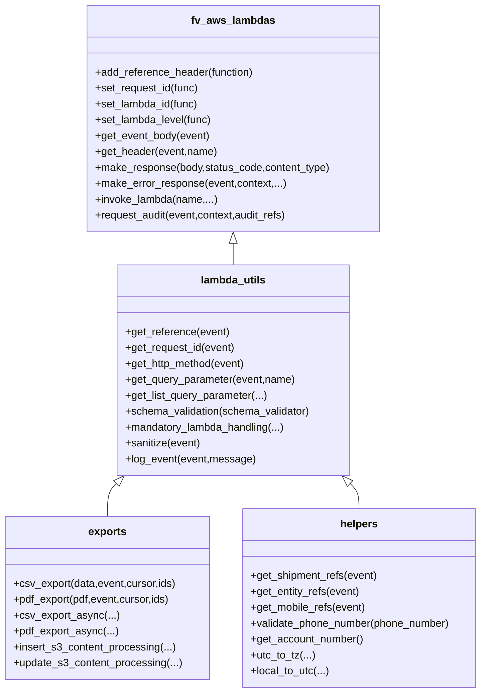
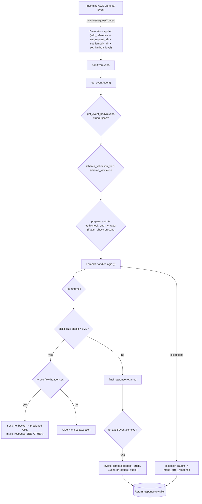
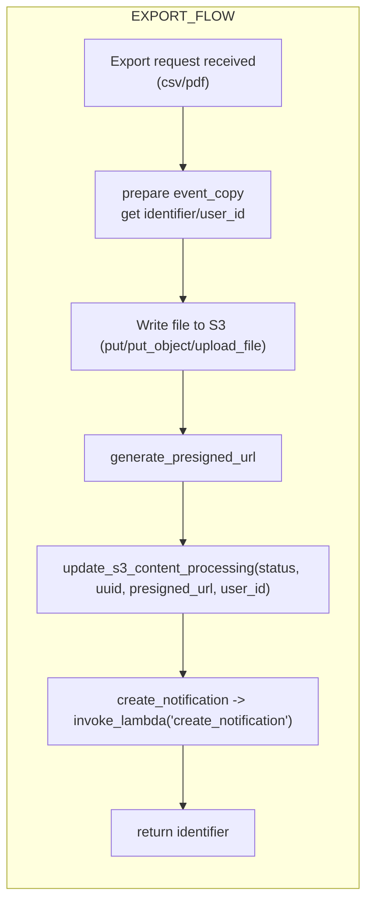
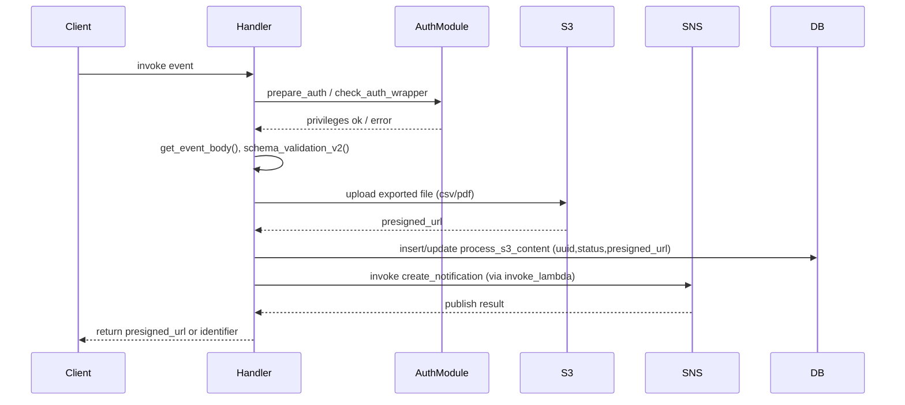
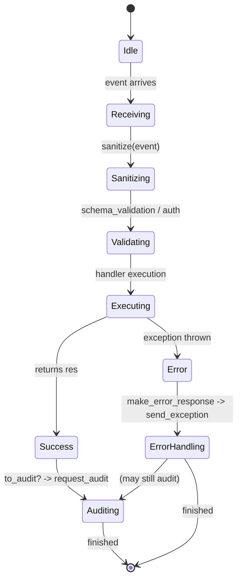

# Diagram: shipment_core/chromium_export/fv/python/fv/aws/lambdas/__init__.py

> Auto-generated by Obscura crawlers

## Diagram 1

### SVG

<svg id="container" width="729.6484375" xmlns="http://www.w3.org/2000/svg" class="classDiagram" height="1046" viewBox="0 0 729.6484375 1046" role="graphics-document document" aria-roledescription="class"><g><defs><marker id="container_class-aggregationStart" class="marker aggregation class" refX="18" refY="7" markerWidth="190" markerHeight="240" orient="auto"><path d="M 18,7 L9,13 L1,7 L9,1 Z"></path></marker></defs><defs><marker id="container_class-aggregationEnd" class="marker aggregation class" refX="1" refY="7" markerWidth="20" markerHeight="28" orient="auto"><path d="M 18,7 L9,13 L1,7 L9,1 Z"></path></marker></defs><defs><marker id="container_class-extensionStart" class="marker extension class" refX="18" refY="7" markerWidth="190" markerHeight="240" orient="auto"><path d="M 1,7 L18,13 V 1 Z"></path></marker></defs><defs><marker id="container_class-extensionEnd" class="marker extension class" refX="1" refY="7" markerWidth="20" markerHeight="28" orient="auto"><path d="M 1,1 V 13 L18,7 Z"></path></marker></defs><defs><marker id="container_class-compositionStart" class="marker composition class" refX="18" refY="7" markerWidth="190" markerHeight="240" orient="auto"><path d="M 18,7 L9,13 L1,7 L9,1 Z"></path></marker></defs><defs><marker id="container_class-compositionEnd" class="marker composition class" refX="1" refY="7" markerWidth="20" markerHeight="28" orient="auto"><path d="M 18,7 L9,13 L1,7 L9,1 Z"></path></marker></defs><defs><marker id="container_class-dependencyStart" class="marker dependency class" refX="6" refY="7" markerWidth="190" markerHeight="240" orient="auto"><path d="M 5,7 L9,13 L1,7 L9,1 Z"></path></marker></defs><defs><marker id="container_class-dependencyEnd" class="marker dependency class" refX="13" refY="7" markerWidth="20" markerHeight="28" orient="auto"><path d="M 18,7 L9,13 L14,7 L9,1 Z"></path></marker></defs><defs><marker id="container_class-lollipopStart" class="marker lollipop class" refX="13" refY="7" markerWidth="190" markerHeight="240" orient="auto"><circle stroke="black" fill="transparent" cx="7" cy="7" r="6"></circle></marker></defs><defs><marker id="container_class-lollipopEnd" class="marker lollipop class" refX="1" refY="7" markerWidth="190" markerHeight="240" orient="auto"><circle stroke="black" fill="transparent" cx="7" cy="7" r="6"></circle></marker></defs><g class="root"><g class="clusters"></g><g class="edgePaths"><path d="M351.783,367.25L351.783,368.542C351.783,369.833,351.783,372.417,351.783,377.875C351.783,383.333,351.783,391.667,351.783,395.833L351.783,400" id="id_fv_aws_lambdas_lambda_utils_1" class="edge-thickness-normal edge-pattern-solid relation" style=";;;" data-edge="true" data-et="edge" data-id="id_fv_aws_lambdas_lambda_utils_1" data-points="W3sieCI6MzUxLjc4MzIwMzEyNSwieSI6MzUwfSx7IngiOjM1MS43ODMyMDMxMjUsInkiOjM3NX0seyJ4IjozNTEuNzgzMjAzMTI1LCJ5Ijo0MDB9XQ==" marker-start="url(#container_class-extensionStart)"></path><path d="M174.39,729.971L172.137,732.142C169.884,734.314,165.377,738.657,163.124,746.995C160.871,755.333,160.871,767.667,160.871,773.833L160.871,780" id="id_lambda_utils_exports_2" class="edge-thickness-normal edge-pattern-solid relation" style=";;;" data-edge="true" data-et="edge" data-id="id_lambda_utils_exports_2" data-points="W3sieCI6MTg2LjgxMDIzOTA0NTUxNjMsInkiOjcxOH0seyJ4IjoxNjAuODcxMDkzNzUsInkiOjc0M30seyJ4IjoxNjAuODcxMDkzNzUsInkiOjc4MH1d" marker-start="url(#container_class-extensionStart)"></path><path d="M529.177,729.971L531.43,732.142C533.683,734.314,538.189,738.657,540.442,744.995C542.695,751.333,542.695,759.667,542.695,763.833L542.695,768" id="id_lambda_utils_helpers_3" class="edge-thickness-normal edge-pattern-solid relation" style=";;;" data-edge="true" data-et="edge" data-id="id_lambda_utils_helpers_3" data-points="W3sieCI6NTE2Ljc1NjE2NzIwNDQ4MzcsInkiOjcxOH0seyJ4Ijo1NDIuNjk1MzEyNSwieSI6NzQzfSx7IngiOjU0Mi42OTUzMTI1LCJ5Ijo3Njh9XQ==" marker-start="url(#container_class-extensionStart)"></path></g><g class="edgeLabels"><g class="edgeLabel"><g class="label" data-id="id_fv_aws_lambdas_lambda_utils_1" transform="translate(0, 0)"><foreignObject width="0" height="0">

</foreignObject></g></g><g class="edgeLabel"><g class="label" data-id="id_lambda_utils_exports_2" transform="translate(0, 0)"><foreignObject width="0" height="0">

</foreignObject></g></g><g class="edgeLabel"><g class="label" data-id="id_lambda_utils_helpers_3" transform="translate(0, 0)"><foreignObject width="0" height="0">

</foreignObject></g></g></g><g class="nodes"><g class="node default" id="classId-fv_aws_lambdas-0" transform="translate(351.783203125, 179)"><g class="basic label-container"><path d="M-220.6328125 -171 L220.6328125 -171 L220.6328125 171 L-220.6328125 171" stroke="none" stroke-width="0" fill="#ECECFF" style=""></path><path d="M-220.6328125 -171 C-50.64439040472132 -171, 119.34403169055736 -171, 220.6328125 -171 M-220.6328125 -171 C-52.124592098076505 -171, 116.38362830384699 -171, 220.6328125 -171 M220.6328125 -171 C220.6328125 -39.427253471986035, 220.6328125 92.14549305602793, 220.6328125 171 M220.6328125 -171 C220.6328125 -77.68519757068562, 220.6328125 15.629604858628767, 220.6328125 171 M220.6328125 171 C59.24922668417679 171, -102.13435913164642 171, -220.6328125 171 M220.6328125 171 C99.574534966511 171, -21.48374256697801 171, -220.6328125 171 M-220.6328125 171 C-220.6328125 83.65361543477016, -220.6328125 -3.6927691304596806, -220.6328125 -171 M-220.6328125 171 C-220.6328125 102.41244079567605, -220.6328125 33.824881591352096, -220.6328125 -171" stroke="#9370DB" stroke-width="1.3" fill="none" stroke-dasharray="0 0" style=""></path></g><g class="annotation-group text" transform="translate(0, -147)"></g><g class="label-group text" transform="translate(-60.0625, -147)"><g class="label" style="font-weight: bolder" transform="translate(0,-12)"><foreignObject width="120.125" height="24">

fv_aws_lambdas

</foreignObject></g></g><g class="members-group text" transform="translate(-208.6328125, -99)"></g><g class="methods-group text" transform="translate(-208.6328125, -69)"><g class="label" style="" transform="translate(0,-12)"><foreignObject width="242.265625" height="24">

+add_reference_header(function)

</foreignObject></g><g class="label" style="" transform="translate(0,12)"><foreignObject width="158.015625" height="24">

+set_request_id(func)

</foreignObject></g><g class="label" style="" transform="translate(0,36)"><foreignObject width="157.390625" height="24">

+set_lambda_id(func)

</foreignObject></g><g class="label" style="" transform="translate(0,60)"><foreignObject width="177.625" height="24">

+set_lambda_level(func)

</foreignObject></g><g class="label" style="" transform="translate(0,84)"><foreignObject width="174.203125" height="24">

+get_event_body(event)

</foreignObject></g><g class="label" style="" transform="translate(0,108)"><foreignObject width="185.09375" height="24">

+get_header(event,name)

</foreignObject></g><g class="label" style="" transform="translate(0,132)"><foreignObject width="357.203125" height="24">

+make_response(body,status_code,content_type)

</foreignObject></g><g class="label" style="" transform="translate(0,156)"><foreignObject width="287.875" height="24">

+make_error_response(event,context,...)

</foreignObject></g><g class="label" style="" transform="translate(0,180)"><foreignObject width="184.40625" height="24">

+invoke_lambda(name,...)

</foreignObject></g><g class="label" style="" transform="translate(0,204)"><foreignObject width="294.53125" height="24">

+request_audit(event,context,audit_refs)

</foreignObject></g></g><g class="divider" style=""><path d="M-220.6328125 -123 C-47.48382153476524 -123, 125.66516943046952 -123, 220.6328125 -123 M-220.6328125 -123 C-109.48548462836374 -123, 1.6618432432725285 -123, 220.6328125 -123" stroke="#9370DB" stroke-width="1.3" fill="none" stroke-dasharray="0 0" style=""></path></g><g class="divider" style=""><path d="M-220.6328125 -99 C-103.78474917744907 -99, 13.063314145101856 -99, 220.6328125 -99 M-220.6328125 -99 C-45.23447853389655 -99, 130.1638554322069 -99, 220.6328125 -99" stroke="#9370DB" stroke-width="1.3" fill="none" stroke-dasharray="0 0" style=""></path></g></g><g class="node default" id="classId-lambda_utils-1" transform="translate(351.783203125, 559)"><g class="basic label-container"><path d="M-177.11328125 -159 L177.11328125 -159 L177.11328125 159 L-177.11328125 159" stroke="none" stroke-width="0" fill="#ECECFF" style=""></path><path d="M-177.11328125 -159 C-39.54981774793501 -159, 98.01364575412998 -159, 177.11328125 -159 M-177.11328125 -159 C-63.67442978428771 -159, 49.76442168142458 -159, 177.11328125 -159 M177.11328125 -159 C177.11328125 -74.96606804054291, 177.11328125 9.067863918914185, 177.11328125 159 M177.11328125 -159 C177.11328125 -52.44642662491198, 177.11328125 54.10714675017604, 177.11328125 159 M177.11328125 159 C80.31605813346889 159, -16.48116498306223 159, -177.11328125 159 M177.11328125 159 C54.711586694233844 159, -67.69010786153231 159, -177.11328125 159 M-177.11328125 159 C-177.11328125 60.21341762026702, -177.11328125 -38.57316475946595, -177.11328125 -159 M-177.11328125 159 C-177.11328125 82.64223591785192, -177.11328125 6.28447183570384, -177.11328125 -159" stroke="#9370DB" stroke-width="1.3" fill="none" stroke-dasharray="0 0" style=""></path></g><g class="annotation-group text" transform="translate(0, -135)"></g><g class="label-group text" transform="translate(-47.6015625, -135)"><g class="label" style="font-weight: bolder" transform="translate(0,-12)"><foreignObject width="95.203125" height="24">

lambda_utils

</foreignObject></g></g><g class="members-group text" transform="translate(-165.11328125, -87)"></g><g class="methods-group text" transform="translate(-165.11328125, -57)"><g class="label" style="" transform="translate(0,-12)"><foreignObject width="157.75" height="24">

+get_reference(event)

</foreignObject></g><g class="label" style="" transform="translate(0,12)"><foreignObject width="167.234375" height="24">

+get_request_id(event)

</foreignObject></g><g class="label" style="" transform="translate(0,36)"><foreignObject width="184.5" height="24">

+get_http_method(event)

</foreignObject></g><g class="label" style="" transform="translate(0,60)"><foreignObject width="258.390625" height="24">

+get_query_parameter(event,name)

</foreignObject></g><g class="label" style="" transform="translate(0,84)"><foreignObject width="215.765625" height="24">

+get_list_query_parameter(...)

</foreignObject></g><g class="label" style="" transform="translate(0,108)"><foreignObject width="282.625" height="24">

+schema_validation(schema_validator)

</foreignObject></g><g class="label" style="" transform="translate(0,132)"><foreignObject width="243.59375" height="24">

+mandatory_lambda_handling(...)

</foreignObject></g><g class="label" style="" transform="translate(0,156)"><foreignObject width="114.484375" height="24">

+sanitize(event)

</foreignObject></g><g class="label" style="" transform="translate(0,180)"><foreignObject width="195.65625" height="24">

+log_event(event,message)

</foreignObject></g></g><g class="divider" style=""><path d="M-177.11328125 -111 C-90.8212309020225 -111, -4.529180554045013 -111, 177.11328125 -111 M-177.11328125 -111 C-62.34109176989929 -111, 52.43109771020141 -111, 177.11328125 -111" stroke="#9370DB" stroke-width="1.3" fill="none" stroke-dasharray="0 0" style=""></path></g><g class="divider" style=""><path d="M-177.11328125 -87 C-102.1873522176806 -87, -27.261423185361195 -87, 177.11328125 -87 M-177.11328125 -87 C-66.79611677530366 -87, 43.52104769939268 -87, 177.11328125 -87" stroke="#9370DB" stroke-width="1.3" fill="none" stroke-dasharray="0 0" style=""></path></g></g><g class="node default" id="classId-exports-2" transform="translate(160.87109375, 903)"><g class="basic label-container"><path d="M-152.87109375 -123 L152.87109375 -123 L152.87109375 123 L-152.87109375 123" stroke="none" stroke-width="0" fill="#ECECFF" style=""></path><path d="M-152.87109375 -123 C-45.91900293089772 -123, 61.03308788820456 -123, 152.87109375 -123 M-152.87109375 -123 C-45.99405941017433 -123, 60.88297492965134 -123, 152.87109375 -123 M152.87109375 -123 C152.87109375 -32.98495866920615, 152.87109375 57.0300826615877, 152.87109375 123 M152.87109375 -123 C152.87109375 -63.29824144172197, 152.87109375 -3.59648288344394, 152.87109375 123 M152.87109375 123 C69.17629205009592 123, -14.518509649808152 123, -152.87109375 123 M152.87109375 123 C32.18460636677305 123, -88.5018810164539 123, -152.87109375 123 M-152.87109375 123 C-152.87109375 49.02389991926229, -152.87109375 -24.952200161475417, -152.87109375 -123 M-152.87109375 123 C-152.87109375 62.08284974232729, -152.87109375 1.1656994846545814, -152.87109375 -123" stroke="#9370DB" stroke-width="1.3" fill="none" stroke-dasharray="0 0" style=""></path></g><g class="annotation-group text" transform="translate(0, -99)"></g><g class="label-group text" transform="translate(-28.0234375, -99)"><g class="label" style="font-weight: bolder" transform="translate(0,-12)"><foreignObject width="56.046875" height="24">

exports

</foreignObject></g></g><g class="members-group text" transform="translate(-140.87109375, -51)"></g><g class="methods-group text" transform="translate(-140.87109375, -21)"><g class="label" style="" transform="translate(0,-12)"><foreignObject width="245.96875" height="24">

+csv_export(data,event,cursor,ids)

</foreignObject></g><g class="label" style="" transform="translate(0,12)"><foreignObject width="238.6875" height="24">

+pdf_export(pdf,event,cursor,ids)

</foreignObject></g><g class="label" style="" transform="translate(0,36)"><foreignObject width="155.890625" height="24">

+csv_export_async(...)

</foreignObject></g><g class="label" style="" transform="translate(0,60)"><foreignObject width="157.609375" height="24">

+pdf_export_async(...)

</foreignObject></g><g class="label" style="" transform="translate(0,84)"><foreignObject width="244.734375" height="24">

+insert_s3_content_processing(...)

</foreignObject></g><g class="label" style="" transform="translate(0,108)"><foreignObject width="253.71875" height="24">

+update_s3_content_processing(...)

</foreignObject></g></g><g class="divider" style=""><path d="M-152.87109375 -75 C-70.74909918387 -75, 11.372895382259998 -75, 152.87109375 -75 M-152.87109375 -75 C-44.51622784370309 -75, 63.838638062593816 -75, 152.87109375 -75" stroke="#9370DB" stroke-width="1.3" fill="none" stroke-dasharray="0 0" style=""></path></g><g class="divider" style=""><path d="M-152.87109375 -51 C-33.74317502840617 -51, 85.38474369318766 -51, 152.87109375 -51 M-152.87109375 -51 C-58.856810101872185 -51, 35.15747354625563 -51, 152.87109375 -51" stroke="#9370DB" stroke-width="1.3" fill="none" stroke-dasharray="0 0" style=""></path></g></g><g class="node default" id="classId-helpers-3" transform="translate(542.6953125, 903)"><g class="basic label-container"><path d="M-178.953125 -135 L178.953125 -135 L178.953125 135 L-178.953125 135" stroke="none" stroke-width="0" fill="#ECECFF" style=""></path><path d="M-178.953125 -135 C-46.57901669027905 -135, 85.7950916194419 -135, 178.953125 -135 M-178.953125 -135 C-83.92004697679354 -135, 11.113031046412914 -135, 178.953125 -135 M178.953125 -135 C178.953125 -41.732766201339786, 178.953125 51.53446759732043, 178.953125 135 M178.953125 -135 C178.953125 -66.4477736517624, 178.953125 2.1044526964751924, 178.953125 135 M178.953125 135 C54.96091967976214 135, -69.03128564047572 135, -178.953125 135 M178.953125 135 C49.14680957792754 135, -80.65950584414492 135, -178.953125 135 M-178.953125 135 C-178.953125 61.04493248982213, -178.953125 -12.910135020355739, -178.953125 -135 M-178.953125 135 C-178.953125 58.35941989857869, -178.953125 -18.281160202842614, -178.953125 -135" stroke="#9370DB" stroke-width="1.3" fill="none" stroke-dasharray="0 0" style=""></path></g><g class="annotation-group text" transform="translate(0, -111)"></g><g class="label-group text" transform="translate(-27.578125, -111)"><g class="label" style="font-weight: bolder" transform="translate(0,-12)"><foreignObject width="55.15625" height="24">

helpers

</foreignObject></g></g><g class="members-group text" transform="translate(-166.953125, -63)"></g><g class="methods-group text" transform="translate(-166.953125, -33)"><g class="label" style="" transform="translate(0,-12)"><foreignObject width="193.515625" height="24">

+get_shipment_refs(event)

</foreignObject></g><g class="label" style="" transform="translate(0,12)"><foreignObject width="166.21875" height="24">

+get_entity_refs(event)

</foreignObject></g><g class="label" style="" transform="translate(0,36)"><foreignObject width="175.140625" height="24">

+get_mobile_refs(event)

</foreignObject></g><g class="label" style="" transform="translate(0,60)"><foreignObject width="306.328125" height="24">

+validate_phone_number(phone_number)

</foreignObject></g><g class="label" style="" transform="translate(0,84)"><foreignObject width="171.203125" height="24">

+get_account_number()

</foreignObject></g><g class="label" style="" transform="translate(0,108)"><foreignObject width="95.703125" height="24">

+utc_to_tz(...)

</foreignObject></g><g class="label" style="" transform="translate(0,132)"><foreignObject width="117.609375" height="24">

+local_to_utc(...)

</foreignObject></g></g><g class="divider" style=""><path d="M-178.953125 -87 C-105.10487582189864 -87, -31.25662664379729 -87, 178.953125 -87 M-178.953125 -87 C-91.23805987983495 -87, -3.522994759669899 -87, 178.953125 -87" stroke="#9370DB" stroke-width="1.3" fill="none" stroke-dasharray="0 0" style=""></path></g><g class="divider" style=""><path d="M-178.953125 -63 C-94.83292399734412 -63, -10.71272299468825 -63, 178.953125 -63 M-178.953125 -63 C-91.47427234797993 -63, -3.9954196959598676 -63, 178.953125 -63" stroke="#9370DB" stroke-width="1.3" fill="none" stroke-dasharray="0 0" style=""></path></g></g></g></g></g></svg>

## Diagram 2

### SVG

<svg id="container" width="1226.8203125" xmlns="http://www.w3.org/2000/svg" class="flowchart" height="3054.3603515625" viewBox="0 0 1226.8203125 3054.3603515625" role="graphics-document document" aria-roledescription="flowchart-v2"><g><marker id="container_flowchart-v2-pointEnd" class="marker flowchart-v2" viewBox="0 0 10 10" refX="5" refY="5" markerUnits="userSpaceOnUse" markerWidth="8" markerHeight="8" orient="auto"><path d="M 0 0 L 10 5 L 0 10 z" class="arrowMarkerPath" style="stroke-width: 1; stroke-dasharray: 1, 0;"></path></marker><marker id="container_flowchart-v2-pointStart" class="marker flowchart-v2" viewBox="0 0 10 10" refX="4.5" refY="5" markerUnits="userSpaceOnUse" markerWidth="8" markerHeight="8" orient="auto"><path d="M 0 5 L 10 10 L 10 0 z" class="arrowMarkerPath" style="stroke-width: 1; stroke-dasharray: 1, 0;"></path></marker><marker id="container_flowchart-v2-circleEnd" class="marker flowchart-v2" viewBox="0 0 10 10" refX="11" refY="5" markerUnits="userSpaceOnUse" markerWidth="11" markerHeight="11" orient="auto"><circle cx="5" cy="5" r="5" class="arrowMarkerPath" style="stroke-width: 1; stroke-dasharray: 1, 0;"></circle></marker><marker id="container_flowchart-v2-circleStart" class="marker flowchart-v2" viewBox="0 0 10 10" refX="-1" refY="5" markerUnits="userSpaceOnUse" markerWidth="11" markerHeight="11" orient="auto"><circle cx="5" cy="5" r="5" class="arrowMarkerPath" style="stroke-width: 1; stroke-dasharray: 1, 0;"></circle></marker><marker id="container_flowchart-v2-crossEnd" class="marker cross flowchart-v2" viewBox="0 0 11 11" refX="12" refY="5.2" markerUnits="userSpaceOnUse" markerWidth="11" markerHeight="11" orient="auto"><path d="M 1,1 l 9,9 M 10,1 l -9,9" class="arrowMarkerPath" style="stroke-width: 2; stroke-dasharray: 1, 0;"></path></marker><marker id="container_flowchart-v2-crossStart" class="marker cross flowchart-v2" viewBox="0 0 11 11" refX="-1" refY="5.2" markerUnits="userSpaceOnUse" markerWidth="11" markerHeight="11" orient="auto"><path d="M 1,1 l 9,9 M 10,1 l -9,9" class="arrowMarkerPath" style="stroke-width: 2; stroke-dasharray: 1, 0;"></path></marker><g class="root"><g class="clusters"></g><g class="edgePaths"><path d="M625.777,86L625.777,92.167C625.777,98.333,625.777,110.667,625.777,122.333C625.777,134,625.777,145,625.777,150.5L625.777,156" id="L_Event_Decorators_0" class="edge-thickness-normal edge-pattern-solid edge-thickness-normal edge-pattern-solid flowchart-link" style=";" data-edge="true" data-et="edge" data-id="L_Event_Decorators_0" data-points="W3sieCI6NjI1Ljc3NzM0Mzc1LCJ5Ijo4Nn0seyJ4Ijo2MjUuNzc3MzQzNzUsInkiOjEyM30seyJ4Ijo2MjUuNzc3MzQzNzUsInkiOjE2MH1d" marker-end="url(#container_flowchart-v2-pointEnd)"></path><path d="M625.777,310L625.777,314.167C625.777,318.333,625.777,326.667,625.777,334.333C625.777,342,625.777,349,625.777,352.5L625.777,356" id="L_Decorators_Sanitized_0" class="edge-thickness-normal edge-pattern-solid edge-thickness-normal edge-pattern-solid flowchart-link" style=";" data-edge="true" data-et="edge" data-id="L_Decorators_Sanitized_0" data-points="W3sieCI6NjI1Ljc3NzM0Mzc1LCJ5IjozMTB9LHsieCI6NjI1Ljc3NzM0Mzc1LCJ5IjozMzV9LHsieCI6NjI1Ljc3NzM0Mzc1LCJ5IjozNjB9XQ==" marker-end="url(#container_flowchart-v2-pointEnd)"></path><path d="M625.777,414L625.777,418.167C625.777,422.333,625.777,430.667,625.777,438.333C625.777,446,625.777,453,625.777,456.5L625.777,460" id="L_Sanitized_LogEvent_0" class="edge-thickness-normal edge-pattern-solid edge-thickness-normal edge-pattern-solid flowchart-link" style=";" data-edge="true" data-et="edge" data-id="L_Sanitized_LogEvent_0" data-points="W3sieCI6NjI1Ljc3NzM0Mzc1LCJ5Ijo0MTR9LHsieCI6NjI1Ljc3NzM0Mzc1LCJ5Ijo0Mzl9LHsieCI6NjI1Ljc3NzM0Mzc1LCJ5Ijo0NjR9XQ==" marker-end="url(#container_flowchart-v2-pointEnd)"></path><path d="M625.777,518L625.777,522.167C625.777,526.333,625.777,534.667,625.777,542.333C625.777,550,625.777,557,625.777,560.5L625.777,564" id="L_LogEvent_ParseBody_0" class="edge-thickness-normal edge-pattern-solid edge-thickness-normal edge-pattern-solid flowchart-link" style=";" data-edge="true" data-et="edge" data-id="L_LogEvent_ParseBody_0" data-points="W3sieCI6NjI1Ljc3NzM0Mzc1LCJ5Ijo1MTh9LHsieCI6NjI1Ljc3NzM0Mzc1LCJ5Ijo1NDN9LHsieCI6NjI1Ljc3NzM0Mzc1LCJ5Ijo1Njh9XQ==" marker-end="url(#container_flowchart-v2-pointEnd)"></path><path d="M625.777,877.828L625.777,881.995C625.777,886.161,625.777,894.495,625.777,902.161C625.777,909.828,625.777,916.828,625.777,920.328L625.777,923.828" id="L_ParseBody_Schema_0" class="edge-thickness-normal edge-pattern-solid edge-thickness-normal edge-pattern-solid flowchart-link" style=";" data-edge="true" data-et="edge" data-id="L_ParseBody_Schema_0" data-points="W3sieCI6NjI1Ljc3NzM0Mzc1LCJ5Ijo4NzcuODI4MTI1fSx7IngiOjYyNS43NzczNDM3NSwieSI6OTAyLjgyODEyNX0seyJ4Ijo2MjUuNzc3MzQzNzUsInkiOjkyNy44MjgxMjV9XQ==" marker-end="url(#container_flowchart-v2-pointEnd)"></path><path d="M625.777,1205.828L625.777,1209.995C625.777,1214.161,625.777,1222.495,625.777,1230.161C625.777,1237.828,625.777,1244.828,625.777,1248.328L625.777,1251.828" id="L_Schema_AuthCheck_0" class="edge-thickness-normal edge-pattern-solid edge-thickness-normal edge-pattern-solid flowchart-link" style=";" data-edge="true" data-et="edge" data-id="L_Schema_AuthCheck_0" data-points="W3sieCI6NjI1Ljc3NzM0Mzc1LCJ5IjoxMjA1LjgyODEyNX0seyJ4Ijo2MjUuNzc3MzQzNzUsInkiOjEyMzAuODI4MTI1fSx7IngiOjYyNS43NzczNDM3NSwieSI6MTI1NS44MjgxMjV9XQ==" marker-end="url(#container_flowchart-v2-pointEnd)"></path><path d="M625.777,1581.313L625.777,1585.479C625.777,1589.646,625.777,1597.979,625.777,1605.646C625.777,1613.313,625.777,1620.313,625.777,1623.813L625.777,1627.313" id="L_AuthCheck_Business_0" class="edge-thickness-normal edge-pattern-solid edge-thickness-normal edge-pattern-solid flowchart-link" style=";" data-edge="true" data-et="edge" data-id="L_AuthCheck_Business_0" data-points="W3sieCI6NjI1Ljc3NzM0Mzc1LCJ5IjoxNTgxLjMxMjV9LHsieCI6NjI1Ljc3NzM0Mzc1LCJ5IjoxNjA2LjMxMjV9LHsieCI6NjI1Ljc3NzM0Mzc1LCJ5IjoxNjMxLjMxMjV9XQ==" marker-end="url(#container_flowchart-v2-pointEnd)"></path><path d="M541.415,1685.313L528.396,1689.479C515.377,1693.646,489.339,1701.979,476.32,1709.646C463.301,1717.313,463.301,1724.313,463.301,1727.813L463.301,1731.313" id="L_Business_Response_0" class="edge-thickness-normal edge-pattern-solid edge-thickness-normal edge-pattern-solid flowchart-link" style=";" data-edge="true" data-et="edge" data-id="L_Business_Response_0" data-points="W3sieCI6NTQxLjQxNDUxMzIyMTE1MzgsInkiOjE2ODUuMzEyNX0seyJ4Ijo0NjMuMzAwNzgxMjUsInkiOjE3MTAuMzEyNX0seyJ4Ijo0NjMuMzAwNzgxMjUsInkiOjE3MzUuMzEyNX1d" marker-end="url(#container_flowchart-v2-pointEnd)"></path><path d="M463.301,1878.797L463.301,1882.964C463.301,1887.13,463.301,1895.464,463.301,1903.13C463.301,1910.797,463.301,1917.797,463.301,1921.297L463.301,1924.797" id="L_Response_SizeCheck_0" class="edge-thickness-normal edge-pattern-solid edge-thickness-normal edge-pattern-solid flowchart-link" style=";" data-edge="true" data-et="edge" data-id="L_Response_SizeCheck_0" data-points="W3sieCI6NDYzLjMwMDc4MTI1LCJ5IjoxODc4Ljc5Njg3NX0seyJ4Ijo0NjMuMzAwNzgxMjUsInkiOjE5MDMuNzk2ODc1fSx7IngiOjQ2My4zMDA3ODEyNSwieSI6MTkyOC43OTY4NzV9XQ==" marker-end="url(#container_flowchart-v2-pointEnd)"></path><path d="M408.309,2102.336L394.084,2117.668C379.859,2133,351.41,2163.664,337.186,2184.496C322.961,2205.328,322.961,2216.328,322.961,2221.828L322.961,2227.328" id="L_SizeCheck_OverflowCheck_0" class="edge-thickness-normal edge-pattern-solid edge-thickness-normal edge-pattern-solid flowchart-link" style=";" data-edge="true" data-et="edge" data-id="L_SizeCheck_OverflowCheck_0" data-points="W3sieCI6NDA4LjMwODYwMjg1NDg2OCwieSI6MjEwMi4zMzU5NDY2MDQ4Njh9LHsieCI6MzIyLjk2MDkzNzUsInkiOjIxOTQuMzI4MTI1fSx7IngiOjMyMi45NjA5Mzc1LCJ5IjoyMjMxLjMyODEyNX1d" marker-end="url(#container_flowchart-v2-pointEnd)"></path><path d="M264.905,2397.412L247.876,2413.255C230.848,2429.098,196.791,2460.783,179.763,2494.786C162.734,2528.789,162.734,2565.109,162.734,2583.27L162.734,2601.43" id="L_OverflowCheck_SendToBucket_0" class="edge-thickness-normal edge-pattern-solid edge-thickness-normal edge-pattern-solid flowchart-link" style=";" data-edge="true" data-et="edge" data-id="L_OverflowCheck_SendToBucket_0" data-points="W3sieCI6MjY0LjkwNDYwOTE1NzkzMTMsInkiOjIzOTcuNDEyNDIxNjU3OTMxfSx7IngiOjE2Mi43MzQzNzUsInkiOjI0OTIuNDY4NzV9LHsieCI6MTYyLjczNDM3NSwieSI6MjYwNS40Mjk2ODc1fV0=" marker-end="url(#container_flowchart-v2-pointEnd)"></path><path d="M381.017,2397.412L398.046,2413.255C415.074,2429.098,449.131,2460.783,466.159,2496.786C483.188,2532.789,483.188,2573.109,483.188,2593.27L483.188,2613.43" id="L_OverflowCheck_ErrorLargeBody_0" class="edge-thickness-normal edge-pattern-solid edge-thickness-normal edge-pattern-solid flowchart-link" style=";" data-edge="true" data-et="edge" data-id="L_OverflowCheck_ErrorLargeBody_0" data-points="W3sieCI6MzgxLjAxNzI2NTg0MjA2ODcsInkiOjIzOTcuNDEyNDIxNjU3OTMxfSx7IngiOjQ4My4xODc1LCJ5IjoyNDkyLjQ2ODc1fSx7IngiOjQ4My4xODc1LCJ5IjoyNjE3LjQyOTY4NzV9XQ==" marker-end="url(#container_flowchart-v2-pointEnd)"></path><path d="M539.312,2081.317L576.738,2100.152C614.164,2118.987,689.016,2156.658,726.441,2195.171C763.867,2233.685,763.867,2273.042,763.867,2292.72L763.867,2312.398" id="L_SizeCheck_Finalize_0" class="edge-thickness-normal edge-pattern-solid edge-thickness-normal edge-pattern-solid flowchart-link" style=";" data-edge="true" data-et="edge" data-id="L_SizeCheck_Finalize_0" data-points="W3sieCI6NTM5LjMxMjIzMjE2MjczMzcsInkiOjIwODEuMzE2Njc0MDg3MjY2fSx7IngiOjc2My44NjcxODc1LCJ5IjoyMTk0LjMyODEyNX0seyJ4Ijo3NjMuODY3MTg3NSwieSI6MjMxNi4zOTg0Mzc1fV0=" marker-end="url(#container_flowchart-v2-pointEnd)"></path><path d="M745.129,1671.716L802.411,1678.149C859.693,1684.581,974.257,1697.447,1031.538,1720.003C1088.82,1742.56,1088.82,1774.807,1088.82,1807.055C1088.82,1839.302,1088.82,1871.549,1088.82,1910.884C1088.82,1950.219,1088.82,1996.641,1088.82,2045.063C1088.82,2093.484,1088.82,2143.906,1088.82,2193.962C1088.82,2244.018,1088.82,2293.708,1088.82,2343.398C1088.82,2393.089,1088.82,2442.779,1088.82,2492.951C1088.82,2543.122,1088.82,2593.776,1088.82,2644.43C1088.82,2695.083,1088.82,2745.737,1088.82,2776.564C1088.82,2807.391,1088.82,2818.391,1088.82,2823.891L1088.82,2829.391" id="L_Business_ErrorHandler_0" class="edge-thickness-normal edge-pattern-solid edge-thickness-normal edge-pattern-solid flowchart-link" style=";" data-edge="true" data-et="edge" data-id="L_Business_ErrorHandler_0" data-points="W3sieCI6NzQ1LjEyODkwNjI1LCJ5IjoxNjcxLjcxNTc1MTI1MDY0MzN9LHsieCI6MTA4OC44MjAzMTI1LCJ5IjoxNzEwLjMxMjV9LHsieCI6MTA4OC44MjAzMTI1LCJ5IjoxODA3LjA1NDY4NzV9LHsieCI6MTA4OC44MjAzMTI1LCJ5IjoxOTAzLjc5Njg3NX0seyJ4IjoxMDg4LjgyMDMxMjUsInkiOjIwNDMuMDYyNX0seyJ4IjoxMDg4LjgyMDMxMjUsInkiOjIxOTQuMzI4MTI1fSx7IngiOjEwODguODIwMzEyNSwieSI6MjM0My4zOTg0Mzc1fSx7IngiOjEwODguODIwMzEyNSwieSI6MjQ5Mi40Njg3NX0seyJ4IjoxMDg4LjgyMDMxMjUsInkiOjI2NDQuNDI5Njg3NX0seyJ4IjoxMDg4LjgyMDMxMjUsInkiOjI3OTYuMzkwNjI1fSx7IngiOjEwODguODIwMzEyNSwieSI6MjgzMy4zOTA2MjV9XQ==" marker-end="url(#container_flowchart-v2-pointEnd)"></path><path d="M763.867,2370.398L763.867,2390.743C763.867,2411.089,763.867,2451.779,763.867,2477.624C763.867,2503.469,763.867,2514.469,763.867,2519.969L763.867,2525.469" id="L_Finalize_AuditCheck_0" class="edge-thickness-normal edge-pattern-solid edge-thickness-normal edge-pattern-solid flowchart-link" style=";" data-edge="true" data-et="edge" data-id="L_Finalize_AuditCheck_0" data-points="W3sieCI6NzYzLjg2NzE4NzUsInkiOjIzNzAuMzk4NDM3NX0seyJ4Ijo3NjMuODY3MTg3NSwieSI6MjQ5Mi40Njg3NX0seyJ4Ijo3NjMuODY3MTg3NSwieSI6MjUyOS40Njg3NX1d" marker-end="url(#container_flowchart-v2-pointEnd)"></path><path d="M763.867,2759.391L763.867,2765.557C763.867,2771.724,763.867,2784.057,763.867,2795.724C763.867,2807.391,763.867,2818.391,763.867,2823.891L763.867,2829.391" id="L_AuditCheck_requestAudit_0" class="edge-thickness-normal edge-pattern-solid edge-thickness-normal edge-pattern-solid flowchart-link" style=";" data-edge="true" data-et="edge" data-id="L_AuditCheck_requestAudit_0" data-points="W3sieCI6NzYzLjg2NzE4NzUsInkiOjI3NTkuMzkwNjI1fSx7IngiOjc2My44NjcxODc1LCJ5IjoyNzk2LjM5MDYyNX0seyJ4Ijo3NjMuODY3MTg3NSwieSI6MjgzMy4zOTA2MjV9XQ==" marker-end="url(#container_flowchart-v2-pointEnd)"></path><path d="M763.867,2911.391L763.867,2915.557C763.867,2919.724,763.867,2928.057,773.895,2938.808C783.922,2949.559,803.977,2962.728,814.004,2969.312L824.031,2975.896" id="L_requestAudit_Done_0" class="edge-thickness-normal edge-pattern-solid edge-thickness-normal edge-pattern-solid flowchart-link" style=";" data-edge="true" data-et="edge" data-id="L_requestAudit_Done_0" data-points="W3sieCI6NzYzLjg2NzE4NzUsInkiOjI5MTEuMzkwNjI1fSx7IngiOjc2My44NjcxODc1LCJ5IjoyOTM2LjM5MDYyNX0seyJ4Ijo4MjcuMzc1LCJ5IjoyOTc4LjA5MTg2NDY5MzU3Nn1d" marker-end="url(#container_flowchart-v2-pointEnd)"></path><path d="M1088.82,2911.391L1088.82,2915.557C1088.82,2919.724,1088.82,2928.057,1078.793,2938.808C1068.766,2949.559,1048.711,2962.728,1038.683,2969.312L1028.656,2975.896" id="L_ErrorHandler_Done_0" class="edge-thickness-normal edge-pattern-solid edge-thickness-normal edge-pattern-solid flowchart-link" style=";" data-edge="true" data-et="edge" data-id="L_ErrorHandler_Done_0" data-points="W3sieCI6MTA4OC44MjAzMTI1LCJ5IjoyOTExLjM5MDYyNX0seyJ4IjoxMDg4LjgyMDMxMjUsInkiOjI5MzYuMzkwNjI1fSx7IngiOjEwMjUuMzEyNSwieSI6Mjk3OC4wOTE4NjQ2OTM1NzZ9XQ==" marker-end="url(#container_flowchart-v2-pointEnd)"></path></g><g class="edgeLabels"><g class="edgeLabel" transform="translate(625.77734375, 123)"><g class="label" data-id="L_Event_Decorators_0" transform="translate(-88.2265625, -12)"><foreignObject width="176.453125" height="24">

headers/requestContext

</foreignObject></g></g><g class="edgeLabel"><g class="label" data-id="L_Decorators_Sanitized_0" transform="translate(0, 0)"><foreignObject width="0" height="0">

</foreignObject></g></g><g class="edgeLabel"><g class="label" data-id="L_Sanitized_LogEvent_0" transform="translate(0, 0)"><foreignObject width="0" height="0">

</foreignObject></g></g><g class="edgeLabel"><g class="label" data-id="L_LogEvent_ParseBody_0" transform="translate(0, 0)"><foreignObject width="0" height="0">

</foreignObject></g></g><g class="edgeLabel"><g class="label" data-id="L_ParseBody_Schema_0" transform="translate(0, 0)"><foreignObject width="0" height="0">

</foreignObject></g></g><g class="edgeLabel"><g class="label" data-id="L_Schema_AuthCheck_0" transform="translate(0, 0)"><foreignObject width="0" height="0">

</foreignObject></g></g><g class="edgeLabel"><g class="label" data-id="L_AuthCheck_Business_0" transform="translate(0, 0)"><foreignObject width="0" height="0">

</foreignObject></g></g><g class="edgeLabel"><g class="label" data-id="L_Business_Response_0" transform="translate(0, 0)"><foreignObject width="0" height="0">

</foreignObject></g></g><g class="edgeLabel"><g class="label" data-id="L_Response_SizeCheck_0" transform="translate(0, 0)"><foreignObject width="0" height="0">

</foreignObject></g></g><g class="edgeLabel" transform="translate(322.9609375, 2194.328125)"><g class="label" data-id="L_SizeCheck_OverflowCheck_0" transform="translate(-12.0078125, -12)"><foreignObject width="24.015625" height="24">

yes

</foreignObject></g></g><g class="edgeLabel" transform="translate(162.734375, 2492.46875)"><g class="label" data-id="L_OverflowCheck_SendToBucket_0" transform="translate(-12.0078125, -12)"><foreignObject width="24.015625" height="24">

yes

</foreignObject></g></g><g class="edgeLabel" transform="translate(483.1875, 2492.46875)"><g class="label" data-id="L_OverflowCheck_ErrorLargeBody_0" transform="translate(-9.3671875, -12)"><foreignObject width="18.734375" height="24">

no

</foreignObject></g></g><g class="edgeLabel" transform="translate(763.8671875, 2194.328125)"><g class="label" data-id="L_SizeCheck_Finalize_0" transform="translate(-9.3671875, -12)"><foreignObject width="18.734375" height="24">

no

</foreignObject></g></g><g class="edgeLabel" transform="translate(1088.8203125, 2194.328125)"><g class="label" data-id="L_Business_ErrorHandler_0" transform="translate(-39.1171875, -12)"><foreignObject width="78.234375" height="24">

exceptions

</foreignObject></g></g><g class="edgeLabel"><g class="label" data-id="L_Finalize_AuditCheck_0" transform="translate(0, 0)"><foreignObject width="0" height="0">

</foreignObject></g></g><g class="edgeLabel" transform="translate(763.8671875, 2796.390625)"><g class="label" data-id="L_AuditCheck_requestAudit_0" transform="translate(-12.0078125, -12)"><foreignObject width="24.015625" height="24">

yes

</foreignObject></g></g><g class="edgeLabel"><g class="label" data-id="L_requestAudit_Done_0" transform="translate(0, 0)"><foreignObject width="0" height="0">

</foreignObject></g></g><g class="edgeLabel"><g class="label" data-id="L_ErrorHandler_Done_0" transform="translate(0, 0)"><foreignObject width="0" height="0">

</foreignObject></g></g></g><g class="nodes"><g class="node default" id="flowchart-Event-0" transform="translate(625.77734375, 47)"><rect class="basic label-container" style="" x="-130" y="-39" width="260" height="78"></rect><g class="label" style="" transform="translate(-100, -24)"><rect></rect><foreignObject width="200" height="48">

Incoming AWS Lambda Event

</foreignObject></g></g><g class="node default" id="flowchart-Decorators-1" transform="translate(625.77734375, 235)"><rect class="basic label-container" style="" x="-130" y="-75" width="260" height="150"></rect><g class="label" style="" transform="translate(-100, -60)"><rect></rect><foreignObject width="200" height="120">

Decorators applied\n(add_reference -&gt; set_request_id -&gt; set_lambda_id -&gt; set_lambda_level)

</foreignObject></g></g><g class="node default" id="flowchart-Sanitized-3" transform="translate(625.77734375, 387)"><rect class="basic label-container" style="" x="-83.25" y="-27" width="166.5" height="54"></rect><g class="label" style="" transform="translate(-53.25, -12)"><rect></rect><foreignObject width="106.5" height="24">

sanitize(event)

</foreignObject></g></g><g class="node default" id="flowchart-LogEvent-5" transform="translate(625.77734375, 491)"><rect class="basic label-container" style="" x="-90.6953125" y="-27" width="181.390625" height="54"></rect><g class="label" style="" transform="translate(-60.6953125, -12)"><rect></rect><foreignObject width="121.390625" height="24">

log_event(event)

</foreignObject></g></g><g class="node default" id="flowchart-ParseBody-7" transform="translate(625.77734375, 722.9140625)"><polygon points="154.9140625,0 309.828125,-154.9140625 154.9140625,-309.828125 0,-154.9140625" class="label-container" transform="translate(-154.4140625, 154.9140625)"></polygon><g class="label" style="" transform="translate(-115.9140625, -24)"><rect></rect><foreignObject width="231.828125" height="48">

get_event_body(event)\nstring-&gt;json?

</foreignObject></g></g><g class="node default" id="flowchart-Schema-9" transform="translate(625.77734375, 1066.828125)"><polygon points="139,0 278,-139 139,-278 0,-139" class="label-container" transform="translate(-138.5, 139)"></polygon><g class="label" style="" transform="translate(-100, -24)"><rect></rect><foreignObject width="200" height="48">

schema_validation_v2 or schema_validation

</foreignObject></g></g><g class="node default" id="flowchart-AuthCheck-11" transform="translate(625.77734375, 1418.5703125)"><polygon points="162.7421875,0 325.484375,-162.7421875 162.7421875,-325.484375 0,-162.7421875" class="label-container" transform="translate(-162.2421875, 162.7421875)"></polygon><g class="label" style="" transform="translate(-111.7421875, -36)"><rect></rect><foreignObject width="223.484375" height="72">

prepare_auth &amp; auth.check_auth_wrapper\n(if auth_check present)

</foreignObject></g></g><g class="node default" id="flowchart-Business-13" transform="translate(625.77734375, 1658.3125)"><rect class="basic label-container" style="" x="-119.3515625" y="-27" width="238.703125" height="54"></rect><g class="label" style="" transform="translate(-89.3515625, -12)"><rect></rect><foreignObject width="178.703125" height="24">

Lambda handler logic (f)

</foreignObject></g></g><g class="node default" id="flowchart-Response-15" transform="translate(463.30078125, 1807.0546875)"><polygon points="71.7421875,0 143.484375,-71.7421875 71.7421875,-143.484375 0,-71.7421875" class="label-container" transform="translate(-71.2421875, 71.7421875)"></polygon><g class="label" style="" transform="translate(-44.7421875, -12)"><rect></rect><foreignObject width="89.484375" height="24">

res returned

</foreignObject></g></g><g class="node default" id="flowchart-SizeCheck-17" transform="translate(463.30078125, 2043.0625)"><polygon points="114.265625,0 228.53125,-114.265625 114.265625,-228.53125 0,-114.265625" class="label-container" transform="translate(-113.765625, 114.265625)"></polygon><g class="label" style="" transform="translate(-87.265625, -12)"><rect></rect><foreignObject width="174.53125" height="24">

pickle size check &gt; 5MB?

</foreignObject></g></g><g class="node default" id="flowchart-OverflowCheck-19" transform="translate(322.9609375, 2343.3984375)"><polygon points="112.0703125,0 224.140625,-112.0703125 112.0703125,-224.140625 0,-112.0703125" class="label-container" transform="translate(-111.5703125, 112.0703125)"></polygon><g class="label" style="" transform="translate(-85.0703125, -12)"><rect></rect><foreignObject width="170.140625" height="24">

fv-overflow header set?

</foreignObject></g></g><g class="node default" id="flowchart-SendToBucket-21" transform="translate(162.734375, 2644.4296875)"><rect class="basic label-container" style="" x="-154.734375" y="-39" width="309.46875" height="78"></rect><g class="label" style="" transform="translate(-124.734375, -24)"><rect></rect><foreignObject width="249.46875" height="48">

send_to_bucket -&gt; presigned URL\nmake_response(SEE_OTHER)

</foreignObject></g></g><g class="node default" id="flowchart-ErrorLargeBody-23" transform="translate(483.1875, 2644.4296875)"><rect class="basic label-container" style="" x="-115.71875" y="-27" width="231.4375" height="54"></rect><g class="label" style="" transform="translate(-85.71875, -12)"><rect></rect><foreignObject width="171.4375" height="24">

raise HandledException

</foreignObject></g></g><g class="node default" id="flowchart-Finalize-25" transform="translate(763.8671875, 2343.3984375)"><rect class="basic label-container" style="" x="-114.96875" y="-27" width="229.9375" height="54"></rect><g class="label" style="" transform="translate(-84.96875, -12)"><rect></rect><foreignObject width="169.9375" height="24">

final response returned

</foreignObject></g></g><g class="node default" id="flowchart-ErrorHandler-27" transform="translate(1088.8203125, 2872.390625)"><rect class="basic label-container" style="" x="-130" y="-39" width="260" height="78"></rect><g class="label" style="" transform="translate(-100, -24)"><rect></rect><foreignObject width="200" height="48">

exception caught -&gt; make_error_response

</foreignObject></g></g><g class="node default" id="flowchart-AuditCheck-29" transform="translate(763.8671875, 2644.4296875)"><polygon points="114.9609375,0 229.921875,-114.9609375 114.9609375,-229.921875 0,-114.9609375" class="label-container" transform="translate(-114.4609375, 114.9609375)"></polygon><g class="label" style="" transform="translate(-87.9609375, -12)"><rect></rect><foreignObject width="175.921875" height="24">

to_audit(event,context)?

</foreignObject></g></g><g class="node default" id="flowchart-requestAudit-31" transform="translate(763.8671875, 2872.390625)"><rect class="basic label-container" style="" x="-144.953125" y="-39" width="289.90625" height="78"></rect><g class="label" style="" transform="translate(-114.953125, -24)"><rect></rect><foreignObject width="229.90625" height="48">

invoke_lambda('request_audit', Event) or request_audit()

</foreignObject></g></g><g class="node default" id="flowchart-Done-33" transform="translate(926.34375, 3003.875431060791)"><path d="M0,15.323204954519063 a98.96875,15.323204954519063 0,0,0 197.9375,0 a98.96875,15.323204954519063 0,0,0 -197.9375,0 l0,54.32320495451906 a98.96875,15.323204954519063 0,0,0 197.9375,0 l0,-54.32320495451906" class="basic label-container" style="" transform="translate(-98.96875, -42.48480743177859)"></path><g class="label" style="" transform="translate(-91.46875, -2)"><rect></rect><foreignObject width="182.9375" height="24">

Return response to caller

</foreignObject></g></g></g></g></g></svg>

## Diagram 3

> SVG rendering failed for this diagram.

## Diagram 4

### SVG

<svg id="container" width="1496" xmlns="http://www.w3.org/2000/svg" height="681" viewBox="-50 -10 1496 681" role="graphics-document document" aria-roledescription="sequence"><g><rect x="1246" y="595" fill="#eaeaea" stroke="#666" width="150" height="65" name="DB" rx="3" ry="3" class="actor actor-bottom"></rect><text x="1321" y="627.5" dominant-baseline="central" alignment-baseline="central" class="actor actor-box" style="text-anchor: middle; font-size: 16px; font-weight: 400;"><tspan x="1321" dy="0">DB</tspan></text></g><g><rect x="1046" y="595" fill="#eaeaea" stroke="#666" width="150" height="65" name="SNS" rx="3" ry="3" class="actor actor-bottom"></rect><text x="1121" y="627.5" dominant-baseline="central" alignment-baseline="central" class="actor actor-box" style="text-anchor: middle; font-size: 16px; font-weight: 400;"><tspan x="1121" dy="0">SNS</tspan></text></g><g><rect x="846" y="595" fill="#eaeaea" stroke="#666" width="150" height="65" name="S3" rx="3" ry="3" class="actor actor-bottom"></rect><text x="921" y="627.5" dominant-baseline="central" alignment-baseline="central" class="actor actor-box" style="text-anchor: middle; font-size: 16px; font-weight: 400;"><tspan x="921" dy="0">S3</tspan></text></g><g><rect x="646" y="595" fill="#eaeaea" stroke="#666" width="150" height="65" name="Auth" rx="3" ry="3" class="actor actor-bottom"></rect><text x="721" y="627.5" dominant-baseline="central" alignment-baseline="central" class="actor actor-box" style="text-anchor: middle; font-size: 16px; font-weight: 400;"><tspan x="721" dy="0">AuthModule</tspan></text></g><g><rect x="311" y="595" fill="#eaeaea" stroke="#666" width="150" height="65" name="Lambda" rx="3" ry="3" class="actor actor-bottom"></rect><text x="386" y="627.5" dominant-baseline="central" alignment-baseline="central" class="actor actor-box" style="text-anchor: middle; font-size: 16px; font-weight: 400;"><tspan x="386" dy="0">Handler</tspan></text></g><g><rect x="0" y="595" fill="#eaeaea" stroke="#666" width="150" height="65" name="Client" rx="3" ry="3" class="actor actor-bottom"></rect><text x="75" y="627.5" dominant-baseline="central" alignment-baseline="central" class="actor actor-box" style="text-anchor: middle; font-size: 16px; font-weight: 400;"><tspan x="75" dy="0">Client</tspan></text></g><g><line id="actor5" x1="1321" y1="65" x2="1321" y2="595" class="actor-line 200" stroke-width="0.5px" stroke="#999" name="DB"></line><g id="root-5"><rect x="1246" y="0" fill="#eaeaea" stroke="#666" width="150" height="65" name="DB" rx="3" ry="3" class="actor actor-top"></rect><text x="1321" y="32.5" dominant-baseline="central" alignment-baseline="central" class="actor actor-box" style="text-anchor: middle; font-size: 16px; font-weight: 400;"><tspan x="1321" dy="0">DB</tspan></text></g></g><g><line id="actor4" x1="1121" y1="65" x2="1121" y2="595" class="actor-line 200" stroke-width="0.5px" stroke="#999" name="SNS"></line><g id="root-4"><rect x="1046" y="0" fill="#eaeaea" stroke="#666" width="150" height="65" name="SNS" rx="3" ry="3" class="actor actor-top"></rect><text x="1121" y="32.5" dominant-baseline="central" alignment-baseline="central" class="actor actor-box" style="text-anchor: middle; font-size: 16px; font-weight: 400;"><tspan x="1121" dy="0">SNS</tspan></text></g></g><g><line id="actor3" x1="921" y1="65" x2="921" y2="595" class="actor-line 200" stroke-width="0.5px" stroke="#999" name="S3"></line><g id="root-3"><rect x="846" y="0" fill="#eaeaea" stroke="#666" width="150" height="65" name="S3" rx="3" ry="3" class="actor actor-top"></rect><text x="921" y="32.5" dominant-baseline="central" alignment-baseline="central" class="actor actor-box" style="text-anchor: middle; font-size: 16px; font-weight: 400;"><tspan x="921" dy="0">S3</tspan></text></g></g><g><line id="actor2" x1="721" y1="65" x2="721" y2="595" class="actor-line 200" stroke-width="0.5px" stroke="#999" name="Auth"></line><g id="root-2"><rect x="646" y="0" fill="#eaeaea" stroke="#666" width="150" height="65" name="Auth" rx="3" ry="3" class="actor actor-top"></rect><text x="721" y="32.5" dominant-baseline="central" alignment-baseline="central" class="actor actor-box" style="text-anchor: middle; font-size: 16px; font-weight: 400;"><tspan x="721" dy="0">AuthModule</tspan></text></g></g><g><line id="actor1" x1="386" y1="65" x2="386" y2="595" class="actor-line 200" stroke-width="0.5px" stroke="#999" name="Lambda"></line><g id="root-1"><rect x="311" y="0" fill="#eaeaea" stroke="#666" width="150" height="65" name="Lambda" rx="3" ry="3" class="actor actor-top"></rect><text x="386" y="32.5" dominant-baseline="central" alignment-baseline="central" class="actor actor-box" style="text-anchor: middle; font-size: 16px; font-weight: 400;"><tspan x="386" dy="0">Handler</tspan></text></g></g><g><line id="actor0" x1="75" y1="65" x2="75" y2="595" class="actor-line 200" stroke-width="0.5px" stroke="#999" name="Client"></line><g id="root-0"><rect x="0" y="0" fill="#eaeaea" stroke="#666" width="150" height="65" name="Client" rx="3" ry="3" class="actor actor-top"></rect><text x="75" y="32.5" dominant-baseline="central" alignment-baseline="central" class="actor actor-box" style="text-anchor: middle; font-size: 16px; font-weight: 400;"><tspan x="75" dy="0">Client</tspan></text></g></g><g></g><defs><symbol id="computer" width="24" height="24"><path transform="scale(.5)" d="M2 2v13h20v-13h-20zm18 11h-16v-9h16v9zm-10.228 6l.466-1h3.524l.467 1h-4.457zm14.228 3h-24l2-6h2.104l-1.33 4h18.45l-1.297-4h2.073l2 6zm-5-10h-14v-7h14v7z"></path></symbol></defs><defs><symbol id="database" fill-rule="evenodd" clip-rule="evenodd"><path transform="scale(.5)" d="M12.258.001l.256.004.255.005.253.008.251.01.249.012.247.015.246.016.242.019.241.02.239.023.236.024.233.027.231.028.229.031.225.032.223.034.22.036.217.038.214.04.211.041.208.043.205.045.201.046.198.048.194.05.191.051.187.053.183.054.18.056.175.057.172.059.168.06.163.061.16.063.155.064.15.066.074.033.073.033.071.034.07.034.069.035.068.035.067.035.066.035.064.036.064.036.062.036.06.036.06.037.058.037.058.037.055.038.055.038.053.038.052.038.051.039.05.039.048.039.047.039.045.04.044.04.043.04.041.04.04.041.039.041.037.041.036.041.034.041.033.042.032.042.03.042.029.042.027.042.026.043.024.043.023.043.021.043.02.043.018.044.017.043.015.044.013.044.012.044.011.045.009.044.007.045.006.045.004.045.002.045.001.045v17l-.001.045-.002.045-.004.045-.006.045-.007.045-.009.044-.011.045-.012.044-.013.044-.015.044-.017.043-.018.044-.02.043-.021.043-.023.043-.024.043-.026.043-.027.042-.029.042-.03.042-.032.042-.033.042-.034.041-.036.041-.037.041-.039.041-.04.041-.041.04-.043.04-.044.04-.045.04-.047.039-.048.039-.05.039-.051.039-.052.038-.053.038-.055.038-.055.038-.058.037-.058.037-.06.037-.06.036-.062.036-.064.036-.064.036-.066.035-.067.035-.068.035-.069.035-.07.034-.071.034-.073.033-.074.033-.15.066-.155.064-.16.063-.163.061-.168.06-.172.059-.175.057-.18.056-.183.054-.187.053-.191.051-.194.05-.198.048-.201.046-.205.045-.208.043-.211.041-.214.04-.217.038-.22.036-.223.034-.225.032-.229.031-.231.028-.233.027-.236.024-.239.023-.241.02-.242.019-.246.016-.247.015-.249.012-.251.01-.253.008-.255.005-.256.004-.258.001-.258-.001-.256-.004-.255-.005-.253-.008-.251-.01-.249-.012-.247-.015-.245-.016-.243-.019-.241-.02-.238-.023-.236-.024-.234-.027-.231-.028-.228-.031-.226-.032-.223-.034-.22-.036-.217-.038-.214-.04-.211-.041-.208-.043-.204-.045-.201-.046-.198-.048-.195-.05-.19-.051-.187-.053-.184-.054-.179-.056-.176-.057-.172-.059-.167-.06-.164-.061-.159-.063-.155-.064-.151-.066-.074-.033-.072-.033-.072-.034-.07-.034-.069-.035-.068-.035-.067-.035-.066-.035-.064-.036-.063-.036-.062-.036-.061-.036-.06-.037-.058-.037-.057-.037-.056-.038-.055-.038-.053-.038-.052-.038-.051-.039-.049-.039-.049-.039-.046-.039-.046-.04-.044-.04-.043-.04-.041-.04-.04-.041-.039-.041-.037-.041-.036-.041-.034-.041-.033-.042-.032-.042-.03-.042-.029-.042-.027-.042-.026-.043-.024-.043-.023-.043-.021-.043-.02-.043-.018-.044-.017-.043-.015-.044-.013-.044-.012-.044-.011-.045-.009-.044-.007-.045-.006-.045-.004-.045-.002-.045-.001-.045v-17l.001-.045.002-.045.004-.045.006-.045.007-.045.009-.044.011-.045.012-.044.013-.044.015-.044.017-.043.018-.044.02-.043.021-.043.023-.043.024-.043.026-.043.027-.042.029-.042.03-.042.032-.042.033-.042.034-.041.036-.041.037-.041.039-.041.04-.041.041-.04.043-.04.044-.04.046-.04.046-.039.049-.039.049-.039.051-.039.052-.038.053-.038.055-.038.056-.038.057-.037.058-.037.06-.037.061-.036.062-.036.063-.036.064-.036.066-.035.067-.035.068-.035.069-.035.07-.034.072-.034.072-.033.074-.033.151-.066.155-.064.159-.063.164-.061.167-.06.172-.059.176-.057.179-.056.184-.054.187-.053.19-.051.195-.05.198-.048.201-.046.204-.045.208-.043.211-.041.214-.04.217-.038.22-.036.223-.034.226-.032.228-.031.231-.028.234-.027.236-.024.238-.023.241-.02.243-.019.245-.016.247-.015.249-.012.251-.01.253-.008.255-.005.256-.004.258-.001.258.001zm-9.258 20.499v.01l.001.021.003.021.004.022.005.021.006.022.007.022.009.023.01.022.011.023.012.023.013.023.015.023.016.024.017.023.018.024.019.024.021.024.022.025.023.024.024.025.052.049.056.05.061.051.066.051.07.051.075.051.079.052.084.052.088.052.092.052.097.052.102.051.105.052.11.052.114.051.119.051.123.051.127.05.131.05.135.05.139.048.144.049.147.047.152.047.155.047.16.045.163.045.167.043.171.043.176.041.178.041.183.039.187.039.19.037.194.035.197.035.202.033.204.031.209.03.212.029.216.027.219.025.222.024.226.021.23.02.233.018.236.016.24.015.243.012.246.01.249.008.253.005.256.004.259.001.26-.001.257-.004.254-.005.25-.008.247-.011.244-.012.241-.014.237-.016.233-.018.231-.021.226-.021.224-.024.22-.026.216-.027.212-.028.21-.031.205-.031.202-.034.198-.034.194-.036.191-.037.187-.039.183-.04.179-.04.175-.042.172-.043.168-.044.163-.045.16-.046.155-.046.152-.047.148-.048.143-.049.139-.049.136-.05.131-.05.126-.05.123-.051.118-.052.114-.051.11-.052.106-.052.101-.052.096-.052.092-.052.088-.053.083-.051.079-.052.074-.052.07-.051.065-.051.06-.051.056-.05.051-.05.023-.024.023-.025.021-.024.02-.024.019-.024.018-.024.017-.024.015-.023.014-.024.013-.023.012-.023.01-.023.01-.022.008-.022.006-.022.006-.022.004-.022.004-.021.001-.021.001-.021v-4.127l-.077.055-.08.053-.083.054-.085.053-.087.052-.09.052-.093.051-.095.05-.097.05-.1.049-.102.049-.105.048-.106.047-.109.047-.111.046-.114.045-.115.045-.118.044-.12.043-.122.042-.124.042-.126.041-.128.04-.13.04-.132.038-.134.038-.135.037-.138.037-.139.035-.142.035-.143.034-.144.033-.147.032-.148.031-.15.03-.151.03-.153.029-.154.027-.156.027-.158.026-.159.025-.161.024-.162.023-.163.022-.165.021-.166.02-.167.019-.169.018-.169.017-.171.016-.173.015-.173.014-.175.013-.175.012-.177.011-.178.01-.179.008-.179.008-.181.006-.182.005-.182.004-.184.003-.184.002h-.37l-.184-.002-.184-.003-.182-.004-.182-.005-.181-.006-.179-.008-.179-.008-.178-.01-.176-.011-.176-.012-.175-.013-.173-.014-.172-.015-.171-.016-.17-.017-.169-.018-.167-.019-.166-.02-.165-.021-.163-.022-.162-.023-.161-.024-.159-.025-.157-.026-.156-.027-.155-.027-.153-.029-.151-.03-.15-.03-.148-.031-.146-.032-.145-.033-.143-.034-.141-.035-.14-.035-.137-.037-.136-.037-.134-.038-.132-.038-.13-.04-.128-.04-.126-.041-.124-.042-.122-.042-.12-.044-.117-.043-.116-.045-.113-.045-.112-.046-.109-.047-.106-.047-.105-.048-.102-.049-.1-.049-.097-.05-.095-.05-.093-.052-.09-.051-.087-.052-.085-.053-.083-.054-.08-.054-.077-.054v4.127zm0-5.654v.011l.001.021.003.021.004.021.005.022.006.022.007.022.009.022.01.022.011.023.012.023.013.023.015.024.016.023.017.024.018.024.019.024.021.024.022.024.023.025.024.024.052.05.056.05.061.05.066.051.07.051.075.052.079.051.084.052.088.052.092.052.097.052.102.052.105.052.11.051.114.051.119.052.123.05.127.051.131.05.135.049.139.049.144.048.147.048.152.047.155.046.16.045.163.045.167.044.171.042.176.042.178.04.183.04.187.038.19.037.194.036.197.034.202.033.204.032.209.03.212.028.216.027.219.025.222.024.226.022.23.02.233.018.236.016.24.014.243.012.246.01.249.008.253.006.256.003.259.001.26-.001.257-.003.254-.006.25-.008.247-.01.244-.012.241-.015.237-.016.233-.018.231-.02.226-.022.224-.024.22-.025.216-.027.212-.029.21-.03.205-.032.202-.033.198-.035.194-.036.191-.037.187-.039.183-.039.179-.041.175-.042.172-.043.168-.044.163-.045.16-.045.155-.047.152-.047.148-.048.143-.048.139-.05.136-.049.131-.05.126-.051.123-.051.118-.051.114-.052.11-.052.106-.052.101-.052.096-.052.092-.052.088-.052.083-.052.079-.052.074-.051.07-.052.065-.051.06-.05.056-.051.051-.049.023-.025.023-.024.021-.025.02-.024.019-.024.018-.024.017-.024.015-.023.014-.023.013-.024.012-.022.01-.023.01-.023.008-.022.006-.022.006-.022.004-.021.004-.022.001-.021.001-.021v-4.139l-.077.054-.08.054-.083.054-.085.052-.087.053-.09.051-.093.051-.095.051-.097.05-.1.049-.102.049-.105.048-.106.047-.109.047-.111.046-.114.045-.115.044-.118.044-.12.044-.122.042-.124.042-.126.041-.128.04-.13.039-.132.039-.134.038-.135.037-.138.036-.139.036-.142.035-.143.033-.144.033-.147.033-.148.031-.15.03-.151.03-.153.028-.154.028-.156.027-.158.026-.159.025-.161.024-.162.023-.163.022-.165.021-.166.02-.167.019-.169.018-.169.017-.171.016-.173.015-.173.014-.175.013-.175.012-.177.011-.178.009-.179.009-.179.007-.181.007-.182.005-.182.004-.184.003-.184.002h-.37l-.184-.002-.184-.003-.182-.004-.182-.005-.181-.007-.179-.007-.179-.009-.178-.009-.176-.011-.176-.012-.175-.013-.173-.014-.172-.015-.171-.016-.17-.017-.169-.018-.167-.019-.166-.02-.165-.021-.163-.022-.162-.023-.161-.024-.159-.025-.157-.026-.156-.027-.155-.028-.153-.028-.151-.03-.15-.03-.148-.031-.146-.033-.145-.033-.143-.033-.141-.035-.14-.036-.137-.036-.136-.037-.134-.038-.132-.039-.13-.039-.128-.04-.126-.041-.124-.042-.122-.043-.12-.043-.117-.044-.116-.044-.113-.046-.112-.046-.109-.046-.106-.047-.105-.048-.102-.049-.1-.049-.097-.05-.095-.051-.093-.051-.09-.051-.087-.053-.085-.052-.083-.054-.08-.054-.077-.054v4.139zm0-5.666v.011l.001.02.003.022.004.021.005.022.006.021.007.022.009.023.01.022.011.023.012.023.013.023.015.023.016.024.017.024.018.023.019.024.021.025.022.024.023.024.024.025.052.05.056.05.061.05.066.051.07.051.075.052.079.051.084.052.088.052.092.052.097.052.102.052.105.051.11.052.114.051.119.051.123.051.127.05.131.05.135.05.139.049.144.048.147.048.152.047.155.046.16.045.163.045.167.043.171.043.176.042.178.04.183.04.187.038.19.037.194.036.197.034.202.033.204.032.209.03.212.028.216.027.219.025.222.024.226.021.23.02.233.018.236.017.24.014.243.012.246.01.249.008.253.006.256.003.259.001.26-.001.257-.003.254-.006.25-.008.247-.01.244-.013.241-.014.237-.016.233-.018.231-.02.226-.022.224-.024.22-.025.216-.027.212-.029.21-.03.205-.032.202-.033.198-.035.194-.036.191-.037.187-.039.183-.039.179-.041.175-.042.172-.043.168-.044.163-.045.16-.045.155-.047.152-.047.148-.048.143-.049.139-.049.136-.049.131-.051.126-.05.123-.051.118-.052.114-.051.11-.052.106-.052.101-.052.096-.052.092-.052.088-.052.083-.052.079-.052.074-.052.07-.051.065-.051.06-.051.056-.05.051-.049.023-.025.023-.025.021-.024.02-.024.019-.024.018-.024.017-.024.015-.023.014-.024.013-.023.012-.023.01-.022.01-.023.008-.022.006-.022.006-.022.004-.022.004-.021.001-.021.001-.021v-4.153l-.077.054-.08.054-.083.053-.085.053-.087.053-.09.051-.093.051-.095.051-.097.05-.1.049-.102.048-.105.048-.106.048-.109.046-.111.046-.114.046-.115.044-.118.044-.12.043-.122.043-.124.042-.126.041-.128.04-.13.039-.132.039-.134.038-.135.037-.138.036-.139.036-.142.034-.143.034-.144.033-.147.032-.148.032-.15.03-.151.03-.153.028-.154.028-.156.027-.158.026-.159.024-.161.024-.162.023-.163.023-.165.021-.166.02-.167.019-.169.018-.169.017-.171.016-.173.015-.173.014-.175.013-.175.012-.177.01-.178.01-.179.009-.179.007-.181.006-.182.006-.182.004-.184.003-.184.001-.185.001-.185-.001-.184-.001-.184-.003-.182-.004-.182-.006-.181-.006-.179-.007-.179-.009-.178-.01-.176-.01-.176-.012-.175-.013-.173-.014-.172-.015-.171-.016-.17-.017-.169-.018-.167-.019-.166-.02-.165-.021-.163-.023-.162-.023-.161-.024-.159-.024-.157-.026-.156-.027-.155-.028-.153-.028-.151-.03-.15-.03-.148-.032-.146-.032-.145-.033-.143-.034-.141-.034-.14-.036-.137-.036-.136-.037-.134-.038-.132-.039-.13-.039-.128-.041-.126-.041-.124-.041-.122-.043-.12-.043-.117-.044-.116-.044-.113-.046-.112-.046-.109-.046-.106-.048-.105-.048-.102-.048-.1-.05-.097-.049-.095-.051-.093-.051-.09-.052-.087-.052-.085-.053-.083-.053-.08-.054-.077-.054v4.153zm8.74-8.179l-.257.004-.254.005-.25.008-.247.011-.244.012-.241.014-.237.016-.233.018-.231.021-.226.022-.224.023-.22.026-.216.027-.212.028-.21.031-.205.032-.202.033-.198.034-.194.036-.191.038-.187.038-.183.04-.179.041-.175.042-.172.043-.168.043-.163.045-.16.046-.155.046-.152.048-.148.048-.143.048-.139.049-.136.05-.131.05-.126.051-.123.051-.118.051-.114.052-.11.052-.106.052-.101.052-.096.052-.092.052-.088.052-.083.052-.079.052-.074.051-.07.052-.065.051-.06.05-.056.05-.051.05-.023.025-.023.024-.021.024-.02.025-.019.024-.018.024-.017.023-.015.024-.014.023-.013.023-.012.023-.01.023-.01.022-.008.022-.006.023-.006.021-.004.022-.004.021-.001.021-.001.021.001.021.001.021.004.021.004.022.006.021.006.023.008.022.01.022.01.023.012.023.013.023.014.023.015.024.017.023.018.024.019.024.02.025.021.024.023.024.023.025.051.05.056.05.06.05.065.051.07.052.074.051.079.052.083.052.088.052.092.052.096.052.101.052.106.052.11.052.114.052.118.051.123.051.126.051.131.05.136.05.139.049.143.048.148.048.152.048.155.046.16.046.163.045.168.043.172.043.175.042.179.041.183.04.187.038.191.038.194.036.198.034.202.033.205.032.21.031.212.028.216.027.22.026.224.023.226.022.231.021.233.018.237.016.241.014.244.012.247.011.25.008.254.005.257.004.26.001.26-.001.257-.004.254-.005.25-.008.247-.011.244-.012.241-.014.237-.016.233-.018.231-.021.226-.022.224-.023.22-.026.216-.027.212-.028.21-.031.205-.032.202-.033.198-.034.194-.036.191-.038.187-.038.183-.04.179-.041.175-.042.172-.043.168-.043.163-.045.16-.046.155-.046.152-.048.148-.048.143-.048.139-.049.136-.05.131-.05.126-.051.123-.051.118-.051.114-.052.11-.052.106-.052.101-.052.096-.052.092-.052.088-.052.083-.052.079-.052.074-.051.07-.052.065-.051.06-.05.056-.05.051-.05.023-.025.023-.024.021-.024.02-.025.019-.024.018-.024.017-.023.015-.024.014-.023.013-.023.012-.023.01-.023.01-.022.008-.022.006-.023.006-.021.004-.022.004-.021.001-.021.001-.021-.001-.021-.001-.021-.004-.021-.004-.022-.006-.021-.006-.023-.008-.022-.01-.022-.01-.023-.012-.023-.013-.023-.014-.023-.015-.024-.017-.023-.018-.024-.019-.024-.02-.025-.021-.024-.023-.024-.023-.025-.051-.05-.056-.05-.06-.05-.065-.051-.07-.052-.074-.051-.079-.052-.083-.052-.088-.052-.092-.052-.096-.052-.101-.052-.106-.052-.11-.052-.114-.052-.118-.051-.123-.051-.126-.051-.131-.05-.136-.05-.139-.049-.143-.048-.148-.048-.152-.048-.155-.046-.16-.046-.163-.045-.168-.043-.172-.043-.175-.042-.179-.041-.183-.04-.187-.038-.191-.038-.194-.036-.198-.034-.202-.033-.205-.032-.21-.031-.212-.028-.216-.027-.22-.026-.224-.023-.226-.022-.231-.021-.233-.018-.237-.016-.241-.014-.244-.012-.247-.011-.25-.008-.254-.005-.257-.004-.26-.001-.26.001z"></path></symbol></defs><defs><symbol id="clock" width="24" height="24"><path transform="scale(.5)" d="M12 2c5.514 0 10 4.486 10 10s-4.486 10-10 10-10-4.486-10-10 4.486-10 10-10zm0-2c-6.627 0-12 5.373-12 12s5.373 12 12 12 12-5.373 12-12-5.373-12-12-12zm5.848 12.459c.202.038.202.333.001.372-1.907.361-6.045 1.111-6.547 1.111-.719 0-1.301-.582-1.301-1.301 0-.512.77-5.447 1.125-7.445.034-.192.312-.181.343.014l.985 6.238 5.394 1.011z"></path></symbol></defs><defs><marker id="arrowhead" refX="7.9" refY="5" markerUnits="userSpaceOnUse" markerWidth="12" markerHeight="12" orient="auto-start-reverse"><path d="M -1 0 L 10 5 L 0 10 z"></path></marker></defs><defs><marker id="crosshead" markerWidth="15" markerHeight="8" orient="auto" refX="4" refY="4.5"><path fill="none" stroke="#000000" stroke-width="1pt" d="M 1,2 L 6,7 M 6,2 L 1,7" style="stroke-dasharray: 0, 0;"></path></marker></defs><defs><marker id="filled-head" refX="15.5" refY="7" markerWidth="20" markerHeight="28" orient="auto"><path d="M 18,7 L9,13 L14,7 L9,1 Z"></path></marker></defs><defs><marker id="sequencenumber" refX="15" refY="15" markerWidth="60" markerHeight="40" orient="auto"><circle cx="15" cy="15" r="6"></circle></marker></defs><text x="229" y="80" text-anchor="middle" dominant-baseline="middle" alignment-baseline="middle" class="messageText" dy="1em" style="font-size: 16px; font-weight: 400;">invoke event</text><line x1="76" y1="113" x2="382" y2="113" class="messageLine0" stroke-width="2" stroke="none" marker-end="url(#arrowhead)" style="fill: none;"></line><text x="552" y="128" text-anchor="middle" dominant-baseline="middle" alignment-baseline="middle" class="messageText" dy="1em" style="font-size: 16px; font-weight: 400;">prepare_auth / check_auth_wrapper</text><line x1="387" y1="161" x2="717" y2="161" class="messageLine0" stroke-width="2" stroke="none" marker-end="url(#arrowhead)" style="fill: none;"></line><text x="555" y="176" text-anchor="middle" dominant-baseline="middle" alignment-baseline="middle" class="messageText" dy="1em" style="font-size: 16px; font-weight: 400;">privileges ok / error</text><line x1="720" y1="209" x2="390" y2="209" class="messageLine1" stroke-width="2" stroke="none" marker-end="url(#arrowhead)" style="stroke-dasharray: 3, 3; fill: none;"></line><text x="387" y="224" text-anchor="middle" dominant-baseline="middle" alignment-baseline="middle" class="messageText" dy="1em" style="font-size: 16px; font-weight: 400;">get_event_body(), schema_validation_v2()</text><path d="M 387,257 C 447,247 447,287 387,277" class="messageLine0" stroke-width="2" stroke="none" marker-end="url(#arrowhead)" style="fill: none;"></path><text x="652" y="302" text-anchor="middle" dominant-baseline="middle" alignment-baseline="middle" class="messageText" dy="1em" style="font-size: 16px; font-weight: 400;">upload exported file (csv/pdf)</text><line x1="387" y1="335" x2="917" y2="335" class="messageLine0" stroke-width="2" stroke="none" marker-end="url(#arrowhead)" style="fill: none;"></line><text x="655" y="350" text-anchor="middle" dominant-baseline="middle" alignment-baseline="middle" class="messageText" dy="1em" style="font-size: 16px; font-weight: 400;">presigned_url</text><line x1="920" y1="383" x2="390" y2="383" class="messageLine1" stroke-width="2" stroke="none" marker-end="url(#arrowhead)" style="stroke-dasharray: 3, 3; fill: none;"></line><text x="852" y="398" text-anchor="middle" dominant-baseline="middle" alignment-baseline="middle" class="messageText" dy="1em" style="font-size: 16px; font-weight: 400;">insert/update process_s3_content (uuid,status,presigned_url)</text><line x1="387" y1="431" x2="1317" y2="431" class="messageLine0" stroke-width="2" stroke="none" marker-end="url(#arrowhead)" style="fill: none;"></line><text x="752" y="446" text-anchor="middle" dominant-baseline="middle" alignment-baseline="middle" class="messageText" dy="1em" style="font-size: 16px; font-weight: 400;">invoke create_notification (via invoke_lambda)</text><line x1="387" y1="479" x2="1117" y2="479" class="messageLine0" stroke-width="2" stroke="none" marker-end="url(#arrowhead)" style="fill: none;"></line><text x="755" y="494" text-anchor="middle" dominant-baseline="middle" alignment-baseline="middle" class="messageText" dy="1em" style="font-size: 16px; font-weight: 400;">publish result</text><line x1="1120" y1="527" x2="390" y2="527" class="messageLine1" stroke-width="2" stroke="none" marker-end="url(#arrowhead)" style="stroke-dasharray: 3, 3; fill: none;"></line><text x="232" y="542" text-anchor="middle" dominant-baseline="middle" alignment-baseline="middle" class="messageText" dy="1em" style="font-size: 16px; font-weight: 400;">return presigned_url or identifier</text><line x1="385" y1="575" x2="79" y2="575" class="messageLine1" stroke-width="2" stroke="none" marker-end="url(#arrowhead)" style="stroke-dasharray: 3, 3; fill: none;"></line></svg>

## Diagram 5

### SVG

<svg id="container" width="435.5234375" xmlns="http://www.w3.org/2000/svg" class="statediagram" height="1030" viewBox="0 0 435.5234375 1030" role="graphics-document document" aria-roledescription="stateDiagram"><g><defs><marker id="container_stateDiagram-barbEnd" refX="19" refY="7" markerWidth="20" markerHeight="14" markerUnits="userSpaceOnUse" orient="auto"><path d="M 19,7 L9,13 L14,7 L9,1 Z"></path></marker></defs><g class="root"><g class="clusters"></g><g class="edgePaths"><path d="M241.203,22L241.203,26.167C241.203,30.333,241.203,38.667,241.286,47.083C241.37,55.5,241.536,64,241.62,68.25L241.703,72.5" id="edge0" class="edge-thickness-normal edge-pattern-solid transition" style="fill:none;;;fill:none" data-edge="true" data-et="edge" data-id="edge0" data-points="W3sieCI6MjQxLjIwMzEyNSwieSI6MjJ9LHsieCI6MjQxLjIwMzEyNSwieSI6NDd9LHsieCI6MjQxLjcwMzEyNSwieSI6NzIuNX1d" marker-end="url(#container_stateDiagram-barbEnd)"></path><path d="M241.703,112.5L241.62,118.583C241.536,124.667,241.37,136.833,241.37,149.167C241.37,161.5,241.536,174,241.62,180.25L241.703,186.5" id="edge1" class="edge-thickness-normal edge-pattern-solid transition" style="fill:none;;;fill:none" data-edge="true" data-et="edge" data-id="edge1" data-points="W3sieCI6MjQxLjcwMzEyNSwieSI6MTEyLjV9LHsieCI6MjQxLjIwMzEyNSwieSI6MTQ5fSx7IngiOjI0MS43MDMxMjUsInkiOjE4Ni41fV0=" marker-end="url(#container_stateDiagram-barbEnd)"></path><path d="M241.703,226.5L241.62,232.583C241.536,238.667,241.37,250.833,241.37,263.167C241.37,275.5,241.536,288,241.62,294.25L241.703,300.5" id="edge2" class="edge-thickness-normal edge-pattern-solid transition" style="fill:none;;;fill:none" data-edge="true" data-et="edge" data-id="edge2" data-points="W3sieCI6MjQxLjcwMzEyNSwieSI6MjI2LjV9LHsieCI6MjQxLjIwMzEyNSwieSI6MjYzfSx7IngiOjI0MS43MDMxMjUsInkiOjMwMC41fV0=" marker-end="url(#container_stateDiagram-barbEnd)"></path><path d="M241.703,340.5L241.62,346.583C241.536,352.667,241.37,364.833,241.37,377.167C241.37,389.5,241.536,402,241.62,408.25L241.703,414.5" id="edge3" class="edge-thickness-normal edge-pattern-solid transition" style="fill:none;;;fill:none" data-edge="true" data-et="edge" data-id="edge3" data-points="W3sieCI6MjQxLjcwMzEyNSwieSI6MzQwLjV9LHsieCI6MjQxLjIwMzEyNSwieSI6Mzc3fSx7IngiOjI0MS43MDMxMjUsInkiOjQxNC41fV0=" marker-end="url(#container_stateDiagram-barbEnd)"></path><path d="M241.703,454.5L241.62,460.583C241.536,466.667,241.37,478.833,241.37,491.167C241.37,503.5,241.536,516,241.62,522.25L241.703,528.5" id="edge4" class="edge-thickness-normal edge-pattern-solid transition" style="fill:none;;;fill:none" data-edge="true" data-et="edge" data-id="edge4" data-points="W3sieCI6MjQxLjcwMzEyNSwieSI6NDU0LjV9LHsieCI6MjQxLjIwMzEyNSwieSI6NDkxfSx7IngiOjI0MS43MDMxMjUsInkiOjUyOC41fV0=" marker-end="url(#container_stateDiagram-barbEnd)"></path><path d="M199.524,565.983L183.551,572.486C167.578,578.989,135.633,591.994,119.66,607.997C103.688,624,103.688,643,103.688,664C103.688,685,103.688,708,103.771,727.75C103.854,747.5,104.021,764,104.104,772.25L104.188,780.5" id="edge5" class="edge-thickness-normal edge-pattern-solid transition" style="fill:none;;;fill:none" data-edge="true" data-et="edge" data-id="edge5" data-points="W3sieCI6MTk5LjUyMzcxNDIwMzI4NjIsInkiOjU2NS45ODMyOTYyODI5NjkxfSx7IngiOjEwMy42ODc1LCJ5Ijo2MDV9LHsieCI6MTAzLjY4NzUsInkiOjY2Mn0seyJ4IjoxMDMuNjg3NSwieSI6NzMxfSx7IngiOjEwNC4xODc1LCJ5Ijo3ODAuNX1d" marker-end="url(#container_stateDiagram-barbEnd)"></path><path d="M271.991,568.5L281.246,574.583C290.502,580.667,309.013,592.833,318.351,605.167C327.69,617.5,327.857,630,327.94,636.25L328.023,642.5" id="edge6" class="edge-thickness-normal edge-pattern-solid transition" style="fill:none;;;fill:none" data-edge="true" data-et="edge" data-id="edge6" data-points="W3sieCI6MjcxLjk5MDk1Mzk0NzM2ODQ0LCJ5Ijo1NjguNX0seyJ4IjozMjcuNTIzNDM3NSwieSI6NjA1fSx7IngiOjMyOC4wMjM0Mzc1LCJ5Ijo2NDIuNX1d" marker-end="url(#container_stateDiagram-barbEnd)"></path><path d="M328.023,682.5L327.94,690.583C327.857,698.667,327.69,714.833,327.69,731.167C327.69,747.5,327.857,764,327.94,772.25L328.023,780.5" id="edge7" class="edge-thickness-normal edge-pattern-solid transition" style="fill:none;;;fill:none" data-edge="true" data-et="edge" data-id="edge7" data-points="W3sieCI6MzI4LjAyMzQzNzUsInkiOjY4Mi41fSx7IngiOjMyNy41MjM0Mzc1LCJ5Ijo3MzF9LHsieCI6MzI4LjAyMzQzNzUsInkiOjc4MC41fV0=" marker-end="url(#container_stateDiagram-barbEnd)"></path><path d="M104.188,820.5L104.104,826.583C104.021,832.667,103.854,844.833,113.193,857.167C122.532,869.5,141.376,882,150.798,888.25L160.22,894.5" id="edge8" class="edge-thickness-normal edge-pattern-solid transition" style="fill:none;;;fill:none" data-edge="true" data-et="edge" data-id="edge8" data-points="W3sieCI6MTA0LjE4NzUsInkiOjgyMC41fSx7IngiOjEwMy42ODc1LCJ5Ijo4NTd9LHsieCI6MTYwLjIxOTk4MzU1MjYzMTYsInkiOjg5NC41fV0=" marker-end="url(#container_stateDiagram-barbEnd)"></path><path d="M190.508,934.5L190.424,940.583C190.341,946.667,190.174,958.833,197.739,971.49C205.303,984.146,220.599,997.292,228.247,1003.864L235.894,1010.437" id="edge9" class="edge-thickness-normal edge-pattern-solid transition" style="fill:none;;;fill:none" data-edge="true" data-et="edge" data-id="edge9" data-points="W3sieCI6MTkwLjUwNzgxMjUsInkiOjkzNC41fSx7IngiOjE5MC4wMDc4MTI1LCJ5Ijo5NzF9LHsieCI6MjM1Ljg5NDM5NTEwNzYwMzIzLCJ5IjoxMDEwLjQzNzM5MjUyOTUzMTd9XQ==" marker-end="url(#container_stateDiagram-barbEnd)"></path><path d="M310.06,820.5L304.438,826.583C298.816,832.667,287.572,844.833,272.695,857.167C257.817,869.5,239.306,882,230.051,888.25L220.796,894.5" id="edge10" class="edge-thickness-normal edge-pattern-solid transition" style="fill:none;;;fill:none" data-edge="true" data-et="edge" data-id="edge10" data-points="W3sieCI6MzEwLjA2MDE2OTk1NjE0MDMsInkiOjgyMC41fSx7IngiOjI3Ni4zMjgxMjUsInkiOjg1N30seyJ4IjoyMjAuNzk1NjQxNDQ3MzY4NCwieSI6ODk0LjV9XQ==" marker-end="url(#container_stateDiagram-barbEnd)"></path><path d="M341.524,820.5L345.603,826.583C349.683,832.667,357.841,844.833,361.921,860.417C366,876,366,895,366,914C366,933,366,952,346.301,968.445C326.602,984.891,287.203,998.782,267.504,1005.727L247.805,1012.672" id="edge11" class="edge-thickness-normal edge-pattern-solid transition" style="fill:none;;;fill:none" data-edge="true" data-et="edge" data-id="edge11" data-points="W3sieCI6MzQxLjUyMzk4NTc0NTYxNCwieSI6ODIwLjV9LHsieCI6MzY2LCJ5Ijo4NTd9LHsieCI6MzY2LCJ5Ijo5MTR9LHsieCI6MzY2LCJ5Ijo5NzF9LHsieCI6MjQ3LjgwNDgxOTk1NDk2NTQ3LCJ5IjoxMDEyLjY3MjQyMTA2MDA3NDd9XQ==" marker-end="url(#container_stateDiagram-barbEnd)"></path></g><g class="edgeLabels"><g class="edgeLabel"><g class="label" data-id="edge0" transform="translate(0, 0)"><foreignObject width="0" height="0">

</foreignObject></g></g><g class="edgeLabel" transform="translate(241.203125, 149)"><g class="label" data-id="edge1" transform="translate(-47.078125, -12)"><foreignObject width="94.15625" height="24">

event arrives

</foreignObject></g></g><g class="edgeLabel" transform="translate(241.203125, 263)"><g class="label" data-id="edge2" transform="translate(-53.25, -12)"><foreignObject width="106.5" height="24">

sanitize(event)

</foreignObject></g></g><g class="edgeLabel" transform="translate(241.203125, 377)"><g class="label" data-id="edge3" transform="translate(-93.046875, -12)"><foreignObject width="186.09375" height="24">

schema_validation / auth

</foreignObject></g></g><g class="edgeLabel" transform="translate(241.203125, 491)"><g class="label" data-id="edge4" transform="translate(-65.75, -12)"><foreignObject width="131.5" height="24">

handler execution

</foreignObject></g></g><g class="edgeLabel" transform="translate(103.6875, 662)"><g class="label" data-id="edge5" transform="translate(-39.328125, -12)"><foreignObject width="78.65625" height="24">

returns res

</foreignObject></g></g><g class="edgeLabel" transform="translate(327.5234375, 605)"><g class="label" data-id="edge6" transform="translate(-63.0234375, -12)"><foreignObject width="126.046875" height="24">

exception thrown

</foreignObject></g></g><g class="edgeLabel" transform="translate(327.5234375, 731)"><g class="label" data-id="edge7" transform="translate(-100, -24)"><foreignObject width="200" height="48">

make_error_response -&gt; send_exception

</foreignObject></g></g><g class="edgeLabel" transform="translate(103.6875, 857)"><g class="label" data-id="edge8" transform="translate(-95.6875, -12)"><foreignObject width="191.375" height="24">

to_audit? -&gt; request_audit

</foreignObject></g></g><g class="edgeLabel" transform="translate(190.0078125, 971)"><g class="label" data-id="edge9" transform="translate(-29.1171875, -12)"><foreignObject width="58.234375" height="24">

finished

</foreignObject></g></g><g class="edgeLabel" transform="translate(276.328125, 857)"><g class="label" data-id="edge10" transform="translate(-56.953125, -12)"><foreignObject width="113.90625" height="24">

(may still audit)

</foreignObject></g></g><g class="edgeLabel" transform="translate(366, 914)"><g class="label" data-id="edge11" transform="translate(-29.1171875, -12)"><foreignObject width="58.234375" height="24">

finished

</foreignObject></g></g></g><g class="nodes"><g class="node default" id="state-root_start-0" transform="translate(241.203125, 15)"><circle class="state-start" r="7" width="14" height="14"></circle></g><g class="node  statediagram-state" id="state-Idle-1" transform="translate(241.203125, 92)"><g class="basic label-container outer-path"><path d="M-16.8125 -20 C-9.352911092221412 -20, -1.8933221844428232 -20, 16.8125 -20 C16.8125 -20, 16.8125 -20, 16.8125 -20 C16.918361887944478 -19.995621519926885, 17.024223775888952 -19.991243039853767, 17.225396727361662 -19.982922465033347 C17.387766568185267 -19.962683085481654, 17.55013640900887 -19.942443705929957, 17.63547295140367 -19.931806517013612 C17.784877191933912 -19.900479742071226, 17.934281432464154 -19.86915296712884, 18.039927435703998 -19.847001329696653 C18.126256241087873 -19.821300130781747, 18.212585046471744 -19.795598931866845, 18.435997346023417 -19.729086208503173 C18.562481113353137 -19.67973208933972, 18.688964880682853 -19.630377970176266, 18.820977123264846 -19.578866633275286 C18.963919954869162 -19.508986141032825, 19.106862786473478 -19.439105648790367, 19.19223696518537 -19.397368756032446 C19.310178866578646 -19.327090637088567, 19.42812076797192 -19.256812518144685, 19.547240790612136 -19.185832391312644 C19.678972920192535 -19.091777458598067, 19.81070504977294 -18.997722525883486, 19.88356356344834 -18.94570254698197 C19.995284829682 -18.851079461232043, 20.107006095915654 -18.756456375482117, 20.198907858128706 -18.678619553365657 C20.275859633281677 -18.601667778212686, 20.35281140843465 -18.524716003059712, 20.491119553365657 -18.386407858128706 C20.597381719662817 -18.2609443554606, 20.703643885959973 -18.1354808527925, 20.75820254698197 -18.07106356344834 C20.83034225583369 -17.970025614665946, 20.90248196468541 -17.86898766588355, 20.998332391312644 -17.734740790612136 C21.05611052209479 -17.637776576062837, 21.113888652876934 -17.540812361513535, 21.209868756032446 -17.37973696518537 C21.25399853033049 -17.28946806904859, 21.298128304628534 -17.199199172911808, 21.391366633275286 -17.008477123264846 C21.42298351166066 -16.92745000826065, 21.45460039004604 -16.846422893256452, 21.541586208503173 -16.623497346023417 C21.583478499333722 -16.482783621571528, 21.62537079016427 -16.34206989711964, 21.659501329696653 -16.227427435703994 C21.684435264601827 -16.108512047356825, 21.709369199507005 -15.989596659009655, 21.744306517013612 -15.82297295140367 C21.762153737874293 -15.679794134933989, 21.780000958734973 -15.536615318464309, 21.795422465033347 -15.412896727361662 C21.80118337617427 -15.273610737823244, 21.806944287315186 -15.134324748284824, 21.8125 -15 C21.8125 -15, 21.8125 -15, 21.8125 -15 C21.8125 -4.181754947159636, 21.8125 6.636490105680728, 21.8125 15 C21.8125 15, 21.8125 15, 21.8125 15 C21.80674063284756 15.139248659338719, 21.80098126569512 15.278497318677438, 21.795422465033347 15.412896727361662 C21.78143967281272 15.525073276120686, 21.76745688059209 15.637249824879708, 21.744306517013612 15.822972951403669 C21.720673888766555 15.935682123716452, 21.697041260519498 16.048391296029234, 21.659501329696653 16.227427435703994 C21.62068758820562 16.35780049520575, 21.581873846714586 16.48817355470751, 21.541586208503173 16.623497346023417 C21.492817691990236 16.748480342381, 21.444049175477303 16.873463338738585, 21.391366633275286 17.008477123264846 C21.34725910136417 17.098700521871955, 21.303151569453057 17.188923920479063, 21.209868756032446 17.379736965185366 C21.1494811778173 17.481080397568878, 21.08909359960215 17.58242382995239, 20.998332391312644 17.734740790612133 C20.934032255081604 17.824798734768336, 20.869732118850564 17.914856678924536, 20.75820254698197 18.07106356344834 C20.666265042944236 18.179613969346146, 20.574327538906505 18.28816437524395, 20.491119553365657 18.386407858128706 C20.403521166127888 18.474006245366475, 20.315922778890116 18.561604632604247, 20.198907858128706 18.678619553365657 C20.08345183755316 18.776405814688697, 19.967995816977613 18.874192076011735, 19.88356356344834 18.94570254698197 C19.810522859825898 18.997852607005417, 19.737482156203455 19.050002667028863, 19.547240790612136 19.185832391312644 C19.466500381921094 19.233943232146437, 19.385759973230048 19.282054072980227, 19.19223696518537 19.397368756032446 C19.080138194431804 19.452170505739755, 18.96803942367824 19.506972255447067, 18.820977123264846 19.578866633275286 C18.68373976348047 19.63241681723541, 18.546502403696092 19.685967001195532, 18.435997346023417 19.729086208503173 C18.293591181758732 19.771482360496712, 18.151185017494047 19.81387851249025, 18.039927435703998 19.847001329696653 C17.939013877399027 19.868160677774295, 17.838100319094053 19.889320025851937, 17.63547295140367 19.931806517013612 C17.476066596560123 19.951676498423126, 17.31666024171658 19.97154647983264, 17.225396727361662 19.982922465033347 C17.09735087427167 19.988218480691916, 16.96930502118168 19.993514496350485, 16.8125 20 C16.8125 20, 16.8125 20, 16.8125 20 C3.8421468316291705 20, -9.128206336741659 20, -16.8125 20 C-16.8125 20, -16.8125 20, -16.8125 20 C-16.919520134940917 19.995573614476754, -17.026540269881835 19.99114722895351, -17.225396727361662 19.982922465033347 C-17.367279846996507 19.965236752614697, -17.50916296663135 19.94755104019605, -17.63547295140367 19.931806517013612 C-17.72461241696549 19.91311593657072, -17.813751882527306 19.89442535612783, -18.039927435703994 19.847001329696653 C-18.17514539542926 19.80674519891489, -18.31036335515453 19.766489068133126, -18.435997346023417 19.729086208503173 C-18.543241579883926 19.68723937859537, -18.65048581374444 19.645392548687568, -18.820977123264846 19.578866633275286 C-18.94741449142818 19.51705517042731, -19.073851859591514 19.45524370757933, -19.19223696518537 19.397368756032446 C-19.280849716346392 19.344567017274027, -19.369462467507415 19.29176527851561, -19.547240790612133 19.185832391312644 C-19.63816970980202 19.120910390860246, -19.72909862899191 19.055988390407848, -19.88356356344834 18.94570254698197 C-19.96964894052554 18.87279195178737, -20.055734317602738 18.799881356592767, -20.198907858128706 18.67861955336566 C-20.264525542439262 18.613001869055104, -20.33014322674982 18.547384184744544, -20.491119553365657 18.386407858128706 C-20.550109498970933 18.3167585609636, -20.60909944457621 18.247109263798492, -20.758202546981966 18.07106356344834 C-20.806657919343568 18.003197591865806, -20.85511329170517 17.935331620283268, -20.998332391312644 17.734740790612133 C-21.044835098332847 17.65669917868059, -21.09133780535305 17.578657566749047, -21.209868756032446 17.37973696518537 C-21.252631238080987 17.29226491004817, -21.295393720129525 17.204792854910977, -21.391366633275286 17.00847712326485 C-21.440641665009046 16.882196039646754, -21.489916696742807 16.755914956028658, -21.541586208503173 16.623497346023417 C-21.566449073873383 16.53998445337833, -21.591311939243596 16.45647156073324, -21.659501329696653 16.227427435703994 C-21.687333462379073 16.094689908352343, -21.715165595061496 15.961952381000689, -21.744306517013612 15.82297295140367 C-21.76239350436672 15.67787061513877, -21.780480491719832 15.53276827887387, -21.795422465033347 15.412896727361664 C-21.80090256487213 15.280400129142658, -21.80638266471091 15.14790353092365, -21.8125 15 C-21.8125 15, -21.8125 15, -21.8125 15 C-21.8125 6.655537530326297, -21.8125 -1.6889249393474053, -21.8125 -15 C-21.8125 -15, -21.8125 -15, -21.8125 -15 C-21.808830870279266 -15.088711377661644, -21.805161740558532 -15.177422755323288, -21.795422465033347 -15.41289672736166 C-21.77778471325811 -15.554395084113002, -21.760146961482874 -15.695893440864344, -21.744306517013612 -15.822972951403669 C-21.712224498610812 -15.975979113160282, -21.68014248020801 -16.128985274916893, -21.659501329696653 -16.227427435703994 C-21.616298032948198 -16.372544751409308, -21.57309473619974 -16.51766206711462, -21.541586208503173 -16.623497346023417 C-21.489647429832267 -16.75660502797887, -21.437708651161365 -16.889712709934326, -21.39136663327529 -17.008477123264846 C-21.339050721511263 -17.11549103123167, -21.28673480974724 -17.222504939198494, -21.209868756032446 -17.379736965185366 C-21.16702646963504 -17.45163559869575, -21.124184183237634 -17.523534232206135, -20.998332391312644 -17.734740790612133 C-20.921330104138512 -17.842589204079104, -20.84432781696438 -17.950437617546076, -20.75820254698197 -18.07106356344834 C-20.668615252431593 -18.17683908224792, -20.57902795788122 -18.282614601047502, -20.49111955336566 -18.386407858128706 C-20.38391219834229 -18.493615213152076, -20.27670484331892 -18.60082256817544, -20.198907858128706 -18.678619553365657 C-20.08259270224912 -18.777133465173563, -19.966277546369536 -18.875647376981465, -19.88356356344834 -18.945702546981966 C-19.751658321676576 -19.039881079425502, -19.61975307990481 -19.134059611869038, -19.547240790612136 -19.185832391312644 C-19.474669707191733 -19.229075370883567, -19.40209862377133 -19.27231835045449, -19.192236965185366 -19.397368756032446 C-19.0742767062791 -19.455036012689543, -18.95631644737283 -19.512703269346638, -18.82097712326485 -19.578866633275286 C-18.715448711261224 -19.62004394741695, -18.609920299257602 -19.661221261558612, -18.43599734602342 -19.729086208503173 C-18.300569984631796 -19.769404680862074, -18.165142623240175 -19.809723153220975, -18.039927435703994 -19.847001329696653 C-17.890376115356784 -19.878358944033614, -17.740824795009576 -19.909716558370572, -17.635472951403674 -19.931806517013612 C-17.506316007731307 -19.947905913252853, -17.37715906405894 -19.964005309492098, -17.225396727361662 -19.982922465033347 C-17.099339896593193 -19.98813621412017, -16.973283065824724 -19.99334996320699, -16.8125 -20 C-16.8125 -20, -16.8125 -20, -16.8125 -20" stroke="none" stroke-width="0" fill="#ECECFF" style=""></path><path d="M-16.8125 -20 C-9.926164628663901 -20, -3.0398292573278027 -20, 16.8125 -20 M-16.8125 -20 C-3.397575396473229 -20, 10.017349207053542 -20, 16.8125 -20 M16.8125 -20 C16.8125 -20, 16.8125 -20, 16.8125 -20 M16.8125 -20 C16.8125 -20, 16.8125 -20, 16.8125 -20 M16.8125 -20 C16.929335134054014 -19.995167663110603, 17.046170268108032 -19.990335326221206, 17.225396727361662 -19.982922465033347 M16.8125 -20 C16.914824379676737 -19.995767832351113, 17.017148759353475 -19.99153566470223, 17.225396727361662 -19.982922465033347 M17.225396727361662 -19.982922465033347 C17.313482360125747 -19.97194260235983, 17.40156799288983 -19.96096273968632, 17.63547295140367 -19.931806517013612 M17.225396727361662 -19.982922465033347 C17.342646784802717 -19.968307260615024, 17.459896842243776 -19.9536920561967, 17.63547295140367 -19.931806517013612 M17.63547295140367 -19.931806517013612 C17.757106136253366 -19.90630272010806, 17.87873932110306 -19.8807989232025, 18.039927435703998 -19.847001329696653 M17.63547295140367 -19.931806517013612 C17.767461662458086 -19.904131394597655, 17.8994503735125 -19.876456272181702, 18.039927435703998 -19.847001329696653 M18.039927435703998 -19.847001329696653 C18.19038710086703 -19.80220754660386, 18.340846766030065 -19.757413763511067, 18.435997346023417 -19.729086208503173 M18.039927435703998 -19.847001329696653 C18.143500477325176 -19.816166299221127, 18.247073518946355 -19.785331268745598, 18.435997346023417 -19.729086208503173 M18.435997346023417 -19.729086208503173 C18.538500219736942 -19.689089463065745, 18.64100309345047 -19.649092717628314, 18.820977123264846 -19.578866633275286 M18.435997346023417 -19.729086208503173 C18.513337585502065 -19.698907953412075, 18.590677824980716 -19.668729698320977, 18.820977123264846 -19.578866633275286 M18.820977123264846 -19.578866633275286 C18.897475112756936 -19.541469045013823, 18.973973102249023 -19.504071456752364, 19.19223696518537 -19.397368756032446 M18.820977123264846 -19.578866633275286 C18.930105316166113 -19.52551711058932, 19.039233509067376 -19.472167587903357, 19.19223696518537 -19.397368756032446 M19.19223696518537 -19.397368756032446 C19.30369778414704 -19.33095252397213, 19.41515860310871 -19.264536291911813, 19.547240790612136 -19.185832391312644 M19.19223696518537 -19.397368756032446 C19.27904211640494 -19.345644113049048, 19.365847267624513 -19.293919470065646, 19.547240790612136 -19.185832391312644 M19.547240790612136 -19.185832391312644 C19.6213035450554 -19.13295260102909, 19.695366299498666 -19.080072810745534, 19.88356356344834 -18.94570254698197 M19.547240790612136 -19.185832391312644 C19.63858711570785 -19.120612368771692, 19.729933440803563 -19.05539234623074, 19.88356356344834 -18.94570254698197 M19.88356356344834 -18.94570254698197 C19.95393613893362 -18.886100015887664, 20.024308714418904 -18.826497484793354, 20.198907858128706 -18.678619553365657 M19.88356356344834 -18.94570254698197 C19.982981411068305 -18.861499925247067, 20.082399258688273 -18.77729730351216, 20.198907858128706 -18.678619553365657 M20.198907858128706 -18.678619553365657 C20.264229226716036 -18.613298184778326, 20.329550595303363 -18.547976816191, 20.491119553365657 -18.386407858128706 M20.198907858128706 -18.678619553365657 C20.288214345705896 -18.589313065788467, 20.377520833283082 -18.50000657821128, 20.491119553365657 -18.386407858128706 M20.491119553365657 -18.386407858128706 C20.551788593276815 -18.314776058062833, 20.61245763318797 -18.24314425799696, 20.75820254698197 -18.07106356344834 M20.491119553365657 -18.386407858128706 C20.57570689110552 -18.286535777180017, 20.66029422884538 -18.186663696231328, 20.75820254698197 -18.07106356344834 M20.75820254698197 -18.07106356344834 C20.815954414066493 -17.99017704087355, 20.873706281151012 -17.90929051829876, 20.998332391312644 -17.734740790612136 M20.75820254698197 -18.07106356344834 C20.848610549174364 -17.94443927787201, 20.939018551366754 -17.81781499229568, 20.998332391312644 -17.734740790612136 M20.998332391312644 -17.734740790612136 C21.07489578912015 -17.60625083029095, 21.151459186927653 -17.47776086996976, 21.209868756032446 -17.37973696518537 M20.998332391312644 -17.734740790612136 C21.056413152076907 -17.63726869742229, 21.114493912841166 -17.539796604232443, 21.209868756032446 -17.37973696518537 M21.209868756032446 -17.37973696518537 C21.279634703069956 -17.2370284395428, 21.349400650107466 -17.09431991390023, 21.391366633275286 -17.008477123264846 M21.209868756032446 -17.37973696518537 C21.27189746673124 -17.252855209440337, 21.333926177430033 -17.125973453695305, 21.391366633275286 -17.008477123264846 M21.391366633275286 -17.008477123264846 C21.433849592965135 -16.899602628491817, 21.476332552654988 -16.79072813371879, 21.541586208503173 -16.623497346023417 M21.391366633275286 -17.008477123264846 C21.448673850783962 -16.861611311686374, 21.50598106829264 -16.714745500107906, 21.541586208503173 -16.623497346023417 M21.541586208503173 -16.623497346023417 C21.57405490034352 -16.514436932607108, 21.606523592183866 -16.4053765191908, 21.659501329696653 -16.227427435703994 M21.541586208503173 -16.623497346023417 C21.575096230642334 -16.51093916579069, 21.6086062527815 -16.398380985557957, 21.659501329696653 -16.227427435703994 M21.659501329696653 -16.227427435703994 C21.692248782300375 -16.071247672719863, 21.724996234904097 -15.91506790973573, 21.744306517013612 -15.82297295140367 M21.659501329696653 -16.227427435703994 C21.687920400223383 -16.091890673415815, 21.716339470750114 -15.956353911127634, 21.744306517013612 -15.82297295140367 M21.744306517013612 -15.82297295140367 C21.760680432076477 -15.691613688357796, 21.77705434713934 -15.56025442531192, 21.795422465033347 -15.412896727361662 M21.744306517013612 -15.82297295140367 C21.757064074413414 -15.720625813784505, 21.769821631813215 -15.61827867616534, 21.795422465033347 -15.412896727361662 M21.795422465033347 -15.412896727361662 C21.801323772466148 -15.270216268447879, 21.80722507989895 -15.127535809534093, 21.8125 -15 M21.795422465033347 -15.412896727361662 C21.80093318607377 -15.279659776745769, 21.80644390711419 -15.146422826129877, 21.8125 -15 M21.8125 -15 C21.8125 -15, 21.8125 -15, 21.8125 -15 M21.8125 -15 C21.8125 -15, 21.8125 -15, 21.8125 -15 M21.8125 -15 C21.8125 -7.34329530910519, 21.8125 0.3134093817896204, 21.8125 15 M21.8125 -15 C21.8125 -5.079266811880675, 21.8125 4.84146637623865, 21.8125 15 M21.8125 15 C21.8125 15, 21.8125 15, 21.8125 15 M21.8125 15 C21.8125 15, 21.8125 15, 21.8125 15 M21.8125 15 C21.807634276236367 15.117642354249158, 21.802768552472738 15.235284708498314, 21.795422465033347 15.412896727361662 M21.8125 15 C21.80857568518448 15.094881184411559, 21.804651370368955 15.189762368823116, 21.795422465033347 15.412896727361662 M21.795422465033347 15.412896727361662 C21.780748794192146 15.53061583000009, 21.76607512335094 15.648334932638514, 21.744306517013612 15.822972951403669 M21.795422465033347 15.412896727361662 C21.778248997132415 15.550670380073756, 21.761075529231487 15.688444032785847, 21.744306517013612 15.822972951403669 M21.744306517013612 15.822972951403669 C21.713824697454744 15.968347414927225, 21.683342877895875 16.113721878450782, 21.659501329696653 16.227427435703994 M21.744306517013612 15.822972951403669 C21.720532346413584 15.93635717015157, 21.696758175813553 16.049741388899474, 21.659501329696653 16.227427435703994 M21.659501329696653 16.227427435703994 C21.63231147880875 16.318756534921903, 21.60512162792084 16.410085634139815, 21.541586208503173 16.623497346023417 M21.659501329696653 16.227427435703994 C21.63099984432323 16.32316223749671, 21.602498358949806 16.41889703928943, 21.541586208503173 16.623497346023417 M21.541586208503173 16.623497346023417 C21.49804976224767 16.73507169547754, 21.454513315992173 16.84664604493166, 21.391366633275286 17.008477123264846 M21.541586208503173 16.623497346023417 C21.509716623536946 16.705172092490123, 21.477847038570722 16.786846838956833, 21.391366633275286 17.008477123264846 M21.391366633275286 17.008477123264846 C21.328057192489805 17.137978654275297, 21.26474775170432 17.26748018528575, 21.209868756032446 17.379736965185366 M21.391366633275286 17.008477123264846 C21.33886506504277 17.11587079760795, 21.286363496810257 17.223264471951058, 21.209868756032446 17.379736965185366 M21.209868756032446 17.379736965185366 C21.141259953677743 17.494877391873377, 21.072651151323036 17.610017818561392, 20.998332391312644 17.734740790612133 M21.209868756032446 17.379736965185366 C21.1294223139415 17.514743514636507, 21.048975871850555 17.649750064087648, 20.998332391312644 17.734740790612133 M20.998332391312644 17.734740790612133 C20.9233814221554 17.8397161544366, 20.848430452998155 17.94469151826107, 20.75820254698197 18.07106356344834 M20.998332391312644 17.734740790612133 C20.913203805269124 17.853970793803057, 20.828075219225603 17.973200796993982, 20.75820254698197 18.07106356344834 M20.75820254698197 18.07106356344834 C20.68233175270208 18.16064404098111, 20.60646095842219 18.25022451851388, 20.491119553365657 18.386407858128706 M20.75820254698197 18.07106356344834 C20.67111511047023 18.17388750543908, 20.584027673958484 18.27671144742982, 20.491119553365657 18.386407858128706 M20.491119553365657 18.386407858128706 C20.40438516512068 18.473142246373683, 20.3176507768757 18.559876634618664, 20.198907858128706 18.678619553365657 M20.491119553365657 18.386407858128706 C20.41102190743457 18.466505504059793, 20.330924261503483 18.54660314999088, 20.198907858128706 18.678619553365657 M20.198907858128706 18.678619553365657 C20.09904427917234 18.763199690285337, 19.999180700215973 18.84777982720502, 19.88356356344834 18.94570254698197 M20.198907858128706 18.678619553365657 C20.13176344660645 18.73548796905127, 20.064619035084192 18.792356384736888, 19.88356356344834 18.94570254698197 M19.88356356344834 18.94570254698197 C19.814193650346688 18.99523171294911, 19.74482373724503 19.044760878916247, 19.547240790612136 19.185832391312644 M19.88356356344834 18.94570254698197 C19.77627003174844 19.02230865618925, 19.66897650004854 19.09891476539653, 19.547240790612136 19.185832391312644 M19.547240790612136 19.185832391312644 C19.439592433326442 19.249976889307558, 19.33194407604075 19.31412138730247, 19.19223696518537 19.397368756032446 M19.547240790612136 19.185832391312644 C19.429952363303105 19.255721124220884, 19.312663935994077 19.325609857129123, 19.19223696518537 19.397368756032446 M19.19223696518537 19.397368756032446 C19.10135313857908 19.441799151518847, 19.010469311972788 19.48622954700525, 18.820977123264846 19.578866633275286 M19.19223696518537 19.397368756032446 C19.1016522089214 19.441652944937506, 19.011067452657432 19.48593713384256, 18.820977123264846 19.578866633275286 M18.820977123264846 19.578866633275286 C18.736450256023495 19.611849119221233, 18.65192338878214 19.644831605167184, 18.435997346023417 19.729086208503173 M18.820977123264846 19.578866633275286 C18.674003924497956 19.636215753394914, 18.527030725731063 19.69356487351454, 18.435997346023417 19.729086208503173 M18.435997346023417 19.729086208503173 C18.33124172099967 19.760273309311746, 18.226486095975922 19.791460410120315, 18.039927435703998 19.847001329696653 M18.435997346023417 19.729086208503173 C18.347502467446002 19.755432275347893, 18.25900758886859 19.781778342192613, 18.039927435703998 19.847001329696653 M18.039927435703998 19.847001329696653 C17.949295936040368 19.86600475679201, 17.858664436376735 19.885008183887365, 17.63547295140367 19.931806517013612 M18.039927435703998 19.847001329696653 C17.947334850025396 19.86641595328828, 17.854742264346797 19.8858305768799, 17.63547295140367 19.931806517013612 M17.63547295140367 19.931806517013612 C17.47211750059142 19.95216875272227, 17.308762049779173 19.972530988430925, 17.225396727361662 19.982922465033347 M17.63547295140367 19.931806517013612 C17.548376862395784 19.94266303318655, 17.461280773387895 19.953519549359488, 17.225396727361662 19.982922465033347 M17.225396727361662 19.982922465033347 C17.083938090010786 19.988773237552497, 16.94247945265991 19.994624010071647, 16.8125 20 M17.225396727361662 19.982922465033347 C17.125199846538884 19.987066638678737, 17.025002965716105 19.99121081232413, 16.8125 20 M16.8125 20 C16.8125 20, 16.8125 20, 16.8125 20 M16.8125 20 C16.8125 20, 16.8125 20, 16.8125 20 M16.8125 20 C4.0245976260287115 20, -8.763304747942577 20, -16.8125 20 M16.8125 20 C5.877797839048089 20, -5.056904321903822 20, -16.8125 20 M-16.8125 20 C-16.8125 20, -16.8125 20, -16.8125 20 M-16.8125 20 C-16.8125 20, -16.8125 20, -16.8125 20 M-16.8125 20 C-16.970171477055647 19.99347865947045, -17.12784295411129 19.986957318940902, -17.225396727361662 19.982922465033347 M-16.8125 20 C-16.92245518063826 19.995452220088755, -17.032410361276515 19.99090444017751, -17.225396727361662 19.982922465033347 M-17.225396727361662 19.982922465033347 C-17.357216993726613 19.966491085966688, -17.489037260091568 19.950059706900028, -17.63547295140367 19.931806517013612 M-17.225396727361662 19.982922465033347 C-17.367328624298846 19.965230672530303, -17.509260521236033 19.947538880027256, -17.63547295140367 19.931806517013612 M-17.63547295140367 19.931806517013612 C-17.775592242697005 19.90242659119722, -17.91571153399034 19.873046665380826, -18.039927435703994 19.847001329696653 M-17.63547295140367 19.931806517013612 C-17.766589621098795 19.904314242442577, -17.89770629079392 19.876821967871543, -18.039927435703994 19.847001329696653 M-18.039927435703994 19.847001329696653 C-18.153281598132057 19.813254333390596, -18.266635760560117 19.779507337084535, -18.435997346023417 19.729086208503173 M-18.039927435703994 19.847001329696653 C-18.17099161699221 19.807981832335038, -18.302055798280428 19.76896233497342, -18.435997346023417 19.729086208503173 M-18.435997346023417 19.729086208503173 C-18.54243102107016 19.687555659625957, -18.648864696116902 19.64602511074874, -18.820977123264846 19.578866633275286 M-18.435997346023417 19.729086208503173 C-18.529768134782234 19.692496733188214, -18.623538923541055 19.655907257873256, -18.820977123264846 19.578866633275286 M-18.820977123264846 19.578866633275286 C-18.92991403240585 19.525610623521555, -19.038850941546855 19.472354613767823, -19.19223696518537 19.397368756032446 M-18.820977123264846 19.578866633275286 C-18.965031921843085 19.508442533503697, -19.10908672042132 19.43801843373211, -19.19223696518537 19.397368756032446 M-19.19223696518537 19.397368756032446 C-19.317867006287067 19.32250950018554, -19.443497047388764 19.247650244338633, -19.547240790612133 19.185832391312644 M-19.19223696518537 19.397368756032446 C-19.319603286274422 19.321474901878833, -19.44696960736347 19.245581047725224, -19.547240790612133 19.185832391312644 M-19.547240790612133 19.185832391312644 C-19.618432199029648 19.135002702686993, -19.689623607447167 19.084173014061346, -19.88356356344834 18.94570254698197 M-19.547240790612133 19.185832391312644 C-19.650696290966508 19.11196658381543, -19.754151791320883 19.038100776318217, -19.88356356344834 18.94570254698197 M-19.88356356344834 18.94570254698197 C-20.001905998742437 18.845471617095544, -20.120248434036533 18.745240687209122, -20.198907858128706 18.67861955336566 M-19.88356356344834 18.94570254698197 C-19.978666161179024 18.86515475546938, -20.073768758909708 18.78460696395679, -20.198907858128706 18.67861955336566 M-20.198907858128706 18.67861955336566 C-20.285258514208564 18.5922688972858, -20.371609170288426 18.50591824120594, -20.491119553365657 18.386407858128706 M-20.198907858128706 18.67861955336566 C-20.305785639812495 18.57174177168187, -20.412663421496283 18.464863989998083, -20.491119553365657 18.386407858128706 M-20.491119553365657 18.386407858128706 C-20.561196185979124 18.30366853434827, -20.63127281859259 18.220929210567828, -20.758202546981966 18.07106356344834 M-20.491119553365657 18.386407858128706 C-20.568002761965694 18.29563202526691, -20.64488597056573 18.204856192405117, -20.758202546981966 18.07106356344834 M-20.758202546981966 18.07106356344834 C-20.821795907835945 17.98199551979888, -20.885389268689924 17.892927476149417, -20.998332391312644 17.734740790612133 M-20.758202546981966 18.07106356344834 C-20.817708044321193 17.987720928883657, -20.877213541660417 17.904378294318974, -20.998332391312644 17.734740790612133 M-20.998332391312644 17.734740790612133 C-21.065864783824246 17.62140681272329, -21.133397176335848 17.508072834834444, -21.209868756032446 17.37973696518537 M-20.998332391312644 17.734740790612133 C-21.074205432079058 17.60740939889366, -21.150078472845475 17.48007800717519, -21.209868756032446 17.37973696518537 M-21.209868756032446 17.37973696518537 C-21.25196340962705 17.293630974985156, -21.29405806322165 17.207524984784943, -21.391366633275286 17.00847712326485 M-21.209868756032446 17.37973696518537 C-21.274312501793407 17.247915176261802, -21.33875624755437 17.116093387338235, -21.391366633275286 17.00847712326485 M-21.391366633275286 17.00847712326485 C-21.43443234180074 16.898109171220508, -21.47749805032619 16.787741219176162, -21.541586208503173 16.623497346023417 M-21.391366633275286 17.00847712326485 C-21.435236414439725 16.89604850965244, -21.479106195604164 16.783619896040033, -21.541586208503173 16.623497346023417 M-21.541586208503173 16.623497346023417 C-21.578498371329783 16.499511576662734, -21.615410534156393 16.375525807302054, -21.659501329696653 16.227427435703994 M-21.541586208503173 16.623497346023417 C-21.572948912457814 16.5181518804295, -21.60431161641246 16.412806414835583, -21.659501329696653 16.227427435703994 M-21.659501329696653 16.227427435703994 C-21.687186558380112 16.095390525649723, -21.714871787063572 15.96335361559545, -21.744306517013612 15.82297295140367 M-21.659501329696653 16.227427435703994 C-21.680944515561432 16.12516019291988, -21.702387701426215 16.022892950135763, -21.744306517013612 15.82297295140367 M-21.744306517013612 15.82297295140367 C-21.754910479267153 15.737902968956375, -21.765514441520693 15.65283298650908, -21.795422465033347 15.412896727361664 M-21.744306517013612 15.82297295140367 C-21.761210620429424 15.687360267532569, -21.77811472384524 15.551747583661468, -21.795422465033347 15.412896727361664 M-21.795422465033347 15.412896727361664 C-21.800117444518133 15.299382589162933, -21.804812424002918 15.185868450964202, -21.8125 15 M-21.795422465033347 15.412896727361664 C-21.80049344791284 15.290291665241329, -21.805564430792327 15.167686603120993, -21.8125 15 M-21.8125 15 C-21.8125 15, -21.8125 15, -21.8125 15 M-21.8125 15 C-21.8125 15, -21.8125 15, -21.8125 15 M-21.8125 15 C-21.8125 8.326812810986619, -21.8125 1.6536256219732373, -21.8125 -15 M-21.8125 15 C-21.8125 5.122271424409684, -21.8125 -4.755457151180632, -21.8125 -15 M-21.8125 -15 C-21.8125 -15, -21.8125 -15, -21.8125 -15 M-21.8125 -15 C-21.8125 -15, -21.8125 -15, -21.8125 -15 M-21.8125 -15 C-21.808008534908822 -15.108593613822318, -21.803517069817648 -15.217187227644638, -21.795422465033347 -15.41289672736166 M-21.8125 -15 C-21.806580884189387 -15.143111025792047, -21.80066176837877 -15.286222051584094, -21.795422465033347 -15.41289672736166 M-21.795422465033347 -15.41289672736166 C-21.778749378774204 -15.546656082732238, -21.76207629251506 -15.680415438102814, -21.744306517013612 -15.822972951403669 M-21.795422465033347 -15.41289672736166 C-21.78344796926665 -15.508961775532496, -21.771473473499956 -15.60502682370333, -21.744306517013612 -15.822972951403669 M-21.744306517013612 -15.822972951403669 C-21.718903688285522 -15.944124596934376, -21.69350085955743 -16.065276242465085, -21.659501329696653 -16.227427435703994 M-21.744306517013612 -15.822972951403669 C-21.725481464351535 -15.912753744386421, -21.706656411689455 -16.002534537369172, -21.659501329696653 -16.227427435703994 M-21.659501329696653 -16.227427435703994 C-21.634823990047437 -16.310317158437257, -21.61014665039822 -16.39320688117052, -21.541586208503173 -16.623497346023417 M-21.659501329696653 -16.227427435703994 C-21.622205348438918 -16.352702428448882, -21.584909367181183 -16.477977421193774, -21.541586208503173 -16.623497346023417 M-21.541586208503173 -16.623497346023417 C-21.496495734066013 -16.739054328382043, -21.45140525962885 -16.854611310740665, -21.39136663327529 -17.008477123264846 M-21.541586208503173 -16.623497346023417 C-21.50479858191568 -16.71777595297201, -21.468010955328186 -16.812054559920604, -21.39136663327529 -17.008477123264846 M-21.39136663327529 -17.008477123264846 C-21.321568293443082 -17.151251909428037, -21.251769953610875 -17.29402669559123, -21.209868756032446 -17.379736965185366 M-21.39136663327529 -17.008477123264846 C-21.334617666468514 -17.124558990259064, -21.277868699661735 -17.240640857253283, -21.209868756032446 -17.379736965185366 M-21.209868756032446 -17.379736965185366 C-21.13161146004339 -17.51106965344664, -21.053354164054337 -17.642402341707914, -20.998332391312644 -17.734740790612133 M-21.209868756032446 -17.379736965185366 C-21.14544443806614 -17.487854920974403, -21.081020120099833 -17.59597287676344, -20.998332391312644 -17.734740790612133 M-20.998332391312644 -17.734740790612133 C-20.921705555491485 -17.842063351740972, -20.845078719670326 -17.949385912869808, -20.75820254698197 -18.07106356344834 M-20.998332391312644 -17.734740790612133 C-20.93452895246349 -17.824103066800852, -20.870725513614342 -17.91346534298957, -20.75820254698197 -18.07106356344834 M-20.75820254698197 -18.07106356344834 C-20.668065289399618 -18.177488422372768, -20.57792803181726 -18.283913281297195, -20.49111955336566 -18.386407858128706 M-20.75820254698197 -18.07106356344834 C-20.682980155446526 -18.15987847330738, -20.60775776391108 -18.24869338316642, -20.49111955336566 -18.386407858128706 M-20.49111955336566 -18.386407858128706 C-20.414751177384954 -18.462776234109413, -20.338382801404247 -18.53914461009012, -20.198907858128706 -18.678619553365657 M-20.49111955336566 -18.386407858128706 C-20.413035077137433 -18.464492334356933, -20.334950600909206 -18.54257681058516, -20.198907858128706 -18.678619553365657 M-20.198907858128706 -18.678619553365657 C-20.11687185046228 -18.74810050761627, -20.034835842795857 -18.817581461866887, -19.88356356344834 -18.945702546981966 M-20.198907858128706 -18.678619553365657 C-20.08189277865974 -18.777726270214615, -19.964877699190776 -18.876832987063576, -19.88356356344834 -18.945702546981966 M-19.88356356344834 -18.945702546981966 C-19.793223410337852 -19.010204176533517, -19.70288325722736 -19.07470580608507, -19.547240790612136 -19.185832391312644 M-19.88356356344834 -18.945702546981966 C-19.80708967125833 -19.000303856527818, -19.730615779068312 -19.05490516607367, -19.547240790612136 -19.185832391312644 M-19.547240790612136 -19.185832391312644 C-19.407388271920976 -19.269166404306084, -19.26753575322982 -19.352500417299527, -19.192236965185366 -19.397368756032446 M-19.547240790612136 -19.185832391312644 C-19.427907228669785 -19.25693975995016, -19.308573666727433 -19.32804712858768, -19.192236965185366 -19.397368756032446 M-19.192236965185366 -19.397368756032446 C-19.056717234623818 -19.46362031530211, -18.921197504062274 -19.529871874571768, -18.82097712326485 -19.578866633275286 M-19.192236965185366 -19.397368756032446 C-19.073302013660136 -19.4555125108758, -18.95436706213491 -19.513656265719156, -18.82097712326485 -19.578866633275286 M-18.82097712326485 -19.578866633275286 C-18.671069840827048 -19.637360636396004, -18.52116255838925 -19.69585463951672, -18.43599734602342 -19.729086208503173 M-18.82097712326485 -19.578866633275286 C-18.668645879489677 -19.63830646904487, -18.516314635714508 -19.697746304814455, -18.43599734602342 -19.729086208503173 M-18.43599734602342 -19.729086208503173 C-18.291597774195587 -19.77207582364115, -18.147198202367758 -19.81506543877913, -18.039927435703994 -19.847001329696653 M-18.43599734602342 -19.729086208503173 C-18.353660227444657 -19.75359903076757, -18.271323108865893 -19.778111853031973, -18.039927435703994 -19.847001329696653 M-18.039927435703994 -19.847001329696653 C-17.924441630195606 -19.87121615670131, -17.808955824687214 -19.89543098370596, -17.635472951403674 -19.931806517013612 M-18.039927435703994 -19.847001329696653 C-17.891932380192607 -19.878032629612488, -17.743937324681216 -19.90906392952832, -17.635472951403674 -19.931806517013612 M-17.635472951403674 -19.931806517013612 C-17.5222745466279 -19.945916683453895, -17.409076141852125 -19.960026849894177, -17.225396727361662 -19.982922465033347 M-17.635472951403674 -19.931806517013612 C-17.490637981807794 -19.949860177146185, -17.345803012211913 -19.967913837278758, -17.225396727361662 -19.982922465033347 M-17.225396727361662 -19.982922465033347 C-17.11023767572679 -19.9876854786411, -16.99507862409192 -19.992448492248858, -16.8125 -20 M-17.225396727361662 -19.982922465033347 C-17.065578647418103 -19.98953258971508, -16.905760567474548 -19.99614271439681, -16.8125 -20 M-16.8125 -20 C-16.8125 -20, -16.8125 -20, -16.8125 -20 M-16.8125 -20 C-16.8125 -20, -16.8125 -20, -16.8125 -20" stroke="#9370DB" stroke-width="1.3" fill="none" stroke-dasharray="0 0" style=""></path></g><g class="label" style="" transform="translate(-13.8125, -12)"><rect></rect><foreignObject width="27.625" height="24">

Idle

</foreignObject></g></g><g class="node  statediagram-state" id="state-Receiving-2" transform="translate(241.203125, 206)"><g class="basic label-container outer-path"><path d="M-37.40625 -20 C-9.720366202867602 -20, 17.965517594264796 -20, 37.40625 -20 C37.40625 -20, 37.40625 -20, 37.40625 -20 C37.51076709717371 -19.99567714088459, 37.61528419434742 -19.991354281769187, 37.81914672736166 -19.982922465033347 C37.91857110746396 -19.970529228978084, 38.01799548756627 -19.95813599292282, 38.22922295140367 -19.931806517013612 C38.34976244658359 -19.90653204271644, 38.47030194176351 -19.881257568419265, 38.633677435703994 -19.847001329696653 C38.73813660297779 -19.81590248818424, 38.84259577025158 -19.78480364667183, 39.02974734602342 -19.729086208503173 C39.11452295628693 -19.69600666272879, 39.19929856655044 -19.662927116954407, 39.414727123264846 -19.578866633275286 C39.52266991482871 -19.526096617991215, 39.63061270639258 -19.47332660270714, 39.785986965185366 -19.397368756032446 C39.91442874668786 -19.320834066569564, 40.042870528190356 -19.244299377106685, 40.140990790612136 -19.185832391312644 C40.23124431425868 -19.121392614009505, 40.32149783790522 -19.056952836706365, 40.47731356344834 -18.94570254698197 C40.58438275963189 -18.855019563578765, 40.69145195581544 -18.764336580175563, 40.792657858128706 -18.678619553365657 C40.880281466838085 -18.590995944656274, 40.96790507554747 -18.503372335946892, 41.08486955336566 -18.386407858128706 C41.14844367025825 -18.311346040152294, 41.21201778715085 -18.236284222175883, 41.35195254698197 -18.07106356344834 C41.417631126519005 -17.979074989319173, 41.48330970605603 -17.887086415190005, 41.592082391312644 -17.734740790612136 C41.656052528329724 -17.62738504880283, 41.72002266534681 -17.52002930699352, 41.80361875603245 -17.37973696518537 C41.84541414355644 -17.294243133517007, 41.88720953108044 -17.208749301848645, 41.98511663327529 -17.008477123264846 C42.015298028673996 -16.931128835867533, 42.0454794240727 -16.85378054847022, 42.135336208503176 -16.623497346023417 C42.18137471966778 -16.46885671296768, 42.227413230832376 -16.314216079911944, 42.25325132969665 -16.227427435703994 C42.28601782385826 -16.071156859366116, 42.31878431801987 -15.914886283028236, 42.33805651701361 -15.82297295140367 C42.353935159711085 -15.695586996676226, 42.36981380240856 -15.568201041948784, 42.38917246503335 -15.412896727361662 C42.395329630942626 -15.264030180829721, 42.401486796851906 -15.115163634297778, 42.40625 -15 C42.40625 -15, 42.40625 -15, 42.40625 -15 C42.40625 -7.50722063902199, 42.40625 -0.014441278043980432, 42.40625 15 C42.40625 15, 42.40625 15, 42.40625 15 C42.4018165114533 15.107191870214455, 42.397383022906595 15.214383740428913, 42.38917246503335 15.412896727361662 C42.374983057254056 15.526730843502428, 42.360793649474765 15.640564959643191, 42.33805651701361 15.822972951403669 C42.31045966811486 15.954588358936963, 42.282862819216106 16.086203766470256, 42.25325132969665 16.227427435703994 C42.22873923479373 16.30976211111864, 42.2042271398908 16.392096786533287, 42.135336208503176 16.623497346023417 C42.09923977389721 16.716004579736026, 42.063143339291244 16.808511813448636, 41.98511663327529 17.008477123264846 C41.94798482539155 17.08443145030469, 41.91085301750781 17.160385777344533, 41.80361875603245 17.379736965185366 C41.74363831851683 17.480397127314085, 41.68365788100121 17.581057289442807, 41.592082391312644 17.734740790612133 C41.53819339717912 17.81021702299324, 41.4843044030456 17.885693255374346, 41.35195254698197 18.07106356344834 C41.27118224700059 18.166428876431695, 41.19041194701921 18.26179418941505, 41.08486955336566 18.386407858128706 C40.976299065410515 18.494978346083844, 40.86772857745538 18.603548834038982, 40.792657858128706 18.678619553365657 C40.704390121869935 18.75337851250149, 40.61612238561116 18.828137471637326, 40.47731356344834 18.94570254698197 C40.37256760161398 19.020489726266444, 40.26782163977961 19.095276905550914, 40.140990790612136 19.185832391312644 C40.06976446323163 19.228274070210897, 39.99853813585112 19.270715749109154, 39.785986965185366 19.397368756032446 C39.66909733432841 19.454512614529207, 39.55220770347146 19.51165647302597, 39.414727123264846 19.578866633275286 C39.3143271648156 19.618042818630304, 39.21392720636635 19.657219003985322, 39.02974734602342 19.729086208503173 C38.881379617879574 19.77325719496153, 38.73301188973573 19.817428181419892, 38.633677435703994 19.847001329696653 C38.53149056623941 19.86842766304852, 38.42930369677483 19.889853996400394, 38.22922295140367 19.931806517013612 C38.14717808423462 19.942033399040962, 38.06513321706557 19.952260281068316, 37.81914672736166 19.982922465033347 C37.67509429219004 19.98888051782392, 37.53104185701841 19.99483857061449, 37.40625 20 C37.40625 20, 37.40625 20, 37.40625 20 C21.776634352716805 20, 6.147018705433613 20, -37.40625 20 C-37.40625 20, -37.40625 20, -37.40625 20 C-37.503280475946895 19.995986789829015, -37.60031095189378 19.99197357965803, -37.81914672736166 19.982922465033347 C-37.94523625814163 19.9672054214124, -38.0713257889216 19.951488377791453, -38.22922295140367 19.931806517013612 C-38.34814817671789 19.906870519513348, -38.46707340203212 19.88193452201308, -38.633677435703994 19.847001329696653 C-38.71318439406741 19.823331082634496, -38.792691352430836 19.799660835572336, -39.02974734602342 19.729086208503173 C-39.122717071998636 19.692809308856333, -39.215686797973845 19.656532409209493, -39.414727123264846 19.578866633275286 C-39.513277283000114 19.530688395894785, -39.61182744273538 19.482510158514284, -39.785986965185366 19.397368756032446 C-39.858932207075924 19.353902826405957, -39.93187744896648 19.310436896779464, -40.140990790612136 19.185832391312644 C-40.25214414644231 19.10647042064606, -40.36329750227248 19.027108449979472, -40.47731356344834 18.94570254698197 C-40.59443430411714 18.846506339661687, -40.71155504478593 18.747310132341408, -40.792657858128706 18.67861955336566 C-40.877845887684394 18.59343152380997, -40.96303391724009 18.508243494254277, -41.08486955336566 18.386407858128706 C-41.153564692324125 18.305299660824506, -41.2222598312826 18.224191463520306, -41.35195254698197 18.07106356344834 C-41.447578923204645 17.937130490293132, -41.54320529942732 17.803197417137923, -41.592082391312644 17.734740790612133 C-41.660889828554396 17.61926701157187, -41.72969726579615 17.50379323253161, -41.80361875603244 17.37973696518537 C-41.86490517675471 17.254373587856282, -41.92619159747697 17.12901021052719, -41.98511663327528 17.00847712326485 C-42.037851122662154 16.873330209513426, -42.09058561204903 16.738183295762, -42.135336208503176 16.623497346023417 C-42.18110364315633 16.469767242919154, -42.226871077809484 16.316037139814892, -42.25325132969665 16.227427435703994 C-42.28297130120633 16.085686392135038, -42.31269127271601 15.943945348566082, -42.33805651701361 15.82297295140367 C-42.35822955396512 15.661135342183577, -42.37840259091662 15.499297732963486, -42.38917246503335 15.412896727361664 C-42.39344022689763 15.309711758900873, -42.397707988761915 15.206526790440083, -42.40625 15 C-42.40625 15, -42.40625 15, -42.40625 15 C-42.40625 5.226694492441208, -42.40625 -4.546611015117584, -42.40625 -15 C-42.40625 -15, -42.40625 -15, -42.40625 -15 C-42.40130624670722 -15.11952893432548, -42.39636249341445 -15.23905786865096, -42.38917246503335 -15.41289672736166 C-42.37463768718776 -15.529501564934238, -42.36010290934217 -15.646106402506813, -42.33805651701361 -15.822972951403669 C-42.31644083760444 -15.926062853623488, -42.294825158195266 -16.02915275584331, -42.25325132969665 -16.227427435703994 C-42.21560095052836 -16.353892830046497, -42.17795057136007 -16.480358224389004, -42.135336208503176 -16.623497346023417 C-42.078131591544214 -16.77010021492804, -42.02092697458526 -16.91670308383266, -41.98511663327529 -17.008477123264846 C-41.94879848877928 -17.0827670752426, -41.912480344283274 -17.157057027220354, -41.80361875603245 -17.379736965185366 C-41.71918646629832 -17.521432630064826, -41.63475417656419 -17.66312829494429, -41.592082391312644 -17.734740790612133 C-41.5087570293427 -17.851445221348026, -41.42543166737277 -17.96814965208392, -41.35195254698197 -18.07106356344834 C-41.28066836796437 -18.155228634574012, -41.20938418894677 -18.23939370569968, -41.08486955336566 -18.386407858128706 C-40.99384739007653 -18.477430021417835, -40.9028252267874 -18.56845218470696, -40.792657858128706 -18.678619553365657 C-40.67146992703228 -18.78126049526127, -40.55028199593585 -18.883901437156887, -40.47731356344834 -18.945702546981966 C-40.35078933695921 -19.036039108359244, -40.22426511047008 -19.126375669736525, -40.140990790612136 -19.185832391312644 C-40.030362331094615 -19.251752644799364, -39.9197338715771 -19.31767289828608, -39.785986965185366 -19.397368756032446 C-39.66936742959329 -19.454380573000087, -39.55274789400121 -19.511392389967728, -39.414727123264846 -19.578866633275286 C-39.30278720089386 -19.622545726525598, -39.190847278522874 -19.66622481977591, -39.02974734602342 -19.729086208503173 C-38.907096191793094 -19.765601039190322, -38.784445037562776 -19.802115869877476, -38.633677435703994 -19.847001329696653 C-38.53129201345778 -19.86846929518883, -38.42890659121156 -19.889937260681013, -38.22922295140367 -19.931806517013612 C-38.11414442188098 -19.946151040759194, -37.999065892358296 -19.960495564504775, -37.81914672736166 -19.982922465033347 C-37.73105983950486 -19.986565765664697, -37.642972951648055 -19.990209066296043, -37.40625 -20 C-37.40625 -20, -37.40625 -20, -37.40625 -20" stroke="none" stroke-width="0" fill="#ECECFF" style=""></path><path d="M-37.40625 -20 C-14.037353704884282 -20, 9.331542590231436 -20, 37.40625 -20 M-37.40625 -20 C-9.212672624729755 -20, 18.98090475054049 -20, 37.40625 -20 M37.40625 -20 C37.40625 -20, 37.40625 -20, 37.40625 -20 M37.40625 -20 C37.40625 -20, 37.40625 -20, 37.40625 -20 M37.40625 -20 C37.532424582091494 -19.994781380682433, 37.65859916418298 -19.989562761364862, 37.81914672736166 -19.982922465033347 M37.40625 -20 C37.56608087654938 -19.993389346046737, 37.725911753098764 -19.986778692093473, 37.81914672736166 -19.982922465033347 M37.81914672736166 -19.982922465033347 C37.97267019888045 -19.963785784265532, 38.12619367039924 -19.944649103497714, 38.22922295140367 -19.931806517013612 M37.81914672736166 -19.982922465033347 C37.941935642031495 -19.96761684278147, 38.06472455670132 -19.952311220529594, 38.22922295140367 -19.931806517013612 M38.22922295140367 -19.931806517013612 C38.36015441823928 -19.904353075398575, 38.491085885074895 -19.87689963378354, 38.633677435703994 -19.847001329696653 M38.22922295140367 -19.931806517013612 C38.310662542552315 -19.91473043045637, 38.39210213370096 -19.897654343899127, 38.633677435703994 -19.847001329696653 M38.633677435703994 -19.847001329696653 C38.749239459948605 -19.812597024448678, 38.86480148419322 -19.778192719200703, 39.02974734602342 -19.729086208503173 M38.633677435703994 -19.847001329696653 C38.74272752682847 -19.814535710935733, 38.85177761795294 -19.782070092174813, 39.02974734602342 -19.729086208503173 M39.02974734602342 -19.729086208503173 C39.18239372041342 -19.66952340838611, 39.33504009480342 -19.609960608269045, 39.414727123264846 -19.578866633275286 M39.02974734602342 -19.729086208503173 C39.15311655655175 -19.680947393174847, 39.276485767080075 -19.63280857784652, 39.414727123264846 -19.578866633275286 M39.414727123264846 -19.578866633275286 C39.49354178872473 -19.54033649114471, 39.5723564541846 -19.501806349014135, 39.785986965185366 -19.397368756032446 M39.414727123264846 -19.578866633275286 C39.51344658976768 -19.530605626859607, 39.61216605627051 -19.48234462044393, 39.785986965185366 -19.397368756032446 M39.785986965185366 -19.397368756032446 C39.90469654640939 -19.326633199199073, 40.023406127633415 -19.2558976423657, 40.140990790612136 -19.185832391312644 M39.785986965185366 -19.397368756032446 C39.91279657596472 -19.32180662922001, 40.039606186744074 -19.246244502407574, 40.140990790612136 -19.185832391312644 M40.140990790612136 -19.185832391312644 C40.249317725822436 -19.108488446180694, 40.35764466103274 -19.031144501048747, 40.47731356344834 -18.94570254698197 M40.140990790612136 -19.185832391312644 C40.26544016545069 -19.096977245539968, 40.389889540289246 -19.008122099767288, 40.47731356344834 -18.94570254698197 M40.47731356344834 -18.94570254698197 C40.54170734336325 -18.89116379743086, 40.606101123278165 -18.836625047879746, 40.792657858128706 -18.678619553365657 M40.47731356344834 -18.94570254698197 C40.54217290546604 -18.890769486443713, 40.60703224748374 -18.835836425905455, 40.792657858128706 -18.678619553365657 M40.792657858128706 -18.678619553365657 C40.85406100704323 -18.61721640445114, 40.91546415595774 -18.555813255536616, 41.08486955336566 -18.386407858128706 M40.792657858128706 -18.678619553365657 C40.87747149080232 -18.593805920692045, 40.96228512347593 -18.508992288018433, 41.08486955336566 -18.386407858128706 M41.08486955336566 -18.386407858128706 C41.15761433713331 -18.300518254233367, 41.230359120900964 -18.214628650338028, 41.35195254698197 -18.07106356344834 M41.08486955336566 -18.386407858128706 C41.159132834176376 -18.298725368162508, 41.23339611498709 -18.211042878196306, 41.35195254698197 -18.07106356344834 M41.35195254698197 -18.07106356344834 C41.406877402284394 -17.994136517231208, 41.46180225758682 -17.917209471014072, 41.592082391312644 -17.734740790612136 M41.35195254698197 -18.07106356344834 C41.43593385676879 -17.953440420633054, 41.51991516655561 -17.835817277817764, 41.592082391312644 -17.734740790612136 M41.592082391312644 -17.734740790612136 C41.654288199904364 -17.630345973942784, 41.71649400849608 -17.525951157273433, 41.80361875603245 -17.37973696518537 M41.592082391312644 -17.734740790612136 C41.666762868743604 -17.609410778404524, 41.741443346174556 -17.48408076619691, 41.80361875603245 -17.37973696518537 M41.80361875603245 -17.37973696518537 C41.866749435962795 -17.250601095348625, 41.92988011589315 -17.121465225511884, 41.98511663327529 -17.008477123264846 M41.80361875603245 -17.37973696518537 C41.8488128417551 -17.287290985232207, 41.89400692747775 -17.194845005279046, 41.98511663327529 -17.008477123264846 M41.98511663327529 -17.008477123264846 C42.03148579063049 -16.889643157435835, 42.0778549479857 -16.770809191606826, 42.135336208503176 -16.623497346023417 M41.98511663327529 -17.008477123264846 C42.03143762116106 -16.889766605206102, 42.07775860904683 -16.771056087147354, 42.135336208503176 -16.623497346023417 M42.135336208503176 -16.623497346023417 C42.177785670685076 -16.480912115992513, 42.22023513286698 -16.33832688596161, 42.25325132969665 -16.227427435703994 M42.135336208503176 -16.623497346023417 C42.16766496612769 -16.51490696335257, 42.1999937237522 -16.406316580681725, 42.25325132969665 -16.227427435703994 M42.25325132969665 -16.227427435703994 C42.28124510393529 -16.093919004421462, 42.30923887817393 -15.96041057313893, 42.33805651701361 -15.82297295140367 M42.25325132969665 -16.227427435703994 C42.27914071003615 -16.103955319134844, 42.30503009037566 -15.980483202565695, 42.33805651701361 -15.82297295140367 M42.33805651701361 -15.82297295140367 C42.357061968173895 -15.670502265640105, 42.37606741933418 -15.518031579876538, 42.38917246503335 -15.412896727361662 M42.33805651701361 -15.82297295140367 C42.35420883308969 -15.693391459861049, 42.370361149165774 -15.563809968318427, 42.38917246503335 -15.412896727361662 M42.38917246503335 -15.412896727361662 C42.3952796182411 -15.265239376467592, 42.40138677144885 -15.117582025573522, 42.40625 -15 M42.38917246503335 -15.412896727361662 C42.395534353327484 -15.25908044991762, 42.40189624162163 -15.105264172473579, 42.40625 -15 M42.40625 -15 C42.40625 -15, 42.40625 -15, 42.40625 -15 M42.40625 -15 C42.40625 -15, 42.40625 -15, 42.40625 -15 M42.40625 -15 C42.40625 -8.404967423144324, 42.40625 -1.8099348462886482, 42.40625 15 M42.40625 -15 C42.40625 -5.633703997626334, 42.40625 3.7325920047473318, 42.40625 15 M42.40625 15 C42.40625 15, 42.40625 15, 42.40625 15 M42.40625 15 C42.40625 15, 42.40625 15, 42.40625 15 M42.40625 15 C42.39981930512729 15.15547986713473, 42.393388610254576 15.31095973426946, 42.38917246503335 15.412896727361662 M42.40625 15 C42.39984026901828 15.15497300698189, 42.39343053803656 15.30994601396378, 42.38917246503335 15.412896727361662 M42.38917246503335 15.412896727361662 C42.36928720422207 15.572425660766799, 42.34940194341078 15.731954594171937, 42.33805651701361 15.822972951403669 M42.38917246503335 15.412896727361662 C42.369361660589604 15.571828336697898, 42.34955085614587 15.730759946034134, 42.33805651701361 15.822972951403669 M42.33805651701361 15.822972951403669 C42.31280149386065 15.943419679823117, 42.287546470707674 16.063866408242564, 42.25325132969665 16.227427435703994 M42.33805651701361 15.822972951403669 C42.319572340600175 15.911128031010659, 42.301088164186744 15.999283110617647, 42.25325132969665 16.227427435703994 M42.25325132969665 16.227427435703994 C42.22459970600852 16.32366654320611, 42.19594808232039 16.419905650708227, 42.135336208503176 16.623497346023417 M42.25325132969665 16.227427435703994 C42.20708932954282 16.382482860962774, 42.16092732938898 16.537538286221555, 42.135336208503176 16.623497346023417 M42.135336208503176 16.623497346023417 C42.08891413698291 16.742466919235476, 42.04249206546264 16.861436492447535, 41.98511663327529 17.008477123264846 M42.135336208503176 16.623497346023417 C42.08494729639976 16.75263306037744, 42.03455838429634 16.88176877473147, 41.98511663327529 17.008477123264846 M41.98511663327529 17.008477123264846 C41.94425792442287 17.092054948086066, 41.90339921557045 17.175632772907285, 41.80361875603245 17.379736965185366 M41.98511663327529 17.008477123264846 C41.94327671760463 17.094062038713048, 41.90143680193397 17.17964695416125, 41.80361875603245 17.379736965185366 M41.80361875603245 17.379736965185366 C41.758261554939814 17.45585617012616, 41.71290435384717 17.531975375066956, 41.592082391312644 17.734740790612133 M41.80361875603245 17.379736965185366 C41.72963306329164 17.5039009782364, 41.655647370550824 17.628064991287427, 41.592082391312644 17.734740790612133 M41.592082391312644 17.734740790612133 C41.54312987819025 17.80330305115294, 41.49417736506786 17.87186531169375, 41.35195254698197 18.07106356344834 M41.592082391312644 17.734740790612133 C41.498348035328924 17.866023924544663, 41.4046136793452 17.99730705847719, 41.35195254698197 18.07106356344834 M41.35195254698197 18.07106356344834 C41.27115386540449 18.16646238651888, 41.190355183827016 18.26186120958942, 41.08486955336566 18.386407858128706 M41.35195254698197 18.07106356344834 C41.284963240975586 18.150157687591857, 41.2179739349692 18.229251811735374, 41.08486955336566 18.386407858128706 M41.08486955336566 18.386407858128706 C40.97452409029932 18.49675332119504, 40.86417862723299 18.607098784261378, 40.792657858128706 18.678619553365657 M41.08486955336566 18.386407858128706 C40.98030845032685 18.490968961167507, 40.875747347288055 18.595530064206308, 40.792657858128706 18.678619553365657 M40.792657858128706 18.678619553365657 C40.70568087089389 18.752285303843077, 40.61870388365908 18.825951054320498, 40.47731356344834 18.94570254698197 M40.792657858128706 18.678619553365657 C40.70081273290453 18.756408406399455, 40.608967607680356 18.83419725943325, 40.47731356344834 18.94570254698197 M40.47731356344834 18.94570254698197 C40.399959174305856 19.000932519268517, 40.32260478516338 19.056162491555067, 40.140990790612136 19.185832391312644 M40.47731356344834 18.94570254698197 C40.35243152270611 19.034866610272246, 40.227549481963884 19.12403067356252, 40.140990790612136 19.185832391312644 M40.140990790612136 19.185832391312644 C40.056058758543614 19.236440897546185, 39.971126726475084 19.287049403779726, 39.785986965185366 19.397368756032446 M40.140990790612136 19.185832391312644 C40.05146917038223 19.23917569848545, 39.96194755015232 19.29251900565826, 39.785986965185366 19.397368756032446 M39.785986965185366 19.397368756032446 C39.70544296860467 19.436744316632883, 39.62489897202398 19.476119877233323, 39.414727123264846 19.578866633275286 M39.785986965185366 19.397368756032446 C39.69548789871531 19.441611053749877, 39.60498883224525 19.48585335146731, 39.414727123264846 19.578866633275286 M39.414727123264846 19.578866633275286 C39.31465715847019 19.617914054706713, 39.21458719367554 19.656961476138136, 39.02974734602342 19.729086208503173 M39.414727123264846 19.578866633275286 C39.27135856980089 19.634809216433066, 39.12799001633694 19.690751799590846, 39.02974734602342 19.729086208503173 M39.02974734602342 19.729086208503173 C38.89833434269775 19.76820955468478, 38.76692133937209 19.80733290086639, 38.633677435703994 19.847001329696653 M39.02974734602342 19.729086208503173 C38.918423569448315 19.762228732750934, 38.80709979287321 19.795371256998692, 38.633677435703994 19.847001329696653 M38.633677435703994 19.847001329696653 C38.4812153223092 19.878969273154006, 38.32875320891439 19.91093721661136, 38.22922295140367 19.931806517013612 M38.633677435703994 19.847001329696653 C38.4986068991948 19.8753226429576, 38.36353636268561 19.90364395621855, 38.22922295140367 19.931806517013612 M38.22922295140367 19.931806517013612 C38.12427612391533 19.944888125417666, 38.01932929642699 19.957969733821717, 37.81914672736166 19.982922465033347 M38.22922295140367 19.931806517013612 C38.108689239008676 19.946831028595092, 37.98815552661368 19.961855540176572, 37.81914672736166 19.982922465033347 M37.81914672736166 19.982922465033347 C37.69865881620801 19.987905881901128, 37.57817090505436 19.992889298768908, 37.40625 20 M37.81914672736166 19.982922465033347 C37.673693572590636 19.98893845201509, 37.5282404178196 19.994954438996835, 37.40625 20 M37.40625 20 C37.40625 20, 37.40625 20, 37.40625 20 M37.40625 20 C37.40625 20, 37.40625 20, 37.40625 20 M37.40625 20 C19.261865985010203 20, 1.1174819700204068 20, -37.40625 20 M37.40625 20 C18.09108763203379 20, -1.224074735932419 20, -37.40625 20 M-37.40625 20 C-37.40625 20, -37.40625 20, -37.40625 20 M-37.40625 20 C-37.40625 20, -37.40625 20, -37.40625 20 M-37.40625 20 C-37.49617549898747 19.996280653849777, -37.586100997974945 19.992561307699553, -37.81914672736166 19.982922465033347 M-37.40625 20 C-37.53086349471382 19.994845947733978, -37.65547698942764 19.989691895467953, -37.81914672736166 19.982922465033347 M-37.81914672736166 19.982922465033347 C-37.96987761272644 19.96413387976661, -38.120608498091215 19.945345294499873, -38.22922295140367 19.931806517013612 M-37.81914672736166 19.982922465033347 C-37.970059650254385 19.964111188812417, -38.12097257314711 19.945299912591484, -38.22922295140367 19.931806517013612 M-38.22922295140367 19.931806517013612 C-38.37630416336204 19.900966829941005, -38.523385375320416 19.870127142868395, -38.633677435703994 19.847001329696653 M-38.22922295140367 19.931806517013612 C-38.35069687536415 19.906336113604894, -38.47217079932464 19.880865710196172, -38.633677435703994 19.847001329696653 M-38.633677435703994 19.847001329696653 C-38.7820581919135 19.802826464615098, -38.930438948123 19.758651599533547, -39.02974734602342 19.729086208503173 M-38.633677435703994 19.847001329696653 C-38.72618437078168 19.81946082188043, -38.81869130585937 19.791920314064207, -39.02974734602342 19.729086208503173 M-39.02974734602342 19.729086208503173 C-39.10827462437935 19.69844476940485, -39.18680190273527 19.667803330306526, -39.414727123264846 19.578866633275286 M-39.02974734602342 19.729086208503173 C-39.13433577662374 19.688275676243244, -39.238924207224066 19.64746514398331, -39.414727123264846 19.578866633275286 M-39.414727123264846 19.578866633275286 C-39.51328597190168 19.530684148149646, -39.61184482053851 19.482501663024003, -39.785986965185366 19.397368756032446 M-39.414727123264846 19.578866633275286 C-39.54207170044316 19.516611662964763, -39.66941627762148 19.45435669265424, -39.785986965185366 19.397368756032446 M-39.785986965185366 19.397368756032446 C-39.873123426099156 19.345446695321993, -39.96025988701294 19.293524634611543, -40.140990790612136 19.185832391312644 M-39.785986965185366 19.397368756032446 C-39.89237979562208 19.333972389653077, -39.998772626058795 19.27057602327371, -40.140990790612136 19.185832391312644 M-40.140990790612136 19.185832391312644 C-40.22595574046347 19.125168583122345, -40.31092069031481 19.064504774932047, -40.47731356344834 18.94570254698197 M-40.140990790612136 19.185832391312644 C-40.22419860113266 19.12642315649071, -40.30740641165319 19.067013921668774, -40.47731356344834 18.94570254698197 M-40.47731356344834 18.94570254698197 C-40.57038470308588 18.866875312708167, -40.66345584272342 18.788048078434368, -40.792657858128706 18.67861955336566 M-40.47731356344834 18.94570254698197 C-40.54704328158492 18.886644488288326, -40.6167729997215 18.827586429594685, -40.792657858128706 18.67861955336566 M-40.792657858128706 18.67861955336566 C-40.892775265657534 18.578502145836833, -40.99289267318636 18.478384738308005, -41.08486955336566 18.386407858128706 M-40.792657858128706 18.67861955336566 C-40.88486490056288 18.58641251093149, -40.97707194299705 18.494205468497313, -41.08486955336566 18.386407858128706 M-41.08486955336566 18.386407858128706 C-41.17430608289615 18.280810347251734, -41.26374261242665 18.17521283637476, -41.35195254698197 18.07106356344834 M-41.08486955336566 18.386407858128706 C-41.18324452124234 18.27025675303873, -41.28161948911901 18.15410564794875, -41.35195254698197 18.07106356344834 M-41.35195254698197 18.07106356344834 C-41.41096207272558 17.98841558032421, -41.46997159846919 17.905767597200082, -41.592082391312644 17.734740790612133 M-41.35195254698197 18.07106356344834 C-41.44622607847515 17.939025267228963, -41.54049960996832 17.806986971009582, -41.592082391312644 17.734740790612133 M-41.592082391312644 17.734740790612133 C-41.65804943438494 17.624033808038345, -41.72401647745723 17.513326825464556, -41.80361875603244 17.37973696518537 M-41.592082391312644 17.734740790612133 C-41.64491312304184 17.646079382968104, -41.697743854771026 17.55741797532407, -41.80361875603244 17.37973696518537 M-41.80361875603244 17.37973696518537 C-41.848581548546235 17.287764103052986, -41.89354434106003 17.195791240920602, -41.98511663327528 17.00847712326485 M-41.80361875603244 17.37973696518537 C-41.863638911702445 17.25696377442085, -41.92365906737245 17.134190583656327, -41.98511663327528 17.00847712326485 M-41.98511663327528 17.00847712326485 C-42.02417134179538 16.90838848326246, -42.06322605031548 16.80829984326007, -42.135336208503176 16.623497346023417 M-41.98511663327528 17.00847712326485 C-42.039931244647164 16.86799931374164, -42.09474585601904 16.727521504218434, -42.135336208503176 16.623497346023417 M-42.135336208503176 16.623497346023417 C-42.176224700390904 16.486155322785386, -42.21711319227864 16.348813299547352, -42.25325132969665 16.227427435703994 M-42.135336208503176 16.623497346023417 C-42.16879810434021 16.511100819189952, -42.202260000177255 16.398704292356484, -42.25325132969665 16.227427435703994 M-42.25325132969665 16.227427435703994 C-42.28563127138705 16.07300041263623, -42.31801121307744 15.918573389568467, -42.33805651701361 15.82297295140367 M-42.25325132969665 16.227427435703994 C-42.286577731960996 16.068486535178284, -42.31990413422533 15.909545634652574, -42.33805651701361 15.82297295140367 M-42.33805651701361 15.82297295140367 C-42.3567444191743 15.673049793363775, -42.37543232133499 15.52312663532388, -42.38917246503335 15.412896727361664 M-42.33805651701361 15.82297295140367 C-42.35603055295258 15.678776764612778, -42.37400458889155 15.534580577821883, -42.38917246503335 15.412896727361664 M-42.38917246503335 15.412896727361664 C-42.393170222749326 15.316239857331261, -42.3971679804653 15.21958298730086, -42.40625 15 M-42.38917246503335 15.412896727361664 C-42.393304918455335 15.312983215414738, -42.39743737187733 15.213069703467811, -42.40625 15 M-42.40625 15 C-42.40625 15, -42.40625 15, -42.40625 15 M-42.40625 15 C-42.40625 15, -42.40625 15, -42.40625 15 M-42.40625 15 C-42.40625 3.4285274757418787, -42.40625 -8.142945048516243, -42.40625 -15 M-42.40625 15 C-42.40625 7.059292034773902, -42.40625 -0.8814159304521958, -42.40625 -15 M-42.40625 -15 C-42.40625 -15, -42.40625 -15, -42.40625 -15 M-42.40625 -15 C-42.40625 -15, -42.40625 -15, -42.40625 -15 M-42.40625 -15 C-42.39990043788308 -15.153518257955524, -42.39355087576617 -15.307036515911047, -42.38917246503335 -15.41289672736166 M-42.40625 -15 C-42.40207487764477 -15.100945151637845, -42.39789975528954 -15.201890303275691, -42.38917246503335 -15.41289672736166 M-42.38917246503335 -15.41289672736166 C-42.36878364298536 -15.576465466317142, -42.34839482093738 -15.740034205272623, -42.33805651701361 -15.822972951403669 M-42.38917246503335 -15.41289672736166 C-42.371777460513776 -15.552447651230375, -42.354382455994205 -15.69199857509909, -42.33805651701361 -15.822972951403669 M-42.33805651701361 -15.822972951403669 C-42.31805321997022 -15.918373049510349, -42.29804992292682 -16.013773147617027, -42.25325132969665 -16.227427435703994 M-42.33805651701361 -15.822972951403669 C-42.319438983232565 -15.911764041460627, -42.30082144945152 -16.000555131517583, -42.25325132969665 -16.227427435703994 M-42.25325132969665 -16.227427435703994 C-42.22857427397251 -16.310316204749746, -42.20389721824837 -16.393204973795502, -42.135336208503176 -16.623497346023417 M-42.25325132969665 -16.227427435703994 C-42.224873308841374 -16.32274752749061, -42.1964952879861 -16.418067619277224, -42.135336208503176 -16.623497346023417 M-42.135336208503176 -16.623497346023417 C-42.08823570079023 -16.744205602186305, -42.04113519307728 -16.864913858349198, -41.98511663327529 -17.008477123264846 M-42.135336208503176 -16.623497346023417 C-42.08230449278451 -16.759405985580752, -42.02927277706584 -16.89531462513809, -41.98511663327529 -17.008477123264846 M-41.98511663327529 -17.008477123264846 C-41.916286047117005 -17.1492723376476, -41.84745546095873 -17.290067552030354, -41.80361875603245 -17.379736965185366 M-41.98511663327529 -17.008477123264846 C-41.933101435583 -17.114875910766187, -41.881086237890706 -17.22127469826753, -41.80361875603245 -17.379736965185366 M-41.80361875603245 -17.379736965185366 C-41.731589373368 -17.500617866314958, -41.65955999070355 -17.621498767444546, -41.592082391312644 -17.734740790612133 M-41.80361875603245 -17.379736965185366 C-41.741368412974445 -17.484206520332503, -41.679118069916434 -17.58867607547964, -41.592082391312644 -17.734740790612133 M-41.592082391312644 -17.734740790612133 C-41.51432979511545 -17.843640077250758, -41.43657719891826 -17.952539363889382, -41.35195254698197 -18.07106356344834 M-41.592082391312644 -17.734740790612133 C-41.52883069125558 -17.82333030854187, -41.465578991198505 -17.91191982647161, -41.35195254698197 -18.07106356344834 M-41.35195254698197 -18.07106356344834 C-41.25767520261954 -18.18237661359716, -41.1633978582571 -18.29368966374598, -41.08486955336566 -18.386407858128706 M-41.35195254698197 -18.07106356344834 C-41.2458573085632 -18.196329974742856, -41.139762070144435 -18.32159638603737, -41.08486955336566 -18.386407858128706 M-41.08486955336566 -18.386407858128706 C-41.022618743597974 -18.44865866789639, -40.96036793383029 -18.51090947766407, -40.792657858128706 -18.678619553365657 M-41.08486955336566 -18.386407858128706 C-41.00577799944027 -18.465499412054097, -40.926686445514875 -18.544590965979488, -40.792657858128706 -18.678619553365657 M-40.792657858128706 -18.678619553365657 C-40.6910325007841 -18.76469184046518, -40.589407143439495 -18.8507641275647, -40.47731356344834 -18.945702546981966 M-40.792657858128706 -18.678619553365657 C-40.669478492115715 -18.782947154598638, -40.546299126102724 -18.887274755831616, -40.47731356344834 -18.945702546981966 M-40.47731356344834 -18.945702546981966 C-40.34705206824707 -19.03870746693187, -40.21679057304581 -19.131712386881777, -40.140990790612136 -19.185832391312644 M-40.47731356344834 -18.945702546981966 C-40.40246239501472 -18.999145254034953, -40.327611226581105 -19.052587961087944, -40.140990790612136 -19.185832391312644 M-40.140990790612136 -19.185832391312644 C-40.00374235430727 -19.267614708008825, -39.866493918002405 -19.34939702470501, -39.785986965185366 -19.397368756032446 M-40.140990790612136 -19.185832391312644 C-40.01786968180533 -19.259196648010313, -39.894748572998516 -19.33256090470798, -39.785986965185366 -19.397368756032446 M-39.785986965185366 -19.397368756032446 C-39.69069610554639 -19.443953618687274, -39.5954052459074 -19.490538481342103, -39.414727123264846 -19.578866633275286 M-39.785986965185366 -19.397368756032446 C-39.68702721047282 -19.4457472321959, -39.58806745576028 -19.49412570835935, -39.414727123264846 -19.578866633275286 M-39.414727123264846 -19.578866633275286 C-39.26408729741786 -19.637646475721258, -39.11344747157088 -19.696426318167234, -39.02974734602342 -19.729086208503173 M-39.414727123264846 -19.578866633275286 C-39.31388714335428 -19.618214515537304, -39.21304716344371 -19.657562397799325, -39.02974734602342 -19.729086208503173 M-39.02974734602342 -19.729086208503173 C-38.923098493033 -19.760836947698103, -38.816449640042585 -19.79258768689303, -38.633677435703994 -19.847001329696653 M-39.02974734602342 -19.729086208503173 C-38.897662922705706 -19.768409445077037, -38.765578499387985 -19.807732681650897, -38.633677435703994 -19.847001329696653 M-38.633677435703994 -19.847001329696653 C-38.505430995164886 -19.873891780500944, -38.37718455462577 -19.900782231305236, -38.22922295140367 -19.931806517013612 M-38.633677435703994 -19.847001329696653 C-38.53407827518839 -19.86788507753975, -38.43447911467279 -19.888768825382844, -38.22922295140367 -19.931806517013612 M-38.22922295140367 -19.931806517013612 C-38.10397221962652 -19.947419004447898, -37.97872148784937 -19.96303149188218, -37.81914672736166 -19.982922465033347 M-38.22922295140367 -19.931806517013612 C-38.082724229203734 -19.950067563692002, -37.93622550700379 -19.968328610370396, -37.81914672736166 -19.982922465033347 M-37.81914672736166 -19.982922465033347 C-37.710548857104996 -19.98741410617195, -37.60195098684832 -19.991905747310554, -37.40625 -20 M-37.81914672736166 -19.982922465033347 C-37.669445062039614 -19.989114171711282, -37.51974339671757 -19.99530587838922, -37.40625 -20 M-37.40625 -20 C-37.40625 -20, -37.40625 -20, -37.40625 -20 M-37.40625 -20 C-37.40625 -20, -37.40625 -20, -37.40625 -20" stroke="#9370DB" stroke-width="1.3" fill="none" stroke-dasharray="0 0" style=""></path></g><g class="label" style="" transform="translate(-34.40625, -12)"><rect></rect><foreignObject width="68.8125" height="24">

Receiving

</foreignObject></g></g><g class="node  statediagram-state" id="state-Sanitizing-3" transform="translate(241.203125, 320)"><g class="basic label-container outer-path"><path d="M-38.40625 -20 C-15.596152478595933 -20, 7.213945042808135 -20, 38.40625 -20 C38.40625 -20, 38.40625 -20, 38.40625 -20 C38.56567835071059 -19.99340599463858, 38.725106701421176 -19.986811989277157, 38.81914672736166 -19.982922465033347 C38.92313569874164 -19.969960253268688, 39.02712467012162 -19.956998041504026, 39.22922295140367 -19.931806517013612 C39.36546143601321 -19.903240310788757, 39.50169992062276 -19.874674104563898, 39.633677435703994 -19.847001329696653 C39.757385785278615 -19.81017175831878, 39.881094134853235 -19.77334218694091, 40.02974734602342 -19.729086208503173 C40.17213653223586 -19.67352577563279, 40.3145257184483 -19.617965342762407, 40.414727123264846 -19.578866633275286 C40.50493385243488 -19.53476725055539, 40.59514058160492 -19.49066786783549, 40.785986965185366 -19.397368756032446 C40.91707725328478 -19.31925589918848, 41.04816754138419 -19.241143042344515, 41.140990790612136 -19.185832391312644 C41.22091925133209 -19.128764567244662, 41.30084771205205 -19.071696743176677, 41.47731356344834 -18.94570254698197 C41.59575708771467 -18.845385999103467, 41.714200611980985 -18.74506945122496, 41.792657858128706 -18.678619553365657 C41.86757699989396 -18.603700411600403, 41.94249614165921 -18.528781269835147, 42.08486955336566 -18.386407858128706 C42.18323635978828 -18.270266389249322, 42.2816031662109 -18.154124920369938, 42.35195254698197 -18.07106356344834 C42.445283092967124 -17.940346000608383, 42.53861363895228 -17.809628437768424, 42.592082391312644 -17.734740790612136 C42.66040026901693 -17.620088598483445, 42.72871814672122 -17.505436406354754, 42.80361875603245 -17.37973696518537 C42.84293079477366 -17.299322904644555, 42.882242833514866 -17.218908844103744, 42.98511663327529 -17.008477123264846 C43.0409641811296 -16.865352124410215, 43.09681172898392 -16.722227125555584, 43.135336208503176 -16.623497346023417 C43.165080882602595 -16.52358674690945, 43.19482555670201 -16.423676147795486, 43.25325132969665 -16.227427435703994 C43.28547882043662 -16.07372748455819, 43.31770631117659 -15.920027533412387, 43.33805651701361 -15.82297295140367 C43.34931409668348 -15.732659342017225, 43.36057167635335 -15.64234573263078, 43.38917246503335 -15.412896727361662 C43.39565868837822 -15.256074305550493, 43.4021449117231 -15.099251883739326, 43.40625 -15 C43.40625 -15, 43.40625 -15, 43.40625 -15 C43.40625 -8.34632050311615, 43.40625 -1.6926410062323, 43.40625 15 C43.40625 15, 43.40625 15, 43.40625 15 C43.4027005347481 15.085818157553462, 43.3991510694962 15.171636315106923, 43.38917246503335 15.412896727361662 C43.372381631612946 15.547600705949668, 43.355590798192544 15.682304684537675, 43.33805651701361 15.822972951403669 C43.319182108700105 15.912989132281636, 43.3003077003866 16.003005313159605, 43.25325132969665 16.227427435703994 C43.222986757225385 16.32908434266576, 43.19272218475412 16.430741249627527, 43.135336208503176 16.623497346023417 C43.093170582028876 16.73155858546373, 43.05100495555457 16.839619824904045, 42.98511663327529 17.008477123264846 C42.93516072714778 17.110663562542474, 42.88520482102028 17.212850001820097, 42.80361875603245 17.379736965185366 C42.738676768048265 17.488723683359055, 42.67373478006408 17.597710401532744, 42.592082391312644 17.734740790612133 C42.535249813008065 17.814339769140204, 42.47841723470349 17.893938747668273, 42.35195254698197 18.07106356344834 C42.256477900156106 18.18379026594446, 42.16100325333024 18.29651696844058, 42.08486955336566 18.386407858128706 C41.993644403892986 18.477633007601376, 41.902419254420316 18.56885815707405, 41.792657858128706 18.678619553365657 C41.69846626427828 18.758395763950226, 41.60427467042786 18.83817197453479, 41.47731356344834 18.94570254698197 C41.40605155499702 18.99658264306289, 41.33478954654569 19.047462739143807, 41.140990790612136 19.185832391312644 C41.01773312863842 19.25927801603637, 40.89447546666471 19.332723640760097, 40.785986965185366 19.397368756032446 C40.64696513918623 19.465332385437506, 40.50794331318709 19.533296014842563, 40.414727123264846 19.578866633275286 C40.29861086230491 19.624175338899875, 40.18249460134498 19.669484044524463, 40.02974734602342 19.729086208503173 C39.89583506746851 19.768953621158584, 39.76192278891361 19.808821033814, 39.633677435703994 19.847001329696653 C39.53735945764233 19.867197085927767, 39.44104147958067 19.88739284215888, 39.22922295140367 19.931806517013612 C39.1268214422043 19.94457085182382, 39.02441993300494 19.957335186634023, 38.81914672736166 19.982922465033347 C38.68413694229626 19.988506511048985, 38.54912715723086 19.994090557064627, 38.40625 20 C38.40625 20, 38.40625 20, 38.40625 20 C15.917923377220863 20, -6.570403245558275 20, -38.40625 20 C-38.40625 20, -38.40625 20, -38.40625 20 C-38.55846895424 19.993704177482268, -38.71068790848 19.98740835496454, -38.81914672736166 19.982922465033347 C-38.93123375184294 19.968950832002303, -39.04332077632422 19.954979198971255, -39.22922295140367 19.931806517013612 C-39.347699896018405 19.90696451409164, -39.46617684063313 19.88212251116967, -39.633677435703994 19.847001329696653 C-39.735632932403355 19.816647863209006, -39.837588429102716 19.786294396721356, -40.02974734602342 19.729086208503173 C-40.162511607487346 19.677281432923888, -40.295275868951265 19.625476657344606, -40.414727123264846 19.578866633275286 C-40.49269873843297 19.540748633318696, -40.570670353601095 19.502630633362106, -40.785986965185366 19.397368756032446 C-40.90870716385871 19.324243389921694, -41.03142736253204 19.251118023810943, -41.140990790612136 19.185832391312644 C-41.25919513547323 19.101436111241156, -41.377399480334326 19.017039831169665, -41.47731356344834 18.94570254698197 C-41.58963426390909 18.850571766339357, -41.70195496436983 18.755440985696744, -41.792657858128706 18.67861955336566 C-41.85795087809683 18.613326533397537, -41.92324389806495 18.548033513429417, -42.08486955336566 18.386407858128706 C-42.18060261445742 18.273376046485385, -42.27633567554918 18.160344234842064, -42.35195254698197 18.07106356344834 C-42.40964831224381 17.990255616365147, -42.46734407750565 17.909447669281953, -42.592082391312644 17.734740790612133 C-42.6567612652542 17.626195634775872, -42.72144013919575 17.51765047893961, -42.80361875603244 17.37973696518537 C-42.853064199239775 17.278594694500388, -42.90250964244711 17.17745242381541, -42.98511663327528 17.00847712326485 C-43.03780822753222 16.873440140310024, -43.09049982178915 16.7384031573552, -43.135336208503176 16.623497346023417 C-43.18113730315181 16.46965418098737, -43.22693839780043 16.315811015951322, -43.25325132969665 16.227427435703994 C-43.27528482667103 16.122344870143483, -43.29731832364541 16.01726230458297, -43.33805651701361 15.82297295140367 C-43.35606064623391 15.678535342128114, -43.37406477545421 15.534097732852558, -43.38917246503335 15.412896727361664 C-43.39383290156888 15.300217760675103, -43.3984933381044 15.18753879398854, -43.40625 15 C-43.40625 15, -43.40625 15, -43.40625 15 C-43.40625 5.77252953970237, -43.40625 -3.4549409205952593, -43.40625 -15 C-43.40625 -15, -43.40625 -15, -43.40625 -15 C-43.40084802692801 -15.130607667153088, -43.39544605385602 -15.261215334306176, -43.38917246503335 -15.41289672736166 C-43.37710263915356 -15.509726558625182, -43.36503281327378 -15.606556389888706, -43.33805651701361 -15.822972951403669 C-43.31514401250782 -15.932247696111016, -43.292231508002025 -16.041522440818362, -43.25325132969665 -16.227427435703994 C-43.21998875461534 -16.339154455920763, -43.18672617953404 -16.450881476137535, -43.135336208503176 -16.623497346023417 C-43.097525485604656 -16.720397924105388, -43.05971476270613 -16.81729850218736, -42.98511663327529 -17.008477123264846 C-42.92305376274566 -17.135428754060705, -42.86099089221602 -17.26238038485656, -42.80361875603245 -17.379736965185366 C-42.72441157126843 -17.512663772496985, -42.64520438650442 -17.64559057980861, -42.592082391312644 -17.734740790612133 C-42.537151231101674 -17.81167666740312, -42.482220070890705 -17.888612544194107, -42.35195254698197 -18.07106356344834 C-42.27466439711494 -18.16231750956062, -42.19737624724791 -18.253571455672894, -42.08486955336566 -18.386407858128706 C-41.984062893377455 -18.487214518116907, -41.883256233389254 -18.588021178105112, -41.792657858128706 -18.678619553365657 C-41.67735756745572 -18.776273918189304, -41.56205727678273 -18.87392828301295, -41.47731356344834 -18.945702546981966 C-41.38068646057235 -19.014692972388087, -41.28405935769636 -19.083683397794207, -41.140990790612136 -19.185832391312644 C-41.02722847994068 -19.25362001476328, -40.91346616926922 -19.321407638213913, -40.785986965185366 -19.397368756032446 C-40.7041469233248 -19.437377914562276, -40.62230688146424 -19.477387073092107, -40.414727123264846 -19.578866633275286 C-40.310924269423005 -19.61937063253285, -40.20712141558116 -19.659874631790412, -40.02974734602342 -19.729086208503173 C-39.946759350351265 -19.753792805273914, -39.86377135467911 -19.77849940204466, -39.633677435703994 -19.847001329696653 C-39.48882743077532 -19.877373181852253, -39.34397742584665 -19.90774503400785, -39.22922295140367 -19.931806517013612 C-39.076198185870375 -19.950881034145166, -38.923173420337086 -19.96995555127672, -38.81914672736166 -19.982922465033347 C-38.69607693871672 -19.988012669144076, -38.57300715007178 -19.993102873254802, -38.40625 -20 C-38.40625 -20, -38.40625 -20, -38.40625 -20" stroke="none" stroke-width="0" fill="#ECECFF" style=""></path><path d="M-38.40625 -20 C-22.61139760476099 -20, -6.816545209521983 -20, 38.40625 -20 M-38.40625 -20 C-13.830648981610484 -20, 10.744952036779033 -20, 38.40625 -20 M38.40625 -20 C38.40625 -20, 38.40625 -20, 38.40625 -20 M38.40625 -20 C38.40625 -20, 38.40625 -20, 38.40625 -20 M38.40625 -20 C38.52688470241021 -19.99501051180094, 38.647519404820414 -19.990021023601876, 38.81914672736166 -19.982922465033347 M38.40625 -20 C38.55917904478786 -19.993674807919962, 38.71210808957573 -19.987349615839925, 38.81914672736166 -19.982922465033347 M38.81914672736166 -19.982922465033347 C38.97527034535449 -19.963461676345542, 39.13139396334731 -19.94400088765774, 39.22922295140367 -19.931806517013612 M38.81914672736166 -19.982922465033347 C38.90564430756001 -19.972140552905717, 38.99214188775836 -19.961358640778084, 39.22922295140367 -19.931806517013612 M39.22922295140367 -19.931806517013612 C39.38790584747258 -19.898534212594978, 39.54658874354149 -19.865261908176347, 39.633677435703994 -19.847001329696653 M39.22922295140367 -19.931806517013612 C39.338975912922585 -19.9087937409869, 39.4487288744415 -19.88578096496019, 39.633677435703994 -19.847001329696653 M39.633677435703994 -19.847001329696653 C39.724159235673625 -19.820063730724243, 39.814641035643255 -19.793126131751833, 40.02974734602342 -19.729086208503173 M39.633677435703994 -19.847001329696653 C39.75160802866033 -19.81189187099112, 39.86953862161666 -19.77678241228558, 40.02974734602342 -19.729086208503173 M40.02974734602342 -19.729086208503173 C40.12871012854217 -19.690470810936425, 40.22767291106091 -19.651855413369677, 40.414727123264846 -19.578866633275286 M40.02974734602342 -19.729086208503173 C40.16304874054582 -19.677071842954092, 40.29635013506821 -19.62505747740501, 40.414727123264846 -19.578866633275286 M40.414727123264846 -19.578866633275286 C40.54910614915622 -19.513172730538383, 40.6834851750476 -19.447478827801476, 40.785986965185366 -19.397368756032446 M40.414727123264846 -19.578866633275286 C40.51957074745757 -19.527611708597764, 40.62441437165029 -19.47635678392024, 40.785986965185366 -19.397368756032446 M40.785986965185366 -19.397368756032446 C40.876069214904525 -19.343691386194347, 40.96615146462369 -19.290014016356245, 41.140990790612136 -19.185832391312644 M40.785986965185366 -19.397368756032446 C40.91891841438267 -19.318158805304936, 41.051849863579974 -19.238948854577423, 41.140990790612136 -19.185832391312644 M41.140990790612136 -19.185832391312644 C41.26902959283993 -19.094414443643014, 41.39706839506772 -19.00299649597338, 41.47731356344834 -18.94570254698197 M41.140990790612136 -19.185832391312644 C41.2717033563022 -19.09250541322394, 41.40241592199226 -18.999178435135235, 41.47731356344834 -18.94570254698197 M41.47731356344834 -18.94570254698197 C41.5417624477216 -18.89111712642004, 41.606211331994864 -18.836531705858107, 41.792657858128706 -18.678619553365657 M41.47731356344834 -18.94570254698197 C41.593266421730576 -18.847495485586492, 41.70921928001281 -18.74928842419102, 41.792657858128706 -18.678619553365657 M41.792657858128706 -18.678619553365657 C41.87434989748794 -18.596927514006428, 41.956041936847164 -18.5152354746472, 42.08486955336566 -18.386407858128706 M41.792657858128706 -18.678619553365657 C41.89725006607211 -18.574027345422248, 42.00184227401552 -18.46943513747884, 42.08486955336566 -18.386407858128706 M42.08486955336566 -18.386407858128706 C42.170551480148646 -18.28524339833891, 42.25623340693163 -18.184078938549117, 42.35195254698197 -18.07106356344834 M42.08486955336566 -18.386407858128706 C42.158602071868074 -18.299352038035746, 42.232334590370485 -18.212296217942786, 42.35195254698197 -18.07106356344834 M42.35195254698197 -18.07106356344834 C42.404077924077264 -17.998057430417738, 42.456203301172565 -17.925051297387135, 42.592082391312644 -17.734740790612136 M42.35195254698197 -18.07106356344834 C42.44489851766914 -17.94088463182661, 42.5378444883563 -17.810705700204874, 42.592082391312644 -17.734740790612136 M42.592082391312644 -17.734740790612136 C42.66258772333482 -17.616417576473463, 42.733093055357 -17.49809436233479, 42.80361875603245 -17.37973696518537 M42.592082391312644 -17.734740790612136 C42.64225194171122 -17.650545421484807, 42.69242149210981 -17.566350052357475, 42.80361875603245 -17.37973696518537 M42.80361875603245 -17.37973696518537 C42.875531445664066 -17.232637207379426, 42.94744413529569 -17.085537449573486, 42.98511663327529 -17.008477123264846 M42.80361875603245 -17.37973696518537 C42.86986220520858 -17.244233824085306, 42.9361056543847 -17.108730682985243, 42.98511663327529 -17.008477123264846 M42.98511663327529 -17.008477123264846 C43.020259550790165 -16.918413544427217, 43.05540246830505 -16.82834996558959, 43.135336208503176 -16.623497346023417 M42.98511663327529 -17.008477123264846 C43.03382283455783 -16.883653827155914, 43.082529035840366 -16.758830531046982, 43.135336208503176 -16.623497346023417 M43.135336208503176 -16.623497346023417 C43.16403610577795 -16.527096090402054, 43.19273600305272 -16.43069483478069, 43.25325132969665 -16.227427435703994 M43.135336208503176 -16.623497346023417 C43.16338526115087 -16.529282238967816, 43.19143431379857 -16.435067131912213, 43.25325132969665 -16.227427435703994 M43.25325132969665 -16.227427435703994 C43.2761862297939 -16.11804588152331, 43.299121129891155 -16.008664327342633, 43.33805651701361 -15.82297295140367 M43.25325132969665 -16.227427435703994 C43.280442214416 -16.097748160122315, 43.307633099135344 -15.968068884540635, 43.33805651701361 -15.82297295140367 M43.33805651701361 -15.82297295140367 C43.34985421447385 -15.728326262565645, 43.36165191193409 -15.633679573727617, 43.38917246503335 -15.412896727361662 M43.33805651701361 -15.82297295140367 C43.35763866370424 -15.665875742320685, 43.377220810394874 -15.508778533237697, 43.38917246503335 -15.412896727361662 M43.38917246503335 -15.412896727361662 C43.39434301712304 -15.28788430369182, 43.399513569212736 -15.162871880021978, 43.40625 -15 M43.38917246503335 -15.412896727361662 C43.393561178717604 -15.306787413511941, 43.397949892401854 -15.20067809966222, 43.40625 -15 M43.40625 -15 C43.40625 -15, 43.40625 -15, 43.40625 -15 M43.40625 -15 C43.40625 -15, 43.40625 -15, 43.40625 -15 M43.40625 -15 C43.40625 -8.899249285199577, 43.40625 -2.7984985703991523, 43.40625 15 M43.40625 -15 C43.40625 -8.387900458380233, 43.40625 -1.775800916760467, 43.40625 15 M43.40625 15 C43.40625 15, 43.40625 15, 43.40625 15 M43.40625 15 C43.40625 15, 43.40625 15, 43.40625 15 M43.40625 15 C43.40200749100444 15.102574410387035, 43.39776498200889 15.20514882077407, 43.38917246503335 15.412896727361662 M43.40625 15 C43.399518337066866 15.16275660393738, 43.392786674133724 15.325513207874758, 43.38917246503335 15.412896727361662 M43.38917246503335 15.412896727361662 C43.375598330215205 15.521794833853063, 43.362024195397055 15.630692940344465, 43.33805651701361 15.822972951403669 M43.38917246503335 15.412896727361662 C43.37677986611882 15.512315996020725, 43.36438726720429 15.611735264679785, 43.33805651701361 15.822972951403669 M43.33805651701361 15.822972951403669 C43.312398673238356 15.945340819463377, 43.28674082946309 16.067708687523083, 43.25325132969665 16.227427435703994 M43.33805651701361 15.822972951403669 C43.3047968285474 15.981595679236504, 43.27153714008119 16.14021840706934, 43.25325132969665 16.227427435703994 M43.25325132969665 16.227427435703994 C43.22319531136063 16.328383821674006, 43.19313929302459 16.42934020764402, 43.135336208503176 16.623497346023417 M43.25325132969665 16.227427435703994 C43.222058123502805 16.33220356835539, 43.19086491730896 16.43697970100678, 43.135336208503176 16.623497346023417 M43.135336208503176 16.623497346023417 C43.09745070939574 16.720589559105083, 43.05956521028829 16.817681772186752, 42.98511663327529 17.008477123264846 M43.135336208503176 16.623497346023417 C43.08645276155329 16.748774883847712, 43.0375693146034 16.874052421672005, 42.98511663327529 17.008477123264846 M42.98511663327529 17.008477123264846 C42.91592703019287 17.150006718503874, 42.846737427110455 17.291536313742903, 42.80361875603245 17.379736965185366 M42.98511663327529 17.008477123264846 C42.92472807062772 17.132003902546924, 42.86433950798016 17.255530681829004, 42.80361875603245 17.379736965185366 M42.80361875603245 17.379736965185366 C42.72026627772957 17.519620472664176, 42.636913799426694 17.659503980142986, 42.592082391312644 17.734740790612133 M42.80361875603245 17.379736965185366 C42.75897459612636 17.454659532615413, 42.714330436220266 17.52958210004546, 42.592082391312644 17.734740790612133 M42.592082391312644 17.734740790612133 C42.50110084573071 17.862168373686323, 42.41011930014878 17.989595956760514, 42.35195254698197 18.07106356344834 M42.592082391312644 17.734740790612133 C42.50913642088512 17.850913850431212, 42.426190450457604 17.967086910250295, 42.35195254698197 18.07106356344834 M42.35195254698197 18.07106356344834 C42.24756585007347 18.194312703593567, 42.14317915316497 18.317561843738794, 42.08486955336566 18.386407858128706 M42.35195254698197 18.07106356344834 C42.269885518893 18.167959920415225, 42.18781849080403 18.26485627738211, 42.08486955336566 18.386407858128706 M42.08486955336566 18.386407858128706 C41.97288874480817 18.4983886666862, 41.86090793625067 18.61036947524369, 41.792657858128706 18.678619553365657 M42.08486955336566 18.386407858128706 C42.006063786696 18.46521362479837, 41.92725802002633 18.544019391468034, 41.792657858128706 18.678619553365657 M41.792657858128706 18.678619553365657 C41.720052389094235 18.740113248827306, 41.647446920059764 18.801606944288956, 41.47731356344834 18.94570254698197 M41.792657858128706 18.678619553365657 C41.688059261677004 18.767210045534547, 41.5834606652253 18.855800537703438, 41.47731356344834 18.94570254698197 M41.47731356344834 18.94570254698197 C41.350916586337064 19.03594825404975, 41.22451960922578 19.12619396111753, 41.140990790612136 19.185832391312644 M41.47731356344834 18.94570254698197 C41.4003773916695 19.00063391781022, 41.32344121989066 19.05556528863847, 41.140990790612136 19.185832391312644 M41.140990790612136 19.185832391312644 C41.02460381651798 19.255183974696337, 40.90821684242383 19.32453555808003, 40.785986965185366 19.397368756032446 M41.140990790612136 19.185832391312644 C41.06463791803082 19.23132882809709, 40.9882850454495 19.27682526488154, 40.785986965185366 19.397368756032446 M40.785986965185366 19.397368756032446 C40.68266272987837 19.447880896744863, 40.57933849457138 19.498393037457276, 40.414727123264846 19.578866633275286 M40.785986965185366 19.397368756032446 C40.70011140567917 19.439350758925052, 40.61423584617298 19.481332761817654, 40.414727123264846 19.578866633275286 M40.414727123264846 19.578866633275286 C40.273396573843016 19.634013984788133, 40.132066024421185 19.689161336300984, 40.02974734602342 19.729086208503173 M40.414727123264846 19.578866633275286 C40.32727560694004 19.612990320834875, 40.23982409061524 19.647114008394464, 40.02974734602342 19.729086208503173 M40.02974734602342 19.729086208503173 C39.90232741071814 19.767020766828672, 39.77490747541285 19.80495532515417, 39.633677435703994 19.847001329696653 M40.02974734602342 19.729086208503173 C39.89439573361183 19.769382129413636, 39.75904412120024 19.8096780503241, 39.633677435703994 19.847001329696653 M39.633677435703994 19.847001329696653 C39.48269827624698 19.878658330411724, 39.33171911678996 19.910315331126796, 39.22922295140367 19.931806517013612 M39.633677435703994 19.847001329696653 C39.47538918647152 19.880190885375473, 39.31710093723904 19.91338044105429, 39.22922295140367 19.931806517013612 M39.22922295140367 19.931806517013612 C39.132901700330805 19.94381294843874, 39.03658044925794 19.955819379863872, 38.81914672736166 19.982922465033347 M39.22922295140367 19.931806517013612 C39.103181943271004 19.94751751229288, 38.977140935138344 19.96322850757215, 38.81914672736166 19.982922465033347 M38.81914672736166 19.982922465033347 C38.7091123831778 19.987473519173058, 38.59907803899395 19.99202457331277, 38.40625 20 M38.81914672736166 19.982922465033347 C38.68100311731155 19.988636127009126, 38.54285950726143 19.99434978898491, 38.40625 20 M38.40625 20 C38.40625 20, 38.40625 20, 38.40625 20 M38.40625 20 C38.40625 20, 38.40625 20, 38.40625 20 M38.40625 20 C9.510496463873178 20, -19.385257072253644 20, -38.40625 20 M38.40625 20 C19.596190237206716 20, 0.786130474413433 20, -38.40625 20 M-38.40625 20 C-38.40625 20, -38.40625 20, -38.40625 20 M-38.40625 20 C-38.40625 20, -38.40625 20, -38.40625 20 M-38.40625 20 C-38.50193462813654 19.996042454506206, -38.59761925627308 19.99208490901241, -38.81914672736166 19.982922465033347 M-38.40625 20 C-38.50407593245941 19.995953889504293, -38.601901864918815 19.991907779008585, -38.81914672736166 19.982922465033347 M-38.81914672736166 19.982922465033347 C-38.96532919268965 19.964700839732934, -39.11151165801764 19.946479214432518, -39.22922295140367 19.931806517013612 M-38.81914672736166 19.982922465033347 C-38.971773184866045 19.96389759694582, -39.12439964237043 19.944872728858293, -39.22922295140367 19.931806517013612 M-39.22922295140367 19.931806517013612 C-39.33070744376862 19.910527456652435, -39.432191936133556 19.889248396291258, -39.633677435703994 19.847001329696653 M-39.22922295140367 19.931806517013612 C-39.34023188488281 19.90853039136046, -39.451240818361946 19.885254265707314, -39.633677435703994 19.847001329696653 M-39.633677435703994 19.847001329696653 C-39.72247748826538 19.820564408620474, -39.81127754082677 19.794127487544298, -40.02974734602342 19.729086208503173 M-39.633677435703994 19.847001329696653 C-39.73746486679487 19.816102472710593, -39.84125229788576 19.785203615724534, -40.02974734602342 19.729086208503173 M-40.02974734602342 19.729086208503173 C-40.181920168649526 19.669708188857776, -40.33409299127563 19.610330169212375, -40.414727123264846 19.578866633275286 M-40.02974734602342 19.729086208503173 C-40.16226341859055 19.677378276531936, -40.29477949115768 19.625670344560696, -40.414727123264846 19.578866633275286 M-40.414727123264846 19.578866633275286 C-40.508239500767885 19.533151217557453, -40.601751878270925 19.487435801839624, -40.785986965185366 19.397368756032446 M-40.414727123264846 19.578866633275286 C-40.554234347707684 19.510665707030654, -40.69374157215052 19.442464780786022, -40.785986965185366 19.397368756032446 M-40.785986965185366 19.397368756032446 C-40.92015648428792 19.317421075770017, -41.05432600339048 19.23747339550759, -41.140990790612136 19.185832391312644 M-40.785986965185366 19.397368756032446 C-40.88326591177436 19.339403085661232, -40.98054485836335 19.28143741529002, -41.140990790612136 19.185832391312644 M-41.140990790612136 19.185832391312644 C-41.23750159175673 19.11692500374669, -41.33401239290133 19.048017616180736, -41.47731356344834 18.94570254698197 M-41.140990790612136 19.185832391312644 C-41.27167933982349 19.092522560660147, -41.40236788903485 18.99921273000765, -41.47731356344834 18.94570254698197 M-41.47731356344834 18.94570254698197 C-41.556978802088246 18.878229531671295, -41.63664404072814 18.81075651636062, -41.792657858128706 18.67861955336566 M-41.47731356344834 18.94570254698197 C-41.57205809141479 18.865458025089822, -41.66680261938123 18.785213503197674, -41.792657858128706 18.67861955336566 M-41.792657858128706 18.67861955336566 C-41.88759404416351 18.583683367330856, -41.98253023019831 18.488747181296056, -42.08486955336566 18.386407858128706 M-41.792657858128706 18.67861955336566 C-41.87054641688487 18.600730994609492, -41.948434975641035 18.522842435853327, -42.08486955336566 18.386407858128706 M-42.08486955336566 18.386407858128706 C-42.138810459312104 18.322719950823984, -42.19275136525856 18.259032043519262, -42.35195254698197 18.07106356344834 M-42.08486955336566 18.386407858128706 C-42.15803090484538 18.30002641366512, -42.23119225632511 18.213644969201532, -42.35195254698197 18.07106356344834 M-42.35195254698197 18.07106356344834 C-42.41847481744078 17.977893326660702, -42.48499708789959 17.884723089873063, -42.592082391312644 17.734740790612133 M-42.35195254698197 18.07106356344834 C-42.416737915377716 17.980326009360446, -42.48152328377346 17.88958845527255, -42.592082391312644 17.734740790612133 M-42.592082391312644 17.734740790612133 C-42.63645541584388 17.660273247051897, -42.68082844037512 17.58580570349166, -42.80361875603244 17.37973696518537 M-42.592082391312644 17.734740790612133 C-42.667761830364874 17.60773430449198, -42.7434412694171 17.480727818371825, -42.80361875603244 17.37973696518537 M-42.80361875603244 17.37973696518537 C-42.84562054167763 17.293820939411972, -42.88762232732282 17.20790491363858, -42.98511663327528 17.00847712326485 M-42.80361875603244 17.37973696518537 C-42.847337541651825 17.290308759827948, -42.89105632727121 17.20088055447053, -42.98511663327528 17.00847712326485 M-42.98511663327528 17.00847712326485 C-43.01876231989319 16.922250618365947, -43.05240800651111 16.836024113467047, -43.135336208503176 16.623497346023417 M-42.98511663327528 17.00847712326485 C-43.018743637723716 16.922298496662986, -43.05237064217216 16.83611987006112, -43.135336208503176 16.623497346023417 M-43.135336208503176 16.623497346023417 C-43.172022824455695 16.500269175258143, -43.208709440408214 16.377041004492874, -43.25325132969665 16.227427435703994 M-43.135336208503176 16.623497346023417 C-43.17885630150148 16.477315930472404, -43.22237639449978 16.33113451492139, -43.25325132969665 16.227427435703994 M-43.25325132969665 16.227427435703994 C-43.272576189705475 16.13526295218211, -43.2919010497143 16.043098468660222, -43.33805651701361 15.82297295140367 M-43.25325132969665 16.227427435703994 C-43.28368168999476 16.082298392648593, -43.31411205029287 15.937169349593193, -43.33805651701361 15.82297295140367 M-43.33805651701361 15.82297295140367 C-43.35369262003859 15.697532764228804, -43.369328723063575 15.572092577053935, -43.38917246503335 15.412896727361664 M-43.33805651701361 15.82297295140367 C-43.35780033822717 15.664578713106634, -43.37754415944073 15.506184474809597, -43.38917246503335 15.412896727361664 M-43.38917246503335 15.412896727361664 C-43.39262878136065 15.329330703163384, -43.39608509768795 15.245764678965106, -43.40625 15 M-43.38917246503335 15.412896727361664 C-43.39368090753231 15.303892637664084, -43.39818935003127 15.194888547966503, -43.40625 15 M-43.40625 15 C-43.40625 15, -43.40625 15, -43.40625 15 M-43.40625 15 C-43.40625 15, -43.40625 15, -43.40625 15 M-43.40625 15 C-43.40625 4.64261821291683, -43.40625 -5.714763574166341, -43.40625 -15 M-43.40625 15 C-43.40625 7.830316154454212, -43.40625 0.6606323089084238, -43.40625 -15 M-43.40625 -15 C-43.40625 -15, -43.40625 -15, -43.40625 -15 M-43.40625 -15 C-43.40625 -15, -43.40625 -15, -43.40625 -15 M-43.40625 -15 C-43.40154188796438 -15.113831654003775, -43.39683377592875 -15.22766330800755, -43.38917246503335 -15.41289672736166 M-43.40625 -15 C-43.40207016845752 -15.101059009288116, -43.39789033691504 -15.202118018576233, -43.38917246503335 -15.41289672736166 M-43.38917246503335 -15.41289672736166 C-43.36988393347469 -15.567638417486135, -43.35059540191604 -15.72238010761061, -43.33805651701361 -15.822972951403669 M-43.38917246503335 -15.41289672736166 C-43.37733343952848 -15.50787496925005, -43.365494414023615 -15.60285321113844, -43.33805651701361 -15.822972951403669 M-43.33805651701361 -15.822972951403669 C-43.31845769628844 -15.916444013494091, -43.29885887556327 -16.009915075584512, -43.25325132969665 -16.227427435703994 M-43.33805651701361 -15.822972951403669 C-43.31054281804923 -15.954191798715964, -43.283029119084844 -16.08541064602826, -43.25325132969665 -16.227427435703994 M-43.25325132969665 -16.227427435703994 C-43.21339527018841 -16.361301579709792, -43.17353921068016 -16.495175723715594, -43.135336208503176 -16.623497346023417 M-43.25325132969665 -16.227427435703994 C-43.22887123976453 -16.30931871423774, -43.20449114983241 -16.39120999277149, -43.135336208503176 -16.623497346023417 M-43.135336208503176 -16.623497346023417 C-43.0796913415417 -16.766102918266327, -43.02404647458022 -16.908708490509234, -42.98511663327529 -17.008477123264846 M-43.135336208503176 -16.623497346023417 C-43.10397371429918 -16.7038725302434, -43.07261122009519 -16.784247714463383, -42.98511663327529 -17.008477123264846 M-42.98511663327529 -17.008477123264846 C-42.923463601777065 -17.134590414922393, -42.86181057027884 -17.26070370657994, -42.80361875603245 -17.379736965185366 M-42.98511663327529 -17.008477123264846 C-42.94009621893635 -17.100567852724502, -42.895075804597404 -17.19265858218416, -42.80361875603245 -17.379736965185366 M-42.80361875603245 -17.379736965185366 C-42.7319664492992 -17.49998505125156, -42.660314142565944 -17.62023313731775, -42.592082391312644 -17.734740790612133 M-42.80361875603245 -17.379736965185366 C-42.736735580027634 -17.491981417196502, -42.66985240402281 -17.604225869207635, -42.592082391312644 -17.734740790612133 M-42.592082391312644 -17.734740790612133 C-42.53382641408572 -17.81633336337148, -42.475570436858796 -17.897925936130832, -42.35195254698197 -18.07106356344834 M-42.592082391312644 -17.734740790612133 C-42.527124832930745 -17.825719511780942, -42.46216727454885 -17.916698232949752, -42.35195254698197 -18.07106356344834 M-42.35195254698197 -18.07106356344834 C-42.25963091032172 -18.180067513876526, -42.167309273661466 -18.289071464304712, -42.08486955336566 -18.386407858128706 M-42.35195254698197 -18.07106356344834 C-42.272713775568604 -18.164620604068393, -42.19347500415524 -18.258177644688445, -42.08486955336566 -18.386407858128706 M-42.08486955336566 -18.386407858128706 C-42.01707292648306 -18.454204485011303, -41.94927629960046 -18.5220011118939, -41.792657858128706 -18.678619553365657 M-42.08486955336566 -18.386407858128706 C-42.00296084681478 -18.468316564679586, -41.921052140263896 -18.550225271230463, -41.792657858128706 -18.678619553365657 M-41.792657858128706 -18.678619553365657 C-41.69539013553666 -18.761001112094842, -41.59812241294461 -18.84338267082403, -41.47731356344834 -18.945702546981966 M-41.792657858128706 -18.678619553365657 C-41.71954741455553 -18.740540940444923, -41.64643697098234 -18.80246232752419, -41.47731356344834 -18.945702546981966 M-41.47731356344834 -18.945702546981966 C-41.40617376982906 -18.996495383350002, -41.335033976209786 -19.04728821971804, -41.140990790612136 -19.185832391312644 M-41.47731356344834 -18.945702546981966 C-41.363085083287345 -19.02726011421976, -41.24885660312634 -19.108817681457555, -41.140990790612136 -19.185832391312644 M-41.140990790612136 -19.185832391312644 C-41.02745468466567 -19.253485226003892, -40.913918578719205 -19.32113806069514, -40.785986965185366 -19.397368756032446 M-41.140990790612136 -19.185832391312644 C-41.042566631314166 -19.244480460339695, -40.94414247201619 -19.303128529366745, -40.785986965185366 -19.397368756032446 M-40.785986965185366 -19.397368756032446 C-40.64699207419559 -19.465319217713798, -40.50799718320581 -19.533269679395147, -40.414727123264846 -19.578866633275286 M-40.785986965185366 -19.397368756032446 C-40.64701377098371 -19.465308610800406, -40.508040576782065 -19.53324846556837, -40.414727123264846 -19.578866633275286 M-40.414727123264846 -19.578866633275286 C-40.295202429534115 -19.625505313494102, -40.17567773580338 -19.67214399371292, -40.02974734602342 -19.729086208503173 M-40.414727123264846 -19.578866633275286 C-40.3330752101819 -19.610727308627517, -40.25142329709896 -19.64258798397975, -40.02974734602342 -19.729086208503173 M-40.02974734602342 -19.729086208503173 C-39.947214312422304 -19.75365735719683, -39.86468127882119 -19.778228505890482, -39.633677435703994 -19.847001329696653 M-40.02974734602342 -19.729086208503173 C-39.92942617677397 -19.75895311462785, -39.829105007524525 -19.78882002075253, -39.633677435703994 -19.847001329696653 M-39.633677435703994 -19.847001329696653 C-39.47523483044644 -19.88022325043045, -39.31679222518889 -19.913445171164245, -39.22922295140367 -19.931806517013612 M-39.633677435703994 -19.847001329696653 C-39.53830200383845 -19.86699945477316, -39.44292657197291 -19.886997579849673, -39.22922295140367 -19.931806517013612 M-39.22922295140367 -19.931806517013612 C-39.07800785465295 -19.95065545916666, -38.92679275790223 -19.969504401319714, -38.81914672736166 -19.982922465033347 M-39.22922295140367 -19.931806517013612 C-39.13666734700328 -19.943343561070524, -39.0441117426029 -19.95488060512744, -38.81914672736166 -19.982922465033347 M-38.81914672736166 -19.982922465033347 C-38.66820759886702 -19.989165353566698, -38.51726847037238 -19.995408242100044, -38.40625 -20 M-38.81914672736166 -19.982922465033347 C-38.66975501405116 -19.98910135200126, -38.52036330074066 -19.99528023896917, -38.40625 -20 M-38.40625 -20 C-38.40625 -20, -38.40625 -20, -38.40625 -20 M-38.40625 -20 C-38.40625 -20, -38.40625 -20, -38.40625 -20" stroke="#9370DB" stroke-width="1.3" fill="none" stroke-dasharray="0 0" style=""></path></g><g class="label" style="" transform="translate(-35.40625, -12)"><rect></rect><foreignObject width="70.8125" height="24">

Sanitizing

</foreignObject></g></g><g class="node  statediagram-state" id="state-Validating-4" transform="translate(241.203125, 434)"><g class="basic label-container outer-path"><path d="M-39.1328125 -20 C-9.141943118076327 -20, 20.848926263847346 -20, 39.1328125 -20 C39.1328125 -20, 39.1328125 -20, 39.1328125 -20 C39.27184797102815 -19.99424945038131, 39.4108834420563 -19.988498900762618, 39.54570922736166 -19.982922465033347 C39.62835912597663 -19.97262016591491, 39.7110090245916 -19.96231786679648, 39.95578545140367 -19.931806517013612 C40.059258807713256 -19.910110435736804, 40.16273216402284 -19.88841435446, 40.360239935703994 -19.847001329696653 C40.49501469914794 -19.806877144164613, 40.62978946259189 -19.766752958632573, 40.75630984602342 -19.729086208503173 C40.87462226263368 -19.68292056028464, 40.99293467924393 -19.636754912066106, 41.141289623264846 -19.578866633275286 C41.2606556884745 -19.520512119794077, 41.38002175368416 -19.462157606312864, 41.512549465185366 -19.397368756032446 C41.62038676785029 -19.333111671029194, 41.728224070515225 -19.268854586025938, 41.867553290612136 -19.185832391312644 C41.97794183692077 -19.107016484148694, 42.0883303832294 -19.02820057698474, 42.20387606344834 -18.94570254698197 C42.31482245765098 -18.85173574436513, 42.42576885185362 -18.75776894174829, 42.519220358128706 -18.678619553365657 C42.62267631035308 -18.575163601141288, 42.726132262577444 -18.471707648916915, 42.81143205336566 -18.386407858128706 C42.906971230480316 -18.273604964864578, 43.002510407594976 -18.16080207160045, 43.07851504698197 -18.07106356344834 C43.17109335783908 -17.94139957145792, 43.263671668696176 -17.811735579467502, 43.318644891312644 -17.734740790612136 C43.374854774442404 -17.640408435207007, 43.43106465757217 -17.546076079801878, 43.53018125603245 -17.37973696518537 C43.5727427836902 -17.292675968824675, 43.615304311347955 -17.20561497246398, 43.71167913327529 -17.008477123264846 C43.7717363256852 -16.854563730016086, 43.831793518095104 -16.70065033676732, 43.861898708503176 -16.623497346023417 C43.89355713699971 -16.51715855920318, 43.92521556549624 -16.41081977238295, 43.97981382969665 -16.227427435703994 C43.99679661721587 -16.146432808071204, 44.01377940473508 -16.06543818043841, 44.06461901701361 -15.82297295140367 C44.07779896321635 -15.717237211751318, 44.0909789094191 -15.611501472098967, 44.11573496503335 -15.412896727361662 C44.120285439510326 -15.302876398130563, 44.124835913987305 -15.192856068899465, 44.1328125 -15 C44.1328125 -15, 44.1328125 -15, 44.1328125 -15 C44.1328125 -4.001409528871649, 44.1328125 6.997180942256701, 44.1328125 15 C44.1328125 15, 44.1328125 15, 44.1328125 15 C44.12729505854594 15.133399435237008, 44.12177761709188 15.266798870474016, 44.11573496503335 15.412896727361662 C44.098795673524755 15.548791706695896, 44.081856382016156 15.684686686030128, 44.06461901701361 15.822972951403669 C44.03460682315615 15.966107667255091, 44.004594629298694 16.109242383106512, 43.97981382969665 16.227427435703994 C43.937665682897595 16.369000565204832, 43.895517536098545 16.510573694705673, 43.861898708503176 16.623497346023417 C43.810180575042494 16.756039562767352, 43.758462441581806 16.888581779511288, 43.71167913327529 17.008477123264846 C43.652522310243114 17.129484338892272, 43.593365487210946 17.250491554519698, 43.53018125603245 17.379736965185366 C43.474215391480676 17.4736598045776, 43.4182495269289 17.567582643969832, 43.318644891312644 17.734740790612133 C43.2329945918087 17.854701498968534, 43.147344292304744 17.974662207324936, 43.07851504698197 18.07106356344834 C42.97281332292831 18.195865353209932, 42.86711159887465 18.320667142971526, 42.81143205336566 18.386407858128706 C42.729881691839616 18.467958219654747, 42.648331330313574 18.54950858118079, 42.519220358128706 18.678619553365657 C42.43486260574489 18.7500669250844, 42.35050485336107 18.821514296803144, 42.20387606344834 18.94570254698197 C42.08317220574739 19.031883444919433, 41.96246834804643 19.1180643428569, 41.867553290612136 19.185832391312644 C41.75207701413582 19.254641316703275, 41.6366007376595 19.323450242093905, 41.512549465185366 19.397368756032446 C41.39572682962335 19.454479862525236, 41.27890419406134 19.511590969018027, 41.141289623264846 19.578866633275286 C41.032501533542586 19.621315877609703, 40.92371344382033 19.66376512194412, 40.75630984602342 19.729086208503173 C40.62903881090466 19.766976437322487, 40.5017677757859 19.804866666141802, 40.360239935703994 19.847001329696653 C40.2704276201147 19.865832991954264, 40.18061530452541 19.884664654211875, 39.95578545140367 19.931806517013612 C39.83682813687701 19.946634530805724, 39.71787082235035 19.961462544597836, 39.54570922736166 19.982922465033347 C39.391480994629575 19.989301391924236, 39.23725276189749 19.995680318815126, 39.1328125 20 C39.1328125 20, 39.1328125 20, 39.1328125 20 C12.314164550260827 20, -14.504483399478346 20, -39.1328125 20 C-39.1328125 20, -39.1328125 20, -39.1328125 20 C-39.27733592066968 19.994022467105133, -39.42185934133936 19.98804493421027, -39.54570922736166 19.982922465033347 C-39.655495637233976 19.969237603314244, -39.76528204710628 19.95555274159514, -39.95578545140367 19.931806517013612 C-40.08090602786837 19.905571490981817, -40.20602660433307 19.879336464950025, -40.360239935703994 19.847001329696653 C-40.46449204079085 19.815964133268178, -40.56874414587771 19.784926936839703, -40.75630984602342 19.729086208503173 C-40.896916771259114 19.674221216023945, -41.03752369649481 19.619356223544717, -41.141289623264846 19.578866633275286 C-41.275412642429814 19.51329788460073, -41.40953566159478 19.44772913592617, -41.512549465185366 19.397368756032446 C-41.61567018991233 19.335922141450787, -41.7187909146393 19.274475526869125, -41.867553290612136 19.185832391312644 C-41.95416845225181 19.123990354551907, -42.04078361389148 19.062148317791166, -42.20387606344834 18.94570254698197 C-42.3163388004289 18.85045146754355, -42.42880153740946 18.75520038810513, -42.519220358128706 18.67861955336566 C-42.62720790253585 18.570632008958516, -42.735195446942996 18.46264446455137, -42.81143205336566 18.386407858128706 C-42.91103129796587 18.268811252242706, -43.010630542566076 18.151214646356706, -43.07851504698197 18.07106356344834 C-43.162233603622084 17.95380842931235, -43.2459521602622 17.836553295176355, -43.318644891312644 17.734740790612133 C-43.40215630769166 17.5945905506256, -43.48566772407068 17.454440310639068, -43.53018125603244 17.37973696518537 C-43.57080225832553 17.296645376903005, -43.61142326061862 17.21355378862064, -43.71167913327528 17.00847712326485 C-43.76560670857545 16.870272592365783, -43.81953428387561 16.732068061466716, -43.861898708503176 16.623497346023417 C-43.90131865262749 16.49108808776981, -43.9407385967518 16.358678829516204, -43.97981382969665 16.227427435703994 C-44.011811352006085 16.074824254295038, -44.04380887431552 15.92222107288608, -44.06461901701361 15.82297295140367 C-44.07794486133828 15.716066748260904, -44.09127070566296 15.609160545118138, -44.11573496503335 15.412896727361664 C-44.12210081214345 15.258984734572431, -44.12846665925355 15.105072741783196, -44.1328125 15 C-44.1328125 15, -44.1328125 15, -44.1328125 15 C-44.1328125 3.766082266193008, -44.1328125 -7.467835467613984, -44.1328125 -15 C-44.1328125 -15, -44.1328125 -15, -44.1328125 -15 C-44.12793476603721 -15.11793273409254, -44.12305703207441 -15.235865468185079, -44.11573496503335 -15.41289672736166 C-44.10485125843588 -15.500210950768981, -44.0939675518384 -15.587525174176301, -44.06461901701361 -15.822972951403669 C-44.03487655452673 -15.964821259361456, -44.005134092039846 -16.106669567319244, -43.97981382969665 -16.227427435703994 C-43.94394759478456 -16.347899995129346, -43.90808135987246 -16.468372554554698, -43.861898708503176 -16.623497346023417 C-43.80306058736996 -16.774286527345538, -43.74422246623674 -16.925075708667656, -43.71167913327529 -17.008477123264846 C-43.65748769128409 -17.119327489631278, -43.60329624929289 -17.23017785599771, -43.53018125603245 -17.379736965185366 C-43.45875672644816 -17.499602791873446, -43.387332196863866 -17.619468618561523, -43.318644891312644 -17.734740790612133 C-43.24160436935042 -17.842642755231758, -43.164563847388195 -17.950544719851383, -43.07851504698197 -18.07106356344834 C-42.97365729698999 -18.194868874918274, -42.86879954699802 -18.318674186388208, -42.81143205336566 -18.386407858128706 C-42.748515992607864 -18.4493239188865, -42.68559993185007 -18.512239979644292, -42.519220358128706 -18.678619553365657 C-42.403495905842036 -18.776633164750827, -42.287771453555365 -18.874646776135997, -42.20387606344834 -18.945702546981966 C-42.07400317955616 -19.038430003790232, -41.94413029566398 -19.131157460598498, -41.867553290612136 -19.185832391312644 C-41.74147186778783 -19.260960612285732, -41.61539044496352 -19.33608883325882, -41.512549465185366 -19.397368756032446 C-41.404393646553125 -19.450242913904376, -41.29623782792088 -19.503117071776305, -41.141289623264846 -19.578866633275286 C-41.02872220347321 -19.622790576778932, -40.91615478368156 -19.666714520282582, -40.75630984602342 -19.729086208503173 C-40.648747225781634 -19.761108987995485, -40.541184605539854 -19.793131767487793, -40.360239935703994 -19.847001329696653 C-40.26141845720952 -19.86772201476746, -40.16259697871505 -19.888442699838265, -39.95578545140367 -19.931806517013612 C-39.84200646410171 -19.945989052990313, -39.72822747679975 -19.96017158896701, -39.54570922736166 -19.982922465033347 C-39.423186115476106 -19.987990058426057, -39.30066300359054 -19.993057651818763, -39.1328125 -20 C-39.1328125 -20, -39.1328125 -20, -39.1328125 -20" stroke="none" stroke-width="0" fill="#ECECFF" style=""></path><path d="M-39.1328125 -20 C-16.57733721860007 -20, 5.978138062799857 -20, 39.1328125 -20 M-39.1328125 -20 C-17.14610015635057 -20, 4.840612187298859 -20, 39.1328125 -20 M39.1328125 -20 C39.1328125 -20, 39.1328125 -20, 39.1328125 -20 M39.1328125 -20 C39.1328125 -20, 39.1328125 -20, 39.1328125 -20 M39.1328125 -20 C39.24355483619477 -19.99541966309411, 39.354297172389536 -19.990839326188222, 39.54570922736166 -19.982922465033347 M39.1328125 -20 C39.22310380938712 -19.99626552381973, 39.31339511877424 -19.99253104763946, 39.54570922736166 -19.982922465033347 M39.54570922736166 -19.982922465033347 C39.67025656986898 -19.96739765498011, 39.794803912376295 -19.951872844926875, 39.95578545140367 -19.931806517013612 M39.54570922736166 -19.982922465033347 C39.65664383940511 -19.96909448006287, 39.767578451448564 -19.955266495092395, 39.95578545140367 -19.931806517013612 M39.95578545140367 -19.931806517013612 C40.08595784992097 -19.904512235287807, 40.21613024843827 -19.877217953562006, 40.360239935703994 -19.847001329696653 M39.95578545140367 -19.931806517013612 C40.07166631233669 -19.90750885559721, 40.18754717326971 -19.883211194180806, 40.360239935703994 -19.847001329696653 M40.360239935703994 -19.847001329696653 C40.461625398181816 -19.81681756974961, 40.56301086065963 -19.786633809802563, 40.75630984602342 -19.729086208503173 M40.360239935703994 -19.847001329696653 C40.4407406805359 -19.82303521958401, 40.52124142536782 -19.799069109471365, 40.75630984602342 -19.729086208503173 M40.75630984602342 -19.729086208503173 C40.891505315596945 -19.676332772575723, 41.02670078517047 -19.623579336648273, 41.141289623264846 -19.578866633275286 M40.75630984602342 -19.729086208503173 C40.89490466791615 -19.6750063411847, 41.03349948980888 -19.620926473866234, 41.141289623264846 -19.578866633275286 M41.141289623264846 -19.578866633275286 C41.2616580400259 -19.520022099979684, 41.38202645678695 -19.46117756668408, 41.512549465185366 -19.397368756032446 M41.141289623264846 -19.578866633275286 C41.273574054255434 -19.514196715589417, 41.405858485246014 -19.44952679790355, 41.512549465185366 -19.397368756032446 M41.512549465185366 -19.397368756032446 C41.615827801295566 -19.335828225451408, 41.71910613740577 -19.27428769487037, 41.867553290612136 -19.185832391312644 M41.512549465185366 -19.397368756032446 C41.6389031631589 -19.32207829428575, 41.765256861132436 -19.246787832539052, 41.867553290612136 -19.185832391312644 M41.867553290612136 -19.185832391312644 C41.999189083180255 -19.09184624190277, 42.130824875748374 -18.99786009249289, 42.20387606344834 -18.94570254698197 M41.867553290612136 -19.185832391312644 C41.95698165976221 -19.121981762996104, 42.04641002891228 -19.058131134679563, 42.20387606344834 -18.94570254698197 M42.20387606344834 -18.94570254698197 C42.32440165358281 -18.843622579265684, 42.44492724371728 -18.7415426115494, 42.519220358128706 -18.678619553365657 M42.20387606344834 -18.94570254698197 C42.302951568167686 -18.861789874893482, 42.40202707288702 -18.777877202804994, 42.519220358128706 -18.678619553365657 M42.519220358128706 -18.678619553365657 C42.58843448083441 -18.60940543065995, 42.65764860354012 -18.540191307954245, 42.81143205336566 -18.386407858128706 M42.519220358128706 -18.678619553365657 C42.582923148782484 -18.61491676271188, 42.64662593943626 -18.5512139720581, 42.81143205336566 -18.386407858128706 M42.81143205336566 -18.386407858128706 C42.87194066002931 -18.314965481240225, 42.932449266692956 -18.243523104351745, 43.07851504698197 -18.07106356344834 M42.81143205336566 -18.386407858128706 C42.86822115823147 -18.319357088714437, 42.92501026309729 -18.252306319300168, 43.07851504698197 -18.07106356344834 M43.07851504698197 -18.07106356344834 C43.173865316114494 -17.937517202333943, 43.26921558524702 -17.803970841219545, 43.318644891312644 -17.734740790612136 M43.07851504698197 -18.07106356344834 C43.139933221461035 -17.98504205787117, 43.2013513959401 -17.899020552293994, 43.318644891312644 -17.734740790612136 M43.318644891312644 -17.734740790612136 C43.39044116123321 -17.61425110314429, 43.462237431153774 -17.49376141567645, 43.53018125603245 -17.37973696518537 M43.318644891312644 -17.734740790612136 C43.39262849671666 -17.61058028056423, 43.466612102120685 -17.48641977051632, 43.53018125603245 -17.37973696518537 M43.53018125603245 -17.37973696518537 C43.568489700506525 -17.301375789530194, 43.60679814498061 -17.22301461387502, 43.71167913327529 -17.008477123264846 M43.53018125603245 -17.37973696518537 C43.580234433248194 -17.2773515547165, 43.63028761046393 -17.174966144247634, 43.71167913327529 -17.008477123264846 M43.71167913327529 -17.008477123264846 C43.76829395412118 -16.86338577225585, 43.82490877496706 -16.718294421246853, 43.861898708503176 -16.623497346023417 M43.71167913327529 -17.008477123264846 C43.74940255460417 -16.911800279931057, 43.78712597593304 -16.81512343659727, 43.861898708503176 -16.623497346023417 M43.861898708503176 -16.623497346023417 C43.894816473668314 -16.51292852189883, 43.927734238833445 -16.40235969777424, 43.97981382969665 -16.227427435703994 M43.861898708503176 -16.623497346023417 C43.90442932900751 -16.480639509992855, 43.94695994951185 -16.33778167396229, 43.97981382969665 -16.227427435703994 M43.97981382969665 -16.227427435703994 C44.004047322470605 -16.11185260905981, 44.028280815244564 -15.996277782415623, 44.06461901701361 -15.82297295140367 M43.97981382969665 -16.227427435703994 C44.00744893433332 -16.095629578190476, 44.035084038969984 -15.963831720676955, 44.06461901701361 -15.82297295140367 M44.06461901701361 -15.82297295140367 C44.08102958113365 -15.691319672349854, 44.09744014525368 -15.55966639329604, 44.11573496503335 -15.412896727361662 M44.06461901701361 -15.82297295140367 C44.07982415827271 -15.700990142610857, 44.0950292995318 -15.579007333818044, 44.11573496503335 -15.412896727361662 M44.11573496503335 -15.412896727361662 C44.12028901179978 -15.302790028134709, 44.124843058566206 -15.192683328907755, 44.1328125 -15 M44.11573496503335 -15.412896727361662 C44.1201390714047 -15.306415252650293, 44.124543177776054 -15.199933777938922, 44.1328125 -15 M44.1328125 -15 C44.1328125 -15, 44.1328125 -15, 44.1328125 -15 M44.1328125 -15 C44.1328125 -15, 44.1328125 -15, 44.1328125 -15 M44.1328125 -15 C44.1328125 -4.460092131830402, 44.1328125 6.079815736339196, 44.1328125 15 M44.1328125 -15 C44.1328125 -6.603220551665759, 44.1328125 1.7935588966684826, 44.1328125 15 M44.1328125 15 C44.1328125 15, 44.1328125 15, 44.1328125 15 M44.1328125 15 C44.1328125 15, 44.1328125 15, 44.1328125 15 M44.1328125 15 C44.12758831524809 15.126309141887772, 44.12236413049618 15.252618283775542, 44.11573496503335 15.412896727361662 M44.1328125 15 C44.12931015047649 15.084679004268345, 44.12580780095298 15.16935800853669, 44.11573496503335 15.412896727361662 M44.11573496503335 15.412896727361662 C44.09611442007101 15.570301985475908, 44.076493875108675 15.727707243590151, 44.06461901701361 15.822972951403669 M44.11573496503335 15.412896727361662 C44.0986793469769 15.549724933083096, 44.081623728920455 15.686553138804532, 44.06461901701361 15.822972951403669 M44.06461901701361 15.822972951403669 C44.034258277076745 15.967769959731077, 44.003897537139885 16.112566968058484, 43.97981382969665 16.227427435703994 M44.06461901701361 15.822972951403669 C44.040561602216876 15.93770802366815, 44.01650418742013 16.05244309593263, 43.97981382969665 16.227427435703994 M43.97981382969665 16.227427435703994 C43.95039876853388 16.326230884480204, 43.92098370737111 16.425034333256416, 43.861898708503176 16.623497346023417 M43.97981382969665 16.227427435703994 C43.936893836869665 16.371593150311572, 43.89397384404267 16.51575886491915, 43.861898708503176 16.623497346023417 M43.861898708503176 16.623497346023417 C43.81498412514908 16.7437291188908, 43.768069541794986 16.863960891758182, 43.71167913327529 17.008477123264846 M43.861898708503176 16.623497346023417 C43.80731765626037 16.763376594797485, 43.75273660401757 16.903255843571557, 43.71167913327529 17.008477123264846 M43.71167913327529 17.008477123264846 C43.65352193435456 17.127439575089905, 43.595364735433826 17.24640202691496, 43.53018125603245 17.379736965185366 M43.71167913327529 17.008477123264846 C43.64122980821446 17.152583520996963, 43.57078048315363 17.296689918729076, 43.53018125603245 17.379736965185366 M43.53018125603245 17.379736965185366 C43.46535100364243 17.48853616683717, 43.40052075125241 17.597335368488977, 43.318644891312644 17.734740790612133 M43.53018125603245 17.379736965185366 C43.44783863193929 17.517925718629574, 43.36549600784613 17.65611447207378, 43.318644891312644 17.734740790612133 M43.318644891312644 17.734740790612133 C43.244924564679856 17.83799253233811, 43.171204238047075 17.941244274064083, 43.07851504698197 18.07106356344834 M43.318644891312644 17.734740790612133 C43.23446344577756 17.852644240983484, 43.15028200024246 17.97054769135483, 43.07851504698197 18.07106356344834 M43.07851504698197 18.07106356344834 C42.988575933100144 18.177254474547627, 42.89863681921832 18.283445385646914, 42.81143205336566 18.386407858128706 M43.07851504698197 18.07106356344834 C42.97841602610008 18.18925025407508, 42.878317005218186 18.307436944701823, 42.81143205336566 18.386407858128706 M42.81143205336566 18.386407858128706 C42.739221288750855 18.458618622743504, 42.66701052413606 18.530829387358306, 42.519220358128706 18.678619553365657 M42.81143205336566 18.386407858128706 C42.71331372123667 18.48452619025769, 42.61519538910769 18.58264452238667, 42.519220358128706 18.678619553365657 M42.519220358128706 18.678619553365657 C42.426466446452984 18.757178109261154, 42.33371253477727 18.835736665156656, 42.20387606344834 18.94570254698197 M42.519220358128706 18.678619553365657 C42.41164199786502 18.769733776747067, 42.30406363760133 18.860848000128478, 42.20387606344834 18.94570254698197 M42.20387606344834 18.94570254698197 C42.07215238030172 19.039751449058738, 41.94042869715511 19.13380035113551, 41.867553290612136 19.185832391312644 M42.20387606344834 18.94570254698197 C42.093935676249906 19.024198474691485, 41.98399528905147 19.102694402401003, 41.867553290612136 19.185832391312644 M41.867553290612136 19.185832391312644 C41.771603595611204 19.24300599965918, 41.675653900610264 19.300179608005713, 41.512549465185366 19.397368756032446 M41.867553290612136 19.185832391312644 C41.792919514721206 19.23030446881294, 41.71828573883027 19.274776546313234, 41.512549465185366 19.397368756032446 M41.512549465185366 19.397368756032446 C41.433744328771404 19.43589423969633, 41.35493919235745 19.474419723360217, 41.141289623264846 19.578866633275286 M41.512549465185366 19.397368756032446 C41.43216266592338 19.436667467546524, 41.3517758666614 19.4759661790606, 41.141289623264846 19.578866633275286 M41.141289623264846 19.578866633275286 C41.01539664386632 19.62799022627264, 40.889503664467796 19.677113819269994, 40.75630984602342 19.729086208503173 M41.141289623264846 19.578866633275286 C41.017355116168346 19.627226028008998, 40.89342060907184 19.675585422742706, 40.75630984602342 19.729086208503173 M40.75630984602342 19.729086208503173 C40.640723903078595 19.763497634656726, 40.52513796013377 19.79790906081028, 40.360239935703994 19.847001329696653 M40.75630984602342 19.729086208503173 C40.612559778453054 19.771882457845773, 40.46880971088268 19.81467870718837, 40.360239935703994 19.847001329696653 M40.360239935703994 19.847001329696653 C40.26730174929839 19.86648841814039, 40.17436356289279 19.885975506584124, 39.95578545140367 19.931806517013612 M40.360239935703994 19.847001329696653 C40.22854885874349 19.874614044805814, 40.09685778178299 19.902226759914974, 39.95578545140367 19.931806517013612 M39.95578545140367 19.931806517013612 C39.79716433797649 19.95157861818265, 39.638543224549316 19.97135071935169, 39.54570922736166 19.982922465033347 M39.95578545140367 19.931806517013612 C39.84251030162129 19.945926249708993, 39.729235151838914 19.96004598240437, 39.54570922736166 19.982922465033347 M39.54570922736166 19.982922465033347 C39.43419940108287 19.987534545563918, 39.32268957480408 19.992146626094492, 39.1328125 20 M39.54570922736166 19.982922465033347 C39.42271246237292 19.988009648863315, 39.29971569738418 19.99309683269328, 39.1328125 20 M39.1328125 20 C39.1328125 20, 39.1328125 20, 39.1328125 20 M39.1328125 20 C39.1328125 20, 39.1328125 20, 39.1328125 20 M39.1328125 20 C8.950969619967331 20, -21.230873260065337 20, -39.1328125 20 M39.1328125 20 C19.087914790322966 20, -0.9569829193540684 20, -39.1328125 20 M-39.1328125 20 C-39.1328125 20, -39.1328125 20, -39.1328125 20 M-39.1328125 20 C-39.1328125 20, -39.1328125 20, -39.1328125 20 M-39.1328125 20 C-39.27184584583985 19.994249538279746, -39.41087919167969 19.988499076559496, -39.54570922736166 19.982922465033347 M-39.1328125 20 C-39.25099292447589 19.995112021487174, -39.36917334895178 19.990224042974344, -39.54570922736166 19.982922465033347 M-39.54570922736166 19.982922465033347 C-39.64597939299193 19.970423801921967, -39.7462495586222 19.95792513881059, -39.95578545140367 19.931806517013612 M-39.54570922736166 19.982922465033347 C-39.63162529749281 19.97221303806, -39.71754136762396 19.961503611086652, -39.95578545140367 19.931806517013612 M-39.95578545140367 19.931806517013612 C-40.05825404132097 19.910321113094618, -40.16072263123827 19.88883570917562, -40.360239935703994 19.847001329696653 M-39.95578545140367 19.931806517013612 C-40.06435148146842 19.90904261434153, -40.17291751153318 19.886278711669448, -40.360239935703994 19.847001329696653 M-40.360239935703994 19.847001329696653 C-40.47818802260655 19.811886662817674, -40.59613610950911 19.77677199593869, -40.75630984602342 19.729086208503173 M-40.360239935703994 19.847001329696653 C-40.449711392415004 19.820364522944715, -40.539182849126014 19.793727716192777, -40.75630984602342 19.729086208503173 M-40.75630984602342 19.729086208503173 C-40.897226097258134 19.674100516644586, -41.03814234849285 19.619114824786, -41.141289623264846 19.578866633275286 M-40.75630984602342 19.729086208503173 C-40.867064933266555 19.685869439354395, -40.97782002050969 19.642652670205614, -41.141289623264846 19.578866633275286 M-41.141289623264846 19.578866633275286 C-41.277480472631346 19.512286984013866, -41.413671321997846 19.445707334752445, -41.512549465185366 19.397368756032446 M-41.141289623264846 19.578866633275286 C-41.262705138639035 19.519510204659777, -41.38412065401322 19.46015377604427, -41.512549465185366 19.397368756032446 M-41.512549465185366 19.397368756032446 C-41.62163692103431 19.33236674142295, -41.73072437688326 19.267364726813454, -41.867553290612136 19.185832391312644 M-41.512549465185366 19.397368756032446 C-41.59924110221306 19.34571175282579, -41.68593273924075 19.29405474961913, -41.867553290612136 19.185832391312644 M-41.867553290612136 19.185832391312644 C-41.98445972843655 19.10236279905372, -42.10136616626096 19.018893206794793, -42.20387606344834 18.94570254698197 M-41.867553290612136 19.185832391312644 C-41.96760317215282 19.114398148911913, -42.067653053693505 19.042963906511186, -42.20387606344834 18.94570254698197 M-42.20387606344834 18.94570254698197 C-42.319927504352904 18.847411990364495, -42.435978945257474 18.749121433747025, -42.519220358128706 18.67861955336566 M-42.20387606344834 18.94570254698197 C-42.294301454185366 18.869116147721286, -42.38472684492239 18.792529748460606, -42.519220358128706 18.67861955336566 M-42.519220358128706 18.67861955336566 C-42.6018180342798 18.59602187721456, -42.684415710430905 18.51342420106346, -42.81143205336566 18.386407858128706 M-42.519220358128706 18.67861955336566 C-42.5949204838056 18.602919427688768, -42.67062060948249 18.527219302011872, -42.81143205336566 18.386407858128706 M-42.81143205336566 18.386407858128706 C-42.88335741803309 18.301485740536805, -42.955282782700536 18.216563622944903, -43.07851504698197 18.07106356344834 M-42.81143205336566 18.386407858128706 C-42.89876605480782 18.28329279747472, -42.986100056249995 18.18017773682073, -43.07851504698197 18.07106356344834 M-43.07851504698197 18.07106356344834 C-43.16404200249356 17.95127560910192, -43.24956895800515 17.831487654755495, -43.318644891312644 17.734740790612133 M-43.07851504698197 18.07106356344834 C-43.152821654267065 17.966990684578022, -43.22712826155216 17.862917805707703, -43.318644891312644 17.734740790612133 M-43.318644891312644 17.734740790612133 C-43.366961232389976 17.653655508014044, -43.41527757346731 17.57257022541595, -43.53018125603244 17.37973696518537 M-43.318644891312644 17.734740790612133 C-43.36149504290073 17.662828957608685, -43.40434519448881 17.59091712460524, -43.53018125603244 17.37973696518537 M-43.53018125603244 17.37973696518537 C-43.600049615009475 17.236818952572182, -43.66991797398651 17.093900939958992, -43.71167913327528 17.00847712326485 M-43.53018125603244 17.37973696518537 C-43.59410781825547 17.24897309209781, -43.6580343804785 17.118209219010254, -43.71167913327528 17.00847712326485 M-43.71167913327528 17.00847712326485 C-43.77164021464635 16.854810041498915, -43.83160129601742 16.701142959732977, -43.861898708503176 16.623497346023417 M-43.71167913327528 17.00847712326485 C-43.74433585987585 16.92478510567629, -43.77699258647641 16.841093088087725, -43.861898708503176 16.623497346023417 M-43.861898708503176 16.623497346023417 C-43.90590559006867 16.475680836498025, -43.949912471634164 16.327864326972637, -43.97981382969665 16.227427435703994 M-43.861898708503176 16.623497346023417 C-43.89194028969951 16.522589453550797, -43.921981870895856 16.421681561078174, -43.97981382969665 16.227427435703994 M-43.97981382969665 16.227427435703994 C-44.011171872168816 16.077874073486377, -44.04252991464098 15.92832071126876, -44.06461901701361 15.82297295140367 M-43.97981382969665 16.227427435703994 C-44.01224587769433 16.07275190626168, -44.044677925692014 15.918076376819366, -44.06461901701361 15.82297295140367 M-44.06461901701361 15.82297295140367 C-44.07796634934674 15.715894361330617, -44.09131368167986 15.608815771257566, -44.11573496503335 15.412896727361664 M-44.06461901701361 15.82297295140367 C-44.07915293832 15.706374985392214, -44.093686859626395 15.589777019380758, -44.11573496503335 15.412896727361664 M-44.11573496503335 15.412896727361664 C-44.120899339000474 15.288033676923662, -44.1260637129676 15.163170626485659, -44.1328125 15 M-44.11573496503335 15.412896727361664 C-44.12079526955056 15.29054984423765, -44.12585557406778 15.168202961113638, -44.1328125 15 M-44.1328125 15 C-44.1328125 15, -44.1328125 15, -44.1328125 15 M-44.1328125 15 C-44.1328125 15, -44.1328125 15, -44.1328125 15 M-44.1328125 15 C-44.1328125 6.751510871485257, -44.1328125 -1.496978257029486, -44.1328125 -15 M-44.1328125 15 C-44.1328125 5.026975204677608, -44.1328125 -4.946049590644783, -44.1328125 -15 M-44.1328125 -15 C-44.1328125 -15, -44.1328125 -15, -44.1328125 -15 M-44.1328125 -15 C-44.1328125 -15, -44.1328125 -15, -44.1328125 -15 M-44.1328125 -15 C-44.127398551357196 -15.13089720976029, -44.12198460271439 -15.261794419520578, -44.11573496503335 -15.41289672736166 M-44.1328125 -15 C-44.127800623106396 -15.121176011136846, -44.12278874621279 -15.24235202227369, -44.11573496503335 -15.41289672736166 M-44.11573496503335 -15.41289672736166 C-44.10326801449591 -15.512912479778828, -44.09080106395847 -15.612928232195998, -44.06461901701361 -15.822972951403669 M-44.11573496503335 -15.41289672736166 C-44.10036042631399 -15.536238522411377, -44.084985887594634 -15.659580317461094, -44.06461901701361 -15.822972951403669 M-44.06461901701361 -15.822972951403669 C-44.03337469663745 -15.971983948075659, -44.002130376261285 -16.120994944747647, -43.97981382969665 -16.227427435703994 M-44.06461901701361 -15.822972951403669 C-44.047207217601695 -15.906013630573048, -44.029795418189785 -15.989054309742428, -43.97981382969665 -16.227427435703994 M-43.97981382969665 -16.227427435703994 C-43.94633986858178 -16.33986448909131, -43.912865907466916 -16.45230154247862, -43.861898708503176 -16.623497346023417 M-43.97981382969665 -16.227427435703994 C-43.93703308331463 -16.37112542974772, -43.89425233693261 -16.514823423791444, -43.861898708503176 -16.623497346023417 M-43.861898708503176 -16.623497346023417 C-43.817124121538974 -16.73824477817003, -43.77234953457477 -16.852992210316646, -43.71167913327529 -17.008477123264846 M-43.861898708503176 -16.623497346023417 C-43.80371506534855 -16.772609244035266, -43.74553142219392 -16.92172114204711, -43.71167913327529 -17.008477123264846 M-43.71167913327529 -17.008477123264846 C-43.647996086848025 -17.1387428768305, -43.58431304042075 -17.269008630396147, -43.53018125603245 -17.379736965185366 M-43.71167913327529 -17.008477123264846 C-43.66165674695381 -17.1107995499528, -43.61163436063233 -17.213121976640753, -43.53018125603245 -17.379736965185366 M-43.53018125603245 -17.379736965185366 C-43.47166595829483 -17.477938305509788, -43.413150660557214 -17.576139645834214, -43.318644891312644 -17.734740790612133 M-43.53018125603245 -17.379736965185366 C-43.44695487038079 -17.51940886189172, -43.36372848472914 -17.65908075859807, -43.318644891312644 -17.734740790612133 M-43.318644891312644 -17.734740790612133 C-43.242057342845044 -17.84200832637866, -43.16546979437744 -17.94927586214519, -43.07851504698197 -18.07106356344834 M-43.318644891312644 -17.734740790612133 C-43.2641546263022 -17.811059155253453, -43.20966436129176 -17.887377519894773, -43.07851504698197 -18.07106356344834 M-43.07851504698197 -18.07106356344834 C-43.024272339931635 -18.135107806643074, -42.97002963288131 -18.199152049837807, -42.81143205336566 -18.386407858128706 M-43.07851504698197 -18.07106356344834 C-43.01171272200786 -18.14993691950422, -42.94491039703375 -18.228810275560097, -42.81143205336566 -18.386407858128706 M-42.81143205336566 -18.386407858128706 C-42.72543396299473 -18.472405948499638, -42.63943587262379 -18.558404038870567, -42.519220358128706 -18.678619553365657 M-42.81143205336566 -18.386407858128706 C-42.732210196628216 -18.465629714866143, -42.65298833989078 -18.54485157160358, -42.519220358128706 -18.678619553365657 M-42.519220358128706 -18.678619553365657 C-42.42893908167413 -18.75508389405535, -42.33865780521955 -18.831548234745043, -42.20387606344834 -18.945702546981966 M-42.519220358128706 -18.678619553365657 C-42.39635556538277 -18.782680724632108, -42.27349077263683 -18.88674189589856, -42.20387606344834 -18.945702546981966 M-42.20387606344834 -18.945702546981966 C-42.115062871234315 -19.00911394740846, -42.02624967902029 -19.07252534783495, -41.867553290612136 -19.185832391312644 M-42.20387606344834 -18.945702546981966 C-42.09701300864972 -19.02200130158932, -41.99014995385109 -19.098300056196678, -41.867553290612136 -19.185832391312644 M-41.867553290612136 -19.185832391312644 C-41.791758469094695 -19.230996301839838, -41.715963647577254 -19.276160212367028, -41.512549465185366 -19.397368756032446 M-41.867553290612136 -19.185832391312644 C-41.79360231763649 -19.22989760658731, -41.71965134466084 -19.27396282186198, -41.512549465185366 -19.397368756032446 M-41.512549465185366 -19.397368756032446 C-41.392159250166266 -19.456223945847057, -41.27176903514717 -19.515079135661672, -41.141289623264846 -19.578866633275286 M-41.512549465185366 -19.397368756032446 C-41.39130633363412 -19.456640911332066, -41.27006320208287 -19.515913066631686, -41.141289623264846 -19.578866633275286 M-41.141289623264846 -19.578866633275286 C-41.00325621318811 -19.632727437023377, -40.865222803111365 -19.686588240771467, -40.75630984602342 -19.729086208503173 M-41.141289623264846 -19.578866633275286 C-41.04537644198928 -19.616292072744372, -40.94946326071371 -19.653717512213454, -40.75630984602342 -19.729086208503173 M-40.75630984602342 -19.729086208503173 C-40.65952974996927 -19.757898891461434, -40.562749653915134 -19.786711574419698, -40.360239935703994 -19.847001329696653 M-40.75630984602342 -19.729086208503173 C-40.66696835257691 -19.755684323514878, -40.5776268591304 -19.782282438526583, -40.360239935703994 -19.847001329696653 M-40.360239935703994 -19.847001329696653 C-40.205016759593626 -19.87954820712526, -40.04979358348325 -19.91209508455387, -39.95578545140367 -19.931806517013612 M-40.360239935703994 -19.847001329696653 C-40.21566049623192 -19.87731645024185, -40.071081056759844 -19.90763157078705, -39.95578545140367 -19.931806517013612 M-39.95578545140367 -19.931806517013612 C-39.810077859218964 -19.949968949438446, -39.664370267034265 -19.96813138186328, -39.54570922736166 -19.982922465033347 M-39.95578545140367 -19.931806517013612 C-39.86208034403774 -19.943486846465753, -39.76837523667181 -19.955167175917893, -39.54570922736166 -19.982922465033347 M-39.54570922736166 -19.982922465033347 C-39.4598003872519 -19.986475680943517, -39.37389154714215 -19.99002889685369, -39.1328125 -20 M-39.54570922736166 -19.982922465033347 C-39.439852998407126 -19.987300711048906, -39.33399676945258 -19.99167895706447, -39.1328125 -20 M-39.1328125 -20 C-39.1328125 -20, -39.1328125 -20, -39.1328125 -20 M-39.1328125 -20 C-39.1328125 -20, -39.1328125 -20, -39.1328125 -20" stroke="#9370DB" stroke-width="1.3" fill="none" stroke-dasharray="0 0" style=""></path></g><g class="label" style="" transform="translate(-36.1328125, -12)"><rect></rect><foreignObject width="72.265625" height="24">

Validating

</foreignObject></g></g><g class="node  statediagram-state" id="state-Executing-6" transform="translate(241.203125, 548)"><g class="basic label-container outer-path"><path d="M-37.84375 -20 C-9.217537646834163 -20, 19.408674706331674 -20, 37.84375 -20 C37.84375 -20, 37.84375 -20, 37.84375 -20 C37.95557779602385 -19.995374768143492, 38.067405592047706 -19.990749536286984, 38.25664672736166 -19.982922465033347 C38.40220978635926 -19.9647780486515, 38.547772845356846 -19.94663363226965, 38.66672295140367 -19.931806517013612 C38.76023123317288 -19.91219989214248, 38.853739514942085 -19.892593267271344, 39.071177435703994 -19.847001329696653 C39.20574735157317 -19.80693812992994, 39.34031726744236 -19.76687493016323, 39.46724734602342 -19.729086208503173 C39.61345553750878 -19.6720355951511, 39.759663728994134 -19.614984981799026, 39.852227123264846 -19.578866633275286 C39.940892797857146 -19.535520626231918, 40.029558472449445 -19.49217461918855, 40.223486965185366 -19.397368756032446 C40.298365117453166 -19.35275106181852, 40.373243269720966 -19.30813336760459, 40.578490790612136 -19.185832391312644 C40.648489815465965 -19.135854048187973, 40.71848884031979 -19.085875705063298, 40.91481356344834 -18.94570254698197 C41.01653841201925 -18.859545995112132, 41.11826326059017 -18.773389443242298, 41.230157858128706 -18.678619553365657 C41.30749375980162 -18.601283651692743, 41.384829661474534 -18.52394775001983, 41.52236955336566 -18.386407858128706 C41.5793779580278 -18.319098161934185, 41.63638636268995 -18.25178846573967, 41.78945254698197 -18.07106356344834 C41.86625594065153 -17.963493717666882, 41.943059334321084 -17.855923871885423, 42.029582391312644 -17.734740790612136 C42.08292748701623 -17.645216168840303, 42.13627258271981 -17.555691547068466, 42.24111875603245 -17.37973696518537 C42.30739232467443 -17.244172213733155, 42.37366589331641 -17.10860746228094, 42.42261663327529 -17.008477123264846 C42.47142842565532 -16.883383220364973, 42.52024021803534 -16.758289317465096, 42.572836208503176 -16.623497346023417 C42.60890872038192 -16.502331914480774, 42.64498123226067 -16.381166482938127, 42.69075132969665 -16.227427435703994 C42.71553018660749 -16.10925164822574, 42.740309043518316 -15.991075860747488, 42.77555651701361 -15.82297295140367 C42.791091667976076 -15.698342649249224, 42.80662681893855 -15.573712347094775, 42.82667246503335 -15.412896727361662 C42.83029258269124 -15.325370352124997, 42.83391270034913 -15.237843976888332, 42.84375 -15 C42.84375 -15, 42.84375 -15, 42.84375 -15 C42.84375 -4.2255352737155345, 42.84375 6.548929452568931, 42.84375 15 C42.84375 15, 42.84375 15, 42.84375 15 C42.83967247649348 15.098585429036874, 42.83559495298697 15.197170858073747, 42.82667246503335 15.412896727361662 C42.814117046735184 15.513622209846888, 42.80156162843703 15.614347692332114, 42.77555651701361 15.822972951403669 C42.749740178752255 15.946096714328611, 42.723923840490905 16.069220477253555, 42.69075132969665 16.227427435703994 C42.66406221942896 16.31707457682751, 42.63737310916128 16.406721717951022, 42.572836208503176 16.623497346023417 C42.52833840139708 16.737535452185337, 42.48384059429099 16.851573558347262, 42.42261663327529 17.008477123264846 C42.35746198826053 17.14175307985469, 42.292307343245774 17.27502903644454, 42.24111875603245 17.379736965185366 C42.189273506701625 17.466744519971634, 42.1374282573708 17.553752074757906, 42.029582391312644 17.734740790612133 C41.96322488491957 17.827680260967526, 41.89686737852649 17.920619731322923, 41.78945254698197 18.07106356344834 C41.72821186262248 18.143370302838978, 41.66697117826299 18.215677042229615, 41.52236955336566 18.386407858128706 C41.4103676465724 18.49840976492196, 41.29836573977915 18.610411671715216, 41.230157858128706 18.678619553365657 C41.152327331356695 18.74453864699021, 41.074496804584676 18.810457740614765, 40.91481356344834 18.94570254698197 C40.79302456065801 19.032658223621425, 40.67123555786768 19.11961390026088, 40.578490790612136 19.185832391312644 C40.50467245076798 19.229818574395352, 40.43085411092382 19.27380475747806, 40.223486965185366 19.397368756032446 C40.14864945598895 19.433954584941457, 40.07381194679253 19.470540413850472, 39.852227123264846 19.578866633275286 C39.72034352218229 19.630327774107425, 39.588459921099734 19.68178891493956, 39.46724734602342 19.729086208503173 C39.34626300328935 19.765104807907747, 39.22527866055528 19.80112340731232, 39.071177435703994 19.847001329696653 C38.956640379750354 19.87101722483918, 38.842103323796714 19.895033119981708, 38.66672295140367 19.931806517013612 C38.56970968342768 19.943899208255758, 38.472696415451686 19.955991899497906, 38.25664672736166 19.982922465033347 C38.10195804425379 19.98932043629265, 37.94726936114592 19.99571840755195, 37.84375 20 C37.84375 20, 37.84375 20, 37.84375 20 C9.36425141987415 20, -19.1152471602517 20, -37.84375 20 C-37.84375 20, -37.84375 20, -37.84375 20 C-37.98934452121532 19.99397816605887, -38.13493904243064 19.98795633211774, -38.25664672736166 19.982922465033347 C-38.3569187119596 19.970423575187887, -38.45719069655755 19.957924685342423, -38.66672295140367 19.931806517013612 C-38.7800866502794 19.908036648978324, -38.893450349155124 19.884266780943037, -39.071177435703994 19.847001329696653 C-39.21189013795451 19.805109343188636, -39.35260284020503 19.763217356680624, -39.46724734602342 19.729086208503173 C-39.56530475816286 19.690824087554688, -39.6633621703023 19.652561966606203, -39.852227123264846 19.578866633275286 C-39.94029087439333 19.535814888682662, -40.0283546255218 19.492763144090038, -40.223486965185366 19.397368756032446 C-40.35377712269134 19.319732673535444, -40.48406728019731 19.242096591038443, -40.578490790612136 19.185832391312644 C-40.67438440557005 19.11736566621412, -40.77027802052797 19.048898941115596, -40.91481356344834 18.94570254698197 C-41.006434212266306 18.868103815766062, -41.09805486108428 18.790505084550155, -41.230157858128706 18.67861955336566 C-41.31144676315141 18.597330648342954, -41.39273566817412 18.516041743320248, -41.52236955336566 18.386407858128706 C-41.61012484628868 18.282795379563208, -41.6978801392117 18.17918290099771, -41.78945254698197 18.07106356344834 C-41.86827098506113 17.960671472372407, -41.947089423140284 17.850279381296478, -42.029582391312644 17.734740790612133 C-42.075638745923484 17.657448254675263, -42.121695100534325 17.58015571873839, -42.24111875603244 17.37973696518537 C-42.28482646395557 17.29033141961783, -42.32853417187869 17.200925874050288, -42.42261663327528 17.00847712326485 C-42.46582323278944 16.8977480985616, -42.509029832303604 16.78701907385835, -42.572836208503176 16.623497346023417 C-42.60374394566579 16.519680086945282, -42.634651682828405 16.415862827867148, -42.69075132969665 16.227427435703994 C-42.70964357521416 16.137326185299365, -42.72853582073166 16.047224934894736, -42.77555651701361 15.82297295140367 C-42.788848488220445 15.71633849437532, -42.802140459427285 15.609704037346967, -42.82667246503335 15.412896727361664 C-42.83077181434694 15.313783598962369, -42.83487116366052 15.214670470563071, -42.84375 15 C-42.84375 15, -42.84375 15, -42.84375 15 C-42.84375 6.858580022756161, -42.84375 -1.2828399544876774, -42.84375 -15 C-42.84375 -15, -42.84375 -15, -42.84375 -15 C-42.83767503608 -15.146879085670445, -42.83160007216001 -15.29375817134089, -42.82667246503335 -15.41289672736166 C-42.80796906083334 -15.562944250066534, -42.789265656633326 -15.712991772771407, -42.77555651701361 -15.822972951403669 C-42.753681606034206 -15.927299185673101, -42.73180669505479 -16.031625419942532, -42.69075132969665 -16.227427435703994 C-42.644255622586115 -16.38360376287149, -42.597759915475585 -16.539780090038988, -42.572836208503176 -16.623497346023417 C-42.52155091184569 -16.754930297108587, -42.47026561518819 -16.886363248193756, -42.42261663327529 -17.008477123264846 C-42.35724216748226 -17.142202730443618, -42.29186770168924 -17.27592833762239, -42.24111875603245 -17.379736965185366 C-42.17281001688929 -17.494373820829654, -42.104501277746124 -17.609010676473943, -42.029582391312644 -17.734740790612133 C-41.95607273036806 -17.83769747668356, -41.88256306942347 -17.940654162754985, -41.78945254698197 -18.07106356344834 C-41.69107200563142 -18.187221249126484, -41.59269146428087 -18.30337893480463, -41.52236955336566 -18.386407858128706 C-41.43910928153684 -18.469668129957526, -41.35584900970802 -18.552928401786346, -41.230157858128706 -18.678619553365657 C-41.15830542288022 -18.739475461744277, -41.08645298763172 -18.800331370122894, -40.91481356344834 -18.945702546981966 C-40.82462251460471 -19.010097718133192, -40.73443146576108 -19.074492889284414, -40.578490790612136 -19.185832391312644 C-40.500982457339056 -19.23201733322522, -40.42347412406598 -19.278202275137797, -40.223486965185366 -19.397368756032446 C-40.13014587126674 -19.44300043630823, -40.036804777348124 -19.48863211658401, -39.852227123264846 -19.578866633275286 C-39.75365783497152 -19.61732848891882, -39.65508854667819 -19.655790344562348, -39.46724734602342 -19.729086208503173 C-39.35196144301325 -19.763408308897976, -39.23667554000308 -19.79773040929278, -39.071177435703994 -19.847001329696653 C-38.959666359854175 -19.870382743532918, -38.84815528400436 -19.893764157369183, -38.66672295140367 -19.931806517013612 C-38.50758743646333 -19.951642738264397, -38.348451921522994 -19.971478959515185, -38.25664672736166 -19.982922465033347 C-38.13771838419495 -19.98784137769205, -38.01879004102823 -19.99276029035075, -37.84375 -20 C-37.84375 -20, -37.84375 -20, -37.84375 -20" stroke="none" stroke-width="0" fill="#ECECFF" style=""></path><path d="M-37.84375 -20 C-16.532545498498994 -20, 4.778659003002012 -20, 37.84375 -20 M-37.84375 -20 C-17.6120681483952 -20, 2.619613703209602 -20, 37.84375 -20 M37.84375 -20 C37.84375 -20, 37.84375 -20, 37.84375 -20 M37.84375 -20 C37.84375 -20, 37.84375 -20, 37.84375 -20 M37.84375 -20 C37.939498703838886 -19.99603980431555, 38.03524740767777 -19.992079608631105, 38.25664672736166 -19.982922465033347 M37.84375 -20 C37.93811594540319 -19.996096995627497, 38.03248189080638 -19.992193991254997, 38.25664672736166 -19.982922465033347 M38.25664672736166 -19.982922465033347 C38.36952671947146 -19.96885198869049, 38.482406711581255 -19.954781512347626, 38.66672295140367 -19.931806517013612 M38.25664672736166 -19.982922465033347 C38.395537439554936 -19.965609755813297, 38.5344281517482 -19.948297046593247, 38.66672295140367 -19.931806517013612 M38.66672295140367 -19.931806517013612 C38.79083741932007 -19.905782449760153, 38.91495188723648 -19.87975838250669, 39.071177435703994 -19.847001329696653 M38.66672295140367 -19.931806517013612 C38.795144021578686 -19.904879450225177, 38.92356509175371 -19.877952383436742, 39.071177435703994 -19.847001329696653 M39.071177435703994 -19.847001329696653 C39.19966698548892 -19.808748333343644, 39.32815653527384 -19.77049533699064, 39.46724734602342 -19.729086208503173 M39.071177435703994 -19.847001329696653 C39.22676070246021 -19.80068218432042, 39.38234396921643 -19.754363038944188, 39.46724734602342 -19.729086208503173 M39.46724734602342 -19.729086208503173 C39.56558476639991 -19.690714828001546, 39.6639221867764 -19.65234344749992, 39.852227123264846 -19.578866633275286 M39.46724734602342 -19.729086208503173 C39.54441223906559 -19.698976373803905, 39.62157713210777 -19.668866539104634, 39.852227123264846 -19.578866633275286 M39.852227123264846 -19.578866633275286 C39.94872268314724 -19.53169282855831, 40.04521824302963 -19.484519023841337, 40.223486965185366 -19.397368756032446 M39.852227123264846 -19.578866633275286 C39.92946991166557 -19.541104935014232, 40.006712700066295 -19.503343236753178, 40.223486965185366 -19.397368756032446 M40.223486965185366 -19.397368756032446 C40.321172584505206 -19.3391607613116, 40.41885820382504 -19.280952766590758, 40.578490790612136 -19.185832391312644 M40.223486965185366 -19.397368756032446 C40.36234624778137 -19.314626583289247, 40.50120553037737 -19.231884410546048, 40.578490790612136 -19.185832391312644 M40.578490790612136 -19.185832391312644 C40.672742140494066 -19.118538220941, 40.76699349037599 -19.05124405056936, 40.91481356344834 -18.94570254698197 M40.578490790612136 -19.185832391312644 C40.660469531160196 -19.127300695584093, 40.74244827170826 -19.068768999855546, 40.91481356344834 -18.94570254698197 M40.91481356344834 -18.94570254698197 C41.02324893732933 -18.8538624700927, 41.13168431121031 -18.76202239320343, 41.230157858128706 -18.678619553365657 M40.91481356344834 -18.94570254698197 C41.02714582995537 -18.850561970397845, 41.139478096462405 -18.75542139381372, 41.230157858128706 -18.678619553365657 M41.230157858128706 -18.678619553365657 C41.33626275388341 -18.572514657610952, 41.442367649638115 -18.46640976185625, 41.52236955336566 -18.386407858128706 M41.230157858128706 -18.678619553365657 C41.32765772673745 -18.581119684756914, 41.42515759534619 -18.483619816148167, 41.52236955336566 -18.386407858128706 M41.52236955336566 -18.386407858128706 C41.57796062879994 -18.320771599391353, 41.63355170423423 -18.255135340653997, 41.78945254698197 -18.07106356344834 M41.52236955336566 -18.386407858128706 C41.57592956663317 -18.32316966996021, 41.62948957990068 -18.25993148179171, 41.78945254698197 -18.07106356344834 M41.78945254698197 -18.07106356344834 C41.85464041095284 -17.979762279232453, 41.91982827492371 -17.888460995016562, 42.029582391312644 -17.734740790612136 M41.78945254698197 -18.07106356344834 C41.85043067016257 -17.985658388062458, 41.91140879334316 -17.900253212676578, 42.029582391312644 -17.734740790612136 M42.029582391312644 -17.734740790612136 C42.08879611666689 -17.63536733751167, 42.14800984202113 -17.535993884411205, 42.24111875603245 -17.37973696518537 M42.029582391312644 -17.734740790612136 C42.088260616174125 -17.63626602329414, 42.146938841035606 -17.537791255976142, 42.24111875603245 -17.37973696518537 M42.24111875603245 -17.37973696518537 C42.29626206523375 -17.266939523319664, 42.351405374435046 -17.15414208145396, 42.42261663327529 -17.008477123264846 M42.24111875603245 -17.37973696518537 C42.31070291774528 -17.23740028736785, 42.380287079458114 -17.095063609550333, 42.42261663327529 -17.008477123264846 M42.42261663327529 -17.008477123264846 C42.47437455528987 -16.875832937196392, 42.52613247730445 -16.74318875112794, 42.572836208503176 -16.623497346023417 M42.42261663327529 -17.008477123264846 C42.46776002765643 -16.89278451871308, 42.512903422037574 -16.77709191416131, 42.572836208503176 -16.623497346023417 M42.572836208503176 -16.623497346023417 C42.60334936044932 -16.52100547532395, 42.633862512395474 -16.418513604624486, 42.69075132969665 -16.227427435703994 M42.572836208503176 -16.623497346023417 C42.59987234020399 -16.53268458045322, 42.6269084719048 -16.441871814883026, 42.69075132969665 -16.227427435703994 M42.69075132969665 -16.227427435703994 C42.71956960476698 -16.089986779645642, 42.74838787983731 -15.95254612358729, 42.77555651701361 -15.82297295140367 M42.69075132969665 -16.227427435703994 C42.707783336716695 -16.14619806950799, 42.724815343736736 -16.064968703311987, 42.77555651701361 -15.82297295140367 M42.77555651701361 -15.82297295140367 C42.792827146380205 -15.68441982362546, 42.810097775746804 -15.545866695847248, 42.82667246503335 -15.412896727361662 M42.77555651701361 -15.82297295140367 C42.78803873425441 -15.722834722297542, 42.8005209514952 -15.622696493191413, 42.82667246503335 -15.412896727361662 M42.82667246503335 -15.412896727361662 C42.833388750511375 -15.25051191601036, 42.84010503598941 -15.088127104659058, 42.84375 -15 M42.82667246503335 -15.412896727361662 C42.831965588857436 -15.284920792383073, 42.837258712681525 -15.156944857404481, 42.84375 -15 M42.84375 -15 C42.84375 -15, 42.84375 -15, 42.84375 -15 M42.84375 -15 C42.84375 -15, 42.84375 -15, 42.84375 -15 M42.84375 -15 C42.84375 -6.682030291200556, 42.84375 1.6359394175988875, 42.84375 15 M42.84375 -15 C42.84375 -8.315666316105748, 42.84375 -1.6313326322114943, 42.84375 15 M42.84375 15 C42.84375 15, 42.84375 15, 42.84375 15 M42.84375 15 C42.84375 15, 42.84375 15, 42.84375 15 M42.84375 15 C42.83966782281104 15.09869794470489, 42.83558564562207 15.19739588940978, 42.82667246503335 15.412896727361662 M42.84375 15 C42.83807212646418 15.137278325349138, 42.83239425292836 15.274556650698276, 42.82667246503335 15.412896727361662 M42.82667246503335 15.412896727361662 C42.81392459780076 15.515166125892831, 42.80117673056817 15.617435524424, 42.77555651701361 15.822972951403669 M42.82667246503335 15.412896727361662 C42.81529270585697 15.50419051832791, 42.8039129466806 15.595484309294159, 42.77555651701361 15.822972951403669 M42.77555651701361 15.822972951403669 C42.75353237500736 15.928010901075359, 42.7315082330011 16.033048850747047, 42.69075132969665 16.227427435703994 M42.77555651701361 15.822972951403669 C42.74568336156882 15.965444562658856, 42.71581020612404 16.10791617391404, 42.69075132969665 16.227427435703994 M42.69075132969665 16.227427435703994 C42.65477711257951 16.34826270096247, 42.618802895462366 16.469097966220943, 42.572836208503176 16.623497346023417 M42.69075132969665 16.227427435703994 C42.65920343084508 16.33339495999127, 42.62765553199352 16.43936248427855, 42.572836208503176 16.623497346023417 M42.572836208503176 16.623497346023417 C42.53639364743757 16.716891625829238, 42.49995108637196 16.81028590563506, 42.42261663327529 17.008477123264846 M42.572836208503176 16.623497346023417 C42.53789365916352 16.713047425236606, 42.50295110982386 16.802597504449793, 42.42261663327529 17.008477123264846 M42.42261663327529 17.008477123264846 C42.36146219978656 17.133570516392457, 42.30030776629783 17.258663909520067, 42.24111875603245 17.379736965185366 M42.42261663327529 17.008477123264846 C42.3787166784768 17.098275916101414, 42.3348167236783 17.18807470893798, 42.24111875603245 17.379736965185366 M42.24111875603245 17.379736965185366 C42.17818360578555 17.485355775081484, 42.115248455538655 17.590974584977605, 42.029582391312644 17.734740790612133 M42.24111875603245 17.379736965185366 C42.19862427548304 17.451051905170015, 42.15612979493363 17.522366845154664, 42.029582391312644 17.734740790612133 M42.029582391312644 17.734740790612133 C41.96340701775092 17.827425168065453, 41.8972316441892 17.92010954551877, 41.78945254698197 18.07106356344834 M42.029582391312644 17.734740790612133 C41.978981430199106 17.805611846216735, 41.92838046908556 17.876482901821333, 41.78945254698197 18.07106356344834 M41.78945254698197 18.07106356344834 C41.728753386344756 18.142730926988268, 41.66805422570754 18.214398290528194, 41.52236955336566 18.386407858128706 M41.78945254698197 18.07106356344834 C41.68996392992264 18.188529551643636, 41.59047531286332 18.305995539838932, 41.52236955336566 18.386407858128706 M41.52236955336566 18.386407858128706 C41.408216739929856 18.50056067156451, 41.29406392649405 18.614713485000316, 41.230157858128706 18.678619553365657 M41.52236955336566 18.386407858128706 C41.43203158944271 18.47674582205165, 41.34169362551977 18.567083785974596, 41.230157858128706 18.678619553365657 M41.230157858128706 18.678619553365657 C41.15429495885677 18.742872151506045, 41.078432059584834 18.807124749646434, 40.91481356344834 18.94570254698197 M41.230157858128706 18.678619553365657 C41.128881301910475 18.76439642098057, 41.02760474569224 18.85017328859549, 40.91481356344834 18.94570254698197 M40.91481356344834 18.94570254698197 C40.84268862043861 18.99719876649524, 40.770563677428875 19.048694986008517, 40.578490790612136 19.185832391312644 M40.91481356344834 18.94570254698197 C40.844443430074485 18.99594585649709, 40.77407329670063 19.04618916601221, 40.578490790612136 19.185832391312644 M40.578490790612136 19.185832391312644 C40.481558923349226 19.24359124729581, 40.38462705608632 19.301350103278974, 40.223486965185366 19.397368756032446 M40.578490790612136 19.185832391312644 C40.472149094143376 19.24919828846064, 40.365807397674615 19.31256418560864, 40.223486965185366 19.397368756032446 M40.223486965185366 19.397368756032446 C40.1024181997081 19.456555668952696, 39.98134943423082 19.51574258187295, 39.852227123264846 19.578866633275286 M40.223486965185366 19.397368756032446 C40.0793588242584 19.46782871069353, 39.93523068333143 19.538288665354614, 39.852227123264846 19.578866633275286 M39.852227123264846 19.578866633275286 C39.712727368359275 19.633299606551095, 39.5732276134537 19.687732579826903, 39.46724734602342 19.729086208503173 M39.852227123264846 19.578866633275286 C39.73487275178672 19.624658451123224, 39.617518380308596 19.670450268971166, 39.46724734602342 19.729086208503173 M39.46724734602342 19.729086208503173 C39.33394126495508 19.768773148347517, 39.20063518388673 19.80846008819186, 39.071177435703994 19.847001329696653 M39.46724734602342 19.729086208503173 C39.37211090789451 19.75740955329561, 39.27697446976559 19.78573289808805, 39.071177435703994 19.847001329696653 M39.071177435703994 19.847001329696653 C38.910837035866976 19.88062117610824, 38.750496636029965 19.914241022519825, 38.66672295140367 19.931806517013612 M39.071177435703994 19.847001329696653 C38.91969082062733 19.878764732665996, 38.768204205550674 19.910528135635335, 38.66672295140367 19.931806517013612 M38.66672295140367 19.931806517013612 C38.505688069398715 19.951879494122096, 38.34465318739377 19.971952471230583, 38.25664672736166 19.982922465033347 M38.66672295140367 19.931806517013612 C38.57791548483152 19.942876356177468, 38.489108018259365 19.953946195341324, 38.25664672736166 19.982922465033347 M38.25664672736166 19.982922465033347 C38.098081310153134 19.989480779201113, 37.939515892944605 19.996039093368882, 37.84375 20 M38.25664672736166 19.982922465033347 C38.171401329960446 19.986448240750118, 38.08615593255924 19.98997401646689, 37.84375 20 M37.84375 20 C37.84375 20, 37.84375 20, 37.84375 20 M37.84375 20 C37.84375 20, 37.84375 20, 37.84375 20 M37.84375 20 C12.290229974418228 20, -13.263290051163544 20, -37.84375 20 M37.84375 20 C19.896993395575606 20, 1.9502367911512124 20, -37.84375 20 M-37.84375 20 C-37.84375 20, -37.84375 20, -37.84375 20 M-37.84375 20 C-37.84375 20, -37.84375 20, -37.84375 20 M-37.84375 20 C-37.94887411255257 19.99565203454281, -38.05399822510514 19.991304069085622, -38.25664672736166 19.982922465033347 M-37.84375 20 C-37.95022012637473 19.995596362999322, -38.056690252749455 19.991192725998644, -38.25664672736166 19.982922465033347 M-38.25664672736166 19.982922465033347 C-38.39191745670596 19.966060986204848, -38.52718818605026 19.949199507376353, -38.66672295140367 19.931806517013612 M-38.25664672736166 19.982922465033347 C-38.3474271192978 19.971606700979336, -38.43820751123393 19.96029093692533, -38.66672295140367 19.931806517013612 M-38.66672295140367 19.931806517013612 C-38.78234779183407 19.907562537451472, -38.89797263226447 19.88331855788933, -39.071177435703994 19.847001329696653 M-38.66672295140367 19.931806517013612 C-38.80147385190505 19.903552224375673, -38.93622475240643 19.87529793173773, -39.071177435703994 19.847001329696653 M-39.071177435703994 19.847001329696653 C-39.156869065328856 19.821489826224113, -39.24256069495372 19.795978322751573, -39.46724734602342 19.729086208503173 M-39.071177435703994 19.847001329696653 C-39.163415242606206 19.819540944809745, -39.25565304950841 19.792080559922837, -39.46724734602342 19.729086208503173 M-39.46724734602342 19.729086208503173 C-39.56146319934883 19.692323068455426, -39.655679052674245 19.655559928407683, -39.852227123264846 19.578866633275286 M-39.46724734602342 19.729086208503173 C-39.5874999694112 19.682163489250772, -39.70775259279897 19.635240769998376, -39.852227123264846 19.578866633275286 M-39.852227123264846 19.578866633275286 C-39.972167094409386 19.520231554278613, -40.092107065553925 19.461596475281944, -40.223486965185366 19.397368756032446 M-39.852227123264846 19.578866633275286 C-39.956561209607145 19.527860806474198, -40.060895295949436 19.476854979673107, -40.223486965185366 19.397368756032446 M-40.223486965185366 19.397368756032446 C-40.32585146493574 19.336372753728742, -40.42821596468612 19.275376751425036, -40.578490790612136 19.185832391312644 M-40.223486965185366 19.397368756032446 C-40.3305159929733 19.333593298315797, -40.43754502076123 19.26981784059915, -40.578490790612136 19.185832391312644 M-40.578490790612136 19.185832391312644 C-40.7071260132281 19.09398860767074, -40.83576123584407 19.00214482402884, -40.91481356344834 18.94570254698197 M-40.578490790612136 19.185832391312644 C-40.71205419613834 19.090469952703998, -40.84561760166455 18.99510751409535, -40.91481356344834 18.94570254698197 M-40.91481356344834 18.94570254698197 C-40.996995223944396 18.876098231077368, -41.07917688444046 18.806493915172766, -41.230157858128706 18.67861955336566 M-40.91481356344834 18.94570254698197 C-41.0277599624725 18.850041826688514, -41.14070636149666 18.75438110639506, -41.230157858128706 18.67861955336566 M-41.230157858128706 18.67861955336566 C-41.31205982235499 18.596717589139374, -41.39396178658128 18.514815624913087, -41.52236955336566 18.386407858128706 M-41.230157858128706 18.67861955336566 C-41.29342818758128 18.61534922391309, -41.35669851703384 18.55207889446052, -41.52236955336566 18.386407858128706 M-41.52236955336566 18.386407858128706 C-41.579796671230554 18.31860378818988, -41.637223789095444 18.250799718251056, -41.78945254698197 18.07106356344834 M-41.52236955336566 18.386407858128706 C-41.597907283368805 18.297220628844393, -41.67344501337195 18.20803339956008, -41.78945254698197 18.07106356344834 M-41.78945254698197 18.07106356344834 C-41.840164586952476 18.000036932224713, -41.89087662692299 17.929010301001085, -42.029582391312644 17.734740790612133 M-41.78945254698197 18.07106356344834 C-41.85206200395267 17.98337356292863, -41.914671460923365 17.89568356240892, -42.029582391312644 17.734740790612133 M-42.029582391312644 17.734740790612133 C-42.07965438250044 17.650709146965667, -42.129726373688236 17.5666775033192, -42.24111875603244 17.37973696518537 M-42.029582391312644 17.734740790612133 C-42.09522520798559 17.624577930143424, -42.16086802465854 17.51441506967472, -42.24111875603244 17.37973696518537 M-42.24111875603244 17.37973696518537 C-42.28463253922771 17.290728098988968, -42.328146322422974 17.20171923279257, -42.42261663327528 17.00847712326485 M-42.24111875603244 17.37973696518537 C-42.30520577314563 17.248644876373966, -42.36929279025882 17.117552787562563, -42.42261663327528 17.00847712326485 M-42.42261663327528 17.00847712326485 C-42.4534713480894 16.929403266093, -42.48432606290351 16.85032940892115, -42.572836208503176 16.623497346023417 M-42.42261663327528 17.00847712326485 C-42.482555854809696 16.85486606345898, -42.54249507634411 16.701255003653113, -42.572836208503176 16.623497346023417 M-42.572836208503176 16.623497346023417 C-42.6096800119451 16.49974119178833, -42.64652381538702 16.375985037553246, -42.69075132969665 16.227427435703994 M-42.572836208503176 16.623497346023417 C-42.59957194102126 16.533693603521336, -42.62630767353934 16.443889861019255, -42.69075132969665 16.227427435703994 M-42.69075132969665 16.227427435703994 C-42.71774972697838 16.098666174807224, -42.74474812426012 15.969904913910458, -42.77555651701361 15.82297295140367 M-42.69075132969665 16.227427435703994 C-42.72389125471995 16.069375885921396, -42.757031179743244 15.911324336138797, -42.77555651701361 15.82297295140367 M-42.77555651701361 15.82297295140367 C-42.78767013610904 15.725791790326141, -42.799783755204466 15.628610629248612, -42.82667246503335 15.412896727361664 M-42.77555651701361 15.82297295140367 C-42.794624044171734 15.670004262731348, -42.813691571329855 15.517035574059026, -42.82667246503335 15.412896727361664 M-42.82667246503335 15.412896727361664 C-42.832263672220776 15.277713801125708, -42.8378548794082 15.142530874889754, -42.84375 15 M-42.82667246503335 15.412896727361664 C-42.831717784078826 15.290912159539555, -42.836763103124305 15.168927591717448, -42.84375 15 M-42.84375 15 C-42.84375 15, -42.84375 15, -42.84375 15 M-42.84375 15 C-42.84375 15, -42.84375 15, -42.84375 15 M-42.84375 15 C-42.84375 5.241870174282759, -42.84375 -4.516259651434481, -42.84375 -15 M-42.84375 15 C-42.84375 5.1483890486096815, -42.84375 -4.703221902780637, -42.84375 -15 M-42.84375 -15 C-42.84375 -15, -42.84375 -15, -42.84375 -15 M-42.84375 -15 C-42.84375 -15, -42.84375 -15, -42.84375 -15 M-42.84375 -15 C-42.839214683093545 -15.109653852964154, -42.83467936618709 -15.219307705928308, -42.82667246503335 -15.41289672736166 M-42.84375 -15 C-42.838527500095 -15.126268406045293, -42.833305000189995 -15.252536812090586, -42.82667246503335 -15.41289672736166 M-42.82667246503335 -15.41289672736166 C-42.81354411019134 -15.518218576805134, -42.80041575534933 -15.623540426248606, -42.77555651701361 -15.822972951403669 M-42.82667246503335 -15.41289672736166 C-42.80912154563258 -15.553698473884177, -42.79157062623181 -15.694500220406695, -42.77555651701361 -15.822972951403669 M-42.77555651701361 -15.822972951403669 C-42.753882392016486 -15.926341593413856, -42.73220826701936 -16.02971023542404, -42.69075132969665 -16.227427435703994 M-42.77555651701361 -15.822972951403669 C-42.7419990677307 -15.983015765688453, -42.708441618447786 -16.143058579973236, -42.69075132969665 -16.227427435703994 M-42.69075132969665 -16.227427435703994 C-42.64769342616713 -16.37205638419567, -42.60463552263761 -16.516685332687345, -42.572836208503176 -16.623497346023417 M-42.69075132969665 -16.227427435703994 C-42.64948745971915 -16.366030331719404, -42.608223589741634 -16.504633227734818, -42.572836208503176 -16.623497346023417 M-42.572836208503176 -16.623497346023417 C-42.53961117748934 -16.708645803001424, -42.506386146475506 -16.79379425997943, -42.42261663327529 -17.008477123264846 M-42.572836208503176 -16.623497346023417 C-42.530958286467374 -16.73082126217894, -42.48908036443158 -16.838145178334464, -42.42261663327529 -17.008477123264846 M-42.42261663327529 -17.008477123264846 C-42.373028186868396 -17.109911911669975, -42.3234397404615 -17.211346700075104, -42.24111875603245 -17.379736965185366 M-42.42261663327529 -17.008477123264846 C-42.38146715180642 -17.092649732979748, -42.34031767033755 -17.176822342694646, -42.24111875603245 -17.379736965185366 M-42.24111875603245 -17.379736965185366 C-42.16909425806375 -17.50060966873777, -42.09706976009505 -17.621482372290178, -42.029582391312644 -17.734740790612133 M-42.24111875603245 -17.379736965185366 C-42.18128717307515 -17.480147317132726, -42.12145559011785 -17.580557669080086, -42.029582391312644 -17.734740790612133 M-42.029582391312644 -17.734740790612133 C-41.952867542607116 -17.842186621455316, -41.87615269390159 -17.9496324522985, -41.78945254698197 -18.07106356344834 M-42.029582391312644 -17.734740790612133 C-41.944346718143564 -17.854120778654394, -41.85911104497448 -17.97350076669666, -41.78945254698197 -18.07106356344834 M-41.78945254698197 -18.07106356344834 C-41.69392003383182 -18.18385858858444, -41.59838752068167 -18.296653613720537, -41.52236955336566 -18.386407858128706 M-41.78945254698197 -18.07106356344834 C-41.70635912165955 -18.169171785338783, -41.623265696337135 -18.267280007229225, -41.52236955336566 -18.386407858128706 M-41.52236955336566 -18.386407858128706 C-41.46284854773906 -18.445928863755306, -41.40332754211246 -18.505449869381906, -41.230157858128706 -18.678619553365657 M-41.52236955336566 -18.386407858128706 C-41.42659830131262 -18.48217911018174, -41.33082704925959 -18.577950362234773, -41.230157858128706 -18.678619553365657 M-41.230157858128706 -18.678619553365657 C-41.14899764130544 -18.747358750609344, -41.067837424482185 -18.816097947853034, -40.91481356344834 -18.945702546981966 M-41.230157858128706 -18.678619553365657 C-41.15222399508956 -18.744626168343988, -41.0742901320504 -18.81063278332232, -40.91481356344834 -18.945702546981966 M-40.91481356344834 -18.945702546981966 C-40.82776117195397 -19.007856759858704, -40.7407087804596 -19.070010972735442, -40.578490790612136 -19.185832391312644 M-40.91481356344834 -18.945702546981966 C-40.830200642242964 -19.00611501155006, -40.745587721037595 -19.066527476118154, -40.578490790612136 -19.185832391312644 M-40.578490790612136 -19.185832391312644 C-40.50143229139287 -19.231749290309473, -40.42437379217359 -19.277666189306302, -40.223486965185366 -19.397368756032446 M-40.578490790612136 -19.185832391312644 C-40.47191279520771 -19.249339092064034, -40.365334799803286 -19.31284579281542, -40.223486965185366 -19.397368756032446 M-40.223486965185366 -19.397368756032446 C-40.11277473540252 -19.45149266716289, -40.002062505619676 -19.505616578293328, -39.852227123264846 -19.578866633275286 M-40.223486965185366 -19.397368756032446 C-40.12678455322793 -19.444643684566987, -40.03008214127049 -19.49191861310153, -39.852227123264846 -19.578866633275286 M-39.852227123264846 -19.578866633275286 C-39.77171232194829 -19.610283606239417, -39.69119752063174 -19.641700579203544, -39.46724734602342 -19.729086208503173 M-39.852227123264846 -19.578866633275286 C-39.75485660746367 -19.61686072644086, -39.657486091662506 -19.65485481960643, -39.46724734602342 -19.729086208503173 M-39.46724734602342 -19.729086208503173 C-39.32677107439437 -19.770907806565464, -39.186294802765325 -19.81272940462776, -39.071177435703994 -19.847001329696653 M-39.46724734602342 -19.729086208503173 C-39.329673381397185 -19.770043752333976, -39.192099416770944 -19.81100129616478, -39.071177435703994 -19.847001329696653 M-39.071177435703994 -19.847001329696653 C-38.97162867645472 -19.867874509505526, -38.872079917205454 -19.888747689314396, -38.66672295140367 -19.931806517013612 M-39.071177435703994 -19.847001329696653 C-38.95368614558482 -19.87163666260415, -38.836194855465635 -19.896271995511643, -38.66672295140367 -19.931806517013612 M-38.66672295140367 -19.931806517013612 C-38.52633038837212 -19.949306431745423, -38.38593782534058 -19.966806346477235, -38.25664672736166 -19.982922465033347 M-38.66672295140367 -19.931806517013612 C-38.524528173226194 -19.949531077629086, -38.38233339504872 -19.967255638244563, -38.25664672736166 -19.982922465033347 M-38.25664672736166 -19.982922465033347 C-38.155814976828836 -19.98709289708418, -38.05498322629602 -19.991263329135013, -37.84375 -20 M-38.25664672736166 -19.982922465033347 C-38.156851746308114 -19.987050015981325, -38.05705676525456 -19.991177566929302, -37.84375 -20 M-37.84375 -20 C-37.84375 -20, -37.84375 -20, -37.84375 -20 M-37.84375 -20 C-37.84375 -20, -37.84375 -20, -37.84375 -20" stroke="#9370DB" stroke-width="1.3" fill="none" stroke-dasharray="0 0" style=""></path></g><g class="label" style="" transform="translate(-34.84375, -12)"><rect></rect><foreignObject width="69.6875" height="24">

Executing

</foreignObject></g></g><g class="node  statediagram-state" id="state-Success-8" transform="translate(103.6875, 800)"><g class="basic label-container outer-path"><path d="M-31.1015625 -20 C-15.732191080783943 -20, -0.3628196615678867 -20, 31.1015625 -20 C31.1015625 -20, 31.1015625 -20, 31.1015625 -20 C31.238670028759998 -19.99432919066336, 31.375777557519992 -19.988658381326722, 31.514459227361662 -19.982922465033347 C31.6205596576132 -19.96969706019482, 31.726660087864737 -19.9564716553563, 31.92453545140367 -19.931806517013612 C32.01342082518535 -19.913169214014406, 32.10230619896703 -19.894531911015196, 32.328989935703994 -19.847001329696653 C32.44791382358057 -19.811596154280885, 32.56683771145715 -19.77619097886512, 32.72505984602342 -19.729086208503173 C32.87414354491875 -19.670913568677953, 33.02322724381408 -19.612740928852734, 33.110039623264846 -19.578866633275286 C33.19295717167225 -19.538330713892588, 33.27587472007964 -19.49779479450989, 33.481299465185366 -19.397368756032446 C33.60597079216929 -19.323080769802242, 33.73064211915321 -19.248792783572043, 33.836303290612136 -19.185832391312644 C33.96096933115793 -19.096822549198375, 34.08563537170373 -19.007812707084106, 34.17262606344834 -18.94570254698197 C34.27257447849263 -18.861050557561036, 34.37252289353692 -18.7763985681401, 34.487970358128706 -18.678619553365657 C34.602822032839676 -18.563767878654687, 34.717673707550645 -18.448916203943718, 34.78018205336566 -18.386407858128706 C34.877344660084354 -18.27168818515309, 34.974507266803045 -18.156968512177468, 35.04726504698197 -18.07106356344834 C35.11188546616962 -17.980557035100706, 35.176505885357265 -17.89005050675307, 35.287394891312644 -17.734740790612136 C35.36055050139064 -17.611969836012825, 35.43370611146864 -17.489198881413515, 35.49893125603245 -17.37973696518537 C35.558953399829356 -17.25695970764227, 35.61897554362626 -17.13418245009917, 35.68042913327529 -17.008477123264846 C35.71713662629345 -16.91440388105399, 35.75384411931162 -16.82033063884313, 35.830648708503176 -16.623497346023417 C35.86248100453299 -16.516574548453622, 35.89431330056279 -16.40965175088383, 35.94856382969665 -16.227427435703994 C35.98139795672714 -16.07083430342383, 36.01423208375763 -15.914241171143667, 36.03336901701361 -15.82297295140367 C36.053763444146604 -15.659359245814773, 36.0741578712796 -15.495745540225876, 36.08448496503335 -15.412896727361662 C36.089932693280616 -15.28118280206467, 36.09538042152789 -15.149468876767678, 36.1015625 -15 C36.1015625 -15, 36.1015625 -15, 36.1015625 -15 C36.1015625 -3.3942256255936982, 36.1015625 8.211548748812604, 36.1015625 15 C36.1015625 15, 36.1015625 15, 36.1015625 15 C36.09768783485387 15.093680766081462, 36.093813169707744 15.187361532162925, 36.08448496503335 15.412896727361662 C36.071315187957254 15.51855088548772, 36.05814541088115 15.624205043613776, 36.03336901701361 15.822972951403669 C36.01142243755855 15.927640988306628, 35.98947585810348 16.03230902520959, 35.94856382969665 16.227427435703994 C35.92478759966943 16.307290384571818, 35.9010113696422 16.387153333439638, 35.830648708503176 16.623497346023417 C35.77381293051328 16.76915496166172, 35.71697715252339 16.914812577300026, 35.68042913327529 17.008477123264846 C35.62201444217137 17.127966283769236, 35.56359975106746 17.24745544427363, 35.49893125603245 17.379736965185366 C35.44040086985103 17.477963627185687, 35.381870483669616 17.57619028918601, 35.287394891312644 17.734740790612133 C35.22614501216169 17.820526583916383, 35.164895133010724 17.906312377220633, 35.04726504698197 18.07106356344834 C34.9784410486315 18.152323904749178, 34.909617050281035 18.23358424605001, 34.78018205336566 18.386407858128706 C34.67423776461497 18.49235214687939, 34.56829347586429 18.598296435630072, 34.487970358128706 18.678619553365657 C34.41819096669326 18.73771968319738, 34.34841157525782 18.796819813029103, 34.17262606344834 18.94570254698197 C34.038603059118856 19.041393132828922, 33.90458005478938 19.137083718675875, 33.836303290612136 19.185832391312644 C33.69781214447248 19.268355202341635, 33.559320998332815 19.35087801337063, 33.481299465185366 19.397368756032446 C33.39221906119398 19.440917511924642, 33.30313865720259 19.484466267816835, 33.110039623264846 19.578866633275286 C32.975142642391894 19.63150359855035, 32.84024566151894 19.684140563825416, 32.72505984602342 19.729086208503173 C32.57610370142622 19.77343237412966, 32.42714755682902 19.817778539756144, 32.328989935703994 19.847001329696653 C32.19221968253046 19.87567903606412, 32.05544942935692 19.904356742431588, 31.92453545140367 19.931806517013612 C31.7833946509402 19.949399699444047, 31.642253850476727 19.966992881874482, 31.514459227361662 19.982922465033347 C31.42652629535793 19.98655939800351, 31.3385933633542 19.990196330973674, 31.1015625 20 C31.1015625 20, 31.1015625 20, 31.1015625 20 C6.682920961226564 20, -17.73572057754687 20, -31.1015625 20 C-31.1015625 20, -31.1015625 20, -31.1015625 20 C-31.21861651398166 19.99515861016983, -31.335670527963323 19.990317220339662, -31.514459227361662 19.982922465033347 C-31.64592926857895 19.966534741485816, -31.77739930979624 19.95014701793829, -31.92453545140367 19.931806517013612 C-32.01676620109412 19.912467762450383, -32.108996950784565 19.89312900788715, -32.328989935703994 19.847001329696653 C-32.464414546622656 19.806683676189028, -32.599839157541325 19.766366022681407, -32.72505984602342 19.729086208503173 C-32.808127007931446 19.696673301345754, -32.89119416983947 19.664260394188336, -33.110039623264846 19.578866633275286 C-33.25400489520124 19.50848630041198, -33.39797016713763 19.43810596754868, -33.481299465185366 19.397368756032446 C-33.6059226867 19.32310943444011, -33.73054590821464 19.248850112847773, -33.836303290612136 19.185832391312644 C-33.953652663030674 19.102046549832057, -34.07100203544921 19.018260708351473, -34.17262606344834 18.94570254698197 C-34.24485617862806 18.884526760018694, -34.31708629380778 18.82335097305542, -34.487970358128706 18.67861955336566 C-34.576274632670554 18.590315278823812, -34.6645789072124 18.502011004281965, -34.78018205336566 18.386407858128706 C-34.85344870808205 18.29990208236853, -34.92671536279843 18.213396306608352, -35.04726504698197 18.07106356344834 C-35.09957697814864 17.997796145183727, -35.15188890931532 17.924528726919114, -35.287394891312644 17.734740790612133 C-35.37165492821159 17.593334203289203, -35.45591496511053 17.451927615966273, -35.49893125603244 17.37973696518537 C-35.54354099937277 17.288486276680143, -35.588150742713104 17.19723558817492, -35.68042913327528 17.00847712326485 C-35.73043148719662 16.88033207262827, -35.78043384111796 16.752187021991688, -35.830648708503176 16.623497346023417 C-35.87129482443526 16.48696944926928, -35.91194094036735 16.35044155251515, -35.94856382969665 16.227427435703994 C-35.97843171267929 16.084980969973845, -36.008299595661924 15.9425345042437, -36.03336901701361 15.82297295140367 C-36.05265991179954 15.668212302356348, -36.07195080658546 15.513451653309026, -36.08448496503335 15.412896727361664 C-36.09038080281986 15.270348512302578, -36.09627664060637 15.12780029724349, -36.1015625 15 C-36.1015625 15, -36.1015625 15, -36.1015625 15 C-36.1015625 5.184213708073315, -36.1015625 -4.6315725838533695, -36.1015625 -15 C-36.1015625 -15, -36.1015625 -15, -36.1015625 -15 C-36.09663765191515 -15.119071848540143, -36.0917128038303 -15.238143697080286, -36.08448496503335 -15.41289672736166 C-36.07398871502835 -15.497102591390409, -36.06349246502335 -15.581308455419157, -36.03336901701361 -15.822972951403669 C-36.00587227851588 -15.954110910541427, -35.97837554001815 -16.085248869679187, -35.94856382969665 -16.227427435703994 C-35.919477409594805 -16.32512699861543, -35.89039098949296 -16.42282656152687, -35.830648708503176 -16.623497346023417 C-35.79310204473768 -16.71972119854511, -35.75555538097218 -16.8159450510668, -35.68042913327529 -17.008477123264846 C-35.608438283411736 -17.155736760380638, -35.536447433548176 -17.302996397496432, -35.49893125603245 -17.379736965185366 C-35.42731259383026 -17.499928588443158, -35.35569393162806 -17.62012021170095, -35.287394891312644 -17.734740790612133 C-35.208728544247975 -17.84491986496847, -35.1300621971833 -17.955098939324813, -35.04726504698197 -18.07106356344834 C-34.992232075104546 -18.136040870561285, -34.937199103227115 -18.201018177674225, -34.78018205336566 -18.386407858128706 C-34.70217648029639 -18.464413431197976, -34.62417090722712 -18.54241900426724, -34.487970358128706 -18.678619553365657 C-34.39473332465773 -18.757587292549186, -34.30149629118675 -18.83655503173271, -34.17262606344834 -18.945702546981966 C-34.04211709162346 -19.038884161844923, -33.911608119798586 -19.13206577670788, -33.836303290612136 -19.185832391312644 C-33.71839078502821 -19.256092994156127, -33.60047827944428 -19.32635359699961, -33.481299465185366 -19.397368756032446 C-33.35375070666025 -19.459723544521054, -33.226201948135135 -19.522078333009663, -33.110039623264846 -19.578866633275286 C-33.02950405445307 -19.610291709741198, -32.948968485641295 -19.641716786207105, -32.72505984602342 -19.729086208503173 C-32.59414792287106 -19.76806037665377, -32.4632359997187 -19.80703454480437, -32.328989935703994 -19.847001329696653 C-32.19470160002748 -19.875158632690166, -32.06041326435096 -19.903315935683683, -31.924535451403674 -19.931806517013612 C-31.799557538507507 -19.947384997609845, -31.67457962561134 -19.96296347820608, -31.514459227361662 -19.982922465033347 C-31.415477528450335 -19.987016378383103, -31.31649582953901 -19.991110291732863, -31.1015625 -20 C-31.1015625 -20, -31.1015625 -20, -31.1015625 -20" stroke="none" stroke-width="0" fill="#ECECFF" style=""></path><path d="M-31.1015625 -20 C-10.788397437509591 -20, 9.524767624980818 -20, 31.1015625 -20 M-31.1015625 -20 C-13.295397774532645 -20, 4.510766950934709 -20, 31.1015625 -20 M31.1015625 -20 C31.1015625 -20, 31.1015625 -20, 31.1015625 -20 M31.1015625 -20 C31.1015625 -20, 31.1015625 -20, 31.1015625 -20 M31.1015625 -20 C31.257294507079827 -19.993558876542018, 31.413026514159654 -19.98711775308404, 31.514459227361662 -19.982922465033347 M31.1015625 -20 C31.21506352595783 -19.99530556284151, 31.32856455191566 -19.990611125683017, 31.514459227361662 -19.982922465033347 M31.514459227361662 -19.982922465033347 C31.615719152234483 -19.970300428561046, 31.716979077107307 -19.957678392088745, 31.92453545140367 -19.931806517013612 M31.514459227361662 -19.982922465033347 C31.61824877455246 -19.969985111467945, 31.722038321743256 -19.957047757902544, 31.92453545140367 -19.931806517013612 M31.92453545140367 -19.931806517013612 C32.047618822900574 -19.905998647944106, 32.170702194397485 -19.880190778874596, 32.328989935703994 -19.847001329696653 M31.92453545140367 -19.931806517013612 C32.0136938232061 -19.91311197234894, 32.102852195008516 -19.894417427684267, 32.328989935703994 -19.847001329696653 M32.328989935703994 -19.847001329696653 C32.44897812382882 -19.81127929836861, 32.56896631195365 -19.77555726704057, 32.72505984602342 -19.729086208503173 M32.328989935703994 -19.847001329696653 C32.44832905164743 -19.811472535529372, 32.56766816759085 -19.77594374136209, 32.72505984602342 -19.729086208503173 M32.72505984602342 -19.729086208503173 C32.812957678229274 -19.69478836794638, 32.90085551043513 -19.66049052738959, 33.110039623264846 -19.578866633275286 M32.72505984602342 -19.729086208503173 C32.829035830037725 -19.68851465364268, 32.93301181405202 -19.647943098782193, 33.110039623264846 -19.578866633275286 M33.110039623264846 -19.578866633275286 C33.20551948390129 -19.532189373662955, 33.300999344537736 -19.485512114050625, 33.481299465185366 -19.397368756032446 M33.110039623264846 -19.578866633275286 C33.24952153695946 -19.510678080701474, 33.38900345065409 -19.442489528127663, 33.481299465185366 -19.397368756032446 M33.481299465185366 -19.397368756032446 C33.60337690905334 -19.324626388653527, 33.725454352921304 -19.251884021274606, 33.836303290612136 -19.185832391312644 M33.481299465185366 -19.397368756032446 C33.59118142549949 -19.33189331952076, 33.701063385813626 -19.266417883009073, 33.836303290612136 -19.185832391312644 M33.836303290612136 -19.185832391312644 C33.9438461006206 -19.109048300813985, 34.05138891062906 -19.032264210315326, 34.17262606344834 -18.94570254698197 M33.836303290612136 -19.185832391312644 C33.91106336663424 -19.132454722991387, 33.98582344265633 -19.07907705467013, 34.17262606344834 -18.94570254698197 M34.17262606344834 -18.94570254698197 C34.236456569580895 -18.891640865989114, 34.30028707571345 -18.837579184996255, 34.487970358128706 -18.678619553365657 M34.17262606344834 -18.94570254698197 C34.24463212783415 -18.88471652136136, 34.31663819221996 -18.823730495740744, 34.487970358128706 -18.678619553365657 M34.487970358128706 -18.678619553365657 C34.59209674980921 -18.574493161685158, 34.6962231414897 -18.47036677000466, 34.78018205336566 -18.386407858128706 M34.487970358128706 -18.678619553365657 C34.59934016678539 -18.567249744708977, 34.710709975442064 -18.455879936052295, 34.78018205336566 -18.386407858128706 M34.78018205336566 -18.386407858128706 C34.87711138063774 -18.271963617675233, 34.97404070790983 -18.15751937722176, 35.04726504698197 -18.07106356344834 M34.78018205336566 -18.386407858128706 C34.850205026770354 -18.303731889656348, 34.92022800017505 -18.221055921183986, 35.04726504698197 -18.07106356344834 M35.04726504698197 -18.07106356344834 C35.11808891458245 -17.97186856500585, 35.188912782182925 -17.872673566563353, 35.287394891312644 -17.734740790612136 M35.04726504698197 -18.07106356344834 C35.13353032552114 -17.95024152336144, 35.21979560406031 -17.829419483274542, 35.287394891312644 -17.734740790612136 M35.287394891312644 -17.734740790612136 C35.338801953318246 -17.648468609041313, 35.39020901532385 -17.562196427470486, 35.49893125603245 -17.37973696518537 M35.287394891312644 -17.734740790612136 C35.36608462802542 -17.60268237317709, 35.444774364738194 -17.47062395574204, 35.49893125603245 -17.37973696518537 M35.49893125603245 -17.37973696518537 C35.54900973786034 -17.277299793305026, 35.59908821968823 -17.174862621424687, 35.68042913327529 -17.008477123264846 M35.49893125603245 -17.37973696518537 C35.543595903340616 -17.28837396881887, 35.588260550648776 -17.19701097245237, 35.68042913327529 -17.008477123264846 M35.68042913327529 -17.008477123264846 C35.72471397897371 -16.894984790416178, 35.76899882467213 -16.78149245756751, 35.830648708503176 -16.623497346023417 M35.68042913327529 -17.008477123264846 C35.72985089975455 -16.8818199907227, 35.77927266623381 -16.755162858180555, 35.830648708503176 -16.623497346023417 M35.830648708503176 -16.623497346023417 C35.87546281922234 -16.472969401566992, 35.92027692994151 -16.32244145711057, 35.94856382969665 -16.227427435703994 M35.830648708503176 -16.623497346023417 C35.87426080714104 -16.477006888976785, 35.91787290577891 -16.330516431930153, 35.94856382969665 -16.227427435703994 M35.94856382969665 -16.227427435703994 C35.978629165968314 -16.08403927205756, 36.008694502239976 -15.940651108411123, 36.03336901701361 -15.82297295140367 M35.94856382969665 -16.227427435703994 C35.96873356241091 -16.131233569485268, 35.988903295125176 -16.035039703266545, 36.03336901701361 -15.82297295140367 M36.03336901701361 -15.82297295140367 C36.04509317934558 -15.728916196018988, 36.056817341677544 -15.634859440634305, 36.08448496503335 -15.412896727361662 M36.03336901701361 -15.82297295140367 C36.05274572525229 -15.667523866397724, 36.07212243349096 -15.512074781391776, 36.08448496503335 -15.412896727361662 M36.08448496503335 -15.412896727361662 C36.09082406981414 -15.25963130448291, 36.097163174594925 -15.106365881604159, 36.1015625 -15 M36.08448496503335 -15.412896727361662 C36.08790783589002 -15.330139340088735, 36.091330706746696 -15.247381952815807, 36.1015625 -15 M36.1015625 -15 C36.1015625 -15, 36.1015625 -15, 36.1015625 -15 M36.1015625 -15 C36.1015625 -15, 36.1015625 -15, 36.1015625 -15 M36.1015625 -15 C36.1015625 -7.173313413005108, 36.1015625 0.6533731739897846, 36.1015625 15 M36.1015625 -15 C36.1015625 -3.8247768471496464, 36.1015625 7.350446305700707, 36.1015625 15 M36.1015625 15 C36.1015625 15, 36.1015625 15, 36.1015625 15 M36.1015625 15 C36.1015625 15, 36.1015625 15, 36.1015625 15 M36.1015625 15 C36.09721408300927 15.105135029627071, 36.09286566601854 15.210270059254142, 36.08448496503335 15.412896727361662 M36.1015625 15 C36.096278519507 15.12775486961448, 36.090994539014005 15.255509739228957, 36.08448496503335 15.412896727361662 M36.08448496503335 15.412896727361662 C36.070426449837264 15.525680761515199, 36.05636793464117 15.638464795668735, 36.03336901701361 15.822972951403669 M36.08448496503335 15.412896727361662 C36.07088429014137 15.522007750832653, 36.0572836152494 15.631118774303642, 36.03336901701361 15.822972951403669 M36.03336901701361 15.822972951403669 C36.00582378717075 15.954342176370911, 35.978278557327876 16.085711401338152, 35.94856382969665 16.227427435703994 M36.03336901701361 15.822972951403669 C36.00727290634356 15.947431010128922, 35.981176795673505 16.071889068854176, 35.94856382969665 16.227427435703994 M35.94856382969665 16.227427435703994 C35.92213773293682 16.3161911300277, 35.89571163617698 16.404954824351407, 35.830648708503176 16.623497346023417 M35.94856382969665 16.227427435703994 C35.9026339872791 16.38170305687268, 35.85670414486155 16.535978678041364, 35.830648708503176 16.623497346023417 M35.830648708503176 16.623497346023417 C35.77900354523541 16.755852556189996, 35.72735838196765 16.888207766356576, 35.68042913327529 17.008477123264846 M35.830648708503176 16.623497346023417 C35.798947783661355 16.704739853635616, 35.767246858819526 16.785982361247815, 35.68042913327529 17.008477123264846 M35.68042913327529 17.008477123264846 C35.62195078906113 17.128096488287365, 35.563472444846965 17.24771585330988, 35.49893125603245 17.379736965185366 M35.68042913327529 17.008477123264846 C35.63154354961128 17.10847418294951, 35.58265796594727 17.208471242634175, 35.49893125603245 17.379736965185366 M35.49893125603245 17.379736965185366 C35.42806514667595 17.498665641812632, 35.35719903731945 17.617594318439902, 35.287394891312644 17.734740790612133 M35.49893125603245 17.379736965185366 C35.42112284258662 17.51031633133948, 35.34331442914078 17.6408956974936, 35.287394891312644 17.734740790612133 M35.287394891312644 17.734740790612133 C35.22139986724288 17.827172572885605, 35.155404843173116 17.919604355159077, 35.04726504698197 18.07106356344834 M35.287394891312644 17.734740790612133 C35.19301234798566 17.86693176740448, 35.098629804658664 17.99912274419683, 35.04726504698197 18.07106356344834 M35.04726504698197 18.07106356344834 C34.95442817954906 18.18067584570028, 34.86159131211616 18.290288127952216, 34.78018205336566 18.386407858128706 M35.04726504698197 18.07106356344834 C34.94315178823628 18.1939898557648, 34.83903852949059 18.316916148081262, 34.78018205336566 18.386407858128706 M34.78018205336566 18.386407858128706 C34.69447558760734 18.472114323887016, 34.608769121849036 18.557820789645326, 34.487970358128706 18.678619553365657 M34.78018205336566 18.386407858128706 C34.69188702725402 18.474702884240344, 34.60359200114238 18.56299791035198, 34.487970358128706 18.678619553365657 M34.487970358128706 18.678619553365657 C34.37829061871281 18.771513554102047, 34.26861087929692 18.864407554838433, 34.17262606344834 18.94570254698197 M34.487970358128706 18.678619553365657 C34.39890324860053 18.75405554712495, 34.30983613907236 18.829491540884245, 34.17262606344834 18.94570254698197 M34.17262606344834 18.94570254698197 C34.08564461302676 19.007806108906284, 33.99866316260518 19.069909670830597, 33.836303290612136 19.185832391312644 M34.17262606344834 18.94570254698197 C34.07858845013751 19.01284411237503, 33.98455083682668 19.079985677768097, 33.836303290612136 19.185832391312644 M33.836303290612136 19.185832391312644 C33.733243015814026 19.247242985555136, 33.630182741015915 19.308653579797628, 33.481299465185366 19.397368756032446 M33.836303290612136 19.185832391312644 C33.74011931401288 19.24314560119043, 33.64393533741362 19.300458811068214, 33.481299465185366 19.397368756032446 M33.481299465185366 19.397368756032446 C33.37740687599488 19.44815874802779, 33.27351428680439 19.498948740023135, 33.110039623264846 19.578866633275286 M33.481299465185366 19.397368756032446 C33.35380872903349 19.459695179111208, 33.226317992881604 19.522021602189973, 33.110039623264846 19.578866633275286 M33.110039623264846 19.578866633275286 C33.02228990624428 19.613106679107435, 32.93454018922372 19.64734672493958, 32.72505984602342 19.729086208503173 M33.110039623264846 19.578866633275286 C33.0230452088156 19.612811959129555, 32.93605079436636 19.646757284983824, 32.72505984602342 19.729086208503173 M32.72505984602342 19.729086208503173 C32.622478880887165 19.75962588501238, 32.51989791575091 19.790165561521587, 32.328989935703994 19.847001329696653 M32.72505984602342 19.729086208503173 C32.619238556200116 19.760590571468544, 32.51341726637681 19.792094934433916, 32.328989935703994 19.847001329696653 M32.328989935703994 19.847001329696653 C32.191609343164934 19.875807010771357, 32.054228750625875 19.904612691846065, 31.92453545140367 19.931806517013612 M32.328989935703994 19.847001329696653 C32.19210779992657 19.875702495379194, 32.05522566414915 19.904403661061732, 31.92453545140367 19.931806517013612 M31.92453545140367 19.931806517013612 C31.762668121552238 19.95198325863795, 31.600800791700806 19.972160000262285, 31.514459227361662 19.982922465033347 M31.92453545140367 19.931806517013612 C31.78772116728736 19.94886039974379, 31.650906883171043 19.965914282473967, 31.514459227361662 19.982922465033347 M31.514459227361662 19.982922465033347 C31.42013443623898 19.986823767252215, 31.325809645116294 19.990725069471086, 31.1015625 20 M31.514459227361662 19.982922465033347 C31.3983930717015 19.98772299674111, 31.28232691604133 19.992523528448874, 31.1015625 20 M31.1015625 20 C31.1015625 20, 31.1015625 20, 31.1015625 20 M31.1015625 20 C31.1015625 20, 31.1015625 20, 31.1015625 20 M31.1015625 20 C11.960410942932082 20, -7.180740614135836 20, -31.1015625 20 M31.1015625 20 C11.073949703991921 20, -8.953663092016157 20, -31.1015625 20 M-31.1015625 20 C-31.1015625 20, -31.1015625 20, -31.1015625 20 M-31.1015625 20 C-31.1015625 20, -31.1015625 20, -31.1015625 20 M-31.1015625 20 C-31.242550381444538 19.99416869808916, -31.383538262889076 19.98833739617832, -31.514459227361662 19.982922465033347 M-31.1015625 20 C-31.24692335914141 19.993987830393735, -31.39228421828282 19.98797566078747, -31.514459227361662 19.982922465033347 M-31.514459227361662 19.982922465033347 C-31.62728451586381 19.96885880748807, -31.740109804365957 19.954795149942793, -31.92453545140367 19.931806517013612 M-31.514459227361662 19.982922465033347 C-31.661152264394534 19.96463719703629, -31.807845301427406 19.946351929039235, -31.92453545140367 19.931806517013612 M-31.92453545140367 19.931806517013612 C-32.05428619633425 19.90460064674767, -32.18403694126483 19.87739477648173, -32.328989935703994 19.847001329696653 M-31.92453545140367 19.931806517013612 C-32.077993387532686 19.899629771486342, -32.23145132366171 19.86745302595907, -32.328989935703994 19.847001329696653 M-32.328989935703994 19.847001329696653 C-32.47296623646493 19.80413772781505, -32.61694253722586 19.761274125933447, -32.72505984602342 19.729086208503173 M-32.328989935703994 19.847001329696653 C-32.42830732565728 19.817433261616156, -32.527624715610564 19.787865193535655, -32.72505984602342 19.729086208503173 M-32.72505984602342 19.729086208503173 C-32.8601274561843 19.676382663473355, -32.995195066345175 19.623679118443537, -33.110039623264846 19.578866633275286 M-32.72505984602342 19.729086208503173 C-32.808680804726066 19.696457209165935, -32.89230176342872 19.663828209828697, -33.110039623264846 19.578866633275286 M-33.110039623264846 19.578866633275286 C-33.25770203152407 19.50667888059787, -33.40536443978329 19.434491127920456, -33.481299465185366 19.397368756032446 M-33.110039623264846 19.578866633275286 C-33.18612835262736 19.54166912009971, -33.26221708198987 19.504471606924135, -33.481299465185366 19.397368756032446 M-33.481299465185366 19.397368756032446 C-33.61554876179926 19.317373538691466, -33.749798058413155 19.237378321350487, -33.836303290612136 19.185832391312644 M-33.481299465185366 19.397368756032446 C-33.58160232415833 19.337601224985036, -33.68190518313129 19.277833693937627, -33.836303290612136 19.185832391312644 M-33.836303290612136 19.185832391312644 C-33.96468186650918 19.094171849905997, -34.09306044240623 19.00251130849935, -34.17262606344834 18.94570254698197 M-33.836303290612136 19.185832391312644 C-33.94647811986815 19.10716907519135, -34.05665294912415 19.02850575907006, -34.17262606344834 18.94570254698197 M-34.17262606344834 18.94570254698197 C-34.24560645967552 18.883891304386268, -34.318586855902694 18.82208006179056, -34.487970358128706 18.67861955336566 M-34.17262606344834 18.94570254698197 C-34.262551831142545 18.869539306853092, -34.35247759883674 18.793376066724214, -34.487970358128706 18.67861955336566 M-34.487970358128706 18.67861955336566 C-34.577024134382675 18.589565777111687, -34.666077910636645 18.500512000857718, -34.78018205336566 18.386407858128706 M-34.487970358128706 18.67861955336566 C-34.557050124981664 18.609539786512705, -34.626129891834616 18.540460019659747, -34.78018205336566 18.386407858128706 M-34.78018205336566 18.386407858128706 C-34.840992065503166 18.314609612469695, -34.901802077640674 18.242811366810688, -35.04726504698197 18.07106356344834 M-34.78018205336566 18.386407858128706 C-34.862584129614056 18.2891159105475, -34.94498620586246 18.191823962966296, -35.04726504698197 18.07106356344834 M-35.04726504698197 18.07106356344834 C-35.109596188307954 17.983763368242563, -35.17192732963394 17.896463173036786, -35.287394891312644 17.734740790612133 M-35.04726504698197 18.07106356344834 C-35.113864272692446 17.977785544124572, -35.180463498402915 17.8845075248008, -35.287394891312644 17.734740790612133 M-35.287394891312644 17.734740790612133 C-35.37178260302885 17.59311993729953, -35.45617031474506 17.451499083986924, -35.49893125603244 17.37973696518537 M-35.287394891312644 17.734740790612133 C-35.36404841759401 17.606099575195664, -35.440701943875375 17.4774583597792, -35.49893125603244 17.37973696518537 M-35.49893125603244 17.37973696518537 C-35.56173797305887 17.251263772060472, -35.624544690085294 17.12279057893558, -35.68042913327528 17.00847712326485 M-35.49893125603244 17.37973696518537 C-35.53873149628071 17.298324272500263, -35.57853173652897 17.21691157981516, -35.68042913327528 17.00847712326485 M-35.68042913327528 17.00847712326485 C-35.73678095157733 16.864059790010117, -35.79313276987937 16.719642456755384, -35.830648708503176 16.623497346023417 M-35.68042913327528 17.00847712326485 C-35.71356090999241 16.923567656567045, -35.74669268670953 16.838658189869236, -35.830648708503176 16.623497346023417 M-35.830648708503176 16.623497346023417 C-35.85776781805059 16.53240586277962, -35.884886927598 16.44131437953582, -35.94856382969665 16.227427435703994 M-35.830648708503176 16.623497346023417 C-35.86934761015714 16.493510026734683, -35.90804651181111 16.363522707445945, -35.94856382969665 16.227427435703994 M-35.94856382969665 16.227427435703994 C-35.96958761153507 16.127160422440774, -35.990611393373484 16.026893409177553, -36.03336901701361 15.82297295140367 M-35.94856382969665 16.227427435703994 C-35.971909615669475 16.11608627692639, -35.99525540164229 16.004745118148787, -36.03336901701361 15.82297295140367 M-36.03336901701361 15.82297295140367 C-36.04600383441827 15.721610491868281, -36.05863865182293 15.620248032332892, -36.08448496503335 15.412896727361664 M-36.03336901701361 15.82297295140367 C-36.05289024140358 15.666364489727025, -36.07241146579354 15.50975602805038, -36.08448496503335 15.412896727361664 M-36.08448496503335 15.412896727361664 C-36.08907285009607 15.301971893560347, -36.09366073515881 15.19104705975903, -36.1015625 15 M-36.08448496503335 15.412896727361664 C-36.08875040558208 15.309767883136326, -36.09301584613082 15.20663903891099, -36.1015625 15 M-36.1015625 15 C-36.1015625 15, -36.1015625 15, -36.1015625 15 M-36.1015625 15 C-36.1015625 15, -36.1015625 15, -36.1015625 15 M-36.1015625 15 C-36.1015625 6.9793179239752, -36.1015625 -1.0413641520495993, -36.1015625 -15 M-36.1015625 15 C-36.1015625 8.303988763270873, -36.1015625 1.6079775265417453, -36.1015625 -15 M-36.1015625 -15 C-36.1015625 -15, -36.1015625 -15, -36.1015625 -15 M-36.1015625 -15 C-36.1015625 -15, -36.1015625 -15, -36.1015625 -15 M-36.1015625 -15 C-36.0973978265853 -15.10069251954788, -36.0932331531706 -15.201385039095761, -36.08448496503335 -15.41289672736166 M-36.1015625 -15 C-36.09769547933892 -15.093495939473593, -36.09382845867784 -15.186991878947188, -36.08448496503335 -15.41289672736166 M-36.08448496503335 -15.41289672736166 C-36.06717761727112 -15.551744427413615, -36.049870269508894 -15.690592127465568, -36.03336901701361 -15.822972951403669 M-36.08448496503335 -15.41289672736166 C-36.067008878961715 -15.553098125651722, -36.049532792890076 -15.693299523941784, -36.03336901701361 -15.822972951403669 M-36.03336901701361 -15.822972951403669 C-36.01030498480357 -15.932970364870085, -35.98724095259352 -16.042967778336504, -35.94856382969665 -16.227427435703994 M-36.03336901701361 -15.822972951403669 C-36.003938729611065 -15.963332428114915, -35.97450844220852 -16.103691904826164, -35.94856382969665 -16.227427435703994 M-35.94856382969665 -16.227427435703994 C-35.923337341081485 -16.31216171729872, -35.89811085246631 -16.396895998893445, -35.830648708503176 -16.623497346023417 M-35.94856382969665 -16.227427435703994 C-35.90915275647156 -16.359806897132366, -35.869741683246474 -16.492186358560737, -35.830648708503176 -16.623497346023417 M-35.830648708503176 -16.623497346023417 C-35.785139009758836 -16.74012870820335, -35.739629311014504 -16.85676007038328, -35.68042913327529 -17.008477123264846 M-35.830648708503176 -16.623497346023417 C-35.78754592892557 -16.733960303032188, -35.74444314934796 -16.844423260040962, -35.68042913327529 -17.008477123264846 M-35.68042913327529 -17.008477123264846 C-35.635560078501484 -17.100258241785355, -35.59069102372768 -17.192039360305866, -35.49893125603245 -17.379736965185366 M-35.68042913327529 -17.008477123264846 C-35.6350599429383 -17.101281285431636, -35.589690752601314 -17.194085447598425, -35.49893125603245 -17.379736965185366 M-35.49893125603245 -17.379736965185366 C-35.42207120568093 -17.508724772711624, -35.345211155329416 -17.63771258023788, -35.287394891312644 -17.734740790612133 M-35.49893125603245 -17.379736965185366 C-35.43479025818523 -17.48737944846531, -35.37064926033802 -17.595021931745254, -35.287394891312644 -17.734740790612133 M-35.287394891312644 -17.734740790612133 C-35.1921324046194 -17.868164204770622, -35.09686991792615 -18.00158761892911, -35.04726504698197 -18.07106356344834 M-35.287394891312644 -17.734740790612133 C-35.23620412802115 -17.80643791556462, -35.185013364729656 -17.8781350405171, -35.04726504698197 -18.07106356344834 M-35.04726504698197 -18.07106356344834 C-34.94349469741589 -18.193584983661484, -34.83972434784982 -18.31610640387463, -34.78018205336566 -18.386407858128706 M-35.04726504698197 -18.07106356344834 C-34.96763091092171 -18.165087410224892, -34.88799677486145 -18.259111257001443, -34.78018205336566 -18.386407858128706 M-34.78018205336566 -18.386407858128706 C-34.67914101627124 -18.487448895223125, -34.57809997917682 -18.588489932317547, -34.487970358128706 -18.678619553365657 M-34.78018205336566 -18.386407858128706 C-34.70791510534259 -18.458674806151773, -34.63564815731952 -18.53094175417484, -34.487970358128706 -18.678619553365657 M-34.487970358128706 -18.678619553365657 C-34.4101223911377 -18.74455341810222, -34.33227442414668 -18.810487282838785, -34.17262606344834 -18.945702546981966 M-34.487970358128706 -18.678619553365657 C-34.36440993409737 -18.78326989427714, -34.24084951006602 -18.887920235188624, -34.17262606344834 -18.945702546981966 M-34.17262606344834 -18.945702546981966 C-34.05265326821732 -19.031361476348525, -33.9326804729863 -19.11702040571508, -33.836303290612136 -19.185832391312644 M-34.17262606344834 -18.945702546981966 C-34.05651358894077 -19.028605260328508, -33.940401114433186 -19.11150797367505, -33.836303290612136 -19.185832391312644 M-33.836303290612136 -19.185832391312644 C-33.7361035858995 -19.245538455762592, -33.63590388118686 -19.30524452021254, -33.481299465185366 -19.397368756032446 M-33.836303290612136 -19.185832391312644 C-33.733656028429046 -19.246996883454518, -33.631008766245955 -19.308161375596395, -33.481299465185366 -19.397368756032446 M-33.481299465185366 -19.397368756032446 C-33.362320055615406 -19.455534245089506, -33.243340646045446 -19.513699734146567, -33.110039623264846 -19.578866633275286 M-33.481299465185366 -19.397368756032446 C-33.35833821841776 -19.457480846680355, -33.23537697165014 -19.517592937328264, -33.110039623264846 -19.578866633275286 M-33.110039623264846 -19.578866633275286 C-32.95767057529093 -19.638321220288994, -32.80530152731703 -19.6977758073027, -32.72505984602342 -19.729086208503173 M-33.110039623264846 -19.578866633275286 C-32.99851906833321 -19.62238208884298, -32.886998513401565 -19.66589754441067, -32.72505984602342 -19.729086208503173 M-32.72505984602342 -19.729086208503173 C-32.60311747766269 -19.76539002449434, -32.481175109301965 -19.80169384048551, -32.328989935703994 -19.847001329696653 M-32.72505984602342 -19.729086208503173 C-32.64181049640475 -19.753870613714987, -32.55856114678608 -19.778655018926802, -32.328989935703994 -19.847001329696653 M-32.328989935703994 -19.847001329696653 C-32.247068074484915 -19.864178537653828, -32.165146213265835 -19.881355745611, -31.924535451403674 -19.931806517013612 M-32.328989935703994 -19.847001329696653 C-32.173805410960064 -19.879540102785963, -32.01862088621614 -19.912078875875274, -31.924535451403674 -19.931806517013612 M-31.924535451403674 -19.931806517013612 C-31.79562556180457 -19.947875117994737, -31.66671567220547 -19.963943718975862, -31.514459227361662 -19.982922465033347 M-31.924535451403674 -19.931806517013612 C-31.776959375712778 -19.950201855664602, -31.629383300021882 -19.968597194315592, -31.514459227361662 -19.982922465033347 M-31.514459227361662 -19.982922465033347 C-31.398876586151292 -19.987702998435537, -31.283293944940926 -19.99248353183773, -31.1015625 -20 M-31.514459227361662 -19.982922465033347 C-31.4033268315604 -19.987518934923894, -31.29219443575914 -19.992115404814445, -31.1015625 -20 M-31.1015625 -20 C-31.1015625 -20, -31.1015625 -20, -31.1015625 -20 M-31.1015625 -20 C-31.1015625 -20, -31.1015625 -20, -31.1015625 -20" stroke="#9370DB" stroke-width="1.3" fill="none" stroke-dasharray="0 0" style=""></path></g><g class="label" style="" transform="translate(-28.1015625, -12)"><rect></rect><foreignObject width="56.203125" height="24">

Success

</foreignObject></g></g><g class="node  statediagram-state" id="state-Error-7" transform="translate(327.5234375, 662)"><g class="basic label-container outer-path"><path d="M-20.8984375 -20 C-6.590613500279179 -20, 7.7172104994416415 -20, 20.8984375 -20 C20.8984375 -20, 20.8984375 -20, 20.8984375 -20 C21.04541154865442 -19.993921108381933, 21.192385597308842 -19.987842216763866, 21.311334227361662 -19.982922465033347 C21.461447646108876 -19.964210846900222, 21.61156106485609 -19.9454992287671, 21.72141045140367 -19.931806517013612 C21.807380862991568 -19.913780417312825, 21.89335127457947 -19.895754317612038, 22.125864935703998 -19.847001329696653 C22.251390438823535 -19.80963076826906, 22.37691594194307 -19.77226020684147, 22.521934846023417 -19.729086208503173 C22.64771760229998 -19.680005624701472, 22.77350035857654 -19.630925040899772, 22.906914623264846 -19.578866633275286 C23.00438337273213 -19.531217065160636, 23.10185212219941 -19.483567497045986, 23.27817446518537 -19.397368756032446 C23.4168051685587 -19.31476278694214, 23.555435871932033 -19.232156817851834, 23.633178290612136 -19.185832391312644 C23.739334974889633 -19.110037975563607, 23.84549165916713 -19.03424355981457, 23.96950106344834 -18.94570254698197 C24.05935185120405 -18.869602811621597, 24.149202638959757 -18.793503076261228, 24.284845358128706 -18.678619553365657 C24.393955635515553 -18.56950927597881, 24.5030659129024 -18.460398998591963, 24.577057053365657 -18.386407858128706 C24.637798191207494 -18.314690932196935, 24.69853932904933 -18.242974006265165, 24.84414004698197 -18.07106356344834 C24.90223757100659 -17.989692918207044, 24.960335095031216 -17.908322272965748, 25.084269891312644 -17.734740790612136 C25.143024278425575 -17.63613820654427, 25.2017786655385 -17.537535622476405, 25.295806256032446 -17.37973696518537 C25.342212323029226 -17.2848118379106, 25.388618390026004 -17.189886710635825, 25.477304133275286 -17.008477123264846 C25.513085701845412 -16.916776822045257, 25.54886727041554 -16.825076520825665, 25.627523708503173 -16.623497346023417 C25.65788078076706 -16.52152973773517, 25.688237853030945 -16.419562129446927, 25.745438829696653 -16.227427435703994 C25.764513542046927 -16.13645596107033, 25.783588254397205 -16.045484486436663, 25.830244017013612 -15.82297295140367 C25.847736280997125 -15.682641766280476, 25.86522854498064 -15.542310581157281, 25.881359965033347 -15.412896727361662 C25.885621898833882 -15.309852668490768, 25.88988383263442 -15.206808609619873, 25.8984375 -15 C25.8984375 -15, 25.8984375 -15, 25.8984375 -15 C25.8984375 -8.395933090211376, 25.8984375 -1.7918661804227494, 25.8984375 15 C25.8984375 15, 25.8984375 15, 25.8984375 15 C25.894280306359875 15.10051167527211, 25.89012311271975 15.201023350544217, 25.881359965033347 15.412896727361662 C25.86133387465019 15.573555461960101, 25.841307784267027 15.734214196558542, 25.830244017013612 15.822972951403669 C25.813279392101645 15.90388095759052, 25.79631476718968 15.984788963777373, 25.745438829696653 16.227427435703994 C25.721386821586865 16.308216706822286, 25.697334813477074 16.389005977940574, 25.627523708503173 16.623497346023417 C25.594642183000374 16.70776547382382, 25.561760657497576 16.79203360162422, 25.477304133275286 17.008477123264846 C25.4124917767368 17.141052917585455, 25.347679420198318 17.273628711906063, 25.295806256032446 17.379736965185366 C25.229490568893237 17.491029047997735, 25.163174881754028 17.602321130810108, 25.084269891312644 17.734740790612133 C25.0340239577415 17.805114599205123, 24.983778024170352 17.875488407798112, 24.84414004698197 18.07106356344834 C24.790430375457788 18.134478452786592, 24.73672070393361 18.19789334212484, 24.577057053365657 18.386407858128706 C24.4649057123427 18.498559199151664, 24.35275437131974 18.610710540174622, 24.284845358128706 18.678619553365657 C24.19904032058041 18.75129271309093, 24.11323528303211 18.823965872816203, 23.96950106344834 18.94570254698197 C23.85920425030663 19.02445295792363, 23.748907437164917 19.103203368865284, 23.633178290612136 19.185832391312644 C23.557811963687755 19.230740974482707, 23.48244563676337 19.275649557652766, 23.27817446518537 19.397368756032446 C23.2003988011445 19.435390961320113, 23.122623137103634 19.473413166607784, 22.906914623264846 19.578866633275286 C22.783396040329627 19.627063733897646, 22.65987745739441 19.675260834520007, 22.521934846023417 19.729086208503173 C22.37854516199467 19.77177516701686, 22.235155477965918 19.81446412553054, 22.125864935703998 19.847001329696653 C22.00105344380535 19.873171547510122, 21.876241951906707 19.89934176532359, 21.72141045140367 19.931806517013612 C21.58417515450545 19.948912878932326, 21.446939857607227 19.96601924085104, 21.311334227361662 19.982922465033347 C21.1983388436278 19.987595988674755, 21.08534345989393 19.992269512316167, 20.8984375 20 C20.8984375 20, 20.8984375 20, 20.8984375 20 C8.254167085195306 20, -4.3901033296093885 20, -20.8984375 20 C-20.8984375 20, -20.8984375 20, -20.8984375 20 C-20.992831899519107 19.996095818756558, -21.08722629903821 19.992191637513116, -21.311334227361662 19.982922465033347 C-21.468205867267763 19.963368435511292, -21.625077507173863 19.943814405989233, -21.72141045140367 19.931806517013612 C-21.820263353431688 19.911079243120696, -21.91911625545971 19.89035196922778, -22.125864935703994 19.847001329696653 C-22.25218190299286 19.809395139176786, -22.37849887028172 19.771788948656916, -22.521934846023417 19.729086208503173 C-22.65065757469666 19.678858443912457, -22.7793803033699 19.62863067932174, -22.906914623264846 19.578866633275286 C-23.005877045825248 19.53048685288049, -23.10483946838565 19.482107072485693, -23.27817446518537 19.397368756032446 C-23.3596518838361 19.348818752585554, -23.44112930248683 19.300268749138663, -23.633178290612133 19.185832391312644 C-23.76204711801417 19.093821817059325, -23.89091594541621 19.001811242806006, -23.96950106344834 18.94570254698197 C-24.056008530902243 18.872434459474086, -24.142515998356142 18.7991663719662, -24.284845358128706 18.67861955336566 C-24.344032804139086 18.619432107355276, -24.40322025014947 18.560244661344896, -24.577057053365657 18.386407858128706 C-24.675987329232175 18.269601102134054, -24.774917605098697 18.1527943461394, -24.844140046981966 18.07106356344834 C-24.900952203359672 17.991493187608498, -24.957764359737382 17.911922811768655, -25.084269891312644 17.734740790612133 C-25.143482199866796 17.635369715209013, -25.202694508420947 17.53599863980589, -25.295806256032446 17.37973696518537 C-25.34868235336835 17.27157717931616, -25.40155845070425 17.163417393446952, -25.477304133275286 17.00847712326485 C-25.52074932539616 16.89713663811481, -25.564194517517038 16.785796152964767, -25.627523708503173 16.623497346023417 C-25.651548860437863 16.54279828320712, -25.675574012372557 16.462099220390822, -25.745438829696653 16.227427435703994 C-25.76688345686896 16.125153319009083, -25.788328084041268 16.022879202314172, -25.830244017013612 15.82297295140367 C-25.842813398332694 15.722135450984368, -25.855382779651777 15.621297950565067, -25.881359965033347 15.412896727361664 C-25.887976151226827 15.252932093575986, -25.894592337420303 15.092967459790307, -25.8984375 15 C-25.8984375 15, -25.8984375 15, -25.8984375 15 C-25.8984375 6.232661521256746, -25.8984375 -2.534676957486507, -25.8984375 -15 C-25.8984375 -15, -25.8984375 -15, -25.8984375 -15 C-25.89394190505781 -15.108693464413816, -25.88944631011562 -15.217386928827631, -25.881359965033347 -15.41289672736166 C-25.870454811058774 -15.500383011735444, -25.859549657084198 -15.587869296109229, -25.830244017013612 -15.822972951403669 C-25.79958586745056 -15.969188371278667, -25.768927717887504 -16.115403791153668, -25.745438829696653 -16.227427435703994 C-25.71441294653523 -16.33164154019668, -25.68338706337381 -16.435855644689365, -25.627523708503173 -16.623497346023417 C-25.579546097402076 -16.746453425524084, -25.53156848630098 -16.869409505024752, -25.47730413327529 -17.008477123264846 C-25.420036861571432 -17.125619199871874, -25.362769589867572 -17.2427612764789, -25.295806256032446 -17.379736965185366 C-25.235916251763918 -17.480245360743336, -25.176026247495386 -17.58075375630131, -25.084269891312644 -17.734740790612133 C-25.004815170096542 -17.84602405166955, -24.925360448880443 -17.957307312726964, -24.84414004698197 -18.07106356344834 C-24.743482728384986 -18.189909434941686, -24.642825409788006 -18.308755306435035, -24.57705705336566 -18.386407858128706 C-24.502082241872866 -18.461382669621496, -24.427107430380076 -18.53635748111429, -24.284845358128706 -18.678619553365657 C-24.191745364054494 -18.75747122610071, -24.09864536998028 -18.836322898835757, -23.96950106344834 -18.945702546981966 C-23.848369011129638 -19.032189170000244, -23.72723695881093 -19.118675793018518, -23.633178290612136 -19.185832391312644 C-23.55974215030882 -19.229590832901664, -23.486306010005507 -19.273349274490688, -23.278174465185366 -19.397368756032446 C-23.161541159985024 -19.454387304551386, -23.04490785478468 -19.511405853070325, -22.90691462326485 -19.578866633275286 C-22.768384788076894 -19.632921142702866, -22.629854952888937 -19.686975652130442, -22.52193484602342 -19.729086208503173 C-22.39712265635136 -19.766244407316446, -22.272310466679304 -19.80340260612972, -22.125864935703994 -19.847001329696653 C-22.003545900755597 -19.87264893424522, -21.8812268658072 -19.898296538793783, -21.721410451403674 -19.931806517013612 C-21.622083998300408 -19.944187546481174, -21.52275754519714 -19.95656857594874, -21.311334227361662 -19.982922465033347 C-21.16078529148815 -19.98914921508051, -21.010236355614634 -19.99537596512767, -20.8984375 -20 C-20.8984375 -20, -20.8984375 -20, -20.8984375 -20" stroke="none" stroke-width="0" fill="#ECECFF" style=""></path><path d="M-20.8984375 -20 C-10.49781758109018 -20, -0.09719766218035986 -20, 20.8984375 -20 M-20.8984375 -20 C-8.801784554092349 -20, 3.294868391815303 -20, 20.8984375 -20 M20.8984375 -20 C20.8984375 -20, 20.8984375 -20, 20.8984375 -20 M20.8984375 -20 C20.8984375 -20, 20.8984375 -20, 20.8984375 -20 M20.8984375 -20 C21.002882671552914 -19.995680115750275, 21.107327843105825 -19.991360231500547, 21.311334227361662 -19.982922465033347 M20.8984375 -20 C21.038412478366222 -19.99421059207037, 21.178387456732448 -19.98842118414074, 21.311334227361662 -19.982922465033347 M21.311334227361662 -19.982922465033347 C21.43455660386911 -19.96756281181976, 21.55777898037656 -19.95220315860617, 21.72141045140367 -19.931806517013612 M21.311334227361662 -19.982922465033347 C21.45570786023651 -19.96492631046308, 21.600081493111364 -19.946930155892815, 21.72141045140367 -19.931806517013612 M21.72141045140367 -19.931806517013612 C21.844665826904958 -19.905962582496997, 21.96792120240625 -19.88011864798038, 22.125864935703998 -19.847001329696653 M21.72141045140367 -19.931806517013612 C21.82866639129182 -19.90931731136466, 21.93592233117997 -19.886828105715708, 22.125864935703998 -19.847001329696653 M22.125864935703998 -19.847001329696653 C22.216324258542432 -19.82007042245613, 22.306783581380866 -19.793139515215607, 22.521934846023417 -19.729086208503173 M22.125864935703998 -19.847001329696653 C22.230024250969894 -19.81599175799477, 22.334183566235787 -19.78498218629289, 22.521934846023417 -19.729086208503173 M22.521934846023417 -19.729086208503173 C22.6379504373127 -19.683816784305968, 22.753966028601983 -19.63854736010876, 22.906914623264846 -19.578866633275286 M22.521934846023417 -19.729086208503173 C22.65707968457336 -19.67635252886243, 22.792224523123302 -19.62361884922169, 22.906914623264846 -19.578866633275286 M22.906914623264846 -19.578866633275286 C23.03820341234041 -19.514683455262464, 23.16949220141597 -19.45050027724964, 23.27817446518537 -19.397368756032446 M22.906914623264846 -19.578866633275286 C23.00100373141763 -19.532869271123044, 23.095092839570412 -19.486871908970805, 23.27817446518537 -19.397368756032446 M23.27817446518537 -19.397368756032446 C23.382249655124745 -19.335353403632137, 23.486324845064118 -19.273338051231832, 23.633178290612136 -19.185832391312644 M23.27817446518537 -19.397368756032446 C23.35745858917048 -19.350125672531465, 23.436742713155592 -19.30288258903048, 23.633178290612136 -19.185832391312644 M23.633178290612136 -19.185832391312644 C23.732348209838342 -19.115026429928424, 23.831518129064545 -19.044220468544204, 23.96950106344834 -18.94570254698197 M23.633178290612136 -19.185832391312644 C23.707257103612747 -19.132941135439523, 23.781335916613358 -19.0800498795664, 23.96950106344834 -18.94570254698197 M23.96950106344834 -18.94570254698197 C24.078066012437336 -18.853752725574314, 24.186630961426328 -18.761802904166657, 24.284845358128706 -18.678619553365657 M23.96950106344834 -18.94570254698197 C24.057841675215826 -18.87088186543873, 24.146182286983315 -18.796061183895493, 24.284845358128706 -18.678619553365657 M24.284845358128706 -18.678619553365657 C24.357233478253434 -18.60623143324093, 24.42962159837816 -18.533843313116204, 24.577057053365657 -18.386407858128706 M24.284845358128706 -18.678619553365657 C24.35406360683322 -18.609401304661144, 24.423281855537734 -18.54018305595663, 24.577057053365657 -18.386407858128706 M24.577057053365657 -18.386407858128706 C24.630952210517044 -18.32277396632425, 24.68484736766843 -18.259140074519788, 24.84414004698197 -18.07106356344834 M24.577057053365657 -18.386407858128706 C24.677867914697327 -18.26738069907108, 24.778678776029 -18.148353540013453, 24.84414004698197 -18.07106356344834 M24.84414004698197 -18.07106356344834 C24.931957773695366 -17.94806718440705, 25.019775500408766 -17.82507080536576, 25.084269891312644 -17.734740790612136 M24.84414004698197 -18.07106356344834 C24.92635814387799 -17.955909953939866, 25.00857624077401 -17.84075634443139, 25.084269891312644 -17.734740790612136 M25.084269891312644 -17.734740790612136 C25.15004512366635 -17.62435570795824, 25.215820356020057 -17.513970625304342, 25.295806256032446 -17.37973696518537 M25.084269891312644 -17.734740790612136 C25.164515234480145 -17.60007172869987, 25.24476057764765 -17.4654026667876, 25.295806256032446 -17.37973696518537 M25.295806256032446 -17.37973696518537 C25.34839832989444 -17.272158158618105, 25.40099040375644 -17.164579352050836, 25.477304133275286 -17.008477123264846 M25.295806256032446 -17.37973696518537 C25.332364456482672 -17.304955970904704, 25.3689226569329 -17.230174976624035, 25.477304133275286 -17.008477123264846 M25.477304133275286 -17.008477123264846 C25.529679533511516 -16.87425047613656, 25.582054933747745 -16.740023829008276, 25.627523708503173 -16.623497346023417 M25.477304133275286 -17.008477123264846 C25.53220536899454 -16.86777731456539, 25.587106604713792 -16.727077505865932, 25.627523708503173 -16.623497346023417 M25.627523708503173 -16.623497346023417 C25.65716894373436 -16.523920756180047, 25.686814178965548 -16.424344166336674, 25.745438829696653 -16.227427435703994 M25.627523708503173 -16.623497346023417 C25.674533407868427 -16.465594549305866, 25.721543107233682 -16.307691752588315, 25.745438829696653 -16.227427435703994 M25.745438829696653 -16.227427435703994 C25.778940141021675 -16.067652355617156, 25.812441452346697 -15.90787727553032, 25.830244017013612 -15.82297295140367 M25.745438829696653 -16.227427435703994 C25.774638200791227 -16.088169249364388, 25.803837571885804 -15.948911063024783, 25.830244017013612 -15.82297295140367 M25.830244017013612 -15.82297295140367 C25.8468908551722 -15.689424170665463, 25.863537693330795 -15.555875389927253, 25.881359965033347 -15.412896727361662 M25.830244017013612 -15.82297295140367 C25.841399494816663 -15.733478451309622, 25.852554972619714 -15.643983951215574, 25.881359965033347 -15.412896727361662 M25.881359965033347 -15.412896727361662 C25.88737569075996 -15.267449889157287, 25.893391416486576 -15.122003050952914, 25.8984375 -15 M25.881359965033347 -15.412896727361662 C25.885586526192295 -15.310707900114005, 25.88981308735124 -15.20851907286635, 25.8984375 -15 M25.8984375 -15 C25.8984375 -15, 25.8984375 -15, 25.8984375 -15 M25.8984375 -15 C25.8984375 -15, 25.8984375 -15, 25.8984375 -15 M25.8984375 -15 C25.8984375 -3.993129381487309, 25.8984375 7.013741237025382, 25.8984375 15 M25.8984375 -15 C25.8984375 -7.031176256329211, 25.8984375 0.9376474873415788, 25.8984375 15 M25.8984375 15 C25.8984375 15, 25.8984375 15, 25.8984375 15 M25.8984375 15 C25.8984375 15, 25.8984375 15, 25.8984375 15 M25.8984375 15 C25.89295374682256 15.132584927804027, 25.88746999364512 15.265169855608052, 25.881359965033347 15.412896727361662 M25.8984375 15 C25.894813571008253 15.087618524793212, 25.89118964201651 15.175237049586425, 25.881359965033347 15.412896727361662 M25.881359965033347 15.412896727361662 C25.868737356967255 15.514161237829242, 25.856114748901167 15.615425748296824, 25.830244017013612 15.822972951403669 M25.881359965033347 15.412896727361662 C25.862394070634625 15.56505007014237, 25.843428176235903 15.717203412923077, 25.830244017013612 15.822972951403669 M25.830244017013612 15.822972951403669 C25.80816570433735 15.92826925284717, 25.786087391661088 16.033565554290668, 25.745438829696653 16.227427435703994 M25.830244017013612 15.822972951403669 C25.80480767670795 15.94428442097644, 25.779371336402285 16.06559589054921, 25.745438829696653 16.227427435703994 M25.745438829696653 16.227427435703994 C25.720874939082375 16.30993608984624, 25.696311048468093 16.39244474398848, 25.627523708503173 16.623497346023417 M25.745438829696653 16.227427435703994 C25.704725107969967 16.36418241631923, 25.664011386243285 16.50093739693447, 25.627523708503173 16.623497346023417 M25.627523708503173 16.623497346023417 C25.588398369843265 16.72376699556101, 25.549273031183358 16.824036645098605, 25.477304133275286 17.008477123264846 M25.627523708503173 16.623497346023417 C25.5767223810554 16.75368999032256, 25.525921053607625 16.883882634621703, 25.477304133275286 17.008477123264846 M25.477304133275286 17.008477123264846 C25.435173182350983 17.094657360839694, 25.393042231426676 17.18083759841454, 25.295806256032446 17.379736965185366 M25.477304133275286 17.008477123264846 C25.43454790820616 17.09593637954609, 25.39179168313703 17.183395635827328, 25.295806256032446 17.379736965185366 M25.295806256032446 17.379736965185366 C25.229321321409607 17.491313081923593, 25.162836386786765 17.60288919866182, 25.084269891312644 17.734740790612133 M25.295806256032446 17.379736965185366 C25.242999369924604 17.468358354713313, 25.190192483816762 17.556979744241257, 25.084269891312644 17.734740790612133 M25.084269891312644 17.734740790612133 C25.02765125027445 17.814040131355306, 24.971032609236257 17.89333947209848, 24.84414004698197 18.07106356344834 M25.084269891312644 17.734740790612133 C25.001849637936324 17.850177537887973, 24.919429384560004 17.965614285163813, 24.84414004698197 18.07106356344834 M24.84414004698197 18.07106356344834 C24.783199556662225 18.14301586440601, 24.722259066342477 18.214968165363675, 24.577057053365657 18.386407858128706 M24.84414004698197 18.07106356344834 C24.77735392280778 18.1499177912559, 24.71056779863359 18.228772019063456, 24.577057053365657 18.386407858128706 M24.577057053365657 18.386407858128706 C24.464478065179392 18.49898684631497, 24.351899076993128 18.611565834501235, 24.284845358128706 18.678619553365657 M24.577057053365657 18.386407858128706 C24.507837861845108 18.455627049649255, 24.43861867032456 18.524846241169804, 24.284845358128706 18.678619553365657 M24.284845358128706 18.678619553365657 C24.20166948108029 18.74906592773647, 24.118493604031872 18.819512302107285, 23.96950106344834 18.94570254698197 M24.284845358128706 18.678619553365657 C24.172843509908155 18.773480279936358, 24.060841661687604 18.86834100650706, 23.96950106344834 18.94570254698197 M23.96950106344834 18.94570254698197 C23.857487060843795 19.0256790076345, 23.74547305823925 19.105655468287036, 23.633178290612136 19.185832391312644 M23.96950106344834 18.94570254698197 C23.843892221895274 19.035385536077044, 23.718283380342204 19.125068525172118, 23.633178290612136 19.185832391312644 M23.633178290612136 19.185832391312644 C23.524404219294347 19.250647669273878, 23.415630147976557 19.315462947235112, 23.27817446518537 19.397368756032446 M23.633178290612136 19.185832391312644 C23.497851822038484 19.26646946382313, 23.362525353464832 19.34710653633362, 23.27817446518537 19.397368756032446 M23.27817446518537 19.397368756032446 C23.16595849953367 19.45222779883433, 23.05374253388197 19.507086841636216, 22.906914623264846 19.578866633275286 M23.27817446518537 19.397368756032446 C23.157028383523368 19.456593466532237, 23.03588230186137 19.515818177032028, 22.906914623264846 19.578866633275286 M22.906914623264846 19.578866633275286 C22.798639681682893 19.621115646584016, 22.690364740100943 19.663364659892746, 22.521934846023417 19.729086208503173 M22.906914623264846 19.578866633275286 C22.7575033283206 19.63716710147546, 22.60809203337635 19.695467569675632, 22.521934846023417 19.729086208503173 M22.521934846023417 19.729086208503173 C22.42021428856848 19.759369730547284, 22.31849373111355 19.789653252591393, 22.125864935703998 19.847001329696653 M22.521934846023417 19.729086208503173 C22.438357863791342 19.75396815417012, 22.354780881559268 19.77885009983707, 22.125864935703998 19.847001329696653 M22.125864935703998 19.847001329696653 C22.02297865661963 19.868574313824123, 21.920092377535262 19.890147297951593, 21.72141045140367 19.931806517013612 M22.125864935703998 19.847001329696653 C22.04360881057348 19.864248625425684, 21.961352685442968 19.881495921154716, 21.72141045140367 19.931806517013612 M21.72141045140367 19.931806517013612 C21.598143595770125 19.947171714544485, 21.474876740136576 19.96253691207536, 21.311334227361662 19.982922465033347 M21.72141045140367 19.931806517013612 C21.594568429576892 19.947617358545727, 21.467726407750114 19.96342820007784, 21.311334227361662 19.982922465033347 M21.311334227361662 19.982922465033347 C21.192487109766546 19.987838018177555, 21.07363999217143 19.992753571321767, 20.8984375 20 M21.311334227361662 19.982922465033347 C21.16637905182585 19.988917855441567, 21.021423876290037 19.99491324584979, 20.8984375 20 M20.8984375 20 C20.8984375 20, 20.8984375 20, 20.8984375 20 M20.8984375 20 C20.8984375 20, 20.8984375 20, 20.8984375 20 M20.8984375 20 C10.867620160937161 20, 0.836802821874322 20, -20.8984375 20 M20.8984375 20 C6.966650508468337 20, -6.965136483063326 20, -20.8984375 20 M-20.8984375 20 C-20.8984375 20, -20.8984375 20, -20.8984375 20 M-20.8984375 20 C-20.8984375 20, -20.8984375 20, -20.8984375 20 M-20.8984375 20 C-21.045006313813722 19.99393786901892, -21.19157512762745 19.987875738037843, -21.311334227361662 19.982922465033347 M-20.8984375 20 C-21.039531141965334 19.994164323801662, -21.18062478393067 19.98832864760333, -21.311334227361662 19.982922465033347 M-21.311334227361662 19.982922465033347 C-21.44292650389464 19.966519504869606, -21.574518780427617 19.950116544705867, -21.72141045140367 19.931806517013612 M-21.311334227361662 19.982922465033347 C-21.445715594811062 19.966171845049438, -21.580096962260463 19.949421225065528, -21.72141045140367 19.931806517013612 M-21.72141045140367 19.931806517013612 C-21.81018776331923 19.913191872205015, -21.898965075234795 19.894577227396415, -22.125864935703994 19.847001329696653 M-21.72141045140367 19.931806517013612 C-21.87031271302937 19.9005849959791, -22.01921497465507 19.86936347494458, -22.125864935703994 19.847001329696653 M-22.125864935703994 19.847001329696653 C-22.22934227739434 19.816194790324964, -22.332819619084688 19.785388250953275, -22.521934846023417 19.729086208503173 M-22.125864935703994 19.847001329696653 C-22.26924901431263 19.80431403998884, -22.412633092921265 19.761626750281025, -22.521934846023417 19.729086208503173 M-22.521934846023417 19.729086208503173 C-22.599366457504907 19.69887229994593, -22.676798068986397 19.66865839138869, -22.906914623264846 19.578866633275286 M-22.521934846023417 19.729086208503173 C-22.668410277621874 19.671931317735385, -22.814885709220327 19.614776426967595, -22.906914623264846 19.578866633275286 M-22.906914623264846 19.578866633275286 C-23.040018623198485 19.513796052747328, -23.173122623132127 19.44872547221937, -23.27817446518537 19.397368756032446 M-22.906914623264846 19.578866633275286 C-23.006096001631466 19.53037981190931, -23.105277379998086 19.481892990543336, -23.27817446518537 19.397368756032446 M-23.27817446518537 19.397368756032446 C-23.384298742377357 19.334132412652984, -23.490423019569345 19.27089606927352, -23.633178290612133 19.185832391312644 M-23.27817446518537 19.397368756032446 C-23.398179943292444 19.32586101226457, -23.51818542139952 19.254353268496697, -23.633178290612133 19.185832391312644 M-23.633178290612133 19.185832391312644 C-23.73339306258506 19.114280419406143, -23.833607834557988 19.04272844749964, -23.96950106344834 18.94570254698197 M-23.633178290612133 19.185832391312644 C-23.763524661969207 19.09276687095228, -23.893871033326285 18.999701350591913, -23.96950106344834 18.94570254698197 M-23.96950106344834 18.94570254698197 C-24.0818821699423 18.850520605038977, -24.19426327643626 18.755338663095987, -24.284845358128706 18.67861955336566 M-23.96950106344834 18.94570254698197 C-24.085879891110846 18.847134707924774, -24.202258718773354 18.74856686886758, -24.284845358128706 18.67861955336566 M-24.284845358128706 18.67861955336566 C-24.37039095620433 18.593073955290038, -24.45593655427995 18.507528357214415, -24.577057053365657 18.386407858128706 M-24.284845358128706 18.67861955336566 C-24.380257151961434 18.583207759532932, -24.475668945794162 18.4877959657002, -24.577057053365657 18.386407858128706 M-24.577057053365657 18.386407858128706 C-24.667973194598268 18.279063373016168, -24.75888933583088 18.17171888790363, -24.844140046981966 18.07106356344834 M-24.577057053365657 18.386407858128706 C-24.636815879788127 18.315850745098167, -24.6965747062106 18.24529363206763, -24.844140046981966 18.07106356344834 M-24.844140046981966 18.07106356344834 C-24.906546459202875 17.983657944794825, -24.968952871423785 17.89625232614131, -25.084269891312644 17.734740790612133 M-24.844140046981966 18.07106356344834 C-24.92991708130286 17.95092535193664, -25.01569411562376 17.830787140424942, -25.084269891312644 17.734740790612133 M-25.084269891312644 17.734740790612133 C-25.153306442705784 17.618882508414178, -25.222342994098923 17.503024226216226, -25.295806256032446 17.37973696518537 M-25.084269891312644 17.734740790612133 C-25.135466217259236 17.648822269780457, -25.186662543205827 17.56290374894878, -25.295806256032446 17.37973696518537 M-25.295806256032446 17.37973696518537 C-25.33399554913543 17.301619517555388, -25.372184842238415 17.22350206992541, -25.477304133275286 17.00847712326485 M-25.295806256032446 17.37973696518537 C-25.344051262027573 17.2810502280659, -25.392296268022704 17.18236349094643, -25.477304133275286 17.00847712326485 M-25.477304133275286 17.00847712326485 C-25.533129219457233 16.86540968874304, -25.58895430563918 16.722342254221232, -25.627523708503173 16.623497346023417 M-25.477304133275286 17.00847712326485 C-25.513491448344055 16.915736982886962, -25.549678763412828 16.822996842509077, -25.627523708503173 16.623497346023417 M-25.627523708503173 16.623497346023417 C-25.672017864625456 16.474044110113365, -25.716512020747743 16.32459087420331, -25.745438829696653 16.227427435703994 M-25.627523708503173 16.623497346023417 C-25.662637191983887 16.505553234085568, -25.6977506754646 16.387609122147722, -25.745438829696653 16.227427435703994 M-25.745438829696653 16.227427435703994 C-25.768896439352492 16.115552965327424, -25.79235404900833 16.00367849495085, -25.830244017013612 15.82297295140367 M-25.745438829696653 16.227427435703994 C-25.76794207713416 16.120104527455446, -25.790445324571664 16.0127816192069, -25.830244017013612 15.82297295140367 M-25.830244017013612 15.82297295140367 C-25.8421180514928 15.727713851024859, -25.85399208597199 15.632454750646048, -25.881359965033347 15.412896727361664 M-25.830244017013612 15.82297295140367 C-25.845427793945753 15.701161537309886, -25.860611570877893 15.5793501232161, -25.881359965033347 15.412896727361664 M-25.881359965033347 15.412896727361664 C-25.886834861189055 15.28052594259969, -25.89230975734476 15.148155157837717, -25.8984375 15 M-25.881359965033347 15.412896727361664 C-25.884880803946 15.32777069087918, -25.888401642858653 15.242644654396695, -25.8984375 15 M-25.8984375 15 C-25.8984375 15, -25.8984375 15, -25.8984375 15 M-25.8984375 15 C-25.8984375 15, -25.8984375 15, -25.8984375 15 M-25.8984375 15 C-25.8984375 8.519264709251651, -25.8984375 2.038529418503302, -25.8984375 -15 M-25.8984375 15 C-25.8984375 8.177241630917841, -25.8984375 1.3544832618356804, -25.8984375 -15 M-25.8984375 -15 C-25.8984375 -15, -25.8984375 -15, -25.8984375 -15 M-25.8984375 -15 C-25.8984375 -15, -25.8984375 -15, -25.8984375 -15 M-25.8984375 -15 C-25.89424569392815 -15.101348526715437, -25.8900538878563 -15.202697053430876, -25.881359965033347 -15.41289672736166 M-25.8984375 -15 C-25.892459414867886 -15.14453677253531, -25.886481329735773 -15.289073545070622, -25.881359965033347 -15.41289672736166 M-25.881359965033347 -15.41289672736166 C-25.865292262168715 -15.541799411847004, -25.849224559304083 -15.670702096332347, -25.830244017013612 -15.822972951403669 M-25.881359965033347 -15.41289672736166 C-25.866847995706305 -15.529318584249653, -25.85233602637926 -15.645740441137647, -25.830244017013612 -15.822972951403669 M-25.830244017013612 -15.822972951403669 C-25.79646992080351 -15.984049002262584, -25.762695824593408 -16.145125053121497, -25.745438829696653 -16.227427435703994 M-25.830244017013612 -15.822972951403669 C-25.80646182616809 -15.936395420456272, -25.782679635322566 -16.049817889508873, -25.745438829696653 -16.227427435703994 M-25.745438829696653 -16.227427435703994 C-25.702318209763146 -16.3722670448832, -25.65919758982964 -16.517106654062403, -25.627523708503173 -16.623497346023417 M-25.745438829696653 -16.227427435703994 C-25.69858987143756 -16.384790312563453, -25.651740913178465 -16.54215318942291, -25.627523708503173 -16.623497346023417 M-25.627523708503173 -16.623497346023417 C-25.568349089103386 -16.77514889849464, -25.509174469703602 -16.92680045096586, -25.47730413327529 -17.008477123264846 M-25.627523708503173 -16.623497346023417 C-25.589123841537095 -16.72190777095156, -25.550723974571017 -16.820318195879704, -25.47730413327529 -17.008477123264846 M-25.47730413327529 -17.008477123264846 C-25.407679308785987 -17.150896978121093, -25.338054484296684 -17.29331683297734, -25.295806256032446 -17.379736965185366 M-25.47730413327529 -17.008477123264846 C-25.43667168630035 -17.091592122018113, -25.396039239325415 -17.174707120771377, -25.295806256032446 -17.379736965185366 M-25.295806256032446 -17.379736965185366 C-25.21756803683598 -17.511037638457847, -25.139329817639513 -17.64233831173033, -25.084269891312644 -17.734740790612133 M-25.295806256032446 -17.379736965185366 C-25.223049024173726 -17.501839354869148, -25.150291792315006 -17.62394174455293, -25.084269891312644 -17.734740790612133 M-25.084269891312644 -17.734740790612133 C-25.03051069086765 -17.810035235621722, -24.97675149042266 -17.885329680631312, -24.84414004698197 -18.07106356344834 M-25.084269891312644 -17.734740790612133 C-25.019613815597594 -17.825297259033647, -24.954957739882545 -17.915853727455158, -24.84414004698197 -18.07106356344834 M-24.84414004698197 -18.07106356344834 C-24.769762570327817 -18.15888088419211, -24.69538509367366 -18.24669820493588, -24.57705705336566 -18.386407858128706 M-24.84414004698197 -18.07106356344834 C-24.745991203064165 -18.18694768448458, -24.64784235914636 -18.30283180552082, -24.57705705336566 -18.386407858128706 M-24.57705705336566 -18.386407858128706 C-24.46619032885441 -18.497274582639953, -24.355323604343162 -18.6081413071512, -24.284845358128706 -18.678619553365657 M-24.57705705336566 -18.386407858128706 C-24.509991181519485 -18.453473729974878, -24.442925309673313 -18.520539601821053, -24.284845358128706 -18.678619553365657 M-24.284845358128706 -18.678619553365657 C-24.185412152169096 -18.762835182950706, -24.085978946209483 -18.847050812535752, -23.96950106344834 -18.945702546981966 M-24.284845358128706 -18.678619553365657 C-24.192380084350308 -18.756933645432294, -24.099914810571907 -18.83524773749893, -23.96950106344834 -18.945702546981966 M-23.96950106344834 -18.945702546981966 C-23.852627510390175 -19.029148659969085, -23.735753957332005 -19.112594772956204, -23.633178290612136 -19.185832391312644 M-23.96950106344834 -18.945702546981966 C-23.84532039716467 -19.03436583853404, -23.721139730881 -19.12302913008611, -23.633178290612136 -19.185832391312644 M-23.633178290612136 -19.185832391312644 C-23.51811596237731 -19.25439465709029, -23.40305363414248 -19.32295692286794, -23.278174465185366 -19.397368756032446 M-23.633178290612136 -19.185832391312644 C-23.519825571694497 -19.253375951053492, -23.406472852776854 -19.320919510794344, -23.278174465185366 -19.397368756032446 M-23.278174465185366 -19.397368756032446 C-23.156816171441356 -19.456697210697538, -23.035457877697347 -19.51602566536263, -22.90691462326485 -19.578866633275286 M-23.278174465185366 -19.397368756032446 C-23.16847847366108 -19.450995858551035, -23.05878248213679 -19.504622961069625, -22.90691462326485 -19.578866633275286 M-22.90691462326485 -19.578866633275286 C-22.768609502235147 -19.63283345896622, -22.63030438120545 -19.686800284657156, -22.52193484602342 -19.729086208503173 M-22.90691462326485 -19.578866633275286 C-22.783718841158176 -19.62693777662349, -22.660523059051503 -19.67500891997169, -22.52193484602342 -19.729086208503173 M-22.52193484602342 -19.729086208503173 C-22.384911160644098 -19.76987992710414, -22.247887475264776 -19.8106736457051, -22.125864935703994 -19.847001329696653 M-22.52193484602342 -19.729086208503173 C-22.389235106547396 -19.768592632634306, -22.25653536707137 -19.808099056765435, -22.125864935703994 -19.847001329696653 M-22.125864935703994 -19.847001329696653 C-21.974588277379738 -19.87872070936447, -21.82331161905548 -19.910440089032285, -21.721410451403674 -19.931806517013612 M-22.125864935703994 -19.847001329696653 C-22.031263417178224 -19.866837182210258, -21.936661898652456 -19.88667303472386, -21.721410451403674 -19.931806517013612 M-21.721410451403674 -19.931806517013612 C-21.579592681730993 -19.949484083567974, -21.437774912058313 -19.967161650122332, -21.311334227361662 -19.982922465033347 M-21.721410451403674 -19.931806517013612 C-21.631508355112217 -19.943012801629685, -21.541606258820757 -19.954219086245757, -21.311334227361662 -19.982922465033347 M-21.311334227361662 -19.982922465033347 C-21.192621651143885 -19.98783245350503, -21.07390907492611 -19.99274244197671, -20.8984375 -20 M-21.311334227361662 -19.982922465033347 C-21.175668361765542 -19.98853364674046, -21.040002496169418 -19.994144828447574, -20.8984375 -20 M-20.8984375 -20 C-20.8984375 -20, -20.8984375 -20, -20.8984375 -20 M-20.8984375 -20 C-20.8984375 -20, -20.8984375 -20, -20.8984375 -20" stroke="#9370DB" stroke-width="1.3" fill="none" stroke-dasharray="0 0" style=""></path></g><g class="label" style="" transform="translate(-17.8984375, -12)"><rect></rect><foreignObject width="35.796875" height="24">

Error

</foreignObject></g></g><g class="node  statediagram-state" id="state-ErrorHandling-11" transform="translate(327.5234375, 800)"><g class="basic label-container outer-path"><path d="M-53.609375 -20 C-11.735557753715334 -20, 30.138259492569333 -20, 53.609375 -20 C53.609375 -20, 53.609375 -20, 53.609375 -20 C53.74635265217075 -19.994334562398826, 53.8833303043415 -19.988669124797653, 54.02227172736166 -19.982922465033347 C54.146446820911045 -19.96744405576433, 54.27062191446043 -19.95196564649531, 54.43234795140367 -19.931806517013612 C54.553374367351836 -19.906429946167723, 54.6744007833 -19.881053375321834, 54.836802435703994 -19.847001329696653 C54.96734703619917 -19.808136518239177, 55.09789163669435 -19.769271706781705, 55.23287234602342 -19.729086208503173 C55.34321784577187 -19.686029260890763, 55.453563345520315 -19.642972313278356, 55.617852123264846 -19.578866633275286 C55.73943921899612 -19.51942632413441, 55.86102631472739 -19.45998601499354, 55.989111965185366 -19.397368756032446 C56.063411986827155 -19.35309555289777, 56.137712008468945 -19.308822349763094, 56.344115790612136 -19.185832391312644 C56.42958714837345 -19.124807014824235, 56.515058506134764 -19.063781638335826, 56.68043856344834 -18.94570254698197 C56.7759156397978 -18.864837588258062, 56.87139271614726 -18.78397262953416, 56.995782858128706 -18.678619553365657 C57.05996356410677 -18.61443884738759, 57.12414427008484 -18.550258141409525, 57.28799455336566 -18.386407858128706 C57.36869511740245 -18.291124882219542, 57.44939568143924 -18.195841906310378, 57.55507754698197 -18.07106356344834 C57.61925946902055 -17.98117118857033, 57.68344139105913 -17.891278813692313, 57.795207391312644 -17.734740790612136 C57.85937586369044 -17.627052199120634, 57.92354433606823 -17.519363607629128, 58.00674375603245 -17.37973696518537 C58.068243523275235 -17.253937180573256, 58.129743290518014 -17.128137395961144, 58.18824163327529 -17.008477123264846 C58.239269164767755 -16.877704767682367, 58.29029669626023 -16.746932412099888, 58.338461208503176 -16.623497346023417 C58.380653144189225 -16.481777132243902, 58.42284507987528 -16.340056918464388, 58.45637632969665 -16.227427435703994 C58.47935951826289 -16.117815583254558, 58.50234270682912 -16.008203730805125, 58.54118151701361 -15.82297295140367 C58.558210253725626 -15.686360400495463, 58.57523899043763 -15.549747849587257, 58.59229746503335 -15.412896727361662 C58.5976618966951 -15.283196727823185, 58.603026328356854 -15.15349672828471, 58.609375 -15 C58.609375 -15, 58.609375 -15, 58.609375 -15 C58.609375 -6.378395604689906, 58.609375 2.243208790620187, 58.609375 15 C58.609375 15, 58.609375 15, 58.609375 15 C58.60542601073245 15.095477757658886, 58.6014770214649 15.19095551531777, 58.59229746503335 15.412896727361662 C58.575060192610906 15.551182250014, 58.557822920188464 15.689467772666337, 58.54118151701361 15.822972951403669 C58.52031867777864 15.922472394194651, 58.49945583854366 16.021971836985635, 58.45637632969665 16.227427435703994 C58.432378928177144 16.308033286518793, 58.40838152665764 16.38863913733359, 58.338461208503176 16.623497346023417 C58.29088526758835 16.74542403305908, 58.243309326673526 16.867350720094745, 58.18824163327529 17.008477123264846 C58.1188399954717 17.15044044245844, 58.049438357668116 17.292403761652032, 58.00674375603245 17.379736965185366 C57.933692391992906 17.502332972359035, 57.86064102795336 17.624928979532708, 57.795207391312644 17.734740790612133 C57.713503388802266 17.84917436613333, 57.63179938629189 17.963607941654526, 57.55507754698197 18.07106356344834 C57.47879917659767 18.161125265178256, 57.40252080621337 18.251186966908175, 57.28799455336566 18.386407858128706 C57.2001897858062 18.47421262568816, 57.11238501824675 18.562017393247615, 56.995782858128706 18.678619553365657 C56.93234326218478 18.732350150317433, 56.868903666240854 18.78608074726921, 56.68043856344834 18.94570254698197 C56.54605214410283 19.041652606163098, 56.41166572475732 19.13760266534422, 56.344115790612136 19.185832391312644 C56.26000542327711 19.235951291636916, 56.175895055942085 19.286070191961183, 55.989111965185366 19.397368756032446 C55.86375271117881 19.458653160985154, 55.73839345717225 19.519937565937866, 55.617852123264846 19.578866633275286 C55.50798464430474 19.621737056597276, 55.398117165344644 19.664607479919265, 55.23287234602342 19.729086208503173 C55.12092645733646 19.762413943551234, 55.0089805686495 19.795741678599292, 54.836802435703994 19.847001329696653 C54.683068185990926 19.87923601208991, 54.52933393627786 19.911470694483164, 54.43234795140367 19.931806517013612 C54.3126214890539 19.94673040498189, 54.192895026704136 19.96165429295017, 54.02227172736166 19.982922465033347 C53.93312795536736 19.98660947871597, 53.84398418337307 19.99029649239859, 53.609375 20 C53.609375 20, 53.609375 20, 53.609375 20 C25.033520073389692 20, -3.5423348532206163 20, -53.609375 20 C-53.609375 20, -53.609375 20, -53.609375 20 C-53.72398299534632 19.995259778248933, -53.838590990692644 19.990519556497862, -54.02227172736166 19.982922465033347 C-54.109702942623684 19.972024175416397, -54.1971341578857 19.961125885799444, -54.43234795140367 19.931806517013612 C-54.57413218171585 19.90207749019613, -54.71591641202803 19.87234846337865, -54.836802435703994 19.847001329696653 C-54.988767782441855 19.801759285777305, -55.14073312917971 19.756517241857956, -55.23287234602342 19.729086208503173 C-55.34626218066837 19.68484135772795, -55.459652015313324 19.64059650695273, -55.617852123264846 19.578866633275286 C-55.71652795923236 19.530626956528614, -55.81520379519987 19.482387279781943, -55.989111965185366 19.397368756032446 C-56.083928953478754 19.34087009438239, -56.178745941772135 19.284371432732332, -56.344115790612136 19.185832391312644 C-56.46022664009128 19.102930838214103, -56.57633748957043 19.020029285115562, -56.68043856344834 18.94570254698197 C-56.78213697688594 18.859568384527964, -56.88383539032353 18.773434222073956, -56.995782858128706 18.67861955336566 C-57.11115850165937 18.563243909835, -57.22653414519003 18.447868266304337, -57.28799455336566 18.386407858128706 C-57.356154664398865 18.305931367102172, -57.42431477543208 18.225454876075634, -57.55507754698197 18.07106356344834 C-57.63475998653717 17.959461363012753, -57.71444242609237 17.847859162577166, -57.795207391312644 17.734740790612133 C-57.84492801101964 17.65129882439534, -57.894648630726635 17.56785685817855, -58.00674375603244 17.37973696518537 C-58.051467428791725 17.28825323032879, -58.096191101551 17.196769495472218, -58.18824163327528 17.00847712326485 C-58.237350508262395 16.882621862893927, -58.28645938324951 16.756766602523005, -58.338461208503176 16.623497346023417 C-58.36714900339373 16.527136741594067, -58.395836798284286 16.430776137164717, -58.45637632969665 16.227427435703994 C-58.47810159154503 16.123814910867118, -58.49982685339341 16.02020238603024, -58.54118151701361 15.82297295140367 C-58.555208491450124 15.710441952087427, -58.569235465886635 15.597910952771183, -58.59229746503335 15.412896727361664 C-58.596856766502654 15.302662981132665, -58.601416067971954 15.192429234903663, -58.609375 15 C-58.609375 15, -58.609375 15, -58.609375 15 C-58.609375 4.577718999369202, -58.609375 -5.844562001261597, -58.609375 -15 C-58.609375 -15, -58.609375 -15, -58.609375 -15 C-58.60350318444274 -15.141967411104707, -58.59763136888547 -15.283934822209412, -58.59229746503335 -15.41289672736166 C-58.57281080122455 -15.569227927769104, -58.55332413741574 -15.725559128176545, -58.54118151701361 -15.822972951403669 C-58.50746188187328 -15.98378926551077, -58.47374224673296 -16.14460557961787, -58.45637632969665 -16.227427435703994 C-58.40941145036412 -16.38517968458543, -58.36244657103159 -16.542931933466868, -58.338461208503176 -16.623497346023417 C-58.28631666314694 -16.757132362799002, -58.2341721177907 -16.890767379574587, -58.18824163327529 -17.008477123264846 C-58.117658575294485 -17.152857076057135, -58.04707551731367 -17.29723702884942, -58.00674375603245 -17.379736965185366 C-57.954389316164395 -17.467599051951645, -57.90203487629634 -17.555461138717924, -57.795207391312644 -17.734740790612133 C-57.72659210574791 -17.830842477449117, -57.65797682018317 -17.9269441642861, -57.55507754698197 -18.07106356344834 C-57.48106807380429 -18.15844638330848, -57.40705860062661 -18.24582920316862, -57.28799455336566 -18.386407858128706 C-57.18496113373187 -18.489441277762495, -57.08192771409808 -18.592474697396284, -56.995782858128706 -18.678619553365657 C-56.92902038895355 -18.735164480384523, -56.86225791977839 -18.79170940740339, -56.68043856344834 -18.945702546981966 C-56.56634294157247 -19.02716525522744, -56.452247319696596 -19.108627963472916, -56.344115790612136 -19.185832391312644 C-56.229579159056854 -19.25408140986147, -56.11504252750157 -19.322330428410293, -55.989111965185366 -19.397368756032446 C-55.884718281458596 -19.448403718219456, -55.780324597731834 -19.499438680406463, -55.617852123264846 -19.578866633275286 C-55.48100407110586 -19.632264908928597, -55.34415601894686 -19.685663184581905, -55.23287234602342 -19.729086208503173 C-55.093405743506906 -19.77060721504698, -54.95393914099039 -19.812128221590786, -54.836802435703994 -19.847001329696653 C-54.6778565415812 -19.880328779008195, -54.518910647458405 -19.913656228319738, -54.43234795140367 -19.931806517013612 C-54.32119712295546 -19.945661453330835, -54.210046294507244 -19.95951638964806, -54.02227172736166 -19.982922465033347 C-53.92275023515773 -19.98703870439883, -53.823228742953795 -19.991154943764318, -53.609375 -20 C-53.609375 -20, -53.609375 -20, -53.609375 -20" stroke="none" stroke-width="0" fill="#ECECFF" style=""></path><path d="M-53.609375 -20 C-17.95614123322509 -20, 17.69709253354982 -20, 53.609375 -20 M-53.609375 -20 C-15.162411302767502 -20, 23.284552394464995 -20, 53.609375 -20 M53.609375 -20 C53.609375 -20, 53.609375 -20, 53.609375 -20 M53.609375 -20 C53.609375 -20, 53.609375 -20, 53.609375 -20 M53.609375 -20 C53.74783752753973 -19.99427314749928, 53.88630005507945 -19.988546294998557, 54.02227172736166 -19.982922465033347 M53.609375 -20 C53.72279814764044 -19.99530878391254, 53.836221295280886 -19.990617567825087, 54.02227172736166 -19.982922465033347 M54.02227172736166 -19.982922465033347 C54.16079865106872 -19.965655102000813, 54.29932557477577 -19.948387738968282, 54.43234795140367 -19.931806517013612 M54.02227172736166 -19.982922465033347 C54.14479748802583 -19.96764964489407, 54.26732324869 -19.95237682475479, 54.43234795140367 -19.931806517013612 M54.43234795140367 -19.931806517013612 C54.57943767626842 -19.900965044972242, 54.72652740113316 -19.870123572930876, 54.836802435703994 -19.847001329696653 M54.43234795140367 -19.931806517013612 C54.557536411021175 -19.905557257381467, 54.68272487063868 -19.879307997749326, 54.836802435703994 -19.847001329696653 M54.836802435703994 -19.847001329696653 C54.92745541433166 -19.820012768629717, 55.01810839295933 -19.793024207562784, 55.23287234602342 -19.729086208503173 M54.836802435703994 -19.847001329696653 C54.97459643443299 -19.805978278875248, 55.11239043316198 -19.764955228053843, 55.23287234602342 -19.729086208503173 M55.23287234602342 -19.729086208503173 C55.381968228988136 -19.670908814439326, 55.53106411195285 -19.61273142037548, 55.617852123264846 -19.578866633275286 M55.23287234602342 -19.729086208503173 C55.33277060495541 -19.690105786907267, 55.43266886388739 -19.651125365311362, 55.617852123264846 -19.578866633275286 M55.617852123264846 -19.578866633275286 C55.69684085296396 -19.540251396323352, 55.77582958266308 -19.501636159371422, 55.989111965185366 -19.397368756032446 M55.617852123264846 -19.578866633275286 C55.71276034102928 -19.532468832834393, 55.807668558793715 -19.4860710323935, 55.989111965185366 -19.397368756032446 M55.989111965185366 -19.397368756032446 C56.0646700989768 -19.352345880777403, 56.14022823276824 -19.30732300552236, 56.344115790612136 -19.185832391312644 M55.989111965185366 -19.397368756032446 C56.12193445737889 -19.318223729586983, 56.25475694957241 -19.23907870314152, 56.344115790612136 -19.185832391312644 M56.344115790612136 -19.185832391312644 C56.43316434453379 -19.122252945856857, 56.52221289845544 -19.05867350040107, 56.68043856344834 -18.94570254698197 M56.344115790612136 -19.185832391312644 C56.428357358075665 -19.12568506822001, 56.51259892553919 -19.065537745127383, 56.68043856344834 -18.94570254698197 M56.68043856344834 -18.94570254698197 C56.767770996487464 -18.871735749264804, 56.85510342952659 -18.79776895154764, 56.995782858128706 -18.678619553365657 M56.68043856344834 -18.94570254698197 C56.744573665182074 -18.89138288667451, 56.808708766915814 -18.83706322636705, 56.995782858128706 -18.678619553365657 M56.995782858128706 -18.678619553365657 C57.060958230826195 -18.613444180668168, 57.126133603523684 -18.54826880797068, 57.28799455336566 -18.386407858128706 M56.995782858128706 -18.678619553365657 C57.06582576679782 -18.608576644696544, 57.13586867546693 -18.53853373602743, 57.28799455336566 -18.386407858128706 M57.28799455336566 -18.386407858128706 C57.391242467493264 -18.26450327627217, 57.49449038162087 -18.142598694415632, 57.55507754698197 -18.07106356344834 M57.28799455336566 -18.386407858128706 C57.358351745516494 -18.30333727832845, 57.428708937667324 -18.22026669852819, 57.55507754698197 -18.07106356344834 M57.55507754698197 -18.07106356344834 C57.62773954826105 -17.969294098606838, 57.70040154954012 -17.867524633765335, 57.795207391312644 -17.734740790612136 M57.55507754698197 -18.07106356344834 C57.6221177620649 -17.977167900078904, 57.689157977147836 -17.88327223670947, 57.795207391312644 -17.734740790612136 M57.795207391312644 -17.734740790612136 C57.848499993624934 -17.645304264117648, 57.90179259593722 -17.55586773762316, 58.00674375603245 -17.37973696518537 M57.795207391312644 -17.734740790612136 C57.87896736076177 -17.594173424753052, 57.962727330210896 -17.45360605889397, 58.00674375603245 -17.37973696518537 M58.00674375603245 -17.37973696518537 C58.06067226264331 -17.269424441736025, 58.11460076925417 -17.15911191828668, 58.18824163327529 -17.008477123264846 M58.00674375603245 -17.37973696518537 C58.0648708901928 -17.26083601181064, 58.122998024353144 -17.141935058435905, 58.18824163327529 -17.008477123264846 M58.18824163327529 -17.008477123264846 C58.24771146503788 -16.85606900634789, 58.30718129680047 -16.703660889430935, 58.338461208503176 -16.623497346023417 M58.18824163327529 -17.008477123264846 C58.235634769008 -16.88701892575981, 58.283027904740706 -16.765560728254776, 58.338461208503176 -16.623497346023417 M58.338461208503176 -16.623497346023417 C58.375885225255864 -16.497792289631974, 58.41330924200855 -16.372087233240535, 58.45637632969665 -16.227427435703994 M58.338461208503176 -16.623497346023417 C58.36879129269681 -16.521620389065163, 58.399121376890456 -16.41974343210691, 58.45637632969665 -16.227427435703994 M58.45637632969665 -16.227427435703994 C58.4769755391024 -16.129185301221643, 58.497574748508136 -16.030943166739288, 58.54118151701361 -15.82297295140367 M58.45637632969665 -16.227427435703994 C58.48725911527457 -16.08014067754863, 58.518141900852484 -15.932853919393265, 58.54118151701361 -15.82297295140367 M58.54118151701361 -15.82297295140367 C58.55265903936497 -15.730894858175613, 58.564136561716325 -15.638816764947556, 58.59229746503335 -15.412896727361662 M58.54118151701361 -15.82297295140367 C58.560106639277976 -15.671146701899168, 58.57903176154234 -15.519320452394666, 58.59229746503335 -15.412896727361662 M58.59229746503335 -15.412896727361662 C58.59603273555219 -15.322586212638544, 58.59976800607103 -15.232275697915425, 58.609375 -15 M58.59229746503335 -15.412896727361662 C58.59717558990617 -15.294954541936011, 58.60205371477899 -15.177012356510362, 58.609375 -15 M58.609375 -15 C58.609375 -15, 58.609375 -15, 58.609375 -15 M58.609375 -15 C58.609375 -15, 58.609375 -15, 58.609375 -15 M58.609375 -15 C58.609375 -8.007149821112996, 58.609375 -1.0142996422259927, 58.609375 15 M58.609375 -15 C58.609375 -8.625958292666668, 58.609375 -2.251916585333337, 58.609375 15 M58.609375 15 C58.609375 15, 58.609375 15, 58.609375 15 M58.609375 15 C58.609375 15, 58.609375 15, 58.609375 15 M58.609375 15 C58.60512359668548 15.102789455192843, 58.60087219337096 15.205578910385686, 58.59229746503335 15.412896727361662 M58.609375 15 C58.60426561887669 15.12353344606114, 58.59915623775337 15.247066892122282, 58.59229746503335 15.412896727361662 M58.59229746503335 15.412896727361662 C58.580330941505885 15.508897818472322, 58.56836441797843 15.604898909582982, 58.54118151701361 15.822972951403669 M58.59229746503335 15.412896727361662 C58.57331225489982 15.56520503006979, 58.55432704476628 15.71751333277792, 58.54118151701361 15.822972951403669 M58.54118151701361 15.822972951403669 C58.518835576653565 15.929545627798435, 58.496489636293525 16.036118304193202, 58.45637632969665 16.227427435703994 M58.54118151701361 15.822972951403669 C58.51081942839305 15.967776391898589, 58.48045733977248 16.11257983239351, 58.45637632969665 16.227427435703994 M58.45637632969665 16.227427435703994 C58.42684166407604 16.326632628772288, 58.39730699845543 16.425837821840577, 58.338461208503176 16.623497346023417 M58.45637632969665 16.227427435703994 C58.40936276836309 16.38534320454444, 58.36234920702952 16.54325897338489, 58.338461208503176 16.623497346023417 M58.338461208503176 16.623497346023417 C58.29706043586795 16.729598433065863, 58.25565966323272 16.83569952010831, 58.18824163327529 17.008477123264846 M58.338461208503176 16.623497346023417 C58.297660498037175 16.728060605523158, 58.256859787571166 16.8326238650229, 58.18824163327529 17.008477123264846 M58.18824163327529 17.008477123264846 C58.123026117552 17.14187759287914, 58.05781060182872 17.27527806249343, 58.00674375603245 17.379736965185366 M58.18824163327529 17.008477123264846 C58.14651595596545 17.093828360411, 58.104790278655614 17.179179597557155, 58.00674375603245 17.379736965185366 M58.00674375603245 17.379736965185366 C57.95812211586366 17.461334605767437, 57.90950047569486 17.542932246349512, 57.795207391312644 17.734740790612133 M58.00674375603245 17.379736965185366 C57.93261903009002 17.504134306054535, 57.858494304147584 17.6285316469237, 57.795207391312644 17.734740790612133 M57.795207391312644 17.734740790612133 C57.74448371016111 17.805783726324243, 57.69376002900958 17.876826662036354, 57.55507754698197 18.07106356344834 M57.795207391312644 17.734740790612133 C57.737729503515936 17.815243581318718, 57.68025161571923 17.8957463720253, 57.55507754698197 18.07106356344834 M57.55507754698197 18.07106356344834 C57.49908036499646 18.13717931128467, 57.443083183010955 18.203295059121, 57.28799455336566 18.386407858128706 M57.55507754698197 18.07106356344834 C57.48909085033251 18.148973908961032, 57.42310415368305 18.226884254473724, 57.28799455336566 18.386407858128706 M57.28799455336566 18.386407858128706 C57.22091039561532 18.453492015879043, 57.15382623786498 18.520576173629376, 56.995782858128706 18.678619553365657 M57.28799455336566 18.386407858128706 C57.21735604837541 18.457046363118955, 57.14671754338516 18.52768486810921, 56.995782858128706 18.678619553365657 M56.995782858128706 18.678619553365657 C56.87683864174131 18.779360165839055, 56.75789442535392 18.880100778312453, 56.68043856344834 18.94570254698197 M56.995782858128706 18.678619553365657 C56.88487836920956 18.77255086401783, 56.77397388029042 18.866482174670004, 56.68043856344834 18.94570254698197 M56.68043856344834 18.94570254698197 C56.587057256546046 19.01237551860606, 56.493675949643745 19.07904849023015, 56.344115790612136 19.185832391312644 M56.68043856344834 18.94570254698197 C56.60824026100081 18.997251144127095, 56.53604195855328 19.048799741272216, 56.344115790612136 19.185832391312644 M56.344115790612136 19.185832391312644 C56.221699799969755 19.258776488782388, 56.099283809327375 19.331720586252132, 55.989111965185366 19.397368756032446 M56.344115790612136 19.185832391312644 C56.22308013737089 19.257953986220414, 56.10204448412966 19.330075581128185, 55.989111965185366 19.397368756032446 M55.989111965185366 19.397368756032446 C55.898989115992634 19.44142713233014, 55.80886626679991 19.485485508627836, 55.617852123264846 19.578866633275286 M55.989111965185366 19.397368756032446 C55.894478046237744 19.443632459952898, 55.79984412729012 19.489896163873347, 55.617852123264846 19.578866633275286 M55.617852123264846 19.578866633275286 C55.485654867781314 19.630450162434467, 55.35345761229778 19.68203369159365, 55.23287234602342 19.729086208503173 M55.617852123264846 19.578866633275286 C55.53573364494096 19.61090936294947, 55.45361516661707 19.642952092623656, 55.23287234602342 19.729086208503173 M55.23287234602342 19.729086208503173 C55.13773385996264 19.757410162991345, 55.042595373901854 19.785734117479514, 54.836802435703994 19.847001329696653 M55.23287234602342 19.729086208503173 C55.11511819573196 19.764143137951447, 54.9973640454405 19.799200067399724, 54.836802435703994 19.847001329696653 M54.836802435703994 19.847001329696653 C54.730453498190556 19.869300356946624, 54.624104560677125 19.8915993841966, 54.43234795140367 19.931806517013612 M54.836802435703994 19.847001329696653 C54.743756168237134 19.866511080355792, 54.65070990077028 19.886020831014935, 54.43234795140367 19.931806517013612 M54.43234795140367 19.931806517013612 C54.28810821589946 19.949785981294035, 54.143868480395255 19.967765445574454, 54.02227172736166 19.982922465033347 M54.43234795140367 19.931806517013612 C54.27582068835868 19.951317620004698, 54.11929342531368 19.970828722995783, 54.02227172736166 19.982922465033347 M54.02227172736166 19.982922465033347 C53.89911865580302 19.988016113750867, 53.775965584244375 19.993109762468386, 53.609375 20 M54.02227172736166 19.982922465033347 C53.907173169221615 19.987682976611648, 53.79207461108157 19.99244348818995, 53.609375 20 M53.609375 20 C53.609375 20, 53.609375 20, 53.609375 20 M53.609375 20 C53.609375 20, 53.609375 20, 53.609375 20 M53.609375 20 C31.26983311969433 20, 8.930291239388659 20, -53.609375 20 M53.609375 20 C20.529203515949504 20, -12.550967968100991 20, -53.609375 20 M-53.609375 20 C-53.609375 20, -53.609375 20, -53.609375 20 M-53.609375 20 C-53.609375 20, -53.609375 20, -53.609375 20 M-53.609375 20 C-53.749198286147795 19.994216866106935, -53.8890215722956 19.988433732213867, -54.02227172736166 19.982922465033347 M-53.609375 20 C-53.70682798377793 19.99596931477586, -53.804280967555854 19.991938629551722, -54.02227172736166 19.982922465033347 M-54.02227172736166 19.982922465033347 C-54.18260383991081 19.96293708804617, -54.34293595245997 19.942951711058996, -54.43234795140367 19.931806517013612 M-54.02227172736166 19.982922465033347 C-54.140866486475076 19.968139643726367, -54.25946124558849 19.953356822419387, -54.43234795140367 19.931806517013612 M-54.43234795140367 19.931806517013612 C-54.53394641754745 19.910503558864086, -54.635544883691225 19.889200600714556, -54.836802435703994 19.847001329696653 M-54.43234795140367 19.931806517013612 C-54.588826285164515 19.898996460701365, -54.74530461892536 19.86618640438912, -54.836802435703994 19.847001329696653 M-54.836802435703994 19.847001329696653 C-54.95912972698913 19.81058291718578, -55.08145701827427 19.774164504674907, -55.23287234602342 19.729086208503173 M-54.836802435703994 19.847001329696653 C-54.9538968577348 19.812140809861386, -55.07099127976561 19.777280290026116, -55.23287234602342 19.729086208503173 M-55.23287234602342 19.729086208503173 C-55.314212306308946 19.697347257510216, -55.39555226659448 19.665608306517257, -55.617852123264846 19.578866633275286 M-55.23287234602342 19.729086208503173 C-55.36110864767037 19.6790482483271, -55.48934494931733 19.629010288151026, -55.617852123264846 19.578866633275286 M-55.617852123264846 19.578866633275286 C-55.75705378394906 19.510815088049792, -55.896255444633276 19.442763542824302, -55.989111965185366 19.397368756032446 M-55.617852123264846 19.578866633275286 C-55.700064262829116 19.538675567262544, -55.78227640239339 19.498484501249802, -55.989111965185366 19.397368756032446 M-55.989111965185366 19.397368756032446 C-56.11626459729046 19.321602232875318, -56.243417229395554 19.245835709718193, -56.344115790612136 19.185832391312644 M-55.989111965185366 19.397368756032446 C-56.125854221815125 19.31588805695472, -56.26259647844488 19.23440735787699, -56.344115790612136 19.185832391312644 M-56.344115790612136 19.185832391312644 C-56.45092522845657 19.10957191847478, -56.557734666301 19.033311445636915, -56.68043856344834 18.94570254698197 M-56.344115790612136 19.185832391312644 C-56.43937952273235 19.117815393916135, -56.53464325485257 19.049798396519627, -56.68043856344834 18.94570254698197 M-56.68043856344834 18.94570254698197 C-56.80439866460849 18.840713696809836, -56.92835876576865 18.7357248466377, -56.995782858128706 18.67861955336566 M-56.68043856344834 18.94570254698197 C-56.75185904167498 18.8852124875388, -56.823279519901625 18.82472242809563, -56.995782858128706 18.67861955336566 M-56.995782858128706 18.67861955336566 C-57.08943151230784 18.584970899186526, -57.18308016648697 18.491322245007396, -57.28799455336566 18.386407858128706 M-56.995782858128706 18.67861955336566 C-57.08676007068679 18.587642340807573, -57.17773728324487 18.49666512824949, -57.28799455336566 18.386407858128706 M-57.28799455336566 18.386407858128706 C-57.39068532265405 18.265161095940798, -57.49337609194244 18.143914333752893, -57.55507754698197 18.07106356344834 M-57.28799455336566 18.386407858128706 C-57.39177691283889 18.263872257844973, -57.49555927231213 18.141336657561236, -57.55507754698197 18.07106356344834 M-57.55507754698197 18.07106356344834 C-57.63721254312083 17.95602634379199, -57.719347539259694 17.840989124135643, -57.795207391312644 17.734740790612133 M-57.55507754698197 18.07106356344834 C-57.62097759287297 17.978764806391005, -57.68687763876396 17.886466049333666, -57.795207391312644 17.734740790612133 M-57.795207391312644 17.734740790612133 C-57.867935174224584 17.612687822637835, -57.94066295713652 17.490634854663533, -58.00674375603244 17.37973696518537 M-57.795207391312644 17.734740790612133 C-57.86064513645368 17.62492208457953, -57.92608288159471 17.515103378546932, -58.00674375603244 17.37973696518537 M-58.00674375603244 17.37973696518537 C-58.04813913736287 17.295061359264043, -58.089534518693284 17.210385753342713, -58.18824163327528 17.00847712326485 M-58.00674375603244 17.37973696518537 C-58.04331294935816 17.30493348461848, -58.07988214268388 17.230130004051592, -58.18824163327528 17.00847712326485 M-58.18824163327528 17.00847712326485 C-58.24147279828503 16.872057338981303, -58.29470396329478 16.735637554697753, -58.338461208503176 16.623497346023417 M-58.18824163327528 17.00847712326485 C-58.238353278334635 16.880051983446123, -58.288464923393995 16.751626843627395, -58.338461208503176 16.623497346023417 M-58.338461208503176 16.623497346023417 C-58.38375562226844 16.471356092073943, -58.42905003603371 16.31921483812447, -58.45637632969665 16.227427435703994 M-58.338461208503176 16.623497346023417 C-58.373180010847754 16.50687894465272, -58.40789881319233 16.390260543282018, -58.45637632969665 16.227427435703994 M-58.45637632969665 16.227427435703994 C-58.476638046978266 16.13079487496752, -58.49689976425988 16.034162314231043, -58.54118151701361 15.82297295140367 M-58.45637632969665 16.227427435703994 C-58.474922356292986 16.1389773790488, -58.49346838288932 16.050527322393606, -58.54118151701361 15.82297295140367 M-58.54118151701361 15.82297295140367 C-58.558915921232824 15.680699203198099, -58.576650325452036 15.538425454992527, -58.59229746503335 15.412896727361664 M-58.54118151701361 15.82297295140367 C-58.560088230923796 15.671294382391544, -58.57899494483399 15.519615813379417, -58.59229746503335 15.412896727361664 M-58.59229746503335 15.412896727361664 C-58.596848250029446 15.302868890470432, -58.601399035025544 15.1928410535792, -58.609375 15 M-58.59229746503335 15.412896727361664 C-58.595725626765386 15.330011418516513, -58.599153788497425 15.247126109671362, -58.609375 15 M-58.609375 15 C-58.609375 15, -58.609375 15, -58.609375 15 M-58.609375 15 C-58.609375 15, -58.609375 15, -58.609375 15 M-58.609375 15 C-58.609375 3.37496095642641, -58.609375 -8.25007808714718, -58.609375 -15 M-58.609375 15 C-58.609375 5.612107445370025, -58.609375 -3.7757851092599495, -58.609375 -15 M-58.609375 -15 C-58.609375 -15, -58.609375 -15, -58.609375 -15 M-58.609375 -15 C-58.609375 -15, -58.609375 -15, -58.609375 -15 M-58.609375 -15 C-58.60428642012418 -15.123030518265415, -58.599197840248365 -15.24606103653083, -58.59229746503335 -15.41289672736166 M-58.609375 -15 C-58.604964758970326 -15.10662979707455, -58.60055451794066 -15.2132595941491, -58.59229746503335 -15.41289672736166 M-58.59229746503335 -15.41289672736166 C-58.57806883809147 -15.527045478107212, -58.563840211149596 -15.641194228852763, -58.54118151701361 -15.822972951403669 M-58.59229746503335 -15.41289672736166 C-58.5772343871017 -15.533739837192606, -58.56217130917005 -15.654582947023549, -58.54118151701361 -15.822972951403669 M-58.54118151701361 -15.822972951403669 C-58.513128479052405 -15.956764024339456, -58.485075441091205 -16.090555097275242, -58.45637632969665 -16.227427435703994 M-58.54118151701361 -15.822972951403669 C-58.51684337813718 -15.939046858195532, -58.49250523926076 -16.055120764987397, -58.45637632969665 -16.227427435703994 M-58.45637632969665 -16.227427435703994 C-58.4297025271426 -16.31702315912377, -58.40302872458855 -16.40661888254355, -58.338461208503176 -16.623497346023417 M-58.45637632969665 -16.227427435703994 C-58.42098365342797 -16.346309339685604, -58.38559097715928 -16.465191243667213, -58.338461208503176 -16.623497346023417 M-58.338461208503176 -16.623497346023417 C-58.28983882353344 -16.748105839331977, -58.24121643856369 -16.872714332640534, -58.18824163327529 -17.008477123264846 M-58.338461208503176 -16.623497346023417 C-58.304714864107225 -16.709981814699063, -58.27096851971128 -16.79646628337471, -58.18824163327529 -17.008477123264846 M-58.18824163327529 -17.008477123264846 C-58.14604658778947 -17.09478846836082, -58.10385154230366 -17.181099813456793, -58.00674375603245 -17.379736965185366 M-58.18824163327529 -17.008477123264846 C-58.12552507088414 -17.136765902135707, -58.062808508492985 -17.265054681006568, -58.00674375603245 -17.379736965185366 M-58.00674375603245 -17.379736965185366 C-57.942365343090046 -17.487777882404156, -57.87798693014765 -17.595818799622947, -57.795207391312644 -17.734740790612133 M-58.00674375603245 -17.379736965185366 C-57.95225249605906 -17.47118509878878, -57.89776123608567 -17.56263323239219, -57.795207391312644 -17.734740790612133 M-57.795207391312644 -17.734740790612133 C-57.71742869514321 -17.843676632536333, -57.63964999897377 -17.952612474460537, -57.55507754698197 -18.07106356344834 M-57.795207391312644 -17.734740790612133 C-57.70222304518797 -17.86497347037828, -57.6092386990633 -17.995206150144433, -57.55507754698197 -18.07106356344834 M-57.55507754698197 -18.07106356344834 C-57.47568670605365 -18.16480015220542, -57.39629586512533 -18.258536740962498, -57.28799455336566 -18.386407858128706 M-57.55507754698197 -18.07106356344834 C-57.48652669628726 -18.15200139992144, -57.417975845592544 -18.23293923639454, -57.28799455336566 -18.386407858128706 M-57.28799455336566 -18.386407858128706 C-57.17335873849384 -18.501043673000524, -57.05872292362202 -18.61567948787234, -56.995782858128706 -18.678619553365657 M-57.28799455336566 -18.386407858128706 C-57.19327555059276 -18.4811268609016, -57.09855654781987 -18.575845863674495, -56.995782858128706 -18.678619553365657 M-56.995782858128706 -18.678619553365657 C-56.91905372658072 -18.743605812819588, -56.842324595032736 -18.808592072273523, -56.68043856344834 -18.945702546981966 M-56.995782858128706 -18.678619553365657 C-56.9297735004837 -18.734526627455544, -56.86376414283869 -18.79043370154543, -56.68043856344834 -18.945702546981966 M-56.68043856344834 -18.945702546981966 C-56.57054991263287 -19.024161535624042, -56.4606612618174 -19.10262052426612, -56.344115790612136 -19.185832391312644 M-56.68043856344834 -18.945702546981966 C-56.560413726807774 -19.031398633200755, -56.44038889016721 -19.117094719419544, -56.344115790612136 -19.185832391312644 M-56.344115790612136 -19.185832391312644 C-56.26902317551704 -19.2305778776336, -56.19393056042194 -19.275323363954556, -55.989111965185366 -19.397368756032446 M-56.344115790612136 -19.185832391312644 C-56.23393018765552 -19.25148875956694, -56.12374458469889 -19.317145127821234, -55.989111965185366 -19.397368756032446 M-55.989111965185366 -19.397368756032446 C-55.873237235308885 -19.454016459672776, -55.757362505432404 -19.510664163313102, -55.617852123264846 -19.578866633275286 M-55.989111965185366 -19.397368756032446 C-55.86966527686779 -19.45576268374943, -55.750218588550226 -19.514156611466415, -55.617852123264846 -19.578866633275286 M-55.617852123264846 -19.578866633275286 C-55.50900205711012 -19.621340060888695, -55.4001519909554 -19.663813488502104, -55.23287234602342 -19.729086208503173 M-55.617852123264846 -19.578866633275286 C-55.47603497285453 -19.63420385708304, -55.33421782244421 -19.68954108089079, -55.23287234602342 -19.729086208503173 M-55.23287234602342 -19.729086208503173 C-55.10380578124221 -19.76751098966347, -54.974739216461 -19.805935770823766, -54.836802435703994 -19.847001329696653 M-55.23287234602342 -19.729086208503173 C-55.12941849497488 -19.75988575440779, -55.02596464392634 -19.790685300312408, -54.836802435703994 -19.847001329696653 M-54.836802435703994 -19.847001329696653 C-54.69113948852508 -19.877543637917114, -54.545476541346176 -19.908085946137575, -54.43234795140367 -19.931806517013612 M-54.836802435703994 -19.847001329696653 C-54.721657829628406 -19.871144614703542, -54.60651322355282 -19.895287899710436, -54.43234795140367 -19.931806517013612 M-54.43234795140367 -19.931806517013612 C-54.30945496631123 -19.94712511163014, -54.186561981218794 -19.962443706246663, -54.02227172736166 -19.982922465033347 M-54.43234795140367 -19.931806517013612 C-54.28268636275517 -19.950461814583665, -54.13302477410668 -19.969117112153718, -54.02227172736166 -19.982922465033347 M-54.02227172736166 -19.982922465033347 C-53.87682712518291 -19.988938098277256, -53.731382523004164 -19.994953731521168, -53.609375 -20 M-54.02227172736166 -19.982922465033347 C-53.92851264023524 -19.98680036956186, -53.83475355310881 -19.990678274090367, -53.609375 -20 M-53.609375 -20 C-53.609375 -20, -53.609375 -20, -53.609375 -20 M-53.609375 -20 C-53.609375 -20, -53.609375 -20, -53.609375 -20" stroke="#9370DB" stroke-width="1.3" fill="none" stroke-dasharray="0 0" style=""></path></g><g class="label" style="" transform="translate(-50.609375, -12)"><rect></rect><foreignObject width="101.21875" height="24">

ErrorHandling

</foreignObject></g></g><g class="node  statediagram-state" id="state-Auditing-10" transform="translate(190.0078125, 914)"><g class="basic label-container outer-path"><path d="M-33.2734375 -20 C-11.54710126510664 -20, 10.17923496978672 -20, 33.2734375 -20 C33.2734375 -20, 33.2734375 -20, 33.2734375 -20 C33.3887257153539 -19.99523164414131, 33.5040139307078 -19.99046328828262, 33.68633422736166 -19.982922465033347 C33.78390347264744 -19.970760471291808, 33.88147271793322 -19.95859847755027, 34.09641045140367 -19.931806517013612 C34.20193322798187 -19.90968071749528, 34.307456004560066 -19.887554917976946, 34.500864935703994 -19.847001329696653 C34.585001469025585 -19.821952798452728, 34.66913800234717 -19.796904267208806, 34.89693484602342 -19.729086208503173 C34.9882388487239 -19.693459276095055, 35.07954285142438 -19.65783234368694, 35.281914623264846 -19.578866633275286 C35.3732309486131 -19.53422480203766, 35.46454727396135 -19.48958297080003, 35.653174465185366 -19.397368756032446 C35.75318770079681 -19.3377738030494, 35.85320093640825 -19.278178850066354, 36.008178290612136 -19.185832391312644 C36.08073236285033 -19.13402977941934, 36.153286435088525 -19.082227167526035, 36.34450106344834 -18.94570254698197 C36.441589959976746 -18.863472446202774, 36.53867885650515 -18.78124234542358, 36.659845358128706 -18.678619553365657 C36.772690728218876 -18.565774183275487, 36.885536098309046 -18.452928813185316, 36.95205705336566 -18.386407858128706 C37.01447532585935 -18.312710743055302, 37.076893598353045 -18.239013627981894, 37.21914004698197 -18.07106356344834 C37.29070821196536 -17.970826111660106, 37.36227637694875 -17.870588659871874, 37.459269891312644 -17.734740790612136 C37.540837874397745 -17.5978520525178, 37.622405857482846 -17.460963314423466, 37.67080625603245 -17.37973696518537 C37.73214969684475 -17.25425695139785, 37.79349313765706 -17.12877693761033, 37.85230413327529 -17.008477123264846 C37.90445796969902 -16.874818295523966, 37.956611806122744 -16.741159467783085, 38.002523708503176 -16.623497346023417 C38.04704982714758 -16.473936749894058, 38.09157594579199 -16.324376153764703, 38.12043882969665 -16.227427435703994 C38.142908800076654 -16.120263233020008, 38.16537877045666 -16.013099030336022, 38.20524401701361 -15.82297295140367 C38.22062841758605 -15.699552039921052, 38.236012818158486 -15.576131128438433, 38.25635996503335 -15.412896727361662 C38.26162650718168 -15.285563478048799, 38.26689304933001 -15.158230228735935, 38.2734375 -15 C38.2734375 -15, 38.2734375 -15, 38.2734375 -15 C38.2734375 -7.33568927980844, 38.2734375 0.32862144038312024, 38.2734375 15 C38.2734375 15, 38.2734375 15, 38.2734375 15 C38.2691740682492 15.103080275969132, 38.2649106364984 15.206160551938265, 38.25635996503335 15.412896727361662 C38.23864239508394 15.555035423121504, 38.22092482513453 15.697174118881348, 38.20524401701361 15.822972951403669 C38.173277053655056 15.97543039049298, 38.14131009029649 16.127887829582292, 38.12043882969665 16.227427435703994 C38.0804674179317 16.36168904111004, 38.040496006166755 16.495950646516082, 38.002523708503176 16.623497346023417 C37.969027074337504 16.70934186222495, 37.93553044017183 16.795186378426482, 37.85230413327529 17.008477123264846 C37.80461020060914 17.106036621872708, 37.75691626794299 17.203596120480565, 37.67080625603245 17.379736965185366 C37.58939847410563 17.516356851046638, 37.507990692178815 17.65297673690791, 37.459269891312644 17.734740790612133 C37.38453995407169 17.83940657997625, 37.30981001683074 17.94407236934037, 37.21914004698197 18.07106356344834 C37.1322653305701 18.17363634729175, 37.04539061415824 18.27620913113516, 36.95205705336566 18.386407858128706 C36.86630984189625 18.47215506959811, 36.78056263042685 18.55790228106751, 36.659845358128706 18.678619553365657 C36.547920575996834 18.773415008288772, 36.43599579386496 18.868210463211888, 36.34450106344834 18.94570254698197 C36.23169242725349 19.026246365112947, 36.118883791058636 19.106790183243923, 36.008178290612136 19.185832391312644 C35.919593167868925 19.23861766710743, 35.831008045125714 19.291402942902216, 35.653174465185366 19.397368756032446 C35.54105185080686 19.45218216217771, 35.42892923642835 19.506995568322978, 35.281914623264846 19.578866633275286 C35.16427007417405 19.624771678779048, 35.04662552508324 19.670676724282814, 34.89693484602342 19.729086208503173 C34.75492983009672 19.771362933462093, 34.61292481417002 19.813639658421014, 34.500864935703994 19.847001329696653 C34.39377417280618 19.86945590137281, 34.28668340990838 19.891910473048966, 34.09641045140367 19.931806517013612 C33.93353680051768 19.95210869642409, 33.770663149631694 19.97241087583457, 33.68633422736166 19.982922465033347 C33.5445360561789 19.98878728077566, 33.402737884996135 19.994652096517978, 33.2734375 20 C33.2734375 20, 33.2734375 20, 33.2734375 20 C7.779116336971526 20, -17.715204826056947 20, -33.2734375 20 C-33.2734375 20, -33.2734375 20, -33.2734375 20 C-33.427431483453816 19.993630761730927, -33.581425466907625 19.987261523461854, -33.68633422736166 19.982922465033347 C-33.78548461210591 19.970563382463848, -33.88463499685017 19.958204299894348, -34.09641045140367 19.931806517013612 C-34.21378625194972 19.907195399723108, -34.33116205249576 19.882584282432603, -34.500864935703994 19.847001329696653 C-34.63804066266257 19.806162346356366, -34.77521638962114 19.765323363016076, -34.89693484602342 19.729086208503173 C-35.038470053713915 19.673858999086082, -35.18000526140441 19.618631789668992, -35.281914623264846 19.578866633275286 C-35.39116817950657 19.525455824186622, -35.50042173574829 19.47204501509796, -35.653174465185366 19.397368756032446 C-35.78754953228987 19.31729859574588, -35.92192459939437 19.23722843545931, -36.008178290612136 19.185832391312644 C-36.11230789620118 19.11148528192886, -36.21643750179022 19.037138172545074, -36.34450106344834 18.94570254698197 C-36.420391609611286 18.88142653311934, -36.49628215577424 18.817150519256707, -36.659845358128706 18.67861955336566 C-36.73660955748706 18.60185535400731, -36.8133737568454 18.525091154648962, -36.95205705336566 18.386407858128706 C-37.027823360426794 18.296950748422002, -37.103589667487924 18.207493638715295, -37.21914004698197 18.07106356344834 C-37.289575978765754 17.972411902923366, -37.36001191054954 17.873760242398394, -37.459269891312644 17.734740790612133 C-37.53640089129915 17.605298270927758, -37.61353189128567 17.475855751243387, -37.67080625603244 17.37973696518537 C-37.733444395313334 17.25160860335056, -37.79608253459423 17.123480241515757, -37.85230413327528 17.00847712326485 C-37.88645050999187 16.9209674596141, -37.920596886708445 16.833457795963348, -38.002523708503176 16.623497346023417 C-38.029829613081795 16.531778429329947, -38.05713551766041 16.44005951263648, -38.12043882969665 16.227427435703994 C-38.15333463467432 16.07054014780541, -38.186230439652 15.91365285990683, -38.20524401701361 15.82297295140367 C-38.22338687983034 15.677422355837619, -38.24152974264707 15.531871760271567, -38.25635996503335 15.412896727361664 C-38.26297332652582 15.253000388549781, -38.269586688018286 15.093104049737896, -38.2734375 15 C-38.2734375 15, -38.2734375 15, -38.2734375 15 C-38.2734375 8.38894004144678, -38.2734375 1.7778800828935601, -38.2734375 -15 C-38.2734375 -15, -38.2734375 -15, -38.2734375 -15 C-38.26945661934716 -15.096248820264993, -38.26547573869432 -15.192497640529986, -38.25635996503335 -15.41289672736166 C-38.24549593033983 -15.50005313348482, -38.23463189564632 -15.587209539607983, -38.20524401701361 -15.822972951403669 C-38.17184429341134 -15.982263537424556, -38.138444569809074 -16.141554123445445, -38.12043882969665 -16.227427435703994 C-38.09223884583829 -16.322149511759584, -38.06403886197992 -16.416871587815177, -38.002523708503176 -16.623497346023417 C-37.95518565536616 -16.74481437893398, -37.90784760222914 -16.86613141184455, -37.85230413327529 -17.008477123264846 C-37.81363869138377 -17.087568548809312, -37.77497324949226 -17.166659974353777, -37.67080625603245 -17.379736965185366 C-37.62301107663081 -17.45994762564091, -37.57521589722917 -17.540158286096457, -37.459269891312644 -17.734740790612133 C-37.375521106441 -17.852038262020592, -37.291772321569354 -17.96933573342905, -37.21914004698197 -18.07106356344834 C-37.15549658881459 -18.14620725251318, -37.091853130647216 -18.22135094157802, -36.95205705336566 -18.386407858128706 C-36.87728925254556 -18.461175658948804, -36.80252145172546 -18.5359434597689, -36.659845358128706 -18.678619553365657 C-36.55576201269051 -18.766773650186757, -36.45167866725231 -18.85492774700786, -36.34450106344834 -18.945702546981966 C-36.24442148825059 -19.01715799024635, -36.14434191305283 -19.088613433510734, -36.008178290612136 -19.185832391312644 C-35.90578159862646 -19.24684757602493, -35.80338490664079 -19.307862760737216, -35.653174465185366 -19.397368756032446 C-35.53578673534365 -19.45475612028497, -35.41839900550193 -19.512143484537493, -35.281914623264846 -19.578866633275286 C-35.20246530497544 -19.609867853472092, -35.12301598668604 -19.640869073668902, -34.89693484602342 -19.729086208503173 C-34.75945061859586 -19.770017036412415, -34.621966391168286 -19.81094786432166, -34.500864935703994 -19.847001329696653 C-34.385276619509014 -19.87123765093197, -34.26968830331403 -19.895473972167288, -34.09641045140367 -19.931806517013612 C-33.955950882890185 -19.949314783970035, -33.8154913143767 -19.96682305092646, -33.68633422736166 -19.982922465033347 C-33.579276175747395 -19.987350418801803, -33.47221812413313 -19.99177837257026, -33.2734375 -20 C-33.2734375 -20, -33.2734375 -20, -33.2734375 -20" stroke="none" stroke-width="0" fill="#ECECFF" style=""></path><path d="M-33.2734375 -20 C-18.236596328500777 -20, -3.1997551570015546 -20, 33.2734375 -20 M-33.2734375 -20 C-12.572191984008263 -20, 8.129053531983473 -20, 33.2734375 -20 M33.2734375 -20 C33.2734375 -20, 33.2734375 -20, 33.2734375 -20 M33.2734375 -20 C33.2734375 -20, 33.2734375 -20, 33.2734375 -20 M33.2734375 -20 C33.36121838064561 -19.996369355920528, 33.44899926129122 -19.992738711841056, 33.68633422736166 -19.982922465033347 M33.2734375 -20 C33.395702083906414 -19.994943099403603, 33.517966667812836 -19.98988619880721, 33.68633422736166 -19.982922465033347 M33.68633422736166 -19.982922465033347 C33.82062721138099 -19.966182862032507, 33.95492019540032 -19.949443259031664, 34.09641045140367 -19.931806517013612 M33.68633422736166 -19.982922465033347 C33.80223609893104 -19.968475311808675, 33.91813797050041 -19.954028158584002, 34.09641045140367 -19.931806517013612 M34.09641045140367 -19.931806517013612 C34.19913448458015 -19.910267552275577, 34.30185851775663 -19.888728587537543, 34.500864935703994 -19.847001329696653 M34.09641045140367 -19.931806517013612 C34.249416374771684 -19.899724548595643, 34.4024222981397 -19.867642580177677, 34.500864935703994 -19.847001329696653 M34.500864935703994 -19.847001329696653 C34.628418827965874 -19.809026890657268, 34.755972720227746 -19.771052451617884, 34.89693484602342 -19.729086208503173 M34.500864935703994 -19.847001329696653 C34.59559003817693 -19.818800444834803, 34.690315140649865 -19.790599559972954, 34.89693484602342 -19.729086208503173 M34.89693484602342 -19.729086208503173 C35.03818395348147 -19.673970635743203, 35.17943306093952 -19.618855062983236, 35.281914623264846 -19.578866633275286 M34.89693484602342 -19.729086208503173 C35.04360548605305 -19.671855147169172, 35.190276126082686 -19.61462408583517, 35.281914623264846 -19.578866633275286 M35.281914623264846 -19.578866633275286 C35.4232192413076 -19.50978701484227, 35.56452385935036 -19.44070739640926, 35.653174465185366 -19.397368756032446 M35.281914623264846 -19.578866633275286 C35.377941871490826 -19.531921772176577, 35.473969119716806 -19.484976911077872, 35.653174465185366 -19.397368756032446 M35.653174465185366 -19.397368756032446 C35.767591982900136 -19.3291907139267, 35.88200950061491 -19.261012671820957, 36.008178290612136 -19.185832391312644 M35.653174465185366 -19.397368756032446 C35.72766041529909 -19.35298476357598, 35.802146365412824 -19.30860077111951, 36.008178290612136 -19.185832391312644 M36.008178290612136 -19.185832391312644 C36.1210876070502 -19.10521668886968, 36.23399692348827 -19.02460098642672, 36.34450106344834 -18.94570254698197 M36.008178290612136 -19.185832391312644 C36.09430463017021 -19.12433936680989, 36.180430969728285 -19.062846342307136, 36.34450106344834 -18.94570254698197 M36.34450106344834 -18.94570254698197 C36.439812200309696 -18.86497813183532, 36.53512333717106 -18.784253716688667, 36.659845358128706 -18.678619553365657 M36.34450106344834 -18.94570254698197 C36.437926424949275 -18.866575302093494, 36.531351786450216 -18.787448057205022, 36.659845358128706 -18.678619553365657 M36.659845358128706 -18.678619553365657 C36.72120688705182 -18.617258024442545, 36.78256841597493 -18.55589649551943, 36.95205705336566 -18.386407858128706 M36.659845358128706 -18.678619553365657 C36.72365467227722 -18.614810239217142, 36.787463986425735 -18.551000925068628, 36.95205705336566 -18.386407858128706 M36.95205705336566 -18.386407858128706 C37.03890649370287 -18.28386491769025, 37.12575593404008 -18.18132197725179, 37.21914004698197 -18.07106356344834 M36.95205705336566 -18.386407858128706 C37.011633084389125 -18.31606657121794, 37.07120911541259 -18.245725284307174, 37.21914004698197 -18.07106356344834 M37.21914004698197 -18.07106356344834 C37.270154043758986 -17.99961401540351, 37.321168040536 -17.928164467358677, 37.459269891312644 -17.734740790612136 M37.21914004698197 -18.07106356344834 C37.302704498122246 -17.954024267494226, 37.38626894926252 -17.836984971540115, 37.459269891312644 -17.734740790612136 M37.459269891312644 -17.734740790612136 C37.53277212791773 -17.611388121642936, 37.606274364522825 -17.48803545267374, 37.67080625603245 -17.37973696518537 M37.459269891312644 -17.734740790612136 C37.52991572372707 -17.616181786391756, 37.60056155614149 -17.497622782171376, 37.67080625603245 -17.37973696518537 M37.67080625603245 -17.37973696518537 C37.71729781015872 -17.284636971192253, 37.76378936428499 -17.189536977199133, 37.85230413327529 -17.008477123264846 M37.67080625603245 -17.37973696518537 C37.73208827583572 -17.254382590079974, 37.79337029563899 -17.12902821497458, 37.85230413327529 -17.008477123264846 M37.85230413327529 -17.008477123264846 C37.89600468719958 -16.896482201900053, 37.93970524112387 -16.784487280535263, 38.002523708503176 -16.623497346023417 M37.85230413327529 -17.008477123264846 C37.883482268100565 -16.928574411640014, 37.91466040292585 -16.848671700015185, 38.002523708503176 -16.623497346023417 M38.002523708503176 -16.623497346023417 C38.030033961065 -16.53109203655384, 38.05754421362682 -16.438686727084267, 38.12043882969665 -16.227427435703994 M38.002523708503176 -16.623497346023417 C38.04963891045027 -16.465240172380287, 38.09675411239736 -16.30698299873716, 38.12043882969665 -16.227427435703994 M38.12043882969665 -16.227427435703994 C38.145258057880106 -16.109059108797847, 38.17007728606356 -15.990690781891699, 38.20524401701361 -15.82297295140367 M38.12043882969665 -16.227427435703994 C38.1456555551615 -16.107163357334517, 38.170872280626334 -15.986899278965037, 38.20524401701361 -15.82297295140367 M38.20524401701361 -15.82297295140367 C38.21620164308665 -15.735065711127868, 38.22715926915969 -15.647158470852064, 38.25635996503335 -15.412896727361662 M38.20524401701361 -15.82297295140367 C38.21963733856848 -15.707502942858278, 38.23403066012336 -15.592032934312888, 38.25635996503335 -15.412896727361662 M38.25635996503335 -15.412896727361662 C38.26084728446149 -15.304403346430155, 38.26533460388964 -15.195909965498647, 38.2734375 -15 M38.25635996503335 -15.412896727361662 C38.26017712867104 -15.32060621957556, 38.26399429230873 -15.228315711789458, 38.2734375 -15 M38.2734375 -15 C38.2734375 -15, 38.2734375 -15, 38.2734375 -15 M38.2734375 -15 C38.2734375 -15, 38.2734375 -15, 38.2734375 -15 M38.2734375 -15 C38.2734375 -3.0522669291429203, 38.2734375 8.89546614171416, 38.2734375 15 M38.2734375 -15 C38.2734375 -5.9281255840202665, 38.2734375 3.143748831959467, 38.2734375 15 M38.2734375 15 C38.2734375 15, 38.2734375 15, 38.2734375 15 M38.2734375 15 C38.2734375 15, 38.2734375 15, 38.2734375 15 M38.2734375 15 C38.268335177374844 15.12336278730997, 38.26323285474969 15.246725574619939, 38.25635996503335 15.412896727361662 M38.2734375 15 C38.26711754820905 15.152802346278998, 38.2607975964181 15.305604692557996, 38.25635996503335 15.412896727361662 M38.25635996503335 15.412896727361662 C38.23949079844699 15.548229131522461, 38.22262163186063 15.683561535683259, 38.20524401701361 15.822972951403669 M38.25635996503335 15.412896727361662 C38.24054571409164 15.53976610107895, 38.22473146314993 15.666635474796239, 38.20524401701361 15.822972951403669 M38.20524401701361 15.822972951403669 C38.17591517082453 15.962848632783771, 38.14658632463546 16.102724314163872, 38.12043882969665 16.227427435703994 M38.20524401701361 15.822972951403669 C38.18080023549064 15.939550691079813, 38.15635645396767 16.056128430755958, 38.12043882969665 16.227427435703994 M38.12043882969665 16.227427435703994 C38.07497698954822 16.380131064961194, 38.029515149399785 16.532834694218394, 38.002523708503176 16.623497346023417 M38.12043882969665 16.227427435703994 C38.0931959977563 16.318934495140063, 38.06595316581595 16.410441554576135, 38.002523708503176 16.623497346023417 M38.002523708503176 16.623497346023417 C37.961327573742984 16.7290739911386, 37.920131438982786 16.83465063625378, 37.85230413327529 17.008477123264846 M38.002523708503176 16.623497346023417 C37.9499004821023 16.75835911717941, 37.897277255701425 16.893220888335406, 37.85230413327529 17.008477123264846 M37.85230413327529 17.008477123264846 C37.80652041858054 17.102129208558182, 37.7607367038858 17.195781293851518, 37.67080625603245 17.379736965185366 M37.85230413327529 17.008477123264846 C37.806237471430656 17.102707986204152, 37.76017080958602 17.19693884914346, 37.67080625603245 17.379736965185366 M37.67080625603245 17.379736965185366 C37.626508930167184 17.454077469992537, 37.582211604301925 17.52841797479971, 37.459269891312644 17.734740790612133 M37.67080625603245 17.379736965185366 C37.60263714148417 17.494139500525563, 37.5344680269359 17.608542035865757, 37.459269891312644 17.734740790612133 M37.459269891312644 17.734740790612133 C37.40038690014075 17.817211551041854, 37.34150390896885 17.89968231147158, 37.21914004698197 18.07106356344834 M37.459269891312644 17.734740790612133 C37.398833973331314 17.819386560366567, 37.338398055349984 17.904032330121, 37.21914004698197 18.07106356344834 M37.21914004698197 18.07106356344834 C37.12606392840498 18.180958328992315, 37.032987809827986 18.290853094536285, 36.95205705336566 18.386407858128706 M37.21914004698197 18.07106356344834 C37.13378519110358 18.171841851350806, 37.048430335225184 18.272620139253267, 36.95205705336566 18.386407858128706 M36.95205705336566 18.386407858128706 C36.85745969345508 18.48100521803929, 36.76286233354449 18.57560257794987, 36.659845358128706 18.678619553365657 M36.95205705336566 18.386407858128706 C36.885933870924795 18.452531040569568, 36.81981068848393 18.51865422301043, 36.659845358128706 18.678619553365657 M36.659845358128706 18.678619553365657 C36.54255155329476 18.777962338556847, 36.4252577484608 18.87730512374804, 36.34450106344834 18.94570254698197 M36.659845358128706 18.678619553365657 C36.545341111142996 18.775599703578056, 36.430836864157286 18.872579853790455, 36.34450106344834 18.94570254698197 M36.34450106344834 18.94570254698197 C36.216483424910706 19.037105384067267, 36.08846578637307 19.128508221152565, 36.008178290612136 19.185832391312644 M36.34450106344834 18.94570254698197 C36.25811623709807 19.007380127507048, 36.1717314107478 19.069057708032126, 36.008178290612136 19.185832391312644 M36.008178290612136 19.185832391312644 C35.90677033266237 19.246258418419714, 35.80536237471261 19.306684445526784, 35.653174465185366 19.397368756032446 M36.008178290612136 19.185832391312644 C35.873691203225654 19.26596930119887, 35.73920411583918 19.346106211085093, 35.653174465185366 19.397368756032446 M35.653174465185366 19.397368756032446 C35.52977340927634 19.457695856268103, 35.40637235336731 19.518022956503764, 35.281914623264846 19.578866633275286 M35.653174465185366 19.397368756032446 C35.52459794545238 19.46022598635957, 35.39602142571938 19.523083216686693, 35.281914623264846 19.578866633275286 M35.281914623264846 19.578866633275286 C35.1824324355267 19.61768470338756, 35.082950247788546 19.656502773499838, 34.89693484602342 19.729086208503173 M35.281914623264846 19.578866633275286 C35.199844086659915 19.610890656032684, 35.11777355005498 19.642914678790085, 34.89693484602342 19.729086208503173 M34.89693484602342 19.729086208503173 C34.81261413737552 19.75418957111741, 34.728293428727625 19.779292933731647, 34.500864935703994 19.847001329696653 M34.89693484602342 19.729086208503173 C34.76286904398263 19.76899932708063, 34.62880324194184 19.80891244565808, 34.500864935703994 19.847001329696653 M34.500864935703994 19.847001329696653 C34.41106475182355 19.865830448202416, 34.3212645679431 19.88465956670818, 34.09641045140367 19.931806517013612 M34.500864935703994 19.847001329696653 C34.39227577785481 19.869770081755174, 34.28368662000563 19.892538833813692, 34.09641045140367 19.931806517013612 M34.09641045140367 19.931806517013612 C34.00374079976686 19.94335777704372, 33.91107114813005 19.95490903707383, 33.68633422736166 19.982922465033347 M34.09641045140367 19.931806517013612 C34.01120932044631 19.942426826911884, 33.92600818948895 19.953047136810156, 33.68633422736166 19.982922465033347 M33.68633422736166 19.982922465033347 C33.59180910950771 19.98683205282711, 33.497283991653745 19.990741640620875, 33.2734375 20 M33.68633422736166 19.982922465033347 C33.5957216070894 19.98667023073013, 33.50510898681715 19.99041799642691, 33.2734375 20 M33.2734375 20 C33.2734375 20, 33.2734375 20, 33.2734375 20 M33.2734375 20 C33.2734375 20, 33.2734375 20, 33.2734375 20 M33.2734375 20 C9.148920091636992 20, -14.975597316726017 20, -33.2734375 20 M33.2734375 20 C6.716772935074225 20, -19.83989162985155 20, -33.2734375 20 M-33.2734375 20 C-33.2734375 20, -33.2734375 20, -33.2734375 20 M-33.2734375 20 C-33.2734375 20, -33.2734375 20, -33.2734375 20 M-33.2734375 20 C-33.40242211482503 19.994665156868862, -33.53140672965005 19.989330313737725, -33.68633422736166 19.982922465033347 M-33.2734375 20 C-33.40559482140894 19.994533932753882, -33.53775214281789 19.989067865507767, -33.68633422736166 19.982922465033347 M-33.68633422736166 19.982922465033347 C-33.823553445578455 19.96581810732018, -33.960772663795254 19.94871374960702, -34.09641045140367 19.931806517013612 M-33.68633422736166 19.982922465033347 C-33.81952960560994 19.96631967844919, -33.95272498385821 19.949716891865027, -34.09641045140367 19.931806517013612 M-34.09641045140367 19.931806517013612 C-34.21503164177315 19.906934268937423, -34.33365283214264 19.882062020861234, -34.500864935703994 19.847001329696653 M-34.09641045140367 19.931806517013612 C-34.19967470504638 19.910154279955428, -34.30293895868909 19.888502042897244, -34.500864935703994 19.847001329696653 M-34.500864935703994 19.847001329696653 C-34.640921232786404 19.80530476347413, -34.780977529868814 19.76360819725161, -34.89693484602342 19.729086208503173 M-34.500864935703994 19.847001329696653 C-34.63842440229442 19.80604810211812, -34.77598386888485 19.765094874539585, -34.89693484602342 19.729086208503173 M-34.89693484602342 19.729086208503173 C-34.9785328265681 19.697246577692674, -35.06013080711278 19.665406946882175, -35.281914623264846 19.578866633275286 M-34.89693484602342 19.729086208503173 C-34.987442586741444 19.693769978484756, -35.07795032745947 19.65845374846634, -35.281914623264846 19.578866633275286 M-35.281914623264846 19.578866633275286 C-35.41963593896967 19.51153878461217, -35.55735725467449 19.44421093594906, -35.653174465185366 19.397368756032446 M-35.281914623264846 19.578866633275286 C-35.38759053421169 19.52720482839669, -35.49326644515853 19.4755430235181, -35.653174465185366 19.397368756032446 M-35.653174465185366 19.397368756032446 C-35.728946672917814 19.352218320396304, -35.80471888065026 19.30706788476016, -36.008178290612136 19.185832391312644 M-35.653174465185366 19.397368756032446 C-35.75928363935469 19.334141412101104, -35.865392813524025 19.270914068169763, -36.008178290612136 19.185832391312644 M-36.008178290612136 19.185832391312644 C-36.13721400481612 19.09370266217298, -36.26624971902011 19.001572933033316, -36.34450106344834 18.94570254698197 M-36.008178290612136 19.185832391312644 C-36.122754155354606 19.10402679625096, -36.23733002009707 19.02222120118928, -36.34450106344834 18.94570254698197 M-36.34450106344834 18.94570254698197 C-36.438051575427245 18.866469305045598, -36.53160208740615 18.787236063109226, -36.659845358128706 18.67861955336566 M-36.34450106344834 18.94570254698197 C-36.457523829535134 18.849977147085788, -36.570546595621934 18.754251747189606, -36.659845358128706 18.67861955336566 M-36.659845358128706 18.67861955336566 C-36.7472815990231 18.59118331247127, -36.83471783991748 18.50374707157688, -36.95205705336566 18.386407858128706 M-36.659845358128706 18.67861955336566 C-36.73429042921166 18.604174482282705, -36.80873550029462 18.529729411199746, -36.95205705336566 18.386407858128706 M-36.95205705336566 18.386407858128706 C-37.02603076487392 18.29906726199186, -37.10000447638219 18.21172666585501, -37.21914004698197 18.07106356344834 M-36.95205705336566 18.386407858128706 C-37.05407164774883 18.26595945414279, -37.156086242132005 18.145511050156873, -37.21914004698197 18.07106356344834 M-37.21914004698197 18.07106356344834 C-37.27045441252091 17.999193322777117, -37.32176877805986 17.927323082105897, -37.459269891312644 17.734740790612133 M-37.21914004698197 18.07106356344834 C-37.27714482525645 17.989822816712348, -37.33514960353092 17.908582069976358, -37.459269891312644 17.734740790612133 M-37.459269891312644 17.734740790612133 C-37.524848810041355 17.624685164730113, -37.590427728770074 17.514629538848094, -37.67080625603244 17.37973696518537 M-37.459269891312644 17.734740790612133 C-37.51311590599905 17.64437551831968, -37.56696192068546 17.55401024602723, -37.67080625603244 17.37973696518537 M-37.67080625603244 17.37973696518537 C-37.70838226469038 17.30287401093889, -37.745958273348315 17.226011056692407, -37.85230413327528 17.00847712326485 M-37.67080625603244 17.37973696518537 C-37.711690215643586 17.296107489111606, -37.752574175254736 17.212478013037842, -37.85230413327528 17.00847712326485 M-37.85230413327528 17.00847712326485 C-37.88842958470455 16.915895525807365, -37.9245550361338 16.82331392834988, -38.002523708503176 16.623497346023417 M-37.85230413327528 17.00847712326485 C-37.908279157875526 16.865025429509263, -37.96425418247578 16.721573735753672, -38.002523708503176 16.623497346023417 M-38.002523708503176 16.623497346023417 C-38.027905725098876 16.538240655150915, -38.05328774169458 16.452983964278413, -38.12043882969665 16.227427435703994 M-38.002523708503176 16.623497346023417 C-38.03934978074937 16.49980074982492, -38.07617585299556 16.376104153626425, -38.12043882969665 16.227427435703994 M-38.12043882969665 16.227427435703994 C-38.14502542192304 16.1101686005521, -38.16961201414942 15.992909765400205, -38.20524401701361 15.82297295140367 M-38.12043882969665 16.227427435703994 C-38.1411055014159 16.12886355869525, -38.16177217313515 16.030299681686504, -38.20524401701361 15.82297295140367 M-38.20524401701361 15.82297295140367 C-38.225618466289355 15.659519517600454, -38.2459929155651 15.496066083797238, -38.25635996503335 15.412896727361664 M-38.20524401701361 15.82297295140367 C-38.21732401271649 15.726061533026652, -38.22940400841936 15.629150114649631, -38.25635996503335 15.412896727361664 M-38.25635996503335 15.412896727361664 C-38.26158057920283 15.286673914197646, -38.26680119337232 15.160451101033628, -38.2734375 15 M-38.25635996503335 15.412896727361664 C-38.262174128580824 15.272323213339588, -38.267988292128294 15.131749699317512, -38.2734375 15 M-38.2734375 15 C-38.2734375 15, -38.2734375 15, -38.2734375 15 M-38.2734375 15 C-38.2734375 15, -38.2734375 15, -38.2734375 15 M-38.2734375 15 C-38.2734375 4.635967225272164, -38.2734375 -5.728065549455671, -38.2734375 -15 M-38.2734375 15 C-38.2734375 3.1588366012406794, -38.2734375 -8.682326797518641, -38.2734375 -15 M-38.2734375 -15 C-38.2734375 -15, -38.2734375 -15, -38.2734375 -15 M-38.2734375 -15 C-38.2734375 -15, -38.2734375 -15, -38.2734375 -15 M-38.2734375 -15 C-38.26882990099162 -15.11140147306219, -38.26422230198323 -15.222802946124379, -38.25635996503335 -15.41289672736166 M-38.2734375 -15 C-38.26695572404686 -15.156714893792852, -38.26047394809372 -15.313429787585704, -38.25635996503335 -15.41289672736166 M-38.25635996503335 -15.41289672736166 C-38.24127579975722 -15.533909009807681, -38.22619163448109 -15.654921292253702, -38.20524401701361 -15.822972951403669 M-38.25635996503335 -15.41289672736166 C-38.23934044175228 -15.54943536378484, -38.222320918471226 -15.685974000208018, -38.20524401701361 -15.822972951403669 M-38.20524401701361 -15.822972951403669 C-38.18645774224283 -15.912568804142532, -38.16767146747204 -16.002164656881398, -38.12043882969665 -16.227427435703994 M-38.20524401701361 -15.822972951403669 C-38.178647572314745 -15.949817212530029, -38.15205112761588 -16.07666147365639, -38.12043882969665 -16.227427435703994 M-38.12043882969665 -16.227427435703994 C-38.083744175494296 -16.35068260647453, -38.04704952129194 -16.473937777245066, -38.002523708503176 -16.623497346023417 M-38.12043882969665 -16.227427435703994 C-38.08944845233382 -16.331522278321533, -38.058458074970986 -16.435617120939067, -38.002523708503176 -16.623497346023417 M-38.002523708503176 -16.623497346023417 C-37.951014599806086 -16.755503878208238, -37.899505491109 -16.88751041039306, -37.85230413327529 -17.008477123264846 M-38.002523708503176 -16.623497346023417 C-37.95849933067912 -16.736322156918984, -37.91447495285506 -16.849146967814555, -37.85230413327529 -17.008477123264846 M-37.85230413327529 -17.008477123264846 C-37.780556265720236 -17.15523973212436, -37.70880839816518 -17.302002340983876, -37.67080625603245 -17.379736965185366 M-37.85230413327529 -17.008477123264846 C-37.77992793556865 -17.1565250019925, -37.70755173786201 -17.304572880720155, -37.67080625603245 -17.379736965185366 M-37.67080625603245 -17.379736965185366 C-37.59712819666884 -17.50338470281547, -37.52345013730524 -17.627032440445575, -37.459269891312644 -17.734740790612133 M-37.67080625603245 -17.379736965185366 C-37.62196059989656 -17.46171055306795, -37.57311494376067 -17.543684140950532, -37.459269891312644 -17.734740790612133 M-37.459269891312644 -17.734740790612133 C-37.40304840363965 -17.813483883457845, -37.346826915966666 -17.892226976303558, -37.21914004698197 -18.07106356344834 M-37.459269891312644 -17.734740790612133 C-37.408761743616125 -17.80548185293807, -37.35825359591961 -17.876222915264005, -37.21914004698197 -18.07106356344834 M-37.21914004698197 -18.07106356344834 C-37.14705215666513 -18.156177574711883, -37.07496426634829 -18.241291585975425, -36.95205705336566 -18.386407858128706 M-37.21914004698197 -18.07106356344834 C-37.13246278989831 -18.173403207503483, -37.045785532814655 -18.275742851558622, -36.95205705336566 -18.386407858128706 M-36.95205705336566 -18.386407858128706 C-36.86557836759368 -18.472886543900685, -36.7790996818217 -18.55936522967266, -36.659845358128706 -18.678619553365657 M-36.95205705336566 -18.386407858128706 C-36.85157539803044 -18.486889513463918, -36.75109374269523 -18.587371168799134, -36.659845358128706 -18.678619553365657 M-36.659845358128706 -18.678619553365657 C-36.55350005598696 -18.768689429790214, -36.447154753845204 -18.858759306214772, -36.34450106344834 -18.945702546981966 M-36.659845358128706 -18.678619553365657 C-36.566681422292476 -18.757525382010627, -36.47351748645625 -18.836431210655594, -36.34450106344834 -18.945702546981966 M-36.34450106344834 -18.945702546981966 C-36.25841354154177 -19.007167856214252, -36.17232601963521 -19.068633165446542, -36.008178290612136 -19.185832391312644 M-36.34450106344834 -18.945702546981966 C-36.22107761390814 -19.033825196170746, -36.097654164367945 -19.121947845359525, -36.008178290612136 -19.185832391312644 M-36.008178290612136 -19.185832391312644 C-35.91824936862259 -19.239418397654887, -35.828320446633036 -19.29300440399713, -35.653174465185366 -19.397368756032446 M-36.008178290612136 -19.185832391312644 C-35.876515594711854 -19.26428632917225, -35.74485289881157 -19.342740267031857, -35.653174465185366 -19.397368756032446 M-35.653174465185366 -19.397368756032446 C-35.5419182937264 -19.451758584044846, -35.430662122267435 -19.506148412057247, -35.281914623264846 -19.578866633275286 M-35.653174465185366 -19.397368756032446 C-35.53831745691622 -19.453518925895892, -35.42346044864707 -19.50966909575934, -35.281914623264846 -19.578866633275286 M-35.281914623264846 -19.578866633275286 C-35.14234461344382 -19.633327020104172, -35.0027746036228 -19.687787406933058, -34.89693484602342 -19.729086208503173 M-35.281914623264846 -19.578866633275286 C-35.18936232642635 -19.614980651567542, -35.09681002958784 -19.651094669859795, -34.89693484602342 -19.729086208503173 M-34.89693484602342 -19.729086208503173 C-34.78943591957019 -19.761090025533047, -34.68193699311696 -19.79309384256292, -34.500864935703994 -19.847001329696653 M-34.89693484602342 -19.729086208503173 C-34.80820236439369 -19.7555030128414, -34.71946988276396 -19.781919817179627, -34.500864935703994 -19.847001329696653 M-34.500864935703994 -19.847001329696653 C-34.38093776470666 -19.872147413114213, -34.26101059370932 -19.897293496531773, -34.09641045140367 -19.931806517013612 M-34.500864935703994 -19.847001329696653 C-34.3403777231999 -19.880651959487373, -34.179890510695806 -19.91430258927809, -34.09641045140367 -19.931806517013612 M-34.09641045140367 -19.931806517013612 C-33.97135247995368 -19.947394976898174, -33.84629450850369 -19.962983436782736, -33.68633422736166 -19.982922465033347 M-34.09641045140367 -19.931806517013612 C-33.980511121025096 -19.946253353479182, -33.864611790646514 -19.960700189944752, -33.68633422736166 -19.982922465033347 M-33.68633422736166 -19.982922465033347 C-33.59513436402483 -19.986694519282942, -33.503934500688 -19.99046657353254, -33.2734375 -20 M-33.68633422736166 -19.982922465033347 C-33.555249409273515 -19.988344173213992, -33.42416459118537 -19.993765881394634, -33.2734375 -20 M-33.2734375 -20 C-33.2734375 -20, -33.2734375 -20, -33.2734375 -20 M-33.2734375 -20 C-33.2734375 -20, -33.2734375 -20, -33.2734375 -20" stroke="#9370DB" stroke-width="1.3" fill="none" stroke-dasharray="0 0" style=""></path></g><g class="label" style="" transform="translate(-30.2734375, -12)"><rect></rect><foreignObject width="60.546875" height="24">

Auditing

</foreignObject></g></g><g class="node default" id="state-root_end-11" transform="translate(241.203125, 1015)"><g><path d="M7 0 C7 0.40517908122283747, 6.964012880168563 0.816513743121899, 6.893654271085456 1.2155372436685123 C6.823295662002349 1.6145607442151257, 6.716427752933756 2.013397210557766, 6.5778483455013586 2.394141003279681 C6.439268938068961 2.7748847960015954, 6.26476736710249 3.149104622578984, 6.062177826491071 3.4999999999999996 C5.859588285879653 3.8508953774210153, 5.622755194947063 4.189128084166967, 5.362311101832846 4.499513267805774 C5.10186700871863 4.809898451444582, 4.809898451444583 5.10186700871863, 4.499513267805775 5.362311101832846 C4.189128084166968 5.622755194947063, 3.8508953774210166 5.859588285879652, 3.500000000000001 6.06217782649107 C3.149104622578985 6.264767367102489, 2.7748847960015963 6.439268938068961, 2.3941410032796817 6.5778483455013586 C2.013397210557767 6.716427752933756, 1.6145607442151264 6.823295662002349, 1.2155372436685128 6.893654271085456 C0.8165137431218992 6.964012880168563, 0.4051790812228379 7, 4.286263797015736e-16 7 C-0.405179081222837 7, -0.8165137431218985 6.964012880168563, -1.2155372436685121 6.893654271085456 C-1.6145607442151257 6.823295662002349, -2.0133972105577667 6.716427752933756, -2.394141003279681 6.5778483455013586 C-2.774884796001595 6.439268938068961, -3.149104622578983 6.26476736710249, -3.4999999999999982 6.062177826491071 C-3.8508953774210135 5.859588285879653, -4.189128084166966 5.6227551949470636, -4.499513267805773 5.362311101832848 C-4.809898451444581 5.101867008718632, -5.101867008718628 4.809898451444586, -5.3623111018328435 4.499513267805779 C-5.622755194947059 4.189128084166971, -5.859588285879649 3.8508953774210206, -6.062177826491068 3.5000000000000053 C-6.264767367102486 3.14910462257899, -6.439268938068958 2.774884796001602, -6.577848345501356 2.394141003279688 C-6.716427752933754 2.0133972105577738, -6.823295662002347 1.614560744215134, -6.893654271085454 1.215537243668521 C-6.9640128801685615 0.816513743121908, -6.999999999999999 0.4051790812228472, -7 1.0183126166254463e-14 C-7.000000000000001 -0.40517908122282686, -6.964012880168565 -0.8165137431218878, -6.893654271085459 -1.215537243668501 C-6.823295662002352 -1.6145607442151142, -6.716427752933759 -2.0133972105577542, -6.577848345501363 -2.394141003279669 C-6.439268938068967 -2.7748847960015834, -6.264767367102496 -3.149104622578972, -6.062177826491078 -3.4999999999999876 C-5.859588285879661 -3.8508953774210033, -5.6227551949470715 -4.1891280841669545, -5.362311101832856 -4.499513267805763 C-5.10186700871864 -4.809898451444571, -4.809898451444594 -5.10186700871862, -4.499513267805787 -5.362311101832836 C-4.189128084166979 -5.622755194947053, -3.850895377421028 -5.859588285879643, -3.5000000000000133 -6.062177826491062 C-3.1491046225789985 -6.264767367102482, -2.774884796001611 -6.439268938068954, -2.3941410032796973 -6.577848345501353 C-2.0133972105577835 -6.716427752933752, -1.6145607442151435 -6.823295662002345, -1.2155372436685306 -6.893654271085453 C-0.8165137431219176 -6.9640128801685615, -0.40517908122285695 -6.999999999999999, -1.9937625952807352e-14 -7 C0.4051790812228171 -7.000000000000001, 0.8165137431218781 -6.964012880168565, 1.2155372436684913 -6.89365427108546 C1.6145607442151044 -6.823295662002354, 2.013397210557745 -6.716427752933763, 2.3941410032796595 -6.5778483455013665 C2.774884796001574 -6.43926893806897, 3.149104622578963 -6.2647673671025, 3.499999999999979 -6.062177826491083 C3.8508953774209953 -5.859588285879665, 4.189128084166947 -5.622755194947077, 4.499513267805756 -5.362311101832862 C4.809898451444564 -5.1018670087186475, 5.101867008718613 -4.809898451444602, 5.362311101832829 -4.499513267805796 C5.622755194947046 -4.189128084166989, 5.859588285879637 -3.8508953774210393, 6.062177826491056 -3.500000000000025 C6.2647673671024755 -3.1491046225790105, 6.439268938068949 -2.774884796001623, 6.577848345501348 -2.3941410032797092 C6.716427752933747 -2.0133972105577955, 6.823295662002342 -1.6145607442151562, 6.893654271085451 -1.2155372436685434 C6.96401288016856 -0.8165137431219307, 6.982275711847575 -0.2025895406114567, 7 -3.2800750208310675e-14 C7.017724288152425 0.2025895406113911, 7.017724288152424 -0.2025895406114242, 7 0" stroke="none" stroke-width="0" fill="#ECECFF" style=""></path><path d="M7 0 C7 0.40517908122283747, 6.964012880168563 0.816513743121899, 6.893654271085456 1.2155372436685123 C6.823295662002349 1.6145607442151257, 6.716427752933756 2.013397210557766, 6.5778483455013586 2.394141003279681 C6.439268938068961 2.7748847960015954, 6.26476736710249 3.149104622578984, 6.062177826491071 3.4999999999999996 C5.859588285879653 3.8508953774210153, 5.622755194947063 4.189128084166967, 5.362311101832846 4.499513267805774 C5.10186700871863 4.809898451444582, 4.809898451444583 5.10186700871863, 4.499513267805775 5.362311101832846 C4.189128084166968 5.622755194947063, 3.8508953774210166 5.859588285879652, 3.500000000000001 6.06217782649107 C3.149104622578985 6.264767367102489, 2.7748847960015963 6.439268938068961, 2.3941410032796817 6.5778483455013586 C2.013397210557767 6.716427752933756, 1.6145607442151264 6.823295662002349, 1.2155372436685128 6.893654271085456 C0.8165137431218992 6.964012880168563, 0.4051790812228379 7, 4.286263797015736e-16 7 C-0.405179081222837 7, -0.8165137431218985 6.964012880168563, -1.2155372436685121 6.893654271085456 C-1.6145607442151257 6.823295662002349, -2.0133972105577667 6.716427752933756, -2.394141003279681 6.5778483455013586 C-2.774884796001595 6.439268938068961, -3.149104622578983 6.26476736710249, -3.4999999999999982 6.062177826491071 C-3.8508953774210135 5.859588285879653, -4.189128084166966 5.6227551949470636, -4.499513267805773 5.362311101832848 C-4.809898451444581 5.101867008718632, -5.101867008718628 4.809898451444586, -5.3623111018328435 4.499513267805779 C-5.622755194947059 4.189128084166971, -5.859588285879649 3.8508953774210206, -6.062177826491068 3.5000000000000053 C-6.264767367102486 3.14910462257899, -6.439268938068958 2.774884796001602, -6.577848345501356 2.394141003279688 C-6.716427752933754 2.0133972105577738, -6.823295662002347 1.614560744215134, -6.893654271085454 1.215537243668521 C-6.9640128801685615 0.816513743121908, -6.999999999999999 0.4051790812228472, -7 1.0183126166254463e-14 C-7.000000000000001 -0.40517908122282686, -6.964012880168565 -0.8165137431218878, -6.893654271085459 -1.215537243668501 C-6.823295662002352 -1.6145607442151142, -6.716427752933759 -2.0133972105577542, -6.577848345501363 -2.394141003279669 C-6.439268938068967 -2.7748847960015834, -6.264767367102496 -3.149104622578972, -6.062177826491078 -3.4999999999999876 C-5.859588285879661 -3.8508953774210033, -5.6227551949470715 -4.1891280841669545, -5.362311101832856 -4.499513267805763 C-5.10186700871864 -4.809898451444571, -4.809898451444594 -5.10186700871862, -4.499513267805787 -5.362311101832836 C-4.189128084166979 -5.622755194947053, -3.850895377421028 -5.859588285879643, -3.5000000000000133 -6.062177826491062 C-3.1491046225789985 -6.264767367102482, -2.774884796001611 -6.439268938068954, -2.3941410032796973 -6.577848345501353 C-2.0133972105577835 -6.716427752933752, -1.6145607442151435 -6.823295662002345, -1.2155372436685306 -6.893654271085453 C-0.8165137431219176 -6.9640128801685615, -0.40517908122285695 -6.999999999999999, -1.9937625952807352e-14 -7 C0.4051790812228171 -7.000000000000001, 0.8165137431218781 -6.964012880168565, 1.2155372436684913 -6.89365427108546 C1.6145607442151044 -6.823295662002354, 2.013397210557745 -6.716427752933763, 2.3941410032796595 -6.5778483455013665 C2.774884796001574 -6.43926893806897, 3.149104622578963 -6.2647673671025, 3.499999999999979 -6.062177826491083 C3.8508953774209953 -5.859588285879665, 4.189128084166947 -5.622755194947077, 4.499513267805756 -5.362311101832862 C4.809898451444564 -5.1018670087186475, 5.101867008718613 -4.809898451444602, 5.362311101832829 -4.499513267805796 C5.622755194947046 -4.189128084166989, 5.859588285879637 -3.8508953774210393, 6.062177826491056 -3.500000000000025 C6.2647673671024755 -3.1491046225790105, 6.439268938068949 -2.774884796001623, 6.577848345501348 -2.3941410032797092 C6.716427752933747 -2.0133972105577955, 6.823295662002342 -1.6145607442151562, 6.893654271085451 -1.2155372436685434 C6.96401288016856 -0.8165137431219307, 6.982275711847575 -0.2025895406114567, 7 -3.2800750208310675e-14 C7.017724288152425 0.2025895406113911, 7.017724288152424 -0.2025895406114242, 7 0" stroke="#333333" stroke-width="2" fill="none" stroke-dasharray="0 0" style=""></path><g><path d="M2.5 0 C2.5 0.14470681472244193, 2.487147457203058 0.29161205111496386, 2.46201938253052 0.4341204441673258 C2.436891307857982 0.5766288372196877, 2.3987241974763416 0.7190704323420595, 2.3492315519647713 0.8550503583141718 C2.299738906453201 0.991030284286284, 2.2374169168223177 1.124680222349637, 2.165063509461097 1.2499999999999998 C2.092710102099876 1.3753197776503625, 2.0081268553382365 1.496117172916774, 1.915111107797445 1.6069690242163481 C1.8220953602566536 1.7178208755159223, 1.7178208755159226 1.8220953602566536, 1.6069690242163484 1.915111107797445 C1.4961171729167742 2.0081268553382365, 1.375319777650363 2.0927101020998755, 1.2500000000000002 2.1650635094610964 C1.1246802223496375 2.2374169168223172, 0.9910302842862845 2.2997389064532, 0.8550503583141721 2.349231551964771 C0.7190704323420597 2.3987241974763416, 0.576628837219688 2.436891307857982, 0.43412044416732604 2.46201938253052 C0.291612051114964 2.487147457203058, 0.14470681472244212 2.5, 1.5308084989341916e-16 2.5 C-0.1447068147224418 2.5, -0.2916120511149638 2.487147457203058, -0.43412044416732576 2.46201938253052 C-0.5766288372196877 2.436891307857982, -0.7190704323420595 2.3987241974763416, -0.8550503583141718 2.3492315519647713 C-0.991030284286284 2.299738906453201, -1.124680222349637 2.2374169168223177, -1.2499999999999996 2.165063509461097 C-1.375319777650362 2.092710102099876, -1.4961171729167733 2.008126855338237, -1.6069690242163475 1.9151111077974459 C-1.7178208755159217 1.8220953602566548, -1.822095360256653 1.7178208755159234, -1.9151111077974443 1.6069690242163495 C-2.0081268553382357 1.4961171729167755, -2.0927101020998746 1.3753197776503645, -2.1650635094610955 1.250000000000002 C-2.2374169168223164 1.1246802223496395, -2.2997389064531992 0.9910302842862865, -2.34923155196477 0.8550503583141743 C-2.3987241974763407 0.7190704323420621, -2.436891307857981 0.5766288372196907, -2.4620193825305194 0.434120444167329 C-2.487147457203058 0.29161205111496724, -2.5 0.14470681472244545, -2.5 3.636830773662308e-15 C-2.5 -0.14470681472243818, -2.4871474572030587 -0.2916120511149599, -2.4620193825305208 -0.4341204441673218 C-2.436891307857983 -0.5766288372196837, -2.398724197476343 -0.7190704323420553, -2.3492315519647726 -0.8550503583141675 C-2.2997389064532023 -0.9910302842862798, -2.23741691682232 -1.1246802223496328, -2.165063509461099 -1.2499999999999956 C-2.092710102099878 -1.3753197776503583, -2.00812685533824 -1.4961171729167695, -1.9151111077974488 -1.606969024216344 C-1.8220953602566576 -1.7178208755159183, -1.7178208755159263 -1.82209536025665, -1.6069690242163523 -1.9151111077974416 C-1.4961171729167784 -2.0081268553382334, -1.3753197776503672 -2.0927101020998724, -1.2500000000000047 -2.1650635094610937 C-1.1246802223496422 -2.237416916822315, -0.9910302842862897 -2.299738906453198, -0.8550503583141776 -2.3492315519647686 C-0.7190704323420656 -2.3987241974763394, -0.5766288372196942 -2.4368913078579806, -0.43412044416733236 -2.462019382530519 C-0.29161205111497057 -2.4871474572030574, -0.1447068147224489 -2.4999999999999996, -7.120580697431198e-15 -2.5 C0.14470681472243463 -2.5000000000000004, 0.29161205111495647 -2.487147457203059, 0.4341204441673183 -2.4620193825305217 C0.5766288372196802 -2.436891307857984, 0.7190704323420518 -2.3987241974763442, 0.8550503583141642 -2.349231551964774 C0.9910302842862766 -2.2997389064532037, 1.1246802223496295 -2.2374169168223212, 1.2499999999999925 -2.165063509461101 C1.3753197776503554 -2.0927101020998804, 1.4961171729167668 -2.008126855338242, 1.6069690242163412 -1.915111107797451 C1.7178208755159157 -1.82209536025666, 1.8220953602566472 -1.7178208755159294, 1.915111107797439 -1.6069690242163557 C2.0081268553382308 -1.496117172916782, 2.09271010209987 -1.3753197776503712, 2.1650635094610915 -1.2500000000000089 C2.237416916822313 -1.1246802223496466, 2.299738906453196 -0.9910302842862939, 2.3492315519647673 -0.855050358314182 C2.3987241974763385 -0.71907043234207, 2.4368913078579792 -0.5766288372196986, 2.462019382530518 -0.4341204441673369 C2.487147457203057 -0.29161205111497523, 2.4936698970884197 -0.07235340736123454, 2.5 -1.1714553645825241e-14 C2.5063301029115803 0.07235340736121111, 2.50633010291158 -0.07235340736122292, 2.5 0" stroke="none" stroke-width="0" fill="#9370DB" style=""></path><path d="M2.5 0 C2.5 0.14470681472244193, 2.487147457203058 0.29161205111496386, 2.46201938253052 0.4341204441673258 C2.436891307857982 0.5766288372196877, 2.3987241974763416 0.7190704323420595, 2.3492315519647713 0.8550503583141718 C2.299738906453201 0.991030284286284, 2.2374169168223177 1.124680222349637, 2.165063509461097 1.2499999999999998 C2.092710102099876 1.3753197776503625, 2.0081268553382365 1.496117172916774, 1.915111107797445 1.6069690242163481 C1.8220953602566536 1.7178208755159223, 1.7178208755159226 1.8220953602566536, 1.6069690242163484 1.915111107797445 C1.4961171729167742 2.0081268553382365, 1.375319777650363 2.0927101020998755, 1.2500000000000002 2.1650635094610964 C1.1246802223496375 2.2374169168223172, 0.9910302842862845 2.2997389064532, 0.8550503583141721 2.349231551964771 C0.7190704323420597 2.3987241974763416, 0.576628837219688 2.436891307857982, 0.43412044416732604 2.46201938253052 C0.291612051114964 2.487147457203058, 0.14470681472244212 2.5, 1.5308084989341916e-16 2.5 C-0.1447068147224418 2.5, -0.2916120511149638 2.487147457203058, -0.43412044416732576 2.46201938253052 C-0.5766288372196877 2.436891307857982, -0.7190704323420595 2.3987241974763416, -0.8550503583141718 2.3492315519647713 C-0.991030284286284 2.299738906453201, -1.124680222349637 2.2374169168223177, -1.2499999999999996 2.165063509461097 C-1.375319777650362 2.092710102099876, -1.4961171729167733 2.008126855338237, -1.6069690242163475 1.9151111077974459 C-1.7178208755159217 1.8220953602566548, -1.822095360256653 1.7178208755159234, -1.9151111077974443 1.6069690242163495 C-2.0081268553382357 1.4961171729167755, -2.0927101020998746 1.3753197776503645, -2.1650635094610955 1.250000000000002 C-2.2374169168223164 1.1246802223496395, -2.2997389064531992 0.9910302842862865, -2.34923155196477 0.8550503583141743 C-2.3987241974763407 0.7190704323420621, -2.436891307857981 0.5766288372196907, -2.4620193825305194 0.434120444167329 C-2.487147457203058 0.29161205111496724, -2.5 0.14470681472244545, -2.5 3.636830773662308e-15 C-2.5 -0.14470681472243818, -2.4871474572030587 -0.2916120511149599, -2.4620193825305208 -0.4341204441673218 C-2.436891307857983 -0.5766288372196837, -2.398724197476343 -0.7190704323420553, -2.3492315519647726 -0.8550503583141675 C-2.2997389064532023 -0.9910302842862798, -2.23741691682232 -1.1246802223496328, -2.165063509461099 -1.2499999999999956 C-2.092710102099878 -1.3753197776503583, -2.00812685533824 -1.4961171729167695, -1.9151111077974488 -1.606969024216344 C-1.8220953602566576 -1.7178208755159183, -1.7178208755159263 -1.82209536025665, -1.6069690242163523 -1.9151111077974416 C-1.4961171729167784 -2.0081268553382334, -1.3753197776503672 -2.0927101020998724, -1.2500000000000047 -2.1650635094610937 C-1.1246802223496422 -2.237416916822315, -0.9910302842862897 -2.299738906453198, -0.8550503583141776 -2.3492315519647686 C-0.7190704323420656 -2.3987241974763394, -0.5766288372196942 -2.4368913078579806, -0.43412044416733236 -2.462019382530519 C-0.29161205111497057 -2.4871474572030574, -0.1447068147224489 -2.4999999999999996, -7.120580697431198e-15 -2.5 C0.14470681472243463 -2.5000000000000004, 0.29161205111495647 -2.487147457203059, 0.4341204441673183 -2.4620193825305217 C0.5766288372196802 -2.436891307857984, 0.7190704323420518 -2.3987241974763442, 0.8550503583141642 -2.349231551964774 C0.9910302842862766 -2.2997389064532037, 1.1246802223496295 -2.2374169168223212, 1.2499999999999925 -2.165063509461101 C1.3753197776503554 -2.0927101020998804, 1.4961171729167668 -2.008126855338242, 1.6069690242163412 -1.915111107797451 C1.7178208755159157 -1.82209536025666, 1.8220953602566472 -1.7178208755159294, 1.915111107797439 -1.6069690242163557 C2.0081268553382308 -1.496117172916782, 2.09271010209987 -1.3753197776503712, 2.1650635094610915 -1.2500000000000089 C2.237416916822313 -1.1246802223496466, 2.299738906453196 -0.9910302842862939, 2.3492315519647673 -0.855050358314182 C2.3987241974763385 -0.71907043234207, 2.4368913078579792 -0.5766288372196986, 2.462019382530518 -0.4341204441673369 C2.487147457203057 -0.29161205111497523, 2.4936698970884197 -0.07235340736123454, 2.5 -1.1714553645825241e-14 C2.5063301029115803 0.07235340736121111, 2.50633010291158 -0.07235340736122292, 2.5 0" stroke="#9370DB" stroke-width="2" fill="none" stroke-dasharray="0 0" style=""></path></g></g></g></g></g></g></svg>
