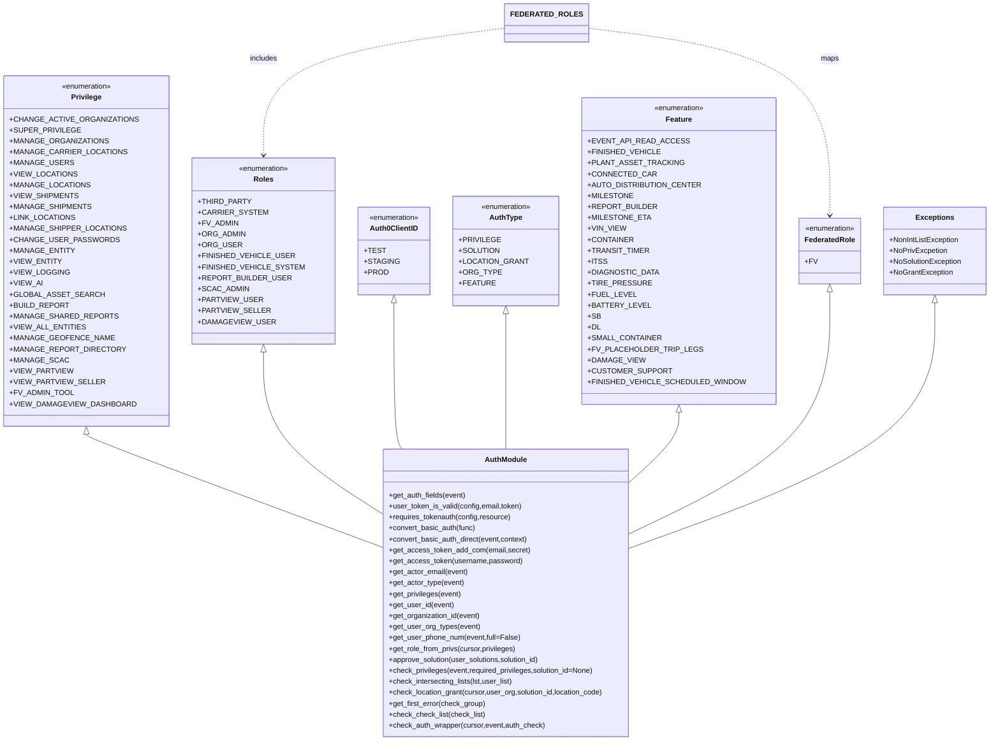

# Diagram: shipment_core/chromium_export/fv/python/fv/aws/lambdas/auth.py


> Auto-generated by Obscura crawlers

## Diagram 1



### SVG

<svg id="container" width="2027.5703125" xmlns="http://www.w3.org/2000/svg" class="classDiagram" height="1622" viewBox="0 0 2027.5703125 1622" role="graphics-document document" aria-roledescription="class"><style>#container{font-family:"trebuchet ms",verdana,arial,sans-serif;font-size:16px;fill:#333;}@keyframes edge-animation-frame{from{stroke-dashoffset:0;}}@keyframes dash{to{stroke-dashoffset:0;}}#container .edge-animation-slow{stroke-dasharray:9,5!important;stroke-dashoffset:900;animation:dash 50s linear infinite;stroke-linecap:round;}#container .edge-animation-fast{stroke-dasharray:9,5!important;stroke-dashoffset:900;animation:dash 20s linear infinite;stroke-linecap:round;}#container .error-icon{fill:#552222;}#container .error-text{fill:#552222;stroke:#552222;}#container .edge-thickness-normal{stroke-width:1px;}#container .edge-thickness-thick{stroke-width:3.5px;}#container .edge-pattern-solid{stroke-dasharray:0;}#container .edge-thickness-invisible{stroke-width:0;fill:none;}#container .edge-pattern-dashed{stroke-dasharray:3;}#container .edge-pattern-dotted{stroke-dasharray:2;}#container .marker{fill:#333333;stroke:#333333;}#container .marker.cross{stroke:#333333;}#container svg{font-family:"trebuchet ms",verdana,arial,sans-serif;font-size:16px;}#container p{margin:0;}#container g.classGroup text{fill:#9370DB;stroke:none;font-family:"trebuchet ms",verdana,arial,sans-serif;font-size:10px;}#container g.classGroup text .title{font-weight:bolder;}#container .nodeLabel,#container .edgeLabel{color:#131300;}#container .edgeLabel .label rect{fill:#ECECFF;}#container .label text{fill:#131300;}#container .labelBkg{background:#ECECFF;}#container .edgeLabel .label span{background:#ECECFF;}#container .classTitle{font-weight:bolder;}#container .node rect,#container .node circle,#container .node ellipse,#container .node polygon,#container .node path{fill:#ECECFF;stroke:#9370DB;stroke-width:1px;}#container .divider{stroke:#9370DB;stroke-width:1;}#container g.clickable{cursor:pointer;}#container g.classGroup rect{fill:#ECECFF;stroke:#9370DB;}#container g.classGroup line{stroke:#9370DB;stroke-width:1;}#container .classLabel .box{stroke:none;stroke-width:0;fill:#ECECFF;opacity:0.5;}#container .classLabel .label{fill:#9370DB;font-size:10px;}#container .relation{stroke:#333333;stroke-width:1;fill:none;}#container .dashed-line{stroke-dasharray:3;}#container .dotted-line{stroke-dasharray:1 2;}#container #compositionStart,#container .composition{fill:#333333!important;stroke:#333333!important;stroke-width:1;}#container #compositionEnd,#container .composition{fill:#333333!important;stroke:#333333!important;stroke-width:1;}#container #dependencyStart,#container .dependency{fill:#333333!important;stroke:#333333!important;stroke-width:1;}#container #dependencyStart,#container .dependency{fill:#333333!important;stroke:#333333!important;stroke-width:1;}#container #extensionStart,#container .extension{fill:transparent!important;stroke:#333333!important;stroke-width:1;}#container #extensionEnd,#container .extension{fill:transparent!important;stroke:#333333!important;stroke-width:1;}#container #aggregationStart,#container .aggregation{fill:transparent!important;stroke:#333333!important;stroke-width:1;}#container #aggregationEnd,#container .aggregation{fill:transparent!important;stroke:#333333!important;stroke-width:1;}#container #lollipopStart,#container .lollipop{fill:#ECECFF!important;stroke:#333333!important;stroke-width:1;}#container #lollipopEnd,#container .lollipop{fill:#ECECFF!important;stroke:#333333!important;stroke-width:1;}#container .edgeTerminals{font-size:11px;line-height:initial;}#container .classTitleText{text-anchor:middle;font-size:18px;fill:#333;}#container .label-icon{display:inline-block;height:1em;overflow:visible;vertical-align:-0.125em;}#container .node .label-icon path{fill:currentColor;stroke:revert;stroke-width:revert;}#container :root{--mermaid-font-family:"trebuchet ms",verdana,arial,sans-serif;}</style><g><defs><marker id="container_class-aggregationStart" class="marker aggregation class" refX="18" refY="7" markerWidth="190" markerHeight="240" orient="auto"><path d="M 18,7 L9,13 L1,7 L9,1 Z"></path></marker></defs><defs><marker id="container_class-aggregationEnd" class="marker aggregation class" refX="1" refY="7" markerWidth="20" markerHeight="28" orient="auto"><path d="M 18,7 L9,13 L1,7 L9,1 Z"></path></marker></defs><defs><marker id="container_class-extensionStart" class="marker extension class" refX="18" refY="7" markerWidth="190" markerHeight="240" orient="auto"><path d="M 1,7 L18,13 V 1 Z"></path></marker></defs><defs><marker id="container_class-extensionEnd" class="marker extension class" refX="1" refY="7" markerWidth="20" markerHeight="28" orient="auto"><path d="M 1,1 V 13 L18,7 Z"></path></marker></defs><defs><marker id="container_class-compositionStart" class="marker composition class" refX="18" refY="7" markerWidth="190" markerHeight="240" orient="auto"><path d="M 18,7 L9,13 L1,7 L9,1 Z"></path></marker></defs><defs><marker id="container_class-compositionEnd" class="marker composition class" refX="1" refY="7" markerWidth="20" markerHeight="28" orient="auto"><path d="M 18,7 L9,13 L1,7 L9,1 Z"></path></marker></defs><defs><marker id="container_class-dependencyStart" class="marker dependency class" refX="6" refY="7" markerWidth="190" markerHeight="240" orient="auto"><path d="M 5,7 L9,13 L1,7 L9,1 Z"></path></marker></defs><defs><marker id="container_class-dependencyEnd" class="marker dependency class" refX="13" refY="7" markerWidth="20" markerHeight="28" orient="auto"><path d="M 18,7 L9,13 L14,7 L9,1 Z"></path></marker></defs><defs><marker id="container_class-lollipopStart" class="marker lollipop class" refX="13" refY="7" markerWidth="190" markerHeight="240" orient="auto"><circle stroke="black" fill="transparent" cx="7" cy="7" r="6"></circle></marker></defs><defs><marker id="container_class-lollipopEnd" class="marker lollipop class" refX="1" refY="7" markerWidth="190" markerHeight="240" orient="auto"><circle stroke="black" fill="transparent" cx="7" cy="7" r="6"></circle></marker></defs><g class="root"><g class="clusters"></g><g class="edgePaths"><path d="M171.176,951.25L171.176,952.542C171.176,953.833,171.176,956.417,267.518,996.247C363.861,1036.078,556.546,1113.155,652.888,1151.694L749.23,1190.233" id="id_Privilege_AuthModule_1" class="edge-thickness-normal edge-pattern-solid relation" style=";;;" data-edge="true" data-et="edge" data-id="id_Privilege_AuthModule_1" data-points="W3sieCI6MTcxLjE3NTc4MTI1LCJ5Ijo5MzR9LHsieCI6MTcxLjE3NTc4MTI1LCJ5Ijo5NTl9LHsieCI6NzQ5LjIzMDQ2ODc1LCJ5IjoxMTkwLjIzMjUwMTQ5MzYzNDh9XQ==" marker-start="url(#container_class-extensionStart)"></path><path d="M525.441,771.25L525.441,802.542C525.441,833.833,525.441,896.417,562.74,953.291C600.038,1010.166,674.634,1061.332,711.932,1086.915L749.23,1112.498" id="id_Roles_AuthModule_2" class="edge-thickness-normal edge-pattern-solid relation" style=";;;" data-edge="true" data-et="edge" data-id="id_Roles_AuthModule_2" data-points="W3sieCI6NTI1LjQ0MTQwNjI1LCJ5Ijo3NTR9LHsieCI6NTI1LjQ0MTQwNjI1LCJ5Ijo5NTl9LHsieCI6NzQ5LjIzMDQ2ODc1LCJ5IjoxMTEyLjQ5ODA4NTA3NjIwMjl9XQ==" marker-start="url(#container_class-extensionStart)"></path><path d="M790.332,663.25L790.332,712.542C790.332,761.833,790.332,860.417,793.161,913.875C795.989,967.333,801.646,975.667,804.474,979.833L807.303,984" id="id_Auth0ClientID_AuthModule_3" class="edge-thickness-normal edge-pattern-solid relation" style=";;;" data-edge="true" data-et="edge" data-id="id_Auth0ClientID_AuthModule_3" data-points="W3sieCI6NzkwLjMzMjAzMTI1LCJ5Ijo2NDZ9LHsieCI6NzkwLjMzMjAzMTI1LCJ5Ijo5NTl9LHsieCI6ODA3LjMwMjk2NDE1NDQxMTcsInkiOjk4NH1d" marker-start="url(#container_class-extensionStart)"></path><path d="M1021.137,687.25L1021.137,732.542C1021.137,777.833,1021.137,868.417,1021.137,917.875C1021.137,967.333,1021.137,975.667,1021.137,979.833L1021.137,984" id="id_AuthType_AuthModule_4" class="edge-thickness-normal edge-pattern-solid relation" style=";;;" data-edge="true" data-et="edge" data-id="id_AuthType_AuthModule_4" data-points="W3sieCI6MTAyMS4xMzY3MTg3NSwieSI6NjcwfSx7IngiOjEwMjEuMTM2NzE4NzUsInkiOjk1OX0seyJ4IjoxMDIxLjEzNjcxODc1LCJ5Ijo5ODR9XQ==" marker-start="url(#container_class-extensionStart)"></path><path d="M1369.48,903.25L1369.48,912.542C1369.48,921.833,1369.48,940.417,1356.741,962.143C1344.001,983.869,1318.522,1008.738,1305.783,1021.172L1293.043,1033.607" id="id_Feature_AuthModule_5" class="edge-thickness-normal edge-pattern-solid relation" style=";;;" data-edge="true" data-et="edge" data-id="id_Feature_AuthModule_5" data-points="W3sieCI6MTM2OS40ODA0Njg3NSwieSI6ODg2fSx7IngiOjEzNjkuNDgwNDY4NzUsInkiOjk1OX0seyJ4IjoxMjkzLjA0Mjk2ODc1LCJ5IjoxMDMzLjYwNjYyMDYxNTQxMjN9XQ==" marker-start="url(#container_class-extensionStart)"></path><path d="M1678.375,639.25L1678.375,692.542C1678.375,745.833,1678.375,852.417,1614.153,938.931C1549.931,1025.446,1421.487,1091.892,1357.265,1125.115L1293.043,1158.338" id="id_FederatedRole_AuthModule_6" class="edge-thickness-normal edge-pattern-solid relation" style=";;;" data-edge="true" data-et="edge" data-id="id_FederatedRole_AuthModule_6" data-points="W3sieCI6MTY3OC4zNzUsInkiOjYyMn0seyJ4IjoxNjc4LjM3NSwieSI6OTU5fSx7IngiOjEyOTMuMDQyOTY4NzUsInkiOjExNTguMzM4NDk2MTkzMjMzfV0=" marker-start="url(#container_class-extensionStart)"></path><path d="M1907.75,663.25L1907.75,712.542C1907.75,761.833,1907.75,860.417,1805.299,948.996C1702.848,1037.576,1497.945,1116.153,1395.494,1155.441L1293.043,1194.729" id="id_Exceptions_AuthModule_7" class="edge-thickness-normal edge-pattern-solid relation" style=";;;" data-edge="true" data-et="edge" data-id="id_Exceptions_AuthModule_7" data-points="W3sieCI6MTkwNy43NSwieSI6NjQ2fSx7IngiOjE5MDcuNzUsInkiOjk1OX0seyJ4IjoxMjkzLjA0Mjk2ODc1LCJ5IjoxMTk0LjcyODkxOTI5ODc3MTJ9XQ==" marker-start="url(#container_class-extensionStart)"></path><path d="M1181.432,60.898L1264.256,72.248C1347.079,83.599,1512.727,106.299,1595.551,174.816C1678.375,243.333,1678.375,357.667,1678.375,414.833L1678.375,472" id="id_FEDERATED_ROLES_FederatedRole_8" class="edge-thickness-normal edge-pattern-dashed relation" style=";;;" data-edge="true" data-et="edge" data-id="id_FEDERATED_ROLES_FederatedRole_8" data-points="W3sieCI6MTE4MS40MzE2NDA2MjUsInkiOjYwLjg5ODAyODQ2Njc4NDc5NH0seyJ4IjoxNjc4LjM3NSwieSI6MTI5fSx7IngiOjE2NzguMzc1LCJ5Ijo0Nzh9XQ==" marker-end="url(#container_class-dependencyEnd)"></path><path d="M1022.385,60.898L939.561,72.248C856.737,83.599,691.089,106.299,608.265,152.816C525.441,199.333,525.441,269.667,525.441,304.833L525.441,340" id="id_FEDERATED_ROLES_Roles_9" class="edge-thickness-normal edge-pattern-dashed relation" style=";;;" data-edge="true" data-et="edge" data-id="id_FEDERATED_ROLES_Roles_9" data-points="W3sieCI6MTAyMi4zODQ3NjU2MjUsInkiOjYwLjg5ODAyODQ2Njc4NDc5NH0seyJ4Ijo1MjUuNDQxNDA2MjUsInkiOjEyOX0seyJ4Ijo1MjUuNDQxNDA2MjUsInkiOjM0Nn1d" marker-end="url(#container_class-dependencyEnd)"></path></g><g class="edgeLabels"><g class="edgeLabel"><g class="label" data-id="id_Privilege_AuthModule_1" transform="translate(0, 0)"><foreignObject width="0" height="0"><div xmlns="http://www.w3.org/1999/xhtml" class="labelBkg" style="display: table-cell; white-space: nowrap; line-height: 1.5; max-width: 200px; text-align: center;"><span class="edgeLabel"></span></div></foreignObject></g></g><g class="edgeLabel"><g class="label" data-id="id_Roles_AuthModule_2" transform="translate(0, 0)"><foreignObject width="0" height="0"><div xmlns="http://www.w3.org/1999/xhtml" class="labelBkg" style="display: table-cell; white-space: nowrap; line-height: 1.5; max-width: 200px; text-align: center;"><span class="edgeLabel"></span></div></foreignObject></g></g><g class="edgeLabel"><g class="label" data-id="id_Auth0ClientID_AuthModule_3" transform="translate(0, 0)"><foreignObject width="0" height="0"><div xmlns="http://www.w3.org/1999/xhtml" class="labelBkg" style="display: table-cell; white-space: nowrap; line-height: 1.5; max-width: 200px; text-align: center;"><span class="edgeLabel"></span></div></foreignObject></g></g><g class="edgeLabel"><g class="label" data-id="id_AuthType_AuthModule_4" transform="translate(0, 0)"><foreignObject width="0" height="0"><div xmlns="http://www.w3.org/1999/xhtml" class="labelBkg" style="display: table-cell; white-space: nowrap; line-height: 1.5; max-width: 200px; text-align: center;"><span class="edgeLabel"></span></div></foreignObject></g></g><g class="edgeLabel"><g class="label" data-id="id_Feature_AuthModule_5" transform="translate(0, 0)"><foreignObject width="0" height="0"><div xmlns="http://www.w3.org/1999/xhtml" class="labelBkg" style="display: table-cell; white-space: nowrap; line-height: 1.5; max-width: 200px; text-align: center;"><span class="edgeLabel"></span></div></foreignObject></g></g><g class="edgeLabel"><g class="label" data-id="id_FederatedRole_AuthModule_6" transform="translate(0, 0)"><foreignObject width="0" height="0"><div xmlns="http://www.w3.org/1999/xhtml" class="labelBkg" style="display: table-cell; white-space: nowrap; line-height: 1.5; max-width: 200px; text-align: center;"><span class="edgeLabel"></span></div></foreignObject></g></g><g class="edgeLabel"><g class="label" data-id="id_Exceptions_AuthModule_7" transform="translate(0, 0)"><foreignObject width="0" height="0"><div xmlns="http://www.w3.org/1999/xhtml" class="labelBkg" style="display: table-cell; white-space: nowrap; line-height: 1.5; max-width: 200px; text-align: center;"><span class="edgeLabel"></span></div></foreignObject></g></g><g class="edgeLabel" transform="translate(1678.375, 129)"><g class="label" data-id="id_FEDERATED_ROLES_FederatedRole_8" transform="translate(-19.703125, -12)"><foreignObject width="39.40625" height="24"><div xmlns="http://www.w3.org/1999/xhtml" class="labelBkg" style="display: table-cell; white-space: nowrap; line-height: 1.5; max-width: 200px; text-align: center;"><span class="edgeLabel"><p>maps</p></span></div></foreignObject></g></g><g class="edgeLabel" transform="translate(525.44140625, 129)"><g class="label" data-id="id_FEDERATED_ROLES_Roles_9" transform="translate(-30.6484375, -12)"><foreignObject width="61.296875" height="24"><div xmlns="http://www.w3.org/1999/xhtml" class="labelBkg" style="display: table-cell; white-space: nowrap; line-height: 1.5; max-width: 200px; text-align: center;"><span class="edgeLabel"><p>includes</p></span></div></foreignObject></g></g></g><g class="nodes"><g class="node default" id="classId-Privilege-0" transform="translate(171.17578125, 550)"><g class="basic label-container"><path d="M-163.17578125 -384 L163.17578125 -384 L163.17578125 384 L-163.17578125 384" stroke="none" stroke-width="0" fill="#ECECFF" style=""></path><path d="M-163.17578125 -384 C-40.03627645864313 -384, 83.10322833271374 -384, 163.17578125 -384 M-163.17578125 -384 C-40.07744124603781 -384, 83.02089875792439 -384, 163.17578125 -384 M163.17578125 -384 C163.17578125 -183.77865332158024, 163.17578125 16.442693356839527, 163.17578125 384 M163.17578125 -384 C163.17578125 -102.53833617644972, 163.17578125 178.92332764710056, 163.17578125 384 M163.17578125 384 C55.02547040035796 384, -53.12484044928408 384, -163.17578125 384 M163.17578125 384 C38.69943161456706 384, -85.77691802086588 384, -163.17578125 384 M-163.17578125 384 C-163.17578125 157.98293988481828, -163.17578125 -68.03412023036344, -163.17578125 -384 M-163.17578125 384 C-163.17578125 119.89163842108542, -163.17578125 -144.21672315782916, -163.17578125 -384" stroke="#9370DB" stroke-width="1.3" fill="none" stroke-dasharray="0 0" style=""></path></g><g class="annotation-group text" transform="translate(-55.5546875, -360)"><g class="label" style="" transform="translate(0,-12)"><foreignObject width="111.109375" height="24"><div xmlns="http://www.w3.org/1999/xhtml" style="display: table-cell; white-space: nowrap; line-height: 1.5; max-width: 161px; text-align: center;"><span class="nodeLabel markdown-node-label" style=""><p>«enumeration»</p></span></div></foreignObject></g></g><g class="label-group text" transform="translate(-31.8671875, -336)"><g class="label" style="font-weight: bolder" transform="translate(0,-12)"><foreignObject width="63.734375" height="24"><div xmlns="http://www.w3.org/1999/xhtml" style="display: table-cell; white-space: nowrap; line-height: 1.5; max-width: 112px; text-align: center;"><span class="nodeLabel markdown-node-label" style=""><p>Privilege</p></span></div></foreignObject></g></g><g class="members-group text" transform="translate(-151.17578125, -288)"><g class="label" style="" transform="translate(0,-12)"><foreignObject width="246.796875" height="24"><div xmlns="http://www.w3.org/1999/xhtml" style="display: table-cell; white-space: nowrap; line-height: 1.5; max-width: 304px; text-align: center;"><span class="nodeLabel markdown-node-label" style=""><p>+CHANGE_ACTIVE_ORGANIZATIONS</p></span></div></foreignObject></g><g class="label" style="" transform="translate(0,12)"><foreignObject width="134.828125" height="24"><div xmlns="http://www.w3.org/1999/xhtml" style="display: table-cell; white-space: nowrap; line-height: 1.5; max-width: 192px; text-align: center;"><span class="nodeLabel markdown-node-label" style=""><p>+SUPER_PRIVILEGE</p></span></div></foreignObject></g><g class="label" style="" transform="translate(0,36)"><foreignObject width="191.828125" height="24"><div xmlns="http://www.w3.org/1999/xhtml" style="display: table-cell; white-space: nowrap; line-height: 1.5; max-width: 249px; text-align: center;"><span class="nodeLabel markdown-node-label" style=""><p>+MANAGE_ORGANIZATIONS</p></span></div></foreignObject></g><g class="label" style="" transform="translate(0,60)"><foreignObject width="224.015625" height="24"><div xmlns="http://www.w3.org/1999/xhtml" style="display: table-cell; white-space: nowrap; line-height: 1.5; max-width: 282px; text-align: center;"><span class="nodeLabel markdown-node-label" style=""><p>+MANAGE_CARRIER_LOCATIONS</p></span></div></foreignObject></g><g class="label" style="" transform="translate(0,84)"><foreignObject width="122.09375" height="24"><div xmlns="http://www.w3.org/1999/xhtml" style="display: table-cell; white-space: nowrap; line-height: 1.5; max-width: 180px; text-align: center;"><span class="nodeLabel markdown-node-label" style=""><p>+MANAGE_USERS</p></span></div></foreignObject></g><g class="label" style="" transform="translate(0,108)"><foreignObject width="129.703125" height="24"><div xmlns="http://www.w3.org/1999/xhtml" style="display: table-cell; white-space: nowrap; line-height: 1.5; max-width: 187px; text-align: center;"><span class="nodeLabel markdown-node-label" style=""><p>+VIEW_LOCATIONS</p></span></div></foreignObject></g><g class="label" style="" transform="translate(0,132)"><foreignObject width="155.875" height="24"><div xmlns="http://www.w3.org/1999/xhtml" style="display: table-cell; white-space: nowrap; line-height: 1.5; max-width: 214px; text-align: center;"><span class="nodeLabel markdown-node-label" style=""><p>+MANAGE_LOCATIONS</p></span></div></foreignObject></g><g class="label" style="" transform="translate(0,156)"><foreignObject width="131.765625" height="24"><div xmlns="http://www.w3.org/1999/xhtml" style="display: table-cell; white-space: nowrap; line-height: 1.5; max-width: 189px; text-align: center;"><span class="nodeLabel markdown-node-label" style=""><p>+VIEW_SHIPMENTS</p></span></div></foreignObject></g><g class="label" style="" transform="translate(0,180)"><foreignObject width="157.9375" height="24"><div xmlns="http://www.w3.org/1999/xhtml" style="display: table-cell; white-space: nowrap; line-height: 1.5; max-width: 216px; text-align: center;"><span class="nodeLabel markdown-node-label" style=""><p>+MANAGE_SHIPMENTS</p></span></div></foreignObject></g><g class="label" style="" transform="translate(0,204)"><foreignObject width="128.71875" height="24"><div xmlns="http://www.w3.org/1999/xhtml" style="display: table-cell; white-space: nowrap; line-height: 1.5; max-width: 186px; text-align: center;"><span class="nodeLabel markdown-node-label" style=""><p>+LINK_LOCATIONS</p></span></div></foreignObject></g><g class="label" style="" transform="translate(0,228)"><foreignObject width="225.03125" height="24"><div xmlns="http://www.w3.org/1999/xhtml" style="display: table-cell; white-space: nowrap; line-height: 1.5; max-width: 283px; text-align: center;"><span class="nodeLabel markdown-node-label" style=""><p>+MANAGE_SHIPPER_LOCATIONS</p></span></div></foreignObject></g><g class="label" style="" transform="translate(0,252)"><foreignObject width="207.765625" height="24"><div xmlns="http://www.w3.org/1999/xhtml" style="display: table-cell; white-space: nowrap; line-height: 1.5; max-width: 265px; text-align: center;"><span class="nodeLabel markdown-node-label" style=""><p>+CHANGE_USER_PASSWORDS</p></span></div></foreignObject></g><g class="label" style="" transform="translate(0,276)"><foreignObject width="126.078125" height="24"><div xmlns="http://www.w3.org/1999/xhtml" style="display: table-cell; white-space: nowrap; line-height: 1.5; max-width: 184px; text-align: center;"><span class="nodeLabel markdown-node-label" style=""><p>+MANAGE_ENTITY</p></span></div></foreignObject></g><g class="label" style="" transform="translate(0,300)"><foreignObject width="99.890625" height="24"><div xmlns="http://www.w3.org/1999/xhtml" style="display: table-cell; white-space: nowrap; line-height: 1.5; max-width: 157px; text-align: center;"><span class="nodeLabel markdown-node-label" style=""><p>+VIEW_ENTITY</p></span></div></foreignObject></g><g class="label" style="" transform="translate(0,324)"><foreignObject width="114.59375" height="24"><div xmlns="http://www.w3.org/1999/xhtml" style="display: table-cell; white-space: nowrap; line-height: 1.5; max-width: 172px; text-align: center;"><span class="nodeLabel markdown-node-label" style=""><p>+VIEW_LOGGING</p></span></div></foreignObject></g><g class="label" style="" transform="translate(0,348)"><foreignObject width="64.234375" height="24"><div xmlns="http://www.w3.org/1999/xhtml" style="display: table-cell; white-space: nowrap; line-height: 1.5; max-width: 122px; text-align: center;"><span class="nodeLabel markdown-node-label" style=""><p>+VIEW_AI</p></span></div></foreignObject></g><g class="label" style="" transform="translate(0,372)"><foreignObject width="177.78125" height="24"><div xmlns="http://www.w3.org/1999/xhtml" style="display: table-cell; white-space: nowrap; line-height: 1.5; max-width: 235px; text-align: center;"><span class="nodeLabel markdown-node-label" style=""><p>+GLOBAL_ASSET_SEARCH</p></span></div></foreignObject></g><g class="label" style="" transform="translate(0,396)"><foreignObject width="115.21875" height="24"><div xmlns="http://www.w3.org/1999/xhtml" style="display: table-cell; white-space: nowrap; line-height: 1.5; max-width: 173px; text-align: center;"><span class="nodeLabel markdown-node-label" style=""><p>+BUILD_REPORT</p></span></div></foreignObject></g><g class="label" style="" transform="translate(0,420)"><foreignObject width="205.828125" height="24"><div xmlns="http://www.w3.org/1999/xhtml" style="display: table-cell; white-space: nowrap; line-height: 1.5; max-width: 263px; text-align: center;"><span class="nodeLabel markdown-node-label" style=""><p>+MANAGE_SHARED_REPORTS</p></span></div></foreignObject></g><g class="label" style="" transform="translate(0,444)"><foreignObject width="146.359375" height="24"><div xmlns="http://www.w3.org/1999/xhtml" style="display: table-cell; white-space: nowrap; line-height: 1.5; max-width: 204px; text-align: center;"><span class="nodeLabel markdown-node-label" style=""><p>+VIEW_ALL_ENTITIES</p></span></div></foreignObject></g><g class="label" style="" transform="translate(0,468)"><foreignObject width="199.703125" height="24"><div xmlns="http://www.w3.org/1999/xhtml" style="display: table-cell; white-space: nowrap; line-height: 1.5; max-width: 257px; text-align: center;"><span class="nodeLabel markdown-node-label" style=""><p>+MANAGE_GEOFENCE_NAME</p></span></div></foreignObject></g><g class="label" style="" transform="translate(0,492)"><foreignObject width="219" height="24"><div xmlns="http://www.w3.org/1999/xhtml" style="display: table-cell; white-space: nowrap; line-height: 1.5; max-width: 277px; text-align: center;"><span class="nodeLabel markdown-node-label" style=""><p>+MANAGE_REPORT_DIRECTORY</p></span></div></foreignObject></g><g class="label" style="" transform="translate(0,516)"><foreignObject width="111.84375" height="24"><div xmlns="http://www.w3.org/1999/xhtml" style="display: table-cell; white-space: nowrap; line-height: 1.5; max-width: 169px; text-align: center;"><span class="nodeLabel markdown-node-label" style=""><p>+MANAGE_SCAC</p></span></div></foreignObject></g><g class="label" style="" transform="translate(0,540)"><foreignObject width="120.875" height="24"><div xmlns="http://www.w3.org/1999/xhtml" style="display: table-cell; white-space: nowrap; line-height: 1.5; max-width: 178px; text-align: center;"><span class="nodeLabel markdown-node-label" style=""><p>+VIEW_PARTVIEW</p></span></div></foreignObject></g><g class="label" style="" transform="translate(0,564)"><foreignObject width="179.375" height="24"><div xmlns="http://www.w3.org/1999/xhtml" style="display: table-cell; white-space: nowrap; line-height: 1.5; max-width: 237px; text-align: center;"><span class="nodeLabel markdown-node-label" style=""><p>+VIEW_PARTVIEW_SELLER</p></span></div></foreignObject></g><g class="label" style="" transform="translate(0,588)"><foreignObject width="125.0625" height="24"><div xmlns="http://www.w3.org/1999/xhtml" style="display: table-cell; white-space: nowrap; line-height: 1.5; max-width: 182px; text-align: center;"><span class="nodeLabel markdown-node-label" style=""><p>+FV_ADMIN_TOOL</p></span></div></foreignObject></g><g class="label" style="" transform="translate(0,612)"><foreignObject width="241.21875" height="24"><div xmlns="http://www.w3.org/1999/xhtml" style="display: table-cell; white-space: nowrap; line-height: 1.5; max-width: 299px; text-align: center;"><span class="nodeLabel markdown-node-label" style=""><p>+VIEW_DAMAGEVIEW_DASHBOARD</p></span></div></foreignObject></g></g><g class="methods-group text" transform="translate(-151.17578125, 384)"></g><g class="divider" style=""><path d="M-163.17578125 -312 C-55.85585863879382 -312, 51.46406397241236 -312, 163.17578125 -312 M-163.17578125 -312 C-71.32562886469962 -312, 20.524523520600752 -312, 163.17578125 -312" stroke="#9370DB" stroke-width="1.3" fill="none" stroke-dasharray="0 0" style=""></path></g><g class="divider" style=""><path d="M-163.17578125 360 C-85.13456945424764 360, -7.093357658495279 360, 163.17578125 360 M-163.17578125 360 C-73.80029891507428 360, 15.575183419851442 360, 163.17578125 360" stroke="#9370DB" stroke-width="1.3" fill="none" stroke-dasharray="0 0" style=""></path></g></g><g class="node default" id="classId-Roles-1" transform="translate(525.44140625, 550)"><g class="basic label-container"><path d="M-141.08984375 -204 L141.08984375 -204 L141.08984375 204 L-141.08984375 204" stroke="none" stroke-width="0" fill="#ECECFF" style=""></path><path d="M-141.08984375 -204 C-31.853743042450773 -204, 77.38235766509845 -204, 141.08984375 -204 M-141.08984375 -204 C-62.45240483688001 -204, 16.185034076239987 -204, 141.08984375 -204 M141.08984375 -204 C141.08984375 -86.10964947035797, 141.08984375 31.78070105928407, 141.08984375 204 M141.08984375 -204 C141.08984375 -103.1088530381373, 141.08984375 -2.2177060762745953, 141.08984375 204 M141.08984375 204 C74.82976101728646 204, 8.569678284572916 204, -141.08984375 204 M141.08984375 204 C63.53890698311193 204, -14.012029783776143 204, -141.08984375 204 M-141.08984375 204 C-141.08984375 95.69277855810064, -141.08984375 -12.614442883798716, -141.08984375 -204 M-141.08984375 204 C-141.08984375 53.249806082913864, -141.08984375 -97.50038783417227, -141.08984375 -204" stroke="#9370DB" stroke-width="1.3" fill="none" stroke-dasharray="0 0" style=""></path></g><g class="annotation-group text" transform="translate(-55.5546875, -180)"><g class="label" style="" transform="translate(0,-12)"><foreignObject width="111.109375" height="24"><div xmlns="http://www.w3.org/1999/xhtml" style="display: table-cell; white-space: nowrap; line-height: 1.5; max-width: 161px; text-align: center;"><span class="nodeLabel markdown-node-label" style=""><p>«enumeration»</p></span></div></foreignObject></g></g><g class="label-group text" transform="translate(-20.109375, -156)"><g class="label" style="font-weight: bolder" transform="translate(0,-12)"><foreignObject width="40.21875" height="24"><div xmlns="http://www.w3.org/1999/xhtml" style="display: table-cell; white-space: nowrap; line-height: 1.5; max-width: 90px; text-align: center;"><span class="nodeLabel markdown-node-label" style=""><p>Roles</p></span></div></foreignObject></g></g><g class="members-group text" transform="translate(-129.08984375, -108)"><g class="label" style="" transform="translate(0,-12)"><foreignObject width="102.65625" height="24"><div xmlns="http://www.w3.org/1999/xhtml" style="display: table-cell; white-space: nowrap; line-height: 1.5; max-width: 160px; text-align: center;"><span class="nodeLabel markdown-node-label" style=""><p>+THIRD_PARTY</p></span></div></foreignObject></g><g class="label" style="" transform="translate(0,12)"><foreignObject width="130.96875" height="24"><div xmlns="http://www.w3.org/1999/xhtml" style="display: table-cell; white-space: nowrap; line-height: 1.5; max-width: 188px; text-align: center;"><span class="nodeLabel markdown-node-label" style=""><p>+CARRIER_SYSTEM</p></span></div></foreignObject></g><g class="label" style="" transform="translate(0,36)"><foreignObject width="79.71875" height="24"><div xmlns="http://www.w3.org/1999/xhtml" style="display: table-cell; white-space: nowrap; line-height: 1.5; max-width: 137px; text-align: center;"><span class="nodeLabel markdown-node-label" style=""><p>+FV_ADMIN</p></span></div></foreignObject></g><g class="label" style="" transform="translate(0,60)"><foreignObject width="94.46875" height="24"><div xmlns="http://www.w3.org/1999/xhtml" style="display: table-cell; white-space: nowrap; line-height: 1.5; max-width: 152px; text-align: center;"><span class="nodeLabel markdown-node-label" style=""><p>+ORG_ADMIN</p></span></div></foreignObject></g><g class="label" style="" transform="translate(0,84)"><foreignObject width="83.96875" height="24"><div xmlns="http://www.w3.org/1999/xhtml" style="display: table-cell; white-space: nowrap; line-height: 1.5; max-width: 142px; text-align: center;"><span class="nodeLabel markdown-node-label" style=""><p>+ORG_USER</p></span></div></foreignObject></g><g class="label" style="" transform="translate(0,108)"><foreignObject width="185.390625" height="24"><div xmlns="http://www.w3.org/1999/xhtml" style="display: table-cell; white-space: nowrap; line-height: 1.5; max-width: 243px; text-align: center;"><span class="nodeLabel markdown-node-label" style=""><p>+FINISHED_VEHICLE_USER</p></span></div></foreignObject></g><g class="label" style="" transform="translate(0,132)"><foreignObject width="202.625" height="24"><div xmlns="http://www.w3.org/1999/xhtml" style="display: table-cell; white-space: nowrap; line-height: 1.5; max-width: 260px; text-align: center;"><span class="nodeLabel markdown-node-label" style=""><p>+FINISHED_VEHICLE_SYSTEM</p></span></div></foreignObject></g><g class="label" style="" transform="translate(0,156)"><foreignObject width="178.578125" height="24"><div xmlns="http://www.w3.org/1999/xhtml" style="display: table-cell; white-space: nowrap; line-height: 1.5; max-width: 236px; text-align: center;"><span class="nodeLabel markdown-node-label" style=""><p>+REPORT_BUILDER_USER</p></span></div></foreignObject></g><g class="label" style="" transform="translate(0,180)"><foreignObject width="98.78125" height="24"><div xmlns="http://www.w3.org/1999/xhtml" style="display: table-cell; white-space: nowrap; line-height: 1.5; max-width: 156px; text-align: center;"><span class="nodeLabel markdown-node-label" style=""><p>+SCAC_ADMIN</p></span></div></foreignObject></g><g class="label" style="" transform="translate(0,204)"><foreignObject width="122.84375" height="24"><div xmlns="http://www.w3.org/1999/xhtml" style="display: table-cell; white-space: nowrap; line-height: 1.5; max-width: 181px; text-align: center;"><span class="nodeLabel markdown-node-label" style=""><p>+PARTVIEW_USER</p></span></div></foreignObject></g><g class="label" style="" transform="translate(0,228)"><foreignObject width="137.015625" height="24"><div xmlns="http://www.w3.org/1999/xhtml" style="display: table-cell; white-space: nowrap; line-height: 1.5; max-width: 195px; text-align: center;"><span class="nodeLabel markdown-node-label" style=""><p>+PARTVIEW_SELLER</p></span></div></foreignObject></g><g class="label" style="" transform="translate(0,252)"><foreignObject width="147.125" height="24"><div xmlns="http://www.w3.org/1999/xhtml" style="display: table-cell; white-space: nowrap; line-height: 1.5; max-width: 205px; text-align: center;"><span class="nodeLabel markdown-node-label" style=""><p>+DAMAGEVIEW_USER</p></span></div></foreignObject></g></g><g class="methods-group text" transform="translate(-129.08984375, 204)"></g><g class="divider" style=""><path d="M-141.08984375 -132 C-81.74895977081903 -132, -22.40807579163804 -132, 141.08984375 -132 M-141.08984375 -132 C-68.38156192206563 -132, 4.326719905868742 -132, 141.08984375 -132" stroke="#9370DB" stroke-width="1.3" fill="none" stroke-dasharray="0 0" style=""></path></g><g class="divider" style=""><path d="M-141.08984375 180 C-33.86478410009748 180, 73.36027554980504 180, 141.08984375 180 M-141.08984375 180 C-56.66578246289892 180, 27.758278824202165 180, 141.08984375 180" stroke="#9370DB" stroke-width="1.3" fill="none" stroke-dasharray="0 0" style=""></path></g></g><g class="node default" id="classId-Auth0ClientID-2" transform="translate(790.33203125, 550)"><g class="basic label-container"><path d="M-73.80078125 -96 L73.80078125 -96 L73.80078125 96 L-73.80078125 96" stroke="none" stroke-width="0" fill="#ECECFF" style=""></path><path d="M-73.80078125 -96 C-36.04256906365188 -96, 1.7156431226962354 -96, 73.80078125 -96 M-73.80078125 -96 C-26.477808584587827 -96, 20.845164080824347 -96, 73.80078125 -96 M73.80078125 -96 C73.80078125 -39.380637435608776, 73.80078125 17.23872512878245, 73.80078125 96 M73.80078125 -96 C73.80078125 -49.545154242897965, 73.80078125 -3.09030848579593, 73.80078125 96 M73.80078125 96 C37.38074406039413 96, 0.9607068707882576 96, -73.80078125 96 M73.80078125 96 C23.69466585635336 96, -26.41144953729328 96, -73.80078125 96 M-73.80078125 96 C-73.80078125 26.331293942335094, -73.80078125 -43.33741211532981, -73.80078125 -96 M-73.80078125 96 C-73.80078125 44.6836875408269, -73.80078125 -6.632624918346195, -73.80078125 -96" stroke="#9370DB" stroke-width="1.3" fill="none" stroke-dasharray="0 0" style=""></path></g><g class="annotation-group text" transform="translate(-55.5546875, -72)"><g class="label" style="" transform="translate(0,-12)"><foreignObject width="111.109375" height="24"><div xmlns="http://www.w3.org/1999/xhtml" style="display: table-cell; white-space: nowrap; line-height: 1.5; max-width: 161px; text-align: center;"><span class="nodeLabel markdown-node-label" style=""><p>«enumeration»</p></span></div></foreignObject></g></g><g class="label-group text" transform="translate(-50.5078125, -48)"><g class="label" style="font-weight: bolder" transform="translate(0,-12)"><foreignObject width="101.015625" height="24"><div xmlns="http://www.w3.org/1999/xhtml" style="display: table-cell; white-space: nowrap; line-height: 1.5; max-width: 149px; text-align: center;"><span class="nodeLabel markdown-node-label" style=""><p>Auth0ClientID</p></span></div></foreignObject></g></g><g class="members-group text" transform="translate(-61.80078125, 0)"><g class="label" style="" transform="translate(0,-12)"><foreignObject width="40.5" height="24"><div xmlns="http://www.w3.org/1999/xhtml" style="display: table-cell; white-space: nowrap; line-height: 1.5; max-width: 99px; text-align: center;"><span class="nodeLabel markdown-node-label" style=""><p>+TEST</p></span></div></foreignObject></g><g class="label" style="" transform="translate(0,12)"><foreignObject width="68.046875" height="24"><div xmlns="http://www.w3.org/1999/xhtml" style="display: table-cell; white-space: nowrap; line-height: 1.5; max-width: 125px; text-align: center;"><span class="nodeLabel markdown-node-label" style=""><p>+STAGING</p></span></div></foreignObject></g><g class="label" style="" transform="translate(0,36)"><foreignObject width="48.203125" height="24"><div xmlns="http://www.w3.org/1999/xhtml" style="display: table-cell; white-space: nowrap; line-height: 1.5; max-width: 106px; text-align: center;"><span class="nodeLabel markdown-node-label" style=""><p>+PROD</p></span></div></foreignObject></g></g><g class="methods-group text" transform="translate(-61.80078125, 96)"></g><g class="divider" style=""><path d="M-73.80078125 -24 C-25.0105418974044 -24, 23.779697455191197 -24, 73.80078125 -24 M-73.80078125 -24 C-31.554387609527026 -24, 10.692006030945947 -24, 73.80078125 -24" stroke="#9370DB" stroke-width="1.3" fill="none" stroke-dasharray="0 0" style=""></path></g><g class="divider" style=""><path d="M-73.80078125 72 C-31.44865385684993 72, 10.90347353630014 72, 73.80078125 72 M-73.80078125 72 C-29.427634045569974 72, 14.945513158860052 72, 73.80078125 72" stroke="#9370DB" stroke-width="1.3" fill="none" stroke-dasharray="0 0" style=""></path></g></g><g class="node default" id="classId-AuthType-3" transform="translate(1021.13671875, 550)"><g class="basic label-container"><path d="M-107.00390625 -120 L107.00390625 -120 L107.00390625 120 L-107.00390625 120" stroke="none" stroke-width="0" fill="#ECECFF" style=""></path><path d="M-107.00390625 -120 C-32.801228781802536 -120, 41.40144868639493 -120, 107.00390625 -120 M-107.00390625 -120 C-22.904390808082596 -120, 61.19512463383481 -120, 107.00390625 -120 M107.00390625 -120 C107.00390625 -63.85080012866881, 107.00390625 -7.701600257337617, 107.00390625 120 M107.00390625 -120 C107.00390625 -41.250773559241665, 107.00390625 37.49845288151667, 107.00390625 120 M107.00390625 120 C29.41128363002464 120, -48.18133898995072 120, -107.00390625 120 M107.00390625 120 C56.741066953655825 120, 6.478227657311649 120, -107.00390625 120 M-107.00390625 120 C-107.00390625 56.17595066878656, -107.00390625 -7.648098662426875, -107.00390625 -120 M-107.00390625 120 C-107.00390625 34.171562277029025, -107.00390625 -51.65687544594195, -107.00390625 -120" stroke="#9370DB" stroke-width="1.3" fill="none" stroke-dasharray="0 0" style=""></path></g><g class="annotation-group text" transform="translate(-55.5546875, -96)"><g class="label" style="" transform="translate(0,-12)"><foreignObject width="111.109375" height="24"><div xmlns="http://www.w3.org/1999/xhtml" style="display: table-cell; white-space: nowrap; line-height: 1.5; max-width: 161px; text-align: center;"><span class="nodeLabel markdown-node-label" style=""><p>«enumeration»</p></span></div></foreignObject></g></g><g class="label-group text" transform="translate(-34.34375, -72)"><g class="label" style="font-weight: bolder" transform="translate(0,-12)"><foreignObject width="68.6875" height="24"><div xmlns="http://www.w3.org/1999/xhtml" style="display: table-cell; white-space: nowrap; line-height: 1.5; max-width: 117px; text-align: center;"><span class="nodeLabel markdown-node-label" style=""><p>AuthType</p></span></div></foreignObject></g></g><g class="members-group text" transform="translate(-95.00390625, -24)"><g class="label" style="" transform="translate(0,-12)"><foreignObject width="80.296875" height="24"><div xmlns="http://www.w3.org/1999/xhtml" style="display: table-cell; white-space: nowrap; line-height: 1.5; max-width: 138px; text-align: center;"><span class="nodeLabel markdown-node-label" style=""><p>+PRIVILEGE</p></span></div></foreignObject></g><g class="label" style="" transform="translate(0,12)"><foreignObject width="80.296875" height="24"><div xmlns="http://www.w3.org/1999/xhtml" style="display: table-cell; white-space: nowrap; line-height: 1.5; max-width: 138px; text-align: center;"><span class="nodeLabel markdown-node-label" style=""><p>+SOLUTION</p></span></div></foreignObject></g><g class="label" style="" transform="translate(0,36)"><foreignObject width="134.453125" height="24"><div xmlns="http://www.w3.org/1999/xhtml" style="display: table-cell; white-space: nowrap; line-height: 1.5; max-width: 193px; text-align: center;"><span class="nodeLabel markdown-node-label" style=""><p>+LOCATION_GRANT</p></span></div></foreignObject></g><g class="label" style="" transform="translate(0,60)"><foreignObject width="81.140625" height="24"><div xmlns="http://www.w3.org/1999/xhtml" style="display: table-cell; white-space: nowrap; line-height: 1.5; max-width: 139px; text-align: center;"><span class="nodeLabel markdown-node-label" style=""><p>+ORG_TYPE</p></span></div></foreignObject></g><g class="label" style="" transform="translate(0,84)"><foreignObject width="69.875" height="24"><div xmlns="http://www.w3.org/1999/xhtml" style="display: table-cell; white-space: nowrap; line-height: 1.5; max-width: 127px; text-align: center;"><span class="nodeLabel markdown-node-label" style=""><p>+FEATURE</p></span></div></foreignObject></g></g><g class="methods-group text" transform="translate(-95.00390625, 120)"></g><g class="divider" style=""><path d="M-107.00390625 -48 C-30.180885365529036 -48, 46.64213551894193 -48, 107.00390625 -48 M-107.00390625 -48 C-27.36649239690786 -48, 52.27092145618428 -48, 107.00390625 -48" stroke="#9370DB" stroke-width="1.3" fill="none" stroke-dasharray="0 0" style=""></path></g><g class="divider" style=""><path d="M-107.00390625 96 C-52.256151979844134 96, 2.4916022903117323 96, 107.00390625 96 M-107.00390625 96 C-28.742023685302428 96, 49.519858879395144 96, 107.00390625 96" stroke="#9370DB" stroke-width="1.3" fill="none" stroke-dasharray="0 0" style=""></path></g></g><g class="node default" id="classId-Feature-4" transform="translate(1369.48046875, 550)"><g class="basic label-container"><path d="M-191.33984375 -336 L191.33984375 -336 L191.33984375 336 L-191.33984375 336" stroke="none" stroke-width="0" fill="#ECECFF" style=""></path><path d="M-191.33984375 -336 C-57.929346925083365 -336, 75.48114989983327 -336, 191.33984375 -336 M-191.33984375 -336 C-45.686583094932416 -336, 99.96667756013517 -336, 191.33984375 -336 M191.33984375 -336 C191.33984375 -127.77391075085785, 191.33984375 80.4521784982843, 191.33984375 336 M191.33984375 -336 C191.33984375 -144.571927907018, 191.33984375 46.85614418596401, 191.33984375 336 M191.33984375 336 C52.61655391472314 336, -86.10673592055372 336, -191.33984375 336 M191.33984375 336 C113.79099051014049 336, 36.24213727028098 336, -191.33984375 336 M-191.33984375 336 C-191.33984375 143.85608452909636, -191.33984375 -48.28783094180727, -191.33984375 -336 M-191.33984375 336 C-191.33984375 73.44111877109407, -191.33984375 -189.11776245781186, -191.33984375 -336" stroke="#9370DB" stroke-width="1.3" fill="none" stroke-dasharray="0 0" style=""></path></g><g class="annotation-group text" transform="translate(-55.5546875, -312)"><g class="label" style="" transform="translate(0,-12)"><foreignObject width="111.109375" height="24"><div xmlns="http://www.w3.org/1999/xhtml" style="display: table-cell; white-space: nowrap; line-height: 1.5; max-width: 161px; text-align: center;"><span class="nodeLabel markdown-node-label" style=""><p>«enumeration»</p></span></div></foreignObject></g></g><g class="label-group text" transform="translate(-27.390625, -288)"><g class="label" style="font-weight: bolder" transform="translate(0,-12)"><foreignObject width="54.78125" height="24"><div xmlns="http://www.w3.org/1999/xhtml" style="display: table-cell; white-space: nowrap; line-height: 1.5; max-width: 104px; text-align: center;"><span class="nodeLabel markdown-node-label" style=""><p>Feature</p></span></div></foreignObject></g></g><g class="members-group text" transform="translate(-179.33984375, -240)"><g class="label" style="" transform="translate(0,-12)"><foreignObject width="189.875" height="24"><div xmlns="http://www.w3.org/1999/xhtml" style="display: table-cell; white-space: nowrap; line-height: 1.5; max-width: 248px; text-align: center;"><span class="nodeLabel markdown-node-label" style=""><p>+EVENT_API_READ_ACCESS</p></span></div></foreignObject></g><g class="label" style="" transform="translate(0,12)"><foreignObject width="140.109375" height="24"><div xmlns="http://www.w3.org/1999/xhtml" style="display: table-cell; white-space: nowrap; line-height: 1.5; max-width: 197px; text-align: center;"><span class="nodeLabel markdown-node-label" style=""><p>+FINISHED_VEHICLE</p></span></div></foreignObject></g><g class="label" style="" transform="translate(0,36)"><foreignObject width="182.203125" height="24"><div xmlns="http://www.w3.org/1999/xhtml" style="display: table-cell; white-space: nowrap; line-height: 1.5; max-width: 240px; text-align: center;"><span class="nodeLabel markdown-node-label" style=""><p>+PLANT_ASSET_TRACKING</p></span></div></foreignObject></g><g class="label" style="" transform="translate(0,60)"><foreignObject width="128.71875" height="24"><div xmlns="http://www.w3.org/1999/xhtml" style="display: table-cell; white-space: nowrap; line-height: 1.5; max-width: 186px; text-align: center;"><span class="nodeLabel markdown-node-label" style=""><p>+CONNECTED_CAR</p></span></div></foreignObject></g><g class="label" style="" transform="translate(0,84)"><foreignObject width="217.90625" height="24"><div xmlns="http://www.w3.org/1999/xhtml" style="display: table-cell; white-space: nowrap; line-height: 1.5; max-width: 276px; text-align: center;"><span class="nodeLabel markdown-node-label" style=""><p>+AUTO_DISTRIBUTION_CENTER</p></span></div></foreignObject></g><g class="label" style="" transform="translate(0,108)"><foreignObject width="88.171875" height="24"><div xmlns="http://www.w3.org/1999/xhtml" style="display: table-cell; white-space: nowrap; line-height: 1.5; max-width: 146px; text-align: center;"><span class="nodeLabel markdown-node-label" style=""><p>+MILESTONE</p></span></div></foreignObject></g><g class="label" style="" transform="translate(0,132)"><foreignObject width="133.296875" height="24"><div xmlns="http://www.w3.org/1999/xhtml" style="display: table-cell; white-space: nowrap; line-height: 1.5; max-width: 191px; text-align: center;"><span class="nodeLabel markdown-node-label" style=""><p>+REPORT_BUILDER</p></span></div></foreignObject></g><g class="label" style="" transform="translate(0,156)"><foreignObject width="121.6875" height="24"><div xmlns="http://www.w3.org/1999/xhtml" style="display: table-cell; white-space: nowrap; line-height: 1.5; max-width: 180px; text-align: center;"><span class="nodeLabel markdown-node-label" style=""><p>+MILESTONE_ETA</p></span></div></foreignObject></g><g class="label" style="" transform="translate(0,180)"><foreignObject width="75.046875" height="24"><div xmlns="http://www.w3.org/1999/xhtml" style="display: table-cell; white-space: nowrap; line-height: 1.5; max-width: 132px; text-align: center;"><span class="nodeLabel markdown-node-label" style=""><p>+VIN_VIEW</p></span></div></foreignObject></g><g class="label" style="" transform="translate(0,204)"><foreignObject width="89.15625" height="24"><div xmlns="http://www.w3.org/1999/xhtml" style="display: table-cell; white-space: nowrap; line-height: 1.5; max-width: 147px; text-align: center;"><span class="nodeLabel markdown-node-label" style=""><p>+CONTAINER</p></span></div></foreignObject></g><g class="label" style="" transform="translate(0,228)"><foreignObject width="117.359375" height="24"><div xmlns="http://www.w3.org/1999/xhtml" style="display: table-cell; white-space: nowrap; line-height: 1.5; max-width: 175px; text-align: center;"><span class="nodeLabel markdown-node-label" style=""><p>+TRANSIT_TIMER</p></span></div></foreignObject></g><g class="label" style="" transform="translate(0,252)"><foreignObject width="37.90625" height="24"><div xmlns="http://www.w3.org/1999/xhtml" style="display: table-cell; white-space: nowrap; line-height: 1.5; max-width: 96px; text-align: center;"><span class="nodeLabel markdown-node-label" style=""><p>+ITSS</p></span></div></foreignObject></g><g class="label" style="" transform="translate(0,276)"><foreignObject width="137.90625" height="24"><div xmlns="http://www.w3.org/1999/xhtml" style="display: table-cell; white-space: nowrap; line-height: 1.5; max-width: 196px; text-align: center;"><span class="nodeLabel markdown-node-label" style=""><p>+DIAGNOSTIC_DATA</p></span></div></foreignObject></g><g class="label" style="" transform="translate(0,300)"><foreignObject width="120.203125" height="24"><div xmlns="http://www.w3.org/1999/xhtml" style="display: table-cell; white-space: nowrap; line-height: 1.5; max-width: 178px; text-align: center;"><span class="nodeLabel markdown-node-label" style=""><p>+TIRE_PRESSURE</p></span></div></foreignObject></g><g class="label" style="" transform="translate(0,324)"><foreignObject width="93.234375" height="24"><div xmlns="http://www.w3.org/1999/xhtml" style="display: table-cell; white-space: nowrap; line-height: 1.5; max-width: 151px; text-align: center;"><span class="nodeLabel markdown-node-label" style=""><p>+FUEL_LEVEL</p></span></div></foreignObject></g><g class="label" style="" transform="translate(0,348)"><foreignObject width="118.171875" height="24"><div xmlns="http://www.w3.org/1999/xhtml" style="display: table-cell; white-space: nowrap; line-height: 1.5; max-width: 176px; text-align: center;"><span class="nodeLabel markdown-node-label" style=""><p>+BATTERY_LEVEL</p></span></div></foreignObject></g><g class="label" style="" transform="translate(0,372)"><foreignObject width="25.796875" height="24"><div xmlns="http://www.w3.org/1999/xhtml" style="display: table-cell; white-space: nowrap; line-height: 1.5; max-width: 83px; text-align: center;"><span class="nodeLabel markdown-node-label" style=""><p>+SB</p></span></div></foreignObject></g><g class="label" style="" transform="translate(0,396)"><foreignObject width="26.265625" height="24"><div xmlns="http://www.w3.org/1999/xhtml" style="display: table-cell; white-space: nowrap; line-height: 1.5; max-width: 84px; text-align: center;"><span class="nodeLabel markdown-node-label" style=""><p>+DL</p></span></div></foreignObject></g><g class="label" style="" transform="translate(0,420)"><foreignObject width="142.3125" height="24"><div xmlns="http://www.w3.org/1999/xhtml" style="display: table-cell; white-space: nowrap; line-height: 1.5; max-width: 200px; text-align: center;"><span class="nodeLabel markdown-node-label" style=""><p>+SMALL_CONTAINER</p></span></div></foreignObject></g><g class="label" style="" transform="translate(0,444)"><foreignObject width="215.875" height="24"><div xmlns="http://www.w3.org/1999/xhtml" style="display: table-cell; white-space: nowrap; line-height: 1.5; max-width: 274px; text-align: center;"><span class="nodeLabel markdown-node-label" style=""><p>+FV_PLACEHOLDER_TRIP_LEGS</p></span></div></foreignObject></g><g class="label" style="" transform="translate(0,468)"><foreignObject width="110.328125" height="24"><div xmlns="http://www.w3.org/1999/xhtml" style="display: table-cell; white-space: nowrap; line-height: 1.5; max-width: 168px; text-align: center;"><span class="nodeLabel markdown-node-label" style=""><p>+DAMAGE_VIEW</p></span></div></foreignObject></g><g class="label" style="" transform="translate(0,492)"><foreignObject width="159.609375" height="24"><div xmlns="http://www.w3.org/1999/xhtml" style="display: table-cell; white-space: nowrap; line-height: 1.5; max-width: 218px; text-align: center;"><span class="nodeLabel markdown-node-label" style=""><p>+CUSTOMER_SUPPORT</p></span></div></foreignObject></g><g class="label" style="" transform="translate(0,516)"><foreignObject width="303.125" height="24"><div xmlns="http://www.w3.org/1999/xhtml" style="display: table-cell; white-space: nowrap; line-height: 1.5; max-width: 360px; text-align: center;"><span class="nodeLabel markdown-node-label" style=""><p>+FINISHED_VEHICLE_SCHEDULED_WINDOW</p></span></div></foreignObject></g></g><g class="methods-group text" transform="translate(-179.33984375, 336)"></g><g class="divider" style=""><path d="M-191.33984375 -264 C-48.71952817110292 -264, 93.90078740779416 -264, 191.33984375 -264 M-191.33984375 -264 C-101.43742222037876 -264, -11.535000690757528 -264, 191.33984375 -264" stroke="#9370DB" stroke-width="1.3" fill="none" stroke-dasharray="0 0" style=""></path></g><g class="divider" style=""><path d="M-191.33984375 312 C-70.62611827805979 312, 50.087607193880416 312, 191.33984375 312 M-191.33984375 312 C-92.08773881422016 312, 7.164366121559681 312, 191.33984375 312" stroke="#9370DB" stroke-width="1.3" fill="none" stroke-dasharray="0 0" style=""></path></g></g><g class="node default" id="classId-FederatedRole-5" transform="translate(1678.375, 550)"><g class="basic label-container"><path d="M-67.5546875 -72 L67.5546875 -72 L67.5546875 72 L-67.5546875 72" stroke="none" stroke-width="0" fill="#ECECFF" style=""></path><path d="M-67.5546875 -72 C-34.52234840606528 -72, -1.490009312130553 -72, 67.5546875 -72 M-67.5546875 -72 C-30.816357978050654 -72, 5.921971543898692 -72, 67.5546875 -72 M67.5546875 -72 C67.5546875 -15.925861683669623, 67.5546875 40.14827663266075, 67.5546875 72 M67.5546875 -72 C67.5546875 -41.7558965928863, 67.5546875 -11.511793185772596, 67.5546875 72 M67.5546875 72 C21.666727069423388 72, -24.221233361153224 72, -67.5546875 72 M67.5546875 72 C16.380991968680988 72, -34.792703562638025 72, -67.5546875 72 M-67.5546875 72 C-67.5546875 36.550693211853414, -67.5546875 1.1013864237068276, -67.5546875 -72 M-67.5546875 72 C-67.5546875 34.16319371763282, -67.5546875 -3.6736125647343556, -67.5546875 -72" stroke="#9370DB" stroke-width="1.3" fill="none" stroke-dasharray="0 0" style=""></path></g><g class="annotation-group text" transform="translate(-55.5546875, -48)"><g class="label" style="" transform="translate(0,-12)"><foreignObject width="111.109375" height="24"><div xmlns="http://www.w3.org/1999/xhtml" style="display: table-cell; white-space: nowrap; line-height: 1.5; max-width: 161px; text-align: center;"><span class="nodeLabel markdown-node-label" style=""><p>«enumeration»</p></span></div></foreignObject></g></g><g class="label-group text" transform="translate(-52.9609375, -24)"><g class="label" style="font-weight: bolder" transform="translate(0,-12)"><foreignObject width="105.921875" height="24"><div xmlns="http://www.w3.org/1999/xhtml" style="display: table-cell; white-space: nowrap; line-height: 1.5; max-width: 155px; text-align: center;"><span class="nodeLabel markdown-node-label" style=""><p>FederatedRole</p></span></div></foreignObject></g></g><g class="members-group text" transform="translate(-55.5546875, 24)"><g class="label" style="" transform="translate(0,-12)"><foreignObject width="24.75" height="24"><div xmlns="http://www.w3.org/1999/xhtml" style="display: table-cell; white-space: nowrap; line-height: 1.5; max-width: 82px; text-align: center;"><span class="nodeLabel markdown-node-label" style=""><p>+FV</p></span></div></foreignObject></g></g><g class="methods-group text" transform="translate(-55.5546875, 72)"></g><g class="divider" style=""><path d="M-67.5546875 0 C-35.48452297443431 0, -3.414358448868626 0, 67.5546875 0 M-67.5546875 0 C-26.759834565547578 0, 14.035018368904844 0, 67.5546875 0" stroke="#9370DB" stroke-width="1.3" fill="none" stroke-dasharray="0 0" style=""></path></g><g class="divider" style=""><path d="M-67.5546875 48 C-34.89551915675201 48, -2.2363508135040178 48, 67.5546875 48 M-67.5546875 48 C-31.677513297376912 48, 4.199660905246176 48, 67.5546875 48" stroke="#9370DB" stroke-width="1.3" fill="none" stroke-dasharray="0 0" style=""></path></g></g><g class="node default" id="classId-Exceptions-6" transform="translate(1907.75, 550)"><g class="basic label-container"><path d="M-111.8203125 -96 L111.8203125 -96 L111.8203125 96 L-111.8203125 96" stroke="none" stroke-width="0" fill="#ECECFF" style=""></path><path d="M-111.8203125 -96 C-34.58923224314212 -96, 42.64184801371576 -96, 111.8203125 -96 M-111.8203125 -96 C-44.96165069039796 -96, 21.89701111920408 -96, 111.8203125 -96 M111.8203125 -96 C111.8203125 -40.93036118056075, 111.8203125 14.139277638878497, 111.8203125 96 M111.8203125 -96 C111.8203125 -19.963648612542357, 111.8203125 56.072702774915285, 111.8203125 96 M111.8203125 96 C23.806669184996267 96, -64.20697413000747 96, -111.8203125 96 M111.8203125 96 C40.04970772407363 96, -31.720897051852745 96, -111.8203125 96 M-111.8203125 96 C-111.8203125 54.49203089971447, -111.8203125 12.984061799428943, -111.8203125 -96 M-111.8203125 96 C-111.8203125 49.63755068843221, -111.8203125 3.275101376864427, -111.8203125 -96" stroke="#9370DB" stroke-width="1.3" fill="none" stroke-dasharray="0 0" style=""></path></g><g class="annotation-group text" transform="translate(0, -72)"></g><g class="label-group text" transform="translate(-39.5625, -72)"><g class="label" style="font-weight: bolder" transform="translate(0,-12)"><foreignObject width="79.125" height="24"><div xmlns="http://www.w3.org/1999/xhtml" style="display: table-cell; white-space: nowrap; line-height: 1.5; max-width: 128px; text-align: center;"><span class="nodeLabel markdown-node-label" style=""><p>Exceptions</p></span></div></foreignObject></g></g><g class="members-group text" transform="translate(-99.8203125, -24)"><g class="label" style="" transform="translate(0,-12)"><foreignObject width="153.96875" height="24"><div xmlns="http://www.w3.org/1999/xhtml" style="display: table-cell; white-space: nowrap; line-height: 1.5; max-width: 211px; text-align: center;"><span class="nodeLabel markdown-node-label" style=""><p>+NonIntListException</p></span></div></foreignObject></g><g class="label" style="" transform="translate(0,12)"><foreignObject width="126.859375" height="24"><div xmlns="http://www.w3.org/1999/xhtml" style="display: table-cell; white-space: nowrap; line-height: 1.5; max-width: 184px; text-align: center;"><span class="nodeLabel markdown-node-label" style=""><p>+NoPrivExcpetion</p></span></div></foreignObject></g><g class="label" style="" transform="translate(0,36)"><foreignObject width="160.078125" height="24"><div xmlns="http://www.w3.org/1999/xhtml" style="display: table-cell; white-space: nowrap; line-height: 1.5; max-width: 217px; text-align: center;"><span class="nodeLabel markdown-node-label" style=""><p>+NoSolutionException</p></span></div></foreignObject></g><g class="label" style="" transform="translate(0,60)"><foreignObject width="138.5625" height="24"><div xmlns="http://www.w3.org/1999/xhtml" style="display: table-cell; white-space: nowrap; line-height: 1.5; max-width: 196px; text-align: center;"><span class="nodeLabel markdown-node-label" style=""><p>+NoGrantException</p></span></div></foreignObject></g></g><g class="methods-group text" transform="translate(-99.8203125, 96)"></g><g class="divider" style=""><path d="M-111.8203125 -48 C-59.556506381321455 -48, -7.29270026264291 -48, 111.8203125 -48 M-111.8203125 -48 C-58.32856440936903 -48, -4.836816318738059 -48, 111.8203125 -48" stroke="#9370DB" stroke-width="1.3" fill="none" stroke-dasharray="0 0" style=""></path></g><g class="divider" style=""><path d="M-111.8203125 72 C-42.838022888276384 72, 26.14426672344723 72, 111.8203125 72 M-111.8203125 72 C-50.23463034950975 72, 11.3510518009805 72, 111.8203125 72" stroke="#9370DB" stroke-width="1.3" fill="none" stroke-dasharray="0 0" style=""></path></g></g><g class="node default" id="classId-AuthModule-7" transform="translate(1021.13671875, 1299)"><g class="basic label-container"><path d="M-271.90625 -315 L271.90625 -315 L271.90625 315 L-271.90625 315" stroke="none" stroke-width="0" fill="#ECECFF" style=""></path><path d="M-271.90625 -315 C-57.78206130108276 -315, 156.34212739783447 -315, 271.90625 -315 M-271.90625 -315 C-152.64663408394227 -315, -33.38701816788455 -315, 271.90625 -315 M271.90625 -315 C271.90625 -161.21247647610687, 271.90625 -7.424952952213744, 271.90625 315 M271.90625 -315 C271.90625 -104.49189855264535, 271.90625 106.0162028947093, 271.90625 315 M271.90625 315 C124.76980092901624 315, -22.366648141967516 315, -271.90625 315 M271.90625 315 C112.65055747013307 315, -46.60513505973387 315, -271.90625 315 M-271.90625 315 C-271.90625 72.22026463141859, -271.90625 -170.55947073716283, -271.90625 -315 M-271.90625 315 C-271.90625 137.36712828991412, -271.90625 -40.26574342017176, -271.90625 -315" stroke="#9370DB" stroke-width="1.3" fill="none" stroke-dasharray="0 0" style=""></path></g><g class="annotation-group text" transform="translate(0, -291)"></g><g class="label-group text" transform="translate(-44.09375, -291)"><g class="label" style="font-weight: bolder" transform="translate(0,-12)"><foreignObject width="88.1875" height="24"><div xmlns="http://www.w3.org/1999/xhtml" style="display: table-cell; white-space: nowrap; line-height: 1.5; max-width: 138px; text-align: center;"><span class="nodeLabel markdown-node-label" style=""><p>AuthModule</p></span></div></foreignObject></g></g><g class="members-group text" transform="translate(-259.90625, -243)"></g><g class="methods-group text" transform="translate(-259.90625, -213)"><g class="label" style="" transform="translate(0,-12)"><foreignObject width="169.984375" height="24"><div xmlns="http://www.w3.org/1999/xhtml" style="display: table-cell; white-space: nowrap; line-height: 1.5; max-width: 227px; text-align: center;"><span class="nodeLabel markdown-node-label" style=""><p>+get_auth_fields(event)</p></span></div></foreignObject></g><g class="label" style="" transform="translate(0,12)"><foreignObject width="292.5625" height="24"><div xmlns="http://www.w3.org/1999/xhtml" style="display: table-cell; white-space: nowrap; line-height: 1.5; max-width: 350px; text-align: center;"><span class="nodeLabel markdown-node-label" style=""><p>+user_token_is_valid(config,email,token)</p></span></div></foreignObject></g><g class="label" style="" transform="translate(0,36)"><foreignObject width="269.625" height="24"><div xmlns="http://www.w3.org/1999/xhtml" style="display: table-cell; white-space: nowrap; line-height: 1.5; max-width: 327px; text-align: center;"><span class="nodeLabel markdown-node-label" style=""><p>+requires_tokenauth(config,resource)</p></span></div></foreignObject></g><g class="label" style="" transform="translate(0,60)"><foreignObject width="191.484375" height="24"><div xmlns="http://www.w3.org/1999/xhtml" style="display: table-cell; white-space: nowrap; line-height: 1.5; max-width: 249px; text-align: center;"><span class="nodeLabel markdown-node-label" style=""><p>+convert_basic_auth(func)</p></span></div></foreignObject></g><g class="label" style="" transform="translate(0,84)"><foreignObject width="307.484375" height="24"><div xmlns="http://www.w3.org/1999/xhtml" style="display: table-cell; white-space: nowrap; line-height: 1.5; max-width: 365px; text-align: center;"><span class="nodeLabel markdown-node-label" style=""><p>+convert_basic_auth_direct(event,context)</p></span></div></foreignObject></g><g class="label" style="" transform="translate(0,108)"><foreignObject width="307.046875" height="24"><div xmlns="http://www.w3.org/1999/xhtml" style="display: table-cell; white-space: nowrap; line-height: 1.5; max-width: 364px; text-align: center;"><span class="nodeLabel markdown-node-label" style=""><p>+get_access_token_add_com(email,secret)</p></span></div></foreignObject></g><g class="label" style="" transform="translate(0,132)"><foreignObject width="289" height="24"><div xmlns="http://www.w3.org/1999/xhtml" style="display: table-cell; white-space: nowrap; line-height: 1.5; max-width: 346px; text-align: center;"><span class="nodeLabel markdown-node-label" style=""><p>+get_access_token(username,password)</p></span></div></foreignObject></g><g class="label" style="" transform="translate(0,156)"><foreignObject width="173.71875" height="24"><div xmlns="http://www.w3.org/1999/xhtml" style="display: table-cell; white-space: nowrap; line-height: 1.5; max-width: 231px; text-align: center;"><span class="nodeLabel markdown-node-label" style=""><p>+get_actor_email(event)</p></span></div></foreignObject></g><g class="label" style="" transform="translate(0,180)"><foreignObject width="165.171875" height="24"><div xmlns="http://www.w3.org/1999/xhtml" style="display: table-cell; white-space: nowrap; line-height: 1.5; max-width: 223px; text-align: center;"><span class="nodeLabel markdown-node-label" style=""><p>+get_actor_type(event)</p></span></div></foreignObject></g><g class="label" style="" transform="translate(0,204)"><foreignObject width="159.734375" height="24"><div xmlns="http://www.w3.org/1999/xhtml" style="display: table-cell; white-space: nowrap; line-height: 1.5; max-width: 217px; text-align: center;"><span class="nodeLabel markdown-node-label" style=""><p>+get_privileges(event)</p></span></div></foreignObject></g><g class="label" style="" transform="translate(0,228)"><foreignObject width="142.0625" height="24"><div xmlns="http://www.w3.org/1999/xhtml" style="display: table-cell; white-space: nowrap; line-height: 1.5; max-width: 199px; text-align: center;"><span class="nodeLabel markdown-node-label" style=""><p>+get_user_id(event)</p></span></div></foreignObject></g><g class="label" style="" transform="translate(0,252)"><foreignObject width="202.015625" height="24"><div xmlns="http://www.w3.org/1999/xhtml" style="display: table-cell; white-space: nowrap; line-height: 1.5; max-width: 259px; text-align: center;"><span class="nodeLabel markdown-node-label" style=""><p>+get_organization_id(event)</p></span></div></foreignObject></g><g class="label" style="" transform="translate(0,276)"><foreignObject width="198.578125" height="24"><div xmlns="http://www.w3.org/1999/xhtml" style="display: table-cell; white-space: nowrap; line-height: 1.5; max-width: 256px; text-align: center;"><span class="nodeLabel markdown-node-label" style=""><p>+get_user_org_types(event)</p></span></div></foreignObject></g><g class="label" style="" transform="translate(0,300)"><foreignObject width="286.75" height="24"><div xmlns="http://www.w3.org/1999/xhtml" style="display: table-cell; white-space: nowrap; line-height: 1.5; max-width: 344px; text-align: center;"><span class="nodeLabel markdown-node-label" style=""><p>+get_user_phone_num(event,full=False)</p></span></div></foreignObject></g><g class="label" style="" transform="translate(0,324)"><foreignObject width="281.59375" height="24"><div xmlns="http://www.w3.org/1999/xhtml" style="display: table-cell; white-space: nowrap; line-height: 1.5; max-width: 339px; text-align: center;"><span class="nodeLabel markdown-node-label" style=""><p>+get_role_from_privs(cursor,privileges)</p></span></div></foreignObject></g><g class="label" style="" transform="translate(0,348)"><foreignObject width="337.296875" height="24"><div xmlns="http://www.w3.org/1999/xhtml" style="display: table-cell; white-space: nowrap; line-height: 1.5; max-width: 395px; text-align: center;"><span class="nodeLabel markdown-node-label" style=""><p>+approve_solution(user_solutions,solution_id)</p></span></div></foreignObject></g><g class="label" style="" transform="translate(0,372)"><foreignObject width="455.4375" height="24"><div xmlns="http://www.w3.org/1999/xhtml" style="display: table-cell; white-space: nowrap; line-height: 1.5; max-width: 513px; text-align: center;"><span class="nodeLabel markdown-node-label" style=""><p>+check_privileges(event,required_privileges,solution_id=None)</p></span></div></foreignObject></g><g class="label" style="" transform="translate(0,396)"><foreignObject width="275" height="24"><div xmlns="http://www.w3.org/1999/xhtml" style="display: table-cell; white-space: nowrap; line-height: 1.5; max-width: 332px; text-align: center;"><span class="nodeLabel markdown-node-label" style=""><p>+check_intersecting_lists(lst,user_list)</p></span></div></foreignObject></g><g class="label" style="" transform="translate(0,420)"><foreignObject width="475.71875" height="24"><div xmlns="http://www.w3.org/1999/xhtml" style="display: table-cell; white-space: nowrap; line-height: 1.5; max-width: 533px; text-align: center;"><span class="nodeLabel markdown-node-label" style=""><p>+check_location_grant(cursor,user_org,solution_id,location_code)</p></span></div></foreignObject></g><g class="label" style="" transform="translate(0,444)"><foreignObject width="213.640625" height="24"><div xmlns="http://www.w3.org/1999/xhtml" style="display: table-cell; white-space: nowrap; line-height: 1.5; max-width: 271px; text-align: center;"><span class="nodeLabel markdown-node-label" style=""><p>+get_first_error(check_group)</p></span></div></foreignObject></g><g class="label" style="" transform="translate(0,468)"><foreignObject width="212.328125" height="24"><div xmlns="http://www.w3.org/1999/xhtml" style="display: table-cell; white-space: nowrap; line-height: 1.5; max-width: 270px; text-align: center;"><span class="nodeLabel markdown-node-label" style=""><p>+check_check_list(check_list)</p></span></div></foreignObject></g><g class="label" style="" transform="translate(0,492)"><foreignObject width="343.921875" height="24"><div xmlns="http://www.w3.org/1999/xhtml" style="display: table-cell; white-space: nowrap; line-height: 1.5; max-width: 401px; text-align: center;"><span class="nodeLabel markdown-node-label" style=""><p>+check_auth_wrapper(cursor,event,auth_check)</p></span></div></foreignObject></g></g><g class="divider" style=""><path d="M-271.90625 -267 C-144.94779045851004 -267, -17.989330917020112 -267, 271.90625 -267 M-271.90625 -267 C-76.09704248600755 -267, 119.7121650279849 -267, 271.90625 -267" stroke="#9370DB" stroke-width="1.3" fill="none" stroke-dasharray="0 0" style=""></path></g><g class="divider" style=""><path d="M-271.90625 -243 C-118.36253218837194 -243, 35.18118562325611 -243, 271.90625 -243 M-271.90625 -243 C-59.877776392118875 -243, 152.15069721576225 -243, 271.90625 -243" stroke="#9370DB" stroke-width="1.3" fill="none" stroke-dasharray="0 0" style=""></path></g></g><g class="node default" id="classId-FEDERATED_ROLES-8" transform="translate(1101.908203125, 50)"><g class="basic label-container"><path d="M-79.5234375 -42 L79.5234375 -42 L79.5234375 42 L-79.5234375 42" stroke="none" stroke-width="0" fill="#ECECFF" style=""></path><path d="M-79.5234375 -42 C-31.866193764296547 -42, 15.791049971406906 -42, 79.5234375 -42 M-79.5234375 -42 C-22.838048705039803 -42, 33.847340089920394 -42, 79.5234375 -42 M79.5234375 -42 C79.5234375 -19.100375805457343, 79.5234375 3.7992483890853137, 79.5234375 42 M79.5234375 -42 C79.5234375 -21.744408693164992, 79.5234375 -1.488817386329984, 79.5234375 42 M79.5234375 42 C31.132403180778326 42, -17.25863113844335 42, -79.5234375 42 M79.5234375 42 C45.138082097318986 42, 10.752726694637971 42, -79.5234375 42 M-79.5234375 42 C-79.5234375 11.5306245896465, -79.5234375 -18.938750820707, -79.5234375 -42 M-79.5234375 42 C-79.5234375 13.84469613305927, -79.5234375 -14.310607733881461, -79.5234375 -42" stroke="#9370DB" stroke-width="1.3" fill="none" stroke-dasharray="0 0" style=""></path></g><g class="annotation-group text" transform="translate(0, -18)"></g><g class="label-group text" transform="translate(-67.5234375, -18)"><g class="label" style="font-weight: bolder" transform="translate(0,-12)"><foreignObject width="135.046875" height="24"><div xmlns="http://www.w3.org/1999/xhtml" style="display: table-cell; white-space: nowrap; line-height: 1.5; max-width: 184px; text-align: center;"><span class="nodeLabel markdown-node-label" style=""><p>FEDERATED_ROLES</p></span></div></foreignObject></g></g><g class="members-group text" transform="translate(-67.5234375, 30)"></g><g class="methods-group text" transform="translate(-67.5234375, 60)"></g><g class="divider" style=""><path d="M-79.5234375 6 C-23.98454662249538 6, 31.55434425500924 6, 79.5234375 6 M-79.5234375 6 C-37.26343841271201 6, 4.996560674575974 6, 79.5234375 6" stroke="#9370DB" stroke-width="1.3" fill="none" stroke-dasharray="0 0" style=""></path></g><g class="divider" style=""><path d="M-79.5234375 24 C-27.286905156864847 24, 24.949627186270305 24, 79.5234375 24 M-79.5234375 24 C-22.296004618486563 24, 34.93142826302687 24, 79.5234375 24" stroke="#9370DB" stroke-width="1.3" fill="none" stroke-dasharray="0 0" style=""></path></g></g></g></g></g></svg>

## Diagram 2

```mermaid
flowchart TD
    A[Incoming Lambda Event] --> B{Has Authorization Header?}
    B -- Basic Auth --> C[convert_basic_auth / convert_basic_auth_direct]
    C --> D[Inject x-user-email & x-user-token into headers]
    B -- No Basic --> D
    D --> E[get_auth_fields -> (email, token)]
    E --> F[user_token_is_valid?]
    F -- valid --> G[Call handler function]
    F -- invalid --> H[Return 401 Unauthorized via make_error_response]
    G --> I[handler proceeds]
    subgraph Auth0 Token Flow
        J[get_access_token_add_com(email,secret)] --> K[get_access_token(username,password)]
        K --> L{response contains access_token?}
        L -- yes --> M[Return access_token]
        L -- no & retry allowed? --> N[Retry once after sleep]
        N --> K
        L -- no --> O[Raise ForbiddenError]
    end
    I --> J
```

> SVG rendering failed for this diagram.
