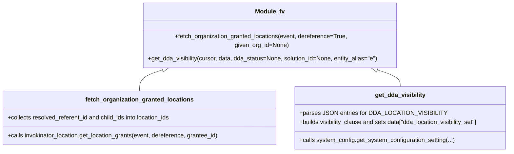
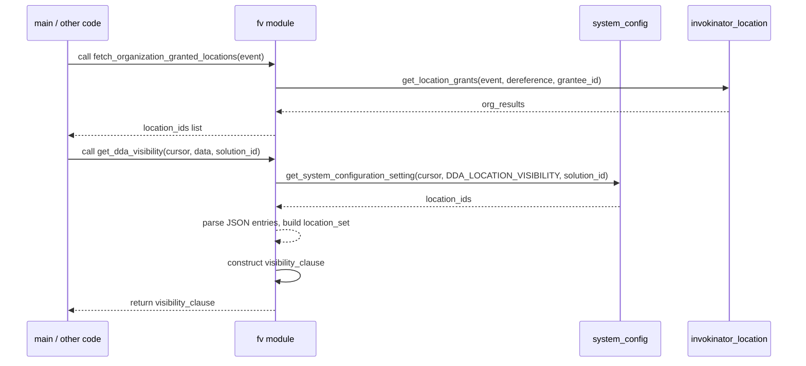
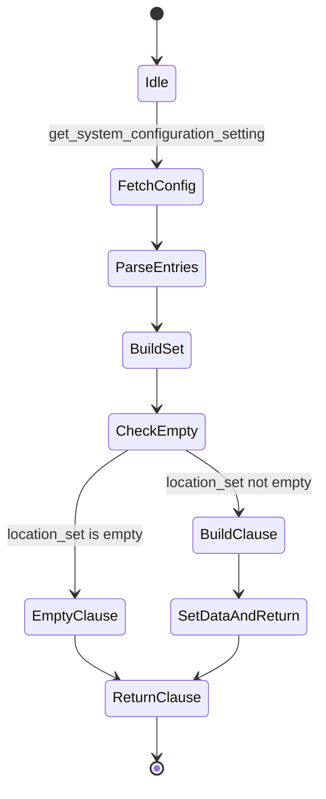

# Diagram: shipment_core/chromium_export/fv/python/fv/aws/lambdas/entity/__init__.py


> Auto-generated by Obscura crawlers

## Diagram 1

```mermaid
flowchart TD
    A[get_dda_visibility(cursor, data, dda_status, solution_id, entity_alias)] --> B[set solution_id or "any"]
    B --> C[get_system_configuration_setting(cursor, DDA_LOCATION_VISIBILITY, solution_id) -> location_ids]
    C --> D[location_set = set()]
    D --> E{for location_id in location_ids}
    E -->|contains DDA_LOCATION_VISIBILITY| F[parse json -> location_id_load]
    F --> G[location_set.update(location_id_load)]
    E -->|not contains| H[skip]
    G --> I{location_set empty?}
    I -->|yes| J[visibility_clause = " AND false "]
    I -->|no| K[append complex AND NOT EXISTS ... AND true = ANY (...) to visibility_clause]
    K --> L[data["dda_location_visibility_set"] = tuple(location_set)]
    J --> M[return visibility_clause]
    L --> M
```

> SVG rendering failed for this diagram.

## Diagram 2



### SVG

<svg id="container" width="1381.125" xmlns="http://www.w3.org/2000/svg" class="classDiagram" height="384" viewBox="0 0 1381.125 384" role="graphics-document document" aria-roledescription="class"><style>#container{font-family:"trebuchet ms",verdana,arial,sans-serif;font-size:16px;fill:#333;}@keyframes edge-animation-frame{from{stroke-dashoffset:0;}}@keyframes dash{to{stroke-dashoffset:0;}}#container .edge-animation-slow{stroke-dasharray:9,5!important;stroke-dashoffset:900;animation:dash 50s linear infinite;stroke-linecap:round;}#container .edge-animation-fast{stroke-dasharray:9,5!important;stroke-dashoffset:900;animation:dash 20s linear infinite;stroke-linecap:round;}#container .error-icon{fill:#552222;}#container .error-text{fill:#552222;stroke:#552222;}#container .edge-thickness-normal{stroke-width:1px;}#container .edge-thickness-thick{stroke-width:3.5px;}#container .edge-pattern-solid{stroke-dasharray:0;}#container .edge-thickness-invisible{stroke-width:0;fill:none;}#container .edge-pattern-dashed{stroke-dasharray:3;}#container .edge-pattern-dotted{stroke-dasharray:2;}#container .marker{fill:#333333;stroke:#333333;}#container .marker.cross{stroke:#333333;}#container svg{font-family:"trebuchet ms",verdana,arial,sans-serif;font-size:16px;}#container p{margin:0;}#container g.classGroup text{fill:#9370DB;stroke:none;font-family:"trebuchet ms",verdana,arial,sans-serif;font-size:10px;}#container g.classGroup text .title{font-weight:bolder;}#container .nodeLabel,#container .edgeLabel{color:#131300;}#container .edgeLabel .label rect{fill:#ECECFF;}#container .label text{fill:#131300;}#container .labelBkg{background:#ECECFF;}#container .edgeLabel .label span{background:#ECECFF;}#container .classTitle{font-weight:bolder;}#container .node rect,#container .node circle,#container .node ellipse,#container .node polygon,#container .node path{fill:#ECECFF;stroke:#9370DB;stroke-width:1px;}#container .divider{stroke:#9370DB;stroke-width:1;}#container g.clickable{cursor:pointer;}#container g.classGroup rect{fill:#ECECFF;stroke:#9370DB;}#container g.classGroup line{stroke:#9370DB;stroke-width:1;}#container .classLabel .box{stroke:none;stroke-width:0;fill:#ECECFF;opacity:0.5;}#container .classLabel .label{fill:#9370DB;font-size:10px;}#container .relation{stroke:#333333;stroke-width:1;fill:none;}#container .dashed-line{stroke-dasharray:3;}#container .dotted-line{stroke-dasharray:1 2;}#container #compositionStart,#container .composition{fill:#333333!important;stroke:#333333!important;stroke-width:1;}#container #compositionEnd,#container .composition{fill:#333333!important;stroke:#333333!important;stroke-width:1;}#container #dependencyStart,#container .dependency{fill:#333333!important;stroke:#333333!important;stroke-width:1;}#container #dependencyStart,#container .dependency{fill:#333333!important;stroke:#333333!important;stroke-width:1;}#container #extensionStart,#container .extension{fill:transparent!important;stroke:#333333!important;stroke-width:1;}#container #extensionEnd,#container .extension{fill:transparent!important;stroke:#333333!important;stroke-width:1;}#container #aggregationStart,#container .aggregation{fill:transparent!important;stroke:#333333!important;stroke-width:1;}#container #aggregationEnd,#container .aggregation{fill:transparent!important;stroke:#333333!important;stroke-width:1;}#container #lollipopStart,#container .lollipop{fill:#ECECFF!important;stroke:#333333!important;stroke-width:1;}#container #lollipopEnd,#container .lollipop{fill:#ECECFF!important;stroke:#333333!important;stroke-width:1;}#container .edgeTerminals{font-size:11px;line-height:initial;}#container .classTitleText{text-anchor:middle;font-size:18px;fill:#333;}#container .label-icon{display:inline-block;height:1em;overflow:visible;vertical-align:-0.125em;}#container .node .label-icon path{fill:currentColor;stroke:revert;stroke-width:revert;}#container :root{--mermaid-font-family:"trebuchet ms",verdana,arial,sans-serif;}</style><g><defs><marker id="container_class-aggregationStart" class="marker aggregation class" refX="18" refY="7" markerWidth="190" markerHeight="240" orient="auto"><path d="M 18,7 L9,13 L1,7 L9,1 Z"></path></marker></defs><defs><marker id="container_class-aggregationEnd" class="marker aggregation class" refX="1" refY="7" markerWidth="20" markerHeight="28" orient="auto"><path d="M 18,7 L9,13 L1,7 L9,1 Z"></path></marker></defs><defs><marker id="container_class-extensionStart" class="marker extension class" refX="18" refY="7" markerWidth="190" markerHeight="240" orient="auto"><path d="M 1,7 L18,13 V 1 Z"></path></marker></defs><defs><marker id="container_class-extensionEnd" class="marker extension class" refX="1" refY="7" markerWidth="20" markerHeight="28" orient="auto"><path d="M 1,1 V 13 L18,7 Z"></path></marker></defs><defs><marker id="container_class-compositionStart" class="marker composition class" refX="18" refY="7" markerWidth="190" markerHeight="240" orient="auto"><path d="M 18,7 L9,13 L1,7 L9,1 Z"></path></marker></defs><defs><marker id="container_class-compositionEnd" class="marker composition class" refX="1" refY="7" markerWidth="20" markerHeight="28" orient="auto"><path d="M 18,7 L9,13 L1,7 L9,1 Z"></path></marker></defs><defs><marker id="container_class-dependencyStart" class="marker dependency class" refX="6" refY="7" markerWidth="190" markerHeight="240" orient="auto"><path d="M 5,7 L9,13 L1,7 L9,1 Z"></path></marker></defs><defs><marker id="container_class-dependencyEnd" class="marker dependency class" refX="13" refY="7" markerWidth="20" markerHeight="28" orient="auto"><path d="M 18,7 L9,13 L14,7 L9,1 Z"></path></marker></defs><defs><marker id="container_class-lollipopStart" class="marker lollipop class" refX="13" refY="7" markerWidth="190" markerHeight="240" orient="auto"><circle stroke="black" fill="transparent" cx="7" cy="7" r="6"></circle></marker></defs><defs><marker id="container_class-lollipopEnd" class="marker lollipop class" refX="1" refY="7" markerWidth="190" markerHeight="240" orient="auto"><circle stroke="black" fill="transparent" cx="7" cy="7" r="6"></circle></marker></defs><g class="root"><g class="clusters"></g><g class="edgePaths"><path d="M447.053,162.692L435.078,166.077C423.104,169.461,399.156,176.231,387.181,185.782C375.207,195.333,375.207,207.667,375.207,213.833L375.207,220" id="id_Module_fv_fetch_organization_granted_locations_1" class="edge-thickness-normal edge-pattern-solid relation" style=";;;" data-edge="true" data-et="edge" data-id="id_Module_fv_fetch_organization_granted_locations_1" data-points="W3sieCI6NDYzLjY1MjM0Mzc1LCJ5IjoxNTh9LHsieCI6Mzc1LjIwNzAzMTI1LCJ5IjoxODN9LHsieCI6Mzc1LjIwNzAzMTI1LCJ5IjoyMjB9XQ==" marker-start="url(#container_class-extensionStart)"></path><path d="M1010.924,162.692L1022.898,166.077C1034.872,169.461,1058.821,176.231,1070.795,183.782C1082.77,191.333,1082.77,199.667,1082.77,203.833L1082.77,208" id="id_Module_fv_get_dda_visibility_2" class="edge-thickness-normal edge-pattern-solid relation" style=";;;" data-edge="true" data-et="edge" data-id="id_Module_fv_get_dda_visibility_2" data-points="W3sieCI6OTk0LjMyNDIxODc1LCJ5IjoxNTh9LHsieCI6MTA4Mi43Njk1MzEyNSwieSI6MTgzfSx7IngiOjEwODIuNzY5NTMxMjUsInkiOjIwOH1d" marker-start="url(#container_class-extensionStart)"></path></g><g class="edgeLabels"><g class="edgeLabel"><g class="label" data-id="id_Module_fv_fetch_organization_granted_locations_1" transform="translate(0, 0)"><foreignObject width="0" height="0"><div xmlns="http://www.w3.org/1999/xhtml" class="labelBkg" style="display: table-cell; white-space: nowrap; line-height: 1.5; max-width: 200px; text-align: center;"><span class="edgeLabel"></span></div></foreignObject></g></g><g class="edgeLabel"><g class="label" data-id="id_Module_fv_get_dda_visibility_2" transform="translate(0, 0)"><foreignObject width="0" height="0"><div xmlns="http://www.w3.org/1999/xhtml" class="labelBkg" style="display: table-cell; white-space: nowrap; line-height: 1.5; max-width: 200px; text-align: center;"><span class="edgeLabel"></span></div></foreignObject></g></g></g><g class="nodes"><g class="node default" id="classId-Module_fv-0" transform="translate(728.98828125, 83)"><g class="basic label-container"><path d="M-342.32421875 -75 L342.32421875 -75 L342.32421875 75 L-342.32421875 75" stroke="none" stroke-width="0" fill="#ECECFF" style=""></path><path d="M-342.32421875 -75 C-191.49125113396678 -75, -40.65828351793357 -75, 342.32421875 -75 M-342.32421875 -75 C-165.61309722792768 -75, 11.098024294144636 -75, 342.32421875 -75 M342.32421875 -75 C342.32421875 -27.8764250410076, 342.32421875 19.2471499179848, 342.32421875 75 M342.32421875 -75 C342.32421875 -30.437638319237855, 342.32421875 14.124723361524289, 342.32421875 75 M342.32421875 75 C98.11316342780717 75, -146.09789189438567 75, -342.32421875 75 M342.32421875 75 C146.74093253425224 75, -48.842353681495524 75, -342.32421875 75 M-342.32421875 75 C-342.32421875 34.49969520256467, -342.32421875 -6.000609594870653, -342.32421875 -75 M-342.32421875 75 C-342.32421875 24.77720920221352, -342.32421875 -25.44558159557296, -342.32421875 -75" stroke="#9370DB" stroke-width="1.3" fill="none" stroke-dasharray="0 0" style=""></path></g><g class="annotation-group text" transform="translate(0, -51)"></g><g class="label-group text" transform="translate(-37.8828125, -51)"><g class="label" style="font-weight: bolder" transform="translate(0,-12)"><foreignObject width="75.765625" height="24"><div xmlns="http://www.w3.org/1999/xhtml" style="display: table-cell; white-space: nowrap; line-height: 1.5; max-width: 125px; text-align: center;"><span class="nodeLabel markdown-node-label" style=""><p>Module_fv</p></span></div></foreignObject></g></g><g class="members-group text" transform="translate(-330.32421875, -3)"></g><g class="methods-group text" transform="translate(-330.32421875, 27)"><g class="label" style="" transform="translate(0,-12)"><foreignObject width="614.078125" height="24"><div xmlns="http://www.w3.org/1999/xhtml" style="display: table-cell; white-space: nowrap; line-height: 1.5; max-width: 671px; text-align: center;"><span class="nodeLabel markdown-node-label" style=""><p>+fetch_organization_granted_locations(event, dereference=True, given_org_id=None)</p></span></div></foreignObject></g><g class="label" style="" transform="translate(0,12)"><foreignObject width="622.765625" height="24"><div xmlns="http://www.w3.org/1999/xhtml" style="display: table-cell; white-space: nowrap; line-height: 1.5; max-width: 680px; text-align: center;"><span class="nodeLabel markdown-node-label" style=""><p>+get_dda_visibility(cursor, data, dda_status=None, solution_id=None, entity_alias="e")</p></span></div></foreignObject></g></g><g class="divider" style=""><path d="M-342.32421875 -27 C-82.45192656983295 -27, 177.4203656103341 -27, 342.32421875 -27 M-342.32421875 -27 C-82.60235815667596 -27, 177.11950243664808 -27, 342.32421875 -27" stroke="#9370DB" stroke-width="1.3" fill="none" stroke-dasharray="0 0" style=""></path></g><g class="divider" style=""><path d="M-342.32421875 -3 C-129.3428686384324 -3, 83.63848147313519 -3, 342.32421875 -3 M-342.32421875 -3 C-140.15885338603096 -3, 62.00651197793809 -3, 342.32421875 -3" stroke="#9370DB" stroke-width="1.3" fill="none" stroke-dasharray="0 0" style=""></path></g></g><g class="node default" id="classId-fetch_organization_granted_locations-1" transform="translate(375.20703125, 292)"><g class="basic label-container"><path d="M-367.20703125 -72 L367.20703125 -72 L367.20703125 72 L-367.20703125 72" stroke="none" stroke-width="0" fill="#ECECFF" style=""></path><path d="M-367.20703125 -72 C-162.02747261766947 -72, 43.15208601466105 -72, 367.20703125 -72 M-367.20703125 -72 C-126.53617676354978 -72, 114.13467772290045 -72, 367.20703125 -72 M367.20703125 -72 C367.20703125 -40.50486010589898, 367.20703125 -9.009720211797955, 367.20703125 72 M367.20703125 -72 C367.20703125 -31.34868339155561, 367.20703125 9.302633216888779, 367.20703125 72 M367.20703125 72 C101.96421043701173 72, -163.27861037597654 72, -367.20703125 72 M367.20703125 72 C147.50707340635694 72, -72.19288443728612 72, -367.20703125 72 M-367.20703125 72 C-367.20703125 32.43191984458363, -367.20703125 -7.136160310832736, -367.20703125 -72 M-367.20703125 72 C-367.20703125 27.17329147117057, -367.20703125 -17.653417057658856, -367.20703125 -72" stroke="#9370DB" stroke-width="1.3" fill="none" stroke-dasharray="0 0" style=""></path></g><g class="annotation-group text" transform="translate(0, -48)"></g><g class="label-group text" transform="translate(-138.9140625, -48)"><g class="label" style="font-weight: bolder" transform="translate(0,-12)"><foreignObject width="277.828125" height="24"><div xmlns="http://www.w3.org/1999/xhtml" style="display: table-cell; white-space: nowrap; line-height: 1.5; max-width: 324px; text-align: center;"><span class="nodeLabel markdown-node-label" style=""><p>fetch_organization_granted_locations</p></span></div></foreignObject></g></g><g class="members-group text" transform="translate(-355.20703125, 0)"><g class="label" style="" transform="translate(0,-12)"><foreignObject width="446.28125" height="24"><div xmlns="http://www.w3.org/1999/xhtml" style="display: table-cell; white-space: nowrap; line-height: 1.5; max-width: 504px; text-align: center;"><span class="nodeLabel markdown-node-label" style=""><p>+collects resolved_referent_id and child_ids into location_ids</p></span></div></foreignObject></g></g><g class="methods-group text" transform="translate(-355.20703125, 48)"><g class="label" style="" transform="translate(0,-12)"><foreignObject width="571.5" height="24"><div xmlns="http://www.w3.org/1999/xhtml" style="display: table-cell; white-space: nowrap; line-height: 1.5; max-width: 629px; text-align: center;"><span class="nodeLabel markdown-node-label" style=""><p>+calls invokinator_location.get_location_grants(event, dereference, grantee_id)</p></span></div></foreignObject></g></g><g class="divider" style=""><path d="M-367.20703125 -24 C-130.6288670568408 -24, 105.94929713631842 -24, 367.20703125 -24 M-367.20703125 -24 C-132.882056897773 -24, 101.442917454454 -24, 367.20703125 -24" stroke="#9370DB" stroke-width="1.3" fill="none" stroke-dasharray="0 0" style=""></path></g><g class="divider" style=""><path d="M-367.20703125 24 C-76.18958970013097 24, 214.82785184973807 24, 367.20703125 24 M-367.20703125 24 C-165.33199616021028 24, 36.54303892957944 24, 367.20703125 24" stroke="#9370DB" stroke-width="1.3" fill="none" stroke-dasharray="0 0" style=""></path></g></g><g class="node default" id="classId-get_dda_visibility-2" transform="translate(1082.76953125, 292)"><g class="basic label-container"><path d="M-290.35546875 -84 L290.35546875 -84 L290.35546875 84 L-290.35546875 84" stroke="none" stroke-width="0" fill="#ECECFF" style=""></path><path d="M-290.35546875 -84 C-80.62559225869134 -84, 129.10428423261732 -84, 290.35546875 -84 M-290.35546875 -84 C-80.48817535571547 -84, 129.37911803856906 -84, 290.35546875 -84 M290.35546875 -84 C290.35546875 -18.188521899905368, 290.35546875 47.622956200189265, 290.35546875 84 M290.35546875 -84 C290.35546875 -23.218994170542167, 290.35546875 37.562011658915665, 290.35546875 84 M290.35546875 84 C150.859133171727 84, 11.36279759345399 84, -290.35546875 84 M290.35546875 84 C152.56115778404552 84, 14.76684681809104 84, -290.35546875 84 M-290.35546875 84 C-290.35546875 45.91757534853403, -290.35546875 7.835150697068059, -290.35546875 -84 M-290.35546875 84 C-290.35546875 42.714807949327785, -290.35546875 1.4296158986555696, -290.35546875 -84" stroke="#9370DB" stroke-width="1.3" fill="none" stroke-dasharray="0 0" style=""></path></g><g class="annotation-group text" transform="translate(0, -60)"></g><g class="label-group text" transform="translate(-64.9765625, -60)"><g class="label" style="font-weight: bolder" transform="translate(0,-12)"><foreignObject width="129.953125" height="24"><div xmlns="http://www.w3.org/1999/xhtml" style="display: table-cell; white-space: nowrap; line-height: 1.5; max-width: 178px; text-align: center;"><span class="nodeLabel markdown-node-label" style=""><p>get_dda_visibility</p></span></div></foreignObject></g></g><g class="members-group text" transform="translate(-278.35546875, -12)"><g class="label" style="" transform="translate(0,-12)"><foreignObject width="367.03125" height="24"><div xmlns="http://www.w3.org/1999/xhtml" style="display: table-cell; white-space: nowrap; line-height: 1.5; max-width: 425px; text-align: center;"><span class="nodeLabel markdown-node-label" style=""><p>+parses JSON entries for DDA_LOCATION_VISIBILITY</p></span></div></foreignObject></g><g class="label" style="" transform="translate(0,12)"><foreignObject width="491.734375" height="24"><div xmlns="http://www.w3.org/1999/xhtml" style="display: table-cell; white-space: nowrap; line-height: 1.5; max-width: 549px; text-align: center;"><span class="nodeLabel markdown-node-label" style=""><p>+builds visibility_clause and sets data["dda_location_visibility_set"]</p></span></div></foreignObject></g></g><g class="methods-group text" transform="translate(-278.35546875, 60)"><g class="label" style="" transform="translate(0,-12)"><foreignObject width="416.25" height="24"><div xmlns="http://www.w3.org/1999/xhtml" style="display: table-cell; white-space: nowrap; line-height: 1.5; max-width: 474px; text-align: center;"><span class="nodeLabel markdown-node-label" style=""><p>+calls system_config.get_system_configuration_setting(...)</p></span></div></foreignObject></g></g><g class="divider" style=""><path d="M-290.35546875 -36 C-77.15514469525954 -36, 136.04517935948093 -36, 290.35546875 -36 M-290.35546875 -36 C-58.8862605556082 -36, 172.5829476387836 -36, 290.35546875 -36" stroke="#9370DB" stroke-width="1.3" fill="none" stroke-dasharray="0 0" style=""></path></g><g class="divider" style=""><path d="M-290.35546875 36 C-77.19710558190161 36, 135.96125758619678 36, 290.35546875 36 M-290.35546875 36 C-139.96618735014113 36, 10.423094049717747 36, 290.35546875 36" stroke="#9370DB" stroke-width="1.3" fill="none" stroke-dasharray="0 0" style=""></path></g></g></g></g></g></svg>

## Diagram 3



### SVG

<svg id="container" width="1547" xmlns="http://www.w3.org/2000/svg" height="711" viewBox="-50 -10 1547 711" role="graphics-document document" aria-roledescription="sequence"><g><rect x="1278" y="625" fill="#eaeaea" stroke="#666" width="169" height="65" name="Invokinator" rx="3" ry="3" class="actor actor-bottom"></rect><text x="1362.5" y="657.5" dominant-baseline="central" alignment-baseline="central" class="actor actor-box" style="text-anchor: middle; font-size: 16px; font-weight: 400;"><tspan x="1362.5" dy="0">invokinator_location</tspan></text></g><g><rect x="1078" y="625" fill="#eaeaea" stroke="#666" width="150" height="65" name="SystemConfig" rx="3" ry="3" class="actor actor-bottom"></rect><text x="1153" y="657.5" dominant-baseline="central" alignment-baseline="central" class="actor actor-box" style="text-anchor: middle; font-size: 16px; font-weight: 400;"><tspan x="1153" dy="0">system_config</tspan></text></g><g><rect x="425" y="625" fill="#eaeaea" stroke="#666" width="150" height="65" name="Module" rx="3" ry="3" class="actor actor-bottom"></rect><text x="500" y="657.5" dominant-baseline="central" alignment-baseline="central" class="actor actor-box" style="text-anchor: middle; font-size: 16px; font-weight: 400;"><tspan x="500" dy="0">fv module</tspan></text></g><g><rect x="0" y="625" fill="#eaeaea" stroke="#666" width="152" height="65" name="Caller" rx="3" ry="3" class="actor actor-bottom"></rect><text x="76" y="657.5" dominant-baseline="central" alignment-baseline="central" class="actor actor-box" style="text-anchor: middle; font-size: 16px; font-weight: 400;"><tspan x="76" dy="0">main / other code</tspan></text></g><g><line id="actor3" x1="1362.5" y1="65" x2="1362.5" y2="625" class="actor-line 200" stroke-width="0.5px" stroke="#999" name="Invokinator"></line><g id="root-3"><rect x="1278" y="0" fill="#eaeaea" stroke="#666" width="169" height="65" name="Invokinator" rx="3" ry="3" class="actor actor-top"></rect><text x="1362.5" y="32.5" dominant-baseline="central" alignment-baseline="central" class="actor actor-box" style="text-anchor: middle; font-size: 16px; font-weight: 400;"><tspan x="1362.5" dy="0">invokinator_location</tspan></text></g></g><g><line id="actor2" x1="1153" y1="65" x2="1153" y2="625" class="actor-line 200" stroke-width="0.5px" stroke="#999" name="SystemConfig"></line><g id="root-2"><rect x="1078" y="0" fill="#eaeaea" stroke="#666" width="150" height="65" name="SystemConfig" rx="3" ry="3" class="actor actor-top"></rect><text x="1153" y="32.5" dominant-baseline="central" alignment-baseline="central" class="actor actor-box" style="text-anchor: middle; font-size: 16px; font-weight: 400;"><tspan x="1153" dy="0">system_config</tspan></text></g></g><g><line id="actor1" x1="500" y1="65" x2="500" y2="625" class="actor-line 200" stroke-width="0.5px" stroke="#999" name="Module"></line><g id="root-1"><rect x="425" y="0" fill="#eaeaea" stroke="#666" width="150" height="65" name="Module" rx="3" ry="3" class="actor actor-top"></rect><text x="500" y="32.5" dominant-baseline="central" alignment-baseline="central" class="actor actor-box" style="text-anchor: middle; font-size: 16px; font-weight: 400;"><tspan x="500" dy="0">fv module</tspan></text></g></g><g><line id="actor0" x1="76" y1="65" x2="76" y2="625" class="actor-line 200" stroke-width="0.5px" stroke="#999" name="Caller"></line><g id="root-0"><rect x="0" y="0" fill="#eaeaea" stroke="#666" width="152" height="65" name="Caller" rx="3" ry="3" class="actor actor-top"></rect><text x="76" y="32.5" dominant-baseline="central" alignment-baseline="central" class="actor actor-box" style="text-anchor: middle; font-size: 16px; font-weight: 400;"><tspan x="76" dy="0">main / other code</tspan></text></g></g><style>#container{font-family:"trebuchet ms",verdana,arial,sans-serif;font-size:16px;fill:#333;}@keyframes edge-animation-frame{from{stroke-dashoffset:0;}}@keyframes dash{to{stroke-dashoffset:0;}}#container .edge-animation-slow{stroke-dasharray:9,5!important;stroke-dashoffset:900;animation:dash 50s linear infinite;stroke-linecap:round;}#container .edge-animation-fast{stroke-dasharray:9,5!important;stroke-dashoffset:900;animation:dash 20s linear infinite;stroke-linecap:round;}#container .error-icon{fill:#552222;}#container .error-text{fill:#552222;stroke:#552222;}#container .edge-thickness-normal{stroke-width:1px;}#container .edge-thickness-thick{stroke-width:3.5px;}#container .edge-pattern-solid{stroke-dasharray:0;}#container .edge-thickness-invisible{stroke-width:0;fill:none;}#container .edge-pattern-dashed{stroke-dasharray:3;}#container .edge-pattern-dotted{stroke-dasharray:2;}#container .marker{fill:#333333;stroke:#333333;}#container .marker.cross{stroke:#333333;}#container svg{font-family:"trebuchet ms",verdana,arial,sans-serif;font-size:16px;}#container p{margin:0;}#container .actor{stroke:hsl(259.6261682243, 59.7765363128%, 87.9019607843%);fill:#ECECFF;}#container text.actor&gt;tspan{fill:black;stroke:none;}#container .actor-line{stroke:hsl(259.6261682243, 59.7765363128%, 87.9019607843%);}#container .innerArc{stroke-width:1.5;stroke-dasharray:none;}#container .messageLine0{stroke-width:1.5;stroke-dasharray:none;stroke:#333;}#container .messageLine1{stroke-width:1.5;stroke-dasharray:2,2;stroke:#333;}#container #arrowhead path{fill:#333;stroke:#333;}#container .sequenceNumber{fill:white;}#container #sequencenumber{fill:#333;}#container #crosshead path{fill:#333;stroke:#333;}#container .messageText{fill:#333;stroke:none;}#container .labelBox{stroke:hsl(259.6261682243, 59.7765363128%, 87.9019607843%);fill:#ECECFF;}#container .labelText,#container .labelText&gt;tspan{fill:black;stroke:none;}#container .loopText,#container .loopText&gt;tspan{fill:black;stroke:none;}#container .loopLine{stroke-width:2px;stroke-dasharray:2,2;stroke:hsl(259.6261682243, 59.7765363128%, 87.9019607843%);fill:hsl(259.6261682243, 59.7765363128%, 87.9019607843%);}#container .note{stroke:#aaaa33;fill:#fff5ad;}#container .noteText,#container .noteText&gt;tspan{fill:black;stroke:none;}#container .activation0{fill:#f4f4f4;stroke:#666;}#container .activation1{fill:#f4f4f4;stroke:#666;}#container .activation2{fill:#f4f4f4;stroke:#666;}#container .actorPopupMenu{position:absolute;}#container .actorPopupMenuPanel{position:absolute;fill:#ECECFF;box-shadow:0px 8px 16px 0px rgba(0,0,0,0.2);filter:drop-shadow(3px 5px 2px rgb(0 0 0 / 0.4));}#container .actor-man line{stroke:hsl(259.6261682243, 59.7765363128%, 87.9019607843%);fill:#ECECFF;}#container .actor-man circle,#container line{stroke:hsl(259.6261682243, 59.7765363128%, 87.9019607843%);fill:#ECECFF;stroke-width:2px;}#container :root{--mermaid-font-family:"trebuchet ms",verdana,arial,sans-serif;}</style><g></g><defs><symbol id="computer" width="24" height="24"><path transform="scale(.5)" d="M2 2v13h20v-13h-20zm18 11h-16v-9h16v9zm-10.228 6l.466-1h3.524l.467 1h-4.457zm14.228 3h-24l2-6h2.104l-1.33 4h18.45l-1.297-4h2.073l2 6zm-5-10h-14v-7h14v7z"></path></symbol></defs><defs><symbol id="database" fill-rule="evenodd" clip-rule="evenodd"><path transform="scale(.5)" d="M12.258.001l.256.004.255.005.253.008.251.01.249.012.247.015.246.016.242.019.241.02.239.023.236.024.233.027.231.028.229.031.225.032.223.034.22.036.217.038.214.04.211.041.208.043.205.045.201.046.198.048.194.05.191.051.187.053.183.054.18.056.175.057.172.059.168.06.163.061.16.063.155.064.15.066.074.033.073.033.071.034.07.034.069.035.068.035.067.035.066.035.064.036.064.036.062.036.06.036.06.037.058.037.058.037.055.038.055.038.053.038.052.038.051.039.05.039.048.039.047.039.045.04.044.04.043.04.041.04.04.041.039.041.037.041.036.041.034.041.033.042.032.042.03.042.029.042.027.042.026.043.024.043.023.043.021.043.02.043.018.044.017.043.015.044.013.044.012.044.011.045.009.044.007.045.006.045.004.045.002.045.001.045v17l-.001.045-.002.045-.004.045-.006.045-.007.045-.009.044-.011.045-.012.044-.013.044-.015.044-.017.043-.018.044-.02.043-.021.043-.023.043-.024.043-.026.043-.027.042-.029.042-.03.042-.032.042-.033.042-.034.041-.036.041-.037.041-.039.041-.04.041-.041.04-.043.04-.044.04-.045.04-.047.039-.048.039-.05.039-.051.039-.052.038-.053.038-.055.038-.055.038-.058.037-.058.037-.06.037-.06.036-.062.036-.064.036-.064.036-.066.035-.067.035-.068.035-.069.035-.07.034-.071.034-.073.033-.074.033-.15.066-.155.064-.16.063-.163.061-.168.06-.172.059-.175.057-.18.056-.183.054-.187.053-.191.051-.194.05-.198.048-.201.046-.205.045-.208.043-.211.041-.214.04-.217.038-.22.036-.223.034-.225.032-.229.031-.231.028-.233.027-.236.024-.239.023-.241.02-.242.019-.246.016-.247.015-.249.012-.251.01-.253.008-.255.005-.256.004-.258.001-.258-.001-.256-.004-.255-.005-.253-.008-.251-.01-.249-.012-.247-.015-.245-.016-.243-.019-.241-.02-.238-.023-.236-.024-.234-.027-.231-.028-.228-.031-.226-.032-.223-.034-.22-.036-.217-.038-.214-.04-.211-.041-.208-.043-.204-.045-.201-.046-.198-.048-.195-.05-.19-.051-.187-.053-.184-.054-.179-.056-.176-.057-.172-.059-.167-.06-.164-.061-.159-.063-.155-.064-.151-.066-.074-.033-.072-.033-.072-.034-.07-.034-.069-.035-.068-.035-.067-.035-.066-.035-.064-.036-.063-.036-.062-.036-.061-.036-.06-.037-.058-.037-.057-.037-.056-.038-.055-.038-.053-.038-.052-.038-.051-.039-.049-.039-.049-.039-.046-.039-.046-.04-.044-.04-.043-.04-.041-.04-.04-.041-.039-.041-.037-.041-.036-.041-.034-.041-.033-.042-.032-.042-.03-.042-.029-.042-.027-.042-.026-.043-.024-.043-.023-.043-.021-.043-.02-.043-.018-.044-.017-.043-.015-.044-.013-.044-.012-.044-.011-.045-.009-.044-.007-.045-.006-.045-.004-.045-.002-.045-.001-.045v-17l.001-.045.002-.045.004-.045.006-.045.007-.045.009-.044.011-.045.012-.044.013-.044.015-.044.017-.043.018-.044.02-.043.021-.043.023-.043.024-.043.026-.043.027-.042.029-.042.03-.042.032-.042.033-.042.034-.041.036-.041.037-.041.039-.041.04-.041.041-.04.043-.04.044-.04.046-.04.046-.039.049-.039.049-.039.051-.039.052-.038.053-.038.055-.038.056-.038.057-.037.058-.037.06-.037.061-.036.062-.036.063-.036.064-.036.066-.035.067-.035.068-.035.069-.035.07-.034.072-.034.072-.033.074-.033.151-.066.155-.064.159-.063.164-.061.167-.06.172-.059.176-.057.179-.056.184-.054.187-.053.19-.051.195-.05.198-.048.201-.046.204-.045.208-.043.211-.041.214-.04.217-.038.22-.036.223-.034.226-.032.228-.031.231-.028.234-.027.236-.024.238-.023.241-.02.243-.019.245-.016.247-.015.249-.012.251-.01.253-.008.255-.005.256-.004.258-.001.258.001zm-9.258 20.499v.01l.001.021.003.021.004.022.005.021.006.022.007.022.009.023.01.022.011.023.012.023.013.023.015.023.016.024.017.023.018.024.019.024.021.024.022.025.023.024.024.025.052.049.056.05.061.051.066.051.07.051.075.051.079.052.084.052.088.052.092.052.097.052.102.051.105.052.11.052.114.051.119.051.123.051.127.05.131.05.135.05.139.048.144.049.147.047.152.047.155.047.16.045.163.045.167.043.171.043.176.041.178.041.183.039.187.039.19.037.194.035.197.035.202.033.204.031.209.03.212.029.216.027.219.025.222.024.226.021.23.02.233.018.236.016.24.015.243.012.246.01.249.008.253.005.256.004.259.001.26-.001.257-.004.254-.005.25-.008.247-.011.244-.012.241-.014.237-.016.233-.018.231-.021.226-.021.224-.024.22-.026.216-.027.212-.028.21-.031.205-.031.202-.034.198-.034.194-.036.191-.037.187-.039.183-.04.179-.04.175-.042.172-.043.168-.044.163-.045.16-.046.155-.046.152-.047.148-.048.143-.049.139-.049.136-.05.131-.05.126-.05.123-.051.118-.052.114-.051.11-.052.106-.052.101-.052.096-.052.092-.052.088-.053.083-.051.079-.052.074-.052.07-.051.065-.051.06-.051.056-.05.051-.05.023-.024.023-.025.021-.024.02-.024.019-.024.018-.024.017-.024.015-.023.014-.024.013-.023.012-.023.01-.023.01-.022.008-.022.006-.022.006-.022.004-.022.004-.021.001-.021.001-.021v-4.127l-.077.055-.08.053-.083.054-.085.053-.087.052-.09.052-.093.051-.095.05-.097.05-.1.049-.102.049-.105.048-.106.047-.109.047-.111.046-.114.045-.115.045-.118.044-.12.043-.122.042-.124.042-.126.041-.128.04-.13.04-.132.038-.134.038-.135.037-.138.037-.139.035-.142.035-.143.034-.144.033-.147.032-.148.031-.15.03-.151.03-.153.029-.154.027-.156.027-.158.026-.159.025-.161.024-.162.023-.163.022-.165.021-.166.02-.167.019-.169.018-.169.017-.171.016-.173.015-.173.014-.175.013-.175.012-.177.011-.178.01-.179.008-.179.008-.181.006-.182.005-.182.004-.184.003-.184.002h-.37l-.184-.002-.184-.003-.182-.004-.182-.005-.181-.006-.179-.008-.179-.008-.178-.01-.176-.011-.176-.012-.175-.013-.173-.014-.172-.015-.171-.016-.17-.017-.169-.018-.167-.019-.166-.02-.165-.021-.163-.022-.162-.023-.161-.024-.159-.025-.157-.026-.156-.027-.155-.027-.153-.029-.151-.03-.15-.03-.148-.031-.146-.032-.145-.033-.143-.034-.141-.035-.14-.035-.137-.037-.136-.037-.134-.038-.132-.038-.13-.04-.128-.04-.126-.041-.124-.042-.122-.042-.12-.044-.117-.043-.116-.045-.113-.045-.112-.046-.109-.047-.106-.047-.105-.048-.102-.049-.1-.049-.097-.05-.095-.05-.093-.052-.09-.051-.087-.052-.085-.053-.083-.054-.08-.054-.077-.054v4.127zm0-5.654v.011l.001.021.003.021.004.021.005.022.006.022.007.022.009.022.01.022.011.023.012.023.013.023.015.024.016.023.017.024.018.024.019.024.021.024.022.024.023.025.024.024.052.05.056.05.061.05.066.051.07.051.075.052.079.051.084.052.088.052.092.052.097.052.102.052.105.052.11.051.114.051.119.052.123.05.127.051.131.05.135.049.139.049.144.048.147.048.152.047.155.046.16.045.163.045.167.044.171.042.176.042.178.04.183.04.187.038.19.037.194.036.197.034.202.033.204.032.209.03.212.028.216.027.219.025.222.024.226.022.23.02.233.018.236.016.24.014.243.012.246.01.249.008.253.006.256.003.259.001.26-.001.257-.003.254-.006.25-.008.247-.01.244-.012.241-.015.237-.016.233-.018.231-.02.226-.022.224-.024.22-.025.216-.027.212-.029.21-.03.205-.032.202-.033.198-.035.194-.036.191-.037.187-.039.183-.039.179-.041.175-.042.172-.043.168-.044.163-.045.16-.045.155-.047.152-.047.148-.048.143-.048.139-.05.136-.049.131-.05.126-.051.123-.051.118-.051.114-.052.11-.052.106-.052.101-.052.096-.052.092-.052.088-.052.083-.052.079-.052.074-.051.07-.052.065-.051.06-.05.056-.051.051-.049.023-.025.023-.024.021-.025.02-.024.019-.024.018-.024.017-.024.015-.023.014-.023.013-.024.012-.022.01-.023.01-.023.008-.022.006-.022.006-.022.004-.021.004-.022.001-.021.001-.021v-4.139l-.077.054-.08.054-.083.054-.085.052-.087.053-.09.051-.093.051-.095.051-.097.05-.1.049-.102.049-.105.048-.106.047-.109.047-.111.046-.114.045-.115.044-.118.044-.12.044-.122.042-.124.042-.126.041-.128.04-.13.039-.132.039-.134.038-.135.037-.138.036-.139.036-.142.035-.143.033-.144.033-.147.033-.148.031-.15.03-.151.03-.153.028-.154.028-.156.027-.158.026-.159.025-.161.024-.162.023-.163.022-.165.021-.166.02-.167.019-.169.018-.169.017-.171.016-.173.015-.173.014-.175.013-.175.012-.177.011-.178.009-.179.009-.179.007-.181.007-.182.005-.182.004-.184.003-.184.002h-.37l-.184-.002-.184-.003-.182-.004-.182-.005-.181-.007-.179-.007-.179-.009-.178-.009-.176-.011-.176-.012-.175-.013-.173-.014-.172-.015-.171-.016-.17-.017-.169-.018-.167-.019-.166-.02-.165-.021-.163-.022-.162-.023-.161-.024-.159-.025-.157-.026-.156-.027-.155-.028-.153-.028-.151-.03-.15-.03-.148-.031-.146-.033-.145-.033-.143-.033-.141-.035-.14-.036-.137-.036-.136-.037-.134-.038-.132-.039-.13-.039-.128-.04-.126-.041-.124-.042-.122-.043-.12-.043-.117-.044-.116-.044-.113-.046-.112-.046-.109-.046-.106-.047-.105-.048-.102-.049-.1-.049-.097-.05-.095-.051-.093-.051-.09-.051-.087-.053-.085-.052-.083-.054-.08-.054-.077-.054v4.139zm0-5.666v.011l.001.02.003.022.004.021.005.022.006.021.007.022.009.023.01.022.011.023.012.023.013.023.015.023.016.024.017.024.018.023.019.024.021.025.022.024.023.024.024.025.052.05.056.05.061.05.066.051.07.051.075.052.079.051.084.052.088.052.092.052.097.052.102.052.105.051.11.052.114.051.119.051.123.051.127.05.131.05.135.05.139.049.144.048.147.048.152.047.155.046.16.045.163.045.167.043.171.043.176.042.178.04.183.04.187.038.19.037.194.036.197.034.202.033.204.032.209.03.212.028.216.027.219.025.222.024.226.021.23.02.233.018.236.017.24.014.243.012.246.01.249.008.253.006.256.003.259.001.26-.001.257-.003.254-.006.25-.008.247-.01.244-.013.241-.014.237-.016.233-.018.231-.02.226-.022.224-.024.22-.025.216-.027.212-.029.21-.03.205-.032.202-.033.198-.035.194-.036.191-.037.187-.039.183-.039.179-.041.175-.042.172-.043.168-.044.163-.045.16-.045.155-.047.152-.047.148-.048.143-.049.139-.049.136-.049.131-.051.126-.05.123-.051.118-.052.114-.051.11-.052.106-.052.101-.052.096-.052.092-.052.088-.052.083-.052.079-.052.074-.052.07-.051.065-.051.06-.051.056-.05.051-.049.023-.025.023-.025.021-.024.02-.024.019-.024.018-.024.017-.024.015-.023.014-.024.013-.023.012-.023.01-.022.01-.023.008-.022.006-.022.006-.022.004-.022.004-.021.001-.021.001-.021v-4.153l-.077.054-.08.054-.083.053-.085.053-.087.053-.09.051-.093.051-.095.051-.097.05-.1.049-.102.048-.105.048-.106.048-.109.046-.111.046-.114.046-.115.044-.118.044-.12.043-.122.043-.124.042-.126.041-.128.04-.13.039-.132.039-.134.038-.135.037-.138.036-.139.036-.142.034-.143.034-.144.033-.147.032-.148.032-.15.03-.151.03-.153.028-.154.028-.156.027-.158.026-.159.024-.161.024-.162.023-.163.023-.165.021-.166.02-.167.019-.169.018-.169.017-.171.016-.173.015-.173.014-.175.013-.175.012-.177.01-.178.01-.179.009-.179.007-.181.006-.182.006-.182.004-.184.003-.184.001-.185.001-.185-.001-.184-.001-.184-.003-.182-.004-.182-.006-.181-.006-.179-.007-.179-.009-.178-.01-.176-.01-.176-.012-.175-.013-.173-.014-.172-.015-.171-.016-.17-.017-.169-.018-.167-.019-.166-.02-.165-.021-.163-.023-.162-.023-.161-.024-.159-.024-.157-.026-.156-.027-.155-.028-.153-.028-.151-.03-.15-.03-.148-.032-.146-.032-.145-.033-.143-.034-.141-.034-.14-.036-.137-.036-.136-.037-.134-.038-.132-.039-.13-.039-.128-.041-.126-.041-.124-.041-.122-.043-.12-.043-.117-.044-.116-.044-.113-.046-.112-.046-.109-.046-.106-.048-.105-.048-.102-.048-.1-.05-.097-.049-.095-.051-.093-.051-.09-.052-.087-.052-.085-.053-.083-.053-.08-.054-.077-.054v4.153zm8.74-8.179l-.257.004-.254.005-.25.008-.247.011-.244.012-.241.014-.237.016-.233.018-.231.021-.226.022-.224.023-.22.026-.216.027-.212.028-.21.031-.205.032-.202.033-.198.034-.194.036-.191.038-.187.038-.183.04-.179.041-.175.042-.172.043-.168.043-.163.045-.16.046-.155.046-.152.048-.148.048-.143.048-.139.049-.136.05-.131.05-.126.051-.123.051-.118.051-.114.052-.11.052-.106.052-.101.052-.096.052-.092.052-.088.052-.083.052-.079.052-.074.051-.07.052-.065.051-.06.05-.056.05-.051.05-.023.025-.023.024-.021.024-.02.025-.019.024-.018.024-.017.023-.015.024-.014.023-.013.023-.012.023-.01.023-.01.022-.008.022-.006.023-.006.021-.004.022-.004.021-.001.021-.001.021.001.021.001.021.004.021.004.022.006.021.006.023.008.022.01.022.01.023.012.023.013.023.014.023.015.024.017.023.018.024.019.024.02.025.021.024.023.024.023.025.051.05.056.05.06.05.065.051.07.052.074.051.079.052.083.052.088.052.092.052.096.052.101.052.106.052.11.052.114.052.118.051.123.051.126.051.131.05.136.05.139.049.143.048.148.048.152.048.155.046.16.046.163.045.168.043.172.043.175.042.179.041.183.04.187.038.191.038.194.036.198.034.202.033.205.032.21.031.212.028.216.027.22.026.224.023.226.022.231.021.233.018.237.016.241.014.244.012.247.011.25.008.254.005.257.004.26.001.26-.001.257-.004.254-.005.25-.008.247-.011.244-.012.241-.014.237-.016.233-.018.231-.021.226-.022.224-.023.22-.026.216-.027.212-.028.21-.031.205-.032.202-.033.198-.034.194-.036.191-.038.187-.038.183-.04.179-.041.175-.042.172-.043.168-.043.163-.045.16-.046.155-.046.152-.048.148-.048.143-.048.139-.049.136-.05.131-.05.126-.051.123-.051.118-.051.114-.052.11-.052.106-.052.101-.052.096-.052.092-.052.088-.052.083-.052.079-.052.074-.051.07-.052.065-.051.06-.05.056-.05.051-.05.023-.025.023-.024.021-.024.02-.025.019-.024.018-.024.017-.023.015-.024.014-.023.013-.023.012-.023.01-.023.01-.022.008-.022.006-.023.006-.021.004-.022.004-.021.001-.021.001-.021-.001-.021-.001-.021-.004-.021-.004-.022-.006-.021-.006-.023-.008-.022-.01-.022-.01-.023-.012-.023-.013-.023-.014-.023-.015-.024-.017-.023-.018-.024-.019-.024-.02-.025-.021-.024-.023-.024-.023-.025-.051-.05-.056-.05-.06-.05-.065-.051-.07-.052-.074-.051-.079-.052-.083-.052-.088-.052-.092-.052-.096-.052-.101-.052-.106-.052-.11-.052-.114-.052-.118-.051-.123-.051-.126-.051-.131-.05-.136-.05-.139-.049-.143-.048-.148-.048-.152-.048-.155-.046-.16-.046-.163-.045-.168-.043-.172-.043-.175-.042-.179-.041-.183-.04-.187-.038-.191-.038-.194-.036-.198-.034-.202-.033-.205-.032-.21-.031-.212-.028-.216-.027-.22-.026-.224-.023-.226-.022-.231-.021-.233-.018-.237-.016-.241-.014-.244-.012-.247-.011-.25-.008-.254-.005-.257-.004-.26-.001-.26.001z"></path></symbol></defs><defs><symbol id="clock" width="24" height="24"><path transform="scale(.5)" d="M12 2c5.514 0 10 4.486 10 10s-4.486 10-10 10-10-4.486-10-10 4.486-10 10-10zm0-2c-6.627 0-12 5.373-12 12s5.373 12 12 12 12-5.373 12-12-5.373-12-12-12zm5.848 12.459c.202.038.202.333.001.372-1.907.361-6.045 1.111-6.547 1.111-.719 0-1.301-.582-1.301-1.301 0-.512.77-5.447 1.125-7.445.034-.192.312-.181.343.014l.985 6.238 5.394 1.011z"></path></symbol></defs><defs><marker id="arrowhead" refX="7.9" refY="5" markerUnits="userSpaceOnUse" markerWidth="12" markerHeight="12" orient="auto-start-reverse"><path d="M -1 0 L 10 5 L 0 10 z"></path></marker></defs><defs><marker id="crosshead" markerWidth="15" markerHeight="8" orient="auto" refX="4" refY="4.5"><path fill="none" stroke="#000000" stroke-width="1pt" d="M 1,2 L 6,7 M 6,2 L 1,7" style="stroke-dasharray: 0, 0;"></path></marker></defs><defs><marker id="filled-head" refX="15.5" refY="7" markerWidth="20" markerHeight="28" orient="auto"><path d="M 18,7 L9,13 L14,7 L9,1 Z"></path></marker></defs><defs><marker id="sequencenumber" refX="15" refY="15" markerWidth="60" markerHeight="40" orient="auto"><circle cx="15" cy="15" r="6"></circle></marker></defs><text x="287" y="80" text-anchor="middle" dominant-baseline="middle" alignment-baseline="middle" class="messageText" dy="1em" style="font-size: 16px; font-weight: 400;">call fetch_organization_granted_locations(event)</text><line x1="77" y1="113" x2="496" y2="113" class="messageLine0" stroke-width="2" stroke="none" marker-end="url(#arrowhead)" style="fill: none;"></line><text x="930" y="128" text-anchor="middle" dominant-baseline="middle" alignment-baseline="middle" class="messageText" dy="1em" style="font-size: 16px; font-weight: 400;">get_location_grants(event, dereference, grantee_id)</text><line x1="501" y1="161" x2="1358.5" y2="161" class="messageLine0" stroke-width="2" stroke="none" marker-end="url(#arrowhead)" style="fill: none;"></line><text x="933" y="176" text-anchor="middle" dominant-baseline="middle" alignment-baseline="middle" class="messageText" dy="1em" style="font-size: 16px; font-weight: 400;">org_results</text><line x1="1361.5" y1="209" x2="504" y2="209" class="messageLine1" stroke-width="2" stroke="none" marker-end="url(#arrowhead)" style="stroke-dasharray: 3, 3; fill: none;"></line><text x="290" y="224" text-anchor="middle" dominant-baseline="middle" alignment-baseline="middle" class="messageText" dy="1em" style="font-size: 16px; font-weight: 400;">location_ids list</text><line x1="499" y1="257" x2="80" y2="257" class="messageLine1" stroke-width="2" stroke="none" marker-end="url(#arrowhead)" style="stroke-dasharray: 3, 3; fill: none;"></line><text x="287" y="272" text-anchor="middle" dominant-baseline="middle" alignment-baseline="middle" class="messageText" dy="1em" style="font-size: 16px; font-weight: 400;">call get_dda_visibility(cursor, data, solution_id)</text><line x1="77" y1="305" x2="496" y2="305" class="messageLine0" stroke-width="2" stroke="none" marker-end="url(#arrowhead)" style="fill: none;"></line><text x="825" y="320" text-anchor="middle" dominant-baseline="middle" alignment-baseline="middle" class="messageText" dy="1em" style="font-size: 16px; font-weight: 400;">get_system_configuration_setting(cursor, DDA_LOCATION_VISIBILITY, solution_id)</text><line x1="501" y1="353" x2="1149" y2="353" class="messageLine0" stroke-width="2" stroke="none" marker-end="url(#arrowhead)" style="fill: none;"></line><text x="828" y="368" text-anchor="middle" dominant-baseline="middle" alignment-baseline="middle" class="messageText" dy="1em" style="font-size: 16px; font-weight: 400;">location_ids</text><line x1="1152" y1="401" x2="504" y2="401" class="messageLine1" stroke-width="2" stroke="none" marker-end="url(#arrowhead)" style="stroke-dasharray: 3, 3; fill: none;"></line><text x="501" y="416" text-anchor="middle" dominant-baseline="middle" alignment-baseline="middle" class="messageText" dy="1em" style="font-size: 16px; font-weight: 400;">parse JSON entries, build location_set</text><path d="M 501,449 C 561,439 561,479 501,469" class="messageLine1" stroke-width="2" stroke="none" marker-end="url(#arrowhead)" style="stroke-dasharray: 3, 3; fill: none;"></path><text x="501" y="494" text-anchor="middle" dominant-baseline="middle" alignment-baseline="middle" class="messageText" dy="1em" style="font-size: 16px; font-weight: 400;">construct visibility_clause</text><path d="M 501,527 C 561,517 561,557 501,547" class="messageLine0" stroke-width="2" stroke="none" marker-end="url(#arrowhead)" style="fill: none;"></path><text x="290" y="572" text-anchor="middle" dominant-baseline="middle" alignment-baseline="middle" class="messageText" dy="1em" style="font-size: 16px; font-weight: 400;">return visibility_clause</text><line x1="499" y1="605" x2="80" y2="605" class="messageLine1" stroke-width="2" stroke="none" marker-end="url(#arrowhead)" style="stroke-dasharray: 3, 3; fill: none;"></line></svg>

## Diagram 4



### SVG

<svg id="container" width="356.7578125" xmlns="http://www.w3.org/2000/svg" class="statediagram" height="862" viewBox="0 0 356.7578125 862" role="graphics-document document" aria-roledescription="stateDiagram"><style>#container{font-family:"trebuchet ms",verdana,arial,sans-serif;font-size:16px;fill:#333;}@keyframes edge-animation-frame{from{stroke-dashoffset:0;}}@keyframes dash{to{stroke-dashoffset:0;}}#container .edge-animation-slow{stroke-dasharray:9,5!important;stroke-dashoffset:900;animation:dash 50s linear infinite;stroke-linecap:round;}#container .edge-animation-fast{stroke-dasharray:9,5!important;stroke-dashoffset:900;animation:dash 20s linear infinite;stroke-linecap:round;}#container .error-icon{fill:#552222;}#container .error-text{fill:#552222;stroke:#552222;}#container .edge-thickness-normal{stroke-width:1px;}#container .edge-thickness-thick{stroke-width:3.5px;}#container .edge-pattern-solid{stroke-dasharray:0;}#container .edge-thickness-invisible{stroke-width:0;fill:none;}#container .edge-pattern-dashed{stroke-dasharray:3;}#container .edge-pattern-dotted{stroke-dasharray:2;}#container .marker{fill:#333333;stroke:#333333;}#container .marker.cross{stroke:#333333;}#container svg{font-family:"trebuchet ms",verdana,arial,sans-serif;font-size:16px;}#container p{margin:0;}#container defs #statediagram-barbEnd{fill:#333333;stroke:#333333;}#container g.stateGroup text{fill:#9370DB;stroke:none;font-size:10px;}#container g.stateGroup text{fill:#333;stroke:none;font-size:10px;}#container g.stateGroup .state-title{font-weight:bolder;fill:#131300;}#container g.stateGroup rect{fill:#ECECFF;stroke:#9370DB;}#container g.stateGroup line{stroke:#333333;stroke-width:1;}#container .transition{stroke:#333333;stroke-width:1;fill:none;}#container .stateGroup .composit{fill:white;border-bottom:1px;}#container .stateGroup .alt-composit{fill:#e0e0e0;border-bottom:1px;}#container .state-note{stroke:#aaaa33;fill:#fff5ad;}#container .state-note text{fill:black;stroke:none;font-size:10px;}#container .stateLabel .box{stroke:none;stroke-width:0;fill:#ECECFF;opacity:0.5;}#container .edgeLabel .label rect{fill:#ECECFF;opacity:0.5;}#container .edgeLabel{background-color:rgba(232,232,232, 0.8);text-align:center;}#container .edgeLabel p{background-color:rgba(232,232,232, 0.8);}#container .edgeLabel rect{opacity:0.5;background-color:rgba(232,232,232, 0.8);fill:rgba(232,232,232, 0.8);}#container .edgeLabel .label text{fill:#333;}#container .label div .edgeLabel{color:#333;}#container .stateLabel text{fill:#131300;font-size:10px;font-weight:bold;}#container .node circle.state-start{fill:#333333;stroke:#333333;}#container .node .fork-join{fill:#333333;stroke:#333333;}#container .node circle.state-end{fill:#9370DB;stroke:white;stroke-width:1.5;}#container .end-state-inner{fill:white;stroke-width:1.5;}#container .node rect{fill:#ECECFF;stroke:#9370DB;stroke-width:1px;}#container .node polygon{fill:#ECECFF;stroke:#9370DB;stroke-width:1px;}#container #statediagram-barbEnd{fill:#333333;}#container .statediagram-cluster rect{fill:#ECECFF;stroke:#9370DB;stroke-width:1px;}#container .cluster-label,#container .nodeLabel{color:#131300;}#container .statediagram-cluster rect.outer{rx:5px;ry:5px;}#container .statediagram-state .divider{stroke:#9370DB;}#container .statediagram-state .title-state{rx:5px;ry:5px;}#container .statediagram-cluster.statediagram-cluster .inner{fill:white;}#container .statediagram-cluster.statediagram-cluster-alt .inner{fill:#f0f0f0;}#container .statediagram-cluster .inner{rx:0;ry:0;}#container .statediagram-state rect.basic{rx:5px;ry:5px;}#container .statediagram-state rect.divider{stroke-dasharray:10,10;fill:#f0f0f0;}#container .note-edge{stroke-dasharray:5;}#container .statediagram-note rect{fill:#fff5ad;stroke:#aaaa33;stroke-width:1px;rx:0;ry:0;}#container .statediagram-note rect{fill:#fff5ad;stroke:#aaaa33;stroke-width:1px;rx:0;ry:0;}#container .statediagram-note text{fill:black;}#container .statediagram-note .nodeLabel{color:black;}#container .statediagram .edgeLabel{color:red;}#container #dependencyStart,#container #dependencyEnd{fill:#333333;stroke:#333333;stroke-width:1;}#container .statediagramTitleText{text-anchor:middle;font-size:18px;fill:#333;}#container :root{--mermaid-font-family:"trebuchet ms",verdana,arial,sans-serif;}</style><g><defs><marker id="container_stateDiagram-barbEnd" refX="19" refY="7" markerWidth="20" markerHeight="14" markerUnits="userSpaceOnUse" orient="auto"><path d="M 19,7 L9,13 L14,7 L9,1 Z"></path></marker></defs><g class="root"><g class="clusters"></g><g class="edgePaths"><path d="M175.254,22L175.254,26.167C175.254,30.333,175.254,38.667,175.337,47.083C175.421,55.5,175.587,64,175.671,68.25L175.754,72.5" id="edge0" class="edge-thickness-normal edge-pattern-solid transition" style="fill:none;;;fill:none" data-edge="true" data-et="edge" data-id="edge0" data-points="W3sieCI6MTc1LjI1MzkwNjI1LCJ5IjoyMn0seyJ4IjoxNzUuMjUzOTA2MjUsInkiOjQ3fSx7IngiOjE3NS43NTM5MDYyNSwieSI6NzIuNX1d" marker-end="url(#container_stateDiagram-barbEnd)"></path><path d="M175.754,112.5L175.671,118.583C175.587,124.667,175.421,136.833,175.421,149.167C175.421,161.5,175.587,174,175.671,180.25L175.754,186.5" id="edge1" class="edge-thickness-normal edge-pattern-solid transition" style="fill:none;;;fill:none" data-edge="true" data-et="edge" data-id="edge1" data-points="W3sieCI6MTc1Ljc1MzkwNjI1LCJ5IjoxMTIuNX0seyJ4IjoxNzUuMjUzOTA2MjUsInkiOjE0OX0seyJ4IjoxNzUuNzUzOTA2MjUsInkiOjE4Ni41fV0=" marker-end="url(#container_stateDiagram-barbEnd)"></path><path d="M175.754,226.5L175.671,230.583C175.587,234.667,175.421,242.833,175.421,251.167C175.421,259.5,175.587,268,175.671,272.25L175.754,276.5" id="edge2" class="edge-thickness-normal edge-pattern-solid transition" style="fill:none;;;fill:none" data-edge="true" data-et="edge" data-id="edge2" data-points="W3sieCI6MTc1Ljc1MzkwNjI1LCJ5IjoyMjYuNX0seyJ4IjoxNzUuMjUzOTA2MjUsInkiOjI1MX0seyJ4IjoxNzUuNzUzOTA2MjUsInkiOjI3Ni41fV0=" marker-end="url(#container_stateDiagram-barbEnd)"></path><path d="M175.754,316.5L175.671,320.583C175.587,324.667,175.421,332.833,175.421,341.167C175.421,349.5,175.587,358,175.671,362.25L175.754,366.5" id="edge3" class="edge-thickness-normal edge-pattern-solid transition" style="fill:none;;;fill:none" data-edge="true" data-et="edge" data-id="edge3" data-points="W3sieCI6MTc1Ljc1MzkwNjI1LCJ5IjozMTYuNX0seyJ4IjoxNzUuMjUzOTA2MjUsInkiOjM0MX0seyJ4IjoxNzUuNzUzOTA2MjUsInkiOjM2Ni41fV0=" marker-end="url(#container_stateDiagram-barbEnd)"></path><path d="M175.754,406.5L175.671,410.583C175.587,414.667,175.421,422.833,175.421,431.167C175.421,439.5,175.587,448,175.671,452.25L175.754,456.5" id="edge4" class="edge-thickness-normal edge-pattern-solid transition" style="fill:none;;;fill:none" data-edge="true" data-et="edge" data-id="edge4" data-points="W3sieCI6MTc1Ljc1MzkwNjI1LCJ5Ijo0MDYuNX0seyJ4IjoxNzUuMjUzOTA2MjUsInkiOjQzMX0seyJ4IjoxNzUuNzUzOTA2MjUsInkiOjQ1Ni41fV0=" marker-end="url(#container_stateDiagram-barbEnd)"></path><path d="M144.335,496.5L134.565,502.583C124.794,508.667,105.252,520.833,95.482,536.417C85.711,552,85.711,571,85.711,588C85.711,605,85.711,620,85.794,631.75C85.878,643.5,86.044,652,86.128,656.25L86.211,660.5" id="edge5" class="edge-thickness-normal edge-pattern-solid transition" style="fill:none;;;fill:none" data-edge="true" data-et="edge" data-id="edge5" data-points="W3sieCI6MTQ0LjMzNTMyMDcyMzY4NDIyLCJ5Ijo0OTYuNX0seyJ4Ijo4NS43MTA5Mzc1LCJ5Ijo1MzN9LHsieCI6ODUuNzEwOTM3NSwieSI6NTkwfSx7IngiOjg1LjcxMDkzNzUsInkiOjYzNX0seyJ4Ijo4Ni4yMTA5Mzc1LCJ5Ijo2NjAuNX1d" marker-end="url(#container_stateDiagram-barbEnd)"></path><path d="M207.172,496.5L216.777,502.583C226.381,508.667,245.589,520.833,255.276,533.167C264.964,545.5,265.13,558,265.214,564.25L265.297,570.5" id="edge6" class="edge-thickness-normal edge-pattern-solid transition" style="fill:none;;;fill:none" data-edge="true" data-et="edge" data-id="edge6" data-points="W3sieCI6MjA3LjE3MjQ5MTc3NjMxNTc4LCJ5Ijo0OTYuNX0seyJ4IjoyNjQuNzk2ODc1LCJ5Ijo1MzN9LHsieCI6MjY1LjI5Njg3NSwieSI6NTcwLjV9XQ==" marker-end="url(#container_stateDiagram-barbEnd)"></path><path d="M86.211,700.5L86.128,704.583C86.044,708.667,85.878,716.833,94.169,725.167C102.46,733.5,119.208,742,127.583,746.25L135.957,750.5" id="edge7" class="edge-thickness-normal edge-pattern-solid transition" style="fill:none;;;fill:none" data-edge="true" data-et="edge" data-id="edge7" data-points="W3sieCI6ODYuMjEwOTM3NSwieSI6NzAwLjV9LHsieCI6ODUuNzEwOTM3NSwieSI6NzI1fSx7IngiOjEzNS45NTcwMzEyNSwieSI6NzUwLjV9XQ==" marker-end="url(#container_stateDiagram-barbEnd)"></path><path d="M265.297,610.5L265.214,614.583C265.13,618.667,264.964,626.833,264.964,635.167C264.964,643.5,265.13,652,265.214,656.25L265.297,660.5" id="edge8" class="edge-thickness-normal edge-pattern-solid transition" style="fill:none;;;fill:none" data-edge="true" data-et="edge" data-id="edge8" data-points="W3sieCI6MjY1LjI5Njg3NSwieSI6NjEwLjV9LHsieCI6MjY0Ljc5Njg3NSwieSI6NjM1fSx7IngiOjI2NS4yOTY4NzUsInkiOjY2MC41fV0=" marker-end="url(#container_stateDiagram-barbEnd)"></path><path d="M265.297,700.5L265.214,704.583C265.13,708.667,264.964,716.833,256.673,725.167C248.382,733.5,231.966,742,223.758,746.25L215.551,750.5" id="edge9" class="edge-thickness-normal edge-pattern-solid transition" style="fill:none;;;fill:none" data-edge="true" data-et="edge" data-id="edge9" data-points="W3sieCI6MjY1LjI5Njg3NSwieSI6NzAwLjV9LHsieCI6MjY0Ljc5Njg3NSwieSI6NzI1fSx7IngiOjIxNS41NTA3ODEyNSwieSI6NzUwLjV9XQ==" marker-end="url(#container_stateDiagram-barbEnd)"></path><path d="M175.754,790.5L175.671,794.583C175.587,798.667,175.421,806.833,175.337,815.083C175.254,823.333,175.254,831.667,175.254,835.833L175.254,840" id="edge10" class="edge-thickness-normal edge-pattern-solid transition" style="fill:none;;;fill:none" data-edge="true" data-et="edge" data-id="edge10" data-points="W3sieCI6MTc1Ljc1MzkwNjI1LCJ5Ijo3OTAuNX0seyJ4IjoxNzUuMjUzOTA2MjUsInkiOjgxNX0seyJ4IjoxNzUuMjUzOTA2MjUsInkiOjg0MH1d" marker-end="url(#container_stateDiagram-barbEnd)"></path></g><g class="edgeLabels"><g class="edgeLabel"><g class="label" data-id="edge0" transform="translate(0, 0)"><foreignObject width="0" height="0"><div xmlns="http://www.w3.org/1999/xhtml" class="labelBkg" style="display: table-cell; white-space: nowrap; line-height: 1.5; max-width: 200px; text-align: center;"><span class="edgeLabel"></span></div></foreignObject></g></g><g class="edgeLabel" transform="translate(175.25390625, 149)"><g class="label" data-id="edge1" transform="translate(-121.8046875, -12)"><foreignObject width="243.609375" height="24"><div xmlns="http://www.w3.org/1999/xhtml" class="labelBkg" style="display: table; white-space: break-spaces; line-height: 1.5; max-width: 200px; text-align: center; width: 200px;"><span class="edgeLabel"><p>get_system_configuration_setting</p></span></div></foreignObject></g></g><g class="edgeLabel"><g class="label" data-id="edge2" transform="translate(0, 0)"><foreignObject width="0" height="0"><div xmlns="http://www.w3.org/1999/xhtml" class="labelBkg" style="display: table-cell; white-space: nowrap; line-height: 1.5; max-width: 200px; text-align: center;"><span class="edgeLabel"></span></div></foreignObject></g></g><g class="edgeLabel"><g class="label" data-id="edge3" transform="translate(0, 0)"><foreignObject width="0" height="0"><div xmlns="http://www.w3.org/1999/xhtml" class="labelBkg" style="display: table-cell; white-space: nowrap; line-height: 1.5; max-width: 200px; text-align: center;"><span class="edgeLabel"></span></div></foreignObject></g></g><g class="edgeLabel"><g class="label" data-id="edge4" transform="translate(0, 0)"><foreignObject width="0" height="0"><div xmlns="http://www.w3.org/1999/xhtml" class="labelBkg" style="display: table-cell; white-space: nowrap; line-height: 1.5; max-width: 200px; text-align: center;"><span class="edgeLabel"></span></div></foreignObject></g></g><g class="edgeLabel" transform="translate(85.7109375, 590)"><g class="label" data-id="edge5" transform="translate(-77.7109375, -12)"><foreignObject width="155.421875" height="24"><div xmlns="http://www.w3.org/1999/xhtml" class="labelBkg" style="display: table-cell; white-space: nowrap; line-height: 1.5; max-width: 200px; text-align: center;"><span class="edgeLabel"><p>location_set is empty</p></span></div></foreignObject></g></g><g class="edgeLabel" transform="translate(264.796875, 533)"><g class="label" data-id="edge6" transform="translate(-83.9609375, -12)"><foreignObject width="167.921875" height="24"><div xmlns="http://www.w3.org/1999/xhtml" class="labelBkg" style="display: table-cell; white-space: nowrap; line-height: 1.5; max-width: 200px; text-align: center;"><span class="edgeLabel"><p>location_set not empty</p></span></div></foreignObject></g></g><g class="edgeLabel"><g class="label" data-id="edge7" transform="translate(0, 0)"><foreignObject width="0" height="0"><div xmlns="http://www.w3.org/1999/xhtml" class="labelBkg" style="display: table-cell; white-space: nowrap; line-height: 1.5; max-width: 200px; text-align: center;"><span class="edgeLabel"></span></div></foreignObject></g></g><g class="edgeLabel"><g class="label" data-id="edge8" transform="translate(0, 0)"><foreignObject width="0" height="0"><div xmlns="http://www.w3.org/1999/xhtml" class="labelBkg" style="display: table-cell; white-space: nowrap; line-height: 1.5; max-width: 200px; text-align: center;"><span class="edgeLabel"></span></div></foreignObject></g></g><g class="edgeLabel"><g class="label" data-id="edge9" transform="translate(0, 0)"><foreignObject width="0" height="0"><div xmlns="http://www.w3.org/1999/xhtml" class="labelBkg" style="display: table-cell; white-space: nowrap; line-height: 1.5; max-width: 200px; text-align: center;"><span class="edgeLabel"></span></div></foreignObject></g></g><g class="edgeLabel"><g class="label" data-id="edge10" transform="translate(0, 0)"><foreignObject width="0" height="0"><div xmlns="http://www.w3.org/1999/xhtml" class="labelBkg" style="display: table-cell; white-space: nowrap; line-height: 1.5; max-width: 200px; text-align: center;"><span class="edgeLabel"></span></div></foreignObject></g></g></g><g class="nodes"><g class="node default" id="state-root_start-0" transform="translate(175.25390625, 15)"><circle class="state-start" r="7" width="14" height="14"></circle></g><g class="node  statediagram-state" id="state-Idle-1" transform="translate(175.25390625, 92)"><g class="basic label-container outer-path"><path d="M-16.8125 -20 C-5.68847565757593 -20, 5.43554868484814 -20, 16.8125 -20 C16.8125 -20, 16.8125 -20, 16.8125 -20 C16.943759363563895 -19.99457107256508, 17.075018727127794 -19.989142145130156, 17.225396727361662 -19.982922465033347 C17.34363326283271 -19.968184296256823, 17.46186979830376 -19.953446127480294, 17.63547295140367 -19.931806517013612 C17.73911023882514 -19.910076062997252, 17.84274752624661 -19.88834560898089, 18.039927435703998 -19.847001329696653 C18.144743426514225 -19.81579625721479, 18.249559417324452 -19.784591184732925, 18.435997346023417 -19.729086208503173 C18.574176091700952 -19.675168694627672, 18.712354837378488 -19.62125118075217, 18.820977123264846 -19.578866633275286 C18.93178330401044 -19.524696792317865, 19.042589484756036 -19.470526951360444, 19.19223696518537 -19.397368756032446 C19.278263442076156 -19.34610810223737, 19.364289918966946 -19.294847448442294, 19.547240790612136 -19.185832391312644 C19.648461966712635 -19.11356186067029, 19.74968314281313 -19.04129133002794, 19.88356356344834 -18.94570254698197 C19.993340986048448 -18.852725812808806, 20.10311840864856 -18.759749078635643, 20.198907858128706 -18.678619553365657 C20.26039292131848 -18.617134490175882, 20.32187798450826 -18.555649426986104, 20.491119553365657 -18.386407858128706 C20.554431206330865 -18.311655930725788, 20.61774285929607 -18.236904003322866, 20.75820254698197 -18.07106356344834 C20.8135806445281 -17.993501711971607, 20.868958742074224 -17.91593986049487, 20.998332391312644 -17.734740790612136 C21.074694527954893 -17.606588590106714, 21.151056664597142 -17.478436389601292, 21.209868756032446 -17.37973696518537 C21.247222620613165 -17.303328413911775, 21.28457648519388 -17.22691986263818, 21.391366633275286 -17.008477123264846 C21.430870598934057 -16.907237135890394, 21.470374564592827 -16.805997148515942, 21.541586208503173 -16.623497346023417 C21.578478865203262 -16.499577096586755, 21.615371521903356 -16.375656847150093, 21.659501329696653 -16.227427435703994 C21.67901946810219 -16.134341165240265, 21.698537606507728 -16.041254894776536, 21.744306517013612 -15.82297295140367 C21.75917878647573 -15.703660597036178, 21.77405105593785 -15.584348242668685, 21.795422465033347 -15.412896727361662 C21.800432450148406 -15.291766455213033, 21.805442435263465 -15.170636183064405, 21.8125 -15 C21.8125 -15, 21.8125 -15, 21.8125 -15 C21.8125 -5.303395767832722, 21.8125 4.393208464334556, 21.8125 15 C21.8125 15, 21.8125 15, 21.8125 15 C21.80679296505817 15.137983383141671, 21.801085930116347 15.275966766283343, 21.795422465033347 15.412896727361662 C21.78170483630786 15.522946009601055, 21.767987207582372 15.63299529184045, 21.744306517013612 15.822972951403669 C21.72361375368141 15.921661265020548, 21.70292099034921 16.02034957863743, 21.659501329696653 16.227427435703994 C21.626223806992286 16.339204664101572, 21.592946284287915 16.450981892499147, 21.541586208503173 16.623497346023417 C21.503552875723088 16.72096842433804, 21.465519542943003 16.81843950265266, 21.391366633275286 17.008477123264846 C21.32340713217848 17.147490504674476, 21.255447631081676 17.28650388608411, 21.209868756032446 17.379736965185366 C21.156883723701863 17.4686573226503, 21.10389869137128 17.557577680115234, 20.998332391312644 17.734740790612133 C20.913087990464398 17.85413300252963, 20.82784358961615 17.973525214447125, 20.75820254698197 18.07106356344834 C20.65299797679759 18.195278364745665, 20.547793406613206 18.31949316604299, 20.491119553365657 18.386407858128706 C20.383411598810188 18.494115812684175, 20.275703644254715 18.601823767239647, 20.198907858128706 18.678619553365657 C20.0918688474685 18.76927697093471, 19.984829836808295 18.85993438850376, 19.88356356344834 18.94570254698197 C19.810999824056893 18.99751206109003, 19.738436084665445 19.049321575198096, 19.547240790612136 19.185832391312644 C19.416195085366404 19.26391868254204, 19.28514938012067 19.34200497377144, 19.19223696518537 19.397368756032446 C19.04750050647851 19.46812609913492, 18.902764047771647 19.538883442237395, 18.820977123264846 19.578866633275286 C18.68635526839559 19.631396244050574, 18.551733413526332 19.683925854825866, 18.435997346023417 19.729086208503173 C18.30539503993086 19.76796819966133, 18.17479273383831 19.806850190819485, 18.039927435703998 19.847001329696653 C17.893831237648516 19.877634481072942, 17.74773503959303 19.90826763244923, 17.63547295140367 19.931806517013612 C17.55187670908699 19.942226777751447, 17.468280466770306 19.952647038489282, 17.225396727361662 19.982922465033347 C17.08053554774891 19.988913967741432, 16.935674368136155 19.99490547044952, 16.8125 20 C16.8125 20, 16.8125 20, 16.8125 20 C5.137184684917086 20, -6.538130630165828 20, -16.8125 20 C-16.8125 20, -16.8125 20, -16.8125 20 C-16.954879491496353 19.994111140671663, -17.09725898299271 19.988222281343326, -17.225396727361662 19.982922465033347 C-17.311389106649944 19.972203526133484, -17.397381485938226 19.96148458723362, -17.63547295140367 19.931806517013612 C-17.724671199427963 19.913103611184468, -17.813869447452255 19.89440070535532, -18.039927435703994 19.847001329696653 C-18.17172922726971 19.807762236241018, -18.303531018835425 19.76852314278538, -18.435997346023417 19.729086208503173 C-18.520274784109905 19.69620105011547, -18.604552222196393 19.66331589172777, -18.820977123264846 19.578866633275286 C-18.905282252280866 19.537652367067718, -18.98958738129689 19.496438100860153, -19.19223696518537 19.397368756032446 C-19.292318247636377 19.337733255934012, -19.392399530087385 19.27809775583558, -19.547240790612133 19.185832391312644 C-19.66479210239892 19.10190236789441, -19.782343414185707 19.017972344476178, -19.88356356344834 18.94570254698197 C-19.97966533467183 18.864308498688768, -20.075767105895316 18.78291445039557, -20.198907858128706 18.67861955336566 C-20.2980262666666 18.579501144827766, -20.39714467520449 18.480382736289872, -20.491119553365657 18.386407858128706 C-20.573687542725683 18.28892001730677, -20.65625553208571 18.191432176484835, -20.758202546981966 18.07106356344834 C-20.834015997707535 17.964880219027428, -20.909829448433104 17.858696874606515, -20.998332391312644 17.734740790612133 C-21.081941989608953 17.594425780108377, -21.165551587905263 17.454110769604625, -21.209868756032446 17.37973696518537 C-21.26718086943381 17.26250316342001, -21.324492982835167 17.145269361654655, -21.391366633275286 17.00847712326485 C-21.449576248294814 16.85929866506769, -21.507785863314346 16.710120206870535, -21.541586208503173 16.623497346023417 C-21.5806390280497 16.492321237489097, -21.619691847596226 16.361145128954778, -21.659501329696653 16.227427435703994 C-21.68421973757938 16.109539942860337, -21.708938145462106 15.99165245001668, -21.744306517013612 15.82297295140367 C-21.760912529260256 15.689751695370811, -21.7775185415069 15.556530439337953, -21.795422465033347 15.412896727361664 C-21.801803492548224 15.258617706224161, -21.808184520063097 15.104338685086658, -21.8125 15 C-21.8125 15, -21.8125 15, -21.8125 15 C-21.8125 8.952043221193545, -21.8125 2.90408644238709, -21.8125 -15 C-21.8125 -15, -21.8125 -15, -21.8125 -15 C-21.80793001518166 -15.110492045794073, -21.80336003036332 -15.220984091588148, -21.795422465033347 -15.41289672736166 C-21.775135092410203 -15.575651591221764, -21.75484771978706 -15.738406455081869, -21.744306517013612 -15.822972951403669 C-21.720223498736633 -15.937830132264622, -21.696140480459654 -16.052687313125574, -21.659501329696653 -16.227427435703994 C-21.62140003511905 -16.35540742820762, -21.583298740541444 -16.483387420711246, -21.541586208503173 -16.623497346023417 C-21.50611570626808 -16.714400452548595, -21.470645204032987 -16.805303559073774, -21.39136663327529 -17.008477123264846 C-21.3252184919076 -17.14378530912669, -21.259070350539908 -17.279093494988537, -21.209868756032446 -17.379736965185366 C-21.14261840925452 -17.492597609259793, -21.0753680624766 -17.605458253334216, -20.998332391312644 -17.734740790612133 C-20.92236191820339 -17.841144058564943, -20.84639144509413 -17.947547326517757, -20.75820254698197 -18.07106356344834 C-20.701654169429293 -18.13783010666107, -20.645105791876613 -18.2045966498738, -20.49111955336566 -18.386407858128706 C-20.387683416837067 -18.489843994657296, -20.284247280308474 -18.59328013118589, -20.198907858128706 -18.678619553365657 C-20.12728563479146 -18.739280482201416, -20.055663411454212 -18.79994141103717, -19.88356356344834 -18.945702546981966 C-19.76431513172849 -19.03084429074224, -19.64506670000864 -19.115986034502516, -19.547240790612136 -19.185832391312644 C-19.44192707872864 -19.24858574260457, -19.33661336684514 -19.311339093896496, -19.192236965185366 -19.397368756032446 C-19.062774585887464 -19.460659056711954, -18.933312206589566 -19.523949357391462, -18.82097712326485 -19.578866633275286 C-18.676961954544996 -19.63506152648886, -18.532946785825143 -19.69125641970244, -18.43599734602342 -19.729086208503173 C-18.309381659817063 -19.766781331497942, -18.18276597361071 -19.80447645449271, -18.039927435703994 -19.847001329696653 C-17.91360575378613 -19.873488201058137, -17.78728407186826 -19.899975072419622, -17.635472951403674 -19.931806517013612 C-17.552616847004412 -19.942134519656253, -17.46976074260515 -19.952462522298894, -17.225396727361662 -19.982922465033347 C-17.119489126542888 -19.98730283580493, -17.013581525724113 -19.99168320657651, -16.8125 -20 C-16.8125 -20, -16.8125 -20, -16.8125 -20" stroke="none" stroke-width="0" fill="#ECECFF" style=""></path><path d="M-16.8125 -20 C-6.641429681432619 -20, 3.5296406371347615 -20, 16.8125 -20 M-16.8125 -20 C-4.1052356547876805 -20, 8.602028690424639 -20, 16.8125 -20 M16.8125 -20 C16.8125 -20, 16.8125 -20, 16.8125 -20 M16.8125 -20 C16.8125 -20, 16.8125 -20, 16.8125 -20 M16.8125 -20 C16.94539390935078 -19.994503467251256, 17.078287818701565 -19.98900693450251, 17.225396727361662 -19.982922465033347 M16.8125 -20 C16.938213484090735 -19.994800451836813, 17.063926968181473 -19.989600903673626, 17.225396727361662 -19.982922465033347 M17.225396727361662 -19.982922465033347 C17.38919219364866 -19.96250538145296, 17.552987659935663 -19.942088297872576, 17.63547295140367 -19.931806517013612 M17.225396727361662 -19.982922465033347 C17.382196506319445 -19.963377392969157, 17.538996285277232 -19.943832320904967, 17.63547295140367 -19.931806517013612 M17.63547295140367 -19.931806517013612 C17.79221877635323 -19.898940373697155, 17.94896460130279 -19.866074230380697, 18.039927435703998 -19.847001329696653 M17.63547295140367 -19.931806517013612 C17.753938782761743 -19.90696684429652, 17.872404614119812 -19.882127171579427, 18.039927435703998 -19.847001329696653 M18.039927435703998 -19.847001329696653 C18.167028341667965 -19.80916175052121, 18.29412924763193 -19.771322171345766, 18.435997346023417 -19.729086208503173 M18.039927435703998 -19.847001329696653 C18.14093017329884 -19.816931511884025, 18.241932910893684 -19.786861694071394, 18.435997346023417 -19.729086208503173 M18.435997346023417 -19.729086208503173 C18.566885445603155 -19.678013513562828, 18.697773545182894 -19.626940818622483, 18.820977123264846 -19.578866633275286 M18.435997346023417 -19.729086208503173 C18.530403557024815 -19.692248790659765, 18.624809768026214 -19.655411372816356, 18.820977123264846 -19.578866633275286 M18.820977123264846 -19.578866633275286 C18.930930951329117 -19.525113482153003, 19.040884779393387 -19.471360331030716, 19.19223696518537 -19.397368756032446 M18.820977123264846 -19.578866633275286 C18.921563024053565 -19.529693182736512, 19.022148924842288 -19.480519732197738, 19.19223696518537 -19.397368756032446 M19.19223696518537 -19.397368756032446 C19.314589791097234 -19.32446229657253, 19.4369426170091 -19.25155583711262, 19.547240790612136 -19.185832391312644 M19.19223696518537 -19.397368756032446 C19.300744510259488 -19.332712293240654, 19.40925205533361 -19.268055830448862, 19.547240790612136 -19.185832391312644 M19.547240790612136 -19.185832391312644 C19.6425257372634 -19.1178002470321, 19.73781068391467 -19.049768102751557, 19.88356356344834 -18.94570254698197 M19.547240790612136 -19.185832391312644 C19.67188108848797 -19.09684092911145, 19.796521386363807 -19.00784946691026, 19.88356356344834 -18.94570254698197 M19.88356356344834 -18.94570254698197 C19.981308288514683 -18.86291698776523, 20.079053013581024 -18.780131428548493, 20.198907858128706 -18.678619553365657 M19.88356356344834 -18.94570254698197 C19.964935642360246 -18.876783911702383, 20.046307721272154 -18.807865276422795, 20.198907858128706 -18.678619553365657 M20.198907858128706 -18.678619553365657 C20.302527194279957 -18.575000217214406, 20.406146530431204 -18.47138088106316, 20.491119553365657 -18.386407858128706 M20.198907858128706 -18.678619553365657 C20.299509225220806 -18.578018186273557, 20.400110592312906 -18.477416819181457, 20.491119553365657 -18.386407858128706 M20.491119553365657 -18.386407858128706 C20.570233182712695 -18.292998572467162, 20.649346812059736 -18.199589286805622, 20.75820254698197 -18.07106356344834 M20.491119553365657 -18.386407858128706 C20.570614018411298 -18.292548920607498, 20.65010848345694 -18.19868998308629, 20.75820254698197 -18.07106356344834 M20.75820254698197 -18.07106356344834 C20.84494459755267 -17.949573762583515, 20.931686648123364 -17.82808396171869, 20.998332391312644 -17.734740790612136 M20.75820254698197 -18.07106356344834 C20.834790533735823 -17.963795413823725, 20.911378520489677 -17.85652726419911, 20.998332391312644 -17.734740790612136 M20.998332391312644 -17.734740790612136 C21.063002480059616 -17.6262103782347, 21.12767256880659 -17.517679965857262, 21.209868756032446 -17.37973696518537 M20.998332391312644 -17.734740790612136 C21.082314689088967 -17.593800309677732, 21.16629698686529 -17.45285982874333, 21.209868756032446 -17.37973696518537 M21.209868756032446 -17.37973696518537 C21.270838683992835 -17.255020984148334, 21.331808611953225 -17.130305003111303, 21.391366633275286 -17.008477123264846 M21.209868756032446 -17.37973696518537 C21.278192496506136 -17.239978520221616, 21.346516236979827 -17.100220075257866, 21.391366633275286 -17.008477123264846 M21.391366633275286 -17.008477123264846 C21.431628514285634 -16.905294765312025, 21.471890395295983 -16.802112407359203, 21.541586208503173 -16.623497346023417 M21.391366633275286 -17.008477123264846 C21.43479794385401 -16.897172213458408, 21.478229254432737 -16.78586730365197, 21.541586208503173 -16.623497346023417 M21.541586208503173 -16.623497346023417 C21.579537540706745 -16.496021068254876, 21.617488872910318 -16.368544790486332, 21.659501329696653 -16.227427435703994 M21.541586208503173 -16.623497346023417 C21.577706719304306 -16.502170688942492, 21.613827230105443 -16.380844031861564, 21.659501329696653 -16.227427435703994 M21.659501329696653 -16.227427435703994 C21.677106619194383 -16.143463960001146, 21.694711908692117 -16.059500484298297, 21.744306517013612 -15.82297295140367 M21.659501329696653 -16.227427435703994 C21.679375752967395 -16.13264196480242, 21.699250176238134 -16.037856493900847, 21.744306517013612 -15.82297295140367 M21.744306517013612 -15.82297295140367 C21.764576339693896 -15.660358881455814, 21.784846162374183 -15.497744811507955, 21.795422465033347 -15.412896727361662 M21.744306517013612 -15.82297295140367 C21.756816676862613 -15.722610553526202, 21.769326836711617 -15.622248155648736, 21.795422465033347 -15.412896727361662 M21.795422465033347 -15.412896727361662 C21.800009852388044 -15.301983927031142, 21.804597239742737 -15.191071126700622, 21.8125 -15 M21.795422465033347 -15.412896727361662 C21.801370124965626 -15.269095568336494, 21.8073177848979 -15.125294409311326, 21.8125 -15 M21.8125 -15 C21.8125 -15, 21.8125 -15, 21.8125 -15 M21.8125 -15 C21.8125 -15, 21.8125 -15, 21.8125 -15 M21.8125 -15 C21.8125 -8.789818362531026, 21.8125 -2.5796367250620538, 21.8125 15 M21.8125 -15 C21.8125 -5.062140814921628, 21.8125 4.8757183701567435, 21.8125 15 M21.8125 15 C21.8125 15, 21.8125 15, 21.8125 15 M21.8125 15 C21.8125 15, 21.8125 15, 21.8125 15 M21.8125 15 C21.807110793714802 15.130298994707362, 21.801721587429608 15.260597989414723, 21.795422465033347 15.412896727361662 M21.8125 15 C21.806121574053424 15.154216121015276, 21.79974314810685 15.308432242030552, 21.795422465033347 15.412896727361662 M21.795422465033347 15.412896727361662 C21.780027778078733 15.5364001610497, 21.76463309112412 15.659903594737738, 21.744306517013612 15.822972951403669 M21.795422465033347 15.412896727361662 C21.78237175851752 15.517595645339746, 21.769321052001697 15.62229456331783, 21.744306517013612 15.822972951403669 M21.744306517013612 15.822972951403669 C21.723284293768085 15.923232531396552, 21.702262070522558 16.023492111389437, 21.659501329696653 16.227427435703994 M21.744306517013612 15.822972951403669 C21.72373853340339 15.921066163238427, 21.703170549793175 16.019159375073187, 21.659501329696653 16.227427435703994 M21.659501329696653 16.227427435703994 C21.628293187815324 16.33225373644529, 21.597085045933994 16.437080037186583, 21.541586208503173 16.623497346023417 M21.659501329696653 16.227427435703994 C21.6341941482394 16.31243275977744, 21.608886966782148 16.397438083850886, 21.541586208503173 16.623497346023417 M21.541586208503173 16.623497346023417 C21.494566390016267 16.743998813422458, 21.447546571529365 16.8645002808215, 21.391366633275286 17.008477123264846 M21.541586208503173 16.623497346023417 C21.502069066674977 16.7247711010261, 21.462551924846785 16.826044856028783, 21.391366633275286 17.008477123264846 M21.391366633275286 17.008477123264846 C21.341961003968684 17.109537953314174, 21.292555374662083 17.210598783363505, 21.209868756032446 17.379736965185366 M21.391366633275286 17.008477123264846 C21.345834820287045 17.10161393538167, 21.300303007298805 17.194750747498492, 21.209868756032446 17.379736965185366 M21.209868756032446 17.379736965185366 C21.13304271174817 17.508667703167227, 21.056216667463897 17.637598441149084, 20.998332391312644 17.734740790612133 M21.209868756032446 17.379736965185366 C21.158320523141743 17.4662460620701, 21.10677229025104 17.55275515895483, 20.998332391312644 17.734740790612133 M20.998332391312644 17.734740790612133 C20.943036464998006 17.812187554118445, 20.887740538683367 17.88963431762476, 20.75820254698197 18.07106356344834 M20.998332391312644 17.734740790612133 C20.942055542360567 17.813561421753604, 20.88577869340849 17.892382052895076, 20.75820254698197 18.07106356344834 M20.75820254698197 18.07106356344834 C20.69668801594943 18.14369363299488, 20.635173484916887 18.216323702541413, 20.491119553365657 18.386407858128706 M20.75820254698197 18.07106356344834 C20.674998270615255 18.16930266691947, 20.59179399424854 18.267541770390597, 20.491119553365657 18.386407858128706 M20.491119553365657 18.386407858128706 C20.40380703324228 18.473720378252082, 20.316494513118904 18.56103289837546, 20.198907858128706 18.678619553365657 M20.491119553365657 18.386407858128706 C20.41965699779575 18.45787041369861, 20.348194442225847 18.529332969268516, 20.198907858128706 18.678619553365657 M20.198907858128706 18.678619553365657 C20.101032461196713 18.76151578600712, 20.003157064264723 18.84441201864858, 19.88356356344834 18.94570254698197 M20.198907858128706 18.678619553365657 C20.11014910707866 18.753794380816146, 20.021390356028608 18.82896920826663, 19.88356356344834 18.94570254698197 M19.88356356344834 18.94570254698197 C19.766526394174562 19.02926547970167, 19.649489224900783 19.112828412421376, 19.547240790612136 19.185832391312644 M19.88356356344834 18.94570254698197 C19.794344806967803 19.009403514729048, 19.70512605048727 19.07310448247613, 19.547240790612136 19.185832391312644 M19.547240790612136 19.185832391312644 C19.41710978718563 19.26337363856284, 19.286978783759128 19.34091488581304, 19.19223696518537 19.397368756032446 M19.547240790612136 19.185832391312644 C19.442229390206894 19.24840560406368, 19.33721798980165 19.310978816814714, 19.19223696518537 19.397368756032446 M19.19223696518537 19.397368756032446 C19.111919293841936 19.436633672966398, 19.0316016224985 19.47589858990035, 18.820977123264846 19.578866633275286 M19.19223696518537 19.397368756032446 C19.077673511007283 19.453375416045464, 18.9631100568292 19.509382076058483, 18.820977123264846 19.578866633275286 M18.820977123264846 19.578866633275286 C18.69060542282744 19.629737828645016, 18.560233722390034 19.68060902401475, 18.435997346023417 19.729086208503173 M18.820977123264846 19.578866633275286 C18.684780015990704 19.63201090944634, 18.54858290871656 19.68515518561739, 18.435997346023417 19.729086208503173 M18.435997346023417 19.729086208503173 C18.323491189104768 19.762580742630686, 18.21098503218612 19.796075276758202, 18.039927435703998 19.847001329696653 M18.435997346023417 19.729086208503173 C18.306253472154957 19.76771263331533, 18.176509598286493 19.806339058127488, 18.039927435703998 19.847001329696653 M18.039927435703998 19.847001329696653 C17.899008765249008 19.87654886769729, 17.758090094794017 19.90609640569793, 17.63547295140367 19.931806517013612 M18.039927435703998 19.847001329696653 C17.878291368485893 19.880892848989166, 17.71665530126779 19.91478436828168, 17.63547295140367 19.931806517013612 M17.63547295140367 19.931806517013612 C17.53145806392852 19.944771959216165, 17.427443176453366 19.957737401418722, 17.225396727361662 19.982922465033347 M17.63547295140367 19.931806517013612 C17.503477941338083 19.94825967785984, 17.3714829312725 19.964712838706067, 17.225396727361662 19.982922465033347 M17.225396727361662 19.982922465033347 C17.10616280333506 19.987854016609905, 16.986928879308458 19.99278556818646, 16.8125 20 M17.225396727361662 19.982922465033347 C17.060416303752827 19.98974610582846, 16.895435880143996 19.99656974662357, 16.8125 20 M16.8125 20 C16.8125 20, 16.8125 20, 16.8125 20 M16.8125 20 C16.8125 20, 16.8125 20, 16.8125 20 M16.8125 20 C5.290806134014984 20, -6.230887731970032 20, -16.8125 20 M16.8125 20 C8.524450822018398 20, 0.2364016440367962 20, -16.8125 20 M-16.8125 20 C-16.8125 20, -16.8125 20, -16.8125 20 M-16.8125 20 C-16.8125 20, -16.8125 20, -16.8125 20 M-16.8125 20 C-16.948083182539406 19.994392238089407, -17.08366636507881 19.988784476178818, -17.225396727361662 19.982922465033347 M-16.8125 20 C-16.92369195225048 19.99540106683649, -17.03488390450096 19.990802133672982, -17.225396727361662 19.982922465033347 M-17.225396727361662 19.982922465033347 C-17.38696503263074 19.96278299678433, -17.54853333789982 19.942643528535314, -17.63547295140367 19.931806517013612 M-17.225396727361662 19.982922465033347 C-17.3402921990936 19.968600759417587, -17.45518767082554 19.954279053801823, -17.63547295140367 19.931806517013612 M-17.63547295140367 19.931806517013612 C-17.793515611383683 19.898668455985902, -17.95155827136369 19.865530394958192, -18.039927435703994 19.847001329696653 M-17.63547295140367 19.931806517013612 C-17.79302727913123 19.898770848491733, -17.95058160685879 19.865735179969853, -18.039927435703994 19.847001329696653 M-18.039927435703994 19.847001329696653 C-18.12795918959394 19.82079314104522, -18.21599094348389 19.794584952393784, -18.435997346023417 19.729086208503173 M-18.039927435703994 19.847001329696653 C-18.157381907103048 19.812033618520193, -18.274836378502105 19.777065907343733, -18.435997346023417 19.729086208503173 M-18.435997346023417 19.729086208503173 C-18.584338202116673 19.671203426838787, -18.73267905820993 19.6133206451744, -18.820977123264846 19.578866633275286 M-18.435997346023417 19.729086208503173 C-18.583961919412463 19.671350252805585, -18.731926492801513 19.613614297107997, -18.820977123264846 19.578866633275286 M-18.820977123264846 19.578866633275286 C-18.909530645712277 19.53557545407464, -18.99808416815971 19.49228427487399, -19.19223696518537 19.397368756032446 M-18.820977123264846 19.578866633275286 C-18.929348226409616 19.5258872292183, -19.03771932955438 19.472907825161315, -19.19223696518537 19.397368756032446 M-19.19223696518537 19.397368756032446 C-19.27155894406588 19.350103115909857, -19.35088092294639 19.302837475787268, -19.547240790612133 19.185832391312644 M-19.19223696518537 19.397368756032446 C-19.322799853384144 19.319570161316783, -19.45336274158292 19.24177156660112, -19.547240790612133 19.185832391312644 M-19.547240790612133 19.185832391312644 C-19.677983260720566 19.09248406187961, -19.808725730829 18.999135732446575, -19.88356356344834 18.94570254698197 M-19.547240790612133 19.185832391312644 C-19.662258847042768 19.10371107745396, -19.777276903473403 19.021589763595276, -19.88356356344834 18.94570254698197 M-19.88356356344834 18.94570254698197 C-19.996731109594375 18.84985452463062, -20.10989865574041 18.754006502279267, -20.198907858128706 18.67861955336566 M-19.88356356344834 18.94570254698197 C-19.993722702702122 18.852402515294642, -20.1038818419559 18.759102483607318, -20.198907858128706 18.67861955336566 M-20.198907858128706 18.67861955336566 C-20.281280274550912 18.596247136943454, -20.36365269097312 18.513874720521247, -20.491119553365657 18.386407858128706 M-20.198907858128706 18.67861955336566 C-20.274457119930677 18.603070291563686, -20.35000638173265 18.527521029761715, -20.491119553365657 18.386407858128706 M-20.491119553365657 18.386407858128706 C-20.5492343542718 18.31779184235735, -20.607349155177943 18.249175826585994, -20.758202546981966 18.07106356344834 M-20.491119553365657 18.386407858128706 C-20.595155724487643 18.263572582997565, -20.69919189560963 18.140737307866424, -20.758202546981966 18.07106356344834 M-20.758202546981966 18.07106356344834 C-20.838850706237345 17.958108788416073, -20.919498865492724 17.845154013383805, -20.998332391312644 17.734740790612133 M-20.758202546981966 18.07106356344834 C-20.847324214318743 17.946240901933535, -20.936445881655523 17.82141824041873, -20.998332391312644 17.734740790612133 M-20.998332391312644 17.734740790612133 C-21.043687621765404 17.65862489283177, -21.08904285221816 17.58250899505141, -21.209868756032446 17.37973696518537 M-20.998332391312644 17.734740790612133 C-21.058927958816277 17.633048307165186, -21.119523526319913 17.53135582371824, -21.209868756032446 17.37973696518537 M-21.209868756032446 17.37973696518537 C-21.275080870190127 17.246343453584732, -21.34029298434781 17.112949941984095, -21.391366633275286 17.00847712326485 M-21.209868756032446 17.37973696518537 C-21.2629038393962 17.271251968198193, -21.31593892275995 17.162766971211017, -21.391366633275286 17.00847712326485 M-21.391366633275286 17.00847712326485 C-21.426375086555613 16.9187581467268, -21.46138353983594 16.829039170188743, -21.541586208503173 16.623497346023417 M-21.391366633275286 17.00847712326485 C-21.431005817603847 16.90689060013901, -21.470645001932407 16.805304077013172, -21.541586208503173 16.623497346023417 M-21.541586208503173 16.623497346023417 C-21.58834075306066 16.46645159919741, -21.635095297618147 16.309405852371405, -21.659501329696653 16.227427435703994 M-21.541586208503173 16.623497346023417 C-21.5837541816964 16.481857620838486, -21.625922154889622 16.340217895653552, -21.659501329696653 16.227427435703994 M-21.659501329696653 16.227427435703994 C-21.68918153036003 16.085876067998484, -21.718861731023413 15.944324700292977, -21.744306517013612 15.82297295140367 M-21.659501329696653 16.227427435703994 C-21.684802638585676 16.106759960487107, -21.710103947474696 15.986092485270222, -21.744306517013612 15.82297295140367 M-21.744306517013612 15.82297295140367 C-21.76218263869721 15.679562278912648, -21.780058760380815 15.536151606421628, -21.795422465033347 15.412896727361664 M-21.744306517013612 15.82297295140367 C-21.764012965182204 15.664878537285869, -21.7837194133508 15.506784123168066, -21.795422465033347 15.412896727361664 M-21.795422465033347 15.412896727361664 C-21.79980383954139 15.306964858432776, -21.80418521404943 15.20103298950389, -21.8125 15 M-21.795422465033347 15.412896727361664 C-21.798887194766174 15.329127285772431, -21.802351924499003 15.2453578441832, -21.8125 15 M-21.8125 15 C-21.8125 15, -21.8125 15, -21.8125 15 M-21.8125 15 C-21.8125 15, -21.8125 15, -21.8125 15 M-21.8125 15 C-21.8125 4.867102853420251, -21.8125 -5.265794293159498, -21.8125 -15 M-21.8125 15 C-21.8125 5.98294834198488, -21.8125 -3.03410331603024, -21.8125 -15 M-21.8125 -15 C-21.8125 -15, -21.8125 -15, -21.8125 -15 M-21.8125 -15 C-21.8125 -15, -21.8125 -15, -21.8125 -15 M-21.8125 -15 C-21.808120725919586 -15.105881085270964, -21.803741451839176 -15.211762170541926, -21.795422465033347 -15.41289672736166 M-21.8125 -15 C-21.80848589123432 -15.097052201963548, -21.80447178246864 -15.194104403927096, -21.795422465033347 -15.41289672736166 M-21.795422465033347 -15.41289672736166 C-21.776772115033275 -15.562518624272156, -21.758121765033206 -15.712140521182652, -21.744306517013612 -15.822972951403669 M-21.795422465033347 -15.41289672736166 C-21.784518849190267 -15.500370672119733, -21.773615233347186 -15.587844616877804, -21.744306517013612 -15.822972951403669 M-21.744306517013612 -15.822972951403669 C-21.7150336969254 -15.962581432056448, -21.685760876837183 -16.102189912709225, -21.659501329696653 -16.227427435703994 M-21.744306517013612 -15.822972951403669 C-21.721912454550598 -15.92977513263128, -21.699518392087587 -16.036577313858892, -21.659501329696653 -16.227427435703994 M-21.659501329696653 -16.227427435703994 C-21.621018114913298 -16.35669027556519, -21.582534900129943 -16.485953115426383, -21.541586208503173 -16.623497346023417 M-21.659501329696653 -16.227427435703994 C-21.62980719619021 -16.32716827195868, -21.600113062683764 -16.426909108213366, -21.541586208503173 -16.623497346023417 M-21.541586208503173 -16.623497346023417 C-21.493597258221648 -16.746482485353, -21.44560830794012 -16.869467624682585, -21.39136663327529 -17.008477123264846 M-21.541586208503173 -16.623497346023417 C-21.48334712937397 -16.7727513142622, -21.425108050244766 -16.922005282500987, -21.39136663327529 -17.008477123264846 M-21.39136663327529 -17.008477123264846 C-21.350335188272407 -17.092408285529395, -21.309303743269528 -17.176339447793946, -21.209868756032446 -17.379736965185366 M-21.39136663327529 -17.008477123264846 C-21.336457656531017 -17.12079523042827, -21.281548679786745 -17.233113337591693, -21.209868756032446 -17.379736965185366 M-21.209868756032446 -17.379736965185366 C-21.155188373784245 -17.471502486917867, -21.10050799153604 -17.563268008650372, -20.998332391312644 -17.734740790612133 M-21.209868756032446 -17.379736965185366 C-21.155588586213128 -17.470830843801444, -21.101308416393813 -17.56192472241752, -20.998332391312644 -17.734740790612133 M-20.998332391312644 -17.734740790612133 C-20.936346924199203 -17.821556838959843, -20.874361457085765 -17.90837288730755, -20.75820254698197 -18.07106356344834 M-20.998332391312644 -17.734740790612133 C-20.92645839774155 -17.835406581988547, -20.854584404170453 -17.936072373364965, -20.75820254698197 -18.07106356344834 M-20.75820254698197 -18.07106356344834 C-20.703350493367076 -18.135827260772356, -20.648498439752185 -18.200590958096367, -20.49111955336566 -18.386407858128706 M-20.75820254698197 -18.07106356344834 C-20.65886813544693 -18.18834748152516, -20.559533723911887 -18.305631399601978, -20.49111955336566 -18.386407858128706 M-20.49111955336566 -18.386407858128706 C-20.41190646424367 -18.46562094725069, -20.332693375121686 -18.54483403637268, -20.198907858128706 -18.678619553365657 M-20.49111955336566 -18.386407858128706 C-20.432125509431028 -18.445401902063338, -20.3731314654964 -18.504395945997967, -20.198907858128706 -18.678619553365657 M-20.198907858128706 -18.678619553365657 C-20.11606631078293 -18.74878276492255, -20.03322476343715 -18.81894597647944, -19.88356356344834 -18.945702546981966 M-20.198907858128706 -18.678619553365657 C-20.11411479272668 -18.750435616403777, -20.029321727324657 -18.822251679441894, -19.88356356344834 -18.945702546981966 M-19.88356356344834 -18.945702546981966 C-19.752148914088398 -19.03953080317603, -19.62073426472846 -19.133359059370093, -19.547240790612136 -19.185832391312644 M-19.88356356344834 -18.945702546981966 C-19.7887385363898 -19.01340631498494, -19.693913509331257 -19.081110082987916, -19.547240790612136 -19.185832391312644 M-19.547240790612136 -19.185832391312644 C-19.452489822130506 -19.242291713693717, -19.357738853648875 -19.298751036074794, -19.192236965185366 -19.397368756032446 M-19.547240790612136 -19.185832391312644 C-19.42936052699586 -19.256073782113493, -19.31148026337959 -19.326315172914345, -19.192236965185366 -19.397368756032446 M-19.192236965185366 -19.397368756032446 C-19.092631763216087 -19.446062772132464, -18.993026561246808 -19.494756788232486, -18.82097712326485 -19.578866633275286 M-19.192236965185366 -19.397368756032446 C-19.11420352877133 -19.435516978554567, -19.036170092357292 -19.47366520107669, -18.82097712326485 -19.578866633275286 M-18.82097712326485 -19.578866633275286 C-18.679318854491775 -19.634141861275804, -18.537660585718697 -19.689417089276326, -18.43599734602342 -19.729086208503173 M-18.82097712326485 -19.578866633275286 C-18.70021206088885 -19.625989306841372, -18.579446998512847 -19.67311198040746, -18.43599734602342 -19.729086208503173 M-18.43599734602342 -19.729086208503173 C-18.33074058299594 -19.760422504559617, -18.225483819968463 -19.79175880061606, -18.039927435703994 -19.847001329696653 M-18.43599734602342 -19.729086208503173 C-18.316174328589167 -19.764759066386098, -18.19635131115491 -19.800431924269027, -18.039927435703994 -19.847001329696653 M-18.039927435703994 -19.847001329696653 C-17.955581648348613 -19.86468678151812, -17.87123586099323 -19.882372233339588, -17.635472951403674 -19.931806517013612 M-18.039927435703994 -19.847001329696653 C-17.931056154441336 -19.869829236814283, -17.822184873178678 -19.892657143931913, -17.635472951403674 -19.931806517013612 M-17.635472951403674 -19.931806517013612 C-17.542730943733527 -19.94336679621387, -17.44998893606338 -19.954927075414126, -17.225396727361662 -19.982922465033347 M-17.635472951403674 -19.931806517013612 C-17.52592066624841 -19.94546219511717, -17.416368381093147 -19.959117873220727, -17.225396727361662 -19.982922465033347 M-17.225396727361662 -19.982922465033347 C-17.116611593837835 -19.987421851437972, -17.007826460314007 -19.991921237842597, -16.8125 -20 M-17.225396727361662 -19.982922465033347 C-17.12849582377216 -19.98693031605199, -17.031594920182656 -19.99093816707063, -16.8125 -20 M-16.8125 -20 C-16.8125 -20, -16.8125 -20, -16.8125 -20 M-16.8125 -20 C-16.8125 -20, -16.8125 -20, -16.8125 -20" stroke="#9370DB" stroke-width="1.3" fill="none" stroke-dasharray="0 0" style=""></path></g><g class="label" style="" transform="translate(-13.8125, -12)"><rect></rect><foreignObject width="27.625" height="24"><div xmlns="http://www.w3.org/1999/xhtml" style="display: table-cell; white-space: nowrap; line-height: 1.5; max-width: 200px; text-align: center;"><span class="nodeLabel"><p>Idle</p></span></div></foreignObject></g></g><g class="node  statediagram-state" id="state-FetchConfig-2" transform="translate(175.25390625, 206)"><g class="basic label-container outer-path"><path d="M-44.734375 -20 C-22.50975090946317 -20, -0.2851268189263365 -20, 44.734375 -20 C44.734375 -20, 44.734375 -20, 44.734375 -20 C44.835896881786255 -19.995801023909383, 44.93741876357251 -19.99160204781877, 45.14727172736166 -19.982922465033347 C45.28580377282026 -19.96565446357515, 45.424335818278855 -19.948386462116954, 45.55734795140367 -19.931806517013612 C45.715839742333586 -19.898574283128845, 45.874331533263494 -19.865342049244077, 45.961802435703994 -19.847001329696653 C46.11656378478808 -19.8009268798133, 46.27132513387216 -19.754852429929947, 46.35787234602342 -19.729086208503173 C46.487530217355584 -19.678493550114638, 46.61718808868775 -19.627900891726103, 46.742852123264846 -19.578866633275286 C46.84251715082712 -19.530143370224998, 46.94218217838939 -19.481420107174714, 47.114111965185366 -19.397368756032446 C47.25536063891828 -19.313202815209035, 47.3966093126512 -19.22903687438562, 47.469115790612136 -19.185832391312644 C47.57777782869939 -19.108249187325285, 47.68643986678664 -19.030665983337926, 47.80543856344834 -18.94570254698197 C47.87881941944107 -18.883552132266107, 47.9522002754338 -18.821401717550245, 48.120782858128706 -18.678619553365657 C48.19037133660103 -18.609031074893327, 48.259959815073366 -18.539442596421, 48.41299455336566 -18.386407858128706 C48.481656884258456 -18.30533839723445, 48.55031921515125 -18.224268936340195, 48.68007754698197 -18.07106356344834 C48.76239209305739 -17.95577486845915, 48.844706639132816 -17.840486173469966, 48.920207391312644 -17.734740790612136 C48.98250430549053 -17.630193079041472, 49.044801219668415 -17.525645367470812, 49.13174375603245 -17.37973696518537 C49.1874518342504 -17.265784269831133, 49.24315991246836 -17.151831574476894, 49.31324163327529 -17.008477123264846 C49.36787077592517 -16.868474629339964, 49.42249991857505 -16.72847213541508, 49.463461208503176 -16.623497346023417 C49.489904027245224 -16.534677483551565, 49.51634684598728 -16.44585762107971, 49.58137632969665 -16.227427435703994 C49.604281978497234 -16.118185387354067, 49.627187627297815 -16.008943339004144, 49.66618151701361 -15.82297295140367 C49.680455773493286 -15.708458139002431, 49.69473002997296 -15.593943326601192, 49.71729746503335 -15.412896727361662 C49.72287765308253 -15.277980219325327, 49.72845784113171 -15.143063711288994, 49.734375 -15 C49.734375 -15, 49.734375 -15, 49.734375 -15 C49.734375 -5.236988240742704, 49.734375 4.526023518514592, 49.734375 15 C49.734375 15, 49.734375 15, 49.734375 15 C49.72951448622594 15.1175163883151, 49.72465397245188 15.235032776630199, 49.71729746503335 15.412896727361662 C49.70415192354284 15.518356456198832, 49.69100638205233 15.623816185036002, 49.66618151701361 15.822972951403669 C49.64479749373348 15.9249580348834, 49.623413470453336 16.02694311836313, 49.58137632969665 16.227427435703994 C49.55152985800147 16.32767996691468, 49.52168338630629 16.427932498125365, 49.463461208503176 16.623497346023417 C49.417254450686464 16.74191511750453, 49.37104769286976 16.860332888985646, 49.31324163327529 17.008477123264846 C49.2710743327646 17.094731715107088, 49.22890703225391 17.18098630694933, 49.13174375603245 17.379736965185366 C49.080402659151396 17.46589844299332, 49.029061562270336 17.55205992080128, 48.920207391312644 17.734740790612133 C48.85760461645198 17.82242143225443, 48.79500184159132 17.91010207389673, 48.68007754698197 18.07106356344834 C48.60575075046639 18.15882104626556, 48.53142395395082 18.24657852908278, 48.41299455336566 18.386407858128706 C48.348582070423525 18.45082034107084, 48.28416958748139 18.515232824012976, 48.120782858128706 18.678619553365657 C48.05544027197785 18.73396190080686, 47.990097685826996 18.78930424824806, 47.80543856344834 18.94570254698197 C47.672554665610974 19.040579826425905, 47.539670767773615 19.13545710586984, 47.469115790612136 19.185832391312644 C47.34590545030859 19.259249818441404, 47.222695110005056 19.332667245570164, 47.114111965185366 19.397368756032446 C47.01848173684458 19.44411952593612, 46.92285150850379 19.490870295839798, 46.742852123264846 19.578866633275286 C46.61267122967629 19.62966337558156, 46.48249033608773 19.680460117887836, 46.35787234602342 19.729086208503173 C46.22644578430172 19.76821359119417, 46.095019222580014 19.807340973885168, 45.961802435703994 19.847001329696653 C45.860142649010285 19.86831714541341, 45.758482862316576 19.889632961130168, 45.55734795140367 19.931806517013612 C45.46784492655496 19.942963057426223, 45.37834190170625 19.954119597838837, 45.14727172736166 19.982922465033347 C45.01341011513189 19.98845902226923, 44.879548502902125 19.99399557950511, 44.734375 20 C44.734375 20, 44.734375 20, 44.734375 20 C23.952734615463886 20, 3.171094230927771 20, -44.734375 20 C-44.734375 20, -44.734375 20, -44.734375 20 C-44.83383435286379 19.995886330736635, -44.933293705727586 19.991772661473266, -45.14727172736166 19.982922465033347 C-45.277293554879144 19.96671526113524, -45.40731538239663 19.950508057237133, -45.55734795140367 19.931806517013612 C-45.69731694165281 19.902458106012116, -45.83728593190195 19.87310969501062, -45.961802435703994 19.847001329696653 C-46.09240068251523 19.808120547038907, -46.222998929326465 19.769239764381158, -46.35787234602342 19.729086208503173 C-46.4956644995003 19.675319543372467, -46.63345665297719 19.62155287824176, -46.742852123264846 19.578866633275286 C-46.888722953012774 19.50755472996265, -47.03459378276071 19.436242826650012, -47.114111965185366 19.397368756032446 C-47.19176734413986 19.351096193912237, -47.26942272309435 19.304823631792026, -47.469115790612136 19.185832391312644 C-47.5392618656871 19.135749056348104, -47.60940794076206 19.085665721383563, -47.80543856344834 18.94570254698197 C-47.9306100229931 18.839687728593, -48.05578148253786 18.733672910204028, -48.120782858128706 18.67861955336566 C-48.19549688605107 18.603905525443302, -48.27021091397342 18.52919149752094, -48.41299455336566 18.386407858128706 C-48.519780058971456 18.260326449906497, -48.62656556457726 18.134245041684288, -48.68007754698197 18.07106356344834 C-48.7321360148908 17.998151142564115, -48.78419448279963 17.92523872167989, -48.920207391312644 17.734740790612133 C-48.96628148103047 17.657418491325437, -49.0123555707483 17.58009619203874, -49.13174375603244 17.37973696518537 C-49.198212663600245 17.243772641573834, -49.26468157116805 17.1078083179623, -49.31324163327528 17.00847712326485 C-49.35267206676469 16.907425582689964, -49.39210250025409 16.806374042115074, -49.463461208503176 16.623497346023417 C-49.50886280268183 16.470996079411535, -49.55426439686049 16.31849481279965, -49.58137632969665 16.227427435703994 C-49.598366944454796 16.14639547825702, -49.61535755921294 16.065363520810042, -49.66618151701361 15.82297295140367 C-49.678906943727235 15.720883581291012, -49.69163237044086 15.618794211178354, -49.71729746503335 15.412896727361664 C-49.72267767299357 15.282815292093629, -49.7280578809538 15.152733856825595, -49.734375 15 C-49.734375 15, -49.734375 15, -49.734375 15 C-49.734375 3.2223121771343486, -49.734375 -8.555375645731303, -49.734375 -15 C-49.734375 -15, -49.734375 -15, -49.734375 -15 C-49.72964456471462 -15.114371380421426, -49.72491412942923 -15.228742760842854, -49.71729746503335 -15.41289672736166 C-49.69944645084312 -15.556105975708618, -49.68159543665289 -15.699315224055574, -49.66618151701361 -15.822972951403669 C-49.64102059129069 -15.94297090860113, -49.61585966556777 -16.062968865798588, -49.58137632969665 -16.227427435703994 C-49.55611089230023 -16.312292543948786, -49.530845454903805 -16.397157652193574, -49.463461208503176 -16.623497346023417 C-49.42546112390225 -16.72088321655745, -49.38746103930132 -16.81826908709148, -49.31324163327529 -17.008477123264846 C-49.25591014744004 -17.125750551977095, -49.19857866160479 -17.243023980689344, -49.13174375603245 -17.379736965185366 C-49.04735643069633 -17.521357170068516, -48.96296910536021 -17.662977374951666, -48.920207391312644 -17.734740790612133 C-48.869804023922235 -17.805335098988394, -48.81940065653183 -17.87592940736466, -48.68007754698197 -18.07106356344834 C-48.57407419824321 -18.19622148080268, -48.46807084950446 -18.32137939815702, -48.41299455336566 -18.386407858128706 C-48.29741380881582 -18.501988602678544, -48.18183306426598 -18.617569347228386, -48.120782858128706 -18.678619553365657 C-48.050116758356936 -18.738470686849343, -47.979450658585165 -18.798321820333026, -47.80543856344834 -18.945702546981966 C-47.68300478150595 -19.03311858708747, -47.56057099956355 -19.120534627192967, -47.469115790612136 -19.185832391312644 C-47.37021619918952 -19.244763756394878, -47.2713166077669 -19.303695121477112, -47.114111965185366 -19.397368756032446 C-46.98561207977517 -19.460188522122017, -46.85711219436499 -19.523008288211585, -46.742852123264846 -19.578866633275286 C-46.59010171695006 -19.638470026775366, -46.43735131063528 -19.698073420275445, -46.35787234602342 -19.729086208503173 C-46.26523154678812 -19.756666569405827, -46.172590747552825 -19.784246930308477, -45.961802435703994 -19.847001329696653 C-45.829545720444294 -19.874732646685082, -45.6972890051846 -19.90246396367351, -45.55734795140367 -19.931806517013612 C-45.446966627926905 -19.945565534636174, -45.33658530445013 -19.95932455225874, -45.14727172736166 -19.982922465033347 C-45.06343162595921 -19.98639011727767, -44.97959152455676 -19.989857769521986, -44.734375 -20 C-44.734375 -20, -44.734375 -20, -44.734375 -20" stroke="none" stroke-width="0" fill="#ECECFF" style=""></path><path d="M-44.734375 -20 C-26.225666270348942 -20, -7.716957540697884 -20, 44.734375 -20 M-44.734375 -20 C-15.974451090359477 -20, 12.785472819281047 -20, 44.734375 -20 M44.734375 -20 C44.734375 -20, 44.734375 -20, 44.734375 -20 M44.734375 -20 C44.734375 -20, 44.734375 -20, 44.734375 -20 M44.734375 -20 C44.87802414491594 -19.99405862741779, 45.021673289831874 -19.988117254835576, 45.14727172736166 -19.982922465033347 M44.734375 -20 C44.830197965870745 -19.996036732815195, 44.92602093174149 -19.99207346563039, 45.14727172736166 -19.982922465033347 M45.14727172736166 -19.982922465033347 C45.25494647803684 -19.969500821358665, 45.36262122871202 -19.956079177683986, 45.55734795140367 -19.931806517013612 M45.14727172736166 -19.982922465033347 C45.237637320993784 -19.97165840553401, 45.328002914625905 -19.960394346034676, 45.55734795140367 -19.931806517013612 M45.55734795140367 -19.931806517013612 C45.69025219598285 -19.90393942740462, 45.82315644056202 -19.876072337795627, 45.961802435703994 -19.847001329696653 M45.55734795140367 -19.931806517013612 C45.679963670041246 -19.906096704437168, 45.80257938867882 -19.880386891860727, 45.961802435703994 -19.847001329696653 M45.961802435703994 -19.847001329696653 C46.05601764156707 -19.818952247632698, 46.15023284743014 -19.790903165568743, 46.35787234602342 -19.729086208503173 M45.961802435703994 -19.847001329696653 C46.111155916021836 -19.802536872100912, 46.26050939633968 -19.758072414505172, 46.35787234602342 -19.729086208503173 M46.35787234602342 -19.729086208503173 C46.50626736460489 -19.6711822925703, 46.65466238318636 -19.61327837663743, 46.742852123264846 -19.578866633275286 M46.35787234602342 -19.729086208503173 C46.44515183473504 -19.695029646326546, 46.532431323446666 -19.660973084149916, 46.742852123264846 -19.578866633275286 M46.742852123264846 -19.578866633275286 C46.88932092417174 -19.507262399676016, 47.03578972507863 -19.435658166076745, 47.114111965185366 -19.397368756032446 M46.742852123264846 -19.578866633275286 C46.89103310865697 -19.50642536368551, 47.03921409404909 -19.43398409409573, 47.114111965185366 -19.397368756032446 M47.114111965185366 -19.397368756032446 C47.24431636908693 -19.319783771592533, 47.37452077298849 -19.24219878715262, 47.469115790612136 -19.185832391312644 M47.114111965185366 -19.397368756032446 C47.194894454351115 -19.349232840678308, 47.27567694351686 -19.301096925324167, 47.469115790612136 -19.185832391312644 M47.469115790612136 -19.185832391312644 C47.594923398055435 -19.096007486099676, 47.720731005498735 -19.00618258088671, 47.80543856344834 -18.94570254698197 M47.469115790612136 -19.185832391312644 C47.552336792577215 -19.126413737980332, 47.63555779454229 -19.06699508464802, 47.80543856344834 -18.94570254698197 M47.80543856344834 -18.94570254698197 C47.878873884157734 -18.883506003004157, 47.952309204867134 -18.821309459026345, 48.120782858128706 -18.678619553365657 M47.80543856344834 -18.94570254698197 C47.92933617044046 -18.840766626670195, 48.05323377743257 -18.73583070635842, 48.120782858128706 -18.678619553365657 M48.120782858128706 -18.678619553365657 C48.23650112988841 -18.562901281605953, 48.352219401648114 -18.44718300984625, 48.41299455336566 -18.386407858128706 M48.120782858128706 -18.678619553365657 C48.209143187516624 -18.59025922397774, 48.29750351690454 -18.50189889458982, 48.41299455336566 -18.386407858128706 M48.41299455336566 -18.386407858128706 C48.50393751491078 -18.279031706333022, 48.594880476455906 -18.171655554537338, 48.68007754698197 -18.07106356344834 M48.41299455336566 -18.386407858128706 C48.497205050817236 -18.28698071166764, 48.58141554826881 -18.187553565206567, 48.68007754698197 -18.07106356344834 M48.68007754698197 -18.07106356344834 C48.74757543597611 -17.976526887882773, 48.81507332497025 -17.881990212317206, 48.920207391312644 -17.734740790612136 M48.68007754698197 -18.07106356344834 C48.75345685988744 -17.968289441164732, 48.82683617279292 -17.86551531888112, 48.920207391312644 -17.734740790612136 M48.920207391312644 -17.734740790612136 C48.98313167617653 -17.62914021518148, 49.0460559610404 -17.523539639750823, 49.13174375603245 -17.37973696518537 M48.920207391312644 -17.734740790612136 C48.98572098103924 -17.62479480094181, 49.051234570765835 -17.514848811271488, 49.13174375603245 -17.37973696518537 M49.13174375603245 -17.37973696518537 C49.199735940116305 -17.240656729657164, 49.26772812420016 -17.10157649412896, 49.31324163327529 -17.008477123264846 M49.13174375603245 -17.37973696518537 C49.18613194240128 -17.268484151761996, 49.240520128770115 -17.15723133833862, 49.31324163327529 -17.008477123264846 M49.31324163327529 -17.008477123264846 C49.363109713891895 -16.88067618561665, 49.41297779450849 -16.752875247968454, 49.463461208503176 -16.623497346023417 M49.31324163327529 -17.008477123264846 C49.366064668491745 -16.873103286000312, 49.4188877037082 -16.737729448735777, 49.463461208503176 -16.623497346023417 M49.463461208503176 -16.623497346023417 C49.48711002283303 -16.544062378938783, 49.510758837162875 -16.464627411854146, 49.58137632969665 -16.227427435703994 M49.463461208503176 -16.623497346023417 C49.50429286953842 -16.486346214253935, 49.54512453057366 -16.349195082484457, 49.58137632969665 -16.227427435703994 M49.58137632969665 -16.227427435703994 C49.59952558267231 -16.14086967921595, 49.61767483564796 -16.0543119227279, 49.66618151701361 -15.82297295140367 M49.58137632969665 -16.227427435703994 C49.60495467331425 -16.114977158660565, 49.628533016931854 -16.002526881617133, 49.66618151701361 -15.82297295140367 M49.66618151701361 -15.82297295140367 C49.67803573459658 -15.727872831505344, 49.689889952179534 -15.632772711607016, 49.71729746503335 -15.412896727361662 M49.66618151701361 -15.82297295140367 C49.68090072902355 -15.704888496047808, 49.695619941033485 -15.586804040691945, 49.71729746503335 -15.412896727361662 M49.71729746503335 -15.412896727361662 C49.72398278659421 -15.251260554504574, 49.730668108155086 -15.089624381647484, 49.734375 -15 M49.71729746503335 -15.412896727361662 C49.72137998096972 -15.314190592499623, 49.72546249690609 -15.215484457637581, 49.734375 -15 M49.734375 -15 C49.734375 -15, 49.734375 -15, 49.734375 -15 M49.734375 -15 C49.734375 -15, 49.734375 -15, 49.734375 -15 M49.734375 -15 C49.734375 -4.437538985031484, 49.734375 6.124922029937032, 49.734375 15 M49.734375 -15 C49.734375 -4.0466859960248165, 49.734375 6.906628007950367, 49.734375 15 M49.734375 15 C49.734375 15, 49.734375 15, 49.734375 15 M49.734375 15 C49.734375 15, 49.734375 15, 49.734375 15 M49.734375 15 C49.72922357228616 15.12455003889244, 49.724072144572325 15.249100077784883, 49.71729746503335 15.412896727361662 M49.734375 15 C49.72947962057066 15.118359362139481, 49.72458424114132 15.236718724278962, 49.71729746503335 15.412896727361662 M49.71729746503335 15.412896727361662 C49.70608110363031 15.502879664386949, 49.694864742227274 15.592862601412234, 49.66618151701361 15.822972951403669 M49.71729746503335 15.412896727361662 C49.703688692116394 15.522072717005338, 49.69007991919944 15.631248706649014, 49.66618151701361 15.822972951403669 M49.66618151701361 15.822972951403669 C49.644222153586384 15.927701957865592, 49.622262790159155 16.032430964327517, 49.58137632969665 16.227427435703994 M49.66618151701361 15.822972951403669 C49.632415315558944 15.984011350447423, 49.598649114104276 16.14504974949118, 49.58137632969665 16.227427435703994 M49.58137632969665 16.227427435703994 C49.555491823878675 16.31437195812167, 49.5296073180607 16.401316480539347, 49.463461208503176 16.623497346023417 M49.58137632969665 16.227427435703994 C49.54925902749291 16.335307552136783, 49.517141725289164 16.44318766856957, 49.463461208503176 16.623497346023417 M49.463461208503176 16.623497346023417 C49.42246993233717 16.728548983556617, 49.38147865617116 16.83360062108982, 49.31324163327529 17.008477123264846 M49.463461208503176 16.623497346023417 C49.410313572749516 16.75970306316989, 49.357165936995855 16.89590878031636, 49.31324163327529 17.008477123264846 M49.31324163327529 17.008477123264846 C49.253180378212 17.131334384182065, 49.19311912314871 17.254191645099286, 49.13174375603245 17.379736965185366 M49.31324163327529 17.008477123264846 C49.25707331905738 17.123371246404268, 49.20090500483948 17.23826536954369, 49.13174375603245 17.379736965185366 M49.13174375603245 17.379736965185366 C49.08200032485253 17.463217213993254, 49.0322568936726 17.546697462801145, 48.920207391312644 17.734740790612133 M49.13174375603245 17.379736965185366 C49.084711912950425 17.458666582006124, 49.0376800698684 17.537596198826883, 48.920207391312644 17.734740790612133 M48.920207391312644 17.734740790612133 C48.85788720019572 17.822025649095877, 48.795567009078795 17.909310507579622, 48.68007754698197 18.07106356344834 M48.920207391312644 17.734740790612133 C48.844138869933396 17.841281383711376, 48.76807034855415 17.947821976810623, 48.68007754698197 18.07106356344834 M48.68007754698197 18.07106356344834 C48.60556875330721 18.159035929905357, 48.53105995963245 18.247008296362377, 48.41299455336566 18.386407858128706 M48.68007754698197 18.07106356344834 C48.61661798105706 18.14599013135277, 48.55315841513216 18.220916699257206, 48.41299455336566 18.386407858128706 M48.41299455336566 18.386407858128706 C48.2975502718567 18.50185213963766, 48.18210599034775 18.617296421146612, 48.120782858128706 18.678619553365657 M48.41299455336566 18.386407858128706 C48.35220295924812 18.447199452246245, 48.29141136513058 18.507991046363784, 48.120782858128706 18.678619553365657 M48.120782858128706 18.678619553365657 C48.04295670740455 18.74453494066674, 47.965130556680386 18.81045032796782, 47.80543856344834 18.94570254698197 M48.120782858128706 18.678619553365657 C48.04893120974531 18.739474795303536, 47.97707956136192 18.800330037241416, 47.80543856344834 18.94570254698197 M47.80543856344834 18.94570254698197 C47.68041728505883 19.034966024041598, 47.55539600666932 19.124229501101226, 47.469115790612136 19.185832391312644 M47.80543856344834 18.94570254698197 C47.73579753643832 18.995425284559094, 47.66615650942829 19.045148022136217, 47.469115790612136 19.185832391312644 M47.469115790612136 19.185832391312644 C47.328848429895245 19.269413596498875, 47.188581069178355 19.35299480168511, 47.114111965185366 19.397368756032446 M47.469115790612136 19.185832391312644 C47.333234335361844 19.26680016410193, 47.19735288011156 19.347767936891216, 47.114111965185366 19.397368756032446 M47.114111965185366 19.397368756032446 C47.02874358981569 19.439102811709233, 46.943375214446014 19.48083686738602, 46.742852123264846 19.578866633275286 M47.114111965185366 19.397368756032446 C47.017725494498976 19.444489230291158, 46.921339023812585 19.49160970454987, 46.742852123264846 19.578866633275286 M46.742852123264846 19.578866633275286 C46.64515804149387 19.616986982274064, 46.5474639597229 19.655107331272838, 46.35787234602342 19.729086208503173 M46.742852123264846 19.578866633275286 C46.61185140544157 19.62998327199062, 46.48085068761829 19.68109991070596, 46.35787234602342 19.729086208503173 M46.35787234602342 19.729086208503173 C46.24518460423774 19.762634802787858, 46.13249686245207 19.79618339707254, 45.961802435703994 19.847001329696653 M46.35787234602342 19.729086208503173 C46.200516148556744 19.77593317822088, 46.043159951090075 19.82278014793858, 45.961802435703994 19.847001329696653 M45.961802435703994 19.847001329696653 C45.84849826824305 19.870758715306902, 45.7351941007821 19.894516100917155, 45.55734795140367 19.931806517013612 M45.961802435703994 19.847001329696653 C45.81234792260211 19.878338645688824, 45.66289340950022 19.909675961680996, 45.55734795140367 19.931806517013612 M45.55734795140367 19.931806517013612 C45.46552761422479 19.943251910106945, 45.373707277045916 19.954697303200277, 45.14727172736166 19.982922465033347 M45.55734795140367 19.931806517013612 C45.46057776863178 19.943868907716666, 45.36380758585988 19.955931298419724, 45.14727172736166 19.982922465033347 M45.14727172736166 19.982922465033347 C44.98482077786838 19.989641486005162, 44.8223698283751 19.99636050697698, 44.734375 20 M45.14727172736166 19.982922465033347 C44.99610929543374 19.989174589465016, 44.844946863505825 19.99542671389668, 44.734375 20 M44.734375 20 C44.734375 20, 44.734375 20, 44.734375 20 M44.734375 20 C44.734375 20, 44.734375 20, 44.734375 20 M44.734375 20 C17.579982947523916 20, -9.574409104952167 20, -44.734375 20 M44.734375 20 C21.27409544935334 20, -2.186184101293321 20, -44.734375 20 M-44.734375 20 C-44.734375 20, -44.734375 20, -44.734375 20 M-44.734375 20 C-44.734375 20, -44.734375 20, -44.734375 20 M-44.734375 20 C-44.884431827838426 19.993793603691728, -45.034488655676846 19.987587207383452, -45.14727172736166 19.982922465033347 M-44.734375 20 C-44.85118788118054 19.99516858349626, -44.968000762361086 19.990337166992514, -45.14727172736166 19.982922465033347 M-45.14727172736166 19.982922465033347 C-45.2320091588049 19.972359955219233, -45.31674659024814 19.96179744540512, -45.55734795140367 19.931806517013612 M-45.14727172736166 19.982922465033347 C-45.30905572777279 19.96275611041291, -45.47083972818391 19.94258975579248, -45.55734795140367 19.931806517013612 M-45.55734795140367 19.931806517013612 C-45.668587935357934 19.90848194517039, -45.7798279193122 19.885157373327164, -45.961802435703994 19.847001329696653 M-45.55734795140367 19.931806517013612 C-45.70905879986919 19.899996097246873, -45.86076964833471 19.868185677480135, -45.961802435703994 19.847001329696653 M-45.961802435703994 19.847001329696653 C-46.07017733434088 19.81473672444857, -46.17855223297778 19.782472119200484, -46.35787234602342 19.729086208503173 M-45.961802435703994 19.847001329696653 C-46.08308454154883 19.810894082373167, -46.20436664739367 19.77478683504968, -46.35787234602342 19.729086208503173 M-46.35787234602342 19.729086208503173 C-46.48451729858755 19.679669194666083, -46.61116225115167 19.630252180828997, -46.742852123264846 19.578866633275286 M-46.35787234602342 19.729086208503173 C-46.43565622219358 19.698734845837876, -46.51344009836374 19.668383483172576, -46.742852123264846 19.578866633275286 M-46.742852123264846 19.578866633275286 C-46.848925673053714 19.527010434612105, -46.954999222842574 19.475154235948924, -47.114111965185366 19.397368756032446 M-46.742852123264846 19.578866633275286 C-46.86137407066781 19.520924783844315, -46.97989601807076 19.462982934413347, -47.114111965185366 19.397368756032446 M-47.114111965185366 19.397368756032446 C-47.25464472212483 19.31362940902319, -47.395177479064294 19.229890062013936, -47.469115790612136 19.185832391312644 M-47.114111965185366 19.397368756032446 C-47.212030005853485 19.339022268248776, -47.3099480465216 19.280675780465106, -47.469115790612136 19.185832391312644 M-47.469115790612136 19.185832391312644 C-47.565136599296686 19.11727485163883, -47.661157407981236 19.04871731196501, -47.80543856344834 18.94570254698197 M-47.469115790612136 19.185832391312644 C-47.5912600715113 19.098623050979086, -47.71340435241047 19.011413710645527, -47.80543856344834 18.94570254698197 M-47.80543856344834 18.94570254698197 C-47.87511266844599 18.886691590214312, -47.944786773443646 18.827680633446658, -48.120782858128706 18.67861955336566 M-47.80543856344834 18.94570254698197 C-47.873672472524426 18.887911373938373, -47.94190638160051 18.830120200894775, -48.120782858128706 18.67861955336566 M-48.120782858128706 18.67861955336566 C-48.22252432075531 18.57687809073905, -48.324265783381925 18.47513662811244, -48.41299455336566 18.386407858128706 M-48.120782858128706 18.67861955336566 C-48.231502120700085 18.56790029079428, -48.342221383271465 18.4571810282229, -48.41299455336566 18.386407858128706 M-48.41299455336566 18.386407858128706 C-48.50216428108258 18.281125359557766, -48.59133400879949 18.175842860986823, -48.68007754698197 18.07106356344834 M-48.41299455336566 18.386407858128706 C-48.51191823965885 18.269608882428585, -48.61084192595203 18.152809906728468, -48.68007754698197 18.07106356344834 M-48.68007754698197 18.07106356344834 C-48.7677556654972 17.94826271785459, -48.855433784012426 17.825461872260835, -48.920207391312644 17.734740790612133 M-48.68007754698197 18.07106356344834 C-48.72931430704047 18.00210319030313, -48.77855106709897 17.93314281715792, -48.920207391312644 17.734740790612133 M-48.920207391312644 17.734740790612133 C-48.97240479796051 17.647142239592814, -49.02460220460838 17.55954368857349, -49.13174375603244 17.37973696518537 M-48.920207391312644 17.734740790612133 C-48.99097674610967 17.61597448908659, -49.0617461009067 17.497208187561046, -49.13174375603244 17.37973696518537 M-49.13174375603244 17.37973696518537 C-49.18863272919392 17.263368710615147, -49.24552170235539 17.147000456044925, -49.31324163327528 17.00847712326485 M-49.13174375603244 17.37973696518537 C-49.17085010885 17.29974364192623, -49.20995646166756 17.21975031866709, -49.31324163327528 17.00847712326485 M-49.31324163327528 17.00847712326485 C-49.369091865415854 16.865345245174122, -49.424942097556425 16.722213367083395, -49.463461208503176 16.623497346023417 M-49.31324163327528 17.00847712326485 C-49.365841721759445 16.873674649507407, -49.41844181024361 16.738872175749965, -49.463461208503176 16.623497346023417 M-49.463461208503176 16.623497346023417 C-49.497035116339866 16.51072457751536, -49.53060902417656 16.397951809007306, -49.58137632969665 16.227427435703994 M-49.463461208503176 16.623497346023417 C-49.50159376612467 16.49541234280645, -49.539726323746166 16.367327339589483, -49.58137632969665 16.227427435703994 M-49.58137632969665 16.227427435703994 C-49.60393026021019 16.11986280878199, -49.62648419072374 16.012298181859983, -49.66618151701361 15.82297295140367 M-49.58137632969665 16.227427435703994 C-49.60997372320777 16.09104021210592, -49.6385711167189 15.954652988507844, -49.66618151701361 15.82297295140367 M-49.66618151701361 15.82297295140367 C-49.68584702451623 15.665206982602148, -49.705512532018844 15.507441013800628, -49.71729746503335 15.412896727361664 M-49.66618151701361 15.82297295140367 C-49.67649045514157 15.740269791525629, -49.68679939326952 15.657566631647585, -49.71729746503335 15.412896727361664 M-49.71729746503335 15.412896727361664 C-49.72249720499804 15.28717860593803, -49.72769694496274 15.161460484514395, -49.734375 15 M-49.71729746503335 15.412896727361664 C-49.72300042172853 15.275011947132855, -49.72870337842372 15.137127166904046, -49.734375 15 M-49.734375 15 C-49.734375 15, -49.734375 15, -49.734375 15 M-49.734375 15 C-49.734375 15, -49.734375 15, -49.734375 15 M-49.734375 15 C-49.734375 7.71196936691881, -49.734375 0.4239387338376197, -49.734375 -15 M-49.734375 15 C-49.734375 3.097391196396197, -49.734375 -8.805217607207606, -49.734375 -15 M-49.734375 -15 C-49.734375 -15, -49.734375 -15, -49.734375 -15 M-49.734375 -15 C-49.734375 -15, -49.734375 -15, -49.734375 -15 M-49.734375 -15 C-49.730050113830984 -15.104566106811413, -49.72572522766197 -15.209132213622826, -49.71729746503335 -15.41289672736166 M-49.734375 -15 C-49.72832985186798 -15.146158206380482, -49.722284703735966 -15.292316412760965, -49.71729746503335 -15.41289672736166 M-49.71729746503335 -15.41289672736166 C-49.705711689301054 -15.505843280227356, -49.69412591356876 -15.59878983309305, -49.66618151701361 -15.822972951403669 M-49.71729746503335 -15.41289672736166 C-49.700502624922 -15.547632849512643, -49.68370778481065 -15.682368971663626, -49.66618151701361 -15.822972951403669 M-49.66618151701361 -15.822972951403669 C-49.643098654401406 -15.93306017117599, -49.6200157917892 -16.043147390948313, -49.58137632969665 -16.227427435703994 M-49.66618151701361 -15.822972951403669 C-49.647516057004474 -15.91199261212334, -49.628850596995335 -16.001012272843013, -49.58137632969665 -16.227427435703994 M-49.58137632969665 -16.227427435703994 C-49.554450100161084 -16.317871046408463, -49.527523870625515 -16.408314657112932, -49.463461208503176 -16.623497346023417 M-49.58137632969665 -16.227427435703994 C-49.55384746115928 -16.319895275133206, -49.5263185926219 -16.412363114562414, -49.463461208503176 -16.623497346023417 M-49.463461208503176 -16.623497346023417 C-49.427714823161985 -16.71510748035485, -49.3919684378208 -16.806717614686278, -49.31324163327529 -17.008477123264846 M-49.463461208503176 -16.623497346023417 C-49.43058991349292 -16.707739255318447, -49.39771861848266 -16.79198116461348, -49.31324163327529 -17.008477123264846 M-49.31324163327529 -17.008477123264846 C-49.2692439531899 -17.098475816370858, -49.22524627310452 -17.188474509476865, -49.13174375603245 -17.379736965185366 M-49.31324163327529 -17.008477123264846 C-49.25111734729267 -17.135554381377744, -49.18899306131006 -17.26263163949064, -49.13174375603245 -17.379736965185366 M-49.13174375603245 -17.379736965185366 C-49.04726309804839 -17.521513802461715, -48.96278244006434 -17.663290639738065, -48.920207391312644 -17.734740790612133 M-49.13174375603245 -17.379736965185366 C-49.08576566316286 -17.45689816097386, -49.03978757029327 -17.53405935676236, -48.920207391312644 -17.734740790612133 M-48.920207391312644 -17.734740790612133 C-48.83770633785453 -17.85029070544377, -48.7552052843964 -17.965840620275404, -48.68007754698197 -18.07106356344834 M-48.920207391312644 -17.734740790612133 C-48.85986135135899 -17.819260678356496, -48.79951531140532 -17.903780566100856, -48.68007754698197 -18.07106356344834 M-48.68007754698197 -18.07106356344834 C-48.58269705838322 -18.186040489073637, -48.48531656978446 -18.30101741469893, -48.41299455336566 -18.386407858128706 M-48.68007754698197 -18.07106356344834 C-48.60949162971159 -18.15440419848694, -48.53890571244121 -18.237744833525543, -48.41299455336566 -18.386407858128706 M-48.41299455336566 -18.386407858128706 C-48.308002863909294 -18.49139954758507, -48.20301117445293 -18.596391237041434, -48.120782858128706 -18.678619553365657 M-48.41299455336566 -18.386407858128706 C-48.31644904650755 -18.482953364986813, -48.219903539649444 -18.579498871844915, -48.120782858128706 -18.678619553365657 M-48.120782858128706 -18.678619553365657 C-47.99687341625542 -18.783565497310477, -47.872963974382124 -18.888511441255297, -47.80543856344834 -18.945702546981966 M-48.120782858128706 -18.678619553365657 C-48.04742054709154 -18.740754261305366, -47.97405823605437 -18.80288896924507, -47.80543856344834 -18.945702546981966 M-47.80543856344834 -18.945702546981966 C-47.725887189648816 -19.002501136163662, -47.646335815849284 -19.059299725345355, -47.469115790612136 -19.185832391312644 M-47.80543856344834 -18.945702546981966 C-47.69702547754351 -19.023108002527533, -47.58861239163869 -19.1005134580731, -47.469115790612136 -19.185832391312644 M-47.469115790612136 -19.185832391312644 C-47.35904586002156 -19.251419833797524, -47.24897592943098 -19.317007276282407, -47.114111965185366 -19.397368756032446 M-47.469115790612136 -19.185832391312644 C-47.32988977483984 -19.268793089596635, -47.190663759067554 -19.35175378788062, -47.114111965185366 -19.397368756032446 M-47.114111965185366 -19.397368756032446 C-46.99940436492552 -19.45344588477087, -46.88469676466566 -19.50952301350929, -46.742852123264846 -19.578866633275286 M-47.114111965185366 -19.397368756032446 C-47.00362478137837 -19.451382648889197, -46.893137597571375 -19.50539654174595, -46.742852123264846 -19.578866633275286 M-46.742852123264846 -19.578866633275286 C-46.61053093898187 -19.630498519602067, -46.478209754698895 -19.682130405928852, -46.35787234602342 -19.729086208503173 M-46.742852123264846 -19.578866633275286 C-46.612858851295584 -19.629590165398533, -46.48286557932632 -19.68031369752178, -46.35787234602342 -19.729086208503173 M-46.35787234602342 -19.729086208503173 C-46.27623458499117 -19.753390823004988, -46.194596823958925 -19.777695437506804, -45.961802435703994 -19.847001329696653 M-46.35787234602342 -19.729086208503173 C-46.27324785541308 -19.754280010926102, -46.188623364802744 -19.77947381334903, -45.961802435703994 -19.847001329696653 M-45.961802435703994 -19.847001329696653 C-45.83300096264811 -19.874008158581493, -45.70419948959222 -19.901014987466333, -45.55734795140367 -19.931806517013612 M-45.961802435703994 -19.847001329696653 C-45.85561196074107 -19.869267130843813, -45.74942148577815 -19.89153293199097, -45.55734795140367 -19.931806517013612 M-45.55734795140367 -19.931806517013612 C-45.446600178392735 -19.945611212522973, -45.33585240538179 -19.959415908032334, -45.14727172736166 -19.982922465033347 M-45.55734795140367 -19.931806517013612 C-45.420717897962994 -19.94883743541402, -45.28408784452232 -19.96586835381443, -45.14727172736166 -19.982922465033347 M-45.14727172736166 -19.982922465033347 C-44.98436820918409 -19.989660204384407, -44.82146469100652 -19.996397943735467, -44.734375 -20 M-45.14727172736166 -19.982922465033347 C-44.988234566252146 -19.989500290673185, -44.82919740514264 -19.996078116313026, -44.734375 -20 M-44.734375 -20 C-44.734375 -20, -44.734375 -20, -44.734375 -20 M-44.734375 -20 C-44.734375 -20, -44.734375 -20, -44.734375 -20" stroke="#9370DB" stroke-width="1.3" fill="none" stroke-dasharray="0 0" style=""></path></g><g class="label" style="" transform="translate(-41.734375, -12)"><rect></rect><foreignObject width="83.46875" height="24"><div xmlns="http://www.w3.org/1999/xhtml" style="display: table-cell; white-space: nowrap; line-height: 1.5; max-width: 200px; text-align: center;"><span class="nodeLabel"><p>FetchConfig</p></span></div></foreignObject></g></g><g class="node  statediagram-state" id="state-ParseEntries-3" transform="translate(175.25390625, 296)"><g class="basic label-container outer-path"><path d="M-47.84375 -20 C-18.243224511528748 -20, 11.357300976942504 -20, 47.84375 -20 C47.84375 -20, 47.84375 -20, 47.84375 -20 C47.98230808516226 -19.994269195206776, 48.120866170324526 -19.988538390413552, 48.25664672736166 -19.982922465033347 C48.39113330528808 -19.966158730577153, 48.525619883214496 -19.94939499612096, 48.66672295140367 -19.931806517013612 C48.79012497501969 -19.905931833620865, 48.9135269986357 -19.880057150228115, 49.071177435703994 -19.847001329696653 C49.17499388079059 -19.81609383486982, 49.278810325877174 -19.785186340042987, 49.46724734602342 -19.729086208503173 C49.58086457695985 -19.684752627419677, 49.69448180789627 -19.640419046336184, 49.852227123264846 -19.578866633275286 C49.96574318411351 -19.523372012660186, 50.07925924496217 -19.46787739204509, 50.223486965185366 -19.397368756032446 C50.34562589268438 -19.324589752361547, 50.467764820183405 -19.251810748690648, 50.578490790612136 -19.185832391312644 C50.677964962278324 -19.11480919786164, 50.777439133944505 -19.043786004410634, 50.91481356344834 -18.94570254698197 C50.99927414853204 -18.874168080409156, 51.08373473361574 -18.802633613836345, 51.230157858128706 -18.678619553365657 C51.32710296784037 -18.581674443653995, 51.42404807755203 -18.484729333942333, 51.52236955336566 -18.386407858128706 C51.606124264580515 -18.287518857460437, 51.689878975795374 -18.188629856792165, 51.78945254698197 -18.07106356344834 C51.875511669057914 -17.95053026345347, 51.96157079113386 -17.829996963458594, 52.029582391312644 -17.734740790612136 C52.0930156899157 -17.628285979906877, 52.15644898851877 -17.52183116920162, 52.24111875603245 -17.37973696518537 C52.30855100306644 -17.24180209919965, 52.375983250100425 -17.103867233213926, 52.42261663327529 -17.008477123264846 C52.47907363724045 -16.86379022225842, 52.535530641205604 -16.719103321251993, 52.572836208503176 -16.623497346023417 C52.6180412113057 -16.471656418203743, 52.663246214108234 -16.31981549038407, 52.69075132969665 -16.227427435703994 C52.710640854344405 -16.132569943032948, 52.73053037899216 -16.037712450361905, 52.77555651701361 -15.82297295140367 C52.79581219519187 -15.660472355316815, 52.81606787337014 -15.497971759229959, 52.82667246503335 -15.412896727361662 C52.83324019150224 -15.254103741693106, 52.83980791797114 -15.095310756024551, 52.84375 -15 C52.84375 -15, 52.84375 -15, 52.84375 -15 C52.84375 -6.409848901691248, 52.84375 2.180302196617504, 52.84375 15 C52.84375 15, 52.84375 15, 52.84375 15 C52.83878232307455 15.120107354434595, 52.833814646149094 15.240214708869189, 52.82667246503335 15.412896727361662 C52.81011120280851 15.545758977630594, 52.79354994058367 15.678621227899527, 52.77555651701361 15.822972951403669 C52.741893474676935 15.983519362053928, 52.70823043234026 16.144065772704185, 52.69075132969665 16.227427435703994 C52.66171554212894 16.32495692693124, 52.632679754561224 16.42248641815848, 52.572836208503176 16.623497346023417 C52.54111568185056 16.704790088771354, 52.50939515519794 16.78608283151929, 52.42261663327529 17.008477123264846 C52.37071145479418 17.114650862872658, 52.318806276313076 17.220824602480466, 52.24111875603245 17.379736965185366 C52.194474028611445 17.458016918102103, 52.14782930119045 17.536296871018845, 52.029582391312644 17.734740790612133 C51.94330874212022 17.85557455452836, 51.8570350929278 17.97640831844459, 51.78945254698197 18.07106356344834 C51.71541654058306 18.158477711023597, 51.64138053418414 18.24589185859885, 51.52236955336566 18.386407858128706 C51.4073598833449 18.50141752814946, 51.29235021332415 18.616427198170214, 51.230157858128706 18.678619553365657 C51.14781834392403 18.748357564541628, 51.06547882971935 18.8180955757176, 50.91481356344834 18.94570254698197 C50.787789255946464 19.03639615933956, 50.660764948444594 19.12708977169715, 50.578490790612136 19.185832391312644 C50.49680232243675 19.234508152979654, 50.41511385426137 19.28318391464666, 50.223486965185366 19.397368756032446 C50.11358181833001 19.451098108361858, 50.00367667147466 19.50482746069127, 49.852227123264846 19.578866633275286 C49.773134560304044 19.6097286471109, 49.69404199734325 19.640590660946515, 49.46724734602342 19.729086208503173 C49.351878276017814 19.763433068785286, 49.23650920601221 19.797779929067396, 49.071177435703994 19.847001329696653 C48.97246600029042 19.867698941159798, 48.87375456487684 19.88839655262294, 48.66672295140367 19.931806517013612 C48.53725287549564 19.947944945145327, 48.4077827995876 19.964083373277038, 48.25664672736166 19.982922465033347 C48.15864282981563 19.986975936219483, 48.060638932269605 19.99102940740562, 47.84375 20 C47.84375 20, 47.84375 20, 47.84375 20 C26.76099551387351 20, 5.6782410277470206 20, -47.84375 20 C-47.84375 20, -47.84375 20, -47.84375 20 C-47.978111809695605 19.9944427544439, -48.1124736193912 19.988885508887797, -48.25664672736166 19.982922465033347 C-48.40149129586893 19.964867608397718, -48.54633586437619 19.946812751762092, -48.66672295140367 19.931806517013612 C-48.76470702231343 19.911261417848856, -48.86269109322319 19.8907163186841, -49.071177435703994 19.847001329696653 C-49.15332100548502 19.822546129405918, -49.235464575266036 19.798090929115187, -49.46724734602342 19.729086208503173 C-49.58618143683116 19.68267798226003, -49.7051155276389 19.636269756016894, -49.852227123264846 19.578866633275286 C-49.965238129727226 19.523618918704557, -50.078249136189605 19.46837120413383, -50.223486965185366 19.397368756032446 C-50.300207841662065 19.35165303652298, -50.37692871813876 19.305937317013516, -50.578490790612136 19.185832391312644 C-50.653178478814915 19.13250640690098, -50.727866167017694 19.079180422489312, -50.91481356344834 18.94570254698197 C-50.98056978134453 18.89000987132281, -51.046325999240715 18.834317195663655, -51.230157858128706 18.67861955336566 C-51.290535952791025 18.618241458703338, -51.350914047453344 18.55786336404102, -51.52236955336566 18.386407858128706 C-51.59818768594169 18.296889558152195, -51.67400581851771 18.20737125817568, -51.78945254698197 18.07106356344834 C-51.8529735323576 17.982096887963383, -51.916494517733234 17.89313021247843, -52.029582391312644 17.734740790612133 C-52.07233389214788 17.66299451493349, -52.11508539298312 17.591248239254845, -52.24111875603244 17.37973696518537 C-52.296504649221504 17.266443309841478, -52.35189054241057 17.153149654497582, -52.42261663327528 17.00847712326485 C-52.48199373766268 16.856306646243983, -52.54137084205007 16.704136169223116, -52.572836208503176 16.623497346023417 C-52.60701500255325 16.508692800540008, -52.64119379660332 16.3938882550566, -52.69075132969665 16.227427435703994 C-52.72325196028454 16.07242482089068, -52.75575259087244 15.91742220607737, -52.77555651701361 15.82297295140367 C-52.78967510712029 15.709706968006342, -52.803793697226965 15.596440984609014, -52.82667246503335 15.412896727361664 C-52.83154034069683 15.295202344970956, -52.83640821636031 15.177507962580249, -52.84375 15 C-52.84375 15, -52.84375 15, -52.84375 15 C-52.84375 7.838549022375872, -52.84375 0.6770980447517445, -52.84375 -15 C-52.84375 -15, -52.84375 -15, -52.84375 -15 C-52.83975940856776 -15.09648360526431, -52.835768817135516 -15.19296721052862, -52.82667246503335 -15.41289672736166 C-52.808530971606174 -15.558436337039387, -52.790389478178994 -15.703975946717112, -52.77555651701361 -15.822972951403669 C-52.756971476047134 -15.911609076122126, -52.73838643508065 -16.00024520084058, -52.69075132969665 -16.227427435703994 C-52.6546590010593 -16.348659430565444, -52.61856667242195 -16.469891425426898, -52.572836208503176 -16.623497346023417 C-52.53587844981423 -16.71821196418041, -52.49892069112528 -16.8129265823374, -52.42261663327529 -17.008477123264846 C-52.350229789973675 -17.15654677790508, -52.27784294667206 -17.30461643254532, -52.24111875603245 -17.379736965185366 C-52.16953235701867 -17.49987444382684, -52.09794595800488 -17.62001192246831, -52.029582391312644 -17.734740790612133 C-51.95319674224081 -17.841725548680586, -51.876811093168975 -17.94871030674904, -51.78945254698197 -18.07106356344834 C-51.72428491542595 -18.148006840632604, -51.65911728386993 -18.224950117816867, -51.52236955336566 -18.386407858128706 C-51.43955400254088 -18.469223408953486, -51.3567384517161 -18.552038959778262, -51.230157858128706 -18.678619553365657 C-51.14913042812557 -18.747246285909558, -51.06810299812243 -18.815873018453463, -50.91481356344834 -18.945702546981966 C-50.81643873564191 -19.015940824003785, -50.71806390783548 -19.086179101025603, -50.578490790612136 -19.185832391312644 C-50.481532145247115 -19.243607203581263, -50.384573499882094 -19.301382015849878, -50.223486965185366 -19.397368756032446 C-50.11238130985458 -19.451685001193507, -50.001275654523795 -19.506001246354572, -49.852227123264846 -19.578866633275286 C-49.704497247042205 -19.636511009854363, -49.556767370819564 -19.694155386433437, -49.46724734602342 -19.729086208503173 C-49.38270769419996 -19.754254753324915, -49.298168042376496 -19.77942329814666, -49.071177435703994 -19.847001329696653 C-48.96315444790125 -19.869651368380232, -48.85513146009851 -19.89230140706381, -48.66672295140367 -19.931806517013612 C-48.54765446934779 -19.94664838782379, -48.42858598729191 -19.96149025863397, -48.25664672736166 -19.982922465033347 C-48.174034128229366 -19.98633934740823, -48.09142152909707 -19.989756229783108, -47.84375 -20 C-47.84375 -20, -47.84375 -20, -47.84375 -20" stroke="none" stroke-width="0" fill="#ECECFF" style=""></path><path d="M-47.84375 -20 C-11.352634208403927 -20, 25.138481583192146 -20, 47.84375 -20 M-47.84375 -20 C-21.36051038098278 -20, 5.122729238034438 -20, 47.84375 -20 M47.84375 -20 C47.84375 -20, 47.84375 -20, 47.84375 -20 M47.84375 -20 C47.84375 -20, 47.84375 -20, 47.84375 -20 M47.84375 -20 C47.94035482532891 -19.9960043948688, 48.03695965065781 -19.9920087897376, 48.25664672736166 -19.982922465033347 M47.84375 -20 C47.98410842658556 -19.994194732534705, 48.124466853171114 -19.98838946506941, 48.25664672736166 -19.982922465033347 M48.25664672736166 -19.982922465033347 C48.35143217076102 -19.971107471835076, 48.44621761416038 -19.959292478636804, 48.66672295140367 -19.931806517013612 M48.25664672736166 -19.982922465033347 C48.356623797446154 -19.97046033624365, 48.45660086753065 -19.95799820745395, 48.66672295140367 -19.931806517013612 M48.66672295140367 -19.931806517013612 C48.816188569546824 -19.90046687253915, 48.96565418768998 -19.86912722806468, 49.071177435703994 -19.847001329696653 M48.66672295140367 -19.931806517013612 C48.76120031158079 -19.911996697768085, 48.8556776717579 -19.89218687852256, 49.071177435703994 -19.847001329696653 M49.071177435703994 -19.847001329696653 C49.21464613009371 -19.804288848779358, 49.35811482448343 -19.76157636786206, 49.46724734602342 -19.729086208503173 M49.071177435703994 -19.847001329696653 C49.19930538307953 -19.808855987045217, 49.327433330455065 -19.77071064439378, 49.46724734602342 -19.729086208503173 M49.46724734602342 -19.729086208503173 C49.590978270227254 -19.680806252060687, 49.71470919443109 -19.632526295618202, 49.852227123264846 -19.578866633275286 M49.46724734602342 -19.729086208503173 C49.57839667904872 -19.685715604172824, 49.689546012074025 -19.642344999842475, 49.852227123264846 -19.578866633275286 M49.852227123264846 -19.578866633275286 C49.97641123428213 -19.518156720723656, 50.10059534529941 -19.45744680817203, 50.223486965185366 -19.397368756032446 M49.852227123264846 -19.578866633275286 C49.977544256292575 -19.517602820014382, 50.1028613893203 -19.45633900675348, 50.223486965185366 -19.397368756032446 M50.223486965185366 -19.397368756032446 C50.34184239780965 -19.326844225959896, 50.46019783043393 -19.25631969588735, 50.578490790612136 -19.185832391312644 M50.223486965185366 -19.397368756032446 C50.3255194732694 -19.336570577822975, 50.42755198135343 -19.27577239961351, 50.578490790612136 -19.185832391312644 M50.578490790612136 -19.185832391312644 C50.67823594879989 -19.114615717204085, 50.77798110698763 -19.04339904309553, 50.91481356344834 -18.94570254698197 M50.578490790612136 -19.185832391312644 C50.67318433735326 -19.118222498451956, 50.76787788409439 -19.050612605591265, 50.91481356344834 -18.94570254698197 M50.91481356344834 -18.94570254698197 C51.029614034011374 -18.84847150819747, 51.144414504574414 -18.75124046941297, 51.230157858128706 -18.678619553365657 M50.91481356344834 -18.94570254698197 C50.9853450114702 -18.88596545771303, 51.05587645949206 -18.82622836844409, 51.230157858128706 -18.678619553365657 M51.230157858128706 -18.678619553365657 C51.323346097027624 -18.585431314466735, 51.41653433592655 -18.492243075567817, 51.52236955336566 -18.386407858128706 M51.230157858128706 -18.678619553365657 C51.32893491402164 -18.57984249747273, 51.42771196991456 -18.481065441579798, 51.52236955336566 -18.386407858128706 M51.52236955336566 -18.386407858128706 C51.58593152758371 -18.311360376981035, 51.649493501801764 -18.23631289583337, 51.78945254698197 -18.07106356344834 M51.52236955336566 -18.386407858128706 C51.60798157681892 -18.285325933044355, 51.69359360027218 -18.184244007960004, 51.78945254698197 -18.07106356344834 M51.78945254698197 -18.07106356344834 C51.86435988405528 -17.966149310159693, 51.939267221128596 -17.861235056871042, 52.029582391312644 -17.734740790612136 M51.78945254698197 -18.07106356344834 C51.84080061918485 -17.999146113656952, 51.892148691387725 -17.92722866386556, 52.029582391312644 -17.734740790612136 M52.029582391312644 -17.734740790612136 C52.09871094415385 -17.618728110062616, 52.16783949699506 -17.5027154295131, 52.24111875603245 -17.37973696518537 M52.029582391312644 -17.734740790612136 C52.103309051287994 -17.6110114906317, 52.17703571126334 -17.487282190651268, 52.24111875603245 -17.37973696518537 M52.24111875603245 -17.37973696518537 C52.31241248914701 -17.233903303171672, 52.38370622226157 -17.08806964115798, 52.42261663327529 -17.008477123264846 M52.24111875603245 -17.37973696518537 C52.28762957100086 -17.28459757250991, 52.334140385969285 -17.18945817983445, 52.42261663327529 -17.008477123264846 M52.42261663327529 -17.008477123264846 C52.4821433706574 -16.855923169743757, 52.541670108039504 -16.703369216222665, 52.572836208503176 -16.623497346023417 M52.42261663327529 -17.008477123264846 C52.46366528743109 -16.903278438546238, 52.5047139415869 -16.79807975382763, 52.572836208503176 -16.623497346023417 M52.572836208503176 -16.623497346023417 C52.5995021661144 -16.533927973302102, 52.62616812372562 -16.444358600580784, 52.69075132969665 -16.227427435703994 M52.572836208503176 -16.623497346023417 C52.602697952776346 -16.523193515127563, 52.63255969704951 -16.422889684231706, 52.69075132969665 -16.227427435703994 M52.69075132969665 -16.227427435703994 C52.714032674051445 -16.116393613095433, 52.737314018406245 -16.00535979048687, 52.77555651701361 -15.82297295140367 M52.69075132969665 -16.227427435703994 C52.721230009208554 -16.082067947751135, 52.75170868872045 -15.936708459798274, 52.77555651701361 -15.82297295140367 M52.77555651701361 -15.82297295140367 C52.79499979503888 -15.666989812197803, 52.814443073064155 -15.511006672991938, 52.82667246503335 -15.412896727361662 M52.77555651701361 -15.82297295140367 C52.795705490141465 -15.661328393517293, 52.81585446326932 -15.499683835630917, 52.82667246503335 -15.412896727361662 M52.82667246503335 -15.412896727361662 C52.83057012708845 -15.318659947284418, 52.83446778914355 -15.224423167207172, 52.84375 -15 M52.82667246503335 -15.412896727361662 C52.83162314651099 -15.293200284969963, 52.83657382798863 -15.173503842578265, 52.84375 -15 M52.84375 -15 C52.84375 -15, 52.84375 -15, 52.84375 -15 M52.84375 -15 C52.84375 -15, 52.84375 -15, 52.84375 -15 M52.84375 -15 C52.84375 -7.169468750748671, 52.84375 0.6610624985026572, 52.84375 15 M52.84375 -15 C52.84375 -8.019734578646194, 52.84375 -1.0394691572923858, 52.84375 15 M52.84375 15 C52.84375 15, 52.84375 15, 52.84375 15 M52.84375 15 C52.84375 15, 52.84375 15, 52.84375 15 M52.84375 15 C52.83728767720837 15.156244559711286, 52.83082535441674 15.312489119422573, 52.82667246503335 15.412896727361662 M52.84375 15 C52.83703690765921 15.162307608410671, 52.83032381531843 15.324615216821343, 52.82667246503335 15.412896727361662 M52.82667246503335 15.412896727361662 C52.813019472061896 15.522427471121793, 52.79936647909044 15.631958214881923, 52.77555651701361 15.822972951403669 M52.82667246503335 15.412896727361662 C52.81140160905078 15.535406730635028, 52.79613075306822 15.657916733908396, 52.77555651701361 15.822972951403669 M52.77555651701361 15.822972951403669 C52.75419391742638 15.924855860606828, 52.732831317839135 16.026738769809988, 52.69075132969665 16.227427435703994 M52.77555651701361 15.822972951403669 C52.7527001852557 15.931979795991989, 52.72984385349779 16.04098664058031, 52.69075132969665 16.227427435703994 M52.69075132969665 16.227427435703994 C52.66324698140741 16.31981291307155, 52.63574263311818 16.412198390439112, 52.572836208503176 16.623497346023417 M52.69075132969665 16.227427435703994 C52.6521884731268 16.356957787610444, 52.613625616556945 16.486488139516897, 52.572836208503176 16.623497346023417 M52.572836208503176 16.623497346023417 C52.53522772613047 16.71987962605762, 52.49761924375776 16.816261906091817, 52.42261663327529 17.008477123264846 M52.572836208503176 16.623497346023417 C52.54019563517054 16.707147966334162, 52.50755506183791 16.790798586644904, 52.42261663327529 17.008477123264846 M52.42261663327529 17.008477123264846 C52.36981761740695 17.11647923647199, 52.317018601538614 17.224481349679134, 52.24111875603245 17.379736965185366 M52.42261663327529 17.008477123264846 C52.36246433884186 17.13152060819019, 52.30231204440843 17.254564093115533, 52.24111875603245 17.379736965185366 M52.24111875603245 17.379736965185366 C52.1644932372455 17.508331177961537, 52.087867718458554 17.636925390737712, 52.029582391312644 17.734740790612133 M52.24111875603245 17.379736965185366 C52.19485998204466 17.457369204668016, 52.148601208056874 17.535001444150666, 52.029582391312644 17.734740790612133 M52.029582391312644 17.734740790612133 C51.947520513480384 17.84967560170827, 51.865458635648125 17.96461041280441, 51.78945254698197 18.07106356344834 M52.029582391312644 17.734740790612133 C51.959904082472896 17.83233133418177, 51.89022577363314 17.929921877751408, 51.78945254698197 18.07106356344834 M51.78945254698197 18.07106356344834 C51.73337970904174 18.13726863810161, 51.67730687110152 18.20347371275488, 51.52236955336566 18.386407858128706 M51.78945254698197 18.07106356344834 C51.73402907868416 18.136501928813605, 51.67860561038635 18.20194029417887, 51.52236955336566 18.386407858128706 M51.52236955336566 18.386407858128706 C51.426172194307306 18.482605217187057, 51.329974835248954 18.578802576245405, 51.230157858128706 18.678619553365657 M51.52236955336566 18.386407858128706 C51.40731195830308 18.501465453191276, 51.29225436324052 18.616523048253846, 51.230157858128706 18.678619553365657 M51.230157858128706 18.678619553365657 C51.104924207163435 18.784687045200915, 50.979690556198165 18.890754537036173, 50.91481356344834 18.94570254698197 M51.230157858128706 18.678619553365657 C51.126171668415175 18.766691363485435, 51.022185478701644 18.85476317360521, 50.91481356344834 18.94570254698197 M50.91481356344834 18.94570254698197 C50.84614212261812 18.994733013332684, 50.7774706817879 19.0437634796834, 50.578490790612136 19.185832391312644 M50.91481356344834 18.94570254698197 C50.82898697394089 19.00698155406215, 50.74316038443345 19.06826056114233, 50.578490790612136 19.185832391312644 M50.578490790612136 19.185832391312644 C50.4614800366509 19.25555566681912, 50.34446928268965 19.3252789423256, 50.223486965185366 19.397368756032446 M50.578490790612136 19.185832391312644 C50.46884168552682 19.251169076224823, 50.35919258044151 19.316505761137, 50.223486965185366 19.397368756032446 M50.223486965185366 19.397368756032446 C50.10690277115541 19.454363295563155, 49.990318577125464 19.511357835093865, 49.852227123264846 19.578866633275286 M50.223486965185366 19.397368756032446 C50.10450963481783 19.45553322862938, 49.98553230445029 19.513697701226313, 49.852227123264846 19.578866633275286 M49.852227123264846 19.578866633275286 C49.724974751757124 19.62852066271965, 49.5977223802494 19.67817469216402, 49.46724734602342 19.729086208503173 M49.852227123264846 19.578866633275286 C49.751748985546115 19.61807332427592, 49.65127084782739 19.657280015276548, 49.46724734602342 19.729086208503173 M49.46724734602342 19.729086208503173 C49.321048681925866 19.772611436616273, 49.174850017828305 19.816136664729374, 49.071177435703994 19.847001329696653 M49.46724734602342 19.729086208503173 C49.31504428032582 19.774399024423165, 49.162841214628216 19.819711840343157, 49.071177435703994 19.847001329696653 M49.071177435703994 19.847001329696653 C48.96728434261896 19.86878542052026, 48.863391249533926 19.890569511343873, 48.66672295140367 19.931806517013612 M49.071177435703994 19.847001329696653 C48.95037811675365 19.872330283309488, 48.8295787978033 19.89765923692232, 48.66672295140367 19.931806517013612 M48.66672295140367 19.931806517013612 C48.50302346733872 19.952211636422497, 48.33932398327377 19.97261675583138, 48.25664672736166 19.982922465033347 M48.66672295140367 19.931806517013612 C48.570047748247006 19.943857068519975, 48.47337254509034 19.955907620026338, 48.25664672736166 19.982922465033347 M48.25664672736166 19.982922465033347 C48.1116973127726 19.988917617167047, 47.966747898183534 19.99491276930075, 47.84375 20 M48.25664672736166 19.982922465033347 C48.16266928451932 19.986809400821073, 48.06869184167697 19.9906963366088, 47.84375 20 M47.84375 20 C47.84375 20, 47.84375 20, 47.84375 20 M47.84375 20 C47.84375 20, 47.84375 20, 47.84375 20 M47.84375 20 C12.377489519544085 20, -23.08877096091183 20, -47.84375 20 M47.84375 20 C27.098553932476715 20, 6.353357864953431 20, -47.84375 20 M-47.84375 20 C-47.84375 20, -47.84375 20, -47.84375 20 M-47.84375 20 C-47.84375 20, -47.84375 20, -47.84375 20 M-47.84375 20 C-47.95722966163232 19.995306446476548, -48.07070932326464 19.9906128929531, -48.25664672736166 19.982922465033347 M-47.84375 20 C-47.952205265657696 19.99551425703124, -48.06066053131539 19.991028514062478, -48.25664672736166 19.982922465033347 M-48.25664672736166 19.982922465033347 C-48.341040222486846 19.972402826836568, -48.42543371761203 19.961883188639792, -48.66672295140367 19.931806517013612 M-48.25664672736166 19.982922465033347 C-48.35280102135452 19.970936844786536, -48.44895531534739 19.958951224539724, -48.66672295140367 19.931806517013612 M-48.66672295140367 19.931806517013612 C-48.82569844189721 19.89847286199571, -48.98467393239075 19.86513920697781, -49.071177435703994 19.847001329696653 M-48.66672295140367 19.931806517013612 C-48.78172604072262 19.90769290495021, -48.896729130041564 19.883579292886804, -49.071177435703994 19.847001329696653 M-49.071177435703994 19.847001329696653 C-49.19556427925681 19.809969761909603, -49.31995112280962 19.772938194122553, -49.46724734602342 19.729086208503173 M-49.071177435703994 19.847001329696653 C-49.169377260600484 19.817765975148994, -49.267577085496974 19.788530620601332, -49.46724734602342 19.729086208503173 M-49.46724734602342 19.729086208503173 C-49.583440926779126 19.683747332600653, -49.69963450753483 19.63840845669813, -49.852227123264846 19.578866633275286 M-49.46724734602342 19.729086208503173 C-49.55958013750291 19.693057841467787, -49.65191292898241 19.657029474432402, -49.852227123264846 19.578866633275286 M-49.852227123264846 19.578866633275286 C-49.97026607645745 19.52116090532583, -50.088305029650044 19.46345517737637, -50.223486965185366 19.397368756032446 M-49.852227123264846 19.578866633275286 C-49.94861830515627 19.531743855848777, -50.04500948704769 19.484621078422265, -50.223486965185366 19.397368756032446 M-50.223486965185366 19.397368756032446 C-50.3606508645837 19.315636812398782, -50.497814763982035 19.233904868765116, -50.578490790612136 19.185832391312644 M-50.223486965185366 19.397368756032446 C-50.31020562710467 19.345695649485712, -50.39692428902398 19.29402254293898, -50.578490790612136 19.185832391312644 M-50.578490790612136 19.185832391312644 C-50.68892537698528 19.106983612174453, -50.799359963358434 19.02813483303626, -50.91481356344834 18.94570254698197 M-50.578490790612136 19.185832391312644 C-50.683147673039315 19.111108813502433, -50.787804555466494 19.036385235692222, -50.91481356344834 18.94570254698197 M-50.91481356344834 18.94570254698197 C-51.02226480616964 18.854695986667046, -51.12971604889093 18.76368942635212, -51.230157858128706 18.67861955336566 M-50.91481356344834 18.94570254698197 C-51.021999036622574 18.85492108199123, -51.12918450979681 18.76413961700049, -51.230157858128706 18.67861955336566 M-51.230157858128706 18.67861955336566 C-51.299667736030635 18.60910967546373, -51.369177613932564 18.539599797561802, -51.52236955336566 18.386407858128706 M-51.230157858128706 18.67861955336566 C-51.34060466497138 18.568172746522983, -51.45105147181406 18.457725939680305, -51.52236955336566 18.386407858128706 M-51.52236955336566 18.386407858128706 C-51.580916366269086 18.317281766756007, -51.639463179172516 18.24815567538331, -51.78945254698197 18.07106356344834 M-51.52236955336566 18.386407858128706 C-51.6132170276985 18.27914444787153, -51.70406450203133 18.171881037614355, -51.78945254698197 18.07106356344834 M-51.78945254698197 18.07106356344834 C-51.880607803607 17.943392682920436, -51.97176306023203 17.81572180239253, -52.029582391312644 17.734740790612133 M-51.78945254698197 18.07106356344834 C-51.83909495437611 18.00153504585987, -51.88873736177025 17.9320065282714, -52.029582391312644 17.734740790612133 M-52.029582391312644 17.734740790612133 C-52.1019823252385 17.613238024227876, -52.17438225916436 17.49173525784362, -52.24111875603244 17.37973696518537 M-52.029582391312644 17.734740790612133 C-52.07398305280017 17.660226866254824, -52.1183837142877 17.585712941897516, -52.24111875603244 17.37973696518537 M-52.24111875603244 17.37973696518537 C-52.31160054675612 17.235564157878454, -52.38208233747979 17.09139135057154, -52.42261663327528 17.00847712326485 M-52.24111875603244 17.37973696518537 C-52.28582141368989 17.28829621740668, -52.330524071347334 17.196855469627984, -52.42261663327528 17.00847712326485 M-52.42261663327528 17.00847712326485 C-52.46454180983499 16.901032104143486, -52.5064669863947 16.79358708502212, -52.572836208503176 16.623497346023417 M-52.42261663327528 17.00847712326485 C-52.45854666215726 16.916396350873647, -52.494476691039246 16.82431557848244, -52.572836208503176 16.623497346023417 M-52.572836208503176 16.623497346023417 C-52.600667435642364 16.530013901953414, -52.62849866278155 16.436530457883407, -52.69075132969665 16.227427435703994 M-52.572836208503176 16.623497346023417 C-52.60498897356666 16.51549811194451, -52.63714173863015 16.407498877865606, -52.69075132969665 16.227427435703994 M-52.69075132969665 16.227427435703994 C-52.71688575968675 16.10278662376144, -52.74302018967684 15.97814581181888, -52.77555651701361 15.82297295140367 M-52.69075132969665 16.227427435703994 C-52.723792242281014 16.06984809789563, -52.75683315486538 15.912268760087262, -52.77555651701361 15.82297295140367 M-52.77555651701361 15.82297295140367 C-52.789121556674466 15.714147810550289, -52.80268659633531 15.605322669696909, -52.82667246503335 15.412896727361664 M-52.77555651701361 15.82297295140367 C-52.79288336689904 15.683968796128744, -52.810210216784476 15.544964640853815, -52.82667246503335 15.412896727361664 M-52.82667246503335 15.412896727361664 C-52.83297337188093 15.260554845359504, -52.83927427872851 15.108212963357344, -52.84375 15 M-52.82667246503335 15.412896727361664 C-52.832067287586554 15.282461943813223, -52.83746211013976 15.152027160264781, -52.84375 15 M-52.84375 15 C-52.84375 15, -52.84375 15, -52.84375 15 M-52.84375 15 C-52.84375 15, -52.84375 15, -52.84375 15 M-52.84375 15 C-52.84375 5.414841363940051, -52.84375 -4.170317272119899, -52.84375 -15 M-52.84375 15 C-52.84375 5.931515128967675, -52.84375 -3.1369697420646503, -52.84375 -15 M-52.84375 -15 C-52.84375 -15, -52.84375 -15, -52.84375 -15 M-52.84375 -15 C-52.84375 -15, -52.84375 -15, -52.84375 -15 M-52.84375 -15 C-52.839658801622896 -15.09891605692461, -52.83556760324579 -15.19783211384922, -52.82667246503335 -15.41289672736166 M-52.84375 -15 C-52.84023144156395 -15.085070899641648, -52.8367128831279 -15.170141799283298, -52.82667246503335 -15.41289672736166 M-52.82667246503335 -15.41289672736166 C-52.80717498975098 -15.569314662505063, -52.78767751446862 -15.725732597648465, -52.77555651701361 -15.822972951403669 M-52.82667246503335 -15.41289672736166 C-52.80722185705254 -15.568938670925204, -52.787771249071724 -15.724980614488747, -52.77555651701361 -15.822972951403669 M-52.77555651701361 -15.822972951403669 C-52.74511241254462 -15.968167543415712, -52.71466830807563 -16.113362135427753, -52.69075132969665 -16.227427435703994 M-52.77555651701361 -15.822972951403669 C-52.745767405029454 -15.965043741015716, -52.71597829304529 -16.107114530627765, -52.69075132969665 -16.227427435703994 M-52.69075132969665 -16.227427435703994 C-52.65656594665002 -16.342254113236706, -52.62238056360339 -16.457080790769417, -52.572836208503176 -16.623497346023417 M-52.69075132969665 -16.227427435703994 C-52.66202273228353 -16.323925093390717, -52.63329413487042 -16.420422751077442, -52.572836208503176 -16.623497346023417 M-52.572836208503176 -16.623497346023417 C-52.5209810017869 -16.75639085141481, -52.469125795070624 -16.889284356806204, -52.42261663327529 -17.008477123264846 M-52.572836208503176 -16.623497346023417 C-52.52559306931691 -16.74457113532499, -52.478349930130655 -16.865644924626558, -52.42261663327529 -17.008477123264846 M-52.42261663327529 -17.008477123264846 C-52.35375649506236 -17.149332787341567, -52.28489635684944 -17.29018845141829, -52.24111875603245 -17.379736965185366 M-52.42261663327529 -17.008477123264846 C-52.36541064295742 -17.125493846793255, -52.30820465263955 -17.24251057032166, -52.24111875603245 -17.379736965185366 M-52.24111875603245 -17.379736965185366 C-52.184051741826224 -17.4755077721373, -52.12698472762 -17.571278579089228, -52.029582391312644 -17.734740790612133 M-52.24111875603245 -17.379736965185366 C-52.19346598075196 -17.459708640689875, -52.14581320547147 -17.53968031619439, -52.029582391312644 -17.734740790612133 M-52.029582391312644 -17.734740790612133 C-51.97051006459306 -17.817476731975834, -51.91143773787348 -17.90021267333953, -51.78945254698197 -18.07106356344834 M-52.029582391312644 -17.734740790612133 C-51.9651160352659 -17.825031540105268, -51.900649679219164 -17.9153222895984, -51.78945254698197 -18.07106356344834 M-51.78945254698197 -18.07106356344834 C-51.71952747407102 -18.153623941026158, -51.649602401160074 -18.236184318603975, -51.52236955336566 -18.386407858128706 M-51.78945254698197 -18.07106356344834 C-51.69228811034739 -18.18578539700156, -51.59512367371282 -18.300507230554775, -51.52236955336566 -18.386407858128706 M-51.52236955336566 -18.386407858128706 C-51.452596677769755 -18.45618073372461, -51.382823802173846 -18.525953609320517, -51.230157858128706 -18.678619553365657 M-51.52236955336566 -18.386407858128706 C-51.41545939561844 -18.493318015875918, -51.30854923787123 -18.600228173623133, -51.230157858128706 -18.678619553365657 M-51.230157858128706 -18.678619553365657 C-51.12511603611335 -18.76758543843807, -51.02007421409799 -18.856551323510477, -50.91481356344834 -18.945702546981966 M-51.230157858128706 -18.678619553365657 C-51.16054129578499 -18.737581773991476, -51.09092473344127 -18.79654399461729, -50.91481356344834 -18.945702546981966 M-50.91481356344834 -18.945702546981966 C-50.8121279298665 -19.01901868016874, -50.70944229628465 -19.09233481335552, -50.578490790612136 -19.185832391312644 M-50.91481356344834 -18.945702546981966 C-50.79254005721311 -19.03300415243207, -50.670266550977885 -19.120305757882175, -50.578490790612136 -19.185832391312644 M-50.578490790612136 -19.185832391312644 C-50.467851122645435 -19.251759323585407, -50.35721145467873 -19.317686255858167, -50.223486965185366 -19.397368756032446 M-50.578490790612136 -19.185832391312644 C-50.498731756042154 -19.233358460098554, -50.41897272147218 -19.280884528884467, -50.223486965185366 -19.397368756032446 M-50.223486965185366 -19.397368756032446 C-50.13034428627756 -19.44290343712003, -50.03720160736976 -19.48843811820761, -49.852227123264846 -19.578866633275286 M-50.223486965185366 -19.397368756032446 C-50.147995440887016 -19.434274313442316, -50.07250391658866 -19.47117987085219, -49.852227123264846 -19.578866633275286 M-49.852227123264846 -19.578866633275286 C-49.733684216103576 -19.625122219185915, -49.6151413089423 -19.67137780509654, -49.46724734602342 -19.729086208503173 M-49.852227123264846 -19.578866633275286 C-49.74959370592666 -19.618914316993127, -49.646960288588474 -19.658962000710964, -49.46724734602342 -19.729086208503173 M-49.46724734602342 -19.729086208503173 C-49.3213718924995 -19.77251521265942, -49.175496438975586 -19.815944216815666, -49.071177435703994 -19.847001329696653 M-49.46724734602342 -19.729086208503173 C-49.33540219530149 -19.7683382105389, -49.20355704457956 -19.80759021257463, -49.071177435703994 -19.847001329696653 M-49.071177435703994 -19.847001329696653 C-48.9351826077515 -19.875516446493044, -48.799187779799006 -19.90403156328944, -48.66672295140367 -19.931806517013612 M-49.071177435703994 -19.847001329696653 C-48.97507183176906 -19.867152555756146, -48.87896622783411 -19.887303781815643, -48.66672295140367 -19.931806517013612 M-48.66672295140367 -19.931806517013612 C-48.52465157341473 -19.949515695811627, -48.38258019542578 -19.96722487460964, -48.25664672736166 -19.982922465033347 M-48.66672295140367 -19.931806517013612 C-48.5839086207115 -19.942129312569094, -48.50109429001933 -19.95245210812458, -48.25664672736166 -19.982922465033347 M-48.25664672736166 -19.982922465033347 C-48.103227288636184 -19.989267939956676, -47.949807849910705 -19.995613414880008, -47.84375 -20 M-48.25664672736166 -19.982922465033347 C-48.165997489048564 -19.9866717452635, -48.07534825073547 -19.990421025493657, -47.84375 -20 M-47.84375 -20 C-47.84375 -20, -47.84375 -20, -47.84375 -20 M-47.84375 -20 C-47.84375 -20, -47.84375 -20, -47.84375 -20" stroke="#9370DB" stroke-width="1.3" fill="none" stroke-dasharray="0 0" style=""></path></g><g class="label" style="" transform="translate(-44.84375, -12)"><rect></rect><foreignObject width="89.6875" height="24"><div xmlns="http://www.w3.org/1999/xhtml" style="display: table-cell; white-space: nowrap; line-height: 1.5; max-width: 200px; text-align: center;"><span class="nodeLabel"><p>ParseEntries</p></span></div></foreignObject></g></g><g class="node  statediagram-state" id="state-BuildSet-4" transform="translate(175.25390625, 386)"><g class="basic label-container outer-path"><path d="M-33.4765625 -20 C-15.493284775127243 -20, 2.4899929497455133 -20, 33.4765625 -20 C33.4765625 -20, 33.4765625 -20, 33.4765625 -20 C33.621414532367375 -19.994008875624782, 33.76626656473475 -19.98801775124956, 33.88945922736166 -19.982922465033347 C34.0214495098047 -19.966469893484657, 34.15343979224774 -19.950017321935963, 34.29953545140367 -19.931806517013612 C34.39383863594944 -19.912033218557482, 34.48814182049521 -19.892259920101356, 34.703989935703994 -19.847001329696653 C34.81680348269211 -19.813415281580447, 34.92961702968022 -19.779829233464238, 35.10005984602342 -19.729086208503173 C35.23775888982228 -19.67535587488157, 35.37545793362114 -19.621625541259974, 35.485039623264846 -19.578866633275286 C35.588306146603344 -19.528382706225084, 35.691572669941834 -19.477898779174883, 35.856299465185366 -19.397368756032446 C35.98521715847646 -19.320550484696703, 36.11413485176755 -19.24373221336096, 36.211303290612136 -19.185832391312644 C36.2907522435481 -19.12910692922198, 36.370201196484054 -19.072381467131315, 36.54762606344834 -18.94570254698197 C36.632393145340025 -18.87390849085453, 36.71716022723171 -18.802114434727088, 36.862970358128706 -18.678619553365657 C36.93720201353885 -18.604387897955508, 37.011433668949 -18.530156242545363, 37.15518205336566 -18.386407858128706 C37.24085933430373 -18.28524888367764, 37.3265366152418 -18.184089909226568, 37.42226504698197 -18.07106356344834 C37.479548149528185 -17.990833586459413, 37.53683125207441 -17.910603609470485, 37.662394891312644 -17.734740790612136 C37.732119381138325 -17.617727998760326, 37.80184387096401 -17.500715206908517, 37.87393125603245 -17.37973696518537 C37.93594092529602 -17.25289415931863, 37.997950594559605 -17.126051353451885, 38.05542913327529 -17.008477123264846 C38.10249665922753 -16.887853392110564, 38.14956418517977 -16.76722966095628, 38.205648708503176 -16.623497346023417 C38.24239325185656 -16.500074600548523, 38.27913779520995 -16.37665185507363, 38.32356382969665 -16.227427435703994 C38.341440079368155 -16.14217169167636, 38.35931632903965 -16.05691594764873, 38.40836901701361 -15.82297295140367 C38.42213037877687 -15.71257282212554, 38.43589174054013 -15.60217269284741, 38.45948496503335 -15.412896727361662 C38.46365477337411 -15.312080056747947, 38.46782458171488 -15.211263386134231, 38.4765625 -15 C38.4765625 -15, 38.4765625 -15, 38.4765625 -15 C38.4765625 -8.397520620029834, 38.4765625 -1.7950412400596658, 38.4765625 15 C38.4765625 15, 38.4765625 15, 38.4765625 15 C38.470625572342506 15.143541676544658, 38.464688644685005 15.287083353089315, 38.45948496503335 15.412896727361662 C38.44492599670915 15.529695632353691, 38.43036702838495 15.64649453734572, 38.40836901701361 15.822972951403669 C38.388679599081364 15.916876091387296, 38.36899018114911 16.010779231370922, 38.32356382969665 16.227427435703994 C38.28765516122688 16.3480425269371, 38.2517464927571 16.468657618170205, 38.205648708503176 16.623497346023417 C38.17091770560869 16.71250527816148, 38.1361867027142 16.80151321029954, 38.05542913327529 17.008477123264846 C38.01504802379594 17.091078002953477, 37.97466691431659 17.17367888264211, 37.87393125603245 17.379736965185366 C37.79906034926564 17.50538655905352, 37.724189442498826 17.63103615292167, 37.662394891312644 17.734740790612133 C37.59231566915305 17.83289284822336, 37.52223644699346 17.931044905834582, 37.42226504698197 18.07106356344834 C37.34981583428104 18.15660418724464, 37.277366621580114 18.242144811040934, 37.15518205336566 18.386407858128706 C37.088190270290035 18.45339964120433, 37.021198487214406 18.520391424279957, 36.862970358128706 18.678619553365657 C36.75243006525004 18.77224240570609, 36.64188977237138 18.865865258046522, 36.54762606344834 18.94570254698197 C36.474613432990616 18.997832563151064, 36.40160080253289 19.04996257932016, 36.211303290612136 19.185832391312644 C36.13397995940194 19.23190709592341, 36.05665662819174 19.277981800534178, 35.856299465185366 19.397368756032446 C35.73556054730391 19.456394416288944, 35.61482162942245 19.515420076545443, 35.485039623264846 19.578866633275286 C35.33758457027881 19.636403773494674, 35.19012951729277 19.69394091371406, 35.10005984602342 19.729086208503173 C34.96597118900006 19.769006131303744, 34.831882531976696 19.808926054104315, 34.703989935703994 19.847001329696653 C34.56661615498355 19.875805582483192, 34.429242374263104 19.904609835269735, 34.29953545140367 19.931806517013612 C34.210206062019026 19.942941413788198, 34.12087667263439 19.954076310562787, 33.88945922736166 19.982922465033347 C33.7623820359 19.988178416550614, 33.635304844438345 19.993434368067877, 33.4765625 20 C33.4765625 20, 33.4765625 20, 33.4765625 20 C10.990616738337838 20, -11.495329023324324 20, -33.4765625 20 C-33.4765625 20, -33.4765625 20, -33.4765625 20 C-33.561038394344095 19.996506051165095, -33.64551428868819 19.993012102330194, -33.88945922736166 19.982922465033347 C-33.9818919739128 19.97140073519137, -34.07432472046395 19.959879005349396, -34.29953545140367 19.931806517013612 C-34.438393477956296 19.90269105060302, -34.57725150450893 19.87357558419243, -34.703989935703994 19.847001329696653 C-34.85592140308638 19.801769372098438, -35.00785287046876 19.756537414500222, -35.10005984602342 19.729086208503173 C-35.21218125217715 19.685336300061085, -35.324302658330886 19.641586391619, -35.485039623264846 19.578866633275286 C-35.62007951754252 19.51284965167095, -35.75511941182019 19.446832670066616, -35.856299465185366 19.397368756032446 C-35.96578754473894 19.33212802151058, -36.07527562429251 19.266887286988712, -36.211303290612136 19.185832391312644 C-36.299596912341116 19.12279195708223, -36.38789053407009 19.05975152285182, -36.54762606344834 18.94570254698197 C-36.6362983499727 18.870600951249173, -36.724970636497055 18.795499355516377, -36.862970358128706 18.67861955336566 C-36.95008164889447 18.591508262599902, -37.03719293966022 18.50439697183414, -37.15518205336566 18.386407858128706 C-37.231426138468265 18.296386636954395, -37.307670223570874 18.206365415780084, -37.42226504698197 18.07106356344834 C-37.497654547056996 17.965473998858222, -37.57304404713203 17.8598844342681, -37.662394891312644 17.734740790612133 C-37.71551717515349 17.645590095392972, -37.76863945899432 17.556439400173808, -37.87393125603244 17.37973696518537 C-37.914964892870714 17.29580131944986, -37.95599852970899 17.211865673714353, -38.05542913327528 17.00847712326485 C-38.097314408569595 16.901134362322825, -38.13919968386391 16.7937916013808, -38.205648708503176 16.623497346023417 C-38.23452423679374 16.526506156219156, -38.2633997650843 16.429514966414896, -38.32356382969665 16.227427435703994 C-38.35448229680277 16.079970504537453, -38.3854007639089 15.93251357337091, -38.40836901701361 15.82297295140367 C-38.41869334189503 15.740146351738161, -38.429017666776446 15.65731975207265, -38.45948496503335 15.412896727361664 C-38.46409107271041 15.301531311366432, -38.46869718038747 15.190165895371202, -38.4765625 15 C-38.4765625 15, -38.4765625 15, -38.4765625 15 C-38.4765625 8.324012189601415, -38.4765625 1.6480243792028304, -38.4765625 -15 C-38.4765625 -15, -38.4765625 -15, -38.4765625 -15 C-38.470995712194636 -15.134592520011772, -38.46542892438927 -15.269185040023544, -38.45948496503335 -15.41289672736166 C-38.442039101594396 -15.552855665449517, -38.42459323815545 -15.692814603537373, -38.40836901701361 -15.822972951403669 C-38.37724861919681 -15.97139293428953, -38.346128221380006 -16.119812917175395, -38.32356382969665 -16.227427435703994 C-38.29466266430221 -16.324504739022224, -38.265761498907764 -16.421582042340454, -38.205648708503176 -16.623497346023417 C-38.16405434473643 -16.7300945646158, -38.12245998096968 -16.836691783208185, -38.05542913327529 -17.008477123264846 C-37.99318219197804 -17.13580527683399, -37.930935250680804 -17.26313343040314, -37.87393125603245 -17.379736965185366 C-37.830280508090915 -17.45299237222855, -37.78662976014938 -17.526247779271735, -37.662394891312644 -17.734740790612133 C-37.60394352862112 -17.816607017741298, -37.54549216592961 -17.898473244870466, -37.42226504698197 -18.07106356344834 C-37.33973753047908 -18.168503618058153, -37.25721001397619 -18.26594367266797, -37.15518205336566 -18.386407858128706 C-37.08327880042445 -18.458311111069907, -37.011375547483254 -18.530214364011112, -36.862970358128706 -18.678619553365657 C-36.77833705385739 -18.750300305628304, -36.69370374958608 -18.82198105789095, -36.54762606344834 -18.945702546981966 C-36.47879921857464 -18.994843969687057, -36.409972373700946 -19.04398539239215, -36.211303290612136 -19.185832391312644 C-36.08698232162485 -19.259911609491205, -35.96266135263757 -19.333990827669766, -35.856299465185366 -19.397368756032446 C-35.74312045546049 -19.452698602393554, -35.62994144573562 -19.50802844875466, -35.485039623264846 -19.578866633275286 C-35.384185640642166 -19.61821997941253, -35.28333165801948 -19.65757332554977, -35.10005984602342 -19.729086208503173 C-34.9890388864484 -19.76213858022398, -34.87801792687338 -19.79519095194479, -34.703989935703994 -19.847001329696653 C-34.613917292911445 -19.865887576828687, -34.523844650118896 -19.884773823960725, -34.29953545140367 -19.931806517013612 C-34.21588828438528 -19.942233125508896, -34.132241117366895 -19.95265973400418, -33.88945922736166 -19.982922465033347 C-33.72661415804698 -19.989657786921555, -33.5637690887323 -19.996393108809762, -33.4765625 -20 C-33.4765625 -20, -33.4765625 -20, -33.4765625 -20" stroke="none" stroke-width="0" fill="#ECECFF" style=""></path><path d="M-33.4765625 -20 C-18.754949971117703 -20, -4.033337442235403 -20, 33.4765625 -20 M-33.4765625 -20 C-15.59013071566022 -20, 2.2963010686795613 -20, 33.4765625 -20 M33.4765625 -20 C33.4765625 -20, 33.4765625 -20, 33.4765625 -20 M33.4765625 -20 C33.4765625 -20, 33.4765625 -20, 33.4765625 -20 M33.4765625 -20 C33.56477140902335 -19.99635165253587, 33.6529803180467 -19.992703305071746, 33.88945922736166 -19.982922465033347 M33.4765625 -20 C33.56494194834953 -19.996344598977167, 33.653321396699056 -19.992689197954334, 33.88945922736166 -19.982922465033347 M33.88945922736166 -19.982922465033347 C34.02049552380163 -19.966588807715926, 34.15153182024159 -19.950255150398508, 34.29953545140367 -19.931806517013612 M33.88945922736166 -19.982922465033347 C34.006507718338455 -19.968332385848594, 34.12355620931525 -19.953742306663838, 34.29953545140367 -19.931806517013612 M34.29953545140367 -19.931806517013612 C34.40818463351384 -19.909025179191072, 34.51683381562401 -19.88624384136853, 34.703989935703994 -19.847001329696653 M34.29953545140367 -19.931806517013612 C34.39734095960933 -19.911298858510676, 34.49514646781499 -19.890791200007744, 34.703989935703994 -19.847001329696653 M34.703989935703994 -19.847001329696653 C34.846301634700616 -19.804633301231924, 34.98861333369723 -19.762265272767195, 35.10005984602342 -19.729086208503173 M34.703989935703994 -19.847001329696653 C34.80567569197616 -19.81672816841355, 34.907361448248324 -19.786455007130453, 35.10005984602342 -19.729086208503173 M35.10005984602342 -19.729086208503173 C35.2054822452484 -19.687950260676104, 35.31090464447337 -19.64681431284903, 35.485039623264846 -19.578866633275286 M35.10005984602342 -19.729086208503173 C35.21156180239206 -19.685578010117283, 35.3230637587607 -19.642069811731393, 35.485039623264846 -19.578866633275286 M35.485039623264846 -19.578866633275286 C35.59773027159143 -19.52377553225399, 35.710420919918015 -19.468684431232692, 35.856299465185366 -19.397368756032446 M35.485039623264846 -19.578866633275286 C35.581953387923654 -19.531488380701038, 35.67886715258246 -19.484110128126787, 35.856299465185366 -19.397368756032446 M35.856299465185366 -19.397368756032446 C35.947070708215364 -19.34328083529362, 36.03784195124536 -19.289192914554793, 36.211303290612136 -19.185832391312644 M35.856299465185366 -19.397368756032446 C35.950014700814684 -19.341526596472463, 36.043729936444 -19.285684436912483, 36.211303290612136 -19.185832391312644 M36.211303290612136 -19.185832391312644 C36.31965058037274 -19.108473913311112, 36.42799787013334 -19.031115435309584, 36.54762606344834 -18.94570254698197 M36.211303290612136 -19.185832391312644 C36.32229510775064 -19.106585757055058, 36.43328692488915 -19.027339122797468, 36.54762606344834 -18.94570254698197 M36.54762606344834 -18.94570254698197 C36.64591190085886 -18.862458688987658, 36.74419773826939 -18.779214830993347, 36.862970358128706 -18.678619553365657 M36.54762606344834 -18.94570254698197 C36.64735341645072 -18.861237787559876, 36.747080769453106 -18.776773028137782, 36.862970358128706 -18.678619553365657 M36.862970358128706 -18.678619553365657 C36.93348501493885 -18.608104896555506, 37.00399967174901 -18.537590239745356, 37.15518205336566 -18.386407858128706 M36.862970358128706 -18.678619553365657 C36.92606894291172 -18.615520968582643, 36.98916752769473 -18.55242238379963, 37.15518205336566 -18.386407858128706 M37.15518205336566 -18.386407858128706 C37.229429322819634 -18.298744272735686, 37.30367659227361 -18.211080687342665, 37.42226504698197 -18.07106356344834 M37.15518205336566 -18.386407858128706 C37.26144656467566 -18.260941586709173, 37.36771107598565 -18.135475315289643, 37.42226504698197 -18.07106356344834 M37.42226504698197 -18.07106356344834 C37.4794260772232 -17.991004559360405, 37.536587107464435 -17.910945555272466, 37.662394891312644 -17.734740790612136 M37.42226504698197 -18.07106356344834 C37.48950708546427 -17.976885228820414, 37.55674912394657 -17.88270689419249, 37.662394891312644 -17.734740790612136 M37.662394891312644 -17.734740790612136 C37.72194498019111 -17.634802846682916, 37.78149506906957 -17.5348649027537, 37.87393125603245 -17.37973696518537 M37.662394891312644 -17.734740790612136 C37.74459150150524 -17.59679708011046, 37.826788111697844 -17.458853369608786, 37.87393125603245 -17.37973696518537 M37.87393125603245 -17.37973696518537 C37.93552136428782 -17.253752385078336, 37.99711147254319 -17.127767804971302, 38.05542913327529 -17.008477123264846 M37.87393125603245 -17.37973696518537 C37.94496574262455 -17.234433600409368, 38.01600022921664 -17.089130235633363, 38.05542913327529 -17.008477123264846 M38.05542913327529 -17.008477123264846 C38.10215203618558 -16.888736585274447, 38.14887493909587 -16.768996047284052, 38.205648708503176 -16.623497346023417 M38.05542913327529 -17.008477123264846 C38.087438013862666 -16.926445392715877, 38.119446894450036 -16.844413662166907, 38.205648708503176 -16.623497346023417 M38.205648708503176 -16.623497346023417 C38.25173940023631 -16.468681441527604, 38.29783009196944 -16.313865537031795, 38.32356382969665 -16.227427435703994 M38.205648708503176 -16.623497346023417 C38.23671750148903 -16.519139109971153, 38.26778629447489 -16.41478087391889, 38.32356382969665 -16.227427435703994 M38.32356382969665 -16.227427435703994 C38.35174671448997 -16.093017094829754, 38.37992959928329 -15.958606753955516, 38.40836901701361 -15.82297295140367 M38.32356382969665 -16.227427435703994 C38.35175661195914 -16.0929698916348, 38.37994939422163 -15.95851234756561, 38.40836901701361 -15.82297295140367 M38.40836901701361 -15.82297295140367 C38.42638715439588 -15.67842296205125, 38.44440529177815 -15.53387297269883, 38.45948496503335 -15.412896727361662 M38.40836901701361 -15.82297295140367 C38.42437848542647 -15.694537451134146, 38.440387953839334 -15.566101950864619, 38.45948496503335 -15.412896727361662 M38.45948496503335 -15.412896727361662 C38.46422061088389 -15.298399367089667, 38.46895625673444 -15.183902006817672, 38.4765625 -15 M38.45948496503335 -15.412896727361662 C38.46310166145036 -15.325453070103146, 38.46671835786737 -15.23800941284463, 38.4765625 -15 M38.4765625 -15 C38.4765625 -15, 38.4765625 -15, 38.4765625 -15 M38.4765625 -15 C38.4765625 -15, 38.4765625 -15, 38.4765625 -15 M38.4765625 -15 C38.4765625 -3.646696534418389, 38.4765625 7.706606931163222, 38.4765625 15 M38.4765625 -15 C38.4765625 -4.22800448025683, 38.4765625 6.54399103948634, 38.4765625 15 M38.4765625 15 C38.4765625 15, 38.4765625 15, 38.4765625 15 M38.4765625 15 C38.4765625 15, 38.4765625 15, 38.4765625 15 M38.4765625 15 C38.47151520314285 15.12203238689953, 38.46646790628569 15.244064773799062, 38.45948496503335 15.412896727361662 M38.4765625 15 C38.47155867086491 15.120981434275606, 38.46655484172981 15.241962868551214, 38.45948496503335 15.412896727361662 M38.45948496503335 15.412896727361662 C38.43969117416153 15.57169184580604, 38.41989738328972 15.730486964250417, 38.40836901701361 15.822972951403669 M38.45948496503335 15.412896727361662 C38.44289630452565 15.54597877956746, 38.42630764401795 15.679060831773256, 38.40836901701361 15.822972951403669 M38.40836901701361 15.822972951403669 C38.38409743625723 15.938729427965498, 38.359825855500844 16.054485904527326, 38.32356382969665 16.227427435703994 M38.40836901701361 15.822972951403669 C38.384779046605466 15.935478679153874, 38.36118907619732 16.04798440690408, 38.32356382969665 16.227427435703994 M38.32356382969665 16.227427435703994 C38.29607822973735 16.31974993854139, 38.26859262977805 16.412072441378786, 38.205648708503176 16.623497346023417 M38.32356382969665 16.227427435703994 C38.28377122158901 16.361088450212137, 38.24397861348137 16.494749464720275, 38.205648708503176 16.623497346023417 M38.205648708503176 16.623497346023417 C38.154883082503076 16.753598495353604, 38.104117456502976 16.883699644683787, 38.05542913327529 17.008477123264846 M38.205648708503176 16.623497346023417 C38.17467819966138 16.70286795785533, 38.14370769081959 16.782238569687244, 38.05542913327529 17.008477123264846 M38.05542913327529 17.008477123264846 C37.9951500145708 17.13178003138313, 37.93487089586631 17.255082939501413, 37.87393125603245 17.379736965185366 M38.05542913327529 17.008477123264846 C37.98904637219694 17.14426523141567, 37.922663611118594 17.280053339566493, 37.87393125603245 17.379736965185366 M37.87393125603245 17.379736965185366 C37.81550055686026 17.477796330798284, 37.75706985768807 17.575855696411207, 37.662394891312644 17.734740790612133 M37.87393125603245 17.379736965185366 C37.80025222706879 17.50338633001431, 37.72657319810513 17.62703569484326, 37.662394891312644 17.734740790612133 M37.662394891312644 17.734740790612133 C37.59416196392408 17.830306951503207, 37.525929036535516 17.92587311239428, 37.42226504698197 18.07106356344834 M37.662394891312644 17.734740790612133 C37.598034611291276 17.824882971387854, 37.53367433126991 17.915025152163572, 37.42226504698197 18.07106356344834 M37.42226504698197 18.07106356344834 C37.331516438455985 18.178210243067944, 37.24076782992999 18.285356922687548, 37.15518205336566 18.386407858128706 M37.42226504698197 18.07106356344834 C37.34998839225457 18.156400448430283, 37.27771173752717 18.24173733341222, 37.15518205336566 18.386407858128706 M37.15518205336566 18.386407858128706 C37.07105342679605 18.470536484698314, 36.98692480022644 18.55466511126792, 36.862970358128706 18.678619553365657 M37.15518205336566 18.386407858128706 C37.05010505628882 18.49148485520554, 36.945028059211985 18.596561852282374, 36.862970358128706 18.678619553365657 M36.862970358128706 18.678619553365657 C36.77758814555861 18.750934598601912, 36.692205932988514 18.823249643838164, 36.54762606344834 18.94570254698197 M36.862970358128706 18.678619553365657 C36.77676238550286 18.751633981693402, 36.69055441287703 18.824648410021144, 36.54762606344834 18.94570254698197 M36.54762606344834 18.94570254698197 C36.41622728201908 19.03951947369129, 36.28482850058981 19.13333640040061, 36.211303290612136 19.185832391312644 M36.54762606344834 18.94570254698197 C36.419065491513976 19.03749303106167, 36.29050491957961 19.129283515141363, 36.211303290612136 19.185832391312644 M36.211303290612136 19.185832391312644 C36.084821787004145 19.26119900868744, 35.958340283396154 19.336565626062242, 35.856299465185366 19.397368756032446 M36.211303290612136 19.185832391312644 C36.07972952719563 19.26423333691421, 35.94815576377912 19.34263428251577, 35.856299465185366 19.397368756032446 M35.856299465185366 19.397368756032446 C35.77793507747989 19.435678770782232, 35.69957068977441 19.473988785532022, 35.485039623264846 19.578866633275286 M35.856299465185366 19.397368756032446 C35.7227744582402 19.462645154346948, 35.58924945129504 19.527921552661446, 35.485039623264846 19.578866633275286 M35.485039623264846 19.578866633275286 C35.36631426392361 19.625193412247455, 35.24758890458238 19.671520191219624, 35.10005984602342 19.729086208503173 M35.485039623264846 19.578866633275286 C35.36649469260261 19.62512300875844, 35.24794976194037 19.671379384241597, 35.10005984602342 19.729086208503173 M35.10005984602342 19.729086208503173 C34.97617019694721 19.765969755081244, 34.852280547871004 19.802853301659315, 34.703989935703994 19.847001329696653 M35.10005984602342 19.729086208503173 C35.000152627398734 19.758829876187324, 34.900245408774055 19.78857354387148, 34.703989935703994 19.847001329696653 M34.703989935703994 19.847001329696653 C34.60130890285 19.8685312782152, 34.49862786999601 19.89006122673375, 34.29953545140367 19.931806517013612 M34.703989935703994 19.847001329696653 C34.59659291712223 19.869520116436934, 34.48919589854046 19.892038903177216, 34.29953545140367 19.931806517013612 M34.29953545140367 19.931806517013612 C34.2035600906779 19.943769833251938, 34.10758472995213 19.955733149490268, 33.88945922736166 19.982922465033347 M34.29953545140367 19.931806517013612 C34.19392324542364 19.94497106476016, 34.08831103944361 19.958135612506705, 33.88945922736166 19.982922465033347 M33.88945922736166 19.982922465033347 C33.78055639855209 19.987426719351, 33.671653569742524 19.99193097366865, 33.4765625 20 M33.88945922736166 19.982922465033347 C33.79518568069838 19.986821647765698, 33.70091213403509 19.99072083049805, 33.4765625 20 M33.4765625 20 C33.4765625 20, 33.4765625 20, 33.4765625 20 M33.4765625 20 C33.4765625 20, 33.4765625 20, 33.4765625 20 M33.4765625 20 C12.682961339719089 20, -8.110639820561822 20, -33.4765625 20 M33.4765625 20 C8.708232337952126 20, -16.06009782409575 20, -33.4765625 20 M-33.4765625 20 C-33.4765625 20, -33.4765625 20, -33.4765625 20 M-33.4765625 20 C-33.4765625 20, -33.4765625 20, -33.4765625 20 M-33.4765625 20 C-33.61157887951199 19.99441568123603, -33.746595259023984 19.988831362472062, -33.88945922736166 19.982922465033347 M-33.4765625 20 C-33.571806418163526 19.99606068240552, -33.66705033632706 19.99212136481104, -33.88945922736166 19.982922465033347 M-33.88945922736166 19.982922465033347 C-34.04764239825926 19.96320495334369, -34.20582556915686 19.943487441654035, -34.29953545140367 19.931806517013612 M-33.88945922736166 19.982922465033347 C-34.02551188172192 19.965963519353256, -34.16156453608218 19.94900457367316, -34.29953545140367 19.931806517013612 M-34.29953545140367 19.931806517013612 C-34.434754946971154 19.903453970322623, -34.56997444253864 19.875101423631634, -34.703989935703994 19.847001329696653 M-34.29953545140367 19.931806517013612 C-34.428454679661684 19.904774997459338, -34.557373907919704 19.87774347790506, -34.703989935703994 19.847001329696653 M-34.703989935703994 19.847001329696653 C-34.80634117025606 19.816530046945644, -34.90869240480813 19.78605876419464, -35.10005984602342 19.729086208503173 M-34.703989935703994 19.847001329696653 C-34.78523923869983 19.822812364162985, -34.86648854169567 19.798623398629317, -35.10005984602342 19.729086208503173 M-35.10005984602342 19.729086208503173 C-35.25103524241367 19.670175426024894, -35.40201063880392 19.61126464354662, -35.485039623264846 19.578866633275286 M-35.10005984602342 19.729086208503173 C-35.20033654861365 19.689958117733585, -35.30061325120388 19.650830026964, -35.485039623264846 19.578866633275286 M-35.485039623264846 19.578866633275286 C-35.578946295897694 19.532958458414164, -35.672852968530535 19.487050283553042, -35.856299465185366 19.397368756032446 M-35.485039623264846 19.578866633275286 C-35.58040144944859 19.53224707719075, -35.675763275632335 19.48562752110621, -35.856299465185366 19.397368756032446 M-35.856299465185366 19.397368756032446 C-35.975956109247576 19.32606887223806, -36.09561275330978 19.254768988443676, -36.211303290612136 19.185832391312644 M-35.856299465185366 19.397368756032446 C-35.97754473785271 19.32512225505833, -36.09879001052005 19.25287575408421, -36.211303290612136 19.185832391312644 M-36.211303290612136 19.185832391312644 C-36.321008925576606 19.107504073476594, -36.43071456054107 19.029175755640548, -36.54762606344834 18.94570254698197 M-36.211303290612136 19.185832391312644 C-36.33355998912112 19.09854278634842, -36.455816687630104 19.0112531813842, -36.54762606344834 18.94570254698197 M-36.54762606344834 18.94570254698197 C-36.661245661902306 18.849471655856043, -36.77486526035628 18.753240764730112, -36.862970358128706 18.67861955336566 M-36.54762606344834 18.94570254698197 C-36.65835742037034 18.85191787165147, -36.76908877729234 18.75813319632097, -36.862970358128706 18.67861955336566 M-36.862970358128706 18.67861955336566 C-36.964023511994895 18.577566399499467, -37.065076665861085 18.476513245633274, -37.15518205336566 18.386407858128706 M-36.862970358128706 18.67861955336566 C-36.978794820833556 18.56279509066081, -37.09461928353841 18.446970627955956, -37.15518205336566 18.386407858128706 M-37.15518205336566 18.386407858128706 C-37.23585624585398 18.29115601904798, -37.31653043834231 18.195904179967254, -37.42226504698197 18.07106356344834 M-37.15518205336566 18.386407858128706 C-37.24132027993799 18.28470464619567, -37.32745850651032 18.18300143426264, -37.42226504698197 18.07106356344834 M-37.42226504698197 18.07106356344834 C-37.51216570576979 17.945149856522, -37.6020663645576 17.81923614959566, -37.662394891312644 17.734740790612133 M-37.42226504698197 18.07106356344834 C-37.476334046688955 17.995335217575214, -37.53040304639594 17.919606871702083, -37.662394891312644 17.734740790612133 M-37.662394891312644 17.734740790612133 C-37.71489486830652 17.64663446103456, -37.7673948453004 17.558528131456985, -37.87393125603244 17.37973696518537 M-37.662394891312644 17.734740790612133 C-37.74084350196223 17.603087034923803, -37.81929211261181 17.471433279235477, -37.87393125603244 17.37973696518537 M-37.87393125603244 17.37973696518537 C-37.941924721491965 17.24065410856135, -38.00991818695148 17.101571251937333, -38.05542913327528 17.00847712326485 M-37.87393125603244 17.37973696518537 C-37.93428923542748 17.25627274494625, -37.994647214822514 17.132808524707134, -38.05542913327528 17.00847712326485 M-38.05542913327528 17.00847712326485 C-38.08711414560852 16.927275395917167, -38.118799157941744 16.84607366856949, -38.205648708503176 16.623497346023417 M-38.05542913327528 17.00847712326485 C-38.09584095300222 16.904910505313804, -38.13625277272915 16.801343887362762, -38.205648708503176 16.623497346023417 M-38.205648708503176 16.623497346023417 C-38.243703199829724 16.495674562868867, -38.281757691156265 16.367851779714318, -38.32356382969665 16.227427435703994 M-38.205648708503176 16.623497346023417 C-38.232243211784954 16.534167984163872, -38.25883771506673 16.44483862230433, -38.32356382969665 16.227427435703994 M-38.32356382969665 16.227427435703994 C-38.349787648169574 16.102360310538536, -38.376011466642495 15.977293185373078, -38.40836901701361 15.82297295140367 M-38.32356382969665 16.227427435703994 C-38.355014482921554 16.077432392553593, -38.386465136146455 15.92743734940319, -38.40836901701361 15.82297295140367 M-38.40836901701361 15.82297295140367 C-38.42171554607248 15.715900805575252, -38.43506207513135 15.608828659746834, -38.45948496503335 15.412896727361664 M-38.40836901701361 15.82297295140367 C-38.422411457807584 15.71031787367918, -38.43645389860155 15.59766279595469, -38.45948496503335 15.412896727361664 M-38.45948496503335 15.412896727361664 C-38.46510478588565 15.277021986492612, -38.47072460673796 15.14114724562356, -38.4765625 15 M-38.45948496503335 15.412896727361664 C-38.46421458501665 15.29854505912726, -38.46894420499994 15.184193390892856, -38.4765625 15 M-38.4765625 15 C-38.4765625 15, -38.4765625 15, -38.4765625 15 M-38.4765625 15 C-38.4765625 15, -38.4765625 15, -38.4765625 15 M-38.4765625 15 C-38.4765625 8.673745394422063, -38.4765625 2.3474907888441283, -38.4765625 -15 M-38.4765625 15 C-38.4765625 5.26613073953194, -38.4765625 -4.46773852093612, -38.4765625 -15 M-38.4765625 -15 C-38.4765625 -15, -38.4765625 -15, -38.4765625 -15 M-38.4765625 -15 C-38.4765625 -15, -38.4765625 -15, -38.4765625 -15 M-38.4765625 -15 C-38.471783697506694 -15.11554079169197, -38.46700489501338 -15.23108158338394, -38.45948496503335 -15.41289672736166 M-38.4765625 -15 C-38.472108155700354 -15.107696115830317, -38.467653811400716 -15.215392231660633, -38.45948496503335 -15.41289672736166 M-38.45948496503335 -15.41289672736166 C-38.448218670872016 -15.50328024850544, -38.43695237671068 -15.59366376964922, -38.40836901701361 -15.822972951403669 M-38.45948496503335 -15.41289672736166 C-38.440090843238984 -15.568485512117702, -38.42069672144462 -15.724074296873743, -38.40836901701361 -15.822972951403669 M-38.40836901701361 -15.822972951403669 C-38.386751254831786 -15.926072786821729, -38.36513349264997 -16.02917262223979, -38.32356382969665 -16.227427435703994 M-38.40836901701361 -15.822972951403669 C-38.38240233717082 -15.946813726208607, -38.35643565732802 -16.070654501013546, -38.32356382969665 -16.227427435703994 M-38.32356382969665 -16.227427435703994 C-38.28113541980294 -16.369941952345364, -38.238707009909234 -16.512456468986734, -38.205648708503176 -16.623497346023417 M-38.32356382969665 -16.227427435703994 C-38.27812648686001 -16.38004877994138, -38.23268914402336 -16.532670124178765, -38.205648708503176 -16.623497346023417 M-38.205648708503176 -16.623497346023417 C-38.15586117508619 -16.751091858890295, -38.106073641669205 -16.878686371757173, -38.05542913327529 -17.008477123264846 M-38.205648708503176 -16.623497346023417 C-38.17369934006903 -16.705376559994857, -38.14174997163488 -16.7872557739663, -38.05542913327529 -17.008477123264846 M-38.05542913327529 -17.008477123264846 C-38.00277327309023 -17.11618640684142, -37.950117412905165 -17.223895690417987, -37.87393125603245 -17.379736965185366 M-38.05542913327529 -17.008477123264846 C-38.016582883443164 -17.087938397363292, -37.97773663361104 -17.16739967146174, -37.87393125603245 -17.379736965185366 M-37.87393125603245 -17.379736965185366 C-37.81859448922107 -17.472604042346347, -37.7632577224097 -17.565471119507333, -37.662394891312644 -17.734740790612133 M-37.87393125603245 -17.379736965185366 C-37.78952156695413 -17.52139470127051, -37.7051118778758 -17.663052437355656, -37.662394891312644 -17.734740790612133 M-37.662394891312644 -17.734740790612133 C-37.60087119600756 -17.82091008730164, -37.53934750070248 -17.90707938399115, -37.42226504698197 -18.07106356344834 M-37.662394891312644 -17.734740790612133 C-37.59722295137096 -17.826019771837473, -37.53205101142927 -17.91729875306281, -37.42226504698197 -18.07106356344834 M-37.42226504698197 -18.07106356344834 C-37.32131291654077 -18.19025751862841, -37.22036078609956 -18.30945147380848, -37.15518205336566 -18.386407858128706 M-37.42226504698197 -18.07106356344834 C-37.35263095066039 -18.153280385616284, -37.282996854338805 -18.235497207784224, -37.15518205336566 -18.386407858128706 M-37.15518205336566 -18.386407858128706 C-37.04419386013876 -18.4973960513556, -36.93320566691187 -18.6083842445825, -36.862970358128706 -18.678619553365657 M-37.15518205336566 -18.386407858128706 C-37.04743400596816 -18.49415590552621, -36.93968595857065 -18.60190395292371, -36.862970358128706 -18.678619553365657 M-36.862970358128706 -18.678619553365657 C-36.75712553199662 -18.768265548232343, -36.65128070586454 -18.857911543099032, -36.54762606344834 -18.945702546981966 M-36.862970358128706 -18.678619553365657 C-36.75347370595926 -18.771358487114316, -36.64397705378981 -18.864097420862972, -36.54762606344834 -18.945702546981966 M-36.54762606344834 -18.945702546981966 C-36.42743164196221 -19.031519714453218, -36.307237220476075 -19.117336881924473, -36.211303290612136 -19.185832391312644 M-36.54762606344834 -18.945702546981966 C-36.43314014332803 -19.02744392281777, -36.31865422320772 -19.10918529865358, -36.211303290612136 -19.185832391312644 M-36.211303290612136 -19.185832391312644 C-36.07917573068223 -19.264563328009647, -35.94704817075233 -19.343294264706653, -35.856299465185366 -19.397368756032446 M-36.211303290612136 -19.185832391312644 C-36.09546495140159 -19.254857059264662, -35.97962661219104 -19.32388172721668, -35.856299465185366 -19.397368756032446 M-35.856299465185366 -19.397368756032446 C-35.74674589796812 -19.450926231550007, -35.637192330750864 -19.504483707067568, -35.485039623264846 -19.578866633275286 M-35.856299465185366 -19.397368756032446 C-35.7801349790436 -19.434603304440675, -35.70397049290184 -19.471837852848907, -35.485039623264846 -19.578866633275286 M-35.485039623264846 -19.578866633275286 C-35.334848876078595 -19.63747124468408, -35.18465812889235 -19.69607585609287, -35.10005984602342 -19.729086208503173 M-35.485039623264846 -19.578866633275286 C-35.38901944161374 -19.61633382442047, -35.29299925996263 -19.653801015565648, -35.10005984602342 -19.729086208503173 M-35.10005984602342 -19.729086208503173 C-34.97849145169655 -19.765278687600585, -34.856923057369684 -19.801471166697997, -34.703989935703994 -19.847001329696653 M-35.10005984602342 -19.729086208503173 C-34.96601973801563 -19.768991677635576, -34.83197963000785 -19.80889714676798, -34.703989935703994 -19.847001329696653 M-34.703989935703994 -19.847001329696653 C-34.570397388178904 -19.875012741256633, -34.43680484065381 -19.90302415281661, -34.29953545140367 -19.931806517013612 M-34.703989935703994 -19.847001329696653 C-34.57194242086531 -19.87468878196957, -34.43989490602663 -19.902376234242492, -34.29953545140367 -19.931806517013612 M-34.29953545140367 -19.931806517013612 C-34.160833531056774 -19.949095693354554, -34.02213161070987 -19.966384869695496, -33.88945922736166 -19.982922465033347 M-34.29953545140367 -19.931806517013612 C-34.18477731914211 -19.946111103282245, -34.07001918688055 -19.960415689550878, -33.88945922736166 -19.982922465033347 M-33.88945922736166 -19.982922465033347 C-33.786234885694505 -19.987191855385493, -33.68301054402735 -19.99146124573764, -33.4765625 -20 M-33.88945922736166 -19.982922465033347 C-33.800450345477074 -19.986603899619762, -33.711441463592486 -19.990285334206177, -33.4765625 -20 M-33.4765625 -20 C-33.4765625 -20, -33.4765625 -20, -33.4765625 -20 M-33.4765625 -20 C-33.4765625 -20, -33.4765625 -20, -33.4765625 -20" stroke="#9370DB" stroke-width="1.3" fill="none" stroke-dasharray="0 0" style=""></path></g><g class="label" style="" transform="translate(-30.4765625, -12)"><rect></rect><foreignObject width="60.953125" height="24"><div xmlns="http://www.w3.org/1999/xhtml" style="display: table-cell; white-space: nowrap; line-height: 1.5; max-width: 200px; text-align: center;"><span class="nodeLabel"><p>BuildSet</p></span></div></foreignObject></g></g><g class="node  statediagram-state" id="state-CheckEmpty-6" transform="translate(175.25390625, 476)"><g class="basic label-container outer-path"><path d="M-46.9609375 -20 C-20.896456721457653 -20, 5.168024057084693 -20, 46.9609375 -20 C46.9609375 -20, 46.9609375 -20, 46.9609375 -20 C47.11185946016002 -19.993757821554222, 47.26278142032003 -19.98751564310845, 47.37383422736166 -19.982922465033347 C47.5365448581596 -19.96264060605565, 47.69925548895755 -19.942358747077957, 47.78391045140367 -19.931806517013612 C47.93873328376977 -19.89934358284078, 48.093556116135865 -19.866880648667944, 48.188364935703994 -19.847001329696653 C48.33443021665893 -19.803515811465616, 48.480495497613866 -19.76003029323458, 48.58443484602342 -19.729086208503173 C48.69439623325742 -19.686179142059, 48.80435762049142 -19.643272075614828, 48.969414623264846 -19.578866633275286 C49.108929282467976 -19.51066207239782, 49.2484439416711 -19.442457511520356, 49.340674465185366 -19.397368756032446 C49.43224985440389 -19.342801668171347, 49.52382524362242 -19.288234580310252, 49.695678290612136 -19.185832391312644 C49.81910780423513 -19.09770541245197, 49.942537317858125 -19.009578433591294, 50.03200106344834 -18.94570254698197 C50.10721541701228 -18.881999239036812, 50.18242977057621 -18.81829593109165, 50.347345358128706 -18.678619553365657 C50.41348200772257 -18.612482903771795, 50.47961865731643 -18.54634625417793, 50.63955705336566 -18.386407858128706 C50.7413006265139 -18.266279448310208, 50.84304419966214 -18.14615103849171, 50.90664004698197 -18.07106356344834 C50.99540209349064 -17.94674458224206, 51.08416413999931 -17.822425601035786, 51.146769891312644 -17.734740790612136 C51.20635000643476 -17.634752456144277, 51.26593012155688 -17.53476412167642, 51.35830625603245 -17.37973696518537 C51.430779009467905 -17.23149157855756, 51.50325176290335 -17.08324619192975, 51.53980413327529 -17.008477123264846 C51.590298037290026 -16.87907233770242, 51.64079194130476 -16.749667552139996, 51.690023708503176 -16.623497346023417 C51.72217767178269 -16.51549408720782, 51.75433163506221 -16.40749082839222, 51.80793882969665 -16.227427435703994 C51.83963585892452 -16.076257371515666, 51.87133288815238 -15.92508730732734, 51.89274401701361 -15.82297295140367 C51.90590738016724 -15.71737024878625, 51.91907074332088 -15.611767546168826, 51.94385996503335 -15.412896727361662 C51.94860711436214 -15.298121238628545, 51.953354263690926 -15.183345749895427, 51.9609375 -15 C51.9609375 -15, 51.9609375 -15, 51.9609375 -15 C51.9609375 -8.690054488415582, 51.9609375 -2.3801089768311634, 51.9609375 15 C51.9609375 15, 51.9609375 15, 51.9609375 15 C51.95456883416179 15.153980143351607, 51.94820016832358 15.307960286703215, 51.94385996503335 15.412896727361662 C51.92627037730811 15.55400868940604, 51.90868078958286 15.695120651450416, 51.89274401701361 15.822972951403669 C51.875357129740955 15.905894819132913, 51.8579702424683 15.988816686862156, 51.80793882969665 16.227427435703994 C51.78375410255274 16.308662502199592, 51.75956937540883 16.389897568695194, 51.690023708503176 16.623497346023417 C51.64185764275285 16.74693639339807, 51.59369157700253 16.870375440772722, 51.53980413327529 17.008477123264846 C51.47920386561072 17.132436952080845, 51.418603597946145 17.256396780896843, 51.35830625603245 17.379736965185366 C51.30099676799744 17.47591469572653, 51.24368727996242 17.572092426267695, 51.146769891312644 17.734740790612133 C51.09810657750897 17.80289800230512, 51.0494432637053 17.871055213998105, 50.90664004698197 18.07106356344834 C50.8458623517061 18.14282365266091, 50.785084656430236 18.214583741873476, 50.63955705336566 18.386407858128706 C50.5373619258405 18.48860298565386, 50.43516679831535 18.590798113179016, 50.347345358128706 18.678619553365657 C50.2650363633821 18.74833171587919, 50.1827273686355 18.81804387839272, 50.03200106344834 18.94570254698197 C49.90606049729195 19.03562238289144, 49.78011993113557 19.12554221880091, 49.695678290612136 19.185832391312644 C49.599409111642366 19.24319637078341, 49.5031399326726 19.300560350254177, 49.340674465185366 19.397368756032446 C49.21546808921736 19.458578423466196, 49.090261713249355 19.519788090899947, 48.969414623264846 19.578866633275286 C48.84656647832579 19.62680212817975, 48.72371833338674 19.674737623084216, 48.58443484602342 19.729086208503173 C48.487311704419184 19.75800102054663, 48.39018856281494 19.786915832590086, 48.188364935703994 19.847001329696653 C48.06890860758352 19.872048687744808, 47.94945227946305 19.897096045792967, 47.78391045140367 19.931806517013612 C47.64251583737716 19.949431337271683, 47.50112122335066 19.967056157529758, 47.37383422736166 19.982922465033347 C47.28678391888323 19.98652289242447, 47.1997336104048 19.990123319815595, 46.9609375 20 C46.9609375 20, 46.9609375 20, 46.9609375 20 C14.658642817021828 20, -17.643651865956343 20, -46.9609375 20 C-46.9609375 20, -46.9609375 20, -46.9609375 20 C-47.115216322069685 19.99361898071863, -47.26949514413937 19.987237961437263, -47.37383422736166 19.982922465033347 C-47.472695776118655 19.970599385832113, -47.57155732487565 19.95827630663088, -47.78391045140367 19.931806517013612 C-47.91063909049308 19.90523431570648, -48.03736772958248 19.87866211439935, -48.188364935703994 19.847001329696653 C-48.26804858729845 19.823278478780455, -48.34773223889291 19.799555627864258, -48.58443484602342 19.729086208503173 C-48.671997209884026 19.694919268100893, -48.75955957374464 19.660752327698617, -48.969414623264846 19.578866633275286 C-49.04741895433883 19.540732639486897, -49.12542328541281 19.50259864569851, -49.340674465185366 19.397368756032446 C-49.41187553873098 19.354942125153524, -49.4830766122766 19.312515494274603, -49.695678290612136 19.185832391312644 C-49.80777670507708 19.1057956617502, -49.91987511954202 19.02575893218776, -50.03200106344834 18.94570254698197 C-50.15521114085031 18.84134893452936, -50.27842121825229 18.73699532207675, -50.347345358128706 18.67861955336566 C-50.45570578204478 18.570259129449582, -50.56406620596086 18.461898705533503, -50.63955705336566 18.386407858128706 C-50.71920419649312 18.292368653936922, -50.79885133962059 18.198329449745138, -50.90664004698197 18.07106356344834 C-50.966657769165565 17.987003513351844, -51.02667549134917 17.902943463255347, -51.146769891312644 17.734740790612133 C-51.19066521426933 17.661074933734007, -51.23456053722602 17.587409076855884, -51.35830625603244 17.37973696518537 C-51.424640219673094 17.24404867378877, -51.490974183313746 17.108360382392174, -51.53980413327528 17.00847712326485 C-51.584974983617165 16.8927141551161, -51.630145833959055 16.77695118696735, -51.690023708503176 16.623497346023417 C-51.724757293657376 16.506829290070492, -51.759490878811576 16.390161234117567, -51.80793882969665 16.227427435703994 C-51.82860532903688 16.12886438080848, -51.84927182837711 16.030301325912966, -51.89274401701361 15.82297295140367 C-51.90800849196162 15.700514139796695, -51.923272966909614 15.57805532818972, -51.94385996503335 15.412896727361664 C-51.95053113811364 15.251602633226105, -51.957202311193925 15.090308539090547, -51.9609375 15 C-51.9609375 15, -51.9609375 15, -51.9609375 15 C-51.9609375 6.604235768834084, -51.9609375 -1.7915284623318328, -51.9609375 -15 C-51.9609375 -15, -51.9609375 -15, -51.9609375 -15 C-51.95589001641311 -15.12203690160835, -51.95084253282622 -15.244073803216699, -51.94385996503335 -15.41289672736166 C-51.92865706945899 -15.534861520213205, -51.91345417388463 -15.656826313064748, -51.89274401701361 -15.822972951403669 C-51.869587201111734 -15.933412870587242, -51.84643038520985 -16.043852789770817, -51.80793882969665 -16.227427435703994 C-51.7775046233501 -16.329654132808816, -51.747070417003535 -16.431880829913638, -51.690023708503176 -16.623497346023417 C-51.634747900317144 -16.765157101684526, -51.57947209213111 -16.90681685734564, -51.53980413327529 -17.008477123264846 C-51.49468152967122 -17.100776884207367, -51.44955892606715 -17.193076645149887, -51.35830625603245 -17.379736965185366 C-51.28506783697993 -17.502646891175125, -51.211829417927405 -17.625556817164885, -51.146769891312644 -17.734740790612133 C-51.06186012616049 -17.853664316075793, -50.976950361008335 -17.972587841539454, -50.90664004698197 -18.07106356344834 C-50.847820230108304 -18.140511989999606, -50.78900041323464 -18.209960416550874, -50.63955705336566 -18.386407858128706 C-50.54879441229572 -18.477170499198643, -50.458031771225784 -18.567933140268583, -50.347345358128706 -18.678619553365657 C-50.27007788682527 -18.744061763334294, -50.19281041552183 -18.80950397330293, -50.03200106344834 -18.945702546981966 C-49.9072557368034 -19.034768998282956, -49.78251041015845 -19.123835449583947, -49.695678290612136 -19.185832391312644 C-49.616901213140665 -19.23277334067152, -49.53812413566919 -19.279714290030395, -49.340674465185366 -19.397368756032446 C-49.19363997157747 -19.4692495399418, -49.04660547796957 -19.541130323851153, -48.969414623264846 -19.578866633275286 C-48.86928420282376 -19.617937644573153, -48.76915378238267 -19.657008655871017, -48.58443484602342 -19.729086208503173 C-48.454206480465615 -19.767856872740687, -48.32397811490781 -19.806627536978205, -48.188364935703994 -19.847001329696653 C-48.043916537342994 -19.877288973810256, -47.899468138981995 -19.907576617923862, -47.78391045140367 -19.931806517013612 C-47.693599213936004 -19.943063801024113, -47.60328797646834 -19.954321085034618, -47.37383422736166 -19.982922465033347 C-47.222716329695835 -19.98917274751431, -47.071598432030015 -19.995423029995273, -46.9609375 -20 C-46.9609375 -20, -46.9609375 -20, -46.9609375 -20" stroke="none" stroke-width="0" fill="#ECECFF" style=""></path><path d="M-46.9609375 -20 C-18.196397716367755 -20, 10.568142067264489 -20, 46.9609375 -20 M-46.9609375 -20 C-25.086835896680988 -20, -3.212734293361976 -20, 46.9609375 -20 M46.9609375 -20 C46.9609375 -20, 46.9609375 -20, 46.9609375 -20 M46.9609375 -20 C46.9609375 -20, 46.9609375 -20, 46.9609375 -20 M46.9609375 -20 C47.06746112058606 -19.995594150462377, 47.17398474117211 -19.99118830092475, 47.37383422736166 -19.982922465033347 M46.9609375 -20 C47.119951861657405 -19.993423117352474, 47.27896622331482 -19.986846234704952, 47.37383422736166 -19.982922465033347 M47.37383422736166 -19.982922465033347 C47.480557593623054 -19.969619411302173, 47.58728095988444 -19.956316357570998, 47.78391045140367 -19.931806517013612 M47.37383422736166 -19.982922465033347 C47.50453562309465 -19.96663055304552, 47.63523701882763 -19.950338641057687, 47.78391045140367 -19.931806517013612 M47.78391045140367 -19.931806517013612 C47.91522547062584 -19.904272652920273, 48.04654048984802 -19.876738788826934, 48.188364935703994 -19.847001329696653 M47.78391045140367 -19.931806517013612 C47.914680824510384 -19.904386853201483, 48.0454511976171 -19.87696718938935, 48.188364935703994 -19.847001329696653 M48.188364935703994 -19.847001329696653 C48.32598541829402 -19.806029936867997, 48.46360590088405 -19.765058544039338, 48.58443484602342 -19.729086208503173 M48.188364935703994 -19.847001329696653 C48.2943973296573 -19.815434118308755, 48.40042972361061 -19.783866906920856, 48.58443484602342 -19.729086208503173 M48.58443484602342 -19.729086208503173 C48.67847068192573 -19.692393311471893, 48.77250651782805 -19.655700414440613, 48.969414623264846 -19.578866633275286 M48.58443484602342 -19.729086208503173 C48.688859232572206 -19.688339686430783, 48.793283619120984 -19.647593164358398, 48.969414623264846 -19.578866633275286 M48.969414623264846 -19.578866633275286 C49.08911956880707 -19.5203464512944, 49.208824514349295 -19.461826269313516, 49.340674465185366 -19.397368756032446 M48.969414623264846 -19.578866633275286 C49.06993318243574 -19.529726104047427, 49.170451741606634 -19.480585574819564, 49.340674465185366 -19.397368756032446 M49.340674465185366 -19.397368756032446 C49.447821421579924 -19.333523028118815, 49.55496837797448 -19.26967730020518, 49.695678290612136 -19.185832391312644 M49.340674465185366 -19.397368756032446 C49.42260088084227 -19.348551208441936, 49.50452729649918 -19.299733660851423, 49.695678290612136 -19.185832391312644 M49.695678290612136 -19.185832391312644 C49.78578364425261 -19.121498405360448, 49.87588899789309 -19.05716441940825, 50.03200106344834 -18.94570254698197 M49.695678290612136 -19.185832391312644 C49.82139077365556 -19.096075403615767, 49.94710325669898 -19.006318415918887, 50.03200106344834 -18.94570254698197 M50.03200106344834 -18.94570254698197 C50.09666937061267 -18.890931284711137, 50.161337677777006 -18.836160022440303, 50.347345358128706 -18.678619553365657 M50.03200106344834 -18.94570254698197 C50.12470339498779 -18.86718767723345, 50.21740572652724 -18.78867280748493, 50.347345358128706 -18.678619553365657 M50.347345358128706 -18.678619553365657 C50.44114721276087 -18.584817698733495, 50.53494906739303 -18.491015844101334, 50.63955705336566 -18.386407858128706 M50.347345358128706 -18.678619553365657 C50.414490834414266 -18.6114740770801, 50.48163631069982 -18.54432860079454, 50.63955705336566 -18.386407858128706 M50.63955705336566 -18.386407858128706 C50.74548810769661 -18.261335298620367, 50.85141916202756 -18.136262739112027, 50.90664004698197 -18.07106356344834 M50.63955705336566 -18.386407858128706 C50.73148678523582 -18.277866628811804, 50.82341651710599 -18.169325399494905, 50.90664004698197 -18.07106356344834 M50.90664004698197 -18.07106356344834 C50.974133841363994 -17.976532622743864, 51.04162763574601 -17.882001682039387, 51.146769891312644 -17.734740790612136 M50.90664004698197 -18.07106356344834 C50.974404024842045 -17.976154207238007, 51.04216800270213 -17.88124485102767, 51.146769891312644 -17.734740790612136 M51.146769891312644 -17.734740790612136 C51.20550672063809 -17.63616767231358, 51.26424354996353 -17.537594554015026, 51.35830625603245 -17.37973696518537 M51.146769891312644 -17.734740790612136 C51.223317806616215 -17.60627681328508, 51.299865721919794 -17.477812835958026, 51.35830625603245 -17.37973696518537 M51.35830625603245 -17.37973696518537 C51.40323820725971 -17.287827189912925, 51.44817015848698 -17.195917414640483, 51.53980413327529 -17.008477123264846 M51.35830625603245 -17.37973696518537 C51.40381225513645 -17.286652956212738, 51.44931825424045 -17.193568947240102, 51.53980413327529 -17.008477123264846 M51.53980413327529 -17.008477123264846 C51.57775232470552 -16.911224243529546, 51.61570051613575 -16.81397136379424, 51.690023708503176 -16.623497346023417 M51.53980413327529 -17.008477123264846 C51.574195235685494 -16.92034028141263, 51.6085863380957 -16.832203439560413, 51.690023708503176 -16.623497346023417 M51.690023708503176 -16.623497346023417 C51.71649304940927 -16.534588397172904, 51.74296239031538 -16.44567944832239, 51.80793882969665 -16.227427435703994 M51.690023708503176 -16.623497346023417 C51.733234707309876 -16.478354159560507, 51.77644570611657 -16.333210973097597, 51.80793882969665 -16.227427435703994 M51.80793882969665 -16.227427435703994 C51.83602638285279 -16.093471752255454, 51.864113936008934 -15.959516068806913, 51.89274401701361 -15.82297295140367 M51.80793882969665 -16.227427435703994 C51.83888044255033 -16.07986011740563, 51.86982205540401 -15.932292799107266, 51.89274401701361 -15.82297295140367 M51.89274401701361 -15.82297295140367 C51.904674339971955 -15.727262278318465, 51.91660466293029 -15.631551605233257, 51.94385996503335 -15.412896727361662 M51.89274401701361 -15.82297295140367 C51.91302646876731 -15.66025756507724, 51.93330892052102 -15.49754217875081, 51.94385996503335 -15.412896727361662 M51.94385996503335 -15.412896727361662 C51.94727932392791 -15.330224251503974, 51.95069868282247 -15.247551775646288, 51.9609375 -15 M51.94385996503335 -15.412896727361662 C51.94981939064033 -15.268811100549408, 51.95577881624731 -15.124725473737156, 51.9609375 -15 M51.9609375 -15 C51.9609375 -15, 51.9609375 -15, 51.9609375 -15 M51.9609375 -15 C51.9609375 -15, 51.9609375 -15, 51.9609375 -15 M51.9609375 -15 C51.9609375 -6.339248707616234, 51.9609375 2.321502584767533, 51.9609375 15 M51.9609375 -15 C51.9609375 -3.7507903807894785, 51.9609375 7.498419238421043, 51.9609375 15 M51.9609375 15 C51.9609375 15, 51.9609375 15, 51.9609375 15 M51.9609375 15 C51.9609375 15, 51.9609375 15, 51.9609375 15 M51.9609375 15 C51.95453582133841 15.154778319830918, 51.948134142676814 15.309556639661837, 51.94385996503335 15.412896727361662 M51.9609375 15 C51.95675962394643 15.101011729925315, 51.95258174789286 15.20202345985063, 51.94385996503335 15.412896727361662 M51.94385996503335 15.412896727361662 C51.93051200545348 15.519980349503696, 51.91716404587361 15.62706397164573, 51.89274401701361 15.822972951403669 M51.94385996503335 15.412896727361662 C51.92868146027404 15.534665845600394, 51.91350295551474 15.656434963839125, 51.89274401701361 15.822972951403669 M51.89274401701361 15.822972951403669 C51.86197977886263 15.969694330954933, 51.831215540711646 16.116415710506196, 51.80793882969665 16.227427435703994 M51.89274401701361 15.822972951403669 C51.869844807310976 15.93218429028732, 51.84694559760835 16.04139562917097, 51.80793882969665 16.227427435703994 M51.80793882969665 16.227427435703994 C51.7674667789818 16.36337065769987, 51.726994728266945 16.499313879695745, 51.690023708503176 16.623497346023417 M51.80793882969665 16.227427435703994 C51.77779453668772 16.328680331073535, 51.74765024367879 16.429933226443076, 51.690023708503176 16.623497346023417 M51.690023708503176 16.623497346023417 C51.63493510066088 16.76467734832002, 51.57984649281858 16.90585735061662, 51.53980413327529 17.008477123264846 M51.690023708503176 16.623497346023417 C51.64066738768961 16.7499867556988, 51.59131106687605 16.876476165374182, 51.53980413327529 17.008477123264846 M51.53980413327529 17.008477123264846 C51.49223780338508 17.10577560622258, 51.44467147349488 17.203074089180312, 51.35830625603245 17.379736965185366 M51.53980413327529 17.008477123264846 C51.4726765202681 17.14578885038882, 51.40554890726092 17.28310057751279, 51.35830625603245 17.379736965185366 M51.35830625603245 17.379736965185366 C51.30677106780494 17.466224170300606, 51.255235879577434 17.552711375415843, 51.146769891312644 17.734740790612133 M51.35830625603245 17.379736965185366 C51.27942835647918 17.512111160610964, 51.2005504569259 17.64448535603656, 51.146769891312644 17.734740790612133 M51.146769891312644 17.734740790612133 C51.05268129478205 17.86652006930046, 50.95859269825146 17.998299347988787, 50.90664004698197 18.07106356344834 M51.146769891312644 17.734740790612133 C51.06930414365773 17.843238320870192, 50.99183839600282 17.951735851128248, 50.90664004698197 18.07106356344834 M50.90664004698197 18.07106356344834 C50.85251108027087 18.1349735136783, 50.79838211355978 18.19888346390826, 50.63955705336566 18.386407858128706 M50.90664004698197 18.07106356344834 C50.809363153643126 18.185918174381385, 50.71208626030428 18.30077278531443, 50.63955705336566 18.386407858128706 M50.63955705336566 18.386407858128706 C50.53717108705393 18.488793824440435, 50.4347851207422 18.591179790752168, 50.347345358128706 18.678619553365657 M50.63955705336566 18.386407858128706 C50.57300179338672 18.452963118107636, 50.5064465334078 18.519518378086566, 50.347345358128706 18.678619553365657 M50.347345358128706 18.678619553365657 C50.25258451177944 18.758877896223044, 50.15782366543017 18.839136239080435, 50.03200106344834 18.94570254698197 M50.347345358128706 18.678619553365657 C50.22248266407255 18.784372860725533, 50.097619970016396 18.89012616808541, 50.03200106344834 18.94570254698197 M50.03200106344834 18.94570254698197 C49.916624154615086 19.02808007653147, 49.80124724578182 19.11045760608097, 49.695678290612136 19.185832391312644 M50.03200106344834 18.94570254698197 C49.93299732063637 19.016389860686928, 49.83399357782439 19.087077174391883, 49.695678290612136 19.185832391312644 M49.695678290612136 19.185832391312644 C49.591865814786686 19.247691200079785, 49.48805333896124 19.309550008846927, 49.340674465185366 19.397368756032446 M49.695678290612136 19.185832391312644 C49.56819029029582 19.261798750548046, 49.44070228997949 19.337765109783447, 49.340674465185366 19.397368756032446 M49.340674465185366 19.397368756032446 C49.19508492851642 19.468543143538216, 49.04949539184748 19.539717531043987, 48.969414623264846 19.578866633275286 M49.340674465185366 19.397368756032446 C49.23643931557138 19.448326215614294, 49.1322041659574 19.499283675196143, 48.969414623264846 19.578866633275286 M48.969414623264846 19.578866633275286 C48.859497581277374 19.62175639615057, 48.749580539289894 19.664646159025853, 48.58443484602342 19.729086208503173 M48.969414623264846 19.578866633275286 C48.88235209644036 19.61283853666085, 48.79528956961587 19.646810440046412, 48.58443484602342 19.729086208503173 M48.58443484602342 19.729086208503173 C48.47620130438254 19.761308729950187, 48.36796776274166 19.793531251397198, 48.188364935703994 19.847001329696653 M48.58443484602342 19.729086208503173 C48.44761843790405 19.76981821799019, 48.310802029784675 19.810550227477204, 48.188364935703994 19.847001329696653 M48.188364935703994 19.847001329696653 C48.06099922983535 19.87370710986035, 47.93363352396672 19.90041289002405, 47.78391045140367 19.931806517013612 M48.188364935703994 19.847001329696653 C48.028905863795416 19.880436381074535, 47.86944679188684 19.913871432452414, 47.78391045140367 19.931806517013612 M47.78391045140367 19.931806517013612 C47.637066824102305 19.95011055606806, 47.49022319680093 19.96841459512251, 47.37383422736166 19.982922465033347 M47.78391045140367 19.931806517013612 C47.67511267662164 19.945368145497227, 47.5663149018396 19.95892977398084, 47.37383422736166 19.982922465033347 M47.37383422736166 19.982922465033347 C47.21841443782546 19.989350675078203, 47.062994648289255 19.99577888512306, 46.9609375 20 M47.37383422736166 19.982922465033347 C47.24085216272837 19.988422643911548, 47.10787009809508 19.99392282278975, 46.9609375 20 M46.9609375 20 C46.9609375 20, 46.9609375 20, 46.9609375 20 M46.9609375 20 C46.9609375 20, 46.9609375 20, 46.9609375 20 M46.9609375 20 C21.040356603088263 20, -4.880224293823474 20, -46.9609375 20 M46.9609375 20 C14.81197929500481 20, -17.33697890999038 20, -46.9609375 20 M-46.9609375 20 C-46.9609375 20, -46.9609375 20, -46.9609375 20 M-46.9609375 20 C-46.9609375 20, -46.9609375 20, -46.9609375 20 M-46.9609375 20 C-47.05905125712386 19.995941984988114, -47.15716501424773 19.991883969976225, -47.37383422736166 19.982922465033347 M-46.9609375 20 C-47.086898362342524 19.994790220196634, -47.212859224685054 19.98958044039327, -47.37383422736166 19.982922465033347 M-47.37383422736166 19.982922465033347 C-47.50068170399641 19.96711094356013, -47.627529180631164 19.95129942208691, -47.78391045140367 19.931806517013612 M-47.37383422736166 19.982922465033347 C-47.51427981353347 19.965415940973998, -47.65472539970527 19.947909416914644, -47.78391045140367 19.931806517013612 M-47.78391045140367 19.931806517013612 C-47.920508795734484 19.903164856139952, -48.05710714006529 19.874523195266292, -48.188364935703994 19.847001329696653 M-47.78391045140367 19.931806517013612 C-47.944594929981164 19.89811452487693, -48.10527940855865 19.86442253274025, -48.188364935703994 19.847001329696653 M-48.188364935703994 19.847001329696653 C-48.32567063611497 19.806123651583064, -48.46297633652594 19.765245973469472, -48.58443484602342 19.729086208503173 M-48.188364935703994 19.847001329696653 C-48.2708528473191 19.82244361440026, -48.35334075893421 19.797885899103868, -48.58443484602342 19.729086208503173 M-48.58443484602342 19.729086208503173 C-48.69121561488726 19.68742022319825, -48.797996383751105 19.64575423789333, -48.969414623264846 19.578866633275286 M-48.58443484602342 19.729086208503173 C-48.724518827441 19.674425269334975, -48.864602808858585 19.619764330166777, -48.969414623264846 19.578866633275286 M-48.969414623264846 19.578866633275286 C-49.0933182480328 19.518293842095538, -49.21722187280076 19.45772105091579, -49.340674465185366 19.397368756032446 M-48.969414623264846 19.578866633275286 C-49.0813072728492 19.524165650067452, -49.193199922433564 19.469464666859615, -49.340674465185366 19.397368756032446 M-49.340674465185366 19.397368756032446 C-49.46234284663631 19.324870136947048, -49.58401122808725 19.25237151786165, -49.695678290612136 19.185832391312644 M-49.340674465185366 19.397368756032446 C-49.43692588898502 19.34001535634666, -49.53317731278468 19.282661956660874, -49.695678290612136 19.185832391312644 M-49.695678290612136 19.185832391312644 C-49.81255138436416 19.102386606263806, -49.92942447811619 19.018940821214972, -50.03200106344834 18.94570254698197 M-49.695678290612136 19.185832391312644 C-49.78121926211536 19.124757311567844, -49.86676023361858 19.063682231823048, -50.03200106344834 18.94570254698197 M-50.03200106344834 18.94570254698197 C-50.158118119139004 18.838886849510484, -50.28423517482967 18.732071152038998, -50.347345358128706 18.67861955336566 M-50.03200106344834 18.94570254698197 C-50.1143149137016 18.87598627206408, -50.196628763954855 18.80626999714619, -50.347345358128706 18.67861955336566 M-50.347345358128706 18.67861955336566 C-50.43006164659618 18.595903264898183, -50.51277793506366 18.513186976430706, -50.63955705336566 18.386407858128706 M-50.347345358128706 18.67861955336566 C-50.43296019897218 18.593004712522184, -50.51857503981566 18.507389871678708, -50.63955705336566 18.386407858128706 M-50.63955705336566 18.386407858128706 C-50.69508296856669 18.320848533933376, -50.75060888376772 18.255289209738045, -50.90664004698197 18.07106356344834 M-50.63955705336566 18.386407858128706 C-50.71546531852273 18.296783138814842, -50.79137358367981 18.20715841950098, -50.90664004698197 18.07106356344834 M-50.90664004698197 18.07106356344834 C-50.96404990013123 17.990656061194308, -51.02145975328049 17.91024855894028, -51.146769891312644 17.734740790612133 M-50.90664004698197 18.07106356344834 C-50.97513164964056 17.97513510529963, -51.04362325229914 17.879206647150916, -51.146769891312644 17.734740790612133 M-51.146769891312644 17.734740790612133 C-51.2108582037692 17.627186724826043, -51.27494651622576 17.51963265903995, -51.35830625603244 17.37973696518537 M-51.146769891312644 17.734740790612133 C-51.19402169413642 17.655442033715318, -51.2412734969602 17.576143276818502, -51.35830625603244 17.37973696518537 M-51.35830625603244 17.37973696518537 C-51.39610825372186 17.302411742986344, -51.433910251411284 17.225086520787315, -51.53980413327528 17.00847712326485 M-51.35830625603244 17.37973696518537 C-51.425731624119166 17.241816170311186, -51.49315699220589 17.103895375437, -51.53980413327528 17.00847712326485 M-51.53980413327528 17.00847712326485 C-51.57380940164046 16.921329089325866, -51.60781467000563 16.834181055386882, -51.690023708503176 16.623497346023417 M-51.53980413327528 17.00847712326485 C-51.58937650683163 16.881434017863324, -51.638948880387964 16.7543909124618, -51.690023708503176 16.623497346023417 M-51.690023708503176 16.623497346023417 C-51.730040011384084 16.48908495401688, -51.77005631426499 16.35467256201035, -51.80793882969665 16.227427435703994 M-51.690023708503176 16.623497346023417 C-51.71554497485283 16.537772923472374, -51.74106624120249 16.452048500921332, -51.80793882969665 16.227427435703994 M-51.80793882969665 16.227427435703994 C-51.82885815594562 16.1276585939902, -51.849777482194575 16.027889752276412, -51.89274401701361 15.82297295140367 M-51.80793882969665 16.227427435703994 C-51.826117053236196 16.14073151226121, -51.84429527677574 16.05403558881842, -51.89274401701361 15.82297295140367 M-51.89274401701361 15.82297295140367 C-51.90686216787976 15.70971049180087, -51.920980318745904 15.59644803219807, -51.94385996503335 15.412896727361664 M-51.89274401701361 15.82297295140367 C-51.91058001456088 15.679884173643302, -51.92841601210815 15.536795395882931, -51.94385996503335 15.412896727361664 M-51.94385996503335 15.412896727361664 C-51.950296542809646 15.257274624731973, -51.956733120585945 15.101652522102285, -51.9609375 15 M-51.94385996503335 15.412896727361664 C-51.95065926801454 15.248504737841118, -51.95745857099573 15.084112748320571, -51.9609375 15 M-51.9609375 15 C-51.9609375 15, -51.9609375 15, -51.9609375 15 M-51.9609375 15 C-51.9609375 15, -51.9609375 15, -51.9609375 15 M-51.9609375 15 C-51.9609375 7.734253826827727, -51.9609375 0.468507653655454, -51.9609375 -15 M-51.9609375 15 C-51.9609375 8.24307537059029, -51.9609375 1.4861507411805785, -51.9609375 -15 M-51.9609375 -15 C-51.9609375 -15, -51.9609375 -15, -51.9609375 -15 M-51.9609375 -15 C-51.9609375 -15, -51.9609375 -15, -51.9609375 -15 M-51.9609375 -15 C-51.95614692506164 -15.115825423170977, -51.95135635012328 -15.231650846341953, -51.94385996503335 -15.41289672736166 M-51.9609375 -15 C-51.95722751778663 -15.089699099867902, -51.953517535573255 -15.179398199735804, -51.94385996503335 -15.41289672736166 M-51.94385996503335 -15.41289672736166 C-51.92425020424433 -15.570215469755375, -51.904640443455314 -15.72753421214909, -51.89274401701361 -15.822972951403669 M-51.94385996503335 -15.41289672736166 C-51.9307684572176 -15.517922972595834, -51.91767694940185 -15.622949217830005, -51.89274401701361 -15.822972951403669 M-51.89274401701361 -15.822972951403669 C-51.87296989671238 -15.917280055508476, -51.85319577641114 -16.011587159613285, -51.80793882969665 -16.227427435703994 M-51.89274401701361 -15.822972951403669 C-51.86914306922226 -15.935531032695001, -51.84554212143092 -16.048089113986336, -51.80793882969665 -16.227427435703994 M-51.80793882969665 -16.227427435703994 C-51.77679068591776 -16.332052206371703, -51.74564254213887 -16.43667697703941, -51.690023708503176 -16.623497346023417 M-51.80793882969665 -16.227427435703994 C-51.76484124982846 -16.37218965466803, -51.72174366996026 -16.516951873632063, -51.690023708503176 -16.623497346023417 M-51.690023708503176 -16.623497346023417 C-51.65460842978995 -16.71425892679127, -51.619193151076736 -16.805020507559124, -51.53980413327529 -17.008477123264846 M-51.690023708503176 -16.623497346023417 C-51.63297415376394 -16.769702824516592, -51.575924599024695 -16.915908303009772, -51.53980413327529 -17.008477123264846 M-51.53980413327529 -17.008477123264846 C-51.478465617248176 -17.13394706324324, -51.41712710122106 -17.259417003221632, -51.35830625603245 -17.379736965185366 M-51.53980413327529 -17.008477123264846 C-51.47574445742183 -17.13951328463556, -51.411684781568376 -17.270549446006267, -51.35830625603245 -17.379736965185366 M-51.35830625603245 -17.379736965185366 C-51.28130182401224 -17.508967076415654, -51.20429739199202 -17.638197187645943, -51.146769891312644 -17.734740790612133 M-51.35830625603245 -17.379736965185366 C-51.29275793949771 -17.489741233959386, -51.227209622962974 -17.599745502733406, -51.146769891312644 -17.734740790612133 M-51.146769891312644 -17.734740790612133 C-51.05219801280688 -17.867196947821757, -50.95762613430112 -17.99965310503138, -50.90664004698197 -18.07106356344834 M-51.146769891312644 -17.734740790612133 C-51.09500754602478 -17.807238465960413, -51.043245200736926 -17.879736141308694, -50.90664004698197 -18.07106356344834 M-50.90664004698197 -18.07106356344834 C-50.80108877807564 -18.195687711153155, -50.69553750916931 -18.320311858857973, -50.63955705336566 -18.386407858128706 M-50.90664004698197 -18.07106356344834 C-50.83035559291965 -18.16113244816332, -50.75407113885733 -18.2512013328783, -50.63955705336566 -18.386407858128706 M-50.63955705336566 -18.386407858128706 C-50.547736241210025 -18.478228670284338, -50.45591542905439 -18.570049482439973, -50.347345358128706 -18.678619553365657 M-50.63955705336566 -18.386407858128706 C-50.56964704754089 -18.456317863953476, -50.499737041716116 -18.526227869778243, -50.347345358128706 -18.678619553365657 M-50.347345358128706 -18.678619553365657 C-50.22428330980934 -18.78284779158067, -50.101221261489975 -18.887076029795686, -50.03200106344834 -18.945702546981966 M-50.347345358128706 -18.678619553365657 C-50.229021328268836 -18.778834894644472, -50.110697298408965 -18.879050235923284, -50.03200106344834 -18.945702546981966 M-50.03200106344834 -18.945702546981966 C-49.927317120875415 -19.020445445364885, -49.82263317830249 -19.095188343747804, -49.695678290612136 -19.185832391312644 M-50.03200106344834 -18.945702546981966 C-49.90987559675096 -19.03289845423365, -49.78775013005357 -19.120094361485332, -49.695678290612136 -19.185832391312644 M-49.695678290612136 -19.185832391312644 C-49.58277251656087 -19.253109629719773, -49.46986674250961 -19.320386868126903, -49.340674465185366 -19.397368756032446 M-49.695678290612136 -19.185832391312644 C-49.608663578844954 -19.237681905278425, -49.52164886707777 -19.289531419244206, -49.340674465185366 -19.397368756032446 M-49.340674465185366 -19.397368756032446 C-49.223253698177 -19.4547722711716, -49.105832931168635 -19.512175786310753, -48.969414623264846 -19.578866633275286 M-49.340674465185366 -19.397368756032446 C-49.224533042840335 -19.454146837676138, -49.1083916204953 -19.51092491931983, -48.969414623264846 -19.578866633275286 M-48.969414623264846 -19.578866633275286 C-48.8183594980716 -19.63780852602903, -48.66730437287836 -19.696750418782774, -48.58443484602342 -19.729086208503173 M-48.969414623264846 -19.578866633275286 C-48.860733342339735 -19.62127420068773, -48.75205206141463 -19.66368176810017, -48.58443484602342 -19.729086208503173 M-48.58443484602342 -19.729086208503173 C-48.477465172680525 -19.760932460055283, -48.37049549933762 -19.792778711607397, -48.188364935703994 -19.847001329696653 M-48.58443484602342 -19.729086208503173 C-48.47918880325064 -19.760419313001513, -48.37394276047786 -19.79175241749985, -48.188364935703994 -19.847001329696653 M-48.188364935703994 -19.847001329696653 C-48.04239260600192 -19.877608508610475, -47.89642027629984 -19.908215687524297, -47.78391045140367 -19.931806517013612 M-48.188364935703994 -19.847001329696653 C-48.08141800485591 -19.869425742963415, -47.97447107400784 -19.891850156230173, -47.78391045140367 -19.931806517013612 M-47.78391045140367 -19.931806517013612 C-47.649347509373854 -19.948579770245367, -47.51478456734404 -19.965353023477125, -47.37383422736166 -19.982922465033347 M-47.78391045140367 -19.931806517013612 C-47.63106766253492 -19.950858350777587, -47.478224873666164 -19.96991018454156, -47.37383422736166 -19.982922465033347 M-47.37383422736166 -19.982922465033347 C-47.22398017730106 -19.989120474390692, -47.07412612724045 -19.995318483748036, -46.9609375 -20 M-47.37383422736166 -19.982922465033347 C-47.287373941692316 -19.986498488900573, -47.20091365602297 -19.9900745127678, -46.9609375 -20 M-46.9609375 -20 C-46.9609375 -20, -46.9609375 -20, -46.9609375 -20 M-46.9609375 -20 C-46.9609375 -20, -46.9609375 -20, -46.9609375 -20" stroke="#9370DB" stroke-width="1.3" fill="none" stroke-dasharray="0 0" style=""></path></g><g class="label" style="" transform="translate(-43.9609375, -12)"><rect></rect><foreignObject width="87.921875" height="24"><div xmlns="http://www.w3.org/1999/xhtml" style="display: table-cell; white-space: nowrap; line-height: 1.5; max-width: 200px; text-align: center;"><span class="nodeLabel"><p>CheckEmpty</p></span></div></foreignObject></g></g><g class="node  statediagram-state" id="state-EmptyClause-7" transform="translate(85.7109375, 680)"><g class="basic label-container outer-path"><path d="M-49.40625 -20 C-22.456305314646304 -20, 4.493639370707392 -20, 49.40625 -20 C49.40625 -20, 49.40625 -20, 49.40625 -20 C49.54217713870657 -19.994378011957103, 49.678104277413134 -19.988756023914206, 49.81914672736166 -19.982922465033347 C49.954720428383744 -19.966023220824596, 50.09029412940583 -19.949123976615848, 50.22922295140367 -19.931806517013612 C50.320100638340776 -19.912751469875328, 50.41097832527788 -19.893696422737044, 50.633677435703994 -19.847001329696653 C50.785383036258864 -19.801836615566437, 50.93708863681374 -19.75667190143622, 51.02974734602342 -19.729086208503173 C51.14994217279804 -19.68218604155921, 51.270136999572664 -19.635285874615242, 51.414727123264846 -19.578866633275286 C51.538194962849325 -19.518506884490122, 51.661662802433796 -19.45814713570496, 51.785986965185366 -19.397368756032446 C51.89662395004751 -19.33144342254297, 52.00726093490966 -19.2655180890535, 52.140990790612136 -19.185832391312644 C52.23601776502502 -19.117984435670063, 52.33104473943791 -19.05013648002748, 52.47731356344834 -18.94570254698197 C52.5728172672204 -18.864815035981515, 52.66832097099247 -18.783927524981063, 52.792657858128706 -18.678619553365657 C52.87543713221147 -18.595840279282896, 52.95821640629423 -18.513061005200136, 53.08486955336566 -18.386407858128706 C53.13975953446466 -18.32159937990883, 53.194649515563654 -18.256790901688948, 53.35195254698197 -18.07106356344834 C53.4420499771535 -17.944874261051684, 53.532147407325034 -17.818684958655027, 53.592082391312644 -17.734740790612136 C53.6355494055472 -17.661793728514382, 53.67901641978176 -17.588846666416632, 53.80361875603245 -17.37973696518537 C53.86798118102354 -17.248081520555335, 53.932343606014626 -17.1164260759253, 53.98511663327529 -17.008477123264846 C54.03905246414052 -16.870251435165763, 54.092988295005746 -16.73202574706668, 54.135336208503176 -16.623497346023417 C54.16008748270866 -16.54035928149331, 54.18483875691415 -16.457221216963205, 54.25325132969665 -16.227427435703994 C54.275350818339064 -16.122030141446977, 54.297450306981474 -16.01663284718996, 54.33805651701361 -15.82297295140367 C54.353052626500045 -15.702667093999965, 54.368048735986484 -15.582361236596258, 54.38917246503335 -15.412896727361662 C54.39491487338435 -15.274058094038146, 54.400657281735356 -15.135219460714632, 54.40625 -15 C54.40625 -15, 54.40625 -15, 54.40625 -15 C54.40625 -4.306298586961278, 54.40625 6.3874028260774445, 54.40625 15 C54.40625 15, 54.40625 15, 54.40625 15 C54.402459799336945 15.0916386031634, 54.3986695986739 15.1832772063268, 54.38917246503335 15.412896727361662 C54.37785972335928 15.503652872341586, 54.366546981685204 15.59440901732151, 54.33805651701361 15.822972951403669 C54.316140942339814 15.927493119724348, 54.29422536766602 16.03201328804503, 54.25325132969665 16.227427435703994 C54.209110888661804 16.37569256357887, 54.164970447626956 16.523957691453745, 54.135336208503176 16.623497346023417 C54.08903302642606 16.74216223170544, 54.04272984434893 16.86082711738746, 53.98511663327529 17.008477123264846 C53.91526816973315 17.151354439115476, 53.845419706191024 17.294231754966106, 53.80361875603245 17.379736965185366 C53.72440485441596 17.512675044829887, 53.64519095279947 17.64561312447441, 53.592082391312644 17.734740790612133 C53.51254058331057 17.846146024302385, 53.4329987753085 17.957551257992638, 53.35195254698197 18.07106356344834 C53.253138873362076 18.18773264743055, 53.15432519974218 18.30440173141276, 53.08486955336566 18.386407858128706 C52.99220468770851 18.47907272378585, 52.899539822051366 18.571737589442996, 52.792657858128706 18.678619553365657 C52.717662422378716 18.742137447380415, 52.64266698662873 18.805655341395177, 52.47731356344834 18.94570254698197 C52.39778110210847 19.002487632927014, 52.31824864076859 19.059272718872062, 52.140990790612136 19.185832391312644 C52.00064315043585 19.26946143267355, 51.86029551025957 19.35309047403445, 51.785986965185366 19.397368756032446 C51.69325530398773 19.442702502805346, 51.6005236427901 19.48803624957825, 51.414727123264846 19.578866633275286 C51.283325498820595 19.63013970623956, 51.15192387437635 19.681412779203832, 51.02974734602342 19.729086208503173 C50.877034996736626 19.7745506447169, 50.724322647449824 19.820015080930624, 50.633677435703994 19.847001329696653 C50.510420932599 19.872845500646903, 50.387164429494 19.898689671597154, 50.22922295140367 19.931806517013612 C50.06792490000792 19.95191229815245, 49.90662684861216 19.97201807929129, 49.81914672736166 19.982922465033347 C49.691976104417655 19.988182280905306, 49.564805481473655 19.99344209677727, 49.40625 20 C49.40625 20, 49.40625 20, 49.40625 20 C25.103792108817736 20, 0.8013342176354712 20, -49.40625 20 C-49.40625 20, -49.40625 20, -49.40625 20 C-49.513405060715705 19.99556803390543, -49.6205601214314 19.991136067810857, -49.81914672736166 19.982922465033347 C-49.9765046364392 19.96330782212228, -50.13386254551674 19.94369317921122, -50.22922295140367 19.931806517013612 C-50.332414708200915 19.9101694809454, -50.43560646499816 19.888532444877185, -50.633677435703994 19.847001329696653 C-50.7176703789478 19.821995547071047, -50.80166332219161 19.796989764445442, -51.02974734602342 19.729086208503173 C-51.16142895828188 19.677703883954774, -51.293110570540335 19.626321559406378, -51.414727123264846 19.578866633275286 C-51.5554462202143 19.510073258662683, -51.69616531716375 19.441279884050076, -51.785986965185366 19.397368756032446 C-51.86530075992181 19.350107992601206, -51.94461455465825 19.302847229169966, -52.140990790612136 19.185832391312644 C-52.20976875350035 19.13672586967436, -52.27854671638857 19.087619348036082, -52.47731356344834 18.94570254698197 C-52.561211378513114 18.874644722301554, -52.64510919357788 18.803586897621138, -52.792657858128706 18.67861955336566 C-52.8800874256949 18.591189985799463, -52.9675169932611 18.503760418233263, -53.08486955336566 18.386407858128706 C-53.19106840563529 18.26101911019164, -53.29726725790493 18.135630362254574, -53.35195254698197 18.07106356344834 C-53.41017908622931 17.989512221144732, -53.468405625476656 17.907960878841124, -53.592082391312644 17.734740790612133 C-53.647630794066416 17.641518542512816, -53.703179196820194 17.5482962944135, -53.80361875603244 17.37973696518537 C-53.84907634270663 17.286751985420743, -53.89453392938083 17.193767005656113, -53.98511663327528 17.00847712326485 C-54.03380040575455 16.883711307252476, -54.08248417823381 16.7589454912401, -54.135336208503176 16.623497346023417 C-54.16013109659638 16.540212785026846, -54.18492598468959 16.45692822403027, -54.25325132969665 16.227427435703994 C-54.27301137449757 16.133187460738338, -54.2927714192985 16.038947485772685, -54.33805651701361 15.82297295140367 C-54.35160207377689 15.714304111536165, -54.36514763054017 15.605635271668662, -54.38917246503335 15.412896727361664 C-54.39352252153383 15.30772205804349, -54.39787257803431 15.202547388725314, -54.40625 15 C-54.40625 15, -54.40625 15, -54.40625 15 C-54.40625 4.773717678702534, -54.40625 -5.452564642594933, -54.40625 -15 C-54.40625 -15, -54.40625 -15, -54.40625 -15 C-54.402213385041236 -15.097596351542997, -54.39817677008247 -15.195192703085992, -54.38917246503335 -15.41289672736166 C-54.37227789885784 -15.54843289899652, -54.35538333268232 -15.68396907063138, -54.33805651701361 -15.822972951403669 C-54.31016435223239 -15.955996784962887, -54.28227218745116 -16.089020618522106, -54.25325132969665 -16.227427435703994 C-54.21129492518685 -16.368356514208337, -54.16933852067704 -16.50928559271268, -54.135336208503176 -16.623497346023417 C-54.09619319729247 -16.723812286427133, -54.05705018608176 -16.82412722683085, -53.98511663327529 -17.008477123264846 C-53.935264889193064 -17.1104504956733, -53.885413145110846 -17.212423868081757, -53.80361875603245 -17.379736965185366 C-53.73623037852966 -17.492829254704855, -53.668842001026874 -17.605921544224344, -53.592082391312644 -17.734740790612133 C-53.5169419265005 -17.83998155961468, -53.44180146168836 -17.945222328617227, -53.35195254698197 -18.07106356344834 C-53.24751452274882 -18.194373305651265, -53.143076498515676 -18.31768304785419, -53.08486955336566 -18.386407858128706 C-53.007027936786756 -18.46424947470761, -52.92918632020785 -18.542091091286512, -52.792657858128706 -18.678619553365657 C-52.67816560012519 -18.775589549428105, -52.563673342121675 -18.87255954549055, -52.47731356344834 -18.945702546981966 C-52.40562563974619 -18.996886740706998, -52.33393771604403 -19.048070934432026, -52.140990790612136 -19.185832391312644 C-52.00187042619851 -19.268730135051534, -51.86275006178487 -19.35162787879042, -51.785986965185366 -19.397368756032446 C-51.67321179688659 -19.45250117635038, -51.560436628587816 -19.507633596668313, -51.414727123264846 -19.578866633275286 C-51.31380409025962 -19.618246922955404, -51.21288105725439 -19.657627212635525, -51.02974734602342 -19.729086208503173 C-50.88226391309113 -19.77299392887056, -50.73478048015884 -19.81690164923795, -50.633677435703994 -19.847001329696653 C-50.51787349553874 -19.871282862524126, -50.40206955537349 -19.895564395351595, -50.22922295140367 -19.931806517013612 C-50.12844882980942 -19.94436799817039, -50.02767470821518 -19.956929479327165, -49.81914672736166 -19.982922465033347 C-49.7292257702885 -19.986641623328605, -49.63930481321534 -19.990360781623863, -49.40625 -20 C-49.40625 -20, -49.40625 -20, -49.40625 -20" stroke="none" stroke-width="0" fill="#ECECFF" style=""></path><path d="M-49.40625 -20 C-24.161270871749856 -20, 1.0837082565002873 -20, 49.40625 -20 M-49.40625 -20 C-28.22463780743441 -20, -7.043025614868817 -20, 49.40625 -20 M49.40625 -20 C49.40625 -20, 49.40625 -20, 49.40625 -20 M49.40625 -20 C49.40625 -20, 49.40625 -20, 49.40625 -20 M49.40625 -20 C49.51783009035437 -19.995385013325766, 49.62941018070874 -19.990770026651532, 49.81914672736166 -19.982922465033347 M49.40625 -20 C49.56981575863088 -19.993234870181183, 49.73338151726177 -19.986469740362367, 49.81914672736166 -19.982922465033347 M49.81914672736166 -19.982922465033347 C49.969099818167635 -19.96423083175726, 50.1190529089736 -19.945539198481168, 50.22922295140367 -19.931806517013612 M49.81914672736166 -19.982922465033347 C49.978163383219744 -19.963101059551715, 50.137180039077826 -19.943279654070082, 50.22922295140367 -19.931806517013612 M50.22922295140367 -19.931806517013612 C50.373182213052715 -19.90162143408326, 50.51714147470175 -19.87143635115291, 50.633677435703994 -19.847001329696653 M50.22922295140367 -19.931806517013612 C50.34873154333694 -19.906748200396308, 50.46824013527021 -19.881689883779, 50.633677435703994 -19.847001329696653 M50.633677435703994 -19.847001329696653 C50.76992003253435 -19.806440151231946, 50.90616262936471 -19.765878972767243, 51.02974734602342 -19.729086208503173 M50.633677435703994 -19.847001329696653 C50.75820585053737 -19.809927614313256, 50.88273426537075 -19.77285389892986, 51.02974734602342 -19.729086208503173 M51.02974734602342 -19.729086208503173 C51.16299657106334 -19.67709219954932, 51.296245796103264 -19.625098190595473, 51.414727123264846 -19.578866633275286 M51.02974734602342 -19.729086208503173 C51.164462426221064 -19.676520221091863, 51.29917750641871 -19.623954233680557, 51.414727123264846 -19.578866633275286 M51.414727123264846 -19.578866633275286 C51.50339929247855 -19.53551745120498, 51.59207146169225 -19.49216826913468, 51.785986965185366 -19.397368756032446 M51.414727123264846 -19.578866633275286 C51.517904009793085 -19.528426526991424, 51.62108089632133 -19.47798642070756, 51.785986965185366 -19.397368756032446 M51.785986965185366 -19.397368756032446 C51.88647704543545 -19.337489665318568, 51.986967125685524 -19.27761057460469, 52.140990790612136 -19.185832391312644 M51.785986965185366 -19.397368756032446 C51.9127478340901 -19.321835673073142, 52.03950870299484 -19.246302590113835, 52.140990790612136 -19.185832391312644 M52.140990790612136 -19.185832391312644 C52.21625733217187 -19.132093113547917, 52.291523873731606 -19.078353835783194, 52.47731356344834 -18.94570254698197 M52.140990790612136 -19.185832391312644 C52.27527719995239 -19.0899537379028, 52.40956360929265 -18.994075084492952, 52.47731356344834 -18.94570254698197 M52.47731356344834 -18.94570254698197 C52.56055246013668 -18.87520279769881, 52.64379135682501 -18.804703048415654, 52.792657858128706 -18.678619553365657 M52.47731356344834 -18.94570254698197 C52.57084171923755 -18.866488239772405, 52.66436987502675 -18.78727393256284, 52.792657858128706 -18.678619553365657 M52.792657858128706 -18.678619553365657 C52.905650673443056 -18.565626738051304, 53.01864348875741 -18.45263392273695, 53.08486955336566 -18.386407858128706 M52.792657858128706 -18.678619553365657 C52.907338424910215 -18.563938986584144, 53.02201899169173 -18.449258419802636, 53.08486955336566 -18.386407858128706 M53.08486955336566 -18.386407858128706 C53.138641565852545 -18.32291936295488, 53.192413578339426 -18.259430867781052, 53.35195254698197 -18.07106356344834 M53.08486955336566 -18.386407858128706 C53.1783816446937 -18.275998340530254, 53.27189373602174 -18.165588822931802, 53.35195254698197 -18.07106356344834 M53.35195254698197 -18.07106356344834 C53.44797761671773 -17.936572085284357, 53.54400268645348 -17.802080607120374, 53.592082391312644 -17.734740790612136 M53.35195254698197 -18.07106356344834 C53.403430854778065 -17.998963707359408, 53.45490916257417 -17.92686385127048, 53.592082391312644 -17.734740790612136 M53.592082391312644 -17.734740790612136 C53.675697163935475 -17.59441709646805, 53.759311936558305 -17.454093402323966, 53.80361875603245 -17.37973696518537 M53.592082391312644 -17.734740790612136 C53.669866121813826 -17.60420284778391, 53.74764985231501 -17.473664904955687, 53.80361875603245 -17.37973696518537 M53.80361875603245 -17.37973696518537 C53.85350108744812 -17.2777010253863, 53.9033834188638 -17.175665085587227, 53.98511663327529 -17.008477123264846 M53.80361875603245 -17.37973696518537 C53.86957557499064 -17.24482013556738, 53.93553239394883 -17.109903305949388, 53.98511663327529 -17.008477123264846 M53.98511663327529 -17.008477123264846 C54.02364135810924 -16.90974671504501, 54.06216608294318 -16.811016306825174, 54.135336208503176 -16.623497346023417 M53.98511663327529 -17.008477123264846 C54.03833881087062 -16.87208037175046, 54.09156098846595 -16.735683620236077, 54.135336208503176 -16.623497346023417 M54.135336208503176 -16.623497346023417 C54.16579833935626 -16.521176852154596, 54.19626047020934 -16.418856358285776, 54.25325132969665 -16.227427435703994 M54.135336208503176 -16.623497346023417 C54.16632643712315 -16.519403003024333, 54.19731666574313 -16.415308660025246, 54.25325132969665 -16.227427435703994 M54.25325132969665 -16.227427435703994 C54.276462146709946 -16.116729973410642, 54.29967296372323 -16.00603251111729, 54.33805651701361 -15.82297295140367 M54.25325132969665 -16.227427435703994 C54.27162952323225 -16.13977781161872, 54.29000771676785 -16.052128187533448, 54.33805651701361 -15.82297295140367 M54.33805651701361 -15.82297295140367 C54.35750239307563 -15.666968969522694, 54.37694826913764 -15.510964987641715, 54.38917246503335 -15.412896727361662 M54.33805651701361 -15.82297295140367 C54.34880203382286 -15.736767351601172, 54.3595475506321 -15.650561751798675, 54.38917246503335 -15.412896727361662 M54.38917246503335 -15.412896727361662 C54.39268091060117 -15.328070334330752, 54.39618935616899 -15.243243941299841, 54.40625 -15 M54.38917246503335 -15.412896727361662 C54.39538327713048 -15.262733135592047, 54.40159408922761 -15.112569543822431, 54.40625 -15 M54.40625 -15 C54.40625 -15, 54.40625 -15, 54.40625 -15 M54.40625 -15 C54.40625 -15, 54.40625 -15, 54.40625 -15 M54.40625 -15 C54.40625 -4.563628202579107, 54.40625 5.872743594841786, 54.40625 15 M54.40625 -15 C54.40625 -5.089045656770933, 54.40625 4.8219086864581335, 54.40625 15 M54.40625 15 C54.40625 15, 54.40625 15, 54.40625 15 M54.40625 15 C54.40625 15, 54.40625 15, 54.40625 15 M54.40625 15 C54.400018141594444 15.150672444592322, 54.39378628318888 15.301344889184644, 54.38917246503335 15.412896727361662 M54.40625 15 C54.40123791971241 15.121180928750091, 54.396225839424815 15.24236185750018, 54.38917246503335 15.412896727361662 M54.38917246503335 15.412896727361662 C54.37134612745283 15.55590800831635, 54.353519789872315 15.69891928927104, 54.33805651701361 15.822972951403669 M54.38917246503335 15.412896727361662 C54.37105103634591 15.558275368241466, 54.35292960765847 15.703654009121271, 54.33805651701361 15.822972951403669 M54.33805651701361 15.822972951403669 C54.30475706660481 15.98178531263624, 54.271457616196 16.14059767386881, 54.25325132969665 16.227427435703994 M54.33805651701361 15.822972951403669 C54.30987326361131 15.957385050254784, 54.281690010209005 16.0917971491059, 54.25325132969665 16.227427435703994 M54.25325132969665 16.227427435703994 C54.22310740353945 16.328679098840297, 54.19296347738225 16.4299307619766, 54.135336208503176 16.623497346023417 M54.25325132969665 16.227427435703994 C54.221105404645215 16.335403694587423, 54.18895947959378 16.44337995347085, 54.135336208503176 16.623497346023417 M54.135336208503176 16.623497346023417 C54.08978452618768 16.740236302875, 54.04423284387219 16.85697525972659, 53.98511663327529 17.008477123264846 M54.135336208503176 16.623497346023417 C54.089386020793945 16.741257584671846, 54.043435833084715 16.859017823320272, 53.98511663327529 17.008477123264846 M53.98511663327529 17.008477123264846 C53.94459118302098 17.09137325672784, 53.904065732766675 17.174269390190833, 53.80361875603245 17.379736965185366 M53.98511663327529 17.008477123264846 C53.94861160822688 17.083149345522543, 53.91210658317847 17.15782156778024, 53.80361875603245 17.379736965185366 M53.80361875603245 17.379736965185366 C53.72784201512751 17.506906744883814, 53.65206527422256 17.634076524582262, 53.592082391312644 17.734740790612133 M53.80361875603245 17.379736965185366 C53.728756729615284 17.50537165590389, 53.65389470319811 17.631006346622417, 53.592082391312644 17.734740790612133 M53.592082391312644 17.734740790612133 C53.50513934944411 17.85651209730475, 53.41819630757556 17.978283403997374, 53.35195254698197 18.07106356344834 M53.592082391312644 17.734740790612133 C53.504484593644825 17.85742913985962, 53.41688679597701 17.9801174891071, 53.35195254698197 18.07106356344834 M53.35195254698197 18.07106356344834 C53.259071632818866 18.180727851576357, 53.166190718655756 18.29039213970437, 53.08486955336566 18.386407858128706 M53.35195254698197 18.07106356344834 C53.276189142220844 18.1605172464159, 53.20042573745972 18.24997092938346, 53.08486955336566 18.386407858128706 M53.08486955336566 18.386407858128706 C53.0140664951302 18.45721091636416, 52.943263436894746 18.528013974599617, 52.792657858128706 18.678619553365657 M53.08486955336566 18.386407858128706 C53.010792202409704 18.460485209084656, 52.93671485145376 18.53456256004061, 52.792657858128706 18.678619553365657 M52.792657858128706 18.678619553365657 C52.69055718691582 18.765094410776392, 52.58845651570293 18.851569268187127, 52.47731356344834 18.94570254698197 M52.792657858128706 18.678619553365657 C52.70979271125803 18.748802752700556, 52.62692756438736 18.81898595203545, 52.47731356344834 18.94570254698197 M52.47731356344834 18.94570254698197 C52.374391202421 19.019187700316134, 52.27146884139367 19.0926728536503, 52.140990790612136 19.185832391312644 M52.47731356344834 18.94570254698197 C52.40896461087347 18.99450276114398, 52.340615658298596 19.043302975305995, 52.140990790612136 19.185832391312644 M52.140990790612136 19.185832391312644 C52.06321303516928 19.232177873992075, 51.98543527972642 19.278523356671506, 51.785986965185366 19.397368756032446 M52.140990790612136 19.185832391312644 C52.03814755445348 19.24711365859721, 51.935304318294826 19.308394925881778, 51.785986965185366 19.397368756032446 M51.785986965185366 19.397368756032446 C51.68582337762393 19.4463357502147, 51.58565979006251 19.495302744396955, 51.414727123264846 19.578866633275286 M51.785986965185366 19.397368756032446 C51.71069440514826 19.434177045741947, 51.63540184511115 19.47098533545145, 51.414727123264846 19.578866633275286 M51.414727123264846 19.578866633275286 C51.30158123751494 19.62301629489628, 51.18843535176502 19.667165956517273, 51.02974734602342 19.729086208503173 M51.414727123264846 19.578866633275286 C51.33594526722171 19.609607408895414, 51.25716341117857 19.64034818451554, 51.02974734602342 19.729086208503173 M51.02974734602342 19.729086208503173 C50.87180591822982 19.77610740883807, 50.713864490436215 19.823128609172965, 50.633677435703994 19.847001329696653 M51.02974734602342 19.729086208503173 C50.88409038933555 19.772450163332945, 50.73843343264768 19.81581411816272, 50.633677435703994 19.847001329696653 M50.633677435703994 19.847001329696653 C50.5169190633702 19.87148298590506, 50.40016069103642 19.895964642113473, 50.22922295140367 19.931806517013612 M50.633677435703994 19.847001329696653 C50.515041749954705 19.871876617134372, 50.396406064205415 19.89675190457209, 50.22922295140367 19.931806517013612 M50.22922295140367 19.931806517013612 C50.066353184681056 19.95210821226363, 49.90348341795844 19.97240990751365, 49.81914672736166 19.982922465033347 M50.22922295140367 19.931806517013612 C50.07959327505605 19.950457836719508, 49.92996359870843 19.969109156425407, 49.81914672736166 19.982922465033347 M49.81914672736166 19.982922465033347 C49.71633738433528 19.987174690914745, 49.61352804130891 19.991426916796144, 49.40625 20 M49.81914672736166 19.982922465033347 C49.654956374915585 19.98971342824345, 49.4907660224695 19.996504391453552, 49.40625 20 M49.40625 20 C49.40625 20, 49.40625 20, 49.40625 20 M49.40625 20 C49.40625 20, 49.40625 20, 49.40625 20 M49.40625 20 C21.21604031384901 20, -6.974169372301979 20, -49.40625 20 M49.40625 20 C23.744856872519648 20, -1.916536254960704 20, -49.40625 20 M-49.40625 20 C-49.40625 20, -49.40625 20, -49.40625 20 M-49.40625 20 C-49.40625 20, -49.40625 20, -49.40625 20 M-49.40625 20 C-49.549228543595774 19.994086363693555, -49.69220708719155 19.988172727387113, -49.81914672736166 19.982922465033347 M-49.40625 20 C-49.54594968860173 19.994221978139255, -49.68564937720346 19.988443956278505, -49.81914672736166 19.982922465033347 M-49.81914672736166 19.982922465033347 C-49.9326218862041 19.96877780123463, -50.046097045046544 19.954633137435913, -50.22922295140367 19.931806517013612 M-49.81914672736166 19.982922465033347 C-49.932683176233326 19.968770161440457, -50.04621962510499 19.954617857847563, -50.22922295140367 19.931806517013612 M-50.22922295140367 19.931806517013612 C-50.34366976859724 19.907809542949348, -50.458116585790805 19.883812568885084, -50.633677435703994 19.847001329696653 M-50.22922295140367 19.931806517013612 C-50.38694759073949 19.898735137902776, -50.5446722300753 19.86566375879194, -50.633677435703994 19.847001329696653 M-50.633677435703994 19.847001329696653 C-50.72164477388102 19.820812318433852, -50.80961211205804 19.79462330717105, -51.02974734602342 19.729086208503173 M-50.633677435703994 19.847001329696653 C-50.78147962214684 19.802998712297583, -50.929281808589685 19.758996094898514, -51.02974734602342 19.729086208503173 M-51.02974734602342 19.729086208503173 C-51.172937093395106 19.6732133956991, -51.31612684076679 19.617340582895032, -51.414727123264846 19.578866633275286 M-51.02974734602342 19.729086208503173 C-51.14374859367032 19.68460278363427, -51.25774984131722 19.640119358765364, -51.414727123264846 19.578866633275286 M-51.414727123264846 19.578866633275286 C-51.499699448807576 19.53732619456095, -51.58467177435031 19.495785755846615, -51.785986965185366 19.397368756032446 M-51.414727123264846 19.578866633275286 C-51.53472493709588 19.520203276712262, -51.65472275092692 19.461539920149242, -51.785986965185366 19.397368756032446 M-51.785986965185366 19.397368756032446 C-51.9006931778821 19.329018689056486, -52.01539939057882 19.260668622080523, -52.140990790612136 19.185832391312644 M-51.785986965185366 19.397368756032446 C-51.91050001367658 19.323175083312584, -52.0350130621678 19.248981410592723, -52.140990790612136 19.185832391312644 M-52.140990790612136 19.185832391312644 C-52.22008154047016 19.12936268130388, -52.29917229032819 19.072892971295115, -52.47731356344834 18.94570254698197 M-52.140990790612136 19.185832391312644 C-52.2168343409648 19.13168113718826, -52.29267789131746 19.077529883063878, -52.47731356344834 18.94570254698197 M-52.47731356344834 18.94570254698197 C-52.58705794927377 18.852753793529654, -52.6968023350992 18.75980504007734, -52.792657858128706 18.67861955336566 M-52.47731356344834 18.94570254698197 C-52.57507774818758 18.862900506263014, -52.67284193292682 18.780098465544057, -52.792657858128706 18.67861955336566 M-52.792657858128706 18.67861955336566 C-52.8910044451077 18.580272966386666, -52.98935103208669 18.481926379407675, -53.08486955336566 18.386407858128706 M-52.792657858128706 18.67861955336566 C-52.907936687789565 18.563340723704798, -53.023215517450424 18.44806189404394, -53.08486955336566 18.386407858128706 M-53.08486955336566 18.386407858128706 C-53.18572448200954 18.267328668893864, -53.28657941065343 18.148249479659025, -53.35195254698197 18.07106356344834 M-53.08486955336566 18.386407858128706 C-53.185437673638106 18.267667302898126, -53.28600579391056 18.148926747667545, -53.35195254698197 18.07106356344834 M-53.35195254698197 18.07106356344834 C-53.40294392037809 17.999645701419936, -53.453935293774215 17.928227839391536, -53.592082391312644 17.734740790612133 M-53.35195254698197 18.07106356344834 C-53.445882451502456 17.939506546749207, -53.53981235602294 17.807949530050077, -53.592082391312644 17.734740790612133 M-53.592082391312644 17.734740790612133 C-53.675735155987155 17.594353337578642, -53.75938792066166 17.453965884545156, -53.80361875603244 17.37973696518537 M-53.592082391312644 17.734740790612133 C-53.6456154997356 17.644900642785498, -53.69914860815856 17.555060494958862, -53.80361875603244 17.37973696518537 M-53.80361875603244 17.37973696518537 C-53.84302709334398 17.299125922770504, -53.88243543065551 17.218514880355634, -53.98511663327528 17.00847712326485 M-53.80361875603244 17.37973696518537 C-53.86105051356843 17.262258427430904, -53.918482271104416 17.144779889676443, -53.98511663327528 17.00847712326485 M-53.98511663327528 17.00847712326485 C-54.02661472975627 16.902126616581842, -54.06811282623725 16.79577610989884, -54.135336208503176 16.623497346023417 M-53.98511663327528 17.00847712326485 C-54.02742463345649 16.90005101128456, -54.06973263363769 16.79162489930427, -54.135336208503176 16.623497346023417 M-54.135336208503176 16.623497346023417 C-54.17525239659269 16.48942123367335, -54.21516858468221 16.355345121323285, -54.25325132969665 16.227427435703994 M-54.135336208503176 16.623497346023417 C-54.16002044005894 16.540584473784122, -54.1847046716147 16.457671601544824, -54.25325132969665 16.227427435703994 M-54.25325132969665 16.227427435703994 C-54.272990056598296 16.133289130461996, -54.29272878349994 16.039150825219995, -54.33805651701361 15.82297295140367 M-54.25325132969665 16.227427435703994 C-54.28236959554586 16.08855605801639, -54.31148786139507 15.949684680328788, -54.33805651701361 15.82297295140367 M-54.33805651701361 15.82297295140367 C-54.353714900734 15.697354017990227, -54.36937328445438 15.571735084576783, -54.38917246503335 15.412896727361664 M-54.33805651701361 15.82297295140367 C-54.35135939177689 15.71625102090712, -54.364662266540165 15.609529090410566, -54.38917246503335 15.412896727361664 M-54.38917246503335 15.412896727361664 C-54.39430206551171 15.288874422367108, -54.39943166599008 15.164852117372554, -54.40625 15 M-54.38917246503335 15.412896727361664 C-54.39491945094017 15.2739474189424, -54.400666436847 15.134998110523137, -54.40625 15 M-54.40625 15 C-54.40625 15, -54.40625 15, -54.40625 15 M-54.40625 15 C-54.40625 15, -54.40625 15, -54.40625 15 M-54.40625 15 C-54.40625 6.700502955958141, -54.40625 -1.5989940880837175, -54.40625 -15 M-54.40625 15 C-54.40625 5.721013975901984, -54.40625 -3.5579720481960315, -54.40625 -15 M-54.40625 -15 C-54.40625 -15, -54.40625 -15, -54.40625 -15 M-54.40625 -15 C-54.40625 -15, -54.40625 -15, -54.40625 -15 M-54.40625 -15 C-54.400525988924706 -15.138393828206858, -54.39480197784941 -15.276787656413715, -54.38917246503335 -15.41289672736166 M-54.40625 -15 C-54.401070893607645 -15.125219247639487, -54.39589178721529 -15.250438495278972, -54.38917246503335 -15.41289672736166 M-54.38917246503335 -15.41289672736166 C-54.37347553884462 -15.538824866619729, -54.357778612655906 -15.664753005877795, -54.33805651701361 -15.822972951403669 M-54.38917246503335 -15.41289672736166 C-54.36881662915959 -15.576200835682359, -54.34846079328583 -15.739504944003059, -54.33805651701361 -15.822972951403669 M-54.33805651701361 -15.822972951403669 C-54.32101892508473 -15.904228953251314, -54.30398133315584 -15.985484955098958, -54.25325132969665 -16.227427435703994 M-54.33805651701361 -15.822972951403669 C-54.31647230295842 -15.925912788469228, -54.29488808890322 -16.02885262553479, -54.25325132969665 -16.227427435703994 M-54.25325132969665 -16.227427435703994 C-54.2185808658545 -16.34388347090717, -54.18391040201235 -16.46033950611034, -54.135336208503176 -16.623497346023417 M-54.25325132969665 -16.227427435703994 C-54.21080688631076 -16.36999580789626, -54.16836244292487 -16.51256418008853, -54.135336208503176 -16.623497346023417 M-54.135336208503176 -16.623497346023417 C-54.09309882814363 -16.731742474911652, -54.05086144778409 -16.839987603799887, -53.98511663327529 -17.008477123264846 M-54.135336208503176 -16.623497346023417 C-54.09347513810582 -16.730778075130885, -54.05161406770846 -16.838058804238354, -53.98511663327529 -17.008477123264846 M-53.98511663327529 -17.008477123264846 C-53.93658496905082 -17.107750229164637, -53.88805330482636 -17.207023335064427, -53.80361875603245 -17.379736965185366 M-53.98511663327529 -17.008477123264846 C-53.93537417421793 -17.11022694958191, -53.885631715160564 -17.211976775898975, -53.80361875603245 -17.379736965185366 M-53.80361875603245 -17.379736965185366 C-53.7362994726479 -17.492713299813023, -53.66898018926336 -17.605689634440676, -53.592082391312644 -17.734740790612133 M-53.80361875603245 -17.379736965185366 C-53.73707620271465 -17.491409778570315, -53.67053364939684 -17.603082591955264, -53.592082391312644 -17.734740790612133 M-53.592082391312644 -17.734740790612133 C-53.50878067673193 -17.851412101118687, -53.425478962151224 -17.968083411625244, -53.35195254698197 -18.07106356344834 M-53.592082391312644 -17.734740790612133 C-53.530651044630694 -17.82078074500732, -53.46921969794875 -17.90682069940251, -53.35195254698197 -18.07106356344834 M-53.35195254698197 -18.07106356344834 C-53.273321609361524 -18.163902936065217, -53.19469067174108 -18.256742308682092, -53.08486955336566 -18.386407858128706 M-53.35195254698197 -18.07106356344834 C-53.24713922652744 -18.194816417062537, -53.14232590607291 -18.31856927067673, -53.08486955336566 -18.386407858128706 M-53.08486955336566 -18.386407858128706 C-52.99809589718078 -18.47318151431358, -52.91132224099591 -18.55995517049845, -52.792657858128706 -18.678619553365657 M-53.08486955336566 -18.386407858128706 C-52.983222911900185 -18.488054499594174, -52.88157627043472 -18.589701141059642, -52.792657858128706 -18.678619553365657 M-52.792657858128706 -18.678619553365657 C-52.70976300231302 -18.748827914893454, -52.62686814649732 -18.819036276421247, -52.47731356344834 -18.945702546981966 M-52.792657858128706 -18.678619553365657 C-52.70314984503169 -18.754428973399182, -52.61364183193467 -18.830238393432708, -52.47731356344834 -18.945702546981966 M-52.47731356344834 -18.945702546981966 C-52.37491959704728 -19.018810433804312, -52.27252563064622 -19.09191832062666, -52.140990790612136 -19.185832391312644 M-52.47731356344834 -18.945702546981966 C-52.36212882503349 -19.027942869489948, -52.24694408661863 -19.110183191997933, -52.140990790612136 -19.185832391312644 M-52.140990790612136 -19.185832391312644 C-52.03265174604975 -19.25038844959284, -51.92431270148737 -19.314944507873037, -51.785986965185366 -19.397368756032446 M-52.140990790612136 -19.185832391312644 C-52.04659053778681 -19.242082732523176, -51.95219028496149 -19.298333073733705, -51.785986965185366 -19.397368756032446 M-51.785986965185366 -19.397368756032446 C-51.70307185274648 -19.4379034845427, -51.62015674030761 -19.478438213052954, -51.414727123264846 -19.578866633275286 M-51.785986965185366 -19.397368756032446 C-51.640657447301855 -19.468416028099725, -51.495327929418345 -19.539463300167007, -51.414727123264846 -19.578866633275286 M-51.414727123264846 -19.578866633275286 C-51.277551047943405 -19.63239290396377, -51.140374972621956 -19.68591917465225, -51.02974734602342 -19.729086208503173 M-51.414727123264846 -19.578866633275286 C-51.317409498004864 -19.616840088487645, -51.22009187274489 -19.6548135437, -51.02974734602342 -19.729086208503173 M-51.02974734602342 -19.729086208503173 C-50.912388390470404 -19.764025483380212, -50.79502943491738 -19.79896475825725, -50.633677435703994 -19.847001329696653 M-51.02974734602342 -19.729086208503173 C-50.909458432386494 -19.764897769695214, -50.789169518749574 -19.800709330887255, -50.633677435703994 -19.847001329696653 M-50.633677435703994 -19.847001329696653 C-50.515987887024004 -19.87167823305284, -50.398298338344006 -19.896355136409024, -50.22922295140367 -19.931806517013612 M-50.633677435703994 -19.847001329696653 C-50.50629596822286 -19.873710414722957, -50.37891450074172 -19.90041949974926, -50.22922295140367 -19.931806517013612 M-50.22922295140367 -19.931806517013612 C-50.089271709211836 -19.94925142116012, -49.94932046702001 -19.96669632530663, -49.81914672736166 -19.982922465033347 M-50.22922295140367 -19.931806517013612 C-50.06990217885662 -19.95166583060099, -49.910581406309575 -19.971525144188373, -49.81914672736166 -19.982922465033347 M-49.81914672736166 -19.982922465033347 C-49.68363743951004 -19.988527170637045, -49.548128151658425 -19.994131876240743, -49.40625 -20 M-49.81914672736166 -19.982922465033347 C-49.71143747920414 -19.98737735249006, -49.603728231046624 -19.991832239946778, -49.40625 -20 M-49.40625 -20 C-49.40625 -20, -49.40625 -20, -49.40625 -20 M-49.40625 -20 C-49.40625 -20, -49.40625 -20, -49.40625 -20" stroke="#9370DB" stroke-width="1.3" fill="none" stroke-dasharray="0 0" style=""></path></g><g class="label" style="" transform="translate(-46.40625, -12)"><rect></rect><foreignObject width="92.8125" height="24"><div xmlns="http://www.w3.org/1999/xhtml" style="display: table-cell; white-space: nowrap; line-height: 1.5; max-width: 200px; text-align: center;"><span class="nodeLabel"><p>EmptyClause</p></span></div></foreignObject></g></g><g class="node  statediagram-state" id="state-BuildClause-8" transform="translate(264.796875, 590)"><g class="basic label-container outer-path"><path d="M-45.6796875 -20 C-10.64653361017129 -20, 24.38662027965742 -20, 45.6796875 -20 C45.6796875 -20, 45.6796875 -20, 45.6796875 -20 C45.81899898371272 -19.99423803441223, 45.958310467425434 -19.98847606882446, 46.09258422736166 -19.982922465033347 C46.189246000236125 -19.970873587609915, 46.28590777311059 -19.95882471018648, 46.50266045140367 -19.931806517013612 C46.64092087275661 -19.902816355236467, 46.77918129410955 -19.873826193459326, 46.907114935703994 -19.847001329696653 C47.00251124618435 -19.818600617553106, 47.09790755666471 -19.790199905409562, 47.30318484602342 -19.729086208503173 C47.38537634513611 -19.697014986028783, 47.4675678442488 -19.66494376355439, 47.688164623264846 -19.578866633275286 C47.783327789250286 -19.532344196243805, 47.878490955235726 -19.485821759212325, 48.059424465185366 -19.397368756032446 C48.1734716307502 -19.32941139590772, 48.28751879631504 -19.26145403578299, 48.414428290612136 -19.185832391312644 C48.52839937462234 -19.104458601394178, 48.64237045863255 -19.023084811475716, 48.75075106344834 -18.94570254698197 C48.871876576075245 -18.843114470833342, 48.99300208870215 -18.740526394684718, 49.066095358128706 -18.678619553365657 C49.16026785862846 -18.584447052865904, 49.25444035912821 -18.490274552366156, 49.35830705336566 -18.386407858128706 C49.425670071772124 -18.30687249258819, 49.4930330901786 -18.227337127047676, 49.62539004698197 -18.07106356344834 C49.702380360813486 -17.96323191969111, 49.779370674644994 -17.85540027593388, 49.865519891312644 -17.734740790612136 C49.913394630904406 -17.65439661092985, 49.96126937049617 -17.574052431247566, 50.07705625603245 -17.37973696518537 C50.14002270167957 -17.250937041944564, 50.20298914732669 -17.122137118703755, 50.25855413327529 -17.008477123264846 C50.31555866405987 -16.86238703127845, 50.372563194844446 -16.71629693929205, 50.408773708503176 -16.623497346023417 C50.43969826996271 -16.51962357512809, 50.47062283142225 -16.41574980423276, 50.52668882969665 -16.227427435703994 C50.558063935848075 -16.077792693068353, 50.58943904199949 -15.928157950432714, 50.61149401701361 -15.82297295140367 C50.62750368365169 -15.694535860878041, 50.643513350289766 -15.566098770352411, 50.66260996503335 -15.412896727361662 C50.668483279087425 -15.27089308594429, 50.67435659314151 -15.12888944452692, 50.6796875 -15 C50.6796875 -15, 50.6796875 -15, 50.6796875 -15 C50.6796875 -8.268875618908712, 50.6796875 -1.5377512378174227, 50.6796875 15 C50.6796875 15, 50.6796875 15, 50.6796875 15 C50.673007744368235 15.16150160109865, 50.66632798873646 15.323003202197297, 50.66260996503335 15.412896727361662 C50.64762305895186 15.533128750713708, 50.63263615287036 15.653360774065751, 50.61149401701361 15.822972951403669 C50.58478168707544 15.950369894579122, 50.55806935713727 16.077766837754577, 50.52668882969665 16.227427435703994 C50.50128726236254 16.312749796349223, 50.475885695028424 16.398072156994452, 50.408773708503176 16.623497346023417 C50.351302303839695 16.77078393321776, 50.293830899176214 16.918070520412105, 50.25855413327529 17.008477123264846 C50.22141121030314 17.08445418658145, 50.18426828733098 17.16043124989805, 50.07705625603245 17.379736965185366 C50.03146742529569 17.456244894825364, 49.985878594558926 17.532752824465366, 49.865519891312644 17.734740790612133 C49.80069782753545 17.82552973977952, 49.735875763758266 17.91631868894691, 49.62539004698197 18.07106356344834 C49.53674511567346 18.175726436070736, 49.44810018436495 18.280389308693128, 49.35830705336566 18.386407858128706 C49.2857830640228 18.45893184747156, 49.21325907467995 18.531455836814416, 49.066095358128706 18.678619553365657 C48.94508773820912 18.78110777948456, 48.82408011828954 18.883596005603465, 48.75075106344834 18.94570254698197 C48.63837909514714 19.02593459022943, 48.526007126845926 19.106166633476892, 48.414428290612136 19.185832391312644 C48.30015836801724 19.253922485816492, 48.18588844542236 19.32201258032034, 48.059424465185366 19.397368756032446 C47.91795282445132 19.466530026883785, 47.77648118371728 19.535691297735127, 47.688164623264846 19.578866633275286 C47.573335043693895 19.623673274263933, 47.458505464122936 19.66847991525258, 47.30318484602342 19.729086208503173 C47.212552567036894 19.756068607019934, 47.121920288050376 19.7830510055367, 46.907114935703994 19.847001329696653 C46.75917742413016 19.8780205639176, 46.611239912556314 19.909039798138547, 46.50266045140367 19.931806517013612 C46.39288094600402 19.945490518091095, 46.28310144060437 19.959174519168577, 46.09258422736166 19.982922465033347 C45.98678801762463 19.98729822863571, 45.880991807887604 19.99167399223807, 45.6796875 20 C45.6796875 20, 45.6796875 20, 45.6796875 20 C26.737111486648793 20, 7.794535473297586 20, -45.6796875 20 C-45.6796875 20, -45.6796875 20, -45.6796875 20 C-45.80928277543038 19.9946398997594, -45.93887805086076 19.989279799518794, -46.09258422736166 19.982922465033347 C-46.18415828540943 19.971507770601693, -46.27573234345721 19.96009307617004, -46.50266045140367 19.931806517013612 C-46.65473182409017 19.899920503267133, -46.80680319677666 19.868034489520653, -46.907114935703994 19.847001329696653 C-47.03013019005243 19.810378101707826, -47.15314544440087 19.773754873718996, -47.30318484602342 19.729086208503173 C-47.40420483446258 19.689668086695335, -47.505224822901745 19.650249964887497, -47.688164623264846 19.578866633275286 C-47.83587282521059 19.50665649342868, -47.98358102715633 19.434446353582075, -48.059424465185366 19.397368756032446 C-48.15553656710975 19.340098374164807, -48.25164866903413 19.28282799229717, -48.414428290612136 19.185832391312644 C-48.49439944672672 19.12873408331882, -48.57437060284129 19.071635775325, -48.75075106344834 18.94570254698197 C-48.85517770708483 18.857257691418607, -48.959604350721314 18.76881283585524, -49.066095358128706 18.67861955336566 C-49.138456532818644 18.60625837867572, -49.21081770750859 18.533897203985777, -49.35830705336566 18.386407858128706 C-49.44630619617866 18.282507466542153, -49.534305338991665 18.178607074955604, -49.62539004698197 18.07106356344834 C-49.706988955783544 17.956777180824602, -49.78858786458512 17.842490798200863, -49.865519891312644 17.734740790612133 C-49.93744186742584 17.614040140933017, -50.00936384353904 17.493339491253906, -50.07705625603244 17.37973696518537 C-50.1262241895179 17.279162349709594, -50.17539212300335 17.17858773423382, -50.25855413327528 17.00847712326485 C-50.29047131149947 16.926680405731318, -50.32238848972366 16.844883688197786, -50.408773708503176 16.623497346023417 C-50.44513520124081 16.501361244886358, -50.48149669397844 16.379225143749302, -50.52668882969665 16.227427435703994 C-50.560280970608666 16.067219169453338, -50.59387311152068 15.907010903202684, -50.61149401701361 15.82297295140367 C-50.62969873456611 15.676926127997449, -50.64790345211861 15.530879304591227, -50.66260996503335 15.412896727361664 C-50.66763529745429 15.291395391568031, -50.67266062987523 15.1698940557744, -50.6796875 15 C-50.6796875 15, -50.6796875 15, -50.6796875 15 C-50.6796875 8.818153927212698, -50.6796875 2.6363078544253966, -50.6796875 -15 C-50.6796875 -15, -50.6796875 -15, -50.6796875 -15 C-50.67436344577716 -15.128723763072227, -50.66903939155433 -15.257447526144455, -50.66260996503335 -15.41289672736166 C-50.65157903482455 -15.501392047960017, -50.640548104615746 -15.589887368558374, -50.61149401701361 -15.822972951403669 C-50.577962660135874 -15.982891325302042, -50.544431303258136 -16.142809699200413, -50.52668882969665 -16.227427435703994 C-50.50303422764444 -16.306881843405346, -50.47937962559223 -16.386336251106698, -50.408773708503176 -16.623497346023417 C-50.36490435961469 -16.735924851807503, -50.321035010726206 -16.848352357591587, -50.25855413327529 -17.008477123264846 C-50.215550520343704 -17.096442419507017, -50.17254690741212 -17.184407715749185, -50.07705625603245 -17.379736965185366 C-50.02909875408159 -17.460220038027323, -49.981141252130726 -17.54070311086928, -49.865519891312644 -17.734740790612133 C-49.780499539490954 -17.853819202343427, -49.69547918766927 -17.97289761407472, -49.62539004698197 -18.07106356344834 C-49.52775782601371 -18.18633770892067, -49.430125605045454 -18.301611854393006, -49.35830705336566 -18.386407858128706 C-49.27551608508875 -18.469198826405606, -49.19272511681186 -18.551989794682505, -49.066095358128706 -18.678619553365657 C-48.9652029316891 -18.764071079653828, -48.864310505249485 -18.849522605942, -48.75075106344834 -18.945702546981966 C-48.67673401306552 -18.99854970519358, -48.60271696268269 -19.051396863405195, -48.414428290612136 -19.185832391312644 C-48.31179163455592 -19.246990563574673, -48.2091549784997 -19.3081487358367, -48.059424465185366 -19.397368756032446 C-47.93562102066355 -19.45789257207413, -47.81181757614172 -19.518416388115813, -47.688164623264846 -19.578866633275286 C-47.60992885417668 -19.60939432510436, -47.53169308508851 -19.639922016933433, -47.30318484602342 -19.729086208503173 C-47.21247066736476 -19.756092989608753, -47.1217564887061 -19.78309977071433, -46.907114935703994 -19.847001329696653 C-46.77849896187104 -19.873969263484618, -46.64988298803808 -19.900937197272587, -46.50266045140367 -19.931806517013612 C-46.401517913874486 -19.94441392116879, -46.3003753763453 -19.957021325323964, -46.09258422736166 -19.982922465033347 C-45.9642098506497 -19.98823206852943, -45.83583547393775 -19.993541672025515, -45.6796875 -20 C-45.6796875 -20, -45.6796875 -20, -45.6796875 -20" stroke="none" stroke-width="0" fill="#ECECFF" style=""></path><path d="M-45.6796875 -20 C-21.615144379701157 -20, 2.4493987405976867 -20, 45.6796875 -20 M-45.6796875 -20 C-9.265766061404754 -20, 27.14815537719049 -20, 45.6796875 -20 M45.6796875 -20 C45.6796875 -20, 45.6796875 -20, 45.6796875 -20 M45.6796875 -20 C45.6796875 -20, 45.6796875 -20, 45.6796875 -20 M45.6796875 -20 C45.763733516190314 -19.996523831057054, 45.84777953238062 -19.99304766211411, 46.09258422736166 -19.982922465033347 M45.6796875 -20 C45.826561070354046 -19.993925264195177, 45.97343464070809 -19.987850528390354, 46.09258422736166 -19.982922465033347 M46.09258422736166 -19.982922465033347 C46.224471911975904 -19.96648268229068, 46.356359596590146 -19.95004289954801, 46.50266045140367 -19.931806517013612 M46.09258422736166 -19.982922465033347 C46.24496573951887 -19.963928129351505, 46.397347251676074 -19.944933793669662, 46.50266045140367 -19.931806517013612 M46.50266045140367 -19.931806517013612 C46.628658231455965 -19.905387560731448, 46.75465601150827 -19.87896860444928, 46.907114935703994 -19.847001329696653 M46.50266045140367 -19.931806517013612 C46.58626260615593 -19.914276988552256, 46.669864760908176 -19.896747460090896, 46.907114935703994 -19.847001329696653 M46.907114935703994 -19.847001329696653 C47.0621188136882 -19.80085467583136, 47.217122691672415 -19.75470802196607, 47.30318484602342 -19.729086208503173 M46.907114935703994 -19.847001329696653 C47.054039781850314 -19.80325990782064, 47.20096462799663 -19.75951848594463, 47.30318484602342 -19.729086208503173 M47.30318484602342 -19.729086208503173 C47.39703113480631 -19.6924672729874, 47.490877423589204 -19.655848337471628, 47.688164623264846 -19.578866633275286 M47.30318484602342 -19.729086208503173 C47.42810921128368 -19.680340569915405, 47.55303357654395 -19.631594931327633, 47.688164623264846 -19.578866633275286 M47.688164623264846 -19.578866633275286 C47.809731031220444 -19.51943643777167, 47.93129743917605 -19.46000624226805, 48.059424465185366 -19.397368756032446 M47.688164623264846 -19.578866633275286 C47.809101591112544 -19.51974415229001, 47.93003855896025 -19.460621671304732, 48.059424465185366 -19.397368756032446 M48.059424465185366 -19.397368756032446 C48.157385152245666 -19.338996856514804, 48.25534583930597 -19.280624956997162, 48.414428290612136 -19.185832391312644 M48.059424465185366 -19.397368756032446 C48.15272216702779 -19.34177539260676, 48.24601986887021 -19.286182029181077, 48.414428290612136 -19.185832391312644 M48.414428290612136 -19.185832391312644 C48.537170490300916 -19.09819614516875, 48.659912689989696 -19.01055989902485, 48.75075106344834 -18.94570254698197 M48.414428290612136 -19.185832391312644 C48.53181199565655 -19.102022036808343, 48.64919570070096 -19.01821168230404, 48.75075106344834 -18.94570254698197 M48.75075106344834 -18.94570254698197 C48.87106760084102 -18.843799637906166, 48.991384138233705 -18.741896728830362, 49.066095358128706 -18.678619553365657 M48.75075106344834 -18.94570254698197 C48.83690327799009 -18.872735343342505, 48.923055492531844 -18.79976813970304, 49.066095358128706 -18.678619553365657 M49.066095358128706 -18.678619553365657 C49.17312494693512 -18.571589964559248, 49.280154535741524 -18.46456037575284, 49.35830705336566 -18.386407858128706 M49.066095358128706 -18.678619553365657 C49.17624642373962 -18.568468487754746, 49.28639748935053 -18.458317422143836, 49.35830705336566 -18.386407858128706 M49.35830705336566 -18.386407858128706 C49.414253793317414 -18.32035166708909, 49.470200533269164 -18.25429547604947, 49.62539004698197 -18.07106356344834 M49.35830705336566 -18.386407858128706 C49.42179073551779 -18.311452816248597, 49.48527441766992 -18.236497774368484, 49.62539004698197 -18.07106356344834 M49.62539004698197 -18.07106356344834 C49.718002086959494 -17.941352330885483, 49.810614126937026 -17.811641098322625, 49.865519891312644 -17.734740790612136 M49.62539004698197 -18.07106356344834 C49.69345161797997 -17.97573740211492, 49.76151318897797 -17.880411240781495, 49.865519891312644 -17.734740790612136 M49.865519891312644 -17.734740790612136 C49.935963153536136 -17.616521743036063, 50.00640641575963 -17.498302695459987, 50.07705625603245 -17.37973696518537 M49.865519891312644 -17.734740790612136 C49.94400396709762 -17.603027516747108, 50.02248804288261 -17.471314242882077, 50.07705625603245 -17.37973696518537 M50.07705625603245 -17.37973696518537 C50.12866265883059 -17.274174381005448, 50.18026906162873 -17.168611796825527, 50.25855413327529 -17.008477123264846 M50.07705625603245 -17.37973696518537 C50.128751232450874 -17.27399320076926, 50.180446208869306 -17.16824943635315, 50.25855413327529 -17.008477123264846 M50.25855413327529 -17.008477123264846 C50.315619910610614 -16.86223006982101, 50.372685687945946 -16.71598301637717, 50.408773708503176 -16.623497346023417 M50.25855413327529 -17.008477123264846 C50.297912154035 -16.907611160611513, 50.3372701747947 -16.806745197958183, 50.408773708503176 -16.623497346023417 M50.408773708503176 -16.623497346023417 C50.433091221901904 -16.541816258360175, 50.45740873530063 -16.460135170696937, 50.52668882969665 -16.227427435703994 M50.408773708503176 -16.623497346023417 C50.442131704735054 -16.511449811811783, 50.47548970096693 -16.39940227760015, 50.52668882969665 -16.227427435703994 M50.52668882969665 -16.227427435703994 C50.54806943488088 -16.125458653871167, 50.56945004006511 -16.02348987203834, 50.61149401701361 -15.82297295140367 M50.52668882969665 -16.227427435703994 C50.54889549183394 -16.121519007612225, 50.571102153971225 -16.01561057952046, 50.61149401701361 -15.82297295140367 M50.61149401701361 -15.82297295140367 C50.62730808691055 -15.696105030112843, 50.64312215680749 -15.569237108822014, 50.66260996503335 -15.412896727361662 M50.61149401701361 -15.82297295140367 C50.62473748768161 -15.716727588554365, 50.63798095834961 -15.610482225705058, 50.66260996503335 -15.412896727361662 M50.66260996503335 -15.412896727361662 C50.66817814946293 -15.278270440089411, 50.673746333892524 -15.143644152817158, 50.6796875 -15 M50.66260996503335 -15.412896727361662 C50.6677242001347 -15.289245922931814, 50.672838435236045 -15.165595118501965, 50.6796875 -15 M50.6796875 -15 C50.6796875 -15, 50.6796875 -15, 50.6796875 -15 M50.6796875 -15 C50.6796875 -15, 50.6796875 -15, 50.6796875 -15 M50.6796875 -15 C50.6796875 -8.055288187588426, 50.6796875 -1.1105763751768514, 50.6796875 15 M50.6796875 -15 C50.6796875 -7.282718097001446, 50.6796875 0.434563805997108, 50.6796875 15 M50.6796875 15 C50.6796875 15, 50.6796875 15, 50.6796875 15 M50.6796875 15 C50.6796875 15, 50.6796875 15, 50.6796875 15 M50.6796875 15 C50.67307965906787 15.159762863969155, 50.666471818135726 15.31952572793831, 50.66260996503335 15.412896727361662 M50.6796875 15 C50.674544508236885 15.124346076408886, 50.66940151647377 15.24869215281777, 50.66260996503335 15.412896727361662 M50.66260996503335 15.412896727361662 C50.64853772511075 15.525790867739234, 50.63446548518815 15.638685008116807, 50.61149401701361 15.822972951403669 M50.66260996503335 15.412896727361662 C50.649985849257185 15.514173333389955, 50.63736173348102 15.615449939418248, 50.61149401701361 15.822972951403669 M50.61149401701361 15.822972951403669 C50.59224739101394 15.914764319826979, 50.573000765014264 16.00655568825029, 50.52668882969665 16.227427435703994 M50.61149401701361 15.822972951403669 C50.58633804025768 15.942947305895274, 50.56118206350175 16.062921660386877, 50.52668882969665 16.227427435703994 M50.52668882969665 16.227427435703994 C50.49880157507638 16.321099072765566, 50.47091432045611 16.414770709827135, 50.408773708503176 16.623497346023417 M50.52668882969665 16.227427435703994 C50.48845812965563 16.35584209349712, 50.450227429614614 16.484256751290243, 50.408773708503176 16.623497346023417 M50.408773708503176 16.623497346023417 C50.377697492507586 16.703138862073104, 50.346621276511996 16.782780378122794, 50.25855413327529 17.008477123264846 M50.408773708503176 16.623497346023417 C50.36929727019239 16.72466678685106, 50.329820831881605 16.8258362276787, 50.25855413327529 17.008477123264846 M50.25855413327529 17.008477123264846 C50.18632949350775 17.156214985272936, 50.11410485374021 17.303952847281025, 50.07705625603245 17.379736965185366 M50.25855413327529 17.008477123264846 C50.201980316818705 17.124200714491263, 50.14540650036212 17.239924305717675, 50.07705625603245 17.379736965185366 M50.07705625603245 17.379736965185366 C50.017380082056015 17.47988650721106, 49.95770390807957 17.580036049236753, 49.865519891312644 17.734740790612133 M50.07705625603245 17.379736965185366 C50.032054323387875 17.45525995274158, 49.9870523907433 17.5307829402978, 49.865519891312644 17.734740790612133 M49.865519891312644 17.734740790612133 C49.773581804528774 17.863508092996366, 49.681643717744905 17.9922753953806, 49.62539004698197 18.07106356344834 M49.865519891312644 17.734740790612133 C49.792535060060516 17.83696240696356, 49.71955022880839 17.93918402331499, 49.62539004698197 18.07106356344834 M49.62539004698197 18.07106356344834 C49.55244019311501 18.157195293152405, 49.47949033924805 18.243327022856466, 49.35830705336566 18.386407858128706 M49.62539004698197 18.07106356344834 C49.54314017187667 18.168175807479454, 49.46089029677138 18.265288051510563, 49.35830705336566 18.386407858128706 M49.35830705336566 18.386407858128706 C49.28303834988655 18.461676561607806, 49.207769646407456 18.53694526508691, 49.066095358128706 18.678619553365657 M49.35830705336566 18.386407858128706 C49.24915197962407 18.495562931870296, 49.13999690588248 18.604718005611886, 49.066095358128706 18.678619553365657 M49.066095358128706 18.678619553365657 C48.98063921885076 18.75099721132957, 48.89518307957281 18.823374869293485, 48.75075106344834 18.94570254698197 M49.066095358128706 18.678619553365657 C48.9727369267832 18.7576901113041, 48.879378495437685 18.836760669242548, 48.75075106344834 18.94570254698197 M48.75075106344834 18.94570254698197 C48.62501935266402 19.03547326302198, 48.499287641879704 19.12524397906199, 48.414428290612136 19.185832391312644 M48.75075106344834 18.94570254698197 C48.63793363397215 19.026252643395146, 48.52511620449597 19.106802739808323, 48.414428290612136 19.185832391312644 M48.414428290612136 19.185832391312644 C48.32579042182551 19.238649096927276, 48.23715255303889 19.291465802541904, 48.059424465185366 19.397368756032446 M48.414428290612136 19.185832391312644 C48.2734875361786 19.269814852059074, 48.13254678174507 19.3537973128055, 48.059424465185366 19.397368756032446 M48.059424465185366 19.397368756032446 C47.96469099634262 19.44368112693113, 47.869957527499864 19.489993497829815, 47.688164623264846 19.578866633275286 M48.059424465185366 19.397368756032446 C47.95532641326701 19.448259192634907, 47.85122836134865 19.499149629237372, 47.688164623264846 19.578866633275286 M47.688164623264846 19.578866633275286 C47.60124001149408 19.612784722039894, 47.514315399723316 19.646702810804502, 47.30318484602342 19.729086208503173 M47.688164623264846 19.578866633275286 C47.584624849863594 19.619267978226382, 47.48108507646234 19.659669323177482, 47.30318484602342 19.729086208503173 M47.30318484602342 19.729086208503173 C47.15122150133594 19.774327656386298, 46.99925815664846 19.819569104269423, 46.907114935703994 19.847001329696653 M47.30318484602342 19.729086208503173 C47.210132067050374 19.756789221087864, 47.11707928807732 19.78449223367256, 46.907114935703994 19.847001329696653 M46.907114935703994 19.847001329696653 C46.806435422430525 19.868111603691776, 46.70575590915706 19.889221877686904, 46.50266045140367 19.931806517013612 M46.907114935703994 19.847001329696653 C46.757260976689814 19.87842240068903, 46.60740701767563 19.909843471681405, 46.50266045140367 19.931806517013612 M46.50266045140367 19.931806517013612 C46.360574876140724 19.949517465499987, 46.21848930087777 19.967228413986362, 46.09258422736166 19.982922465033347 M46.50266045140367 19.931806517013612 C46.36867270770485 19.94850807184818, 46.23468496400604 19.96520962668275, 46.09258422736166 19.982922465033347 M46.09258422736166 19.982922465033347 C45.96917247192811 19.988026812995074, 45.84576071649456 19.993131160956803, 45.6796875 20 M46.09258422736166 19.982922465033347 C45.931640310096775 19.989579154691132, 45.77069639283189 19.996235844348917, 45.6796875 20 M45.6796875 20 C45.6796875 20, 45.6796875 20, 45.6796875 20 M45.6796875 20 C45.6796875 20, 45.6796875 20, 45.6796875 20 M45.6796875 20 C18.43073823000783 20, -8.818211039984341 20, -45.6796875 20 M45.6796875 20 C24.478590750341056 20, 3.277494000682111 20, -45.6796875 20 M-45.6796875 20 C-45.6796875 20, -45.6796875 20, -45.6796875 20 M-45.6796875 20 C-45.6796875 20, -45.6796875 20, -45.6796875 20 M-45.6796875 20 C-45.791529014313525 19.995374200750835, -45.90337052862704 19.99074840150167, -46.09258422736166 19.982922465033347 M-45.6796875 20 C-45.83983959503253 19.993376060352, -45.99999169006506 19.986752120703997, -46.09258422736166 19.982922465033347 M-46.09258422736166 19.982922465033347 C-46.21958099970005 19.967092333870077, -46.34657777203843 19.95126220270681, -46.50266045140367 19.931806517013612 M-46.09258422736166 19.982922465033347 C-46.21433627562073 19.967746088044787, -46.3360883238798 19.952569711056228, -46.50266045140367 19.931806517013612 M-46.50266045140367 19.931806517013612 C-46.59772847102395 19.911872849506633, -46.69279649064422 19.89193918199965, -46.907114935703994 19.847001329696653 M-46.50266045140367 19.931806517013612 C-46.59738413078606 19.911945050061966, -46.69210781016846 19.892083583110324, -46.907114935703994 19.847001329696653 M-46.907114935703994 19.847001329696653 C-46.996372776010126 19.820428119303877, -47.085630616316266 19.7938549089111, -47.30318484602342 19.729086208503173 M-46.907114935703994 19.847001329696653 C-47.05406976782438 19.803250980609373, -47.201024599944766 19.75950063152209, -47.30318484602342 19.729086208503173 M-47.30318484602342 19.729086208503173 C-47.41247547165103 19.68644087405, -47.52176609727863 19.643795539596827, -47.688164623264846 19.578866633275286 M-47.30318484602342 19.729086208503173 C-47.43333712696245 19.67830063088739, -47.563489407901486 19.627515053271605, -47.688164623264846 19.578866633275286 M-47.688164623264846 19.578866633275286 C-47.82372188064667 19.512596728261077, -47.959279138028506 19.446326823246867, -48.059424465185366 19.397368756032446 M-47.688164623264846 19.578866633275286 C-47.764227033043575 19.54168198696019, -47.8402894428223 19.504497340645088, -48.059424465185366 19.397368756032446 M-48.059424465185366 19.397368756032446 C-48.197270224855565 19.315230511866712, -48.335115984525764 19.23309226770098, -48.414428290612136 19.185832391312644 M-48.059424465185366 19.397368756032446 C-48.169685861937566 19.331667224478952, -48.279947258689766 19.26596569292546, -48.414428290612136 19.185832391312644 M-48.414428290612136 19.185832391312644 C-48.48921260105855 19.13243741994501, -48.56399691150495 19.079042448577376, -48.75075106344834 18.94570254698197 M-48.414428290612136 19.185832391312644 C-48.5297352759402 19.103504786186267, -48.645042261268266 19.02117718105989, -48.75075106344834 18.94570254698197 M-48.75075106344834 18.94570254698197 C-48.83014205636792 18.87846180594803, -48.9095330492875 18.811221064914093, -49.066095358128706 18.67861955336566 M-48.75075106344834 18.94570254698197 C-48.84155112975725 18.868798813699197, -48.932351196066165 18.79189508041642, -49.066095358128706 18.67861955336566 M-49.066095358128706 18.67861955336566 C-49.14872729330732 18.595987618187046, -49.231359228485935 18.51335568300843, -49.35830705336566 18.386407858128706 M-49.066095358128706 18.67861955336566 C-49.13543386211909 18.609281049375273, -49.20477236610948 18.539942545384882, -49.35830705336566 18.386407858128706 M-49.35830705336566 18.386407858128706 C-49.44993518279768 18.27822273013762, -49.541563312229705 18.17003760214654, -49.62539004698197 18.07106356344834 M-49.35830705336566 18.386407858128706 C-49.45309101868953 18.274496641741028, -49.5478749840134 18.162585425353353, -49.62539004698197 18.07106356344834 M-49.62539004698197 18.07106356344834 C-49.68112349038713 17.993004019129806, -49.73685693379229 17.914944474811268, -49.865519891312644 17.734740790612133 M-49.62539004698197 18.07106356344834 C-49.68128332603324 17.992780155378725, -49.737176605084514 17.91449674730911, -49.865519891312644 17.734740790612133 M-49.865519891312644 17.734740790612133 C-49.92540335379368 17.63424337359011, -49.98528681627472 17.533745956568083, -50.07705625603244 17.37973696518537 M-49.865519891312644 17.734740790612133 C-49.92771021539978 17.63037196029444, -49.989900539486904 17.52600312997675, -50.07705625603244 17.37973696518537 M-50.07705625603244 17.37973696518537 C-50.116537140231074 17.298977525741044, -50.156018024429706 17.21821808629672, -50.25855413327528 17.00847712326485 M-50.07705625603244 17.37973696518537 C-50.14568208124596 17.23936059600973, -50.21430790645948 17.098984226834084, -50.25855413327528 17.00847712326485 M-50.25855413327528 17.00847712326485 C-50.2917249059453 16.92346771850481, -50.32489567861532 16.838458313744766, -50.408773708503176 16.623497346023417 M-50.25855413327528 17.00847712326485 C-50.29574682581426 16.913160421250847, -50.33293951835325 16.817843719236848, -50.408773708503176 16.623497346023417 M-50.408773708503176 16.623497346023417 C-50.4434655125489 16.50696963034001, -50.47815731659462 16.390441914656602, -50.52668882969665 16.227427435703994 M-50.408773708503176 16.623497346023417 C-50.436978679760024 16.52875851759164, -50.46518365101687 16.43401968915986, -50.52668882969665 16.227427435703994 M-50.52668882969665 16.227427435703994 C-50.555263744021374 16.09114742026183, -50.583838658346096 15.954867404819666, -50.61149401701361 15.82297295140367 M-50.52668882969665 16.227427435703994 C-50.54468354624081 16.141606697253213, -50.56267826278497 16.055785958802435, -50.61149401701361 15.82297295140367 M-50.61149401701361 15.82297295140367 C-50.626421416619614 15.703218317041184, -50.641348816225616 15.583463682678698, -50.66260996503335 15.412896727361664 M-50.61149401701361 15.82297295140367 C-50.623970366157884 15.722881798933285, -50.63644671530215 15.6227906464629, -50.66260996503335 15.412896727361664 M-50.66260996503335 15.412896727361664 C-50.666140591074516 15.32753405992844, -50.66967121711569 15.242171392495216, -50.6796875 15 M-50.66260996503335 15.412896727361664 C-50.6663706757713 15.321971124850254, -50.67013138650924 15.231045522338844, -50.6796875 15 M-50.6796875 15 C-50.6796875 15, -50.6796875 15, -50.6796875 15 M-50.6796875 15 C-50.6796875 15, -50.6796875 15, -50.6796875 15 M-50.6796875 15 C-50.6796875 5.201081210657989, -50.6796875 -4.597837578684022, -50.6796875 -15 M-50.6796875 15 C-50.6796875 4.6175696264031245, -50.6796875 -5.764860747193751, -50.6796875 -15 M-50.6796875 -15 C-50.6796875 -15, -50.6796875 -15, -50.6796875 -15 M-50.6796875 -15 C-50.6796875 -15, -50.6796875 -15, -50.6796875 -15 M-50.6796875 -15 C-50.67561684518618 -15.098419359358898, -50.671546190372354 -15.196838718717796, -50.66260996503335 -15.41289672736166 M-50.6796875 -15 C-50.6750101344795 -15.113088271806195, -50.670332768959 -15.226176543612388, -50.66260996503335 -15.41289672736166 M-50.66260996503335 -15.41289672736166 C-50.64366050012086 -15.564918265061177, -50.62471103520838 -15.716939802760692, -50.61149401701361 -15.822972951403669 M-50.66260996503335 -15.41289672736166 C-50.64999843208584 -15.51407238800868, -50.637386899138335 -15.6152480486557, -50.61149401701361 -15.822972951403669 M-50.61149401701361 -15.822972951403669 C-50.59177310913371 -15.91702627383415, -50.57205220125381 -16.011079596264633, -50.52668882969665 -16.227427435703994 M-50.61149401701361 -15.822972951403669 C-50.59353925669792 -15.90860312986289, -50.57558449638223 -15.99423330832211, -50.52668882969665 -16.227427435703994 M-50.52668882969665 -16.227427435703994 C-50.487378840305006 -16.35946736252102, -50.44806885091336 -16.491507289338045, -50.408773708503176 -16.623497346023417 M-50.52668882969665 -16.227427435703994 C-50.50257069148898 -16.308438833905512, -50.4784525532813 -16.38945023210703, -50.408773708503176 -16.623497346023417 M-50.408773708503176 -16.623497346023417 C-50.37231219453841 -16.716940197946993, -50.335850680573635 -16.810383049870573, -50.25855413327529 -17.008477123264846 M-50.408773708503176 -16.623497346023417 C-50.351747162271366 -16.769643858765615, -50.294720616039555 -16.915790371507818, -50.25855413327529 -17.008477123264846 M-50.25855413327529 -17.008477123264846 C-50.198339968122106 -17.131647166770296, -50.13812580296892 -17.254817210275746, -50.07705625603245 -17.379736965185366 M-50.25855413327529 -17.008477123264846 C-50.20514319031617 -17.117730953342967, -50.15173224735705 -17.226984783421084, -50.07705625603245 -17.379736965185366 M-50.07705625603245 -17.379736965185366 C-50.01752206450013 -17.479648229925395, -49.957987872967806 -17.57955949466542, -49.865519891312644 -17.734740790612133 M-50.07705625603245 -17.379736965185366 C-50.02926539024522 -17.45994038646187, -49.981474524457994 -17.540143807738378, -49.865519891312644 -17.734740790612133 M-49.865519891312644 -17.734740790612133 C-49.81724660837828 -17.802351730083853, -49.7689733254439 -17.86996266955557, -49.62539004698197 -18.07106356344834 M-49.865519891312644 -17.734740790612133 C-49.8139816784535 -17.80692454896222, -49.76244346559436 -17.879108307312308, -49.62539004698197 -18.07106356344834 M-49.62539004698197 -18.07106356344834 C-49.54200027560062 -18.169521680469394, -49.45861050421927 -18.267979797490444, -49.35830705336566 -18.386407858128706 M-49.62539004698197 -18.07106356344834 C-49.569789936417614 -18.136710489943614, -49.51418982585326 -18.202357416438886, -49.35830705336566 -18.386407858128706 M-49.35830705336566 -18.386407858128706 C-49.279006419850425 -18.465708491643934, -49.1997057863352 -18.54500912515916, -49.066095358128706 -18.678619553365657 M-49.35830705336566 -18.386407858128706 C-49.258405632967005 -18.486309278527358, -49.15850421256835 -18.58621069892601, -49.066095358128706 -18.678619553365657 M-49.066095358128706 -18.678619553365657 C-48.942501782557585 -18.78329797219907, -48.818908206986464 -18.88797639103248, -48.75075106344834 -18.945702546981966 M-49.066095358128706 -18.678619553365657 C-48.956886118023924 -18.771115061512752, -48.84767687791914 -18.863610569659844, -48.75075106344834 -18.945702546981966 M-48.75075106344834 -18.945702546981966 C-48.62500151409969 -19.03548599951211, -48.499251964751025 -19.125269452042257, -48.414428290612136 -19.185832391312644 M-48.75075106344834 -18.945702546981966 C-48.68064531318357 -18.99575709058542, -48.6105395629188 -19.045811634188876, -48.414428290612136 -19.185832391312644 M-48.414428290612136 -19.185832391312644 C-48.33636826250214 -19.232346071993305, -48.258308234392146 -19.278859752673966, -48.059424465185366 -19.397368756032446 M-48.414428290612136 -19.185832391312644 C-48.34072553596123 -19.229749700569656, -48.26702278131032 -19.273667009826664, -48.059424465185366 -19.397368756032446 M-48.059424465185366 -19.397368756032446 C-47.96818067647291 -19.44197512626963, -47.87693688776046 -19.486581496506812, -47.688164623264846 -19.578866633275286 M-48.059424465185366 -19.397368756032446 C-47.95177460077942 -19.44999556795503, -47.84412473637347 -19.502622379877607, -47.688164623264846 -19.578866633275286 M-47.688164623264846 -19.578866633275286 C-47.54133806276869 -19.63615853496412, -47.39451150227253 -19.693450436652952, -47.30318484602342 -19.729086208503173 M-47.688164623264846 -19.578866633275286 C-47.57650619195382 -19.62243588837316, -47.4648477606428 -19.666005143471033, -47.30318484602342 -19.729086208503173 M-47.30318484602342 -19.729086208503173 C-47.19520373183582 -19.761233579041292, -47.087222617648216 -19.79338094957941, -46.907114935703994 -19.847001329696653 M-47.30318484602342 -19.729086208503173 C-47.174588388296215 -19.7673710327296, -47.04599193056901 -19.805655856956026, -46.907114935703994 -19.847001329696653 M-46.907114935703994 -19.847001329696653 C-46.75394589513706 -19.879117500194575, -46.60077685457013 -19.911233670692493, -46.50266045140367 -19.931806517013612 M-46.907114935703994 -19.847001329696653 C-46.78020013363037 -19.873612565276765, -46.65328533155675 -19.900223800856875, -46.50266045140367 -19.931806517013612 M-46.50266045140367 -19.931806517013612 C-46.348364061917714 -19.951039541905562, -46.19406767243176 -19.97027256679751, -46.09258422736166 -19.982922465033347 M-46.50266045140367 -19.931806517013612 C-46.36537095318127 -19.94891963512034, -46.22808145495886 -19.96603275322707, -46.09258422736166 -19.982922465033347 M-46.09258422736166 -19.982922465033347 C-46.00119040104092 -19.986702541651297, -45.90979657472018 -19.99048261826925, -45.6796875 -20 M-46.09258422736166 -19.982922465033347 C-45.98052103838636 -19.987557432814345, -45.86845784941106 -19.99219240059534, -45.6796875 -20 M-45.6796875 -20 C-45.6796875 -20, -45.6796875 -20, -45.6796875 -20 M-45.6796875 -20 C-45.6796875 -20, -45.6796875 -20, -45.6796875 -20" stroke="#9370DB" stroke-width="1.3" fill="none" stroke-dasharray="0 0" style=""></path></g><g class="label" style="" transform="translate(-42.6796875, -12)"><rect></rect><foreignObject width="85.359375" height="24"><div xmlns="http://www.w3.org/1999/xhtml" style="display: table-cell; white-space: nowrap; line-height: 1.5; max-width: 200px; text-align: center;"><span class="nodeLabel"><p>BuildClause</p></span></div></foreignObject></g></g><g class="node  statediagram-state" id="state-ReturnClause-10" transform="translate(175.25390625, 770)"><g class="basic label-container outer-path"><path d="M-51.2109375 -20 C-19.46808480834331 -20, 12.27476788331338 -20, 51.2109375 -20 C51.2109375 -20, 51.2109375 -20, 51.2109375 -20 C51.33844697718144 -19.99472616901311, 51.46595645436288 -19.98945233802622, 51.62383422736166 -19.982922465033347 C51.73935671150857 -19.968522602401567, 51.85487919565547 -19.954122739769787, 52.03391045140367 -19.931806517013612 C52.16706231828185 -19.90388750646848, 52.30021418516003 -19.87596849592335, 52.438364935703994 -19.847001329696653 C52.52871279496993 -19.820103606599428, 52.61906065423587 -19.793205883502203, 52.83443484602342 -19.729086208503173 C52.94219924960001 -19.687036407742315, 53.0499636531766 -19.64498660698146, 53.219414623264846 -19.578866633275286 C53.34388222601951 -19.5180181300582, 53.46834982877417 -19.45716962684111, 53.590674465185366 -19.397368756032446 C53.69973732927309 -19.332381394932003, 53.808800193360824 -19.26739403383156, 53.945678290612136 -19.185832391312644 C54.056256942130844 -19.10688075163758, 54.166835593649544 -19.027929111962514, 54.28200106344834 -18.94570254698197 C54.38871304128027 -18.855322112089503, 54.495425019112204 -18.764941677197037, 54.597345358128706 -18.678619553365657 C54.69045061493935 -18.585514296555008, 54.78355587175 -18.49240903974436, 54.88955705336566 -18.386407858128706 C54.968524162305826 -18.293171568784654, 55.047491271245995 -18.199935279440606, 55.15664004698197 -18.07106356344834 C55.211829990660846 -17.993765237859158, 55.267019934339714 -17.916466912269975, 55.396769891312644 -17.734740790612136 C55.45333913918551 -17.63980534335236, 55.509908387058374 -17.544869896092585, 55.60830625603245 -17.37973696518537 C55.67155662635291 -17.250356264742408, 55.73480699667338 -17.120975564299446, 55.78980413327529 -17.008477123264846 C55.84442318517423 -16.868500489718297, 55.89904223707317 -16.728523856171748, 55.940023708503176 -16.623497346023417 C55.96462674232353 -16.54085721216964, 55.98922977614389 -16.45821707831586, 56.05793882969665 -16.227427435703994 C56.07896601759111 -16.127144178214653, 56.09999320548557 -16.02686092072531, 56.14274401701361 -15.82297295140367 C56.16037621494324 -15.681519150219122, 56.17800841287287 -15.540065349034576, 56.19385996503335 -15.412896727361662 C56.19930556859683 -15.281234172182504, 56.204751172160314 -15.149571617003344, 56.2109375 -15 C56.2109375 -15, 56.2109375 -15, 56.2109375 -15 C56.2109375 -3.748180503076611, 56.2109375 7.503638993846778, 56.2109375 15 C56.2109375 15, 56.2109375 15, 56.2109375 15 C56.205465886288835 15.132291422569923, 56.199994272577676 15.264582845139845, 56.19385996503335 15.412896727361662 C56.17768924529672 15.542625861742124, 56.1615185255601 15.672354996122587, 56.14274401701361 15.822972951403669 C56.119350050678406 15.93454389286602, 56.0959560843432 16.046114834328375, 56.05793882969665 16.227427435703994 C56.01162367100085 16.382997311436707, 55.96530851230504 16.53856718716942, 55.940023708503176 16.623497346023417 C55.90875655565003 16.70362819130186, 55.877489402796876 16.783759036580307, 55.78980413327529 17.008477123264846 C55.741999784956356 17.106262480700483, 55.69419543663742 17.20404783813612, 55.60830625603245 17.379736965185366 C55.56460052217694 17.45308465049868, 55.52089478832143 17.526432335811997, 55.396769891312644 17.734740790612133 C55.33467132959906 17.821715237802845, 55.272572767885485 17.908689684993554, 55.15664004698197 18.07106356344834 C55.06190142668538 18.182921241063475, 54.9671628063888 18.294778918678606, 54.88955705336566 18.386407858128706 C54.772866193612614 18.50309871788175, 54.65617533385957 18.619789577634787, 54.597345358128706 18.678619553365657 C54.50318785172582 18.75836689335486, 54.409030345322925 18.838114233344065, 54.28200106344834 18.94570254698197 C54.17176750208768 19.02440779701998, 54.06153394072703 19.103113047057988, 53.945678290612136 19.185832391312644 C53.811883871464346 19.265556560516444, 53.67808945231656 19.345280729720244, 53.590674465185366 19.397368756032446 C53.45161754703529 19.465349540944736, 53.312560628885215 19.53333032585703, 53.219414623264846 19.578866633275286 C53.07140823770427 19.63661890413283, 52.92340185214369 19.69437117499038, 52.83443484602342 19.729086208503173 C52.733107107846564 19.75925278318124, 52.6317793696697 19.789419357859302, 52.438364935703994 19.847001329696653 C52.32725553011788 19.870298522135272, 52.21614612453177 19.893595714573888, 52.03391045140367 19.931806517013612 C51.94439373608124 19.942964763941994, 51.854877020758806 19.954123010870376, 51.62383422736166 19.982922465033347 C51.50978017925996 19.9876397753569, 51.395726131158256 19.992357085680457, 51.2109375 20 C51.2109375 20, 51.2109375 20, 51.2109375 20 C12.300820030399123 20, -26.609297439201754 20, -51.2109375 20 C-51.2109375 20, -51.2109375 20, -51.2109375 20 C-51.29427653374792 19.99655307206717, -51.37761556749583 19.99310614413434, -51.62383422736166 19.982922465033347 C-51.71074835962396 19.972088629745095, -51.797662491886264 19.96125479445684, -52.03391045140367 19.931806517013612 C-52.18726770878779 19.89965088159922, -52.34062496617192 19.867495246184834, -52.438364935703994 19.847001329696653 C-52.536013858667225 19.81792998576059, -52.63366278163045 19.788858641824525, -52.83443484602342 19.729086208503173 C-52.93349489374382 19.690432857936965, -53.03255494146422 19.65177950737076, -53.219414623264846 19.578866633275286 C-53.3136279187521 19.532808559634645, -53.40784121423935 19.486750485994, -53.590674465185366 19.397368756032446 C-53.69729991153746 19.33383378065342, -53.80392535788956 19.270298805274397, -53.945678290612136 19.185832391312644 C-54.0733519754925 19.094675132418445, -54.201025660372856 19.00351787352425, -54.28200106344834 18.94570254698197 C-54.36483762573882 18.87554355755154, -54.4476741880293 18.805384568121113, -54.597345358128706 18.67861955336566 C-54.659922965027725 18.616041946466638, -54.72250057192675 18.553464339567615, -54.88955705336566 18.386407858128706 C-54.95591329354723 18.30806119339212, -55.02226953372882 18.229714528655535, -55.15664004698197 18.07106356344834 C-55.212849477259695 17.992337358035424, -55.26905890753742 17.913611152622504, -55.396769891312644 17.734740790612133 C-55.448469814992066 17.647977123737277, -55.50016973867149 17.561213456862426, -55.60830625603244 17.37973696518537 C-55.67727480786421 17.238659537506752, -55.74624335969598 17.09758210982813, -55.78980413327528 17.00847712326485 C-55.83388082995373 16.89551823063675, -55.87795752663217 16.78255933800865, -55.940023708503176 16.623497346023417 C-55.966042023430596 16.536103366729975, -55.99206033835802 16.44870938743653, -56.05793882969665 16.227427435703994 C-56.09166704218622 16.066570214342597, -56.12539525467578 15.905712992981199, -56.14274401701361 15.82297295140367 C-56.15615441667937 15.715388405466928, -56.16956481634514 15.607803859530186, -56.19385996503335 15.412896727361664 C-56.19756738665299 15.323259536942198, -56.201274808272636 15.233622346522731, -56.2109375 15 C-56.2109375 15, -56.2109375 15, -56.2109375 15 C-56.2109375 7.9279302369758815, -56.2109375 0.855860473951763, -56.2109375 -15 C-56.2109375 -15, -56.2109375 -15, -56.2109375 -15 C-56.207266915554385 -15.088746549666538, -56.20359633110876 -15.177493099333079, -56.19385996503335 -15.41289672736166 C-56.175048174050154 -15.56381377991981, -56.15623638306697 -15.714730832477962, -56.14274401701361 -15.822972951403669 C-56.11339154693843 -15.962961300262894, -56.08403907686325 -16.102949649122117, -56.05793882969665 -16.227427435703994 C-56.02267817992277 -16.345865870506874, -55.98741753014888 -16.464304305309753, -55.940023708503176 -16.623497346023417 C-55.90349375799485 -16.717115585776792, -55.866963807486535 -16.810733825530168, -55.78980413327529 -17.008477123264846 C-55.719982626418606 -17.15129929833404, -55.65016111956193 -17.294121473403237, -55.60830625603245 -17.379736965185366 C-55.55536699876047 -17.468580502189976, -55.50242774148849 -17.557424039194583, -55.396769891312644 -17.734740790612133 C-55.32834609227599 -17.830574283879653, -55.25992229323934 -17.926407777147173, -55.15664004698197 -18.07106356344834 C-55.0542526834644 -18.191952095119564, -54.951865319946826 -18.31284062679079, -54.88955705336566 -18.386407858128706 C-54.8216907884363 -18.45427412305806, -54.75382452350695 -18.522140387987417, -54.597345358128706 -18.678619553365657 C-54.48880243443707 -18.77055072029802, -54.38025951074544 -18.862481887230377, -54.28200106344834 -18.945702546981966 C-54.197766327961034 -19.005844992137337, -54.11353159247373 -19.065987437292705, -53.945678290612136 -19.185832391312644 C-53.86986415248526 -19.2310078120407, -53.79405001435839 -19.27618323276876, -53.590674465185366 -19.397368756032446 C-53.475852588642155 -19.453501751041625, -53.36103071209894 -19.5096347460508, -53.219414623264846 -19.578866633275286 C-53.069591869407546 -19.63732765324154, -52.919769115550245 -19.695788673207797, -52.83443484602342 -19.729086208503173 C-52.70002591119537 -19.76910148213745, -52.56561697636732 -19.80911675577173, -52.438364935703994 -19.847001329696653 C-52.348937534722346 -19.865752283848238, -52.25951013374069 -19.88450323799982, -52.03391045140367 -19.931806517013612 C-51.92150715256747 -19.945817573601886, -51.80910385373127 -19.95982863019016, -51.62383422736166 -19.982922465033347 C-51.53866272686458 -19.986445184351552, -51.4534912263675 -19.98996790366976, -51.2109375 -20 C-51.2109375 -20, -51.2109375 -20, -51.2109375 -20" stroke="none" stroke-width="0" fill="#ECECFF" style=""></path><path d="M-51.2109375 -20 C-14.102953263099131 -20, 23.005030973801738 -20, 51.2109375 -20 M-51.2109375 -20 C-20.511469345555774 -20, 10.187998808888452 -20, 51.2109375 -20 M51.2109375 -20 C51.2109375 -20, 51.2109375 -20, 51.2109375 -20 M51.2109375 -20 C51.2109375 -20, 51.2109375 -20, 51.2109375 -20 M51.2109375 -20 C51.332963962113055 -19.99495294819383, 51.45499042422611 -19.989905896387658, 51.62383422736166 -19.982922465033347 M51.2109375 -20 C51.30987136272633 -19.99590806516949, 51.408805225452646 -19.99181613033898, 51.62383422736166 -19.982922465033347 M51.62383422736166 -19.982922465033347 C51.75933610413091 -19.966032173708378, 51.89483798090016 -19.949141882383405, 52.03391045140367 -19.931806517013612 M51.62383422736166 -19.982922465033347 C51.75836120721276 -19.966153694482493, 51.89288818706385 -19.949384923931643, 52.03391045140367 -19.931806517013612 M52.03391045140367 -19.931806517013612 C52.11986847011328 -19.913783015826144, 52.2058264888229 -19.895759514638677, 52.438364935703994 -19.847001329696653 M52.03391045140367 -19.931806517013612 C52.14080711985382 -19.909392642663434, 52.247703788303966 -19.886978768313256, 52.438364935703994 -19.847001329696653 M52.438364935703994 -19.847001329696653 C52.58561495957462 -19.80316309821766, 52.732864983445246 -19.759324866738663, 52.83443484602342 -19.729086208503173 M52.438364935703994 -19.847001329696653 C52.538411100581165 -19.817216295920872, 52.638457265458335 -19.78743126214509, 52.83443484602342 -19.729086208503173 M52.83443484602342 -19.729086208503173 C52.96684018200472 -19.67742148608181, 53.09924551798602 -19.625756763660448, 53.219414623264846 -19.578866633275286 M52.83443484602342 -19.729086208503173 C52.96752927858067 -19.677152599763488, 53.10062371113793 -19.625218991023804, 53.219414623264846 -19.578866633275286 M53.219414623264846 -19.578866633275286 C53.303371549015736 -19.5378225932714, 53.38732847476663 -19.496778553267514, 53.590674465185366 -19.397368756032446 M53.219414623264846 -19.578866633275286 C53.334351255991244 -19.522677537386627, 53.44928788871764 -19.466488441497965, 53.590674465185366 -19.397368756032446 M53.590674465185366 -19.397368756032446 C53.73028607959213 -19.314178290834594, 53.8698976939989 -19.23098782563674, 53.945678290612136 -19.185832391312644 M53.590674465185366 -19.397368756032446 C53.716639736186934 -19.322309746522947, 53.8426050071885 -19.24725073701345, 53.945678290612136 -19.185832391312644 M53.945678290612136 -19.185832391312644 C54.06577688616302 -19.100083642244105, 54.18587548171391 -19.01433489317557, 54.28200106344834 -18.94570254698197 M53.945678290612136 -19.185832391312644 C54.01795465004086 -19.134228062554147, 54.09023100946959 -19.082623733795653, 54.28200106344834 -18.94570254698197 M54.28200106344834 -18.94570254698197 C54.399858756233144 -18.845882173058342, 54.51771644901794 -18.746061799134715, 54.597345358128706 -18.678619553365657 M54.28200106344834 -18.94570254698197 C54.36942555840483 -18.871657776798195, 54.456850053361315 -18.79761300661442, 54.597345358128706 -18.678619553365657 M54.597345358128706 -18.678619553365657 C54.696822006245775 -18.579142905248588, 54.79629865436284 -18.47966625713152, 54.88955705336566 -18.386407858128706 M54.597345358128706 -18.678619553365657 C54.66235852946968 -18.613606382024685, 54.72737170081065 -18.54859321068371, 54.88955705336566 -18.386407858128706 M54.88955705336566 -18.386407858128706 C54.96975600718412 -18.291717132285203, 55.04995496100257 -18.197026406441697, 55.15664004698197 -18.07106356344834 M54.88955705336566 -18.386407858128706 C54.98754466484521 -18.27071410387259, 55.08553227632477 -18.15502034961647, 55.15664004698197 -18.07106356344834 M55.15664004698197 -18.07106356344834 C55.23856448644675 -17.956321246762773, 55.320488925911526 -17.841578930077205, 55.396769891312644 -17.734740790612136 M55.15664004698197 -18.07106356344834 C55.21106568493794 -17.994835714628657, 55.26549132289392 -17.918607865808973, 55.396769891312644 -17.734740790612136 M55.396769891312644 -17.734740790612136 C55.44304413715501 -17.657082586007274, 55.48931838299738 -17.57942438140241, 55.60830625603245 -17.37973696518537 M55.396769891312644 -17.734740790612136 C55.46253859069924 -17.62436667169168, 55.52830729008584 -17.51399255277122, 55.60830625603245 -17.37973696518537 M55.60830625603245 -17.37973696518537 C55.657114336947224 -17.279898439908195, 55.705922417862 -17.180059914631016, 55.78980413327529 -17.008477123264846 M55.60830625603245 -17.37973696518537 C55.66985820688917 -17.253830437284833, 55.73141015774588 -17.1279239093843, 55.78980413327529 -17.008477123264846 M55.78980413327529 -17.008477123264846 C55.83621947178992 -16.889524805267417, 55.882634810304545 -16.77057248726999, 55.940023708503176 -16.623497346023417 M55.78980413327529 -17.008477123264846 C55.82185022424023 -16.926350030691022, 55.85389631520517 -16.8442229381172, 55.940023708503176 -16.623497346023417 M55.940023708503176 -16.623497346023417 C55.983855287763284 -16.47626966656215, 56.02768686702339 -16.32904198710088, 56.05793882969665 -16.227427435703994 M55.940023708503176 -16.623497346023417 C55.98419903674493 -16.475115034086212, 56.02837436498669 -16.326732722149007, 56.05793882969665 -16.227427435703994 M56.05793882969665 -16.227427435703994 C56.0762119036852 -16.140279149727156, 56.09448497767374 -16.05313086375032, 56.14274401701361 -15.82297295140367 M56.05793882969665 -16.227427435703994 C56.090388516658976 -16.07266778218186, 56.12283820362129 -15.917908128659727, 56.14274401701361 -15.82297295140367 M56.14274401701361 -15.82297295140367 C56.16078407635846 -15.678247093736472, 56.1788241357033 -15.533521236069271, 56.19385996503335 -15.412896727361662 M56.14274401701361 -15.82297295140367 C56.15961993635866 -15.68758637343032, 56.17649585570371 -15.552199795456968, 56.19385996503335 -15.412896727361662 M56.19385996503335 -15.412896727361662 C56.20053437303308 -15.251524420085, 56.20720878103282 -15.090152112808337, 56.2109375 -15 M56.19385996503335 -15.412896727361662 C56.19755445339404 -15.323572234313593, 56.20124894175474 -15.234247741265525, 56.2109375 -15 M56.2109375 -15 C56.2109375 -15, 56.2109375 -15, 56.2109375 -15 M56.2109375 -15 C56.2109375 -15, 56.2109375 -15, 56.2109375 -15 M56.2109375 -15 C56.2109375 -4.572497481832414, 56.2109375 5.8550050363351716, 56.2109375 15 M56.2109375 -15 C56.2109375 -4.011084890292409, 56.2109375 6.977830219415182, 56.2109375 15 M56.2109375 15 C56.2109375 15, 56.2109375 15, 56.2109375 15 M56.2109375 15 C56.2109375 15, 56.2109375 15, 56.2109375 15 M56.2109375 15 C56.20439707871868 15.158132807099896, 56.19785665743736 15.316265614199795, 56.19385996503335 15.412896727361662 M56.2109375 15 C56.20423264606619 15.16210842209455, 56.19752779213238 15.3242168441891, 56.19385996503335 15.412896727361662 M56.19385996503335 15.412896727361662 C56.17618944806995 15.554657941893451, 56.15851893110655 15.69641915642524, 56.14274401701361 15.822972951403669 M56.19385996503335 15.412896727361662 C56.17547233876502 15.560410930684295, 56.15708471249669 15.70792513400693, 56.14274401701361 15.822972951403669 M56.14274401701361 15.822972951403669 C56.11763061770763 15.94274424472523, 56.092517218401646 16.062515538046792, 56.05793882969665 16.227427435703994 M56.14274401701361 15.822972951403669 C56.11291989107186 15.965210730236643, 56.08309576513011 16.107448509069616, 56.05793882969665 16.227427435703994 M56.05793882969665 16.227427435703994 C56.01637277185802 16.367045362852323, 55.974806714019394 16.506663290000656, 55.940023708503176 16.623497346023417 M56.05793882969665 16.227427435703994 C56.02927782006868 16.323698070022296, 56.000616810440704 16.4199687043406, 55.940023708503176 16.623497346023417 M55.940023708503176 16.623497346023417 C55.90722439271895 16.707554788371578, 55.87442507693472 16.791612230719736, 55.78980413327529 17.008477123264846 M55.940023708503176 16.623497346023417 C55.9074379337825 16.707007529527633, 55.87485215906182 16.790517713031853, 55.78980413327529 17.008477123264846 M55.78980413327529 17.008477123264846 C55.739717954383956 17.110930039740122, 55.689631775492614 17.213382956215398, 55.60830625603245 17.379736965185366 M55.78980413327529 17.008477123264846 C55.73133878028946 17.12806991430506, 55.672873427303635 17.247662705345274, 55.60830625603245 17.379736965185366 M55.60830625603245 17.379736965185366 C55.55875536495652 17.462894090006724, 55.50920447388058 17.546051214828083, 55.396769891312644 17.734740790612133 M55.60830625603245 17.379736965185366 C55.55497701888094 17.469234972872854, 55.50164778172943 17.558732980560343, 55.396769891312644 17.734740790612133 M55.396769891312644 17.734740790612133 C55.34106030053954 17.81276692724087, 55.285350709766426 17.890793063869605, 55.15664004698197 18.07106356344834 M55.396769891312644 17.734740790612133 C55.307956673756344 17.859131441329865, 55.219143456200044 17.983522092047597, 55.15664004698197 18.07106356344834 M55.15664004698197 18.07106356344834 C55.057590895735636 18.188010675338724, 54.958541744489295 18.304957787229103, 54.88955705336566 18.386407858128706 M55.15664004698197 18.07106356344834 C55.080434034536054 18.161039832321837, 55.00422802209014 18.251016101195333, 54.88955705336566 18.386407858128706 M54.88955705336566 18.386407858128706 C54.79306721167504 18.482897699819326, 54.69657736998442 18.579387541509945, 54.597345358128706 18.678619553365657 M54.88955705336566 18.386407858128706 C54.77560686237816 18.500358049116198, 54.66165667139067 18.61430824010369, 54.597345358128706 18.678619553365657 M54.597345358128706 18.678619553365657 C54.48101640267944 18.777145152812892, 54.364687447230175 18.87567075226013, 54.28200106344834 18.94570254698197 M54.597345358128706 18.678619553365657 C54.4978573312908 18.762881613866167, 54.3983693044529 18.847143674366677, 54.28200106344834 18.94570254698197 M54.28200106344834 18.94570254698197 C54.1794111814982 19.01895031481774, 54.076821299548065 19.09219808265351, 53.945678290612136 19.185832391312644 M54.28200106344834 18.94570254698197 C54.16233390266701 19.03114325754578, 54.04266674188567 19.116583968109587, 53.945678290612136 19.185832391312644 M53.945678290612136 19.185832391312644 C53.81252857394732 19.26517240122067, 53.679378857282494 19.344512411128697, 53.590674465185366 19.397368756032446 M53.945678290612136 19.185832391312644 C53.848063579706114 19.243998133789958, 53.750448868800085 19.302163876267272, 53.590674465185366 19.397368756032446 M53.590674465185366 19.397368756032446 C53.47492442697795 19.45395550163021, 53.35917438877053 19.510542247227978, 53.219414623264846 19.578866633275286 M53.590674465185366 19.397368756032446 C53.44972936763603 19.466272615605995, 53.3087842700867 19.535176475179544, 53.219414623264846 19.578866633275286 M53.219414623264846 19.578866633275286 C53.06728870616559 19.63822635032731, 52.915162789066336 19.697586067379337, 52.83443484602342 19.729086208503173 M53.219414623264846 19.578866633275286 C53.10685701950023 19.622786746553302, 52.99429941573562 19.666706859831322, 52.83443484602342 19.729086208503173 M52.83443484602342 19.729086208503173 C52.71144371637559 19.765702254257445, 52.58845258672776 19.802318300011716, 52.438364935703994 19.847001329696653 M52.83443484602342 19.729086208503173 C52.74496158997281 19.755723550941717, 52.65548833392221 19.782360893380265, 52.438364935703994 19.847001329696653 M52.438364935703994 19.847001329696653 C52.313720729888296 19.873136471307113, 52.1890765240726 19.89927161291757, 52.03391045140367 19.931806517013612 M52.438364935703994 19.847001329696653 C52.281353695039286 19.87992312483628, 52.12434245437458 19.912844919975907, 52.03391045140367 19.931806517013612 M52.03391045140367 19.931806517013612 C51.95104163493968 19.94213610421347, 51.868172818475685 19.95246569141333, 51.62383422736166 19.982922465033347 M52.03391045140367 19.931806517013612 C51.92824978179992 19.944977105744556, 51.82258911219616 19.9581476944755, 51.62383422736166 19.982922465033347 M51.62383422736166 19.982922465033347 C51.4801754427777 19.988864236315177, 51.336516658193744 19.99480600759701, 51.2109375 20 M51.62383422736166 19.982922465033347 C51.51662908283081 19.987356502609835, 51.40942393829996 19.991790540186322, 51.2109375 20 M51.2109375 20 C51.2109375 20, 51.2109375 20, 51.2109375 20 M51.2109375 20 C51.2109375 20, 51.2109375 20, 51.2109375 20 M51.2109375 20 C22.127253451867105 20, -6.95643059626579 20, -51.2109375 20 M51.2109375 20 C23.36571724659694 20, -4.4795030068061195 20, -51.2109375 20 M-51.2109375 20 C-51.2109375 20, -51.2109375 20, -51.2109375 20 M-51.2109375 20 C-51.2109375 20, -51.2109375 20, -51.2109375 20 M-51.2109375 20 C-51.357085227223735 19.99395528528911, -51.503232954447476 19.987910570578226, -51.62383422736166 19.982922465033347 M-51.2109375 20 C-51.29911549130749 19.99635293130206, -51.38729348261497 19.99270586260412, -51.62383422736166 19.982922465033347 M-51.62383422736166 19.982922465033347 C-51.710208406036436 19.97215593488959, -51.79658258471121 19.96138940474583, -52.03391045140367 19.931806517013612 M-51.62383422736166 19.982922465033347 C-51.70930314647006 19.972268775376858, -51.79477206557847 19.96161508572037, -52.03391045140367 19.931806517013612 M-52.03391045140367 19.931806517013612 C-52.163780798750395 19.904575568758183, -52.293651146097126 19.877344620502758, -52.438364935703994 19.847001329696653 M-52.03391045140367 19.931806517013612 C-52.13018327714633 19.911620228228205, -52.226456102888996 19.8914339394428, -52.438364935703994 19.847001329696653 M-52.438364935703994 19.847001329696653 C-52.55026377090509 19.813687603078275, -52.662162606106186 19.780373876459898, -52.83443484602342 19.729086208503173 M-52.438364935703994 19.847001329696653 C-52.581735409902535 19.80431809019721, -52.725105884101076 19.761634850697764, -52.83443484602342 19.729086208503173 M-52.83443484602342 19.729086208503173 C-52.93086565368226 19.69145879059257, -53.02729646134111 19.65383137268197, -53.219414623264846 19.578866633275286 M-52.83443484602342 19.729086208503173 C-52.966751419140785 19.677456121458793, -53.099067992258156 19.625826034414416, -53.219414623264846 19.578866633275286 M-53.219414623264846 19.578866633275286 C-53.302277642460304 19.538357371599936, -53.385140661655754 19.497848109924583, -53.590674465185366 19.397368756032446 M-53.219414623264846 19.578866633275286 C-53.32937250713224 19.525111499391674, -53.43933039099963 19.47135636550806, -53.590674465185366 19.397368756032446 M-53.590674465185366 19.397368756032446 C-53.69994472944462 19.33225781125435, -53.80921499370387 19.26714686647626, -53.945678290612136 19.185832391312644 M-53.590674465185366 19.397368756032446 C-53.72301285112405 19.318512194301874, -53.855351237062735 19.239655632571303, -53.945678290612136 19.185832391312644 M-53.945678290612136 19.185832391312644 C-54.05171020471419 19.11012705975661, -54.157742118816245 19.034421728200574, -54.28200106344834 18.94570254698197 M-53.945678290612136 19.185832391312644 C-54.02216740707672 19.131220211843676, -54.09865652354131 19.076608032374708, -54.28200106344834 18.94570254698197 M-54.28200106344834 18.94570254698197 C-54.35387013617259 18.884832547380185, -54.42573920889683 18.823962547778397, -54.597345358128706 18.67861955336566 M-54.28200106344834 18.94570254698197 C-54.348809917292506 18.889118334152432, -54.41561877113667 18.832534121322894, -54.597345358128706 18.67861955336566 M-54.597345358128706 18.67861955336566 C-54.70503212145807 18.570932790036295, -54.81271888478744 18.46324602670693, -54.88955705336566 18.386407858128706 M-54.597345358128706 18.67861955336566 C-54.6854009414427 18.590563970051665, -54.773456524756696 18.502508386737667, -54.88955705336566 18.386407858128706 M-54.88955705336566 18.386407858128706 C-54.971319521453516 18.28987109447564, -55.05308198954137 18.193334330822577, -55.15664004698197 18.07106356344834 M-54.88955705336566 18.386407858128706 C-54.9583053718269 18.305236871904228, -55.02705369028814 18.224065885679753, -55.15664004698197 18.07106356344834 M-55.15664004698197 18.07106356344834 C-55.23084511928469 17.967132893168994, -55.305050191587405 17.86320222288965, -55.396769891312644 17.734740790612133 M-55.15664004698197 18.07106356344834 C-55.234024921217284 17.96267930346206, -55.31140979545259 17.854295043475776, -55.396769891312644 17.734740790612133 M-55.396769891312644 17.734740790612133 C-55.46427199094517 17.621457650733905, -55.53177409057769 17.508174510855678, -55.60830625603244 17.37973696518537 M-55.396769891312644 17.734740790612133 C-55.4582326017419 17.631593053567563, -55.519695312171145 17.528445316522994, -55.60830625603244 17.37973696518537 M-55.60830625603244 17.37973696518537 C-55.66620494731923 17.261303299177378, -55.72410363860602 17.142869633169383, -55.78980413327528 17.00847712326485 M-55.60830625603244 17.37973696518537 C-55.6545419209764 17.28516040088089, -55.700777585920356 17.19058383657641, -55.78980413327528 17.00847712326485 M-55.78980413327528 17.00847712326485 C-55.84306735220789 16.871975191817313, -55.896330571140496 16.73547326036978, -55.940023708503176 16.623497346023417 M-55.78980413327528 17.00847712326485 C-55.848833209808625 16.857198565193443, -55.907862286341974 16.70592000712204, -55.940023708503176 16.623497346023417 M-55.940023708503176 16.623497346023417 C-55.97724877876709 16.498460539108105, -56.01447384903101 16.373423732192794, -56.05793882969665 16.227427435703994 M-55.940023708503176 16.623497346023417 C-55.975241181165295 16.505203940582433, -56.01045865382742 16.386910535141446, -56.05793882969665 16.227427435703994 M-56.05793882969665 16.227427435703994 C-56.08281861740308 16.108770287189074, -56.1076984051095 15.990113138674154, -56.14274401701361 15.82297295140367 M-56.05793882969665 16.227427435703994 C-56.07741094894042 16.134560640686633, -56.09688306818419 16.041693845669272, -56.14274401701361 15.82297295140367 M-56.14274401701361 15.82297295140367 C-56.15708344869472 15.707935272821885, -56.17142288037583 15.592897594240098, -56.19385996503335 15.412896727361664 M-56.14274401701361 15.82297295140367 C-56.15453518494293 15.728378645539802, -56.166326352872254 15.633784339675936, -56.19385996503335 15.412896727361664 M-56.19385996503335 15.412896727361664 C-56.199267502081156 15.282154535676174, -56.20467503912896 15.151412343990684, -56.2109375 15 M-56.19385996503335 15.412896727361664 C-56.19942662110969 15.278307392263986, -56.20499327718603 15.143718057166309, -56.2109375 15 M-56.2109375 15 C-56.2109375 15, -56.2109375 15, -56.2109375 15 M-56.2109375 15 C-56.2109375 15, -56.2109375 15, -56.2109375 15 M-56.2109375 15 C-56.2109375 6.758543044859593, -56.2109375 -1.4829139102808142, -56.2109375 -15 M-56.2109375 15 C-56.2109375 6.339830548250225, -56.2109375 -2.3203389034995503, -56.2109375 -15 M-56.2109375 -15 C-56.2109375 -15, -56.2109375 -15, -56.2109375 -15 M-56.2109375 -15 C-56.2109375 -15, -56.2109375 -15, -56.2109375 -15 M-56.2109375 -15 C-56.20564793581833 -15.127889870759901, -56.20035837163665 -15.255779741519802, -56.19385996503335 -15.41289672736166 M-56.2109375 -15 C-56.20713918844573 -15.091834706432863, -56.20334087689145 -15.183669412865724, -56.19385996503335 -15.41289672736166 M-56.19385996503335 -15.41289672736166 C-56.17494228177306 -15.564663297669702, -56.15602459851278 -15.716429867977743, -56.14274401701361 -15.822972951403669 M-56.19385996503335 -15.41289672736166 C-56.18154049380595 -15.511729331252221, -56.169221022578554 -15.61056193514278, -56.14274401701361 -15.822972951403669 M-56.14274401701361 -15.822972951403669 C-56.123216579333345 -15.916103572142234, -56.10368914165308 -16.0092341928808, -56.05793882969665 -16.227427435703994 M-56.14274401701361 -15.822972951403669 C-56.12428130170397 -15.911025678313374, -56.10581858639432 -15.999078405223079, -56.05793882969665 -16.227427435703994 M-56.05793882969665 -16.227427435703994 C-56.024453388058916 -16.339903051487845, -55.990967946421186 -16.4523786672717, -55.940023708503176 -16.623497346023417 M-56.05793882969665 -16.227427435703994 C-56.0174049842448 -16.363578222562587, -55.97687113879294 -16.49972900942118, -55.940023708503176 -16.623497346023417 M-55.940023708503176 -16.623497346023417 C-55.88968540438318 -16.75250336323142, -55.83934710026318 -16.881509380439418, -55.78980413327529 -17.008477123264846 M-55.940023708503176 -16.623497346023417 C-55.89561962154535 -16.737295268029914, -55.85121553458753 -16.851093190036412, -55.78980413327529 -17.008477123264846 M-55.78980413327529 -17.008477123264846 C-55.718511800949265 -17.154307919919788, -55.64721946862325 -17.30013871657473, -55.60830625603245 -17.379736965185366 M-55.78980413327529 -17.008477123264846 C-55.73020159982531 -17.13039605412428, -55.670599066375324 -17.252314984983713, -55.60830625603245 -17.379736965185366 M-55.60830625603245 -17.379736965185366 C-55.526640166131514 -17.51679034776041, -55.44497407623059 -17.65384373033545, -55.396769891312644 -17.734740790612133 M-55.60830625603245 -17.379736965185366 C-55.531604502328875 -17.508459116659314, -55.454902748625294 -17.63718126813326, -55.396769891312644 -17.734740790612133 M-55.396769891312644 -17.734740790612133 C-55.3012921145124 -17.86846573732669, -55.205814337712155 -18.002190684041246, -55.15664004698197 -18.07106356344834 M-55.396769891312644 -17.734740790612133 C-55.325182000874335 -17.83500586961894, -55.25359411043602 -17.93527094862575, -55.15664004698197 -18.07106356344834 M-55.15664004698197 -18.07106356344834 C-55.06764523511727 -18.17613953926282, -54.97865042325257 -18.2812155150773, -54.88955705336566 -18.386407858128706 M-55.15664004698197 -18.07106356344834 C-55.079395642045164 -18.1622658600191, -55.00215123710836 -18.253468156589864, -54.88955705336566 -18.386407858128706 M-54.88955705336566 -18.386407858128706 C-54.78051637688124 -18.495448534613125, -54.67147570039682 -18.604489211097547, -54.597345358128706 -18.678619553365657 M-54.88955705336566 -18.386407858128706 C-54.811268032852894 -18.464696878641472, -54.732979012340124 -18.542985899154235, -54.597345358128706 -18.678619553365657 M-54.597345358128706 -18.678619553365657 C-54.51907369876312 -18.744912267238494, -54.44080203939753 -18.81120498111133, -54.28200106344834 -18.945702546981966 M-54.597345358128706 -18.678619553365657 C-54.514312357883504 -18.748944917256924, -54.4312793576383 -18.819270281148192, -54.28200106344834 -18.945702546981966 M-54.28200106344834 -18.945702546981966 C-54.18151322894553 -19.017449481787473, -54.081025394442726 -19.089196416592976, -53.945678290612136 -19.185832391312644 M-54.28200106344834 -18.945702546981966 C-54.211071292197474 -18.99634543026117, -54.14014152094661 -19.046988313540368, -53.945678290612136 -19.185832391312644 M-53.945678290612136 -19.185832391312644 C-53.8416583344499 -19.247814831525563, -53.73763837828767 -19.30979727173848, -53.590674465185366 -19.397368756032446 M-53.945678290612136 -19.185832391312644 C-53.825906221223384 -19.25720105367285, -53.706134151834625 -19.32856971603306, -53.590674465185366 -19.397368756032446 M-53.590674465185366 -19.397368756032446 C-53.478319757475404 -19.452295625693623, -53.36596504976544 -19.5072224953548, -53.219414623264846 -19.578866633275286 M-53.590674465185366 -19.397368756032446 C-53.47377106678459 -19.454519345071258, -53.35686766838382 -19.51166993411007, -53.219414623264846 -19.578866633275286 M-53.219414623264846 -19.578866633275286 C-53.07719860024765 -19.634359497657215, -52.93498257723044 -19.68985236203914, -52.83443484602342 -19.729086208503173 M-53.219414623264846 -19.578866633275286 C-53.13379577948531 -19.612275209788642, -53.04817693570577 -19.645683786301998, -52.83443484602342 -19.729086208503173 M-52.83443484602342 -19.729086208503173 C-52.70209469769578 -19.76848557771108, -52.56975454936814 -19.807884946918982, -52.438364935703994 -19.847001329696653 M-52.83443484602342 -19.729086208503173 C-52.69638128462525 -19.770186534479283, -52.55832772322707 -19.811286860455393, -52.438364935703994 -19.847001329696653 M-52.438364935703994 -19.847001329696653 C-52.34233961718717 -19.867135721674227, -52.24631429867034 -19.887270113651798, -52.03391045140367 -19.931806517013612 M-52.438364935703994 -19.847001329696653 C-52.28891856046945 -19.87833693935748, -52.13947218523491 -19.909672549018307, -52.03391045140367 -19.931806517013612 M-52.03391045140367 -19.931806517013612 C-51.95030865966414 -19.942227469486284, -51.866706867924606 -19.95264842195896, -51.62383422736166 -19.982922465033347 M-52.03391045140367 -19.931806517013612 C-51.9191026880341 -19.946117289793406, -51.80429492466453 -19.9604280625732, -51.62383422736166 -19.982922465033347 M-51.62383422736166 -19.982922465033347 C-51.52706848521142 -19.98692472573351, -51.43030274306119 -19.99092698643367, -51.2109375 -20 M-51.62383422736166 -19.982922465033347 C-51.53728492325163 -19.986502170730514, -51.450735619141604 -19.990081876427684, -51.2109375 -20 M-51.2109375 -20 C-51.2109375 -20, -51.2109375 -20, -51.2109375 -20 M-51.2109375 -20 C-51.2109375 -20, -51.2109375 -20, -51.2109375 -20" stroke="#9370DB" stroke-width="1.3" fill="none" stroke-dasharray="0 0" style=""></path></g><g class="label" style="" transform="translate(-48.2109375, -12)"><rect></rect><foreignObject width="96.421875" height="24"><div xmlns="http://www.w3.org/1999/xhtml" style="display: table-cell; white-space: nowrap; line-height: 1.5; max-width: 200px; text-align: center;"><span class="nodeLabel"><p>ReturnClause</p></span></div></foreignObject></g></g><g class="node  statediagram-state" id="state-SetDataAndReturn-9" transform="translate(264.796875, 680)"><g class="basic label-container outer-path"><path d="M-69.6796875 -20 C-38.25198655973331 -20, -6.824285619466629 -20, 69.6796875 -20 C69.6796875 -20, 69.6796875 -20, 69.6796875 -20 C69.78450507981573 -19.99566471283059, 69.88932265963147 -19.991329425661178, 70.09258422736166 -19.982922465033347 C70.2050469801547 -19.96890399751708, 70.31750973294776 -19.954885530000816, 70.50266045140367 -19.931806517013612 C70.6414491507571 -19.90270558698806, 70.78023785011054 -19.873604656962506, 70.907114935704 -19.847001329696653 C71.02667889005309 -19.811405598235826, 71.14624284440217 -19.775809866774996, 71.30318484602341 -19.729086208503173 C71.44968388261852 -19.671922107037112, 71.59618291921362 -19.61475800557105, 71.68816462326485 -19.578866633275286 C71.77435575536813 -19.53673035634057, 71.86054688747141 -19.49459407940585, 72.05942446518537 -19.397368756032446 C72.19157490279645 -19.318624187196402, 72.32372534040752 -19.239879618360355, 72.41442829061214 -19.185832391312644 C72.49159472725023 -19.130736614534886, 72.56876116388834 -19.075640837757124, 72.75075106344833 -18.94570254698197 C72.84645041556303 -18.864649330288007, 72.94214976767772 -18.783596113594044, 73.0660953581287 -18.678619553365657 C73.13103617840271 -18.613678733091653, 73.19597699867671 -18.548737912817646, 73.35830705336566 -18.386407858128706 C73.4442846243377 -18.284894331904507, 73.53026219530973 -18.183380805680304, 73.62539004698196 -18.07106356344834 C73.70377699553516 -17.96127581105519, 73.78216394408837 -17.851488058662042, 73.86551989131264 -17.734740790612136 C73.94648809953223 -17.59885860461553, 74.0274563077518 -17.462976418618926, 74.07705625603245 -17.37973696518537 C74.14714292012748 -17.23637240231588, 74.21722958422252 -17.09300783944639, 74.25855413327528 -17.008477123264846 C74.31852474131202 -16.854785626747237, 74.37849534934875 -16.701094130229627, 74.40877370850318 -16.623497346023417 C74.45162190336858 -16.479572796517644, 74.49447009823399 -16.335648247011868, 74.52668882969665 -16.227427435703994 C74.54444185803841 -16.142759361145085, 74.56219488638017 -16.058091286586176, 74.61149401701361 -15.82297295140367 C74.62809096724581 -15.68982439512135, 74.644687917478 -15.556675838839032, 74.66260996503335 -15.412896727361662 C74.66675011344911 -15.312797167618697, 74.67089026186486 -15.212697607875732, 74.6796875 -15 C74.6796875 -15, 74.6796875 -15, 74.6796875 -15 C74.6796875 -5.550893968584809, 74.6796875 3.898212062830382, 74.6796875 15 C74.6796875 15, 74.6796875 15, 74.6796875 15 C74.6759527432829 15.090298092142055, 74.67221798656583 15.180596184284111, 74.66260996503335 15.412896727361662 C74.64543430336333 15.550687979523278, 74.6282586416933 15.688479231684894, 74.61149401701361 15.822972951403669 C74.58640645252117 15.942621032849615, 74.56131888802875 16.062269114295564, 74.52668882969665 16.227427435703994 C74.49484797060992 16.334378996074975, 74.46300711152318 16.441330556445955, 74.40877370850318 16.623497346023417 C74.369795738058 16.72338932319443, 74.33081776761284 16.823281300365444, 74.25855413327528 17.008477123264846 C74.19802543092914 17.13229056288221, 74.13749672858299 17.25610400249958, 74.07705625603245 17.379736965185366 C74.02170495923322 17.472628426812246, 73.96635366243399 17.56551988843913, 73.86551989131264 17.734740790612133 C73.77283576414088 17.864552987572473, 73.68015163696913 17.994365184532814, 73.62539004698196 18.07106356344834 C73.54714370739855 18.16344884202096, 73.46889736781515 18.255834120593576, 73.35830705336566 18.386407858128706 C73.24990531774253 18.494809593751835, 73.1415035821194 18.603211329374968, 73.0660953581287 18.678619553365657 C72.962529374347 18.76633546721554, 72.8589633905653 18.854051381065425, 72.75075106344833 18.94570254698197 C72.62105984793247 19.038300295062644, 72.49136863241661 19.13089804314332, 72.41442829061214 19.185832391312644 C72.29276041985159 19.258330706092615, 72.17109254909106 19.330829020872585, 72.05942446518537 19.397368756032446 C71.9489923973857 19.45135570431507, 71.83856032958602 19.505342652597694, 71.68816462326485 19.578866633275286 C71.57225950038048 19.624092952567135, 71.45635437749611 19.669319271858985, 71.30318484602341 19.729086208503173 C71.15538943643789 19.773086808344402, 71.00759402685237 19.817087408185635, 70.907114935704 19.847001329696653 C70.75731513108057 19.87841104570737, 70.60751532645713 19.909820761718084, 70.50266045140367 19.931806517013612 C70.40762415613219 19.943652778865133, 70.31258786086072 19.955499040716656, 70.09258422736166 19.982922465033347 C69.96338110581753 19.98826634566924, 69.83417798427341 19.99361022630513, 69.6796875 20 C69.6796875 20, 69.6796875 20, 69.6796875 20 C37.384632666732074 20, 5.089577833464148 20, -69.6796875 20 C-69.6796875 20, -69.6796875 20, -69.6796875 20 C-69.76411817760072 19.996507921343436, -69.84854885520146 19.993015842686873, -70.09258422736166 19.982922465033347 C-70.25478199929282 19.96270453384673, -70.41697977122396 19.94248660266011, -70.50266045140367 19.931806517013612 C-70.6151277714451 19.908224599855124, -70.72759509148652 19.884642682696636, -70.907114935704 19.847001329696653 C-71.04885397814022 19.80480378847663, -71.19059302057643 19.762606247256606, -71.30318484602341 19.729086208503173 C-71.41110668857606 19.686974974863226, -71.51902853112871 19.644863741223276, -71.68816462326485 19.578866633275286 C-71.76820957439521 19.539735041129436, -71.84825452552558 19.500603448983583, -72.05942446518537 19.397368756032446 C-72.14651789926913 19.34547233374772, -72.23361133335288 19.293575911462995, -72.41442829061214 19.185832391312644 C-72.48638361814484 19.134457274922276, -72.55833894567755 19.083082158531905, -72.75075106344833 18.94570254698197 C-72.86510212546443 18.84885213782071, -72.97945318748053 18.75200172865945, -73.0660953581287 18.67861955336566 C-73.16078044714494 18.583934464349422, -73.25546553616118 18.489249375333184, -73.35830705336566 18.386407858128706 C-73.46248719937837 18.263402592165296, -73.5666673453911 18.140397326201885, -73.62539004698196 18.07106356344834 C-73.69147660522947 17.9785035795823, -73.75756316347697 17.88594359571626, -73.86551989131264 17.734740790612133 C-73.94185980294795 17.6066258884809, -74.01819971458326 17.478510986349665, -74.07705625603245 17.37973696518537 C-74.13990181543079 17.251184318718785, -74.20274737482913 17.1226316722522, -74.25855413327528 17.00847712326485 C-74.31066320217407 16.874933024857707, -74.36277227107286 16.741388926450565, -74.40877370850318 16.623497346023417 C-74.43278015742956 16.542861105504596, -74.45678660635596 16.462224864985778, -74.52668882969665 16.227427435703994 C-74.54873174784552 16.12229993850202, -74.57077466599439 16.017172441300048, -74.61149401701361 15.82297295140367 C-74.62353709935736 15.72635766938945, -74.63558018170112 15.62974238737523, -74.66260996503335 15.412896727361664 C-74.66869529445562 15.265767026952426, -74.67478062387788 15.118637326543189, -74.6796875 15 C-74.6796875 15, -74.6796875 15, -74.6796875 15 C-74.6796875 3.7801672471492545, -74.6796875 -7.439665505701491, -74.6796875 -15 C-74.6796875 -15, -74.6796875 -15, -74.6796875 -15 C-74.67611268409199 -15.086431079908346, -74.67253786818397 -15.172862159816694, -74.66260996503335 -15.41289672736166 C-74.64334028225164 -15.567487203714714, -74.62407059946995 -15.722077680067768, -74.61149401701361 -15.822972951403669 C-74.579631200302 -15.974933692357915, -74.5477683835904 -16.12689443331216, -74.52668882969665 -16.227427435703994 C-74.48257508444944 -16.375602894008875, -74.43846133920222 -16.52377835231375, -74.40877370850318 -16.623497346023417 C-74.35633797602922 -16.75787861142566, -74.30390224355529 -16.892259876827904, -74.25855413327528 -17.008477123264846 C-74.19585352745615 -17.136733262445958, -74.133152921637 -17.26498940162707, -74.07705625603245 -17.379736965185366 C-74.0171112917513 -17.480337595545382, -73.95716632747015 -17.580938225905395, -73.86551989131264 -17.734740790612133 C-73.78226335671916 -17.851348822609427, -73.69900682212565 -17.967956854606722, -73.62539004698196 -18.07106356344834 C-73.52875571291584 -18.185159506081696, -73.43212137884971 -18.299255448715048, -73.35830705336566 -18.386407858128706 C-73.27633590960731 -18.46837900188706, -73.19436476584895 -18.550350145645417, -73.0660953581287 -18.678619553365657 C-72.94885264484162 -18.777919066223983, -72.83160993155452 -18.877218579082314, -72.75075106344833 -18.945702546981966 C-72.64744056431627 -19.019464825596355, -72.5441300651842 -19.093227104210744, -72.41442829061214 -19.185832391312644 C-72.32730364407809 -19.237747412180816, -72.24017899754402 -19.289662433048992, -72.05942446518537 -19.397368756032446 C-71.92781834188344 -19.461707069295468, -71.79621221858149 -19.526045382558486, -71.68816462326485 -19.578866633275286 C-71.56569541365123 -19.626654267156937, -71.44322620403761 -19.674441901038588, -71.30318484602341 -19.729086208503173 C-71.18666974786377 -19.763774256149315, -71.07015464970415 -19.798462303795457, -70.907114935704 -19.847001329696653 C-70.75440248564973 -19.879021763231684, -70.60169003559547 -19.911042196766715, -70.50266045140367 -19.931806517013612 C-70.39423347573428 -19.945321925436037, -70.28580650006491 -19.95883733385846, -70.09258422736167 -19.982922465033347 C-70.00094134353768 -19.98671284274583, -69.90929845971367 -19.990503220458315, -69.6796875 -20 C-69.6796875 -20, -69.6796875 -20, -69.6796875 -20" stroke="none" stroke-width="0" fill="#ECECFF" style=""></path><path d="M-69.6796875 -20 C-16.530535379565293 -20, 36.61861674086941 -20, 69.6796875 -20 M-69.6796875 -20 C-24.271299871440114 -20, 21.137087757119772 -20, 69.6796875 -20 M69.6796875 -20 C69.6796875 -20, 69.6796875 -20, 69.6796875 -20 M69.6796875 -20 C69.6796875 -20, 69.6796875 -20, 69.6796875 -20 M69.6796875 -20 C69.80533906974678 -19.99480301263302, 69.93099063949356 -19.989606025266042, 70.09258422736166 -19.982922465033347 M69.6796875 -20 C69.77771781358413 -19.995945436238447, 69.87574812716827 -19.99189087247689, 70.09258422736166 -19.982922465033347 M70.09258422736166 -19.982922465033347 C70.22095505166179 -19.966921058471662, 70.34932587596194 -19.95091965190998, 70.50266045140367 -19.931806517013612 M70.09258422736166 -19.982922465033347 C70.24166484267614 -19.964339585713855, 70.39074545799062 -19.945756706394366, 70.50266045140367 -19.931806517013612 M70.50266045140367 -19.931806517013612 C70.6086447528953 -19.909583945897353, 70.71462905438692 -19.88736137478109, 70.907114935704 -19.847001329696653 M70.50266045140367 -19.931806517013612 C70.63680844425613 -19.90367864081581, 70.77095643710858 -19.875550764618, 70.907114935704 -19.847001329696653 M70.907114935704 -19.847001329696653 C71.01784911252109 -19.81403433690208, 71.1285832893382 -19.781067344107502, 71.30318484602341 -19.729086208503173 M70.907114935704 -19.847001329696653 C71.03880652042278 -19.8077950462409, 71.17049810514156 -19.768588762785154, 71.30318484602341 -19.729086208503173 M71.30318484602341 -19.729086208503173 C71.38858460454368 -19.695763119323264, 71.47398436306393 -19.662440030143355, 71.68816462326485 -19.578866633275286 M71.30318484602341 -19.729086208503173 C71.43552229715587 -19.677447974832027, 71.56785974828834 -19.62580974116088, 71.68816462326485 -19.578866633275286 M71.68816462326485 -19.578866633275286 C71.81497666874705 -19.51687200184739, 71.94178871422926 -19.454877370419492, 72.05942446518537 -19.397368756032446 M71.68816462326485 -19.578866633275286 C71.83576072118177 -19.506711297748904, 71.98335681909869 -19.434555962222518, 72.05942446518537 -19.397368756032446 M72.05942446518537 -19.397368756032446 C72.13335719140112 -19.353314413466695, 72.20728991761686 -19.309260070900944, 72.41442829061214 -19.185832391312644 M72.05942446518537 -19.397368756032446 C72.16985245636845 -19.331567955745026, 72.2802804475515 -19.265767155457606, 72.41442829061214 -19.185832391312644 M72.41442829061214 -19.185832391312644 C72.49432784675557 -19.128785204715623, 72.57422740289901 -19.071738018118605, 72.75075106344833 -18.94570254698197 M72.41442829061214 -19.185832391312644 C72.52707214853505 -19.105406222606515, 72.63971600645797 -19.024980053900386, 72.75075106344833 -18.94570254698197 M72.75075106344833 -18.94570254698197 C72.8196725511102 -18.887329024582023, 72.88859403877207 -18.828955502182072, 73.0660953581287 -18.678619553365657 M72.75075106344833 -18.94570254698197 C72.85838403960436 -18.854542066299352, 72.96601701576037 -18.763381585616735, 73.0660953581287 -18.678619553365657 M73.0660953581287 -18.678619553365657 C73.17293350345633 -18.571781408038024, 73.27977164878398 -18.464943262710396, 73.35830705336566 -18.386407858128706 M73.0660953581287 -18.678619553365657 C73.1630767260075 -18.58163818548686, 73.2600580938863 -18.484656817608062, 73.35830705336566 -18.386407858128706 M73.35830705336566 -18.386407858128706 C73.44083925621442 -18.28896227036078, 73.52337145906317 -18.19151668259286, 73.62539004698196 -18.07106356344834 M73.35830705336566 -18.386407858128706 C73.44317281493149 -18.286207042789886, 73.52803857649731 -18.186006227451067, 73.62539004698196 -18.07106356344834 M73.62539004698196 -18.07106356344834 C73.68806775048114 -17.98327797771823, 73.75074545398031 -17.89549239198812, 73.86551989131264 -17.734740790612136 M73.62539004698196 -18.07106356344834 C73.6934966385445 -17.97567434689102, 73.76160323010704 -17.880285130333696, 73.86551989131264 -17.734740790612136 M73.86551989131264 -17.734740790612136 C73.9429336890939 -17.604823674992012, 74.02034748687518 -17.47490655937189, 74.07705625603245 -17.37973696518537 M73.86551989131264 -17.734740790612136 C73.93574648515481 -17.616885359496628, 74.00597307899697 -17.49902992838112, 74.07705625603245 -17.37973696518537 M74.07705625603245 -17.37973696518537 C74.12472799795326 -17.282222858472625, 74.17239973987407 -17.184708751759878, 74.25855413327528 -17.008477123264846 M74.07705625603245 -17.37973696518537 C74.13226866406336 -17.266798179404528, 74.18748107209426 -17.153859393623687, 74.25855413327528 -17.008477123264846 M74.25855413327528 -17.008477123264846 C74.31539845968477 -16.8627975999047, 74.37224278609426 -16.717118076544555, 74.40877370850318 -16.623497346023417 M74.25855413327528 -17.008477123264846 C74.31159701457017 -16.872539868788063, 74.36463989586505 -16.73660261431128, 74.40877370850318 -16.623497346023417 M74.40877370850318 -16.623497346023417 C74.44469705888353 -16.50283293912197, 74.4806204092639 -16.382168532220522, 74.52668882969665 -16.227427435703994 M74.40877370850318 -16.623497346023417 C74.44244218023894 -16.510406942977536, 74.4761106519747 -16.39731653993165, 74.52668882969665 -16.227427435703994 M74.52668882969665 -16.227427435703994 C74.54521832785227 -16.139056206797182, 74.56374782600788 -16.050684977890366, 74.61149401701361 -15.82297295140367 M74.52668882969665 -16.227427435703994 C74.54676248004606 -16.13169180729549, 74.56683613039544 -16.035956178886984, 74.61149401701361 -15.82297295140367 M74.61149401701361 -15.82297295140367 C74.6291824735942 -15.681067816808588, 74.64687093017479 -15.539162682213504, 74.66260996503335 -15.412896727361662 M74.61149401701361 -15.82297295140367 C74.63023944640007 -15.6725882828483, 74.64898487578651 -15.52220361429293, 74.66260996503335 -15.412896727361662 M74.66260996503335 -15.412896727361662 C74.66737435369649 -15.297704429953038, 74.6721387423596 -15.182512132544414, 74.6796875 -15 M74.66260996503335 -15.412896727361662 C74.66819450576929 -15.277874981062133, 74.67377904650523 -15.142853234762606, 74.6796875 -15 M74.6796875 -15 C74.6796875 -15, 74.6796875 -15, 74.6796875 -15 M74.6796875 -15 C74.6796875 -15, 74.6796875 -15, 74.6796875 -15 M74.6796875 -15 C74.6796875 -6.0961271959474335, 74.6796875 2.807745608105133, 74.6796875 15 M74.6796875 -15 C74.6796875 -6.971018220542479, 74.6796875 1.0579635589150413, 74.6796875 15 M74.6796875 15 C74.6796875 15, 74.6796875 15, 74.6796875 15 M74.6796875 15 C74.6796875 15, 74.6796875 15, 74.6796875 15 M74.6796875 15 C74.67463139076789 15.122245450482128, 74.66957528153577 15.244490900964255, 74.66260996503335 15.412896727361662 M74.6796875 15 C74.67420862982705 15.13246686764044, 74.6687297596541 15.26493373528088, 74.66260996503335 15.412896727361662 M74.66260996503335 15.412896727361662 C74.6441811538202 15.560741335720602, 74.62575234260704 15.708585944079541, 74.61149401701361 15.822972951403669 M74.66260996503335 15.412896727361662 C74.64712177321245 15.537150301152415, 74.63163358139154 15.661403874943167, 74.61149401701361 15.822972951403669 M74.61149401701361 15.822972951403669 C74.58151739431517 15.965938020618728, 74.55154077161673 16.108903089833785, 74.52668882969665 16.227427435703994 M74.61149401701361 15.822972951403669 C74.58405445320483 15.953838231946344, 74.55661488939604 16.08470351248902, 74.52668882969665 16.227427435703994 M74.52668882969665 16.227427435703994 C74.4917661943022 16.34473050022024, 74.45684355890775 16.46203356473649, 74.40877370850318 16.623497346023417 M74.52668882969665 16.227427435703994 C74.48023077289729 16.38347729770556, 74.43377271609792 16.53952715970713, 74.40877370850318 16.623497346023417 M74.40877370850318 16.623497346023417 C74.35114053585853 16.771198509022916, 74.29350736321389 16.918899672022416, 74.25855413327528 17.008477123264846 M74.40877370850318 16.623497346023417 C74.3528013917811 16.766942100081998, 74.29682907505904 16.91038685414058, 74.25855413327528 17.008477123264846 M74.25855413327528 17.008477123264846 C74.20824850481735 17.111378931003433, 74.15794287635943 17.214280738742016, 74.07705625603245 17.379736965185366 M74.25855413327528 17.008477123264846 C74.2017909516089 17.124588067219147, 74.14502776994252 17.240699011173444, 74.07705625603245 17.379736965185366 M74.07705625603245 17.379736965185366 C74.03427312280549 17.451536326866908, 73.99148998957851 17.52333568854845, 73.86551989131264 17.734740790612133 M74.07705625603245 17.379736965185366 C74.01914198562886 17.476929651498693, 73.96122771522528 17.57412233781202, 73.86551989131264 17.734740790612133 M73.86551989131264 17.734740790612133 C73.7966898322233 17.831143286486547, 73.72785977313393 17.927545782360962, 73.62539004698196 18.07106356344834 M73.86551989131264 17.734740790612133 C73.77713171447901 17.858536134758065, 73.68874353764537 17.982331478903994, 73.62539004698196 18.07106356344834 M73.62539004698196 18.07106356344834 C73.53096934710695 18.182545873131033, 73.43654864723193 18.294028182813726, 73.35830705336566 18.386407858128706 M73.62539004698196 18.07106356344834 C73.5593131874789 18.149080364041122, 73.49323632797584 18.227097164633907, 73.35830705336566 18.386407858128706 M73.35830705336566 18.386407858128706 C73.26431284398049 18.480402067513875, 73.17031863459532 18.574396276899048, 73.0660953581287 18.678619553365657 M73.35830705336566 18.386407858128706 C73.28525965996783 18.45945525152653, 73.21221226657 18.53250264492436, 73.0660953581287 18.678619553365657 M73.0660953581287 18.678619553365657 C72.94324569909968 18.78266790702771, 72.82039604007066 18.88671626068977, 72.75075106344833 18.94570254698197 M73.0660953581287 18.678619553365657 C72.94039723818362 18.78508043036013, 72.81469911823854 18.891541307354604, 72.75075106344833 18.94570254698197 M72.75075106344833 18.94570254698197 C72.63707886559018 19.026862936289586, 72.52340666773205 19.1080233255972, 72.41442829061214 19.185832391312644 M72.75075106344833 18.94570254698197 C72.6746149435244 19.00006269176521, 72.59847882360047 19.054422836548444, 72.41442829061214 19.185832391312644 M72.41442829061214 19.185832391312644 C72.30631783165353 19.25025224213763, 72.19820737269492 19.31467209296262, 72.05942446518537 19.397368756032446 M72.41442829061214 19.185832391312644 C72.28370548404608 19.2637262766918, 72.15298267748003 19.341620162070953, 72.05942446518537 19.397368756032446 M72.05942446518537 19.397368756032446 C71.9472351309469 19.45221477952973, 71.83504579670843 19.507060803027013, 71.68816462326485 19.578866633275286 M72.05942446518537 19.397368756032446 C71.93433423283109 19.45852164431325, 71.80924400047682 19.519674532594056, 71.68816462326485 19.578866633275286 M71.68816462326485 19.578866633275286 C71.57514524868873 19.62296693008308, 71.46212587411262 19.667067226890875, 71.30318484602341 19.729086208503173 M71.68816462326485 19.578866633275286 C71.5453332746867 19.63459959843616, 71.40250192610853 19.690332563597032, 71.30318484602341 19.729086208503173 M71.30318484602341 19.729086208503173 C71.21773663164247 19.754525244117794, 71.13228841726153 19.779964279732415, 70.907114935704 19.847001329696653 M71.30318484602341 19.729086208503173 C71.21105011315758 19.7565159069199, 71.11891538029177 19.783945605336633, 70.907114935704 19.847001329696653 M70.907114935704 19.847001329696653 C70.80549113058241 19.868309600871115, 70.70386732546083 19.889617872045577, 70.50266045140367 19.931806517013612 M70.907114935704 19.847001329696653 C70.7523695639745 19.879448022081963, 70.59762419224501 19.911894714467277, 70.50266045140367 19.931806517013612 M70.50266045140367 19.931806517013612 C70.34078309899661 19.951984507948204, 70.17890574658955 19.972162498882795, 70.09258422736166 19.982922465033347 M70.50266045140367 19.931806517013612 C70.41635327464333 19.942564695377445, 70.330046097883 19.953322873741282, 70.09258422736166 19.982922465033347 M70.09258422736166 19.982922465033347 C69.94943183826727 19.9888432916428, 69.8062794491729 19.994764118252252, 69.6796875 20 M70.09258422736166 19.982922465033347 C69.99062544295816 19.98713951154988, 69.88866665855465 19.991356558066414, 69.6796875 20 M69.6796875 20 C69.6796875 20, 69.6796875 20, 69.6796875 20 M69.6796875 20 C69.6796875 20, 69.6796875 20, 69.6796875 20 M69.6796875 20 C15.579856364762357 20, -38.51997477047529 20, -69.6796875 20 M69.6796875 20 C20.988373656125624 20, -27.70294018774875 20, -69.6796875 20 M-69.6796875 20 C-69.6796875 20, -69.6796875 20, -69.6796875 20 M-69.6796875 20 C-69.6796875 20, -69.6796875 20, -69.6796875 20 M-69.6796875 20 C-69.83705920084604 19.993491058306194, -69.9944309016921 19.98698211661239, -70.09258422736166 19.982922465033347 M-69.6796875 20 C-69.79936214237568 19.995050220177692, -69.91903678475137 19.99010044035538, -70.09258422736166 19.982922465033347 M-70.09258422736166 19.982922465033347 C-70.19963756242606 19.96957828073377, -70.30669089749047 19.956234096434194, -70.50266045140367 19.931806517013612 M-70.09258422736166 19.982922465033347 C-70.25257912737217 19.962979121545278, -70.41257402738269 19.943035778057208, -70.50266045140367 19.931806517013612 M-70.50266045140367 19.931806517013612 C-70.65465297404276 19.899937036383463, -70.80664549668187 19.868067555753317, -70.907114935704 19.847001329696653 M-70.50266045140367 19.931806517013612 C-70.58432011513203 19.914684286088907, -70.66597977886038 19.8975620551642, -70.907114935704 19.847001329696653 M-70.907114935704 19.847001329696653 C-71.01429721253551 19.815091783343615, -71.12147948936703 19.783182236990577, -71.30318484602341 19.729086208503173 M-70.907114935704 19.847001329696653 C-71.05538937101893 19.80285811771684, -71.20366380633386 19.75871490573703, -71.30318484602341 19.729086208503173 M-71.30318484602341 19.729086208503173 C-71.44745333073391 19.672792471083326, -71.59172181544439 19.61649873366348, -71.68816462326485 19.578866633275286 M-71.30318484602341 19.729086208503173 C-71.40897242308675 19.687807767841402, -71.5147600001501 19.64652932717963, -71.68816462326485 19.578866633275286 M-71.68816462326485 19.578866633275286 C-71.79349817395244 19.52737219812886, -71.89883172464003 19.47587776298243, -72.05942446518537 19.397368756032446 M-71.68816462326485 19.578866633275286 C-71.7851162504537 19.53146987083799, -71.88206787764254 19.484073108400697, -72.05942446518537 19.397368756032446 M-72.05942446518537 19.397368756032446 C-72.17776318737826 19.326854183215726, -72.29610190957115 19.256339610399007, -72.41442829061214 19.185832391312644 M-72.05942446518537 19.397368756032446 C-72.1838687540355 19.323216055165485, -72.30831304288563 19.249063354298528, -72.41442829061214 19.185832391312644 M-72.41442829061214 19.185832391312644 C-72.52723776030592 19.105287978074866, -72.6400472299997 19.02474356483709, -72.75075106344833 18.94570254698197 M-72.41442829061214 19.185832391312644 C-72.52240327680283 19.108739732950767, -72.63037826299355 19.03164707458889, -72.75075106344833 18.94570254698197 M-72.75075106344833 18.94570254698197 C-72.85115457945244 18.86066510671003, -72.95155809545653 18.775627666438094, -73.0660953581287 18.67861955336566 M-72.75075106344833 18.94570254698197 C-72.85236999414143 18.859635702978633, -72.9539889248345 18.7735688589753, -73.0660953581287 18.67861955336566 M-73.0660953581287 18.67861955336566 C-73.13770171117365 18.607013200320726, -73.20930806421858 18.53540684727579, -73.35830705336566 18.386407858128706 M-73.0660953581287 18.67861955336566 C-73.13877854140333 18.605936370091037, -73.21146172467796 18.533253186816413, -73.35830705336566 18.386407858128706 M-73.35830705336566 18.386407858128706 C-73.44145658704501 18.288233389226416, -73.52460612072436 18.190058920324127, -73.62539004698196 18.07106356344834 M-73.35830705336566 18.386407858128706 C-73.4330693313049 18.29813620336615, -73.50783160924415 18.209864548603587, -73.62539004698196 18.07106356344834 M-73.62539004698196 18.07106356344834 C-73.67729225509981 17.998369998018475, -73.72919446321765 17.925676432588606, -73.86551989131264 17.734740790612133 M-73.62539004698196 18.07106356344834 C-73.6801503372038 17.994367004967412, -73.73491062742565 17.91767044648648, -73.86551989131264 17.734740790612133 M-73.86551989131264 17.734740790612133 C-73.91476821007527 17.65209144765059, -73.96401652883787 17.56944210468905, -74.07705625603245 17.37973696518537 M-73.86551989131264 17.734740790612133 C-73.93529464369502 17.6176436473065, -74.00506939607739 17.50054650400087, -74.07705625603245 17.37973696518537 M-74.07705625603245 17.37973696518537 C-74.12367106163354 17.284384856270822, -74.17028586723464 17.18903274735628, -74.25855413327528 17.00847712326485 M-74.07705625603245 17.37973696518537 C-74.11366743144701 17.30484760888314, -74.15027860686159 17.22995825258091, -74.25855413327528 17.00847712326485 M-74.25855413327528 17.00847712326485 C-74.28951542868062 16.92913012344695, -74.32047672408595 16.84978312362905, -74.40877370850318 16.623497346023417 M-74.25855413327528 17.00847712326485 C-74.30209708963264 16.89688608984955, -74.34564004599 16.785295056434247, -74.40877370850318 16.623497346023417 M-74.40877370850318 16.623497346023417 C-74.45510135822532 16.467885513672844, -74.50142900794745 16.312273681322267, -74.52668882969665 16.227427435703994 M-74.40877370850318 16.623497346023417 C-74.44365512990058 16.506332716882977, -74.47853655129798 16.389168087742537, -74.52668882969665 16.227427435703994 M-74.52668882969665 16.227427435703994 C-74.5597444618384 16.069777897107414, -74.59280009398016 15.912128358510833, -74.61149401701361 15.82297295140367 M-74.52668882969665 16.227427435703994 C-74.54876948867913 16.122119944213065, -74.5708501476616 16.01681245272214, -74.61149401701361 15.82297295140367 M-74.61149401701361 15.82297295140367 C-74.62448164224715 15.718780101199942, -74.6374692674807 15.614587250996212, -74.66260996503335 15.412896727361664 M-74.61149401701361 15.82297295140367 C-74.62518405566038 15.713145009777966, -74.63887409430714 15.60331706815226, -74.66260996503335 15.412896727361664 M-74.66260996503335 15.412896727361664 C-74.66879847482221 15.26327235569118, -74.67498698461107 15.113647984020695, -74.6796875 15 M-74.66260996503335 15.412896727361664 C-74.66734790610113 15.298343873853272, -74.67208584716892 15.18379102034488, -74.6796875 15 M-74.6796875 15 C-74.6796875 15, -74.6796875 15, -74.6796875 15 M-74.6796875 15 C-74.6796875 15, -74.6796875 15, -74.6796875 15 M-74.6796875 15 C-74.6796875 3.7058186293481477, -74.6796875 -7.588362741303705, -74.6796875 -15 M-74.6796875 15 C-74.6796875 5.43891358671344, -74.6796875 -4.12217282657312, -74.6796875 -15 M-74.6796875 -15 C-74.6796875 -15, -74.6796875 -15, -74.6796875 -15 M-74.6796875 -15 C-74.6796875 -15, -74.6796875 -15, -74.6796875 -15 M-74.6796875 -15 C-74.67463165886466 -15.122238968499977, -74.66957581772931 -15.244477936999953, -74.66260996503335 -15.41289672736166 M-74.6796875 -15 C-74.67361302632547 -15.14686723262789, -74.66753855265094 -15.293734465255781, -74.66260996503335 -15.41289672736166 M-74.66260996503335 -15.41289672736166 C-74.64455434982001 -15.557747381536757, -74.62649873460668 -15.702598035711853, -74.61149401701361 -15.822972951403669 M-74.66260996503335 -15.41289672736166 C-74.64515814933468 -15.552903417282137, -74.627706333636 -15.692910107202612, -74.61149401701361 -15.822972951403669 M-74.61149401701361 -15.822972951403669 C-74.58663385663785 -15.941536492886419, -74.56177369626207 -16.060100034369167, -74.52668882969665 -16.227427435703994 M-74.61149401701361 -15.822972951403669 C-74.57767615468205 -15.984257732466986, -74.54385829235049 -16.1455425135303, -74.52668882969665 -16.227427435703994 M-74.52668882969665 -16.227427435703994 C-74.48851243466058 -16.35565968620093, -74.45033603962449 -16.483891936697866, -74.40877370850318 -16.623497346023417 M-74.52668882969665 -16.227427435703994 C-74.49318036812713 -16.3399803740757, -74.45967190655762 -16.45253331244741, -74.40877370850318 -16.623497346023417 M-74.40877370850318 -16.623497346023417 C-74.36218640283651 -16.742890378060817, -74.31559909716985 -16.86228341009822, -74.25855413327528 -17.008477123264846 M-74.40877370850318 -16.623497346023417 C-74.3701812055113 -16.72240145477529, -74.33158870251944 -16.82130556352716, -74.25855413327528 -17.008477123264846 M-74.25855413327528 -17.008477123264846 C-74.19903227266185 -17.130231035199532, -74.13951041204842 -17.25198494713422, -74.07705625603245 -17.379736965185366 M-74.25855413327528 -17.008477123264846 C-74.1872892750228 -17.154251720804098, -74.11602441677033 -17.300026318343345, -74.07705625603245 -17.379736965185366 M-74.07705625603245 -17.379736965185366 C-74.00529463080697 -17.50016851135299, -73.93353300558151 -17.620600057520615, -73.86551989131264 -17.734740790612133 M-74.07705625603245 -17.379736965185366 C-74.0195881516135 -17.47618088836506, -73.96212004719456 -17.57262481154476, -73.86551989131264 -17.734740790612133 M-73.86551989131264 -17.734740790612133 C-73.79234712316435 -17.837225628964195, -73.71917435501605 -17.93971046731626, -73.62539004698196 -18.07106356344834 M-73.86551989131264 -17.734740790612133 C-73.7909091549276 -17.83923962878991, -73.71629841854256 -17.943738466967694, -73.62539004698196 -18.07106356344834 M-73.62539004698196 -18.07106356344834 C-73.54333472315912 -18.16794610121433, -73.46127939933628 -18.26482863898032, -73.35830705336566 -18.386407858128706 M-73.62539004698196 -18.07106356344834 C-73.51858211584798 -18.197171449441647, -73.41177418471399 -18.323279335434957, -73.35830705336566 -18.386407858128706 M-73.35830705336566 -18.386407858128706 C-73.26057663846548 -18.484138273028886, -73.1628462235653 -18.581868687929067, -73.0660953581287 -18.678619553365657 M-73.35830705336566 -18.386407858128706 C-73.25528032762404 -18.489434583870338, -73.15225360188239 -18.592461309611966, -73.0660953581287 -18.678619553365657 M-73.0660953581287 -18.678619553365657 C-72.94228281137023 -18.783483431334428, -72.81847026461178 -18.888347309303196, -72.75075106344833 -18.945702546981966 M-73.0660953581287 -18.678619553365657 C-72.99375433264846 -18.739889276561765, -72.92141330716821 -18.801158999757874, -72.75075106344833 -18.945702546981966 M-72.75075106344833 -18.945702546981966 C-72.67973068432246 -18.996410123040473, -72.60871030519661 -19.04711769909898, -72.41442829061214 -19.185832391312644 M-72.75075106344833 -18.945702546981966 C-72.65056604646249 -19.01723327423603, -72.55038102947664 -19.088764001490098, -72.41442829061214 -19.185832391312644 M-72.41442829061214 -19.185832391312644 C-72.28399089822199 -19.263556206757652, -72.15355350583185 -19.341280022202657, -72.05942446518537 -19.397368756032446 M-72.41442829061214 -19.185832391312644 C-72.30547785872831 -19.250752757361237, -72.1965274268445 -19.31567312340983, -72.05942446518537 -19.397368756032446 M-72.05942446518537 -19.397368756032446 C-71.92496162034675 -19.463103635355775, -71.79049877550813 -19.528838514679105, -71.68816462326485 -19.578866633275286 M-72.05942446518537 -19.397368756032446 C-71.91324666249696 -19.468830729271257, -71.76706885980856 -19.540292702510065, -71.68816462326485 -19.578866633275286 M-71.68816462326485 -19.578866633275286 C-71.55864165048138 -19.629406654086782, -71.42911867769789 -19.67994667489828, -71.30318484602341 -19.729086208503173 M-71.68816462326485 -19.578866633275286 C-71.55685384833033 -19.63010425665086, -71.4255430733958 -19.68134188002643, -71.30318484602341 -19.729086208503173 M-71.30318484602341 -19.729086208503173 C-71.15858264168513 -19.772136149953262, -71.01398043734686 -19.815186091403348, -70.907114935704 -19.847001329696653 M-71.30318484602341 -19.729086208503173 C-71.20904578236724 -19.757112622049977, -71.11490671871108 -19.78513903559678, -70.907114935704 -19.847001329696653 M-70.907114935704 -19.847001329696653 C-70.78354509089617 -19.87291120149294, -70.65997524608834 -19.89882107328923, -70.50266045140367 -19.931806517013612 M-70.907114935704 -19.847001329696653 C-70.81934076993905 -19.865405636876392, -70.73156660417409 -19.883809944056136, -70.50266045140367 -19.931806517013612 M-70.50266045140367 -19.931806517013612 C-70.40304080573323 -19.94422409289656, -70.3034211600628 -19.95664166877951, -70.09258422736167 -19.982922465033347 M-70.50266045140367 -19.931806517013612 C-70.41257078648003 -19.943036182035303, -70.32248112155638 -19.954265847057, -70.09258422736167 -19.982922465033347 M-70.09258422736167 -19.982922465033347 C-69.99404819717091 -19.986997945388474, -69.89551216698015 -19.991073425743597, -69.6796875 -20 M-70.09258422736167 -19.982922465033347 C-69.97518557698709 -19.987778109130165, -69.85778692661252 -19.992633753226986, -69.6796875 -20 M-69.6796875 -20 C-69.6796875 -20, -69.6796875 -20, -69.6796875 -20 M-69.6796875 -20 C-69.6796875 -20, -69.6796875 -20, -69.6796875 -20" stroke="#9370DB" stroke-width="1.3" fill="none" stroke-dasharray="0 0" style=""></path></g><g class="label" style="" transform="translate(-66.6796875, -12)"><rect></rect><foreignObject width="133.359375" height="24"><div xmlns="http://www.w3.org/1999/xhtml" style="display: table-cell; white-space: nowrap; line-height: 1.5; max-width: 200px; text-align: center;"><span class="nodeLabel"><p>SetDataAndReturn</p></span></div></foreignObject></g></g><g class="node default" id="state-root_end-10" transform="translate(175.25390625, 847)"><g><path d="M7 0 C7 0.40517908122283747, 6.964012880168563 0.816513743121899, 6.893654271085456 1.2155372436685123 C6.823295662002349 1.6145607442151257, 6.716427752933756 2.013397210557766, 6.5778483455013586 2.394141003279681 C6.439268938068961 2.7748847960015954, 6.26476736710249 3.149104622578984, 6.062177826491071 3.4999999999999996 C5.859588285879653 3.8508953774210153, 5.622755194947063 4.189128084166967, 5.362311101832846 4.499513267805774 C5.10186700871863 4.809898451444582, 4.809898451444583 5.10186700871863, 4.499513267805775 5.362311101832846 C4.189128084166968 5.622755194947063, 3.8508953774210166 5.859588285879652, 3.500000000000001 6.06217782649107 C3.149104622578985 6.264767367102489, 2.7748847960015963 6.439268938068961, 2.3941410032796817 6.5778483455013586 C2.013397210557767 6.716427752933756, 1.6145607442151264 6.823295662002349, 1.2155372436685128 6.893654271085456 C0.8165137431218992 6.964012880168563, 0.4051790812228379 7, 4.286263797015736e-16 7 C-0.405179081222837 7, -0.8165137431218985 6.964012880168563, -1.2155372436685121 6.893654271085456 C-1.6145607442151257 6.823295662002349, -2.0133972105577667 6.716427752933756, -2.394141003279681 6.5778483455013586 C-2.774884796001595 6.439268938068961, -3.149104622578983 6.26476736710249, -3.4999999999999982 6.062177826491071 C-3.8508953774210135 5.859588285879653, -4.189128084166966 5.6227551949470636, -4.499513267805773 5.362311101832848 C-4.809898451444581 5.101867008718632, -5.101867008718628 4.809898451444586, -5.3623111018328435 4.499513267805779 C-5.622755194947059 4.189128084166971, -5.859588285879649 3.8508953774210206, -6.062177826491068 3.5000000000000053 C-6.264767367102486 3.14910462257899, -6.439268938068958 2.774884796001602, -6.577848345501356 2.394141003279688 C-6.716427752933754 2.0133972105577738, -6.823295662002347 1.614560744215134, -6.893654271085454 1.215537243668521 C-6.9640128801685615 0.816513743121908, -6.999999999999999 0.4051790812228472, -7 1.0183126166254463e-14 C-7.000000000000001 -0.40517908122282686, -6.964012880168565 -0.8165137431218878, -6.893654271085459 -1.215537243668501 C-6.823295662002352 -1.6145607442151142, -6.716427752933759 -2.0133972105577542, -6.577848345501363 -2.394141003279669 C-6.439268938068967 -2.7748847960015834, -6.264767367102496 -3.149104622578972, -6.062177826491078 -3.4999999999999876 C-5.859588285879661 -3.8508953774210033, -5.6227551949470715 -4.1891280841669545, -5.362311101832856 -4.499513267805763 C-5.10186700871864 -4.809898451444571, -4.809898451444594 -5.10186700871862, -4.499513267805787 -5.362311101832836 C-4.189128084166979 -5.622755194947053, -3.850895377421028 -5.859588285879643, -3.5000000000000133 -6.062177826491062 C-3.1491046225789985 -6.264767367102482, -2.774884796001611 -6.439268938068954, -2.3941410032796973 -6.577848345501353 C-2.0133972105577835 -6.716427752933752, -1.6145607442151435 -6.823295662002345, -1.2155372436685306 -6.893654271085453 C-0.8165137431219176 -6.9640128801685615, -0.40517908122285695 -6.999999999999999, -1.9937625952807352e-14 -7 C0.4051790812228171 -7.000000000000001, 0.8165137431218781 -6.964012880168565, 1.2155372436684913 -6.89365427108546 C1.6145607442151044 -6.823295662002354, 2.013397210557745 -6.716427752933763, 2.3941410032796595 -6.5778483455013665 C2.774884796001574 -6.43926893806897, 3.149104622578963 -6.2647673671025, 3.499999999999979 -6.062177826491083 C3.8508953774209953 -5.859588285879665, 4.189128084166947 -5.622755194947077, 4.499513267805756 -5.362311101832862 C4.809898451444564 -5.1018670087186475, 5.101867008718613 -4.809898451444602, 5.362311101832829 -4.499513267805796 C5.622755194947046 -4.189128084166989, 5.859588285879637 -3.8508953774210393, 6.062177826491056 -3.500000000000025 C6.2647673671024755 -3.1491046225790105, 6.439268938068949 -2.774884796001623, 6.577848345501348 -2.3941410032797092 C6.716427752933747 -2.0133972105577955, 6.823295662002342 -1.6145607442151562, 6.893654271085451 -1.2155372436685434 C6.96401288016856 -0.8165137431219307, 6.982275711847575 -0.2025895406114567, 7 -3.2800750208310675e-14 C7.017724288152425 0.2025895406113911, 7.017724288152424 -0.2025895406114242, 7 0" stroke="none" stroke-width="0" fill="#ECECFF" style=""></path><path d="M7 0 C7 0.40517908122283747, 6.964012880168563 0.816513743121899, 6.893654271085456 1.2155372436685123 C6.823295662002349 1.6145607442151257, 6.716427752933756 2.013397210557766, 6.5778483455013586 2.394141003279681 C6.439268938068961 2.7748847960015954, 6.26476736710249 3.149104622578984, 6.062177826491071 3.4999999999999996 C5.859588285879653 3.8508953774210153, 5.622755194947063 4.189128084166967, 5.362311101832846 4.499513267805774 C5.10186700871863 4.809898451444582, 4.809898451444583 5.10186700871863, 4.499513267805775 5.362311101832846 C4.189128084166968 5.622755194947063, 3.8508953774210166 5.859588285879652, 3.500000000000001 6.06217782649107 C3.149104622578985 6.264767367102489, 2.7748847960015963 6.439268938068961, 2.3941410032796817 6.5778483455013586 C2.013397210557767 6.716427752933756, 1.6145607442151264 6.823295662002349, 1.2155372436685128 6.893654271085456 C0.8165137431218992 6.964012880168563, 0.4051790812228379 7, 4.286263797015736e-16 7 C-0.405179081222837 7, -0.8165137431218985 6.964012880168563, -1.2155372436685121 6.893654271085456 C-1.6145607442151257 6.823295662002349, -2.0133972105577667 6.716427752933756, -2.394141003279681 6.5778483455013586 C-2.774884796001595 6.439268938068961, -3.149104622578983 6.26476736710249, -3.4999999999999982 6.062177826491071 C-3.8508953774210135 5.859588285879653, -4.189128084166966 5.6227551949470636, -4.499513267805773 5.362311101832848 C-4.809898451444581 5.101867008718632, -5.101867008718628 4.809898451444586, -5.3623111018328435 4.499513267805779 C-5.622755194947059 4.189128084166971, -5.859588285879649 3.8508953774210206, -6.062177826491068 3.5000000000000053 C-6.264767367102486 3.14910462257899, -6.439268938068958 2.774884796001602, -6.577848345501356 2.394141003279688 C-6.716427752933754 2.0133972105577738, -6.823295662002347 1.614560744215134, -6.893654271085454 1.215537243668521 C-6.9640128801685615 0.816513743121908, -6.999999999999999 0.4051790812228472, -7 1.0183126166254463e-14 C-7.000000000000001 -0.40517908122282686, -6.964012880168565 -0.8165137431218878, -6.893654271085459 -1.215537243668501 C-6.823295662002352 -1.6145607442151142, -6.716427752933759 -2.0133972105577542, -6.577848345501363 -2.394141003279669 C-6.439268938068967 -2.7748847960015834, -6.264767367102496 -3.149104622578972, -6.062177826491078 -3.4999999999999876 C-5.859588285879661 -3.8508953774210033, -5.6227551949470715 -4.1891280841669545, -5.362311101832856 -4.499513267805763 C-5.10186700871864 -4.809898451444571, -4.809898451444594 -5.10186700871862, -4.499513267805787 -5.362311101832836 C-4.189128084166979 -5.622755194947053, -3.850895377421028 -5.859588285879643, -3.5000000000000133 -6.062177826491062 C-3.1491046225789985 -6.264767367102482, -2.774884796001611 -6.439268938068954, -2.3941410032796973 -6.577848345501353 C-2.0133972105577835 -6.716427752933752, -1.6145607442151435 -6.823295662002345, -1.2155372436685306 -6.893654271085453 C-0.8165137431219176 -6.9640128801685615, -0.40517908122285695 -6.999999999999999, -1.9937625952807352e-14 -7 C0.4051790812228171 -7.000000000000001, 0.8165137431218781 -6.964012880168565, 1.2155372436684913 -6.89365427108546 C1.6145607442151044 -6.823295662002354, 2.013397210557745 -6.716427752933763, 2.3941410032796595 -6.5778483455013665 C2.774884796001574 -6.43926893806897, 3.149104622578963 -6.2647673671025, 3.499999999999979 -6.062177826491083 C3.8508953774209953 -5.859588285879665, 4.189128084166947 -5.622755194947077, 4.499513267805756 -5.362311101832862 C4.809898451444564 -5.1018670087186475, 5.101867008718613 -4.809898451444602, 5.362311101832829 -4.499513267805796 C5.622755194947046 -4.189128084166989, 5.859588285879637 -3.8508953774210393, 6.062177826491056 -3.500000000000025 C6.2647673671024755 -3.1491046225790105, 6.439268938068949 -2.774884796001623, 6.577848345501348 -2.3941410032797092 C6.716427752933747 -2.0133972105577955, 6.823295662002342 -1.6145607442151562, 6.893654271085451 -1.2155372436685434 C6.96401288016856 -0.8165137431219307, 6.982275711847575 -0.2025895406114567, 7 -3.2800750208310675e-14 C7.017724288152425 0.2025895406113911, 7.017724288152424 -0.2025895406114242, 7 0" stroke="#333333" stroke-width="2" fill="none" stroke-dasharray="0 0" style=""></path><g><path d="M2.5 0 C2.5 0.14470681472244193, 2.487147457203058 0.29161205111496386, 2.46201938253052 0.4341204441673258 C2.436891307857982 0.5766288372196877, 2.3987241974763416 0.7190704323420595, 2.3492315519647713 0.8550503583141718 C2.299738906453201 0.991030284286284, 2.2374169168223177 1.124680222349637, 2.165063509461097 1.2499999999999998 C2.092710102099876 1.3753197776503625, 2.0081268553382365 1.496117172916774, 1.915111107797445 1.6069690242163481 C1.8220953602566536 1.7178208755159223, 1.7178208755159226 1.8220953602566536, 1.6069690242163484 1.915111107797445 C1.4961171729167742 2.0081268553382365, 1.375319777650363 2.0927101020998755, 1.2500000000000002 2.1650635094610964 C1.1246802223496375 2.2374169168223172, 0.9910302842862845 2.2997389064532, 0.8550503583141721 2.349231551964771 C0.7190704323420597 2.3987241974763416, 0.576628837219688 2.436891307857982, 0.43412044416732604 2.46201938253052 C0.291612051114964 2.487147457203058, 0.14470681472244212 2.5, 1.5308084989341916e-16 2.5 C-0.1447068147224418 2.5, -0.2916120511149638 2.487147457203058, -0.43412044416732576 2.46201938253052 C-0.5766288372196877 2.436891307857982, -0.7190704323420595 2.3987241974763416, -0.8550503583141718 2.3492315519647713 C-0.991030284286284 2.299738906453201, -1.124680222349637 2.2374169168223177, -1.2499999999999996 2.165063509461097 C-1.375319777650362 2.092710102099876, -1.4961171729167733 2.008126855338237, -1.6069690242163475 1.9151111077974459 C-1.7178208755159217 1.8220953602566548, -1.822095360256653 1.7178208755159234, -1.9151111077974443 1.6069690242163495 C-2.0081268553382357 1.4961171729167755, -2.0927101020998746 1.3753197776503645, -2.1650635094610955 1.250000000000002 C-2.2374169168223164 1.1246802223496395, -2.2997389064531992 0.9910302842862865, -2.34923155196477 0.8550503583141743 C-2.3987241974763407 0.7190704323420621, -2.436891307857981 0.5766288372196907, -2.4620193825305194 0.434120444167329 C-2.487147457203058 0.29161205111496724, -2.5 0.14470681472244545, -2.5 3.636830773662308e-15 C-2.5 -0.14470681472243818, -2.4871474572030587 -0.2916120511149599, -2.4620193825305208 -0.4341204441673218 C-2.436891307857983 -0.5766288372196837, -2.398724197476343 -0.7190704323420553, -2.3492315519647726 -0.8550503583141675 C-2.2997389064532023 -0.9910302842862798, -2.23741691682232 -1.1246802223496328, -2.165063509461099 -1.2499999999999956 C-2.092710102099878 -1.3753197776503583, -2.00812685533824 -1.4961171729167695, -1.9151111077974488 -1.606969024216344 C-1.8220953602566576 -1.7178208755159183, -1.7178208755159263 -1.82209536025665, -1.6069690242163523 -1.9151111077974416 C-1.4961171729167784 -2.0081268553382334, -1.3753197776503672 -2.0927101020998724, -1.2500000000000047 -2.1650635094610937 C-1.1246802223496422 -2.237416916822315, -0.9910302842862897 -2.299738906453198, -0.8550503583141776 -2.3492315519647686 C-0.7190704323420656 -2.3987241974763394, -0.5766288372196942 -2.4368913078579806, -0.43412044416733236 -2.462019382530519 C-0.29161205111497057 -2.4871474572030574, -0.1447068147224489 -2.4999999999999996, -7.120580697431198e-15 -2.5 C0.14470681472243463 -2.5000000000000004, 0.29161205111495647 -2.487147457203059, 0.4341204441673183 -2.4620193825305217 C0.5766288372196802 -2.436891307857984, 0.7190704323420518 -2.3987241974763442, 0.8550503583141642 -2.349231551964774 C0.9910302842862766 -2.2997389064532037, 1.1246802223496295 -2.2374169168223212, 1.2499999999999925 -2.165063509461101 C1.3753197776503554 -2.0927101020998804, 1.4961171729167668 -2.008126855338242, 1.6069690242163412 -1.915111107797451 C1.7178208755159157 -1.82209536025666, 1.8220953602566472 -1.7178208755159294, 1.915111107797439 -1.6069690242163557 C2.0081268553382308 -1.496117172916782, 2.09271010209987 -1.3753197776503712, 2.1650635094610915 -1.2500000000000089 C2.237416916822313 -1.1246802223496466, 2.299738906453196 -0.9910302842862939, 2.3492315519647673 -0.855050358314182 C2.3987241974763385 -0.71907043234207, 2.4368913078579792 -0.5766288372196986, 2.462019382530518 -0.4341204441673369 C2.487147457203057 -0.29161205111497523, 2.4936698970884197 -0.07235340736123454, 2.5 -1.1714553645825241e-14 C2.5063301029115803 0.07235340736121111, 2.50633010291158 -0.07235340736122292, 2.5 0" stroke="none" stroke-width="0" fill="#9370DB" style=""></path><path d="M2.5 0 C2.5 0.14470681472244193, 2.487147457203058 0.29161205111496386, 2.46201938253052 0.4341204441673258 C2.436891307857982 0.5766288372196877, 2.3987241974763416 0.7190704323420595, 2.3492315519647713 0.8550503583141718 C2.299738906453201 0.991030284286284, 2.2374169168223177 1.124680222349637, 2.165063509461097 1.2499999999999998 C2.092710102099876 1.3753197776503625, 2.0081268553382365 1.496117172916774, 1.915111107797445 1.6069690242163481 C1.8220953602566536 1.7178208755159223, 1.7178208755159226 1.8220953602566536, 1.6069690242163484 1.915111107797445 C1.4961171729167742 2.0081268553382365, 1.375319777650363 2.0927101020998755, 1.2500000000000002 2.1650635094610964 C1.1246802223496375 2.2374169168223172, 0.9910302842862845 2.2997389064532, 0.8550503583141721 2.349231551964771 C0.7190704323420597 2.3987241974763416, 0.576628837219688 2.436891307857982, 0.43412044416732604 2.46201938253052 C0.291612051114964 2.487147457203058, 0.14470681472244212 2.5, 1.5308084989341916e-16 2.5 C-0.1447068147224418 2.5, -0.2916120511149638 2.487147457203058, -0.43412044416732576 2.46201938253052 C-0.5766288372196877 2.436891307857982, -0.7190704323420595 2.3987241974763416, -0.8550503583141718 2.3492315519647713 C-0.991030284286284 2.299738906453201, -1.124680222349637 2.2374169168223177, -1.2499999999999996 2.165063509461097 C-1.375319777650362 2.092710102099876, -1.4961171729167733 2.008126855338237, -1.6069690242163475 1.9151111077974459 C-1.7178208755159217 1.8220953602566548, -1.822095360256653 1.7178208755159234, -1.9151111077974443 1.6069690242163495 C-2.0081268553382357 1.4961171729167755, -2.0927101020998746 1.3753197776503645, -2.1650635094610955 1.250000000000002 C-2.2374169168223164 1.1246802223496395, -2.2997389064531992 0.9910302842862865, -2.34923155196477 0.8550503583141743 C-2.3987241974763407 0.7190704323420621, -2.436891307857981 0.5766288372196907, -2.4620193825305194 0.434120444167329 C-2.487147457203058 0.29161205111496724, -2.5 0.14470681472244545, -2.5 3.636830773662308e-15 C-2.5 -0.14470681472243818, -2.4871474572030587 -0.2916120511149599, -2.4620193825305208 -0.4341204441673218 C-2.436891307857983 -0.5766288372196837, -2.398724197476343 -0.7190704323420553, -2.3492315519647726 -0.8550503583141675 C-2.2997389064532023 -0.9910302842862798, -2.23741691682232 -1.1246802223496328, -2.165063509461099 -1.2499999999999956 C-2.092710102099878 -1.3753197776503583, -2.00812685533824 -1.4961171729167695, -1.9151111077974488 -1.606969024216344 C-1.8220953602566576 -1.7178208755159183, -1.7178208755159263 -1.82209536025665, -1.6069690242163523 -1.9151111077974416 C-1.4961171729167784 -2.0081268553382334, -1.3753197776503672 -2.0927101020998724, -1.2500000000000047 -2.1650635094610937 C-1.1246802223496422 -2.237416916822315, -0.9910302842862897 -2.299738906453198, -0.8550503583141776 -2.3492315519647686 C-0.7190704323420656 -2.3987241974763394, -0.5766288372196942 -2.4368913078579806, -0.43412044416733236 -2.462019382530519 C-0.29161205111497057 -2.4871474572030574, -0.1447068147224489 -2.4999999999999996, -7.120580697431198e-15 -2.5 C0.14470681472243463 -2.5000000000000004, 0.29161205111495647 -2.487147457203059, 0.4341204441673183 -2.4620193825305217 C0.5766288372196802 -2.436891307857984, 0.7190704323420518 -2.3987241974763442, 0.8550503583141642 -2.349231551964774 C0.9910302842862766 -2.2997389064532037, 1.1246802223496295 -2.2374169168223212, 1.2499999999999925 -2.165063509461101 C1.3753197776503554 -2.0927101020998804, 1.4961171729167668 -2.008126855338242, 1.6069690242163412 -1.915111107797451 C1.7178208755159157 -1.82209536025666, 1.8220953602566472 -1.7178208755159294, 1.915111107797439 -1.6069690242163557 C2.0081268553382308 -1.496117172916782, 2.09271010209987 -1.3753197776503712, 2.1650635094610915 -1.2500000000000089 C2.237416916822313 -1.1246802223496466, 2.299738906453196 -0.9910302842862939, 2.3492315519647673 -0.855050358314182 C2.3987241974763385 -0.71907043234207, 2.4368913078579792 -0.5766288372196986, 2.462019382530518 -0.4341204441673369 C2.487147457203057 -0.29161205111497523, 2.4936698970884197 -0.07235340736123454, 2.5 -1.1714553645825241e-14 C2.5063301029115803 0.07235340736121111, 2.50633010291158 -0.07235340736122292, 2.5 0" stroke="#9370DB" stroke-width="2" fill="none" stroke-dasharray="0 0" style=""></path></g></g></g></g></g></g></svg>
