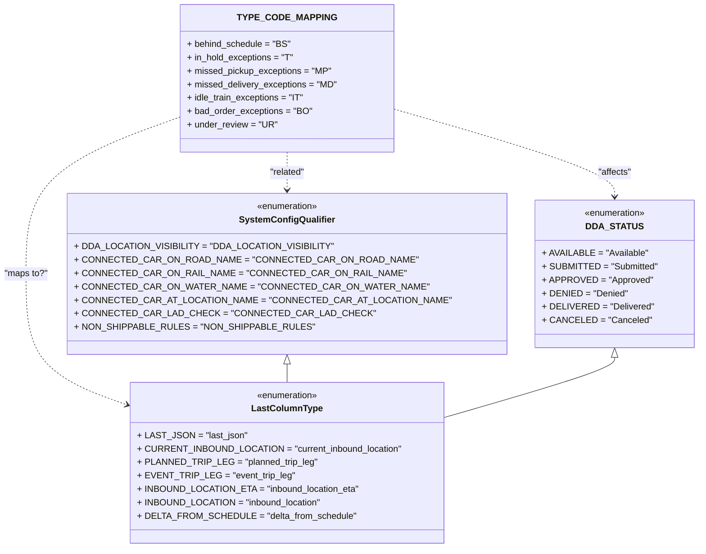

# Diagram: shipment_core/chromium_export/fv/python/fv/aws/lambdas/entity/constants.py

> Auto-generated by Obscura crawlers

## Mermaid

### SVG

<svg id="container" width="1149.9375" xmlns="http://www.w3.org/2000/svg" class="classDiagram" height="980" viewBox="0 0 1149.9375 980" role="graphics-document document" aria-roledescription="class"><g><defs><marker id="container_class-aggregationStart" class="marker aggregation class" refX="18" refY="7" markerWidth="190" markerHeight="240" orient="auto"><path d="M 18,7 L9,13 L1,7 L9,1 Z"></path></marker></defs><defs><marker id="container_class-aggregationEnd" class="marker aggregation class" refX="1" refY="7" markerWidth="20" markerHeight="28" orient="auto"><path d="M 18,7 L9,13 L1,7 L9,1 Z"></path></marker></defs><defs><marker id="container_class-extensionStart" class="marker extension class" refX="18" refY="7" markerWidth="190" markerHeight="240" orient="auto"><path d="M 1,7 L18,13 V 1 Z"></path></marker></defs><defs><marker id="container_class-extensionEnd" class="marker extension class" refX="1" refY="7" markerWidth="20" markerHeight="28" orient="auto"><path d="M 1,1 V 13 L18,7 Z"></path></marker></defs><defs><marker id="container_class-compositionStart" class="marker composition class" refX="18" refY="7" markerWidth="190" markerHeight="240" orient="auto"><path d="M 18,7 L9,13 L1,7 L9,1 Z"></path></marker></defs><defs><marker id="container_class-compositionEnd" class="marker composition class" refX="1" refY="7" markerWidth="20" markerHeight="28" orient="auto"><path d="M 18,7 L9,13 L1,7 L9,1 Z"></path></marker></defs><defs><marker id="container_class-dependencyStart" class="marker dependency class" refX="6" refY="7" markerWidth="190" markerHeight="240" orient="auto"><path d="M 5,7 L9,13 L1,7 L9,1 Z"></path></marker></defs><defs><marker id="container_class-dependencyEnd" class="marker dependency class" refX="13" refY="7" markerWidth="20" markerHeight="28" orient="auto"><path d="M 18,7 L9,13 L14,7 L9,1 Z"></path></marker></defs><defs><marker id="container_class-lollipopStart" class="marker lollipop class" refX="13" refY="7" markerWidth="190" markerHeight="240" orient="auto"><circle stroke="black" fill="transparent" cx="7" cy="7" r="6"></circle></marker></defs><defs><marker id="container_class-lollipopEnd" class="marker lollipop class" refX="1" refY="7" markerWidth="190" markerHeight="240" orient="auto"><circle stroke="black" fill="transparent" cx="7" cy="7" r="6"></circle></marker></defs><g class="root"><g class="clusters"></g><g class="edgePaths"><path d="M282.344,214.404L243.118,230.17C203.893,245.936,125.443,277.468,86.217,323.401C46.992,369.333,46.992,429.667,46.992,488C46.992,546.333,46.992,602.667,71.557,640.707C96.122,678.747,145.252,698.494,169.817,708.368L194.382,718.241" id="id_TYPE_CODE_MAPPING_LastColumnType_1" class="edge-thickness-normal edge-pattern-dashed relation" style=";;;" data-edge="true" data-et="edge" data-id="id_TYPE_CODE_MAPPING_LastColumnType_1" data-points="W3sieCI6MjgyLjM0Mzc1LCJ5IjoyMTQuNDAzNzEwNTUxMDA4NDZ9LHsieCI6NDYuOTkyMTg3NSwieSI6MzA5fSx7IngiOjQ2Ljk5MjE4NzUsInkiOjQ5MH0seyJ4Ijo0Ni45OTIxODc1LCJ5Ijo2NTl9LHsieCI6MTk5Ljk0OTIxODc1LCJ5Ijo3MjAuNDc4OTUyNzk1OTE5N31d" marker-end="url(#container_class-dependencyEnd)"></path><path d="M467.457,272L467.457,278.167C467.457,284.333,467.457,296.667,467.457,308C467.457,319.333,467.457,329.667,467.457,334.833L467.457,340" id="id_TYPE_CODE_MAPPING_SystemConfigQualifier_2" class="edge-thickness-normal edge-pattern-dashed relation" style=";;;" data-edge="true" data-et="edge" data-id="id_TYPE_CODE_MAPPING_SystemConfigQualifier_2" data-points="W3sieCI6NDY3LjQ1NzAzMTI1LCJ5IjoyNzJ9LHsieCI6NDY3LjQ1NzAzMTI1LCJ5IjozMDl9LHsieCI6NDY3LjQ1NzAzMTI1LCJ5IjozNDZ9XQ==" marker-end="url(#container_class-dependencyEnd)"></path><path d="M652.57,198.423L710.964,216.852C769.358,235.282,886.146,272.141,944.54,297.737C1002.934,323.333,1002.934,337.667,1002.934,344.833L1002.934,352" id="id_TYPE_CODE_MAPPING_DDA_STATUS_3" class="edge-thickness-normal edge-pattern-dashed relation" style=";;;" data-edge="true" data-et="edge" data-id="id_TYPE_CODE_MAPPING_DDA_STATUS_3" data-points="W3sieCI6NjUyLjU3MDMxMjUsInkiOjE5OC40MjI5OTQ5OTU2OTZ9LHsieCI6MTAwMi45MzM1OTM3NSwieSI6MzA5fSx7IngiOjEwMDIuOTMzNTkzNzUsInkiOjM1OH1d" marker-end="url(#container_class-dependencyEnd)"></path><path d="M467.457,651.25L467.457,652.542C467.457,653.833,467.457,656.417,467.457,661.875C467.457,667.333,467.457,675.667,467.457,679.833L467.457,684" id="id_SystemConfigQualifier_LastColumnType_4" class="edge-thickness-normal edge-pattern-solid relation" style=";;;" data-edge="true" data-et="edge" data-id="id_SystemConfigQualifier_LastColumnType_4" data-points="W3sieCI6NDY3LjQ1NzAzMTI1LCJ5Ijo2MzR9LHsieCI6NDY3LjQ1NzAzMTI1LCJ5Ijo2NTl9LHsieCI6NDY3LjQ1NzAzMTI1LCJ5Ijo2ODR9XQ==" marker-start="url(#container_class-extensionStart)"></path><path d="M1002.934,639.25L1002.934,642.542C1002.934,645.833,1002.934,652.417,958.272,669.804C913.611,687.191,824.288,715.382,779.626,729.477L734.965,743.573" id="id_DDA_STATUS_LastColumnType_5" class="edge-thickness-normal edge-pattern-solid relation" style=";;;" data-edge="true" data-et="edge" data-id="id_DDA_STATUS_LastColumnType_5" data-points="W3sieCI6MTAwMi45MzM1OTM3NSwieSI6NjIyfSx7IngiOjEwMDIuOTMzNTkzNzUsInkiOjY1OX0seyJ4Ijo3MzQuOTY0ODQzNzUsInkiOjc0My41NzI3Mzc0ODU1OTI2fV0=" marker-start="url(#container_class-extensionStart)"></path></g><g class="edgeLabels"><g class="edgeLabel" transform="translate(46.9921875, 490)"><g class="label" data-id="id_TYPE_CODE_MAPPING_LastColumnType_1" transform="translate(-38.9921875, -12)"><foreignObject width="77.984375" height="24">

"maps to?"

</foreignObject></g></g><g class="edgeLabel" transform="translate(467.45703125, 309)"><g class="label" data-id="id_TYPE_CODE_MAPPING_SystemConfigQualifier_2" transform="translate(-32.1640625, -12)"><foreignObject width="64.328125" height="24">

"related"

</foreignObject></g></g><g class="edgeLabel" transform="translate(1002.93359375, 309)"><g class="label" data-id="id_TYPE_CODE_MAPPING_DDA_STATUS_3" transform="translate(-30.5859375, -12)"><foreignObject width="61.171875" height="24">

"affects"

</foreignObject></g></g><g class="edgeLabel"><g class="label" data-id="id_SystemConfigQualifier_LastColumnType_4" transform="translate(0, 0)"><foreignObject width="0" height="0">

</foreignObject></g></g><g class="edgeLabel"><g class="label" data-id="id_DDA_STATUS_LastColumnType_5" transform="translate(0, 0)"><foreignObject width="0" height="0">

</foreignObject></g></g></g><g class="nodes"><g class="node default" id="classId-TYPE_CODE_MAPPING-0" transform="translate(467.45703125, 140)"><g class="basic label-container"><path d="M-185.11328125 -132 L185.11328125 -132 L185.11328125 132 L-185.11328125 132" stroke="none" stroke-width="0" fill="#ECECFF" style=""></path><path d="M-185.11328125 -132 C-92.84790003724181 -132, -0.5825188244836284 -132, 185.11328125 -132 M-185.11328125 -132 C-47.977597427727574 -132, 89.15808639454485 -132, 185.11328125 -132 M185.11328125 -132 C185.11328125 -75.17643005837787, 185.11328125 -18.35286011675575, 185.11328125 132 M185.11328125 -132 C185.11328125 -61.32435049611692, 185.11328125 9.351299007766158, 185.11328125 132 M185.11328125 132 C107.54936512359755 132, 29.985448997195107 132, -185.11328125 132 M185.11328125 132 C57.27950333400804 132, -70.55427458198392 132, -185.11328125 132 M-185.11328125 132 C-185.11328125 67.19554015410569, -185.11328125 2.3910803082113716, -185.11328125 -132 M-185.11328125 132 C-185.11328125 41.22750547120776, -185.11328125 -49.54498905758447, -185.11328125 -132" stroke="#9370DB" stroke-width="1.3" fill="none" stroke-dasharray="0 0" style=""></path></g><g class="annotation-group text" transform="translate(0, -108)"></g><g class="label-group text" transform="translate(-78.8828125, -108)"><g class="label" style="font-weight: bolder" transform="translate(0,-12)"><foreignObject width="157.765625" height="24">

TYPE_CODE_MAPPING

</foreignObject></g></g><g class="members-group text" transform="translate(-173.11328125, -60)"><g class="label" style="" transform="translate(0,-12)"><foreignObject width="184.25" height="24">

+ behind_schedule = "BS"

</foreignObject></g><g class="label" style="" transform="translate(0,12)"><foreignObject width="191.40625" height="24">

+ in_hold_exceptions = "T"

</foreignObject></g><g class="label" style="" transform="translate(0,36)"><foreignObject width="257.296875" height="24">

+ missed_pickup_exceptions = "MP"

</foreignObject></g><g class="label" style="" transform="translate(0,60)"><foreignObject width="267.34375" height="24">

+ missed_delivery_exceptions = "MD"

</foreignObject></g><g class="label" style="" transform="translate(0,84)"><foreignObject width="209.921875" height="24">

+ idle_train_exceptions = "IT"

</foreignObject></g><g class="label" style="" transform="translate(0,108)"><foreignObject width="222.34375" height="24">

+ bad_order_exceptions = "BO"

</foreignObject></g><g class="label" style="" transform="translate(0,132)"><foreignObject width="158.875" height="24">

+ under_review = "UR"

</foreignObject></g></g><g class="methods-group text" transform="translate(-173.11328125, 132)"></g><g class="divider" style=""><path d="M-185.11328125 -84 C-77.1627338653342 -84, 30.787813519331593 -84, 185.11328125 -84 M-185.11328125 -84 C-58.817226619276425 -84, 67.47882801144715 -84, 185.11328125 -84" stroke="#9370DB" stroke-width="1.3" fill="none" stroke-dasharray="0 0" style=""></path></g><g class="divider" style=""><path d="M-185.11328125 108 C-66.17916687637671 108, 52.754947497246576 108, 185.11328125 108 M-185.11328125 108 C-61.66224785462623 108, 61.78878554074754 108, 185.11328125 108" stroke="#9370DB" stroke-width="1.3" fill="none" stroke-dasharray="0 0" style=""></path></g></g><g class="node default" id="classId-SystemConfigQualifier-1" transform="translate(467.45703125, 490)"><g class="basic label-container"><path d="M-346.47265625 -144 L346.47265625 -144 L346.47265625 144 L-346.47265625 144" stroke="none" stroke-width="0" fill="#ECECFF" style=""></path><path d="M-346.47265625 -144 C-149.5430107530662 -144, 47.3866347438676 -144, 346.47265625 -144 M-346.47265625 -144 C-160.39183102776215 -144, 25.688994194475697 -144, 346.47265625 -144 M346.47265625 -144 C346.47265625 -75.38120217244175, 346.47265625 -6.7624043448834925, 346.47265625 144 M346.47265625 -144 C346.47265625 -44.08390962870237, 346.47265625 55.832180742595256, 346.47265625 144 M346.47265625 144 C184.4784410296717 144, 22.4842258093434 144, -346.47265625 144 M346.47265625 144 C192.26349296853493 144, 38.05432968706987 144, -346.47265625 144 M-346.47265625 144 C-346.47265625 79.42160260488818, -346.47265625 14.843205209776357, -346.47265625 -144 M-346.47265625 144 C-346.47265625 31.257271811517285, -346.47265625 -81.48545637696543, -346.47265625 -144" stroke="#9370DB" stroke-width="1.3" fill="none" stroke-dasharray="0 0" style=""></path></g><g class="annotation-group text" transform="translate(-55.5546875, -120)"><g class="label" style="" transform="translate(0,-12)"><foreignObject width="111.109375" height="24">

«enumeration»

</foreignObject></g></g><g class="label-group text" transform="translate(-80.9296875, -96)"><g class="label" style="font-weight: bolder" transform="translate(0,-12)"><foreignObject width="161.859375" height="24">

SystemConfigQualifier

</foreignObject></g></g><g class="members-group text" transform="translate(-334.47265625, -48)"><g class="label" style="" transform="translate(0,-12)"><foreignObject width="416.359375" height="24">

+ DDA_LOCATION_VISIBILITY = "DDA_LOCATION_VISIBILITY"

</foreignObject></g><g class="label" style="" transform="translate(0,12)"><foreignObject width="536.328125" height="24">

+ CONNECTED_CAR_ON_ROAD_NAME = "CONNECTED_CAR_ON_ROAD_NAME"

</foreignObject></g><g class="label" style="" transform="translate(0,36)"><foreignObject width="520.84375" height="24">

+ CONNECTED_CAR_ON_RAIL_NAME = "CONNECTED_CAR_ON_RAIL_NAME"

</foreignObject></g><g class="label" style="" transform="translate(0,60)"><foreignObject width="552.046875" height="24">

+ CONNECTED_CAR_ON_WATER_NAME = "CONNECTED_CAR_ON_WATER_NAME"

</foreignObject></g><g class="label" style="" transform="translate(0,84)"><foreignObject width="588.015625" height="24">

+ CONNECTED_CAR_AT_LOCATION_NAME = "CONNECTED_CAR_AT_LOCATION_NAME"

</foreignObject></g><g class="label" style="" transform="translate(0,108)"><foreignObject width="461.703125" height="24">

+ CONNECTED_CAR_LAD_CHECK = "CONNECTED_CAR_LAD_CHECK"

</foreignObject></g><g class="label" style="" transform="translate(0,132)"><foreignObject width="385.0625" height="24">

+ NON_SHIPPABLE_RULES = "NON_SHIPPABLE_RULES"

</foreignObject></g></g><g class="methods-group text" transform="translate(-334.47265625, 144)"></g><g class="divider" style=""><path d="M-346.47265625 -72 C-73.81104691096107 -72, 198.85056242807786 -72, 346.47265625 -72 M-346.47265625 -72 C-164.36208601584042 -72, 17.748484218319163 -72, 346.47265625 -72" stroke="#9370DB" stroke-width="1.3" fill="none" stroke-dasharray="0 0" style=""></path></g><g class="divider" style=""><path d="M-346.47265625 120 C-167.79136161486417 120, 10.889933020271656 120, 346.47265625 120 M-346.47265625 120 C-164.54174452787356 120, 17.389167194252877 120, 346.47265625 120" stroke="#9370DB" stroke-width="1.3" fill="none" stroke-dasharray="0 0" style=""></path></g></g><g class="node default" id="classId-DDA_STATUS-2" transform="translate(1002.93359375, 490)"><g class="basic label-container"><path d="M-139.00390625 -132 L139.00390625 -132 L139.00390625 132 L-139.00390625 132" stroke="none" stroke-width="0" fill="#ECECFF" style=""></path><path d="M-139.00390625 -132 C-74.4077543317879 -132, -9.811602413575798 -132, 139.00390625 -132 M-139.00390625 -132 C-67.4930856033995 -132, 4.017735043200986 -132, 139.00390625 -132 M139.00390625 -132 C139.00390625 -56.30499932127687, 139.00390625 19.390001357446266, 139.00390625 132 M139.00390625 -132 C139.00390625 -62.08768418322735, 139.00390625 7.824631633545295, 139.00390625 132 M139.00390625 132 C73.9321564223724 132, 8.860406594744802 132, -139.00390625 132 M139.00390625 132 C70.72658784904638 132, 2.449269448092764 132, -139.00390625 132 M-139.00390625 132 C-139.00390625 67.98844864361513, -139.00390625 3.9768972872302584, -139.00390625 -132 M-139.00390625 132 C-139.00390625 69.51886898396938, -139.00390625 7.0377379679387815, -139.00390625 -132" stroke="#9370DB" stroke-width="1.3" fill="none" stroke-dasharray="0 0" style=""></path></g><g class="annotation-group text" transform="translate(-55.5546875, -108)"><g class="label" style="" transform="translate(0,-12)"><foreignObject width="111.109375" height="24">

«enumeration»

</foreignObject></g></g><g class="label-group text" transform="translate(-45.765625, -84)"><g class="label" style="font-weight: bolder" transform="translate(0,-12)"><foreignObject width="91.53125" height="24">

DDA_STATUS

</foreignObject></g></g><g class="members-group text" transform="translate(-127.00390625, -36)"><g class="label" style="" transform="translate(0,-12)"><foreignObject width="181.875" height="24">

+ AVAILABLE = "Available"

</foreignObject></g><g class="label" style="" transform="translate(0,12)"><foreignObject width="198.453125" height="24">

+ SUBMITTED = "Submitted"

</foreignObject></g><g class="label" style="" transform="translate(0,36)"><foreignObject width="186.296875" height="24">

+ APPROVED = "Approved"

</foreignObject></g><g class="label" style="" transform="translate(0,60)"><foreignObject width="146.0625" height="24">

+ DENIED = "Denied"

</foreignObject></g><g class="label" style="" transform="translate(0,84)"><foreignObject width="187.765625" height="24">

+ DELIVERED = "Delivered"

</foreignObject></g><g class="label" style="" transform="translate(0,108)"><foreignObject width="180.71875" height="24">

+ CANCELED = "Canceled"

</foreignObject></g></g><g class="methods-group text" transform="translate(-127.00390625, 132)"></g><g class="divider" style=""><path d="M-139.00390625 -60 C-53.18775087205526 -60, 32.62840450588948 -60, 139.00390625 -60 M-139.00390625 -60 C-74.13878590317276 -60, -9.27366555634552 -60, 139.00390625 -60" stroke="#9370DB" stroke-width="1.3" fill="none" stroke-dasharray="0 0" style=""></path></g><g class="divider" style=""><path d="M-139.00390625 108 C-58.58128868374274 108, 21.841328882514517 108, 139.00390625 108 M-139.00390625 108 C-65.65085585969103 108, 7.7021945306179305 108, 139.00390625 108" stroke="#9370DB" stroke-width="1.3" fill="none" stroke-dasharray="0 0" style=""></path></g></g><g class="node default" id="classId-LastColumnType-3" transform="translate(467.45703125, 828)"><g class="basic label-container"><path d="M-267.5078125 -144 L267.5078125 -144 L267.5078125 144 L-267.5078125 144" stroke="none" stroke-width="0" fill="#ECECFF" style=""></path><path d="M-267.5078125 -144 C-154.43845053422547 -144, -41.369088568450934 -144, 267.5078125 -144 M-267.5078125 -144 C-138.71256895321332 -144, -9.917325406426642 -144, 267.5078125 -144 M267.5078125 -144 C267.5078125 -75.35273764275311, 267.5078125 -6.705475285506225, 267.5078125 144 M267.5078125 -144 C267.5078125 -32.01058516728955, 267.5078125 79.9788296654209, 267.5078125 144 M267.5078125 144 C145.4129186881382 144, 23.31802487627641 144, -267.5078125 144 M267.5078125 144 C61.08433807639986 144, -145.33913634720028 144, -267.5078125 144 M-267.5078125 144 C-267.5078125 61.1731739442465, -267.5078125 -21.653652111507, -267.5078125 -144 M-267.5078125 144 C-267.5078125 76.00303727600584, -267.5078125 8.006074552011682, -267.5078125 -144" stroke="#9370DB" stroke-width="1.3" fill="none" stroke-dasharray="0 0" style=""></path></g><g class="annotation-group text" transform="translate(-55.5546875, -120)"><g class="label" style="" transform="translate(0,-12)"><foreignObject width="111.109375" height="24">

«enumeration»

</foreignObject></g></g><g class="label-group text" transform="translate(-60.0625, -96)"><g class="label" style="font-weight: bolder" transform="translate(0,-12)"><foreignObject width="120.125" height="24">

LastColumnType

</foreignObject></g></g><g class="members-group text" transform="translate(-255.5078125, -48)"><g class="label" style="" transform="translate(0,-12)"><foreignObject width="184.5625" height="24">

+ LAST_JSON = "last_json"

</foreignObject></g><g class="label" style="" transform="translate(0,12)"><foreignObject width="450.953125" height="24">

+ CURRENT_INBOUND_LOCATION = "current_inbound_location"

</foreignObject></g><g class="label" style="" transform="translate(0,36)"><foreignObject width="303.9375" height="24">

+ PLANNED_TRIP_LEG = "planned_trip_leg"

</foreignObject></g><g class="label" style="" transform="translate(0,60)"><foreignObject width="262.171875" height="24">

+ EVENT_TRIP_LEG = "event_trip_leg"

</foreignObject></g><g class="label" style="" transform="translate(0,84)"><foreignObject width="380.828125" height="24">

+ INBOUND_LOCATION_ETA = "inbound_location_eta"

</foreignObject></g><g class="label" style="" transform="translate(0,108)"><foreignObject width="316.21875" height="24">

+ INBOUND_LOCATION = "inbound_location"

</foreignObject></g><g class="label" style="" transform="translate(0,132)"><foreignObject width="368.171875" height="24">

+ DELTA_FROM_SCHEDULE = "delta_from_schedule"

</foreignObject></g></g><g class="methods-group text" transform="translate(-255.5078125, 144)"></g><g class="divider" style=""><path d="M-267.5078125 -72 C-109.3298865669592 -72, 48.84803936608159 -72, 267.5078125 -72 M-267.5078125 -72 C-88.5164127605984 -72, 90.4749869788032 -72, 267.5078125 -72" stroke="#9370DB" stroke-width="1.3" fill="none" stroke-dasharray="0 0" style=""></path></g><g class="divider" style=""><path d="M-267.5078125 120 C-69.66133574995251 120, 128.18514100009497 120, 267.5078125 120 M-267.5078125 120 C-110.12917783885447 120, 47.24945682229105 120, 267.5078125 120" stroke="#9370DB" stroke-width="1.3" fill="none" stroke-dasharray="0 0" style=""></path></g></g></g></g></g></svg>
