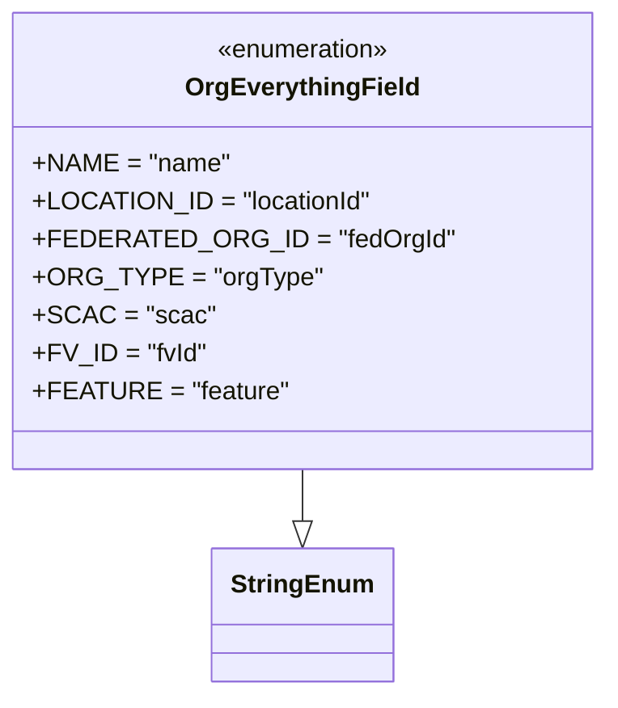

# Diagram: shipment_core/chromium_export/fv/python/fv/aws/lambdas/iam/constants.py

> Auto-generated by Obscura crawlers

## Mermaid

### SVG

<svg id="container" width="351.2578125" xmlns="http://www.w3.org/2000/svg" class="classDiagram" height="438" viewBox="0 0 351.2578125 438" role="graphics-document document" aria-roledescription="class"><g><defs><marker id="container_class-aggregationStart" class="marker aggregation class" refX="18" refY="7" markerWidth="190" markerHeight="240" orient="auto"><path d="M 18,7 L9,13 L1,7 L9,1 Z"></path></marker></defs><defs><marker id="container_class-aggregationEnd" class="marker aggregation class" refX="1" refY="7" markerWidth="20" markerHeight="28" orient="auto"><path d="M 18,7 L9,13 L1,7 L9,1 Z"></path></marker></defs><defs><marker id="container_class-extensionStart" class="marker extension class" refX="18" refY="7" markerWidth="190" markerHeight="240" orient="auto"><path d="M 1,7 L18,13 V 1 Z"></path></marker></defs><defs><marker id="container_class-extensionEnd" class="marker extension class" refX="1" refY="7" markerWidth="20" markerHeight="28" orient="auto"><path d="M 1,1 V 13 L18,7 Z"></path></marker></defs><defs><marker id="container_class-compositionStart" class="marker composition class" refX="18" refY="7" markerWidth="190" markerHeight="240" orient="auto"><path d="M 18,7 L9,13 L1,7 L9,1 Z"></path></marker></defs><defs><marker id="container_class-compositionEnd" class="marker composition class" refX="1" refY="7" markerWidth="20" markerHeight="28" orient="auto"><path d="M 18,7 L9,13 L1,7 L9,1 Z"></path></marker></defs><defs><marker id="container_class-dependencyStart" class="marker dependency class" refX="6" refY="7" markerWidth="190" markerHeight="240" orient="auto"><path d="M 5,7 L9,13 L1,7 L9,1 Z"></path></marker></defs><defs><marker id="container_class-dependencyEnd" class="marker dependency class" refX="13" refY="7" markerWidth="20" markerHeight="28" orient="auto"><path d="M 18,7 L9,13 L14,7 L9,1 Z"></path></marker></defs><defs><marker id="container_class-lollipopStart" class="marker lollipop class" refX="13" refY="7" markerWidth="190" markerHeight="240" orient="auto"><circle stroke="black" fill="transparent" cx="7" cy="7" r="6"></circle></marker></defs><defs><marker id="container_class-lollipopEnd" class="marker lollipop class" refX="1" refY="7" markerWidth="190" markerHeight="240" orient="auto"><circle stroke="black" fill="transparent" cx="7" cy="7" r="6"></circle></marker></defs><g class="root"><g class="clusters"></g><g class="edgePaths"><path d="M175.629,296L175.629,300.167C175.629,304.333,175.629,312.667,175.629,318.125C175.629,323.583,175.629,326.167,175.629,327.458L175.629,328.75" id="id_OrgEverythingField_StringEnum_1" class="edge-thickness-normal edge-pattern-solid relation" style=";;;" data-edge="true" data-et="edge" data-id="id_OrgEverythingField_StringEnum_1" data-points="W3sieCI6MTc1LjYyODkwNjI1LCJ5IjoyOTZ9LHsieCI6MTc1LjYyODkwNjI1LCJ5IjozMjF9LHsieCI6MTc1LjYyODkwNjI1LCJ5IjozNDZ9XQ==" marker-end="url(#container_class-extensionEnd)"></path></g><g class="edgeLabels"><g class="edgeLabel"><g class="label" data-id="id_OrgEverythingField_StringEnum_1" transform="translate(0, 0)"><foreignObject width="0" height="0">

</foreignObject></g></g></g><g class="nodes"><g class="node default" id="classId-StringEnum-0" transform="translate(175.62890625, 388)"><g class="basic label-container"><path d="M-54.234375 -42 L54.234375 -42 L54.234375 42 L-54.234375 42" stroke="none" stroke-width="0" fill="#ECECFF" style=""></path><path d="M-54.234375 -42 C-11.411123408538742 -42, 31.412128182922515 -42, 54.234375 -42 M-54.234375 -42 C-23.51935336015078 -42, 7.195668279698438 -42, 54.234375 -42 M54.234375 -42 C54.234375 -13.122468039447668, 54.234375 15.755063921104664, 54.234375 42 M54.234375 -42 C54.234375 -11.777330577231137, 54.234375 18.445338845537727, 54.234375 42 M54.234375 42 C22.724607395505323 42, -8.785160208989353 42, -54.234375 42 M54.234375 42 C25.75182553495258 42, -2.7307239300948396 42, -54.234375 42 M-54.234375 42 C-54.234375 22.897943536466627, -54.234375 3.7958870729332546, -54.234375 -42 M-54.234375 42 C-54.234375 8.853709018529635, -54.234375 -24.29258196294073, -54.234375 -42" stroke="#9370DB" stroke-width="1.3" fill="none" stroke-dasharray="0 0" style=""></path></g><g class="annotation-group text" transform="translate(0, -18)"></g><g class="label-group text" transform="translate(-42.234375, -18)"><g class="label" style="font-weight: bolder" transform="translate(0,-12)"><foreignObject width="84.46875" height="24">

StringEnum

</foreignObject></g></g><g class="members-group text" transform="translate(-42.234375, 30)"></g><g class="methods-group text" transform="translate(-42.234375, 60)"></g><g class="divider" style=""><path d="M-54.234375 6 C-28.24275484099895 6, -2.251134681997897 6, 54.234375 6 M-54.234375 6 C-23.443707731020933 6, 7.346959537958135 6, 54.234375 6" stroke="#9370DB" stroke-width="1.3" fill="none" stroke-dasharray="0 0" style=""></path></g><g class="divider" style=""><path d="M-54.234375 24 C-32.22270660734456 24, -10.211038214689118 24, 54.234375 24 M-54.234375 24 C-11.943139138684288 24, 30.348096722631425 24, 54.234375 24" stroke="#9370DB" stroke-width="1.3" fill="none" stroke-dasharray="0 0" style=""></path></g></g><g class="node default" id="classId-OrgEverythingField-1" transform="translate(175.62890625, 152)"><g class="basic label-container"><path d="M-167.62890625 -144 L167.62890625 -144 L167.62890625 144 L-167.62890625 144" stroke="none" stroke-width="0" fill="#ECECFF" style=""></path><path d="M-167.62890625 -144 C-35.78707314400728 -144, 96.05475996198544 -144, 167.62890625 -144 M-167.62890625 -144 C-54.31705819670755 -144, 58.9947898565849 -144, 167.62890625 -144 M167.62890625 -144 C167.62890625 -56.654130634707286, 167.62890625 30.691738730585428, 167.62890625 144 M167.62890625 -144 C167.62890625 -51.91908527201031, 167.62890625 40.16182945597939, 167.62890625 144 M167.62890625 144 C67.98200880395743 144, -31.664888642085145 144, -167.62890625 144 M167.62890625 144 C80.29467926848979 144, -7.039547713020426 144, -167.62890625 144 M-167.62890625 144 C-167.62890625 84.05423844909328, -167.62890625 24.108476898186566, -167.62890625 -144 M-167.62890625 144 C-167.62890625 64.11565495156965, -167.62890625 -15.768690096860695, -167.62890625 -144" stroke="#9370DB" stroke-width="1.3" fill="none" stroke-dasharray="0 0" style=""></path></g><g class="annotation-group text" transform="translate(-55.5546875, -120)"><g class="label" style="" transform="translate(0,-12)"><foreignObject width="111.109375" height="24">

«enumeration»

</foreignObject></g></g><g class="label-group text" transform="translate(-69.3671875, -96)"><g class="label" style="font-weight: bolder" transform="translate(0,-12)"><foreignObject width="138.734375" height="24">

OrgEverythingField

</foreignObject></g></g><g class="members-group text" transform="translate(-155.62890625, -48)"><g class="label" style="" transform="translate(0,-12)"><foreignObject width="118.703125" height="24">

+NAME = "name"

</foreignObject></g><g class="label" style="" transform="translate(0,12)"><foreignObject width="204.671875" height="24">

+LOCATION_ID = "locationId"

</foreignObject></g><g class="label" style="" transform="translate(0,36)"><foreignObject width="241.890625" height="24">

+FEDERATED_ORG_ID = "fedOrgId"

</foreignObject></g><g class="label" style="" transform="translate(0,60)"><foreignObject width="167.40625" height="24">

+ORG_TYPE = "orgType"

</foreignObject></g><g class="label" style="" transform="translate(0,84)"><foreignObject width="103.40625" height="24">

+SCAC = "scac"

</foreignObject></g><g class="label" style="" transform="translate(0,108)"><foreignObject width="104.0625" height="24">

+FV_ID = "fvId"

</foreignObject></g><g class="label" style="" transform="translate(0,132)"><foreignObject width="150.9375" height="24">

+FEATURE = "feature"

</foreignObject></g></g><g class="methods-group text" transform="translate(-155.62890625, 144)"></g><g class="divider" style=""><path d="M-167.62890625 -72 C-87.58025112329607 -72, -7.531595996592131 -72, 167.62890625 -72 M-167.62890625 -72 C-54.89127068930824 -72, 57.846364871383514 -72, 167.62890625 -72" stroke="#9370DB" stroke-width="1.3" fill="none" stroke-dasharray="0 0" style=""></path></g><g class="divider" style=""><path d="M-167.62890625 120 C-43.98805993329579 120, 79.65278638340843 120, 167.62890625 120 M-167.62890625 120 C-63.2696356131671 120, 41.08963502366581 120, 167.62890625 120" stroke="#9370DB" stroke-width="1.3" fill="none" stroke-dasharray="0 0" style=""></path></g></g></g></g></g></svg>
