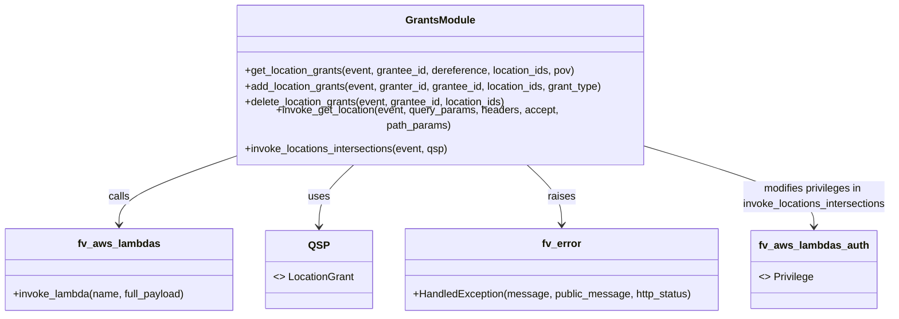

# Diagram: shipment_core/chromium_export/fv/python/fv/aws/lambdas/invokinators/invokinator_location.py


> Auto-generated by Obscura crawlers

## Diagram 1



### SVG

<svg id="container" width="1364.5234375" xmlns="http://www.w3.org/2000/svg" class="classDiagram" height="462" viewBox="0 0 1364.5234375 462" role="graphics-document document" aria-roledescription="class"><style>#container{font-family:"trebuchet ms",verdana,arial,sans-serif;font-size:16px;fill:#333;}@keyframes edge-animation-frame{from{stroke-dashoffset:0;}}@keyframes dash{to{stroke-dashoffset:0;}}#container .edge-animation-slow{stroke-dasharray:9,5!important;stroke-dashoffset:900;animation:dash 50s linear infinite;stroke-linecap:round;}#container .edge-animation-fast{stroke-dasharray:9,5!important;stroke-dashoffset:900;animation:dash 20s linear infinite;stroke-linecap:round;}#container .error-icon{fill:#552222;}#container .error-text{fill:#552222;stroke:#552222;}#container .edge-thickness-normal{stroke-width:1px;}#container .edge-thickness-thick{stroke-width:3.5px;}#container .edge-pattern-solid{stroke-dasharray:0;}#container .edge-thickness-invisible{stroke-width:0;fill:none;}#container .edge-pattern-dashed{stroke-dasharray:3;}#container .edge-pattern-dotted{stroke-dasharray:2;}#container .marker{fill:#333333;stroke:#333333;}#container .marker.cross{stroke:#333333;}#container svg{font-family:"trebuchet ms",verdana,arial,sans-serif;font-size:16px;}#container p{margin:0;}#container g.classGroup text{fill:#9370DB;stroke:none;font-family:"trebuchet ms",verdana,arial,sans-serif;font-size:10px;}#container g.classGroup text .title{font-weight:bolder;}#container .nodeLabel,#container .edgeLabel{color:#131300;}#container .edgeLabel .label rect{fill:#ECECFF;}#container .label text{fill:#131300;}#container .labelBkg{background:#ECECFF;}#container .edgeLabel .label span{background:#ECECFF;}#container .classTitle{font-weight:bolder;}#container .node rect,#container .node circle,#container .node ellipse,#container .node polygon,#container .node path{fill:#ECECFF;stroke:#9370DB;stroke-width:1px;}#container .divider{stroke:#9370DB;stroke-width:1;}#container g.clickable{cursor:pointer;}#container g.classGroup rect{fill:#ECECFF;stroke:#9370DB;}#container g.classGroup line{stroke:#9370DB;stroke-width:1;}#container .classLabel .box{stroke:none;stroke-width:0;fill:#ECECFF;opacity:0.5;}#container .classLabel .label{fill:#9370DB;font-size:10px;}#container .relation{stroke:#333333;stroke-width:1;fill:none;}#container .dashed-line{stroke-dasharray:3;}#container .dotted-line{stroke-dasharray:1 2;}#container #compositionStart,#container .composition{fill:#333333!important;stroke:#333333!important;stroke-width:1;}#container #compositionEnd,#container .composition{fill:#333333!important;stroke:#333333!important;stroke-width:1;}#container #dependencyStart,#container .dependency{fill:#333333!important;stroke:#333333!important;stroke-width:1;}#container #dependencyStart,#container .dependency{fill:#333333!important;stroke:#333333!important;stroke-width:1;}#container #extensionStart,#container .extension{fill:transparent!important;stroke:#333333!important;stroke-width:1;}#container #extensionEnd,#container .extension{fill:transparent!important;stroke:#333333!important;stroke-width:1;}#container #aggregationStart,#container .aggregation{fill:transparent!important;stroke:#333333!important;stroke-width:1;}#container #aggregationEnd,#container .aggregation{fill:transparent!important;stroke:#333333!important;stroke-width:1;}#container #lollipopStart,#container .lollipop{fill:#ECECFF!important;stroke:#333333!important;stroke-width:1;}#container #lollipopEnd,#container .lollipop{fill:#ECECFF!important;stroke:#333333!important;stroke-width:1;}#container .edgeTerminals{font-size:11px;line-height:initial;}#container .classTitleText{text-anchor:middle;font-size:18px;fill:#333;}#container .label-icon{display:inline-block;height:1em;overflow:visible;vertical-align:-0.125em;}#container .node .label-icon path{fill:currentColor;stroke:revert;stroke-width:revert;}#container :root{--mermaid-font-family:"trebuchet ms",verdana,arial,sans-serif;}</style><g><defs><marker id="container_class-aggregationStart" class="marker aggregation class" refX="18" refY="7" markerWidth="190" markerHeight="240" orient="auto"><path d="M 18,7 L9,13 L1,7 L9,1 Z"></path></marker></defs><defs><marker id="container_class-aggregationEnd" class="marker aggregation class" refX="1" refY="7" markerWidth="20" markerHeight="28" orient="auto"><path d="M 18,7 L9,13 L1,7 L9,1 Z"></path></marker></defs><defs><marker id="container_class-extensionStart" class="marker extension class" refX="18" refY="7" markerWidth="190" markerHeight="240" orient="auto"><path d="M 1,7 L18,13 V 1 Z"></path></marker></defs><defs><marker id="container_class-extensionEnd" class="marker extension class" refX="1" refY="7" markerWidth="20" markerHeight="28" orient="auto"><path d="M 1,1 V 13 L18,7 Z"></path></marker></defs><defs><marker id="container_class-compositionStart" class="marker composition class" refX="18" refY="7" markerWidth="190" markerHeight="240" orient="auto"><path d="M 18,7 L9,13 L1,7 L9,1 Z"></path></marker></defs><defs><marker id="container_class-compositionEnd" class="marker composition class" refX="1" refY="7" markerWidth="20" markerHeight="28" orient="auto"><path d="M 18,7 L9,13 L1,7 L9,1 Z"></path></marker></defs><defs><marker id="container_class-dependencyStart" class="marker dependency class" refX="6" refY="7" markerWidth="190" markerHeight="240" orient="auto"><path d="M 5,7 L9,13 L1,7 L9,1 Z"></path></marker></defs><defs><marker id="container_class-dependencyEnd" class="marker dependency class" refX="13" refY="7" markerWidth="20" markerHeight="28" orient="auto"><path d="M 18,7 L9,13 L14,7 L9,1 Z"></path></marker></defs><defs><marker id="container_class-lollipopStart" class="marker lollipop class" refX="13" refY="7" markerWidth="190" markerHeight="240" orient="auto"><circle stroke="black" fill="transparent" cx="7" cy="7" r="6"></circle></marker></defs><defs><marker id="container_class-lollipopEnd" class="marker lollipop class" refX="1" refY="7" markerWidth="190" markerHeight="240" orient="auto"><circle stroke="black" fill="transparent" cx="7" cy="7" r="6"></circle></marker></defs><g class="root"><g class="clusters"></g><g class="edgePaths"><path d="M359.021,221.901L329.793,231.418C300.564,240.934,242.106,259.967,212.877,276.65C183.648,293.333,183.648,307.667,183.648,314.833L183.648,322" id="id_GrantsModule_fv_aws_lambdas_1" class="edge-thickness-normal edge-pattern-solid relation" style=";;;" data-edge="true" data-et="edge" data-id="id_GrantsModule_fv_aws_lambdas_1" data-points="W3sieCI6MzU5LjAyMTQ4NDM3NSwieSI6MjIxLjkwMTI0NzU3MDYzNTR9LHsieCI6MTgzLjY0ODQzNzUsInkiOjI3OX0seyJ4IjoxODMuNjQ4NDM3NSwieSI6MzI4fV0=" marker-end="url(#container_class-dependencyEnd)"></path><path d="M546.475,230L537.014,238.167C527.552,246.333,508.63,262.667,499.168,278.5C489.707,294.333,489.707,309.667,489.707,317.333L489.707,325" id="id_GrantsModule_QSP_2" class="edge-thickness-normal edge-pattern-solid relation" style=";;;" data-edge="true" data-et="edge" data-id="id_GrantsModule_QSP_2" data-points="W3sieCI6NTQ2LjQ3NTEzNDI3NzM0MzcsInkiOjIzMH0seyJ4Ijo0ODkuNzA3MDMxMjUsInkiOjI3OX0seyJ4Ijo0ODkuNzA3MDMxMjUsInkiOjMzMX1d" marker-end="url(#container_class-dependencyEnd)"></path><path d="M803.669,230L813.131,238.167C822.592,246.333,841.515,262.667,850.976,278C860.438,293.333,860.438,307.667,860.438,314.833L860.438,322" id="id_GrantsModule_fv_error_3" class="edge-thickness-normal edge-pattern-solid relation" style=";;;" data-edge="true" data-et="edge" data-id="id_GrantsModule_fv_error_3" data-points="W3sieCI6ODAzLjY2OTM5Njk3MjY1NjMsInkiOjIzMH0seyJ4Ijo4NjAuNDM3NSwieSI6Mjc5fSx7IngiOjg2MC40Mzc1LCJ5IjozMjh9XQ==" marker-end="url(#container_class-dependencyEnd)"></path><path d="M991.123,207.845L1033.31,219.704C1075.496,231.564,1159.869,255.282,1202.056,274.808C1244.242,294.333,1244.242,309.667,1244.242,317.333L1244.242,325" id="id_GrantsModule_fv_aws_lambdas_auth_4" class="edge-thickness-normal edge-pattern-solid relation" style=";;;" data-edge="true" data-et="edge" data-id="id_GrantsModule_fv_aws_lambdas_auth_4" data-points="W3sieCI6OTkxLjEyMzA0Njg3NSwieSI6MjA3Ljg0NTM5MjMwOTkzNjAyfSx7IngiOjEyNDQuMjQyMTg3NSwieSI6Mjc5fSx7IngiOjEyNDQuMjQyMTg3NSwieSI6MzMxfV0=" marker-end="url(#container_class-dependencyEnd)"></path></g><g class="edgeLabels"><g class="edgeLabel" transform="translate(183.6484375, 279)"><g class="label" data-id="id_GrantsModule_fv_aws_lambdas_1" transform="translate(-16.4453125, -12)"><foreignObject width="32.890625" height="24"><div xmlns="http://www.w3.org/1999/xhtml" class="labelBkg" style="display: table-cell; white-space: nowrap; line-height: 1.5; max-width: 200px; text-align: center;"><span class="edgeLabel"><p>calls</p></span></div></foreignObject></g></g><g class="edgeLabel" transform="translate(489.70703125, 279)"><g class="label" data-id="id_GrantsModule_QSP_2" transform="translate(-16.4921875, -12)"><foreignObject width="32.984375" height="24"><div xmlns="http://www.w3.org/1999/xhtml" class="labelBkg" style="display: table-cell; white-space: nowrap; line-height: 1.5; max-width: 200px; text-align: center;"><span class="edgeLabel"><p>uses</p></span></div></foreignObject></g></g><g class="edgeLabel" transform="translate(860.4375, 279)"><g class="label" data-id="id_GrantsModule_fv_error_3" transform="translate(-21.25, -12)"><foreignObject width="42.5" height="24"><div xmlns="http://www.w3.org/1999/xhtml" class="labelBkg" style="display: table-cell; white-space: nowrap; line-height: 1.5; max-width: 200px; text-align: center;"><span class="edgeLabel"><p>raises</p></span></div></foreignObject></g></g><g class="edgeLabel" transform="translate(1244.2421875, 279)"><g class="label" data-id="id_GrantsModule_fv_aws_lambdas_auth_4" transform="translate(-112.28125, -24)"><foreignObject width="224.5625" height="48"><div xmlns="http://www.w3.org/1999/xhtml" class="labelBkg" style="display: table; white-space: break-spaces; line-height: 1.5; max-width: 200px; text-align: center; width: 200px;"><span class="edgeLabel"><p>modifies privileges in invoke_locations_intersections</p></span></div></foreignObject></g></g></g><g class="nodes"><g class="node default" id="classId-GrantsModule-0" transform="translate(675.072265625, 119)"><g class="basic label-container"><path d="M-316.05078125 -111 L316.05078125 -111 L316.05078125 111 L-316.05078125 111" stroke="none" stroke-width="0" fill="#ECECFF" style=""></path><path d="M-316.05078125 -111 C-163.07068968787695 -111, -10.0905981257539 -111, 316.05078125 -111 M-316.05078125 -111 C-114.65282917774178 -111, 86.74512289451644 -111, 316.05078125 -111 M316.05078125 -111 C316.05078125 -30.916931347676567, 316.05078125 49.16613730464687, 316.05078125 111 M316.05078125 -111 C316.05078125 -64.5478387169788, 316.05078125 -18.095677433957604, 316.05078125 111 M316.05078125 111 C99.74070685085917 111, -116.56936754828166 111, -316.05078125 111 M316.05078125 111 C66.63094388471819 111, -182.78889348056362 111, -316.05078125 111 M-316.05078125 111 C-316.05078125 43.88414878589754, -316.05078125 -23.231702428204926, -316.05078125 -111 M-316.05078125 111 C-316.05078125 66.42471457098884, -316.05078125 21.849429141977694, -316.05078125 -111" stroke="#9370DB" stroke-width="1.3" fill="none" stroke-dasharray="0 0" style=""></path></g><g class="annotation-group text" transform="translate(0, -87)"></g><g class="label-group text" transform="translate(-51.1328125, -87)"><g class="label" style="font-weight: bolder" transform="translate(0,-12)"><foreignObject width="102.265625" height="24"><div xmlns="http://www.w3.org/1999/xhtml" style="display: table-cell; white-space: nowrap; line-height: 1.5; max-width: 151px; text-align: center;"><span class="nodeLabel markdown-node-label" style=""><p>GrantsModule</p></span></div></foreignObject></g></g><g class="members-group text" transform="translate(-304.05078125, -39)"></g><g class="methods-group text" transform="translate(-304.05078125, -9)"><g class="label" style="" transform="translate(0,-12)"><foreignObject width="513.734375" height="24"><div xmlns="http://www.w3.org/1999/xhtml" style="display: table-cell; white-space: nowrap; line-height: 1.5; max-width: 571px; text-align: center;"><span class="nodeLabel markdown-node-label" style=""><p>+get_location_grants(event, grantee_id, dereference, location_ids, pov)</p></span></div></foreignObject></g><g class="label" style="" transform="translate(0,12)"><foreignObject width="556.96875" height="24"><div xmlns="http://www.w3.org/1999/xhtml" style="display: table-cell; white-space: nowrap; line-height: 1.5; max-width: 614px; text-align: center;"><span class="nodeLabel markdown-node-label" style=""><p>+add_location_grants(event, granter_id, grantee_id, location_ids, grant_type)</p></span></div></foreignObject></g><g class="label" style="" transform="translate(0,36)"><foreignObject width="407.609375" height="24"><div xmlns="http://www.w3.org/1999/xhtml" style="display: table-cell; white-space: nowrap; line-height: 1.5; max-width: 465px; text-align: center;"><span class="nodeLabel markdown-node-label" style=""><p>+delete_location_grants(event, grantee_id, location_ids)</p></span></div></foreignObject></g><g class="label" style="" transform="translate(0,60)"><foreignObject width="540.671875" height="24"><div xmlns="http://www.w3.org/1999/xhtml" style="display: table-cell; white-space: nowrap; line-height: 1.5; max-width: 598px; text-align: center;"><span class="nodeLabel markdown-node-label" style=""><p>+invoke_get_location(event, query_params, headers, accept, path_params)</p></span></div></foreignObject></g><g class="label" style="" transform="translate(0,84)"><foreignObject width="317.9375" height="24"><div xmlns="http://www.w3.org/1999/xhtml" style="display: table-cell; white-space: nowrap; line-height: 1.5; max-width: 375px; text-align: center;"><span class="nodeLabel markdown-node-label" style=""><p>+invoke_locations_intersections(event, qsp)</p></span></div></foreignObject></g></g><g class="divider" style=""><path d="M-316.05078125 -63 C-180.04791681551853 -63, -44.04505238103707 -63, 316.05078125 -63 M-316.05078125 -63 C-99.04110531213098 -63, 117.96857062573804 -63, 316.05078125 -63" stroke="#9370DB" stroke-width="1.3" fill="none" stroke-dasharray="0 0" style=""></path></g><g class="divider" style=""><path d="M-316.05078125 -39 C-81.52745390870064 -39, 152.99587343259873 -39, 316.05078125 -39 M-316.05078125 -39 C-163.25711135621884 -39, -10.463441462437686 -39, 316.05078125 -39" stroke="#9370DB" stroke-width="1.3" fill="none" stroke-dasharray="0 0" style=""></path></g></g><g class="node default" id="classId-fv_aws_lambdas-1" transform="translate(183.6484375, 391)"><g class="basic label-container"><path d="M-175.6484375 -63 L175.6484375 -63 L175.6484375 63 L-175.6484375 63" stroke="none" stroke-width="0" fill="#ECECFF" style=""></path><path d="M-175.6484375 -63 C-55.27935641225835 -63, 65.0897246754833 -63, 175.6484375 -63 M-175.6484375 -63 C-94.02260923761115 -63, -12.396780975222299 -63, 175.6484375 -63 M175.6484375 -63 C175.6484375 -17.38839079488686, 175.6484375 28.22321841022628, 175.6484375 63 M175.6484375 -63 C175.6484375 -31.92444497219697, 175.6484375 -0.8488899443939388, 175.6484375 63 M175.6484375 63 C50.60312866252387 63, -74.44218017495226 63, -175.6484375 63 M175.6484375 63 C42.61217366106621 63, -90.42409017786758 63, -175.6484375 63 M-175.6484375 63 C-175.6484375 21.46553546490263, -175.6484375 -20.06892907019474, -175.6484375 -63 M-175.6484375 63 C-175.6484375 29.569919378043927, -175.6484375 -3.8601612439121453, -175.6484375 -63" stroke="#9370DB" stroke-width="1.3" fill="none" stroke-dasharray="0 0" style=""></path></g><g class="annotation-group text" transform="translate(0, -39)"></g><g class="label-group text" transform="translate(-60.0625, -39)"><g class="label" style="font-weight: bolder" transform="translate(0,-12)"><foreignObject width="120.125" height="24"><div xmlns="http://www.w3.org/1999/xhtml" style="display: table-cell; white-space: nowrap; line-height: 1.5; max-width: 168px; text-align: center;"><span class="nodeLabel markdown-node-label" style=""><p>fv_aws_lambdas</p></span></div></foreignObject></g></g><g class="members-group text" transform="translate(-163.6484375, 9)"></g><g class="methods-group text" transform="translate(-163.6484375, 39)"><g class="label" style="" transform="translate(0,-12)"><foreignObject width="267.234375" height="24"><div xmlns="http://www.w3.org/1999/xhtml" style="display: table-cell; white-space: nowrap; line-height: 1.5; max-width: 325px; text-align: center;"><span class="nodeLabel markdown-node-label" style=""><p>+invoke_lambda(name, full_payload)</p></span></div></foreignObject></g></g><g class="divider" style=""><path d="M-175.6484375 -15 C-75.4328577321527 -15, 24.782722035694604 -15, 175.6484375 -15 M-175.6484375 -15 C-57.333863551172925 -15, 60.98071039765415 -15, 175.6484375 -15" stroke="#9370DB" stroke-width="1.3" fill="none" stroke-dasharray="0 0" style=""></path></g><g class="divider" style=""><path d="M-175.6484375 9 C-51.18977738667634 9, 73.26888272664732 9, 175.6484375 9 M-175.6484375 9 C-104.17137477002765 9, -32.69431204005531 9, 175.6484375 9" stroke="#9370DB" stroke-width="1.3" fill="none" stroke-dasharray="0 0" style=""></path></g></g><g class="node default" id="classId-fv_aws_lambdas_auth-2" transform="translate(1244.2421875, 391)"><g class="basic label-container"><path d="M-93.484375 -60 L93.484375 -60 L93.484375 60 L-93.484375 60" stroke="none" stroke-width="0" fill="#ECECFF" style=""></path><path d="M-93.484375 -60 C-27.068853646581303 -60, 39.346667706837394 -60, 93.484375 -60 M-93.484375 -60 C-44.19240287435556 -60, 5.099569251288884 -60, 93.484375 -60 M93.484375 -60 C93.484375 -31.333418381866412, 93.484375 -2.6668367637328245, 93.484375 60 M93.484375 -60 C93.484375 -28.413497409424046, 93.484375 3.1730051811519075, 93.484375 60 M93.484375 60 C39.76825740564312 60, -13.947860188713761 60, -93.484375 60 M93.484375 60 C27.18537090074075 60, -39.1136331985185 60, -93.484375 60 M-93.484375 60 C-93.484375 27.4023138979911, -93.484375 -5.195372204017801, -93.484375 -60 M-93.484375 60 C-93.484375 17.778635766274995, -93.484375 -24.44272846745001, -93.484375 -60" stroke="#9370DB" stroke-width="1.3" fill="none" stroke-dasharray="0 0" style=""></path></g><g class="annotation-group text" transform="translate(0, -36)"></g><g class="label-group text" transform="translate(-80.5625, -36)"><g class="label" style="font-weight: bolder" transform="translate(0,-12)"><foreignObject width="161.125" height="24"><div xmlns="http://www.w3.org/1999/xhtml" style="display: table-cell; white-space: nowrap; line-height: 1.5; max-width: 209px; text-align: center;"><span class="nodeLabel markdown-node-label" style=""><p>fv_aws_lambdas_auth</p></span></div></foreignObject></g></g><g class="members-group text" transform="translate(-81.484375, 12)"><g class="label" style="" transform="translate(0,-12)"><foreignObject width="82.40625" height="24"><div xmlns="http://www.w3.org/1999/xhtml" style="display: table-cell; white-space: nowrap; line-height: 1.5; max-width: 172px; text-align: center;"><span class="nodeLabel markdown-node-label" style=""><p>&lt;&gt; Privilege</p></span></div></foreignObject></g></g><g class="methods-group text" transform="translate(-81.484375, 60)"></g><g class="divider" style=""><path d="M-93.484375 -12 C-36.8751448747433 -12, 19.734085250513402 -12, 93.484375 -12 M-93.484375 -12 C-20.841447678094312 -12, 51.801479643811376 -12, 93.484375 -12" stroke="#9370DB" stroke-width="1.3" fill="none" stroke-dasharray="0 0" style=""></path></g><g class="divider" style=""><path d="M-93.484375 36 C-48.33322295799974 36, -3.182070915999475 36, 93.484375 36 M-93.484375 36 C-52.58107831003746 36, -11.677781620074924 36, 93.484375 36" stroke="#9370DB" stroke-width="1.3" fill="none" stroke-dasharray="0 0" style=""></path></g></g><g class="node default" id="classId-QSP-3" transform="translate(489.70703125, 391)"><g class="basic label-container"><path d="M-80.41015625 -60 L80.41015625 -60 L80.41015625 60 L-80.41015625 60" stroke="none" stroke-width="0" fill="#ECECFF" style=""></path><path d="M-80.41015625 -60 C-37.13249464597106 -60, 6.145166958057885 -60, 80.41015625 -60 M-80.41015625 -60 C-20.87374375952104 -60, 38.66266873095792 -60, 80.41015625 -60 M80.41015625 -60 C80.41015625 -35.02973183841726, 80.41015625 -10.059463676834525, 80.41015625 60 M80.41015625 -60 C80.41015625 -17.91008978454822, 80.41015625 24.17982043090356, 80.41015625 60 M80.41015625 60 C32.82558362228776 60, -14.758989005424482 60, -80.41015625 60 M80.41015625 60 C42.59963803262265 60, 4.7891198152453 60, -80.41015625 60 M-80.41015625 60 C-80.41015625 23.848145620472238, -80.41015625 -12.303708759055525, -80.41015625 -60 M-80.41015625 60 C-80.41015625 23.261983387880946, -80.41015625 -13.476033224238108, -80.41015625 -60" stroke="#9370DB" stroke-width="1.3" fill="none" stroke-dasharray="0 0" style=""></path></g><g class="annotation-group text" transform="translate(0, -36)"></g><g class="label-group text" transform="translate(-14.8984375, -36)"><g class="label" style="font-weight: bolder" transform="translate(0,-12)"><foreignObject width="29.796875" height="24"><div xmlns="http://www.w3.org/1999/xhtml" style="display: table-cell; white-space: nowrap; line-height: 1.5; max-width: 79px; text-align: center;"><span class="nodeLabel markdown-node-label" style=""><p>QSP</p></span></div></foreignObject></g></g><g class="members-group text" transform="translate(-68.41015625, 12)"><g class="label" style="" transform="translate(0,-12)"><foreignObject width="121.921875" height="24"><div xmlns="http://www.w3.org/1999/xhtml" style="display: table-cell; white-space: nowrap; line-height: 1.5; max-width: 212px; text-align: center;"><span class="nodeLabel markdown-node-label" style=""><p>&lt;&gt; LocationGrant</p></span></div></foreignObject></g></g><g class="methods-group text" transform="translate(-68.41015625, 60)"></g><g class="divider" style=""><path d="M-80.41015625 -12 C-43.85141034543392 -12, -7.2926644408678385 -12, 80.41015625 -12 M-80.41015625 -12 C-25.467922537561883 -12, 29.474311174876235 -12, 80.41015625 -12" stroke="#9370DB" stroke-width="1.3" fill="none" stroke-dasharray="0 0" style=""></path></g><g class="divider" style=""><path d="M-80.41015625 36 C-27.714469017898445 36, 24.98121821420311 36, 80.41015625 36 M-80.41015625 36 C-18.468611158952136 36, 43.47293393209573 36, 80.41015625 36" stroke="#9370DB" stroke-width="1.3" fill="none" stroke-dasharray="0 0" style=""></path></g></g><g class="node default" id="classId-fv_error-4" transform="translate(860.4375, 391)"><g class="basic label-container"><path d="M-240.3203125 -63 L240.3203125 -63 L240.3203125 63 L-240.3203125 63" stroke="none" stroke-width="0" fill="#ECECFF" style=""></path><path d="M-240.3203125 -63 C-54.470515895366134 -63, 131.37928070926773 -63, 240.3203125 -63 M-240.3203125 -63 C-91.94711145724875 -63, 56.426089585502496 -63, 240.3203125 -63 M240.3203125 -63 C240.3203125 -32.24428919943689, 240.3203125 -1.4885783988737913, 240.3203125 63 M240.3203125 -63 C240.3203125 -34.075334836905654, 240.3203125 -5.150669673811308, 240.3203125 63 M240.3203125 63 C75.62357743626134 63, -89.07315762747731 63, -240.3203125 63 M240.3203125 63 C79.75374255913408 63, -80.81282738173184 63, -240.3203125 63 M-240.3203125 63 C-240.3203125 29.227370464721723, -240.3203125 -4.545259070556554, -240.3203125 -63 M-240.3203125 63 C-240.3203125 18.70121173837824, -240.3203125 -25.597576523243518, -240.3203125 -63" stroke="#9370DB" stroke-width="1.3" fill="none" stroke-dasharray="0 0" style=""></path></g><g class="annotation-group text" transform="translate(0, -39)"></g><g class="label-group text" transform="translate(-29.1875, -39)"><g class="label" style="font-weight: bolder" transform="translate(0,-12)"><foreignObject width="58.375" height="24"><div xmlns="http://www.w3.org/1999/xhtml" style="display: table-cell; white-space: nowrap; line-height: 1.5; max-width: 108px; text-align: center;"><span class="nodeLabel markdown-node-label" style=""><p>fv_error</p></span></div></foreignObject></g></g><g class="members-group text" transform="translate(-228.3203125, 9)"></g><g class="methods-group text" transform="translate(-228.3203125, 39)"><g class="label" style="" transform="translate(0,-12)"><foreignObject width="427.453125" height="24"><div xmlns="http://www.w3.org/1999/xhtml" style="display: table-cell; white-space: nowrap; line-height: 1.5; max-width: 485px; text-align: center;"><span class="nodeLabel markdown-node-label" style=""><p>+HandledException(message, public_message, http_status)</p></span></div></foreignObject></g></g><g class="divider" style=""><path d="M-240.3203125 -15 C-99.37477546884233 -15, 41.57076156231534 -15, 240.3203125 -15 M-240.3203125 -15 C-75.51439863735231 -15, 89.29151522529537 -15, 240.3203125 -15" stroke="#9370DB" stroke-width="1.3" fill="none" stroke-dasharray="0 0" style=""></path></g><g class="divider" style=""><path d="M-240.3203125 9 C-70.96979749902016 9, 98.38071750195968 9, 240.3203125 9 M-240.3203125 9 C-108.88576964732533 9, 22.548773205349335 9, 240.3203125 9" stroke="#9370DB" stroke-width="1.3" fill="none" stroke-dasharray="0 0" style=""></path></g></g></g></g></g></svg>

## Diagram 2

```mermaid
flowchart LR
    subgraph GetLocationGrantsFlow
        A[event input] --> B[deepcopy event -> invoke_event]
        B --> C[build queryStringParameters using QSP and args]
        C --> D[invoke_lambda("grants-get", invoke_event)]
        D --> E[parse results.body -> results_body]
        E --> F{status_code >= 400?}
        F -- yes --> G[raise HandledException]
        F -- no --> H[return results_body]
    end

    subgraph AddLocationGrantsFlow
        A2[event input] --> B2[deepcopy event -> invoke_event]
        B2 --> C2[set body with grantee_id, location_ids, granter_id, grant_type]
        C2 --> D2[invoke_lambda("grants-add", invoke_event)]
        D2 --> E2[parse results.body -> results_body]
        E2 --> F2{status_code >=400 and !=409?}
        F2 -- yes --> G2[raise HandledException]
        F2 -- no --> H2[return results_body]
    end

    subgraph DeleteLocationGrantsFlow
        A3[event input] --> B3[deepcopy event -> invoke_event]
        B3 --> C3[build queryStringParameters with grantee_id (+ location_ids if present)]
        C3 --> D3[invoke_lambda("grants-delete", invoke_event)]
        D3 --> E3[results_body = results.body]
        E3 --> F3{status_code >= 400?}
        F3 -- yes --> G3[raise HandledException]
        F3 -- no --> H3[return results_body]
    end

    subgraph InvokeGetLocationFlow
        I[event input] --> J[deepcopy event -> event_copy]
        J --> K[set pathParameters, queryStringParameters, headers; set Accept if provided]
        K --> L[invoke_lambda("locations-get", event_copy)]
        L --> M[parse body -> loc_body]
        M --> N{status_code >= 400?}
        N -- yes --> O[raise HandledException]
        N -- no --> P[return loc_body]
    end

    subgraph InvokeLocationsIntersectionsFlow
        X[event input] --> Y[deepcopy event -> event_copy]
        Y --> Z[privs = json.loads(authorizer.privileges); append MANAGE_* privileges]
        Z --> Z2[set requestContext.authorizer.privileges = json.dumps(privs)]
        Z2 --> QP[set queryStringParameters from qsp or event]
        QP --> INV[invoke_lambda("locations-intersections", event_copy)]
        INV --> RESP[resp]
        RESP --> R{statusCode >= 400?}
        R -- yes --> S[body = None]
        R -- no --> T{qsp.full?}
        T -- false --> U[body = parsed resp.body]
        T -- true --> V[body = {"ids": res.id, "locations": res.locations}]
        S --> END1[return body]
        U --> END2[return body]
        V --> END3[return body]
    end
```

> SVG rendering failed for this diagram.
