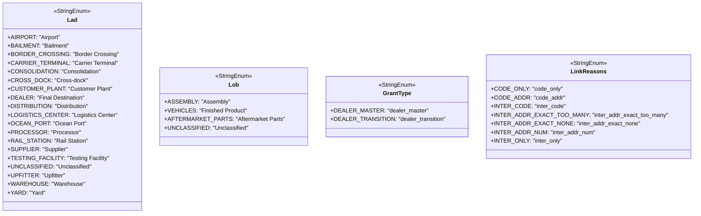

# Diagram: shipment_core/chromium_export/fv/python/fv/aws/lambdas/location/constants.py

> Auto-generated by Obscura crawlers

## Mermaid

```mermaid
classDiagram
class Lad <<StringEnum>> {
  +AIRPORT: "Airport"
  +BAILMENT: "Bailment"
  +BORDER_CROSSING: "Border Crossing"
  +CARRIER_TERMINAL: "Carrier Terminal"
  +CONSOLIDATION: "Consolidation"
  +CROSS_DOCK: "Cross-dock"
  +CUSTOMER_PLANT: "Customer Plant"
  +DEALER: "Final Destination"
  +DISTRIBUTION: "Distribution"
  +LOGISTICS_CENTER: "Logistics Center"
  +OCEAN_PORT: "Ocean Port"
  +PROCESSOR: "Processor"
  +RAIL_STATION: "Rail Station"
  +SUPPLIER: "Supplier"
  +TESTING_FACILITY: "Testing Facility"
  +UNCLASSIFIED: "Unclassified"
  +UPFITTER: "Upfitter"
  +WAREHOUSE: "Warehouse"
  +YARD: "Yard"
}
class Lob <<StringEnum>> {
  +ASSEMBLY: "Assembly"
  +VEHICLES: "Finished Product"
  +AFTERMARKET_PARTS: "Aftermarket Parts"
  +UNCLASSIFIED: "Unclassified"
}
class GrantType <<StringEnum>> {
  +DEALER_MASTER: "dealer_master"
  +DEALER_TRANSITION: "dealer_transition"
}
class LinkReasons <<StringEnum>> {
  +CODE_ONLY: "code_only"
  +CODE_ADDR: "code_addr"
  +INTER_CODE: "inter_code"
  +INTER_ADDR_EXACT_TOO_MANY: "inter_addr_exact_too_many"
  +INTER_ADDR_EXACT_NONE: "inter_addr_exact_none"
  +INTER_ADDR_NUM: "inter_addr_num"
  +INTER_ONLY: "inter_only"
}
```

> SVG rendering failed for this diagram.
