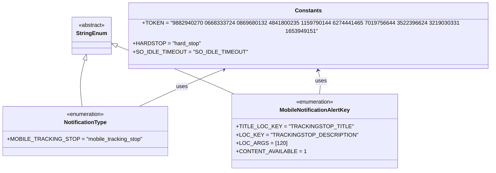

# Diagram: shipment_core/chromium_export/fv/python/fv/aws/lambdas/mobile/constants.py

> Auto-generated by Obscura crawlers

## Mermaid

### SVG

<svg id="container" width="1350.06640625" xmlns="http://www.w3.org/2000/svg" class="classDiagram" height="474" viewBox="0 0 1350.06640625 474" role="graphics-document document" aria-roledescription="class"><g><defs><marker id="container_class-aggregationStart" class="marker aggregation class" refX="18" refY="7" markerWidth="190" markerHeight="240" orient="auto"><path d="M 18,7 L9,13 L1,7 L9,1 Z"></path></marker></defs><defs><marker id="container_class-aggregationEnd" class="marker aggregation class" refX="1" refY="7" markerWidth="20" markerHeight="28" orient="auto"><path d="M 18,7 L9,13 L1,7 L9,1 Z"></path></marker></defs><defs><marker id="container_class-extensionStart" class="marker extension class" refX="18" refY="7" markerWidth="190" markerHeight="240" orient="auto"><path d="M 1,7 L18,13 V 1 Z"></path></marker></defs><defs><marker id="container_class-extensionEnd" class="marker extension class" refX="1" refY="7" markerWidth="20" markerHeight="28" orient="auto"><path d="M 1,1 V 13 L18,7 Z"></path></marker></defs><defs><marker id="container_class-compositionStart" class="marker composition class" refX="18" refY="7" markerWidth="190" markerHeight="240" orient="auto"><path d="M 18,7 L9,13 L1,7 L9,1 Z"></path></marker></defs><defs><marker id="container_class-compositionEnd" class="marker composition class" refX="1" refY="7" markerWidth="20" markerHeight="28" orient="auto"><path d="M 18,7 L9,13 L1,7 L9,1 Z"></path></marker></defs><defs><marker id="container_class-dependencyStart" class="marker dependency class" refX="6" refY="7" markerWidth="190" markerHeight="240" orient="auto"><path d="M 5,7 L9,13 L1,7 L9,1 Z"></path></marker></defs><defs><marker id="container_class-dependencyEnd" class="marker dependency class" refX="13" refY="7" markerWidth="20" markerHeight="28" orient="auto"><path d="M 18,7 L9,13 L14,7 L9,1 Z"></path></marker></defs><defs><marker id="container_class-lollipopStart" class="marker lollipop class" refX="13" refY="7" markerWidth="190" markerHeight="240" orient="auto"><circle stroke="black" fill="transparent" cx="7" cy="7" r="6"></circle></marker></defs><defs><marker id="container_class-lollipopEnd" class="marker lollipop class" refX="1" refY="7" markerWidth="190" markerHeight="240" orient="auto"><circle stroke="black" fill="transparent" cx="7" cy="7" r="6"></circle></marker></defs><g class="root"><g class="clusters"></g><g class="edgePaths"><path d="M232.558,162.515L230.02,170.929C227.482,179.344,222.407,196.172,221.401,216.753C220.394,237.333,223.456,261.667,224.987,273.833L226.518,286" id="id_StringEnum_NotificationType_1" class="edge-thickness-normal edge-pattern-solid relation" style=";;;" data-edge="true" data-et="edge" data-id="id_StringEnum_NotificationType_1" data-points="W3sieCI6MjM3LjUzODQ0OTEyMTkwMDg0LCJ5IjoxNDZ9LHsieCI6MjE3LjMzMjAzMTI1LCJ5IjoyMTN9LHsieCI6MjI2LjUxNzk5NTY4OTY1NTE4LCJ5IjoyODZ9XQ==" marker-start="url(#container_class-extensionStart)"></path><path d="M324.17,118.905L365.174,134.588C406.177,150.27,488.183,181.635,542.92,203.997C597.656,226.359,625.123,239.719,638.856,246.398L652.59,253.078" id="id_StringEnum_MobileNotificationAlertKey_2" class="edge-thickness-normal edge-pattern-solid relation" style=";;;" data-edge="true" data-et="edge" data-id="id_StringEnum_MobileNotificationAlertKey_2" data-points="W3sieCI6MzA4LjA1ODU5Mzc1LCJ5IjoxMTIuNzQyOTg1MjAxNzg1NDJ9LHsieCI6NTcwLjE4OTQ1MzEyNSwieSI6MjEzfSx7IngiOjY1Mi41ODk4NDM3NSwieSI6MjUzLjA3ODEyNjUzNTUwNTgyfV0=" marker-start="url(#container_class-extensionStart)"></path><path d="M624.833,178.143L609.644,183.953C594.454,189.762,564.076,201.381,523.872,219.357C483.668,237.333,433.639,261.667,408.624,273.833L383.61,286" id="id_Constants_NotificationType_3" class="edge-thickness-normal edge-pattern-solid relation" style=";;;" data-edge="true" data-et="edge" data-id="id_Constants_NotificationType_3" data-points="W3sieCI6NjMwLjQzNzA0ODAzNzE5MDIsInkiOjE3Nn0seyJ4Ijo1MzMuNjk3MjY1NjI1LCJ5IjoyMTN9LHsieCI6MzgzLjYwOTY5ODI3NTg2MjA2LCJ5IjoyODZ9XQ==" marker-start="url(#container_class-dependencyStart)"></path><path d="M877.128,181.744L878.699,186.954C880.27,192.163,883.413,202.581,884.208,213.957C885.003,225.333,883.451,237.667,882.675,243.833L881.899,250" id="id_Constants_MobileNotificationAlertKey_4" class="edge-thickness-normal edge-pattern-solid relation" style=";;;" data-edge="true" data-et="edge" data-id="id_Constants_MobileNotificationAlertKey_4" data-points="W3sieCI6ODc1LjM5NTkxOTQyMTQ4NzYsInkiOjE3Nn0seyJ4Ijo4ODYuNTU0Njg3NSwieSI6MjEzfSx7IngiOjg4MS44OTg3ODc3MTU1MTcyLCJ5IjoyNTB9XQ==" marker-start="url(#container_class-dependencyStart)"></path></g><g class="edgeLabels"><g class="edgeLabel"><g class="label" data-id="id_StringEnum_NotificationType_1" transform="translate(0, 0)"><foreignObject width="0" height="0">

</foreignObject></g></g><g class="edgeLabel"><g class="label" data-id="id_StringEnum_MobileNotificationAlertKey_2" transform="translate(0, 0)"><foreignObject width="0" height="0">

</foreignObject></g></g><g class="edgeLabel" transform="translate(505.2241, 226.84886)"><g class="label" data-id="id_Constants_NotificationType_3" transform="translate(-16.4921875, -12)"><foreignObject width="32.984375" height="24">

uses

</foreignObject></g></g><g class="edgeLabel" transform="translate(886.35917, 212.3517)"><g class="label" data-id="id_Constants_MobileNotificationAlertKey_4" transform="translate(-16.4921875, -12)"><foreignObject width="32.984375" height="24">

uses

</foreignObject></g></g></g><g class="nodes"><g class="node default" id="classId-StringEnum-0" transform="translate(253.82421875, 92)"><g class="basic label-container"><path d="M-54.234375 -54 L54.234375 -54 L54.234375 54 L-54.234375 54" stroke="none" stroke-width="0" fill="#ECECFF" style=""></path><path d="M-54.234375 -54 C-21.705458474185498 -54, 10.823458051629004 -54, 54.234375 -54 M-54.234375 -54 C-12.983545075693115 -54, 28.26728484861377 -54, 54.234375 -54 M54.234375 -54 C54.234375 -20.120556845001524, 54.234375 13.758886309996953, 54.234375 54 M54.234375 -54 C54.234375 -17.42519933818891, 54.234375 19.14960132362218, 54.234375 54 M54.234375 54 C12.891027897386877 54, -28.452319205226246 54, -54.234375 54 M54.234375 54 C24.842558411900566 54, -4.549258176198869 54, -54.234375 54 M-54.234375 54 C-54.234375 10.849892677627523, -54.234375 -32.300214644744955, -54.234375 -54 M-54.234375 54 C-54.234375 27.099307757748385, -54.234375 0.19861551549676904, -54.234375 -54" stroke="#9370DB" stroke-width="1.3" fill="none" stroke-dasharray="0 0" style=""></path></g><g class="annotation-group text" transform="translate(-38.609375, -30)"><g class="label" style="" transform="translate(0,-12)"><foreignObject width="77.21875" height="24">

«abstract»

</foreignObject></g></g><g class="label-group text" transform="translate(-42.234375, -6)"><g class="label" style="font-weight: bolder" transform="translate(0,-12)"><foreignObject width="84.46875" height="24">

StringEnum

</foreignObject></g></g><g class="members-group text" transform="translate(-42.234375, 42)"></g><g class="methods-group text" transform="translate(-42.234375, 72)"></g><g class="divider" style=""><path d="M-54.234375 18 C-13.566554503090764 18, 27.101265993818473 18, 54.234375 18 M-54.234375 18 C-29.645341330538958 18, -5.056307661077916 18, 54.234375 18" stroke="#9370DB" stroke-width="1.3" fill="none" stroke-dasharray="0 0" style=""></path></g><g class="divider" style=""><path d="M-54.234375 36 C-21.150087776970807 36, 11.934199446058386 36, 54.234375 36 M-54.234375 36 C-29.579657762942787 36, -4.9249405258855745 36, 54.234375 36" stroke="#9370DB" stroke-width="1.3" fill="none" stroke-dasharray="0 0" style=""></path></g></g><g class="node default" id="classId-NotificationType-1" transform="translate(235.578125, 358)"><g class="basic label-container"><path d="M-227.578125 -72 L227.578125 -72 L227.578125 72 L-227.578125 72" stroke="none" stroke-width="0" fill="#ECECFF" style=""></path><path d="M-227.578125 -72 C-125.1909459438743 -72, -22.803766887748594 -72, 227.578125 -72 M-227.578125 -72 C-100.29849835531807 -72, 26.981128289363852 -72, 227.578125 -72 M227.578125 -72 C227.578125 -27.912446152311794, 227.578125 16.17510769537641, 227.578125 72 M227.578125 -72 C227.578125 -23.033592408361507, 227.578125 25.932815183276986, 227.578125 72 M227.578125 72 C105.14228988845066 72, -17.293545223098675 72, -227.578125 72 M227.578125 72 C97.06912269596017 72, -33.43987960807965 72, -227.578125 72 M-227.578125 72 C-227.578125 35.08486280836233, -227.578125 -1.8302743832753379, -227.578125 -72 M-227.578125 72 C-227.578125 19.20745440591918, -227.578125 -33.58509118816164, -227.578125 -72" stroke="#9370DB" stroke-width="1.3" fill="none" stroke-dasharray="0 0" style=""></path></g><g class="annotation-group text" transform="translate(-55.5546875, -48)"><g class="label" style="" transform="translate(0,-12)"><foreignObject width="111.109375" height="24">

«enumeration»

</foreignObject></g></g><g class="label-group text" transform="translate(-60.21875, -24)"><g class="label" style="font-weight: bolder" transform="translate(0,-12)"><foreignObject width="120.4375" height="24">

NotificationType

</foreignObject></g></g><g class="members-group text" transform="translate(-215.578125, 24)"><g class="label" style="" transform="translate(0,-12)"><foreignObject width="370.9375" height="24">

+MOBILE_TRACKING_STOP = "mobile_tracking_stop"

</foreignObject></g></g><g class="methods-group text" transform="translate(-215.578125, 72)"></g><g class="divider" style=""><path d="M-227.578125 0 C-82.02863934956295 0, 63.5208463008741 0, 227.578125 0 M-227.578125 0 C-66.73975821023777 0, 94.09860857952447 0, 227.578125 0" stroke="#9370DB" stroke-width="1.3" fill="none" stroke-dasharray="0 0" style=""></path></g><g class="divider" style=""><path d="M-227.578125 48 C-68.26919524894274 48, 91.03973450211453 48, 227.578125 48 M-227.578125 48 C-129.43193778934432 48, -31.285750578688635 48, 227.578125 48" stroke="#9370DB" stroke-width="1.3" fill="none" stroke-dasharray="0 0" style=""></path></g></g><g class="node default" id="classId-MobileNotificationAlertKey-2" transform="translate(868.30859375, 358)"><g class="basic label-container"><path d="M-215.71875 -108 L215.71875 -108 L215.71875 108 L-215.71875 108" stroke="none" stroke-width="0" fill="#ECECFF" style=""></path><path d="M-215.71875 -108 C-65.80550819416382 -108, 84.10773361167236 -108, 215.71875 -108 M-215.71875 -108 C-124.76137332154914 -108, -33.80399664309829 -108, 215.71875 -108 M215.71875 -108 C215.71875 -40.83035937629076, 215.71875 26.339281247418484, 215.71875 108 M215.71875 -108 C215.71875 -34.46210074499014, 215.71875 39.07579851001972, 215.71875 108 M215.71875 108 C94.2455929325377 108, -27.22756413492459 108, -215.71875 108 M215.71875 108 C79.47442874277877 108, -56.76989251444246 108, -215.71875 108 M-215.71875 108 C-215.71875 34.95294133554614, -215.71875 -38.094117328907714, -215.71875 -108 M-215.71875 108 C-215.71875 60.530802455281794, -215.71875 13.061604910563588, -215.71875 -108" stroke="#9370DB" stroke-width="1.3" fill="none" stroke-dasharray="0 0" style=""></path></g><g class="annotation-group text" transform="translate(-55.5546875, -84)"><g class="label" style="" transform="translate(0,-12)"><foreignObject width="111.109375" height="24">

«enumeration»

</foreignObject></g></g><g class="label-group text" transform="translate(-98.8125, -60)"><g class="label" style="font-weight: bolder" transform="translate(0,-12)"><foreignObject width="197.625" height="24">

MobileNotificationAlertKey

</foreignObject></g></g><g class="members-group text" transform="translate(-203.71875, -12)"><g class="label" style="" transform="translate(0,-12)"><foreignObject width="296.265625" height="24">

+TITLE_LOC_KEY = "TRACKINGSTOP_TITLE"

</foreignObject></g><g class="label" style="" transform="translate(0,12)"><foreignObject width="308.625" height="24">

+LOC_KEY = "TRACKINGSTOP_DESCRIPTION"

</foreignObject></g><g class="label" style="" transform="translate(0,36)"><foreignObject width="131.203125" height="24">

+LOC_ARGS = [120]

</foreignObject></g><g class="label" style="" transform="translate(0,60)"><foreignObject width="180.484375" height="24">

+CONTENT_AVAILABLE = 1

</foreignObject></g></g><g class="methods-group text" transform="translate(-203.71875, 108)"></g><g class="divider" style=""><path d="M-215.71875 -36 C-66.45234610979898 -36, 82.81405778040204 -36, 215.71875 -36 M-215.71875 -36 C-61.58667073605895 -36, 92.5454085278821 -36, 215.71875 -36" stroke="#9370DB" stroke-width="1.3" fill="none" stroke-dasharray="0 0" style=""></path></g><g class="divider" style=""><path d="M-215.71875 84 C-82.95136822530267 84, 49.816013549394654 84, 215.71875 84 M-215.71875 84 C-81.94575801362194 84, 51.82723397275612 84, 215.71875 84" stroke="#9370DB" stroke-width="1.3" fill="none" stroke-dasharray="0 0" style=""></path></g></g><g class="node default" id="classId-Constants-3" transform="translate(850.0625, 92)"><g class="basic label-container"><path d="M-492.00390625 -84 L492.00390625 -84 L492.00390625 84 L-492.00390625 84" stroke="none" stroke-width="0" fill="#ECECFF" style=""></path><path d="M-492.00390625 -84 C-181.39168351787248 -84, 129.22053921425504 -84, 492.00390625 -84 M-492.00390625 -84 C-294.7891158225319 -84, -97.5743253950638 -84, 492.00390625 -84 M492.00390625 -84 C492.00390625 -41.81927941485262, 492.00390625 0.36144117029475353, 492.00390625 84 M492.00390625 -84 C492.00390625 -24.64026892783408, 492.00390625 34.71946214433184, 492.00390625 84 M492.00390625 84 C246.7322738713343 84, 1.4606414926686284 84, -492.00390625 84 M492.00390625 84 C175.14843291073078 84, -141.70704042853845 84, -492.00390625 84 M-492.00390625 84 C-492.00390625 26.121879543886983, -492.00390625 -31.756240912226033, -492.00390625 -84 M-492.00390625 84 C-492.00390625 42.2481291513674, -492.00390625 0.49625830273480176, -492.00390625 -84" stroke="#9370DB" stroke-width="1.3" fill="none" stroke-dasharray="0 0" style=""></path></g><g class="annotation-group text" transform="translate(0, -60)"></g><g class="label-group text" transform="translate(-36.5390625, -60)"><g class="label" style="font-weight: bolder" transform="translate(0,-12)"><foreignObject width="73.078125" height="24">

Constants

</foreignObject></g></g><g class="members-group text" transform="translate(-480.00390625, -12)"><g class="label" style="" transform="translate(0,-12)"><foreignObject width="923.46875" height="24">

+TOKEN = "9882940270 0668333724 0869680132 4841800235 1159790144 6274441465 7019756644 3522396624 3219030331 1653949151"

</foreignObject></g><g class="label" style="" transform="translate(0,12)"><foreignObject width="187.078125" height="24">

+HARDSTOP = "hard_stop"

</foreignObject></g><g class="label" style="" transform="translate(0,36)"><foreignObject width="297.34375" height="24">

+SO_IDLE_TIMEOUT = "SO_IDLE_TIMEOUT"

</foreignObject></g></g><g class="methods-group text" transform="translate(-480.00390625, 84)"></g><g class="divider" style=""><path d="M-492.00390625 -36 C-244.32858196507686 -36, 3.346742319846271 -36, 492.00390625 -36 M-492.00390625 -36 C-218.10815233141324 -36, 55.787601587173526 -36, 492.00390625 -36" stroke="#9370DB" stroke-width="1.3" fill="none" stroke-dasharray="0 0" style=""></path></g><g class="divider" style=""><path d="M-492.00390625 60 C-258.4287569985155 60, -24.85360774703105 60, 492.00390625 60 M-492.00390625 60 C-172.00173403160113 60, 148.00043818679774 60, 492.00390625 60" stroke="#9370DB" stroke-width="1.3" fill="none" stroke-dasharray="0 0" style=""></path></g></g></g></g></g></svg>
