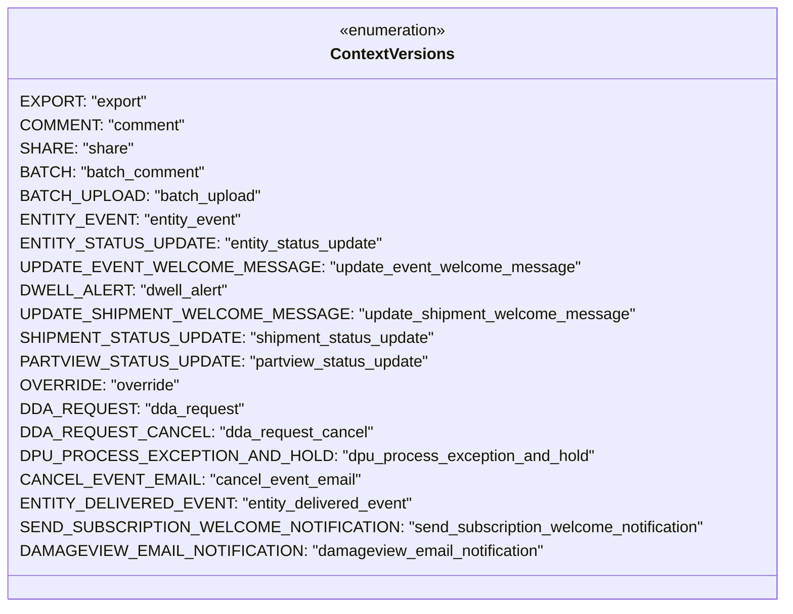

# Diagram: shipment_core/chromium_export/fv/python/fv/aws/lambdas/notification/constants.py

> Auto-generated by Obscura crawlers

## Mermaid

```mermaid
classDiagram
class ContextVersions <<enumeration>> {
  EXPORT: "export"
  COMMENT: "comment"
  SHARE: "share"
  BATCH: "batch_comment"
  BATCH_UPLOAD: "batch_upload"
  ENTITY_EVENT: "entity_event"
  ENTITY_STATUS_UPDATE: "entity_status_update"
  UPDATE_EVENT_WELCOME_MESSAGE: "update_event_welcome_message"
  DWELL_ALERT: "dwell_alert"
  UPDATE_SHIPMENT_WELCOME_MESSAGE: "update_shipment_welcome_message"
  SHIPMENT_STATUS_UPDATE: "shipment_status_update"
  PARTVIEW_STATUS_UPDATE: "partview_status_update"
  OVERRIDE: "override"
  DDA_REQUEST: "dda_request"
  DDA_REQUEST_CANCEL: "dda_request_cancel"
  DPU_PROCESS_EXCEPTION_AND_HOLD: "dpu_process_exception_and_hold"
  CANCEL_EVENT_EMAIL: "cancel_event_email"
  ENTITY_DELIVERED_EVENT: "entity_delivered_event"
  SEND_SUBSCRIPTION_WELCOME_NOTIFICATION: "send_subscription_welcome_notification"
  DAMAGEVIEW_EMAIL_NOTIFICATION: "damageview_email_notification"
}
```

> SVG rendering failed for this diagram.
