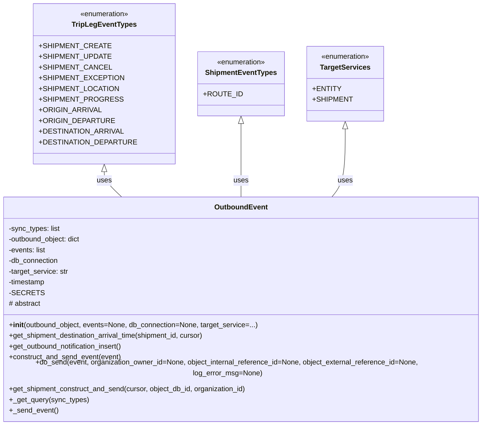

# Diagram: shipment_core/chromium_export/fv/python/fv/aws/lambdas/outbound_event.py


> Auto-generated by Obscura crawlers

## Diagram 1



### SVG

<svg id="container" width="1123.234375" xmlns="http://www.w3.org/2000/svg" class="classDiagram" height="930" viewBox="0 0 1123.234375 930" role="graphics-document document" aria-roledescription="class"><style>#container{font-family:"trebuchet ms",verdana,arial,sans-serif;font-size:16px;fill:#333;}@keyframes edge-animation-frame{from{stroke-dashoffset:0;}}@keyframes dash{to{stroke-dashoffset:0;}}#container .edge-animation-slow{stroke-dasharray:9,5!important;stroke-dashoffset:900;animation:dash 50s linear infinite;stroke-linecap:round;}#container .edge-animation-fast{stroke-dasharray:9,5!important;stroke-dashoffset:900;animation:dash 20s linear infinite;stroke-linecap:round;}#container .error-icon{fill:#552222;}#container .error-text{fill:#552222;stroke:#552222;}#container .edge-thickness-normal{stroke-width:1px;}#container .edge-thickness-thick{stroke-width:3.5px;}#container .edge-pattern-solid{stroke-dasharray:0;}#container .edge-thickness-invisible{stroke-width:0;fill:none;}#container .edge-pattern-dashed{stroke-dasharray:3;}#container .edge-pattern-dotted{stroke-dasharray:2;}#container .marker{fill:#333333;stroke:#333333;}#container .marker.cross{stroke:#333333;}#container svg{font-family:"trebuchet ms",verdana,arial,sans-serif;font-size:16px;}#container p{margin:0;}#container g.classGroup text{fill:#9370DB;stroke:none;font-family:"trebuchet ms",verdana,arial,sans-serif;font-size:10px;}#container g.classGroup text .title{font-weight:bolder;}#container .nodeLabel,#container .edgeLabel{color:#131300;}#container .edgeLabel .label rect{fill:#ECECFF;}#container .label text{fill:#131300;}#container .labelBkg{background:#ECECFF;}#container .edgeLabel .label span{background:#ECECFF;}#container .classTitle{font-weight:bolder;}#container .node rect,#container .node circle,#container .node ellipse,#container .node polygon,#container .node path{fill:#ECECFF;stroke:#9370DB;stroke-width:1px;}#container .divider{stroke:#9370DB;stroke-width:1;}#container g.clickable{cursor:pointer;}#container g.classGroup rect{fill:#ECECFF;stroke:#9370DB;}#container g.classGroup line{stroke:#9370DB;stroke-width:1;}#container .classLabel .box{stroke:none;stroke-width:0;fill:#ECECFF;opacity:0.5;}#container .classLabel .label{fill:#9370DB;font-size:10px;}#container .relation{stroke:#333333;stroke-width:1;fill:none;}#container .dashed-line{stroke-dasharray:3;}#container .dotted-line{stroke-dasharray:1 2;}#container #compositionStart,#container .composition{fill:#333333!important;stroke:#333333!important;stroke-width:1;}#container #compositionEnd,#container .composition{fill:#333333!important;stroke:#333333!important;stroke-width:1;}#container #dependencyStart,#container .dependency{fill:#333333!important;stroke:#333333!important;stroke-width:1;}#container #dependencyStart,#container .dependency{fill:#333333!important;stroke:#333333!important;stroke-width:1;}#container #extensionStart,#container .extension{fill:transparent!important;stroke:#333333!important;stroke-width:1;}#container #extensionEnd,#container .extension{fill:transparent!important;stroke:#333333!important;stroke-width:1;}#container #aggregationStart,#container .aggregation{fill:transparent!important;stroke:#333333!important;stroke-width:1;}#container #aggregationEnd,#container .aggregation{fill:transparent!important;stroke:#333333!important;stroke-width:1;}#container #lollipopStart,#container .lollipop{fill:#ECECFF!important;stroke:#333333!important;stroke-width:1;}#container #lollipopEnd,#container .lollipop{fill:#ECECFF!important;stroke:#333333!important;stroke-width:1;}#container .edgeTerminals{font-size:11px;line-height:initial;}#container .classTitleText{text-anchor:middle;font-size:18px;fill:#333;}#container .label-icon{display:inline-block;height:1em;overflow:visible;vertical-align:-0.125em;}#container .node .label-icon path{fill:currentColor;stroke:revert;stroke-width:revert;}#container :root{--mermaid-font-family:"trebuchet ms",verdana,arial,sans-serif;}</style><g><defs><marker id="container_class-aggregationStart" class="marker aggregation class" refX="18" refY="7" markerWidth="190" markerHeight="240" orient="auto"><path d="M 18,7 L9,13 L1,7 L9,1 Z"></path></marker></defs><defs><marker id="container_class-aggregationEnd" class="marker aggregation class" refX="1" refY="7" markerWidth="20" markerHeight="28" orient="auto"><path d="M 18,7 L9,13 L1,7 L9,1 Z"></path></marker></defs><defs><marker id="container_class-extensionStart" class="marker extension class" refX="18" refY="7" markerWidth="190" markerHeight="240" orient="auto"><path d="M 1,7 L18,13 V 1 Z"></path></marker></defs><defs><marker id="container_class-extensionEnd" class="marker extension class" refX="1" refY="7" markerWidth="20" markerHeight="28" orient="auto"><path d="M 1,1 V 13 L18,7 Z"></path></marker></defs><defs><marker id="container_class-compositionStart" class="marker composition class" refX="18" refY="7" markerWidth="190" markerHeight="240" orient="auto"><path d="M 18,7 L9,13 L1,7 L9,1 Z"></path></marker></defs><defs><marker id="container_class-compositionEnd" class="marker composition class" refX="1" refY="7" markerWidth="20" markerHeight="28" orient="auto"><path d="M 18,7 L9,13 L1,7 L9,1 Z"></path></marker></defs><defs><marker id="container_class-dependencyStart" class="marker dependency class" refX="6" refY="7" markerWidth="190" markerHeight="240" orient="auto"><path d="M 5,7 L9,13 L1,7 L9,1 Z"></path></marker></defs><defs><marker id="container_class-dependencyEnd" class="marker dependency class" refX="13" refY="7" markerWidth="20" markerHeight="28" orient="auto"><path d="M 18,7 L9,13 L14,7 L9,1 Z"></path></marker></defs><defs><marker id="container_class-lollipopStart" class="marker lollipop class" refX="13" refY="7" markerWidth="190" markerHeight="240" orient="auto"><circle stroke="black" fill="transparent" cx="7" cy="7" r="6"></circle></marker></defs><defs><marker id="container_class-lollipopEnd" class="marker lollipop class" refX="1" refY="7" markerWidth="190" markerHeight="240" orient="auto"><circle stroke="black" fill="transparent" cx="7" cy="7" r="6"></circle></marker></defs><g class="root"><g class="clusters"></g><g class="edgePaths"><path d="M278.691,385.25L278.691,388.542C278.691,391.833,278.691,398.417,284.99,407.875C291.289,417.333,303.886,429.667,310.184,435.833L316.483,442" id="id_TripLegEventTypes_OutboundEvent_1" class="edge-thickness-normal edge-pattern-solid relation" style=";;;" data-edge="true" data-et="edge" data-id="id_TripLegEventTypes_OutboundEvent_1" data-points="W3sieCI6Mjc4LjY5MTQwNjI1LCJ5IjozNjh9LHsieCI6Mjc4LjY5MTQwNjI1LCJ5Ijo0MDV9LHsieCI6MzE2LjQ4MjkzNjU5NzQ3MjkzLCJ5Ijo0NDJ9XQ==" marker-start="url(#container_class-extensionStart)"></path><path d="M561.617,277.25L561.617,298.542C561.617,319.833,561.617,362.417,561.617,389.875C561.617,417.333,561.617,429.667,561.617,435.833L561.617,442" id="id_ShipmentEventTypes_OutboundEvent_2" class="edge-thickness-normal edge-pattern-solid relation" style=";;;" data-edge="true" data-et="edge" data-id="id_ShipmentEventTypes_OutboundEvent_2" data-points="W3sieCI6NTYxLjYxNzE4NzUsInkiOjI2MH0seyJ4Ijo1NjEuNjE3MTg3NSwieSI6NDA1fSx7IngiOjU2MS42MTcxODc1LCJ5Ijo0NDJ9XQ==" marker-start="url(#container_class-extensionStart)"></path><path d="M781.691,289.25L781.691,308.542C781.691,327.833,781.691,366.417,776.792,391.875C771.893,417.333,762.094,429.667,757.195,435.833L752.295,442" id="id_TargetServices_OutboundEvent_3" class="edge-thickness-normal edge-pattern-solid relation" style=";;;" data-edge="true" data-et="edge" data-id="id_TargetServices_OutboundEvent_3" data-points="W3sieCI6NzgxLjY5MTQwNjI1LCJ5IjoyNzJ9LHsieCI6NzgxLjY5MTQwNjI1LCJ5Ijo0MDV9LHsieCI6NzUyLjI5NTIxMDk2NTcwNCwieSI6NDQyfV0=" marker-start="url(#container_class-extensionStart)"></path></g><g class="edgeLabels"><g class="edgeLabel" transform="translate(278.69140625, 405)"><g class="label" data-id="id_TripLegEventTypes_OutboundEvent_1" transform="translate(-16.4921875, -12)"><foreignObject width="32.984375" height="24"><div xmlns="http://www.w3.org/1999/xhtml" class="labelBkg" style="display: table-cell; white-space: nowrap; line-height: 1.5; max-width: 200px; text-align: center;"><span class="edgeLabel"><p>uses</p></span></div></foreignObject></g></g><g class="edgeLabel" transform="translate(561.6171875, 405)"><g class="label" data-id="id_ShipmentEventTypes_OutboundEvent_2" transform="translate(-16.4921875, -12)"><foreignObject width="32.984375" height="24"><div xmlns="http://www.w3.org/1999/xhtml" class="labelBkg" style="display: table-cell; white-space: nowrap; line-height: 1.5; max-width: 200px; text-align: center;"><span class="edgeLabel"><p>uses</p></span></div></foreignObject></g></g><g class="edgeLabel" transform="translate(781.69140625, 405)"><g class="label" data-id="id_TargetServices_OutboundEvent_3" transform="translate(-16.4921875, -12)"><foreignObject width="32.984375" height="24"><div xmlns="http://www.w3.org/1999/xhtml" class="labelBkg" style="display: table-cell; white-space: nowrap; line-height: 1.5; max-width: 200px; text-align: center;"><span class="edgeLabel"><p>uses</p></span></div></foreignObject></g></g></g><g class="nodes"><g class="node default" id="classId-TripLegEventTypes-0" transform="translate(278.69140625, 188)"><g class="basic label-container"><path d="M-142.98046875 -180 L142.98046875 -180 L142.98046875 180 L-142.98046875 180" stroke="none" stroke-width="0" fill="#ECECFF" style=""></path><path d="M-142.98046875 -180 C-53.18513249343641 -180, 36.610203763127174 -180, 142.98046875 -180 M-142.98046875 -180 C-48.15535421998476 -180, 46.66976031003048 -180, 142.98046875 -180 M142.98046875 -180 C142.98046875 -43.61812155437437, 142.98046875 92.76375689125126, 142.98046875 180 M142.98046875 -180 C142.98046875 -62.85878465766993, 142.98046875 54.28243068466014, 142.98046875 180 M142.98046875 180 C75.2227951856051 180, 7.465121621210187 180, -142.98046875 180 M142.98046875 180 C51.1842869224334 180, -40.6118949051332 180, -142.98046875 180 M-142.98046875 180 C-142.98046875 92.02556371382124, -142.98046875 4.051127427642484, -142.98046875 -180 M-142.98046875 180 C-142.98046875 105.00234411326903, -142.98046875 30.004688226538065, -142.98046875 -180" stroke="#9370DB" stroke-width="1.3" fill="none" stroke-dasharray="0 0" style=""></path></g><g class="annotation-group text" transform="translate(-55.5546875, -156)"><g class="label" style="" transform="translate(0,-12)"><foreignObject width="111.109375" height="24"><div xmlns="http://www.w3.org/1999/xhtml" style="display: table-cell; white-space: nowrap; line-height: 1.5; max-width: 161px; text-align: center;"><span class="nodeLabel markdown-node-label" style=""><p>«enumeration»</p></span></div></foreignObject></g></g><g class="label-group text" transform="translate(-68.4609375, -132)"><g class="label" style="font-weight: bolder" transform="translate(0,-12)"><foreignObject width="136.921875" height="24"><div xmlns="http://www.w3.org/1999/xhtml" style="display: table-cell; white-space: nowrap; line-height: 1.5; max-width: 184px; text-align: center;"><span class="nodeLabel markdown-node-label" style=""><p>TripLegEventTypes</p></span></div></foreignObject></g></g><g class="members-group text" transform="translate(-130.98046875, -84)"><g class="label" style="" transform="translate(0,-12)"><foreignObject width="139.96875" height="24"><div xmlns="http://www.w3.org/1999/xhtml" style="display: table-cell; white-space: nowrap; line-height: 1.5; max-width: 197px; text-align: center;"><span class="nodeLabel markdown-node-label" style=""><p>+SHIPMENT_CREATE</p></span></div></foreignObject></g><g class="label" style="" transform="translate(0,12)"><foreignObject width="142.96875" height="24"><div xmlns="http://www.w3.org/1999/xhtml" style="display: table-cell; white-space: nowrap; line-height: 1.5; max-width: 200px; text-align: center;"><span class="nodeLabel markdown-node-label" style=""><p>+SHIPMENT_UPDATE</p></span></div></foreignObject></g><g class="label" style="" transform="translate(0,36)"><foreignObject width="142.125" height="24"><div xmlns="http://www.w3.org/1999/xhtml" style="display: table-cell; white-space: nowrap; line-height: 1.5; max-width: 200px; text-align: center;"><span class="nodeLabel markdown-node-label" style=""><p>+SHIPMENT_CANCEL</p></span></div></foreignObject></g><g class="label" style="" transform="translate(0,60)"><foreignObject width="166.59375" height="24"><div xmlns="http://www.w3.org/1999/xhtml" style="display: table-cell; white-space: nowrap; line-height: 1.5; max-width: 224px; text-align: center;"><span class="nodeLabel markdown-node-label" style=""><p>+SHIPMENT_EXCEPTION</p></span></div></foreignObject></g><g class="label" style="" transform="translate(0,84)"><foreignObject width="158.859375" height="24"><div xmlns="http://www.w3.org/1999/xhtml" style="display: table-cell; white-space: nowrap; line-height: 1.5; max-width: 216px; text-align: center;"><span class="nodeLabel markdown-node-label" style=""><p>+SHIPMENT_LOCATION</p></span></div></foreignObject></g><g class="label" style="" transform="translate(0,108)"><foreignObject width="163.546875" height="24"><div xmlns="http://www.w3.org/1999/xhtml" style="display: table-cell; white-space: nowrap; line-height: 1.5; max-width: 221px; text-align: center;"><span class="nodeLabel markdown-node-label" style=""><p>+SHIPMENT_PROGRESS</p></span></div></foreignObject></g><g class="label" style="" transform="translate(0,132)"><foreignObject width="126.578125" height="24"><div xmlns="http://www.w3.org/1999/xhtml" style="display: table-cell; white-space: nowrap; line-height: 1.5; max-width: 184px; text-align: center;"><span class="nodeLabel markdown-node-label" style=""><p>+ORIGIN_ARRIVAL</p></span></div></foreignObject></g><g class="label" style="" transform="translate(0,156)"><foreignObject width="150.359375" height="24"><div xmlns="http://www.w3.org/1999/xhtml" style="display: table-cell; white-space: nowrap; line-height: 1.5; max-width: 208px; text-align: center;"><span class="nodeLabel markdown-node-label" style=""><p>+ORIGIN_DEPARTURE</p></span></div></foreignObject></g><g class="label" style="" transform="translate(0,180)"><foreignObject width="169.71875" height="24"><div xmlns="http://www.w3.org/1999/xhtml" style="display: table-cell; white-space: nowrap; line-height: 1.5; max-width: 227px; text-align: center;"><span class="nodeLabel markdown-node-label" style=""><p>+DESTINATION_ARRIVAL</p></span></div></foreignObject></g><g class="label" style="" transform="translate(0,204)"><foreignObject width="193.5" height="24"><div xmlns="http://www.w3.org/1999/xhtml" style="display: table-cell; white-space: nowrap; line-height: 1.5; max-width: 251px; text-align: center;"><span class="nodeLabel markdown-node-label" style=""><p>+DESTINATION_DEPARTURE</p></span></div></foreignObject></g></g><g class="methods-group text" transform="translate(-130.98046875, 180)"></g><g class="divider" style=""><path d="M-142.98046875 -108 C-35.51228190482456 -108, 71.95590494035088 -108, 142.98046875 -108 M-142.98046875 -108 C-53.98202883010761 -108, 35.01641108978478 -108, 142.98046875 -108" stroke="#9370DB" stroke-width="1.3" fill="none" stroke-dasharray="0 0" style=""></path></g><g class="divider" style=""><path d="M-142.98046875 156 C-73.50013818703079 156, -4.0198076240615706 156, 142.98046875 156 M-142.98046875 156 C-37.73179419643654 156, 67.51688035712692 156, 142.98046875 156" stroke="#9370DB" stroke-width="1.3" fill="none" stroke-dasharray="0 0" style=""></path></g></g><g class="node default" id="classId-ShipmentEventTypes-1" transform="translate(561.6171875, 188)"><g class="basic label-container"><path d="M-89.9453125 -72 L89.9453125 -72 L89.9453125 72 L-89.9453125 72" stroke="none" stroke-width="0" fill="#ECECFF" style=""></path><path d="M-89.9453125 -72 C-28.685673167927384 -72, 32.57396616414523 -72, 89.9453125 -72 M-89.9453125 -72 C-32.53821603250858 -72, 24.86888043498284 -72, 89.9453125 -72 M89.9453125 -72 C89.9453125 -24.10382083233955, 89.9453125 23.7923583353209, 89.9453125 72 M89.9453125 -72 C89.9453125 -40.624488493253466, 89.9453125 -9.24897698650694, 89.9453125 72 M89.9453125 72 C35.71984060703847 72, -18.50563128592306 72, -89.9453125 72 M89.9453125 72 C24.403157132472913 72, -41.138998235054174 72, -89.9453125 72 M-89.9453125 72 C-89.9453125 36.444646786627274, -89.9453125 0.8892935732545482, -89.9453125 -72 M-89.9453125 72 C-89.9453125 38.811640832908175, -89.9453125 5.62328166581635, -89.9453125 -72" stroke="#9370DB" stroke-width="1.3" fill="none" stroke-dasharray="0 0" style=""></path></g><g class="annotation-group text" transform="translate(-55.5546875, -48)"><g class="label" style="" transform="translate(0,-12)"><foreignObject width="111.109375" height="24"><div xmlns="http://www.w3.org/1999/xhtml" style="display: table-cell; white-space: nowrap; line-height: 1.5; max-width: 161px; text-align: center;"><span class="nodeLabel markdown-node-label" style=""><p>«enumeration»</p></span></div></foreignObject></g></g><g class="label-group text" transform="translate(-76.515625, -24)"><g class="label" style="font-weight: bolder" transform="translate(0,-12)"><foreignObject width="153.03125" height="24"><div xmlns="http://www.w3.org/1999/xhtml" style="display: table-cell; white-space: nowrap; line-height: 1.5; max-width: 201px; text-align: center;"><span class="nodeLabel markdown-node-label" style=""><p>ShipmentEventTypes</p></span></div></foreignObject></g></g><g class="members-group text" transform="translate(-77.9453125, 24)"><g class="label" style="" transform="translate(0,-12)"><foreignObject width="79.375" height="24"><div xmlns="http://www.w3.org/1999/xhtml" style="display: table-cell; white-space: nowrap; line-height: 1.5; max-width: 137px; text-align: center;"><span class="nodeLabel markdown-node-label" style=""><p>+ROUTE_ID</p></span></div></foreignObject></g></g><g class="methods-group text" transform="translate(-77.9453125, 72)"></g><g class="divider" style=""><path d="M-89.9453125 0 C-21.59696012226067 0, 46.75139225547866 0, 89.9453125 0 M-89.9453125 0 C-46.759170186953305 0, -3.573027873906611 0, 89.9453125 0" stroke="#9370DB" stroke-width="1.3" fill="none" stroke-dasharray="0 0" style=""></path></g><g class="divider" style=""><path d="M-89.9453125 48 C-41.893979666586525 48, 6.157353166826951 48, 89.9453125 48 M-89.9453125 48 C-46.62229920423711 48, -3.299285908474218 48, 89.9453125 48" stroke="#9370DB" stroke-width="1.3" fill="none" stroke-dasharray="0 0" style=""></path></g></g><g class="node default" id="classId-TargetServices-2" transform="translate(781.69140625, 188)"><g class="basic label-container"><path d="M-80.12890625 -84 L80.12890625 -84 L80.12890625 84 L-80.12890625 84" stroke="none" stroke-width="0" fill="#ECECFF" style=""></path><path d="M-80.12890625 -84 C-45.53724103416289 -84, -10.945575818325779 -84, 80.12890625 -84 M-80.12890625 -84 C-45.460024197987174 -84, -10.791142145974348 -84, 80.12890625 -84 M80.12890625 -84 C80.12890625 -22.941691148585782, 80.12890625 38.116617702828435, 80.12890625 84 M80.12890625 -84 C80.12890625 -28.302898137699906, 80.12890625 27.39420372460019, 80.12890625 84 M80.12890625 84 C43.32050922704666 84, 6.512112204093313 84, -80.12890625 84 M80.12890625 84 C31.384767110156602 84, -17.359372029686796 84, -80.12890625 84 M-80.12890625 84 C-80.12890625 41.749525924789396, -80.12890625 -0.500948150421209, -80.12890625 -84 M-80.12890625 84 C-80.12890625 27.500882219883856, -80.12890625 -28.99823556023229, -80.12890625 -84" stroke="#9370DB" stroke-width="1.3" fill="none" stroke-dasharray="0 0" style=""></path></g><g class="annotation-group text" transform="translate(-55.5546875, -60)"><g class="label" style="" transform="translate(0,-12)"><foreignObject width="111.109375" height="24"><div xmlns="http://www.w3.org/1999/xhtml" style="display: table-cell; white-space: nowrap; line-height: 1.5; max-width: 161px; text-align: center;"><span class="nodeLabel markdown-node-label" style=""><p>«enumeration»</p></span></div></foreignObject></g></g><g class="label-group text" transform="translate(-53.671875, -36)"><g class="label" style="font-weight: bolder" transform="translate(0,-12)"><foreignObject width="107.34375" height="24"><div xmlns="http://www.w3.org/1999/xhtml" style="display: table-cell; white-space: nowrap; line-height: 1.5; max-width: 154px; text-align: center;"><span class="nodeLabel markdown-node-label" style=""><p>TargetServices</p></span></div></foreignObject></g></g><g class="members-group text" transform="translate(-68.12890625, 12)"><g class="label" style="" transform="translate(0,-12)"><foreignObject width="57.546875" height="24"><div xmlns="http://www.w3.org/1999/xhtml" style="display: table-cell; white-space: nowrap; line-height: 1.5; max-width: 115px; text-align: center;"><span class="nodeLabel markdown-node-label" style=""><p>+ENTITY</p></span></div></foreignObject></g><g class="label" style="" transform="translate(0,12)"><foreignObject width="80.703125" height="24"><div xmlns="http://www.w3.org/1999/xhtml" style="display: table-cell; white-space: nowrap; line-height: 1.5; max-width: 139px; text-align: center;"><span class="nodeLabel markdown-node-label" style=""><p>+SHIPMENT</p></span></div></foreignObject></g></g><g class="methods-group text" transform="translate(-68.12890625, 84)"></g><g class="divider" style=""><path d="M-80.12890625 -12 C-34.63214014555329 -12, 10.864625958893427 -12, 80.12890625 -12 M-80.12890625 -12 C-29.799432869107463 -12, 20.530040511785074 -12, 80.12890625 -12" stroke="#9370DB" stroke-width="1.3" fill="none" stroke-dasharray="0 0" style=""></path></g><g class="divider" style=""><path d="M-80.12890625 60 C-34.28541562913476 60, 11.558074991730479 60, 80.12890625 60 M-80.12890625 60 C-23.499926485258705 60, 33.12905327948259 60, 80.12890625 60" stroke="#9370DB" stroke-width="1.3" fill="none" stroke-dasharray="0 0" style=""></path></g></g><g class="node default" id="classId-OutboundEvent-3" transform="translate(561.6171875, 682)"><g class="basic label-container"><path d="M-553.6171875 -240 L553.6171875 -240 L553.6171875 240 L-553.6171875 240" stroke="none" stroke-width="0" fill="#ECECFF" style=""></path><path d="M-553.6171875 -240 C-261.1164427195034 -240, 31.38430206099315 -240, 553.6171875 -240 M-553.6171875 -240 C-117.13100343285703 -240, 319.35518063428594 -240, 553.6171875 -240 M553.6171875 -240 C553.6171875 -127.10007144912201, 553.6171875 -14.200142898244025, 553.6171875 240 M553.6171875 -240 C553.6171875 -120.78917126891896, 553.6171875 -1.5783425378379263, 553.6171875 240 M553.6171875 240 C142.202907039305 240, -269.21137342139 240, -553.6171875 240 M553.6171875 240 C311.02170038392086 240, 68.42621326784172 240, -553.6171875 240 M-553.6171875 240 C-553.6171875 115.68477367548844, -553.6171875 -8.630452649023113, -553.6171875 -240 M-553.6171875 240 C-553.6171875 133.16348912329698, -553.6171875 26.326978246593995, -553.6171875 -240" stroke="#9370DB" stroke-width="1.3" fill="none" stroke-dasharray="0 0" style=""></path></g><g class="annotation-group text" transform="translate(0, -216)"></g><g class="label-group text" transform="translate(-56.84375, -216)"><g class="label" style="font-weight: bolder" transform="translate(0,-12)"><foreignObject width="113.6875" height="24"><div xmlns="http://www.w3.org/1999/xhtml" style="display: table-cell; white-space: nowrap; line-height: 1.5; max-width: 163px; text-align: center;"><span class="nodeLabel markdown-node-label" style=""><p>OutboundEvent</p></span></div></foreignObject></g></g><g class="members-group text" transform="translate(-541.6171875, -168)"><g class="label" style="" transform="translate(0,-12)"><foreignObject width="116.34375" height="24"><div xmlns="http://www.w3.org/1999/xhtml" style="display: table-cell; white-space: nowrap; line-height: 1.5; max-width: 174px; text-align: center;"><span class="nodeLabel markdown-node-label" style=""><p>-sync_types: list</p></span></div></foreignObject></g><g class="label" style="" transform="translate(0,12)"><foreignObject width="167.109375" height="24"><div xmlns="http://www.w3.org/1999/xhtml" style="display: table-cell; white-space: nowrap; line-height: 1.5; max-width: 225px; text-align: center;"><span class="nodeLabel markdown-node-label" style=""><p>-outbound_object: dict</p></span></div></foreignObject></g><g class="label" style="" transform="translate(0,36)"><foreignObject width="84.796875" height="24"><div xmlns="http://www.w3.org/1999/xhtml" style="display: table-cell; white-space: nowrap; line-height: 1.5; max-width: 142px; text-align: center;"><span class="nodeLabel markdown-node-label" style=""><p>-events: list</p></span></div></foreignObject></g><g class="label" style="" transform="translate(0,60)"><foreignObject width="114.015625" height="24"><div xmlns="http://www.w3.org/1999/xhtml" style="display: table-cell; white-space: nowrap; line-height: 1.5; max-width: 171px; text-align: center;"><span class="nodeLabel markdown-node-label" style=""><p>-db_connection</p></span></div></foreignObject></g><g class="label" style="" transform="translate(0,84)"><foreignObject width="135.859375" height="24"><div xmlns="http://www.w3.org/1999/xhtml" style="display: table-cell; white-space: nowrap; line-height: 1.5; max-width: 194px; text-align: center;"><span class="nodeLabel markdown-node-label" style=""><p>-target_service: str</p></span></div></foreignObject></g><g class="label" style="" transform="translate(0,108)"><foreignObject width="84.15625" height="24"><div xmlns="http://www.w3.org/1999/xhtml" style="display: table-cell; white-space: nowrap; line-height: 1.5; max-width: 142px; text-align: center;"><span class="nodeLabel markdown-node-label" style=""><p>-timestamp</p></span></div></foreignObject></g><g class="label" style="" transform="translate(0,132)"><foreignObject width="66.78125" height="24"><div xmlns="http://www.w3.org/1999/xhtml" style="display: table-cell; white-space: nowrap; line-height: 1.5; max-width: 124px; text-align: center;"><span class="nodeLabel markdown-node-label" style=""><p>-SECRETS</p></span></div></foreignObject></g><g class="label" style="" transform="translate(0,156)"><foreignObject width="71.734375" height="24"><div xmlns="http://www.w3.org/1999/xhtml" style="display: table-cell; white-space: nowrap; line-height: 1.5; max-width: 130px; text-align: center;"><span class="nodeLabel markdown-node-label" style=""><p># abstract</p></span></div></foreignObject></g></g><g class="methods-group text" transform="translate(-541.6171875, 48)"><g class="label" style="" transform="translate(0,-12)"><foreignObject width="561.390625" height="24"><div xmlns="http://www.w3.org/1999/xhtml" style="display: table-cell; white-space: nowrap; line-height: 1.5; max-width: 650px; text-align: center;"><span class="nodeLabel markdown-node-label" style=""><p>+<strong>init</strong>(outbound_object, events=None, db_connection=None, target_service=...)</p></span></div></foreignObject></g><g class="label" style="" transform="translate(0,12)"><foreignObject width="448.609375" height="24"><div xmlns="http://www.w3.org/1999/xhtml" style="display: table-cell; white-space: nowrap; line-height: 1.5; max-width: 506px; text-align: center;"><span class="nodeLabel markdown-node-label" style=""><p>+get_shipment_destination_arrival_time(shipment_id, cursor)</p></span></div></foreignObject></g><g class="label" style="" transform="translate(0,36)"><foreignObject width="262.53125" height="24"><div xmlns="http://www.w3.org/1999/xhtml" style="display: table-cell; white-space: nowrap; line-height: 1.5; max-width: 320px; text-align: center;"><span class="nodeLabel markdown-node-label" style=""><p>+get_outbound_notification_insert()</p></span></div></foreignObject></g><g class="label" style="" transform="translate(0,60)"><foreignObject width="254.34375" height="24"><div xmlns="http://www.w3.org/1999/xhtml" style="display: table-cell; white-space: nowrap; line-height: 1.5; max-width: 312px; text-align: center;"><span class="nodeLabel markdown-node-label" style=""><p>+construct_and_send_event(event)</p></span></div></foreignObject></g><g class="label" style="" transform="translate(0,84)"><foreignObject width="1026.390625" height="24"><div xmlns="http://www.w3.org/1999/xhtml" style="display: table-cell; white-space: nowrap; line-height: 1.5; max-width: 1084px; text-align: center;"><span class="nodeLabel markdown-node-label" style=""><p>+do_send(event, organization_owner_id=None, object_internal_reference_id=None, object_external_reference_id=None, log_error_msg=None)</p></span></div></foreignObject></g><g class="label" style="" transform="translate(0,108)"><foreignObject width="540.984375" height="24"><div xmlns="http://www.w3.org/1999/xhtml" style="display: table-cell; white-space: nowrap; line-height: 1.5; max-width: 598px; text-align: center;"><span class="nodeLabel markdown-node-label" style=""><p>+get_shipment_construct_and_send(cursor, object_db_id, organization_id)</p></span></div></foreignObject></g><g class="label" style="" transform="translate(0,132)"><foreignObject width="177.109375" height="24"><div xmlns="http://www.w3.org/1999/xhtml" style="display: table-cell; white-space: nowrap; line-height: 1.5; max-width: 234px; text-align: center;"><span class="nodeLabel markdown-node-label" style=""><p>+_get_query(sync_types)</p></span></div></foreignObject></g><g class="label" style="" transform="translate(0,156)"><foreignObject width="108.875" height="24"><div xmlns="http://www.w3.org/1999/xhtml" style="display: table-cell; white-space: nowrap; line-height: 1.5; max-width: 166px; text-align: center;"><span class="nodeLabel markdown-node-label" style=""><p>+_send_event()</p></span></div></foreignObject></g></g><g class="divider" style=""><path d="M-553.6171875 -192 C-293.9529161845869 -192, -34.28864486917382 -192, 553.6171875 -192 M-553.6171875 -192 C-122.5536148775829 -192, 308.5099577448342 -192, 553.6171875 -192" stroke="#9370DB" stroke-width="1.3" fill="none" stroke-dasharray="0 0" style=""></path></g><g class="divider" style=""><path d="M-553.6171875 24 C-310.115195876472 24, -66.613204252944 24, 553.6171875 24 M-553.6171875 24 C-248.85635369107774 24, 55.904480117844514 24, 553.6171875 24" stroke="#9370DB" stroke-width="1.3" fill="none" stroke-dasharray="0 0" style=""></path></g></g></g></g></g></svg>

## Diagram 2

```mermaid
sequenceDiagram
    participant Caller
    participant OutboundEvent
    participant DB as DatabaseCursor
    Caller->>OutboundEvent: construct_and_send_event(event)
    OutboundEvent->>OutboundEvent: attach self.events to event
    OutboundEvent->>OutboundEvent: do_send(event,...)
    OutboundEvent->>DB: establish_connection()\ncursor = db_connection.cursor
    OutboundEvent->>DB: get_shipment_destination_arrival_time(shipment_id)
    DB-->>OutboundEvent: arrived_at or null
    OutboundEvent->>OutboundEvent: filter events based on arrival timestamp
    alt events remaining
        OutboundEvent->>DB: cursor.mogrify(insert_sql, params)
        OutboundEvent->>DB: cursor.execute(insert_sql)
        DB-->>OutboundEvent: inserted row
        OutboundEvent-->>Caller: return serialized event payload
    else no events
        OutboundEvent-->>Caller: return serialized event payload (suppressed)
```

> SVG rendering failed for this diagram.
