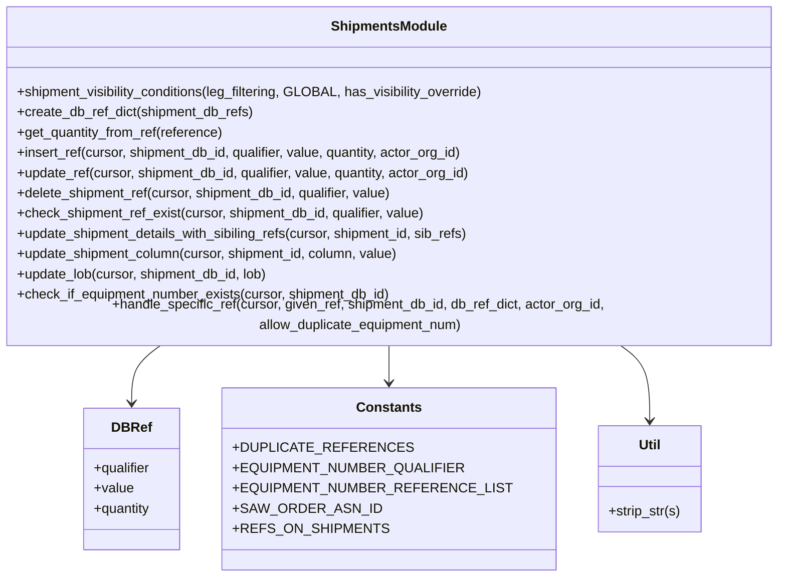

# Diagram: shipment_core/chromium_export/fv/python/fv/aws/lambdas/shipments/shipments.py


> Auto-generated by Obscura crawlers

## Diagram 1



### SVG

<svg id="container" width="948.15625" xmlns="http://www.w3.org/2000/svg" class="classDiagram" height="672" viewBox="0 0 948.15625 672" role="graphics-document document" aria-roledescription="class"><style>#container{font-family:"trebuchet ms",verdana,arial,sans-serif;font-size:16px;fill:#333;}@keyframes edge-animation-frame{from{stroke-dashoffset:0;}}@keyframes dash{to{stroke-dashoffset:0;}}#container .edge-animation-slow{stroke-dasharray:9,5!important;stroke-dashoffset:900;animation:dash 50s linear infinite;stroke-linecap:round;}#container .edge-animation-fast{stroke-dasharray:9,5!important;stroke-dashoffset:900;animation:dash 20s linear infinite;stroke-linecap:round;}#container .error-icon{fill:#552222;}#container .error-text{fill:#552222;stroke:#552222;}#container .edge-thickness-normal{stroke-width:1px;}#container .edge-thickness-thick{stroke-width:3.5px;}#container .edge-pattern-solid{stroke-dasharray:0;}#container .edge-thickness-invisible{stroke-width:0;fill:none;}#container .edge-pattern-dashed{stroke-dasharray:3;}#container .edge-pattern-dotted{stroke-dasharray:2;}#container .marker{fill:#333333;stroke:#333333;}#container .marker.cross{stroke:#333333;}#container svg{font-family:"trebuchet ms",verdana,arial,sans-serif;font-size:16px;}#container p{margin:0;}#container g.classGroup text{fill:#9370DB;stroke:none;font-family:"trebuchet ms",verdana,arial,sans-serif;font-size:10px;}#container g.classGroup text .title{font-weight:bolder;}#container .nodeLabel,#container .edgeLabel{color:#131300;}#container .edgeLabel .label rect{fill:#ECECFF;}#container .label text{fill:#131300;}#container .labelBkg{background:#ECECFF;}#container .edgeLabel .label span{background:#ECECFF;}#container .classTitle{font-weight:bolder;}#container .node rect,#container .node circle,#container .node ellipse,#container .node polygon,#container .node path{fill:#ECECFF;stroke:#9370DB;stroke-width:1px;}#container .divider{stroke:#9370DB;stroke-width:1;}#container g.clickable{cursor:pointer;}#container g.classGroup rect{fill:#ECECFF;stroke:#9370DB;}#container g.classGroup line{stroke:#9370DB;stroke-width:1;}#container .classLabel .box{stroke:none;stroke-width:0;fill:#ECECFF;opacity:0.5;}#container .classLabel .label{fill:#9370DB;font-size:10px;}#container .relation{stroke:#333333;stroke-width:1;fill:none;}#container .dashed-line{stroke-dasharray:3;}#container .dotted-line{stroke-dasharray:1 2;}#container #compositionStart,#container .composition{fill:#333333!important;stroke:#333333!important;stroke-width:1;}#container #compositionEnd,#container .composition{fill:#333333!important;stroke:#333333!important;stroke-width:1;}#container #dependencyStart,#container .dependency{fill:#333333!important;stroke:#333333!important;stroke-width:1;}#container #dependencyStart,#container .dependency{fill:#333333!important;stroke:#333333!important;stroke-width:1;}#container #extensionStart,#container .extension{fill:transparent!important;stroke:#333333!important;stroke-width:1;}#container #extensionEnd,#container .extension{fill:transparent!important;stroke:#333333!important;stroke-width:1;}#container #aggregationStart,#container .aggregation{fill:transparent!important;stroke:#333333!important;stroke-width:1;}#container #aggregationEnd,#container .aggregation{fill:transparent!important;stroke:#333333!important;stroke-width:1;}#container #lollipopStart,#container .lollipop{fill:#ECECFF!important;stroke:#333333!important;stroke-width:1;}#container #lollipopEnd,#container .lollipop{fill:#ECECFF!important;stroke:#333333!important;stroke-width:1;}#container .edgeTerminals{font-size:11px;line-height:initial;}#container .classTitleText{text-anchor:middle;font-size:18px;fill:#333;}#container .label-icon{display:inline-block;height:1em;overflow:visible;vertical-align:-0.125em;}#container .node .label-icon path{fill:currentColor;stroke:revert;stroke-width:revert;}#container :root{--mermaid-font-family:"trebuchet ms",verdana,arial,sans-serif;}</style><g><defs><marker id="container_class-aggregationStart" class="marker aggregation class" refX="18" refY="7" markerWidth="190" markerHeight="240" orient="auto"><path d="M 18,7 L9,13 L1,7 L9,1 Z"></path></marker></defs><defs><marker id="container_class-aggregationEnd" class="marker aggregation class" refX="1" refY="7" markerWidth="20" markerHeight="28" orient="auto"><path d="M 18,7 L9,13 L1,7 L9,1 Z"></path></marker></defs><defs><marker id="container_class-extensionStart" class="marker extension class" refX="18" refY="7" markerWidth="190" markerHeight="240" orient="auto"><path d="M 1,7 L18,13 V 1 Z"></path></marker></defs><defs><marker id="container_class-extensionEnd" class="marker extension class" refX="1" refY="7" markerWidth="20" markerHeight="28" orient="auto"><path d="M 1,1 V 13 L18,7 Z"></path></marker></defs><defs><marker id="container_class-compositionStart" class="marker composition class" refX="18" refY="7" markerWidth="190" markerHeight="240" orient="auto"><path d="M 18,7 L9,13 L1,7 L9,1 Z"></path></marker></defs><defs><marker id="container_class-compositionEnd" class="marker composition class" refX="1" refY="7" markerWidth="20" markerHeight="28" orient="auto"><path d="M 18,7 L9,13 L1,7 L9,1 Z"></path></marker></defs><defs><marker id="container_class-dependencyStart" class="marker dependency class" refX="6" refY="7" markerWidth="190" markerHeight="240" orient="auto"><path d="M 5,7 L9,13 L1,7 L9,1 Z"></path></marker></defs><defs><marker id="container_class-dependencyEnd" class="marker dependency class" refX="13" refY="7" markerWidth="20" markerHeight="28" orient="auto"><path d="M 18,7 L9,13 L14,7 L9,1 Z"></path></marker></defs><defs><marker id="container_class-lollipopStart" class="marker lollipop class" refX="13" refY="7" markerWidth="190" markerHeight="240" orient="auto"><circle stroke="black" fill="transparent" cx="7" cy="7" r="6"></circle></marker></defs><defs><marker id="container_class-lollipopEnd" class="marker lollipop class" refX="1" refY="7" markerWidth="190" markerHeight="240" orient="auto"><circle stroke="black" fill="transparent" cx="7" cy="7" r="6"></circle></marker></defs><g class="root"><g class="clusters"></g><g class="edgePaths"><path d="M224.082,398L218.74,402.167C213.398,406.333,202.715,414.667,197.373,426C192.031,437.333,192.031,451.667,192.031,458.833L192.031,466" id="id_ShipmentsModule_DBRef_1" class="edge-thickness-normal edge-pattern-solid relation" style=";;;" data-edge="true" data-et="edge" data-id="id_ShipmentsModule_DBRef_1" data-points="W3sieCI6MjI0LjA4MjAzMTI1LCJ5IjozOTh9LHsieCI6MTkyLjAzMTI1LCJ5Ijo0MjN9LHsieCI6MTkyLjAzMTI1LCJ5Ijo0NzJ9XQ==" marker-end="url(#container_class-dependencyEnd)"></path><path d="M474.078,398L474.078,402.167C474.078,406.333,474.078,414.667,474.078,422C474.078,429.333,474.078,435.667,474.078,438.833L474.078,442" id="id_ShipmentsModule_Constants_2" class="edge-thickness-normal edge-pattern-solid relation" style=";;;" data-edge="true" data-et="edge" data-id="id_ShipmentsModule_Constants_2" data-points="W3sieCI6NDc0LjA3ODEyNSwieSI6Mzk4fSx7IngiOjQ3NC4wNzgxMjUsInkiOjQyM30seyJ4Ijo0NzQuMDc4MTI1LCJ5Ijo0NDh9XQ==" marker-end="url(#container_class-dependencyEnd)"></path><path d="M727.883,398L733.306,402.167C738.729,406.333,749.576,414.667,754.999,429.5C760.422,444.333,760.422,465.667,760.422,476.333L760.422,487" id="id_ShipmentsModule_Util_3" class="edge-thickness-normal edge-pattern-solid relation" style=";;;" data-edge="true" data-et="edge" data-id="id_ShipmentsModule_Util_3" data-points="W3sieCI6NzI3Ljg4MjgxMjUsInkiOjM5OH0seyJ4Ijo3NjAuNDIxODc1LCJ5Ijo0MjN9LHsieCI6NzYwLjQyMTg3NSwieSI6NDkzfV0=" marker-end="url(#container_class-dependencyEnd)"></path></g><g class="edgeLabels"><g class="edgeLabel"><g class="label" data-id="id_ShipmentsModule_DBRef_1" transform="translate(0, 0)"><foreignObject width="0" height="0"><div xmlns="http://www.w3.org/1999/xhtml" class="labelBkg" style="display: table-cell; white-space: nowrap; line-height: 1.5; max-width: 200px; text-align: center;"><span class="edgeLabel"></span></div></foreignObject></g></g><g class="edgeLabel"><g class="label" data-id="id_ShipmentsModule_Constants_2" transform="translate(0, 0)"><foreignObject width="0" height="0"><div xmlns="http://www.w3.org/1999/xhtml" class="labelBkg" style="display: table-cell; white-space: nowrap; line-height: 1.5; max-width: 200px; text-align: center;"><span class="edgeLabel"></span></div></foreignObject></g></g><g class="edgeLabel"><g class="label" data-id="id_ShipmentsModule_Util_3" transform="translate(0, 0)"><foreignObject width="0" height="0"><div xmlns="http://www.w3.org/1999/xhtml" class="labelBkg" style="display: table-cell; white-space: nowrap; line-height: 1.5; max-width: 200px; text-align: center;"><span class="edgeLabel"></span></div></foreignObject></g></g></g><g class="nodes"><g class="node default" id="classId-ShipmentsModule-0" transform="translate(474.078125, 203)"><g class="basic label-container"><path d="M-466.078125 -195 L466.078125 -195 L466.078125 195 L-466.078125 195" stroke="none" stroke-width="0" fill="#ECECFF" style=""></path><path d="M-466.078125 -195 C-97.8064752806198 -195, 270.4651744387604 -195, 466.078125 -195 M-466.078125 -195 C-115.26118064024888 -195, 235.55576371950224 -195, 466.078125 -195 M466.078125 -195 C466.078125 -108.41169877373605, 466.078125 -21.823397547472098, 466.078125 195 M466.078125 -195 C466.078125 -84.99890230989558, 466.078125 25.002195380208832, 466.078125 195 M466.078125 195 C156.64808774636896 195, -152.78194950726208 195, -466.078125 195 M466.078125 195 C277.73730822805373 195, 89.39649145610747 195, -466.078125 195 M-466.078125 195 C-466.078125 91.31275765005387, -466.078125 -12.374484699892264, -466.078125 -195 M-466.078125 195 C-466.078125 52.290277598768085, -466.078125 -90.41944480246383, -466.078125 -195" stroke="#9370DB" stroke-width="1.3" fill="none" stroke-dasharray="0 0" style=""></path></g><g class="annotation-group text" transform="translate(0, -171)"></g><g class="label-group text" transform="translate(-66.0625, -171)"><g class="label" style="font-weight: bolder" transform="translate(0,-12)"><foreignObject width="132.125" height="24"><div xmlns="http://www.w3.org/1999/xhtml" style="display: table-cell; white-space: nowrap; line-height: 1.5; max-width: 181px; text-align: center;"><span class="nodeLabel markdown-node-label" style=""><p>ShipmentsModule</p></span></div></foreignObject></g></g><g class="members-group text" transform="translate(-454.078125, -123)"></g><g class="methods-group text" transform="translate(-454.078125, -93)"><g class="label" style="" transform="translate(0,-12)"><foreignObject width="560.078125" height="24"><div xmlns="http://www.w3.org/1999/xhtml" style="display: table-cell; white-space: nowrap; line-height: 1.5; max-width: 617px; text-align: center;"><span class="nodeLabel markdown-node-label" style=""><p>+shipment_visibility_conditions(leg_filtering, GLOBAL, has_visibility_override)</p></span></div></foreignObject></g><g class="label" style="" transform="translate(0,12)"><foreignObject width="283.46875" height="24"><div xmlns="http://www.w3.org/1999/xhtml" style="display: table-cell; white-space: nowrap; line-height: 1.5; max-width: 341px; text-align: center;"><span class="nodeLabel markdown-node-label" style=""><p>+create_db_ref_dict(shipment_db_refs)</p></span></div></foreignObject></g><g class="label" style="" transform="translate(0,36)"><foreignObject width="247.640625" height="24"><div xmlns="http://www.w3.org/1999/xhtml" style="display: table-cell; white-space: nowrap; line-height: 1.5; max-width: 305px; text-align: center;"><span class="nodeLabel markdown-node-label" style=""><p>+get_quantity_from_ref(reference)</p></span></div></foreignObject></g><g class="label" style="" transform="translate(0,60)"><foreignObject width="539.46875" height="24"><div xmlns="http://www.w3.org/1999/xhtml" style="display: table-cell; white-space: nowrap; line-height: 1.5; max-width: 597px; text-align: center;"><span class="nodeLabel markdown-node-label" style=""><p>+insert_ref(cursor, shipment_db_id, qualifier, value, quantity, actor_org_id)</p></span></div></foreignObject></g><g class="label" style="" transform="translate(0,84)"><foreignObject width="548.453125" height="24"><div xmlns="http://www.w3.org/1999/xhtml" style="display: table-cell; white-space: nowrap; line-height: 1.5; max-width: 606px; text-align: center;"><span class="nodeLabel markdown-node-label" style=""><p>+update_ref(cursor, shipment_db_id, qualifier, value, quantity, actor_org_id)</p></span></div></foreignObject></g><g class="label" style="" transform="translate(0,108)"><foreignObject width="453.390625" height="24"><div xmlns="http://www.w3.org/1999/xhtml" style="display: table-cell; white-space: nowrap; line-height: 1.5; max-width: 511px; text-align: center;"><span class="nodeLabel markdown-node-label" style=""><p>+delete_shipment_ref(cursor, shipment_db_id, qualifier, value)</p></span></div></foreignObject></g><g class="label" style="" transform="translate(0,132)"><foreignObject width="491.03125" height="24"><div xmlns="http://www.w3.org/1999/xhtml" style="display: table-cell; white-space: nowrap; line-height: 1.5; max-width: 548px; text-align: center;"><span class="nodeLabel markdown-node-label" style=""><p>+check_shipment_ref_exist(cursor, shipment_db_id, qualifier, value)</p></span></div></foreignObject></g><g class="label" style="" transform="translate(0,156)"><foreignObject width="547.171875" height="24"><div xmlns="http://www.w3.org/1999/xhtml" style="display: table-cell; white-space: nowrap; line-height: 1.5; max-width: 605px; text-align: center;"><span class="nodeLabel markdown-node-label" style=""><p>+update_shipment_details_with_sibiling_refs(cursor, shipment_id, sib_refs)</p></span></div></foreignObject></g><g class="label" style="" transform="translate(0,180)"><foreignObject width="460.09375" height="24"><div xmlns="http://www.w3.org/1999/xhtml" style="display: table-cell; white-space: nowrap; line-height: 1.5; max-width: 517px; text-align: center;"><span class="nodeLabel markdown-node-label" style=""><p>+update_shipment_column(cursor, shipment_id, column, value)</p></span></div></foreignObject></g><g class="label" style="" transform="translate(0,204)"><foreignObject width="302.671875" height="24"><div xmlns="http://www.w3.org/1999/xhtml" style="display: table-cell; white-space: nowrap; line-height: 1.5; max-width: 360px; text-align: center;"><span class="nodeLabel markdown-node-label" style=""><p>+update_lob(cursor, shipment_db_id, lob)</p></span></div></foreignObject></g><g class="label" style="" transform="translate(0,228)"><foreignObject width="448.390625" height="24"><div xmlns="http://www.w3.org/1999/xhtml" style="display: table-cell; white-space: nowrap; line-height: 1.5; max-width: 506px; text-align: center;"><span class="nodeLabel markdown-node-label" style=""><p>+check_if_equipment_number_exists(cursor, shipment_db_id)</p></span></div></foreignObject></g><g class="label" style="" transform="translate(0,252)"><foreignObject width="842.09375" height="24"><div xmlns="http://www.w3.org/1999/xhtml" style="display: table-cell; white-space: nowrap; line-height: 1.5; max-width: 899px; text-align: center;"><span class="nodeLabel markdown-node-label" style=""><p>+handle_specific_ref(cursor, given_ref, shipment_db_id, db_ref_dict, actor_org_id, allow_duplicate_equipment_num)</p></span></div></foreignObject></g></g><g class="divider" style=""><path d="M-466.078125 -147 C-256.9362741622517 -147, -47.79442332450344 -147, 466.078125 -147 M-466.078125 -147 C-160.29933382727899 -147, 145.47945734544203 -147, 466.078125 -147" stroke="#9370DB" stroke-width="1.3" fill="none" stroke-dasharray="0 0" style=""></path></g><g class="divider" style=""><path d="M-466.078125 -123 C-136.31900885873267 -123, 193.44010728253465 -123, 466.078125 -123 M-466.078125 -123 C-123.83926027031004 -123, 218.39960445937993 -123, 466.078125 -123" stroke="#9370DB" stroke-width="1.3" fill="none" stroke-dasharray="0 0" style=""></path></g></g><g class="node default" id="classId-DBRef-1" transform="translate(192.03125, 556)"><g class="basic label-container"><path d="M-57.51953125 -84 L57.51953125 -84 L57.51953125 84 L-57.51953125 84" stroke="none" stroke-width="0" fill="#ECECFF" style=""></path><path d="M-57.51953125 -84 C-20.110835593943996 -84, 17.297860062112008 -84, 57.51953125 -84 M-57.51953125 -84 C-28.47294272961221 -84, 0.5736457907755792 -84, 57.51953125 -84 M57.51953125 -84 C57.51953125 -21.168590475746953, 57.51953125 41.662819048506094, 57.51953125 84 M57.51953125 -84 C57.51953125 -23.036964261624114, 57.51953125 37.92607147675177, 57.51953125 84 M57.51953125 84 C15.91878467863247 84, -25.68196189273506 84, -57.51953125 84 M57.51953125 84 C24.452037177778912 84, -8.615456894442175 84, -57.51953125 84 M-57.51953125 84 C-57.51953125 47.3478598454108, -57.51953125 10.695719690821605, -57.51953125 -84 M-57.51953125 84 C-57.51953125 21.830196445668044, -57.51953125 -40.33960710866391, -57.51953125 -84" stroke="#9370DB" stroke-width="1.3" fill="none" stroke-dasharray="0 0" style=""></path></g><g class="annotation-group text" transform="translate(0, -60)"></g><g class="label-group text" transform="translate(-22.2265625, -60)"><g class="label" style="font-weight: bolder" transform="translate(0,-12)"><foreignObject width="44.453125" height="24"><div xmlns="http://www.w3.org/1999/xhtml" style="display: table-cell; white-space: nowrap; line-height: 1.5; max-width: 95px; text-align: center;"><span class="nodeLabel markdown-node-label" style=""><p>DBRef</p></span></div></foreignObject></g></g><g class="members-group text" transform="translate(-45.51953125, -12)"><g class="label" style="" transform="translate(0,-12)"><foreignObject width="68.71875" height="24"><div xmlns="http://www.w3.org/1999/xhtml" style="display: table-cell; white-space: nowrap; line-height: 1.5; max-width: 127px; text-align: center;"><span class="nodeLabel markdown-node-label" style=""><p>+qualifier</p></span></div></foreignObject></g><g class="label" style="" transform="translate(0,12)"><foreignObject width="46.71875" height="24"><div xmlns="http://www.w3.org/1999/xhtml" style="display: table-cell; white-space: nowrap; line-height: 1.5; max-width: 104px; text-align: center;"><span class="nodeLabel markdown-node-label" style=""><p>+value</p></span></div></foreignObject></g><g class="label" style="" transform="translate(0,36)"><foreignObject width="68.8125" height="24"><div xmlns="http://www.w3.org/1999/xhtml" style="display: table-cell; white-space: nowrap; line-height: 1.5; max-width: 126px; text-align: center;"><span class="nodeLabel markdown-node-label" style=""><p>+quantity</p></span></div></foreignObject></g></g><g class="methods-group text" transform="translate(-45.51953125, 84)"></g><g class="divider" style=""><path d="M-57.51953125 -36 C-29.694222928212753 -36, -1.8689146064255056 -36, 57.51953125 -36 M-57.51953125 -36 C-16.916847148984687 -36, 23.685836952030627 -36, 57.51953125 -36" stroke="#9370DB" stroke-width="1.3" fill="none" stroke-dasharray="0 0" style=""></path></g><g class="divider" style=""><path d="M-57.51953125 60 C-27.174360708354037 60, 3.1708098332919263 60, 57.51953125 60 M-57.51953125 60 C-26.99355782044019 60, 3.5324156091196173 60, 57.51953125 60" stroke="#9370DB" stroke-width="1.3" fill="none" stroke-dasharray="0 0" style=""></path></g></g><g class="node default" id="classId-Constants-2" transform="translate(474.078125, 556)"><g class="basic label-container"><path d="M-174.52734375 -108 L174.52734375 -108 L174.52734375 108 L-174.52734375 108" stroke="none" stroke-width="0" fill="#ECECFF" style=""></path><path d="M-174.52734375 -108 C-38.58584988404613 -108, 97.35564398190775 -108, 174.52734375 -108 M-174.52734375 -108 C-39.96678563412962 -108, 94.59377248174076 -108, 174.52734375 -108 M174.52734375 -108 C174.52734375 -53.75672384622821, 174.52734375 0.48655230754357603, 174.52734375 108 M174.52734375 -108 C174.52734375 -32.9773957218393, 174.52734375 42.0452085563214, 174.52734375 108 M174.52734375 108 C80.19615856997707 108, -14.135026610045855 108, -174.52734375 108 M174.52734375 108 C102.17695611191583 108, 29.826568473831657 108, -174.52734375 108 M-174.52734375 108 C-174.52734375 37.13045243623654, -174.52734375 -33.73909512752692, -174.52734375 -108 M-174.52734375 108 C-174.52734375 50.79678755407764, -174.52734375 -6.406424891844722, -174.52734375 -108" stroke="#9370DB" stroke-width="1.3" fill="none" stroke-dasharray="0 0" style=""></path></g><g class="annotation-group text" transform="translate(0, -84)"></g><g class="label-group text" transform="translate(-36.5390625, -84)"><g class="label" style="font-weight: bolder" transform="translate(0,-12)"><foreignObject width="73.078125" height="24"><div xmlns="http://www.w3.org/1999/xhtml" style="display: table-cell; white-space: nowrap; line-height: 1.5; max-width: 122px; text-align: center;"><span class="nodeLabel markdown-node-label" style=""><p>Constants</p></span></div></foreignObject></g></g><g class="members-group text" transform="translate(-162.52734375, -36)"><g class="label" style="" transform="translate(0,-12)"><foreignObject width="183.25" height="24"><div xmlns="http://www.w3.org/1999/xhtml" style="display: table-cell; white-space: nowrap; line-height: 1.5; max-width: 241px; text-align: center;"><span class="nodeLabel markdown-node-label" style=""><p>+DUPLICATE_REFERENCES</p></span></div></foreignObject></g><g class="label" style="" transform="translate(0,12)"><foreignObject width="243.046875" height="24"><div xmlns="http://www.w3.org/1999/xhtml" style="display: table-cell; white-space: nowrap; line-height: 1.5; max-width: 301px; text-align: center;"><span class="nodeLabel markdown-node-label" style=""><p>+EQUIPMENT_NUMBER_QUALIFIER</p></span></div></foreignObject></g><g class="label" style="" transform="translate(0,36)"><foreignObject width="288.515625" height="24"><div xmlns="http://www.w3.org/1999/xhtml" style="display: table-cell; white-space: nowrap; line-height: 1.5; max-width: 347px; text-align: center;"><span class="nodeLabel markdown-node-label" style=""><p>+EQUIPMENT_NUMBER_REFERENCE_LIST</p></span></div></foreignObject></g><g class="label" style="" transform="translate(0,60)"><foreignObject width="154.875" height="24"><div xmlns="http://www.w3.org/1999/xhtml" style="display: table-cell; white-space: nowrap; line-height: 1.5; max-width: 212px; text-align: center;"><span class="nodeLabel markdown-node-label" style=""><p>+SAW_ORDER_ASN_ID</p></span></div></foreignObject></g><g class="label" style="" transform="translate(0,84)"><foreignObject width="161.4375" height="24"><div xmlns="http://www.w3.org/1999/xhtml" style="display: table-cell; white-space: nowrap; line-height: 1.5; max-width: 219px; text-align: center;"><span class="nodeLabel markdown-node-label" style=""><p>+REFS_ON_SHIPMENTS</p></span></div></foreignObject></g></g><g class="methods-group text" transform="translate(-162.52734375, 108)"></g><g class="divider" style=""><path d="M-174.52734375 -60 C-74.4385511032178 -60, 25.65024154356439 -60, 174.52734375 -60 M-174.52734375 -60 C-91.12523057505997 -60, -7.723117400119946 -60, 174.52734375 -60" stroke="#9370DB" stroke-width="1.3" fill="none" stroke-dasharray="0 0" style=""></path></g><g class="divider" style=""><path d="M-174.52734375 84 C-54.657995277628245 84, 65.21135319474351 84, 174.52734375 84 M-174.52734375 84 C-53.68935709126811 84, 67.14862956746379 84, 174.52734375 84" stroke="#9370DB" stroke-width="1.3" fill="none" stroke-dasharray="0 0" style=""></path></g></g><g class="node default" id="classId-Util-3" transform="translate(760.421875, 556)"><g class="basic label-container"><path d="M-61.81640625 -63 L61.81640625 -63 L61.81640625 63 L-61.81640625 63" stroke="none" stroke-width="0" fill="#ECECFF" style=""></path><path d="M-61.81640625 -63 C-12.954346363220374 -63, 35.90771352355925 -63, 61.81640625 -63 M-61.81640625 -63 C-32.75958431638169 -63, -3.7027623827633747 -63, 61.81640625 -63 M61.81640625 -63 C61.81640625 -26.748592835583636, 61.81640625 9.502814328832727, 61.81640625 63 M61.81640625 -63 C61.81640625 -27.19428389577444, 61.81640625 8.61143220845112, 61.81640625 63 M61.81640625 63 C23.537553508289008 63, -14.741299233421984 63, -61.81640625 63 M61.81640625 63 C15.230198528744104 63, -31.35600919251179 63, -61.81640625 63 M-61.81640625 63 C-61.81640625 31.79576506224182, -61.81640625 0.59153012448364, -61.81640625 -63 M-61.81640625 63 C-61.81640625 15.070337096224897, -61.81640625 -32.859325807550206, -61.81640625 -63" stroke="#9370DB" stroke-width="1.3" fill="none" stroke-dasharray="0 0" style=""></path></g><g class="annotation-group text" transform="translate(0, -39)"></g><g class="label-group text" transform="translate(-12.9296875, -39)"><g class="label" style="font-weight: bolder" transform="translate(0,-12)"><foreignObject width="25.859375" height="24"><div xmlns="http://www.w3.org/1999/xhtml" style="display: table-cell; white-space: nowrap; line-height: 1.5; max-width: 76px; text-align: center;"><span class="nodeLabel markdown-node-label" style=""><p>Util</p></span></div></foreignObject></g></g><g class="members-group text" transform="translate(-49.81640625, 9)"></g><g class="methods-group text" transform="translate(-49.81640625, 39)"><g class="label" style="" transform="translate(0,-12)"><foreignObject width="86.703125" height="24"><div xmlns="http://www.w3.org/1999/xhtml" style="display: table-cell; white-space: nowrap; line-height: 1.5; max-width: 144px; text-align: center;"><span class="nodeLabel markdown-node-label" style=""><p>+strip_str(s)</p></span></div></foreignObject></g></g><g class="divider" style=""><path d="M-61.81640625 -15 C-26.708810033045488 -15, 8.398786183909024 -15, 61.81640625 -15 M-61.81640625 -15 C-16.217929455697885 -15, 29.38054733860423 -15, 61.81640625 -15" stroke="#9370DB" stroke-width="1.3" fill="none" stroke-dasharray="0 0" style=""></path></g><g class="divider" style=""><path d="M-61.81640625 9 C-22.506951045246225 9, 16.80250415950755 9, 61.81640625 9 M-61.81640625 9 C-26.331765195338875 9, 9.15287585932225 9, 61.81640625 9" stroke="#9370DB" stroke-width="1.3" fill="none" stroke-dasharray="0 0" style=""></path></g></g></g></g></g></svg>

## Diagram 2

```mermaid
flowchart TD
    A[handle_specific_ref start] --> B{given_ref has qualifier?}
    B -- no --> Z[return None]
    B -- yes --> C[determine operation (op or 'add')]
    C --> D{operation == "add"}
    D -- yes --> E[get_quantity_from_ref]
    E --> F{qualifier in db_ref_dict?}
    F -- no --> G{equipment number special case}
    G -- true and exists in DB --> H[update_ref]
    G -- true and not exists --> I[insert_ref]
    G -- false --> J{qualifier == SAW_ORDER_ASN_ID and exists?}
    J -- true --> K[noop / return]
    J -- false --> I
    F -- yes --> L[ref_exists?]
    L -- true --> M[noop]
    L -- false --> N{qualifier allows duplicates?}
    N -- yes --> I
    N -- no --> H
    H --> O{qualifier in REFS_ON_SHIPMENTS?}
    I --> O
    O -- yes --> P[update_shipment_column]
    O -- no --> Q[done add -> return new_updated_ref]
    D -- no --> R{operation == "delete"}
    R -- yes --> S[normalize qualifier for equipment numbers]
    S --> T[delete_shipment_ref]
    T --> Q
    R -- no --> Q
    Q --> Z
```

> SVG rendering failed for this diagram.
