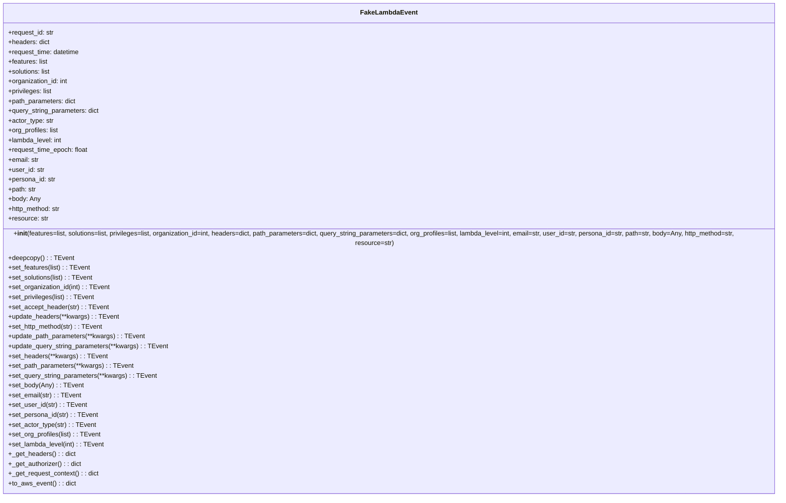

# Diagram: shipment_core/chromium_export/fv/python/fv/aws/lambdas/test/event.py

> Auto-generated by Obscura crawlers

## Mermaid

### SVG

<svg id="container" width="2005.0859375" xmlns="http://www.w3.org/2000/svg" class="classDiagram" height="1192" viewBox="0 0 2005.0859375 1192" role="graphics-document document" aria-roledescription="class"><g><defs><marker id="container_class-aggregationStart" class="marker aggregation class" refX="18" refY="7" markerWidth="190" markerHeight="240" orient="auto"><path d="M 18,7 L9,13 L1,7 L9,1 Z"></path></marker></defs><defs><marker id="container_class-aggregationEnd" class="marker aggregation class" refX="1" refY="7" markerWidth="20" markerHeight="28" orient="auto"><path d="M 18,7 L9,13 L1,7 L9,1 Z"></path></marker></defs><defs><marker id="container_class-extensionStart" class="marker extension class" refX="18" refY="7" markerWidth="190" markerHeight="240" orient="auto"><path d="M 1,7 L18,13 V 1 Z"></path></marker></defs><defs><marker id="container_class-extensionEnd" class="marker extension class" refX="1" refY="7" markerWidth="20" markerHeight="28" orient="auto"><path d="M 1,1 V 13 L18,7 Z"></path></marker></defs><defs><marker id="container_class-compositionStart" class="marker composition class" refX="18" refY="7" markerWidth="190" markerHeight="240" orient="auto"><path d="M 18,7 L9,13 L1,7 L9,1 Z"></path></marker></defs><defs><marker id="container_class-compositionEnd" class="marker composition class" refX="1" refY="7" markerWidth="20" markerHeight="28" orient="auto"><path d="M 18,7 L9,13 L1,7 L9,1 Z"></path></marker></defs><defs><marker id="container_class-dependencyStart" class="marker dependency class" refX="6" refY="7" markerWidth="190" markerHeight="240" orient="auto"><path d="M 5,7 L9,13 L1,7 L9,1 Z"></path></marker></defs><defs><marker id="container_class-dependencyEnd" class="marker dependency class" refX="13" refY="7" markerWidth="20" markerHeight="28" orient="auto"><path d="M 18,7 L9,13 L14,7 L9,1 Z"></path></marker></defs><defs><marker id="container_class-lollipopStart" class="marker lollipop class" refX="13" refY="7" markerWidth="190" markerHeight="240" orient="auto"><circle stroke="black" fill="transparent" cx="7" cy="7" r="6"></circle></marker></defs><defs><marker id="container_class-lollipopEnd" class="marker lollipop class" refX="1" refY="7" markerWidth="190" markerHeight="240" orient="auto"><circle stroke="black" fill="transparent" cx="7" cy="7" r="6"></circle></marker></defs><g class="root"><g class="clusters"></g><g class="edgePaths"></g><g class="edgeLabels"></g><g class="nodes"><g class="node default" id="classId-FakeLambdaEvent-0" transform="translate(1002.54296875, 596)"><g class="basic label-container"><path d="M-994.54296875 -588 L994.54296875 -588 L994.54296875 588 L-994.54296875 588" stroke="none" stroke-width="0" fill="#ECECFF" style=""></path><path d="M-994.54296875 -588 C-372.95651302693113 -588, 248.62994269613773 -588, 994.54296875 -588 M-994.54296875 -588 C-403.255732856962 -588, 188.03150303607595 -588, 994.54296875 -588 M994.54296875 -588 C994.54296875 -221.64457074667422, 994.54296875 144.71085850665156, 994.54296875 588 M994.54296875 -588 C994.54296875 -310.05239571665396, 994.54296875 -32.10479143330792, 994.54296875 588 M994.54296875 588 C211.8991731550559 588, -570.7446224398882 588, -994.54296875 588 M994.54296875 588 C389.7706080351735 588, -215.001752679653 588, -994.54296875 588 M-994.54296875 588 C-994.54296875 340.0956614340455, -994.54296875 92.19132286809094, -994.54296875 -588 M-994.54296875 588 C-994.54296875 206.6379218774431, -994.54296875 -174.72415624511382, -994.54296875 -588" stroke="#9370DB" stroke-width="1.3" fill="none" stroke-dasharray="0 0" style=""></path></g><g class="annotation-group text" transform="translate(0, -564)"></g><g class="label-group text" transform="translate(-65.8671875, -564)"><g class="label" style="font-weight: bolder" transform="translate(0,-12)"><foreignObject width="131.734375" height="24">

FakeLambdaEvent

</foreignObject></g></g><g class="members-group text" transform="translate(-982.54296875, -516)"><g class="label" style="" transform="translate(0,-12)"><foreignObject width="113.15625" height="24">

+request_id: str

</foreignObject></g><g class="label" style="" transform="translate(0,12)"><foreignObject width="101.90625" height="24">

+headers: dict

</foreignObject></g><g class="label" style="" transform="translate(0,36)"><foreignObject width="177.296875" height="24">

+request_time: datetime

</foreignObject></g><g class="label" style="" transform="translate(0,60)"><foreignObject width="97.71875" height="24">

+features: list

</foreignObject></g><g class="label" style="" transform="translate(0,84)"><foreignObject width="105.8125" height="24">

+solutions: list

</foreignObject></g><g class="label" style="" transform="translate(0,108)"><foreignObject width="148.484375" height="24">

+organization_id: int

</foreignObject></g><g class="label" style="" transform="translate(0,132)"><foreignObject width="108.6875" height="24">

+privileges: list

</foreignObject></g><g class="label" style="" transform="translate(0,156)"><foreignObject width="167.5625" height="24">

+path_parameters: dict

</foreignObject></g><g class="label" style="" transform="translate(0,180)"><foreignObject width="225.546875" height="24">

+query_string_parameters: dict

</foreignObject></g><g class="label" style="" transform="translate(0,204)"><foreignObject width="111.171875" height="24">

+actor_type: str

</foreignObject></g><g class="label" style="" transform="translate(0,228)"><foreignObject width="125.046875" height="24">

+org_profiles: list

</foreignObject></g><g class="label" style="" transform="translate(0,252)"><foreignObject width="133.34375" height="24">

+lambda_level: int

</foreignObject></g><g class="label" style="" transform="translate(0,276)"><foreignObject width="197.390625" height="24">

+request_time_epoch: float

</foreignObject></g><g class="label" style="" transform="translate(0,300)"><foreignObject width="75.984375" height="24">

+email: str

</foreignObject></g><g class="label" style="" transform="translate(0,324)"><foreignObject width="88.296875" height="24">

+user_id: str

</foreignObject></g><g class="label" style="" transform="translate(0,348)"><foreignObject width="116.953125" height="24">

+persona_id: str

</foreignObject></g><g class="label" style="" transform="translate(0,372)"><foreignObject width="68.703125" height="24">

+path: str

</foreignObject></g><g class="label" style="" transform="translate(0,396)"><foreignObject width="78.734375" height="24">

+body: Any

</foreignObject></g><g class="label" style="" transform="translate(0,420)"><foreignObject width="130.421875" height="24">

+http_method: str

</foreignObject></g><g class="label" style="" transform="translate(0,444)"><foreignObject width="97.78125" height="24">

+resource: str

</foreignObject></g></g><g class="methods-group text" transform="translate(-982.54296875, -12)"><g class="label" style="" transform="translate(0,-12)"><foreignObject width="1899.21875" height="24">

+<strong>init</strong>(features=list, solutions=list, privileges=list, organization_id=int, headers=dict, path_parameters=dict, query_string_parameters=dict, org_profiles=list, lambda_level=int, email=str, user_id=str, persona_id=str, path=str, body=Any, http_method=str, resource=str)

</foreignObject></g><g class="label" style="" transform="translate(0,12)"><foreignObject width="157.453125" height="24">

+deepcopy() : : TEvent

</foreignObject></g><g class="label" style="" transform="translate(0,36)"><foreignObject width="198.8125" height="24">

+set_features(list) : : TEvent

</foreignObject></g><g class="label" style="" transform="translate(0,60)"><foreignObject width="206.984375" height="24">

+set_solutions(list) : : TEvent

</foreignObject></g><g class="label" style="" transform="translate(0,84)"><foreignObject width="249.34375" height="24">

+set_organization_id(int) : : TEvent

</foreignObject></g><g class="label" style="" transform="translate(0,108)"><foreignObject width="209.84375" height="24">

+set_privileges(list) : : TEvent

</foreignObject></g><g class="label" style="" transform="translate(0,132)"><foreignObject width="243.125" height="24">

+set_accept_header(str) : : TEvent

</foreignObject></g><g class="label" style="" transform="translate(0,156)"><foreignObject width="268.53125" height="24">

+update_headers(**kwargs) : : TEvent

</foreignObject></g><g class="label" style="" transform="translate(0,180)"><foreignObject width="231.59375" height="24">

+set_http_method(str) : : TEvent

</foreignObject></g><g class="label" style="" transform="translate(0,204)"><foreignObject width="334.1875" height="24">

+update_path_parameters(**kwargs) : : TEvent

</foreignObject></g><g class="label" style="" transform="translate(0,228)"><foreignObject width="391.84375" height="24">

+update_query_string_parameters(**kwargs) : : TEvent

</foreignObject></g><g class="label" style="" transform="translate(0,252)"><foreignObject width="239.484375" height="24">

+set_headers(**kwargs) : : TEvent

</foreignObject></g><g class="label" style="" transform="translate(0,276)"><foreignObject width="305.125" height="24">

+set_path_parameters(**kwargs) : : TEvent

</foreignObject></g><g class="label" style="" transform="translate(0,300)"><foreignObject width="362.796875" height="24">

+set_query_string_parameters(**kwargs) : : TEvent

</foreignObject></g><g class="label" style="" transform="translate(0,324)"><foreignObject width="179.828125" height="24">

+set_body(Any) : : TEvent

</foreignObject></g><g class="label" style="" transform="translate(0,348)"><foreignObject width="176.6875" height="24">

+set_email(str) : : TEvent

</foreignObject></g><g class="label" style="" transform="translate(0,372)"><foreignObject width="189.140625" height="24">

+set_user_id(str) : : TEvent

</foreignObject></g><g class="label" style="" transform="translate(0,396)"><foreignObject width="218.125" height="24">

+set_persona_id(str) : : TEvent

</foreignObject></g><g class="label" style="" transform="translate(0,420)"><foreignObject width="212.265625" height="24">

+set_actor_type(str) : : TEvent

</foreignObject></g><g class="label" style="" transform="translate(0,444)"><foreignObject width="225.890625" height="24">

+set_org_profiles(list) : : TEvent

</foreignObject></g><g class="label" style="" transform="translate(0,468)"><foreignObject width="234.1875" height="24">

+set_lambda_level(int) : : TEvent

</foreignObject></g><g class="label" style="" transform="translate(0,492)"><foreignObject width="162.671875" height="24">

+_get_headers() : : dict

</foreignObject></g><g class="label" style="" transform="translate(0,516)"><foreignObject width="178.984375" height="24">

+_get_authorizer() : : dict

</foreignObject></g><g class="label" style="" transform="translate(0,540)"><foreignObject width="221.28125" height="24">

+_get_request_context() : : dict

</foreignObject></g><g class="label" style="" transform="translate(0,564)"><foreignObject width="164.328125" height="24">

+to_aws_event() : : dict

</foreignObject></g></g><g class="divider" style=""><path d="M-994.54296875 -540 C-596.4235369206028 -540, -198.30410509120554 -540, 994.54296875 -540 M-994.54296875 -540 C-203.7683590462567 -540, 587.0062506574866 -540, 994.54296875 -540" stroke="#9370DB" stroke-width="1.3" fill="none" stroke-dasharray="0 0" style=""></path></g><g class="divider" style=""><path d="M-994.54296875 -36 C-328.11985117227687 -36, 338.30326640544627 -36, 994.54296875 -36 M-994.54296875 -36 C-207.34317872169436 -36, 579.8566113066113 -36, 994.54296875 -36" stroke="#9370DB" stroke-width="1.3" fill="none" stroke-dasharray="0 0" style=""></path></g></g></g></g></g></svg>
