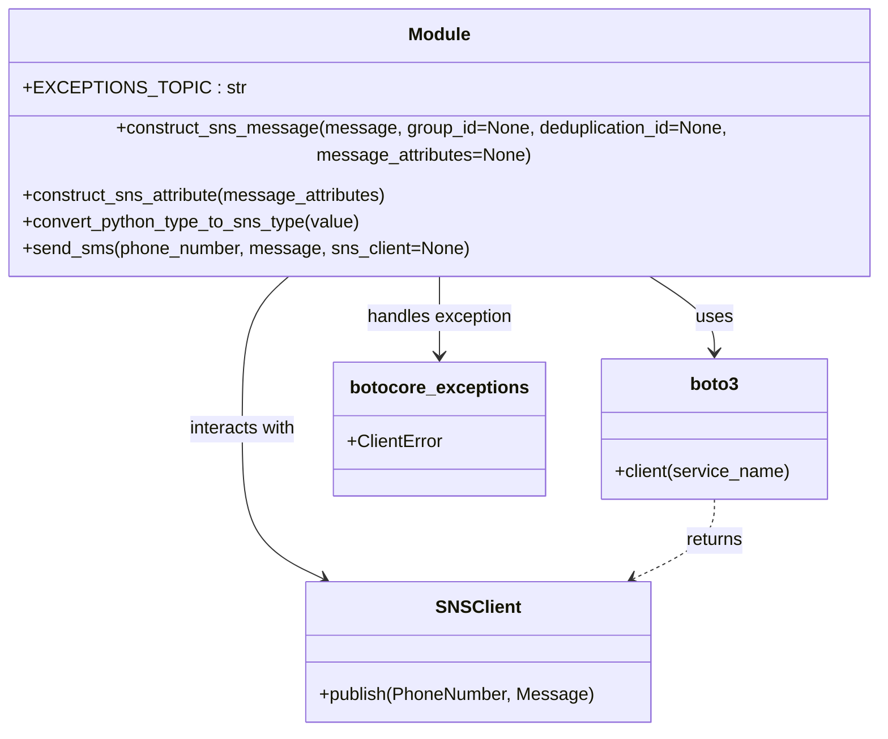

# Diagram: shipment_core/chromium_export/fv/python/fv/aws/sns.py


> Auto-generated by Obscura crawlers

## Diagram 1

```mermaid
flowchart TD
    EXC[EXCEPTIONS_TOPIC]:::const
    A[construct_sns_message(message, group_id, deduplication_id, message_attributes)] -->|if message_attributes| B[construct_sns_attribute(message_attributes)]
    B --> C[convert_python_type_to_sns_type(value)]
    A --> D[returns SNS message dict]
    C -->|returns DataType string| B
    send_sms[send_sms(phone_number, message, sns_client=None)] --> E{sns_client provided?}
    E -- no --> F[boto3.client("sns")] --> G[sns_client.publish(PhoneNumber, Message)]
    E -- yes --> G
    G --> H[success]
    G --> I[botocore.exceptions.ClientError]
    I --> J[logging.error("Could not publish SMS: ...")]
    EXC --- A
    classDef const fill:#f9f,stroke:#333,stroke-width:1px
```

> SVG rendering failed for this diagram.

## Diagram 2



### SVG

<svg id="container" width="811.21875" xmlns="http://www.w3.org/2000/svg" class="classDiagram" height="632" viewBox="0 0 811.21875 632" role="graphics-document document" aria-roledescription="class"><style>#container{font-family:"trebuchet ms",verdana,arial,sans-serif;font-size:16px;fill:#333;}@keyframes edge-animation-frame{from{stroke-dashoffset:0;}}@keyframes dash{to{stroke-dashoffset:0;}}#container .edge-animation-slow{stroke-dasharray:9,5!important;stroke-dashoffset:900;animation:dash 50s linear infinite;stroke-linecap:round;}#container .edge-animation-fast{stroke-dasharray:9,5!important;stroke-dashoffset:900;animation:dash 20s linear infinite;stroke-linecap:round;}#container .error-icon{fill:#552222;}#container .error-text{fill:#552222;stroke:#552222;}#container .edge-thickness-normal{stroke-width:1px;}#container .edge-thickness-thick{stroke-width:3.5px;}#container .edge-pattern-solid{stroke-dasharray:0;}#container .edge-thickness-invisible{stroke-width:0;fill:none;}#container .edge-pattern-dashed{stroke-dasharray:3;}#container .edge-pattern-dotted{stroke-dasharray:2;}#container .marker{fill:#333333;stroke:#333333;}#container .marker.cross{stroke:#333333;}#container svg{font-family:"trebuchet ms",verdana,arial,sans-serif;font-size:16px;}#container p{margin:0;}#container g.classGroup text{fill:#9370DB;stroke:none;font-family:"trebuchet ms",verdana,arial,sans-serif;font-size:10px;}#container g.classGroup text .title{font-weight:bolder;}#container .nodeLabel,#container .edgeLabel{color:#131300;}#container .edgeLabel .label rect{fill:#ECECFF;}#container .label text{fill:#131300;}#container .labelBkg{background:#ECECFF;}#container .edgeLabel .label span{background:#ECECFF;}#container .classTitle{font-weight:bolder;}#container .node rect,#container .node circle,#container .node ellipse,#container .node polygon,#container .node path{fill:#ECECFF;stroke:#9370DB;stroke-width:1px;}#container .divider{stroke:#9370DB;stroke-width:1;}#container g.clickable{cursor:pointer;}#container g.classGroup rect{fill:#ECECFF;stroke:#9370DB;}#container g.classGroup line{stroke:#9370DB;stroke-width:1;}#container .classLabel .box{stroke:none;stroke-width:0;fill:#ECECFF;opacity:0.5;}#container .classLabel .label{fill:#9370DB;font-size:10px;}#container .relation{stroke:#333333;stroke-width:1;fill:none;}#container .dashed-line{stroke-dasharray:3;}#container .dotted-line{stroke-dasharray:1 2;}#container #compositionStart,#container .composition{fill:#333333!important;stroke:#333333!important;stroke-width:1;}#container #compositionEnd,#container .composition{fill:#333333!important;stroke:#333333!important;stroke-width:1;}#container #dependencyStart,#container .dependency{fill:#333333!important;stroke:#333333!important;stroke-width:1;}#container #dependencyStart,#container .dependency{fill:#333333!important;stroke:#333333!important;stroke-width:1;}#container #extensionStart,#container .extension{fill:transparent!important;stroke:#333333!important;stroke-width:1;}#container #extensionEnd,#container .extension{fill:transparent!important;stroke:#333333!important;stroke-width:1;}#container #aggregationStart,#container .aggregation{fill:transparent!important;stroke:#333333!important;stroke-width:1;}#container #aggregationEnd,#container .aggregation{fill:transparent!important;stroke:#333333!important;stroke-width:1;}#container #lollipopStart,#container .lollipop{fill:#ECECFF!important;stroke:#333333!important;stroke-width:1;}#container #lollipopEnd,#container .lollipop{fill:#ECECFF!important;stroke:#333333!important;stroke-width:1;}#container .edgeTerminals{font-size:11px;line-height:initial;}#container .classTitleText{text-anchor:middle;font-size:18px;fill:#333;}#container .label-icon{display:inline-block;height:1em;overflow:visible;vertical-align:-0.125em;}#container .node .label-icon path{fill:currentColor;stroke:revert;stroke-width:revert;}#container :root{--mermaid-font-family:"trebuchet ms",verdana,arial,sans-serif;}</style><g><defs><marker id="container_class-aggregationStart" class="marker aggregation class" refX="18" refY="7" markerWidth="190" markerHeight="240" orient="auto"><path d="M 18,7 L9,13 L1,7 L9,1 Z"></path></marker></defs><defs><marker id="container_class-aggregationEnd" class="marker aggregation class" refX="1" refY="7" markerWidth="20" markerHeight="28" orient="auto"><path d="M 18,7 L9,13 L1,7 L9,1 Z"></path></marker></defs><defs><marker id="container_class-extensionStart" class="marker extension class" refX="18" refY="7" markerWidth="190" markerHeight="240" orient="auto"><path d="M 1,7 L18,13 V 1 Z"></path></marker></defs><defs><marker id="container_class-extensionEnd" class="marker extension class" refX="1" refY="7" markerWidth="20" markerHeight="28" orient="auto"><path d="M 1,1 V 13 L18,7 Z"></path></marker></defs><defs><marker id="container_class-compositionStart" class="marker composition class" refX="18" refY="7" markerWidth="190" markerHeight="240" orient="auto"><path d="M 18,7 L9,13 L1,7 L9,1 Z"></path></marker></defs><defs><marker id="container_class-compositionEnd" class="marker composition class" refX="1" refY="7" markerWidth="20" markerHeight="28" orient="auto"><path d="M 18,7 L9,13 L1,7 L9,1 Z"></path></marker></defs><defs><marker id="container_class-dependencyStart" class="marker dependency class" refX="6" refY="7" markerWidth="190" markerHeight="240" orient="auto"><path d="M 5,7 L9,13 L1,7 L9,1 Z"></path></marker></defs><defs><marker id="container_class-dependencyEnd" class="marker dependency class" refX="13" refY="7" markerWidth="20" markerHeight="28" orient="auto"><path d="M 18,7 L9,13 L14,7 L9,1 Z"></path></marker></defs><defs><marker id="container_class-lollipopStart" class="marker lollipop class" refX="13" refY="7" markerWidth="190" markerHeight="240" orient="auto"><circle stroke="black" fill="transparent" cx="7" cy="7" r="6"></circle></marker></defs><defs><marker id="container_class-lollipopEnd" class="marker lollipop class" refX="1" refY="7" markerWidth="190" markerHeight="240" orient="auto"><circle stroke="black" fill="transparent" cx="7" cy="7" r="6"></circle></marker></defs><g class="root"><g class="clusters"></g><g class="edgePaths"><path d="M587.874,224L598.281,230.167C608.688,236.333,629.502,248.667,639.909,260C650.316,271.333,650.316,281.667,650.316,286.833L650.316,292" id="id_Module_boto3_1" class="edge-thickness-normal edge-pattern-solid relation" style=";;;" data-edge="true" data-et="edge" data-id="id_Module_boto3_1" data-points="W3sieCI6NTg3Ljg3MzkyMjQxMzc5MzEsInkiOjIyNH0seyJ4Ijo2NTAuMzE2NDA2MjUsInkiOjI2MX0seyJ4Ijo2NTAuMzE2NDA2MjUsInkiOjI5OH1d" marker-end="url(#container_class-dependencyEnd)"></path><path d="M273.513,224L265.971,230.167C258.428,236.333,243.343,248.667,235.8,271.5C228.258,294.333,228.258,327.667,228.258,361C228.258,394.333,228.258,427.667,240.368,450.072C252.477,472.477,276.697,483.954,288.807,489.692L300.917,495.431" id="id_Module_SNSClient_2" class="edge-thickness-normal edge-pattern-solid relation" style=";;;" data-edge="true" data-et="edge" data-id="id_Module_SNSClient_2" data-points="W3sieCI6MjczLjUxMzAzODc5MzEwMzQsInkiOjIyNH0seyJ4IjoyMjguMjU3ODEyNSwieSI6MjYxfSx7IngiOjIyOC4yNTc4MTI1LCJ5IjozNjF9LHsieCI6MjI4LjI1NzgxMjUsInkiOjQ2MX0seyJ4IjozMDYuMzM4NjUyMzQzNzUsInkiOjQ5OH1d" marker-end="url(#container_class-dependencyEnd)"></path><path d="M405.609,224L405.609,230.167C405.609,236.333,405.609,248.667,405.609,260.5C405.609,272.333,405.609,283.667,405.609,289.333L405.609,295" id="id_Module_botocore_exceptions_3" class="edge-thickness-normal edge-pattern-solid relation" style=";;;" data-edge="true" data-et="edge" data-id="id_Module_botocore_exceptions_3" data-points="W3sieCI6NDA1LjYwOTM3NSwieSI6MjI0fSx7IngiOjQwNS42MDkzNzUsInkiOjI2MX0seyJ4Ijo0MDUuNjA5Mzc1LCJ5IjozMDF9XQ==" marker-end="url(#container_class-dependencyEnd)"></path><path d="M650.316,424L650.316,430.167C650.316,436.333,650.316,448.667,638.207,460.572C626.097,472.477,601.877,483.954,589.767,489.692L577.658,495.431" id="id_boto3_SNSClient_4" class="edge-thickness-normal edge-pattern-dashed relation" style=";;;" data-edge="true" data-et="edge" data-id="id_boto3_SNSClient_4" data-points="W3sieCI6NjUwLjMxNjQwNjI1LCJ5Ijo0MjR9LHsieCI6NjUwLjMxNjQwNjI1LCJ5Ijo0NjF9LHsieCI6NTcyLjIzNTU2NjQwNjI1LCJ5Ijo0OTh9XQ==" marker-end="url(#container_class-dependencyEnd)"></path></g><g class="edgeLabels"><g class="edgeLabel" transform="translate(650.31640625, 261)"><g class="label" data-id="id_Module_boto3_1" transform="translate(-16.4921875, -12)"><foreignObject width="32.984375" height="24"><div xmlns="http://www.w3.org/1999/xhtml" class="labelBkg" style="display: table-cell; white-space: nowrap; line-height: 1.5; max-width: 200px; text-align: center;"><span class="edgeLabel"><p>uses</p></span></div></foreignObject></g></g><g class="edgeLabel" transform="translate(228.2578125, 361)"><g class="label" data-id="id_Module_SNSClient_2" transform="translate(-49.375, -12)"><foreignObject width="98.75" height="24"><div xmlns="http://www.w3.org/1999/xhtml" class="labelBkg" style="display: table-cell; white-space: nowrap; line-height: 1.5; max-width: 200px; text-align: center;"><span class="edgeLabel"><p>interacts with</p></span></div></foreignObject></g></g><g class="edgeLabel" transform="translate(405.609375, 261)"><g class="label" data-id="id_Module_botocore_exceptions_3" transform="translate(-66.4140625, -12)"><foreignObject width="132.828125" height="24"><div xmlns="http://www.w3.org/1999/xhtml" class="labelBkg" style="display: table-cell; white-space: nowrap; line-height: 1.5; max-width: 200px; text-align: center;"><span class="edgeLabel"><p>handles exception</p></span></div></foreignObject></g></g><g class="edgeLabel" transform="translate(650.31640625, 461)"><g class="label" data-id="id_boto3_SNSClient_4" transform="translate(-26.265625, -12)"><foreignObject width="52.53125" height="24"><div xmlns="http://www.w3.org/1999/xhtml" class="labelBkg" style="display: table-cell; white-space: nowrap; line-height: 1.5; max-width: 200px; text-align: center;"><span class="edgeLabel"><p>returns</p></span></div></foreignObject></g></g></g><g class="nodes"><g class="node default" id="classId-Module-0" transform="translate(405.609375, 116)"><g class="basic label-container"><path d="M-397.609375 -108 L397.609375 -108 L397.609375 108 L-397.609375 108" stroke="none" stroke-width="0" fill="#ECECFF" style=""></path><path d="M-397.609375 -108 C-210.5126084505796 -108, -23.415841901159183 -108, 397.609375 -108 M-397.609375 -108 C-168.92405339340223 -108, 59.761268213195535 -108, 397.609375 -108 M397.609375 -108 C397.609375 -25.748398088333218, 397.609375 56.503203823333564, 397.609375 108 M397.609375 -108 C397.609375 -34.817585059197, 397.609375 38.364829881606, 397.609375 108 M397.609375 108 C127.9322513564124 108, -141.7448722871752 108, -397.609375 108 M397.609375 108 C137.3301337431779 108, -122.94910751364421 108, -397.609375 108 M-397.609375 108 C-397.609375 48.64777004541779, -397.609375 -10.704459909164413, -397.609375 -108 M-397.609375 108 C-397.609375 42.80796693784882, -397.609375 -22.384066124302365, -397.609375 -108" stroke="#9370DB" stroke-width="1.3" fill="none" stroke-dasharray="0 0" style=""></path></g><g class="annotation-group text" transform="translate(0, -84)"></g><g class="label-group text" transform="translate(-27.09375, -84)"><g class="label" style="font-weight: bolder" transform="translate(0,-12)"><foreignObject width="54.1875" height="24"><div xmlns="http://www.w3.org/1999/xhtml" style="display: table-cell; white-space: nowrap; line-height: 1.5; max-width: 104px; text-align: center;"><span class="nodeLabel markdown-node-label" style=""><p>Module</p></span></div></foreignObject></g></g><g class="members-group text" transform="translate(-385.609375, -36)"><g class="label" style="" transform="translate(0,-12)"><foreignObject width="175.640625" height="24"><div xmlns="http://www.w3.org/1999/xhtml" style="display: table-cell; white-space: nowrap; line-height: 1.5; max-width: 234px; text-align: center;"><span class="nodeLabel markdown-node-label" style=""><p>+EXCEPTIONS_TOPIC : str</p></span></div></foreignObject></g></g><g class="methods-group text" transform="translate(-385.609375, 12)"><g class="label" style="" transform="translate(0,-12)"><foreignObject width="744.125" height="24"><div xmlns="http://www.w3.org/1999/xhtml" style="display: table-cell; white-space: nowrap; line-height: 1.5; max-width: 801px; text-align: center;"><span class="nodeLabel markdown-node-label" style=""><p>+construct_sns_message(message, group_id=None, deduplication_id=None, message_attributes=None)</p></span></div></foreignObject></g><g class="label" style="" transform="translate(0,12)"><foreignObject width="332.453125" height="24"><div xmlns="http://www.w3.org/1999/xhtml" style="display: table-cell; white-space: nowrap; line-height: 1.5; max-width: 390px; text-align: center;"><span class="nodeLabel markdown-node-label" style=""><p>+construct_sns_attribute(message_attributes)</p></span></div></foreignObject></g><g class="label" style="" transform="translate(0,36)"><foreignObject width="305.296875" height="24"><div xmlns="http://www.w3.org/1999/xhtml" style="display: table-cell; white-space: nowrap; line-height: 1.5; max-width: 363px; text-align: center;"><span class="nodeLabel markdown-node-label" style=""><p>+convert_python_type_to_sns_type(value)</p></span></div></foreignObject></g><g class="label" style="" transform="translate(0,60)"><foreignObject width="397.78125" height="24"><div xmlns="http://www.w3.org/1999/xhtml" style="display: table-cell; white-space: nowrap; line-height: 1.5; max-width: 455px; text-align: center;"><span class="nodeLabel markdown-node-label" style=""><p>+send_sms(phone_number, message, sns_client=None)</p></span></div></foreignObject></g></g><g class="divider" style=""><path d="M-397.609375 -60 C-109.70660867019228 -60, 178.19615765961544 -60, 397.609375 -60 M-397.609375 -60 C-210.76422333948307 -60, -23.919071678966134 -60, 397.609375 -60" stroke="#9370DB" stroke-width="1.3" fill="none" stroke-dasharray="0 0" style=""></path></g><g class="divider" style=""><path d="M-397.609375 -12 C-196.69195427765717 -12, 4.225466444685651 -12, 397.609375 -12 M-397.609375 -12 C-220.74355407708674 -12, -43.877733154173484 -12, 397.609375 -12" stroke="#9370DB" stroke-width="1.3" fill="none" stroke-dasharray="0 0" style=""></path></g></g><g class="node default" id="classId-boto3-1" transform="translate(650.31640625, 361)"><g class="basic label-container"><path d="M-101.73046875 -63 L101.73046875 -63 L101.73046875 63 L-101.73046875 63" stroke="none" stroke-width="0" fill="#ECECFF" style=""></path><path d="M-101.73046875 -63 C-38.57878880509266 -63, 24.572891139814686 -63, 101.73046875 -63 M-101.73046875 -63 C-53.48399148509399 -63, -5.237514220187975 -63, 101.73046875 -63 M101.73046875 -63 C101.73046875 -37.740901489329815, 101.73046875 -12.481802978659637, 101.73046875 63 M101.73046875 -63 C101.73046875 -23.611716140992506, 101.73046875 15.776567718014988, 101.73046875 63 M101.73046875 63 C54.28448669712251 63, 6.83850464424502 63, -101.73046875 63 M101.73046875 63 C29.42470047648527 63, -42.88106779702946 63, -101.73046875 63 M-101.73046875 63 C-101.73046875 14.105231295530217, -101.73046875 -34.789537408939566, -101.73046875 -63 M-101.73046875 63 C-101.73046875 21.0256497748868, -101.73046875 -20.948700450226397, -101.73046875 -63" stroke="#9370DB" stroke-width="1.3" fill="none" stroke-dasharray="0 0" style=""></path></g><g class="annotation-group text" transform="translate(0, -39)"></g><g class="label-group text" transform="translate(-21.0703125, -39)"><g class="label" style="font-weight: bolder" transform="translate(0,-12)"><foreignObject width="42.140625" height="24"><div xmlns="http://www.w3.org/1999/xhtml" style="display: table-cell; white-space: nowrap; line-height: 1.5; max-width: 91px; text-align: center;"><span class="nodeLabel markdown-node-label" style=""><p>boto3</p></span></div></foreignObject></g></g><g class="members-group text" transform="translate(-89.73046875, 9)"></g><g class="methods-group text" transform="translate(-89.73046875, 39)"><g class="label" style="" transform="translate(0,-12)"><foreignObject width="158.390625" height="24"><div xmlns="http://www.w3.org/1999/xhtml" style="display: table-cell; white-space: nowrap; line-height: 1.5; max-width: 216px; text-align: center;"><span class="nodeLabel markdown-node-label" style=""><p>+client(service_name)</p></span></div></foreignObject></g></g><g class="divider" style=""><path d="M-101.73046875 -15 C-23.837466137526377 -15, 54.055536474947246 -15, 101.73046875 -15 M-101.73046875 -15 C-58.682585408518015 -15, -15.63470206703603 -15, 101.73046875 -15" stroke="#9370DB" stroke-width="1.3" fill="none" stroke-dasharray="0 0" style=""></path></g><g class="divider" style=""><path d="M-101.73046875 9 C-20.841943947355603 9, 60.046580855288795 9, 101.73046875 9 M-101.73046875 9 C-53.518794903631296 9, -5.3071210572625915 9, 101.73046875 9" stroke="#9370DB" stroke-width="1.3" fill="none" stroke-dasharray="0 0" style=""></path></g></g><g class="node default" id="classId-SNSClient-2" transform="translate(439.287109375, 561)"><g class="basic label-container"><path d="M-152.265625 -63 L152.265625 -63 L152.265625 63 L-152.265625 63" stroke="none" stroke-width="0" fill="#ECECFF" style=""></path><path d="M-152.265625 -63 C-78.44688151071054 -63, -4.62813802142108 -63, 152.265625 -63 M-152.265625 -63 C-72.06084738808926 -63, 8.143930223821485 -63, 152.265625 -63 M152.265625 -63 C152.265625 -20.714789027209896, 152.265625 21.570421945580208, 152.265625 63 M152.265625 -63 C152.265625 -27.227275026937967, 152.265625 8.545449946124066, 152.265625 63 M152.265625 63 C55.96050059462014 63, -40.344623810759714 63, -152.265625 63 M152.265625 63 C43.770155258281136 63, -64.72531448343773 63, -152.265625 63 M-152.265625 63 C-152.265625 23.523403452114145, -152.265625 -15.95319309577171, -152.265625 -63 M-152.265625 63 C-152.265625 15.358635413250461, -152.265625 -32.28272917349908, -152.265625 -63" stroke="#9370DB" stroke-width="1.3" fill="none" stroke-dasharray="0 0" style=""></path></g><g class="annotation-group text" transform="translate(0, -39)"></g><g class="label-group text" transform="translate(-35.734375, -39)"><g class="label" style="font-weight: bolder" transform="translate(0,-12)"><foreignObject width="71.46875" height="24"><div xmlns="http://www.w3.org/1999/xhtml" style="display: table-cell; white-space: nowrap; line-height: 1.5; max-width: 120px; text-align: center;"><span class="nodeLabel markdown-node-label" style=""><p>SNSClient</p></span></div></foreignObject></g></g><g class="members-group text" transform="translate(-140.265625, 9)"></g><g class="methods-group text" transform="translate(-140.265625, 39)"><g class="label" style="" transform="translate(0,-12)"><foreignObject width="244.796875" height="24"><div xmlns="http://www.w3.org/1999/xhtml" style="display: table-cell; white-space: nowrap; line-height: 1.5; max-width: 302px; text-align: center;"><span class="nodeLabel markdown-node-label" style=""><p>+publish(PhoneNumber, Message)</p></span></div></foreignObject></g></g><g class="divider" style=""><path d="M-152.265625 -15 C-85.36233188153352 -15, -18.459038763067042 -15, 152.265625 -15 M-152.265625 -15 C-42.55527364474014 -15, 67.15507771051972 -15, 152.265625 -15" stroke="#9370DB" stroke-width="1.3" fill="none" stroke-dasharray="0 0" style=""></path></g><g class="divider" style=""><path d="M-152.265625 9 C-75.82115133601273 9, 0.6233223279745346 9, 152.265625 9 M-152.265625 9 C-30.988040357989973 9, 90.28954428402005 9, 152.265625 9" stroke="#9370DB" stroke-width="1.3" fill="none" stroke-dasharray="0 0" style=""></path></g></g><g class="node default" id="classId-botocore_exceptions-3" transform="translate(405.609375, 361)"><g class="basic label-container"><path d="M-92.9765625 -60 L92.9765625 -60 L92.9765625 60 L-92.9765625 60" stroke="none" stroke-width="0" fill="#ECECFF" style=""></path><path d="M-92.9765625 -60 C-46.67163480684245 -60, -0.36670711368489606 -60, 92.9765625 -60 M-92.9765625 -60 C-46.76722373112649 -60, -0.5578849622529845 -60, 92.9765625 -60 M92.9765625 -60 C92.9765625 -22.891085291039573, 92.9765625 14.217829417920854, 92.9765625 60 M92.9765625 -60 C92.9765625 -25.975204745059493, 92.9765625 8.049590509881014, 92.9765625 60 M92.9765625 60 C23.984108747294684 60, -45.00834500541063 60, -92.9765625 60 M92.9765625 60 C18.824883243615275 60, -55.32679601276945 60, -92.9765625 60 M-92.9765625 60 C-92.9765625 17.32799204790178, -92.9765625 -25.34401590419644, -92.9765625 -60 M-92.9765625 60 C-92.9765625 23.8333324182127, -92.9765625 -12.333335163574603, -92.9765625 -60" stroke="#9370DB" stroke-width="1.3" fill="none" stroke-dasharray="0 0" style=""></path></g><g class="annotation-group text" transform="translate(0, -36)"></g><g class="label-group text" transform="translate(-76.296875, -36)"><g class="label" style="font-weight: bolder" transform="translate(0,-12)"><foreignObject width="152.59375" height="24"><div xmlns="http://www.w3.org/1999/xhtml" style="display: table-cell; white-space: nowrap; line-height: 1.5; max-width: 201px; text-align: center;"><span class="nodeLabel markdown-node-label" style=""><p>botocore_exceptions</p></span></div></foreignObject></g></g><g class="members-group text" transform="translate(-80.9765625, 12)"><g class="label" style="" transform="translate(0,-12)"><foreignObject width="85.65625" height="24"><div xmlns="http://www.w3.org/1999/xhtml" style="display: table-cell; white-space: nowrap; line-height: 1.5; max-width: 144px; text-align: center;"><span class="nodeLabel markdown-node-label" style=""><p>+ClientError</p></span></div></foreignObject></g></g><g class="methods-group text" transform="translate(-80.9765625, 60)"></g><g class="divider" style=""><path d="M-92.9765625 -12 C-44.967573165989286 -12, 3.041416168021428 -12, 92.9765625 -12 M-92.9765625 -12 C-52.77600336604362 -12, -12.575444232087236 -12, 92.9765625 -12" stroke="#9370DB" stroke-width="1.3" fill="none" stroke-dasharray="0 0" style=""></path></g><g class="divider" style=""><path d="M-92.9765625 36 C-21.775969161922617 36, 49.424624176154765 36, 92.9765625 36 M-92.9765625 36 C-19.02929435454908 36, 54.91797379090184 36, 92.9765625 36" stroke="#9370DB" stroke-width="1.3" fill="none" stroke-dasharray="0 0" style=""></path></g></g></g></g></g></svg>
