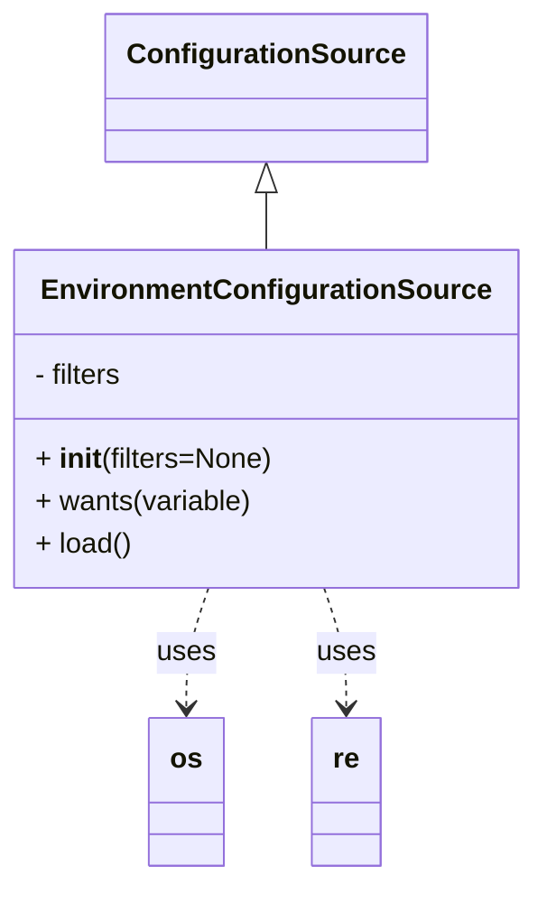

# Diagram: shipment_core/chromium_export/fv/python/fv/config/env.py

> Auto-generated by Obscura crawlers

## Mermaid

### SVG

<svg id="container" width="295.4140625" xmlns="http://www.w3.org/2000/svg" class="classDiagram" height="500" viewBox="0 0 295.4140625 500" role="graphics-document document" aria-roledescription="class"><g><defs><marker id="container_class-aggregationStart" class="marker aggregation class" refX="18" refY="7" markerWidth="190" markerHeight="240" orient="auto"><path d="M 18,7 L9,13 L1,7 L9,1 Z"></path></marker></defs><defs><marker id="container_class-aggregationEnd" class="marker aggregation class" refX="1" refY="7" markerWidth="20" markerHeight="28" orient="auto"><path d="M 18,7 L9,13 L1,7 L9,1 Z"></path></marker></defs><defs><marker id="container_class-extensionStart" class="marker extension class" refX="18" refY="7" markerWidth="190" markerHeight="240" orient="auto"><path d="M 1,7 L18,13 V 1 Z"></path></marker></defs><defs><marker id="container_class-extensionEnd" class="marker extension class" refX="1" refY="7" markerWidth="20" markerHeight="28" orient="auto"><path d="M 1,1 V 13 L18,7 Z"></path></marker></defs><defs><marker id="container_class-compositionStart" class="marker composition class" refX="18" refY="7" markerWidth="190" markerHeight="240" orient="auto"><path d="M 18,7 L9,13 L1,7 L9,1 Z"></path></marker></defs><defs><marker id="container_class-compositionEnd" class="marker composition class" refX="1" refY="7" markerWidth="20" markerHeight="28" orient="auto"><path d="M 18,7 L9,13 L1,7 L9,1 Z"></path></marker></defs><defs><marker id="container_class-dependencyStart" class="marker dependency class" refX="6" refY="7" markerWidth="190" markerHeight="240" orient="auto"><path d="M 5,7 L9,13 L1,7 L9,1 Z"></path></marker></defs><defs><marker id="container_class-dependencyEnd" class="marker dependency class" refX="13" refY="7" markerWidth="20" markerHeight="28" orient="auto"><path d="M 18,7 L9,13 L14,7 L9,1 Z"></path></marker></defs><defs><marker id="container_class-lollipopStart" class="marker lollipop class" refX="13" refY="7" markerWidth="190" markerHeight="240" orient="auto"><circle stroke="black" fill="transparent" cx="7" cy="7" r="6"></circle></marker></defs><defs><marker id="container_class-lollipopEnd" class="marker lollipop class" refX="1" refY="7" markerWidth="190" markerHeight="240" orient="auto"><circle stroke="black" fill="transparent" cx="7" cy="7" r="6"></circle></marker></defs><g class="root"><g class="clusters"></g><g class="edgePaths"><path d="M147.707,109.25L147.707,110.542C147.707,111.833,147.707,114.417,147.707,119.875C147.707,125.333,147.707,133.667,147.707,137.833L147.707,142" id="id_ConfigurationSource_EnvironmentConfigurationSource_1" class="edge-thickness-normal edge-pattern-solid relation" style=";;;" data-edge="true" data-et="edge" data-id="id_ConfigurationSource_EnvironmentConfigurationSource_1" data-points="W3sieCI6MTQ3LjcwNzAzMTI1LCJ5Ijo5Mn0seyJ4IjoxNDcuNzA3MDMxMjUsInkiOjExN30seyJ4IjoxNDcuNzA3MDMxMjUsInkiOjE0Mn1d" marker-start="url(#container_class-extensionStart)"></path><path d="M115.251,334L113.166,340.167C111.082,346.333,106.912,358.667,104.827,370C102.742,381.333,102.742,391.667,102.742,396.833L102.742,402" id="id_EnvironmentConfigurationSource_os_2" class="edge-thickness-normal edge-pattern-dashed relation" style=";;;" data-edge="true" data-et="edge" data-id="id_EnvironmentConfigurationSource_os_2" data-points="W3sieCI6MTE1LjI1MTIwNDE4MjMzMDgyLCJ5IjozMzR9LHsieCI6MTAyLjc0MjE4NzUsInkiOjM3MX0seyJ4IjoxMDIuNzQyMTg3NSwieSI6NDA4fV0=" marker-end="url(#container_class-dependencyEnd)"></path><path d="M180.163,334L182.248,340.167C184.333,346.333,188.502,358.667,190.587,370C192.672,381.333,192.672,391.667,192.672,396.833L192.672,402" id="id_EnvironmentConfigurationSource_re_3" class="edge-thickness-normal edge-pattern-dashed relation" style=";;;" data-edge="true" data-et="edge" data-id="id_EnvironmentConfigurationSource_re_3" data-points="W3sieCI6MTgwLjE2Mjg1ODMxNzY2OTIsInkiOjMzNH0seyJ4IjoxOTIuNjcxODc1LCJ5IjozNzF9LHsieCI6MTkyLjY3MTg3NSwieSI6NDA4fV0=" marker-end="url(#container_class-dependencyEnd)"></path></g><g class="edgeLabels"><g class="edgeLabel"><g class="label" data-id="id_ConfigurationSource_EnvironmentConfigurationSource_1" transform="translate(0, 0)"><foreignObject width="0" height="0">

</foreignObject></g></g><g class="edgeLabel" transform="translate(102.7421875, 371)"><g class="label" data-id="id_EnvironmentConfigurationSource_os_2" transform="translate(-16.4921875, -12)"><foreignObject width="32.984375" height="24">

uses

</foreignObject></g></g><g class="edgeLabel" transform="translate(192.671875, 371)"><g class="label" data-id="id_EnvironmentConfigurationSource_re_3" transform="translate(-16.4921875, -12)"><foreignObject width="32.984375" height="24">

uses

</foreignObject></g></g></g><g class="nodes"><g class="node default" id="classId-ConfigurationSource-0" transform="translate(147.70703125, 50)"><g class="basic label-container"><path d="M-86.25 -42 L86.25 -42 L86.25 42 L-86.25 42" stroke="none" stroke-width="0" fill="#ECECFF" style=""></path><path d="M-86.25 -42 C-31.437684509665367 -42, 23.374630980669266 -42, 86.25 -42 M-86.25 -42 C-33.74560334215233 -42, 18.758793315695343 -42, 86.25 -42 M86.25 -42 C86.25 -21.577247179435307, 86.25 -1.1544943588706147, 86.25 42 M86.25 -42 C86.25 -13.266400756207332, 86.25 15.467198487585335, 86.25 42 M86.25 42 C39.9736291170251 42, -6.302741765949804 42, -86.25 42 M86.25 42 C50.256015209273826 42, 14.262030418547653 42, -86.25 42 M-86.25 42 C-86.25 13.537513273670182, -86.25 -14.924973452659636, -86.25 -42 M-86.25 42 C-86.25 18.983112529333436, -86.25 -4.033774941333128, -86.25 -42" stroke="#9370DB" stroke-width="1.3" fill="none" stroke-dasharray="0 0" style=""></path></g><g class="annotation-group text" transform="translate(0, -18)"></g><g class="label-group text" transform="translate(-74.25, -18)"><g class="label" style="font-weight: bolder" transform="translate(0,-12)"><foreignObject width="148.5" height="24">

ConfigurationSource

</foreignObject></g></g><g class="members-group text" transform="translate(-74.25, 30)"></g><g class="methods-group text" transform="translate(-74.25, 60)"></g><g class="divider" style=""><path d="M-86.25 6 C-43.293213671555556 6, -0.33642734311111155 6, 86.25 6 M-86.25 6 C-18.750190616321092 6, 48.749618767357816 6, 86.25 6" stroke="#9370DB" stroke-width="1.3" fill="none" stroke-dasharray="0 0" style=""></path></g><g class="divider" style=""><path d="M-86.25 24 C-26.381166775317944 24, 33.48766644936411 24, 86.25 24 M-86.25 24 C-25.333622699649816 24, 35.58275460070037 24, 86.25 24" stroke="#9370DB" stroke-width="1.3" fill="none" stroke-dasharray="0 0" style=""></path></g></g><g class="node default" id="classId-EnvironmentConfigurationSource-1" transform="translate(147.70703125, 238)"><g class="basic label-container"><path d="M-139.70703125 -96 L139.70703125 -96 L139.70703125 96 L-139.70703125 96" stroke="none" stroke-width="0" fill="#ECECFF" style=""></path><path d="M-139.70703125 -96 C-45.81764482958164 -96, 48.07174159083672 -96, 139.70703125 -96 M-139.70703125 -96 C-67.73958420041694 -96, 4.227862849166115 -96, 139.70703125 -96 M139.70703125 -96 C139.70703125 -54.820422524317344, 139.70703125 -13.640845048634688, 139.70703125 96 M139.70703125 -96 C139.70703125 -33.56407554765234, 139.70703125 28.871848904695327, 139.70703125 96 M139.70703125 96 C34.91442503722746 96, -69.87818117554508 96, -139.70703125 96 M139.70703125 96 C51.72917523334337 96, -36.24868078331326 96, -139.70703125 96 M-139.70703125 96 C-139.70703125 22.746808501135774, -139.70703125 -50.50638299772845, -139.70703125 -96 M-139.70703125 96 C-139.70703125 25.791031309561248, -139.70703125 -44.417937380877504, -139.70703125 -96" stroke="#9370DB" stroke-width="1.3" fill="none" stroke-dasharray="0 0" style=""></path></g><g class="annotation-group text" transform="translate(0, -72)"></g><g class="label-group text" transform="translate(-120.4453125, -72)"><g class="label" style="font-weight: bolder" transform="translate(0,-12)"><foreignObject width="240.890625" height="24">

EnvironmentConfigurationSource

</foreignObject></g></g><g class="members-group text" transform="translate(-127.70703125, -24)"><g class="label" style="" transform="translate(0,-12)"><foreignObject width="52.25" height="24">

- filters

</foreignObject></g></g><g class="methods-group text" transform="translate(-127.70703125, 24)"><g class="label" style="" transform="translate(0,-12)"><foreignObject width="134.96875" height="24">

+ <strong>init</strong>(filters=None)

</foreignObject></g><g class="label" style="" transform="translate(0,12)"><foreignObject width="123.75" height="24">

+ wants(variable)

</foreignObject></g><g class="label" style="" transform="translate(0,36)"><foreignObject width="54.65625" height="24">

+ load()

</foreignObject></g></g><g class="divider" style=""><path d="M-139.70703125 -48 C-76.15044979278501 -48, -12.593868335570022 -48, 139.70703125 -48 M-139.70703125 -48 C-63.23946392931724 -48, 13.228103391365522 -48, 139.70703125 -48" stroke="#9370DB" stroke-width="1.3" fill="none" stroke-dasharray="0 0" style=""></path></g><g class="divider" style=""><path d="M-139.70703125 0 C-48.43618558346559 0, 42.834660083068826 0, 139.70703125 0 M-139.70703125 0 C-42.4497066438699 0, 54.807617962260196 0, 139.70703125 0" stroke="#9370DB" stroke-width="1.3" fill="none" stroke-dasharray="0 0" style=""></path></g></g><g class="node default" id="classId-os-2" transform="translate(102.7421875, 450)"><g class="basic label-container"><path d="M-20.5390625 -42 L20.5390625 -42 L20.5390625 42 L-20.5390625 42" stroke="none" stroke-width="0" fill="#ECECFF" style=""></path><path d="M-20.5390625 -42 C-6.15099140386477 -42, 8.23707969227046 -42, 20.5390625 -42 M-20.5390625 -42 C-9.805417118190297 -42, 0.9282282636194061 -42, 20.5390625 -42 M20.5390625 -42 C20.5390625 -16.867258273979576, 20.5390625 8.265483452040847, 20.5390625 42 M20.5390625 -42 C20.5390625 -21.260008051282515, 20.5390625 -0.5200161025650303, 20.5390625 42 M20.5390625 42 C5.817990645276035 42, -8.90308120944793 42, -20.5390625 42 M20.5390625 42 C12.31350398236637 42, 4.087945464732741 42, -20.5390625 42 M-20.5390625 42 C-20.5390625 14.505817662672154, -20.5390625 -12.988364674655692, -20.5390625 -42 M-20.5390625 42 C-20.5390625 13.11603337640518, -20.5390625 -15.767933247189639, -20.5390625 -42" stroke="#9370DB" stroke-width="1.3" fill="none" stroke-dasharray="0 0" style=""></path></g><g class="annotation-group text" transform="translate(0, -18)"></g><g class="label-group text" transform="translate(-8.5390625, -18)"><g class="label" style="font-weight: bolder" transform="translate(0,-12)"><foreignObject width="17.078125" height="24">

os

</foreignObject></g></g><g class="members-group text" transform="translate(-8.5390625, 30)"></g><g class="methods-group text" transform="translate(-8.5390625, 60)"></g><g class="divider" style=""><path d="M-20.5390625 6 C-11.761303232959108 6, -2.9835439659182157 6, 20.5390625 6 M-20.5390625 6 C-10.622918507012708 6, -0.7067745140254154 6, 20.5390625 6" stroke="#9370DB" stroke-width="1.3" fill="none" stroke-dasharray="0 0" style=""></path></g><g class="divider" style=""><path d="M-20.5390625 24 C-4.871039637207508 24, 10.796983225584984 24, 20.5390625 24 M-20.5390625 24 C-5.671062478539147 24, 9.196937542921706 24, 20.5390625 24" stroke="#9370DB" stroke-width="1.3" fill="none" stroke-dasharray="0 0" style=""></path></g></g><g class="node default" id="classId-re-3" transform="translate(192.671875, 450)"><g class="basic label-container"><path d="M-19.390625 -42 L19.390625 -42 L19.390625 42 L-19.390625 42" stroke="none" stroke-width="0" fill="#ECECFF" style=""></path><path d="M-19.390625 -42 C-3.8932313658584743 -42, 11.604162268283051 -42, 19.390625 -42 M-19.390625 -42 C-8.412911837836193 -42, 2.5648013243276147 -42, 19.390625 -42 M19.390625 -42 C19.390625 -24.773102086576614, 19.390625 -7.546204173153228, 19.390625 42 M19.390625 -42 C19.390625 -16.584478372827395, 19.390625 8.83104325434521, 19.390625 42 M19.390625 42 C4.651671349615809 42, -10.087282300768383 42, -19.390625 42 M19.390625 42 C10.801236908357602 42, 2.2118488167152037 42, -19.390625 42 M-19.390625 42 C-19.390625 15.986268207493186, -19.390625 -10.027463585013628, -19.390625 -42 M-19.390625 42 C-19.390625 20.320348011963542, -19.390625 -1.3593039760729155, -19.390625 -42" stroke="#9370DB" stroke-width="1.3" fill="none" stroke-dasharray="0 0" style=""></path></g><g class="annotation-group text" transform="translate(0, -18)"></g><g class="label-group text" transform="translate(-7.390625, -18)"><g class="label" style="font-weight: bolder" transform="translate(0,-12)"><foreignObject width="14.78125" height="24">

re

</foreignObject></g></g><g class="members-group text" transform="translate(-7.390625, 30)"></g><g class="methods-group text" transform="translate(-7.390625, 60)"></g><g class="divider" style=""><path d="M-19.390625 6 C-5.9549787487245975 6, 7.480667502550805 6, 19.390625 6 M-19.390625 6 C-6.66554361235308 6, 6.05953777529384 6, 19.390625 6" stroke="#9370DB" stroke-width="1.3" fill="none" stroke-dasharray="0 0" style=""></path></g><g class="divider" style=""><path d="M-19.390625 24 C-7.767199532369959 24, 3.856225935260081 24, 19.390625 24 M-19.390625 24 C-10.804908909924606 24, -2.219192819849212 24, 19.390625 24" stroke="#9370DB" stroke-width="1.3" fill="none" stroke-dasharray="0 0" style=""></path></g></g></g></g></g></svg>
