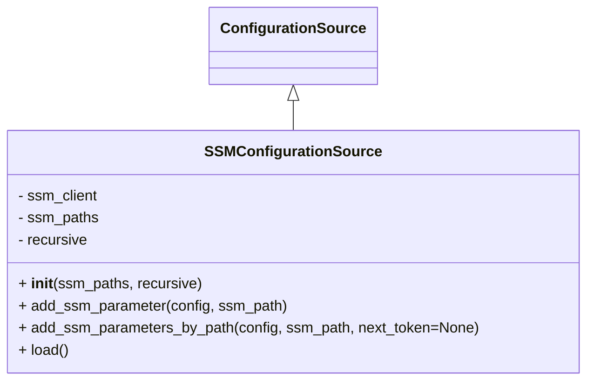

# Diagram: shipment_core/chromium_export/fv/python/fv/config/ssm.py


> Auto-generated by Obscura crawlers

## Diagram 1



### SVG

<svg id="container" width="630.4609375" xmlns="http://www.w3.org/2000/svg" class="classDiagram" height="414" viewBox="0 0 630.4609375 414" role="graphics-document document" aria-roledescription="class"><style>#container{font-family:"trebuchet ms",verdana,arial,sans-serif;font-size:16px;fill:#333;}@keyframes edge-animation-frame{from{stroke-dashoffset:0;}}@keyframes dash{to{stroke-dashoffset:0;}}#container .edge-animation-slow{stroke-dasharray:9,5!important;stroke-dashoffset:900;animation:dash 50s linear infinite;stroke-linecap:round;}#container .edge-animation-fast{stroke-dasharray:9,5!important;stroke-dashoffset:900;animation:dash 20s linear infinite;stroke-linecap:round;}#container .error-icon{fill:#552222;}#container .error-text{fill:#552222;stroke:#552222;}#container .edge-thickness-normal{stroke-width:1px;}#container .edge-thickness-thick{stroke-width:3.5px;}#container .edge-pattern-solid{stroke-dasharray:0;}#container .edge-thickness-invisible{stroke-width:0;fill:none;}#container .edge-pattern-dashed{stroke-dasharray:3;}#container .edge-pattern-dotted{stroke-dasharray:2;}#container .marker{fill:#333333;stroke:#333333;}#container .marker.cross{stroke:#333333;}#container svg{font-family:"trebuchet ms",verdana,arial,sans-serif;font-size:16px;}#container p{margin:0;}#container g.classGroup text{fill:#9370DB;stroke:none;font-family:"trebuchet ms",verdana,arial,sans-serif;font-size:10px;}#container g.classGroup text .title{font-weight:bolder;}#container .nodeLabel,#container .edgeLabel{color:#131300;}#container .edgeLabel .label rect{fill:#ECECFF;}#container .label text{fill:#131300;}#container .labelBkg{background:#ECECFF;}#container .edgeLabel .label span{background:#ECECFF;}#container .classTitle{font-weight:bolder;}#container .node rect,#container .node circle,#container .node ellipse,#container .node polygon,#container .node path{fill:#ECECFF;stroke:#9370DB;stroke-width:1px;}#container .divider{stroke:#9370DB;stroke-width:1;}#container g.clickable{cursor:pointer;}#container g.classGroup rect{fill:#ECECFF;stroke:#9370DB;}#container g.classGroup line{stroke:#9370DB;stroke-width:1;}#container .classLabel .box{stroke:none;stroke-width:0;fill:#ECECFF;opacity:0.5;}#container .classLabel .label{fill:#9370DB;font-size:10px;}#container .relation{stroke:#333333;stroke-width:1;fill:none;}#container .dashed-line{stroke-dasharray:3;}#container .dotted-line{stroke-dasharray:1 2;}#container #compositionStart,#container .composition{fill:#333333!important;stroke:#333333!important;stroke-width:1;}#container #compositionEnd,#container .composition{fill:#333333!important;stroke:#333333!important;stroke-width:1;}#container #dependencyStart,#container .dependency{fill:#333333!important;stroke:#333333!important;stroke-width:1;}#container #dependencyStart,#container .dependency{fill:#333333!important;stroke:#333333!important;stroke-width:1;}#container #extensionStart,#container .extension{fill:transparent!important;stroke:#333333!important;stroke-width:1;}#container #extensionEnd,#container .extension{fill:transparent!important;stroke:#333333!important;stroke-width:1;}#container #aggregationStart,#container .aggregation{fill:transparent!important;stroke:#333333!important;stroke-width:1;}#container #aggregationEnd,#container .aggregation{fill:transparent!important;stroke:#333333!important;stroke-width:1;}#container #lollipopStart,#container .lollipop{fill:#ECECFF!important;stroke:#333333!important;stroke-width:1;}#container #lollipopEnd,#container .lollipop{fill:#ECECFF!important;stroke:#333333!important;stroke-width:1;}#container .edgeTerminals{font-size:11px;line-height:initial;}#container .classTitleText{text-anchor:middle;font-size:18px;fill:#333;}#container .label-icon{display:inline-block;height:1em;overflow:visible;vertical-align:-0.125em;}#container .node .label-icon path{fill:currentColor;stroke:revert;stroke-width:revert;}#container :root{--mermaid-font-family:"trebuchet ms",verdana,arial,sans-serif;}</style><g><defs><marker id="container_class-aggregationStart" class="marker aggregation class" refX="18" refY="7" markerWidth="190" markerHeight="240" orient="auto"><path d="M 18,7 L9,13 L1,7 L9,1 Z"></path></marker></defs><defs><marker id="container_class-aggregationEnd" class="marker aggregation class" refX="1" refY="7" markerWidth="20" markerHeight="28" orient="auto"><path d="M 18,7 L9,13 L1,7 L9,1 Z"></path></marker></defs><defs><marker id="container_class-extensionStart" class="marker extension class" refX="18" refY="7" markerWidth="190" markerHeight="240" orient="auto"><path d="M 1,7 L18,13 V 1 Z"></path></marker></defs><defs><marker id="container_class-extensionEnd" class="marker extension class" refX="1" refY="7" markerWidth="20" markerHeight="28" orient="auto"><path d="M 1,1 V 13 L18,7 Z"></path></marker></defs><defs><marker id="container_class-compositionStart" class="marker composition class" refX="18" refY="7" markerWidth="190" markerHeight="240" orient="auto"><path d="M 18,7 L9,13 L1,7 L9,1 Z"></path></marker></defs><defs><marker id="container_class-compositionEnd" class="marker composition class" refX="1" refY="7" markerWidth="20" markerHeight="28" orient="auto"><path d="M 18,7 L9,13 L1,7 L9,1 Z"></path></marker></defs><defs><marker id="container_class-dependencyStart" class="marker dependency class" refX="6" refY="7" markerWidth="190" markerHeight="240" orient="auto"><path d="M 5,7 L9,13 L1,7 L9,1 Z"></path></marker></defs><defs><marker id="container_class-dependencyEnd" class="marker dependency class" refX="13" refY="7" markerWidth="20" markerHeight="28" orient="auto"><path d="M 18,7 L9,13 L14,7 L9,1 Z"></path></marker></defs><defs><marker id="container_class-lollipopStart" class="marker lollipop class" refX="13" refY="7" markerWidth="190" markerHeight="240" orient="auto"><circle stroke="black" fill="transparent" cx="7" cy="7" r="6"></circle></marker></defs><defs><marker id="container_class-lollipopEnd" class="marker lollipop class" refX="1" refY="7" markerWidth="190" markerHeight="240" orient="auto"><circle stroke="black" fill="transparent" cx="7" cy="7" r="6"></circle></marker></defs><g class="root"><g class="clusters"></g><g class="edgePaths"><path d="M315.23,109.25L315.23,110.542C315.23,111.833,315.23,114.417,315.23,119.875C315.23,125.333,315.23,133.667,315.23,137.833L315.23,142" id="id_ConfigurationSource_SSMConfigurationSource_1" class="edge-thickness-normal edge-pattern-solid relation" style=";;;" data-edge="true" data-et="edge" data-id="id_ConfigurationSource_SSMConfigurationSource_1" data-points="W3sieCI6MzE1LjIzMDQ2ODc1LCJ5Ijo5Mn0seyJ4IjozMTUuMjMwNDY4NzUsInkiOjExN30seyJ4IjozMTUuMjMwNDY4NzUsInkiOjE0Mn1d" marker-start="url(#container_class-extensionStart)"></path></g><g class="edgeLabels"><g class="edgeLabel"><g class="label" data-id="id_ConfigurationSource_SSMConfigurationSource_1" transform="translate(0, 0)"><foreignObject width="0" height="0"><div xmlns="http://www.w3.org/1999/xhtml" class="labelBkg" style="display: table-cell; white-space: nowrap; line-height: 1.5; max-width: 200px; text-align: center;"><span class="edgeLabel"></span></div></foreignObject></g></g></g><g class="nodes"><g class="node default" id="classId-ConfigurationSource-0" transform="translate(315.23046875, 50)"><g class="basic label-container"><path d="M-86.25 -42 L86.25 -42 L86.25 42 L-86.25 42" stroke="none" stroke-width="0" fill="#ECECFF" style=""></path><path d="M-86.25 -42 C-30.876429577977596 -42, 24.497140844044807 -42, 86.25 -42 M-86.25 -42 C-33.12624370067775 -42, 19.997512598644505 -42, 86.25 -42 M86.25 -42 C86.25 -8.718995238155273, 86.25 24.562009523689454, 86.25 42 M86.25 -42 C86.25 -16.143268387808938, 86.25 9.713463224382124, 86.25 42 M86.25 42 C22.46384448211944 42, -41.32231103576112 42, -86.25 42 M86.25 42 C22.462833931165164 42, -41.32433213766967 42, -86.25 42 M-86.25 42 C-86.25 11.894587668105984, -86.25 -18.21082466378803, -86.25 -42 M-86.25 42 C-86.25 24.43703240996427, -86.25 6.874064819928542, -86.25 -42" stroke="#9370DB" stroke-width="1.3" fill="none" stroke-dasharray="0 0" style=""></path></g><g class="annotation-group text" transform="translate(0, -18)"></g><g class="label-group text" transform="translate(-74.25, -18)"><g class="label" style="font-weight: bolder" transform="translate(0,-12)"><foreignObject width="148.5" height="24"><div xmlns="http://www.w3.org/1999/xhtml" style="display: table-cell; white-space: nowrap; line-height: 1.5; max-width: 196px; text-align: center;"><span class="nodeLabel markdown-node-label" style=""><p>ConfigurationSource</p></span></div></foreignObject></g></g><g class="members-group text" transform="translate(-74.25, 30)"></g><g class="methods-group text" transform="translate(-74.25, 60)"></g><g class="divider" style=""><path d="M-86.25 6 C-26.04221276743985 6, 34.1655744651203 6, 86.25 6 M-86.25 6 C-20.119492766493977 6, 46.011014467012046 6, 86.25 6" stroke="#9370DB" stroke-width="1.3" fill="none" stroke-dasharray="0 0" style=""></path></g><g class="divider" style=""><path d="M-86.25 24 C-28.019979157610656 24, 30.210041684778687 24, 86.25 24 M-86.25 24 C-43.88419932179592 24, -1.518398643591837 24, 86.25 24" stroke="#9370DB" stroke-width="1.3" fill="none" stroke-dasharray="0 0" style=""></path></g></g><g class="node default" id="classId-SSMConfigurationSource-1" transform="translate(315.23046875, 274)"><g class="basic label-container"><path d="M-307.23046875 -132 L307.23046875 -132 L307.23046875 132 L-307.23046875 132" stroke="none" stroke-width="0" fill="#ECECFF" style=""></path><path d="M-307.23046875 -132 C-170.96555888051327 -132, -34.70064901102654 -132, 307.23046875 -132 M-307.23046875 -132 C-108.77119395161836 -132, 89.68808084676328 -132, 307.23046875 -132 M307.23046875 -132 C307.23046875 -33.41318254013912, 307.23046875 65.17363491972176, 307.23046875 132 M307.23046875 -132 C307.23046875 -75.82237829318369, 307.23046875 -19.64475658636738, 307.23046875 132 M307.23046875 132 C81.24007204924641 132, -144.75032465150719 132, -307.23046875 132 M307.23046875 132 C100.06193294772672 132, -107.10660285454657 132, -307.23046875 132 M-307.23046875 132 C-307.23046875 58.305856039304174, -307.23046875 -15.388287921391651, -307.23046875 -132 M-307.23046875 132 C-307.23046875 38.80617631493041, -307.23046875 -54.38764737013918, -307.23046875 -132" stroke="#9370DB" stroke-width="1.3" fill="none" stroke-dasharray="0 0" style=""></path></g><g class="annotation-group text" transform="translate(0, -108)"></g><g class="label-group text" transform="translate(-89.4453125, -108)"><g class="label" style="font-weight: bolder" transform="translate(0,-12)"><foreignObject width="178.890625" height="24"><div xmlns="http://www.w3.org/1999/xhtml" style="display: table-cell; white-space: nowrap; line-height: 1.5; max-width: 226px; text-align: center;"><span class="nodeLabel markdown-node-label" style=""><p>SSMConfigurationSource</p></span></div></foreignObject></g></g><g class="members-group text" transform="translate(-295.23046875, -60)"><g class="label" style="" transform="translate(0,-12)"><foreignObject width="87.90625" height="24"><div xmlns="http://www.w3.org/1999/xhtml" style="display: table-cell; white-space: nowrap; line-height: 1.5; max-width: 145px; text-align: center;"><span class="nodeLabel markdown-node-label" style=""><p>- ssm_client</p></span></div></foreignObject></g><g class="label" style="" transform="translate(0,12)"><foreignObject width="88.1875" height="24"><div xmlns="http://www.w3.org/1999/xhtml" style="display: table-cell; white-space: nowrap; line-height: 1.5; max-width: 146px; text-align: center;"><span class="nodeLabel markdown-node-label" style=""><p>- ssm_paths</p></span></div></foreignObject></g><g class="label" style="" transform="translate(0,36)"><foreignObject width="76.359375" height="24"><div xmlns="http://www.w3.org/1999/xhtml" style="display: table-cell; white-space: nowrap; line-height: 1.5; max-width: 134px; text-align: center;"><span class="nodeLabel markdown-node-label" style=""><p>- recursive</p></span></div></foreignObject></g></g><g class="methods-group text" transform="translate(-295.23046875, 36)"><g class="label" style="" transform="translate(0,-12)"><foreignObject width="198.28125" height="24"><div xmlns="http://www.w3.org/1999/xhtml" style="display: table-cell; white-space: nowrap; line-height: 1.5; max-width: 288px; text-align: center;"><span class="nodeLabel markdown-node-label" style=""><p>+ <strong>init</strong>(ssm_paths, recursive)</p></span></div></foreignObject></g><g class="label" style="" transform="translate(0,12)"><foreignObject width="292.46875" height="24"><div xmlns="http://www.w3.org/1999/xhtml" style="display: table-cell; white-space: nowrap; line-height: 1.5; max-width: 350px; text-align: center;"><span class="nodeLabel markdown-node-label" style=""><p>+ add_ssm_parameter(config, ssm_path)</p></span></div></foreignObject></g><g class="label" style="" transform="translate(0,36)"><foreignObject width="501.015625" height="24"><div xmlns="http://www.w3.org/1999/xhtml" style="display: table-cell; white-space: nowrap; line-height: 1.5; max-width: 558px; text-align: center;"><span class="nodeLabel markdown-node-label" style=""><p>+ add_ssm_parameters_by_path(config, ssm_path, next_token=None)</p></span></div></foreignObject></g><g class="label" style="" transform="translate(0,60)"><foreignObject width="54.65625" height="24"><div xmlns="http://www.w3.org/1999/xhtml" style="display: table-cell; white-space: nowrap; line-height: 1.5; max-width: 112px; text-align: center;"><span class="nodeLabel markdown-node-label" style=""><p>+ load()</p></span></div></foreignObject></g></g><g class="divider" style=""><path d="M-307.23046875 -84 C-97.13295715633726 -84, 112.96455443732549 -84, 307.23046875 -84 M-307.23046875 -84 C-148.30693413016095 -84, 10.616600489678092 -84, 307.23046875 -84" stroke="#9370DB" stroke-width="1.3" fill="none" stroke-dasharray="0 0" style=""></path></g><g class="divider" style=""><path d="M-307.23046875 12 C-178.0187335994481 12, -48.806998448896195 12, 307.23046875 12 M-307.23046875 12 C-71.19648498287609 12, 164.83749878424783 12, 307.23046875 12" stroke="#9370DB" stroke-width="1.3" fill="none" stroke-dasharray="0 0" style=""></path></g></g></g></g></g></svg>

## Diagram 2

```mermaid
flowchart TD
    Load[load()] --> InitConfig[config = {}]
    InitConfig --> ForEachPath{for each ssm_path in ssm_paths}
    ForEachPath --> TryBlock[try]
    TryBlock --> CheckRecursive{self.recursive?}
    CheckRecursive -->|True| CallByPath[call add_ssm_parameters_by_path(config, ssm_path)]
    CallByPath --> NextTokenCheck{next_token returned?}
    NextTokenCheck -->|Yes| LoopNext[call add_ssm_parameters_by_path(config, ssm_path, next_token) loop]
    NextTokenCheck -->|No| Continue[continue to next ssm_path]
    CheckRecursive -->|False| CallSingle[call add_ssm_parameter(config, ssm_path)]
    CallSingle --> Continue
    TryBlock -->|raises ClientError or KeyError| WarnLog[logging.warning(...)]
    TryBlock -->|raises JSONDecodeError| ErrorLog[logging.error(...)]
    WarnLog --> Continue
    ErrorLog --> Continue

    subgraph add_ssm_parameters_by_path_flow
        StartGet[get_parameters_by_path(Path=ssm_path, Recursive=True, WithDecryption=True)]
        StartGet --> Response[response.Parameters]
        Response --> ForEachParam[for parameter in Parameters]
        ForEachParam --> IsRoot{name == ssm_path?}
        IsRoot -->|Yes| UpdateRoot[config.update(value)]
        IsRoot -->|No| BuildTree[compute root, split into tree nodes]
        BuildTree --> Traverse[for node in tree: last_node.setdefault(node, {}); last_node = last_node[node]]
        Traverse --> UpdateLeaf[last_node.update(value)]
        ForEachParam --> EndReturn[return response.get("NextToken")]
    end
    CallByPath --> add_ssm_parameters_by_path_flow
    LoopNext --> add_ssm_parameters_by_path_flow
```

> SVG rendering failed for this diagram.
