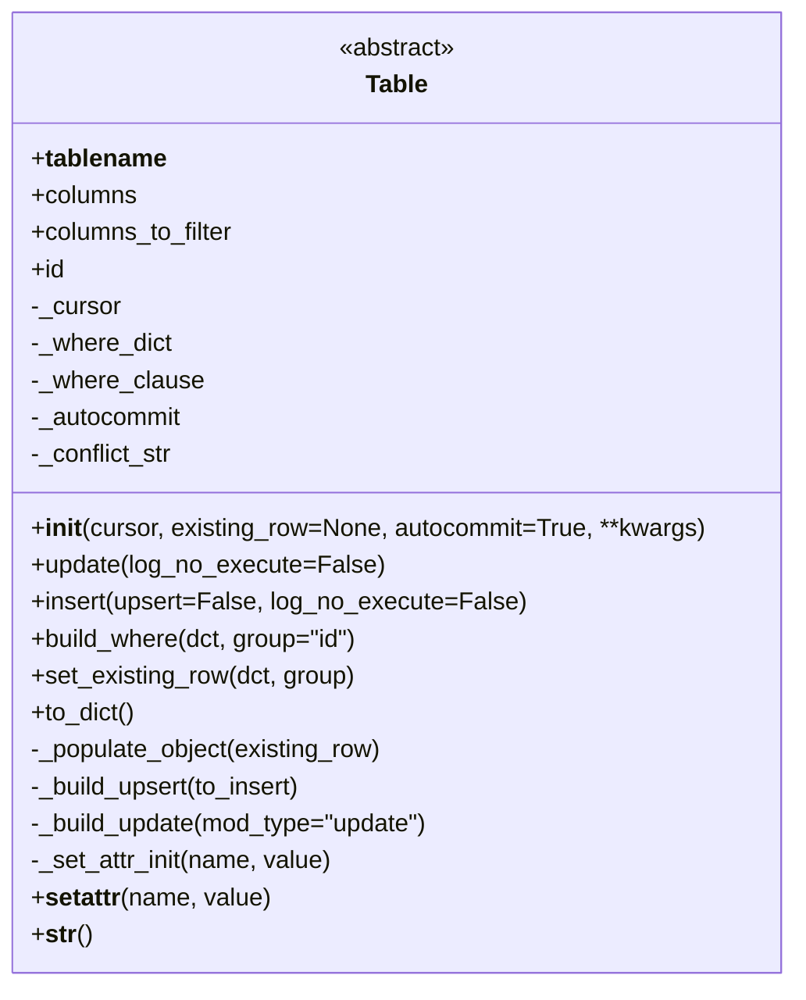
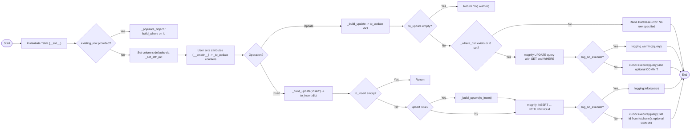

# Diagram: shipment_core/chromium_export/fv/python/fv/db/Table.py

> Auto-generated by Obscura crawlers

## Diagram 1

### SVG

<svg id="container" width="518.53125" xmlns="http://www.w3.org/2000/svg" class="classDiagram" height="640" viewBox="0 0 518.53125 640" role="graphics-document document" aria-roledescription="class"><g><defs><marker id="container_class-aggregationStart" class="marker aggregation class" refX="18" refY="7" markerWidth="190" markerHeight="240" orient="auto"><path d="M 18,7 L9,13 L1,7 L9,1 Z"></path></marker></defs><defs><marker id="container_class-aggregationEnd" class="marker aggregation class" refX="1" refY="7" markerWidth="20" markerHeight="28" orient="auto"><path d="M 18,7 L9,13 L1,7 L9,1 Z"></path></marker></defs><defs><marker id="container_class-extensionStart" class="marker extension class" refX="18" refY="7" markerWidth="190" markerHeight="240" orient="auto"><path d="M 1,7 L18,13 V 1 Z"></path></marker></defs><defs><marker id="container_class-extensionEnd" class="marker extension class" refX="1" refY="7" markerWidth="20" markerHeight="28" orient="auto"><path d="M 1,1 V 13 L18,7 Z"></path></marker></defs><defs><marker id="container_class-compositionStart" class="marker composition class" refX="18" refY="7" markerWidth="190" markerHeight="240" orient="auto"><path d="M 18,7 L9,13 L1,7 L9,1 Z"></path></marker></defs><defs><marker id="container_class-compositionEnd" class="marker composition class" refX="1" refY="7" markerWidth="20" markerHeight="28" orient="auto"><path d="M 18,7 L9,13 L1,7 L9,1 Z"></path></marker></defs><defs><marker id="container_class-dependencyStart" class="marker dependency class" refX="6" refY="7" markerWidth="190" markerHeight="240" orient="auto"><path d="M 5,7 L9,13 L1,7 L9,1 Z"></path></marker></defs><defs><marker id="container_class-dependencyEnd" class="marker dependency class" refX="13" refY="7" markerWidth="20" markerHeight="28" orient="auto"><path d="M 18,7 L9,13 L14,7 L9,1 Z"></path></marker></defs><defs><marker id="container_class-lollipopStart" class="marker lollipop class" refX="13" refY="7" markerWidth="190" markerHeight="240" orient="auto"><circle stroke="black" fill="transparent" cx="7" cy="7" r="6"></circle></marker></defs><defs><marker id="container_class-lollipopEnd" class="marker lollipop class" refX="1" refY="7" markerWidth="190" markerHeight="240" orient="auto"><circle stroke="black" fill="transparent" cx="7" cy="7" r="6"></circle></marker></defs><g class="root"><g class="clusters"></g><g class="edgePaths"></g><g class="edgeLabels"></g><g class="nodes"><g class="node default" id="classId-Table-0" transform="translate(259.265625, 320)"><g class="basic label-container"><path d="M-251.265625 -312 L251.265625 -312 L251.265625 312 L-251.265625 312" stroke="none" stroke-width="0" fill="#ECECFF" style=""></path><path d="M-251.265625 -312 C-89.8937689834689 -312, 71.4780870330622 -312, 251.265625 -312 M-251.265625 -312 C-63.87622046274626 -312, 123.51318407450748 -312, 251.265625 -312 M251.265625 -312 C251.265625 -183.88069965829104, 251.265625 -55.76139931658207, 251.265625 312 M251.265625 -312 C251.265625 -158.04778850077693, 251.265625 -4.095577001553863, 251.265625 312 M251.265625 312 C137.7724493802623 312, 24.279273760524575 312, -251.265625 312 M251.265625 312 C51.92613143243088 312, -147.41336213513824 312, -251.265625 312 M-251.265625 312 C-251.265625 102.44430635695286, -251.265625 -107.11138728609427, -251.265625 -312 M-251.265625 312 C-251.265625 183.78387959966778, -251.265625 55.56775919933557, -251.265625 -312" stroke="#9370DB" stroke-width="1.3" fill="none" stroke-dasharray="0 0" style=""></path></g><g class="annotation-group text" transform="translate(-38.609375, -288)"><g class="label" style="" transform="translate(0,-12)"><foreignObject width="77.21875" height="24">

«abstract»

</foreignObject></g></g><g class="label-group text" transform="translate(-19.8359375, -264)"><g class="label" style="font-weight: bolder" transform="translate(0,-12)"><foreignObject width="39.671875" height="24">

Table

</foreignObject></g></g><g class="members-group text" transform="translate(-239.265625, -216)"><g class="label" style="" transform="translate(0,-12)"><foreignObject width="86.15625" height="24">

+<strong>tablename</strong>

</foreignObject></g><g class="label" style="" transform="translate(0,12)"><foreignObject width="69.21875" height="24">

+columns

</foreignObject></g><g class="label" style="" transform="translate(0,36)"><foreignObject width="133.78125" height="24">

+columns_to_filter

</foreignObject></g><g class="label" style="" transform="translate(0,60)"><foreignObject width="22.078125" height="24">

+id

</foreignObject></g><g class="label" style="" transform="translate(0,84)"><foreignObject width="58.90625" height="24">

-_cursor

</foreignObject></g><g class="label" style="" transform="translate(0,108)"><foreignObject width="92.34375" height="24">

-_where_dict

</foreignObject></g><g class="label" style="" transform="translate(0,132)"><foreignObject width="111.296875" height="24">

-_where_clause

</foreignObject></g><g class="label" style="" transform="translate(0,156)"><foreignObject width="100.453125" height="24">

-_autocommit

</foreignObject></g><g class="label" style="" transform="translate(0,180)"><foreignObject width="94.375" height="24">

-_conflict_str

</foreignObject></g></g><g class="methods-group text" transform="translate(-239.265625, 24)"><g class="label" style="" transform="translate(0,-12)"><foreignObject width="439.921875" height="24">

+<strong>init</strong>(cursor, existing_row=None, autocommit=True, **kwargs)

</foreignObject></g><g class="label" style="" transform="translate(0,12)"><foreignObject width="227.046875" height="24">

+update(log_no_execute=False)

</foreignObject></g><g class="label" style="" transform="translate(0,36)"><foreignObject width="316.9375" height="24">

+insert(upsert=False, log_no_execute=False)

</foreignObject></g><g class="label" style="" transform="translate(0,60)"><foreignObject width="216.015625" height="24">

+build_where(dct, group="id")

</foreignObject></g><g class="label" style="" transform="translate(0,84)"><foreignObject width="212.84375" height="24">

+set_existing_row(dct, group)

</foreignObject></g><g class="label" style="" transform="translate(0,108)"><foreignObject width="68.34375" height="24">

+to_dict()

</foreignObject></g><g class="label" style="" transform="translate(0,132)"><foreignObject width="233.453125" height="24">

-_populate_object(existing_row)

</foreignObject></g><g class="label" style="" transform="translate(0,156)"><foreignObject width="181.234375" height="24">

-_build_upsert(to_insert)

</foreignObject></g><g class="label" style="" transform="translate(0,180)"><foreignObject width="265.078125" height="24">

-_build_update(mod_type="update")

</foreignObject></g><g class="label" style="" transform="translate(0,204)"><foreignObject width="198.796875" height="24">

-_set_attr_init(name, value)

</foreignObject></g><g class="label" style="" transform="translate(0,228)"><foreignObject width="155.765625" height="24">

+<strong>setattr</strong>(name, value)

</foreignObject></g><g class="label" style="" transform="translate(0,252)"><foreignObject width="38.6875" height="24">

+<strong>str</strong>()

</foreignObject></g></g><g class="divider" style=""><path d="M-251.265625 -240 C-90.54457192821135 -240, 70.17648114357729 -240, 251.265625 -240 M-251.265625 -240 C-78.0021115015895 -240, 95.26140199682101 -240, 251.265625 -240" stroke="#9370DB" stroke-width="1.3" fill="none" stroke-dasharray="0 0" style=""></path></g><g class="divider" style=""><path d="M-251.265625 0 C-50.649698365332824 0, 149.96622826933435 0, 251.265625 0 M-251.265625 0 C-52.42610059816184 0, 146.41342380367632 0, 251.265625 0" stroke="#9370DB" stroke-width="1.3" fill="none" stroke-dasharray="0 0" style=""></path></g></g></g></g></g></svg>

## Diagram 2

### SVG

<svg id="container" width="3732.8349609375" xmlns="http://www.w3.org/2000/svg" class="flowchart" height="710.0390625" viewBox="0.0000019073486328125 0 3732.8349609375 710.0390625" role="graphics-document document" aria-roledescription="flowchart-v2"><g><marker id="container_flowchart-v2-pointEnd" class="marker flowchart-v2" viewBox="0 0 10 10" refX="5" refY="5" markerUnits="userSpaceOnUse" markerWidth="8" markerHeight="8" orient="auto"><path d="M 0 0 L 10 5 L 0 10 z" class="arrowMarkerPath" style="stroke-width: 1; stroke-dasharray: 1, 0;"></path></marker><marker id="container_flowchart-v2-pointStart" class="marker flowchart-v2" viewBox="0 0 10 10" refX="4.5" refY="5" markerUnits="userSpaceOnUse" markerWidth="8" markerHeight="8" orient="auto"><path d="M 0 5 L 10 10 L 10 0 z" class="arrowMarkerPath" style="stroke-width: 1; stroke-dasharray: 1, 0;"></path></marker><marker id="container_flowchart-v2-circleEnd" class="marker flowchart-v2" viewBox="0 0 10 10" refX="11" refY="5" markerUnits="userSpaceOnUse" markerWidth="11" markerHeight="11" orient="auto"><circle cx="5" cy="5" r="5" class="arrowMarkerPath" style="stroke-width: 1; stroke-dasharray: 1, 0;"></circle></marker><marker id="container_flowchart-v2-circleStart" class="marker flowchart-v2" viewBox="0 0 10 10" refX="-1" refY="5" markerUnits="userSpaceOnUse" markerWidth="11" markerHeight="11" orient="auto"><circle cx="5" cy="5" r="5" class="arrowMarkerPath" style="stroke-width: 1; stroke-dasharray: 1, 0;"></circle></marker><marker id="container_flowchart-v2-crossEnd" class="marker cross flowchart-v2" viewBox="0 0 11 11" refX="12" refY="5.2" markerUnits="userSpaceOnUse" markerWidth="11" markerHeight="11" orient="auto"><path d="M 1,1 l 9,9 M 10,1 l -9,9" class="arrowMarkerPath" style="stroke-width: 2; stroke-dasharray: 1, 0;"></path></marker><marker id="container_flowchart-v2-crossStart" class="marker cross flowchart-v2" viewBox="0 0 11 11" refX="-1" refY="5.2" markerUnits="userSpaceOnUse" markerWidth="11" markerHeight="11" orient="auto"><path d="M 1,1 l 9,9 M 10,1 l -9,9" class="arrowMarkerPath" style="stroke-width: 2; stroke-dasharray: 1, 0;"></path></marker><g class="root"><g class="clusters"></g><g class="edgePaths"><path d="M68.277,238.605L72.36,238.522C76.444,238.439,84.61,238.272,92.194,238.189C99.777,238.105,106.777,238.105,110.277,238.105L113.777,238.105" id="L_Start_Init_0" class="edge-thickness-normal edge-pattern-solid edge-thickness-normal edge-pattern-solid flowchart-link" style=";" data-edge="true" data-et="edge" data-id="L_Start_Init_0" data-points="W3sieCI6NjguMjc2ODM3NDMxODI3MjksInkiOjIzOC42MDU0Njg3NTAwMDAwM30seyJ4Ijo5Mi43NzY4MzYzOTUyNjM2NywieSI6MjM4LjEwNTQ2ODc1fSx7IngiOjExNy43NzY4MzYzOTUyNjM2NywieSI6MjM4LjEwNTQ2ODc1fV0=" marker-end="url(#container_flowchart-v2-pointEnd)"></path><path d="M338.636,238.105L342.803,238.105C346.97,238.105,355.303,238.105,362.97,238.105C370.636,238.105,377.636,238.105,381.136,238.105L384.636,238.105" id="L_Init_CheckExisting_0" class="edge-thickness-normal edge-pattern-solid edge-thickness-normal edge-pattern-solid flowchart-link" style=";" data-edge="true" data-et="edge" data-id="L_Init_CheckExisting_0" data-points="W3sieCI6MzM4LjYzNjIxMTM5NTI2MzcsInkiOjIzOC4xMDU0Njg3NX0seyJ4IjozNjMuNjM2MjExMzk1MjYzNywieSI6MjM4LjEwNTQ2ODc1fSx7IngiOjM4OC42MzYyMTEzOTUyNjM2LCJ5IjoyMzguMTA1NDY4NzV9XQ==" marker-end="url(#container_flowchart-v2-pointEnd)"></path><path d="M576.682,204.636L588.432,199.547C600.183,194.459,623.683,184.282,640.938,179.194C658.194,174.105,669.204,174.105,674.709,174.105L680.214,174.105" id="L_CheckExisting_Populate_0" class="edge-thickness-normal edge-pattern-solid edge-thickness-normal edge-pattern-solid flowchart-link" style=";" data-edge="true" data-et="edge" data-id="L_CheckExisting_Populate_0" data-points="W3sieCI6NTc2LjY4MjIxMzc2MDcxNDMsInkiOjIwNC42MzU4NDYxMTU0NTA2fSx7IngiOjY0Ny4xODMwODYzOTUyNjM3LCJ5IjoxNzQuMTA1NDY4NzV9LHsieCI6Njg0LjIxNDMzNjM5NTI2MzcsInkiOjE3NC4xMDU0Njg3NX1d" marker-end="url(#container_flowchart-v2-pointEnd)"></path><path d="M576.682,271.575L588.432,276.663C600.183,281.752,623.683,291.929,640.938,297.017C658.194,302.105,669.204,302.105,674.709,302.105L680.214,302.105" id="L_CheckExisting_Continue_0" class="edge-thickness-normal edge-pattern-solid edge-thickness-normal edge-pattern-solid flowchart-link" style=";" data-edge="true" data-et="edge" data-id="L_CheckExisting_Continue_0" data-points="W3sieCI6NTc2LjY4MjIxMzc2MDcxNDMsInkiOjI3MS41NzUwOTEzODQ1NDk0fSx7IngiOjY0Ny4xODMwODYzOTUyNjM3LCJ5IjozMDIuMTA1NDY4NzV9LHsieCI6Njg0LjIxNDMzNjM5NTI2MzcsInkiOjMwMi4xMDU0Njg3NX1d" marker-end="url(#container_flowchart-v2-pointEnd)"></path><path d="M944.214,302.105L948.381,302.105C952.548,302.105,960.881,302.105,968.548,302.105C976.214,302.105,983.214,302.105,986.714,302.105L990.214,302.105" id="L_Continue_Modify_0" class="edge-thickness-normal edge-pattern-solid edge-thickness-normal edge-pattern-solid flowchart-link" style=";" data-edge="true" data-et="edge" data-id="L_Continue_Modify_0" data-points="W3sieCI6OTQ0LjIxNDMzNjM5NTI2MzcsInkiOjMwMi4xMDU0Njg3NX0seyJ4Ijo5NjkuMjE0MzM2Mzk1MjYzNywieSI6MzAyLjEwNTQ2ODc1fSx7IngiOjk5NC4yMTQzMzYzOTUyNjM3LCJ5IjozMDIuMTA1NDY4NzV9XQ==" marker-end="url(#container_flowchart-v2-pointEnd)"></path><path d="M1254.214,302.105L1258.381,302.105C1262.548,302.105,1270.881,302.105,1278.548,302.105C1286.214,302.105,1293.214,302.105,1296.714,302.105L1300.214,302.105" id="L_Modify_ActionChoice_0" class="edge-thickness-normal edge-pattern-solid edge-thickness-normal edge-pattern-solid flowchart-link" style=";" data-edge="true" data-et="edge" data-id="L_Modify_ActionChoice_0" data-points="W3sieCI6MTI1NC4yMTQzMzYzOTUyNjM3LCJ5IjozMDIuMTA1NDY4NzV9LHsieCI6MTI3OS4yMTQzMzYzOTUyNjM3LCJ5IjozMDIuMTA1NDY4NzV9LHsieCI6MTMwNC4yMTQzMzYzOTUyNjM3LCJ5IjozMDIuMTA1NDY4NzV9XQ==" marker-end="url(#container_flowchart-v2-pointEnd)"></path><path d="M1398.666,263.057L1412.862,243.048C1427.057,223.038,1455.448,183.019,1498.998,163.01C1542.548,143,1601.256,143,1656.444,143C1711.631,143,1763.298,143,1792.631,143C1821.964,143,1828.964,143,1832.464,143L1835.964,143" id="L_ActionChoice_BuildUpdate_0" class="edge-thickness-normal edge-pattern-solid edge-thickness-normal edge-pattern-solid flowchart-link" style=";" data-edge="true" data-et="edge" data-id="L_ActionChoice_BuildUpdate_0" data-points="W3sieCI6MTM5OC42NjYzNDg1NDU3MjI1LCJ5IjoyNjMuMDU3NDgwOTAwNDU4ODd9LHsieCI6MTQ4My44MzkzMzYzOTUyNjM3LCJ5IjoxNDN9LHsieCI6MTY1OS45NjQzMzYzOTUyNjM3LCJ5IjoxNDN9LHsieCI6MTgxNC45NjQzMzYzOTUyNjM3LCJ5IjoxNDN9LHsieCI6MTgzOS45NjQzMzYzOTUyNjM3LCJ5IjoxNDN9XQ==" marker-end="url(#container_flowchart-v2-pointEnd)"></path><path d="M2099.964,143L2106.136,143C2112.308,143,2124.652,143,2136.329,143C2148.006,143,2159.016,143,2164.522,143L2170.027,143" id="L_BuildUpdate_NoUpdate_0" class="edge-thickness-normal edge-pattern-solid edge-thickness-normal edge-pattern-solid flowchart-link" style=";" data-edge="true" data-et="edge" data-id="L_BuildUpdate_NoUpdate_0" data-points="W3sieCI6MjA5OS45NjQzMzYzOTUyNjM3LCJ5IjoxNDN9LHsieCI6MjEzNi45OTU1ODYzOTUyNjM3LCJ5IjoxNDN9LHsieCI6MjE3NC4wMjY4MzYzOTUyNjM3LCJ5IjoxNDN9XQ==" marker-end="url(#container_flowchart-v2-pointEnd)"></path><path d="M2316.552,101.01L2329.722,90.008C2342.893,79.006,2369.233,57.003,2393.587,46.002C2417.941,35,2440.308,35,2451.492,35L2462.675,35" id="L_NoUpdate_EndUpdate_0" class="edge-thickness-normal edge-pattern-solid edge-thickness-normal edge-pattern-solid flowchart-link" style=";" data-edge="true" data-et="edge" data-id="L_NoUpdate_EndUpdate_0" data-points="W3sieCI6MjMxNi41NTIxNDEwNDQ5NTI0LCJ5IjoxMDEuMDA5Njc5NjQ5Njg4ODZ9LHsieCI6MjM5NS41NzM3MTEzOTUyNjM3LCJ5IjozNX0seyJ4IjoyNDY2LjY3NTI3Mzg5NTI2MzcsInkiOjM1fV0=" marker-end="url(#container_flowchart-v2-pointEnd)"></path><path d="M2316.552,184.99L2329.722,195.992C2342.893,206.994,2369.233,228.997,2387.909,239.998C2406.584,251,2417.595,251,2423.1,251L2428.605,251" id="L_NoUpdate_ValidateWhere_0" class="edge-thickness-normal edge-pattern-solid edge-thickness-normal edge-pattern-solid flowchart-link" style=";" data-edge="true" data-et="edge" data-id="L_NoUpdate_ValidateWhere_0" data-points="W3sieCI6MjMxNi41NTIxNDEwNDQ5NTI0LCJ5IjoxODQuOTkwMzIwMzUwMzExMTJ9LHsieCI6MjM5NS41NzM3MTEzOTUyNjM3LCJ5IjoyNTF9LHsieCI6MjQzMi42MDQ5NjEzOTUyNjM3LCJ5IjoyNTF9XQ==" marker-end="url(#container_flowchart-v2-pointEnd)"></path><path d="M2655.392,195.787L2670.766,185.656C2686.14,175.524,2716.888,155.262,2760.101,145.131C2803.313,135,2858.99,135,2914.352,135C2969.714,135,3024.761,135,3072.619,135C3120.477,135,3161.147,135,3202.131,135C3243.115,135,3284.415,135,3310.57,135C3336.725,135,3347.735,135,3353.24,135L3358.746,135" id="L_ValidateWhere_Error_0" class="edge-thickness-normal edge-pattern-solid edge-thickness-normal edge-pattern-solid flowchart-link" style=";" data-edge="true" data-et="edge" data-id="L_ValidateWhere_Error_0" data-points="W3sieCI6MjY1NS4zOTE2OTIyNjczODgsInkiOjE5NS43ODY3MzA4NzIxMjQxNH0seyJ4IjoyNzQ3LjYzNjIxMTM5NTI2MzcsInkiOjEzNX0seyJ4IjoyOTE0LjY2NzQ2MTM5NTI2MzcsInkiOjEzNX0seyJ4IjozMDc5LjgwODA4NjM5NTI2MzcsInkiOjEzNX0seyJ4IjozMjAxLjgxNTg5ODg5NTI2MzcsInkiOjEzNX0seyJ4IjozMzI1LjcxNDMzNjM5NTI2MzcsInkiOjEzNX0seyJ4IjozMzYyLjc0NTU4NjM5NTI2MzcsInkiOjEzNX1d" marker-end="url(#container_flowchart-v2-pointEnd)"></path><path d="M2674.862,286.743L2686.991,290.941C2699.12,295.14,2723.378,303.537,2741.012,307.735C2758.647,311.934,2769.657,311.934,2775.162,311.934L2780.667,311.934" id="L_ValidateWhere_MogrifyUpdate_0" class="edge-thickness-normal edge-pattern-solid edge-thickness-normal edge-pattern-solid flowchart-link" style=";" data-edge="true" data-et="edge" data-id="L_ValidateWhere_MogrifyUpdate_0" data-points="W3sieCI6MjY3NC44NjIyMzUxODY1MzcsInkiOjI4Ni43NDI3MjYyMDg3MjY5fSx7IngiOjI3NDcuNjM2MjExMzk1MjYzNywieSI6MzExLjkzMzU5Mzc1fSx7IngiOjI3ODQuNjY3NDYxMzk1MjYzNywieSI6MzExLjkzMzU5Mzc1fV0=" marker-end="url(#container_flowchart-v2-pointEnd)"></path><path d="M3044.667,311.934L3050.524,311.934C3056.381,311.934,3068.095,311.934,3079.141,311.934C3090.188,311.934,3100.569,311.934,3105.759,311.934L3110.949,311.934" id="L_MogrifyUpdate_ExecuteUpdate_0" class="edge-thickness-normal edge-pattern-solid edge-thickness-normal edge-pattern-solid flowchart-link" style=";" data-edge="true" data-et="edge" data-id="L_MogrifyUpdate_ExecuteUpdate_0" data-points="W3sieCI6MzA0NC42Njc0NjEzOTUyNjM3LCJ5IjozMTEuOTMzNTkzNzV9LHsieCI6MzA3OS44MDgwODYzOTUyNjM3LCJ5IjozMTEuOTMzNTkzNzV9LHsieCI6MzExNC45NDg3MTEzOTUyNjM3LCJ5IjozMTEuOTMzNTkzNzV9XQ==" marker-end="url(#container_flowchart-v2-pointEnd)"></path><path d="M3260.985,284.235L3271.773,279.185C3282.561,274.135,3304.138,264.034,3323.257,258.984C3342.376,253.934,3359.037,253.934,3367.368,253.934L3375.699,253.934" id="L_ExecuteUpdate_LogQ1_0" class="edge-thickness-normal edge-pattern-solid edge-thickness-normal edge-pattern-solid flowchart-link" style=";" data-edge="true" data-et="edge" data-id="L_ExecuteUpdate_LogQ1_0" data-points="W3sieCI6MzI2MC45ODQ2Nzk4MzI1MzU3LCJ5IjoyODQuMjM1MTg3MTg3MjcxODN9LHsieCI6MzMyNS43MTQzMzYzOTUyNjM3LCJ5IjoyNTMuOTMzNTkzNzV9LHsieCI6MzM3OS42OTg3MTEzOTUyNjM3LCJ5IjoyNTMuOTMzNTkzNzV9XQ==" marker-end="url(#container_flowchart-v2-pointEnd)"></path><path d="M3260.985,339.632L3271.773,344.682C3282.561,349.733,3304.138,359.833,3320.431,364.883C3336.725,369.934,3347.735,369.934,3353.24,369.934L3358.746,369.934" id="L_ExecuteUpdate_ExecQ1_0" class="edge-thickness-normal edge-pattern-solid edge-thickness-normal edge-pattern-solid flowchart-link" style=";" data-edge="true" data-et="edge" data-id="L_ExecuteUpdate_ExecQ1_0" data-points="W3sieCI6MzI2MC45ODQ2Nzk4MzI1MzUsInkiOjMzOS42MzIwMDAzMTI3MjgxN30seyJ4IjozMzI1LjcxNDMzNjM5NTI2MzcsInkiOjM2OS45MzM1OTM3NX0seyJ4IjozMzYyLjc0NTU4NjM5NTI2MzcsInkiOjM2OS45MzM1OTM3NX1d" marker-end="url(#container_flowchart-v2-pointEnd)"></path><path d="M3622.746,369.934L3626.912,369.934C3631.079,369.934,3639.412,369.934,3648.475,373.803C3657.537,377.671,3667.328,385.409,3672.224,389.278L3677.12,393.147" id="L_ExecQ1_End_0" class="edge-thickness-normal edge-pattern-solid edge-thickness-normal edge-pattern-solid flowchart-link" style=";" data-edge="true" data-et="edge" data-id="L_ExecQ1_End_0" data-points="W3sieCI6MzYyMi43NDU1ODYzOTUyNjM3LCJ5IjozNjkuOTMzNTkzNzV9LHsieCI6MzY0Ny43NDU1ODYzOTUyNjM3LCJ5IjozNjkuOTMzNTkzNzV9LHsieCI6MzY4MC4yNTgxMTc5Mzg1MzM0LCJ5IjozOTUuNjI3MjgxMTgwOTkwNn1d" marker-end="url(#container_flowchart-v2-pointEnd)"></path><path d="M3605.792,253.934L3612.785,253.934C3619.777,253.934,3633.761,253.934,3648.073,276.162C3662.386,298.391,3677.026,342.849,3684.346,365.077L3691.666,387.306" id="L_LogQ1_End_0" class="edge-thickness-normal edge-pattern-solid edge-thickness-normal edge-pattern-solid flowchart-link" style=";" data-edge="true" data-et="edge" data-id="L_LogQ1_End_0" data-points="W3sieCI6MzYwNS43OTI0NjEzOTUyNjM3LCJ5IjoyNTMuOTMzNTkzNzV9LHsieCI6MzY0Ny43NDU1ODYzOTUyNjM3LCJ5IjoyNTMuOTMzNTkzNzV9LHsieCI6MzY5Mi45MTY2OTMyMjExNDU2LCJ5IjozOTEuMTA1NDY4NzV9XQ==" marker-end="url(#container_flowchart-v2-pointEnd)"></path><path d="M1394.267,345.553L1409.195,373.388C1424.124,401.223,1453.982,456.893,1475.931,484.728C1497.881,512.563,1511.923,512.563,1518.944,512.563L1525.964,512.563" id="L_ActionChoice_BuildInsert_0" class="edge-thickness-normal edge-pattern-solid edge-thickness-normal edge-pattern-solid flowchart-link" style=";" data-edge="true" data-et="edge" data-id="L_ActionChoice_BuildInsert_0" data-points="W3sieCI6MTM5NC4yNjY3MTc2MDY1MjgxLCJ5IjozNDUuNTUzMDg3NTM4NzM1NDR9LHsieCI6MTQ4My44MzkzMzYzOTUyNjM3LCJ5Ijo1MTIuNTYyNX0seyJ4IjoxNTI5Ljk2NDMzNjM5NTI2MzcsInkiOjUxMi41NjI1fV0=" marker-end="url(#container_flowchart-v2-pointEnd)"></path><path d="M1789.964,512.563L1794.131,512.563C1798.298,512.563,1806.631,512.563,1821.337,512.563C1836.042,512.563,1857.121,512.563,1867.66,512.563L1878.199,512.563" id="L_BuildInsert_NoInsert_0" class="edge-thickness-normal edge-pattern-solid edge-thickness-normal edge-pattern-solid flowchart-link" style=";" data-edge="true" data-et="edge" data-id="L_BuildInsert_NoInsert_0" data-points="W3sieCI6MTc4OS45NjQzMzYzOTUyNjM3LCJ5Ijo1MTIuNTYyNX0seyJ4IjoxODE0Ljk2NDMzNjM5NTI2MzcsInkiOjUxMi41NjI1fSx7IngiOjE4ODIuMTk4NzExMzk1MjYzNywieSI6NTEyLjU2MjV9XQ==" marker-end="url(#container_flowchart-v2-pointEnd)"></path><path d="M2030.665,485.497L2048.386,477.595C2066.108,469.693,2101.552,453.89,2131.088,445.988C2160.623,438.086,2184.251,438.086,2196.065,438.086L2207.878,438.086" id="L_NoInsert_EndInsert_0" class="edge-thickness-normal edge-pattern-solid edge-thickness-normal edge-pattern-solid flowchart-link" style=";" data-edge="true" data-et="edge" data-id="L_NoInsert_EndInsert_0" data-points="W3sieCI6MjAzMC42NjQ2NTg2NzA2ODIsInkiOjQ4NS40OTcxOTcyNzU0MTgxfSx7IngiOjIxMzYuOTk1NTg2Mzk1MjYzNywieSI6NDM4LjA4NTkzNzV9LHsieCI6MjIxMS44NzgzOTg4OTUyNjM3LCJ5Ijo0MzguMDg1OTM3NX1d" marker-end="url(#container_flowchart-v2-pointEnd)"></path><path d="M2030.665,539.628L2048.386,547.53C2066.108,555.432,2101.552,571.235,2128.163,579.137C2154.774,587.039,2172.553,587.039,2181.442,587.039L2190.332,587.039" id="L_NoInsert_UpsertOpt_0" class="edge-thickness-normal edge-pattern-solid edge-thickness-normal edge-pattern-solid flowchart-link" style=";" data-edge="true" data-et="edge" data-id="L_NoInsert_UpsertOpt_0" data-points="W3sieCI6MjAzMC42NjQ2NTg2NzA2ODIsInkiOjUzOS42Mjc4MDI3MjQ1ODE5fSx7IngiOjIxMzYuOTk1NTg2Mzk1MjYzNywieSI6NTg3LjAzOTA2MjV9LHsieCI6MjE5NC4zMzE1MjM4OTUyNjM3LCJ5Ijo1ODcuMDM5MDYyNX1d" marker-end="url(#container_flowchart-v2-pointEnd)"></path><path d="M2317.854,566.655L2330.807,561.535C2343.76,556.414,2369.667,546.174,2391.619,541.054C2413.571,535.934,2431.569,535.934,2440.567,535.934L2449.566,535.934" id="L_UpsertOpt_BuildUpsert_0" class="edge-thickness-normal edge-pattern-solid edge-thickness-normal edge-pattern-solid flowchart-link" style=";" data-edge="true" data-et="edge" data-id="L_UpsertOpt_BuildUpsert_0" data-points="W3sieCI6MjMxNy44NTM1NzQwMjEzOTgsInkiOjU2Ni42NTQ4NjI2MjYxMzQyfSx7IngiOjIzOTUuNTczNzExMzk1MjYzNywieSI6NTM1LjkzMzU5Mzc1fSx7IngiOjI0NTMuNTY1ODk4ODk1MjYzNywieSI6NTM1LjkzMzU5Mzc1fV0=" marker-end="url(#container_flowchart-v2-pointEnd)"></path><path d="M2689.644,535.934L2699.309,535.934C2708.975,535.934,2728.305,535.934,2743.928,537.756C2759.55,539.579,2771.463,543.224,2777.42,545.046L2783.376,546.869" id="L_BuildUpsert_MogrifyInsert_0" class="edge-thickness-normal edge-pattern-solid edge-thickness-normal edge-pattern-solid flowchart-link" style=";" data-edge="true" data-et="edge" data-id="L_BuildUpsert_MogrifyInsert_0" data-points="W3sieCI6MjY4OS42NDQwMjM4OTUyNjM3LCJ5Ijo1MzUuOTMzNTkzNzV9LHsieCI6Mjc0Ny42MzYyMTEzOTUyNjM3LCJ5Ijo1MzUuOTMzNTkzNzV9LHsieCI6Mjc4Ny4yMDEyODM5MTMwMzUsInkiOjU0OC4wMzkwNjI1fV0=" marker-end="url(#container_flowchart-v2-pointEnd)"></path><path d="M2322.228,603.049L2334.452,606.547C2346.677,610.046,2371.125,617.042,2412.688,620.541C2454.251,624.039,2512.928,624.039,2571.605,624.039C2630.282,624.039,2688.959,624.039,2723.819,622.816C2758.678,621.593,2769.72,619.147,2775.241,617.924L2780.762,616.701" id="L_UpsertOpt_MogrifyInsert_0" class="edge-thickness-normal edge-pattern-solid edge-thickness-normal edge-pattern-solid flowchart-link" style=";" data-edge="true" data-et="edge" data-id="L_UpsertOpt_MogrifyInsert_0" data-points="W3sieCI6MjMyMi4yMjc5MDc3OTIzNzQsInkiOjYwMy4wNDg5Mjg2MDI4ODkzfSx7IngiOjIzOTUuNTczNzExMzk1MjYzNywieSI6NjI0LjAzOTA2MjV9LHsieCI6MjU3MS42MDQ5NjEzOTUyNjM3LCJ5Ijo2MjQuMDM5MDYyNX0seyJ4IjoyNzQ3LjYzNjIxMTM5NTI2MzcsInkiOjYyNC4wMzkwNjI1fSx7IngiOjI3ODQuNjY3NDYxMzk1MjYzNywieSI6NjE1LjgzNjA2OTA0ODE3NTl9XQ==" marker-end="url(#container_flowchart-v2-pointEnd)"></path><path d="M3044.667,587.039L3050.524,587.039C3056.381,587.039,3068.095,587.039,3079.141,587.039C3090.188,587.039,3100.569,587.039,3105.759,587.039L3110.949,587.039" id="L_MogrifyInsert_ExecuteInsert_0" class="edge-thickness-normal edge-pattern-solid edge-thickness-normal edge-pattern-solid flowchart-link" style=";" data-edge="true" data-et="edge" data-id="L_MogrifyInsert_ExecuteInsert_0" data-points="W3sieCI6MzA0NC42Njc0NjEzOTUyNjM3LCJ5Ijo1ODcuMDM5MDYyNX0seyJ4IjozMDc5LjgwODA4NjM5NTI2MzcsInkiOjU4Ny4wMzkwNjI1fSx7IngiOjMxMTQuOTQ4NzExMzk1MjYzNywieSI6NTg3LjAzOTA2MjV9XQ==" marker-end="url(#container_flowchart-v2-pointEnd)"></path><path d="M3249.649,548.005L3262.327,537.66C3275.004,527.315,3300.359,506.624,3323.784,496.279C3347.209,485.934,3368.704,485.934,3379.451,485.934L3390.199,485.934" id="L_ExecuteInsert_LogQ2_0" class="edge-thickness-normal edge-pattern-solid edge-thickness-normal edge-pattern-solid flowchart-link" style=";" data-edge="true" data-et="edge" data-id="L_ExecuteInsert_LogQ2_0" data-points="W3sieCI6MzI0OS42NDkzMjk3OTI3MzEsInkiOjU0OC4wMDUzMDU4OTc0NjcxfSx7IngiOjMzMjUuNzE0MzM2Mzk1MjYzNywieSI6NDg1LjkzMzU5Mzc1fSx7IngiOjMzOTQuMTk4NzExMzk1MjYzNywieSI6NDg1LjkzMzU5Mzc1fV0=" marker-end="url(#container_flowchart-v2-pointEnd)"></path><path d="M3259.095,616.627L3270.198,622.362C3281.302,628.098,3303.508,639.568,3320.116,645.304C3336.725,651.039,3347.735,651.039,3353.24,651.039L3358.746,651.039" id="L_ExecuteInsert_ExecQ2_0" class="edge-thickness-normal edge-pattern-solid edge-thickness-normal edge-pattern-solid flowchart-link" style=";" data-edge="true" data-et="edge" data-id="L_ExecuteInsert_ExecQ2_0" data-points="W3sieCI6MzI1OS4wOTUyOTM3ODc4ODc0LCJ5Ijo2MTYuNjI2ODU1MTA3Mzc2fSx7IngiOjMzMjUuNzE0MzM2Mzk1MjYzNywieSI6NjUxLjAzOTA2MjV9LHsieCI6MzM2Mi43NDU1ODYzOTUyNjM3LCJ5Ijo2NTEuMDM5MDYyNX1d" marker-end="url(#container_flowchart-v2-pointEnd)"></path><path d="M3622.746,651.039L3626.912,651.039C3631.079,651.039,3639.412,651.039,3651.341,614.869C3663.27,578.698,3678.795,506.357,3686.557,470.187L3694.32,434.016" id="L_ExecQ2_End_0" class="edge-thickness-normal edge-pattern-solid edge-thickness-normal edge-pattern-solid flowchart-link" style=";" data-edge="true" data-et="edge" data-id="L_ExecQ2_End_0" data-points="W3sieCI6MzYyMi43NDU1ODYzOTUyNjM3LCJ5Ijo2NTEuMDM5MDYyNX0seyJ4IjozNjQ3Ljc0NTU4NjM5NTI2MzcsInkiOjY1MS4wMzkwNjI1fSx7IngiOjM2OTUuMTU4OTQ1OTg0NzM3MywieSI6NDMwLjEwNTQ2ODc1fV0=" marker-end="url(#container_flowchart-v2-pointEnd)"></path><path d="M3591.292,485.934L3600.701,485.934C3610.11,485.934,3628.928,485.934,3644.467,477.023C3660.005,468.111,3672.265,450.289,3678.395,441.378L3684.525,432.467" id="L_LogQ2_End_0" class="edge-thickness-normal edge-pattern-solid edge-thickness-normal edge-pattern-solid flowchart-link" style=";" data-edge="true" data-et="edge" data-id="L_LogQ2_End_0" data-points="W3sieCI6MzU5MS4yOTI0NjEzOTUyNjM3LCJ5Ijo0ODUuOTMzNTkzNzV9LHsieCI6MzY0Ny43NDU1ODYzOTUyNjM3LCJ5Ijo0ODUuOTMzNTkzNzV9LHsieCI6MzY4Ni43OTIxMTkzODY4MTg3LCJ5Ijo0MjkuMTcxNzU5NjUwNDMyNX1d" marker-end="url(#container_flowchart-v2-pointEnd)"></path><path d="M3622.746,135L3626.912,135C3631.079,135,3639.412,135,3651.444,177.029C3663.476,219.058,3679.206,303.116,3687.071,345.145L3694.936,387.174" id="L_Error_End_0" class="edge-thickness-normal edge-pattern-solid edge-thickness-normal edge-pattern-solid flowchart-link" style=";" data-edge="true" data-et="edge" data-id="L_Error_End_0" data-points="W3sieCI6MzYyMi43NDU1ODYzOTUyNjM3LCJ5IjoxMzV9LHsieCI6MzY0Ny43NDU1ODYzOTUyNjM3LCJ5IjoxMzV9LHsieCI6MzY5NS42NzIxMTEyMTU0NjEsInkiOjM5MS4xMDU0Njg3NX1d" marker-end="url(#container_flowchart-v2-pointEnd)"></path></g><g class="edgeLabels"><g class="edgeLabel"><g class="label" data-id="L_Start_Init_0" transform="translate(0, 0)"><foreignObject width="0" height="0">

</foreignObject></g></g><g class="edgeLabel"><g class="label" data-id="L_Init_CheckExisting_0" transform="translate(0, 0)"><foreignObject width="0" height="0">

</foreignObject></g></g><g class="edgeLabel" transform="translate(647.1830863952637, 174.10546875)"><g class="label" data-id="L_CheckExisting_Populate_0" transform="translate(-12.03125, -12)"><foreignObject width="24.0625" height="24">

Yes

</foreignObject></g></g><g class="edgeLabel" transform="translate(647.1830863952637, 302.10546875)"><g class="label" data-id="L_CheckExisting_Continue_0" transform="translate(-10.140625, -12)"><foreignObject width="20.28125" height="24">

No

</foreignObject></g></g><g class="edgeLabel"><g class="label" data-id="L_Continue_Modify_0" transform="translate(0, 0)"><foreignObject width="0" height="0">

</foreignObject></g></g><g class="edgeLabel"><g class="label" data-id="L_Modify_ActionChoice_0" transform="translate(0, 0)"><foreignObject width="0" height="0">

</foreignObject></g></g><g class="edgeLabel" transform="translate(1659.9643363952637, 143)"><g class="label" data-id="L_ActionChoice_BuildUpdate_0" transform="translate(-26.3125, -12)"><foreignObject width="52.625" height="24">

Update

</foreignObject></g></g><g class="edgeLabel"><g class="label" data-id="L_BuildUpdate_NoUpdate_0" transform="translate(0, 0)"><foreignObject width="0" height="0">

</foreignObject></g></g><g class="edgeLabel" transform="translate(2395.5737113952637, 35)"><g class="label" data-id="L_NoUpdate_EndUpdate_0" transform="translate(-12.03125, -12)"><foreignObject width="24.0625" height="24">

Yes

</foreignObject></g></g><g class="edgeLabel" transform="translate(2395.5737113952637, 251)"><g class="label" data-id="L_NoUpdate_ValidateWhere_0" transform="translate(-10.140625, -12)"><foreignObject width="20.28125" height="24">

No

</foreignObject></g></g><g class="edgeLabel" transform="translate(3079.8080863952637, 135)"><g class="label" data-id="L_ValidateWhere_Error_0" transform="translate(-10.140625, -12)"><foreignObject width="20.28125" height="24">

No

</foreignObject></g></g><g class="edgeLabel" transform="translate(2747.6362113952637, 311.93359375)"><g class="label" data-id="L_ValidateWhere_MogrifyUpdate_0" transform="translate(-12.03125, -12)"><foreignObject width="24.0625" height="24">

Yes

</foreignObject></g></g><g class="edgeLabel"><g class="label" data-id="L_MogrifyUpdate_ExecuteUpdate_0" transform="translate(0, 0)"><foreignObject width="0" height="0">

</foreignObject></g></g><g class="edgeLabel" transform="translate(3325.7143363952637, 253.93359375)"><g class="label" data-id="L_ExecuteUpdate_LogQ1_0" transform="translate(-12.03125, -12)"><foreignObject width="24.0625" height="24">

Yes

</foreignObject></g></g><g class="edgeLabel" transform="translate(3325.7143363952637, 369.93359375)"><g class="label" data-id="L_ExecuteUpdate_ExecQ1_0" transform="translate(-10.140625, -12)"><foreignObject width="20.28125" height="24">

No

</foreignObject></g></g><g class="edgeLabel"><g class="label" data-id="L_ExecQ1_End_0" transform="translate(0, 0)"><foreignObject width="0" height="0">

</foreignObject></g></g><g class="edgeLabel"><g class="label" data-id="L_LogQ1_End_0" transform="translate(0, 0)"><foreignObject width="0" height="0">

</foreignObject></g></g><g class="edgeLabel" transform="translate(1483.8393363952637, 512.5625)"><g class="label" data-id="L_ActionChoice_BuildInsert_0" transform="translate(-21.125, -12)"><foreignObject width="42.25" height="24">

Insert

</foreignObject></g></g><g class="edgeLabel"><g class="label" data-id="L_BuildInsert_NoInsert_0" transform="translate(0, 0)"><foreignObject width="0" height="0">

</foreignObject></g></g><g class="edgeLabel" transform="translate(2136.9955863952637, 438.0859375)"><g class="label" data-id="L_NoInsert_EndInsert_0" transform="translate(-12.03125, -12)"><foreignObject width="24.0625" height="24">

Yes

</foreignObject></g></g><g class="edgeLabel" transform="translate(2136.9955863952637, 587.0390625)"><g class="label" data-id="L_NoInsert_UpsertOpt_0" transform="translate(-10.140625, -12)"><foreignObject width="20.28125" height="24">

No

</foreignObject></g></g><g class="edgeLabel" transform="translate(2395.5737113952637, 535.93359375)"><g class="label" data-id="L_UpsertOpt_BuildUpsert_0" transform="translate(-12.03125, -12)"><foreignObject width="24.0625" height="24">

Yes

</foreignObject></g></g><g class="edgeLabel"><g class="label" data-id="L_BuildUpsert_MogrifyInsert_0" transform="translate(0, 0)"><foreignObject width="0" height="0">

</foreignObject></g></g><g class="edgeLabel" transform="translate(2571.6049613952637, 624.0390625)"><g class="label" data-id="L_UpsertOpt_MogrifyInsert_0" transform="translate(-10.140625, -12)"><foreignObject width="20.28125" height="24">

No

</foreignObject></g></g><g class="edgeLabel"><g class="label" data-id="L_MogrifyInsert_ExecuteInsert_0" transform="translate(0, 0)"><foreignObject width="0" height="0">

</foreignObject></g></g><g class="edgeLabel" transform="translate(3325.7143363952637, 485.93359375)"><g class="label" data-id="L_ExecuteInsert_LogQ2_0" transform="translate(-12.03125, -12)"><foreignObject width="24.0625" height="24">

Yes

</foreignObject></g></g><g class="edgeLabel" transform="translate(3325.7143363952637, 651.0390625)"><g class="label" data-id="L_ExecuteInsert_ExecQ2_0" transform="translate(-10.140625, -12)"><foreignObject width="20.28125" height="24">

No

</foreignObject></g></g><g class="edgeLabel"><g class="label" data-id="L_ExecQ2_End_0" transform="translate(0, 0)"><foreignObject width="0" height="0">

</foreignObject></g></g><g class="edgeLabel"><g class="label" data-id="L_LogQ2_End_0" transform="translate(0, 0)"><foreignObject width="0" height="0">

</foreignObject></g></g><g class="edgeLabel"><g class="label" data-id="L_Error_End_0" transform="translate(0, 0)"><foreignObject width="0" height="0">

</foreignObject></g></g></g><g class="nodes"><g class="node default" id="flowchart-Start-0" transform="translate(37.888418197631836, 238.10546875)"><g class="basic label-container outer-path"><path d="M-10.3984375 -19.5 C-5.634839532229776 -19.5, -0.8712415644595524 -19.5, 10.3984375 -19.5 C10.3984375 -19.5, 10.3984375 -19.5, 10.398437499999998 -19.5 C10.863933274322687 -19.485072456550032, 11.329429048645375 -19.47014491310006, 11.6478067896239 -19.45993515863156 C11.905082207596319 -19.43511610847872, 12.162357625568738 -19.41029705832588, 12.892042152847864 -19.3399052695533 C13.337249121895166 -19.267927659429343, 13.782456090942466 -19.195950049305385, 14.126030759676757 -19.140403561325776 C14.372179809362835 -19.084221647007592, 14.618328859048912 -19.028039732689408, 15.34470188623539 -18.862249829261074 C15.638431762522623 -18.77507234379861, 15.932161638809857 -18.68789485833614, 16.543047751460602 -18.50658706670804 C16.89890248427662 -18.375629235546654, 17.254757217092635 -18.244671404385272, 17.716144095147794 -18.074876768247425 C18.120453843203276 -17.89590083620581, 18.524763591258758 -17.716924904164202, 18.85917041279238 -17.568892924097174 C19.222577945398776 -17.37930344711005, 19.58598547800517 -17.18971397012293, 19.967429764076783 -16.990714730406097 C20.37216970800908 -16.745358997878416, 20.776909651941374 -16.50000326535074, 21.036368073605697 -16.342718045390892 C21.358560538999303 -16.117970529019345, 21.68075300439291 -15.8932230126478, 22.061592844578712 -15.627565626425154 C22.328126238566654 -15.415012337471262, 22.594659632554592 -15.202459048517369, 23.03889120850187 -14.848196188198123 C23.358697417649164 -14.557756650659162, 23.678503626796463 -14.2673171131202, 23.964247236767985 -14.007812326905688 C24.189231809582264 -13.775497283897993, 24.41421638239654 -13.5431822408903, 24.833858442968648 -13.10986736009568 C25.109757964163464 -12.785780083372757, 25.385657485358283 -12.461692806649834, 25.644151408126582 -12.158051136245305 C25.833303674279513 -11.904604331726322, 26.022455940432444 -11.65115752720734, 26.391796464640635 -11.156274872382312 C26.570670942440362 -10.881475639959177, 26.749545420240086 -10.606676407536042, 27.073721378604247 -10.108655082055241 C27.29362392709059 -9.718195839670098, 27.513526475576928 -9.327736597284957, 27.6871239742735 -9.019496659696287 C27.878255123208064 -8.622608739382217, 28.069386272142623 -8.225720819068146, 28.22948364880834 -7.893275190886684 C28.414407883081427 -7.436508756965313, 28.599332117354514 -6.979742323043942, 28.698571729970325 -6.734618561215508 C28.827316102327487 -6.3468610243058015, 28.956060474684648 -5.959103487396095, 29.09246063421488 -5.548287939305138 C29.160714770486543 -5.288005336171511, 29.228968906758205 -5.027722733037884, 29.40953178754556 -4.339158212148133 C29.470132522135696 -4.027986247997578, 29.53073325672583 -3.7168142838470235, 29.648482276581777 -3.1121979531509023 C29.68116938414534 -2.8586832016874077, 29.713856491708896 -2.605168450223913, 29.808330202509367 -1.872449005199798 C29.83798177275017 -1.4106018643825977, 29.86763334299097 -0.9487547235653977, 29.888418715913414 -0.6250057626472757 C29.888418715913414 -0.27346960355980887, 29.888418715913414 0.07806655552765795, 29.888418715913414 0.625005762647271 C29.87080453897166 0.8993607864227746, 29.85319036202991 1.1737158101982783, 29.808330202509367 1.8724490051997846 C29.775309497525576 2.1285510723783325, 29.742288792541785 2.38465313955688, 29.648482276581777 3.1121979531508885 C29.567184036318714 3.529647234512553, 29.48588579605565 3.947096515874218, 29.40953178754556 4.339158212148129 C29.28450882107956 4.815924968579421, 29.159485854613557 5.292691725010712, 29.092460634214884 5.548287939305125 C28.99568181260541 5.839770330381656, 28.89890299099594 6.1312527214581864, 28.69857172997033 6.734618561215495 C28.53612443340808 7.135866524429068, 28.37367713684583 7.537114487642642, 28.229483648808344 7.893275190886679 C28.036054350309865 8.294935267942753, 27.842625051811382 8.696595344998826, 27.687123974273504 9.019496659696284 C27.538325726494836 9.283703016083754, 27.389527478716168 9.547909372471223, 27.07372137860425 10.108655082055236 C26.848610868614628 10.454485276035113, 26.62350035862501 10.80031547001499, 26.39179646464064 11.156274872382301 C26.10581990601171 11.539457407944619, 25.819843347382776 11.922639943506939, 25.644151408126582 12.158051136245302 C25.340976305380938 12.514177863082384, 25.037801202635293 12.870304589919469, 24.83385844296866 13.10986736009567 C24.593287524114892 13.358276585051945, 24.352716605261126 13.606685810008221, 23.96424723676799 14.007812326905684 C23.71729897068838 14.232084208266112, 23.47035070460877 14.45635608962654, 23.038891208501887 14.848196188198111 C22.73924415611528 15.087156738533483, 22.43959710372867 15.326117288868856, 22.061592844578715 15.627565626425152 C21.792732237296352 15.815111147277225, 21.52387163001399 16.002656668129298, 21.036368073605708 16.34271804539089 C20.651800228324454 16.5758453331719, 20.2672323830432 16.808972620952904, 19.967429764076787 16.990714730406093 C19.722053868697028 17.11872717785495, 19.476677973317273 17.24673962530381, 18.859170412792388 17.56889292409717 C18.41083454291271 17.767357914281853, 17.96249867303303 17.965822904466535, 17.716144095147804 18.07487676824742 C17.28239436940876 18.234500676857902, 16.848644643669715 18.39412458546838, 16.543047751460616 18.506587066708033 C16.137236263289655 18.627029786249206, 15.731424775118695 18.74747250579038, 15.344701886235413 18.86224982926107 C14.946362163907366 18.95316827147283, 14.548022441579322 19.044086713684592, 14.126030759676766 19.140403561325773 C13.869899314744599 19.181812907013384, 13.613767869812431 19.223222252700996, 12.892042152847878 19.3399052695533 C12.596399479543342 19.368425562684653, 12.300756806238805 19.396945855816007, 11.6478067896239 19.45993515863156 C11.222058634044242 19.473588073312484, 10.796310478464585 19.487240987993413, 10.398437500000004 19.5 C10.398437500000004 19.5, 10.398437500000002 19.5, 10.3984375 19.5 C2.9415620438959458 19.5, -4.5153134122081084 19.5, -10.398437499999996 19.5 C-10.850262848235305 19.485510840506784, -11.302088196470615 19.471021681013564, -11.647806789623893 19.45993515863156 C-12.081907556629496 19.418057979721084, -12.5160083236351 19.37618080081061, -12.892042152847871 19.3399052695533 C-13.356451781842148 19.264823122287964, -13.820861410836425 19.189740975022634, -14.126030759676759 19.140403561325773 C-14.61241055099323 19.029390547882546, -15.0987903423097 18.91837753443932, -15.344701886235388 18.862249829261074 C-15.653071538808534 18.770727335042704, -15.961441191381683 18.67920484082433, -16.54304775146059 18.506587066708043 C-16.78132180600419 18.418900012054785, -17.01959586054779 18.331212957401526, -17.716144095147797 18.074876768247425 C-18.006548280615107 17.946323449875134, -18.296952466082416 17.817770131502844, -18.85917041279238 17.568892924097174 C-19.234203371877385 17.373238469562605, -19.609236330962386 17.17758401502803, -19.96742976407678 16.990714730406097 C-20.370733491539845 16.74622964074221, -20.774037219002906 16.501744551078325, -21.036368073605686 16.3427180453909 C-21.39910732874208 16.089686843737024, -21.76184658387847 15.836655642083151, -22.061592844578712 15.627565626425156 C-22.3871113000153 15.367973320624376, -22.712629755451882 15.108381014823596, -23.03889120850187 14.848196188198125 C-23.299078131336145 14.611901309048772, -23.559265054170424 14.375606429899419, -23.964247236767974 14.007812326905697 C-24.26556804553489 13.696673852955376, -24.56688885430181 13.385535379005056, -24.833858442968655 13.109867360095677 C-25.00384257930236 12.910194321186742, -25.173826715636068 12.710521282277806, -25.64415140812658 12.158051136245307 C-25.815463888356756 11.92850801962488, -25.986776368586938 11.698964903004455, -26.391796464640635 11.156274872382316 C-26.54979748873368 10.913542870159779, -26.707798512826724 10.670810867937243, -27.073721378604244 10.108655082055249 C-27.228419676246908 9.833972589689422, -27.38311797388957 9.559290097323595, -27.6871239742735 9.019496659696289 C-27.8220329780199 8.73935522682663, -27.956941981766303 8.459213793956973, -28.22948364880834 7.893275190886686 C-28.389187206197377 7.498804316477536, -28.548890763586414 7.104333442068386, -28.698571729970325 6.73461856121551 C-28.784407070287767 6.476096192183613, -28.87024241060521 6.217573823151717, -29.09246063421488 5.5482879393051325 C-29.188171117642728 5.183302384808829, -29.28388160107058 4.818316830312526, -29.409531787545557 4.339158212148136 C-29.45879209848106 4.086216926664736, -29.508052409416564 3.8332756411813373, -29.648482276581777 3.112197953150904 C-29.68468344712801 2.831428823124029, -29.72088461767424 2.5506596930971543, -29.808330202509364 1.872449005199809 C-29.82605475311287 1.5963748225504433, -29.843779303716378 1.3203006399010773, -29.888418715913414 0.6250057626472781 C-29.888418715913414 0.1810896632787204, -29.888418715913414 -0.26282643608983736, -29.888418715913414 -0.6250057626472687 C-29.869600034478157 -0.9181219161676181, -29.850781353042905 -1.2112380696879674, -29.808330202509367 -1.8724490051997822 C-29.76443748160708 -2.212872280919807, -29.720544760704794 -2.553295556639832, -29.648482276581777 -3.112197953150895 C-29.554754991220033 -3.5934677542146707, -29.461027705858292 -4.074737555278446, -29.40953178754556 -4.339158212148126 C-29.342029929650174 -4.596572051793506, -29.27452807175479 -4.853985891438884, -29.092460634214884 -5.548287939305123 C-28.977354158512775 -5.894970304393562, -28.86224768281066 -6.241652669482002, -28.698571729970332 -6.734618561215485 C-28.603823697534196 -6.968648033161335, -28.509075665098056 -7.202677505107185, -28.229483648808344 -7.893275190886676 C-28.113858963629852 -8.133372323631757, -27.99823427845136 -8.373469456376839, -27.687123974273504 -9.019496659696282 C-27.547092843555657 -9.2681361119754, -27.40706171283781 -9.516775564254518, -27.073721378604247 -10.108655082055243 C-26.824630608851805 -10.491325394632188, -26.575539839099367 -10.873995707209133, -26.39179646464064 -11.156274872382308 C-26.10851794844181 -11.53584227688501, -25.825239432242984 -11.915409681387711, -25.644151408126586 -12.158051136245302 C-25.38475069375466 -12.462757975665355, -25.125349979382737 -12.767464815085408, -24.833858442968662 -13.10986736009567 C-24.53048813825544 -13.4231221068773, -24.227117833542216 -13.73637685365893, -23.964247236767996 -14.007812326905677 C-23.742533317389103 -14.20916704225674, -23.52081939801021 -14.410521757607802, -23.038891208501887 -14.848196188198107 C-22.767409139185848 -15.064695914036378, -22.49592706986981 -15.281195639874648, -22.06159284457872 -15.627565626425149 C-21.78769558688075 -15.818624496574063, -21.513798329182784 -16.009683366722978, -21.03636807360571 -16.342718045390885 C-20.61840496304036 -16.596089739239474, -20.20044185247501 -16.849461433088067, -19.96742976407679 -16.99071473040609 C-19.648196914729468 -17.15725830343219, -19.328964065382145 -17.32380187645829, -18.859170412792388 -17.56889292409717 C-18.430246779193464 -17.758764693123894, -18.00132314559454 -17.948636462150613, -17.716144095147804 -18.07487676824742 C-17.364584867599344 -18.204253813763128, -17.013025640050884 -18.333630859278838, -16.54304775146062 -18.506587066708033 C-16.27960002450552 -18.58477696920297, -16.01615229755042 -18.662966871697904, -15.344701886235413 -18.862249829261067 C-15.085922057718655 -18.92131463642382, -14.827142229201899 -18.98037944358657, -14.126030759676768 -19.140403561325773 C-13.693179966156267 -19.21038352081413, -13.260329172635766 -19.280363480302487, -12.89204215284788 -19.3399052695533 C-12.608777699573544 -19.367231450685328, -12.325513246299208 -19.394557631817353, -11.647806789623903 -19.45993515863156 C-11.314218957919485 -19.470632671104994, -10.980631126215064 -19.481330183578432, -10.398437500000005 -19.5 C-10.398437500000004 -19.5, -10.398437500000002 -19.5, -10.3984375 -19.5" stroke="none" stroke-width="0" fill="#ECECFF" style=""></path><path d="M-10.3984375 -19.5 C-4.267378336139915 -19.5, 1.8636808277201702 -19.5, 10.3984375 -19.5 M-10.3984375 -19.5 C-5.578033797849818 -19.5, -0.7576300956996356 -19.5, 10.3984375 -19.5 M10.3984375 -19.5 C10.3984375 -19.5, 10.398437499999998 -19.5, 10.398437499999998 -19.5 M10.3984375 -19.5 C10.3984375 -19.5, 10.398437499999998 -19.5, 10.398437499999998 -19.5 M10.398437499999998 -19.5 C10.833983856045379 -19.486032876101177, 11.26953021209076 -19.472065752202354, 11.6478067896239 -19.45993515863156 M10.398437499999998 -19.5 C10.672664232981814 -19.49120608242323, 10.94689096596363 -19.48241216484646, 11.6478067896239 -19.45993515863156 M11.6478067896239 -19.45993515863156 C11.98906797814019 -19.42701410220202, 12.330329166656481 -19.39409304577248, 12.892042152847864 -19.3399052695533 M11.6478067896239 -19.45993515863156 C12.057736222332679 -19.420389759270417, 12.467665655041456 -19.380844359909272, 12.892042152847864 -19.3399052695533 M12.892042152847864 -19.3399052695533 C13.257494723237148 -19.28082173209977, 13.62294729362643 -19.221738194646242, 14.126030759676757 -19.140403561325776 M12.892042152847864 -19.3399052695533 C13.307652604072661 -19.272712594906462, 13.723263055297458 -19.205519920259622, 14.126030759676757 -19.140403561325776 M14.126030759676757 -19.140403561325776 C14.602041831491809 -19.03175714044653, 15.078052903306858 -18.923110719567283, 15.34470188623539 -18.862249829261074 M14.126030759676757 -19.140403561325776 C14.43440913210567 -19.07001821017582, 14.742787504534583 -18.999632859025866, 15.34470188623539 -18.862249829261074 M15.34470188623539 -18.862249829261074 C15.600325398200804 -18.786382112704935, 15.855948910166216 -18.710514396148795, 16.543047751460602 -18.50658706670804 M15.34470188623539 -18.862249829261074 C15.6370351471579 -18.775486851907875, 15.92936840808041 -18.68872387455467, 16.543047751460602 -18.50658706670804 M16.543047751460602 -18.50658706670804 C16.988950750752846 -18.342490641086354, 17.43485375004509 -18.178394215464664, 17.716144095147794 -18.074876768247425 M16.543047751460602 -18.50658706670804 C16.933702590819163 -18.36282247465034, 17.324357430177727 -18.21905788259264, 17.716144095147794 -18.074876768247425 M17.716144095147794 -18.074876768247425 C18.172671861911574 -17.87278546831614, 18.629199628675355 -17.670694168384852, 18.85917041279238 -17.568892924097174 M17.716144095147794 -18.074876768247425 C17.960103832934518 -17.96688302913774, 18.204063570721242 -17.858889290028053, 18.85917041279238 -17.568892924097174 M18.85917041279238 -17.568892924097174 C19.101967765507492 -17.442225700704828, 19.344765118222607 -17.31555847731248, 19.967429764076783 -16.990714730406097 M18.85917041279238 -17.568892924097174 C19.12630590389998 -17.42952850949479, 19.393441395007574 -17.290164094892404, 19.967429764076783 -16.990714730406097 M19.967429764076783 -16.990714730406097 C20.215021066745784 -16.84062342772015, 20.46261236941478 -16.690532125034206, 21.036368073605697 -16.342718045390892 M19.967429764076783 -16.990714730406097 C20.343129560495875 -16.762963305959772, 20.718829356914963 -16.535211881513444, 21.036368073605697 -16.342718045390892 M21.036368073605697 -16.342718045390892 C21.410438453954793 -16.08178274130514, 21.784508834303892 -15.820847437219385, 22.061592844578712 -15.627565626425154 M21.036368073605697 -16.342718045390892 C21.252850475114624 -16.19170929347039, 21.46933287662355 -16.04070054154988, 22.061592844578712 -15.627565626425154 M22.061592844578712 -15.627565626425154 C22.346085788800316 -15.400690074083617, 22.630578733021924 -15.17381452174208, 23.03889120850187 -14.848196188198123 M22.061592844578712 -15.627565626425154 C22.31521914313685 -15.425305402604295, 22.56884544169499 -15.223045178783435, 23.03889120850187 -14.848196188198123 M23.03889120850187 -14.848196188198123 C23.328265722294432 -14.585393911201793, 23.617640236087 -14.32259163420546, 23.964247236767985 -14.007812326905688 M23.03889120850187 -14.848196188198123 C23.384896675721834 -14.533963177671948, 23.730902142941797 -14.219730167145771, 23.964247236767985 -14.007812326905688 M23.964247236767985 -14.007812326905688 C24.24097941551831 -13.722063632211565, 24.517711594268633 -13.436314937517443, 24.833858442968648 -13.10986736009568 M23.964247236767985 -14.007812326905688 C24.191919814047168 -13.772721698598707, 24.419592391326354 -13.537631070291726, 24.833858442968648 -13.10986736009568 M24.833858442968648 -13.10986736009568 C25.056864989509283 -12.847911181097077, 25.27987153604992 -12.585955002098473, 25.644151408126582 -12.158051136245305 M24.833858442968648 -13.10986736009568 C25.124617358133634 -12.768325393691928, 25.41537627329862 -12.426783427288173, 25.644151408126582 -12.158051136245305 M25.644151408126582 -12.158051136245305 C25.8719004806512 -11.852888127429658, 26.099649553175816 -11.54772511861401, 26.391796464640635 -11.156274872382312 M25.644151408126582 -12.158051136245305 C25.801347114597235 -11.947423210398098, 25.958542821067887 -11.73679528455089, 26.391796464640635 -11.156274872382312 M26.391796464640635 -11.156274872382312 C26.643830653392538 -10.769082677803524, 26.89586484214444 -10.381890483224739, 27.073721378604247 -10.108655082055241 M26.391796464640635 -11.156274872382312 C26.61627306812348 -10.811418529024577, 26.84074967160632 -10.46656218566684, 27.073721378604247 -10.108655082055241 M27.073721378604247 -10.108655082055241 C27.20166432473255 -9.881479425576282, 27.329607270860855 -9.654303769097323, 27.6871239742735 -9.019496659696287 M27.073721378604247 -10.108655082055241 C27.197044154320057 -9.88968300598665, 27.320366930035867 -9.670710929918057, 27.6871239742735 -9.019496659696287 M27.6871239742735 -9.019496659696287 C27.87803295266583 -8.623070081266851, 28.068941931058156 -8.226643502837415, 28.22948364880834 -7.893275190886684 M27.6871239742735 -9.019496659696287 C27.811139887947878 -8.761974961435975, 27.935155801622255 -8.50445326317566, 28.22948364880834 -7.893275190886684 M28.22948364880834 -7.893275190886684 C28.388272565937836 -7.501063495601966, 28.54706148306733 -7.108851800317248, 28.698571729970325 -6.734618561215508 M28.22948364880834 -7.893275190886684 C28.374324151539227 -7.535516348840782, 28.51916465427011 -7.1777575067948804, 28.698571729970325 -6.734618561215508 M28.698571729970325 -6.734618561215508 C28.795756179819204 -6.441914482509969, 28.892940629668082 -6.149210403804429, 29.09246063421488 -5.548287939305138 M28.698571729970325 -6.734618561215508 C28.844963881169882 -6.293708726224213, 28.991356032369442 -5.8527988912329185, 29.09246063421488 -5.548287939305138 M29.09246063421488 -5.548287939305138 C29.214729397881914 -5.082024151825355, 29.33699816154895 -4.6157603643455705, 29.40953178754556 -4.339158212148133 M29.09246063421488 -5.548287939305138 C29.192905411258383 -5.165248471396516, 29.293350188301886 -4.782209003487894, 29.40953178754556 -4.339158212148133 M29.40953178754556 -4.339158212148133 C29.48534178880279 -3.9498898781417147, 29.561151790060013 -3.560621544135296, 29.648482276581777 -3.1121979531509023 M29.40953178754556 -4.339158212148133 C29.498305750991374 -3.8833226722376977, 29.587079714437188 -3.4274871323272627, 29.648482276581777 -3.1121979531509023 M29.648482276581777 -3.1121979531509023 C29.693667751832464 -2.7617483299879053, 29.73885322708315 -2.4112987068249088, 29.808330202509367 -1.872449005199798 M29.648482276581777 -3.1121979531509023 C29.700037887982752 -2.7123428119319506, 29.751593499383723 -2.3124876707129984, 29.808330202509367 -1.872449005199798 M29.808330202509367 -1.872449005199798 C29.83494010821934 -1.4579782446376786, 29.86155001392931 -1.0435074840755592, 29.888418715913414 -0.6250057626472757 M29.808330202509367 -1.872449005199798 C29.83590198653303 -1.4429962134877083, 29.8634737705567 -1.013543421775619, 29.888418715913414 -0.6250057626472757 M29.888418715913414 -0.6250057626472757 C29.888418715913414 -0.19265646607647013, 29.888418715913414 0.23969283049433543, 29.888418715913414 0.625005762647271 M29.888418715913414 -0.6250057626472757 C29.888418715913414 -0.346100264147374, 29.888418715913414 -0.06719476564747229, 29.888418715913414 0.625005762647271 M29.888418715913414 0.625005762647271 C29.858520550341144 1.0906938248002374, 29.828622384768877 1.5563818869532038, 29.808330202509367 1.8724490051997846 M29.888418715913414 0.625005762647271 C29.85785512909321 1.1010582978552117, 29.827291542273006 1.577110833063152, 29.808330202509367 1.8724490051997846 M29.808330202509367 1.8724490051997846 C29.746679322741723 2.3506010543344042, 29.68502844297408 2.828753103469024, 29.648482276581777 3.1121979531508885 M29.808330202509367 1.8724490051997846 C29.76266827233846 2.2265939186373447, 29.71700634216755 2.5807388320749047, 29.648482276581777 3.1121979531508885 M29.648482276581777 3.1121979531508885 C29.581030001885157 3.4585511276747356, 29.513577727188533 3.804904302198583, 29.40953178754556 4.339158212148129 M29.648482276581777 3.1121979531508885 C29.55436920944351 3.5954486621021062, 29.460256142305244 4.078699371053324, 29.40953178754556 4.339158212148129 M29.40953178754556 4.339158212148129 C29.31383120244125 4.704106020046817, 29.21813061733694 5.069053827945506, 29.092460634214884 5.548287939305125 M29.40953178754556 4.339158212148129 C29.345159220810118 4.5846387083572795, 29.280786654074674 4.830119204566431, 29.092460634214884 5.548287939305125 M29.092460634214884 5.548287939305125 C29.000713153417802 5.824616733490036, 28.908965672620717 6.100945527674945, 28.69857172997033 6.734618561215495 M29.092460634214884 5.548287939305125 C28.9360762226298 6.019292870527136, 28.779691811044717 6.490297801749145, 28.69857172997033 6.734618561215495 M28.69857172997033 6.734618561215495 C28.5910547173259 7.00018766114726, 28.483537704681474 7.265756761079024, 28.229483648808344 7.893275190886679 M28.69857172997033 6.734618561215495 C28.602662709736126 6.97151569546874, 28.50675368950192 7.208412829721985, 28.229483648808344 7.893275190886679 M28.229483648808344 7.893275190886679 C28.046188661012778 8.273891154928641, 27.862893673217208 8.654507118970603, 27.687123974273504 9.019496659696284 M28.229483648808344 7.893275190886679 C28.12005497033038 8.120506183144807, 28.010626291852418 8.347737175402933, 27.687123974273504 9.019496659696284 M27.687123974273504 9.019496659696284 C27.462564880705845 9.418224069399626, 27.238005787138185 9.816951479102968, 27.07372137860425 10.108655082055236 M27.687123974273504 9.019496659696284 C27.520469750636632 9.315408109333616, 27.35381552699976 9.611319558970948, 27.07372137860425 10.108655082055236 M27.07372137860425 10.108655082055236 C26.910326750394045 10.359673108587227, 26.746932122183843 10.61069113511922, 26.39179646464064 11.156274872382301 M27.07372137860425 10.108655082055236 C26.92572062775091 10.336023979132223, 26.77771987689757 10.563392876209209, 26.39179646464064 11.156274872382301 M26.39179646464064 11.156274872382301 C26.22052911030041 11.385757524421251, 26.04926175596018 11.615240176460203, 25.644151408126582 12.158051136245302 M26.39179646464064 11.156274872382301 C26.23797842942996 11.362377026453336, 26.08416039421927 11.568479180524369, 25.644151408126582 12.158051136245302 M25.644151408126582 12.158051136245302 C25.474454150409244 12.357387191207595, 25.304756892691906 12.556723246169888, 24.83385844296866 13.10986736009567 M25.644151408126582 12.158051136245302 C25.408485648676304 12.434877547057194, 25.172819889226023 12.711703957869085, 24.83385844296866 13.10986736009567 M24.83385844296866 13.10986736009567 C24.564798885071504 13.38769344382501, 24.295739327174346 13.665519527554348, 23.96424723676799 14.007812326905684 M24.83385844296866 13.10986736009567 C24.506510899326663 13.447880574639184, 24.17916335568467 13.785893789182698, 23.96424723676799 14.007812326905684 M23.96424723676799 14.007812326905684 C23.75024941540725 14.202159486193425, 23.536251594046515 14.396506645481168, 23.038891208501887 14.848196188198111 M23.96424723676799 14.007812326905684 C23.687002924118694 14.259598276171234, 23.4097586114694 14.511384225436784, 23.038891208501887 14.848196188198111 M23.038891208501887 14.848196188198111 C22.798715962223024 15.039729555773782, 22.55854071594416 15.231262923349453, 22.061592844578715 15.627565626425152 M23.038891208501887 14.848196188198111 C22.804114840726164 15.035424093837719, 22.56933847295044 15.222651999477327, 22.061592844578715 15.627565626425152 M22.061592844578715 15.627565626425152 C21.79610928469493 15.812755465202004, 21.53062572481114 15.997945303978856, 21.036368073605708 16.34271804539089 M22.061592844578715 15.627565626425152 C21.70561608778978 15.875879601975678, 21.349639331000848 16.124193577526203, 21.036368073605708 16.34271804539089 M21.036368073605708 16.34271804539089 C20.788611236992082 16.49290969572685, 20.540854400378457 16.643101346062814, 19.967429764076787 16.990714730406093 M21.036368073605708 16.34271804539089 C20.669748956504055 16.56496470867099, 20.303129839402402 16.787211371951084, 19.967429764076787 16.990714730406093 M19.967429764076787 16.990714730406093 C19.603363059049073 17.180648097223198, 19.239296354021356 17.370581464040303, 18.859170412792388 17.56889292409717 M19.967429764076787 16.990714730406093 C19.670830487447688 17.14545038304259, 19.374231210818593 17.300186035679086, 18.859170412792388 17.56889292409717 M18.859170412792388 17.56889292409717 C18.620197261983066 17.674679249073808, 18.381224111173744 17.780465574050442, 17.716144095147804 18.07487676824742 M18.859170412792388 17.56889292409717 C18.61968044074982 17.674908030502806, 18.380190468707255 17.780923136908445, 17.716144095147804 18.07487676824742 M17.716144095147804 18.07487676824742 C17.41454159705269 18.185869275529353, 17.112939098957575 18.296861782811284, 16.543047751460616 18.506587066708033 M17.716144095147804 18.07487676824742 C17.411886381168575 18.186846419519252, 17.10762866718935 18.298816070791084, 16.543047751460616 18.506587066708033 M16.543047751460616 18.506587066708033 C16.20965430981417 18.605536490170813, 15.876260868167723 18.704485913633594, 15.344701886235413 18.86224982926107 M16.543047751460616 18.506587066708033 C16.174343554148287 18.616016537102507, 15.805639356835957 18.725446007496984, 15.344701886235413 18.86224982926107 M15.344701886235413 18.86224982926107 C15.047712984151431 18.930035608128033, 14.75072408206745 18.997821386995, 14.126030759676766 19.140403561325773 M15.344701886235413 18.86224982926107 C14.945872342844057 18.95328006993415, 14.547042799452703 19.04431031060723, 14.126030759676766 19.140403561325773 M14.126030759676766 19.140403561325773 C13.824601705681106 19.189136273158564, 13.523172651685448 19.23786898499136, 12.892042152847878 19.3399052695533 M14.126030759676766 19.140403561325773 C13.748767144251017 19.201396616944773, 13.371503528825269 19.262389672563778, 12.892042152847878 19.3399052695533 M12.892042152847878 19.3399052695533 C12.483851437251442 19.379282936965726, 12.075660721655005 19.418660604378157, 11.6478067896239 19.45993515863156 M12.892042152847878 19.3399052695533 C12.57613605146131 19.37038035122139, 12.260229950074741 19.40085543288948, 11.6478067896239 19.45993515863156 M11.6478067896239 19.45993515863156 C11.388823855025157 19.46824023726444, 11.129840920426414 19.47654531589732, 10.398437500000004 19.5 M11.6478067896239 19.45993515863156 C11.249716504730602 19.472701139232353, 10.851626219837302 19.48546711983315, 10.398437500000004 19.5 M10.398437500000004 19.5 C10.398437500000002 19.5, 10.398437500000002 19.5, 10.3984375 19.5 M10.398437500000004 19.5 C10.398437500000002 19.5, 10.398437500000002 19.5, 10.3984375 19.5 M10.3984375 19.5 C4.240652770040392 19.5, -1.9171319599192156 19.5, -10.398437499999996 19.5 M10.3984375 19.5 C4.0719811136115185 19.5, -2.254475272776963 19.5, -10.398437499999996 19.5 M-10.398437499999996 19.5 C-10.733255166568009 19.489263049116218, -11.068072833136021 19.478526098232432, -11.647806789623893 19.45993515863156 M-10.398437499999996 19.5 C-10.859177477634478 19.485224965693224, -11.319917455268959 19.47044993138645, -11.647806789623893 19.45993515863156 M-11.647806789623893 19.45993515863156 C-12.107408565267216 19.415597928087255, -12.567010340910537 19.371260697542947, -12.892042152847871 19.3399052695533 M-11.647806789623893 19.45993515863156 C-12.009478289308278 19.425045144030623, -12.371149788992664 19.390155129429687, -12.892042152847871 19.3399052695533 M-12.892042152847871 19.3399052695533 C-13.151064167986595 19.2980285988914, -13.410086183125319 19.256151928229496, -14.126030759676759 19.140403561325773 M-12.892042152847871 19.3399052695533 C-13.214259484615193 19.287811670185885, -13.536476816382512 19.23571807081847, -14.126030759676759 19.140403561325773 M-14.126030759676759 19.140403561325773 C-14.523105308693912 19.049773886666195, -14.920179857711066 18.95914421200662, -15.344701886235388 18.862249829261074 M-14.126030759676759 19.140403561325773 C-14.409668550365543 19.075665086510618, -14.693306341054326 19.010926611695464, -15.344701886235388 18.862249829261074 M-15.344701886235388 18.862249829261074 C-15.58445703083765 18.79109176084356, -15.82421217543991 18.719933692426043, -16.54304775146059 18.506587066708043 M-15.344701886235388 18.862249829261074 C-15.759222511846039 18.739222283443, -16.17374313745669 18.616194737624923, -16.54304775146059 18.506587066708043 M-16.54304775146059 18.506587066708043 C-16.851215293733965 18.393178562481907, -17.15938283600734 18.279770058255775, -17.716144095147797 18.074876768247425 M-16.54304775146059 18.506587066708043 C-16.88345650039981 18.38131350039443, -17.223865249339028 18.256039934080817, -17.716144095147797 18.074876768247425 M-17.716144095147797 18.074876768247425 C-17.960936560014908 17.966514405561224, -18.205729024882014 17.858152042875023, -18.85917041279238 17.568892924097174 M-17.716144095147797 18.074876768247425 C-17.963813387408216 17.965240919412256, -18.211482679668634 17.85560507057709, -18.85917041279238 17.568892924097174 M-18.85917041279238 17.568892924097174 C-19.134321201571098 17.425346933833808, -19.409471990349815 17.281800943570442, -19.96742976407678 16.990714730406097 M-18.85917041279238 17.568892924097174 C-19.117489869830678 17.434127828821804, -19.375809326868975 17.299362733546435, -19.96742976407678 16.990714730406097 M-19.96742976407678 16.990714730406097 C-20.28702906305689 16.7969717571904, -20.606628362037004 16.6032287839747, -21.036368073605686 16.3427180453909 M-19.96742976407678 16.990714730406097 C-20.28251853506803 16.799706065764052, -20.597607306059274 16.608697401122008, -21.036368073605686 16.3427180453909 M-21.036368073605686 16.3427180453909 C-21.39106772853142 16.095294920815295, -21.745767383457153 15.847871796239694, -22.061592844578712 15.627565626425156 M-21.036368073605686 16.3427180453909 C-21.32800349435971 16.139285800566785, -21.61963891511373 15.935853555742671, -22.061592844578712 15.627565626425156 M-22.061592844578712 15.627565626425156 C-22.382103717314273 15.371966734571071, -22.702614590049834 15.116367842716985, -23.03889120850187 14.848196188198125 M-22.061592844578712 15.627565626425156 C-22.425228714626062 15.337575696819293, -22.788864584673412 15.04758576721343, -23.03889120850187 14.848196188198125 M-23.03889120850187 14.848196188198125 C-23.230338396403706 14.674328917560695, -23.42178558430554 14.500461646923263, -23.964247236767974 14.007812326905697 M-23.03889120850187 14.848196188198125 C-23.303110227182756 14.608239466284292, -23.56732924586364 14.36828274437046, -23.964247236767974 14.007812326905697 M-23.964247236767974 14.007812326905697 C-24.293525381924994 13.66780560779259, -24.622803527082013 13.327798888679483, -24.833858442968655 13.109867360095677 M-23.964247236767974 14.007812326905697 C-24.295511956827287 13.665754306105137, -24.626776676886603 13.32369628530458, -24.833858442968655 13.109867360095677 M-24.833858442968655 13.109867360095677 C-25.03083988640097 12.878481748078423, -25.227821329833287 12.647096136061169, -25.64415140812658 12.158051136245307 M-24.833858442968655 13.109867360095677 C-25.11816345908615 12.775906510750362, -25.402468475203648 12.441945661405045, -25.64415140812658 12.158051136245307 M-25.64415140812658 12.158051136245307 C-25.798424740751614 11.951338925117492, -25.952698073376652 11.744626713989677, -26.391796464640635 11.156274872382316 M-25.64415140812658 12.158051136245307 C-25.90539020758981 11.808014944308805, -26.166629007053043 11.457978752372306, -26.391796464640635 11.156274872382316 M-26.391796464640635 11.156274872382316 C-26.553776787308287 10.907429598957899, -26.71575710997594 10.658584325533482, -27.073721378604244 10.108655082055249 M-26.391796464640635 11.156274872382316 C-26.556813660680902 10.902764145942879, -26.72183085672117 10.649253419503443, -27.073721378604244 10.108655082055249 M-27.073721378604244 10.108655082055249 C-27.252622300570977 9.79099837942057, -27.43152322253771 9.473341676785891, -27.6871239742735 9.019496659696289 M-27.073721378604244 10.108655082055249 C-27.25703606834521 9.783161287794961, -27.440350758086183 9.457667493534673, -27.6871239742735 9.019496659696289 M-27.6871239742735 9.019496659696289 C-27.844080579632855 8.69357291033423, -28.00103718499221 8.367649160972173, -28.22948364880834 7.893275190886686 M-27.6871239742735 9.019496659696289 C-27.860615147248684 8.659238526896889, -28.034106320223867 8.29898039409749, -28.22948364880834 7.893275190886686 M-28.22948364880834 7.893275190886686 C-28.380595657658972 7.520025607473689, -28.531707666509604 7.146776024060692, -28.698571729970325 6.73461856121551 M-28.22948364880834 7.893275190886686 C-28.39714279404124 7.479153860692371, -28.564801939274137 7.065032530498056, -28.698571729970325 6.73461856121551 M-28.698571729970325 6.73461856121551 C-28.856072845681048 6.260250295089713, -29.01357396139177 5.785882028963916, -29.09246063421488 5.5482879393051325 M-28.698571729970325 6.73461856121551 C-28.81817834334765 6.374382498448887, -28.93778495672498 6.014146435682265, -29.09246063421488 5.5482879393051325 M-29.09246063421488 5.5482879393051325 C-29.2070291604696 5.111388494382518, -29.321597686724317 4.674489049459903, -29.409531787545557 4.339158212148136 M-29.09246063421488 5.5482879393051325 C-29.179096531695837 5.217907713974757, -29.265732429176794 4.8875274886443805, -29.409531787545557 4.339158212148136 M-29.409531787545557 4.339158212148136 C-29.4597853430141 4.081116825909883, -29.51003889848264 3.8230754396716313, -29.648482276581777 3.112197953150904 M-29.409531787545557 4.339158212148136 C-29.461447174070223 4.072583674664812, -29.51336256059489 3.806009137181488, -29.648482276581777 3.112197953150904 M-29.648482276581777 3.112197953150904 C-29.6949249104539 2.751998055974116, -29.741367544326017 2.3917981587973274, -29.808330202509364 1.872449005199809 M-29.648482276581777 3.112197953150904 C-29.699296512036863 2.7180927773670254, -29.750110747491945 2.3239876015831467, -29.808330202509364 1.872449005199809 M-29.808330202509364 1.872449005199809 C-29.825823149474783 1.599982236160756, -29.8433160964402 1.327515467121703, -29.888418715913414 0.6250057626472781 M-29.808330202509364 1.872449005199809 C-29.83284793314908 1.4905655601302736, -29.857365663788794 1.1086821150607382, -29.888418715913414 0.6250057626472781 M-29.888418715913414 0.6250057626472781 C-29.888418715913414 0.16581379985024464, -29.888418715913414 -0.29337816294678887, -29.888418715913414 -0.6250057626472687 M-29.888418715913414 0.6250057626472781 C-29.888418715913414 0.18136894387839486, -29.888418715913414 -0.2622678748904884, -29.888418715913414 -0.6250057626472687 M-29.888418715913414 -0.6250057626472687 C-29.866100838776678 -0.9726247137180923, -29.843782961639945 -1.320243664788916, -29.808330202509367 -1.8724490051997822 M-29.888418715913414 -0.6250057626472687 C-29.871557698462897 -0.8876297194073841, -29.85469668101238 -1.1502536761674995, -29.808330202509367 -1.8724490051997822 M-29.808330202509367 -1.8724490051997822 C-29.74744399009715 -2.344670445326369, -29.686557777684932 -2.8168918854529554, -29.648482276581777 -3.112197953150895 M-29.808330202509367 -1.8724490051997822 C-29.759085520142214 -2.254381037176979, -29.70984083777506 -2.6363130691541756, -29.648482276581777 -3.112197953150895 M-29.648482276581777 -3.112197953150895 C-29.575341864916446 -3.4877585088208947, -29.502201453251114 -3.863319064490894, -29.40953178754556 -4.339158212148126 M-29.648482276581777 -3.112197953150895 C-29.55939808458744 -3.569626451091179, -29.4703138925931 -4.027054949031463, -29.40953178754556 -4.339158212148126 M-29.40953178754556 -4.339158212148126 C-29.325543366370823 -4.659442462899401, -29.241554945196082 -4.979726713650677, -29.092460634214884 -5.548287939305123 M-29.40953178754556 -4.339158212148126 C-29.34360512674382 -4.5905651425806955, -29.27767846594208 -4.841972073013266, -29.092460634214884 -5.548287939305123 M-29.092460634214884 -5.548287939305123 C-28.936089495180507 -6.019252895719093, -28.779718356146134 -6.490217852133065, -28.698571729970332 -6.734618561215485 M-29.092460634214884 -5.548287939305123 C-28.9429227056112 -5.998672354626082, -28.793384777007518 -6.449056769947041, -28.698571729970332 -6.734618561215485 M-28.698571729970332 -6.734618561215485 C-28.539122793588152 -7.1284605168149415, -28.379673857205972 -7.522302472414397, -28.229483648808344 -7.893275190886676 M-28.698571729970332 -6.734618561215485 C-28.571290062645286 -7.0490067403319765, -28.444008395320242 -7.363394919448468, -28.229483648808344 -7.893275190886676 M-28.229483648808344 -7.893275190886676 C-28.102800082559895 -8.156336326795671, -27.976116516311446 -8.419397462704664, -27.687123974273504 -9.019496659696282 M-28.229483648808344 -7.893275190886676 C-28.056866522390457 -8.251718347308252, -27.88424939597257 -8.610161503729827, -27.687123974273504 -9.019496659696282 M-27.687123974273504 -9.019496659696282 C-27.519214089753106 -9.317637662381767, -27.351304205232708 -9.615778665067253, -27.073721378604247 -10.108655082055243 M-27.687123974273504 -9.019496659696282 C-27.45223456768483 -9.43656658622606, -27.217345161096155 -9.853636512755841, -27.073721378604247 -10.108655082055243 M-27.073721378604247 -10.108655082055243 C-26.88173791887749 -10.403593230972827, -26.689754459150738 -10.69853137989041, -26.39179646464064 -11.156274872382308 M-27.073721378604247 -10.108655082055243 C-26.885507817295505 -10.397801654643292, -26.69729425598676 -10.68694822723134, -26.39179646464064 -11.156274872382308 M-26.39179646464064 -11.156274872382308 C-26.117145921003505 -11.524281579676813, -25.842495377366365 -11.892288286971318, -25.644151408126586 -12.158051136245302 M-26.39179646464064 -11.156274872382308 C-26.239721968209988 -11.36004084332775, -26.087647471779334 -11.563806814273194, -25.644151408126586 -12.158051136245302 M-25.644151408126586 -12.158051136245302 C-25.36923484419687 -12.480983775432787, -25.094318280267153 -12.803916414620272, -24.833858442968662 -13.10986736009567 M-25.644151408126586 -12.158051136245302 C-25.42563405579139 -12.414734052287807, -25.2071167034562 -12.671416968330313, -24.833858442968662 -13.10986736009567 M-24.833858442968662 -13.10986736009567 C-24.55109751645746 -13.401841231822292, -24.268336589946262 -13.693815103548916, -23.964247236767996 -14.007812326905677 M-24.833858442968662 -13.10986736009567 C-24.61323193446708 -13.337682343896772, -24.3926054259655 -13.565497327697871, -23.964247236767996 -14.007812326905677 M-23.964247236767996 -14.007812326905677 C-23.752838624302022 -14.199808035181906, -23.54143001183605 -14.391803743458137, -23.038891208501887 -14.848196188198107 M-23.964247236767996 -14.007812326905677 C-23.68784205760222 -14.258836197343747, -23.411436878436447 -14.509860067781817, -23.038891208501887 -14.848196188198107 M-23.038891208501887 -14.848196188198107 C-22.718538853354534 -15.103668666493927, -22.39818649820718 -15.359141144789747, -22.06159284457872 -15.627565626425149 M-23.038891208501887 -14.848196188198107 C-22.77464399919353 -15.058926305707963, -22.510396789885167 -15.26965642321782, -22.06159284457872 -15.627565626425149 M-22.06159284457872 -15.627565626425149 C-21.66759526593658 -15.90240128140562, -21.273597687294437 -16.17723693638609, -21.03636807360571 -16.342718045390885 M-22.06159284457872 -15.627565626425149 C-21.83054318040112 -15.788735870176684, -21.59949351622352 -15.949906113928218, -21.03636807360571 -16.342718045390885 M-21.03636807360571 -16.342718045390885 C-20.64706377597537 -16.578716598420392, -20.257759478345026 -16.814715151449903, -19.96742976407679 -16.99071473040609 M-21.03636807360571 -16.342718045390885 C-20.68018268171377 -16.55863972313348, -20.323997289821826 -16.774561400876077, -19.96742976407679 -16.99071473040609 M-19.96742976407679 -16.99071473040609 C-19.73400908308523 -17.112490150166305, -19.50058840209367 -17.23426556992652, -18.859170412792388 -17.56889292409717 M-19.96742976407679 -16.99071473040609 C-19.66362732630414 -17.14920826759733, -19.359824888531495 -17.307701804788575, -18.859170412792388 -17.56889292409717 M-18.859170412792388 -17.56889292409717 C-18.61093218597802 -17.678780623382526, -18.36269395916365 -17.788668322667885, -17.716144095147804 -18.07487676824742 M-18.859170412792388 -17.56889292409717 C-18.536854937457225 -17.71157242387918, -18.21453946212206 -17.854251923661188, -17.716144095147804 -18.07487676824742 M-17.716144095147804 -18.07487676824742 C-17.4076494400723 -18.188405653008537, -17.099154784996795 -18.301934537769654, -16.54304775146062 -18.506587066708033 M-17.716144095147804 -18.07487676824742 C-17.47269358934151 -18.164468804815943, -17.229243083535213 -18.254060841384465, -16.54304775146062 -18.506587066708033 M-16.54304775146062 -18.506587066708033 C-16.23774785799668 -18.597198472536288, -15.93244796453274 -18.68780987836454, -15.344701886235413 -18.862249829261067 M-16.54304775146062 -18.506587066708033 C-16.204130766462896 -18.6071758488438, -15.865213781465172 -18.707764630979568, -15.344701886235413 -18.862249829261067 M-15.344701886235413 -18.862249829261067 C-14.929753766491208 -18.956959029803144, -14.514805646747003 -19.05166823034522, -14.126030759676768 -19.140403561325773 M-15.344701886235413 -18.862249829261067 C-14.997308585198507 -18.941540083269594, -14.6499152841616 -19.02083033727812, -14.126030759676768 -19.140403561325773 M-14.126030759676768 -19.140403561325773 C-13.718705961253335 -19.206256675883886, -13.311381162829901 -19.272109790441995, -12.89204215284788 -19.3399052695533 M-14.126030759676768 -19.140403561325773 C-13.693530520242259 -19.210326845948096, -13.261030280807752 -19.280250130570415, -12.89204215284788 -19.3399052695533 M-12.89204215284788 -19.3399052695533 C-12.509016987379786 -19.376855246610848, -12.125991821911692 -19.413805223668398, -11.647806789623903 -19.45993515863156 M-12.89204215284788 -19.3399052695533 C-12.490816717152017 -19.378611004790695, -12.089591281456153 -19.417316740028088, -11.647806789623903 -19.45993515863156 M-11.647806789623903 -19.45993515863156 C-11.170507131314356 -19.47524122966612, -10.693207473004808 -19.490547300700683, -10.398437500000005 -19.5 M-11.647806789623903 -19.45993515863156 C-11.31799175230142 -19.470511684932465, -10.988176714978938 -19.48108821123337, -10.398437500000005 -19.5 M-10.398437500000005 -19.5 C-10.398437500000004 -19.5, -10.398437500000004 -19.5, -10.3984375 -19.5 M-10.398437500000005 -19.5 C-10.398437500000004 -19.5, -10.398437500000004 -19.5, -10.3984375 -19.5" stroke="#9370DB" stroke-width="1.3" fill="none" stroke-dasharray="0 0" style=""></path></g><g class="label" style="" transform="translate(-17.5234375, -12)"><rect></rect><foreignObject width="35.046875" height="24">

Start

</foreignObject></g></g><g class="node default" id="flowchart-Init-1" transform="translate(228.20652389526367, 238.10546875)"><rect class="basic label-container" style="" x="-110.4296875" y="-27" width="220.859375" height="54"></rect><g class="label" style="" transform="translate(-80.4296875, -12)"><rect></rect><foreignObject width="160.859375" height="24">

Instantiate Table (<strong>init</strong>)

</foreignObject></g></g><g class="node default" id="flowchart-CheckExisting-3" transform="translate(499.3940238952637, 238.10546875)"><polygon points="110.7578125,0 221.515625,-110.7578125 110.7578125,-221.515625 0,-110.7578125" class="label-container" transform="translate(-110.2578125, 110.7578125)"></polygon><g class="label" style="" transform="translate(-83.7578125, -12)"><rect></rect><foreignObject width="167.515625" height="24">

existing_row provided?

</foreignObject></g></g><g class="node default" id="flowchart-Populate-5" transform="translate(814.2143363952637, 174.10546875)"><rect class="basic label-container" style="" x="-130" y="-39" width="260" height="78"></rect><g class="label" style="" transform="translate(-100, -24)"><rect></rect><foreignObject width="200" height="48">

_populate_object / build_where on id

</foreignObject></g></g><g class="node default" id="flowchart-Continue-7" transform="translate(814.2143363952637, 302.10546875)"><rect class="basic label-container" style="" x="-130" y="-39" width="260" height="78"></rect><g class="label" style="" transform="translate(-100, -24)"><rect></rect><foreignObject width="200" height="48">

Set columns defaults via _set_attr_init

</foreignObject></g></g><g class="node default" id="flowchart-Modify-9" transform="translate(1124.2143363952637, 302.10546875)"><rect class="basic label-container" style="" x="-130" y="-51" width="260" height="102"></rect><g class="label" style="" transform="translate(-100, -36)"><rect></rect><foreignObject width="200" height="72">

User sets attributes (<strong>setattr</strong>) -&gt; _to_update counters

</foreignObject></g></g><g class="node default" id="flowchart-ActionChoice-11" transform="translate(1370.9643363952637, 302.10546875)"><polygon points="66.75,0 133.5,-66.75 66.75,-133.5 0,-66.75" class="label-container" transform="translate(-66.25, 66.75)"></polygon><g class="label" style="" transform="translate(-39.75, -12)"><rect></rect><foreignObject width="79.5" height="24">

Operation?

</foreignObject></g></g><g class="node default" id="flowchart-BuildUpdate-13" transform="translate(1969.9643363952637, 143)"><rect class="basic label-container" style="" x="-130" y="-39" width="260" height="78"></rect><g class="label" style="" transform="translate(-100, -24)"><rect></rect><foreignObject width="200" height="48">

_build_update -&gt; to_update dict

</foreignObject></g></g><g class="node default" id="flowchart-NoUpdate-15" transform="translate(2266.2846488952637, 143)"><polygon points="92.2578125,0 184.515625,-92.2578125 92.2578125,-184.515625 0,-92.2578125" class="label-container" transform="translate(-91.7578125, 92.2578125)"></polygon><g class="label" style="" transform="translate(-65.2578125, -12)"><rect></rect><foreignObject width="130.515625" height="24">

to_update empty?

</foreignObject></g></g><g class="node default" id="flowchart-EndUpdate-17" transform="translate(2571.6049613952637, 35)"><rect class="basic label-container" style="" x="-104.9296875" y="-27" width="209.859375" height="54"></rect><g class="label" style="" transform="translate(-74.9296875, -12)"><rect></rect><foreignObject width="149.859375" height="24">

Return / log warning

</foreignObject></g></g><g class="node default" id="flowchart-ValidateWhere-19" transform="translate(2571.6049613952637, 251)"><polygon points="139,0 278,-139 139,-278 0,-139" class="label-container" transform="translate(-138.5, 139)"></polygon><g class="label" style="" transform="translate(-100, -24)"><rect></rect><foreignObject width="200" height="48">

_where_dict exists or id set?

</foreignObject></g></g><g class="node default" id="flowchart-Error-21" transform="translate(3492.7455863952637, 135)"><rect class="basic label-container" style="" x="-130" y="-39" width="260" height="78"></rect><g class="label" style="" transform="translate(-100, -24)"><rect></rect><foreignObject width="200" height="48">

Raise DatabaseError: No row specified

</foreignObject></g></g><g class="node default" id="flowchart-MogrifyUpdate-23" transform="translate(2914.6674613952637, 311.93359375)"><rect class="basic label-container" style="" x="-130" y="-39" width="260" height="78"></rect><g class="label" style="" transform="translate(-100, -24)"><rect></rect><foreignObject width="200" height="48">

mogrify UPDATE query with SET and WHERE

</foreignObject></g></g><g class="node default" id="flowchart-ExecuteUpdate-25" transform="translate(3201.8158988952637, 311.93359375)"><polygon points="86.8671875,0 173.734375,-86.8671875 86.8671875,-173.734375 0,-86.8671875" class="label-container" transform="translate(-86.3671875, 86.8671875)"></polygon><g class="label" style="" transform="translate(-59.8671875, -12)"><rect></rect><foreignObject width="119.734375" height="24">

log_no_execute?

</foreignObject></g></g><g class="node default" id="flowchart-LogQ1-27" transform="translate(3492.7455863952637, 253.93359375)"><rect class="basic label-container" style="" x="-113.046875" y="-27" width="226.09375" height="54"></rect><g class="label" style="" transform="translate(-83.046875, -12)"><rect></rect><foreignObject width="166.09375" height="24">

logging.warning(query)

</foreignObject></g></g><g class="node default" id="flowchart-ExecQ1-29" transform="translate(3492.7455863952637, 369.93359375)"><rect class="basic label-container" style="" x="-130" y="-39" width="260" height="78"></rect><g class="label" style="" transform="translate(-100, -24)"><rect></rect><foreignObject width="200" height="48">

cursor.execute(query) and optional COMMIT

</foreignObject></g></g><g class="node default" id="flowchart-End-31" transform="translate(3698.7902545928955, 410.10546875)"><g class="basic label-container outer-path"><path d="M-6.5546875 -19.5 C-3.5886562019768875 -19.5, -0.622624903953775 -19.5, 6.5546875 -19.5 C6.5546875 -19.5, 6.5546875 -19.5, 6.554687499999999 -19.5 C6.98967598451292 -19.486050765955394, 7.424664469025842 -19.472101531910784, 7.8040567896239 -19.45993515863156 C8.0750098199946 -19.433796645660394, 8.345962850365302 -19.407658132689225, 9.048292152847864 -19.3399052695533 C9.315281864874931 -19.296740443448904, 9.582271576901999 -19.25357561734451, 10.282280759676757 -19.140403561325776 C10.543797831683626 -19.08071399619859, 10.805314903690498 -19.021024431071403, 11.50095188623539 -18.862249829261074 C11.889929985980082 -18.74680317104456, 12.278908085724773 -18.63135651282805, 12.699297751460602 -18.50658706670804 C13.121122683269114 -18.351351592495583, 13.542947615077628 -18.196116118283125, 13.872394095147794 -18.074876768247425 C14.255502028097748 -17.90528625082353, 14.6386099610477 -17.735695733399638, 15.015420412792382 -17.568892924097174 C15.378602746691598 -17.379420933131343, 15.741785080590812 -17.189948942165508, 16.123679764076783 -16.990714730406097 C16.451187683036988 -16.792177505282254, 16.778695601997192 -16.593640280158414, 17.192618073605697 -16.342718045390892 C17.44335606509867 -16.16781407679811, 17.694094056591638 -15.992910108205324, 18.217842844578712 -15.627565626425154 C18.466545862442224 -15.429231587944257, 18.71524888030574 -15.230897549463359, 19.19514120850187 -14.848196188198123 C19.416258940206827 -14.647382914718266, 19.637376671911788 -14.446569641238408, 20.120497236767985 -14.007812326905688 C20.433695407304153 -13.684409501779077, 20.746893577840318 -13.361006676652469, 20.990108442968648 -13.10986736009568 C21.227323228056022 -12.8312213756284, 21.4645380131434 -12.55257539116112, 21.800401408126582 -12.158051136245305 C21.96562550608966 -11.93666589719976, 22.130849604052734 -11.715280658154215, 22.548046464640635 -11.156274872382312 C22.736585182687364 -10.866628771727909, 22.925123900734093 -10.576982671073505, 23.229971378604247 -10.108655082055241 C23.415035938711704 -9.780054215765663, 23.600100498819163 -9.451453349476086, 23.8433739742735 -9.019496659696287 C24.037785468166124 -8.615797032888663, 24.232196962058747 -8.212097406081037, 24.38573364880834 -7.893275190886684 C24.567712366211882 -7.4437842405807855, 24.749691083615424 -6.9942932902748876, 24.854821729970325 -6.734618561215508 C24.969187225694515 -6.3901679097614394, 25.083552721418705 -6.045717258307371, 25.24871063421488 -5.548287939305138 C25.315782193963315 -5.292515012986486, 25.382853753711746 -5.036742086667836, 25.56578178754556 -4.339158212148133 C25.643868793687233 -3.9381979393052364, 25.721955799828905 -3.53723766646234, 25.804732276581777 -3.1121979531509023 C25.84010255235531 -2.8378730789023354, 25.875472828128846 -2.5635482046537685, 25.964580202509367 -1.872449005199798 C25.995103501385017 -1.39702398724814, 26.025626800260667 -0.9215989692964822, 26.044668715913414 -0.6250057626472757 C26.044668715913414 -0.30765535159922797, 26.044668715913414 0.009695059448819765, 26.044668715913414 0.625005762647271 C26.02521438329868 0.9280226963763556, 26.005760050683953 1.2310396301054403, 25.964580202509367 1.8724490051997846 C25.926919053953686 2.1645414363626796, 25.889257905398004 2.456633867525574, 25.804732276581777 3.1121979531508885 C25.7503902163659 3.3912329471609235, 25.696048156150024 3.6702679411709584, 25.56578178754556 4.339158212148129 C25.452988993411864 4.76928602088612, 25.340196199278168 5.1994138296241115, 25.248710634214884 5.548287939305125 C25.11742184491676 5.943708854643224, 24.986133055618637 6.339129769981321, 24.85482172997033 6.734618561215495 C24.72090388605739 7.065398224805835, 24.586986042144446 7.396177888396176, 24.385733648808344 7.893275190886679 C24.25154144696687 8.171928169263655, 24.117349245125396 8.450581147640632, 23.843373974273504 9.019496659696284 C23.662294713137253 9.341021224107205, 23.481215452001 9.662545788518127, 23.22997137860425 10.108655082055236 C23.04186818839062 10.397632095002402, 22.853764998176988 10.686609107949568, 22.54804646464064 11.156274872382301 C22.26590683702406 11.534316269939676, 21.98376720940748 11.912357667497051, 21.800401408126582 12.158051136245302 C21.625904696929418 12.363024902361639, 21.451407985732253 12.567998668477976, 20.99010844296866 13.10986736009567 C20.768987248550733 13.338193147719867, 20.547866054132808 13.566518935344062, 20.12049723676799 14.007812326905684 C19.883959808592408 14.22262936073735, 19.647422380416824 14.437446394569019, 19.195141208501887 14.848196188198111 C18.937735169286523 15.053470654609985, 18.680329130071158 15.258745121021859, 18.217842844578715 15.627565626425152 C17.873707488882552 15.86761955317935, 17.52957213318639 16.10767347993355, 17.192618073605708 16.34271804539089 C16.80034167183419 16.5805183054168, 16.408065270062675 16.818318565442713, 16.123679764076787 16.990714730406093 C15.719632679466013 17.201505835643026, 15.31558559485524 17.412296940879955, 15.015420412792386 17.56889292409717 C14.659202575361071 17.726579993901307, 14.302984737929759 17.88426706370544, 13.872394095147804 18.07487676824742 C13.48893600135376 18.21599289141139, 13.105477907559717 18.35710901457536, 12.699297751460616 18.506587066708033 C12.407646740394974 18.59314755588492, 12.115995729329331 18.679708045061805, 11.500951886235413 18.86224982926107 C11.255174699208148 18.91834686835401, 11.00939751218088 18.97444390744695, 10.282280759676766 19.140403561325773 C9.80152350166257 19.21812866647329, 9.320766243648377 19.295853771620806, 9.048292152847878 19.3399052695533 C8.661027324815901 19.377264241759445, 8.273762496783926 19.414623213965594, 7.804056789623901 19.45993515863156 C7.384395803295401 19.47339286964256, 6.964734816966903 19.486850580653556, 6.5546875000000036 19.5 C6.554687500000003 19.5, 6.554687500000002 19.5, 6.5546875 19.5 C3.76987449018077 19.5, 0.9850614803615398 19.5, -6.5546874999999964 19.5 C-6.934002482969938 19.487836106787977, -7.31331746593988 19.475672213575958, -7.8040567896238935 19.45993515863156 C-8.065061533288196 19.434756344914394, -8.3260662769525 19.40957753119723, -9.048292152847871 19.3399052695533 C-9.385202930621505 19.28543614778496, -9.722113708395138 19.23096702601662, -10.282280759676759 19.140403561325773 C-10.54426342167472 19.08060772832138, -10.806246083672681 19.02081189531698, -11.500951886235388 18.862249829261074 C-11.904518428222445 18.742473397963323, -12.308084970209503 18.622696966665572, -12.699297751460593 18.506587066708043 C-13.050004489473348 18.3775237452218, -13.400711227486104 18.24846042373556, -13.872394095147797 18.074876768247425 C-14.264919735354624 17.90111731118727, -14.657445375561453 17.727357854127117, -15.01542041279238 17.568892924097174 C-15.256132901094848 17.443313373133485, -15.496845389397313 17.317733822169796, -16.12367976407678 16.990714730406097 C-16.428496693469906 16.805932916504876, -16.733313622863033 16.62115110260365, -17.192618073605686 16.3427180453909 C-17.596362687925232 16.061083280264246, -18.000107302244782 15.779448515137592, -18.217842844578712 15.627565626425156 C-18.53131636817979 15.377578833234095, -18.84478989178087 15.127592040043034, -19.19514120850187 14.848196188198125 C-19.563220814089377 14.51391602925624, -19.931300419676887 14.179635870314357, -20.120497236767974 14.007812326905697 C-20.42191185778991 13.69657698409994, -20.723326478811845 13.385341641294183, -20.990108442968655 13.109867360095677 C-21.1657107503948 12.903594897738568, -21.34131305782095 12.69732243538146, -21.80040140812658 12.158051136245307 C-22.08274419923696 11.779737518114818, -22.36508699034734 11.40142389998433, -22.548046464640635 11.156274872382316 C-22.795598112048705 10.775969065038543, -23.043149759456778 10.39566325769477, -23.229971378604244 10.108655082055249 C-23.40689140271454 9.79451566415233, -23.583811426824838 9.480376246249412, -23.8433739742735 9.019496659696289 C-24.03423916206379 8.623161013388952, -24.225104349854085 8.226825367081615, -24.38573364880834 7.893275190886686 C-24.52387087444992 7.5520735728504205, -24.662008100091494 7.210871954814155, -24.854821729970325 6.73461856121551 C-24.97919286603534 6.360032515237168, -25.103564002100356 5.985446469258826, -25.24871063421488 5.5482879393051325 C-25.339058772936195 5.203751329229743, -25.42940691165751 4.859214719154352, -25.565781787545557 4.339158212148136 C-25.64312815347455 3.9420009702629937, -25.720474519403542 3.544843728377852, -25.804732276581777 3.112197953150904 C-25.84435293201774 2.804907973572967, -25.883973587453696 2.4976179939950303, -25.964580202509364 1.872449005199809 C-25.983778355287683 1.5734222792074712, -26.002976508066006 1.2743955532151334, -26.044668715913414 0.6250057626472781 C-26.044668715913414 0.20531137881778805, -26.044668715913414 -0.21438300501170204, -26.044668715913414 -0.6250057626472687 C-26.018996106790627 -1.024877372291772, -25.99332349766784 -1.424748981936275, -25.964580202509367 -1.8724490051997822 C-25.921468319587035 -2.2068162557411695, -25.878356436664706 -2.5411835062825565, -25.804732276581777 -3.112197953150895 C-25.728158804475033 -3.505386548609976, -25.651585332368285 -3.898575144069057, -25.56578178754556 -4.339158212148126 C-25.478845054158366 -4.670685655172089, -25.391908320771172 -5.0022130981960515, -25.248710634214884 -5.548287939305123 C-25.129825181695004 -5.906351980470494, -25.010939729175124 -6.264416021635865, -24.854821729970332 -6.734618561215485 C-24.711567342828896 -7.088459667089987, -24.568312955687464 -7.44230077296449, -24.385733648808344 -7.893275190886676 C-24.249976126744066 -8.175178590198792, -24.114218604679788 -8.457081989510908, -23.843373974273504 -9.019496659696282 C-23.657160570088717 -9.350137414978239, -23.470947165903926 -9.680778170260197, -23.229971378604247 -10.108655082055243 C-22.976207876296368 -10.498503966641724, -22.722444373988484 -10.888352851228207, -22.54804646464064 -11.156274872382308 C-22.356009289813063 -11.413587191704734, -22.163972114985484 -11.670899511027159, -21.800401408126586 -12.158051136245302 C-21.478920675488112 -12.535680697574351, -21.15743994284964 -12.913310258903401, -20.990108442968662 -13.10986736009567 C-20.725309391620268 -13.38329412101932, -20.46051034027187 -13.65672088194297, -20.120497236767996 -14.007812326905677 C-19.90102877188142 -14.207127779898286, -19.681560306994847 -14.406443232890897, -19.195141208501887 -14.848196188198107 C-18.88665756305879 -15.094203686344413, -18.578173917615697 -15.340211184490718, -18.21784284457872 -15.627565626425149 C-17.90771896978175 -15.843894616437348, -17.597595094984783 -16.060223606449547, -17.19261807360571 -16.342718045390885 C-16.78097026524318 -16.59226136593129, -16.36932245688065 -16.841804686471697, -16.12367976407679 -16.99071473040609 C-15.727886672349271 -17.197199732842762, -15.332093580621752 -17.403684735279437, -15.01542041279239 -17.56889292409717 C-14.728969796303927 -17.69569611476098, -14.442519179815463 -17.822499305424795, -13.872394095147806 -18.07487676824742 C-13.515831768889747 -18.206095000336397, -13.15926944263169 -18.337313232425377, -12.699297751460618 -18.506587066708033 C-12.304785999026892 -18.623676083995917, -11.910274246593168 -18.7407651012838, -11.500951886235413 -18.862249829261067 C-11.193268660607004 -18.932476517690063, -10.885585434978594 -19.00270320611906, -10.282280759676768 -19.140403561325773 C-9.891341159745688 -19.203607644060753, -9.500401559814607 -19.266811726795734, -9.04829215284788 -19.3399052695533 C-8.602207870864062 -19.382938483741437, -8.156123588880245 -19.425971697929576, -7.804056789623903 -19.45993515863156 C-7.476977563527602 -19.470423952791375, -7.149898337431301 -19.48091274695119, -6.554687500000006 -19.5 C-6.554687500000004 -19.5, -6.554687500000003 -19.5, -6.5546875 -19.5" stroke="none" stroke-width="0" fill="#ECECFF" style=""></path><path d="M-6.5546875 -19.5 C-2.9539134971690237 -19.5, 0.6468605056619525 -19.5, 6.5546875 -19.5 M-6.5546875 -19.5 C-2.4827639541986937 -19.5, 1.5891595916026127 -19.5, 6.5546875 -19.5 M6.5546875 -19.5 C6.5546875 -19.5, 6.5546875 -19.5, 6.554687499999999 -19.5 M6.5546875 -19.5 C6.5546875 -19.5, 6.554687499999999 -19.5, 6.554687499999999 -19.5 M6.554687499999999 -19.5 C7.0296963630707525 -19.484767390309983, 7.504705226141507 -19.46953478061997, 7.8040567896239 -19.45993515863156 M6.554687499999999 -19.5 C6.849868159594912 -19.49053413078109, 7.1450488191898245 -19.481068261562182, 7.8040567896239 -19.45993515863156 M7.8040567896239 -19.45993515863156 C8.192739015826048 -19.422439451728607, 8.581421242028194 -19.38494374482565, 9.048292152847864 -19.3399052695533 M7.8040567896239 -19.45993515863156 C8.179329819906549 -19.423733020732044, 8.554602850189198 -19.387530882832525, 9.048292152847864 -19.3399052695533 M9.048292152847864 -19.3399052695533 C9.433837338331822 -19.277573313911823, 9.819382523815781 -19.215241358270344, 10.282280759676757 -19.140403561325776 M9.048292152847864 -19.3399052695533 C9.406425966881503 -19.282004971869547, 9.764559780915143 -19.2241046741858, 10.282280759676757 -19.140403561325776 M10.282280759676757 -19.140403561325776 C10.55688952339742 -19.07772590299619, 10.831498287118082 -19.0150482446666, 11.50095188623539 -18.862249829261074 M10.282280759676757 -19.140403561325776 C10.731660195814007 -19.037835637502322, 11.181039631951256 -18.935267713678872, 11.50095188623539 -18.862249829261074 M11.50095188623539 -18.862249829261074 C11.928188935310768 -18.735448115708536, 12.355425984386146 -18.608646402155998, 12.699297751460602 -18.50658706670804 M11.50095188623539 -18.862249829261074 C11.905084619860842 -18.74230535525705, 12.309217353486293 -18.622360881253023, 12.699297751460602 -18.50658706670804 M12.699297751460602 -18.50658706670804 C13.143952833154113 -18.34294988629831, 13.588607914847625 -18.17931270588858, 13.872394095147794 -18.074876768247425 M12.699297751460602 -18.50658706670804 C12.993238229441191 -18.39841425365519, 13.287178707421782 -18.29024144060234, 13.872394095147794 -18.074876768247425 M13.872394095147794 -18.074876768247425 C14.281495918090867 -17.893779526804927, 14.69059774103394 -17.71268228536243, 15.015420412792382 -17.568892924097174 M13.872394095147794 -18.074876768247425 C14.32052751676672 -17.876501395902363, 14.768660938385645 -17.678126023557304, 15.015420412792382 -17.568892924097174 M15.015420412792382 -17.568892924097174 C15.37184082801309 -17.382948621774702, 15.7282612432338 -17.19700431945223, 16.123679764076783 -16.990714730406097 M15.015420412792382 -17.568892924097174 C15.374695962879116 -17.3814590997439, 15.73397151296585 -17.194025275390622, 16.123679764076783 -16.990714730406097 M16.123679764076783 -16.990714730406097 C16.40894735902602 -16.8177838379294, 16.694214953975255 -16.64485294545271, 17.192618073605697 -16.342718045390892 M16.123679764076783 -16.990714730406097 C16.489201160698588 -16.769133511731802, 16.854722557320397 -16.547552293057507, 17.192618073605697 -16.342718045390892 M17.192618073605697 -16.342718045390892 C17.468488223038495 -16.150282971372867, 17.74435837247129 -15.957847897354844, 18.217842844578712 -15.627565626425154 M17.192618073605697 -16.342718045390892 C17.564457934016716 -16.08333865545629, 17.93629779442773 -15.82395926552169, 18.217842844578712 -15.627565626425154 M18.217842844578712 -15.627565626425154 C18.422626987935192 -15.46425572163328, 18.627411131291677 -15.300945816841406, 19.19514120850187 -14.848196188198123 M18.217842844578712 -15.627565626425154 C18.474764149017652 -15.422677723098143, 18.731685453456596 -15.217789819771133, 19.19514120850187 -14.848196188198123 M19.19514120850187 -14.848196188198123 C19.46239271488063 -14.60548544119231, 19.729644221259388 -14.362774694186495, 20.120497236767985 -14.007812326905688 M19.19514120850187 -14.848196188198123 C19.539016941105594 -14.535897346300727, 19.882892673709318 -14.22359850440333, 20.120497236767985 -14.007812326905688 M20.120497236767985 -14.007812326905688 C20.343425304151342 -13.777620794597654, 20.5663533715347 -13.547429262289622, 20.990108442968648 -13.10986736009568 M20.120497236767985 -14.007812326905688 C20.391736403943828 -13.727735617646855, 20.662975571119667 -13.447658908388025, 20.990108442968648 -13.10986736009568 M20.990108442968648 -13.10986736009568 C21.29154837336429 -12.755778865435017, 21.592988303759928 -12.401690370774354, 21.800401408126582 -12.158051136245305 M20.990108442968648 -13.10986736009568 C21.23033858408114 -12.82767936686268, 21.47056872519363 -12.545491373629682, 21.800401408126582 -12.158051136245305 M21.800401408126582 -12.158051136245305 C21.9587955950315 -11.945817355799996, 22.117189781936418 -11.733583575354686, 22.548046464640635 -11.156274872382312 M21.800401408126582 -12.158051136245305 C21.957807155191333 -11.947141775137094, 22.115212902256086 -11.736232414028885, 22.548046464640635 -11.156274872382312 M22.548046464640635 -11.156274872382312 C22.715488730394764 -10.899038587639982, 22.882930996148897 -10.641802302897654, 23.229971378604247 -10.108655082055241 M22.548046464640635 -11.156274872382312 C22.78258470398102 -10.795961154419864, 23.0171229433214 -10.435647436457415, 23.229971378604247 -10.108655082055241 M23.229971378604247 -10.108655082055241 C23.37689452892616 -9.84777815107644, 23.52381767924808 -9.586901220097639, 23.8433739742735 -9.019496659696287 M23.229971378604247 -10.108655082055241 C23.396286615841305 -9.813345537096874, 23.562601853078363 -9.518035992138504, 23.8433739742735 -9.019496659696287 M23.8433739742735 -9.019496659696287 C24.057521397496757 -8.574814953352364, 24.271668820720013 -8.13013324700844, 24.38573364880834 -7.893275190886684 M23.8433739742735 -9.019496659696287 C24.00809967994234 -8.677440207309465, 24.17282538561118 -8.335383754922644, 24.38573364880834 -7.893275190886684 M24.38573364880834 -7.893275190886684 C24.547708679487517 -7.493193733534945, 24.70968371016669 -7.093112276183205, 24.854821729970325 -6.734618561215508 M24.38573364880834 -7.893275190886684 C24.484798782013982 -7.648582396574694, 24.583863915219624 -7.403889602262703, 24.854821729970325 -6.734618561215508 M24.854821729970325 -6.734618561215508 C24.949654293362226 -6.4489979897961645, 25.04448685675413 -6.16337741837682, 25.24871063421488 -5.548287939305138 M24.854821729970325 -6.734618561215508 C24.961234732843135 -6.414119551172134, 25.067647735715944 -6.09362054112876, 25.24871063421488 -5.548287939305138 M25.24871063421488 -5.548287939305138 C25.33221472386372 -5.229850654572722, 25.415718813512562 -4.9114133698403055, 25.56578178754556 -4.339158212148133 M25.24871063421488 -5.548287939305138 C25.326929644164004 -5.2500049540357825, 25.405148654113123 -4.951721968766427, 25.56578178754556 -4.339158212148133 M25.56578178754556 -4.339158212148133 C25.645470074721953 -3.9299756996228243, 25.72515836189834 -3.5207931870975155, 25.804732276581777 -3.1121979531509023 M25.56578178754556 -4.339158212148133 C25.614536737229614 -4.088811849882784, 25.663291686913666 -3.838465487617436, 25.804732276581777 -3.1121979531509023 M25.804732276581777 -3.1121979531509023 C25.8466922269721 -2.7867648638529814, 25.88865217736242 -2.461331774555061, 25.964580202509367 -1.872449005199798 M25.804732276581777 -3.1121979531509023 C25.845945411182676 -2.7925570196402956, 25.88715854578357 -2.4729160861296884, 25.964580202509367 -1.872449005199798 M25.964580202509367 -1.872449005199798 C25.990828902019047 -1.463604322767619, 26.01707760152873 -1.05475964033544, 26.044668715913414 -0.6250057626472757 M25.964580202509367 -1.872449005199798 C25.98649965408653 -1.5310358538226227, 26.00841910566369 -1.1896227024454475, 26.044668715913414 -0.6250057626472757 M26.044668715913414 -0.6250057626472757 C26.044668715913414 -0.3315325988147559, 26.044668715913414 -0.03805943498223607, 26.044668715913414 0.625005762647271 M26.044668715913414 -0.6250057626472757 C26.044668715913414 -0.3513666651591183, 26.044668715913414 -0.0777275676709609, 26.044668715913414 0.625005762647271 M26.044668715913414 0.625005762647271 C26.0280181163688 0.8843522906766816, 26.011367516824187 1.1436988187060921, 25.964580202509367 1.8724490051997846 M26.044668715913414 0.625005762647271 C26.012866062735963 1.1203577565256886, 25.981063409558512 1.6157097504041062, 25.964580202509367 1.8724490051997846 M25.964580202509367 1.8724490051997846 C25.92509156580188 2.178715073589733, 25.885602929094393 2.484981141979681, 25.804732276581777 3.1121979531508885 M25.964580202509367 1.8724490051997846 C25.911409488535053 2.284830563039484, 25.85823877456074 2.6972121208791826, 25.804732276581777 3.1121979531508885 M25.804732276581777 3.1121979531508885 C25.723077472898076 3.531478112317833, 25.64142266921437 3.9507582714847773, 25.56578178754556 4.339158212148129 M25.804732276581777 3.1121979531508885 C25.741368481112424 3.437557650943101, 25.67800468564307 3.7629173487353134, 25.56578178754556 4.339158212148129 M25.56578178754556 4.339158212148129 C25.498887987305395 4.594253264420297, 25.43199418706523 4.849348316692467, 25.248710634214884 5.548287939305125 M25.56578178754556 4.339158212148129 C25.465627019622953 4.721091749588034, 25.365472251700343 5.103025287027938, 25.248710634214884 5.548287939305125 M25.248710634214884 5.548287939305125 C25.15918052388987 5.817938366918175, 25.06965041356485 6.087588794531225, 24.85482172997033 6.734618561215495 M25.248710634214884 5.548287939305125 C25.127318174103014 5.91390268790015, 25.005925713991147 6.279517436495175, 24.85482172997033 6.734618561215495 M24.85482172997033 6.734618561215495 C24.7334198975072 7.0344834345441765, 24.612018065044076 7.334348307872857, 24.385733648808344 7.893275190886679 M24.85482172997033 6.734618561215495 C24.71286580882709 7.085252430970324, 24.57090988768385 7.435886300725153, 24.385733648808344 7.893275190886679 M24.385733648808344 7.893275190886679 C24.22113109568435 8.235075914379092, 24.05652854256035 8.576876637871505, 23.843373974273504 9.019496659696284 M24.385733648808344 7.893275190886679 C24.20345401069546 8.271782759587547, 24.021174372582575 8.650290328288415, 23.843373974273504 9.019496659696284 M23.843373974273504 9.019496659696284 C23.668816881921128 9.329440452990227, 23.494259789568755 9.63938424628417, 23.22997137860425 10.108655082055236 M23.843373974273504 9.019496659696284 C23.686498543533183 9.298044872335632, 23.529623112792866 9.576593084974983, 23.22997137860425 10.108655082055236 M23.22997137860425 10.108655082055236 C23.06454210313746 10.362798873152636, 22.899112827670667 10.616942664250034, 22.54804646464064 11.156274872382301 M23.22997137860425 10.108655082055236 C22.977047493274107 10.497214089495186, 22.724123607943962 10.885773096935136, 22.54804646464064 11.156274872382301 M22.54804646464064 11.156274872382301 C22.269364748668924 11.529682983357793, 21.990683032697202 11.903091094333282, 21.800401408126582 12.158051136245302 M22.54804646464064 11.156274872382301 C22.391683045877844 11.365787608523956, 22.235319627115043 11.575300344665612, 21.800401408126582 12.158051136245302 M21.800401408126582 12.158051136245302 C21.491967527659238 12.520355122627224, 21.183533647191894 12.882659109009147, 20.99010844296866 13.10986736009567 M21.800401408126582 12.158051136245302 C21.57862077037994 12.418567293018299, 21.35684013263329 12.679083449791294, 20.99010844296866 13.10986736009567 M20.99010844296866 13.10986736009567 C20.735764408887643 13.37249845731787, 20.481420374806632 13.635129554540066, 20.12049723676799 14.007812326905684 M20.99010844296866 13.10986736009567 C20.787458753137127 13.319119802695683, 20.584809063305595 13.528372245295696, 20.12049723676799 14.007812326905684 M20.12049723676799 14.007812326905684 C19.808935199893273 14.290764725315535, 19.49737316301856 14.573717123725384, 19.195141208501887 14.848196188198111 M20.12049723676799 14.007812326905684 C19.902098864020186 14.20615595053095, 19.68370049127238 14.404499574156215, 19.195141208501887 14.848196188198111 M19.195141208501887 14.848196188198111 C18.85572221500251 15.118873803195115, 18.516303221503133 15.389551418192118, 18.217842844578715 15.627565626425152 M19.195141208501887 14.848196188198111 C18.989192614390415 15.012434711479754, 18.783244020278943 15.176673234761397, 18.217842844578715 15.627565626425152 M18.217842844578715 15.627565626425152 C17.92678307711529 15.83059632043338, 17.63572330965186 16.033627014441606, 17.192618073605708 16.34271804539089 M18.217842844578715 15.627565626425152 C17.99766355594613 15.78115316676746, 17.777484267313543 15.934740707109766, 17.192618073605708 16.34271804539089 M17.192618073605708 16.34271804539089 C16.769268836325352 16.599354840906507, 16.345919599045 16.855991636422125, 16.123679764076787 16.990714730406093 M17.192618073605708 16.34271804539089 C16.77557099727486 16.59553443390331, 16.35852392094401 16.84835082241573, 16.123679764076787 16.990714730406093 M16.123679764076787 16.990714730406093 C15.80173905870704 17.15867099018463, 15.479798353337292 17.32662724996316, 15.015420412792386 17.56889292409717 M16.123679764076787 16.990714730406093 C15.773907598572956 17.173190645109678, 15.424135433069123 17.355666559813262, 15.015420412792386 17.56889292409717 M15.015420412792386 17.56889292409717 C14.729584596814695 17.695423960812274, 14.443748780837003 17.821954997527378, 13.872394095147804 18.07487676824742 M15.015420412792386 17.56889292409717 C14.665816616711412 17.723652153994077, 14.316212820630438 17.87841138389098, 13.872394095147804 18.07487676824742 M13.872394095147804 18.07487676824742 C13.52705083954043 18.201966278628994, 13.181707583933054 18.329055789010567, 12.699297751460616 18.506587066708033 M13.872394095147804 18.07487676824742 C13.447432133714335 18.231266698360248, 13.022470172280865 18.38765662847307, 12.699297751460616 18.506587066708033 M12.699297751460616 18.506587066708033 C12.37607563286182 18.602517694880635, 12.052853514263024 18.698448323053235, 11.500951886235413 18.86224982926107 M12.699297751460616 18.506587066708033 C12.368093709408171 18.604886687863704, 12.036889667355727 18.70318630901938, 11.500951886235413 18.86224982926107 M11.500951886235413 18.86224982926107 C11.039659644108927 18.967536773313242, 10.57836740198244 19.072823717365413, 10.282280759676766 19.140403561325773 M11.500951886235413 18.86224982926107 C11.0357671531619 18.968425208971023, 10.570582420088387 19.074600588680976, 10.282280759676766 19.140403561325773 M10.282280759676766 19.140403561325773 C9.80221411914979 19.218017012793776, 9.322147478622814 19.295630464261777, 9.048292152847878 19.3399052695533 M10.282280759676766 19.140403561325773 C9.948160353635972 19.194421557432, 9.614039947595177 19.24843955353823, 9.048292152847878 19.3399052695533 M9.048292152847878 19.3399052695533 C8.722968079443813 19.371288891655148, 8.397644006039748 19.402672513756997, 7.804056789623901 19.45993515863156 M9.048292152847878 19.3399052695533 C8.72090357333364 19.371488052076664, 8.3935149938194 19.40307083460003, 7.804056789623901 19.45993515863156 M7.804056789623901 19.45993515863156 C7.542738788937637 19.468315118288935, 7.281420788251374 19.476695077946314, 6.5546875000000036 19.5 M7.804056789623901 19.45993515863156 C7.3089112728793255 19.475813511611275, 6.813765756134751 19.491691864590994, 6.5546875000000036 19.5 M6.5546875000000036 19.5 C6.554687500000003 19.5, 6.554687500000001 19.5, 6.5546875 19.5 M6.5546875000000036 19.5 C6.554687500000003 19.5, 6.554687500000001 19.5, 6.5546875 19.5 M6.5546875 19.5 C2.2392987614761966 19.5, -2.076089977047607 19.5, -6.5546874999999964 19.5 M6.5546875 19.5 C1.9866523393166693 19.5, -2.5813828213666614 19.5, -6.5546874999999964 19.5 M-6.5546874999999964 19.5 C-6.980323087859876 19.486350695146747, -7.405958675719756 19.472701390293494, -7.8040567896238935 19.45993515863156 M-6.5546874999999964 19.5 C-6.885588320933168 19.48938865473205, -7.21648914186634 19.478777309464096, -7.8040567896238935 19.45993515863156 M-7.8040567896238935 19.45993515863156 C-8.08461252814658 19.432870283953918, -8.365168266669267 19.405805409276276, -9.048292152847871 19.3399052695533 M-7.8040567896238935 19.45993515863156 C-8.075930028935888 19.43370787421054, -8.347803268247883 19.407480589789518, -9.048292152847871 19.3399052695533 M-9.048292152847871 19.3399052695533 C-9.417523665355219 19.280210782044254, -9.786755177862567 19.220516294535212, -10.282280759676759 19.140403561325773 M-9.048292152847871 19.3399052695533 C-9.508932076010138 19.26543257909238, -9.969571999172407 19.19095988863146, -10.282280759676759 19.140403561325773 M-10.282280759676759 19.140403561325773 C-10.704976806353862 19.04392594702121, -11.127672853030965 18.947448332716647, -11.500951886235388 18.862249829261074 M-10.282280759676759 19.140403561325773 C-10.685390666085784 19.048396355725888, -11.088500572494807 18.956389150126007, -11.500951886235388 18.862249829261074 M-11.500951886235388 18.862249829261074 C-11.90687901444432 18.74177278836364, -12.31280614265325 18.62129574746621, -12.699297751460593 18.506587066708043 M-11.500951886235388 18.862249829261074 C-11.757776511054589 18.7860256287147, -12.01460113587379 18.70980142816833, -12.699297751460593 18.506587066708043 M-12.699297751460593 18.506587066708043 C-13.13565804365087 18.346002445511697, -13.572018335841147 18.18541782431535, -13.872394095147797 18.074876768247425 M-12.699297751460593 18.506587066708043 C-13.163398548607695 18.33579368325717, -13.6274993457548 18.165000299806294, -13.872394095147797 18.074876768247425 M-13.872394095147797 18.074876768247425 C-14.193585126961318 17.932695026257015, -14.51477615877484 17.790513284266606, -15.01542041279238 17.568892924097174 M-13.872394095147797 18.074876768247425 C-14.156236196299659 17.94922828994427, -14.44007829745152 17.82357981164111, -15.01542041279238 17.568892924097174 M-15.01542041279238 17.568892924097174 C-15.311091546836021 17.414641482853007, -15.606762680879662 17.26039004160884, -16.12367976407678 16.990714730406097 M-15.01542041279238 17.568892924097174 C-15.408498202975046 17.36382449273722, -15.80157599315771 17.158756061377265, -16.12367976407678 16.990714730406097 M-16.12367976407678 16.990714730406097 C-16.40967343883569 16.81734368408186, -16.6956671135946 16.64397263775762, -17.192618073605686 16.3427180453909 M-16.12367976407678 16.990714730406097 C-16.506687083691663 16.75853344245471, -16.889694403306546 16.52635215450332, -17.192618073605686 16.3427180453909 M-17.192618073605686 16.3427180453909 C-17.55611177556706 16.089160574291395, -17.919605477528435 15.83560310319189, -18.217842844578712 15.627565626425156 M-17.192618073605686 16.3427180453909 C-17.523755169049263 16.111731142303288, -17.854892264492836 15.88074423921568, -18.217842844578712 15.627565626425156 M-18.217842844578712 15.627565626425156 C-18.55022057431494 15.362503231903364, -18.88259830405117 15.097440837381574, -19.19514120850187 14.848196188198125 M-18.217842844578712 15.627565626425156 C-18.423954131818753 15.463197359702924, -18.6300654190588 15.298829092980693, -19.19514120850187 14.848196188198125 M-19.19514120850187 14.848196188198125 C-19.46860653960143 14.599842209989673, -19.74207187070099 14.351488231781218, -20.120497236767974 14.007812326905697 M-19.19514120850187 14.848196188198125 C-19.475147994539622 14.593901433692219, -19.755154780577378 14.33960667918631, -20.120497236767974 14.007812326905697 M-20.120497236767974 14.007812326905697 C-20.43134144309418 13.68684016308993, -20.742185649420385 13.365867999274162, -20.990108442968655 13.109867360095677 M-20.120497236767974 14.007812326905697 C-20.325305091667424 13.796331401684412, -20.53011294656687 13.58485047646313, -20.990108442968655 13.109867360095677 M-20.990108442968655 13.109867360095677 C-21.270342075148122 12.780688989992282, -21.55057570732759 12.451510619888884, -21.80040140812658 12.158051136245307 M-20.990108442968655 13.109867360095677 C-21.16928407013341 12.899397473045944, -21.348459697298168 12.688927585996211, -21.80040140812658 12.158051136245307 M-21.80040140812658 12.158051136245307 C-22.014390630170123 11.87132507352613, -22.22837985221367 11.584599010806954, -22.548046464640635 11.156274872382316 M-21.80040140812658 12.158051136245307 C-22.03365783294988 11.845508777079539, -22.266914257773184 11.532966417913773, -22.548046464640635 11.156274872382316 M-22.548046464640635 11.156274872382316 C-22.77605240282277 10.8059965231674, -23.00405834100491 10.455718173952484, -23.229971378604244 10.108655082055249 M-22.548046464640635 11.156274872382316 C-22.79653558217869 10.774528859172907, -23.04502469971675 10.392782845963499, -23.229971378604244 10.108655082055249 M-23.229971378604244 10.108655082055249 C-23.457229549182323 9.705135187808724, -23.6844877197604 9.301615293562199, -23.8433739742735 9.019496659696289 M-23.229971378604244 10.108655082055249 C-23.41119135822194 9.786880657731228, -23.59241133783964 9.465106233407207, -23.8433739742735 9.019496659696289 M-23.8433739742735 9.019496659696289 C-23.970321883940862 8.755886609021882, -24.097269793608223 8.492276558347474, -24.38573364880834 7.893275190886686 M-23.8433739742735 9.019496659696289 C-24.006164553199323 8.681458539396424, -24.168955132125145 8.343420419096558, -24.38573364880834 7.893275190886686 M-24.38573364880834 7.893275190886686 C-24.56869454456687 7.441358241054842, -24.751655440325397 6.989441291222999, -24.854821729970325 6.73461856121551 M-24.38573364880834 7.893275190886686 C-24.526946288844567 7.5444772398365485, -24.66815892888079 7.195679288786411, -24.854821729970325 6.73461856121551 M-24.854821729970325 6.73461856121551 C-25.011531672951637 6.262633181294447, -25.168241615932946 5.790647801373384, -25.24871063421488 5.5482879393051325 M-24.854821729970325 6.73461856121551 C-24.971987482886977 6.381733981258134, -25.089153235803632 6.028849401300759, -25.24871063421488 5.5482879393051325 M-25.24871063421488 5.5482879393051325 C-25.36656383238971 5.098862616765318, -25.484417030564536 4.649437294225505, -25.565781787545557 4.339158212148136 M-25.24871063421488 5.5482879393051325 C-25.374216656451384 5.06967908186322, -25.49972267868789 4.5910702244213075, -25.565781787545557 4.339158212148136 M-25.565781787545557 4.339158212148136 C-25.652659909724026 3.8930574164593335, -25.739538031902494 3.446956620770531, -25.804732276581777 3.112197953150904 M-25.565781787545557 4.339158212148136 C-25.65861122853659 3.862498652168486, -25.751440669527625 3.385839092188836, -25.804732276581777 3.112197953150904 M-25.804732276581777 3.112197953150904 C-25.864369545501795 2.6496630721180234, -25.924006814421812 2.187128191085143, -25.964580202509364 1.872449005199809 M-25.804732276581777 3.112197953150904 C-25.840246339672554 2.8367578928638206, -25.87576040276333 2.5613178325767367, -25.964580202509364 1.872449005199809 M-25.964580202509364 1.872449005199809 C-25.98245846874667 1.593980577476972, -26.00033673498398 1.3155121497541349, -26.044668715913414 0.6250057626472781 M-25.964580202509364 1.872449005199809 C-25.983775656050994 1.5734643219976774, -26.00297110959263 1.2744796387955457, -26.044668715913414 0.6250057626472781 M-26.044668715913414 0.6250057626472781 C-26.044668715913414 0.1382409637423852, -26.044668715913414 -0.34852383516250773, -26.044668715913414 -0.6250057626472687 M-26.044668715913414 0.6250057626472781 C-26.044668715913414 0.25944724131836044, -26.044668715913414 -0.10611128001055725, -26.044668715913414 -0.6250057626472687 M-26.044668715913414 -0.6250057626472687 C-26.02526121706639 -0.9272932226407538, -26.00585371821937 -1.2295806826342388, -25.964580202509367 -1.8724490051997822 M-26.044668715913414 -0.6250057626472687 C-26.01581442291312 -1.0744346668929492, -25.986960129912827 -1.5238635711386297, -25.964580202509367 -1.8724490051997822 M-25.964580202509367 -1.8724490051997822 C-25.923349936022007 -2.192222810238733, -25.882119669534646 -2.5119966152776843, -25.804732276581777 -3.112197953150895 M-25.964580202509367 -1.8724490051997822 C-25.903567990236404 -2.345647675364833, -25.84255577796344 -2.818846345529884, -25.804732276581777 -3.112197953150895 M-25.804732276581777 -3.112197953150895 C-25.728674805709595 -3.5027369913273922, -25.652617334837412 -3.8932760295038893, -25.56578178754556 -4.339158212148126 M-25.804732276581777 -3.112197953150895 C-25.747743159364138 -3.404825025409294, -25.690754042146494 -3.6974520976676923, -25.56578178754556 -4.339158212148126 M-25.56578178754556 -4.339158212148126 C-25.463345584546754 -4.72979185031379, -25.36090938154795 -5.120425488479454, -25.248710634214884 -5.548287939305123 M-25.56578178754556 -4.339158212148126 C-25.451203767628684 -4.7760938605191345, -25.336625747711807 -5.213029508890142, -25.248710634214884 -5.548287939305123 M-25.248710634214884 -5.548287939305123 C-25.117185275449646 -5.944421364185944, -24.98565991668441 -6.340554789066765, -24.854821729970332 -6.734618561215485 M-25.248710634214884 -5.548287939305123 C-25.0943082907785 -6.0133231970629275, -24.939905947342115 -6.478358454820731, -24.854821729970332 -6.734618561215485 M-24.854821729970332 -6.734618561215485 C-24.694130455927347 -7.13152911485609, -24.533439181884365 -7.528439668496696, -24.385733648808344 -7.893275190886676 M-24.854821729970332 -6.734618561215485 C-24.726636803134088 -7.0512378087879695, -24.598451876297847 -7.367857056360454, -24.385733648808344 -7.893275190886676 M-24.385733648808344 -7.893275190886676 C-24.255088207042103 -8.164563246078918, -24.124442765275866 -8.435851301271159, -23.843373974273504 -9.019496659696282 M-24.385733648808344 -7.893275190886676 C-24.170093317155818 -8.341056953527104, -23.95445298550329 -8.78883871616753, -23.843373974273504 -9.019496659696282 M-23.843373974273504 -9.019496659696282 C-23.697243527893683 -9.278966064555915, -23.551113081513865 -9.538435469415546, -23.229971378604247 -10.108655082055243 M-23.843373974273504 -9.019496659696282 C-23.65581061372781 -9.352534399194937, -23.46824725318211 -9.68557213869359, -23.229971378604247 -10.108655082055243 M-23.229971378604247 -10.108655082055243 C-23.02046124332619 -10.430518911190994, -22.810951108048133 -10.752382740326745, -22.54804646464064 -11.156274872382308 M-23.229971378604247 -10.108655082055243 C-22.959437706151363 -10.524267451405674, -22.688904033698478 -10.939879820756106, -22.54804646464064 -11.156274872382308 M-22.54804646464064 -11.156274872382308 C-22.283319239469765 -11.510985236964933, -22.01859201429889 -11.865695601547557, -21.800401408126586 -12.158051136245302 M-22.54804646464064 -11.156274872382308 C-22.26637787772612 -11.533685118311613, -21.984709290811598 -11.911095364240916, -21.800401408126586 -12.158051136245302 M-21.800401408126586 -12.158051136245302 C-21.58916613734019 -12.406180104938413, -21.37793086655379 -12.654309073631525, -20.990108442968662 -13.10986736009567 M-21.800401408126586 -12.158051136245302 C-21.56446943381478 -12.4351902581816, -21.32853745950297 -12.712329380117897, -20.990108442968662 -13.10986736009567 M-20.990108442968662 -13.10986736009567 C-20.71522018809689 -13.393712051996221, -20.440331933225117 -13.677556743896773, -20.120497236767996 -14.007812326905677 M-20.990108442968662 -13.10986736009567 C-20.678803605166188 -13.431315163729233, -20.367498767363713 -13.752762967362795, -20.120497236767996 -14.007812326905677 M-20.120497236767996 -14.007812326905677 C-19.782960780914014 -14.314354005387031, -19.445424325060028 -14.620895683868385, -19.195141208501887 -14.848196188198107 M-20.120497236767996 -14.007812326905677 C-19.7605460757368 -14.334710447568373, -19.400594914705607 -14.66160856823107, -19.195141208501887 -14.848196188198107 M-19.195141208501887 -14.848196188198107 C-18.847443341340682 -15.12547598463034, -18.499745474179477 -15.40275578106257, -18.21784284457872 -15.627565626425149 M-19.195141208501887 -14.848196188198107 C-18.89630241025966 -15.08651217736188, -18.597463612017435 -15.324828166525656, -18.21784284457872 -15.627565626425149 M-18.21784284457872 -15.627565626425149 C-17.974758802259522 -15.797130531408428, -17.73167475994033 -15.966695436391706, -17.19261807360571 -16.342718045390885 M-18.21784284457872 -15.627565626425149 C-17.89185494671808 -15.854960672184074, -17.56586704885744 -16.082355717943, -17.19261807360571 -16.342718045390885 M-17.19261807360571 -16.342718045390885 C-16.9482208948493 -16.490873051390267, -16.703823716092884 -16.639028057389645, -16.12367976407679 -16.99071473040609 M-17.19261807360571 -16.342718045390885 C-16.805807384269684 -16.577204958418314, -16.418996694933654 -16.81169187144574, -16.12367976407679 -16.99071473040609 M-16.12367976407679 -16.99071473040609 C-15.779553185530723 -17.17024534600998, -15.435426606984656 -17.349775961613872, -15.01542041279239 -17.56889292409717 M-16.12367976407679 -16.99071473040609 C-15.692559342825007 -17.215629978027337, -15.261438921573223 -17.440545225648584, -15.01542041279239 -17.56889292409717 M-15.01542041279239 -17.56889292409717 C-14.679548051786549 -17.717573655014863, -14.343675690780707 -17.866254385932557, -13.872394095147806 -18.07487676824742 M-15.01542041279239 -17.56889292409717 C-14.73778610785694 -17.691793395163053, -14.460151802921489 -17.81469386622894, -13.872394095147806 -18.07487676824742 M-13.872394095147806 -18.07487676824742 C-13.46533856331478 -18.224676966742063, -13.058283031481755 -18.3744771652367, -12.699297751460618 -18.506587066708033 M-13.872394095147806 -18.07487676824742 C-13.60029318740169 -18.17501241757121, -13.328192279655573 -18.275148066895, -12.699297751460618 -18.506587066708033 M-12.699297751460618 -18.506587066708033 C-12.384639984898989 -18.599975840151203, -12.069982218337358 -18.693364613594373, -11.500951886235413 -18.862249829261067 M-12.699297751460618 -18.506587066708033 C-12.347776977804456 -18.610916587158986, -11.996256204148294 -18.715246107609943, -11.500951886235413 -18.862249829261067 M-11.500951886235413 -18.862249829261067 C-11.152482495426964 -18.941785693737806, -10.804013104618518 -19.021321558214545, -10.282280759676768 -19.140403561325773 M-11.500951886235413 -18.862249829261067 C-11.098506496039937 -18.954105363371582, -10.696061105844459 -19.0459608974821, -10.282280759676768 -19.140403561325773 M-10.282280759676768 -19.140403561325773 C-9.926263339928362 -19.19796169679437, -9.570245920179953 -19.25551983226297, -9.04829215284788 -19.3399052695533 M-10.282280759676768 -19.140403561325773 C-9.96847857692194 -19.1911366646613, -9.654676394167113 -19.24186976799683, -9.04829215284788 -19.3399052695533 M-9.04829215284788 -19.3399052695533 C-8.697041832738437 -19.37378996549394, -8.345791512628994 -19.407674661434584, -7.804056789623903 -19.45993515863156 M-9.04829215284788 -19.3399052695533 C-8.553301286672685 -19.387656443099605, -8.058310420497492 -19.435407616645914, -7.804056789623903 -19.45993515863156 M-7.804056789623903 -19.45993515863156 C-7.5451672846808036 -19.468237241157233, -7.286277779737704 -19.476539323682907, -6.554687500000006 -19.5 M-7.804056789623903 -19.45993515863156 C-7.542329057890303 -19.46832825756613, -7.280601326156702 -19.4767213565007, -6.554687500000006 -19.5 M-6.554687500000006 -19.5 C-6.554687500000004 -19.5, -6.5546875000000036 -19.5, -6.5546875 -19.5 M-6.554687500000006 -19.5 C-6.554687500000004 -19.5, -6.554687500000003 -19.5, -6.5546875 -19.5" stroke="#9370DB" stroke-width="1.3" fill="none" stroke-dasharray="0 0" style=""></path></g><g class="label" style="" transform="translate(-13.6796875, -12)"><rect></rect><foreignObject width="27.359375" height="24">

End

</foreignObject></g></g><g class="node default" id="flowchart-BuildInsert-35" transform="translate(1659.9643363952637, 512.5625)"><rect class="basic label-container" style="" x="-130" y="-39" width="260" height="78"></rect><g class="label" style="" transform="translate(-100, -24)"><rect></rect><foreignObject width="200" height="48">

_build_update('insert') -&gt; to_insert dict

</foreignObject></g></g><g class="node default" id="flowchart-NoInsert-37" transform="translate(1969.9643363952637, 512.5625)"><polygon points="87.765625,0 175.53125,-87.765625 87.765625,-175.53125 0,-87.765625" class="label-container" transform="translate(-87.265625, 87.765625)"></polygon><g class="label" style="" transform="translate(-60.765625, -12)"><rect></rect><foreignObject width="121.53125" height="24">

to_insert empty?

</foreignObject></g></g><g class="node default" id="flowchart-EndInsert-39" transform="translate(2266.2846488952637, 438.0859375)"><rect class="basic label-container" style="" x="-54.40625" y="-27" width="108.8125" height="54"></rect><g class="label" style="" transform="translate(-24.40625, -12)"><rect></rect><foreignObject width="48.8125" height="24">

Return

</foreignObject></g></g><g class="node default" id="flowchart-UpsertOpt-41" transform="translate(2266.2846488952637, 587.0390625)"><polygon points="71.953125,0 143.90625,-71.953125 71.953125,-143.90625 0,-71.953125" class="label-container" transform="translate(-71.453125, 71.953125)"></polygon><g class="label" style="" transform="translate(-44.953125, -12)"><rect></rect><foreignObject width="89.90625" height="24">

upsert True?

</foreignObject></g></g><g class="node default" id="flowchart-BuildUpsert-43" transform="translate(2571.6049613952637, 535.93359375)"><rect class="basic label-container" style="" x="-118.0390625" y="-27" width="236.078125" height="54"></rect><g class="label" style="" transform="translate(-88.0390625, -12)"><rect></rect><foreignObject width="176.078125" height="24">

_build_upsert(to_insert)

</foreignObject></g></g><g class="node default" id="flowchart-MogrifyInsert-45" transform="translate(2914.6674613952637, 587.0390625)"><rect class="basic label-container" style="" x="-130" y="-39" width="260" height="78"></rect><g class="label" style="" transform="translate(-100, -24)"><rect></rect><foreignObject width="200" height="48">

mogrify INSERT ... RETURNING id

</foreignObject></g></g><g class="node default" id="flowchart-ExecuteInsert-49" transform="translate(3201.8158988952637, 587.0390625)"><polygon points="86.8671875,0 173.734375,-86.8671875 86.8671875,-173.734375 0,-86.8671875" class="label-container" transform="translate(-86.3671875, 86.8671875)"></polygon><g class="label" style="" transform="translate(-59.8671875, -12)"><rect></rect><foreignObject width="119.734375" height="24">

log_no_execute?

</foreignObject></g></g><g class="node default" id="flowchart-LogQ2-51" transform="translate(3492.7455863952637, 485.93359375)"><rect class="basic label-container" style="" x="-98.546875" y="-27" width="197.09375" height="54"></rect><g class="label" style="" transform="translate(-68.546875, -12)"><rect></rect><foreignObject width="137.09375" height="24">

logging.info(query)

</foreignObject></g></g><g class="node default" id="flowchart-ExecQ2-53" transform="translate(3492.7455863952637, 651.0390625)"><rect class="basic label-container" style="" x="-130" y="-51" width="260" height="102"></rect><g class="label" style="" transform="translate(-100, -36)"><rect></rect><foreignObject width="200" height="72">

cursor.execute(query); set id from fetchone(); optional COMMIT

</foreignObject></g></g></g></g></g></svg>
