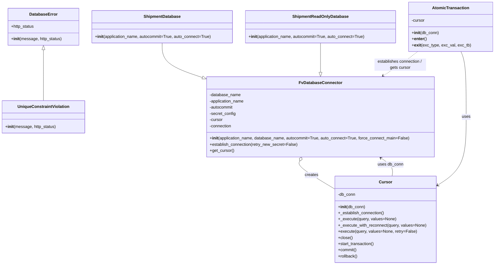

# Diagram: shipment_core/chromium_export/fv/python/fv/db/__init__.py


> Auto-generated by Obscura crawlers

## Diagram 1



### SVG

<svg id="container" width="1908.96875" xmlns="http://www.w3.org/2000/svg" class="classDiagram" height="1028" viewBox="0 0 1908.96875 1028" role="graphics-document document" aria-roledescription="class"><style>#container{font-family:"trebuchet ms",verdana,arial,sans-serif;font-size:16px;fill:#333;}@keyframes edge-animation-frame{from{stroke-dashoffset:0;}}@keyframes dash{to{stroke-dashoffset:0;}}#container .edge-animation-slow{stroke-dasharray:9,5!important;stroke-dashoffset:900;animation:dash 50s linear infinite;stroke-linecap:round;}#container .edge-animation-fast{stroke-dasharray:9,5!important;stroke-dashoffset:900;animation:dash 20s linear infinite;stroke-linecap:round;}#container .error-icon{fill:#552222;}#container .error-text{fill:#552222;stroke:#552222;}#container .edge-thickness-normal{stroke-width:1px;}#container .edge-thickness-thick{stroke-width:3.5px;}#container .edge-pattern-solid{stroke-dasharray:0;}#container .edge-thickness-invisible{stroke-width:0;fill:none;}#container .edge-pattern-dashed{stroke-dasharray:3;}#container .edge-pattern-dotted{stroke-dasharray:2;}#container .marker{fill:#333333;stroke:#333333;}#container .marker.cross{stroke:#333333;}#container svg{font-family:"trebuchet ms",verdana,arial,sans-serif;font-size:16px;}#container p{margin:0;}#container g.classGroup text{fill:#9370DB;stroke:none;font-family:"trebuchet ms",verdana,arial,sans-serif;font-size:10px;}#container g.classGroup text .title{font-weight:bolder;}#container .nodeLabel,#container .edgeLabel{color:#131300;}#container .edgeLabel .label rect{fill:#ECECFF;}#container .label text{fill:#131300;}#container .labelBkg{background:#ECECFF;}#container .edgeLabel .label span{background:#ECECFF;}#container .classTitle{font-weight:bolder;}#container .node rect,#container .node circle,#container .node ellipse,#container .node polygon,#container .node path{fill:#ECECFF;stroke:#9370DB;stroke-width:1px;}#container .divider{stroke:#9370DB;stroke-width:1;}#container g.clickable{cursor:pointer;}#container g.classGroup rect{fill:#ECECFF;stroke:#9370DB;}#container g.classGroup line{stroke:#9370DB;stroke-width:1;}#container .classLabel .box{stroke:none;stroke-width:0;fill:#ECECFF;opacity:0.5;}#container .classLabel .label{fill:#9370DB;font-size:10px;}#container .relation{stroke:#333333;stroke-width:1;fill:none;}#container .dashed-line{stroke-dasharray:3;}#container .dotted-line{stroke-dasharray:1 2;}#container #compositionStart,#container .composition{fill:#333333!important;stroke:#333333!important;stroke-width:1;}#container #compositionEnd,#container .composition{fill:#333333!important;stroke:#333333!important;stroke-width:1;}#container #dependencyStart,#container .dependency{fill:#333333!important;stroke:#333333!important;stroke-width:1;}#container #dependencyStart,#container .dependency{fill:#333333!important;stroke:#333333!important;stroke-width:1;}#container #extensionStart,#container .extension{fill:transparent!important;stroke:#333333!important;stroke-width:1;}#container #extensionEnd,#container .extension{fill:transparent!important;stroke:#333333!important;stroke-width:1;}#container #aggregationStart,#container .aggregation{fill:transparent!important;stroke:#333333!important;stroke-width:1;}#container #aggregationEnd,#container .aggregation{fill:transparent!important;stroke:#333333!important;stroke-width:1;}#container #lollipopStart,#container .lollipop{fill:#ECECFF!important;stroke:#333333!important;stroke-width:1;}#container #lollipopEnd,#container .lollipop{fill:#ECECFF!important;stroke:#333333!important;stroke-width:1;}#container .edgeTerminals{font-size:11px;line-height:initial;}#container .classTitleText{text-anchor:middle;font-size:18px;fill:#333;}#container .label-icon{display:inline-block;height:1em;overflow:visible;vertical-align:-0.125em;}#container .node .label-icon path{fill:currentColor;stroke:revert;stroke-width:revert;}#container :root{--mermaid-font-family:"trebuchet ms",verdana,arial,sans-serif;}</style><g><defs><marker id="container_class-aggregationStart" class="marker aggregation class" refX="18" refY="7" markerWidth="190" markerHeight="240" orient="auto"><path d="M 18,7 L9,13 L1,7 L9,1 Z"></path></marker></defs><defs><marker id="container_class-aggregationEnd" class="marker aggregation class" refX="1" refY="7" markerWidth="20" markerHeight="28" orient="auto"><path d="M 18,7 L9,13 L1,7 L9,1 Z"></path></marker></defs><defs><marker id="container_class-extensionStart" class="marker extension class" refX="18" refY="7" markerWidth="190" markerHeight="240" orient="auto"><path d="M 1,7 L18,13 V 1 Z"></path></marker></defs><defs><marker id="container_class-extensionEnd" class="marker extension class" refX="1" refY="7" markerWidth="20" markerHeight="28" orient="auto"><path d="M 1,1 V 13 L18,7 Z"></path></marker></defs><defs><marker id="container_class-compositionStart" class="marker composition class" refX="18" refY="7" markerWidth="190" markerHeight="240" orient="auto"><path d="M 18,7 L9,13 L1,7 L9,1 Z"></path></marker></defs><defs><marker id="container_class-compositionEnd" class="marker composition class" refX="1" refY="7" markerWidth="20" markerHeight="28" orient="auto"><path d="M 18,7 L9,13 L1,7 L9,1 Z"></path></marker></defs><defs><marker id="container_class-dependencyStart" class="marker dependency class" refX="6" refY="7" markerWidth="190" markerHeight="240" orient="auto"><path d="M 5,7 L9,13 L1,7 L9,1 Z"></path></marker></defs><defs><marker id="container_class-dependencyEnd" class="marker dependency class" refX="13" refY="7" markerWidth="20" markerHeight="28" orient="auto"><path d="M 18,7 L9,13 L14,7 L9,1 Z"></path></marker></defs><defs><marker id="container_class-lollipopStart" class="marker lollipop class" refX="13" refY="7" markerWidth="190" markerHeight="240" orient="auto"><circle stroke="black" fill="transparent" cx="7" cy="7" r="6"></circle></marker></defs><defs><marker id="container_class-lollipopEnd" class="marker lollipop class" refX="1" refY="7" markerWidth="190" markerHeight="240" orient="auto"><circle stroke="black" fill="transparent" cx="7" cy="7" r="6"></circle></marker></defs><g class="root"><g class="clusters"></g><g class="edgePaths"><path d="M166.305,193.25L166.305,202.542C166.305,211.833,166.305,230.417,166.305,263.375C166.305,296.333,166.305,343.667,166.305,367.333L166.305,391" id="id_DatabaseError_UniqueConstraintViolation_1" class="edge-thickness-normal edge-pattern-solid relation" style=";;;" data-edge="true" data-et="edge" data-id="id_DatabaseError_UniqueConstraintViolation_1" data-points="W3sieCI6MTY2LjMwNDY4NzUsInkiOjE3Nn0seyJ4IjoxNjYuMzA0Njg3NSwieSI6MjQ5fSx7IngiOjE2Ni4zMDQ2ODc1LCJ5IjozOTF9XQ==" marker-start="url(#container_class-extensionStart)"></path><path d="M1160.952,625.586L1159.26,629.155C1157.567,632.724,1154.182,639.862,1176.931,658.099C1199.68,676.337,1248.564,705.674,1273.006,720.342L1297.447,735.011" id="id_FvDatabaseConnector_Cursor_2" class="edge-thickness-normal edge-pattern-solid relation" style=";;;" data-edge="true" data-et="edge" data-id="id_FvDatabaseConnector_Cursor_2" data-points="W3sieCI6MTE2OC4zNDM1Njc4NDMyNjQzLCJ5Ijo2MTB9LHsieCI6MTE1MC43OTY4NzUsInkiOjY0N30seyJ4IjoxMjk3LjQ0NzI2NTYyNSwieSI6NzM1LjAxMDUyNjQzNjE2Mzh9XQ==" marker-start="url(#container_class-aggregationStart)"></path><path d="M1516.557,684L1517.444,677.833C1518.332,671.667,1520.106,659.333,1512.884,647.568C1505.662,635.803,1489.443,624.606,1481.334,619.007L1473.225,613.409" id="id_Cursor_FvDatabaseConnector_3" class="edge-thickness-normal edge-pattern-solid relation" style=";;;" data-edge="true" data-et="edge" data-id="id_Cursor_FvDatabaseConnector_3" data-points="W3sieCI6MTUxNi41NTcxNzQxNjE1ODU0LCJ5Ijo2ODR9LHsieCI6MTUyMS44ODA4NTkzNzUsInkiOjY0N30seyJ4IjoxNDY4LjI4NzA5OTI1NTE4MTQsInkiOjYxMH1d" marker-end="url(#container_class-dependencyEnd)"></path><path d="M626.59,167L626.59,180.667C626.59,194.333,626.59,221.667,653.162,244.18C679.735,266.694,732.879,284.388,759.452,293.234L786.024,302.081" id="id_ShipmentDatabase_FvDatabaseConnector_4" class="edge-thickness-normal edge-pattern-solid relation" style=";;;" data-edge="true" data-et="edge" data-id="id_ShipmentDatabase_FvDatabaseConnector_4" data-points="W3sieCI6NjI2LjU4OTg0Mzc1LCJ5IjoxNjd9LHsieCI6NjI2LjU4OTg0Mzc1LCJ5IjoyNDl9LHsieCI6ODAyLjM5MDYyNSwieSI6MzA3LjUzMDM2ODk2OTk3OTl9XQ==" marker-end="url(#container_class-extensionEnd)"></path><path d="M1242.324,167L1242.324,180.667C1242.324,194.333,1242.324,221.667,1242.324,240.625C1242.324,259.583,1242.324,270.167,1242.324,275.458L1242.324,280.75" id="id_ShipmentReadOnlyDatabase_FvDatabaseConnector_5" class="edge-thickness-normal edge-pattern-solid relation" style=";;;" data-edge="true" data-et="edge" data-id="id_ShipmentReadOnlyDatabase_FvDatabaseConnector_5" data-points="W3sieCI6MTI0Mi4zMjQyMTg3NSwieSI6MTY3fSx7IngiOjEyNDIuMzI0MjE4NzUsInkiOjI0OX0seyJ4IjoxMjQyLjMyNDIxODc1LCJ5IjoyOTh9XQ==" marker-end="url(#container_class-extensionEnd)"></path><path d="M1616.612,200L1605.908,208.167C1595.203,216.333,1573.794,232.667,1551.571,248.448C1529.349,264.23,1506.313,279.461,1494.796,287.076L1483.278,294.691" id="id_AtomicTransaction_FvDatabaseConnector_6" class="edge-thickness-normal edge-pattern-dashed relation" style=";;;" data-edge="true" data-et="edge" data-id="id_AtomicTransaction_FvDatabaseConnector_6" data-points="W3sieCI6MTYxNi42MTIxMjI4NDQ4Mjc2LCJ5IjoyMDB9LHsieCI6MTU1Mi4zODQ3NjU2MjUsInkiOjI0OX0seyJ4IjoxNDc4LjI3MjczMjQ2OTUxMjIsInkiOjI5OH1d" marker-end="url(#container_class-dependencyEnd)"></path><path d="M1782.169,200L1785.549,208.167C1788.928,216.333,1795.687,232.667,1799.066,275C1802.445,317.333,1802.445,385.667,1802.445,452C1802.445,518.333,1802.445,582.667,1784.092,626.968C1765.739,671.269,1729.033,695.537,1710.68,707.671L1692.327,719.806" id="id_AtomicTransaction_Cursor_7" class="edge-thickness-normal edge-pattern-solid relation" style=";;;" data-edge="true" data-et="edge" data-id="id_AtomicTransaction_Cursor_7" data-points="W3sieCI6MTc4Mi4xNjk0NTA0MzEwMzQ0LCJ5IjoyMDB9LHsieCI6MTgwMi40NDUzMTI1LCJ5IjoyNDl9LHsieCI6MTgwMi40NDUzMTI1LCJ5Ijo0NTR9LHsieCI6MTgwMi40NDUzMTI1LCJ5Ijo2NDd9LHsieCI6MTY4Ny4zMjIyNjU2MjUsInkiOjcyMy4xMTQ4OTA2MTQ4NjIyfV0=" marker-end="url(#container_class-dependencyEnd)"></path></g><g class="edgeLabels"><g class="edgeLabel"><g class="label" data-id="id_DatabaseError_UniqueConstraintViolation_1" transform="translate(0, 0)"><foreignObject width="0" height="0"><div xmlns="http://www.w3.org/1999/xhtml" class="labelBkg" style="display: table-cell; white-space: nowrap; line-height: 1.5; max-width: 200px; text-align: center;"><span class="edgeLabel"></span></div></foreignObject></g></g><g class="edgeLabel" transform="translate(1206.56606, 680.46923)"><g class="label" data-id="id_FvDatabaseConnector_Cursor_2" transform="translate(-26.171875, -12)"><foreignObject width="52.34375" height="24"><div xmlns="http://www.w3.org/1999/xhtml" class="labelBkg" style="display: table-cell; white-space: nowrap; line-height: 1.5; max-width: 200px; text-align: center;"><span class="edgeLabel"><p>creates</p></span></div></foreignObject></g></g><g class="edgeLabel" transform="translate(1510.46505, 639.11876)"><g class="label" data-id="id_Cursor_FvDatabaseConnector_3" transform="translate(-49.703125, -12)"><foreignObject width="99.40625" height="24"><div xmlns="http://www.w3.org/1999/xhtml" class="labelBkg" style="display: table-cell; white-space: nowrap; line-height: 1.5; max-width: 200px; text-align: center;"><span class="edgeLabel"><p>uses db_conn</p></span></div></foreignObject></g></g><g class="edgeLabel"><g class="label" data-id="id_ShipmentDatabase_FvDatabaseConnector_4" transform="translate(0, 0)"><foreignObject width="0" height="0"><div xmlns="http://www.w3.org/1999/xhtml" class="labelBkg" style="display: table-cell; white-space: nowrap; line-height: 1.5; max-width: 200px; text-align: center;"><span class="edgeLabel"></span></div></foreignObject></g></g><g class="edgeLabel"><g class="label" data-id="id_ShipmentReadOnlyDatabase_FvDatabaseConnector_5" transform="translate(0, 0)"><foreignObject width="0" height="0"><div xmlns="http://www.w3.org/1999/xhtml" class="labelBkg" style="display: table-cell; white-space: nowrap; line-height: 1.5; max-width: 200px; text-align: center;"><span class="edgeLabel"></span></div></foreignObject></g></g><g class="edgeLabel" transform="translate(1552.384765625, 249)"><g class="label" data-id="id_AtomicTransaction_FvDatabaseConnector_6" transform="translate(-100, -24)"><foreignObject width="200" height="48"><div xmlns="http://www.w3.org/1999/xhtml" class="labelBkg" style="display: table; white-space: break-spaces; line-height: 1.5; max-width: 200px; text-align: center; width: 200px;"><span class="edgeLabel"><p>establishes connection / gets cursor</p></span></div></foreignObject></g></g><g class="edgeLabel" transform="translate(1802.4453125, 454)"><g class="label" data-id="id_AtomicTransaction_Cursor_7" transform="translate(-16.4921875, -12)"><foreignObject width="32.984375" height="24"><div xmlns="http://www.w3.org/1999/xhtml" class="labelBkg" style="display: table-cell; white-space: nowrap; line-height: 1.5; max-width: 200px; text-align: center;"><span class="edgeLabel"><p>uses</p></span></div></foreignObject></g></g></g><g class="nodes"><g class="node default" id="classId-DatabaseError-0" transform="translate(166.3046875, 104)"><g class="basic label-container"><path d="M-136.1484375 -72 L136.1484375 -72 L136.1484375 72 L-136.1484375 72" stroke="none" stroke-width="0" fill="#ECECFF" style=""></path><path d="M-136.1484375 -72 C-53.328506584588936 -72, 29.491424330822127 -72, 136.1484375 -72 M-136.1484375 -72 C-50.24641107480704 -72, 35.655615350385915 -72, 136.1484375 -72 M136.1484375 -72 C136.1484375 -41.82527721131857, 136.1484375 -11.650554422637143, 136.1484375 72 M136.1484375 -72 C136.1484375 -30.5907952166681, 136.1484375 10.818409566663803, 136.1484375 72 M136.1484375 72 C62.1456673896251 72, -11.857102720749793 72, -136.1484375 72 M136.1484375 72 C39.29307839678988 72, -57.56228070642024 72, -136.1484375 72 M-136.1484375 72 C-136.1484375 14.887711218917289, -136.1484375 -42.22457756216542, -136.1484375 -72 M-136.1484375 72 C-136.1484375 33.64982190516037, -136.1484375 -4.700356189679255, -136.1484375 -72" stroke="#9370DB" stroke-width="1.3" fill="none" stroke-dasharray="0 0" style=""></path></g><g class="annotation-group text" transform="translate(0, -48)"></g><g class="label-group text" transform="translate(-52.359375, -48)"><g class="label" style="font-weight: bolder" transform="translate(0,-12)"><foreignObject width="104.71875" height="24"><div xmlns="http://www.w3.org/1999/xhtml" style="display: table-cell; white-space: nowrap; line-height: 1.5; max-width: 154px; text-align: center;"><span class="nodeLabel markdown-node-label" style=""><p>DatabaseError</p></span></div></foreignObject></g></g><g class="members-group text" transform="translate(-124.1484375, 0)"><g class="label" style="" transform="translate(0,-12)"><foreignObject width="90.828125" height="24"><div xmlns="http://www.w3.org/1999/xhtml" style="display: table-cell; white-space: nowrap; line-height: 1.5; max-width: 148px; text-align: center;"><span class="nodeLabel markdown-node-label" style=""><p>+http_status</p></span></div></foreignObject></g></g><g class="methods-group text" transform="translate(-124.1484375, 48)"><g class="label" style="" transform="translate(0,-12)"><foreignObject width="195.9375" height="24"><div xmlns="http://www.w3.org/1999/xhtml" style="display: table-cell; white-space: nowrap; line-height: 1.5; max-width: 285px; text-align: center;"><span class="nodeLabel markdown-node-label" style=""><p>+<strong>init</strong>(message, http_status)</p></span></div></foreignObject></g></g><g class="divider" style=""><path d="M-136.1484375 -24 C-36.48231337212786 -24, 63.183810755744275 -24, 136.1484375 -24 M-136.1484375 -24 C-73.74771871925432 -24, -11.346999938508631 -24, 136.1484375 -24" stroke="#9370DB" stroke-width="1.3" fill="none" stroke-dasharray="0 0" style=""></path></g><g class="divider" style=""><path d="M-136.1484375 24 C-27.887513692819283 24, 80.37341011436143 24, 136.1484375 24 M-136.1484375 24 C-73.8695816269261 24, -11.590725753852212 24, 136.1484375 24" stroke="#9370DB" stroke-width="1.3" fill="none" stroke-dasharray="0 0" style=""></path></g></g><g class="node default" id="classId-UniqueConstraintViolation-1" transform="translate(166.3046875, 454)"><g class="basic label-container"><path d="M-158.3046875 -63 L158.3046875 -63 L158.3046875 63 L-158.3046875 63" stroke="none" stroke-width="0" fill="#ECECFF" style=""></path><path d="M-158.3046875 -63 C-73.56446675531258 -63, 11.17575398937484 -63, 158.3046875 -63 M-158.3046875 -63 C-57.90309111664308 -63, 42.498505266713835 -63, 158.3046875 -63 M158.3046875 -63 C158.3046875 -25.897749099051772, 158.3046875 11.204501801896456, 158.3046875 63 M158.3046875 -63 C158.3046875 -28.029117528921013, 158.3046875 6.941764942157974, 158.3046875 63 M158.3046875 63 C40.50408511092533 63, -77.29651727814934 63, -158.3046875 63 M158.3046875 63 C50.14005973639537 63, -58.024568027209256 63, -158.3046875 63 M-158.3046875 63 C-158.3046875 34.08311636542757, -158.3046875 5.1662327308551355, -158.3046875 -63 M-158.3046875 63 C-158.3046875 28.681222128842904, -158.3046875 -5.637555742314191, -158.3046875 -63" stroke="#9370DB" stroke-width="1.3" fill="none" stroke-dasharray="0 0" style=""></path></g><g class="annotation-group text" transform="translate(0, -39)"></g><g class="label-group text" transform="translate(-96.671875, -39)"><g class="label" style="font-weight: bolder" transform="translate(0,-12)"><foreignObject width="193.34375" height="24"><div xmlns="http://www.w3.org/1999/xhtml" style="display: table-cell; white-space: nowrap; line-height: 1.5; max-width: 242px; text-align: center;"><span class="nodeLabel markdown-node-label" style=""><p>UniqueConstraintViolation</p></span></div></foreignObject></g></g><g class="members-group text" transform="translate(-146.3046875, 9)"></g><g class="methods-group text" transform="translate(-146.3046875, 39)"><g class="label" style="" transform="translate(0,-12)"><foreignObject width="195.9375" height="24"><div xmlns="http://www.w3.org/1999/xhtml" style="display: table-cell; white-space: nowrap; line-height: 1.5; max-width: 285px; text-align: center;"><span class="nodeLabel markdown-node-label" style=""><p>+<strong>init</strong>(message, http_status)</p></span></div></foreignObject></g></g><g class="divider" style=""><path d="M-158.3046875 -15 C-34.11918318082297 -15, 90.06632113835406 -15, 158.3046875 -15 M-158.3046875 -15 C-76.34295572840263 -15, 5.618776043194742 -15, 158.3046875 -15" stroke="#9370DB" stroke-width="1.3" fill="none" stroke-dasharray="0 0" style=""></path></g><g class="divider" style=""><path d="M-158.3046875 9 C-54.66746998913001 9, 48.969747521739976 9, 158.3046875 9 M-158.3046875 9 C-69.60853478219092 9, 19.08761793561817 9, 158.3046875 9" stroke="#9370DB" stroke-width="1.3" fill="none" stroke-dasharray="0 0" style=""></path></g></g><g class="node default" id="classId-FvDatabaseConnector-2" transform="translate(1242.32421875, 454)"><g class="basic label-container"><path d="M-439.93359375 -156 L439.93359375 -156 L439.93359375 156 L-439.93359375 156" stroke="none" stroke-width="0" fill="#ECECFF" style=""></path><path d="M-439.93359375 -156 C-207.1851523961566 -156, 25.56328895768678 -156, 439.93359375 -156 M-439.93359375 -156 C-156.3592692533989 -156, 127.21505524320219 -156, 439.93359375 -156 M439.93359375 -156 C439.93359375 -69.15119162754331, 439.93359375 17.697616744913375, 439.93359375 156 M439.93359375 -156 C439.93359375 -69.37989768557804, 439.93359375 17.240204628843912, 439.93359375 156 M439.93359375 156 C220.46406411803065 156, 0.9945344860612977 156, -439.93359375 156 M439.93359375 156 C96.3270028872015 156, -247.279587975597 156, -439.93359375 156 M-439.93359375 156 C-439.93359375 40.175207724770004, -439.93359375 -75.64958455045999, -439.93359375 -156 M-439.93359375 156 C-439.93359375 92.30250589427534, -439.93359375 28.605011788550684, -439.93359375 -156" stroke="#9370DB" stroke-width="1.3" fill="none" stroke-dasharray="0 0" style=""></path></g><g class="annotation-group text" transform="translate(0, -132)"></g><g class="label-group text" transform="translate(-79.3046875, -132)"><g class="label" style="font-weight: bolder" transform="translate(0,-12)"><foreignObject width="158.609375" height="24"><div xmlns="http://www.w3.org/1999/xhtml" style="display: table-cell; white-space: nowrap; line-height: 1.5; max-width: 207px; text-align: center;"><span class="nodeLabel markdown-node-label" style=""><p>FvDatabaseConnector</p></span></div></foreignObject></g></g><g class="members-group text" transform="translate(-427.93359375, -84)"><g class="label" style="" transform="translate(0,-12)"><foreignObject width="121.6875" height="24"><div xmlns="http://www.w3.org/1999/xhtml" style="display: table-cell; white-space: nowrap; line-height: 1.5; max-width: 179px; text-align: center;"><span class="nodeLabel markdown-node-label" style=""><p>-database_name</p></span></div></foreignObject></g><g class="label" style="" transform="translate(0,12)"><foreignObject width="137.15625" height="24"><div xmlns="http://www.w3.org/1999/xhtml" style="display: table-cell; white-space: nowrap; line-height: 1.5; max-width: 195px; text-align: center;"><span class="nodeLabel markdown-node-label" style=""><p>-application_name</p></span></div></foreignObject></g><g class="label" style="" transform="translate(0,36)"><foreignObject width="93.5" height="24"><div xmlns="http://www.w3.org/1999/xhtml" style="display: table-cell; white-space: nowrap; line-height: 1.5; max-width: 151px; text-align: center;"><span class="nodeLabel markdown-node-label" style=""><p>-autocommit</p></span></div></foreignObject></g><g class="label" style="" transform="translate(0,60)"><foreignObject width="102.0625" height="24"><div xmlns="http://www.w3.org/1999/xhtml" style="display: table-cell; white-space: nowrap; line-height: 1.5; max-width: 160px; text-align: center;"><span class="nodeLabel markdown-node-label" style=""><p>-secret_config</p></span></div></foreignObject></g><g class="label" style="" transform="translate(0,84)"><foreignObject width="52.1875" height="24"><div xmlns="http://www.w3.org/1999/xhtml" style="display: table-cell; white-space: nowrap; line-height: 1.5; max-width: 110px; text-align: center;"><span class="nodeLabel markdown-node-label" style=""><p>-cursor</p></span></div></foreignObject></g><g class="label" style="" transform="translate(0,108)"><foreignObject width="87.25" height="24"><div xmlns="http://www.w3.org/1999/xhtml" style="display: table-cell; white-space: nowrap; line-height: 1.5; max-width: 145px; text-align: center;"><span class="nodeLabel markdown-node-label" style=""><p>-connection</p></span></div></foreignObject></g></g><g class="methods-group text" transform="translate(-427.93359375, 84)"><g class="label" style="" transform="translate(0,-12)"><foreignObject width="776.5625" height="24"><div xmlns="http://www.w3.org/1999/xhtml" style="display: table-cell; white-space: nowrap; line-height: 1.5; max-width: 865px; text-align: center;"><span class="nodeLabel markdown-node-label" style=""><p>+<strong>init</strong>(application_name, database_name, autocommit=True, auto_connect=True, force_connect_main=False)</p></span></div></foreignObject></g><g class="label" style="" transform="translate(0,12)"><foreignObject width="341.265625" height="24"><div xmlns="http://www.w3.org/1999/xhtml" style="display: table-cell; white-space: nowrap; line-height: 1.5; max-width: 399px; text-align: center;"><span class="nodeLabel markdown-node-label" style=""><p>+establish_connection(retry_new_secret=False)</p></span></div></foreignObject></g><g class="label" style="" transform="translate(0,36)"><foreignObject width="94.640625" height="24"><div xmlns="http://www.w3.org/1999/xhtml" style="display: table-cell; white-space: nowrap; line-height: 1.5; max-width: 152px; text-align: center;"><span class="nodeLabel markdown-node-label" style=""><p>+get_cursor()</p></span></div></foreignObject></g></g><g class="divider" style=""><path d="M-439.93359375 -108 C-96.25301852623005 -108, 247.4275566975399 -108, 439.93359375 -108 M-439.93359375 -108 C-247.59746902650542 -108, -55.261344303010844 -108, 439.93359375 -108" stroke="#9370DB" stroke-width="1.3" fill="none" stroke-dasharray="0 0" style=""></path></g><g class="divider" style=""><path d="M-439.93359375 60 C-252.08329407452644 60, -64.23299439905287 60, 439.93359375 60 M-439.93359375 60 C-116.52650861322945 60, 206.8805765235411 60, 439.93359375 60" stroke="#9370DB" stroke-width="1.3" fill="none" stroke-dasharray="0 0" style=""></path></g></g><g class="node default" id="classId-Cursor-3" transform="translate(1492.384765625, 852)"><g class="basic label-container"><path d="M-194.9375 -168 L194.9375 -168 L194.9375 168 L-194.9375 168" stroke="none" stroke-width="0" fill="#ECECFF" style=""></path><path d="M-194.9375 -168 C-48.328828570960326 -168, 98.27984285807935 -168, 194.9375 -168 M-194.9375 -168 C-91.34944398848748 -168, 12.238612023025041 -168, 194.9375 -168 M194.9375 -168 C194.9375 -96.55265440274222, 194.9375 -25.10530880548444, 194.9375 168 M194.9375 -168 C194.9375 -90.7843539643709, 194.9375 -13.568707928741787, 194.9375 168 M194.9375 168 C62.72135043504477 168, -69.49479912991046 168, -194.9375 168 M194.9375 168 C98.56693099244222 168, 2.1963619848844473 168, -194.9375 168 M-194.9375 168 C-194.9375 71.44636619812928, -194.9375 -25.107267603741434, -194.9375 -168 M-194.9375 168 C-194.9375 89.25727272705232, -194.9375 10.514545454104649, -194.9375 -168" stroke="#9370DB" stroke-width="1.3" fill="none" stroke-dasharray="0 0" style=""></path></g><g class="annotation-group text" transform="translate(0, -144)"></g><g class="label-group text" transform="translate(-23.90625, -144)"><g class="label" style="font-weight: bolder" transform="translate(0,-12)"><foreignObject width="47.8125" height="24"><div xmlns="http://www.w3.org/1999/xhtml" style="display: table-cell; white-space: nowrap; line-height: 1.5; max-width: 98px; text-align: center;"><span class="nodeLabel markdown-node-label" style=""><p>Cursor</p></span></div></foreignObject></g></g><g class="members-group text" transform="translate(-182.9375, -96)"><g class="label" style="" transform="translate(0,-12)"><foreignObject width="68.625" height="24"><div xmlns="http://www.w3.org/1999/xhtml" style="display: table-cell; white-space: nowrap; line-height: 1.5; max-width: 126px; text-align: center;"><span class="nodeLabel markdown-node-label" style=""><p>-db_conn</p></span></div></foreignObject></g></g><g class="methods-group text" transform="translate(-182.9375, -48)"><g class="label" style="" transform="translate(0,-12)"><foreignObject width="104.96875" height="24"><div xmlns="http://www.w3.org/1999/xhtml" style="display: table-cell; white-space: nowrap; line-height: 1.5; max-width: 194px; text-align: center;"><span class="nodeLabel markdown-node-label" style=""><p>+<strong>init</strong>(db_conn)</p></span></div></foreignObject></g><g class="label" style="" transform="translate(0,12)"><foreignObject width="179.984375" height="24"><div xmlns="http://www.w3.org/1999/xhtml" style="display: table-cell; white-space: nowrap; line-height: 1.5; max-width: 237px; text-align: center;"><span class="nodeLabel markdown-node-label" style=""><p>+_establish_connection()</p></span></div></foreignObject></g><g class="label" style="" transform="translate(0,36)"><foreignObject width="222.859375" height="24"><div xmlns="http://www.w3.org/1999/xhtml" style="display: table-cell; white-space: nowrap; line-height: 1.5; max-width: 280px; text-align: center;"><span class="nodeLabel markdown-node-label" style=""><p>+_execute(query, values=None)</p></span></div></foreignObject></g><g class="label" style="" transform="translate(0,60)"><foreignObject width="341.96875" height="24"><div xmlns="http://www.w3.org/1999/xhtml" style="display: table-cell; white-space: nowrap; line-height: 1.5; max-width: 399px; text-align: center;"><span class="nodeLabel markdown-node-label" style=""><p>+_execute_with_reconnect(query, values=None)</p></span></div></foreignObject></g><g class="label" style="" transform="translate(0,84)"><foreignObject width="302.609375" height="24"><div xmlns="http://www.w3.org/1999/xhtml" style="display: table-cell; white-space: nowrap; line-height: 1.5; max-width: 360px; text-align: center;"><span class="nodeLabel markdown-node-label" style=""><p>+execute(query, values=None, retry=False)</p></span></div></foreignObject></g><g class="label" style="" transform="translate(0,108)"><foreignObject width="56.15625" height="24"><div xmlns="http://www.w3.org/1999/xhtml" style="display: table-cell; white-space: nowrap; line-height: 1.5; max-width: 114px; text-align: center;"><span class="nodeLabel markdown-node-label" style=""><p>+close()</p></span></div></foreignObject></g><g class="label" style="" transform="translate(0,132)"><foreignObject width="142.296875" height="24"><div xmlns="http://www.w3.org/1999/xhtml" style="display: table-cell; white-space: nowrap; line-height: 1.5; max-width: 200px; text-align: center;"><span class="nodeLabel markdown-node-label" style=""><p>+start_transaction()</p></span></div></foreignObject></g><g class="label" style="" transform="translate(0,156)"><foreignObject width="72.75" height="24"><div xmlns="http://www.w3.org/1999/xhtml" style="display: table-cell; white-space: nowrap; line-height: 1.5; max-width: 130px; text-align: center;"><span class="nodeLabel markdown-node-label" style=""><p>+commit()</p></span></div></foreignObject></g><g class="label" style="" transform="translate(0,180)"><foreignObject width="76.65625" height="24"><div xmlns="http://www.w3.org/1999/xhtml" style="display: table-cell; white-space: nowrap; line-height: 1.5; max-width: 134px; text-align: center;"><span class="nodeLabel markdown-node-label" style=""><p>+rollback()</p></span></div></foreignObject></g></g><g class="divider" style=""><path d="M-194.9375 -120 C-94.7380694326118 -120, 5.461361134776411 -120, 194.9375 -120 M-194.9375 -120 C-111.12815648482444 -120, -27.31881296964889 -120, 194.9375 -120" stroke="#9370DB" stroke-width="1.3" fill="none" stroke-dasharray="0 0" style=""></path></g><g class="divider" style=""><path d="M-194.9375 -72 C-89.75142312224382 -72, 15.434653755512358 -72, 194.9375 -72 M-194.9375 -72 C-63.54657532670407 -72, 67.84434934659186 -72, 194.9375 -72" stroke="#9370DB" stroke-width="1.3" fill="none" stroke-dasharray="0 0" style=""></path></g></g><g class="node default" id="classId-ShipmentDatabase-4" transform="translate(626.58984375, 104)"><g class="basic label-container"><path d="M-274.13671875 -63 L274.13671875 -63 L274.13671875 63 L-274.13671875 63" stroke="none" stroke-width="0" fill="#ECECFF" style=""></path><path d="M-274.13671875 -63 C-83.22844065324696 -63, 107.67983744350607 -63, 274.13671875 -63 M-274.13671875 -63 C-107.64881583542245 -63, 58.83908707915509 -63, 274.13671875 -63 M274.13671875 -63 C274.13671875 -29.57944579616145, 274.13671875 3.8411084076770976, 274.13671875 63 M274.13671875 -63 C274.13671875 -26.262410077777986, 274.13671875 10.475179844444028, 274.13671875 63 M274.13671875 63 C94.01696759687846 63, -86.10278355624308 63, -274.13671875 63 M274.13671875 63 C123.11557196498643 63, -27.90557482002714 63, -274.13671875 63 M-274.13671875 63 C-274.13671875 22.00267550475821, -274.13671875 -18.994648990483583, -274.13671875 -63 M-274.13671875 63 C-274.13671875 26.818554370324456, -274.13671875 -9.362891259351088, -274.13671875 -63" stroke="#9370DB" stroke-width="1.3" fill="none" stroke-dasharray="0 0" style=""></path></g><g class="annotation-group text" transform="translate(0, -39)"></g><g class="label-group text" transform="translate(-69.2734375, -39)"><g class="label" style="font-weight: bolder" transform="translate(0,-12)"><foreignObject width="138.546875" height="24"><div xmlns="http://www.w3.org/1999/xhtml" style="display: table-cell; white-space: nowrap; line-height: 1.5; max-width: 187px; text-align: center;"><span class="nodeLabel markdown-node-label" style=""><p>ShipmentDatabase</p></span></div></foreignObject></g></g><g class="members-group text" transform="translate(-262.13671875, 9)"></g><g class="methods-group text" transform="translate(-262.13671875, 39)"><g class="label" style="" transform="translate(0,-12)"><foreignObject width="455" height="24"><div xmlns="http://www.w3.org/1999/xhtml" style="display: table-cell; white-space: nowrap; line-height: 1.5; max-width: 544px; text-align: center;"><span class="nodeLabel markdown-node-label" style=""><p>+<strong>init</strong>(application_name, autocommit=True, auto_connect=True)</p></span></div></foreignObject></g></g><g class="divider" style=""><path d="M-274.13671875 -15 C-105.98541974727013 -15, 62.16587925545974 -15, 274.13671875 -15 M-274.13671875 -15 C-104.65773914379182 -15, 64.82124046241637 -15, 274.13671875 -15" stroke="#9370DB" stroke-width="1.3" fill="none" stroke-dasharray="0 0" style=""></path></g><g class="divider" style=""><path d="M-274.13671875 9 C-130.69099613762478 9, 12.754726474750441 9, 274.13671875 9 M-274.13671875 9 C-163.81415685499292 9, -53.491594959985804 9, 274.13671875 9" stroke="#9370DB" stroke-width="1.3" fill="none" stroke-dasharray="0 0" style=""></path></g></g><g class="node default" id="classId-ShipmentReadOnlyDatabase-5" transform="translate(1242.32421875, 104)"><g class="basic label-container"><path d="M-291.59765625 -63 L291.59765625 -63 L291.59765625 63 L-291.59765625 63" stroke="none" stroke-width="0" fill="#ECECFF" style=""></path><path d="M-291.59765625 -63 C-121.41210352567236 -63, 48.77344919865527 -63, 291.59765625 -63 M-291.59765625 -63 C-148.93109465939565 -63, -6.264533068791309 -63, 291.59765625 -63 M291.59765625 -63 C291.59765625 -36.10257342681663, 291.59765625 -9.205146853633266, 291.59765625 63 M291.59765625 -63 C291.59765625 -22.999857239832593, 291.59765625 17.000285520334813, 291.59765625 63 M291.59765625 63 C166.12834574470904 63, 40.659035239418074 63, -291.59765625 63 M291.59765625 63 C108.8201987606611 63, -73.9572587286778 63, -291.59765625 63 M-291.59765625 63 C-291.59765625 30.947300227931002, -291.59765625 -1.1053995441379953, -291.59765625 -63 M-291.59765625 63 C-291.59765625 23.427666298136202, -291.59765625 -16.144667403727595, -291.59765625 -63" stroke="#9370DB" stroke-width="1.3" fill="none" stroke-dasharray="0 0" style=""></path></g><g class="annotation-group text" transform="translate(0, -39)"></g><g class="label-group text" transform="translate(-104.1953125, -39)"><g class="label" style="font-weight: bolder" transform="translate(0,-12)"><foreignObject width="208.390625" height="24"><div xmlns="http://www.w3.org/1999/xhtml" style="display: table-cell; white-space: nowrap; line-height: 1.5; max-width: 256px; text-align: center;"><span class="nodeLabel markdown-node-label" style=""><p>ShipmentReadOnlyDatabase</p></span></div></foreignObject></g></g><g class="members-group text" transform="translate(-279.59765625, 9)"></g><g class="methods-group text" transform="translate(-279.59765625, 39)"><g class="label" style="" transform="translate(0,-12)"><foreignObject width="455" height="24"><div xmlns="http://www.w3.org/1999/xhtml" style="display: table-cell; white-space: nowrap; line-height: 1.5; max-width: 544px; text-align: center;"><span class="nodeLabel markdown-node-label" style=""><p>+<strong>init</strong>(application_name, autocommit=True, auto_connect=True)</p></span></div></foreignObject></g></g><g class="divider" style=""><path d="M-291.59765625 -15 C-162.12361402580416 -15, -32.64957180160832 -15, 291.59765625 -15 M-291.59765625 -15 C-128.82222439667402 -15, 33.95320745665197 -15, 291.59765625 -15" stroke="#9370DB" stroke-width="1.3" fill="none" stroke-dasharray="0 0" style=""></path></g><g class="divider" style=""><path d="M-291.59765625 9 C-157.7844933374879 9, -23.971330424975804 9, 291.59765625 9 M-291.59765625 9 C-171.48232184195092 9, -51.36698743390181 9, 291.59765625 9" stroke="#9370DB" stroke-width="1.3" fill="none" stroke-dasharray="0 0" style=""></path></g></g><g class="node default" id="classId-AtomicTransaction-6" transform="translate(1742.4453125, 104)"><g class="basic label-container"><path d="M-158.5234375 -96 L158.5234375 -96 L158.5234375 96 L-158.5234375 96" stroke="none" stroke-width="0" fill="#ECECFF" style=""></path><path d="M-158.5234375 -96 C-93.02190836515398 -96, -27.520379230307952 -96, 158.5234375 -96 M-158.5234375 -96 C-47.77014229207478 -96, 62.98315291585044 -96, 158.5234375 -96 M158.5234375 -96 C158.5234375 -41.327039350443904, 158.5234375 13.345921299112192, 158.5234375 96 M158.5234375 -96 C158.5234375 -40.012778486016714, 158.5234375 15.974443027966572, 158.5234375 96 M158.5234375 96 C55.33452744035496 96, -47.85438261929008 96, -158.5234375 96 M158.5234375 96 C92.40597400415295 96, 26.288510508305905 96, -158.5234375 96 M-158.5234375 96 C-158.5234375 50.031054347060476, -158.5234375 4.062108694120951, -158.5234375 -96 M-158.5234375 96 C-158.5234375 37.65998353841138, -158.5234375 -20.680032923177237, -158.5234375 -96" stroke="#9370DB" stroke-width="1.3" fill="none" stroke-dasharray="0 0" style=""></path></g><g class="annotation-group text" transform="translate(0, -72)"></g><g class="label-group text" transform="translate(-67.828125, -72)"><g class="label" style="font-weight: bolder" transform="translate(0,-12)"><foreignObject width="135.65625" height="24"><div xmlns="http://www.w3.org/1999/xhtml" style="display: table-cell; white-space: nowrap; line-height: 1.5; max-width: 184px; text-align: center;"><span class="nodeLabel markdown-node-label" style=""><p>AtomicTransaction</p></span></div></foreignObject></g></g><g class="members-group text" transform="translate(-146.5234375, -24)"><g class="label" style="" transform="translate(0,-12)"><foreignObject width="52.1875" height="24"><div xmlns="http://www.w3.org/1999/xhtml" style="display: table-cell; white-space: nowrap; line-height: 1.5; max-width: 110px; text-align: center;"><span class="nodeLabel markdown-node-label" style=""><p>-cursor</p></span></div></foreignObject></g></g><g class="methods-group text" transform="translate(-146.5234375, 24)"><g class="label" style="" transform="translate(0,-12)"><foreignObject width="104.96875" height="24"><div xmlns="http://www.w3.org/1999/xhtml" style="display: table-cell; white-space: nowrap; line-height: 1.5; max-width: 194px; text-align: center;"><span class="nodeLabel markdown-node-label" style=""><p>+<strong>init</strong>(db_conn)</p></span></div></foreignObject></g><g class="label" style="" transform="translate(0,12)"><foreignObject width="57.5625" height="24"><div xmlns="http://www.w3.org/1999/xhtml" style="display: table-cell; white-space: nowrap; line-height: 1.5; max-width: 144px; text-align: center;"><span class="nodeLabel markdown-node-label" style=""><p>+<strong>enter</strong>()</p></span></div></foreignObject></g><g class="label" style="" transform="translate(0,36)"><foreignObject width="225.21875" height="24"><div xmlns="http://www.w3.org/1999/xhtml" style="display: table-cell; white-space: nowrap; line-height: 1.5; max-width: 313px; text-align: center;"><span class="nodeLabel markdown-node-label" style=""><p>+<strong>exit</strong>(exc_type, exc_val, exc_tb)</p></span></div></foreignObject></g></g><g class="divider" style=""><path d="M-158.5234375 -48 C-43.34737585267327 -48, 71.82868579465347 -48, 158.5234375 -48 M-158.5234375 -48 C-66.77855621796112 -48, 24.96632506407775 -48, 158.5234375 -48" stroke="#9370DB" stroke-width="1.3" fill="none" stroke-dasharray="0 0" style=""></path></g><g class="divider" style=""><path d="M-158.5234375 0 C-61.93243005847228 0, 34.658577383055444 0, 158.5234375 0 M-158.5234375 0 C-69.98205840124747 0, 18.559320697505058 0, 158.5234375 0" stroke="#9370DB" stroke-width="1.3" fill="none" stroke-dasharray="0 0" style=""></path></g></g></g></g></g></svg>

## Diagram 2

```mermaid
flowchart LR
    subgraph ConnectionFlow
        GC[get_connection(configuration,...)] -->|connects| Conn[psycopg2 Connection]
        GC -->|on error| RaiseDBErr[raise fv.error.DatabaseError]
    end
    subgraph CursorFlow
        GC2[get_cursor(connection,...)] --> Cur[psycopg2 cursor]
        Cur -->|sets arraysize| ReturnCursor[return cursor]
    end
    subgraph ConnectorLifecycle
        FV[FvDatabaseConnector] --> Establish[establish_connection()]
        Establish -->|calls| GC
        Establish -->|sets| CursorObj[ self.cursor = get_cursor() ]
        CursorObj -->|returns| CursorFlow[Cursor instance]
    end
    subgraph TransactionContext
        AT[AtomicTransaction] -->|on enter| StartTxn[start transaction]
        StartTxn -->|execute sql| Commit[commit]
        AT -->|on exception| Rollback[rollback]
    end
    Establish --> FV
    AT --> FV
```

> SVG rendering failed for this diagram.
