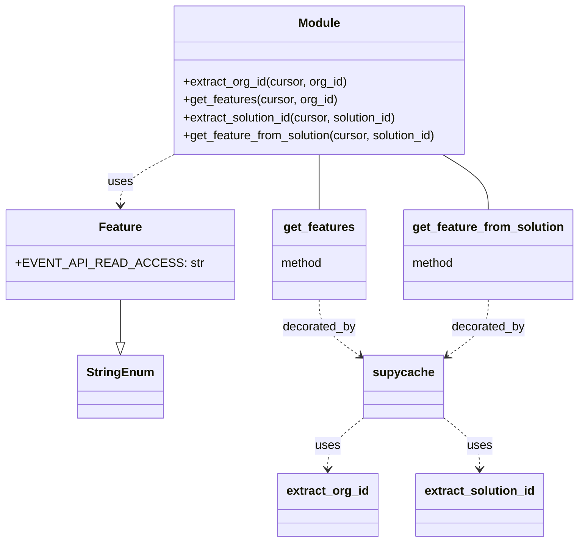
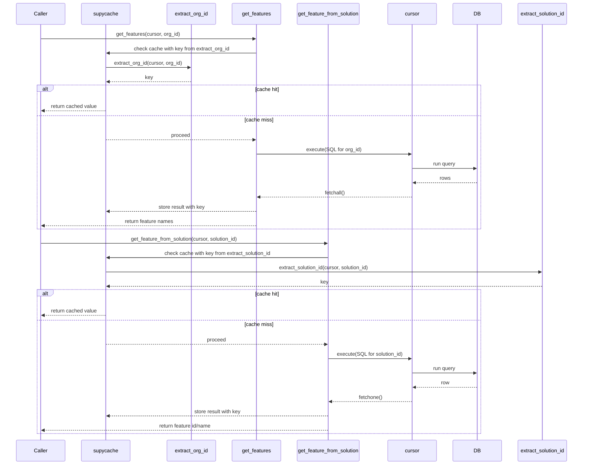

# Diagram: shipment_core/chromium_export/fv/python/fv/db/features.py

> Auto-generated by Obscura crawlers

## Diagram 1

### SVG

<svg id="container" width="730.703125" xmlns="http://www.w3.org/2000/svg" class="classDiagram" height="724" viewBox="0 0 730.703125 724" role="graphics-document document" aria-roledescription="class"><g><defs><marker id="container_class-aggregationStart" class="marker aggregation class" refX="18" refY="7" markerWidth="190" markerHeight="240" orient="auto"><path d="M 18,7 L9,13 L1,7 L9,1 Z"></path></marker></defs><defs><marker id="container_class-aggregationEnd" class="marker aggregation class" refX="1" refY="7" markerWidth="20" markerHeight="28" orient="auto"><path d="M 18,7 L9,13 L1,7 L9,1 Z"></path></marker></defs><defs><marker id="container_class-extensionStart" class="marker extension class" refX="18" refY="7" markerWidth="190" markerHeight="240" orient="auto"><path d="M 1,7 L18,13 V 1 Z"></path></marker></defs><defs><marker id="container_class-extensionEnd" class="marker extension class" refX="1" refY="7" markerWidth="20" markerHeight="28" orient="auto"><path d="M 1,1 V 13 L18,7 Z"></path></marker></defs><defs><marker id="container_class-compositionStart" class="marker composition class" refX="18" refY="7" markerWidth="190" markerHeight="240" orient="auto"><path d="M 18,7 L9,13 L1,7 L9,1 Z"></path></marker></defs><defs><marker id="container_class-compositionEnd" class="marker composition class" refX="1" refY="7" markerWidth="20" markerHeight="28" orient="auto"><path d="M 18,7 L9,13 L1,7 L9,1 Z"></path></marker></defs><defs><marker id="container_class-dependencyStart" class="marker dependency class" refX="6" refY="7" markerWidth="190" markerHeight="240" orient="auto"><path d="M 5,7 L9,13 L1,7 L9,1 Z"></path></marker></defs><defs><marker id="container_class-dependencyEnd" class="marker dependency class" refX="13" refY="7" markerWidth="20" markerHeight="28" orient="auto"><path d="M 18,7 L9,13 L14,7 L9,1 Z"></path></marker></defs><defs><marker id="container_class-lollipopStart" class="marker lollipop class" refX="13" refY="7" markerWidth="190" markerHeight="240" orient="auto"><circle stroke="black" fill="transparent" cx="7" cy="7" r="6"></circle></marker></defs><defs><marker id="container_class-lollipopEnd" class="marker lollipop class" refX="1" refY="7" markerWidth="190" markerHeight="240" orient="auto"><circle stroke="black" fill="transparent" cx="7" cy="7" r="6"></circle></marker></defs><g class="root"><g class="clusters"></g><g class="edgePaths"><path d="M142.391,400L142.391,406.167C142.391,412.333,142.391,424.667,142.391,434.125C142.391,443.583,142.391,450.167,142.391,453.458L142.391,456.75" id="id_Feature_StringEnum_1" class="edge-thickness-normal edge-pattern-solid relation" style=";;;" data-edge="true" data-et="edge" data-id="id_Feature_StringEnum_1" data-points="W3sieCI6MTQyLjM5MDYyNSwieSI6NDAwfSx7IngiOjE0Mi4zOTA2MjUsInkiOjQzN30seyJ4IjoxNDIuMzkwNjI1LCJ5Ijo0NzR9XQ==" marker-end="url(#container_class-extensionEnd)"></path><path d="M209.783,206L198.551,212.167C187.319,218.333,164.855,230.667,153.623,242C142.391,253.333,142.391,263.667,142.391,268.833L142.391,274" id="id_Module_Feature_2" class="edge-thickness-normal edge-pattern-dashed relation" style=";;;" data-edge="true" data-et="edge" data-id="id_Module_Feature_2" data-points="W3sieCI6MjA5Ljc4MjU3MTIzMTYxNzY1LCJ5IjoyMDZ9LHsieCI6MTQyLjM5MDYyNSwieSI6MjQzfSx7IngiOjE0Mi4zOTA2MjUsInkiOjI4MH1d" marker-end="url(#container_class-dependencyEnd)"></path><path d="M390.102,206L390.102,212.167C390.102,218.333,390.102,230.667,390.102,243C390.102,255.333,390.102,267.667,390.102,273.833L390.102,280" id="id_Module_get_features_3" class="edge-thickness-normal edge-pattern-solid relation" style=";;;" data-edge="true" data-et="edge" data-id="id_Module_get_features_3" data-points="W3sieCI6MzkwLjEwMTU2MjUsInkiOjIwNn0seyJ4IjozOTAuMTAxNTYyNSwieSI6MjQzfSx7IngiOjM5MC4xMDE1NjI1LCJ5IjoyODB9XQ=="></path><path d="M552.404,206L562.514,212.167C572.624,218.333,592.843,230.667,602.953,243C613.063,255.333,613.063,267.667,613.063,273.833L613.063,280" id="id_Module_get_feature_from_solution_4" class="edge-thickness-normal edge-pattern-solid relation" style=";;;" data-edge="true" data-et="edge" data-id="id_Module_get_feature_from_solution_4" data-points="W3sieCI6NTUyLjQwNDAwOTY1MDczNTQsInkiOjIwNn0seyJ4Ijo2MTMuMDYyNSwieSI6MjQzfSx7IngiOjYxMy4wNjI1LCJ5IjoyODB9XQ=="></path><path d="M390.102,400L390.102,406.167C390.102,412.333,390.102,424.667,399.493,437.489C408.885,450.311,427.669,463.622,437.06,470.277L446.452,476.933" id="id_get_features_supycache_5" class="edge-thickness-normal edge-pattern-dashed relation" style=";;;" data-edge="true" data-et="edge" data-id="id_get_features_supycache_5" data-points="W3sieCI6MzkwLjEwMTU2MjUsInkiOjQwMH0seyJ4IjozOTAuMTAxNTYyNSwieSI6NDM3fSx7IngiOjQ1MS4zNDc2NTYyNSwieSI6NDgwLjQwMTY5NTkyNDg3NDczfV0=" marker-end="url(#container_class-dependencyEnd)"></path><path d="M613.063,400L613.063,406.167C613.063,412.333,613.063,424.667,603.671,437.489C594.279,450.311,575.495,463.622,566.104,470.277L556.712,476.933" id="id_get_feature_from_solution_supycache_6" class="edge-thickness-normal edge-pattern-dashed relation" style=";;;" data-edge="true" data-et="edge" data-id="id_get_feature_from_solution_supycache_6" data-points="W3sieCI6NjEzLjA2MjUsInkiOjQwMH0seyJ4Ijo2MTMuMDYyNSwieSI6NDM3fSx7IngiOjU1MS44MTY0MDYyNSwieSI6NDgwLjQwMTY5NTkyNDg3NDczfV0=" marker-end="url(#container_class-dependencyEnd)"></path><path d="M451.348,555.999L443.184,562.499C435.021,568.999,418.694,582,410.531,593.667C402.367,605.333,402.367,615.667,402.367,620.833L402.367,626" id="id_supycache_extract_org_id_7" class="edge-thickness-normal edge-pattern-dashed relation" style=";;;" data-edge="true" data-et="edge" data-id="id_supycache_extract_org_id_7" data-points="W3sieCI6NDUxLjM0NzY1NjI1LCJ5Ijo1NTUuOTk5MjEyNTY3NDIzOX0seyJ4Ijo0MDIuMzY3MTg3NSwieSI6NTk1fSx7IngiOjQwMi4zNjcxODc1LCJ5Ijo2MzJ9XQ==" marker-end="url(#container_class-dependencyEnd)"></path><path d="M551.816,555.999L559.98,562.499C568.143,568.999,584.47,582,592.633,593.667C600.797,605.333,600.797,615.667,600.797,620.833L600.797,626" id="id_supycache_extract_solution_id_8" class="edge-thickness-normal edge-pattern-dashed relation" style=";;;" data-edge="true" data-et="edge" data-id="id_supycache_extract_solution_id_8" data-points="W3sieCI6NTUxLjgxNjQwNjI1LCJ5Ijo1NTUuOTk5MjEyNTY3NDIzOX0seyJ4Ijo2MDAuNzk2ODc1LCJ5Ijo1OTV9LHsieCI6NjAwLjc5Njg3NSwieSI6NjMyfV0=" marker-end="url(#container_class-dependencyEnd)"></path></g><g class="edgeLabels"><g class="edgeLabel"><g class="label" data-id="id_Feature_StringEnum_1" transform="translate(0, 0)"><foreignObject width="0" height="0">

</foreignObject></g></g><g class="edgeLabel" transform="translate(142.390625, 243)"><g class="label" data-id="id_Module_Feature_2" transform="translate(-16.4921875, -12)"><foreignObject width="32.984375" height="24">

uses

</foreignObject></g></g><g class="edgeLabel"><g class="label" data-id="id_Module_get_features_3" transform="translate(0, 0)"><foreignObject width="0" height="0">

</foreignObject></g></g><g class="edgeLabel"><g class="label" data-id="id_Module_get_feature_from_solution_4" transform="translate(0, 0)"><foreignObject width="0" height="0">

</foreignObject></g></g><g class="edgeLabel" transform="translate(390.1015625, 437)"><g class="label" data-id="id_get_features_supycache_5" transform="translate(-49.375, -12)"><foreignObject width="98.75" height="24">

decorated_by

</foreignObject></g></g><g class="edgeLabel" transform="translate(613.0625, 437)"><g class="label" data-id="id_get_feature_from_solution_supycache_6" transform="translate(-49.375, -12)"><foreignObject width="98.75" height="24">

decorated_by

</foreignObject></g></g><g class="edgeLabel" transform="translate(402.3671875, 595)"><g class="label" data-id="id_supycache_extract_org_id_7" transform="translate(-16.4921875, -12)"><foreignObject width="32.984375" height="24">

uses

</foreignObject></g></g><g class="edgeLabel" transform="translate(600.796875, 595)"><g class="label" data-id="id_supycache_extract_solution_id_8" transform="translate(-16.4921875, -12)"><foreignObject width="32.984375" height="24">

uses

</foreignObject></g></g></g><g class="nodes"><g class="node default" id="classId-Feature-0" transform="translate(142.390625, 340)"><g class="basic label-container"><path d="M-134.390625 -60 L134.390625 -60 L134.390625 60 L-134.390625 60" stroke="none" stroke-width="0" fill="#ECECFF" style=""></path><path d="M-134.390625 -60 C-54.7726530867143 -60, 24.8453188265714 -60, 134.390625 -60 M-134.390625 -60 C-59.99878028539473 -60, 14.39306442921054 -60, 134.390625 -60 M134.390625 -60 C134.390625 -23.943610194589816, 134.390625 12.112779610820368, 134.390625 60 M134.390625 -60 C134.390625 -26.36695659100249, 134.390625 7.266086817995017, 134.390625 60 M134.390625 60 C59.765563701545716 60, -14.859497596908568 60, -134.390625 60 M134.390625 60 C37.687185225059736 60, -59.01625454988053 60, -134.390625 60 M-134.390625 60 C-134.390625 27.812613211937688, -134.390625 -4.374773576124625, -134.390625 -60 M-134.390625 60 C-134.390625 29.90238750114808, -134.390625 -0.19522499770383916, -134.390625 -60" stroke="#9370DB" stroke-width="1.3" fill="none" stroke-dasharray="0 0" style=""></path></g><g class="annotation-group text" transform="translate(0, -36)"></g><g class="label-group text" transform="translate(-27.390625, -36)"><g class="label" style="font-weight: bolder" transform="translate(0,-12)"><foreignObject width="54.78125" height="24">

Feature

</foreignObject></g></g><g class="members-group text" transform="translate(-122.390625, 12)"><g class="label" style="" transform="translate(0,-12)"><foreignObject width="217.390625" height="24">

+EVENT_API_READ_ACCESS: str

</foreignObject></g></g><g class="methods-group text" transform="translate(-122.390625, 60)"></g><g class="divider" style=""><path d="M-134.390625 -12 C-33.861515498476024 -12, 66.66759400304795 -12, 134.390625 -12 M-134.390625 -12 C-29.424013160498234 -12, 75.54259867900353 -12, 134.390625 -12" stroke="#9370DB" stroke-width="1.3" fill="none" stroke-dasharray="0 0" style=""></path></g><g class="divider" style=""><path d="M-134.390625 36 C-34.419742873125884 36, 65.55113925374823 36, 134.390625 36 M-134.390625 36 C-34.17056621603828 36, 66.04949256792344 36, 134.390625 36" stroke="#9370DB" stroke-width="1.3" fill="none" stroke-dasharray="0 0" style=""></path></g></g><g class="node default" id="classId-StringEnum-1" transform="translate(142.390625, 516)"><g class="basic label-container"><path d="M-54.234375 -42 L54.234375 -42 L54.234375 42 L-54.234375 42" stroke="none" stroke-width="0" fill="#ECECFF" style=""></path><path d="M-54.234375 -42 C-21.786032384556712 -42, 10.662310230886575 -42, 54.234375 -42 M-54.234375 -42 C-14.884352352565266 -42, 24.46567029486947 -42, 54.234375 -42 M54.234375 -42 C54.234375 -14.689724665756238, 54.234375 12.620550668487525, 54.234375 42 M54.234375 -42 C54.234375 -12.063963719617487, 54.234375 17.872072560765027, 54.234375 42 M54.234375 42 C30.93916799414604 42, 7.643960988292079 42, -54.234375 42 M54.234375 42 C21.524366586781404 42, -11.185641826437191 42, -54.234375 42 M-54.234375 42 C-54.234375 10.555964267209848, -54.234375 -20.888071465580303, -54.234375 -42 M-54.234375 42 C-54.234375 11.41546066798957, -54.234375 -19.16907866402086, -54.234375 -42" stroke="#9370DB" stroke-width="1.3" fill="none" stroke-dasharray="0 0" style=""></path></g><g class="annotation-group text" transform="translate(0, -18)"></g><g class="label-group text" transform="translate(-42.234375, -18)"><g class="label" style="font-weight: bolder" transform="translate(0,-12)"><foreignObject width="84.46875" height="24">

StringEnum

</foreignObject></g></g><g class="members-group text" transform="translate(-42.234375, 30)"></g><g class="methods-group text" transform="translate(-42.234375, 60)"></g><g class="divider" style=""><path d="M-54.234375 6 C-21.128207533547716 6, 11.977959932904568 6, 54.234375 6 M-54.234375 6 C-27.818755674910783 6, -1.4031363498215654 6, 54.234375 6" stroke="#9370DB" stroke-width="1.3" fill="none" stroke-dasharray="0 0" style=""></path></g><g class="divider" style=""><path d="M-54.234375 24 C-26.332982963165882 24, 1.568409073668235 24, 54.234375 24 M-54.234375 24 C-17.12275932877811 24, 19.988856342443782 24, 54.234375 24" stroke="#9370DB" stroke-width="1.3" fill="none" stroke-dasharray="0 0" style=""></path></g></g><g class="node default" id="classId-Module-2" transform="translate(390.1015625, 107)"><g class="basic label-container"><path d="M-198.3359375 -99 L198.3359375 -99 L198.3359375 99 L-198.3359375 99" stroke="none" stroke-width="0" fill="#ECECFF" style=""></path><path d="M-198.3359375 -99 C-115.73514199081995 -99, -33.13434648163991 -99, 198.3359375 -99 M-198.3359375 -99 C-79.52138074953179 -99, 39.29317600093643 -99, 198.3359375 -99 M198.3359375 -99 C198.3359375 -33.434785439722944, 198.3359375 32.13042912055411, 198.3359375 99 M198.3359375 -99 C198.3359375 -48.17998476945837, 198.3359375 2.6400304610832563, 198.3359375 99 M198.3359375 99 C81.72917996045601 99, -34.87757757908798 99, -198.3359375 99 M198.3359375 99 C91.55113102789204 99, -15.233675444215919 99, -198.3359375 99 M-198.3359375 99 C-198.3359375 40.315485003333066, -198.3359375 -18.369029993333868, -198.3359375 -99 M-198.3359375 99 C-198.3359375 25.237692013700823, -198.3359375 -48.524615972598355, -198.3359375 -99" stroke="#9370DB" stroke-width="1.3" fill="none" stroke-dasharray="0 0" style=""></path></g><g class="annotation-group text" transform="translate(0, -75)"></g><g class="label-group text" transform="translate(-27.09375, -75)"><g class="label" style="font-weight: bolder" transform="translate(0,-12)"><foreignObject width="54.1875" height="24">

Module

</foreignObject></g></g><g class="members-group text" transform="translate(-186.3359375, -27)"></g><g class="methods-group text" transform="translate(-186.3359375, 3)"><g class="label" style="" transform="translate(0,-12)"><foreignObject width="220.875" height="24">

+extract_org_id(cursor, org_id)

</foreignObject></g><g class="label" style="" transform="translate(0,12)"><foreignObject width="206.953125" height="24">

+get_features(cursor, org_id)

</foreignObject></g><g class="label" style="" transform="translate(0,36)"><foreignObject width="293.515625" height="24">

+extract_solution_id(cursor, solution_id)

</foreignObject></g><g class="label" style="" transform="translate(0,60)"><foreignObject width="345.578125" height="24">

+get_feature_from_solution(cursor, solution_id)

</foreignObject></g></g><g class="divider" style=""><path d="M-198.3359375 -51 C-52.53757985800087 -51, 93.26077778399826 -51, 198.3359375 -51 M-198.3359375 -51 C-66.36928058161209 -51, 65.59737633677582 -51, 198.3359375 -51" stroke="#9370DB" stroke-width="1.3" fill="none" stroke-dasharray="0 0" style=""></path></g><g class="divider" style=""><path d="M-198.3359375 -27 C-48.492364644516385 -27, 101.35120821096723 -27, 198.3359375 -27 M-198.3359375 -27 C-56.22045280699956 -27, 85.89503188600088 -27, 198.3359375 -27" stroke="#9370DB" stroke-width="1.3" fill="none" stroke-dasharray="0 0" style=""></path></g></g><g class="node default" id="classId-supycache-3" transform="translate(501.58203125, 516)"><g class="basic label-container"><path d="M-50.234375 -42 L50.234375 -42 L50.234375 42 L-50.234375 42" stroke="none" stroke-width="0" fill="#ECECFF" style=""></path><path d="M-50.234375 -42 C-23.09374791577416 -42, 4.046879168451682 -42, 50.234375 -42 M-50.234375 -42 C-26.270913841023372 -42, -2.307452682046744 -42, 50.234375 -42 M50.234375 -42 C50.234375 -24.689888914694723, 50.234375 -7.379777829389447, 50.234375 42 M50.234375 -42 C50.234375 -9.726750534733071, 50.234375 22.546498930533858, 50.234375 42 M50.234375 42 C11.426159267164515 42, -27.38205646567097 42, -50.234375 42 M50.234375 42 C19.25926697327394 42, -11.715841053452117 42, -50.234375 42 M-50.234375 42 C-50.234375 10.018903433513508, -50.234375 -21.962193132972985, -50.234375 -42 M-50.234375 42 C-50.234375 17.40817182559166, -50.234375 -7.183656348816683, -50.234375 -42" stroke="#9370DB" stroke-width="1.3" fill="none" stroke-dasharray="0 0" style=""></path></g><g class="annotation-group text" transform="translate(0, -18)"></g><g class="label-group text" transform="translate(-38.234375, -18)"><g class="label" style="font-weight: bolder" transform="translate(0,-12)"><foreignObject width="76.46875" height="24">

supycache

</foreignObject></g></g><g class="members-group text" transform="translate(-38.234375, 30)"></g><g class="methods-group text" transform="translate(-38.234375, 60)"></g><g class="divider" style=""><path d="M-50.234375 6 C-22.184986665630582 6, 5.864401668738836 6, 50.234375 6 M-50.234375 6 C-22.791144616278515 6, 4.652085767442969 6, 50.234375 6" stroke="#9370DB" stroke-width="1.3" fill="none" stroke-dasharray="0 0" style=""></path></g><g class="divider" style=""><path d="M-50.234375 24 C-13.996655249281723 24, 22.241064501436554 24, 50.234375 24 M-50.234375 24 C-27.565385248003363 24, -4.8963954960067255 24, 50.234375 24" stroke="#9370DB" stroke-width="1.3" fill="none" stroke-dasharray="0 0" style=""></path></g></g><g class="node default" id="classId-get_features-4" transform="translate(390.1015625, 340)"><g class="basic label-container"><path d="M-63.3203125 -60 L63.3203125 -60 L63.3203125 60 L-63.3203125 60" stroke="none" stroke-width="0" fill="#ECECFF" style=""></path><path d="M-63.3203125 -60 C-20.34412240177769 -60, 22.632067696444622 -60, 63.3203125 -60 M-63.3203125 -60 C-34.43460666408893 -60, -5.548900828177871 -60, 63.3203125 -60 M63.3203125 -60 C63.3203125 -27.540241376547243, 63.3203125 4.919517246905514, 63.3203125 60 M63.3203125 -60 C63.3203125 -22.08392222922606, 63.3203125 15.832155541547877, 63.3203125 60 M63.3203125 60 C20.567903612333048 60, -22.184505275333905 60, -63.3203125 60 M63.3203125 60 C28.896819174486943 60, -5.526674151026114 60, -63.3203125 60 M-63.3203125 60 C-63.3203125 30.058524307321484, -63.3203125 0.11704861464296812, -63.3203125 -60 M-63.3203125 60 C-63.3203125 29.558289759057125, -63.3203125 -0.8834204818857501, -63.3203125 -60" stroke="#9370DB" stroke-width="1.3" fill="none" stroke-dasharray="0 0" style=""></path></g><g class="annotation-group text" transform="translate(0, -36)"></g><g class="label-group text" transform="translate(-46.140625, -36)"><g class="label" style="font-weight: bolder" transform="translate(0,-12)"><foreignObject width="92.28125" height="24">

get_features

</foreignObject></g></g><g class="members-group text" transform="translate(-51.3203125, 12)"><g class="label" style="" transform="translate(0,-12)"><foreignObject width="56.5" height="24">

method

</foreignObject></g></g><g class="methods-group text" transform="translate(-51.3203125, 60)"></g><g class="divider" style=""><path d="M-63.3203125 -12 C-25.86517352086119 -12, 11.589965458277618 -12, 63.3203125 -12 M-63.3203125 -12 C-35.939888646469555 -12, -8.559464792939117 -12, 63.3203125 -12" stroke="#9370DB" stroke-width="1.3" fill="none" stroke-dasharray="0 0" style=""></path></g><g class="divider" style=""><path d="M-63.3203125 36 C-37.16134906246079 36, -11.002385624921587 36, 63.3203125 36 M-63.3203125 36 C-22.432527630248742 36, 18.455257239502515 36, 63.3203125 36" stroke="#9370DB" stroke-width="1.3" fill="none" stroke-dasharray="0 0" style=""></path></g></g><g class="node default" id="classId-get_feature_from_solution-5" transform="translate(613.0625, 340)"><g class="basic label-container"><path d="M-109.640625 -60 L109.640625 -60 L109.640625 60 L-109.640625 60" stroke="none" stroke-width="0" fill="#ECECFF" style=""></path><path d="M-109.640625 -60 C-26.734248282279097 -60, 56.172128435441806 -60, 109.640625 -60 M-109.640625 -60 C-41.844739196600955 -60, 25.95114660679809 -60, 109.640625 -60 M109.640625 -60 C109.640625 -22.011201070882272, 109.640625 15.977597858235455, 109.640625 60 M109.640625 -60 C109.640625 -35.087547256821146, 109.640625 -10.175094513642293, 109.640625 60 M109.640625 60 C30.30436775364447 60, -49.03188949271106 60, -109.640625 60 M109.640625 60 C60.52544697932754 60, 11.410268958655081 60, -109.640625 60 M-109.640625 60 C-109.640625 32.15229560312736, -109.640625 4.30459120625472, -109.640625 -60 M-109.640625 60 C-109.640625 32.12002112404105, -109.640625 4.240042248082105, -109.640625 -60" stroke="#9370DB" stroke-width="1.3" fill="none" stroke-dasharray="0 0" style=""></path></g><g class="annotation-group text" transform="translate(0, -36)"></g><g class="label-group text" transform="translate(-97.640625, -36)"><g class="label" style="font-weight: bolder" transform="translate(0,-12)"><foreignObject width="195.28125" height="24">

get_feature_from_solution

</foreignObject></g></g><g class="members-group text" transform="translate(-97.640625, 12)"><g class="label" style="" transform="translate(0,-12)"><foreignObject width="56.5" height="24">

method

</foreignObject></g></g><g class="methods-group text" transform="translate(-97.640625, 60)"></g><g class="divider" style=""><path d="M-109.640625 -12 C-28.47802198134191 -12, 52.68458103731618 -12, 109.640625 -12 M-109.640625 -12 C-29.73922041186681 -12, 50.16218417626638 -12, 109.640625 -12" stroke="#9370DB" stroke-width="1.3" fill="none" stroke-dasharray="0 0" style=""></path></g><g class="divider" style=""><path d="M-109.640625 36 C-48.071041694774465 36, 13.49854161045107 36, 109.640625 36 M-109.640625 36 C-65.20377757334424 36, -20.766930146688466 36, 109.640625 36" stroke="#9370DB" stroke-width="1.3" fill="none" stroke-dasharray="0 0" style=""></path></g></g><g class="node default" id="classId-extract_org_id-6" transform="translate(402.3671875, 674)"><g class="basic label-container"><path d="M-65.203125 -42 L65.203125 -42 L65.203125 42 L-65.203125 42" stroke="none" stroke-width="0" fill="#ECECFF" style=""></path><path d="M-65.203125 -42 C-37.367295639889036 -42, -9.531466279778066 -42, 65.203125 -42 M-65.203125 -42 C-15.93309045518432 -42, 33.33694408963136 -42, 65.203125 -42 M65.203125 -42 C65.203125 -23.42386649213249, 65.203125 -4.8477329842649795, 65.203125 42 M65.203125 -42 C65.203125 -23.42065925115299, 65.203125 -4.841318502305981, 65.203125 42 M65.203125 42 C36.18342900825566 42, 7.163733016511323 42, -65.203125 42 M65.203125 42 C23.90440644441947 42, -17.394312111161057 42, -65.203125 42 M-65.203125 42 C-65.203125 10.15595099179001, -65.203125 -21.68809801641998, -65.203125 -42 M-65.203125 42 C-65.203125 11.76371487141287, -65.203125 -18.47257025717426, -65.203125 -42" stroke="#9370DB" stroke-width="1.3" fill="none" stroke-dasharray="0 0" style=""></path></g><g class="annotation-group text" transform="translate(0, -18)"></g><g class="label-group text" transform="translate(-53.203125, -18)"><g class="label" style="font-weight: bolder" transform="translate(0,-12)"><foreignObject width="106.40625" height="24">

extract_org_id

</foreignObject></g></g><g class="members-group text" transform="translate(-53.203125, 30)"></g><g class="methods-group text" transform="translate(-53.203125, 60)"></g><g class="divider" style=""><path d="M-65.203125 6 C-38.78871894715655 6, -12.374312894313114 6, 65.203125 6 M-65.203125 6 C-17.84172046436008 6, 29.51968407127984 6, 65.203125 6" stroke="#9370DB" stroke-width="1.3" fill="none" stroke-dasharray="0 0" style=""></path></g><g class="divider" style=""><path d="M-65.203125 24 C-17.410646611477212 24, 30.381831777045576 24, 65.203125 24 M-65.203125 24 C-20.378734282193584 24, 24.445656435612833 24, 65.203125 24" stroke="#9370DB" stroke-width="1.3" fill="none" stroke-dasharray="0 0" style=""></path></g></g><g class="node default" id="classId-extract_solution_id-7" transform="translate(600.796875, 674)"><g class="basic label-container"><path d="M-83.2265625 -42 L83.2265625 -42 L83.2265625 42 L-83.2265625 42" stroke="none" stroke-width="0" fill="#ECECFF" style=""></path><path d="M-83.2265625 -42 C-47.82987980036211 -42, -12.433197100724215 -42, 83.2265625 -42 M-83.2265625 -42 C-47.45114148680864 -42, -11.675720473617275 -42, 83.2265625 -42 M83.2265625 -42 C83.2265625 -14.050716674999453, 83.2265625 13.898566650001094, 83.2265625 42 M83.2265625 -42 C83.2265625 -20.71595577460581, 83.2265625 0.5680884507883803, 83.2265625 42 M83.2265625 42 C25.95661698788564 42, -31.313328524228723 42, -83.2265625 42 M83.2265625 42 C35.78685109551406 42, -11.652860308971881 42, -83.2265625 42 M-83.2265625 42 C-83.2265625 14.169249626657496, -83.2265625 -13.661500746685007, -83.2265625 -42 M-83.2265625 42 C-83.2265625 9.03445908568272, -83.2265625 -23.93108182863456, -83.2265625 -42" stroke="#9370DB" stroke-width="1.3" fill="none" stroke-dasharray="0 0" style=""></path></g><g class="annotation-group text" transform="translate(0, -18)"></g><g class="label-group text" transform="translate(-71.2265625, -18)"><g class="label" style="font-weight: bolder" transform="translate(0,-12)"><foreignObject width="142.453125" height="24">

extract_solution_id

</foreignObject></g></g><g class="members-group text" transform="translate(-71.2265625, 30)"></g><g class="methods-group text" transform="translate(-71.2265625, 60)"></g><g class="divider" style=""><path d="M-83.2265625 6 C-27.292300955863467 6, 28.641960588273065 6, 83.2265625 6 M-83.2265625 6 C-38.404823737968 6, 6.4169150240639965 6, 83.2265625 6" stroke="#9370DB" stroke-width="1.3" fill="none" stroke-dasharray="0 0" style=""></path></g><g class="divider" style=""><path d="M-83.2265625 24 C-30.558622585299517 24, 22.109317329400966 24, 83.2265625 24 M-83.2265625 24 C-43.26708734666731 24, -3.30761219333462 24, 83.2265625 24" stroke="#9370DB" stroke-width="1.3" fill="none" stroke-dasharray="0 0" style=""></path></g></g></g></g></g></svg>

## Diagram 2

### SVG

<svg id="container" width="1864" xmlns="http://www.w3.org/2000/svg" height="1523" viewBox="-50 -10 1864 1523" role="graphics-document document" aria-roledescription="sequence"><g><rect x="1604" y="1437" fill="#eaeaea" stroke="#666" width="160" height="65" name="extract_solution_id" rx="3" ry="3" class="actor actor-bottom"></rect><text x="1684" y="1469.5" dominant-baseline="central" alignment-baseline="central" class="actor actor-box" style="text-anchor: middle; font-size: 16px; font-weight: 400;"><tspan x="1684" dy="0">extract_solution_id</tspan></text></g><g><rect x="1404" y="1437" fill="#eaeaea" stroke="#666" width="150" height="65" name="DB" rx="3" ry="3" class="actor actor-bottom"></rect><text x="1479" y="1469.5" dominant-baseline="central" alignment-baseline="central" class="actor actor-box" style="text-anchor: middle; font-size: 16px; font-weight: 400;"><tspan x="1479" dy="0">DB</tspan></text></g><g><rect x="1204" y="1437" fill="#eaeaea" stroke="#666" width="150" height="65" name="cursor" rx="3" ry="3" class="actor actor-bottom"></rect><text x="1279" y="1469.5" dominant-baseline="central" alignment-baseline="central" class="actor actor-box" style="text-anchor: middle; font-size: 16px; font-weight: 400;"><tspan x="1279" dy="0">cursor</tspan></text></g><g><rect x="897" y="1437" fill="#eaeaea" stroke="#666" width="212" height="65" name="get_feature_from_solution" rx="3" ry="3" class="actor actor-bottom"></rect><text x="1003" y="1469.5" dominant-baseline="central" alignment-baseline="central" class="actor actor-box" style="text-anchor: middle; font-size: 16px; font-weight: 400;"><tspan x="1003" dy="0">get_feature_from_solution</tspan></text></g><g><rect x="697" y="1437" fill="#eaeaea" stroke="#666" width="150" height="65" name="get_features" rx="3" ry="3" class="actor actor-bottom"></rect><text x="772" y="1469.5" dominant-baseline="central" alignment-baseline="central" class="actor actor-box" style="text-anchor: middle; font-size: 16px; font-weight: 400;"><tspan x="772" dy="0">get_features</tspan></text></g><g><rect x="497" y="1437" fill="#eaeaea" stroke="#666" width="150" height="65" name="extract_org_id" rx="3" ry="3" class="actor actor-bottom"></rect><text x="572" y="1469.5" dominant-baseline="central" alignment-baseline="central" class="actor actor-box" style="text-anchor: middle; font-size: 16px; font-weight: 400;"><tspan x="572" dy="0">extract_org_id</tspan></text></g><g><rect x="214" y="1437" fill="#eaeaea" stroke="#666" width="150" height="65" name="supycache" rx="3" ry="3" class="actor actor-bottom"></rect><text x="289" y="1469.5" dominant-baseline="central" alignment-baseline="central" class="actor actor-box" style="text-anchor: middle; font-size: 16px; font-weight: 400;"><tspan x="289" dy="0">supycache</tspan></text></g><g><rect x="0" y="1437" fill="#eaeaea" stroke="#666" width="150" height="65" name="Caller" rx="3" ry="3" class="actor actor-bottom"></rect><text x="75" y="1469.5" dominant-baseline="central" alignment-baseline="central" class="actor actor-box" style="text-anchor: middle; font-size: 16px; font-weight: 400;"><tspan x="75" dy="0">Caller</tspan></text></g><g><line id="actor7" x1="1684" y1="65" x2="1684" y2="1437" class="actor-line 200" stroke-width="0.5px" stroke="#999" name="extract_solution_id"></line><g id="root-7"><rect x="1604" y="0" fill="#eaeaea" stroke="#666" width="160" height="65" name="extract_solution_id" rx="3" ry="3" class="actor actor-top"></rect><text x="1684" y="32.5" dominant-baseline="central" alignment-baseline="central" class="actor actor-box" style="text-anchor: middle; font-size: 16px; font-weight: 400;"><tspan x="1684" dy="0">extract_solution_id</tspan></text></g></g><g><line id="actor6" x1="1479" y1="65" x2="1479" y2="1437" class="actor-line 200" stroke-width="0.5px" stroke="#999" name="DB"></line><g id="root-6"><rect x="1404" y="0" fill="#eaeaea" stroke="#666" width="150" height="65" name="DB" rx="3" ry="3" class="actor actor-top"></rect><text x="1479" y="32.5" dominant-baseline="central" alignment-baseline="central" class="actor actor-box" style="text-anchor: middle; font-size: 16px; font-weight: 400;"><tspan x="1479" dy="0">DB</tspan></text></g></g><g><line id="actor5" x1="1279" y1="65" x2="1279" y2="1437" class="actor-line 200" stroke-width="0.5px" stroke="#999" name="cursor"></line><g id="root-5"><rect x="1204" y="0" fill="#eaeaea" stroke="#666" width="150" height="65" name="cursor" rx="3" ry="3" class="actor actor-top"></rect><text x="1279" y="32.5" dominant-baseline="central" alignment-baseline="central" class="actor actor-box" style="text-anchor: middle; font-size: 16px; font-weight: 400;"><tspan x="1279" dy="0">cursor</tspan></text></g></g><g><line id="actor4" x1="1003" y1="65" x2="1003" y2="1437" class="actor-line 200" stroke-width="0.5px" stroke="#999" name="get_feature_from_solution"></line><g id="root-4"><rect x="897" y="0" fill="#eaeaea" stroke="#666" width="212" height="65" name="get_feature_from_solution" rx="3" ry="3" class="actor actor-top"></rect><text x="1003" y="32.5" dominant-baseline="central" alignment-baseline="central" class="actor actor-box" style="text-anchor: middle; font-size: 16px; font-weight: 400;"><tspan x="1003" dy="0">get_feature_from_solution</tspan></text></g></g><g><line id="actor3" x1="772" y1="65" x2="772" y2="1437" class="actor-line 200" stroke-width="0.5px" stroke="#999" name="get_features"></line><g id="root-3"><rect x="697" y="0" fill="#eaeaea" stroke="#666" width="150" height="65" name="get_features" rx="3" ry="3" class="actor actor-top"></rect><text x="772" y="32.5" dominant-baseline="central" alignment-baseline="central" class="actor actor-box" style="text-anchor: middle; font-size: 16px; font-weight: 400;"><tspan x="772" dy="0">get_features</tspan></text></g></g><g><line id="actor2" x1="572" y1="65" x2="572" y2="1437" class="actor-line 200" stroke-width="0.5px" stroke="#999" name="extract_org_id"></line><g id="root-2"><rect x="497" y="0" fill="#eaeaea" stroke="#666" width="150" height="65" name="extract_org_id" rx="3" ry="3" class="actor actor-top"></rect><text x="572" y="32.5" dominant-baseline="central" alignment-baseline="central" class="actor actor-box" style="text-anchor: middle; font-size: 16px; font-weight: 400;"><tspan x="572" dy="0">extract_org_id</tspan></text></g></g><g><line id="actor1" x1="289" y1="65" x2="289" y2="1437" class="actor-line 200" stroke-width="0.5px" stroke="#999" name="supycache"></line><g id="root-1"><rect x="214" y="0" fill="#eaeaea" stroke="#666" width="150" height="65" name="supycache" rx="3" ry="3" class="actor actor-top"></rect><text x="289" y="32.5" dominant-baseline="central" alignment-baseline="central" class="actor actor-box" style="text-anchor: middle; font-size: 16px; font-weight: 400;"><tspan x="289" dy="0">supycache</tspan></text></g></g><g><line id="actor0" x1="75" y1="65" x2="75" y2="1437" class="actor-line 200" stroke-width="0.5px" stroke="#999" name="Caller"></line><g id="root-0"><rect x="0" y="0" fill="#eaeaea" stroke="#666" width="150" height="65" name="Caller" rx="3" ry="3" class="actor actor-top"></rect><text x="75" y="32.5" dominant-baseline="central" alignment-baseline="central" class="actor actor-box" style="text-anchor: middle; font-size: 16px; font-weight: 400;"><tspan x="75" dy="0">Caller</tspan></text></g></g><g></g><defs><symbol id="computer" width="24" height="24"><path transform="scale(.5)" d="M2 2v13h20v-13h-20zm18 11h-16v-9h16v9zm-10.228 6l.466-1h3.524l.467 1h-4.457zm14.228 3h-24l2-6h2.104l-1.33 4h18.45l-1.297-4h2.073l2 6zm-5-10h-14v-7h14v7z"></path></symbol></defs><defs><symbol id="database" fill-rule="evenodd" clip-rule="evenodd"><path transform="scale(.5)" d="M12.258.001l.256.004.255.005.253.008.251.01.249.012.247.015.246.016.242.019.241.02.239.023.236.024.233.027.231.028.229.031.225.032.223.034.22.036.217.038.214.04.211.041.208.043.205.045.201.046.198.048.194.05.191.051.187.053.183.054.18.056.175.057.172.059.168.06.163.061.16.063.155.064.15.066.074.033.073.033.071.034.07.034.069.035.068.035.067.035.066.035.064.036.064.036.062.036.06.036.06.037.058.037.058.037.055.038.055.038.053.038.052.038.051.039.05.039.048.039.047.039.045.04.044.04.043.04.041.04.04.041.039.041.037.041.036.041.034.041.033.042.032.042.03.042.029.042.027.042.026.043.024.043.023.043.021.043.02.043.018.044.017.043.015.044.013.044.012.044.011.045.009.044.007.045.006.045.004.045.002.045.001.045v17l-.001.045-.002.045-.004.045-.006.045-.007.045-.009.044-.011.045-.012.044-.013.044-.015.044-.017.043-.018.044-.02.043-.021.043-.023.043-.024.043-.026.043-.027.042-.029.042-.03.042-.032.042-.033.042-.034.041-.036.041-.037.041-.039.041-.04.041-.041.04-.043.04-.044.04-.045.04-.047.039-.048.039-.05.039-.051.039-.052.038-.053.038-.055.038-.055.038-.058.037-.058.037-.06.037-.06.036-.062.036-.064.036-.064.036-.066.035-.067.035-.068.035-.069.035-.07.034-.071.034-.073.033-.074.033-.15.066-.155.064-.16.063-.163.061-.168.06-.172.059-.175.057-.18.056-.183.054-.187.053-.191.051-.194.05-.198.048-.201.046-.205.045-.208.043-.211.041-.214.04-.217.038-.22.036-.223.034-.225.032-.229.031-.231.028-.233.027-.236.024-.239.023-.241.02-.242.019-.246.016-.247.015-.249.012-.251.01-.253.008-.255.005-.256.004-.258.001-.258-.001-.256-.004-.255-.005-.253-.008-.251-.01-.249-.012-.247-.015-.245-.016-.243-.019-.241-.02-.238-.023-.236-.024-.234-.027-.231-.028-.228-.031-.226-.032-.223-.034-.22-.036-.217-.038-.214-.04-.211-.041-.208-.043-.204-.045-.201-.046-.198-.048-.195-.05-.19-.051-.187-.053-.184-.054-.179-.056-.176-.057-.172-.059-.167-.06-.164-.061-.159-.063-.155-.064-.151-.066-.074-.033-.072-.033-.072-.034-.07-.034-.069-.035-.068-.035-.067-.035-.066-.035-.064-.036-.063-.036-.062-.036-.061-.036-.06-.037-.058-.037-.057-.037-.056-.038-.055-.038-.053-.038-.052-.038-.051-.039-.049-.039-.049-.039-.046-.039-.046-.04-.044-.04-.043-.04-.041-.04-.04-.041-.039-.041-.037-.041-.036-.041-.034-.041-.033-.042-.032-.042-.03-.042-.029-.042-.027-.042-.026-.043-.024-.043-.023-.043-.021-.043-.02-.043-.018-.044-.017-.043-.015-.044-.013-.044-.012-.044-.011-.045-.009-.044-.007-.045-.006-.045-.004-.045-.002-.045-.001-.045v-17l.001-.045.002-.045.004-.045.006-.045.007-.045.009-.044.011-.045.012-.044.013-.044.015-.044.017-.043.018-.044.02-.043.021-.043.023-.043.024-.043.026-.043.027-.042.029-.042.03-.042.032-.042.033-.042.034-.041.036-.041.037-.041.039-.041.04-.041.041-.04.043-.04.044-.04.046-.04.046-.039.049-.039.049-.039.051-.039.052-.038.053-.038.055-.038.056-.038.057-.037.058-.037.06-.037.061-.036.062-.036.063-.036.064-.036.066-.035.067-.035.068-.035.069-.035.07-.034.072-.034.072-.033.074-.033.151-.066.155-.064.159-.063.164-.061.167-.06.172-.059.176-.057.179-.056.184-.054.187-.053.19-.051.195-.05.198-.048.201-.046.204-.045.208-.043.211-.041.214-.04.217-.038.22-.036.223-.034.226-.032.228-.031.231-.028.234-.027.236-.024.238-.023.241-.02.243-.019.245-.016.247-.015.249-.012.251-.01.253-.008.255-.005.256-.004.258-.001.258.001zm-9.258 20.499v.01l.001.021.003.021.004.022.005.021.006.022.007.022.009.023.01.022.011.023.012.023.013.023.015.023.016.024.017.023.018.024.019.024.021.024.022.025.023.024.024.025.052.049.056.05.061.051.066.051.07.051.075.051.079.052.084.052.088.052.092.052.097.052.102.051.105.052.11.052.114.051.119.051.123.051.127.05.131.05.135.05.139.048.144.049.147.047.152.047.155.047.16.045.163.045.167.043.171.043.176.041.178.041.183.039.187.039.19.037.194.035.197.035.202.033.204.031.209.03.212.029.216.027.219.025.222.024.226.021.23.02.233.018.236.016.24.015.243.012.246.01.249.008.253.005.256.004.259.001.26-.001.257-.004.254-.005.25-.008.247-.011.244-.012.241-.014.237-.016.233-.018.231-.021.226-.021.224-.024.22-.026.216-.027.212-.028.21-.031.205-.031.202-.034.198-.034.194-.036.191-.037.187-.039.183-.04.179-.04.175-.042.172-.043.168-.044.163-.045.16-.046.155-.046.152-.047.148-.048.143-.049.139-.049.136-.05.131-.05.126-.05.123-.051.118-.052.114-.051.11-.052.106-.052.101-.052.096-.052.092-.052.088-.053.083-.051.079-.052.074-.052.07-.051.065-.051.06-.051.056-.05.051-.05.023-.024.023-.025.021-.024.02-.024.019-.024.018-.024.017-.024.015-.023.014-.024.013-.023.012-.023.01-.023.01-.022.008-.022.006-.022.006-.022.004-.022.004-.021.001-.021.001-.021v-4.127l-.077.055-.08.053-.083.054-.085.053-.087.052-.09.052-.093.051-.095.05-.097.05-.1.049-.102.049-.105.048-.106.047-.109.047-.111.046-.114.045-.115.045-.118.044-.12.043-.122.042-.124.042-.126.041-.128.04-.13.04-.132.038-.134.038-.135.037-.138.037-.139.035-.142.035-.143.034-.144.033-.147.032-.148.031-.15.03-.151.03-.153.029-.154.027-.156.027-.158.026-.159.025-.161.024-.162.023-.163.022-.165.021-.166.02-.167.019-.169.018-.169.017-.171.016-.173.015-.173.014-.175.013-.175.012-.177.011-.178.01-.179.008-.179.008-.181.006-.182.005-.182.004-.184.003-.184.002h-.37l-.184-.002-.184-.003-.182-.004-.182-.005-.181-.006-.179-.008-.179-.008-.178-.01-.176-.011-.176-.012-.175-.013-.173-.014-.172-.015-.171-.016-.17-.017-.169-.018-.167-.019-.166-.02-.165-.021-.163-.022-.162-.023-.161-.024-.159-.025-.157-.026-.156-.027-.155-.027-.153-.029-.151-.03-.15-.03-.148-.031-.146-.032-.145-.033-.143-.034-.141-.035-.14-.035-.137-.037-.136-.037-.134-.038-.132-.038-.13-.04-.128-.04-.126-.041-.124-.042-.122-.042-.12-.044-.117-.043-.116-.045-.113-.045-.112-.046-.109-.047-.106-.047-.105-.048-.102-.049-.1-.049-.097-.05-.095-.05-.093-.052-.09-.051-.087-.052-.085-.053-.083-.054-.08-.054-.077-.054v4.127zm0-5.654v.011l.001.021.003.021.004.021.005.022.006.022.007.022.009.022.01.022.011.023.012.023.013.023.015.024.016.023.017.024.018.024.019.024.021.024.022.024.023.025.024.024.052.05.056.05.061.05.066.051.07.051.075.052.079.051.084.052.088.052.092.052.097.052.102.052.105.052.11.051.114.051.119.052.123.05.127.051.131.05.135.049.139.049.144.048.147.048.152.047.155.046.16.045.163.045.167.044.171.042.176.042.178.04.183.04.187.038.19.037.194.036.197.034.202.033.204.032.209.03.212.028.216.027.219.025.222.024.226.022.23.02.233.018.236.016.24.014.243.012.246.01.249.008.253.006.256.003.259.001.26-.001.257-.003.254-.006.25-.008.247-.01.244-.012.241-.015.237-.016.233-.018.231-.02.226-.022.224-.024.22-.025.216-.027.212-.029.21-.03.205-.032.202-.033.198-.035.194-.036.191-.037.187-.039.183-.039.179-.041.175-.042.172-.043.168-.044.163-.045.16-.045.155-.047.152-.047.148-.048.143-.048.139-.05.136-.049.131-.05.126-.051.123-.051.118-.051.114-.052.11-.052.106-.052.101-.052.096-.052.092-.052.088-.052.083-.052.079-.052.074-.051.07-.052.065-.051.06-.05.056-.051.051-.049.023-.025.023-.024.021-.025.02-.024.019-.024.018-.024.017-.024.015-.023.014-.023.013-.024.012-.022.01-.023.01-.023.008-.022.006-.022.006-.022.004-.021.004-.022.001-.021.001-.021v-4.139l-.077.054-.08.054-.083.054-.085.052-.087.053-.09.051-.093.051-.095.051-.097.05-.1.049-.102.049-.105.048-.106.047-.109.047-.111.046-.114.045-.115.044-.118.044-.12.044-.122.042-.124.042-.126.041-.128.04-.13.039-.132.039-.134.038-.135.037-.138.036-.139.036-.142.035-.143.033-.144.033-.147.033-.148.031-.15.03-.151.03-.153.028-.154.028-.156.027-.158.026-.159.025-.161.024-.162.023-.163.022-.165.021-.166.02-.167.019-.169.018-.169.017-.171.016-.173.015-.173.014-.175.013-.175.012-.177.011-.178.009-.179.009-.179.007-.181.007-.182.005-.182.004-.184.003-.184.002h-.37l-.184-.002-.184-.003-.182-.004-.182-.005-.181-.007-.179-.007-.179-.009-.178-.009-.176-.011-.176-.012-.175-.013-.173-.014-.172-.015-.171-.016-.17-.017-.169-.018-.167-.019-.166-.02-.165-.021-.163-.022-.162-.023-.161-.024-.159-.025-.157-.026-.156-.027-.155-.028-.153-.028-.151-.03-.15-.03-.148-.031-.146-.033-.145-.033-.143-.033-.141-.035-.14-.036-.137-.036-.136-.037-.134-.038-.132-.039-.13-.039-.128-.04-.126-.041-.124-.042-.122-.043-.12-.043-.117-.044-.116-.044-.113-.046-.112-.046-.109-.046-.106-.047-.105-.048-.102-.049-.1-.049-.097-.05-.095-.051-.093-.051-.09-.051-.087-.053-.085-.052-.083-.054-.08-.054-.077-.054v4.139zm0-5.666v.011l.001.02.003.022.004.021.005.022.006.021.007.022.009.023.01.022.011.023.012.023.013.023.015.023.016.024.017.024.018.023.019.024.021.025.022.024.023.024.024.025.052.05.056.05.061.05.066.051.07.051.075.052.079.051.084.052.088.052.092.052.097.052.102.052.105.051.11.052.114.051.119.051.123.051.127.05.131.05.135.05.139.049.144.048.147.048.152.047.155.046.16.045.163.045.167.043.171.043.176.042.178.04.183.04.187.038.19.037.194.036.197.034.202.033.204.032.209.03.212.028.216.027.219.025.222.024.226.021.23.02.233.018.236.017.24.014.243.012.246.01.249.008.253.006.256.003.259.001.26-.001.257-.003.254-.006.25-.008.247-.01.244-.013.241-.014.237-.016.233-.018.231-.02.226-.022.224-.024.22-.025.216-.027.212-.029.21-.03.205-.032.202-.033.198-.035.194-.036.191-.037.187-.039.183-.039.179-.041.175-.042.172-.043.168-.044.163-.045.16-.045.155-.047.152-.047.148-.048.143-.049.139-.049.136-.049.131-.051.126-.05.123-.051.118-.052.114-.051.11-.052.106-.052.101-.052.096-.052.092-.052.088-.052.083-.052.079-.052.074-.052.07-.051.065-.051.06-.051.056-.05.051-.049.023-.025.023-.025.021-.024.02-.024.019-.024.018-.024.017-.024.015-.023.014-.024.013-.023.012-.023.01-.022.01-.023.008-.022.006-.022.006-.022.004-.022.004-.021.001-.021.001-.021v-4.153l-.077.054-.08.054-.083.053-.085.053-.087.053-.09.051-.093.051-.095.051-.097.05-.1.049-.102.048-.105.048-.106.048-.109.046-.111.046-.114.046-.115.044-.118.044-.12.043-.122.043-.124.042-.126.041-.128.04-.13.039-.132.039-.134.038-.135.037-.138.036-.139.036-.142.034-.143.034-.144.033-.147.032-.148.032-.15.03-.151.03-.153.028-.154.028-.156.027-.158.026-.159.024-.161.024-.162.023-.163.023-.165.021-.166.02-.167.019-.169.018-.169.017-.171.016-.173.015-.173.014-.175.013-.175.012-.177.01-.178.01-.179.009-.179.007-.181.006-.182.006-.182.004-.184.003-.184.001-.185.001-.185-.001-.184-.001-.184-.003-.182-.004-.182-.006-.181-.006-.179-.007-.179-.009-.178-.01-.176-.01-.176-.012-.175-.013-.173-.014-.172-.015-.171-.016-.17-.017-.169-.018-.167-.019-.166-.02-.165-.021-.163-.023-.162-.023-.161-.024-.159-.024-.157-.026-.156-.027-.155-.028-.153-.028-.151-.03-.15-.03-.148-.032-.146-.032-.145-.033-.143-.034-.141-.034-.14-.036-.137-.036-.136-.037-.134-.038-.132-.039-.13-.039-.128-.041-.126-.041-.124-.041-.122-.043-.12-.043-.117-.044-.116-.044-.113-.046-.112-.046-.109-.046-.106-.048-.105-.048-.102-.048-.1-.05-.097-.049-.095-.051-.093-.051-.09-.052-.087-.052-.085-.053-.083-.053-.08-.054-.077-.054v4.153zm8.74-8.179l-.257.004-.254.005-.25.008-.247.011-.244.012-.241.014-.237.016-.233.018-.231.021-.226.022-.224.023-.22.026-.216.027-.212.028-.21.031-.205.032-.202.033-.198.034-.194.036-.191.038-.187.038-.183.04-.179.041-.175.042-.172.043-.168.043-.163.045-.16.046-.155.046-.152.048-.148.048-.143.048-.139.049-.136.05-.131.05-.126.051-.123.051-.118.051-.114.052-.11.052-.106.052-.101.052-.096.052-.092.052-.088.052-.083.052-.079.052-.074.051-.07.052-.065.051-.06.05-.056.05-.051.05-.023.025-.023.024-.021.024-.02.025-.019.024-.018.024-.017.023-.015.024-.014.023-.013.023-.012.023-.01.023-.01.022-.008.022-.006.023-.006.021-.004.022-.004.021-.001.021-.001.021.001.021.001.021.004.021.004.022.006.021.006.023.008.022.01.022.01.023.012.023.013.023.014.023.015.024.017.023.018.024.019.024.02.025.021.024.023.024.023.025.051.05.056.05.06.05.065.051.07.052.074.051.079.052.083.052.088.052.092.052.096.052.101.052.106.052.11.052.114.052.118.051.123.051.126.051.131.05.136.05.139.049.143.048.148.048.152.048.155.046.16.046.163.045.168.043.172.043.175.042.179.041.183.04.187.038.191.038.194.036.198.034.202.033.205.032.21.031.212.028.216.027.22.026.224.023.226.022.231.021.233.018.237.016.241.014.244.012.247.011.25.008.254.005.257.004.26.001.26-.001.257-.004.254-.005.25-.008.247-.011.244-.012.241-.014.237-.016.233-.018.231-.021.226-.022.224-.023.22-.026.216-.027.212-.028.21-.031.205-.032.202-.033.198-.034.194-.036.191-.038.187-.038.183-.04.179-.041.175-.042.172-.043.168-.043.163-.045.16-.046.155-.046.152-.048.148-.048.143-.048.139-.049.136-.05.131-.05.126-.051.123-.051.118-.051.114-.052.11-.052.106-.052.101-.052.096-.052.092-.052.088-.052.083-.052.079-.052.074-.051.07-.052.065-.051.06-.05.056-.05.051-.05.023-.025.023-.024.021-.024.02-.025.019-.024.018-.024.017-.023.015-.024.014-.023.013-.023.012-.023.01-.023.01-.022.008-.022.006-.023.006-.021.004-.022.004-.021.001-.021.001-.021-.001-.021-.001-.021-.004-.021-.004-.022-.006-.021-.006-.023-.008-.022-.01-.022-.01-.023-.012-.023-.013-.023-.014-.023-.015-.024-.017-.023-.018-.024-.019-.024-.02-.025-.021-.024-.023-.024-.023-.025-.051-.05-.056-.05-.06-.05-.065-.051-.07-.052-.074-.051-.079-.052-.083-.052-.088-.052-.092-.052-.096-.052-.101-.052-.106-.052-.11-.052-.114-.052-.118-.051-.123-.051-.126-.051-.131-.05-.136-.05-.139-.049-.143-.048-.148-.048-.152-.048-.155-.046-.16-.046-.163-.045-.168-.043-.172-.043-.175-.042-.179-.041-.183-.04-.187-.038-.191-.038-.194-.036-.198-.034-.202-.033-.205-.032-.21-.031-.212-.028-.216-.027-.22-.026-.224-.023-.226-.022-.231-.021-.233-.018-.237-.016-.241-.014-.244-.012-.247-.011-.25-.008-.254-.005-.257-.004-.26-.001-.26.001z"></path></symbol></defs><defs><symbol id="clock" width="24" height="24"><path transform="scale(.5)" d="M12 2c5.514 0 10 4.486 10 10s-4.486 10-10 10-10-4.486-10-10 4.486-10 10-10zm0-2c-6.627 0-12 5.373-12 12s5.373 12 12 12 12-5.373 12-12-5.373-12-12-12zm5.848 12.459c.202.038.202.333.001.372-1.907.361-6.045 1.111-6.547 1.111-.719 0-1.301-.582-1.301-1.301 0-.512.77-5.447 1.125-7.445.034-.192.312-.181.343.014l.985 6.238 5.394 1.011z"></path></symbol></defs><defs><marker id="arrowhead" refX="7.9" refY="5" markerUnits="userSpaceOnUse" markerWidth="12" markerHeight="12" orient="auto-start-reverse"><path d="M -1 0 L 10 5 L 0 10 z"></path></marker></defs><defs><marker id="crosshead" markerWidth="15" markerHeight="8" orient="auto" refX="4" refY="4.5"><path fill="none" stroke="#000000" stroke-width="1pt" d="M 1,2 L 6,7 M 6,2 L 1,7" style="stroke-dasharray: 0, 0;"></path></marker></defs><defs><marker id="filled-head" refX="15.5" refY="7" markerWidth="20" markerHeight="28" orient="auto"><path d="M 18,7 L9,13 L14,7 L9,1 Z"></path></marker></defs><defs><marker id="sequencenumber" refX="15" refY="15" markerWidth="60" markerHeight="40" orient="auto"><circle cx="15" cy="15" r="6"></circle></marker></defs><g><line x1="64" y1="267" x2="1490" y2="267" class="loopLine"></line><line x1="1490" y1="267" x2="1490" y2="741" class="loopLine"></line><line x1="64" y1="741" x2="1490" y2="741" class="loopLine"></line><line x1="64" y1="267" x2="64" y2="741" class="loopLine"></line><line x1="64" y1="365" x2="1490" y2="365" class="loopLine" style="stroke-dasharray: 3, 3;"></line><polygon points="64,267 114,267 114,280 105.6,287 64,287" class="labelBox"></polygon><text x="89" y="280" text-anchor="middle" dominant-baseline="middle" alignment-baseline="middle" class="labelText" style="font-size: 16px; font-weight: 400;">alt</text><text x="802" y="285" text-anchor="middle" class="loopText" style="font-size: 16px; font-weight: 400;"><tspan x="802">[cache hit]</tspan></text><text x="777" y="383" text-anchor="middle" class="loopText" style="font-size: 16px; font-weight: 400;">[cache miss]</text></g><g><line x1="64" y1="943" x2="1490" y2="943" class="loopLine"></line><line x1="1490" y1="943" x2="1490" y2="1417" class="loopLine"></line><line x1="64" y1="1417" x2="1490" y2="1417" class="loopLine"></line><line x1="64" y1="943" x2="64" y2="1417" class="loopLine"></line><line x1="64" y1="1041" x2="1490" y2="1041" class="loopLine" style="stroke-dasharray: 3, 3;"></line><polygon points="64,943 114,943 114,956 105.6,963 64,963" class="labelBox"></polygon><text x="89" y="956" text-anchor="middle" dominant-baseline="middle" alignment-baseline="middle" class="labelText" style="font-size: 16px; font-weight: 400;">alt</text><text x="802" y="961" text-anchor="middle" class="loopText" style="font-size: 16px; font-weight: 400;"><tspan x="802">[cache hit]</tspan></text><text x="777" y="1059" text-anchor="middle" class="loopText" style="font-size: 16px; font-weight: 400;">[cache miss]</text></g><text x="422" y="80" text-anchor="middle" dominant-baseline="middle" alignment-baseline="middle" class="messageText" dy="1em" style="font-size: 16px; font-weight: 400;">get_features(cursor, org_id)</text><line x1="76" y1="113" x2="768" y2="113" class="messageLine0" stroke-width="2" stroke="none" marker-end="url(#arrowhead)" style="fill: none;"></line><text x="532" y="128" text-anchor="middle" dominant-baseline="middle" alignment-baseline="middle" class="messageText" dy="1em" style="font-size: 16px; font-weight: 400;">check cache with key from extract_org_id</text><line x1="771" y1="161" x2="293" y2="161" class="messageLine0" stroke-width="2" stroke="none" marker-end="url(#arrowhead)" style="fill: none;"></line><text x="429" y="176" text-anchor="middle" dominant-baseline="middle" alignment-baseline="middle" class="messageText" dy="1em" style="font-size: 16px; font-weight: 400;">extract_org_id(cursor, org_id)</text><line x1="290" y1="209" x2="568" y2="209" class="messageLine0" stroke-width="2" stroke="none" marker-end="url(#arrowhead)" style="fill: none;"></line><text x="432" y="224" text-anchor="middle" dominant-baseline="middle" alignment-baseline="middle" class="messageText" dy="1em" style="font-size: 16px; font-weight: 400;">key</text><line x1="571" y1="257" x2="293" y2="257" class="messageLine1" stroke-width="2" stroke="none" marker-end="url(#arrowhead)" style="stroke-dasharray: 3, 3; fill: none;"></line><text x="184" y="317" text-anchor="middle" dominant-baseline="middle" alignment-baseline="middle" class="messageText" dy="1em" style="font-size: 16px; font-weight: 400;">return cached value</text><line x1="288" y1="350" x2="79" y2="350" class="messageLine1" stroke-width="2" stroke="none" marker-end="url(#arrowhead)" style="stroke-dasharray: 3, 3; fill: none;"></line><text x="529" y="410" text-anchor="middle" dominant-baseline="middle" alignment-baseline="middle" class="messageText" dy="1em" style="font-size: 16px; font-weight: 400;">proceed</text><line x1="290" y1="443" x2="768" y2="443" class="messageLine1" stroke-width="2" stroke="none" marker-end="url(#arrowhead)" style="stroke-dasharray: 3, 3; fill: none;"></line><text x="1024" y="458" text-anchor="middle" dominant-baseline="middle" alignment-baseline="middle" class="messageText" dy="1em" style="font-size: 16px; font-weight: 400;">execute(SQL for org_id)</text><line x1="773" y1="491" x2="1275" y2="491" class="messageLine0" stroke-width="2" stroke="none" marker-end="url(#arrowhead)" style="fill: none;"></line><text x="1378" y="506" text-anchor="middle" dominant-baseline="middle" alignment-baseline="middle" class="messageText" dy="1em" style="font-size: 16px; font-weight: 400;">run query</text><line x1="1280" y1="539" x2="1475" y2="539" class="messageLine0" stroke-width="2" stroke="none" marker-end="url(#arrowhead)" style="fill: none;"></line><text x="1381" y="554" text-anchor="middle" dominant-baseline="middle" alignment-baseline="middle" class="messageText" dy="1em" style="font-size: 16px; font-weight: 400;">rows</text><line x1="1478" y1="587" x2="1283" y2="587" class="messageLine1" stroke-width="2" stroke="none" marker-end="url(#arrowhead)" style="stroke-dasharray: 3, 3; fill: none;"></line><text x="1027" y="602" text-anchor="middle" dominant-baseline="middle" alignment-baseline="middle" class="messageText" dy="1em" style="font-size: 16px; font-weight: 400;">fetchall()</text><line x1="1278" y1="635" x2="776" y2="635" class="messageLine1" stroke-width="2" stroke="none" marker-end="url(#arrowhead)" style="stroke-dasharray: 3, 3; fill: none;"></line><text x="532" y="650" text-anchor="middle" dominant-baseline="middle" alignment-baseline="middle" class="messageText" dy="1em" style="font-size: 16px; font-weight: 400;">store result with key</text><line x1="771" y1="683" x2="293" y2="683" class="messageLine1" stroke-width="2" stroke="none" marker-end="url(#arrowhead)" style="stroke-dasharray: 3, 3; fill: none;"></line><text x="425" y="698" text-anchor="middle" dominant-baseline="middle" alignment-baseline="middle" class="messageText" dy="1em" style="font-size: 16px; font-weight: 400;">return feature names</text><line x1="771" y1="731" x2="79" y2="731" class="messageLine1" stroke-width="2" stroke="none" marker-end="url(#arrowhead)" style="stroke-dasharray: 3, 3; fill: none;"></line><text x="538" y="756" text-anchor="middle" dominant-baseline="middle" alignment-baseline="middle" class="messageText" dy="1em" style="font-size: 16px; font-weight: 400;">get_feature_from_solution(cursor, solution_id)</text><line x1="76" y1="789" x2="999" y2="789" class="messageLine0" stroke-width="2" stroke="none" marker-end="url(#arrowhead)" style="fill: none;"></line><text x="648" y="804" text-anchor="middle" dominant-baseline="middle" alignment-baseline="middle" class="messageText" dy="1em" style="font-size: 16px; font-weight: 400;">check cache with key from extract_solution_id</text><line x1="1002" y1="837" x2="293" y2="837" class="messageLine0" stroke-width="2" stroke="none" marker-end="url(#arrowhead)" style="fill: none;"></line><text x="985" y="852" text-anchor="middle" dominant-baseline="middle" alignment-baseline="middle" class="messageText" dy="1em" style="font-size: 16px; font-weight: 400;">extract_solution_id(cursor, solution_id)</text><line x1="290" y1="885" x2="1680" y2="885" class="messageLine0" stroke-width="2" stroke="none" marker-end="url(#arrowhead)" style="fill: none;"></line><text x="988" y="900" text-anchor="middle" dominant-baseline="middle" alignment-baseline="middle" class="messageText" dy="1em" style="font-size: 16px; font-weight: 400;">key</text><line x1="1683" y1="933" x2="293" y2="933" class="messageLine1" stroke-width="2" stroke="none" marker-end="url(#arrowhead)" style="stroke-dasharray: 3, 3; fill: none;"></line><text x="184" y="993" text-anchor="middle" dominant-baseline="middle" alignment-baseline="middle" class="messageText" dy="1em" style="font-size: 16px; font-weight: 400;">return cached value</text><line x1="288" y1="1026" x2="79" y2="1026" class="messageLine1" stroke-width="2" stroke="none" marker-end="url(#arrowhead)" style="stroke-dasharray: 3, 3; fill: none;"></line><text x="645" y="1086" text-anchor="middle" dominant-baseline="middle" alignment-baseline="middle" class="messageText" dy="1em" style="font-size: 16px; font-weight: 400;">proceed</text><line x1="290" y1="1119" x2="999" y2="1119" class="messageLine1" stroke-width="2" stroke="none" marker-end="url(#arrowhead)" style="stroke-dasharray: 3, 3; fill: none;"></line><text x="1140" y="1134" text-anchor="middle" dominant-baseline="middle" alignment-baseline="middle" class="messageText" dy="1em" style="font-size: 16px; font-weight: 400;">execute(SQL for solution_id)</text><line x1="1004" y1="1167" x2="1275" y2="1167" class="messageLine0" stroke-width="2" stroke="none" marker-end="url(#arrowhead)" style="fill: none;"></line><text x="1378" y="1182" text-anchor="middle" dominant-baseline="middle" alignment-baseline="middle" class="messageText" dy="1em" style="font-size: 16px; font-weight: 400;">run query</text><line x1="1280" y1="1215" x2="1475" y2="1215" class="messageLine0" stroke-width="2" stroke="none" marker-end="url(#arrowhead)" style="fill: none;"></line><text x="1381" y="1230" text-anchor="middle" dominant-baseline="middle" alignment-baseline="middle" class="messageText" dy="1em" style="font-size: 16px; font-weight: 400;">row</text><line x1="1478" y1="1263" x2="1283" y2="1263" class="messageLine1" stroke-width="2" stroke="none" marker-end="url(#arrowhead)" style="stroke-dasharray: 3, 3; fill: none;"></line><text x="1143" y="1278" text-anchor="middle" dominant-baseline="middle" alignment-baseline="middle" class="messageText" dy="1em" style="font-size: 16px; font-weight: 400;">fetchone()</text><line x1="1278" y1="1311" x2="1007" y2="1311" class="messageLine1" stroke-width="2" stroke="none" marker-end="url(#arrowhead)" style="stroke-dasharray: 3, 3; fill: none;"></line><text x="648" y="1326" text-anchor="middle" dominant-baseline="middle" alignment-baseline="middle" class="messageText" dy="1em" style="font-size: 16px; font-weight: 400;">store result with key</text><line x1="1002" y1="1359" x2="293" y2="1359" class="messageLine1" stroke-width="2" stroke="none" marker-end="url(#arrowhead)" style="stroke-dasharray: 3, 3; fill: none;"></line><text x="541" y="1374" text-anchor="middle" dominant-baseline="middle" alignment-baseline="middle" class="messageText" dy="1em" style="font-size: 16px; font-weight: 400;">return feature id/name</text><line x1="1002" y1="1407" x2="79" y2="1407" class="messageLine1" stroke-width="2" stroke="none" marker-end="url(#arrowhead)" style="stroke-dasharray: 3, 3; fill: none;"></line></svg>
