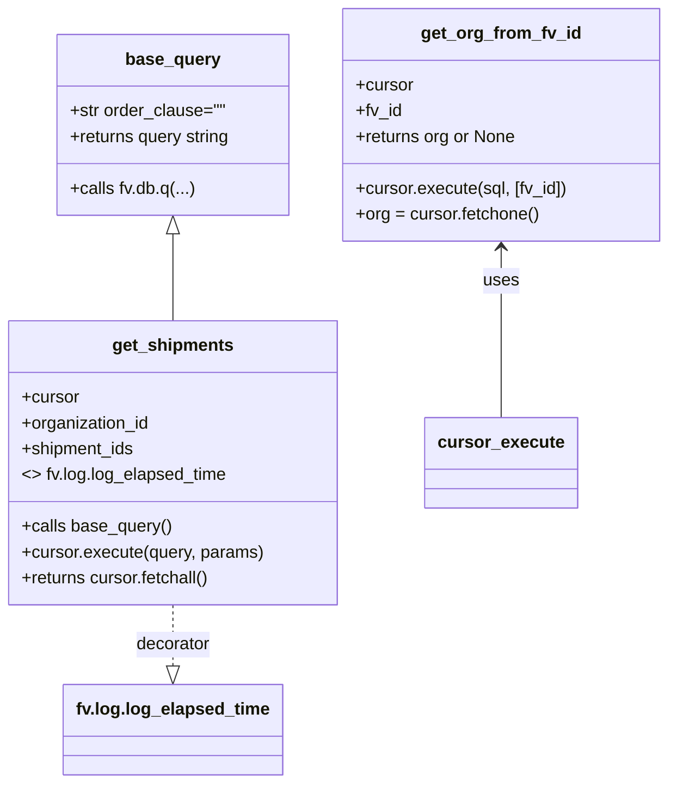

# Diagram: shipment_core/chromium_export/fv/python/fv/db/shipments.py


> Auto-generated by Obscura crawlers

## Diagram 1

```mermaid
flowchart TD
  subgraph Module[fv.shipments (module)]
    BQ[base_query(order_clause="")] -->|calls| DBq[fv.db.q]
    GS[get_shipments(cursor, organization_id, shipment_ids)] -->|calls| BQ
    GS -->|executes query| Exec1[cursor.execute(query, params)]
    Exec1 -->|returns| FetchAll[cursor.fetchall()]
    GS -->|decorated by| Log[fv.log.log_elapsed_time]
    GO[get_org_from_fv_id(cursor, fv_id)] -->|executes| Exec2[cursor.execute(sql, [fv_id])]
    Exec2 -->|returns| FetchOne[cursor.fetchone()]
    FetchOne -->|if org -> return org| ReturnOrg[return org]
    FetchOne -->|else -> return None| ReturnNone[return None]
  end
```

> SVG rendering failed for this diagram.

## Diagram 2



### SVG

<svg id="container" width="619.8515625" xmlns="http://www.w3.org/2000/svg" class="classDiagram" height="728" viewBox="0 0 619.8515625 728" role="graphics-document document" aria-roledescription="class"><style>#container{font-family:"trebuchet ms",verdana,arial,sans-serif;font-size:16px;fill:#333;}@keyframes edge-animation-frame{from{stroke-dashoffset:0;}}@keyframes dash{to{stroke-dashoffset:0;}}#container .edge-animation-slow{stroke-dasharray:9,5!important;stroke-dashoffset:900;animation:dash 50s linear infinite;stroke-linecap:round;}#container .edge-animation-fast{stroke-dasharray:9,5!important;stroke-dashoffset:900;animation:dash 20s linear infinite;stroke-linecap:round;}#container .error-icon{fill:#552222;}#container .error-text{fill:#552222;stroke:#552222;}#container .edge-thickness-normal{stroke-width:1px;}#container .edge-thickness-thick{stroke-width:3.5px;}#container .edge-pattern-solid{stroke-dasharray:0;}#container .edge-thickness-invisible{stroke-width:0;fill:none;}#container .edge-pattern-dashed{stroke-dasharray:3;}#container .edge-pattern-dotted{stroke-dasharray:2;}#container .marker{fill:#333333;stroke:#333333;}#container .marker.cross{stroke:#333333;}#container svg{font-family:"trebuchet ms",verdana,arial,sans-serif;font-size:16px;}#container p{margin:0;}#container g.classGroup text{fill:#9370DB;stroke:none;font-family:"trebuchet ms",verdana,arial,sans-serif;font-size:10px;}#container g.classGroup text .title{font-weight:bolder;}#container .nodeLabel,#container .edgeLabel{color:#131300;}#container .edgeLabel .label rect{fill:#ECECFF;}#container .label text{fill:#131300;}#container .labelBkg{background:#ECECFF;}#container .edgeLabel .label span{background:#ECECFF;}#container .classTitle{font-weight:bolder;}#container .node rect,#container .node circle,#container .node ellipse,#container .node polygon,#container .node path{fill:#ECECFF;stroke:#9370DB;stroke-width:1px;}#container .divider{stroke:#9370DB;stroke-width:1;}#container g.clickable{cursor:pointer;}#container g.classGroup rect{fill:#ECECFF;stroke:#9370DB;}#container g.classGroup line{stroke:#9370DB;stroke-width:1;}#container .classLabel .box{stroke:none;stroke-width:0;fill:#ECECFF;opacity:0.5;}#container .classLabel .label{fill:#9370DB;font-size:10px;}#container .relation{stroke:#333333;stroke-width:1;fill:none;}#container .dashed-line{stroke-dasharray:3;}#container .dotted-line{stroke-dasharray:1 2;}#container #compositionStart,#container .composition{fill:#333333!important;stroke:#333333!important;stroke-width:1;}#container #compositionEnd,#container .composition{fill:#333333!important;stroke:#333333!important;stroke-width:1;}#container #dependencyStart,#container .dependency{fill:#333333!important;stroke:#333333!important;stroke-width:1;}#container #dependencyStart,#container .dependency{fill:#333333!important;stroke:#333333!important;stroke-width:1;}#container #extensionStart,#container .extension{fill:transparent!important;stroke:#333333!important;stroke-width:1;}#container #extensionEnd,#container .extension{fill:transparent!important;stroke:#333333!important;stroke-width:1;}#container #aggregationStart,#container .aggregation{fill:transparent!important;stroke:#333333!important;stroke-width:1;}#container #aggregationEnd,#container .aggregation{fill:transparent!important;stroke:#333333!important;stroke-width:1;}#container #lollipopStart,#container .lollipop{fill:#ECECFF!important;stroke:#333333!important;stroke-width:1;}#container #lollipopEnd,#container .lollipop{fill:#ECECFF!important;stroke:#333333!important;stroke-width:1;}#container .edgeTerminals{font-size:11px;line-height:initial;}#container .classTitleText{text-anchor:middle;font-size:18px;fill:#333;}#container .label-icon{display:inline-block;height:1em;overflow:visible;vertical-align:-0.125em;}#container .node .label-icon path{fill:currentColor;stroke:revert;stroke-width:revert;}#container :root{--mermaid-font-family:"trebuchet ms",verdana,arial,sans-serif;}</style><g><defs><marker id="container_class-aggregationStart" class="marker aggregation class" refX="18" refY="7" markerWidth="190" markerHeight="240" orient="auto"><path d="M 18,7 L9,13 L1,7 L9,1 Z"></path></marker></defs><defs><marker id="container_class-aggregationEnd" class="marker aggregation class" refX="1" refY="7" markerWidth="20" markerHeight="28" orient="auto"><path d="M 18,7 L9,13 L1,7 L9,1 Z"></path></marker></defs><defs><marker id="container_class-extensionStart" class="marker extension class" refX="18" refY="7" markerWidth="190" markerHeight="240" orient="auto"><path d="M 1,7 L18,13 V 1 Z"></path></marker></defs><defs><marker id="container_class-extensionEnd" class="marker extension class" refX="1" refY="7" markerWidth="20" markerHeight="28" orient="auto"><path d="M 1,1 V 13 L18,7 Z"></path></marker></defs><defs><marker id="container_class-compositionStart" class="marker composition class" refX="18" refY="7" markerWidth="190" markerHeight="240" orient="auto"><path d="M 18,7 L9,13 L1,7 L9,1 Z"></path></marker></defs><defs><marker id="container_class-compositionEnd" class="marker composition class" refX="1" refY="7" markerWidth="20" markerHeight="28" orient="auto"><path d="M 18,7 L9,13 L1,7 L9,1 Z"></path></marker></defs><defs><marker id="container_class-dependencyStart" class="marker dependency class" refX="6" refY="7" markerWidth="190" markerHeight="240" orient="auto"><path d="M 5,7 L9,13 L1,7 L9,1 Z"></path></marker></defs><defs><marker id="container_class-dependencyEnd" class="marker dependency class" refX="13" refY="7" markerWidth="20" markerHeight="28" orient="auto"><path d="M 18,7 L9,13 L14,7 L9,1 Z"></path></marker></defs><defs><marker id="container_class-lollipopStart" class="marker lollipop class" refX="13" refY="7" markerWidth="190" markerHeight="240" orient="auto"><circle stroke="black" fill="transparent" cx="7" cy="7" r="6"></circle></marker></defs><defs><marker id="container_class-lollipopEnd" class="marker lollipop class" refX="1" refY="7" markerWidth="190" markerHeight="240" orient="auto"><circle stroke="black" fill="transparent" cx="7" cy="7" r="6"></circle></marker></defs><g class="root"><g class="clusters"></g><g class="edgePaths"><path d="M159.625,217.25L159.625,224.542C159.625,231.833,159.625,246.417,159.625,259.875C159.625,273.333,159.625,285.667,159.625,291.833L159.625,298" id="id_base_query_get_shipments_1" class="edge-thickness-normal edge-pattern-solid relation" style=";;;" data-edge="true" data-et="edge" data-id="id_base_query_get_shipments_1" data-points="W3sieCI6MTU5LjYyNSwieSI6MjAwfSx7IngiOjE1OS42MjUsInkiOjI2MX0seyJ4IjoxNTkuNjI1LCJ5IjoyOTh9XQ==" marker-start="url(#container_class-extensionStart)"></path><path d="M159.625,562L159.625,568.167C159.625,574.333,159.625,586.667,159.625,596.125C159.625,605.583,159.625,612.167,159.625,615.458L159.625,618.75" id="id_get_shipments_fv.log.log_elapsed_time_2" class="edge-thickness-normal edge-pattern-dashed relation" style=";;;" data-edge="true" data-et="edge" data-id="id_get_shipments_fv.log.log_elapsed_time_2" data-points="W3sieCI6MTU5LjYyNSwieSI6NTYyfSx7IngiOjE1OS42MjUsInkiOjU5OX0seyJ4IjoxNTkuNjI1LCJ5Ijo2MzZ9XQ==" marker-end="url(#container_class-extensionEnd)"></path><path d="M465.375,230L465.375,235.167C465.375,240.333,465.375,250.667,465.375,277C465.375,303.333,465.375,345.667,465.375,366.833L465.375,388" id="id_get_org_from_fv_id_cursor_execute_3" class="edge-thickness-normal edge-pattern-solid relation" style=";;;" data-edge="true" data-et="edge" data-id="id_get_org_from_fv_id_cursor_execute_3" data-points="W3sieCI6NDY1LjM3NSwieSI6MjI0fSx7IngiOjQ2NS4zNzUsInkiOjI2MX0seyJ4Ijo0NjUuMzc1LCJ5IjozODh9XQ==" marker-start="url(#container_class-dependencyStart)"></path></g><g class="edgeLabels"><g class="edgeLabel"><g class="label" data-id="id_base_query_get_shipments_1" transform="translate(0, 0)"><foreignObject width="0" height="0"><div xmlns="http://www.w3.org/1999/xhtml" class="labelBkg" style="display: table-cell; white-space: nowrap; line-height: 1.5; max-width: 200px; text-align: center;"><span class="edgeLabel"></span></div></foreignObject></g></g><g class="edgeLabel" transform="translate(159.625, 599)"><g class="label" data-id="id_get_shipments_fv.log.log_elapsed_time_2" transform="translate(-35.171875, -12)"><foreignObject width="70.34375" height="24"><div xmlns="http://www.w3.org/1999/xhtml" class="labelBkg" style="display: table-cell; white-space: nowrap; line-height: 1.5; max-width: 200px; text-align: center;"><span class="edgeLabel"><p>decorator</p></span></div></foreignObject></g></g><g class="edgeLabel" transform="translate(465.375, 261)"><g class="label" data-id="id_get_org_from_fv_id_cursor_execute_3" transform="translate(-16.4921875, -12)"><foreignObject width="32.984375" height="24"><div xmlns="http://www.w3.org/1999/xhtml" class="labelBkg" style="display: table-cell; white-space: nowrap; line-height: 1.5; max-width: 200px; text-align: center;"><span class="edgeLabel"><p>uses</p></span></div></foreignObject></g></g></g><g class="nodes"><g class="node default" id="classId-base_query-0" transform="translate(159.625, 116)"><g class="basic label-container"><path d="M-109.2734375 -84 L109.2734375 -84 L109.2734375 84 L-109.2734375 84" stroke="none" stroke-width="0" fill="#ECECFF" style=""></path><path d="M-109.2734375 -84 C-27.331752630776748 -84, 54.609932238446504 -84, 109.2734375 -84 M-109.2734375 -84 C-52.62334989494131 -84, 4.026737710117374 -84, 109.2734375 -84 M109.2734375 -84 C109.2734375 -40.48507741449437, 109.2734375 3.02984517101126, 109.2734375 84 M109.2734375 -84 C109.2734375 -23.775709469518766, 109.2734375 36.44858106096247, 109.2734375 84 M109.2734375 84 C64.31083692505007 84, 19.348236350100137 84, -109.2734375 84 M109.2734375 84 C50.71048730164461 84, -7.852462896710776 84, -109.2734375 84 M-109.2734375 84 C-109.2734375 21.896676746975196, -109.2734375 -40.20664650604961, -109.2734375 -84 M-109.2734375 84 C-109.2734375 45.85882947662917, -109.2734375 7.717658953258336, -109.2734375 -84" stroke="#9370DB" stroke-width="1.3" fill="none" stroke-dasharray="0 0" style=""></path></g><g class="annotation-group text" transform="translate(0, -60)"></g><g class="label-group text" transform="translate(-42.265625, -60)"><g class="label" style="font-weight: bolder" transform="translate(0,-12)"><foreignObject width="84.53125" height="24"><div xmlns="http://www.w3.org/1999/xhtml" style="display: table-cell; white-space: nowrap; line-height: 1.5; max-width: 134px; text-align: center;"><span class="nodeLabel markdown-node-label" style=""><p>base_query</p></span></div></foreignObject></g></g><g class="members-group text" transform="translate(-97.2734375, -12)"><g class="label" style="" transform="translate(0,-12)"><foreignObject width="145.109375" height="24"><div xmlns="http://www.w3.org/1999/xhtml" style="display: table-cell; white-space: nowrap; line-height: 1.5; max-width: 202px; text-align: center;"><span class="nodeLabel markdown-node-label" style=""><p>+str order_clause=""</p></span></div></foreignObject></g><g class="label" style="" transform="translate(0,12)"><foreignObject width="152.28125" height="24"><div xmlns="http://www.w3.org/1999/xhtml" style="display: table-cell; white-space: nowrap; line-height: 1.5; max-width: 210px; text-align: center;"><span class="nodeLabel markdown-node-label" style=""><p>+returns query string</p></span></div></foreignObject></g></g><g class="methods-group text" transform="translate(-97.2734375, 60)"><g class="label" style="" transform="translate(0,-12)"><foreignObject width="115.4375" height="24"><div xmlns="http://www.w3.org/1999/xhtml" style="display: table-cell; white-space: nowrap; line-height: 1.5; max-width: 173px; text-align: center;"><span class="nodeLabel markdown-node-label" style=""><p>+calls fv.db.q(...)</p></span></div></foreignObject></g></g><g class="divider" style=""><path d="M-109.2734375 -36 C-56.446996864251865 -36, -3.6205562285037303 -36, 109.2734375 -36 M-109.2734375 -36 C-33.77800689808686 -36, 41.717423703826285 -36, 109.2734375 -36" stroke="#9370DB" stroke-width="1.3" fill="none" stroke-dasharray="0 0" style=""></path></g><g class="divider" style=""><path d="M-109.2734375 36 C-37.427680778222566 36, 34.41807594355487 36, 109.2734375 36 M-109.2734375 36 C-27.349425399469126 36, 54.57458670106175 36, 109.2734375 36" stroke="#9370DB" stroke-width="1.3" fill="none" stroke-dasharray="0 0" style=""></path></g></g><g class="node default" id="classId-get_shipments-1" transform="translate(159.625, 430)"><g class="basic label-container"><path d="M-151.625 -132 L151.625 -132 L151.625 132 L-151.625 132" stroke="none" stroke-width="0" fill="#ECECFF" style=""></path><path d="M-151.625 -132 C-75.46450909077646 -132, 0.6959818184470805 -132, 151.625 -132 M-151.625 -132 C-86.88013800367703 -132, -22.135276007354065 -132, 151.625 -132 M151.625 -132 C151.625 -64.3084275313202, 151.625 3.3831449373595888, 151.625 132 M151.625 -132 C151.625 -64.14535392348733, 151.625 3.7092921530253307, 151.625 132 M151.625 132 C89.95654417672313 132, 28.288088353446255 132, -151.625 132 M151.625 132 C31.554087612936343 132, -88.51682477412731 132, -151.625 132 M-151.625 132 C-151.625 32.35394491146418, -151.625 -67.29211017707163, -151.625 -132 M-151.625 132 C-151.625 41.03861023172398, -151.625 -49.92277953655204, -151.625 -132" stroke="#9370DB" stroke-width="1.3" fill="none" stroke-dasharray="0 0" style=""></path></g><g class="annotation-group text" transform="translate(0, -108)"></g><g class="label-group text" transform="translate(-54.15625, -108)"><g class="label" style="font-weight: bolder" transform="translate(0,-12)"><foreignObject width="108.3125" height="24"><div xmlns="http://www.w3.org/1999/xhtml" style="display: table-cell; white-space: nowrap; line-height: 1.5; max-width: 157px; text-align: center;"><span class="nodeLabel markdown-node-label" style=""><p>get_shipments</p></span></div></foreignObject></g></g><g class="members-group text" transform="translate(-139.625, -60)"><g class="label" style="" transform="translate(0,-12)"><foreignObject width="53.71875" height="24"><div xmlns="http://www.w3.org/1999/xhtml" style="display: table-cell; white-space: nowrap; line-height: 1.5; max-width: 112px; text-align: center;"><span class="nodeLabel markdown-node-label" style=""><p>+cursor</p></span></div></foreignObject></g><g class="label" style="" transform="translate(0,12)"><foreignObject width="120.75" height="24"><div xmlns="http://www.w3.org/1999/xhtml" style="display: table-cell; white-space: nowrap; line-height: 1.5; max-width: 178px; text-align: center;"><span class="nodeLabel markdown-node-label" style=""><p>+organization_id</p></span></div></foreignObject></g><g class="label" style="" transform="translate(0,36)"><foreignObject width="106.3125" height="24"><div xmlns="http://www.w3.org/1999/xhtml" style="display: table-cell; white-space: nowrap; line-height: 1.5; max-width: 164px; text-align: center;"><span class="nodeLabel markdown-node-label" style=""><p>+shipment_ids</p></span></div></foreignObject></g><g class="label" style="" transform="translate(0,60)"><foreignObject width="191.140625" height="24"><div xmlns="http://www.w3.org/1999/xhtml" style="display: table-cell; white-space: nowrap; line-height: 1.5; max-width: 281px; text-align: center;"><span class="nodeLabel markdown-node-label" style=""><p>&lt;&gt; fv.log.log_elapsed_time</p></span></div></foreignObject></g></g><g class="methods-group text" transform="translate(-139.625, 60)"><g class="label" style="" transform="translate(0,-12)"><foreignObject width="138.890625" height="24"><div xmlns="http://www.w3.org/1999/xhtml" style="display: table-cell; white-space: nowrap; line-height: 1.5; max-width: 196px; text-align: center;"><span class="nodeLabel markdown-node-label" style=""><p>+calls base_query()</p></span></div></foreignObject></g><g class="label" style="" transform="translate(0,12)"><foreignObject width="225.09375" height="24"><div xmlns="http://www.w3.org/1999/xhtml" style="display: table-cell; white-space: nowrap; line-height: 1.5; max-width: 282px; text-align: center;"><span class="nodeLabel markdown-node-label" style=""><p>+cursor.execute(query, params)</p></span></div></foreignObject></g><g class="label" style="" transform="translate(0,36)"><foreignObject width="177.59375" height="24"><div xmlns="http://www.w3.org/1999/xhtml" style="display: table-cell; white-space: nowrap; line-height: 1.5; max-width: 235px; text-align: center;"><span class="nodeLabel markdown-node-label" style=""><p>+returns cursor.fetchall()</p></span></div></foreignObject></g></g><g class="divider" style=""><path d="M-151.625 -84 C-38.733129133291285 -84, 74.15874173341743 -84, 151.625 -84 M-151.625 -84 C-48.127251328057014 -84, 55.37049734388597 -84, 151.625 -84" stroke="#9370DB" stroke-width="1.3" fill="none" stroke-dasharray="0 0" style=""></path></g><g class="divider" style=""><path d="M-151.625 36 C-38.039512148064645 36, 75.54597570387071 36, 151.625 36 M-151.625 36 C-67.52471629622167 36, 16.57556740755666 36, 151.625 36" stroke="#9370DB" stroke-width="1.3" fill="none" stroke-dasharray="0 0" style=""></path></g></g><g class="node default" id="classId-get_org_from_fv_id-2" transform="translate(465.375, 116)"><g class="basic label-container"><path d="M-146.4765625 -108 L146.4765625 -108 L146.4765625 108 L-146.4765625 108" stroke="none" stroke-width="0" fill="#ECECFF" style=""></path><path d="M-146.4765625 -108 C-30.568437001067196 -108, 85.33968849786561 -108, 146.4765625 -108 M-146.4765625 -108 C-84.55885090562523 -108, -22.641139311250456 -108, 146.4765625 -108 M146.4765625 -108 C146.4765625 -51.26191873221784, 146.4765625 5.476162535564313, 146.4765625 108 M146.4765625 -108 C146.4765625 -51.75055265493349, 146.4765625 4.498894690133014, 146.4765625 108 M146.4765625 108 C65.34035793230264 108, -15.795846635394724 108, -146.4765625 108 M146.4765625 108 C53.858751926307505 108, -38.75905864738499 108, -146.4765625 108 M-146.4765625 108 C-146.4765625 30.630986259726697, -146.4765625 -46.738027480546606, -146.4765625 -108 M-146.4765625 108 C-146.4765625 26.568067327613704, -146.4765625 -54.86386534477259, -146.4765625 -108" stroke="#9370DB" stroke-width="1.3" fill="none" stroke-dasharray="0 0" style=""></path></g><g class="annotation-group text" transform="translate(0, -84)"></g><g class="label-group text" transform="translate(-71.171875, -84)"><g class="label" style="font-weight: bolder" transform="translate(0,-12)"><foreignObject width="142.34375" height="24"><div xmlns="http://www.w3.org/1999/xhtml" style="display: table-cell; white-space: nowrap; line-height: 1.5; max-width: 190px; text-align: center;"><span class="nodeLabel markdown-node-label" style=""><p>get_org_from_fv_id</p></span></div></foreignObject></g></g><g class="members-group text" transform="translate(-134.4765625, -36)"><g class="label" style="" transform="translate(0,-12)"><foreignObject width="53.71875" height="24"><div xmlns="http://www.w3.org/1999/xhtml" style="display: table-cell; white-space: nowrap; line-height: 1.5; max-width: 112px; text-align: center;"><span class="nodeLabel markdown-node-label" style=""><p>+cursor</p></span></div></foreignObject></g><g class="label" style="" transform="translate(0,12)"><foreignObject width="42.90625" height="24"><div xmlns="http://www.w3.org/1999/xhtml" style="display: table-cell; white-space: nowrap; line-height: 1.5; max-width: 100px; text-align: center;"><span class="nodeLabel markdown-node-label" style=""><p>+fv_id</p></span></div></foreignObject></g><g class="label" style="" transform="translate(0,36)"><foreignObject width="150.734375" height="24"><div xmlns="http://www.w3.org/1999/xhtml" style="display: table-cell; white-space: nowrap; line-height: 1.5; max-width: 208px; text-align: center;"><span class="nodeLabel markdown-node-label" style=""><p>+returns org or None</p></span></div></foreignObject></g></g><g class="methods-group text" transform="translate(-134.4765625, 60)"><g class="label" style="" transform="translate(0,-12)"><foreignObject width="197.78125" height="24"><div xmlns="http://www.w3.org/1999/xhtml" style="display: table-cell; white-space: nowrap; line-height: 1.5; max-width: 255px; text-align: center;"><span class="nodeLabel markdown-node-label" style=""><p>+cursor.execute(sql, [fv_id])</p></span></div></foreignObject></g><g class="label" style="" transform="translate(0,12)"><foreignObject width="170.421875" height="24"><div xmlns="http://www.w3.org/1999/xhtml" style="display: table-cell; white-space: nowrap; line-height: 1.5; max-width: 228px; text-align: center;"><span class="nodeLabel markdown-node-label" style=""><p>+org = cursor.fetchone()</p></span></div></foreignObject></g></g><g class="divider" style=""><path d="M-146.4765625 -60 C-64.58340548251114 -60, 17.30975153497772 -60, 146.4765625 -60 M-146.4765625 -60 C-39.78509326395488 -60, 66.90637597209025 -60, 146.4765625 -60" stroke="#9370DB" stroke-width="1.3" fill="none" stroke-dasharray="0 0" style=""></path></g><g class="divider" style=""><path d="M-146.4765625 36 C-61.24549374997859 36, 23.985575000042815 36, 146.4765625 36 M-146.4765625 36 C-59.51567807162493 36, 27.445206356750134 36, 146.4765625 36" stroke="#9370DB" stroke-width="1.3" fill="none" stroke-dasharray="0 0" style=""></path></g></g><g class="node default" id="classId-fv.log.log_elapsed_time-3" transform="translate(159.625, 678)"><g class="basic label-container"><path d="M-98.8828125 -42 L98.8828125 -42 L98.8828125 42 L-98.8828125 42" stroke="none" stroke-width="0" fill="#ECECFF" style=""></path><path d="M-98.8828125 -42 C-39.29707528696956 -42, 20.288661926060882 -42, 98.8828125 -42 M-98.8828125 -42 C-31.037628585835805 -42, 36.80755532832839 -42, 98.8828125 -42 M98.8828125 -42 C98.8828125 -21.75189998671014, 98.8828125 -1.5037999734202785, 98.8828125 42 M98.8828125 -42 C98.8828125 -18.357813570189215, 98.8828125 5.28437285962157, 98.8828125 42 M98.8828125 42 C28.0725797642297 42, -42.7376529715406 42, -98.8828125 42 M98.8828125 42 C28.71046256364717 42, -41.46188737270566 42, -98.8828125 42 M-98.8828125 42 C-98.8828125 24.968877551316222, -98.8828125 7.937755102632444, -98.8828125 -42 M-98.8828125 42 C-98.8828125 18.848326863221335, -98.8828125 -4.303346273557331, -98.8828125 -42" stroke="#9370DB" stroke-width="1.3" fill="none" stroke-dasharray="0 0" style=""></path></g><g class="annotation-group text" transform="translate(0, -18)"></g><g class="label-group text" transform="translate(-86.8828125, -18)"><g class="label" style="font-weight: bolder" transform="translate(0,-12)"><foreignObject width="173.765625" height="24"><div xmlns="http://www.w3.org/1999/xhtml" style="display: table-cell; white-space: nowrap; line-height: 1.5; max-width: 221px; text-align: center;"><span class="nodeLabel markdown-node-label" style=""><p>fv.log.log_elapsed_time</p></span></div></foreignObject></g></g><g class="members-group text" transform="translate(-86.8828125, 30)"></g><g class="methods-group text" transform="translate(-86.8828125, 60)"></g><g class="divider" style=""><path d="M-98.8828125 6 C-48.62623585252751 6, 1.6303407949449849 6, 98.8828125 6 M-98.8828125 6 C-57.25400468862298 6, -15.625196877245955 6, 98.8828125 6" stroke="#9370DB" stroke-width="1.3" fill="none" stroke-dasharray="0 0" style=""></path></g><g class="divider" style=""><path d="M-98.8828125 24 C-26.272019948520025 24, 46.33877260295995 24, 98.8828125 24 M-98.8828125 24 C-50.35522801160101 24, -1.8276435232020134 24, 98.8828125 24" stroke="#9370DB" stroke-width="1.3" fill="none" stroke-dasharray="0 0" style=""></path></g></g><g class="node default" id="classId-cursor_execute-4" transform="translate(465.375, 430)"><g class="basic label-container"><path d="M-66.953125 -42 L66.953125 -42 L66.953125 42 L-66.953125 42" stroke="none" stroke-width="0" fill="#ECECFF" style=""></path><path d="M-66.953125 -42 C-28.9401423934437 -42, 9.072840213112599 -42, 66.953125 -42 M-66.953125 -42 C-34.17543523119035 -42, -1.3977454623806977 -42, 66.953125 -42 M66.953125 -42 C66.953125 -23.63142877181627, 66.953125 -5.262857543632542, 66.953125 42 M66.953125 -42 C66.953125 -14.798484791449582, 66.953125 12.403030417100837, 66.953125 42 M66.953125 42 C34.98235504873877 42, 3.0115850974775427 42, -66.953125 42 M66.953125 42 C22.70226153010232 42, -21.54860193979536 42, -66.953125 42 M-66.953125 42 C-66.953125 20.71039892926334, -66.953125 -0.5792021414733171, -66.953125 -42 M-66.953125 42 C-66.953125 17.88970463723489, -66.953125 -6.220590725530222, -66.953125 -42" stroke="#9370DB" stroke-width="1.3" fill="none" stroke-dasharray="0 0" style=""></path></g><g class="annotation-group text" transform="translate(0, -18)"></g><g class="label-group text" transform="translate(-54.953125, -18)"><g class="label" style="font-weight: bolder" transform="translate(0,-12)"><foreignObject width="109.90625" height="24"><div xmlns="http://www.w3.org/1999/xhtml" style="display: table-cell; white-space: nowrap; line-height: 1.5; max-width: 158px; text-align: center;"><span class="nodeLabel markdown-node-label" style=""><p>cursor_execute</p></span></div></foreignObject></g></g><g class="members-group text" transform="translate(-54.953125, 30)"></g><g class="methods-group text" transform="translate(-54.953125, 60)"></g><g class="divider" style=""><path d="M-66.953125 6 C-33.820971910321155 6, -0.6888188206423109 6, 66.953125 6 M-66.953125 6 C-25.563615907536807 6, 15.825893184926386 6, 66.953125 6" stroke="#9370DB" stroke-width="1.3" fill="none" stroke-dasharray="0 0" style=""></path></g><g class="divider" style=""><path d="M-66.953125 24 C-15.977890695692118 24, 34.997343608615765 24, 66.953125 24 M-66.953125 24 C-37.22285936035404 24, -7.492593720708086 24, 66.953125 24" stroke="#9370DB" stroke-width="1.3" fill="none" stroke-dasharray="0 0" style=""></path></g></g></g></g></g></svg>
