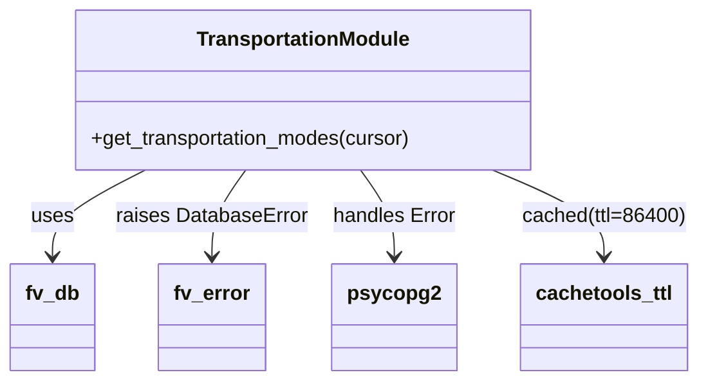

# Diagram: shipment_core/chromium_export/fv/python/fv/db/transportation_mode.py


> Auto-generated by Obscura crawlers

## Diagram 1



### SVG

<svg id="container" width="540.5234375" xmlns="http://www.w3.org/2000/svg" class="classDiagram" height="300" viewBox="0 0 540.5234375 300" role="graphics-document document" aria-roledescription="class"><style>#container{font-family:"trebuchet ms",verdana,arial,sans-serif;font-size:16px;fill:#333;}@keyframes edge-animation-frame{from{stroke-dashoffset:0;}}@keyframes dash{to{stroke-dashoffset:0;}}#container .edge-animation-slow{stroke-dasharray:9,5!important;stroke-dashoffset:900;animation:dash 50s linear infinite;stroke-linecap:round;}#container .edge-animation-fast{stroke-dasharray:9,5!important;stroke-dashoffset:900;animation:dash 20s linear infinite;stroke-linecap:round;}#container .error-icon{fill:#552222;}#container .error-text{fill:#552222;stroke:#552222;}#container .edge-thickness-normal{stroke-width:1px;}#container .edge-thickness-thick{stroke-width:3.5px;}#container .edge-pattern-solid{stroke-dasharray:0;}#container .edge-thickness-invisible{stroke-width:0;fill:none;}#container .edge-pattern-dashed{stroke-dasharray:3;}#container .edge-pattern-dotted{stroke-dasharray:2;}#container .marker{fill:#333333;stroke:#333333;}#container .marker.cross{stroke:#333333;}#container svg{font-family:"trebuchet ms",verdana,arial,sans-serif;font-size:16px;}#container p{margin:0;}#container g.classGroup text{fill:#9370DB;stroke:none;font-family:"trebuchet ms",verdana,arial,sans-serif;font-size:10px;}#container g.classGroup text .title{font-weight:bolder;}#container .nodeLabel,#container .edgeLabel{color:#131300;}#container .edgeLabel .label rect{fill:#ECECFF;}#container .label text{fill:#131300;}#container .labelBkg{background:#ECECFF;}#container .edgeLabel .label span{background:#ECECFF;}#container .classTitle{font-weight:bolder;}#container .node rect,#container .node circle,#container .node ellipse,#container .node polygon,#container .node path{fill:#ECECFF;stroke:#9370DB;stroke-width:1px;}#container .divider{stroke:#9370DB;stroke-width:1;}#container g.clickable{cursor:pointer;}#container g.classGroup rect{fill:#ECECFF;stroke:#9370DB;}#container g.classGroup line{stroke:#9370DB;stroke-width:1;}#container .classLabel .box{stroke:none;stroke-width:0;fill:#ECECFF;opacity:0.5;}#container .classLabel .label{fill:#9370DB;font-size:10px;}#container .relation{stroke:#333333;stroke-width:1;fill:none;}#container .dashed-line{stroke-dasharray:3;}#container .dotted-line{stroke-dasharray:1 2;}#container #compositionStart,#container .composition{fill:#333333!important;stroke:#333333!important;stroke-width:1;}#container #compositionEnd,#container .composition{fill:#333333!important;stroke:#333333!important;stroke-width:1;}#container #dependencyStart,#container .dependency{fill:#333333!important;stroke:#333333!important;stroke-width:1;}#container #dependencyStart,#container .dependency{fill:#333333!important;stroke:#333333!important;stroke-width:1;}#container #extensionStart,#container .extension{fill:transparent!important;stroke:#333333!important;stroke-width:1;}#container #extensionEnd,#container .extension{fill:transparent!important;stroke:#333333!important;stroke-width:1;}#container #aggregationStart,#container .aggregation{fill:transparent!important;stroke:#333333!important;stroke-width:1;}#container #aggregationEnd,#container .aggregation{fill:transparent!important;stroke:#333333!important;stroke-width:1;}#container #lollipopStart,#container .lollipop{fill:#ECECFF!important;stroke:#333333!important;stroke-width:1;}#container #lollipopEnd,#container .lollipop{fill:#ECECFF!important;stroke:#333333!important;stroke-width:1;}#container .edgeTerminals{font-size:11px;line-height:initial;}#container .classTitleText{text-anchor:middle;font-size:18px;fill:#333;}#container .label-icon{display:inline-block;height:1em;overflow:visible;vertical-align:-0.125em;}#container .node .label-icon path{fill:currentColor;stroke:revert;stroke-width:revert;}#container :root{--mermaid-font-family:"trebuchet ms",verdana,arial,sans-serif;}</style><g><defs><marker id="container_class-aggregationStart" class="marker aggregation class" refX="18" refY="7" markerWidth="190" markerHeight="240" orient="auto"><path d="M 18,7 L9,13 L1,7 L9,1 Z"></path></marker></defs><defs><marker id="container_class-aggregationEnd" class="marker aggregation class" refX="1" refY="7" markerWidth="20" markerHeight="28" orient="auto"><path d="M 18,7 L9,13 L1,7 L9,1 Z"></path></marker></defs><defs><marker id="container_class-extensionStart" class="marker extension class" refX="18" refY="7" markerWidth="190" markerHeight="240" orient="auto"><path d="M 1,7 L18,13 V 1 Z"></path></marker></defs><defs><marker id="container_class-extensionEnd" class="marker extension class" refX="1" refY="7" markerWidth="20" markerHeight="28" orient="auto"><path d="M 1,1 V 13 L18,7 Z"></path></marker></defs><defs><marker id="container_class-compositionStart" class="marker composition class" refX="18" refY="7" markerWidth="190" markerHeight="240" orient="auto"><path d="M 18,7 L9,13 L1,7 L9,1 Z"></path></marker></defs><defs><marker id="container_class-compositionEnd" class="marker composition class" refX="1" refY="7" markerWidth="20" markerHeight="28" orient="auto"><path d="M 18,7 L9,13 L1,7 L9,1 Z"></path></marker></defs><defs><marker id="container_class-dependencyStart" class="marker dependency class" refX="6" refY="7" markerWidth="190" markerHeight="240" orient="auto"><path d="M 5,7 L9,13 L1,7 L9,1 Z"></path></marker></defs><defs><marker id="container_class-dependencyEnd" class="marker dependency class" refX="13" refY="7" markerWidth="20" markerHeight="28" orient="auto"><path d="M 18,7 L9,13 L14,7 L9,1 Z"></path></marker></defs><defs><marker id="container_class-lollipopStart" class="marker lollipop class" refX="13" refY="7" markerWidth="190" markerHeight="240" orient="auto"><circle stroke="black" fill="transparent" cx="7" cy="7" r="6"></circle></marker></defs><defs><marker id="container_class-lollipopEnd" class="marker lollipop class" refX="1" refY="7" markerWidth="190" markerHeight="240" orient="auto"><circle stroke="black" fill="transparent" cx="7" cy="7" r="6"></circle></marker></defs><g class="root"><g class="clusters"></g><g class="edgePaths"><path d="M112.586,134L100.537,140.167C88.487,146.333,64.388,158.667,52.339,170C40.289,181.333,40.289,191.667,40.289,196.833L40.289,202" id="id_TransportationModule_fv_db_1" class="edge-thickness-normal edge-pattern-solid relation" style=";;;" data-edge="true" data-et="edge" data-id="id_TransportationModule_fv_db_1" data-points="W3sieCI6MTEyLjU4NjQ4NDM3NSwieSI6MTM0fSx7IngiOjQwLjI4OTA2MjUsInkiOjE3MX0seyJ4Ijo0MC4yODkwNjI1LCJ5IjoyMDh9XQ==" marker-end="url(#container_class-dependencyEnd)"></path><path d="M190.377,134L185.942,140.167C181.506,146.333,172.636,158.667,168.201,170C163.766,181.333,163.766,191.667,163.766,196.833L163.766,202" id="id_TransportationModule_fv_error_2" class="edge-thickness-normal edge-pattern-solid relation" style=";;;" data-edge="true" data-et="edge" data-id="id_TransportationModule_fv_error_2" data-points="W3sieCI6MTkwLjM3NjcxODc1LCJ5IjoxMzR9LHsieCI6MTYzLjc2NTYyNSwieSI6MTcxfSx7IngiOjE2My43NjU2MjUsInkiOjIwOH1d" marker-end="url(#container_class-dependencyEnd)"></path><path d="M280.998,134L285.433,140.167C289.869,146.333,298.739,158.667,303.174,170C307.609,181.333,307.609,191.667,307.609,196.833L307.609,202" id="id_TransportationModule_psycopg2_3" class="edge-thickness-normal edge-pattern-solid relation" style=";;;" data-edge="true" data-et="edge" data-id="id_TransportationModule_psycopg2_3" data-points="W3sieCI6MjgwLjk5ODI4MTI1LCJ5IjoxMzR9LHsieCI6MzA3LjYwOTM3NSwieSI6MTcxfSx7IngiOjMwNy42MDkzNzUsInkiOjIwOH1d" marker-end="url(#container_class-dependencyEnd)"></path><path d="M381.847,134L396.154,140.167C410.461,146.333,439.074,158.667,453.381,170C467.688,181.333,467.688,191.667,467.688,196.833L467.688,202" id="id_TransportationModule_cachetools_ttl_4" class="edge-thickness-normal edge-pattern-solid relation" style=";;;" data-edge="true" data-et="edge" data-id="id_TransportationModule_cachetools_ttl_4" data-points="W3sieCI6MzgxLjg0NzQ5OTk5OTk5OTk3LCJ5IjoxMzR9LHsieCI6NDY3LjY4NzUsInkiOjE3MX0seyJ4Ijo0NjcuNjg3NSwieSI6MjA4fV0=" marker-end="url(#container_class-dependencyEnd)"></path></g><g class="edgeLabels"><g class="edgeLabel" transform="translate(40.2890625, 171)"><g class="label" data-id="id_TransportationModule_fv_db_1" transform="translate(-16.4921875, -12)"><foreignObject width="32.984375" height="24"><div xmlns="http://www.w3.org/1999/xhtml" class="labelBkg" style="display: table-cell; white-space: nowrap; line-height: 1.5; max-width: 200px; text-align: center;"><span class="edgeLabel"><p>uses</p></span></div></foreignObject></g></g><g class="edgeLabel" transform="translate(163.765625, 171)"><g class="label" data-id="id_TransportationModule_fv_error_2" transform="translate(-74.9140625, -12)"><foreignObject width="149.828125" height="24"><div xmlns="http://www.w3.org/1999/xhtml" class="labelBkg" style="display: table-cell; white-space: nowrap; line-height: 1.5; max-width: 200px; text-align: center;"><span class="edgeLabel"><p>raises DatabaseError</p></span></div></foreignObject></g></g><g class="edgeLabel" transform="translate(307.609375, 171)"><g class="label" data-id="id_TransportationModule_psycopg2_3" transform="translate(-48.9296875, -12)"><foreignObject width="97.859375" height="24"><div xmlns="http://www.w3.org/1999/xhtml" class="labelBkg" style="display: table-cell; white-space: nowrap; line-height: 1.5; max-width: 200px; text-align: center;"><span class="edgeLabel"><p>handles Error</p></span></div></foreignObject></g></g><g class="edgeLabel" transform="translate(467.6875, 171)"><g class="label" data-id="id_TransportationModule_cachetools_ttl_4" transform="translate(-64.8359375, -12)"><foreignObject width="129.671875" height="24"><div xmlns="http://www.w3.org/1999/xhtml" class="labelBkg" style="display: table-cell; white-space: nowrap; line-height: 1.5; max-width: 200px; text-align: center;"><span class="edgeLabel"><p>cached(ttl=86400)</p></span></div></foreignObject></g></g></g><g class="nodes"><g class="node default" id="classId-TransportationModule-0" transform="translate(235.6875, 71)"><g class="basic label-container"><path d="M-181.375 -63 L181.375 -63 L181.375 63 L-181.375 63" stroke="none" stroke-width="0" fill="#ECECFF" style=""></path><path d="M-181.375 -63 C-66.00760261290449 -63, 49.359794774191016 -63, 181.375 -63 M-181.375 -63 C-106.60273689920113 -63, -31.830473798402267 -63, 181.375 -63 M181.375 -63 C181.375 -31.171701346471195, 181.375 0.6565973070576092, 181.375 63 M181.375 -63 C181.375 -13.900588320943037, 181.375 35.19882335811393, 181.375 63 M181.375 63 C49.45867548276607 63, -82.45764903446786 63, -181.375 63 M181.375 63 C49.728726171046844 63, -81.91754765790631 63, -181.375 63 M-181.375 63 C-181.375 27.631265544141954, -181.375 -7.737468911716093, -181.375 -63 M-181.375 63 C-181.375 24.284664423684653, -181.375 -14.430671152630694, -181.375 -63" stroke="#9370DB" stroke-width="1.3" fill="none" stroke-dasharray="0 0" style=""></path></g><g class="annotation-group text" transform="translate(0, -39)"></g><g class="label-group text" transform="translate(-81.625, -39)"><g class="label" style="font-weight: bolder" transform="translate(0,-12)"><foreignObject width="163.25" height="24"><div xmlns="http://www.w3.org/1999/xhtml" style="display: table-cell; white-space: nowrap; line-height: 1.5; max-width: 211px; text-align: center;"><span class="nodeLabel markdown-node-label" style=""><p>TransportationModule</p></span></div></foreignObject></g></g><g class="members-group text" transform="translate(-169.375, 9)"></g><g class="methods-group text" transform="translate(-169.375, 39)"><g class="label" style="" transform="translate(0,-12)"><foreignObject width="257.125" height="24"><div xmlns="http://www.w3.org/1999/xhtml" style="display: table-cell; white-space: nowrap; line-height: 1.5; max-width: 314px; text-align: center;"><span class="nodeLabel markdown-node-label" style=""><p>+get_transportation_modes(cursor)</p></span></div></foreignObject></g></g><g class="divider" style=""><path d="M-181.375 -15 C-86.72896103578306 -15, 7.9170779284338835 -15, 181.375 -15 M-181.375 -15 C-71.33209286731352 -15, 38.71081426537296 -15, 181.375 -15" stroke="#9370DB" stroke-width="1.3" fill="none" stroke-dasharray="0 0" style=""></path></g><g class="divider" style=""><path d="M-181.375 9 C-79.96008725456814 9, 21.454825490863726 9, 181.375 9 M-181.375 9 C-104.84994773865759 9, -28.32489547731518 9, 181.375 9" stroke="#9370DB" stroke-width="1.3" fill="none" stroke-dasharray="0 0" style=""></path></g></g><g class="node default" id="classId-fv_db-1" transform="translate(40.2890625, 250)"><g class="basic label-container"><path d="M-32.2890625 -42 L32.2890625 -42 L32.2890625 42 L-32.2890625 42" stroke="none" stroke-width="0" fill="#ECECFF" style=""></path><path d="M-32.2890625 -42 C-12.403923780391793 -42, 7.4812149392164145 -42, 32.2890625 -42 M-32.2890625 -42 C-10.653779102736664 -42, 10.981504294526673 -42, 32.2890625 -42 M32.2890625 -42 C32.2890625 -12.267980757015955, 32.2890625 17.46403848596809, 32.2890625 42 M32.2890625 -42 C32.2890625 -13.50083656997814, 32.2890625 14.998326860043719, 32.2890625 42 M32.2890625 42 C10.825193313446004 42, -10.638675873107992 42, -32.2890625 42 M32.2890625 42 C9.500339087394096 42, -13.288384325211808 42, -32.2890625 42 M-32.2890625 42 C-32.2890625 10.999995794967578, -32.2890625 -20.000008410064844, -32.2890625 -42 M-32.2890625 42 C-32.2890625 24.859963399768873, -32.2890625 7.719926799537745, -32.2890625 -42" stroke="#9370DB" stroke-width="1.3" fill="none" stroke-dasharray="0 0" style=""></path></g><g class="annotation-group text" transform="translate(0, -18)"></g><g class="label-group text" transform="translate(-20.2890625, -18)"><g class="label" style="font-weight: bolder" transform="translate(0,-12)"><foreignObject width="40.578125" height="24"><div xmlns="http://www.w3.org/1999/xhtml" style="display: table-cell; white-space: nowrap; line-height: 1.5; max-width: 90px; text-align: center;"><span class="nodeLabel markdown-node-label" style=""><p>fv_db</p></span></div></foreignObject></g></g><g class="members-group text" transform="translate(-20.2890625, 30)"></g><g class="methods-group text" transform="translate(-20.2890625, 60)"></g><g class="divider" style=""><path d="M-32.2890625 6 C-12.657691431079428 6, 6.973679637841144 6, 32.2890625 6 M-32.2890625 6 C-19.127478593804195 6, -5.96589468760839 6, 32.2890625 6" stroke="#9370DB" stroke-width="1.3" fill="none" stroke-dasharray="0 0" style=""></path></g><g class="divider" style=""><path d="M-32.2890625 24 C-18.269735336757424 24, -4.250408173514849 24, 32.2890625 24 M-32.2890625 24 C-17.488112623998006 24, -2.687162747996009 24, 32.2890625 24" stroke="#9370DB" stroke-width="1.3" fill="none" stroke-dasharray="0 0" style=""></path></g></g><g class="node default" id="classId-fv_error-2" transform="translate(163.765625, 250)"><g class="basic label-container"><path d="M-41.1875 -42 L41.1875 -42 L41.1875 42 L-41.1875 42" stroke="none" stroke-width="0" fill="#ECECFF" style=""></path><path d="M-41.1875 -42 C-21.754415028025203 -42, -2.3213300560504067 -42, 41.1875 -42 M-41.1875 -42 C-20.74828280198018 -42, -0.309065603960363 -42, 41.1875 -42 M41.1875 -42 C41.1875 -18.552993378946404, 41.1875 4.894013242107192, 41.1875 42 M41.1875 -42 C41.1875 -18.187610134952713, 41.1875 5.624779730094573, 41.1875 42 M41.1875 42 C18.950446466762298 42, -3.286607066475405 42, -41.1875 42 M41.1875 42 C23.435287326545435 42, 5.68307465309087 42, -41.1875 42 M-41.1875 42 C-41.1875 21.808514830815422, -41.1875 1.6170296616308448, -41.1875 -42 M-41.1875 42 C-41.1875 9.607324618737039, -41.1875 -22.785350762525923, -41.1875 -42" stroke="#9370DB" stroke-width="1.3" fill="none" stroke-dasharray="0 0" style=""></path></g><g class="annotation-group text" transform="translate(0, -18)"></g><g class="label-group text" transform="translate(-29.1875, -18)"><g class="label" style="font-weight: bolder" transform="translate(0,-12)"><foreignObject width="58.375" height="24"><div xmlns="http://www.w3.org/1999/xhtml" style="display: table-cell; white-space: nowrap; line-height: 1.5; max-width: 108px; text-align: center;"><span class="nodeLabel markdown-node-label" style=""><p>fv_error</p></span></div></foreignObject></g></g><g class="members-group text" transform="translate(-29.1875, 30)"></g><g class="methods-group text" transform="translate(-29.1875, 60)"></g><g class="divider" style=""><path d="M-41.1875 6 C-13.8643151182033 6, 13.458869763593398 6, 41.1875 6 M-41.1875 6 C-9.691247216446921 6, 21.805005567106157 6, 41.1875 6" stroke="#9370DB" stroke-width="1.3" fill="none" stroke-dasharray="0 0" style=""></path></g><g class="divider" style=""><path d="M-41.1875 24 C-15.871002435568947 24, 9.445495128862106 24, 41.1875 24 M-41.1875 24 C-24.07929195459607 24, -6.971083909192139 24, 41.1875 24" stroke="#9370DB" stroke-width="1.3" fill="none" stroke-dasharray="0 0" style=""></path></g></g><g class="node default" id="classId-psycopg2-3" transform="translate(307.609375, 250)"><g class="basic label-container"><path d="M-46.234375 -42 L46.234375 -42 L46.234375 42 L-46.234375 42" stroke="none" stroke-width="0" fill="#ECECFF" style=""></path><path d="M-46.234375 -42 C-12.222307336250609 -42, 21.789760327498783 -42, 46.234375 -42 M-46.234375 -42 C-22.939295389704565 -42, 0.3557842205908699 -42, 46.234375 -42 M46.234375 -42 C46.234375 -8.889961548266442, 46.234375 24.220076903467117, 46.234375 42 M46.234375 -42 C46.234375 -16.703876741301087, 46.234375 8.592246517397825, 46.234375 42 M46.234375 42 C14.310717911474786 42, -17.61293917705043 42, -46.234375 42 M46.234375 42 C17.3550523317618 42, -11.524270336476398 42, -46.234375 42 M-46.234375 42 C-46.234375 15.95175724283024, -46.234375 -10.09648551433952, -46.234375 -42 M-46.234375 42 C-46.234375 19.586147325332025, -46.234375 -2.8277053493359503, -46.234375 -42" stroke="#9370DB" stroke-width="1.3" fill="none" stroke-dasharray="0 0" style=""></path></g><g class="annotation-group text" transform="translate(0, -18)"></g><g class="label-group text" transform="translate(-34.234375, -18)"><g class="label" style="font-weight: bolder" transform="translate(0,-12)"><foreignObject width="68.46875" height="24"><div xmlns="http://www.w3.org/1999/xhtml" style="display: table-cell; white-space: nowrap; line-height: 1.5; max-width: 117px; text-align: center;"><span class="nodeLabel markdown-node-label" style=""><p>psycopg2</p></span></div></foreignObject></g></g><g class="members-group text" transform="translate(-34.234375, 30)"></g><g class="methods-group text" transform="translate(-34.234375, 60)"></g><g class="divider" style=""><path d="M-46.234375 6 C-25.564941107716425 6, -4.8955072154328505 6, 46.234375 6 M-46.234375 6 C-23.1913960882347 6, -0.1484171764694011 6, 46.234375 6" stroke="#9370DB" stroke-width="1.3" fill="none" stroke-dasharray="0 0" style=""></path></g><g class="divider" style=""><path d="M-46.234375 24 C-21.676398631131274 24, 2.8815777377374516 24, 46.234375 24 M-46.234375 24 C-18.0750140118478 24, 10.084346976304403 24, 46.234375 24" stroke="#9370DB" stroke-width="1.3" fill="none" stroke-dasharray="0 0" style=""></path></g></g><g class="node default" id="classId-cachetools_ttl-4" transform="translate(467.6875, 250)"><g class="basic label-container"><path d="M-63.84375 -42 L63.84375 -42 L63.84375 42 L-63.84375 42" stroke="none" stroke-width="0" fill="#ECECFF" style=""></path><path d="M-63.84375 -42 C-35.32433798206816 -42, -6.804925964136324 -42, 63.84375 -42 M-63.84375 -42 C-34.15134503442734 -42, -4.458940068854666 -42, 63.84375 -42 M63.84375 -42 C63.84375 -20.108627043969097, 63.84375 1.7827459120618059, 63.84375 42 M63.84375 -42 C63.84375 -12.151902576439529, 63.84375 17.696194847120942, 63.84375 42 M63.84375 42 C13.858116096495003 42, -36.127517807009994 42, -63.84375 42 M63.84375 42 C31.20614329052008 42, -1.4314634189598365 42, -63.84375 42 M-63.84375 42 C-63.84375 17.737322057065096, -63.84375 -6.525355885869807, -63.84375 -42 M-63.84375 42 C-63.84375 23.924994381017783, -63.84375 5.849988762035565, -63.84375 -42" stroke="#9370DB" stroke-width="1.3" fill="none" stroke-dasharray="0 0" style=""></path></g><g class="annotation-group text" transform="translate(0, -18)"></g><g class="label-group text" transform="translate(-51.84375, -18)"><g class="label" style="font-weight: bolder" transform="translate(0,-12)"><foreignObject width="103.6875" height="24"><div xmlns="http://www.w3.org/1999/xhtml" style="display: table-cell; white-space: nowrap; line-height: 1.5; max-width: 152px; text-align: center;"><span class="nodeLabel markdown-node-label" style=""><p>cachetools_ttl</p></span></div></foreignObject></g></g><g class="members-group text" transform="translate(-51.84375, 30)"></g><g class="methods-group text" transform="translate(-51.84375, 60)"></g><g class="divider" style=""><path d="M-63.84375 6 C-23.92060240047043 6, 16.002545199059142 6, 63.84375 6 M-63.84375 6 C-27.85577528124744 6, 8.132199437505122 6, 63.84375 6" stroke="#9370DB" stroke-width="1.3" fill="none" stroke-dasharray="0 0" style=""></path></g><g class="divider" style=""><path d="M-63.84375 24 C-34.76117617215141 24, -5.678602344302824 24, 63.84375 24 M-63.84375 24 C-17.585312379334155 24, 28.67312524133169 24, 63.84375 24" stroke="#9370DB" stroke-width="1.3" fill="none" stroke-dasharray="0 0" style=""></path></g></g></g></g></g></svg>

## Diagram 2

```mermaid
flowchart TD
    A[Start] --> B[Call get_transportation_modes(cursor)]
    B --> C[Execute SQL: SELECT id, name FROM transportation_mode ORDER BY id]
    C --> D[fetchall() -> modes]
    D --> E[Return modes]
    C -->|psycopg2.Error| F[Catch psycopg2.Error]
    F --> G[Wrap in fv.error.DatabaseError]
    G --> H[Raise DatabaseError]
    H --> I[End (error)]
```

> SVG rendering failed for this diagram.
